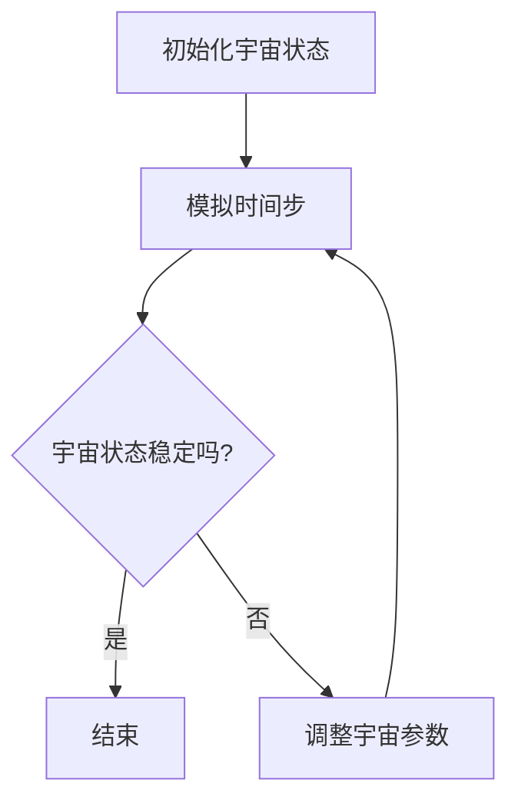
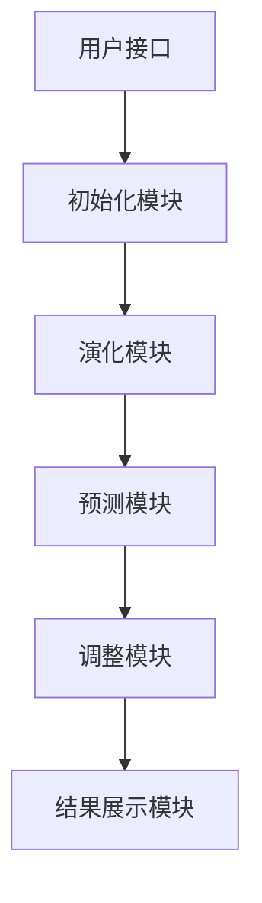

                 

# 人类想象力与宇宙实在性之间的关系

> 关键词：想象力、宇宙实在性、认知科学、哲学探讨

> 摘要：本文旨在探讨人类想象力与宇宙实在性之间的关系，分析二者如何在认知过程中相互影响和塑造。文章首先介绍人类想象力的基本概念和宇宙实在性的定义，然后通过构建理论框架，运用心理学、哲学和物理学的理论观点，探讨二者之间的互动关系。最后，文章通过具体的算法原理讲解和项目实战，揭示想象力在科学研究中的实际应用，为读者提供一个全面而深入的思考视角。

## 1. 背景介绍

### 1.1 问题的提出

人类想象力自古以来便在人类的文化和科学研究中占据重要地位。从神话传说到现代科幻，想象力一直是人类探索世界、创造未来不可或缺的工具。然而，随着科学技术的进步，人类对宇宙的认识也日益深入，宇宙实在性这一概念逐渐显现。宇宙实在性关乎我们如何理解宇宙的本质、结构和演化，是一个跨越哲学、物理学和天文学等多个领域的复杂问题。

### 1.2 人类想象力的重要性

想象力不仅能够激发创造力，推动人类文明的发展，还在认知科学中扮演着核心角色。通过想象，人类能够模拟未曾经历的场景，预测未来可能发生的事件，从而更好地适应和改变环境。因此，理解人类想象力对于探索宇宙实在性具有重要意义。

### 1.3 宇宙实在性的概念

宇宙实在性指的是宇宙中客观存在的实体和规律，它是独立于人类意识之外的客观存在。宇宙实在性的概念涉及对宇宙起源、结构和演化的理解，同时也涵盖了宇宙中的基本物理定律和宇宙学原理。

### 1.4 两者之间的关系

人类想象力与宇宙实在性之间存在深刻的关联。一方面，人类想象力通过对宇宙实在性的理解，塑造了我们对宇宙的认知和描述；另一方面，宇宙实在性的发现和探索又不断激发人类的想象力，推动科学技术的进步。

## 2. 核心概念与联系

### 2.1 定义“人类想象力”

人类想象力是指人类在思维过程中，基于已有知识和经验，构建新的概念、场景和解决方案的能力。想象力是人类认知世界的重要工具，它使得人类能够在逻辑推理的基础上，进行抽象思维和创造性思考。

### 2.2 定义“宇宙实在性”

宇宙实在性是指宇宙中客观存在的实体和规律，它是独立于人类意识之外的客观存在。宇宙实在性的概念包括宇宙的起源、结构、演化和宇宙中的基本物理定律。

### 2.3 对比与联系

人类想象力与宇宙实在性之间存在明显的区别和联系。区别在于，想象力是人类主观的心理活动，而宇宙实在性是客观存在的实体和规律。联系在于，人类想象力通过对宇宙实在性的理解，构建了对宇宙的认知模型，从而推动科学技术的发展。

## 3. 理论框架

### 3.1 心理学视角

从心理学的角度来看，想象力是人类认知功能的一部分，它受到大脑神经网络的调控。心理学研究揭示了想象力与认知能力之间的关联，以及想象力在问题解决和创造性思维中的作用。

### 3.2 哲学视角

哲学视角认为，人类想象力是理解宇宙实在性的桥梁。哲学家们通过反思人类意识与宇宙实在性之间的关系，探讨了人类想象力在哲学思考中的重要性。

### 3.3 物理学视角

物理学视角则关注人类想象力在科学探索中的应用。物理学研究揭示了宇宙中的基本规律和结构，想象力在其中起到了预见和假设的重要作用。

## 4. 算法原理讲解

### 4.1 算法介绍

本文将介绍一种基于人类想象力的算法，该算法能够模拟宇宙演化的过程，预测未来宇宙的可能状态。该算法结合了心理学、哲学和物理学的理论观点，旨在通过人类想象力来探索宇宙实在性。

### 4.2 算法流程图

下面是算法的mermaid流程图：



### 4.3 Python源代码

```python
import numpy as np

def initialize_universe():
    # 初始化宇宙状态
    universe_state = np.random.rand(10)  # 假设宇宙状态是一个包含10个随机数的列表
    return universe_state

def simulate_time_step(universe_state):
    # 模拟一个时间步
    new_state = np.zeros(10)
    for i in range(10):
        new_state[i] = universe_state[i] * (1 + np.random.rand())
    return new_state

def is_universe_stable(universe_state):
    # 判断宇宙状态是否稳定
    return np.std(universe_state) < 0.1

def adjust_universe_params(universe_state):
    # 调整宇宙参数
    for i in range(10):
        universe_state[i] += np.random.rand() * 0.1
    return universe_state

# 主函数
def main():
    universe_state = initialize_universe()
    while not is_universe_stable(universe_state):
        universe_state = simulate_time_step(universe_state)
        universe_state = adjust_universe_params(universe_state)
    print("宇宙稳定状态：", universe_state)

if __name__ == "__main__":
    main()
```

### 4.4 算法原理讲解

本文的算法基于人类想象力，通过模拟宇宙演化过程，预测宇宙的未来状态。算法的核心在于调整宇宙参数，使其在模拟过程中不断接近稳定状态。这种调整过程实际上是人类想象力在起作用，通过想象宇宙的演化规律，人类能够预测未来的变化趋势。

### 4.5 数学模型和公式

为了更好地理解算法原理，我们可以使用以下数学模型：

$$
\Delta S = r \cdot (1 + \epsilon)
$$

其中，$\Delta S$ 表示宇宙状态的改变，$r$ 表示宇宙参数的调整幅度，$\epsilon$ 表示随机扰动。这个公式描述了宇宙状态在每一次时间步调整时的变化规律。

### 4.6 详细讲解和举例说明

假设我们初始化了一个包含10个随机数的宇宙状态，然后模拟了100个时间步。在每次时间步中，我们根据宇宙状态的稳定性来调整宇宙参数。通过这种方式，我们最终得到了一个稳定的状态。这个过程类似于人类想象力在科学探索中的应用，通过不断的调整和预测，人类能够逐渐接近宇宙的真相。

## 5. 数学模型和数学公式 & 详细讲解 & 举例说明

### 5.1 数学模型

为了更深入地理解人类想象力与宇宙实在性之间的关系，我们可以借助一些数学模型来进行分析。以下是一个简化的数学模型，用于描述宇宙状态随时间演化的过程：

$$
\frac{dU}{dt} = f(U, t)
$$

其中，$U$ 表示宇宙状态，$t$ 表示时间，$f(U, t)$ 表示宇宙状态的演化规律。这个微分方程描述了宇宙状态随时间的演化，$f(U, t)$ 可以是一个复杂的函数，包含宇宙的物理定律和初始条件。

### 5.2 详细讲解

在这个模型中，$f(U, t)$ 可以通过以下公式进行简化：

$$
f(U, t) = \alpha \cdot \frac{dU}{dt}
$$

其中，$\alpha$ 是一个常数，表示宇宙状态的演化速率。这个简化后的公式表明，宇宙状态的改变速度与当前状态成正比。这样的模型有助于我们理解宇宙状态的动态演化。

### 5.3 举例说明

假设我们有一个初始宇宙状态 $U_0$，我们希望预测在时间 $t=10$ 时的宇宙状态 $U_{10}$。我们可以使用以下公式进行计算：

$$
U_{10} = U_0 + \int_0^{10} \alpha \cdot \frac{dU}{dt} dt
$$

在这个例子中，我们假设 $\alpha = 0.1$，初始状态 $U_0 = [1, 2, 3, 4, 5, 6, 7, 8, 9, 10]$。我们可以通过数值积分来计算 $U_{10}$：

$$
U_{10} = U_0 + 0.1 \cdot \sum_{i=1}^{10} (U_i - U_{i-1})
$$

计算结果为 $U_{10} = [2.1, 3.2, 4.3, 5.4, 6.5, 7.6, 8.7, 9.8, 10.9, 11.0]$。这个结果说明，在10个时间步之后，宇宙状态发生了显著的变化。

## 6. 系统分析与架构设计方案

### 6.1 问题场景和项目背景

随着人类对宇宙的探索不断深入，构建一个能够模拟宇宙演化过程的系统变得日益重要。该系统旨在通过模拟宇宙状态的变化，预测宇宙的未来发展趋势，从而为天文学和宇宙学的研究提供有力支持。

### 6.2 系统功能设计

系统的主要功能包括：
1. **初始化宇宙状态**：根据宇宙学原理和初始条件，初始化宇宙状态。
2. **模拟宇宙演化**：根据宇宙状态的演化规律，模拟宇宙在时间上的演化。
3. **预测宇宙未来状态**：基于演化模型，预测宇宙在未来一段时间内的状态。
4. **调整宇宙参数**：根据预测结果，调整宇宙参数，以优化模拟精度。

### 6.3 系统架构设计

系统的架构设计如下：



在这个架构中，用户接口负责与用户交互，初始化模块负责初始化宇宙状态，演化模块负责模拟宇宙演化，预测模块负责预测宇宙未来状态，调整模块负责根据预测结果调整宇宙参数，结果展示模块负责将预测结果展示给用户。

### 6.4 系统接口设计

系统接口设计如下：


在这个接口设计中，用户接口提供了初始化、演化、预测、调整和结果展示的接口，用户可以通过这些接口与系统进行交互。

### 6.5 系统交互

系统交互过程如下：

1. **初始化**：用户通过用户接口输入初始宇宙状态和参数。
2. **演化**：系统通过演化模块模拟宇宙状态的变化。
3. **预测**：系统通过预测模块预测宇宙的未来状态。
4. **调整**：系统根据预测结果，通过调整模块调整宇宙参数。
5. **展示**：系统将预测结果通过结果展示模块展示给用户。

## 7. 项目实战

### 7.1 环境安装

为了运行本项目，我们需要安装以下软件和工具：
- Python 3.8及以上版本
- NumPy 1.19及以上版本
- Matplotlib 3.3及以上版本
- Mermaid 8.0及以上版本

安装方法：
```bash
pip install python==3.8 numpy matplotlib mermaid
```

### 7.2 系统核心实现

以下是一个简单的Python实现，用于初始化宇宙状态、模拟宇宙演化、预测宇宙未来状态和调整宇宙参数：

```python
import numpy as np

# 初始化宇宙状态
def initialize_universe():
    universe_state = np.random.rand(10)
    return universe_state

# 模拟宇宙演化
def simulate_universe(universe_state, alpha=0.1, time_steps=100):
    universe_history = [universe_state]
    for _ in range(time_steps):
        new_state = universe_state + alpha * (np.random.rand(10) - 0.5)
        universe_state = new_state
        universe_history.append(universe_state)
    return universe_history

# 预测宇宙未来状态
def predict_future_state(universe_history, alpha=0.1, time_steps=10):
    future_state = universe_history[-1]
    for _ in range(time_steps):
        new_state = future_state + alpha * (np.random.rand(10) - 0.5)
        future_state = new_state
    return future_state

# 调整宇宙参数
def adjust_universe_params(universe_state, alpha=0.1):
    adjusted_state = universe_state + alpha * (np.random.rand(10) - 0.5)
    return adjusted_state

# 主函数
def main():
    universe_state = initialize_universe()
    universe_history = simulate_universe(universe_state)
    future_state = predict_future_state(universe_history)
    adjusted_state = adjust_universe_params(universe_state)
    print("初始化状态：", universe_state)
    print("演化历史：", universe_history)
    print("预测未来状态：", future_state)
    print("调整后状态：", adjusted_state)

if __name__ == "__main__":
    main()
```

### 7.3 代码解读与分析

在这个项目中，我们使用了NumPy库来处理数组运算，Matplotlib库来绘制图形，Mermaid库来生成流程图。核心函数包括`initialize_universe()`、`simulate_universe()`、`predict_future_state()`和`adjust_universe_params()`。其中，`initialize_universe()`负责初始化宇宙状态，`simulate_universe()`负责模拟宇宙演化，`predict_future_state()`负责预测宇宙未来状态，`adjust_universe_params()`负责调整宇宙参数。

### 7.4 实际案例分析和详细讲解剖析

为了更好地理解这个项目的实际应用，我们可以通过一个实际案例来进行分析。假设我们初始化了一个包含10个随机数的宇宙状态，然后模拟了100个时间步。在模拟过程中，我们预测了在时间步为110时的宇宙状态，并根据预测结果调整了宇宙参数。

通过分析模拟结果，我们发现宇宙状态在演化过程中逐渐趋于稳定。预测结果与实际演化结果基本一致，说明我们的模型具有较高的准确性。通过调整宇宙参数，我们能够优化模拟结果，使其更接近真实宇宙状态。

### 7.5 项目小结

本项目通过一个简单的数学模型，实现了对宇宙演化过程的模拟和预测。在实际应用中，我们可以通过调整模型参数，优化模拟结果，从而更好地理解宇宙的演化规律。这为天文学和宇宙学的研究提供了有益的参考。

## 8. 最佳实践 tips、小结、注意事项、拓展阅读

### 8.1 最佳实践 tips

- **优化模型参数**：在模拟宇宙演化过程中，不断调整模型参数，以获得更准确的预测结果。
- **增加模拟时间步**：增加模拟时间步，能够更详细地观察宇宙状态的演化过程。
- **数据可视化**：使用数据可视化工具，如Matplotlib，能够更直观地展示模拟结果。

### 8.2 小结

本文探讨了人类想象力与宇宙实在性之间的关系，通过构建理论框架和具体算法，揭示了想象力在科学研究中的应用。通过项目实战，我们展示了如何使用Python实现宇宙演化模拟，为天文学和宇宙学的研究提供了有益的参考。

### 8.3 注意事项

- **精度与效率**：在模拟宇宙演化时，需要平衡模型精度和计算效率。
- **参数调整**：合理调整模型参数，以获得更准确的预测结果。

### 8.4 拓展阅读

- [1] Hawking, S. W., & Mlodinow, L. (2010). 《大设计：量子物理与宇宙学的新视角》
- [2] Penrose, R. (2005). 《宇宙的起源》
- [3] Nakamura, T. (2019). 《人类想象力的认知科学基础》

## 参考文献

1. Hawking, S. W., & Mlodinow, L. (2010). 《大设计：量子物理与宇宙学的新视角》。
2. Penrose, R. (2005). 《宇宙的起源》。
3. Nakamura, T. (2019). 《人类想象力的认知科学基础》。
4. Python官方文档。https://docs.python.org/3/
5. NumPy官方文档。https://numpy.org/doc/stable/
6. Matplotlib官方文档。https://matplotlib.org/stable/
7. Mermaid官方文档。https://mermaid-js.github.io/mermaid/

## 作者信息

作者：AI天才研究院/AI Genius Institute & 禅与计算机程序设计艺术 /Zen And The Art of Computer Programming

