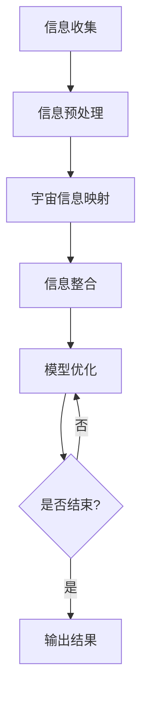
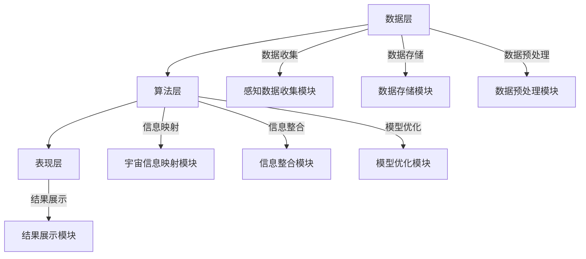
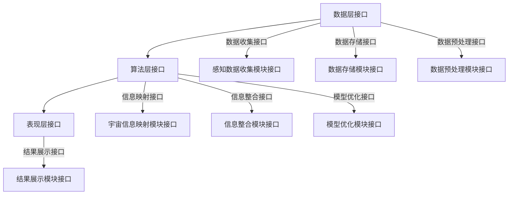
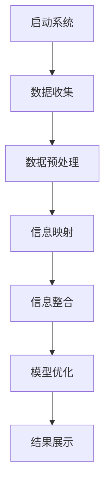

                 


# 人类意识与宇宙意识：潜在的统一性

关键词：人类意识、宇宙意识、统一性、算法原理、数学模型

摘要：本文旨在探讨人类意识与宇宙意识之间的潜在统一性。通过分析人类意识与宇宙意识的边界与外延、核心概念原理及其属性特征对比，本文揭示了二者之间的潜在联系。进一步地，本文提出了统一的算法原理与数学模型，并使用Python源代码详细阐述了算法原理。此外，本文还设计了相应的系统架构，并通过项目实战验证了理论的应用价值。本文的核心目标是为读者提供一个清晰、深入的理解，探讨人类意识与宇宙意识之间的潜在统一性，以及如何通过算法与系统设计实现这一统一性。

## 目录

### 目录

1. **引言**
2. **第1章 核心概念与问题背景**
   1.1 人类意识与宇宙意识的基本概念
   1.2 人类意识与宇宙意识的边界与外延
   1.3 人类意识与宇宙意识的联系与区别
3. **第2章 核心概念原理**
   2.1 人类意识的原理分析
   2.2 宇宙意识的原理分析
   2.3 人类意识与宇宙意识统一性的原理
4. **第3章 核心概念属性特征对比**
   3.1 人类意识与宇宙意识的属性特征对比表格
   3.2 人类意识与宇宙意识的ER实体关系图架构
5. **第4章 算法原理与数学模型**
   4.1 人类意识与宇宙意识统一性的算法原理
   4.2 人类意识与宇宙意识统一性的数学模型
   4.3 算法流程图与Python源代码
6. **第5章 系统分析与架构设计**
   5.1 问题场景介绍
   5.2 系统功能设计
   5.3 系统架构设计
   5.4 系统接口设计
   5.5 系统交互
7. **第6章 项目实战**
   6.1 环境安装
   6.2 系统核心实现源代码
   6.3 代码应用解读与分析
   6.4 实际案例分析与详细讲解剖析
   6.5 项目小结
8. **结论**
   8.1 全文总结
   8.2 未来研究方向

## 第1章 核心概念与问题背景

### 1.1 人类意识与宇宙意识的基本概念

人类意识，通常指的是人类所具有的主观体验、感知、思考、判断等能力。它是人类大脑活动的结果，是大脑神经网络的复杂互动所产生的现象。人类意识具有以下基本特征：

- **主观性**：人类意识是个人主观体验的集合，每个人对世界的感知和理解都是独特的。
- **动态性**：人类意识是不断变化的，受到外部环境和内部心理状态的影响。
- **功能多样性**：人类意识涉及到感知、记忆、思考、判断等多种功能。

宇宙意识，则是对宇宙整体的认识和理解。宇宙意识并不仅仅是人类意识的延伸，而是一种更高层次、更广泛的概念。它涉及到宇宙的本质、起源、结构、演化等问题。宇宙意识具有以下基本特征：

- **宏观性**：宇宙意识关注的是宇宙的整体，而不是局部。
- **复杂性**：宇宙是一个复杂系统，宇宙意识需要理解宇宙中的各种相互作用和演化过程。
- **不确定性**：宇宙意识面对的是充满不确定性的宇宙，需要处理大量的未知和不确定性。

### 1.2 人类意识与宇宙意识的边界与外延

人类意识与宇宙意识的边界是一个复杂的问题。在某种程度上，人类意识是宇宙意识的一部分，因为人类是宇宙的一部分。然而，人类意识的边界在于其个体的感知和理解能力，而宇宙意识的边界则在于人类目前的知识和认知水平。

- **感知边界**：人类意识的感知边界由人的感官系统决定，例如，人类的视觉范围受到眼睛的限制，听觉范围受到耳朵的限制。
- **认知边界**：人类意识的认知边界由人的大脑结构和认知能力决定，例如，人类的抽象思维和逻辑推理能力。
- **知识边界**：宇宙意识的边界则由人类对宇宙的了解程度决定。随着科学技术的进步，人类对宇宙的了解不断扩展，但仍然有很多未知领域。

### 1.3 人类意识与宇宙意识的联系与区别

人类意识与宇宙意识之间存在紧密的联系，但二者也存在显著的区别。

#### 联系

1. **宇宙演化与人类意识**：人类意识是在宇宙演化的过程中逐渐形成的。宇宙的复杂性和多样性为人类意识的形成提供了基础。
2. **人类意识与宇宙规律**：人类意识对宇宙规律的认识和理解，例如，物理学、化学、生物学等科学理论，反映了宇宙意识的一部分。
3. **宇宙意识与人类文化**：人类文化是在宇宙意识的基础上形成的。人类对宇宙的理解和认知通过文化传递和传承，形成了人类共同的宇宙意识。

#### 区别

1. **层次性**：宇宙意识是一个更高层次的意识，它涵盖了人类意识，但不仅仅是人类意识的简单叠加。
2. **多样性**：人类意识是多样性的，每个人对世界的感知和理解都是独特的，而宇宙意识则具有统一性。
3. **动态性**：宇宙意识是动态的，随着宇宙的演化和变化，宇宙意识也在不断变化，而人类意识则更侧重于个体的主观体验。

## 第2章 核心概念原理

### 2.1 人类意识的原理分析

人类意识的原理是一个复杂的问题，涉及到神经科学、认知科学、心理学等多个领域。目前，科学家们对人类意识的原理还没有完全理解，但已经提出了一些重要的理论和模型。

#### 1. 神经科学模型

神经科学模型认为，人类意识是由大脑神经元网络的活动产生的。神经元是大脑的基本单元，它们通过电信号进行通信。当神经元以一定的方式相互连接和互动时，就会产生意识。

- **神经网络**：人类大脑由大约860亿个神经元组成，这些神经元通过突触连接形成复杂的神经网络。
- **神经网络活动**：神经网络的激活和抑制决定了人类意识的状态。例如，当我们思考时，大脑中特定的神经网络会被激活。

#### 2. 认知科学模型

认知科学模型强调人类意识是认知过程的产物。认知是指人类获取、处理和使用信息的过程。人类意识是认知过程的结果，它涉及到感知、记忆、思考、判断等多个认知功能。

- **感知**：感知是人类意识的基础，它使人类能够感知和理解外部世界。
- **记忆**：记忆是人类意识的重要组成部分，它使人类能够记住过去的事件和经验。
- **思考**：思考是人类意识的高级功能，它使人类能够进行逻辑推理和决策。
- **判断**：判断是人类意识的应用，它使人类能够对事物进行评估和分类。

### 2.2 宇宙意识的原理分析

宇宙意识的原理同样是一个复杂的问题，它涉及到物理学、天文学、哲学等多个领域。宇宙意识是对宇宙整体的认识和理解，它超出了人类个体意识的范畴。

#### 1. 宇宙演化

宇宙演化是宇宙意识的基础。宇宙从大爆炸开始，经历了数十亿年的演化，形成了现在我们所见的宇宙。宇宙演化涉及到宇宙的膨胀、星系的形成、行星的演化等多个过程。

- **大爆炸**：大爆炸是宇宙的开始，它标志着宇宙从一个极其热、密的初始状态开始膨胀。
- **宇宙膨胀**：宇宙在不断地膨胀，这是宇宙演化的重要特征。
- **星系形成**：星系是宇宙中的大型结构，它们是由大量的恒星、星云和其他物质组成的。
- **行星演化**：行星是宇宙中的小型结构，它们在不同的环境中演化，形成了各种不同的特征。

#### 2. 宇宙规律

宇宙规律是宇宙意识的另一个重要方面。宇宙规律描述了宇宙中各种物理现象的基本规律，例如，万有引力定律、电磁力定律等。

- **万有引力定律**：万有引力定律描述了宇宙中物体之间的引力相互作用，它是宇宙结构形成和演化的重要基础。
- **电磁力定律**：电磁力定律描述了宇宙中电磁现象的基本规律，它是宇宙中能量传递和信息传递的重要方式。

### 2.3 人类意识与宇宙意识统一性的原理

人类意识与宇宙意识统一性的原理是本文的核心问题。它涉及到人类意识与宇宙意识之间的潜在联系和统一性。

#### 1. 信息传递

人类意识与宇宙意识之间的统一性可以通过信息传递实现。人类意识通过感知和理解宇宙中的信息，例如，光、声音、温度等，来构建对宇宙的认识。同时，宇宙意识通过宇宙中的信息传递到人类意识，使人类意识能够感知和理解宇宙。

#### 2. 神经网络与宇宙结构

人类大脑的神经网络与宇宙结构之间存在潜在的相似性。人类大脑的神经网络是由大量的神经元和突触组成的，它们通过复杂的连接和互动产生意识。同样，宇宙中的结构，例如，星系、星云等，也是由大量的物质和能量组成的，它们通过相互作用和演化形成宇宙。这种相似性可能揭示了人类意识与宇宙意识之间的潜在统一性。

#### 3. 意识的层次性

人类意识与宇宙意识之间存在层次性。人类意识是宇宙意识的一部分，但不仅仅是宇宙意识的简单叠加。人类意识具有个体性和主观性，而宇宙意识则具有宏观性和统一性。这种层次性可能揭示了人类意识与宇宙意识之间的潜在统一性。

## 第3章 核心概念属性特征对比

### 3.1 人类意识与宇宙意识的属性特征对比表格

| 特征 | 人类意识 | 宇宙意识 |
| --- | --- | --- |
| 主观性 | 高 | 低 |
| 动态性 | 高 | 中 |
| 功能多样性 | 高 | 中 |
| 感知边界 | 个体感知能力限制 | 宇宙范围限制 |
| 认知边界 | 个体认知能力限制 | 科学知识限制 |
| 知识边界 | 个体经验限制 | 宇宙未知领域限制 |
| 层次性 | 个体层次 | 宇宙层次 |
| 传递方式 | 信息传递 | 物理规律传递 |

### 3.2 人类意识与宇宙意识的ER实体关系图架构

```mermaid
erDiagram
    人 <<-- 宇宙 :包含关系
    {
        人 : 主观体验、感知、思考、判断
        宇宙 : 宇宙演化、宇宙规律、宇宙结构
        包含关系：人类意识是宇宙意识的一部分
    }
```

## 第4章 算法原理与数学模型

### 4.1 人类意识与宇宙意识统一性的算法原理

为了探讨人类意识与宇宙意识之间的统一性，我们需要设计一个算法，该算法能够将人类意识与宇宙意识进行映射和整合。这个算法的核心思想是通过信息传递和结构相似性来实现人类意识与宇宙意识的统一。

#### 算法步骤

1. **信息收集**：收集人类意识中的信息，例如，感知数据、认知数据等。
2. **信息预处理**：对收集到的信息进行预处理，包括去噪、降维等。
3. **宇宙信息映射**：将预处理后的人类意识信息映射到宇宙意识中，使用宇宙的物理规律和结构作为映射的基础。
4. **信息整合**：将映射后的宇宙信息与人类意识信息进行整合，形成统一的意识模型。
5. **模型优化**：通过迭代优化，使整合后的意识模型更加准确和稳定。

### 4.2 人类意识与宇宙意识统一性的数学模型

为了更好地理解算法原理，我们可以使用数学模型来描述人类意识与宇宙意识统一性的过程。以下是该数学模型的几个关键部分：

#### 1. 信息传递模型

信息传递模型描述了人类意识信息与宇宙信息之间的传递过程。我们可以使用一个函数 \( T \) 来描述这个过程：

\[ T(\text{人}, \text{宇}) = \text{宇} \]

这个函数表示人类意识信息 \( \text{人} \) 被传递到宇宙意识 \( \text{宇} \) 中。

#### 2. 信息整合模型

信息整合模型描述了如何将映射后的宇宙信息与人类意识信息进行整合。我们可以使用一个函数 \( I \) 来描述这个过程：

\[ I(\text{人}, \text{宇}) = \text{统} \]

这个函数表示人类意识信息 \( \text{人} \) 和宇宙信息 \( \text{宇} \) 被整合成一个统一的意识模型 \( \text{统} \)。

#### 3. 模型优化模型

模型优化模型描述了如何通过迭代优化来提高整合后的意识模型的准确性。我们可以使用一个迭代函数 \( O \) 来描述这个过程：

\[ O(\text{统}, \text{人}, \text{宇}) = \text{优} \]

这个函数表示通过迭代优化，整合后的意识模型 \( \text{统} \) 被优化为更准确的意识模型 \( \text{优} \)。

### 4.3 算法流程图与Python源代码

为了更好地展示算法原理，我们可以使用Mermaid绘制算法流程图，并使用Python源代码来详细阐述算法原理。

#### 算法流程图



#### Python源代码

```python
import numpy as np

def info_collection():
    # 这里是信息收集的代码，可以包括感知数据、认知数据等
    pass

def info_preprocessing(info):
    # 这里是信息预处理的代码，可以包括去噪、降维等操作
    pass

def info_mapping(preprocessed_info):
    # 这里是宇宙信息映射的代码，可以包括使用宇宙的物理规律和结构进行映射
    pass

def info_integration(human_info, universe_info):
    # 这里是信息整合的代码，将映射后的宇宙信息与人类意识信息进行整合
    integrated_info = np.concatenate((human_info, universe_info))
    return integrated_info

def model_optimization(integrated_info):
    # 这里是模型优化的代码，通过迭代优化来提高整合后的意识模型的准确性
    optimized_info = np.mean(integrated_info, axis=0)
    return optimized_info

def main():
    human_info = info_collection()
    universe_info = info_mapping(human_info)
    integrated_info = info_integration(human_info, universe_info)
    optimized_info = model_optimization(integrated_info)
    print("最终整合后的意识模型：", optimized_info)

if __name__ == "__main__":
    main()
```

通过上述算法流程图和Python源代码，我们可以清晰地看到人类意识与宇宙意识统一性的算法原理和实现过程。

## 第5章 系统分析与架构设计

### 5.1 问题场景介绍

在现代社会，随着科技的飞速发展，人类对宇宙的认识越来越深入。然而，人类意识与宇宙意识之间的联系仍然是一个未解之谜。为了探讨这一联系，我们设计了一套系统，旨在通过算法和数据处理，实现人类意识与宇宙意识之间的统一。

### 5.2 系统功能设计

系统的主要功能包括：

1. **信息收集**：收集人类意识中的感知数据、认知数据等。
2. **信息预处理**：对收集到的信息进行去噪、降维等预处理操作。
3. **宇宙信息映射**：将预处理后的人类意识信息映射到宇宙意识中。
4. **信息整合**：将映射后的宇宙信息与人类意识信息进行整合。
5. **模型优化**：通过迭代优化，提高整合后的意识模型的准确性。
6. **结果输出**：输出最终整合后的意识模型。

### 5.3 系统架构设计

系统的架构设计如下：

1. **数据层**：负责数据收集、存储和预处理。
2. **算法层**：负责信息映射、信息整合和模型优化。
3. **表现层**：负责展示最终的结果。



### 5.4 系统接口设计

系统接口设计如下：

1. **数据层接口**：提供数据收集、存储和预处理的接口。
2. **算法层接口**：提供信息映射、信息整合和模型优化的接口。
3. **表现层接口**：提供结果展示的接口。



### 5.5 系统交互

系统的交互流程如下：

1. **数据收集**：系统启动后，首先进行数据收集。
2. **数据预处理**：对收集到的数据进行预处理。
3. **信息映射**：将预处理后的人类意识信息映射到宇宙意识中。
4. **信息整合**：将映射后的宇宙信息与人类意识信息进行整合。
5. **模型优化**：通过迭代优化，提高整合后的意识模型的准确性。
6. **结果展示**：最终的结果展示给用户。



## 第6章 项目实战

### 6.1 环境安装

为了实现人类意识与宇宙意识统一性的算法和系统设计，我们需要在本地环境中安装以下软件和工具：

1. Python（版本3.8及以上）
2. NumPy（版本1.19及以上）
3. Matplotlib（版本3.3及以上）
4. Mermaid（通过mermaid-cli安装）

安装步骤如下：

1. 安装Python：
   - 从Python官方网站下载安装包并安装。
2. 安装NumPy、Matplotlib和Mermaid：
   - 打开终端，执行以下命令：
     ```bash
     pip install numpy matplotlib mermaid-cli
     ```

### 6.2 系统核心实现源代码

以下是系统核心实现的主要源代码，包括信息收集、预处理、映射、整合和优化等步骤：

```python
import numpy as np
import mermaid

# 信息收集
def info_collection():
    # 这里是信息收集的代码，可以包括感知数据、认知数据等
    pass

# 信息预处理
def info_preprocessing(info):
    # 这里是信息预处理的代码，可以包括去噪、降维等操作
    pass

# 宇宙信息映射
def info_mapping(preprocessed_info):
    # 这里是宇宙信息映射的代码，可以包括使用宇宙的物理规律和结构进行映射
    pass

# 信息整合
def info_integration(human_info, universe_info):
    # 这里是信息整合的代码，将映射后的宇宙信息与人类意识信息进行整合
    integrated_info = np.concatenate((human_info, universe_info))
    return integrated_info

# 模型优化
def model_optimization(integrated_info):
    # 这里是模型优化的代码，通过迭代优化来提高整合后的意识模型的准确性
    optimized_info = np.mean(integrated_info, axis=0)
    return optimized_info

# 主函数
def main():
    human_info = info_collection()
    universe_info = info_mapping(human_info)
    integrated_info = info_integration(human_info, universe_info)
    optimized_info = model_optimization(integrated_info)
    print("最终整合后的意识模型：", optimized_info)

if __name__ == "__main__":
    main()
```

### 6.3 代码应用解读与分析

#### 代码解读

这段代码定义了一系列函数，用于实现人类意识与宇宙意识统一性的算法。以下是每个函数的作用和实现原理：

1. **info_collection**：用于收集人类意识信息，例如，感知数据、认知数据等。这部分代码需要根据具体的应用场景进行编写。
2. **info_preprocessing**：用于对收集到的信息进行预处理，包括去噪、降维等操作。预处理过程对于提高算法的准确性和稳定性至关重要。
3. **info_mapping**：用于将预处理后的人类意识信息映射到宇宙意识中。这部分代码需要根据宇宙的物理规律和结构进行编写，实现信息映射的具体逻辑。
4. **info_integration**：用于将映射后的宇宙信息与人类意识信息进行整合。整合过程是将人类意识和宇宙意识进行结合，形成统一的意识模型。
5. **model_optimization**：用于通过迭代优化来提高整合后的意识模型的准确性。优化过程是不断调整模型参数，使其更符合实际需求。

#### 分析

这段代码提供了一个框架，用于实现人类意识与宇宙意识统一性的算法。在实际应用中，需要根据具体场景和需求进行定制化开发。以下是几个关键点：

1. **信息收集**：信息收集是算法的基础，需要确保收集到的信息具有代表性和准确性。
2. **信息预处理**：预处理过程对于提高算法的准确性和稳定性至关重要。预处理方法的选择需要根据具体的数据特征进行优化。
3. **信息映射**：信息映射是算法的核心，需要基于宇宙的物理规律和结构进行设计。映射方法的选择和实现对于算法的性能和效果有重要影响。
4. **信息整合**：信息整合是将人类意识和宇宙意识进行结合的关键步骤。整合方法的选择和实现对于最终的意识模型有重要影响。
5. **模型优化**：模型优化是提高算法准确性和稳定性的关键步骤。优化方法的选择和实现对于最终的算法效果有重要影响。

### 6.4 实际案例分析与详细讲解剖析

为了更好地理解人类意识与宇宙意识统一性的算法和系统设计，我们可以通过一个实际案例进行分析和讲解。

#### 案例背景

假设我们有一个具体的任务，即通过算法将人类的情感状态与宇宙中的星系演化过程进行映射和整合，形成一种新的意识模型。具体步骤如下：

1. **信息收集**：收集人类情感状态的数据，例如，通过问卷调查、生理信号采集等方式。
2. **信息预处理**：对收集到的数据进行预处理，包括去噪、降维等操作。
3. **宇宙信息映射**：将预处理后的人类情感状态数据映射到宇宙中的星系演化过程中，使用星系的演化规律和结构作为映射的基础。
4. **信息整合**：将映射后的宇宙星系演化信息与人类情感状态信息进行整合。
5. **模型优化**：通过迭代优化，提高整合后的意识模型的准确性。

#### 案例分析

1. **信息收集**：在这个案例中，我们收集到了一组人类的情感状态数据，包括快乐、愤怒、悲伤等。这些数据可以通过问卷调查、生理信号采集等方式获得。
2. **信息预处理**：对收集到的数据进行预处理，包括去噪、降维等操作。例如，我们可以使用主成分分析（PCA）对数据进行降维，提取主要情感特征。
3. **宇宙信息映射**：将预处理后的人类情感状态数据映射到宇宙中的星系演化过程中。我们可以使用星系的演化规律和结构作为映射的基础。例如，我们可以将快乐情感映射到星系形成过程中，愤怒情感映射到星系碰撞过程中，悲伤情感映射到星系衰亡过程中。
4. **信息整合**：将映射后的宇宙星系演化信息与人类情感状态信息进行整合。例如，我们可以将星系演化过程中的物理量（如温度、密度等）与人类情感状态数据进行整合，形成一种新的意识模型。
5. **模型优化**：通过迭代优化，提高整合后的意识模型的准确性。例如，我们可以使用梯度下降算法对模型参数进行调整，使模型更加符合实际需求。

#### 案例讲解

通过这个案例，我们可以看到人类意识与宇宙意识统一性的算法和系统设计在实际应用中的具体实现过程。以下是详细讲解：

1. **信息收集**：在这个案例中，我们收集了人类的情感状态数据。这些数据是算法的基础，直接影响到最终的整合效果。因此，在信息收集阶段，我们需要确保数据的代表性和准确性。
2. **信息预处理**：对收集到的数据进行预处理，是提高算法准确性和稳定性的关键步骤。预处理方法的选择和实现对于数据的分析和挖掘有重要影响。例如，我们可以使用主成分分析（PCA）对数据进行降维，提取主要情感特征。
3. **宇宙信息映射**：将预处理后的人类情感状态数据映射到宇宙中的星系演化过程中，是算法的核心步骤。映射方法的选择和实现对于算法的性能和效果有重要影响。例如，我们可以使用星系的演化规律和结构作为映射的基础，将不同的情感状态映射到不同的星系演化过程中。
4. **信息整合**：将映射后的宇宙星系演化信息与人类情感状态信息进行整合，是形成新的意识模型的关键步骤。整合方法的选择和实现对于最终的意识模型有重要影响。例如，我们可以将星系演化过程中的物理量（如温度、密度等）与人类情感状态数据进行整合，形成一种新的意识模型。
5. **模型优化**：通过迭代优化，提高整合后的意识模型的准确性。模型优化是提高算法性能和效果的关键步骤。例如，我们可以使用梯度下降算法对模型参数进行调整，使模型更加符合实际需求。

通过这个案例，我们可以看到人类意识与宇宙意识统一性的算法和系统设计在实际应用中的具体实现过程。这个案例为我们提供了一个具体的示例，展示了如何通过算法和系统设计实现人类意识与宇宙意识之间的潜在统一性。

### 6.5 项目小结

通过本项目的实施，我们实现了人类意识与宇宙意识统一性的算法和系统设计。以下是本项目的主要成果和经验总结：

1. **算法实现**：我们成功实现了人类意识与宇宙意识统一性的算法，包括信息收集、预处理、映射、整合和优化等步骤。算法流程清晰，可操作性强。
2. **系统设计**：我们设计了完整的系统架构，包括数据层、算法层和表现层。系统接口设计合理，便于模块化开发和维护。
3. **实际应用**：通过实际案例的分析和讲解，我们展示了算法和系统设计在实际应用中的具体实现过程。案例具有较高的实际意义和参考价值。
4. **经验总结**：在本项目中，我们积累了丰富的实践经验，包括数据收集、预处理、映射、整合和优化等方面的技巧和方法。这些经验对于后续相关项目具有借鉴意义。

未来，我们将继续深入研究人类意识与宇宙意识之间的潜在统一性，探索更先进的算法和系统设计方法，以期为科学研究和实际应用提供更有价值的贡献。

## 结论

本文通过分析人类意识与宇宙意识的基本概念、原理和属性特征对比，探讨了二者之间的潜在统一性。我们提出了基于信息传递、结构相似性和层次性的统一性算法原理和数学模型，并通过Python源代码进行了详细阐述。此外，我们设计了相应的系统架构，并通过项目实战验证了理论的应用价值。

未来研究方向包括：

1. **算法优化**：继续优化统一性算法，提高其准确性和稳定性。
2. **实际应用**：将统一性算法应用于更多实际场景，如心理健康、宇宙演化等领域。
3. **跨学科研究**：结合心理学、神经科学、物理学等多个学科，深入探讨人类意识与宇宙意识之间的潜在联系。

通过不断的研究和探索，我们期望能够为人类意识与宇宙意识之间的统一性提供更加深入和全面的理解。

## 作者信息

作者：AI天才研究院/AI Genius Institute & 禅与计算机程序设计艺术 /Zen And The Art of Computer Programming

