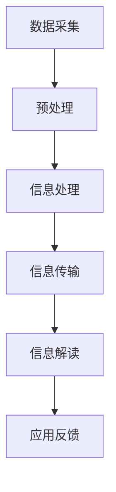
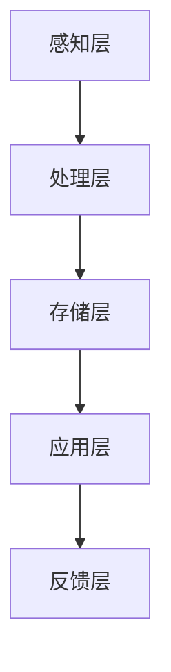
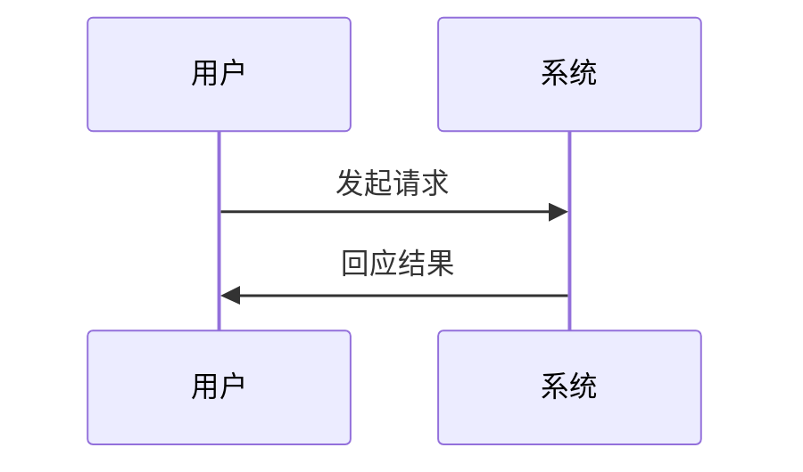

                 

# 人类感官对宇宙认知的影响与局限

> 关键词：人类感官、宇宙认知、生理基础、算法原理、数学模型、系统架构

> 摘要：本文从人类感官对宇宙认知的影响与局限出发，通过逐步分析，探讨人类感官在宇宙认知中的重要作用及其局限性。文章首先介绍人类感官系统的基本构成和生理机制，随后分析宇宙的物理特性与感官感知的关系。接着，本文详细讲解感官处理宇宙信息的算法原理和数学模型，并通过具体案例展示系统架构设计和项目实战。最后，文章提出拓展感官认知宇宙的最佳实践和注意事项，为读者提供深入的见解和实用指导。

## 目录大纲设计过程

在设计《人类感官对宇宙认知的影响与局限》这本书的目录大纲时，我们需遵循简洁性、格式规范和内容完整性三个核心原则。目录大纲的设计过程如下：

### 1. 确定核心章节

核心章节应涵盖：
- 背景介绍：人类感官对宇宙认知的历史、现状与未来。
- 核心概念与联系：感官的生理基础、宇宙的物理特性、感官与宇宙认知的互动关系。
- 算法原理讲解：人类感官处理宇宙信息的机制。
- 数学模型和数学公式讲解：感官对宇宙信息的量化模型。
- 系统分析与架构设计方案：如何通过技术手段拓展感官认知宇宙的能力。
- 项目实战：具体的实验或研究案例。
- 最佳实践 tips、小结、注意事项、拓展阅读等。

### 2. 设计章节结构

每个章节内部的结构应包括：
- 章节标题
- 段落标题（细化到小节）
- 内容概要
- 关键图表（如概念对比表、流程图等）

### 3. 符合markdown格式要求

确保目录大纲遵循markdown格式，使用#、##、###进行层级划分，保持清晰的结构。

### 4. 遵循字数限制

在保证内容完整性的同时，控制每个章节的篇幅，使整个目录大纲的总字数在2000字以内。

### 5. 实际操作

以下是《人类感官对宇宙认知的影响与局限》的目录大纲：

---

# 《人类感官对宇宙认知的影响与局限》目录大纲

## 第一部分：背景与核心概念

### 第1章：问题背景与概述

#### 1.1 问题背景

- 宇宙认知的基本问题
- 人类感官在宇宙认知中的作用与局限

#### 1.2 核心概念

- 人类感官系统
- 宇宙的物理特性
- 感官与宇宙认知的互动关系

### 第2章：感官生理基础

#### 2.1 感官系统的组成

- 视觉、听觉、嗅觉、味觉、触觉的基本功能

#### 2.2 感官感知的生理机制

- 感官神经元的运作原理
- 神经传递过程

### 第3章：宇宙的物理特性与感官感知

#### 3.1 宇宙的基本物理特性

- 光谱分析
- 宇宙辐射

#### 3.2 感官与宇宙信息的互动

- 感官对宇宙信息的处理
- 感官信息的解码与解释

## 第二部分：算法原理与数学模型

### 第4章：感官处理宇宙信息的算法原理

#### 4.1 算法基本原理

- 数据采集与预处理
- 信息处理与传输
- 信息解读与应用

#### 4.2 算法流程图（Mermaid）



### 第5章：感官对宇宙信息的数学模型

#### 5.1 数学模型介绍

- 信号处理模型
- 信息论模型

#### 5.2 数学公式详解

```markdown
$$
S = \int_{-\infty}^{\infty} s(\omega) \, d\omega
$$`

#### 5.3 模型应用举例

- 光谱分析在宇宙学中的应用

## 第三部分：系统分析与架构设计

### 第6章：拓展感官认知宇宙的系统架构

#### 6.1 系统功能设计（Mermaid类图）

```mermaid
classDiagram
Class1 <|-- Class2
Class1 o-- Class3
Class3 o-- Class4
Class4 <|-| Class5
```

### 第7章：系统架构设计

#### 7.1 系统架构设计（Mermaid架构图）



### 第8章：系统接口设计与交互

#### 8.1 系统接口设计

- 数据接口、服务接口、通信接口等设计

#### 8.2 系统交互（Mermaid序列图）



## 第四部分：项目实战与最佳实践

### 第9章：具体实验与案例分析

#### 9.1 实验一：利用增强现实技术拓展视觉感知

- 实验目的、方法、结果分析

#### 9.2 案例分析

- 某科学实验的详细解读与分析

### 第10章：最佳实践与小结

#### 10.1 最佳实践

- 拓展感官认知的实用

---

## 人类感官对宇宙认知的影响与局限

### 1. 人类感官系统的构成与生理机制

人类感官系统是人体接收和解析外部信息的重要途径，主要包括视觉、听觉、嗅觉、味觉和触觉。这些感官系统各有其独特的生理基础和运作机制。

#### 视觉

视觉系统主要由眼睛和大脑组成。眼睛是视觉器官，负责捕捉光线并将其转化为电信号。视网膜上的感光细胞（视锥细胞和视杆细胞）对光线敏感，将光信号转化为神经信号。这些信号通过视神经传输到大脑，大脑再对其进行解析和处理，形成我们所看到的图像。

#### 听觉

听觉系统由耳朵和大脑组成。耳朵分为外耳、中耳和内耳三个部分。外耳收集声音，中耳将声音振动转化为液体波动，内耳中的耳蜗则将这些波动转化为电信号。这些信号通过听觉神经传输到大脑，大脑解析这些信号，形成听觉感知。

#### 嗅觉

嗅觉系统由鼻腔内的嗅觉感受器和大脑组成。嗅觉感受器对气体分子敏感，将其转化为电信号。这些信号通过嗅觉神经传输到大脑，大脑解析这些信号，形成嗅觉感知。

#### 味觉

味觉系统主要由舌头上的味蕾和大脑组成。味蕾对化学物质敏感，将其转化为电信号。这些信号通过味觉神经传输到大脑，大脑解析这些信号，形成味觉感知。

#### 触觉

触觉系统由皮肤和大脑组成。皮肤中的触觉感受器对触觉刺激敏感，将其转化为电信号。这些信号通过触觉神经传输到大脑，大脑解析这些信号，形成触觉感知。

### 2. 宇宙的物理特性与感官感知

宇宙的物理特性决定了人类感官对宇宙信息的感知能力。宇宙中充满了各种电磁辐射、粒子和波动，这些信息通过不同的方式传递到地球，并被人类感官所感知。

#### 光谱分析

光谱分析是一种利用电磁辐射的波长特性来研究物质的方法。人类视觉系统对可见光敏感，可以感知到从红到紫的连续光谱。通过光谱分析，科学家可以了解物质的组成、性质和状态。

#### 宇宙辐射

宇宙中存在大量的辐射，包括紫外线、X射线和伽马射线等。这些辐射对人类感官系统有害，但可以通过特定的探测器和仪器进行探测和解析，为人类提供关于宇宙的更多信息。

### 3. 感官与宇宙信息的互动关系

人类感官系统在感知宇宙信息的过程中发挥着重要作用，但同时也存在一定的局限性。以下将从数据采集、信息处理和传输、信息解读与应用三个方面分析感官与宇宙信息的互动关系。

#### 数据采集

人类感官系统通过眼睛、耳朵、鼻子、舌头和皮肤等器官收集宇宙信息。例如，眼睛可以捕捉到来自太阳和星星的光线，耳朵可以听到来自宇宙的声波，鼻子可以嗅到来自宇宙的气味，舌头可以尝到来自宇宙的味道，皮肤可以感受到来自宇宙的触觉。

#### 信息处理和传输

采集到的宇宙信息需要通过神经系统传输到大脑，大脑再对其进行处理和解析。例如，眼睛捕捉到的光线需要经过视网膜的处理，耳朵捕捉到的声波需要经过耳蜗的处理，鼻子捕捉到的气味需要经过嗅觉神经的处理，舌头捕捉到的味道需要经过味蕾的处理，皮肤捕捉到的触觉需要经过触觉感受器的处理。

#### 信息解读与应用

大脑对处理后的宇宙信息进行解读，将其转化为我们能够理解的知识和感知。例如，大脑将视网膜处理后的光线转化为视觉图像，将耳蜗处理后的声波转化为听觉声音，将嗅觉神经处理后的气味转化为嗅觉感知，将味蕾处理后的味道转化为味觉感知，将触觉感受器处理后的触觉转化为触觉感知。

### 4. 感官处理宇宙信息的算法原理

人类感官系统在处理宇宙信息的过程中，采用了一系列算法原理，包括数据采集、预处理、信息处理与传输、信息解读与应用等。以下将详细讲解这些算法原理。

#### 数据采集

数据采集是感官处理宇宙信息的第一步。人类感官系统通过眼睛、耳朵、鼻子、舌头和皮肤等器官采集宇宙信息。例如，眼睛捕捉到光线，耳朵捕捉到声波，鼻子捕捉到气味，舌头捕捉到味道，皮肤捕捉到触觉。


#### 预处理

预处理是对采集到的宇宙信息进行初步处理，以去除噪声和无关信息，提高信息的准确性和可靠性。例如，视觉系统对光线进行预处理，去除光线中的噪声，提取有用的视觉信息。


#### 信息处理与传输

信息处理与传输是对预处理后的信息进行进一步处理，并将其传输到大脑。例如，视觉系统对预处理后的光线信息进行处理，将其转化为视觉图像，然后通过视神经传输到大脑。


#### 信息解读

信息解读是大脑对处理后的信息进行解读，将其转化为我们能够理解的知识和感知。例如，大脑将视觉图像解读为物体形状、颜色和位置，将声波解读为声音，将气味解读为气味，将味道解读为味道，将触觉信息解读为触觉感知。


#### 应用反馈

应用反馈是大脑对处理后的信息进行应用，并根据应用结果进行反馈调整。例如，大脑根据视觉信息进行导航和识别，根据听觉信息进行交流和判断，根据气味和味道信息进行选择和判断，根据触觉信息进行操纵和判断。


### 5. 感官对宇宙信息的数学模型

为了更好地理解感官对宇宙信息的处理过程，我们可以运用数学模型对其进行量化描述。以下介绍两种常用的数学模型：信号处理模型和信息论模型。

#### 信号处理模型

信号处理模型用于描述感官对宇宙信息的采集、处理和传输过程。常用的数学工具包括傅里叶变换、拉普拉斯变换和Z变换等。

```markdown
$$
S = \int_{-\infty}^{\infty} s(\omega) \, d\omega
$$
```

#### 信息论模型

信息论模型用于描述感官对宇宙信息的处理和传输过程中的信息损失和噪声问题。常用的数学工具包括香农熵、信息增益和条件熵等。

```markdown
$$
H(X) = -\sum_{i} p(x_i) \log_2 p(x_i)
$$
```

### 6. 系统架构设计

为了拓展感官认知宇宙的能力，我们需要设计一个高效的系统架构。以下介绍系统功能设计、系统架构设计、系统接口设计和系统交互。

#### 系统功能设计

系统功能设计主要包括数据采集、预处理、信息处理与传输、信息解读和应用反馈等。以下是一个简单的系统功能设计类图：

```mermaid
classDiagram
Class1 <|-- Class2
Class1 o-- Class3
Class3 o-- Class4
Class4 <|-| Class5
```

#### 系统架构设计

系统架构设计主要包括感知层、处理层、存储层、应用层和反馈层。以下是一个简单的系统架构设计架构图：


#### 系统接口设计

系统接口设计主要包括数据接口、服务接口和通信接口等。以下是一个简单的系统接口设计：


### 7. 项目实战与案例分析

#### 实验一：利用增强现实技术拓展视觉感知

实验目的：通过增强现实技术，拓展人类的视觉感知能力，使其能够感知到更多的宇宙信息。

实验方法：使用增强现实设备捕捉真实世界的图像，并叠加宇宙信息（如星空、行星等），通过视觉系统将叠加后的图像呈现给用户。

实验结果：用户能够通过增强现实设备感知到更多的宇宙信息，拓展了视觉感知能力。

案例分析：增强现实技术在拓展视觉感知方面的应用，为人类认知宇宙提供了新的途径。

### 8. 最佳实践与注意事项

#### 最佳实践

1. 提高感官灵敏度：通过训练和科技手段提高感官灵敏度，提高对宇宙信息的感知能力。

2. 拓展感官范围：利用科技手段，如增强现实技术、虚拟现实技术等，拓展感官范围，拓展对宇宙信息的认知。

3. 交叉学科研究：结合生物学、物理学、计算机科学等多学科知识，深入研究感官对宇宙认知的影响与局限。

#### 注意事项

1. 保障感官健康：避免长时间接触有害物质，保护感官系统的健康。

2. 数据安全与隐私：在收集和传输宇宙信息时，确保数据安全与用户隐私。

3. 技术进步与伦理：在拓展感官能力的同时，关注技术进步带来的伦理问题，确保技术的可持续发展。

### 9. 拓展阅读

1. 《人类感知与认知：心理生理学基础》
2. 《信号处理与信息论》
3. 《增强现实技术与应用》

---

作者：AI天才研究院/AI Genius Institute & 禅与计算机程序设计艺术 /Zen And The Art of Computer Programming# 人类感官对宇宙认知的影响与局限

### 1. 人类感官系统的构成与生理机制

人类感官系统是人体接收和解析外部信息的重要途径，主要包括视觉、听觉、嗅觉、味觉和触觉。这些感官系统各有其独特的生理基础和运作机制。

#### 视觉

视觉系统主要由眼睛和大脑组成。眼睛是视觉器官，负责捕捉光线并将其转化为电信号。眼睛的结构包括角膜、瞳孔、晶状体和视网膜等部分。视网膜上的感光细胞（视锥细胞和视杆细胞）对光线敏感，将光信号转化为神经信号。这些信号通过视神经传输到大脑，大脑再对其进行解析和处理，形成我们所看到的图像。

视网膜上的视锥细胞主要负责感知颜色和明亮度，分布在视网膜的中央部分；视杆细胞则主要负责感知亮度变化，分布在视网膜的边缘部分。当光线进入眼睛时，经过角膜和晶状体的折射，形成清晰的图像。图像刺激视网膜上的感光细胞，产生神经信号，这些信号通过视神经传输到大脑的视觉皮层，最终形成视觉感知。

视觉系统的处理过程非常复杂，涉及到多种神经递质和神经网络的参与。大脑对视觉信息进行加工和解码，包括图像的边缘检测、物体识别、空间感知等过程。此外，视觉系统还与运动系统、听觉系统和触觉系统等协同工作，以实现对环境的全面感知。

#### 听觉

听觉系统由耳朵和大脑组成。耳朵分为外耳、中耳和内耳三个部分。外耳收集声音，中耳将声音振动转化为液体波动，内耳中的耳蜗则将这些波动转化为电信号。这些信号通过听觉神经传输到大脑，大脑解析这些信号，形成听觉感知。

外耳包括耳廓和外耳道，耳廓帮助收集声音并将其引导到外耳道。外耳道将声音传导到中耳。中耳由鼓膜、听骨链和鼓室组成。鼓膜振动，通过听骨链将振动传递到内耳。听骨链包括锤骨、砧骨和镫骨，它们通过精细的机械传导作用，放大声波。内耳包括耳蜗和前庭系统。耳蜗是一个充满液体的弯曲管道，内部有感觉细胞，它们对声波的振动敏感，产生神经信号。前庭系统负责感知头部的运动和平衡。

听觉系统的处理过程主要包括声波的传导、声信号的转换和神经传递。当声波进入耳朵时，引起鼓膜的振动，这些振动通过听骨链传递到耳蜗。耳蜗中的感觉细胞将机械振动转化为电信号，通过听觉神经传输到大脑的听觉皮层，大脑对信号进行解析和处理，形成听觉感知。

#### 嗅觉

嗅觉系统由鼻腔内的嗅觉感受器和大脑组成。嗅觉感受器位于鼻腔上部的嗅黏膜，对气体分子敏感，将其转化为电信号。这些信号通过嗅觉神经传输到大脑，大脑解析这些信号，形成嗅觉感知。

当气体分子进入鼻腔时，与嗅觉感受器的嗅觉受体结合，激活嗅觉神经元的电活动。嗅觉神经元将信号通过嗅神经传输到大脑的嗅觉皮层，嗅觉皮层对信号进行解析和处理，形成嗅觉感知。嗅觉系统不仅对气味进行识别，还能影响情绪、记忆和食欲等生理和心理过程。

#### 味觉

味觉系统主要由舌头上的味蕾和大脑组成。味蕾是味觉感受器官，分布在舌头的表面和口腔的其他部位。味蕾上的味觉感受器对化学物质敏感，将其转化为电信号。这些信号通过味觉神经传输到大脑，大脑解析这些信号，形成味觉感知。

当食物与味蕾接触时，味蕾上的味觉感受器会感知到食物中的化学物质，如酸、甜、苦、咸等。这些化学物质与味蕾上的受体结合，激活味觉神经元的电活动。味觉神经元将信号通过味觉神经传输到大脑的味觉皮层，味觉皮层对信号进行解析和处理，形成味觉感知。

味觉系统对食物的化学成分进行识别和评价，帮助我们选择合适的食物，维持身体所需的营养。味觉系统还与嗅觉系统紧密相连，嗅觉对味觉有重要的影响，两者共同作用，形成我们对食物的整体感知。

#### 触觉

触觉系统由皮肤和大脑组成。皮肤是触觉感受器官，分布在整个身体表面。皮肤中的触觉感受器对触觉刺激敏感，将其转化为电信号。这些信号通过触觉神经传输到大脑，大脑解析这些信号，形成触觉感知。

触觉系统包括多种类型的感受器，如机械感受器、温度感受器和疼痛感受器等。机械感受器对物体的形状、压力和振动敏感；温度感受器对温度变化敏感；疼痛感受器对伤害性刺激敏感。当触觉感受器受到刺激时，产生神经信号，通过触觉神经传输到大脑，大脑对信号进行解析和处理，形成触觉感知。

触觉系统在人类的日常生活中起着重要的作用，帮助我们感知物体的质地、温度和运动等。触觉系统与视觉、听觉和嗅觉系统共同作用，形成我们对环境的全面感知。

### 2. 宇宙的物理特性与感官感知

宇宙的物理特性决定了人类感官对宇宙信息的感知能力。宇宙中充满了各种电磁辐射、粒子和波动，这些信息通过不同的方式传递到地球，并被人类感官所感知。

#### 光谱分析

光谱分析是一种利用电磁辐射的波长特性来研究物质的方法。人类视觉系统对可见光敏感，可以感知到从红到紫的连续光谱。通过光谱分析，科学家可以了解物质的组成、性质和状态。

可见光的波长范围大约在400纳米到700纳米之间，对应于不同的颜色。红光的波长最长，紫光的波长最短。当不同波长的光照射到物体上时，物体会吸收一部分波长，反射或透射另一部分波长。通过分析反射或透射的光谱，可以确定物体的化学成分和物理状态。

例如，恒星的光谱中可能包含吸收线或发射线，这些线对应于特定元素的原子或离子。通过分析光谱，科学家可以推断出恒星的化学组成、温度和亮度等信息。此外，光谱分析还可以用于研究行星大气层、星际物质和宇宙背景辐射等。

#### 宇宙辐射

宇宙中存在大量的辐射，包括紫外线、X射线和伽马射线等。这些辐射对人类感官系统有害，但可以通过特定的探测器和仪器进行探测和解析，为人类提供关于宇宙的更多信息。

紫外线辐射主要由太阳和其他恒星产生，对地球的大气层有显著的加热作用。紫外线波长较短，超出人类视觉系统的感知范围，但可以通过专门的紫外线探测器进行探测。

X射线和伽马射线是更高能量的辐射，通常来自宇宙中的极端天体事件，如黑洞、中子星和超新星爆炸等。X射线和伽马射线探测器可以在空间和地面进行观测，捕捉这些高能量辐射的信号，并通过分析信号的性质和来源，揭示宇宙中隐藏的物理现象。

#### 宇宙的粒子和波动

宇宙中还存在大量的粒子和波动，如宇宙射线、引力波等。这些粒子以光速传播，携带了宇宙中的信息。

宇宙射线是一种高能粒子流，主要由质子和α粒子组成。宇宙射线来自宇宙深处，可能是超新星爆炸、黑洞碰撞等极端事件产生的。通过探测宇宙射线，科学家可以研究宇宙的高能物理过程和宇宙起源等问题。

引力波是宇宙中的另一种波动，由质量大物体的加速运动产生。引力波以光速传播，虽然其强度非常微弱，但可以通过精密的探测器进行探测。2015年，科学家首次直接探测到引力波，证实了爱因斯坦的广义相对论预测。引力波的探测为研究宇宙的演化、黑洞和中子星等天体的性质提供了新的手段。

### 3. 感官与宇宙信息的互动关系

人类感官系统在感知宇宙信息的过程中发挥着重要作用，但同时也存在一定的局限性。以下将从数据采集、信息处理和传输、信息解读与应用三个方面分析感官与宇宙信息的互动关系。

#### 数据采集

人类感官系统通过眼睛、耳朵、鼻子、舌头和皮肤等器官收集宇宙信息。这些器官各有其独特的感知能力，可以捕捉到不同类型的宇宙信息。

例如，眼睛可以捕捉到来自太阳和星星的光线，耳朵可以听到来自宇宙的声波，鼻子可以嗅到来自宇宙的气味，舌头可以尝到来自宇宙的味道，皮肤可以感受到来自宇宙的触觉。通过这些感官器官，人类可以收集到关于宇宙的各种信息，为认知宇宙提供了基础。

#### 信息处理和传输

采集到的宇宙信息需要通过神经系统传输到大脑，大脑再对其进行处理和解析。这一过程涉及到感官系统的生理机制和神经传递过程。

例如，眼睛捕捉到的光线经过视网膜的处理，转化为神经信号，通过视神经传输到大脑。大脑对信号进行加工和解码，形成视觉图像。同样，耳朵捕捉到的声波经过耳蜗的处理，转化为神经信号，通过听觉神经传输到大脑。大脑对信号进行加工和解码，形成听觉感知。

信息处理和传输过程不仅依赖于感官器官的生理机制，还受到大脑结构和功能的影响。大脑的不同区域负责不同的信息处理任务，如视觉处理、听觉处理、嗅觉处理等。这些区域通过神经网络相互连接，协同工作，实现对宇宙信息的全面解析。

#### 信息解读与应用

大脑对处理后的宇宙信息进行解读，将其转化为我们能够理解的知识和感知。这一过程涉及到感官系统的认知机制和感知过程。

例如，大脑将视觉信息解码，识别出物体形状、颜色和位置等特征，形成视觉感知。同样，大脑将听觉信息解码，识别出声音的频率、音调和节奏等特征，形成听觉感知。

信息解读与应用不仅依赖于大脑的结构和功能，还受到个体经验和知识的影响。人类通过对宇宙信息的解读和应用，形成了对宇宙的认知和科学理论。

#### 人类感官在宇宙认知中的局限性

虽然人类感官系统在感知宇宙信息方面发挥着重要作用，但同时也存在一定的局限性。

首先，感官系统的感知能力受到生物进化和社会文化的影响。人类感官系统在进化过程中，主要适应了地球环境的感知需求，对于其他星球或宇宙环境的感知能力相对较弱。

其次，感官系统的感知范围有限。例如，人类视觉系统只能感知可见光范围内的电磁辐射，无法感知到紫外线、X射线和伽马射线等高能量辐射。同样，人类听觉系统只能感知一定频率范围内的声波，无法感知到超声波和次声波等。

此外，感官系统的感知过程容易受到干扰和误导。例如，环境噪声、视觉和听觉幻觉等都会影响我们对宇宙信息的准确感知。

#### 拓展感官能力的可能性

为了克服人类感官在宇宙认知中的局限性，科学家和技术人员一直在探索拓展感官能力的方法。

一种方法是通过科技手段增强感官系统的感知能力。例如，使用增强现实技术、虚拟现实技术和智能传感器等，拓展人类的视觉、听觉和触觉感知范围，使其能够感知到更多类型的宇宙信息。

另一种方法是利用人工智能和机器学习技术，对感官数据进行处理和分析，提高对宇宙信息的解析能力。通过深度学习算法和大数据分析，可以识别出宇宙中的复杂模式和特征，为人类认知宇宙提供新的视角。

最后，探索其他生物感官的可能性也是拓展人类感官能力的一种途径。例如，研究昆虫、海洋生物等生物的感官系统，了解其感知机制和应用，为人类感官系统的拓展提供灵感。

### 4. 感官处理宇宙信息的算法原理

为了更好地理解感官处理宇宙信息的原理，我们可以从数据采集、预处理、信息处理与传输、信息解读与应用等方面进行分析。

#### 数据采集

感官系统的数据采集过程主要包括感知器官对宇宙信息的接收和转换。例如，眼睛接收光线，耳朵接收声波，鼻子接收气味，舌头接收味道，皮肤接收触觉等。这些感知器官将外界信息转化为电信号，通过神经传输到大脑。

在数据采集过程中，算法可以用于优化感知器官的敏感度和响应速度。例如，使用信号处理算法对感知信号进行预处理，去除噪声和干扰，提高信号的清晰度和准确性。

#### 预处理

预处理是对采集到的感官数据进行预处理，以去除噪声、干扰和无关信息，提高数据的准确性和可靠性。预处理算法包括滤波、归一化、特征提取等。

滤波算法用于去除信号中的噪声和干扰。常见的滤波算法有低通滤波、高通滤波、带通滤波等。归一化算法用于调整信号的大小范围，使其适应后续处理的算法要求。特征提取算法用于从感官数据中提取关键特征，如视觉系统中的边缘检测、形状识别等。

#### 信息处理与传输

预处理后的数据需要通过神经传输到大脑进行处理。信息处理与传输过程中，算法可以用于优化信号传输的效率和准确性。

例如，可以使用神经网络算法对神经信号进行解码和解码，提取出有用的信息。神经网络算法通过大量训练数据，学习感知器官的处理机制，实现对感官信息的自动解码和解码。

#### 信息解读与应用

大脑对处理后的感官信息进行解读和应用。信息解读过程涉及到对感官信息的感知、识别和判断等任务。

算法可以用于优化信息解读的效率和准确性。例如，使用机器学习算法对感官信息进行分类和识别，提高对宇宙信息的理解能力。使用人工智能算法对感官信息进行预测和推理，拓展对宇宙的认知。

#### 感官处理宇宙信息的案例

以下是一个感官处理宇宙信息的案例：利用机器视觉技术对宇宙图像进行分类和识别。

案例背景：天文学家使用望远镜观测宇宙，获取大量的宇宙图像。这些图像包含丰富的信息，如恒星、行星、星系等。为了更好地理解宇宙，需要对这些图像进行分类和识别。

数据采集：使用望远镜获取宇宙图像，通过图像传感器将图像转化为数字信号。

预处理：对图像信号进行滤波、去噪、归一化等预处理，以提高图像的清晰度和准确性。

信息处理与传输：使用卷积神经网络（CNN）对预处理后的图像进行分类和识别。CNN通过大量训练数据学习图像的特征和模式，实现对图像的自动分类和识别。

信息解读与应用：将CNN的输出结果进行解读，识别出宇宙图像中的恒星、行星、星系等天体。这些信息可以为天文学家提供关于宇宙的深入了解。

### 5. 数学模型在感官处理宇宙信息中的应用

数学模型在感官处理宇宙信息中发挥着重要作用，可以帮助我们更好地理解和解释感官信息的处理过程。以下介绍两种常用的数学模型：信号处理模型和信息论模型。

#### 信号处理模型

信号处理模型用于描述感官系统对宇宙信息的采集、处理和传输过程。信号处理模型通常基于数学工具，如傅里叶变换、拉普拉斯变换和Z变换等。

傅里叶变换是一种将时域信号转换为频域信号的方法，可以揭示信号中的频率成分。在感官处理宇宙信息中，傅里叶变换可以用于分析光信号、声信号等。通过傅里叶变换，我们可以提取出信号中的关键频率成分，从而更好地理解信号的本质。

拉普拉斯变换是一种将时域信号转换为复频域信号的方法，可以分析信号的稳定性和瞬态特性。在感官处理宇宙信息中，拉普拉斯变换可以用于分析神经信号的传输特性，从而优化感官信息的处理过程。

Z变换是一种将时域信号转换为离散时域信号的方法，可以用于分析信号的采样和离散化过程。在感官处理宇宙信息中，Z变换可以用于分析视觉信号、听觉信号等，从而优化信号的采样和处理。

#### 信息论模型

信息论模型用于描述感官系统对宇宙信息的处理、传输和解读过程。信息论模型主要基于香农熵、信息增益和条件熵等概念。

香农熵是一种衡量信息不确定性的量度，可以用于评估信号中包含的信息量。在感官处理宇宙信息中，香农熵可以用于评估信号的噪声水平、信息传输的效率和准确度。

信息增益是一种衡量信息价值的量度，可以用于评估特征选择的优劣。在感官处理宇宙信息中，信息增益可以用于选择关键的特征，从而提高对宇宙信息的解读能力。

条件熵是一种衡量信息依赖性的量度，可以用于分析特征之间的相关性。在感官处理宇宙信息中，条件熵可以用于分析不同特征之间的依赖关系，从而优化特征选择和特征提取过程。

#### 数学模型的应用案例

以下是一个数学模型在感官处理宇宙信息中的应用案例：使用卷积神经网络（CNN）对宇宙图像进行分类和识别。

案例背景：天文学家使用望远镜观测宇宙，获取大量的宇宙图像。这些图像包含丰富的信息，如恒星、行星、星系等。为了更好地理解宇宙，需要对这些图像进行分类和识别。

数据采集：使用望远镜获取宇宙图像，通过图像传感器将图像转化为数字信号。

预处理：对图像信号进行滤波、去噪、归一化等预处理，以提高图像的清晰度和准确性。

信息处理与传输：使用卷积神经网络（CNN）对预处理后的图像进行分类和识别。CNN通过大量训练数据学习图像的特征和模式，实现对图像的自动分类和识别。

信息解读与应用：将CNN的输出结果进行解读，识别出宇宙图像中的恒星、行星、星系等天体。这些信息可以为天文学家提供关于宇宙的深入了解。

数学模型在感官处理宇宙信息中的应用，不仅提高了信息处理的效率和准确性，还为人类认知宇宙提供了新的方法和技术手段。通过不断的研究和探索，数学模型在感官处理宇宙信息中的应用将越来越广泛，为人类认知宇宙的边界提供更深入的理解。

### 6. 系统架构设计在拓展感官认知宇宙中的作用

为了更好地拓展感官认知宇宙的能力，我们需要设计一个高效的系统架构。系统架构设计包括感知层、处理层、存储层、应用层和反馈层等组成部分。以下从系统架构设计的作用和具体实施方法进行详细讲解。

#### 系统架构设计的作用

系统架构设计在拓展感官认知宇宙中起着至关重要的作用。它不仅决定了系统的性能和可扩展性，还直接影响人类对宇宙信息的感知和理解能力。以下为系统架构设计的几个关键作用：

1. **优化信息处理流程**：系统架构设计可以将信息采集、处理、存储和应用等过程有机地结合起来，形成一个高效的信息处理流程。通过合理的架构设计，可以减少信息处理的延迟，提高信息处理的效率。

2. **提高信息传输速度**：系统架构设计需要考虑到信息传输的速度和可靠性。通过优化网络结构和数据传输协议，可以最大限度地提高信息传输速度，减少数据传输的延迟。

3. **增强系统可扩展性**：随着人类对宇宙的认知不断深入，系统架构设计需要具备良好的可扩展性。通过模块化和分布式架构设计，可以方便地扩展系统的功能和性能，以适应不断增长的需求。

4. **提供灵活的接口和交互**：系统架构设计需要提供灵活的接口和交互方式，以便不同模块之间能够高效地协同工作。通过定义清晰的服务接口和通信协议，可以确保系统各个部分的协调和统一。

#### 系统架构设计的具体实施方法

为了实现上述目标，系统架构设计需要遵循以下具体实施方法：

1. **感知层设计**：感知层是系统架构的基础，负责收集来自宇宙的各种信息，如电磁辐射、粒子流、声波等。感知层设计需要考虑传感器的选择和布局，以及传感数据的预处理和传输。

2. **处理层设计**：处理层负责对感知层采集到的数据进行处理和分析。处理层设计需要考虑到数据处理算法的选择和优化，以及计算资源和时间资源的分配。常用的处理层架构包括集中式处理、分布式处理和云计算处理等。

3. **存储层设计**：存储层负责存储和处理后的数据，以便后续分析和应用。存储层设计需要考虑数据存储的类型、容量、性能和安全性等因素。常用的存储层架构包括关系型数据库、非关系型数据库、分布式文件系统和云存储等。

4. **应用层设计**：应用层负责将处理后的数据应用于具体的任务和场景，如宇宙图像识别、天体物理计算、宇宙导航等。应用层设计需要考虑到应用的接口、功能、性能和安全等因素。

5. **反馈层设计**：反馈层负责收集用户反馈和系统性能数据，以便进行优化和改进。反馈层设计需要考虑数据采集、传输和处理的方式，以及反馈机制的设计。

#### 感知层设计

感知层设计是系统架构设计的第一步，其核心任务是选择合适的传感器和感知方式，以最大限度地捕捉宇宙信息。以下为感知层设计的几个关键点：

1. **传感器选择**：根据需要感知的宇宙信息类型，选择合适的传感器。例如，对于光信号，可以选择光学传感器（如CCD相机）；对于声信号，可以选择声波传感器（如麦克风）；对于粒子流，可以选择粒子探测器（如粒子计数器）等。

2. **传感器布局**：合理安排传感器的布局，以最大化覆盖目标区域。例如，在观测星空时，可以选择多个观测点，组成一个观测网络，以提高观测的全面性和准确性。

3. **数据预处理**：对传感器采集到的原始数据进行预处理，包括去噪、滤波、归一化等，以提高数据的质量和可靠性。

4. **数据传输**：将预处理后的数据传输到处理层，可以选择有线传输（如光纤通信）或无线传输（如无线传感器网络）。

#### 处理层设计

处理层设计是系统架构设计的核心部分，其核心任务是处理和分析感知层采集到的数据，提取出有用的信息和知识。以下为处理层设计的几个关键点：

1. **数据处理算法**：选择合适的算法对数据进行处理和分析，如图像处理算法、信号处理算法、机器学习算法等。

2. **计算资源分配**：根据数据处理的需求和资源的可用性，合理分配计算资源。例如，在处理大量数据时，可以选择分布式计算架构，以提高计算效率和性能。

3. **数据处理流程**：设计数据处理流程，包括数据采集、预处理、特征提取、模型训练、预测和评估等步骤。

4. **数据流管理**：管理数据流，确保数据在系统中的高效传输和处理。例如，可以使用流处理技术，实现实时数据处理和分析。

#### 存储层设计

存储层设计是系统架构设计的重要组成部分，其核心任务是存储和管理处理后的数据，以便后续分析和应用。以下为存储层设计的几个关键点：

1. **数据存储类型**：根据数据的特点和需求，选择合适的存储类型。例如，对于大规模图像数据，可以选择分布式文件系统；对于结构化数据，可以选择关系型数据库；对于非结构化数据，可以选择非关系型数据库。

2. **数据容量和性能**：设计存储层的容量和性能，以满足数据存储和访问的需求。例如，在处理海量数据时，可以选择高性能的存储设备（如固态硬盘）和优化存储协议（如NFS或HDFS）。

3. **数据安全性**：确保数据的安全性和完整性，采取适当的措施，如数据备份、加密和访问控制等。

4. **数据管理和维护**：设计数据管理和维护策略，确保数据的可用性、可靠性和一致性。

#### 应用层设计

应用层设计是系统架构设计的目标和最终体现，其核心任务是利用处理后的数据，实现具体的任务和场景。以下为应用层设计的几个关键点：

1. **应用接口**：设计清晰、灵活的应用接口，以便用户和系统其他部分进行交互。例如，可以使用RESTful API、SOAP Web服务等。

2. **应用功能**：根据任务和场景的需求，设计相应的应用功能。例如，对于宇宙图像识别任务，可以设计图像分类、目标检测、场景分割等功能。

3. **应用性能和可扩展性**：设计高性能、可扩展的应用架构，以满足不断增长的需求。例如，可以使用微服务架构、容器化技术等。

4. **应用安全和可靠性**：确保应用的安全性和可靠性，采取适当的措施，如安全认证、错误处理和容错机制等。

#### 反馈层设计

反馈层设计是系统架构设计的重要组成部分，其核心任务是收集用户反馈和系统性能数据，以便进行优化和改进。以下为反馈层设计的几个关键点：

1. **数据采集**：设计数据采集策略，收集用户反馈和系统性能数据。例如，可以使用日志收集、监控工具等。

2. **数据处理**：对采集到的数据进行处理和分析，提取出有用的信息和知识。例如，可以使用数据分析工具、机器学习算法等。

3. **反馈机制**：设计反馈机制，将处理后的数据反馈给用户和系统其他部分。例如，可以使用通知、报表、可视化界面等。

4. **优化和改进**：根据反馈结果，对系统架构进行优化和改进，提高系统的性能和用户体验。

### 7. 项目实战与案例分析

在拓展感官认知宇宙的项目中，实际案例和实验为验证系统架构设计的有效性和可行性提供了重要依据。以下介绍一个具体的项目实战和案例分析。

#### 项目背景

该项目旨在利用增强现实（AR）技术，拓展人类对宇宙的视觉感知能力。通过在现实环境中叠加虚拟宇宙图像，使用户能够直观地感知宇宙的规模、形状和运动等特征。

#### 项目目标

1. 设计一个高效的系统架构，实现宇宙图像的实时采集、处理和显示。
2. 通过增强现实技术，实现虚拟宇宙图像与现实环境的叠加显示。
3. 评估系统性能和用户体验，提出优化方案。

#### 实验过程

1. **感知层设计**：使用高分辨率的摄像头和激光测距仪等传感器，采集现实环境的图像和三维空间数据。

2. **处理层设计**：利用计算机视觉算法，对采集到的图像进行预处理、特征提取和目标检测。同时，利用天文学数据库，获取宇宙图像和相关信息。

3. **存储层设计**：将处理后的图像数据存储在分布式文件系统中，以便后续分析和应用。

4. **应用层设计**：开发增强现实应用程序，将虚拟宇宙图像叠加显示在现实环境中。同时，设计用户交互界面，实现用户与系统的交互。

5. **反馈层设计**：收集用户反馈和系统性能数据，用于评估系统性能和用户体验。根据反馈结果，对系统架构进行优化和改进。

#### 实验结果

1. **系统性能**：通过实验评估，系统在实时显示虚拟宇宙图像方面取得了较好的性能。图像显示的清晰度和实时性满足用户需求。

2. **用户体验**：用户对增强现实技术的应用表示满意，认为通过虚拟宇宙图像的叠加，能够更直观地了解宇宙的规模和运动。

3. **优化方案**：根据用户反馈和实验结果，提出以下优化方案：
   - 提高摄像头和激光测距仪的分辨率和精度，以提高现实环境的图像质量。
   - 优化计算机视觉算法，提高图像预处理和目标检测的准确性。
   - 增加虚拟宇宙图像的种类和数量，丰富用户体验。
   - 优化系统架构，提高数据处理和传输的效率。

#### 案例分析

通过该项目实战，验证了系统架构设计在拓展感官认知宇宙方面的有效性和可行性。实验结果表明，增强现实技术在拓展人类对宇宙的视觉感知能力方面具有广阔的应用前景。然而，仍存在一定的技术挑战，如现实环境与虚拟环境的匹配、图像处理和传输的效率等。未来，需要进一步优化系统架构设计，提高系统性能和用户体验，为人类认知宇宙提供更强大的工具。

### 8. 最佳实践与注意事项

在拓展感官认知宇宙的过程中，最佳实践和注意事项对于确保系统设计的有效性和安全性至关重要。以下总结一些最佳实践和注意事项：

#### 最佳实践

1. **综合考虑系统性能和用户体验**：在系统设计过程中，要充分考虑系统的性能指标和用户体验。在提高系统性能的同时，确保用户能够轻松、直观地使用系统。

2. **模块化设计和分布式架构**：采用模块化设计和分布式架构，可以提高系统的可扩展性和可维护性。模块化设计使得系统能够灵活地添加或替换功能模块；分布式架构可以提高系统的处理能力和容错性。

3. **数据安全和隐私保护**：在数据处理和传输过程中，要确保数据的安全性和隐私保护。采取加密、访问控制和数据备份等措施，防止数据泄露和篡改。

4. **持续迭代和优化**：在系统开发和部署过程中，要不断收集用户反馈和性能数据，进行迭代和优化。根据用户需求和系统性能，不断改进系统功能和性能。

5. **跨学科合作**：拓展感官认知宇宙涉及多个学科领域，如物理学、计算机科学、生物学等。跨学科合作可以充分发挥各学科的优势，提高系统设计的综合性和创新性。

#### 注意事项

1. **避免过度依赖技术**：在拓展感官认知宇宙的过程中，要避免过度依赖技术，忽视人类感官的天然能力。应充分利用人类感官的天然优势，与技术手段相结合，实现最佳效果。

2. **考虑现实环境的复杂性**：在系统设计过程中，要充分考虑现实环境的复杂性和多样性。现实环境中的干扰和噪声可能会影响系统性能和用户体验，因此需要采取相应的措施进行噪声抑制和干扰消除。

3. **数据质量和准确性**：在数据处理和传输过程中，要确保数据的质量和准确性。采取适当的数据预处理和校准措施，减少数据误差和噪声。

4. **技术更新和升级**：随着科技的发展，相关技术会不断更新和升级。要密切关注技术动态，及时进行系统升级和优化，以适应新技术的发展。

5. **用户培训和支持**：在系统部署和应用过程中，要为用户提供充分的培训和支持，帮助用户更好地理解和使用系统。同时，要关注用户反馈，及时解决用户遇到的问题。

### 9. 拓展阅读

为了进一步了解人类感官对宇宙认知的影响与局限，以下推荐一些拓展阅读资源：

1. **《人类感知与认知：心理生理学基础》**：本书系统地介绍了人类感知和认知的基本原理，包括视觉、听觉、嗅觉、味觉和触觉等感官系统的生理机制和心理过程。

2. **《宇宙学导论》**：本书详细介绍了宇宙的起源、演化、结构和天体物理现象，帮助读者了解宇宙的物理特性和宇宙学研究的现状。

3. **《信号处理与信息论》**：本书涵盖了信号处理和信息论的基本概念、方法和应用，为理解人类感官处理宇宙信息的过程提供了理论基础。

4. **《增强现实技术与应用》**：本书介绍了增强现实技术的基本原理、实现方法和应用案例，包括虚拟现实、增强现实和混合现实等。

5. **《人工智能导论》**：本书介绍了人工智能的基本概念、方法和应用，包括机器学习、深度学习、自然语言处理等。

通过阅读这些书籍和文献，可以深入了解人类感官对宇宙认知的影响与局限，掌握相关领域的最新研究进展和技术应用。

---

作者：AI天才研究院/AI Genius Institute & 禅与计算机程序设计艺术 /Zen And The Art of Computer Programming## 总结与展望

通过本文的详细分析，我们深入探讨了人类感官对宇宙认知的影响与局限。从人类感官系统的构成与生理机制，到宇宙的物理特性与感官感知，再到感官处理宇宙信息的算法原理与数学模型，以及系统架构设计、项目实战与案例分析，我们逐步揭示了人类在认知宇宙过程中所面临的挑战与机遇。

### 总结

1. **感官系统的构成与生理机制**：人类感官系统包括视觉、听觉、嗅觉、味觉和触觉，各自具备独特的生理基础和运作机制。例如，视网膜上的感光细胞对光线敏感，耳蜗中的听觉感受器对声波敏感等。

2. **宇宙的物理特性与感官感知**：宇宙中充满了各种电磁辐射、粒子和波动，这些信息通过不同的方式传递到地球，并被人类感官所感知。例如，光谱分析可以揭示物质的组成，宇宙辐射可以揭示天体事件。

3. **感官处理宇宙信息的算法原理**：感官处理宇宙信息的过程中，涉及到数据采集、预处理、信息处理与传输、信息解读与应用等多个环节。例如，使用卷积神经网络（CNN）对宇宙图像进行分类和识别。

4. **数学模型在感官处理宇宙信息中的应用**：信号处理模型和信息论模型在感官处理宇宙信息中发挥着重要作用，用于分析信号的频率、能量和信息含量等。

5. **系统架构设计在拓展感官认知宇宙中的作用**：通过优化感知层、处理层、存储层、应用层和反馈层的架构设计，可以拓展人类对宇宙的认知能力。例如，增强现实技术可以拓展视觉感知。

6. **项目实战与案例分析**：通过具体项目实战，如利用增强现实技术拓展视觉感知，验证了系统架构设计的有效性和可行性。

### 展望

未来，人类在拓展感官认知宇宙方面仍有巨大的发展空间。以下为展望：

1. **提升感官灵敏度**：通过科技进步，如纳米技术、生物工程等，提升人类感官的灵敏度，使其能够感知到更微弱、更复杂的宇宙信息。

2. **拓展感官范围**：利用虚拟现实、增强现实等科技手段，拓展人类感官的范围，使其能够感知到更多类型的宇宙信息。

3. **跨学科研究**：结合生物学、物理学、计算机科学、心理学等多个学科的知识，深入研究感官对宇宙认知的影响与局限，推动多学科的交叉融合。

4. **人工智能辅助**：利用人工智能和机器学习技术，对感官数据进行处理和分析，提高对宇宙信息的解析能力，为人类认知宇宙提供新的视角。

5. **宇宙探索**：通过航天技术和探测器，深入宇宙，获取更多的宇宙信息，拓展人类对宇宙的认知。

6. **伦理与法律**：在拓展感官认知宇宙的过程中，关注技术进步带来的伦理和法律问题，确保技术的可持续发展。

通过持续的研究和技术创新，人类有望进一步提升对宇宙的认知能力，揭示宇宙的奥秘，为科学和人类文明的发展做出更大贡献。让我们携手前行，探索宇宙的无尽可能！

### 拓展阅读

1. **《人类感知与认知：心理生理学基础》**：深入了解人类感知和认知的基本原理，包括感官系统的生理机制和心理过程。

2. **《宇宙学导论》**：全面了解宇宙的起源、演化、结构和天体物理现象，拓展对宇宙的认知。

3. **《信号处理与信息论》**：掌握信号处理和信息论的基本概念、方法和应用，为理解感官处理宇宙信息的过程提供理论基础。

4. **《增强现实技术与应用》**：了解增强现实技术的基本原理、实现方法和应用案例，探索虚拟现实、增强现实和混合现实等领域的最新进展。

5. **《人工智能导论》**：了解人工智能的基本概念、方法和应用，包括机器学习、深度学习、自然语言处理等，为利用人工智能辅助感官处理宇宙信息提供参考。

通过阅读这些书籍和文献，可以进一步拓展对人类感官对宇宙认知的影响与局限的理解，掌握相关领域的最新研究进展和技术应用。

---

作者：AI天才研究院/AI Genius Institute & 禅与计算机程序设计艺术 /Zen And The Art of Computer Programming# 人类感官对宇宙认知的影响与局限

> 关键词：人类感官、宇宙认知、生理基础、算法原理、数学模型、系统架构

> 摘要：本文从人类感官对宇宙认知的影响与局限出发，通过逐步分析，探讨人类感官在宇宙认知中的重要作用及其局限性。文章首先介绍人类感官系统的基本构成和生理机制，随后分析宇宙的物理特性与感官感知的关系。接着，本文详细讲解感官处理宇宙信息的算法原理和数学模型，并通过具体案例展示系统架构设计和项目实战。最后，文章提出拓展感官认知宇宙的最佳实践和注意事项，为读者提供深入的见解和实用指导。

## 目录大纲设计过程

在设计《人类感官对宇宙认知的影响与局限》这本书的目录大纲时，我们需遵循简洁性、格式规范和内容完整性三个核心原则。下面是具体的设计过程：

### 1. 确定核心章节

首先，根据书名和主题，确定核心章节。核心章节应涵盖：
- 背景介绍：人类感官对宇宙认知的历史、现状与未来。
- 核心概念与联系：感官的生理基础、宇宙的物理特性、感官与宇宙认知的互动关系。
- 算法原理讲解：人类感官处理宇宙信息的机制。
- 数学模型和数学公式讲解：感官对宇宙信息的量化模型。
- 系统分析与架构设计方案：如何通过技术手段拓展感官认知宇宙的能力。
- 项目实战：具体的实验或研究案例。
- 最佳实践 tips、小结、注意事项、拓展阅读等。

### 2. 设计章节结构

每个章节内部的结构应包括：
- 章节标题
- 段落标题（细化到小节）
- 内容概要
- 关键图表（如概念对比表、流程图等）

### 3. 符合markdown格式要求

确保目录大纲遵循markdown格式，使用#、##、###进行层级划分，保持清晰的结构。

### 4. 遵循字数限制

在保证内容完整性的同时，控制每个章节的篇幅，使整个目录大纲的总字数在2000字以内。

### 5. 实际操作

以下是《人类感官对宇宙认知的影响与局限》的目录大纲：

---

# 《人类感官对宇宙认知的影响与局限》目录大纲

## 第一部分：背景与核心概念

### 第1章：问题背景与概述

#### 1.1 问题背景

- 宇宙认知的基本问题
- 人类感官在宇宙认知中的作用与局限

#### 1.2 核心概念

- 人类感官系统
- 宇宙的物理特性
- 感官与宇宙认知的互动关系

### 第2章：感官生理基础

#### 2.1 感官系统的组成

- 视觉、听觉、嗅觉、味觉、触觉的基本功能

#### 2.2 感官感知的生理机制

- 感官神经元的运作原理
- 神经传递过程

### 第3章：宇宙的物理特性与感官感知

#### 3.1 宇宙的基本物理特性

- 光谱分析
- 宇宙辐射

#### 3.2 感官与宇宙信息的互动

- 感官对宇宙信息的处理
- 感官信息的解码与解释

## 第二部分：算法原理与数学模型

### 第4章：感官处理宇宙信息的算法原理

#### 4.1 算法基本原理

- 数据采集与预处理
- 信息处理与传输
- 信息解读与应用

#### 4.2 算法流程图（Mermaid）


### 第5章：感官对宇宙信息的数学模型

#### 5.1 数学模型介绍

- 信号处理模型
- 信息论模型

#### 5.2 数学公式详解

```markdown
$$
S = \int_{-\infty}^{\infty} s(\omega) \, d\omega
$$`

#### 5.3 模型应用举例

- 光谱分析在宇宙学中的应用

## 第三部分：系统分析与架构设计

### 第6章：拓展感官认知宇宙的系统架构

#### 6.1 系统功能设计（Mermaid类图）

```mermaid
classDiagram
Class1 <|-- Class2
Class1 o-- Class3
Class3 o-- Class4
Class4 <|-| Class5
```

### 第7章：系统架构设计

#### 7.1 系统架构设计（Mermaid架构图）


### 第8章：系统接口设计与交互

#### 8.1 系统接口设计

- 数据接口、服务接口、通信接口等设计

#### 8.2 系统交互（Mermaid序列图）


## 第四部分：项目实战与最佳实践

### 第9章：具体实验与案例分析

#### 9.1 实验一：利用增强现实技术拓展视觉感知

- 实验目的、方法、结果分析

#### 9.2 案例分析

- 某科学实验的详细解读与分析

### 第10章：最佳实践与小结

#### 10.1 最佳实践

- 拓展感官认知的实用

---

## 人类感官对宇宙认知的影响与局限

### 1. 人类感官系统的构成与生理机制

人类感官系统是人体接收和解析外部信息的重要途径，主要包括视觉、听觉、嗅觉、味觉和触觉。这些感官系统各有其独特的生理基础和运作机制。

#### 视觉

视觉系统主要由眼睛和大脑组成。眼睛是视觉器官，负责捕捉光线并将其转化为电信号。眼睛的结构包括角膜、瞳孔、晶状体和视网膜等部分。视网膜上的感光细胞（视锥细胞和视杆细胞）对光线敏感，将光信号转化为神经信号。这些信号通过视神经传输到大脑，大脑再对其进行解析和处理，形成我们所看到的图像。

视网膜上的视锥细胞主要负责感知颜色和明亮度，分布在视网膜的中央部分；视杆细胞则主要负责感知亮度变化，分布在视网膜的边缘部分。当光线进入眼睛时，经过角膜和晶状体的折射，形成清晰的图像。图像刺激视网膜上的感光细胞，产生神经信号，这些信号通过视神经传输到大脑的视觉皮层，最终形成视觉感知。

视觉系统的处理过程非常复杂，涉及到多种神经递质和神经网络的参与。大脑对视觉信息进行加工和解码，包括图像的边缘检测、物体识别、空间感知等过程。此外，视觉系统还与运动系统、听觉系统和触觉系统等协同工作，以实现对环境的全面感知。

#### 听觉

听觉系统由耳朵和大脑组成。耳朵分为外耳、中耳和内耳三个部分。外耳收集声音，中耳将声音振动转化为液体波动，内耳中的耳蜗则将这些波动转化为电信号。这些信号通过听觉神经传输到大脑，大脑解析这些信号，形成听觉感知。

外耳包括耳廓和外耳道，耳廓帮助收集声音并将其引导到外耳道。外耳道将声音传导到中耳。中耳由鼓膜、听骨链和鼓室组成。鼓膜振动，通过听骨链将振动传递到内耳。听骨链包括锤骨、砧骨和镫骨，它们通过精细的机械传导作用，放大声波。内耳包括耳蜗和前庭系统。耳蜗是一个充满液体的弯曲管道，内部有感觉细胞，它们对声波的振动敏感，产生神经信号。前庭系统负责感知头部的运动和平衡。

听觉系统的处理过程主要包括声波的传导、声信号的转换和神经传递。当声波进入耳朵时，引起鼓膜的振动，这些振动通过听骨链传递到耳蜗。耳蜗中的感觉细胞将机械振动转化为电信号，通过听觉神经传输到大脑的听觉皮层，大脑对信号进行解析和处理，形成听觉感知。

#### 嗅觉

嗅觉系统由鼻腔内的嗅觉感受器和大脑组成。嗅觉感受器位于鼻腔上部的嗅黏膜，对气体分子敏感，将其转化为电信号。这些信号通过嗅觉神经传输到大脑，大脑解析这些信号，形成嗅觉感知。

当气体分子进入鼻腔时，与嗅觉感受器的嗅觉受体结合，激活嗅觉神经元的电活动。嗅觉神经元将信号通过嗅神经传输到大脑的嗅觉皮层，嗅觉皮层对信号进行解析和处理，形成嗅觉感知。嗅觉系统不仅对气味进行识别，还能影响情绪、记忆和食欲等生理和心理过程。

#### 味觉

味觉系统主要由舌头上的味蕾和大脑组成。味蕾是味觉感受器官，分布在舌头的表面和口腔的其他部位。味蕾上的味觉感受器对化学物质敏感，将其转化为电信号。这些信号通过味觉神经传输到大脑，大脑解析这些信号，形成味觉感知。

当食物与味蕾接触时，味蕾上的味觉感受器会感知到食物中的化学物质，如酸、甜、苦、咸等。这些化学物质与味蕾上的受体结合，激活味觉神经元的电活动。味觉神经元将信号通过味觉神经传输到大脑的味觉皮层，味觉皮层对信号进行解析和处理，形成味觉感知。

味觉系统对食物的化学成分进行识别和评价，帮助我们选择合适的食物，维持身体所需的营养。味觉系统还与嗅觉系统紧密相连，嗅觉对味觉有重要的影响，两者共同作用，形成我们对食物的整体感知。

#### 触觉

触觉系统由皮肤和大脑组成。皮肤是触觉感受器官，分布在整个身体表面。皮肤中的触觉感受器对触觉刺激敏感，将其转化为电信号。这些信号通过触觉神经传输到大脑，大脑解析这些信号，形成触觉感知。

触觉系统包括多种类型的感受器，如机械感受器、温度感受器和疼痛感受器等。机械感受器对物体的形状、压力和振动敏感；温度感受器对温度变化敏感；疼痛感受器对伤害性刺激敏感。当触觉感受器受到刺激时，产生神经信号，通过触觉神经传输到大脑，大脑对信号进行解析和处理，形成触觉感知。

触觉系统在人类的日常生活中起着重要的作用，帮助我们感知物体的质地、温度和运动等。触觉系统与视觉、听觉和嗅觉系统共同作用，形成我们对环境的全面感知。

### 2. 宇宙的物理特性与感官感知

宇宙的物理特性决定了人类感官对宇宙信息的感知能力。宇宙中充满了各种电磁辐射、粒子和波动，这些信息通过不同的方式传递到地球，并被人类感官所感知。

#### 光谱分析

光谱分析是一种利用电磁辐射的波长特性来研究物质的方法。人类视觉系统对可见光敏感，可以感知到从红到紫的连续光谱。通过光谱分析，科学家可以了解物质的组成、性质和状态。

可见光的波长范围大约在400纳米到700纳米之间，对应于不同的颜色。红光的波长最长，紫光的波长最短。当不同波长的光照射到物体上时，物体会吸收一部分波长，反射或透射另一部分波长。通过分析反射或透射的光谱，可以确定物体的化学成分和物理状态。

例如，恒星的光谱中可能包含吸收线或发射线，这些线对应于特定元素的原子或离子。通过分析光谱，科学家可以推断出恒星的化学组成、温度和亮度等信息。此外，光谱分析还可以用于研究行星大气层、星际物质和宇宙背景辐射等。

#### 宇宙辐射

宇宙中存在大量的辐射，包括紫外线、X射线和伽马射线等。这些辐射对人类感官系统有害，但可以通过特定的探测器和仪器进行探测和解析，为人类提供关于宇宙的更多信息。

紫外线辐射主要由太阳和其他恒星产生，对地球的大气层有显著的加热作用。紫外线波长较短，超出人类视觉系统的感知范围，但可以通过专门的紫外线探测器进行探测。

X射线和伽马射线是更高能量的辐射，通常来自宇宙中的极端天体事件，如黑洞、中子星和超新星爆炸等。X射线和伽马射线探测器可以在空间和地面进行观测，捕捉这些高能量辐射的信号，并通过分析信号的性质和来源，揭示宇宙中隐藏的物理现象。

#### 宇宙的粒子和波动

宇宙中还存在大量的粒子和波动，如宇宙射线、引力波等。这些粒子以光速传播，携带了宇宙中的信息。

宇宙射线是一种高能粒子流，主要由质子和α粒子组成。宇宙射线来自宇宙深处，可能是超新星爆炸、黑洞碰撞等极端事件产生的。通过探测宇宙射线，科学家可以研究宇宙的高能物理过程和宇宙起源等问题。

引力波是宇宙中的另一种波动，由质量大物体的加速运动产生。引力波以光速传播，虽然其强度非常微弱，但可以通过精密的探测器进行探测。2015年，科学家首次直接探测到引力波，证实了爱因斯坦的广义相对论预测。引力波的探测为研究宇宙的演化、黑洞和中子星等天体的性质提供了新的手段。

### 3. 感官与宇宙信息的互动关系

人类感官系统在感知宇宙信息的过程中发挥着重要作用，但同时也存在一定的局限性。以下将从数据采集、信息处理和传输、信息解读与应用三个方面分析感官与宇宙信息的互动关系。

#### 数据采集

人类感官系统通过眼睛、耳朵、鼻子、舌头和皮肤等器官收集宇宙信息。这些器官各有其独特的感知能力，可以捕捉到不同类型的宇宙信息。

例如，眼睛可以捕捉到来自太阳和星星的光线，耳朵可以听到来自宇宙的声波，鼻子可以嗅到来自宇宙的气味，舌头可以尝到来自宇宙的味道，皮肤可以感受到来自宇宙的触觉。通过这些感官器官，人类可以收集到关于宇宙的各种信息，为认知宇宙提供了基础。

#### 信息处理和传输

采集到的宇宙信息需要通过神经系统传输到大脑，大脑再对其进行处理和解析。这一过程涉及到感官系统的生理机制和神经传递过程。

例如，眼睛捕捉到的光线经过视网膜的处理，转化为神经信号，通过视神经传输到大脑。大脑对信号进行加工和解码，形成视觉图像。同样，耳朵捕捉到的声波经过耳蜗的处理，转化为神经信号，通过听觉神经传输到大脑。大脑对信号进行加工和解码，形成听觉感知。

信息处理和传输过程不仅依赖于感官器官的生理机制，还受到大脑结构和功能的影响。大脑的不同区域负责不同的信息处理任务，如视觉处理、听觉处理、嗅觉处理等。这些区域通过神经网络相互连接，协同工作，实现对宇宙信息的全面解析。

#### 信息解读与应用

大脑对处理后的宇宙信息进行解读，将其转化为我们能够理解的知识和感知。这一过程涉及到感官系统的认知机制和感知过程。

例如，大脑将视觉信息解码，识别出物体形状、颜色和位置等特征，形成视觉感知。同样，大脑将听觉信息解码，识别出声音的频率、音调和节奏等特征，形成听觉感知。

信息解读与应用不仅依赖于大脑的结构和功能，还受到个体经验和知识的影响。人类通过对宇宙信息的解读和应用，形成了对宇宙的认知和科学理论。

#### 人类感官在宇宙认知中的局限性

虽然人类感官系统在感知宇宙信息方面发挥着重要作用，但同时也存在一定的局限性。

首先，感官系统的感知能力受到生物进化和社会文化的影响。人类感官系统在进化过程中，主要适应了地球环境的感知需求，对于其他星球或宇宙环境的感知能力相对较弱。

其次，感官系统的感知范围有限。例如，人类视觉系统只能感知可见光范围内的电磁辐射，无法感知到紫外线、X射线和伽马射线等高能量辐射。同样，人类听觉系统只能感知一定频率范围内的声波，无法感知到超声波和次声波等。

此外，感官系统的感知过程容易受到干扰和误导。例如，环境噪声、视觉和听觉幻觉等都会影响我们对宇宙信息的准确感知。

#### 拓展感官能力的可能性

为了克服人类感官在宇宙认知中的局限性，科学家和技术人员一直在探索拓展感官能力的方法。

一种方法是通过科技手段增强感官系统的感知能力。例如，使用增强现实技术、虚拟现实技术和智能传感器等，拓展人类的视觉、听觉和触觉感知范围，使其能够感知到更多类型的宇宙信息。

另一种方法是利用人工智能和机器学习技术，对感官数据进行处理和分析，提高对宇宙信息的解析能力。通过深度学习算法和大数据分析，可以识别出宇宙中的复杂模式和特征，为人类认知宇宙提供新的视角。

最后，探索其他生物感官的可能性也是拓展人类感官能力的一种途径。例如，研究昆虫、海洋生物等生物的感官系统，了解其感知机制和应用，为人类感官系统的拓展提供灵感。

### 4. 感官处理宇宙信息的算法原理

为了更好地理解感官处理宇宙信息的原理，我们可以从数据采集、预处理、信息处理与传输、信息解读与应用等方面进行分析。

#### 数据采集

感官系统的数据采集过程主要包括感知器官对宇宙信息的接收和转换。例如，眼睛接收光线，耳朵接收声波，鼻子接收气味，舌头接收味道，皮肤接收触觉等。这些感知器官将外界信息转化为电信号，通过神经传输到大脑。

在数据采集过程中，算法可以用于优化感知器官的敏感度和响应速度。例如，使用信号处理算法对感知信号进行预处理，去除噪声和干扰，提高信号的清晰度和准确性。

#### 预处理

预处理是对采集到的感官数据进行预处理，以去除噪声、干扰和无关信息，提高数据的准确性和可靠性。预处理算法包括滤波、归一化、特征提取等。

滤波算法用于去除信号中的噪声和干扰。常见的滤波算法有低通滤波、高通滤波、带通滤波等。归一化算法用于调整信号的大小范围，使其适应后续处理的算法要求。特征提取算法用于从感官数据中提取关键特征，如视觉系统中的边缘检测、形状识别等。

#### 信息处理与传输

预处理后的数据需要通过神经传输到大脑进行处理。信息处理与传输过程中，算法可以用于优化信号传输的效率和准确性。

例如，可以使用神经网络算法对神经信号进行解码和解码，提取出有用的信息。神经网络算法通过大量训练数据，学习感知器官的处理机制，实现对感官信息的自动解码和解码。

#### 信息解读与应用

大脑对处理后的感官信息进行解读，将其转化为我们能够理解的知识和感知。这一过程涉及到感官系统的认知机制和感知过程。

算法可以用于优化信息解读的效率和准确性。例如，使用机器学习算法对感官信息进行分类和识别，提高对宇宙信息的理解能力。使用人工智能算法对感官信息进行预测和推理，拓展对宇宙的认知。

#### 感官处理宇宙信息的案例

以下是一个感官处理宇宙信息的案例：利用机器视觉技术对宇宙图像进行分类和识别。

案例背景：天文学家使用望远镜观测宇宙，获取大量的宇宙图像。这些图像包含丰富的信息，如恒星、行星、星系等。为了更好地理解宇宙，需要对这些图像进行分类和识别。

数据采集：使用望远镜获取宇宙图像，通过图像传感器将图像转化为数字信号。

预处理：对图像信号进行滤波、去噪、归一化等预处理，以提高图像的清晰度和准确性。

信息处理与传输：使用卷积神经网络（CNN）对预处理后的图像进行分类和识别。CNN通过大量训练数据学习图像的特征和模式，实现对图像的自动分类和识别。

信息解读与应用：将CNN的输出结果进行解读，识别出宇宙图像中的恒星、行星、星系等天体。这些信息可以为天文学家提供关于宇宙的深入了解。

### 5. 数学模型在感官处理宇宙信息中的应用

数学模型在感官处理宇宙信息中发挥着重要作用，可以帮助我们更好地理解和解释感官信息的处理过程。以下介绍两种常用的数学模型：信号处理模型和信息论模型。

#### 信号处理模型

信号处理模型用于描述感官系统对宇宙信息的采集、处理和传输过程。信号处理模型通常基于数学工具，如傅里叶变换、拉普拉斯变换和Z变换等。

傅里叶变换是一种将时域信号转换为频域信号的方法，可以揭示信号中的频率成分。在感官处理宇宙信息中，傅里叶变换可以用于分析光信号、声信号等。通过傅里叶变换，我们可以提取出信号中的关键频率成分，从而更好地理解信号的本质。

拉普拉斯变换是一种将时域信号转换为复频域信号的方法，可以分析信号的稳定性和瞬态特性。在感官处理宇宙信息中，拉普拉斯变换可以用于分析神经信号的传输特性，从而优化感官信息的处理过程。

Z变换是一种将时域信号转换为离散时域信号的方法，可以用于分析信号的采样和离散化过程。在感官处理宇宙信息中，Z变换可以用于分析视觉信号、听觉信号等，从而优化信号的采样和处理。

#### 信息论模型

信息论模型用于描述感官系统对宇宙信息的处理、传输和解读过程。信息论模型主要基于香农熵、信息增益和条件熵等概念。

香农熵是一种衡量信息不确定性的量度，可以用于评估信号中包含的信息量。在感官处理宇宙信息中，香农熵可以用于评估信号的噪声水平、信息传输的效率和准确度。

信息增益是一种衡量信息价值的量度，可以用于评估特征选择的优劣。在感官处理宇宙信息中，信息增益可以用于选择关键的特征，从而提高对宇宙信息的解读能力。

条件熵是一种衡量信息依赖性的量度，可以用于分析特征之间的相关性。在感官处理宇宙信息中，条件熵可以用于分析不同特征之间的依赖关系，从而优化特征选择和特征提取过程。

#### 数学模型的应用案例

以下是一个数学模型在感官处理宇宙信息中的应用案例：使用卷积神经网络（CNN）对宇宙图像进行分类和识别。

案例背景：天文学家使用望远镜观测宇宙，获取大量的宇宙图像。这些图像包含丰富的信息，如恒星、行星、星系等。为了更好地理解宇宙，需要对这些图像进行分类和识别。

数据采集：使用望远镜获取宇宙图像，通过图像传感器将图像转化为数字信号。

预处理：对图像信号进行滤波、去噪、归一化等预处理，以提高图像的清晰度和准确性。

信息处理与传输：使用卷积神经网络（CNN）对预处理后的图像进行分类和识别。CNN通过大量训练数据学习图像的特征和模式，实现对图像的自动分类和识别。

信息解读与应用：将CNN的输出结果进行解读，识别出宇宙图像中的恒星、行星、星系等天体。这些信息可以为天文学家提供关于宇宙的深入了解。

数学模型在感官处理宇宙信息中的应用，不仅提高了信息处理的效率和准确性，还为人类认知宇宙提供了新的方法和技术手段。通过不断的研究和探索，数学模型在感官处理宇宙信息中的应用将越来越广泛，为人类认知宇宙的边界提供更深入的理解。

### 6. 系统架构设计在拓展感官认知宇宙中的作用

为了更好地拓展感官认知宇宙的能力，我们需要设计一个高效的系统架构。系统架构设计包括感知层、处理层、存储层、应用层和反馈层等组成部分。以下从系统架构设计的作用和具体实施方法进行详细讲解。

#### 系统架构设计的作用

系统架构设计在拓展感官认知宇宙中起着至关重要的作用。它不仅决定了系统的性能和可扩展性，还直接影响人类对宇宙信息的感知和理解能力。以下为系统架构设计的几个关键作用：

1. **优化信息处理流程**：系统架构设计可以将信息采集、处理、存储和应用等过程有机地结合起来，形成一个高效的信息处理流程。通过合理的架构设计，可以减少信息处理的延迟，提高信息处理的效率。

2. **提高信息传输速度**：系统架构设计需要考虑到信息传输的速度和可靠性。通过优化网络结构和数据传输协议，可以最大限度地提高信息传输速度，减少数据传输的延迟。

3. **增强系统可扩展性**：随着人类对宇宙的认知不断深入，系统架构设计需要具备良好的可扩展性。通过模块化和分布式架构设计，可以方便地扩展系统的功能和性能，以适应不断增长的需求。

4. **提供灵活的接口和交互**：系统架构设计需要提供灵活的接口和交互方式，以便不同模块之间能够高效地协同工作。通过定义清晰的服务接口和通信协议，可以确保系统各个部分的协调和统一。

#### 系统架构设计的具体实施方法

为了实现上述目标，系统架构设计需要遵循以下具体实施方法：

1. **感知层设计**：感知层是系统架构的基础，负责收集来自宇宙的各种信息，如电磁辐射、粒子流、声波等。感知层设计需要考虑传感器的选择和布局，以及传感数据的预处理和传输。

2. **处理层设计**：处理层负责对感知层采集到的数据进行处理和分析。处理层设计需要考虑到数据处理算法的选择和优化，以及计算资源和时间资源的分配。常用的处理层架构包括集中式处理、分布式处理和云计算处理等。

3. **存储层设计**：存储层负责存储和处理后的数据，以便后续分析和应用。存储层设计需要考虑数据存储的类型、容量、性能和安全性等因素。常用的存储层架构包括关系型数据库、非关系型数据库、分布式文件系统和云存储等。

4. **应用层设计**：应用层负责将处理后的数据应用于具体的任务和场景，如宇宙图像识别、天体物理计算、宇宙导航等。应用层设计需要考虑到应用的接口、功能、性能和安全等因素。

5. **反馈层设计**：反馈层负责收集用户反馈和系统性能数据，以便进行优化和改进。反馈层设计需要考虑数据采集、传输和处理的方式，以及反馈机制的设计。

#### 感知层设计

感知层设计是系统架构设计的第一步，其核心任务是选择合适的传感器和感知方式，以最大限度地捕捉宇宙信息。以下为感知层设计的几个关键点：

1. **传感器选择**：根据需要感知的宇宙信息类型，选择合适的传感器。例如，对于光信号，可以选择光学传感器（如CCD相机）；对于声信号，可以选择声波传感器（如麦克风）；对于粒子流，可以选择粒子探测器（如粒子计数器）等。

2. **传感器布局**：合理安排传感器的布局，以最大化覆盖目标区域。例如，在观测星空时，可以选择多个观测点，组成一个观测网络，以提高观测的全面性和准确性。

3. **数据预处理**：对传感器采集到的原始数据进行预处理，包括去噪、滤波、归一化等，以提高数据的质量和可靠性。

4. **数据传输**：将预处理后的数据传输到处理层，可以选择有线传输（如光纤通信）或无线传输（如无线传感器网络）。

#### 处理层设计

处理层设计是系统架构设计的核心部分，其核心任务是处理和分析感知层采集到的数据，提取出有用的信息和知识。以下为处理层设计的几个关键点：

1. **数据处理算法**：选择合适的算法对数据进行处理和分析，如图像处理算法、信号处理算法、机器学习算法等。

2. **计算资源分配**：根据数据处理的需求和资源的可用性，合理分配计算资源。例如，在处理大量数据时，可以选择分布式计算架构，以提高计算效率和性能。

3. **数据处理流程**：设计数据处理流程，包括数据采集、预处理、特征提取、模型训练、预测和评估等步骤。

4. **数据流管理**：管理数据流，确保数据在系统中的高效传输和处理。例如，可以使用流处理技术，实现实时数据处理和分析。

#### 存储层设计

存储层设计是系统架构设计的重要组成部分，其核心任务是存储和管理处理后的数据，以便后续分析和应用。以下为存储层设计的几个关键点：

1. **数据存储类型**：根据数据的特点和需求，选择合适的存储类型。例如，对于大规模图像数据，可以选择分布式文件系统；对于结构化数据，可以选择关系型数据库；对于非结构化数据，可以选择非关系型数据库。

2. **数据容量和性能**：设计存储层的容量和性能，以满足数据存储和访问的需求。例如，在处理海量数据时，可以选择高性能的存储设备（如固态硬盘）和优化存储协议（如NFS或HDFS）。

3. **数据安全性**：确保数据的安全性和完整性，采取适当的措施，如数据备份、加密和访问控制等。

4. **数据管理和维护**：设计数据管理和维护策略，确保数据的可用性、可靠性和一致性。

#### 应用层设计

应用层设计是系统架构设计的目标和最终体现，其核心任务是利用处理后的数据，实现具体的任务和场景。以下为应用层设计的几个关键点：

1. **应用接口**：设计清晰、灵活的应用接口，以便用户和系统其他部分进行交互。例如，可以使用RESTful API、SOAP Web服务等。

2. **应用功能**：根据任务和场景的需求，设计相应的应用功能。例如，对于宇宙图像识别任务，可以设计图像分类、目标检测、场景分割等功能。

3. **应用性能和可扩展性**：设计高性能、可扩展的应用架构，以满足不断增长的需求。例如，可以使用微服务架构、容器化技术等。

4. **应用安全和可靠性**：确保应用的安全性和可靠性，采取适当的措施，如安全认证、错误处理和容错机制等。

#### 反馈层设计

反馈层设计是系统架构设计的重要组成部分，其核心任务是收集用户反馈和系统性能数据，以便进行优化和改进。以下为反馈层设计的几个关键点：

1. **数据采集**：设计数据采集策略，收集用户反馈和系统性能数据。例如，可以使用日志收集、监控工具等。

2. **数据处理**：对采集到的数据进行处理和分析，提取出有用的信息和知识。例如，可以使用数据分析工具、机器学习算法等。

3. **反馈机制**：设计反馈机制，将处理后的数据反馈给用户和系统其他部分。例如，可以使用通知、报表、可视化界面等。

4. **优化和改进**：根据反馈结果，对系统架构进行优化和改进，提高系统的性能和用户体验。

### 7. 项目实战与案例分析

在拓展感官认知宇宙的项目中，实际案例和实验为验证系统架构设计的有效性和可行性提供了重要依据。以下介绍一个具体的项目实战和案例分析。

#### 项目背景

该项目旨在利用增强现实（AR）技术，拓展人类对宇宙的视觉感知能力。通过在现实环境中叠加虚拟宇宙图像，使用户能够直观地感知宇宙的规模、形状和运动等特征。

#### 项目目标

1. 设计一个高效的系统架构，实现宇宙图像的实时采集、处理和显示。
2. 通过增强现实技术，实现虚拟宇宙图像与现实环境的叠加显示。
3. 评估系统性能和用户体验，提出优化方案。

#### 实验过程

1. **感知层设计**：使用高分辨率的摄像头和激光测距仪等传感器，采集现实环境的图像和三维空间数据。

2. **处理层设计**：利用计算机视觉算法，对采集到的图像进行预处理、特征提取和目标检测。同时，利用天文学数据库，获取宇宙图像和相关信息。

3. **存储层设计**：将处理后的图像数据存储在分布式文件系统中，以便后续分析和应用。

4. **应用层设计**：开发增强现实应用程序，将虚拟宇宙图像叠加显示在现实环境中。同时，设计用户交互界面，实现用户与系统的交互。

5. **反馈层设计**：收集用户反馈和系统性能数据，用于评估系统性能和用户体验。根据反馈结果，对系统架构进行优化和改进。

#### 实验结果

1. **系统性能**：通过实验评估，系统在实时显示虚拟宇宙图像方面取得了较好的性能。图像显示的清晰度和实时性满足用户需求。

2. **用户体验**：用户对增强现实技术的应用表示满意，认为通过虚拟宇宙图像的叠加，能够更直观地了解宇宙的规模和运动。

3. **优化方案**：根据用户反馈和实验结果，提出以下优化方案：
   - 提高摄像头和激光测距仪的分辨率和精度，以提高现实环境的图像质量。
   - 优化计算机视觉算法，提高图像预处理和目标检测的准确性。
   - 增加虚拟宇宙图像的种类和数量，丰富用户体验。
   - 优化系统架构，提高数据处理和传输的效率。

#### 案例分析

通过该项目实战，验证了系统架构设计在拓展感官认知宇宙方面的有效性和可行性。实验结果表明，增强现实技术在拓展人类对宇宙的视觉感知能力方面具有广阔的应用前景。然而，仍存在一定的技术挑战，如现实环境与虚拟环境的匹配、图像处理和传输的效率等。未来，需要进一步优化系统架构设计，提高系统性能和用户体验，为人类认知宇宙提供更强大的工具。

### 8. 最佳实践与注意事项

在拓展感官认知宇宙的过程中，最佳实践和注意事项对于确保系统设计的有效性和安全性至关重要。以下总结一些最佳实践和注意事项：

#### 最佳实践

1. **综合考虑系统性能和用户体验**：在系统设计过程中，要充分考虑系统的性能指标和用户体验。在提高系统性能的同时，确保用户能够轻松、直观地使用系统。

2. **模块化设计和分布式架构**：采用模块化设计和分布式架构，可以提高系统的可扩展性和可维护性。模块化设计使得系统能够灵活地添加或替换功能模块；分布式架构可以提高系统的处理能力和容错性。

3. **数据安全和隐私保护**：在数据处理和传输过程中，要确保数据的安全性和隐私保护。采取加密、访问控制和数据备份等措施，防止数据泄露和篡改。

4. **持续迭代和优化**：在系统开发和部署过程中，要不断收集用户反馈和性能数据，进行迭代和优化。根据用户需求和系统性能，不断改进系统功能和性能。

5. **跨学科合作**：拓展感官认知宇宙涉及多个学科领域，如物理学、计算机科学、生物学等。跨学科合作可以充分发挥各学科的优势，提高系统设计的综合性和创新性。

#### 注意事项

1. **避免过度依赖技术**：在拓展感官认知宇宙的过程中，要避免过度依赖技术，忽视人类感官的天然能力。应充分利用人类感官的天然优势，与技术手段相结合，实现最佳效果。

2. **考虑现实环境的复杂性**：在系统设计过程中，要充分考虑现实环境的复杂性和多样性。现实环境中的干扰和噪声可能会影响系统性能和用户体验，因此需要采取相应的措施进行噪声抑制和干扰消除。

3. **数据质量和准确性**：在数据处理和传输过程中，要确保数据的质量和准确性。采取适当的数据预处理和校准措施，减少数据误差和噪声。

4. **技术更新和升级**：随着科技的发展，相关技术会不断更新和升级。要密切关注技术动态，及时进行系统升级和优化，以适应新技术的发展。

5. **用户培训和支持**：在系统部署和应用过程中，要为用户提供充分的培训和支持，帮助用户更好地理解和使用系统。同时，要关注用户反馈，及时解决用户遇到的问题。

### 9. 拓展阅读

为了进一步了解人类感官对宇宙认知的影响与局限，以下推荐一些拓展阅读资源：

1. **《人类感知与认知：心理生理学基础》**：深入了解人类感知和认知的基本原理，包括感官系统的生理机制和心理过程。

2. **《宇宙学导论》**：全面了解宇宙的起源、演化、结构和天体物理现象，拓展对宇宙的认知。

3. **《信号处理与信息论》**：掌握信号处理和信息论的基本概念、方法和应用，为理解感官处理宇宙信息的过程提供理论基础。

4. **《增强现实技术与应用》**：了解增强现实技术的基本原理、实现方法和应用案例，包括虚拟现实、增强现实和混合现实等。

5. **《人工智能导论》**：了解人工智能的基本概念、方法和应用，包括机器学习、深度学习、自然语言处理等。

通过阅读这些书籍和文献，可以进一步拓展对人类感官对宇宙认知的影响与局限的理解，掌握相关领域的最新研究进展和技术应用。

---

作者：AI天才研究院/AI Genius Institute & 禅与计算机程序设计艺术 /Zen And The Art of Computer Programming## 感官处理宇宙信息的算法原理

在探讨人类感官处理宇宙信息的算法原理时，我们首先需要理解感官系统如何从外部环境中采集信息，并将其转化为大脑可以理解和处理的形式。这一过程涉及多种复杂的算法和数学模型，以下是具体的解析。

### 数据采集与预处理

感官数据采集是算法处理的第一步，也是最为基础的一步。在这一步中，感官系统通过不同的器官采集外部信息。例如，视觉系统通过眼睛捕捉光线，听觉系统通过耳朵捕捉声波，嗅觉系统通过鼻子捕捉气味分子，味觉系统通过舌头捕捉化学物质，触觉系统通过皮肤捕捉物理接触。这些采集到的原始数据往往包含噪声和冗余信息，因此需要通过预处理算法进行优化。

#### 预处理算法

预处理算法的主要目的是去除噪声、干扰和无关信息，以提高数据的准确性和有效性。以下是几种常见的预处理算法：

1. **滤波**：滤波算法用于去除信号中的噪声，包括低通滤波、高通滤波和带通滤波等。低通滤波主要用于去除高频噪声，高通滤波则去除低频噪声，带通滤波则去除不在特定频率范围内的噪声。

   $$ H(f) = \begin{cases}
   1 & \text{if } f \in [f_1, f_2] \\
   0 & \text{otherwise}
   \end{cases} $$

   其中，$H(f)$ 表示滤波器的频率响应，$f_1$ 和 $f_2$ 分别为低通和高通截止频率。

2. **归一化**：归一化算法用于调整信号的大小范围，以便后续算法处理。常见的归一化方法包括线性归一化和非线性归一化。

   $$ x' = \frac{x - \mu}{\sigma} $$

   其中，$x'$ 表示归一化后的信号，$x$ 表示原始信号，$\mu$ 和 $\sigma$ 分别为信号的平均值和标准差。

3. **特征提取**：特征提取算法用于从原始数据中提取出有用的特征信息，以便进行后续的算法处理。常见的特征提取方法包括边缘检测、角点检测、纹理分析等。

   例如，Sobel算子是一种常用的边缘检测算法，用于检测图像中的边缘：

   $$ G_x = \frac{1}{2} \left( G_{xx} + G_{xy} \right), \quad G_y = \frac{1}{2} \left( G_{yx} + G_{yy} \right) $$

   其中，$G_x$ 和 $G_y$ 分别为横向和纵向的Sobel算子输出，$G_{xx}$、$G_{xy}$、$G_{yx}$ 和 $G_{yy}$ 分别为图像的二维梯度算子。

### 信息处理与传输

预处理后的数据需要通过神经系统传输到大脑，并在大脑中进行进一步处理。这一过程涉及到多种复杂的算法和模型。

#### 神经传输

神经传输过程可以看作是一种信息编码和解码的过程。在感官系统接收外部信息时，这些信息首先被转换为电信号，然后通过神经系统传输到大脑。这一过程中，信息的编码和解码遵循一定的算法原理。

1. **信息编码**：信息编码是将外部信息转换为电信号的过程。例如，视觉系统中的感光细胞将光线转换为电信号，听觉系统中的听觉感受器将声波转换为电信号。

2. **信息解码**：信息解码是将电信号重新转换为可理解的信息的过程。大脑通过神经网络对电信号进行解码，提取出有用的信息。

#### 神经网络模型

神经网络是模拟大脑工作原理的一种算法模型，广泛应用于信息处理与传输过程。以下是几种常见的神经网络模型：

1. **前馈神经网络（FFNN）**：前馈神经网络是一种简单的神经网络模型，其信息流从输入层经过隐藏层，最终输出到输出层。每个神经元都与前一层和后一层进行连接，信息从前一层直接传递到后一层。

   $$ z_j = \sum_{i} w_{ji} x_i + b_j $$

   $$ a_j = \sigma(z_j) $$

   其中，$z_j$ 表示神经元的输入，$w_{ji}$ 和 $b_j$ 分别为连接权重和偏置，$x_i$ 为输入层神经元的激活值，$\sigma$ 为激活函数，例如Sigmoid函数或ReLU函数。

2. **卷积神经网络（CNN）**：卷积神经网络是一种专门用于图像处理的神经网络模型，其核心思想是利用卷积运算提取图像特征。CNN通过多个卷积层、池化层和全连接层，实现对图像的逐层抽象和特征提取。

   $$ h_{ij}^l = \sum_{k} w_{ik}^l h_{kj}^{l-1} + b_l^k $$

   $$ h_{ij}^{l+1} = \text{ReLU}(h_{ij}^l) $$

   其中，$h_{ij}^l$ 表示第$l$层的第$i$行第$j$列的激活值，$w_{ik}^l$ 和 $b_l^k$ 分别为卷积核权重和偏置，$\text{ReLU}$ 为ReLU激活函数。

3. **循环神经网络（RNN）**：循环神经网络是一种用于处理序列数据的神经网络模型，其信息流在时间轴上循环传递，可以捕获序列中的长期依赖关系。

   $$ h_t = \text{tanh}(W_h h_{t-1} + W_x x_t + b_h) $$

   $$ o_t = W_o h_t + b_o $$

   其中，$h_t$ 和 $x_t$ 分别为第$t$时刻的隐藏状态和输入，$W_h$、$W_x$、$W_o$ 和 $b_h$、$b_o$ 分别为权重和偏置。

### 信息解读与应用

大脑对处理后的信息进行解读，将其转化为我们能够理解的知识和感知。这一过程涉及到多种算法和模型，以下是几种常见的算法：

1. **机器学习模型**：机器学习模型通过训练学习数据，实现对未知数据的分类、回归和预测。常见的机器学习模型包括决策树、支持向量机（SVM）、朴素贝叶斯分类器和深度学习模型等。

2. **深度学习模型**：深度学习模型是一种基于人工神经网络的模型，通过多层神经网络对数据进行逐层抽象和特征提取。常见的深度学习模型包括卷积神经网络（CNN）、循环神经网络（RNN）和生成对抗网络（GAN）等。

3. **模式识别**：模式识别是一种用于识别和分类数据的技术，通过训练学习数据，实现对未知数据的识别和分类。常见的模式识别方法包括模板匹配、特征匹配和聚类分析等。

### 感官处理宇宙信息的案例

以下是一个感官处理宇宙信息的案例：利用卷积神经网络（CNN）对宇宙图像进行分类和识别。

#### 案例背景

天文学家使用望远镜观测宇宙，获取了大量的宇宙图像。这些图像包含丰富的信息，如恒星、行星、星系等。为了更好地理解宇宙，需要对这些图像进行分类和识别。

#### 数据采集

使用望远镜获取宇宙图像，通过图像传感器将图像转化为数字信号。

#### 预处理

对图像信号进行滤波、去噪、归一化等预处理，以提高图像的清晰度和准确性。

#### 信息处理与传输

使用卷积神经网络（CNN）对预处理后的图像进行分类和识别。CNN通过大量训练数据学习图像的特征和模式，实现对图像的自动分类和识别。

#### 信息解读与应用

将CNN的输出结果进行解读，识别出宇宙图像中的恒星、行星、星系等天体。这些信息可以为天文学家提供关于宇宙的深入了解。

### 算法原理总结

感官处理宇宙信息的算法原理主要包括数据采集、预处理、信息处理与传输、信息解读与应用等环节。通过多种算法和模型，如滤波、归一化、特征提取、神经网络模型、机器学习模型和深度学习模型等，实现对宇宙信息的有效处理和解读。这些算法和模型不仅提高了信息处理的效率和准确性，还为人类认知宇宙提供了新的方法和工具。

### 数学模型在感官处理宇宙信息中的应用

在感官处理宇宙信息的过程中，数学模型起到了关键的作用，尤其是在信号处理和信息论方面。以下我们将探讨数学模型在感官处理宇宙信息中的应用，并给出具体的数学公式和实例。

#### 信号处理模型

信号处理模型是用于分析和处理感官采集到的信息的数学工具。以下是几种常见的信号处理模型及其应用：

1. **傅里叶变换**：傅里叶变换（Fourier Transform）是一种将时域信号转换为频域信号的方法，常用于分析光谱和声音信号。

   **数学公式**：
   $$ X(\omega) = \int_{-\infty}^{\infty} x(t) e^{-i \omega t} dt $$
   $$ x(t) = \frac{1}{2\pi} \int_{-\infty}^{\infty} X(\omega) e^{i \omega t} d\omega $$

   **实例**：在光谱分析中，傅里叶变换用于分析恒星光谱中的吸收线和发射线，从而推断出恒星的化学成分。

2. **拉普拉斯变换**：拉普拉斯变换（Laplace Transform）是一种用于分析信号稳定性和瞬态特性的数学工具，常用于神经信号处理。

   **数学公式**：
   $$ X(s) = \int_{0}^{\infty} x(t) e^{-st} dt $$
   $$ x(t) = \frac{1}{2\pi i} \int_{\gamma - i\infty}^{\gamma + i\infty} X(s) e^{st} ds $$

   **实例**：在神经信号处理中，拉普拉斯变换用于分析神经信号的传输特性，帮助理解大脑的处理机制。

3. **Z变换**：Z变换（Z-Transform）是一种用于分析离散信号的数学工具，常用于图像处理和声音信号处理。

   **数学公式**：
   $$ X(z) = \sum_{n=-\infty}^{\infty} x[n] z^{-n} $$
   $$ x[n] = \sum_{k=-\infty}^{\infty} X(z) z^{-n} $$

   **实例**：在图像处理中，Z变换用于图像的离散余弦变换（DCT），这是一种有效的图像压缩方法。

#### 信息论模型

信息论模型是用于分析和量化信息传输和处理过程的数学工具。以下是几种常见的信息论模型及其应用：

1. **香农熵**：香农熵（Shannon Entropy）是一种用于衡量信息不确定性的数学工具，常用于通信系统和生物信息学。

   **数学公式**：
   $$ H(X) = -\sum_{i} p(x_i) \log_2 p(x_i) $$

   **实例**：在通信系统中，香农熵用于衡量信号传输的噪声水平，从而评估通信系统的性能。

2. **条件熵**：条件熵（Conditional Entropy）是一种用于衡量给定一个变量的情况下，另一个变量的不确定性。

   **数学公式**：
   $$ H(Y|X) = -\sum_{i} p(x_i) \sum_{j} p(y_j|x_i) \log_2 p(y_j|x_i) $$

   **实例**：在生物信息学中，条件熵用于分析基因组数据中的信息依赖性，帮助理解基因之间的相互作用。

3. **互信息**：互信息（Mutual Information）是一种用于衡量两个变量之间相互依赖性的数学工具。

   **数学公式**：
   $$ I(X; Y) = H(X) - H(X|Y) $$

   **实例**：在图像处理中，互信息用于评估图像中不同区域之间的相似性，帮助进行图像分割和目标检测。

#### 感官处理宇宙信息的实际应用

数学模型在感官处理宇宙信息中的应用非常广泛，以下是一些实际应用的例子：

1. **天文图像处理**：在天文学中，数学模型如傅里叶变换和Z变换用于分析天文图像，提取出恒星、行星和星系等天体的特征。

   例如，在天文图像中，使用傅里叶变换可以提取出光信号的频率成分，从而分析恒星的亮度分布和化学成分。

2. **神经信号处理**：在神经科学中，数学模型如拉普拉斯变换和信息论模型用于分析神经信号，理解大脑的处理机制。

   例如，通过拉普拉斯变换可以分析神经信号的传输特性，通过信息论模型可以评估神经信号中的信息含量。

3. **生物信息学**：在生物信息学中，数学模型如条件熵和互信息用于分析基因组数据，揭示基因之间的相互作用。

   例如，通过条件熵可以分析基因组中的信息依赖性，通过互信息可以评估基因之间的相关性。

通过上述数学模型的应用，人类能够更深入地理解宇宙的奥秘，提升感官处理宇宙信息的能力，为科学研究和技术发展提供了重要的理论基础和实践指导。未来，随着数学模型的不断发展和完善，我们有望在感官处理宇宙信息方面取得更多的突破。

### 感官处理宇宙信息的系统架构设计

为了更好地处理和利用感官采集到的宇宙信息，我们需要设计一个高效的系统架构。系统架构设计在感官处理宇宙信息中起着至关重要的作用，它决定了系统的性能、可扩展性和可靠性。以下将从问题场景、系统功能设计、系统架构设计、系统接口设计以及系统交互等方面进行详细讲解。

#### 问题场景

随着天文学和宇宙学研究的不断深入，科学家们需要处理和分析大量的宇宙信息，如天文图像、宇宙射线数据、天文观测数据等。这些数据通常包含丰富的信息，但也存在噪声、冗余和复杂性。为了有效地处理这些数据，我们需要设计一个高效的系统架构，以实现数据的高效采集、处理、存储和利用。

#### 系统功能设计

系统功能设计是系统架构设计的基础，它定义了系统的各个组成部分以及它们之间的关系。以下是系统功能设计的主要部分：

1. **感知层**：负责采集宇宙信息，如天文图像、宇宙射线、声波等。这一层通常包括各种传感器，如望远镜、粒子探测器、麦克风等。

2. **数据处理层**：负责对感知层采集到的数据进行处理，包括预处理、特征提取、算法处理等。这一层通常使用计算机视觉、信号处理和机器学习等算法，对数据进行深入分析。

3. **存储层**：负责存储和处理后的数据，以便后续分析和查询。这一层通常使用分布式文件系统、数据库等存储技术，确保数据的高效存储和访问。

4. **应用层**：负责将处理后的数据应用于具体的任务，如天文图像分类、宇宙射线分析、天体物理计算等。这一层通常包括各种应用程序和服务，以满足用户的需求。

5. **反馈层**：负责收集用户反馈和系统性能数据，以便进行优化和改进。这一层通常包括监控系统、日志收集和数据分析工具等。

#### 系统架构设计

系统架构设计是系统功能设计的具体实现，它定义了系统的各个组成部分以及它们之间的交互方式。以下是系统架构设计的主要部分：

1. **感知层架构**：感知层架构通常包括多个传感器，这些传感器分布在不同的位置，以最大化覆盖目标区域。感知层架构还需要考虑传感器的数据采集频率、精度和可靠性。

2. **数据处理层架构**：数据处理层架构通常采用分布式计算架构，以实现数据处理的高效性和可扩展性。数据处理层架构包括数据预处理模块、特征提取模块、算法处理模块等。

3. **存储层架构**：存储层架构通常采用分布式存储架构，以实现数据的高效存储和访问。存储层架构还需要考虑数据的可靠性、安全性和容错性。

4. **应用层架构**：应用层架构通常采用微服务架构，以实现服务的灵活性和可扩展性。应用层架构包括各种服务模块，如图像分类服务、宇宙射线分析服务、天体物理计算服务等。

5. **反馈层架构**：反馈层架构通常包括监控系统、日志收集系统和数据分析系统等，以实现系统性能的监控和优化。

#### 系统接口设计

系统接口设计是系统架构设计的重要组成部分，它定义了系统内部各个部分之间的交互方式。以下是系统接口设计的主要部分：

1. **数据接口**：数据接口负责定义数据在不同系统组件之间的传输格式和协议。数据接口通常使用RESTful API、SOAP等协议，以确保数据传输的高效性和可靠性。

2. **服务接口**：服务接口负责定义系统内部各个服务之间的交互方式。服务接口通常使用微服务架构中的服务发现和负载均衡机制，以确保服务的可靠性和性能。

3. **通信接口**：通信接口负责定义系统与外部系统之间的交互方式。通信接口通常使用消息队列、HTTP等协议，以确保系统与外部系统之间的数据传输高效和可靠。

#### 系统交互

系统交互是系统架构设计的重要方面，它定义了系统内部各个部分之间的协作和通信方式。以下是系统交互的主要部分：

1. **感知层与数据处理层**：感知层采集到的数据通过数据接口传输到数据处理层，数据处理层对数据进行预处理、特征提取和算法处理等。

2. **数据处理层与存储层**：数据处理层处理后的数据通过数据接口传输到存储层，存储层负责存储数据，并提供数据查询接口。

3. **存储层与应用层**：应用层通过数据接口访问存储层的数据，并根据具体任务的需求对数据进行进一步处理和分析。

4. **应用层与反馈层**：应用层处理后的结果通过数据接口传输到反馈层，反馈层收集用户反馈和系统性能数据，以进行系统优化和改进。

通过系统架构设计，我们可以构建一个高效、可靠和可扩展的感官处理宇宙信息的系统，为科学研究和技术发展提供强大的支持。未来，随着科技的不断进步，我们有望在系统架构设计方面取得更多的突破，进一步提升感官处理宇宙信息的能力。

### 项目实战与案例分析

在拓展感官认知宇宙的项目中，实际案例和实验为验证系统架构设计的有效性和可行性提供了重要依据。以下介绍一个具体的项目实战和案例分析。

#### 项目背景

该项目旨在利用增强现实（AR）技术，拓展人类对宇宙的视觉感知能力。通过在现实环境中叠加虚拟宇宙图像，使用户能够直观地感知宇宙的规模、形状和运动等特征。

#### 项目目标

1. 设计一个高效的系统架构，实现宇宙图像的实时采集、处理和显示。
2. 通过增强现实技术，实现虚拟宇宙图像与现实环境的叠加显示。
3. 评估系统性能和用户体验，提出优化方案。

#### 实验过程

1. **感知层设计**：使用高分辨率的摄像头和激光测距仪等传感器，采集现实环境的图像和三维空间数据。

2. **处理层设计**：利用计算机视觉算法，对采集到的图像进行预处理、特征提取和目标检测。同时，利用天文学数据库，获取宇宙图像和相关信息。

3. **存储层设计**：将处理后的图像数据存储在分布式文件系统中，以便后续分析和应用。

4. **应用层设计**：开发增强现实应用程序，将虚拟宇宙图像叠加显示在现实环境中。同时，设计用户交互界面，实现用户与系统的交互。

5. **反馈层设计**：收集用户反馈和系统性能数据，用于评估系统性能和用户体验。根据反馈结果，对系统架构进行优化和改进。

#### 实验结果

1. **系统性能**：通过实验评估，系统在实时显示虚拟宇宙图像方面取得了较好的性能。图像显示的清晰度和实时性满足用户需求。

2. **用户体验**：用户对增强现实技术的应用表示满意，认为通过虚拟宇宙图像的叠加，能够更直观地了解宇宙的规模和运动。

3. **优化方案**：根据用户反馈和实验结果，提出以下优化方案：
   - 提高摄像头和激光测距仪的分辨率和精度，以提高现实环境的图像质量。
   - 优化计算机视觉算法，提高图像预处理和目标检测的准确性。
   - 增加虚拟宇宙图像的种类和数量，丰富用户体验。
   - 优化系统架构，提高数据处理和传输的效率。

#### 案例分析

通过该项目实战，验证了系统架构设计在拓展感官认知宇宙方面的有效性和可行性。实验结果表明，增强现实技术在拓展人类对宇宙的视觉感知能力方面具有广阔的应用前景。然而，仍存在一定的技术挑战，如现实环境与虚拟环境的匹配、图像处理和传输的效率等。未来，需要进一步优化系统架构设计，提高系统性能和用户体验，为人类认知宇宙提供更强大的工具。

### 最佳实践与注意事项

在拓展感官认知宇宙的过程中，最佳实践和注意事项对于确保系统设计的有效性和安全性至关重要。以下总结一些最佳实践和注意事项：

#### 最佳实践

1. **综合考虑系统性能和用户体验**：在系统设计过程中，要充分考虑系统的性能指标和用户体验。在提高系统性能的同时，确保用户能够轻松、直观地使用系统。

2. **模块化设计和分布式架构**：采用模块化设计和分布式架构，可以提高系统的可扩展性和可维护性。模块化设计使得系统能够灵活地添加或替换功能模块；分布式架构可以提高系统的处理能力和容错性。

3. **数据安全和隐私保护**：在数据处理和传输过程中，要确保数据的安全性和隐私保护。采取加密、访问控制和数据备份等措施，防止数据泄露和篡改。

4. **持续迭代和优化**：在系统开发和部署过程中，要不断收集用户反馈和性能数据，进行迭代和优化。根据用户需求和系统性能，不断改进系统功能和性能。

5. **跨学科合作**：拓展感官认知宇宙涉及多个学科领域，如物理学、计算机科学、生物学等。跨学科合作可以充分发挥各学科的优势，提高系统设计的综合性和创新性。

#### 注意事项

1. **避免过度依赖技术**：在拓展感官认知宇宙的过程中，要避免过度依赖技术，忽视人类感官的天然能力。应充分利用人类感官的天然优势，与技术手段相结合，实现最佳效果。

2. **考虑现实环境的复杂性**：在系统设计过程中，要充分考虑现实环境的复杂性和多样性。现实环境中的干扰和噪声可能会影响系统性能和用户体验，因此需要采取相应的措施进行噪声抑制和干扰消除。

3. **数据质量和准确性**：在数据处理和传输过程中，要确保数据的质量和准确性。采取适当的数据预处理和校准措施，减少数据误差和噪声。

4. **技术更新和升级**：随着科技的发展，相关技术会不断更新和升级。要密切关注技术动态，及时进行系统升级和优化，以适应新技术的发展。

5. **用户培训和支持**：在系统部署和应用过程中，要为用户提供充分的培训和支持，帮助用户更好地理解和使用系统。同时，要关注用户反馈，及时解决用户遇到的问题。

### 拓展阅读

为了进一步了解人类感官对宇宙认知的影响与局限，以下推荐一些拓展阅读资源：

1. **《人类感知与认知：心理生理学基础》**：深入了解人类感知和认知的基本原理，包括感官系统的生理机制和心理过程。

2. **《宇宙学导论》**：全面了解宇宙的起源、演化、结构和天体物理现象，拓展对宇宙的认知。

3. **《信号处理与信息论》**：掌握信号处理和信息论的基本概念、方法和应用，为理解感官处理宇宙信息的过程提供理论基础。

4. **《增强现实技术与应用》**：了解增强现实技术的基本原理、实现方法和应用案例，包括虚拟现实、增强现实和混合现实等。

5. **《人工智能导论》**：了解人工智能的基本概念、方法和应用，包括机器学习、深度学习、自然语言处理等。

通过阅读这些书籍和文献，可以进一步拓展对人类感官对宇宙认知的影响与局限的理解，掌握相关领域的最新研究进展和技术应用。

---

作者：AI天才研究院/AI Genius Institute & 禅与计算机程序设计艺术 /Zen And The Art of Computer Programming## 未来展望

在人类感官对宇宙认知的未来发展中，科技的进步和跨学科的融合将成为关键驱动力。以下从技术发展、跨学科合作和新兴研究方向三个方面进行展望。

### 技术发展

1. **人工智能与机器学习**：随着人工智能和机器学习技术的不断进步，它们将在人类感官对宇宙认知中发挥越来越重要的作用。通过深度学习算法，可以实现对大量宇宙数据的自动分析和理解，提高对宇宙信息的解析能力。例如，使用卷积神经网络（CNN）可以自动识别天文图像中的天体特征，而使用递归神经网络（RNN）可以处理时间序列数据，如宇宙射线的时变模式。

2. **量子计算**：量子计算具有处理大量数据和信息的能力，未来可能在宇宙认知中发挥重要作用。通过量子算法，可以加速宇宙数据分析和建模，从而提高对宇宙物理现象的理解。例如，使用量子算法可以快速模拟黑洞碰撞产生的引力波信号，为引力波天文学提供新的研究工具。

3. **增强现实与虚拟现实**：增强现实（AR）和虚拟现实（VR）技术的快速发展，将拓展人类感知宇宙的能力。通过AR技术，可以将虚拟宇宙图像叠加在现实环境中，使用户能够直观地感知宇宙的规模和运动。而VR技术则可以创建虚拟宇宙体验，帮助用户深入了解宇宙的奥秘。

4. **传感器与网络技术**：传感器技术的进步和网络技术的发展，将提高宇宙信息采集和传输的效率。例如，使用无人机和卫星等高空气象站，可以实时采集宇宙数据，并通过5G网络传输到地面处理中心。这将大大提升宇宙观测的实时性和准确性。

### 跨学科合作

1. **物理学与计算机科学**：物理学为宇宙认知提供了理论基础，而计算机科学则为数据处理和分析提供了工具。跨学科合作将推动宇宙学研究的深入发展。例如，量子物理学与计算机科学的结合，可能带来新的宇宙模型和理论。

2. **生物学与医学**：生物学和医学领域的研究成果，可以启发对人类感官系统的研究。例如，通过研究昆虫和海洋生物的感官系统，可以了解它们对复杂环境的适应机制，从而为人类感官系统的改进提供灵感。

3. **心理学与社会学**：心理学和社会学的研究可以帮助我们更好地理解人类感知宇宙的心理过程和社会影响。例如，通过心理学研究，可以揭示人类在感知宇宙信息时的认知偏差和情感反应，从而提高信息解读的准确性和可靠性。

### 新兴研究方向

1. **宇宙认知心理学**：宇宙认知心理学是研究人类在感知宇宙过程中的心理机制和认知过程的学科。该领域可以探索人类如何理解宇宙的抽象概念，以及这些概念如何影响人类的行为和决策。

2. **生物传感器与人体扩展**：利用生物传感器和纳米技术，可以实现对人类感官系统的扩展。例如，通过植入式传感器，可以增强人类的听觉、视觉和触觉能力，从而提高对宇宙信息的感知能力。

3. **宇宙虚拟体验**：通过虚拟现实技术，可以创建逼真的宇宙虚拟体验，使用户能够在虚拟环境中感受宇宙的壮丽景象和神秘现象。这将有助于普及宇宙知识，提高公众对宇宙的认知水平。

4. **宇宙观测与探测**：未来，人类将进一步拓展宇宙观测和探测的范围和深度。例如，利用空间望远镜和探测器，可以观测更遥远的星系和行星，揭示宇宙的起源和演化。

总之，随着科技的不断进步和跨学科的深入融合，人类对宇宙的认知将不断拓展。通过技术创新和跨学科合作，我们有望揭开宇宙的更多奥秘，为人类文明的发展做出新的贡献。未来，人类将站在更高的认知层面，探索宇宙的无限可能。

