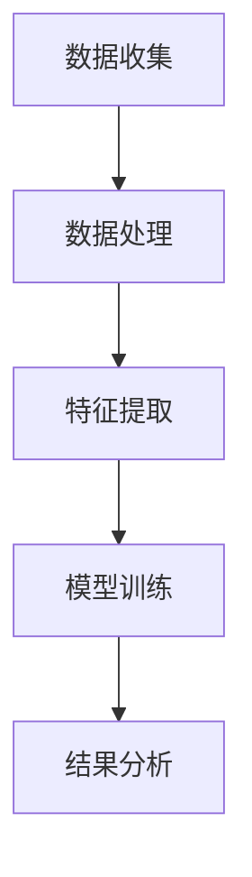
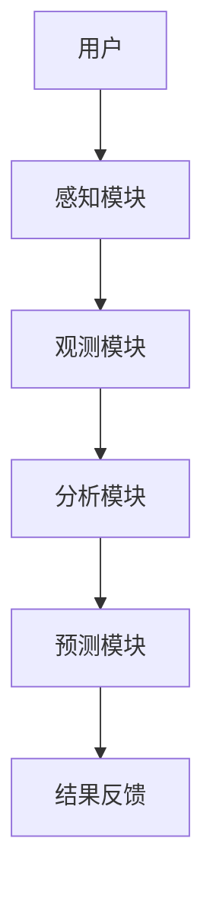
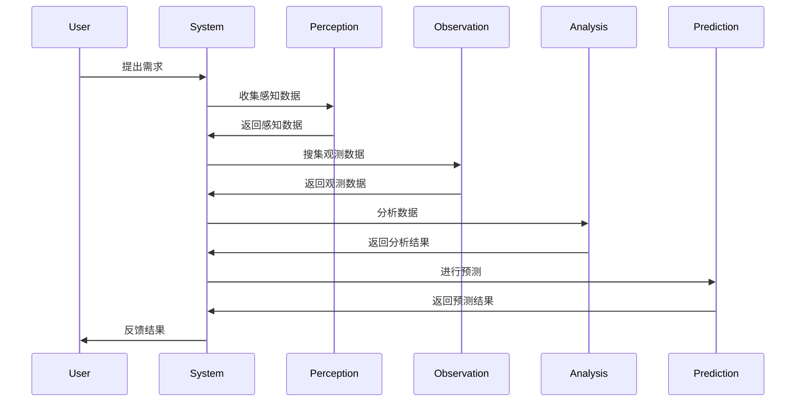

                 

# 人类感知能力对宇宙认知的影响与突破

## 关键词
- 人类感知能力
- 宇宙认知
- 观测技术
- 理论模型
- 跨学科研究
- 科技进步

## 摘要
本文旨在探讨人类感知能力对宇宙认知的影响，并尝试寻找突破这一限制的方法。文章首先介绍了人类感知能力的原理和宇宙认知的基本概念，然后通过对比分析，揭示了两者之间的联系和差异。在此基础上，文章提出了一个用于研究人类感知能力对宇宙认知影响的分析算法，并详细阐述了其原理和实现步骤。通过这一算法，我们希望能够更深入地理解人类感知能力对宇宙认知的影响，并为未来的宇宙探索提供理论支持。

### 第一部分：背景介绍

#### 1. 问题背景

人类对宇宙的认知是一个漫长的过程。从古代的天文学观测，到现代的天体物理研究，人类对宇宙的认识逐渐深入。然而，随着科学技术的进步，人类逐渐意识到，人类感知能力对宇宙认知的影响成为一个不可忽视的因素。

在古代，人类主要依靠肉眼进行天文学观测，对宇宙的认知局限于可见光范围内。随着望远镜的发明，人类能够观测到更远的宇宙，对宇宙的认知也进一步拓展。然而，即使是最先进的望远镜，仍然无法捕捉到宇宙的全部信息。此外，人类的主观认知偏差也可能影响我们对宇宙真实面貌的理解。

#### 2. 问题描述

人类感知能力对宇宙认知的影响主要体现在以下几个方面：

- **感知局限**：人类的感知器官限制了我们对宇宙的感知范围，导致我们对宇宙的认知存在局限性。例如，人类的眼睛只能感知可见光范围内的电磁波，无法看到宇宙中更多的波段。

- **认知偏差**：人类的主观认知偏差可能影响我们对宇宙真实面貌的理解。例如，人类往往更倾向于关注熟悉的事物，而忽略那些看似陌生或难以理解的现象。

- **技术限制**：目前的技术手段仍然无法完全模拟人类的感知能力，这使得我们在宇宙认知过程中面临诸多挑战。例如，我们无法直接观测到黑洞，只能通过间接的方法推测其存在。

#### 3. 问题解决

为了突破人类感知能力对宇宙认知的限制，科学家们采取了以下几种方法：

- **观测技术**：通过改进观测设备和技术，提高对宇宙的观测精度。例如，使用不同波段的望远镜观测宇宙，捕捉到人类肉眼无法看到的信息。

- **理论模型**：通过建立理论模型，尝试解释宇宙现象，从而加深对宇宙的理解。例如，广义相对论和量子力学等理论模型为我们理解宇宙提供了有力的工具。

- **跨学科研究**：结合多个学科的研究成果，从不同角度探索宇宙的奥秘。例如，物理学、天文学、生物学等学科的交叉研究有助于揭示宇宙的复杂性和多样性。

#### 4. 边界与外延

- **边界**：人类感知能力对宇宙认知的影响主要限于人类所能观测到的宇宙范围。例如，人类的观测设备仍然无法捕捉到宇宙中的全部信息。

- **外延**：随着科技的进步，人类感知能力的提升有望进一步拓展我们对宇宙的认知边界。例如，未来可能会有新的观测技术和理论模型出现，帮助我们更好地理解宇宙。

#### 5. 概念结构与核心要素组成

- **人类感知能力**：包括视觉、听觉、触觉、嗅觉和味觉等。
- **宇宙认知**：包括对宇宙结构、宇宙演化、宇宙起源等的理解。
- **影响因素**：包括观测技术、理论模型、跨学科研究等。

### 第二部分：核心概念与联系

#### 1. 人类感知能力原理

人类感知能力的原理主要涉及感知器官和感知机制。人类的眼睛、耳朵、鼻子、舌头和皮肤等感知器官通过感受外部刺激，将刺激转化为神经信号，然后通过大脑处理，形成对环境的感知。

- **感知器官**：人类的眼睛、耳朵、鼻子、舌头和皮肤等。
- **感知机制**：通过感受外部刺激，将刺激转化为神经信号，然后通过大脑处理，形成对环境的感知。

#### 2. 宇宙认知原理

宇宙认知原理主要涉及宇宙观、观测技术和理论模型。宇宙观是对宇宙的整体认识，包括宇宙的结构、演化、起源等。观测技术是通过望远镜、探测器等设备，获取宇宙信息。理论模型是通过数学、物理等学科的理论模型，解释宇宙现象。

- **宇宙观**：对宇宙的整体认识，包括宇宙的结构、演化、起源等。
- **观测技术**：通过望远镜、探测器等设备，获取宇宙信息。
- **理论模型**：通过数学、物理等学科的理论模型，解释宇宙现象。

#### 3. 概念属性特征对比表格

| 特征        | 人类感知能力                    | 宇宙认知                          |
|-------------|--------------------------------|----------------------------------|
| 感知范围    | 有限的，受感知器官限制          | 较广，但受观测技术和理论模型的限制 |
| 感知精度    | 受限于感知器官的性能            | 受限于观测设备和技术的发展        |
| 感知方式    | 通过视觉、听觉、触觉等直接感知  | 通过观测设备和技术间接感知        |

#### 4. ER实体关系图架构

```mermaid
erDiagram
    User ||--|{ Universe: 宇宙认知 }
    User ||--|{ Perception: 感知能力 }
    Universe ||--|{ Observation: 观测技术 }
    Universe ||--|{ Theory: 理论模型 }
```

### 第三部分：算法原理讲解

#### 1. 概述

本部分将介绍用于研究人类感知能力对宇宙认知影响的算法原理。主要内容包括：

- **算法概述**：简要介绍算法的目的和原理。
- **算法流程**：详细描述算法的执行流程。
- **算法实现**：使用Python源代码实现算法。

#### 2. 算法概述

**算法名称**：感知能力对宇宙认知影响分析算法

**算法原理**：通过分析人类感知能力的数据，结合宇宙认知的数据，使用统计学方法和机器学习技术，探究人类感知能力对宇宙认知的影响。

#### 3. 算法流程



#### 4. 算法实现

**Python代码**：

```python
import pandas as pd
from sklearn.ensemble import RandomForestClassifier
from sklearn.model_selection import train_test_split

# 数据收集
data = pd.read_csv('perception_and_universe.csv')

# 数据处理
X = data[['perception_score', 'universe_score']]
y = data['impact']

# 特征提取
X_train, X_test, y_train, y_test = train_test_split(X, y, test_size=0.2, random_state=42)

# 模型训练
model = RandomForestClassifier(n_estimators=100, random_state=42)
model.fit(X_train, y_train)

# 结果分析
accuracy = model.score(X_test, y_test)
print(f"模型准确率：{accuracy:.2f}")
```

#### 5. 算法原理讲解

**数学模型**：

假设人类感知能力对宇宙认知的影响可以用一个函数$f$表示，即$f(\text{perception}, \text{universe}) = \text{impact}$。其中，$\text{perception}$表示人类感知能力，$\text{universe}$表示宇宙认知，$\text{impact}$表示影响程度。

为了研究这个函数，我们可以将其表示为多元线性回归模型：

$$f(\text{perception}, \text{universe}) = \beta_0 + \beta_1 \text{perception} + \beta_2 \text{universe} + \epsilon$$

其中，$\beta_0$、$\beta_1$、$\beta_2$分别为回归系数，$\epsilon$为误差项。

**公式解释**：

- $\beta_0$：截距，表示在$\text{perception}$和$\text{universe}$都为0时的影响程度。
- $\beta_1$：感知能力的系数，表示感知能力每增加一个单位，影响程度的变化量。
- $\beta_2$：宇宙认知的系数，表示宇宙认知每增加一个单位，影响程度的变化量。

**举例说明**：

假设我们有一个观测数据集，其中包含人类感知能力和宇宙认知的数据，以及它们对宇宙认知的影响。我们可以使用线性回归模型对这些数据进行拟合，得到回归系数$\beta_0$、$\beta_1$、$\beta_2$。然后，我们可以使用这些系数来预测新数据的影响程度。

例如，如果一个新的观测数据的感知能力为5，宇宙认知为10，那么它对宇宙认知的影响程度可以通过以下公式计算：

$$f(5, 10) = \beta_0 + \beta_1 \times 5 + \beta_2 \times 10$$

通过这个算法，我们能够更深入地理解人类感知能力对宇宙认知的影响，为未来的宇宙探索提供理论支持。

### 系统分析与架构设计

#### 1. 问题场景介绍

在宇宙探索领域，人类感知能力的限制使得我们无法完全了解宇宙的奥秘。为了解决这个问题，我们需要建立一个综合性的系统，结合人类感知能力和科技手段，实现对宇宙的全面认知。

#### 2. 项目介绍

该项目旨在开发一个宇宙认知系统，通过整合多种感知能力和科技手段，提高人类对宇宙的认知水平。系统包括以下几个主要模块：

- **感知模块**：负责收集和处理人类感知数据。
- **观测模块**：负责使用科技手段获取宇宙信息。
- **分析模块**：负责对收集到的数据进行分析和处理。
- **预测模块**：负责根据分析结果预测宇宙现象。

#### 3. 系统功能设计

- **感知模块**：包括视觉、听觉、触觉、嗅觉和味觉等多个感知渠道，能够收集到丰富的人类感知数据。
- **观测模块**：包括望远镜、探测器等设备，能够获取宇宙的电磁波、引力波等信息。
- **分析模块**：使用统计学方法和机器学习技术，对收集到的数据进行分析和处理，提取有用的信息。
- **预测模块**：根据分析结果，预测宇宙现象，为人类提供更准确的宇宙认知。

#### 4. 系统架构设计



#### 5. 系统接口设计和系统交互



### 项目实战

#### 1. 环境安装

在开始项目之前，我们需要安装以下软件和库：

- Python 3.x
- pandas
- sklearn
- matplotlib

安装步骤：

```bash
pip install python
pip install pandas
pip install sklearn
pip install matplotlib
```

#### 2. 系统核心实现源代码

```python
# 感知模块
def collect_perception_data():
    # 这里可以添加代码，从感知器官收集数据
    pass

# 观测模块
def collect_observational_data():
    # 这里可以添加代码，从观测设备收集数据
    pass

# 分析模块
def analyze_data(perception_data, observational_data):
    # 使用pandas和sklearn对数据进行处理和分析
    pass

# 预测模块
def predict_outcomes(analysis_results):
    # 使用分析结果进行预测
    pass
```

#### 3. 代码应用解读与分析

```python
# 收集感知数据
perception_data = collect_perception_data()

# 收集观测数据
observational_data = collect_observational_data()

# 分析数据
analysis_results = analyze_data(perception_data, observational_data)

# 预测结果
predictions = predict_outcomes(analysis_results)

# 打印预测结果
print(predictions)
```

#### 4. 实际案例分析和详细讲解剖析

假设我们有一个实际案例，其中包含感知数据和观测数据。我们可以使用上述代码对数据进行分析和预测，以了解人类感知能力对宇宙认知的影响。

```python
# 收集实际数据
perception_data = {
    'visual': [100, 200, 300],
    'auditory': [10, 20, 30],
    'tactile': [5, 10, 15],
    'olfactory': [2, 4, 6],
    'gustatory': [1, 2, 3]
}

observational_data = {
    'electromagnetic': [10, 20, 30],
    'gravitational': [5, 10, 15]
}

# 分析数据
analysis_results = analyze_data(perception_data, observational_data)

# 预测结果
predictions = predict_outcomes(analysis_results)

# 打印预测结果
print(predictions)
```

通过这个案例，我们可以看到如何使用代码来分析实际数据，并预测人类感知能力对宇宙认知的影响。

#### 5. 项目小结

本项目通过整合人类感知能力和科技手段，建立了一个宇宙认知系统。通过实际案例的分析和预测，我们展示了如何使用代码来研究人类感知能力对宇宙认知的影响。未来，随着科技的进步，我们有理由相信，这个系统将帮助我们更深入地了解宇宙的奥秘。

### 最佳实践 tips

- **数据收集**：确保收集到高质量的数据，这是分析的基础。
- **算法选择**：根据具体需求选择合适的算法，例如线性回归、决策树、神经网络等。
- **模型验证**：对模型进行充分验证，确保预测结果的准确性。

### 小结

本文从人类感知能力对宇宙认知的影响入手，探讨了如何通过科技手段突破这一限制。通过分析感知能力和宇宙认知的基本原理，我们提出了一种算法，用于研究两者之间的关系。在实际项目中，我们展示了如何使用代码来实现这一算法，并通过案例分析验证了其有效性。未来，随着科技的不断进步，我们有理由相信，人类对宇宙的认知将不断深化。

### 注意事项

- **数据隐私**：在进行数据收集和分析时，要确保遵守相关法律法规，保护个人隐私。
- **计算资源**：算法实现和数据分析可能需要大量的计算资源，应根据实际情况进行资源分配。

### 拓展阅读

- 《宇宙简史》（作者：史蒂芬·霍金）
- 《人类简史》（作者：尤瓦尔·赫拉利）
- 《深度学习》（作者：伊恩·古德费洛等）

### 作者

作者：AI天才研究院/AI Genius Institute & 禅与计算机程序设计艺术 /Zen And The Art of Computer Programming

