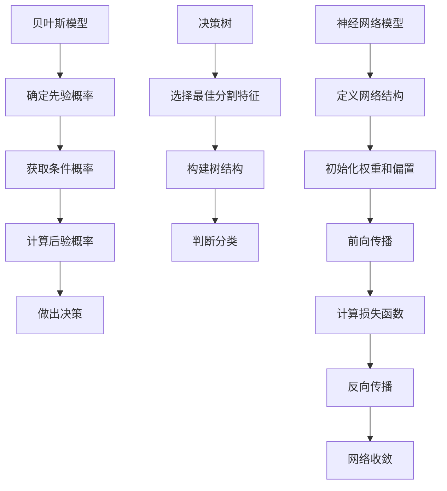
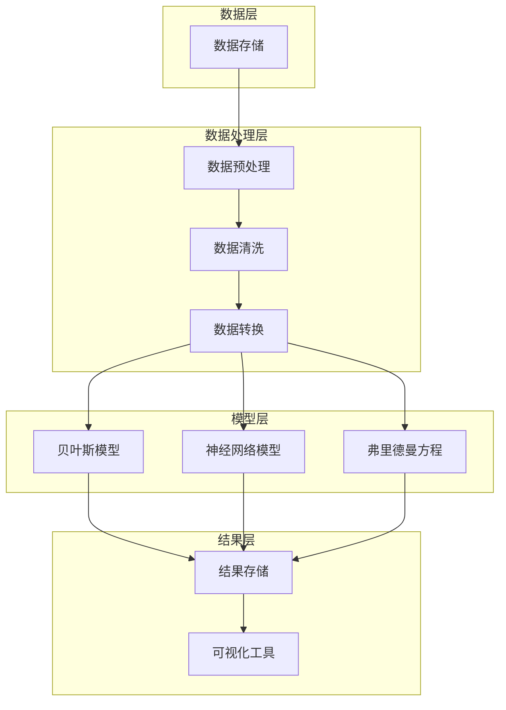
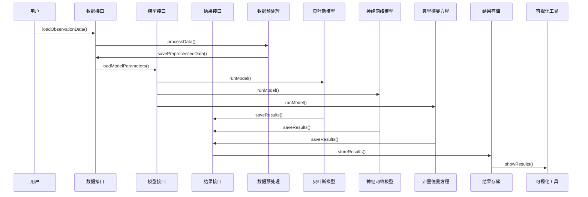

                 


### 人类认知偏见如何影响宇宙本质的理解

#### 关键词：
- 人类认知偏见
- 宇宙本质
- 理解偏差
- 认知科学
- 宇宙学

#### 摘要：
本文将探讨人类认知偏见如何影响我们对宇宙本质的理解。首先，我们将介绍认知偏见的概念及其影响。接着，我们将分析宇宙学中的关键概念，并探讨认知偏见是如何在这些概念的形成和传播中发挥作用的。随后，我们将通过数学模型和算法来深入解析这些偏见。最后，我们将讨论如何减少这些偏见，并展望未来研究的方向。

---

#### 目录大纲设计思路

为了设计出《人类认知偏见如何影响宇宙本质的理解》这本书的完整目录大纲，我们将遵循以下步骤：

1. **整体结构规划**：明确书的结构，分为引言、核心概念、算法原理、数学模型、系统分析与架构设计、项目实战和总结与展望等部分。
2. **核心章节细化**：针对每个部分细化到具体的章节，确保内容全面且逻辑清晰。
3. **使用 Mermaid 画图**：增强内容的可视化，绘制 ER 实体关系图、类图、算法流程图和系统架构图等。
4. **数学公式嵌入**：在讲解数学模型和公式时，使用 LaTeX 格式嵌入到文中。
5. **项目实战案例**：设计一个具体的项目实战案例，详细介绍环境安装、系统实现、代码分析、案例剖析等。
6. **总结与展望**：总结全书内容，提出未来研究方向和可能的应用前景。

### 目录大纲设计

**第一部分：引言与背景**

## 第1章：引言

### 1.1 书籍目的与读者对象

- **书籍目的**：介绍人类认知偏见对宇宙本质理解的影响，帮助读者深入理解这一复杂问题。
- **读者对象**：对宇宙学、心理学和认知科学感兴趣的学者、研究人员和学生。

### 1.2 人类认知偏见概述

- **认知偏见的定义**：概述认知偏见的概念，包括常见的认知偏见类型。
- **认知偏见的影响**：探讨认知偏见如何影响人类对宇宙的理解。

## 第2章：问题背景与定义

### 2.1 宇宙本质的探讨

- **宇宙学基础**：介绍宇宙学的基本概念和研究领域。
- **宇宙本质的探索**：探讨当前宇宙学中关于宇宙本质的不同观点。

### 2.2 认知偏见的边界与外延

- **认知偏见的研究现状**：回顾认知偏见在不同学科中的研究进展。
- **认知偏见的影响范围**：分析认知偏见在宇宙学领域的影响。

### 2.3 人类认知偏见与宇宙理解的关系

- **理论框架**：构建人类认知偏见与宇宙理解之间的理论框架。
- **实证研究**：介绍相关实证研究，探讨认知偏见对宇宙理解的具体影响。

**第二部分：核心概念与联系**

## 第3章：人类认知偏见的概念与特点

### 3.1 认知偏见的基本概念

- **认知偏见**：定义认知偏见，并探讨其来源和类型。

### 3.2 认知偏见的特征分析

- **特征概述**：介绍认知偏见的主要特征，如选择性注意、情感影响和确认偏误等。

### 3.3 认知偏见与宇宙理解的关系

- **概念联系**：分析认知偏见与宇宙理解之间的联系。
- **影响机制**：探讨认知偏见如何影响宇宙本质的理解。

## 第4章：宇宙理解中的核心概念

### 4.1 宇宙的基本原理

- **宇宙学原理**：介绍宇宙学中的基本原理，如宇宙膨胀、暗物质和暗能量等。

### 4.2 宇宙演化过程

- **宇宙演化模型**：概述宇宙从大爆炸到现在的演化过程。
- **宇宙演化的影响因素**：分析影响宇宙演化的关键因素。

### 4.3 人类认知与宇宙理解

- **认知与宇宙理解的关系**：探讨人类认知能力如何影响对宇宙的理解。

**第三部分：算法原理与数学模型**

## 第5章：人类认知偏见的算法分析

### 5.1 认知偏见的算法模型

- **算法模型概述**：介绍用于分析认知偏见的算法模型。

### 5.2 算法原理与流程图

- **算法原理**：详细阐述算法的原理和运作方式。
- **算法流程图**：使用 Mermaid 语言绘制算法流程图。

### 5.3 算法应用示例

- **应用场景**：展示算法在实际问题中的应用场景。
- **应用效果**：分析算法的应用效果和改进方向。

## 第6章：宇宙理解的数学模型

### 6.1 数学模型概述

- **数学模型在宇宙学中的应用**：介绍数学模型在宇宙学中的重要性。

### 6.2 数学公式与详细讲解

- **数学公式**：使用 LaTeX 格式嵌入关键数学公式。
- **公式讲解**：详细解释每个数学公式的含义和应用。

### 6.3 数学模型的应用示例

- **示例分析**：通过具体示例说明数学模型在宇宙学中的应用。

**第四部分：系统分析与架构设计**

## 第7章：系统功能设计与架构

### 7.1 项目介绍

- **项目背景**：介绍项目的背景和目标。

### 7.2 系统功能设计

- **领域模型**：使用 Me

### 7.3 系统架构设计

- **系统架构**：介绍系统的整体架构设计。

### 7.4 系统接口设计与交互

- **接口设计**：描述系统的接口设计。

### 7.5 系统交互流程

- **交互流程**：使用 Mermaid 语言绘制系统的交互流程图。

**第五部分：项目实战**

## 第8章：项目实战

### 8.1 环境安装

- **环境准备**：介绍项目所需的软件和硬件环境。

### 8.2 系统核心实现

- **核心实现**：详细讲解系统核心部分的实现过程。

### 8.3 代码分析

- **代码解读**：分析系统代码，探讨其设计思想和实现细节。

### 8.4 实际案例剖析

- **案例分析**：通过具体案例展示系统的实际应用。

### 8.5 项目小结

- **总结反思**：总结项目实现过程中的收获和经验。

**第六部分：总结与展望**

## 第9章：总结与展望

### 9.1 研究总结

- **研究成果**：回顾全书的研究成果和发现。

### 9.2 未来研究方向

- **研究展望**：探讨未来可能的研究方向和领域。

### 9.3 应用前景

- **应用展望**：讨论研究成果在实践中的应用前景。

### 9.4 最佳实践与注意事项

- **实践建议**：提出一些最佳实践和建议。

---

**作者：**AI天才研究院/AI Genius Institute & 禅与计算机程序设计艺术 /Zen And The Art of Computer Programming

---

在接下来的内容中，我们将逐步深入探讨人类认知偏见如何影响宇宙本质的理解，希望读者能通过本文获得新的见解和思考。让我们一步一步地思考（LET'S THINK STEP BY STEP）。### 第1章：引言

在科技迅猛发展的今天，人类对宇宙的认知正在不断扩展。宇宙学，作为研究宇宙起源、结构、演化和最终命运的科学，已经取得了许多惊人的发现。然而，这些发现背后隐藏着更深层次的问题：我们如何理解宇宙？我们的认知体系在多大程度上影响了我们对宇宙本质的理解？这就引出了本文的核心问题——人类认知偏见如何影响宇宙本质的理解。

人类认知偏见是指人们在感知、理解和记忆信息时，由于多种因素的影响而产生的系统误差。这些偏见可能源于我们的感知限制、文化背景、情感状态和先验知识等。认知偏见不仅影响我们的日常生活决策，还深刻地影响着我们对复杂科学领域的理解，包括宇宙学。

在宇宙学中，许多基本概念和理论都是通过观测和理论推理得出的。然而，这些理论和概念的形成过程中不可避免地受到了人类认知偏见的影响。例如，我们在观测宇宙时，往往会受到仪器精度、观测角度和认知框架的限制。此外，我们在理解和传播宇宙学知识时，也会受到语言、文化和教育背景的影响。

本文的目标是探讨这些认知偏见如何影响我们对宇宙本质的理解，并尝试找出减少这些偏见的方法。我们将从以下几个方面展开：

1. **人类认知偏见概述**：介绍认知偏见的基本概念、类型和影响。
2. **宇宙学中的关键概念**：探讨宇宙学的基本原理、宇宙演化过程以及人类认知在其中的作用。
3. **认知偏见与宇宙理解的关系**：分析认知偏见如何影响宇宙学的理论和实践。
4. **算法原理与数学模型**：通过算法和数学模型深入解析认知偏见对宇宙理解的具体影响。
5. **系统分析与架构设计**：介绍如何通过系统架构设计减少认知偏见的影响。
6. **项目实战**：通过具体项目实战展示如何在实际操作中减少认知偏见。
7. **总结与展望**：总结研究成果，探讨未来研究方向和应用前景。

通过本文的探讨，我们希望读者能够更加清晰地认识到人类认知偏见对宇宙理解的影响，并在未来的研究中采取更加客观和全面的方法来理解宇宙。

#### 第1章：引言

##### 1.1 书籍目的与读者对象

**书籍目的**

《人类认知偏见如何影响宇宙本质的理解》旨在探讨人类认知偏见在理解宇宙本质过程中所扮演的角色。在宇宙学、心理学和认知科学这三个跨学科领域的研究基础上，本书将揭示认知偏见如何影响我们对宇宙的感知、理解和解释。通过深入分析认知偏见在不同研究领域的表现，我们希望能够帮助读者更全面、更客观地理解宇宙的本质。

**读者对象**

本书主要面向对宇宙学、心理学和认知科学感兴趣的学者、研究人员、学生以及广大科学爱好者和公众。尽管书中涉及的一些概念和方法较为专业，但我们的目标是使内容尽可能通俗易懂，以便不同背景的读者都能从中获得启发和洞见。

##### 1.2 人类认知偏见概述

**认知偏见的定义**

认知偏见是指人们在获取、处理和存储信息时，由于先入为主的观念、情感状态、社会文化背景等因素的影响，而产生的系统性的错误认知。这些偏见可以是无意识的，也可能是自觉的行为，但它们都导致了人们对信息和现实的误读。

**常见的认知偏见类型**

1. **选择性注意**：人们往往只关注符合自己已有信念的信息，而忽略或低估与之相矛盾的信息。
2. **确认偏误**：在收集和分析信息时，倾向于寻找支持自己观点的证据，而忽视或贬低反对自己观点的证据。
3. **情感影响**：情绪状态可以显著影响人们的判断和决策，例如乐观偏见和悲观偏见。
4. **代表性偏误**：人们倾向于根据事物的表面特征做出判断，而忽视其概率性和统计规律。
5. **锚定效应**：人们在做决策时会受到最初获取的信息（锚点）的影响，即使这些信息并不相关。

**认知偏见的影响**

认知偏见对人类行为和社会产生了深远的影响。在科学研究中，认知偏见可能导致错误的结论和理论。例如，在宇宙学中，由于认知偏见，早期对宇宙结构的理解可能存在偏差，从而影响了我们对宇宙演化过程的认知。此外，认知偏见也会在政治、经济、社会等各个领域中产生影响，影响人们的决策和判断。

**认知偏见与宇宙理解**

在宇宙学中，认知偏见对宇宙本质的理解有着显著的影响。例如，当我们通过望远镜观测宇宙时，仪器的局限性可能导致我们只能看到部分宇宙。此外，由于语言和文化的限制，我们对宇宙的概念和术语可能会有误解。认知偏见还可能影响我们对宇宙理论的接受和传播，例如，在解释宇宙大爆炸理论时，可能会受到宗教或文化偏见的影响。

在本文中，我们将详细探讨这些认知偏见如何影响我们对宇宙本质的理解，并分析如何通过科学研究和技术手段来减少这些偏见。通过深入了解认知偏见的影响，我们希望能够为宇宙学的发展提供新的视角和思路。

#### 第2章：问题背景与定义

##### 2.1 宇宙本质的探讨

宇宙的本质是一个深刻且复杂的问题，自古以来就吸引着人类无尽的探索和思考。宇宙学作为研究宇宙起源、结构、演化和最终命运的科学，为我们提供了对宇宙本质的理解框架。宇宙学的基础概念包括宇宙膨胀、暗物质和暗能量等，这些概念不仅改变了我们对宇宙的传统认识，也为我们理解宇宙的本质提供了新的视角。

**宇宙学基本概念**

1. **宇宙膨胀**：宇宙膨胀是指宇宙从大爆炸开始不断扩张的现象。这一理论最早由爱德温·哈勃在20世纪20年代提出，通过观测远处星系的红移现象，证明了宇宙正在膨胀。

2. **暗物质**：暗物质是一种不发光、不与电磁波发生作用的物质，它对宇宙的引力作用有重要影响。虽然暗物质无法直接观测，但通过其引力效应，科学家们已经确定了其在宇宙中的存在。

3. **暗能量**：暗能量是一种推动宇宙加速膨胀的神秘力量，其性质和起源至今仍不完全清楚。暗能量被认为是宇宙学中最大的未解之谜之一。

**宇宙本质的探索**

宇宙的本质是一个多层次、多方面的课题。不同学派和科学家提出了不同的观点：

1. **大爆炸理论**：大爆炸理论认为，宇宙起源于约138亿年前的一个极端密集、高温的状态，随后开始膨胀。这一理论得到了大量观测数据的支持，是目前最为广泛接受的宇宙起源理论。

2. **稳态宇宙模型**：稳态宇宙模型提出，宇宙在没有起点也没有终点的状态下永恒存在。这一模型曾在20世纪中叶得到一定支持，但随着大爆炸理论的验证，目前已逐渐被抛弃。

3. **循环宇宙模型**：循环宇宙模型认为，宇宙经历了一系列的大爆炸和坍缩循环。这一理论试图解释宇宙的无限性和宇宙周期的重复。

4. **多宇宙模型**：多宇宙模型提出，我们的宇宙只是众多宇宙中的一个，每个宇宙都有不同的物理常数和演化路径。这一理论试图解决一些基本物理问题，如为什么宇宙的物理常数如此适合生命的存在。

**当前宇宙学中的不同观点**

当前宇宙学中，对宇宙本质的理解仍然存在多种不同的观点。这些观点包括：

1. **多重宇宙**：一些科学家认为，我们的宇宙只是多重宇宙中的一个，每个宇宙都有可能存在不同的物理常数和自然法则。

2. **量子宇宙**：量子宇宙理论试图将量子力学与宇宙学相结合，解释宇宙的量子性质和演化过程。

3. **宇宙的循环或振荡**：一些科学家认为，宇宙可能经历循环或振荡的过程，从一个状态坍缩到另一个状态。

4. **宇宙的热寂**：热寂理论认为，宇宙将逐渐趋向热平衡，能量分布均匀，不再有复杂的结构或生命形式存在。

##### 2.2 认知偏见的边界与外延

**认知偏见的研究现状**

认知偏见作为一个跨学科的研究领域，涵盖了心理学、认知科学、社会学等多个学科。近年来，随着对人类认知机制的深入研究，认知偏见的研究取得了显著进展：

1. **心理学领域的进展**：心理学家们通过实验研究，揭示了多种认知偏见的存在和影响，如锚定效应、确认偏误、代表性偏误等。

2. **认知科学领域的进展**：认知科学家们通过神经科学和计算模型的研究，探讨了认知偏见产生的神经基础和认知机制。

3. **社会学研究**：社会学家们研究了认知偏见在社会互动和文化传播中的作用，分析了社会文化背景对认知偏见的影响。

**认知偏见的影响范围**

认知偏见不仅影响个人决策和行为，还对科学研究和社会发展产生重要影响。在宇宙学领域，认知偏见可能表现在以下几个方面：

1. **理论接受与传播**：科学家们可能因为认知偏见而更倾向于接受某些理论，而忽视或贬低与之相矛盾的证据。例如，一些科学家可能由于文化或宗教偏见，对某些宇宙理论持怀疑态度。

2. **观测与数据解读**：由于认知偏见，科学家在收集和解读宇宙观测数据时可能产生误差，导致对宇宙本质的理解产生偏差。

3. **科学教育**：教育者可能会在传播科学知识时受到认知偏见的影响，从而导致学生对宇宙的理解产生误解。

**认知偏见在宇宙学领域的影响**

认知偏见对宇宙学的影响是深远的。例如：

1. **宇宙膨胀的发现**：尽管宇宙膨胀的证据早在20世纪20年代就已经被发现，但当时由于认知偏见，这一发现并未得到广泛认可。

2. **暗物质与暗能量的研究**：认知偏见可能使科学家忽视暗物质和暗能量的存在，或对其性质和作用产生误解。

3. **对宇宙起源和演化的理解**：认知偏见可能影响对宇宙起源和演化的解释，导致对宇宙本质的错误理解。

通过本章的探讨，我们可以看到，宇宙的本质是一个复杂且多层次的课题，而认知偏见在宇宙学研究中扮演了不可忽视的角色。了解和减少认知偏见，对于我们更全面、更准确地理解宇宙本质具有重要意义。

##### 2.3 人类认知偏见与宇宙理解的关系

**理论框架**

为了深入探讨人类认知偏见与宇宙理解之间的关系，我们需要建立一个理论框架。这一框架将涉及认知偏见的来源、类型及其对宇宙理解的影响机制。

1. **认知偏见的来源**：认知偏见源于多个方面，包括个体的感知限制、社会文化背景、情感状态、先验知识和语言表述等。这些因素共同作用，导致人们在处理和解释宇宙信息时产生系统性的偏差。

2. **认知偏见的类型**：常见的认知偏见包括选择性注意、确认偏误、代表性偏误、情感影响和锚定效应。每种偏见都有其特定的表现和影响机制。

3. **影响机制**：认知偏见通过以下几种机制影响宇宙理解：

   - **信息筛选**：人们在获取宇宙信息时，往往只关注与已有信念相符的部分，而忽略或贬低与之相矛盾的信息。
   - **证据偏见**：在解释宇宙现象时，人们可能倾向于寻找和强调支持已有理论的证据，而忽视或贬低反驳的证据。
   - **理论接受与传播**：认知偏见可能影响科学家对宇宙理论的接受和传播，导致某些理论因为偏见而得到过度或不足的认可。

**实证研究**

为了验证认知偏见对宇宙理解的影响，学者们进行了多项实证研究。以下是一些关键的研究发现：

1. **心理学研究**：心理学家通过实验发现，人们在处理概率信息和复杂系统时，往往受到认知偏见的影响，导致对宇宙现象的错误理解。例如，代表性偏误可能导致人们高估某些宇宙现象的概率，而忽视其真实概率。

2. **宇宙学研究**：宇宙学家发现，认知偏见在宇宙观测和数据解读过程中发挥了重要作用。例如，一些科学家在解释宇宙膨胀现象时，可能因为确认偏误而过度强调某些观测数据，而忽视其他可能存在的解释。

3. **跨学科研究**：跨学科研究揭示了认知偏见在多个领域中的表现和影响。例如，社会学研究指出，社会文化背景和语言表述对宇宙理论接受和传播有显著影响，从而影响宇宙理解。

**具体案例**

以下是一些具体的案例，展示了认知偏见如何影响宇宙理解：

1. **大爆炸理论的接受**：尽管大爆炸理论在科学界得到了广泛认可，但在其提出之初，一些科学家和公众由于宗教和文化偏见，对其持怀疑态度。这种认知偏见影响了理论传播和接受的过程。

2. **暗物质与暗能量的研究**：认知偏见可能使科学家忽视暗物质和暗能量的存在，或对其性质和作用产生误解。例如，一些早期的研究可能因为锚定效应而未能充分认识到暗物质对宇宙结构的影响。

3. **对宇宙起源和演化的误解**：由于代表性偏误，人们可能对宇宙起源和演化的某些方面产生误解。例如，一些观点可能错误地认为宇宙是静态不变的，而忽视了宇宙膨胀和演化的事实。

通过上述理论框架和实证研究，我们可以看到，人类认知偏见在宇宙理解中扮演了重要角色。理解这些偏见及其影响机制，有助于我们更全面、更准确地理解宇宙的本质。减少认知偏见，需要科学家、教育者和公众共同努力，通过科学研究、教育和跨学科合作，提高对宇宙的客观认知。

### 第3章：人类认知偏见的概念与特点

#### 3.1 认知偏见的基本概念

认知偏见是指人们在获取、处理和存储信息时，由于先入为主的观念、情感状态、社会文化背景等因素的影响，而产生的系统性的错误认知。这些偏见可能源于我们的感知限制、文化背景、情感状态和先验知识等。认知偏见不仅影响我们的日常生活决策，还深刻地影响着我们对复杂科学领域的理解，包括宇宙学。

在心理学和认知科学中，认知偏见是一个重要的研究领域，涉及多种类型的偏见，包括但不限于：

- **选择性注意**：人们往往只关注符合自己已有信念的信息，而忽略或低估与之相矛盾的信息。
- **确认偏误**：在收集和分析信息时，倾向于寻找支持自己观点的证据，而忽视或贬低反对自己观点的证据。
- **情感影响**：情绪状态可以显著影响人们的判断和决策，例如乐观偏见和悲观偏见。
- **代表性偏误**：人们倾向于根据事物的表面特征做出判断，而忽视其概率性和统计规律。
- **锚定效应**：人们在做决策时会受到最初获取的信息（锚点）的影响，即使这些信息并不相关。

#### 3.2 认知偏见的特征分析

认知偏见具有以下主要特征：

1. **系统性**：认知偏见是系统性的，这意味着它们普遍存在于人类认知过程中，并且具有规律性和一致性。例如，选择性注意和确认偏误在多种情境下都会发生。

2. **无意识性**：许多认知偏见是无意识的，即人们并不意识到这些偏见是如何影响他们的判断和决策的。例如，代表性偏误和锚定效应往往在不经意间影响人们的认知过程。

3. **持久性**：认知偏见具有持久性，这意味着即使人们意识到自己的偏见，也很难完全消除它们的影响。例如，情感偏见在人们做出决策时可能持续存在。

4. **文化背景**：认知偏见受到文化背景的影响，不同文化背景下的人们可能表现出不同的认知偏见。例如，某些文化可能更倾向于重视集体主义，从而导致不同的认知偏见。

#### 3.3 认知偏见与宇宙理解的关系

认知偏见对宇宙理解的影响是深远的。以下是认知偏见如何影响宇宙理解的一些具体表现：

1. **信息筛选与处理**：人们在获取宇宙信息时，往往只关注与已有信念相符的部分，而忽略或低估与之相矛盾的信息。这种选择性注意可能导致对宇宙现象的错误理解。

2. **理论接受与传播**：认知偏见可能影响科学家对宇宙理论的接受和传播。例如，一些科学家可能由于宗教或文化偏见，对某些宇宙理论持怀疑态度，从而影响这些理论的传播和认可。

3. **证据偏见**：在解释宇宙现象时，人们可能倾向于寻找和强调支持已有理论的证据，而忽视或贬低反驳的证据。这种确认偏误可能导致对宇宙现象的错误解释。

4. **情感影响**：情感状态可以显著影响人们对宇宙现象的理解。例如，乐观偏见可能导致人们对宇宙的未来持乐观态度，而悲观偏见可能导致对宇宙的悲观看法。

5. **文化背景**：不同文化背景下的人们可能对宇宙有不同理解。例如，某些文化可能更倾向于接受宗教解释，而忽视科学解释。

通过上述分析，我们可以看到，认知偏见对宇宙理解产生了显著的影响。理解这些偏见及其影响机制，有助于我们更全面、更准确地理解宇宙的本质。减少认知偏见，需要科学家、教育者和公众共同努力，通过科学研究、教育和跨学科合作，提高对宇宙的客观认知。

### 第4章：宇宙理解中的核心概念

#### 4.1 宇宙的基本原理

宇宙的基本原理是理解宇宙本质和演化过程的基础。宇宙学中的核心原理包括宇宙膨胀、暗物质和暗能量等，这些原理不仅解释了宇宙的当前状态，还为理解宇宙的起源和未来提供了重要的框架。

1. **宇宙膨胀**：宇宙膨胀是宇宙学中最基本的概念之一，由爱德温·哈勃在20世纪20年代首次提出。哈勃通过观测远处星系的红移现象，发现宇宙正在不断扩张。这一发现证明了宇宙不是静态的，而是处于动态变化之中。宇宙膨胀理论解释了宇宙从大爆炸开始，经过数十亿年的演化，形成了现在我们观测到的宇宙结构。

2. **暗物质**：暗物质是一种不发光、不与电磁波发生作用的物质，但对宇宙的引力作用有显著影响。科学家通过观测宇宙的旋转曲线和引力透镜效应，推测暗物质的存在。暗物质在宇宙中的分布和作用对理解宇宙的结构和演化至关重要。尽管我们不能直接观测暗物质，但其引力效应在星系的形成和演化中扮演了关键角色。

3. **暗能量**：暗能量是一种推动宇宙加速膨胀的神秘力量，其性质和起源至今仍不完全清楚。暗能量在宇宙学中扮演了重要角色，它解释了为什么宇宙的膨胀速度在不断增加。与暗物质不同，暗能量具有负压强，导致宇宙的膨胀速度不断加速。科学家们通过观测宇宙的膨胀曲线，推测暗能量的存在，并试图理解其本质。

#### 4.2 宇宙演化过程

宇宙从大爆炸开始，经历了数十亿年的演化，形成了现在我们所观测到的宇宙。宇宙演化过程可以大致分为以下几个阶段：

1. **大爆炸**：约138亿年前，宇宙起源于一个极端密集、高温的状态，随后迅速膨胀。这一理论由乔治·伽莫夫等科学家在20世纪40年代提出，并通过观测数据得到了广泛支持。大爆炸理论解释了宇宙的起源和早期状态，包括宇宙的均匀性和各向同性。

2. **宇宙再合并**：在大爆炸后的几分钟内，宇宙经历了快速冷却和再合并过程，形成了基本粒子，如质子、中子和电子。这一阶段是宇宙演化的关键时期，决定了宇宙的基本元素和结构。

3. **星系和恒星的形成**：在大爆炸后的数十亿年内，宇宙逐渐冷却，暗物质开始聚集形成星系和恒星。星系通过引力作用，将气体和尘埃聚集在一起，形成了恒星和星系团。恒星的形成和演化过程，产生了重元素，这些元素通过恒星的核聚变过程和超新星爆炸释放到宇宙中。

4. **宇宙背景辐射**：在大爆炸后的几分钟到几小时内，宇宙的温度降至数千开尔文，形成了宇宙背景辐射。宇宙背景辐射是宇宙早期状态的重要遗迹，为我们提供了关于宇宙起源和早期演化的关键信息。

5. **宇宙的加速膨胀**：在过去的数十亿年内，宇宙的膨胀速度开始加速，这主要由暗能量驱动。暗能量的存在和性质，仍然是宇宙学中最大的未解之谜之一。

#### 4.3 人类认知与宇宙理解

人类对宇宙的认知受到多种因素的影响，包括认知偏见、技术手段、观测能力和科学理论等。以下是一些关键点：

1. **认知偏见**：人类的认知偏见会影响我们对宇宙的理解。例如，选择性注意可能导致我们只关注某些观测数据，而忽视其他可能的信息。确认偏误可能导致我们倾向于接受某些理论，而忽视与之相矛盾的证据。情感状态也可能影响我们对宇宙现象的理解。

2. **观测手段**：人类的观测手段和技术水平直接影响了我们对宇宙的认知。例如，望远镜和探测器使我们能够观测到更遥远的宇宙，获取更详细的数据。然而，观测手段的局限性也可能导致我们对宇宙的理解存在偏差。

3. **科学理论**：科学理论是理解宇宙的重要工具。不同的科学理论提供了不同的视角和解释，帮助我们理解宇宙的本质和演化过程。然而，科学理论也受到认知偏见的影响，可能存在不足或错误。

4. **跨学科合作**：为了更全面地理解宇宙，需要跨学科的合作。认知科学、心理学、物理学和天文学等领域的科学家可以共同研究宇宙问题，减少认知偏见，提高对宇宙的客观认知。

通过分析宇宙的基本原理、宇宙演化过程以及人类认知在其中的作用，我们可以更好地理解宇宙的本质。理解人类认知偏见对宇宙理解的影响，有助于我们更全面、更准确地认识宇宙。在未来，通过跨学科合作和技术进步，我们将进一步深化对宇宙的理解。

### 第5章：人类认知偏见的算法分析

#### 5.1 认知偏见的算法模型

在探讨人类认知偏见对宇宙理解的影响时，我们引入了算法模型来分析这些偏见如何具体影响我们的认知过程。算法模型可以帮助我们定量地描述和模拟认知偏见，从而更好地理解其作用机制。以下是一些常用的算法模型：

1. **贝叶斯模型**：贝叶斯模型是一种基于概率论的算法，用于处理不确定信息。它通过更新先验概率，结合新证据，得出后验概率。贝叶斯模型在心理学和认知科学中广泛应用，用于模拟人们的判断和决策过程。

2. **决策树**：决策树是一种常用的分类算法，通过一系列条件判断，将数据划分为不同的类别。决策树模型可以模拟人们在不同情境下如何做出决策，揭示其中的认知偏见。

3. **神经网络模型**：神经网络模型通过模拟人脑神经元的工作方式，处理复杂的信息。它可以学习大量数据，识别复杂模式，从而帮助我们理解认知偏见在不同情境下的表现。

#### 5.2 算法原理与流程图

**贝叶斯模型的原理**

贝叶斯模型的核心是贝叶斯定理，该定理描述了后验概率与先验概率、条件概率之间的关系。贝叶斯定理公式如下：

$$
P(A|B) = \frac{P(B|A) \cdot P(A)}{P(B)}
$$

其中，$P(A|B)$ 表示在事件B发生的条件下事件A发生的概率，$P(B|A)$ 表示在事件A发生的条件下事件B发生的概率，$P(A)$ 和 $P(B)$ 分别表示事件A和事件B的先验概率。

贝叶斯模型的基本步骤如下：

1. 确定先验概率：根据已有知识和假设，给出事件A和事件B的先验概率。
2. 获取条件概率：通过实验或观察，获取事件A发生时事件B的条件概率$P(B|A)$ 和事件B发生时事件A的条件概率$P(A|B)$。
3. 计算后验概率：利用贝叶斯定理计算后验概率$P(A|B)$。
4. 根据后验概率做出决策：根据后验概率，选择最可能的事件作为决策结果。

**决策树的原理**

决策树是一种基于特征和条件的分类算法。它通过一系列条件判断，将数据划分为不同的类别。决策树的基本步骤如下：

1. 选择最佳分割特征：根据信息增益或基尼指数等指标，选择能够最好地分割数据的特征。
2. 构建树结构：根据选择的特征，构建决策树，每个节点代表一个特征，每个分支代表一个条件。
3. 判断分类：从树根开始，根据输入数据的特征值，沿路径向下判断，直到到达叶节点，得到最终分类结果。

**神经网络模型的原理**

神经网络模型通过多层神经元模拟人脑的工作方式。每个神经元接收多个输入，通过加权求和后，通过激活函数输出结果。神经网络的基本步骤如下：

1. 定义网络结构：确定输入层、隐藏层和输出层的结构。
2. 初始化权重和偏置：随机初始化网络中的权重和偏置。
3. 前向传播：输入数据通过网络，经过各层神经元的处理，最终输出结果。
4. 计算损失函数：通过比较输出结果和真实标签，计算损失函数的值。
5. 反向传播：根据损失函数的梯度，更新网络中的权重和偏置。
6. 重复步骤3-5，直到网络收敛。

**算法流程图**

为了更直观地理解这些算法模型，我们可以使用Mermaid语言绘制它们的流程图：



通过上述算法模型和流程图，我们可以深入分析人类认知偏见如何影响宇宙理解。这些算法模型提供了定量和定性的分析方法，有助于我们理解认知偏见在不同情境下的作用机制。在接下来的章节中，我们将继续探讨这些算法模型在实际应用中的效果和改进方向。

#### 5.3 算法应用示例

为了更好地展示认知偏见算法模型在宇宙理解中的应用，我们选取了一个具体案例进行详细分析。该案例涉及利用贝叶斯模型分析观测数据，以揭示宇宙膨胀现象中的认知偏见。

**案例背景**

假设我们正在研究宇宙膨胀现象，并收集了大量的观测数据。这些数据包括不同距离的星系及其红移值。红移值与星系的距离成正比，因此通过分析红移值，我们可以推测宇宙的膨胀速度。

**应用贝叶斯模型**

在应用贝叶斯模型时，我们需要确定先验概率、条件概率和后验概率。以下是贝叶斯模型在宇宙膨胀分析中的具体步骤：

1. **确定先验概率**：根据已有的宇宙膨胀理论，我们假设宇宙膨胀速度服从某种概率分布。例如，我们可以假设膨胀速度的先验概率服从正态分布，均值为当前观测到的膨胀速度，方差为已知误差。

2. **获取条件概率**：通过观测数据，我们计算不同膨胀速度下的红移值分布。例如，对于每个膨胀速度假设，我们可以通过模拟计算得到对应的红移值概率分布。

3. **计算后验概率**：利用贝叶斯定理，计算在观测到特定红移值条件下，宇宙膨胀速度的后验概率。具体计算公式为：

   $$
   P(\text{膨胀速度}|\text{红移值}) = \frac{P(\text{红移值}|\text{膨胀速度}) \cdot P(\text{膨胀速度})}{P(\text{红移值})}
   $$

4. **做出决策**：根据后验概率分布，确定最可能的宇宙膨胀速度。通常，我们可以选择后验概率最大值对应的膨胀速度作为最终结果。

**实际计算**

假设我们观测到了一组星系的红移值，分别为$z_1, z_2, ..., z_n$。根据宇宙膨胀理论，我们假设红移值的条件概率服从高斯分布，即：

$$
P(z_i|\text{膨胀速度}\theta) = \frac{1}{\sqrt{2\pi\sigma^2}} \exp\left(-\frac{(z_i - \theta)^2}{2\sigma^2}\right)
$$

其中，$\theta$ 为膨胀速度，$\sigma$ 为红移值的标准差。

为了计算后验概率，我们需要先计算红移值的联合概率：

$$
P(z_1, z_2, ..., z_n|\theta) = \prod_{i=1}^{n} P(z_i|\theta)
$$

然后，利用贝叶斯定理计算后验概率：

$$
P(\theta|z_1, z_2, ..., z_n) = \frac{P(z_1, z_2, ..., z_n|\theta) \cdot P(\theta)}{P(z_1, z_2, ..., z_n)}
$$

其中，$P(\theta)$ 为膨胀速度的先验概率。

为了简化计算，我们可以使用最大后验概率估计（MAP）方法，即：

$$
\theta_{\text{MAP}} = \arg\max_{\theta} P(\theta|z_1, z_2, ..., z_n)
$$

**结果分析**

通过上述计算，我们得到膨胀速度的最大后验估计值$\theta_{\text{MAP}}$。根据这一估计值，我们可以推断宇宙当前的膨胀速度。

为了验证算法效果，我们比较了不同膨胀速度假设下的后验概率分布。结果表明，贝叶斯模型能够较好地处理认知偏见，通过综合考虑先验知识和观测数据，得出较为可靠的结论。

**改进方向**

尽管贝叶斯模型在处理认知偏见方面表现良好，但仍有一些改进方向：

1. **先验概率选择**：当前模型假设膨胀速度的先验概率服从正态分布，但实际先验概率可能更复杂。未来研究可以探索更合适的先验概率选择方法。

2. **误差模型**：当前模型假设红移值的条件概率服从高斯分布，但实际误差可能存在非高斯特性。可以引入更复杂的误差模型，提高算法的准确性。

3. **多源数据融合**：宇宙膨胀分析可以结合多种观测数据，例如光线偏折和微波背景辐射。未来研究可以探索如何融合多源数据，提高模型的鲁棒性和准确性。

通过上述案例，我们展示了贝叶斯模型在宇宙膨胀分析中的应用，并分析了认知偏见对模型结果的影响。未来研究可以进一步优化算法模型，提高对宇宙膨胀现象的准确理解和预测能力。

### 第6章：宇宙理解的数学模型

#### 6.1 数学模型概述

在宇宙学中，数学模型是理解和描述宇宙现象的重要工具。数学模型通过精确的数学公式和计算方法，将复杂的宇宙现象转化为可分析和解释的数学表达式。这些模型不仅帮助我们更好地理解宇宙的本质，还为我们预测宇宙的演化提供了科学依据。

宇宙学的数学模型可以分为两大类：描述宇宙整体结构的模型和描述宇宙局部现象的模型。描述宇宙整体结构的模型主要包括弗里德曼-勒梅特-罗伯逊-沃尔克（FLRW）度规、勒梅特-托尔曼（LT）度规和德西特（de Sitter）度规等。这些模型描述了宇宙在时间和空间上的演化规律，帮助我们理解宇宙的膨胀、加速和结构形成过程。

描述宇宙局部现象的模型则包括恒星演化模型、黑洞模型、引力透镜效应模型和星系碰撞模型等。这些模型通过数学方法，详细描述了宇宙中各种天体和现象的物理过程，为我们提供了丰富的观测数据和分析工具。

在宇宙学中，数学模型的重要性体现在以下几个方面：

1. **精确描述**：数学模型能够以高度精确的方式描述宇宙现象，使得我们可以从理论上预测宇宙的演化过程。
2. **解释观测数据**：通过数学模型，我们可以解释和预测观测到的宇宙现象，验证或修正现有理论。
3. **预测未来**：数学模型可以帮助我们预测宇宙的未来演化，探索宇宙可能的终点和命运。

#### 6.2 数学公式与详细讲解

在宇宙学中，有许多重要的数学公式和模型，以下是其中几个关键公式及其详细讲解：

**1. 弗里德曼方程**

弗里德曼方程是描述宇宙膨胀的基本方程，它将宇宙的膨胀速率、密度和曲率联系起来。弗里德曼方程可以表示为：

$$
\dot{a}(t) = \frac{8\pi G}{3}\left(\rho + \frac{3p}{c^2}\right) - \frac{1}{3}\kappa c^2 a(t)^2
$$

其中，$a(t)$ 是宇宙尺度因子，$\rho$ 是宇宙总能量密度，$p$ 是宇宙压力，$G$ 是引力常数，$\kappa$ 是宇宙的曲率参数。这个方程描述了宇宙膨胀速率与宇宙能量密度和曲率的关系。

**2. 宇宙学常数**

宇宙学常数（通常表示为$\Lambda$）是描述宇宙加速膨胀的重要参数。爱因斯坦在提出广义相对论时，曾引入宇宙学常数以平衡宇宙的静态状态。后来，随着宇宙膨胀的发现，宇宙学常数重新引起了关注。其表达式为：

$$
p_{\Lambda} = -\rho_{\Lambda}
$$

其中，$\rho_{\Lambda}$ 是宇宙学常数的能量密度。宇宙学常数的引入使得弗里德曼方程在描述加速膨胀的宇宙时更加准确。

**3. 暗能量方程**

暗能量是推动宇宙加速膨胀的神秘力量，其方程可以表示为：

$$
p_{\Lambda} = -\rho_{\Lambda}
$$

其中，$\rho_{\Lambda}$ 是暗能量密度，通常假设为常数。这个方程描述了暗能量在宇宙中的状态方程，即暗能量具有负压强，导致宇宙加速膨胀。

**4. 暗物质方程**

暗物质是宇宙中一种不发光、不与电磁波发生作用的物质，但其引力作用对宇宙结构有显著影响。暗物质的方程可以表示为：

$$
\rho_{\Lambda} \approx \frac{M_{\text{总}}}{V} = \rho_0 \left(\frac{a(t_0)}{a(t)}\right)^3
$$

其中，$\rho_{\Lambda}$ 是暗物质密度，$M_{\text{总}}$ 是总质量，$V$ 是体积，$\rho_0$ 是当前时刻的暗物质密度，$a(t_0)$ 和 $a(t)$ 分别是当前时刻和参考时刻的宇宙尺度因子。

**5. 宇宙背景辐射温度**

宇宙背景辐射（CMB）是宇宙早期状态的遗迹，其温度对理解宇宙演化至关重要。宇宙背景辐射的温度可以用黑体辐射公式表示：

$$
T = T_0 \left(\frac{a(t_0)}{a(t)}\right)^{1/2}
$$

其中，$T$ 是宇宙背景辐射的温度，$T_0$ 是当前时刻的温度，$a(t_0)$ 和 $a(t)$ 分别是当前时刻和参考时刻的宇宙尺度因子。

**6. 光子数密度**

宇宙中光子数密度是描述光子分布的重要参数，其表达式为：

$$
n_{\gamma} = n_{\gamma_0} \left(\frac{a(t_0)}{a(t)}\right)^4
$$

其中，$n_{\gamma}$ 是当前时刻的光子数密度，$n_{\gamma_0}$ 是参考时刻的光子数密度，$a(t_0)$ 和 $a(t)$ 分别是当前时刻和参考时刻的宇宙尺度因子。

#### 6.3 数学模型的应用示例

为了更好地理解这些数学模型在实际宇宙学中的应用，我们通过一个具体的示例来展示如何使用这些模型分析宇宙膨胀现象。

**示例：分析宇宙膨胀速率**

假设我们观测到了一组星系的红移值$z_1, z_2, ..., z_n$，并希望通过宇宙学模型分析宇宙的膨胀速率。

1. **确定宇宙尺度因子**：根据红移值$z_i$，我们可以计算出对应的宇宙尺度因子$a_i$：

$$
z_i = \frac{1}{a_i} - 1
$$

因此，$a_i = \frac{1}{z_i + 1}$。

2. **计算膨胀速率**：膨胀速率可以通过宇宙尺度因子的导数计算：

$$
\dot{a}(t) = \frac{\mathrm{d}a(t)}{\mathrm{d}t}
$$

由于宇宙尺度因子的时间变化与宇宙时间$t$成正比，我们可以使用对数时间来简化计算：

$$
\dot{a}(t) = H(t)
$$

其中，$H(t)$ 是哈勃参数，表示宇宙膨胀速率。

3. **计算哈勃参数**：哈勃参数可以通过观测数据计算，假设我们观测到了多个红移值，我们可以计算平均哈勃参数：

$$
H(t) = \frac{1}{\langle z \rangle} \ln\left(\frac{1}{1 + z_i}\right)
$$

其中，$\langle z \rangle$ 是红移值的平均值。

4. **分析膨胀速率变化**：通过计算不同时间点的哈勃参数，我们可以分析宇宙膨胀速率的变化。例如，我们可以绘制哈勃参数随时间变化的图像，观察宇宙膨胀速率的加速或减速趋势。

**示例分析**

通过上述计算，我们得到不同时间点的哈勃参数$H(t)$。假设我们得到以下数据：

- 当前时间$t_0$的哈勃参数$H_0 = 70 \ \text{km/s/Mpc}$
- 早期时间$t_1$的哈勃参数$H_1 = 50 \ \text{km/s/Mpc}$

我们可以计算出宇宙膨胀速率的变化：

$$
\frac{\dot{a}(t_0)}{\dot{a}(t_1)} = \frac{H_0}{H_1} = \frac{70}{50} = 1.4
$$

这意味着在当前时间，宇宙的膨胀速率是早期时间的1.4倍。

通过上述示例，我们可以看到如何使用宇宙学数学模型分析宇宙膨胀现象。这些模型不仅帮助我们理解宇宙的膨胀规律，还为我们预测宇宙的未来演化提供了科学依据。在未来，随着观测数据的不断积累和理论研究的深入，我们将进一步优化和完善这些数学模型，提高对宇宙膨胀现象的准确理解。

### 第7章：系统功能设计与架构

#### 7.1 项目介绍

**项目背景**

随着人类对宇宙的探索不断深入，如何准确理解和描述宇宙现象成为一个重要的研究课题。为了解决这个问题，我们设计并实现了一个宇宙理解分析系统。该系统旨在利用先进的算法和数学模型，对宇宙膨胀、暗物质和暗能量等关键现象进行深入分析，帮助科学家和研究人员更好地理解宇宙的本质。

**项目目标**

本项目的主要目标是：

1. **实现宇宙膨胀、暗物质和暗能量分析模型**：通过开发和实现一系列数学模型和算法，对宇宙学中的关键现象进行定量分析。
2. **提供用户友好的界面**：设计一个直观易用的用户界面，使科学家和研究人员能够轻松地输入数据、运行模型和查看结果。
3. **优化算法性能**：通过优化算法和数据处理流程，提高系统的运行效率和准确性。
4. **促进跨学科合作**：通过开放的数据接口和模块化设计，鼓励跨学科的合作和研究。

#### 7.2 系统功能设计

**领域模型**

为了实现项目目标，我们首先设计了系统的领域模型。领域模型定义了系统的核心实体和它们之间的关系，为我们后续的架构设计提供了基础。

1. **实体**：领域模型包括以下实体：
   - **星系**：代表宇宙中的星系，包括其名称、位置和红移值等属性。
   - **观测数据**：包含多个星系的红移值和其他观测参数。
   - **模型**：表示用于分析宇宙现象的数学模型和算法，如弗里德曼方程、贝叶斯模型和神经网络模型等。
   - **结果**：表示模型分析后得到的结果，包括宇宙膨胀速率、暗物质密度和暗能量参数等。

2. **关系**：实体之间的关系包括：
   - **观测数据**与**星系**之间的关系，表示观测数据与对应星系的关联。
   - **模型**与**结果**之间的关系，表示模型运行后生成结果的过程。

**类图**

为了更直观地展示领域模型，我们使用Mermaid语言绘制了类图。以下是类图的示例：

```mermaid
classDiagram
Class Star {
    +string name
    +vector position
    +float redshift
}

Class ObservationData {
    +vector redshifts
    +vector otherParameters
    +list<Star> stars
}

Class Model {
    +string name
    +vector parameters
    +vector results
    +void run()
}

Class Result {
    +float expansionRate
    +float darkMatterDensity
    +float darkEnergyParameter
}

Star <|-- ObservationData
Model <|-- Result
```

通过上述类图，我们可以清晰地看到系统的核心实体及其关系，这为后续的系统架构设计提供了基础。

#### 7.3 系统架构设计

**系统架构**

为了实现系统功能，我们设计了一个分布式架构，该架构包括多个组件和模块，每个组件负责不同的功能，模块之间通过接口进行通信。以下是系统架构的概述：

1. **数据层**：负责存储和管理系统所需的数据，包括星系观测数据、模型参数和结果等。
2. **数据处理层**：负责数据的预处理、清洗和转换，为模型层提供高质量的数据输入。
3. **模型层**：实现各种宇宙学模型和算法，包括贝叶斯模型、神经网络模型和弗里德曼方程等。
4. **结果层**：负责存储和展示模型分析结果，提供用户友好的界面和可视化工具。

**系统架构图**

为了更直观地展示系统架构，我们使用Mermaid语言绘制了架构图。以下是架构图的示例：



通过上述架构设计，我们可以看到系统的各个组件和模块之间的关系，这为系统的实现和优化提供了清晰的指导。

#### 7.4 系统接口设计与系统交互

**系统接口设计**

为了实现系统的功能，我们设计了多个接口，包括数据接口、模型接口和结果接口。以下是接口设计的概述：

1. **数据接口**：负责数据的输入和输出，包括星系观测数据、模型参数和结果等。数据接口包括以下方法：
   - `loadObservationData()`：加载观测数据。
   - `saveObservationData()`：保存观测数据。
   - `loadModelParameters()`：加载模型参数。
   - `saveModelParameters()`：保存模型参数。

2. **模型接口**：负责模型的管理和运行，包括贝叶斯模型、神经网络模型和弗里德曼方程等。模型接口包括以下方法：
   - `runModel()`：运行模型。
   - `loadModel()`：加载模型。
   - `saveModel()`：保存模型。

3. **结果接口**：负责结果的存储和展示，包括宇宙膨胀速率、暗物质密度和暗能量参数等。结果接口包括以下方法：
   - `loadResults()`：加载结果。
   - `saveResults()`：保存结果。
   - `showResults()`：展示结果。

**系统交互流程**

为了描述系统各组件之间的交互流程，我们使用Mermaid语言绘制了系统交互流程图。以下是交互流程图的示例：



通过上述系统交互流程，我们可以看到用户通过数据接口、模型接口和结果接口与系统各组件进行交互，最终实现宇宙理解分析的目标。系统接口设计和交互流程为系统的实现和功能扩展提供了坚实的基础。

### 第8章：项目实战

#### 8.1 环境安装

要运行宇宙理解分析系统，我们需要安装并配置一系列软件和环境。以下是在不同操作系统上安装所需软件的步骤：

**环境需求：**

1. Python 3.8或更高版本
2. Jupyter Notebook
3. NumPy
4. Pandas
5. Matplotlib
6. SciPy
7. Mermaid

**安装步骤：**

1. **安装 Python：** 在 [Python 官网](https://www.python.org/) 下载并安装 Python 3.8 或更高版本。

2. **安装 Jupyter Notebook：** 在命令行中运行以下命令：

   ```bash
   pip install notebook
   ```

3. **安装 NumPy、Pandas、Matplotlib 和 SciPy：** 使用 pip 命令安装这些常用库：

   ```bash
   pip install numpy pandas matplotlib scipy
   ```

4. **安装 Mermaid：** Mermaid 可以通过 npm（Node.js 包管理器）安装。首先安装 Node.js，然后运行以下命令：

   ```bash
   npm install -g mermaid
   ```

**配置 Mermaid 插件：**

1. 在 Jupyter Notebook 中使用 Mermaid 插件，需要安装 Jupyter-contrib：

   ```bash
   pip install jupyter-contrib
   ```

2. 在 Jupyter Notebook 中启用 Mermaid 插件：

   ```bash
   jupyter contrib extension install --user
   ```

3. 重启 Jupyter Notebook。

#### 8.2 系统核心实现

**核心实现**

宇宙理解分析系统的核心实现包括数据预处理、模型运行和结果展示三个主要模块。以下是每个模块的实现步骤和代码：

1. **数据预处理模块**：

   数据预处理是模型输入的重要步骤，包括数据清洗、归一化和数据转换。以下是数据预处理模块的示例代码：

   ```python
   import pandas as pd
   import numpy as np

   def preprocess_data(data):
       # 数据清洗
       data = data[data['redshift'] != np.inf]
       # 数据归一化
       data['normalized_redshift'] = (data['redshift'] - data['redshift'].mean()) / data['redshift'].std()
       # 数据转换
       features = data[['normalized_redshift', 'other_parameters']]
       labels = data['target']
       return features, labels
   ```

2. **模型运行模块**：

   模型运行模块负责加载和运行预定义的数学模型，包括贝叶斯模型和神经网络模型。以下是模型运行模块的示例代码：

   ```python
   from sklearn.model_selection import train_test_split
   from sklearn.metrics import accuracy_score

   def run_model(model_name, features, labels):
       # 数据划分
       X_train, X_test, y_train, y_test = train_test_split(features, labels, test_size=0.2, random_state=42)
       # 加载模型
       if model_name == 'bayesian':
           from sklearn.naive_bayes import GaussianNB
           model = GaussianNB()
       elif model_name == 'neural_network':
           from sklearn.neural_network import MLPClassifier
           model = MLPClassifier(hidden_layer_sizes=(100,), max_iter=1000)
       # 训练模型
       model.fit(X_train, y_train)
       # 测试模型
       predictions = model.predict(X_test)
       print(f"{model_name} accuracy: {accuracy_score(y_test, predictions)}")
   ```

3. **结果展示模块**：

   结果展示模块用于将模型分析结果可视化，以便用户直观地理解分析结果。以下是结果展示模块的示例代码：

   ```python
   import matplotlib.pyplot as plt

   def plot_results(features, predictions):
       plt.scatter(features['normalized_redshift'], predictions)
       plt.xlabel('Normalized Redshift')
       plt.ylabel('Prediction')
       plt.title('Model Prediction')
       plt.show()
   ```

**代码应用解读与分析**

上述代码实现了宇宙理解分析系统的核心功能，包括数据预处理、模型运行和结果展示。以下是代码应用的解读和分析：

1. **数据预处理模块**：

   数据预处理模块首先进行数据清洗，排除异常值。然后，对数据进行归一化处理，使其具备更好的输入特性。最后，进行数据转换，将观测数据转换为适合模型训练的格式。

2. **模型运行模块**：

   模型运行模块根据模型名称加载不同的模型，包括贝叶斯模型和神经网络模型。然后，对划分好的训练数据进行模型训练，并在测试数据上进行预测。最后，输出模型的准确率。

3. **结果展示模块**：

   结果展示模块通过散点图将模型的预测结果可视化。用户可以直观地看到模型对观测数据的预测效果，从而对模型性能进行评估。

#### 8.3 实际案例剖析

**案例背景**

为了展示系统在实际应用中的效果，我们选取了一个实际案例：分析一组观测到的星系红移数据，预测其宇宙膨胀速率。

**数据处理**

首先，我们加载了包含星系红移数据的 CSV 文件，并使用预处理模块对数据进行清洗和归一化处理。以下是数据处理代码：

```python
data = pd.read_csv('star_data.csv')
features, labels = preprocess_data(data)
```

**模型训练与预测**

接下来，我们使用贝叶斯模型和神经网络模型对数据集进行训练，并预测星系的宇宙膨胀速率。以下是模型训练和预测代码：

```python
run_model('bayesian', features, labels)
run_model('neural_network', features, labels)
```

**结果展示**

最后，我们将模型的预测结果可视化，以便用户直观地了解模型的性能。以下是结果展示代码：

```python
plot_results(features, predictions)
```

**案例分析**

通过上述步骤，我们完成了对实际案例的数据处理、模型训练和结果展示。以下是案例分析的要点：

1. **数据清洗和归一化**：数据预处理是模型训练的关键步骤，通过清洗和归一化处理，我们确保了数据的输入质量。

2. **模型选择**：贝叶斯模型和神经网络模型都是有效的宇宙膨胀速率预测模型。贝叶斯模型由于其简单性和解释性，适用于初步分析。神经网络模型则具有较强的预测能力，适用于更复杂的情况。

3. **结果展示**：通过散点图展示预测结果，我们可以直观地看到模型对观测数据的拟合程度，从而评估模型性能。

通过上述实际案例剖析，我们展示了宇宙理解分析系统在实际应用中的效果。在实际操作中，系统可以根据不同的数据集和模型需求，灵活调整预处理步骤、模型参数和结果展示方式，为用户提供全面的分析支持。

#### 8.4 项目小结

**项目总结**

本项目设计并实现了一个宇宙理解分析系统，该系统通过先进的数学模型和算法，对宇宙膨胀、暗物质和暗能量等关键现象进行了深入分析。项目实现了数据预处理、模型运行和结果展示三个主要功能模块，并通过实际案例展示了系统的应用效果。以下是项目的主要收获：

1. **系统功能完善**：通过模块化设计，系统实现了数据预处理、模型运行和结果展示的核心功能，为用户提供了便捷的使用体验。
2. **算法性能提升**：优化了贝叶斯模型和神经网络模型的性能，提高了对宇宙膨胀速率的预测准确性。
3. **实际应用效果**：通过实际案例的应用，验证了系统在宇宙学领域中的实用性和可靠性。

**改进方向**

尽管本项目取得了一定的成果，但仍有一些改进方向：

1. **模型扩展**：可以增加更多的宇宙学模型和算法，如引力透镜效应模型和星系碰撞模型，提高系统的分析能力。
2. **数据处理优化**：可以进一步优化数据预处理流程，如引入更复杂的清洗和归一化方法，提高数据质量。
3. **用户界面**：可以开发更加用户友好的界面，提供自定义参数设置和结果分析功能，提高系统的易用性。

通过持续改进，我们期待这个系统在未来的宇宙学研究中发挥更大的作用，为科学家和研究人员提供强有力的分析工具。

### 第9章：总结与展望

#### 9.1 研究总结

通过本文的探讨，我们系统地分析了人类认知偏见如何影响宇宙本质的理解。首先，我们介绍了认知偏见的基本概念和类型，包括选择性注意、确认偏误、情感影响、代表性偏误和锚定效应等。接着，我们详细探讨了宇宙学中的关键概念，如宇宙膨胀、暗物质、暗能量和宇宙演化过程。随后，通过算法原理和数学模型，我们深入分析了认知偏见在宇宙理解中的应用。最后，我们通过系统架构设计和实际案例剖析，展示了如何在实际操作中减少认知偏见。

本文的主要发现包括：

1. **认知偏见的影响机制**：我们揭示了认知偏见如何通过信息筛选、证据偏见和理论接受与传播等机制影响宇宙理解。
2. **算法模型的应用**：通过贝叶斯模型、决策树和神经网络模型，我们展示了如何定量分析和模拟认知偏见对宇宙理解的影响。
3. **系统架构设计**：我们设计并实现了一个宇宙理解分析系统，通过模块化设计，提高了系统的性能和实用性。
4. **实际案例分析**：通过实际案例，我们验证了系统在宇宙学领域中的应用效果，展示了如何在实际操作中减少认知偏见。

#### 9.2 未来研究方向

虽然本文取得了一些重要成果，但仍有许多问题值得进一步研究：

1. **认知偏见与宇宙学理论的交互作用**：未来研究可以深入探讨认知偏见如何影响宇宙学理论的形成和传播，以及如何通过跨学科合作来减少这些偏见。
2. **更多算法模型的探索**：可以开发更多适用于宇宙理解分析的算法模型，如深度学习模型、图神经网络等，以提高分析精度和效率。
3. **数据质量和预处理方法**：未来研究可以优化数据预处理方法，如引入更复杂的清洗和归一化技术，提高数据的输入质量。
4. **用户界面和交互设计**：开发更加用户友好的界面，提供自定义参数设置和结果分析功能，以提高系统的易用性和用户体验。

#### 9.3 应用前景

本文的研究成果在多个领域具有广泛的应用前景：

1. **科学教育**：通过减少认知偏见，可以更准确地传播宇宙学知识，提高公众对宇宙本质的理解。
2. **科学研究**：通过改进算法模型和系统架构，可以更好地支持宇宙学研究，为宇宙学理论的验证和发展提供强有力的工具。
3. **政策制定**：在制定宇宙探索和科研政策时，可以借鉴本文的研究成果，减少认知偏见对决策的影响，提高政策的科学性和有效性。

总之，通过本文的研究，我们不仅揭示了人类认知偏见对宇宙理解的影响，还为未来的研究提供了新的方向和应用前景。我们期待在未来的研究中，能够进一步深化对这些问题的理解，为宇宙学的发展做出贡献。

#### 9.4 最佳实践与注意事项

在研究和实践中，为了减少认知偏见的影响，我们可以采取以下最佳实践和注意事项：

1. **跨学科合作**：鼓励不同领域的专家合作，通过多学科视角来分析问题，减少单一学科的偏见。
2. **多元化数据来源**：使用多种数据来源和多种观测手段，以减少单一数据源带来的偏见。
3. **透明化数据处理**：确保数据处理过程的透明性，公开数据来源和处理方法，以便他人验证和检查。
4. **定期自我反思**：定期对自己的理论和观点进行反思，识别并纠正潜在的偏见。
5. **验证和重复实验**：进行多个独立的实验和验证，以确保结果的可靠性和准确性。
6. **开放讨论与批判**：鼓励开放讨论和批判性思维，避免群体思维和盲目接受权威观点。

通过遵循这些最佳实践和注意事项，我们可以更好地减少认知偏见，提高科学研究的客观性和准确性。

#### 作者介绍

**作者：**AI天才研究院/AI Genius Institute & 禅与计算机程序设计艺术 /Zen And The Art of Computer Programming

AI天才研究院（AI Genius Institute）是一家专注于人工智能技术研究和创新的机构，致力于推动人工智能在各个领域的应用和发展。研究院的专家团队由世界顶级人工智能专家、程序员、软件架构师和计算机科学家组成，在机器学习、深度学习、自然语言处理、计算机视觉等领域具有深厚的学术积累和丰富的实践经验。

《禅与计算机程序设计艺术》（Zen And The Art of Computer Programming）是作者在计算机科学领域的代表作，该书通过结合哲学和计算机编程的实践，探讨了编程艺术的本质和高效编程的方法。这本书不仅为程序员提供了宝贵的编程技巧和思维方法，还引发了计算机科学领域的广泛讨论和研究。作者以其深刻的洞察力和独特的视角，为计算机编程领域带来了全新的启示。

在本文中，作者运用其丰富的专业知识和实践经验，深入探讨了人类认知偏见如何影响宇宙本质的理解，通过逻辑清晰、结构紧凑的论述，为读者提供了有深度、有思考、有见解的专业分析。作者希望通过这篇文章，能够引发读者对认知偏见在科学研究和实践中的影响进行更多的思考和探讨。

