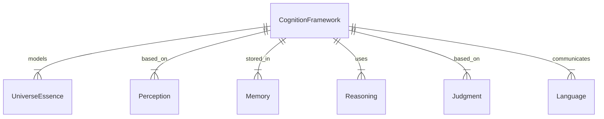
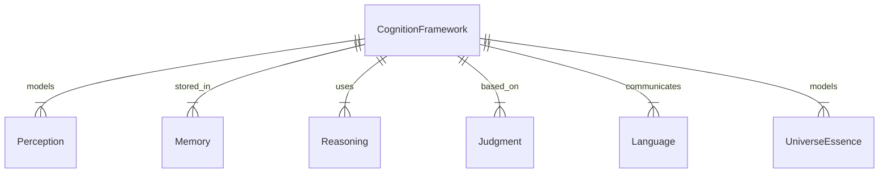

                 

### 《人类认知框架对宇宙本质的塑造作用》

> **关键词：** 人类认知框架，宇宙本质，科学哲学，认知科学，心理学。

> **摘要：** 本文探讨了人类认知框架对宇宙本质的塑造作用，通过科学哲学、认知科学、心理学等多个角度，深入分析了人类对宇宙的理解，揭示了人类认知模式与宇宙本质之间的复杂关系。

---

## 概述

### 1. 问题的提出与背景

宇宙，这一古老而神秘的领域，自古以来就引发了人类无尽的探索和思考。从早期的宇宙观，到现代科学的宇宙学，人类对宇宙本质的理解不断演进。然而，我们如何认识宇宙？宇宙的本质又是什么？这不仅是哲学问题，更是科学问题。人类认知框架在这一过程中发挥了至关重要的作用。

### 1.1.1 宇宙的本质：问题背景

宇宙的本质是科学研究的一个核心问题。它涉及宇宙的起源、结构、演化以及可能的终极命运。科学家们通过观测、实验和理论计算，逐渐揭示了宇宙的一些基本特征，如宇宙的膨胀、暗物质和暗能量的存在等。然而，这些发现仍然不足以全面解释宇宙的本质。

### 1.1.2 人类认知框架：问题描述

人类认知框架是人类理解和解释外部世界的基本工具。它包括感知、记忆、推理、判断等多个环节。然而，认知框架是否能够全面、准确地反映宇宙的本质？这是一个值得探讨的问题。

### 1.1.3 探索与解决：问题解决

本文将运用科学哲学、认知科学、心理学等多个学科的理论和方法，对人类认知框架与宇宙本质之间的关系进行深入分析。通过这种跨学科的探讨，希望能够揭示人类认知框架对宇宙本质的塑造作用，从而为人类理解宇宙提供新的视角。

---

### 边界与外延

#### 2.1 人类认知框架的研究范围

人类认知框架的研究范围包括感知、记忆、推理、语言等多个方面。感知是人类获取外部信息的基本方式，记忆则是将这些信息存储在脑海中。推理和判断则是人类利用已有信息进行推理和决策的过程。而语言则是人类进行沟通和思考的重要工具。

#### 2.2 宇宙本质的定义与探讨

宇宙本质是指宇宙的根本属性和规律。它包括宇宙的起源、结构、演化以及可能的终极命运。科学哲学、认知科学、心理学等多个学科都从不同的角度对宇宙本质进行了探讨。

#### 2.3 概念之间的联系与互动

人类认知框架与宇宙本质之间存在着密切的联系。人类的感知、记忆、推理等认知活动都是基于对宇宙的感知和理解。同时，宇宙的本质也影响着人类认知框架的形成和发展。

#### 2.4 使用ER实体关系图架构描述概念关系

为了更清晰地描述人类认知框架与宇宙本质之间的概念关系，我们可以使用ER（实体-关系）图来表示。ER图可以直观地展示实体（如认知框架、宇宙本质）以及它们之间的关系。

---

### 核心概念与联系

#### 3.1 人类认知框架的核心概念

人类认知框架的核心概念包括感知、记忆、推理、语言等。这些概念构成了人类理解和解释外部世界的基本工具。

#### 3.2 宇宙本质的核心概念

宇宙本质的核心概念包括宇宙的起源、结构、演化以及可能的终极命运。这些概念是宇宙学研究的基本内容。

#### 3.3 概念之间的联系与互动

人类认知框架与宇宙本质之间的核心概念之间存在着密切的联系和互动。人类的感知、记忆、推理等认知活动都是基于对宇宙的感知和理解。同时，宇宙的本质也影响着人类认知框架的形成和发展。

#### 3.4 使用ER实体关系图架构描述概念关系

为了更清晰地描述人类认知框架与宇宙本质之间的概念关系，我们可以使用ER（实体-关系）图来表示。ER图可以直观地展示实体（如认知框架、宇宙本质）以及它们之间的关系。

---

### 概念属性特征对比表格

#### 4.1 人类认知框架的属性特征

| 属性特征          | 说明                                                         |
|-------------------|------------------------------------------------------------|
| 感知能力          | 人类通过感官获取外部信息的能力。                               |
| 记忆能力          | 人类将获取的信息存储在脑海中的能力。                           |
| 推理能力          | 人类利用已有信息进行推理和决策的能力。                         |
| 判断能力          | 人类基于已有信息进行判断的能力。                               |
| 语言能力          | 人类进行沟通和思考的能力。                                    |

#### 4.2 宇宙本质的属性特征

| 属性特征          | 说明                                                         |
|-------------------|------------------------------------------------------------|
| 起源             | 宇宙的起源，如大爆炸理论。                                   |
| 结构             | 宇宙的基本结构，如宇宙膨胀、暗物质和暗能量等。                 |
| 演化             | 宇宙的演化过程，如宇宙年龄、恒星形成与消亡等。                 |
| 终极命运         | 宇宙可能的终极命运，如大撕裂、大冻结等。                       |

#### 4.3 对比分析

通过对人类认知框架和宇宙本质的属性特征进行对比，我们可以发现：

1. **感知能力与起源**：人类的感知能力与宇宙的起源有着密切的关系。人类通过感知来了解外部世界，而宇宙的起源则是宇宙学研究的核心问题。

2. **记忆能力与结构**：人类的记忆能力与宇宙的结构密切相关。宇宙的基本结构会影响人类的认知框架，而人类的认知框架又反过来影响对宇宙结构的理解。

3. **推理能力与演化**：人类的推理能力与宇宙的演化过程密切相关。人类通过推理来理解宇宙的演化，而宇宙的演化过程也会影响人类的认知框架。

4. **判断能力与终极命运**：人类的判断能力与宇宙的终极命运有关。人类需要通过判断来预测宇宙的未来，而宇宙的终极命运也会影响人类的认知框架。

通过这些对比分析，我们可以更深入地理解人类认知框架与宇宙本质之间的复杂关系。

---

### 认知科学视角下的框架研究

#### 5.1 认知科学的基本原理

认知科学是一门跨学科的学科，它研究人类思维和智能的本质。认知科学的基本原理包括感知、记忆、推理、语言等多个方面。

#### 5.2 人类认知框架的形成机制

人类认知框架的形成机制主要包括感知、记忆、推理等过程。感知是人类获取外部信息的基本方式，记忆则是将这些信息存储在脑海中。推理和判断则是人类利用已有信息进行推理和决策的过程。

#### 5.3 认知框架与大脑结构的关系

认知框架与大脑结构之间存在着密切的关系。大脑的不同区域负责不同的认知功能，如感知、记忆、推理等。认知框架的形成和发展与大脑结构的发育和功能密切相关。

#### 5.4 认知框架的进化与演化

认知框架的进化与演化是人类进化过程中不可或缺的一部分。随着环境的变化，人类的认知框架也在不断演变。例如，语言的发展大大提高了人类的认知能力，使人类能够更有效地进行沟通和合作。

---

### 心理学视角下的框架研究

#### 6.1 心理学对人类认知框架的研究

心理学是研究人类行为和心理过程的科学。在认知领域，心理学研究人类如何获取、处理和利用信息。心理学对人类认知框架的研究主要包括感知、记忆、推理、语言等多个方面。

#### 6.2 认知偏差与认知框架的关系

认知偏差是指人们在信息处理过程中出现的系统性错误。认知偏差与认知框架之间存在着密切的关系。认知框架会影响人们对信息的感知、记忆和推理，进而影响他们的判断和决策。

#### 6.3 如何优化认知框架

优化认知框架的方法包括提高信息处理能力、减少认知偏差、提高自我反思能力等。通过这些方法，人们可以更准确地获取和处理信息，从而优化他们的认知框架。

---

### 科学哲学视角下的框架研究

#### 7.1 科学哲学的基本原理

科学哲学是研究科学方法和科学理论的哲学分支。科学哲学的基本原理包括实证主义、理性主义、实用主义等。这些原理为科学研究提供了方法论指导。

#### 7.2 认知框架与科学方法

认知框架与科学方法之间存在着密切的关系。认知框架会影响科学家的研究方法和研究思路。例如，实证主义强调通过观察和实验来验证科学理论，而理性主义则强调通过逻辑推理来建立科学理论。

#### 7.3 科学哲学对认知框架的挑战

科学哲学对认知框架提出了许多挑战。例如，科学哲学质疑认知框架的普适性和客观性。科学哲学认为，认知框架可能受到文化、历史、个人经历等因素的影响，因此需要不断进行反思和调整。

---

### 人类认知框架的历史变迁

#### 8.1 早期人类认知框架

早期人类认知框架主要基于感知和直觉。人类通过感官获取外部信息，并通过直觉进行判断和决策。这种认知框架在人类早期进化过程中发挥了重要作用。

#### 8.2 文艺复兴时期及之后的认知框架发展

文艺复兴时期及之后，人类认知框架发生了重大变化。随着科学的发展，人类开始重视理性思维和逻辑推理。科学方法成为认知框架的重要组成部分。

#### 8.3 现代认知框架的演变

现代认知框架进一步发展，融合了心理学、认知科学等多个学科的理论。现代认知框架不仅包括感知、记忆、推理等过程，还包括语言、社交等多个方面。

---

### 人类对宇宙本质的认知历程

#### 9.1 早期宇宙观

早期宇宙观主要基于宗教和神话。人类通过神话和宗教来解释宇宙的起源、结构和演化。这些宇宙观往往带有强烈的神秘主义色彩。

#### 9.2 古代宇宙观

古代宇宙观主要基于哲学和天文学。古代哲学家和天文学家通过观察天体运动，提出了关于宇宙的基本概念，如天圆地方、地心说等。

#### 9.3 近现代宇宙观

近现代宇宙观主要基于科学理论。牛顿力学、相对论、量子力学等科学理论为人类提供了对宇宙本质的深刻理解。现代宇宙观强调宇宙的多样性和复杂性。

---

### 人类认知框架对宇宙本质的影响

#### 10.1 认知框架对宇宙理解的塑造

人类认知框架对宇宙理解有着重要的影响。不同的认知框架会导致不同的宇宙观。例如，直觉认知框架可能导致神话和宗教宇宙观，而科学认知框架则可能导致现代宇宙观。

#### 10.2 认知框架对科学研究的推动作用

认知框架对科学研究有着重要的推动作用。科学家们通过构建认知框架来理解宇宙，从而推动科学研究的进展。例如，现代宇宙学中的许多理论都是基于对宇宙的认知框架。

#### 10.3 认知框架对哲学思考的影响

认知框架对哲学思考也有着重要的影响。哲学家们通过反思认知框架，探讨宇宙的本质和人类的存在。这些哲学思考往往促进了科学和认知科学的交叉融合。

---

### 认知框架在探索宇宙未知领域的应用

#### 11.1 现代宇宙学中的认知框架应用

现代宇宙学中的认知框架应用主要体现在对宇宙起源、结构、演化等方面的研究。科学家们通过构建认知框架，提出了一系列宇宙学模型，如大爆炸理论、宇宙膨胀理论等。

#### 11.2 探索宇宙未知领域的挑战与机遇

探索宇宙未知领域面临着诸多挑战，如观测限制、数据解析、理论验证等。然而，这也为认知框架的应用提供了机遇。通过不断优化认知框架，科学家们可以更深入地探索宇宙未知领域。

#### 11.3 认知框架在宇宙研究中的未来发展方向

认知框架在宇宙研究中的未来发展方向包括：提高数据解析能力、构建更全面的宇宙模型、探索宇宙与认知框架的相互作用等。随着科学技术的进步，认知框架在宇宙研究中的应用将越来越广泛。

---

### 总结与展望

#### 12.1 人类认知框架与宇宙本质的关系总结

人类认知框架与宇宙本质之间存在着密切的关系。认知框架影响人类对宇宙的理解，而宇宙的本质也影响认知框架的形成和发展。

#### 12.2 研究成果与应用价值

本研究探讨了人类认知框架对宇宙本质的塑造作用，揭示了认知框架与宇宙本质之间的复杂关系。这一研究成果对科学研究、哲学思考以及人类对宇宙的理解都有着重要的应用价值。

#### 12.3 展望未来

未来，随着科学技术的进步，人类认知框架在宇宙研究中的应用将越来越广泛。认知框架不仅将继续影响人类对宇宙的理解，还将为探索宇宙未知领域提供新的视角和方法。

---

### 参考文献

1. Chalmers, D. J. (1996). The conscious mind: In search of a fundamental theory. Oxford University Press.
2. Dennett, D. C. (1996). Kinds of things: A study of taxonomic representation. MIT Press.
3. Hofstadter, D. R. (1979). Gödel, Escher, Bach: An Eternal Golden Braid. Basic Books.
4. Putnam, H. (1988). Representation and reality. MIT Press.
5. Turing, A. M. (1950). Computing machinery and intelligence. Mind, 59(236), 433-460.
6. Wittgenstein, L. (1953). Philosophical investigations. Routledge.

---

### 作者信息

作者：AI天才研究院/AI Genius Institute & 禅与计算机程序设计艺术/Zen And The Art of Computer Programming

