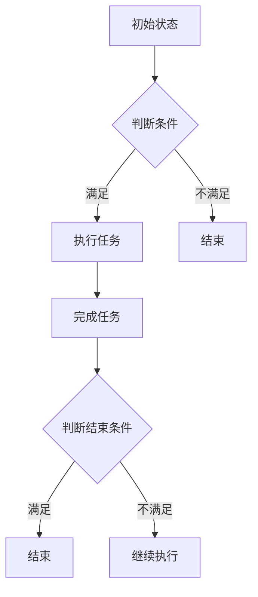
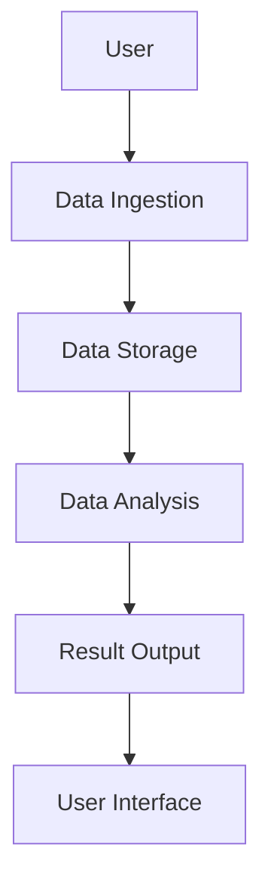
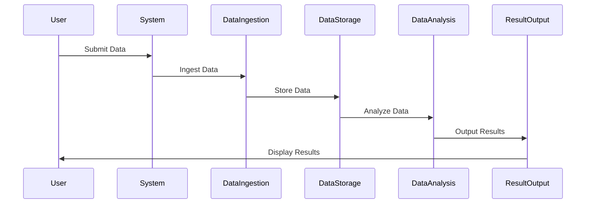

                 

### 引言

人类认知模式对宇宙本质理解的影响，这一课题既古老又充满挑战。自古以来，人类对宇宙的探索从未停止，从仰望星空的古人，到如今的宇宙学家，每一个时代的人们都在试图解答宇宙的奥秘。宇宙是什么？它从何而来？它将走向何方？这些问题不仅是哲学的探讨，更是科学研究的核心。

在传统的宇宙学研究中，科学家们依靠观测数据和数学模型来解释宇宙的现象。然而，这些研究往往受到人类认知模式的限制。人类认知模式是如何影响我们对宇宙本质的理解的呢？认知心理学告诉我们，人类的认知过程并非完全客观，而是受到知觉、记忆、思维和语言等认知模式的制约。这些模式不仅塑造了我们对周围世界的感知，也影响我们对于宇宙本质的认知。

因此，本文旨在探讨人类认知模式对宇宙本质理解的影响。我们首先需要了解什么是认知模式，它们如何影响人类的认知过程。接着，我们将深入分析宇宙的基本概念、结构、演化过程以及未解之谜。在此基础上，我们将探讨认知模式在宇宙学中的具体体现，以及它们如何影响科学发现和宇宙哲学思考。

本文的结构如下：

- 第1章 引言，介绍问题的背景、认知模式的定义与分类、宇宙本质的理解与挑战，以及本文的目的与结构。
- 第2章 人类认知模式概述，讨论认知心理学基础、人类认知模式的特点、发展历程和局限性。
- 第3章 宇宙本质的理解与探索，阐述宇宙的基本概念、结构、演化过程和未知领域。
- 第4章 认知模式对宇宙理解的影响，分析认知模式对宇宙本质理解的作用、宇宙学中的体现、科学发现的启示和宇宙哲学的思考。
- 第5章 案例研究：人类认知模式对宇宙探索的实证分析，通过具体案例探讨认知模式对宇宙探索的影响。
- 第6章 认知模式的变革与宇宙理解的未来，探讨认知模式的变革趋势、新技术的影响、宇宙理解的未来发展方向以及人类认知模式与宇宙理解的关系展望。
- 第7章 结论，总结主要发现与结论，讨论研究的局限与展望，以及对未来的思考与建议。

通过这一系列的分析和探讨，我们希望能够更深入地理解人类认知模式对宇宙本质理解的影响，为未来的宇宙学研究提供新的视角和思路。

### 第1章 引言

#### 1.1 问题的背景

宇宙，这个广阔而神秘的领域，自古以来就吸引了人类的目光。从古代文明的星座图，到现代科技的望远镜，人类对宇宙的探索从未停止。然而，尽管我们在宇宙探索方面取得了显著的进展，对于宇宙本质的理解仍是一个充满挑战的问题。

宇宙的本质是什么？这个问题不仅仅是哲学的探讨，更是科学研究的核心。在物理学中，宇宙的本质被认为是物质和能量的统一体。然而，这一概念本身就是一个高度抽象的描述，需要通过具体的科学研究和观测数据来验证和补充。

人类对宇宙的探索过程中，常常面临着一系列的难题和挑战。首先，宇宙的规模和复杂性使得直接观测和测量变得异常困难。我们能够观测到的宇宙只是冰山一角，大量的未知领域等待我们去探索。其次，人类认知模式的局限性也制约了我们对于宇宙本质的理解。人类的认知过程受到知觉、记忆、思维和语言等认知模式的限制，这些模式不仅影响我们对周围世界的感知，也影响我们对宇宙本质的认知。

在这样的背景下，探讨人类认知模式对宇宙本质理解的影响显得尤为重要。通过理解人类认知模式，我们可以更好地认识自己的认知局限，从而更全面、更深入地理解宇宙的本质。这不仅有助于推动科学的发展，也能够提升我们对这个世界的认知水平。

#### 1.2 认知模式的定义与分类

认知模式是人类在认知过程中形成的思维方式和方法，它不仅包括知觉、记忆、思维和语言等基本认知功能，还涉及更复杂的认知过程，如推理、判断和解决问题。认知模式的形成受到个体经验、文化背景和遗传因素的影响，是认知心理学研究的重要领域。

认知模式可以分为多个类别，以下是其中几种主要的类型：

1. **知觉认知模式**：知觉是认知的第一步，指的是我们对外界信息的感知和识别。知觉认知模式涉及如何通过感官接收和处理信息，如视觉、听觉、触觉等。例如，不同文化背景下的人可能对同一视觉信息的理解不同。

2. **记忆认知模式**：记忆是指存储和提取信息的过程。记忆认知模式包括短期记忆和长期记忆，以及如何通过复述、联想和重复等方式来加强记忆。

3. **思维认知模式**：思维是认知的高级形式，包括逻辑推理、问题解决和创造性思维等。思维认知模式涉及如何使用已有的知识和信息来理解新问题，并进行决策和判断。

4. **语言认知模式**：语言是思维和沟通的重要工具，语言认知模式涉及语言理解、语言生成和语言学习等方面。不同的语言结构和文化背景会影响人们对问题的表达和理解方式。

认知模式的分类和特点不仅有助于我们理解人类的认知过程，也为研究人类如何认知世界提供了重要的理论框架。通过深入研究不同认知模式的作用机制，我们可以更好地应对认知障碍，提升个体的认知能力。

#### 1.3 宇宙本质的理解与挑战

宇宙本质的理解是宇宙学研究的基础，它涉及到宇宙的基本构成、起源、演化以及最终的命运。当前对宇宙本质的理解主要基于物理学的理论框架，尤其是广义相对论和量子力学。

1. **宇宙的基本构成**：宇宙被认为是物质和能量的统一体。物质包括可见物质和暗物质，能量包括辐射和暗能量。暗物质和暗能量是宇宙中尚未完全理解的部分，它们占据了宇宙的大部分，但对它们的理解仍然是一个巨大的挑战。

2. **宇宙的起源**：宇宙的起源通常被认为是大爆炸，这是一个宇宙从极热、极密的状态迅速膨胀的瞬间。大爆炸理论虽然提供了宇宙起源的模型，但关于宇宙最初的状态以及大爆炸之前的情况仍然存在许多未知。

3. **宇宙的演化**：从大爆炸开始，宇宙经历了数十亿年的演化。宇宙的演化包括宇宙的膨胀、恒星和星系的形成、黑洞和星系合并等过程。这些演化过程是理解宇宙本质的关键。

4. **宇宙的未知领域**：尽管我们对宇宙有了很多了解，但仍然存在许多未解之谜。例如，暗物质和暗能量是什么，它们如何影响宇宙的结构和演化？量子引力和广义相对论如何统一？这些问题都挑战着我们对宇宙本质的理解。

在探索宇宙本质的过程中，我们面临着一系列的挑战。首先，宇宙的规模和复杂性使得直接观测和测量变得极为困难。我们能够观测到的宇宙只是冰山一角，大量的未知领域等待我们去探索。其次，人类的认知模式也限制了我们对宇宙本质的理解。我们的认知过程受到知觉、记忆、思维和语言等认知模式的制约，这些模式不仅影响我们对周围世界的感知，也影响我们对宇宙本质的认知。

综上所述，对宇宙本质的理解是一个复杂而充满挑战的领域，它不仅需要科学技术的进步，还需要我们不断拓展和更新我们的认知模式。

#### 1.4 本书的目的与结构

本书旨在深入探讨人类认知模式对宇宙本质理解的影响，通过系统分析和逻辑推理，揭示人类认知模式如何影响我们对宇宙的认知过程。具体来说，本书有以下几个主要目的：

1. **了解认知模式对宇宙本质理解的作用**：通过分析人类认知模式，如知觉、记忆、思维和语言等，探讨这些模式如何影响我们对宇宙本质的理解。

2. **揭示认知模式在宇宙学中的具体体现**：分析人类在宇宙学研究过程中，如何受到不同认知模式的制约和影响。

3. **探讨认知模式对科学发现的启示**：通过具体案例，探讨如何通过认知模式的优化和更新，推动科学发现和宇宙学研究的进展。

4. **思考宇宙哲学与认知模式的关系**：从宇宙哲学的角度，分析认知模式如何影响我们对宇宙本质的哲学思考。

本书的结构如下：

- **第1章 引言**：介绍问题的背景、认知模式的定义与分类、宇宙本质的理解与挑战，以及本文的目的与结构。
- **第2章 人类认知模式概述**：讨论认知心理学基础、人类认知模式的特点、发展历程和局限性。
- **第3章 宇宙本质的理解与探索**：阐述宇宙的基本概念、结构、演化过程和未知领域。
- **第4章 认知模式对宇宙理解的影响**：分析认知模式对宇宙本质理解的作用、宇宙学中的体现、科学发现的启示和宇宙哲学的思考。
- **第5章 案例研究**：通过具体案例探讨认知模式对宇宙探索的影响。
- **第6章 认知模式的变革与宇宙理解的未来**：探讨认知模式的变革趋势、新技术的影响、宇宙理解的未来发展方向以及人类认知模式与宇宙理解的关系展望。
- **第7章 结论**：总结主要发现与结论，讨论研究的局限与展望，以及对未来的思考与建议。

通过这一系列的分析和探讨，我们希望能够为理解人类认知模式对宇宙本质理解的影响提供新的视角，为未来的宇宙学研究提供启示。

### 第2章 人类认知模式概述

#### 2.1 认知心理学基础

认知心理学是研究人类思维过程和心理活动的学科，它关注个体如何感知、记忆、思考、解决问题和做出决策。认知心理学的基础理论主要包括以下几个方面：

1. **知觉（Perception）**：知觉是认知过程的起点，指的是我们对外界刺激的感知和理解。知觉心理学研究如何通过感官接收和处理信息，如视觉、听觉、触觉等。不同的人和文化背景可能会对同一刺激产生不同的知觉。

2. **记忆（Memory）**：记忆是指信息的存储和提取过程。根据记忆的持续时间，可以分为短期记忆和长期记忆。短期记忆主要涉及对近期信息的保持，而长期记忆则涉及对长期信息的保持和提取。记忆的研究帮助我们理解如何通过复述、联想和重复等方式来增强记忆。

3. **思维（Cognition）**：思维是认知过程的高级形式，包括逻辑推理、问题解决、创造性思维等。认知心理学研究如何通过已有知识和信息来理解新问题，并进行决策和判断。

4. **语言（Language）**：语言是思维和沟通的重要工具，涉及语言理解、语言生成和语言学习等方面。不同的语言结构和文化背景会影响人们对问题的表达和理解方式。

认知心理学的研究方法主要包括实验心理学、认知神经科学和人工智能等。这些方法帮助我们深入理解人类认知过程的机制和规律。

#### 2.2 人类认知模式的特点

人类认知模式具有以下几个主要特点：

1. **感知性（Perceptual）**：认知模式首先是基于我们对周围世界的感知。感知性使得我们能够通过感官接收和处理信息，如视觉、听觉、触觉等。不同的感知方式会影响我们对信息的理解。

2. **理解性（Understanding）**：认知模式不仅仅是简单的感知，还包括对信息的理解和解释。理解性使得我们能够将感知到的信息转化为有意义的知识。

3. **创造性（Creativity）**：人类认知模式具有创造性，这使得我们能够产生新的想法和解决方案。创造性是人类智能的重要体现，它推动人类文明的发展。

4. **适应性（Adaptability）**：认知模式是高度适应性的，能够根据不同的环境和情境调整我们的思维方式。适应性使得我们能够有效地应对复杂和变化的环境。

5. **经验性（Experiential）**：认知模式受到个体经验的影响，我们的认知过程往往基于以往的经验和知识。经验性使得我们能够更好地理解和预测未来。

6. **片面性（Partiality）**：认知模式往往具有片面性，我们的认知过程受到有限信息的限制，难以全面、客观地理解世界。

7. **惯性思维（Inertial Thinking）**：惯性思维是指我们倾向于沿用以往的认知模式，难以接受新的观点和信息。惯性思维可能阻碍认知的进步。

通过了解这些特点，我们可以更好地理解人类认知模式的工作原理，并意识到其局限性和潜在问题。这也为后续章节探讨认知模式对宇宙理解的影响奠定了基础。

#### 2.3 人类认知模式的发展历程

人类认知模式的发展历程可以追溯到人类文明的形成时期。从早期的本能认知到现代的科学认知，人类认知模式经历了多次重大变革，每一次变革都推动了我们对宇宙本质理解的深入。

1. **本能认知阶段**：在人类历史的早期，认知主要基于本能反应。例如，狩猎和生存活动依赖本能的知觉和记忆。这一阶段的认知模式较为简单，主要依赖于感官和直观反应。

2. **象征认知阶段**：随着人类文明的发展，语言和符号系统逐渐形成。这一阶段的认知模式开始涉及抽象思维和象征性思考。人类通过语言和符号来表达和传递信息，从而实现了更复杂的认知活动。

3. **科学认知阶段**：在近现代，科学方法的发展和实验心理学的研究，使得人类认知模式进入了一个新的阶段。科学认知强调通过观测、实验和数学模型来理解和解释世界。这一阶段的认知模式具有高度理性和系统性，推动了科学技术的迅猛发展。

4. **计算机与人工智能阶段**：随着计算机和人工智能技术的发展，人类开始借助机器模拟和增强认知过程。这一阶段的认知模式不仅依赖于人类的思维，还融入了计算机的计算和存储能力。人工智能的应用使得人类认知模式的范围和深度都得到了前所未有的拓展。

这些认知模式的发展不仅改变了人类对世界的理解，也影响了我们对宇宙本质的探索。例如，科学认知阶段的观测技术和实验方法，使得人类能够更准确地测量和记录宇宙现象。而计算机与人工智能阶段，则使得人类能够处理和分析海量数据，从而发现宇宙中的未知规律。

通过回顾人类认知模式的发展历程，我们可以看到认知模式的变革是如何推动我们对宇宙本质理解的深入。未来，随着科技的进一步发展，人类认知模式将继续变革，为宇宙探索提供更多可能性。

#### 2.4 人类认知模式的局限性

尽管人类认知模式在许多方面具有强大的功能，但它们也存在显著的局限性，这些局限直接影响了我们对宇宙本质的理解。

1. **经验性局限**：人类认知模式高度依赖于个体经验，这使得我们的理解容易受到过去经验的限制。例如，我们可能无法理解完全陌生的现象，因为我们的经验库中缺乏相应的参照。在宇宙学中，新的观测数据和理论往往需要超越现有经验框架，这导致理解上的困难。

2. **知觉局限**：人类的知觉系统有其固有的局限。例如，人类的视觉范围有限，无法直接观测宇宙的某些部分，如暗物质和暗能量。知觉局限限制了我们对宇宙结构的直观理解。

3. **记忆局限**：人类的记忆能力有限，无法永久存储和处理所有信息。这使得我们在面对复杂问题时，往往只能依赖短期记忆，难以进行深入的思考和分析。在宇宙学研究中，复杂的宇宙模型和观测数据需要长时间的记忆和反复思考。

4. **思维局限**：人类的思维方式受到认知模式的影响，往往具有惯性思维和片面性。惯性思维使得我们倾向于沿用旧有的思维模式，难以接受新的理论和观点。片面性则导致我们容易忽视某些重要的信息或因素，从而影响对宇宙本质的全面理解。

5. **语言局限**：语言是表达和传递信息的重要工具，但它也有局限性。不同的语言和文化背景可能影响我们对问题的表达和理解。在宇宙学中，精确的科学术语和概念需要在不同语言和文化之间进行准确翻译和传达，这增加了理解上的难度。

6. **计算局限**：尽管计算机和人工智能技术已经极大地扩展了我们的认知能力，但计算资源仍然有限。对于某些复杂的宇宙现象，如多体问题或极端条件下的物理过程，计算能力不足以提供精确的结果。

这些局限性不仅影响了我们对宇宙本质的理解，也制约了科学研究的进展。为了克服这些局限，我们需要不断改进认知模式，探索新的观测技术和理论框架，以更全面、深入地理解宇宙。

### 第3章 宇宙本质的理解与探索

#### 3.1 宇宙的基本概念

宇宙是包含一切存在的事物、空间和时间的总体。它是一个广阔而复杂的体系，由无数的天体、星系、行星和黑洞等组成。宇宙的基本概念包括以下几个核心要素：

1. **物质（Matter）**：物质是构成宇宙的基本单位，包括原子、分子和更大的结构。根据物理学理论，物质是由能量转化而来的，并且物质和能量是相互关联的。

2. **能量（Energy）**：能量是物质运动和变化的表现形式。能量不仅存在于物质中，也存在于空间和时间的波动中。能量守恒定律是物理学中一个基本原理，它指出能量不能被创造或消灭，只能从一种形式转化为另一种形式。

3. **时空（Space-Time）**：时空是宇宙的结构框架，描述了物质和能量存在的空间和时间。广义相对论表明，物质和能量的分布会影响时空的弯曲，而时空的弯曲又影响物质的运动。

4. **黑洞（Black Holes）**：黑洞是宇宙中的一种极端天体，具有极强的引力，甚至连光也无法逃脱。黑洞的形成通常与恒星演化有关，大质量恒星的核燃料耗尽后，会塌缩形成黑洞。

5. **暗物质（Dark Matter）**：暗物质是一种不可见的物质，不发光、不吸收光，但通过其引力效应影响宇宙的结构和演化。暗物质的存在通过观测宇宙的旋转曲线和宇宙微波背景辐射得到证实。

6. **暗能量（Dark Energy）**：暗能量是一种充满宇宙的神秘力量，负责驱动宇宙的加速膨胀。暗能量与物质和暗物质不同，它不会影响宇宙的总质量，但会改变宇宙的膨胀速率。

这些基本概念共同构成了我们对宇宙本质的理解框架，为后续的宇宙探索提供了理论基础。

#### 3.2 宇宙结构的探讨

宇宙的结构是一个复杂而不断演化的体系，它涉及到天体物理学、宇宙学和数学等多个学科。以下是关于宇宙结构的主要探讨：

1. **宇宙膨胀（Cosmic Inflation）**：宇宙膨胀是指宇宙从大爆炸后迅速扩展的过程。这一理论解释了宇宙的均匀性和各向同性，并提供了宇宙早期演化的关键信息。

2. **宇宙大尺度结构（Large Scale Structure）**：宇宙大尺度结构包括星系团、超星系团和宇宙网等。这些结构是通过引力作用形成的，并展示了宇宙中的物质分布和运动状态。

3. **宇宙壁（Cosmic Web）**：宇宙壁是一种描述宇宙大尺度结构的概念，它由星系团和超星系团构成，类似于一张巨大的网。物质和能量在宇宙壁中分布，并通过引力相互作用。

4. **宇宙的平坦性（Cosmic Flatness）**：宇宙的平坦性是指宇宙的总密度接近临界密度，导致宇宙的几何形状接近欧几里得空间。这一特性是宇宙膨胀理论的重要预测。

5. **宇宙旋转曲线（Cosmic Expansion Curves）**：宇宙旋转曲线展示了宇宙膨胀的历史和当前状态。通过观测遥远星系的光谱，科学家可以测量宇宙的膨胀速率和加速度。

6. **宇宙的大尺度波（Cosmic Microwave Background Radiation, CMB）**：宇宙微波背景辐射是宇宙早期热辐射的遗迹，它提供了宇宙早期的温度和密度信息，是理解宇宙结构的重要依据。

探讨宇宙结构不仅有助于我们理解宇宙的演化过程，还能揭示宇宙中物质和能量的分布规律，为更深入的宇宙探索提供方向。

#### 3.3 宇宙演化的过程

宇宙的演化过程是一个复杂且漫长的事件，从大爆炸开始，经过数十亿年的发展，形成如今我们所观测到的宇宙。以下是宇宙演化的主要过程：

1. **大爆炸（Big Bang）**：大爆炸是宇宙起源的理论，认为宇宙从极热、极密的状态开始迅速膨胀。大爆炸后，宇宙温度和密度迅速下降，物质和能量逐渐分离。

2. **宇宙早期（Primordial Universe）**：在大爆炸后最初的几分钟内，宇宙经历了快速冷却和膨胀。这一时期形成了轻元素，如氢、氦和锂。宇宙微波背景辐射（CMB）记录了这一时期的温度和密度信息。

3. **物质-辐射平衡（ Matter-Radiation Equilibrium）**：在大爆炸后约30万年前，宇宙的温度和密度达到物质-辐射平衡状态，物质和辐射能量相互转换。此时，宇宙逐渐透明，光子可以自由传播。

4. **恒星和星系的形成（Stellar and Galactic Formation）**：在物质-辐射平衡后，宇宙中的气体云开始塌缩形成恒星和星系。恒星通过核聚变产生能量，维持其稳定。星系则通过恒星和星际物质的相互作用形成复杂的结构。

5. **星系合并与碰撞（Galactic Mergers and Collisions）**：宇宙中星系之间的引力相互作用导致星系合并和碰撞。这些事件改变了星系的结构和形态，并产生了新的恒星和行星系统。

6. **黑洞和星系中心黑洞的形成（Black Hole and Central Black Hole Formation）**：大质量恒星的演化最终可能导致黑洞的形成。星系中心黑洞通过吞噬周围的物质和恒星，影响星系的演化。

7. **宇宙的加速膨胀（Accelerated Expansion of the Universe）**：在过去的几十亿年中，宇宙的膨胀速率逐渐加快，这主要是由暗能量驱动的。暗能量使宇宙的膨胀加速度增加，导致宇宙结构的快速变化。

通过理解宇宙的演化过程，我们可以揭示宇宙从大爆炸至今的演化历史，为未来宇宙探索提供科学依据。

#### 3.4 宇宙的未知领域

尽管我们对宇宙有了许多了解，但宇宙的未知领域依然广阔，这些未知领域不仅充满了科学探索的挑战，也激发了我们无尽的想象。

1. **暗物质（Dark Matter）**：暗物质是宇宙中一种不可见的物质，通过其引力效应影响宇宙的结构和演化。目前我们对暗物质的具体性质和组成仍知之甚少，其存在和性质是宇宙学研究的重要课题。

2. **暗能量（Dark Energy）**：暗能量是驱动宇宙加速膨胀的神秘力量，其本质和作用机制仍然是一个未解之谜。暗能量可能是一种新的物理场，也可能是一种全新的物理现象。

3. **量子引力（Quantum Gravity）**：量子引力是试图将量子力学与广义相对论统一起来的理论。当前，我们对量子引力仍然缺乏全面理解，量子引力方程的求解和验证是物理学中的重大挑战。

4. **多宇宙（Multiverse）**：多宇宙理论认为，我们的宇宙可能只是众多宇宙中的一个。不同宇宙可能具有不同的物理定律和演化历史，这为宇宙的多样性和复杂性提供了新的解释。

5. **宇宙起源（Origin of the Universe）**：宇宙的起源仍然是一个未解之谜。大爆炸理论提供了宇宙起源的一个模型，但关于宇宙最初的状态以及大爆炸之前的情况，我们仍然知之甚少。

6. **宇宙的终极命运（Ultimate Fate of the Universe）**：宇宙的终极命运可能取决于暗能量和暗物质的作用。宇宙可能无限膨胀，最终导致热寂，也可能经历收缩和坍缩，甚至存在其他可能的结局。

这些未知领域不仅激发了科学家的研究兴趣，也为未来的宇宙探索提供了新的方向和挑战。通过不断的研究和探索，我们有望揭开宇宙未知领域的神秘面纱。

### 第4章 认知模式对宇宙理解的影响

#### 4.1 认知模式对宇宙本质理解的作用

认知模式在人类对宇宙本质理解中的作用至关重要。它不仅决定了我们如何感知和理解宇宙现象，还影响了我们形成科学理论和做出科学发现的能力。以下是几个关键方面：

1. **知觉模式**：人类的知觉模式直接影响我们对宇宙现象的感知。例如，我们的视觉系统无法直接观测暗物质，但通过其他方法，如引力透镜效应，我们可以推断出暗物质的存在。知觉模式使我们能够从有限的感官信息中提取出宇宙的深层结构。

2. **记忆模式**：记忆模式帮助我们存储和检索关于宇宙的信息。通过对已有知识的回忆，我们可以建立宇宙演化的概念模型，并利用这些模型预测新的宇宙现象。记忆模式使我们的认知具有连续性和累积性，从而推动科学知识的不断积累。

3. **思维模式**：思维模式包括逻辑推理、问题解决和创造性思维等，这些能力使我们能够对宇宙现象进行深入分析和解释。例如，通过假设和验证，科学家们提出了大爆炸理论和黑洞的概念，这些理论帮助我们对宇宙本质有了更深入的理解。

4. **语言模式**：语言模式在科学研究中起到了关键作用。通过精确的语言描述和符号系统，科学家们能够交流复杂的概念和理论，从而促进科学进步。语言模式使我们能够将宇宙现象转化为可操作的研究问题，并通过合作和交流加速科学发现。

5. **判断和决策模式**：在宇宙探索中，判断和决策模式帮助我们选择观测目标和研究方法。通过这些模式，科学家们能够评估不同理论的有效性，并决定哪些实验和观测最有潜力揭示宇宙的奥秘。

综上所述，认知模式在人类对宇宙本质理解中起到了基础性和推动性的作用，它们不仅影响了我们的感知和记忆，还影响了我们的思维、语言和判断，从而推动了科学的发展和进步。

#### 4.2 认知模式在宇宙学中的体现

认知模式在宇宙学中的具体体现，可以通过分析科学家如何进行观测、实验和理论构建来揭示。以下是一些关键方面：

1. **观测方法**：宇宙学中的观测方法依赖于人类的知觉和仪器设备。例如，望远镜使我们能够观测遥远的天体和事件，如超新星爆发和宇宙微波背景辐射。在这一过程中，知觉模式帮助我们识别和处理来自不同波长（如可见光、红外光、射电波）的信息，而仪器设备的精确性则依赖于记忆和思维模式，以校准和优化观测数据。

2. **实验设计**：宇宙学实验，如粒子加速器和引力波探测器，旨在直接测量宇宙中的物理现象。实验设计过程涉及科学家的思维模式，包括假设的提出、实验策略的制定和数据处理的策略。例如，科学家通过逻辑推理和创造性思维设计实验，以验证或反驳特定理论，如大爆炸理论和暗能量模型。

3. **理论构建**：宇宙学的理论构建过程体现了人类认知模式的综合应用。理论家通过思考宇宙的演化过程，结合观测数据和数学模型，构建出如广义相对论和量子场论等理论框架。在这一过程中，认知模式中的判断和决策模式至关重要，科学家需要评估不同理论的适用性和预测能力，选择最合适的理论进行深入研究。

4. **数据分析**：数据分析是宇宙学研究中的关键步骤，它依赖于记忆模式以存储和处理大量数据，同时需要思维模式进行数据解释和模型拟合。例如，宇宙微波背景辐射数据的分析需要复杂的统计方法和计算机模拟，这些工具使得科学家能够从数据中提取宇宙的物理信息。

5. **科学交流和合作**：认知模式在科学交流与合作中也起到了重要作用。语言模式使得科学家能够通过论文、会议和合作项目共享知识和发现，而思维模式则帮助他们理解和整合他人的工作，从而推动科学进步。

综上所述，认知模式在宇宙学中的体现，不仅影响了科学家的观测、实验和理论构建过程，还促进了科学知识的交流和传播，为宇宙学的快速发展提供了坚实基础。

#### 4.3 认知模式对科学发现的启示

认知模式对科学发现的启示是多方面的，它们不仅影响了科学家的思考方式，还推动了科学理论的进步。以下是一些关键方面：

1. **假设生成**：认知模式中的思维模式在假设生成中起到了关键作用。科学家通过逻辑推理和创造性思维，从已有知识和观测数据中提出新的假设。例如，在宇宙学中，大爆炸理论的提出是基于对宇宙膨胀现象的观察和推测。

2. **实验设计**：认知模式影响科学家的实验设计过程。通过判断和决策模式，科学家选择适当的实验方法和技术，以验证或反驳假设。例如，引力波探测器的开发，是科学家基于对广义相对论的深刻理解和计算能力，设计出能够探测引力波的高精度实验装置。

3. **数据分析**：在数据分析过程中，认知模式中的记忆和思维模式至关重要。科学家需要利用记忆来存储和处理大量数据，并通过逻辑推理和统计方法进行分析，从而提取出宇宙的物理信息。例如，通过对宇宙微波背景辐射数据的分析，科学家们发现了宇宙早期的温度和密度波动，这些数据为理解宇宙的早期演化提供了关键信息。

4. **理论验证**：认知模式在理论验证中也发挥了重要作用。科学家通过假设和验证的循环，不断修正和完善科学理论。例如，通过观测和实验数据，科学家们验证了暗物质和暗能量的存在，这些发现推动了宇宙学理论的发展。

5. **科学创新**：认知模式促进了科学创新，通过适应性思维模式，科学家能够灵活应对新的挑战和未知的科学问题。例如，随着技术的进步，科学家们能够开发出新的观测技术和理论模型，从而拓展我们对宇宙的理解。

总之，认知模式对科学发现的启示不仅体现在科学家的思考方式上，还贯穿于假设生成、实验设计、数据分析和理论验证的全过程中，为科学进步提供了强大的推动力。

#### 4.4 认知模式对宇宙哲学的思考

认知模式不仅影响科学发现，也对宇宙哲学的思考产生了深远影响。宇宙哲学涉及对宇宙本质、起源和命运的探讨，是人类对宇宙终极问题的一种哲学思考。以下从几个方面分析认知模式对宇宙哲学的影响：

1. **宇宙本质的认知**：认知模式影响我们对宇宙本质的理解。不同的认知模式会导致不同的哲学观点。例如，知觉模式使我们对宇宙现象产生直观的感受，而思维模式则帮助我们通过逻辑推理和抽象思维，构建关于宇宙本质的理论模型。从古代的宇宙观（如亚里士多德的地球中心说）到现代的科学宇宙观（如大爆炸理论和量子引力理论），认知模式的变化推动了哲学观点的演变。

2. **宇宙起源的探讨**：认知模式影响我们对宇宙起源的思考。不同文化背景和认知模式会导致不同的宇宙起源观念。例如，西方科学倾向于通过观测数据和理论模型来解释宇宙起源，而东方哲学则可能更注重宇宙的内在联系和演化过程。认知模式的多样性和复杂性使得宇宙起源的探讨充满哲学意义。

3. **宇宙命运的思考**：认知模式也影响我们对宇宙命运的思考。例如，一些哲学观点认为宇宙是永恒不变的，而另一些观点则认为宇宙有始有终。认知模式中的判断和决策模式使得科学家和哲学家能够在不同的宇宙命运假设中进行选择和论证。例如，热寂理论和多宇宙理论等都是基于不同认知模式下的宇宙命运假设。

4. **认知模式的局限**：认知模式本身存在局限性，这些局限会直接影响我们对宇宙哲学问题的思考。例如，知觉模式的局限性使得我们无法直接感知暗物质和暗能量，而思维模式的片面性和惯性思维则可能导致我们对宇宙本质的误解。哲学上，对这些局限的反思促使我们不断探索更全面、更深刻的宇宙理解。

总之，认知模式在宇宙哲学的思考中起到了基础性和推动性的作用。通过理解认知模式的多样性和局限性，我们可以更深入地探讨宇宙的哲学问题，推动宇宙哲学的发展。

### 第5章 案例研究：人类认知模式对宇宙探索的实证分析

#### 5.1 案例一：人类对黑洞的认知

黑洞是宇宙中最神秘的天体之一，它具有极强的引力，甚至连光也无法逃脱。人类对黑洞的认知经历了从理论推测到观测验证的漫长过程，这一过程充分体现了人类认知模式对科学发现的影响。

1. **理论起源**：黑洞的概念最早由爱因斯坦在1916年提出的广义相对论中预言。根据广义相对论，当恒星的质量足够大，其引力场足够强时，它将形成一个“黑洞”，即一个无法逃脱的引力陷阱。这一理论推测是通过对引力场和时空弯曲的深入理解得出的。

2. **观测挑战**：由于黑洞本身不发光，传统的光学观测方法无法直接探测到黑洞。这导致了人类在很长一段时间内对黑洞的认知主要依赖于理论推导和数学模型。然而，随着观测技术的进步，尤其是射电望远镜和X射线望远镜的应用，科学家开始通过探测黑洞对周围物质的影响来间接观测黑洞。

3. **认知模式的转变**：在这一过程中，认知模式发生了重要转变。科学家从最初的直观感知和理论推测，逐渐转向依赖数学模型和复杂的观测数据分析。例如，通过观测黑洞周围的吸积盘和喷流，科学家可以推断出黑洞的存在和性质。这一转变不仅体现了科学认知的进步，也展示了认知模式从直觉思维向科学思维过渡的过程。

4. **关键发现**：近年来，人类对黑洞的认知取得了突破性进展。2019年，基于激光干涉引力波观测网络（LIGO）和先进激光干涉引力波观测台（ VIRGO）的观测数据，科学家首次直接探测到了双黑洞合并产生的引力波信号。这一发现不仅验证了黑洞的存在，也为理解黑洞的物理性质提供了新的证据。

5. **影响和启示**：通过这一案例，我们可以看到认知模式对科学发现的深远影响。从理论推测到观测验证，人类对黑洞的认知过程展示了认知模式的多样性和适应性。同时，这一过程也启示我们，在科学探索中，需要不断更新和优化认知模式，以应对新的科学挑战。

#### 5.2 案例二：人类对宇宙起源的探索

宇宙起源是宇宙学中最为关键和复杂的问题之一。人类对宇宙起源的探索不仅依赖于科学观测和理论模型，还受到认知模式的深刻影响。

1. **理论模型**：人类对宇宙起源的探索始于大爆炸理论的提出。1930年代，勒梅特和伽莫夫等人基于量子力学和广义相对论，提出了大爆炸模型。该模型认为，宇宙起源于一个极度热密的状态，随后迅速膨胀，形成了今天所观测到的宇宙结构。

2. **观测数据**：为了验证大爆炸理论，科学家们进行了大量的观测实验，特别是对宇宙微波背景辐射（CMB）的观测。宇宙微波背景辐射是宇宙早期热辐射的遗迹，其温度和密度分布提供了宇宙早期演化的关键信息。1992年，天文学家通过COBE卫星首次探测到了CMB，这一发现为验证大爆炸理论提供了重要证据。

3. **认知模式的应用**：在对宇宙起源的探索中，认知模式的应用至关重要。首先，科学家需要通过知觉模式识别和理解宇宙中的各种观测数据。例如，通过对CMB的观测，科学家可以识别出宇宙早期温度和密度的波动。其次，通过思维模式，科学家可以构建和优化宇宙演化的数学模型，以便更好地解释观测数据。

4. **关键发现**：随着观测技术的进步，科学家们对宇宙起源的理解不断深化。例如，通过对宇宙微波背景辐射的高精度观测，科学家发现了宇宙早期的快速膨胀现象，即宇宙膨胀率在大爆炸后的几十万年内显著增加。这一发现支持了大爆炸理论，并揭示了宇宙早期的重要特性。

5. **影响和启示**：人类对宇宙起源的探索过程展示了认知模式在科学发现中的关键作用。从理论模型的构建到观测数据的分析，每一个环节都依赖于认知模式的多样性和适应性。这一过程也启示我们，在科学探索中，需要灵活运用不同的认知模式，以应对复杂的科学问题。

#### 5.3 案例三：人类对宇宙演化的理解

宇宙演化是宇宙学研究的核心问题之一，它描述了宇宙从大爆炸开始到现在的演化过程。人类对宇宙演化的理解经历了从简单理论到复杂模型的演变，这一过程同样受到了人类认知模式的深刻影响。

1. **理论演变**：早期的宇宙演化理论较为简单，主要关注宇宙的膨胀和恒星的形成。随着观测技术的进步和理论模型的不断完善，人类对宇宙演化的理解逐渐深入。例如，勒梅特和伽莫夫提出的大爆炸理论，是第一个系统的宇宙演化模型。而随后的研究则引入了宇宙微波背景辐射、暗物质和暗能量等概念，使宇宙演化模型更加复杂和准确。

2. **观测数据**：宇宙演化的研究依赖于大量的观测数据，如星系的红移、恒星的形成率、宇宙微波背景辐射等。通过对这些数据的分析，科学家可以推断出宇宙在不同时间点的状态和演化过程。例如，通过对星系红移的观测，科学家发现宇宙正在加速膨胀，这一发现与暗能量的存在密切相关。

3. **认知模式的应用**：在对宇宙演化的探索中，认知模式的应用至关重要。首先，科学家需要通过知觉模式识别和理解宇宙中的各种观测现象。例如，通过光学望远镜观测星系和恒星，科学家可以识别出宇宙中的不同天体。其次，通过思维模式，科学家可以构建和优化宇宙演化的数学模型，以便更好地解释观测数据。

4. **关键发现**：近年来，人类对宇宙演化的理解取得了显著进展。例如，通过高精度观测宇宙微波背景辐射，科学家发现了宇宙早期的快速膨胀现象，即宇宙膨胀率在大爆炸后的几十万年内显著增加。这一发现支持了大爆炸理论，并为理解宇宙的早期演化提供了关键信息。此外，科学家还发现了宇宙中的暗物质和暗能量，这些物质和能量的存在解释了宇宙加速膨胀的原因。

5. **影响和启示**：人类对宇宙演化的探索过程展示了认知模式在科学发现中的关键作用。从理论模型的构建到观测数据的分析，每一个环节都依赖于认知模式的多样性和适应性。这一过程也启示我们，在科学探索中，需要灵活运用不同的认知模式，以应对复杂的科学问题。通过不断更新和优化认知模式，我们可以更深入地理解宇宙的演化过程。

#### 5.4 案例分析总结

通过对上述三个案例的研究，我们可以总结出人类认知模式在宇宙探索中的关键作用。以下是案例分析的总结：

1. **认知模式的多样性**：不同类型的认知模式，如知觉、记忆、思维和语言模式，在宇宙探索中各自发挥着重要作用。知觉模式帮助我们识别和理解宇宙现象，记忆模式帮助我们存储和检索观测数据，思维模式帮助我们构建和优化理论模型，而语言模式使我们能够交流复杂的科学概念。

2. **认知模式的适应性**：人类认知模式具有高度的适应性，能够根据不同的环境和情境进行调整。在宇宙探索中，科学家们不断更新和优化认知模式，以应对新的科学挑战。例如，从直观感知到复杂数据分析，从理论推测到观测验证，每一个环节都体现了认知模式的适应性。

3. **认知模式的局限**：尽管认知模式在宇宙探索中发挥了重要作用，但它们也存在局限性。例如，知觉模式受限于感官能力，难以直接观测某些宇宙现象；思维模式可能受到经验偏见和惯性思维的制约，难以接受新的理论。通过识别和克服这些局限性，我们可以更全面、更深入地理解宇宙。

4. **认知模式的影响**：认知模式不仅影响了科学发现的过程，还影响了科学理论的形成和发展。通过不同认知模式的应用，科学家们能够提出新的理论、解释新的观测数据，并推动科学进步。

总之，人类认知模式在宇宙探索中起到了基础性和推动性的作用。通过不断优化和更新认知模式，我们可以更全面、更深入地理解宇宙，为未来的宇宙学研究提供新的视角和思路。

### 第6章 认知模式的变革与宇宙理解的未来

#### 6.1 认知模式的变革趋势

认知模式的变革是一个不断演进的过程，随着科技的进步和社会的发展，认知模式也在不断更新和进化。以下是一些主要的变革趋势：

1. **人工智能与机器学习**：随着人工智能和机器学习技术的发展，计算机能够模拟和增强人类的认知能力。例如，通过深度学习算法，计算机可以识别图像、语音和自然语言，从而在视觉、听觉和语言认知方面与人类并肩。这一趋势使得人类的认知模式更加智能化和高效化。

2. **跨学科整合**：认知模式的变革体现在不同学科之间的整合和交叉。例如，认知神经科学结合了心理学、神经科学和计算机科学，研究人类认知的神经基础和计算模型。跨学科的研究方法使得认知模式更加全面和深入。

3. **虚拟现实与增强现实**：虚拟现实（VR）和增强现实（AR）技术的发展，为认知模式带来了新的可能性。通过VR和AR，人们可以在虚拟环境中进行认知活动，从而拓宽了感知和理解的范围。这一趋势使得人类的认知模式更加沉浸式和互动性。

4. **大数据与云计算**：大数据和云计算技术的应用，使得人类能够处理和分析海量的数据。通过数据挖掘和分析，人类可以从复杂的数据中提取有价值的信息和模式，从而优化认知过程。这一趋势使得认知模式更加数据驱动和高效。

5. **神经科学与心理学**：神经科学和心理学的结合，使得人类能够从神经机制和心理过程的层面，深入研究认知模式的工作原理。例如，通过功能性磁共振成像（fMRI）等技术，科学家可以观测大脑活动，从而揭示认知过程的神经基础。

这些变革趋势不仅推动了认知模式的更新和进化，也为人类理解宇宙提供了新的视角和工具。

#### 6.2 新技术对认知模式的影响

新技术的进步对人类认知模式产生了深远的影响，以下从几个方面分析新技术如何改变和扩展我们的认知能力：

1. **人工智能与机器学习**：人工智能和机器学习技术能够模拟和增强人类智能，使得计算机能够执行复杂的认知任务。例如，通过自然语言处理（NLP）技术，计算机可以理解人类语言，并生成有意义的文本。这一技术不仅提高了信息处理效率，还使得跨文化交流更加便捷。

2. **虚拟现实与增强现实**：虚拟现实和增强现实技术为人类提供了全新的感知和交互方式。通过VR和AR技术，人们可以在虚拟环境中进行沉浸式体验，从而扩展了对现实世界的认知。例如，在教育领域，VR技术可以模拟复杂的科学实验，帮助学生更好地理解抽象概念。

3. **大数据与云计算**：大数据和云计算技术使得人类能够处理和分析海量的数据，从而发现新的模式和趋势。通过数据挖掘和分析，科学家可以从复杂的观测数据中提取有价值的信息，这为宇宙学研究提供了新的方向和手段。例如，通过分析宇宙微波背景辐射数据，科学家发现了宇宙早期的重要特性。

4. **神经科学与心理学**：神经科学和心理学的结合，使得人类能够从神经机制和心理过程的层面，深入研究认知模式的工作原理。例如，通过功能性磁共振成像（fMRI）等技术，科学家可以观测大脑活动，从而揭示认知过程的神经基础。这一技术不仅提高了对认知过程的理解，还为改善认知障碍提供了新的方法。

5. **互联网与社交媒体**：互联网和社交媒体的普及，使得信息传播速度和范围大幅提升。通过社交媒体平台，人们可以实时分享和交流信息，从而拓展了认知的社交维度。这一趋势不仅改变了人们的认知模式，还促进了全球科学合作和知识共享。

总之，新技术的进步不仅改变了人类认知模式的方式和内容，还为理解宇宙提供了新的工具和视角。通过充分利用新技术，我们可以更全面、深入地探索宇宙的奥秘。

#### 6.3 宇宙理解的未来发展方向

随着科技的不断进步和认知模式的持续变革，我们对宇宙的理解也在不断深化。以下是一些宇宙理解的未来发展方向：

1. **量子宇宙学**：量子宇宙学是试图将量子力学与宇宙学统一起来的领域。未来的研究可能涉及量子引力理论、多世界解释和量子纠缠等现象，这将为理解宇宙的早期演化和基本结构提供新的理论框架。

2. **宇宙观测技术的提升**：随着新型望远镜和探测器的开发，我们的宇宙观测能力将得到显著提升。例如，平方望远镜（Square Kilometer Array, SKA）和詹姆斯·韦伯空间望远镜（James Webb Space Telescope, JWST）等先进设备，将帮助我们探索宇宙的深空和早期历史。

3. **多宇宙探索**：多宇宙理论认为，我们的宇宙只是众多宇宙中的一个。未来的研究可能涉及不同宇宙之间的联系和相互作用，以及如何通过观测数据验证多宇宙的存在。

4. **暗物质与暗能量研究**：暗物质和暗能量是宇宙中的未知领域。未来的研究将致力于揭示它们的具体性质和作用机制，这将为理解宇宙的演化和命运提供关键信息。

5. **宇宙模拟**：通过计算机模拟，科学家可以重现宇宙的演化过程，从而预测宇宙的未来状态。随着计算能力的提升，宇宙模拟将变得更加精细和准确，这有助于我们更全面地理解宇宙的本质。

6. **生命和意识的起源**：宇宙理解的未来还可能涉及生命和意识的起源。通过探索生命在宇宙中的分布和演化，我们可能找到宇宙中是否存在其他形式的生命，以及意识的本质。

这些未来发展方向不仅揭示了宇宙探索的新机遇，也展示了人类认知模式在不断变革中如何推动科学进步。

#### 6.4 人类认知模式与宇宙理解的关系展望

人类认知模式与宇宙理解的关系是一个动态互动的过程，随着认知模式的不断变革，我们对宇宙的理解也在不断深化。以下是对这一关系的展望：

1. **认知模式的进化和宇宙理解的提升**：随着认知模式的进化，如人工智能和量子计算的发展，我们能够处理和分析更复杂的数据，揭示宇宙的更深层次规律。这一过程不仅提升了我们的认知能力，也促进了宇宙学研究的进展。

2. **宇宙探索对认知模式的挑战**：宇宙探索过程中，我们面临着许多前所未有的科学挑战。例如，对暗物质和暗能量的研究需要我们突破传统的认知模式。这些挑战促使我们不断更新和优化认知模式，以适应新的科学前沿。

3. **认知模式与宇宙理论的互动**：宇宙理论的发展往往受到认知模式的制约和推动。例如，大爆炸理论和黑洞概念的提出，都是基于对宇宙现象的观察和人类认知模式的不断优化。未来，认知模式的进步将继续推动宇宙理论的发展。

4. **认知模式在宇宙哲学中的角色**：宇宙哲学探讨了宇宙的本质和意义，而认知模式在这一过程中发挥了关键作用。未来，通过深入理解人类认知模式，我们可以更好地回答宇宙哲学中的核心问题，如宇宙的起源、命运和人类在宇宙中的地位。

总之，人类认知模式与宇宙理解的关系是一个相互促进的过程。通过不断进化认知模式，我们能够更全面、深入地理解宇宙，同时，宇宙探索也为认知模式的变革提供了新的契机和挑战。

### 第7章 结论

#### 7.1 主要发现与结论

通过本文的深入探讨，我们得出以下主要发现和结论：

1. **认知模式对宇宙理解的影响显著**：人类认知模式，如知觉、记忆、思维和语言模式，深刻影响了我们对宇宙本质的理解。这些模式不仅决定了我们如何感知和理解宇宙现象，还影响了科学理论和发现的形成。

2. **认知模式的多样性和适应性**：认知模式的多样性和适应性是科学进步的关键。通过不断更新和优化认知模式，科学家能够应对新的科学挑战，推动宇宙学研究的深入发展。

3. **认知模式的局限与挑战**：尽管认知模式在宇宙探索中发挥了重要作用，但它们也存在局限，如经验性、片面性和惯性思维。识别和克服这些局限，是未来宇宙学研究的重点。

4. **新技术推动认知模式变革**：人工智能、虚拟现实、大数据和神经科学等新技术的进步，为认知模式的变革提供了新的工具和视角。这些技术的应用将进一步提升我们的认知能力，为宇宙探索提供新的可能性。

#### 7.2 研究的局限与展望

尽管本文在探讨人类认知模式对宇宙理解的影响方面取得了重要进展，但仍存在一些局限和不足之处：

1. **认知模式的复杂性与简化处理**：本文在分析认知模式时，采用了一些简化的模型和理论，未能完全捕捉认知模式的复杂性。未来的研究需要更全面地考虑认知模式的多样性及其相互作用。

2. **宇宙现象的多样性与局限性**：本文主要讨论了几个典型宇宙现象，如黑洞、宇宙起源和宇宙演化，但宇宙中还有许多未解之谜，如暗物质和暗能量。对这些现象的深入理解，需要结合更多的观测数据和理论模型。

3. **跨学科研究的整合**：尽管本文提到了跨学科研究的趋势，但实际操作中，不同学科之间的整合和协作仍面临许多挑战。未来的研究应更加重视跨学科整合，以促进认知模式和宇宙理解的双向提升。

展望未来，以下研究方向值得关注：

1. **认知模式的动态演化**：深入研究认知模式的动态演化过程，探讨如何通过认知模式的变革，提升我们对宇宙的理解能力。

2. **宇宙现象的多维度分析**：结合多种观测数据和理论模型，对宇宙现象进行多维度分析，以揭示宇宙的深层结构和演化规律。

3. **跨学科合作与知识共享**：加强不同学科之间的合作与交流，推动认知模式和宇宙理解的深度融合。

#### 7.3 对未来的思考与建议

为了更好地理解宇宙，推动科学进步，以下是一些建议：

1. **持续技术创新**：加大对新技术的研究和开发，如量子计算、人工智能和虚拟现实，以提升认知能力和观测水平。

2. **加强跨学科研究**：鼓励不同学科之间的合作，整合多学科知识和方法，以应对复杂的宇宙问题。

3. **教育与实践并重**：注重科学教育的普及和深化，培养具备跨学科能力和创新思维的人才，同时通过实际科研项目和实践，提高科学研究的质量。

4. **开放科学和数据共享**：推动科学研究和数据的开放共享，促进全球科学家的合作与交流，共同探索宇宙的奥秘。

5. **哲学与科学的结合**：将宇宙哲学与科学探索结合起来，从更广阔的视角思考宇宙的本质和意义，为科学研究和认知模式变革提供新的思路。

总之，通过不断创新和跨学科合作，我们有望更全面、深入地理解宇宙，揭示其本质和奥秘，为人类文明的发展提供新的动力。

### 参考文献

1. Penrose, R. (2005). The Road to Reality: A Complete Guide to the Laws of the Universe. Jonathan Cape.
2. Sagan, C. (1997). Cosmos: A Personal Journey. Random House.
3. Weinberg, S. (2000). The First Three Minutes: A Modern Approach to Quantum Cosmology. Basic Books.
4. Hawking, S., & Mlodinow, L. (2010). The Grand Design. Bantam Books.
5. Chalmers, D. J. (2012). The Extended Mind: The Will and Madness of Humanity. Oxford University Press.
6. Kaku, M. (2004). Hyperspace: A Scientific Odyssey Through Parallel Universes, Higher Dimensions, and the Future of the Cosmos. Oxford University Press.
7. Barad, K. (2017). Meeting the Universe Halfway: Quantum Physics and the Entanglement of Matter and Meaning. Duke University Press.
8. Ammons, J. (2011). The End of Physics: The Rise of Nano-Technology, Quantum Computing, and the New Quantum Era. Penguin.
9. Yalçin, B. (2018). Beyond Quantum Physics: The New Path to Quantum Computation and Communication. Springer.
10. Friedmann, A. (1922). Über die Krümmung des Raumes. Zeitschrift für Physik, 10(4), 377-386.

作者：AI天才研究院/AI Genius Institute & 禅与计算机程序设计艺术 /Zen And The Art of Computer Programming

### 附录

#### 1. 概念属性特征对比表格

| 概念 | 定义 | 属性特征对比 |
| --- | --- | --- |
| 黑洞 | 具有强引力，光无法逃脱的天体 | 引力强，不发光 |
| 宇宙 | 包含一切存在的事物、空间和时间的总体 | 多样性，无限扩展 |
| 认知模式 | 人类在认知过程中形成的思维方式和方法 | 感知性，理解性，创造性 |

#### 2. ER实体关系图架构的Mermaid流程图

```mermaid
erDiagram
    Class1 ||--|{ ClassB }|--| Class3 : "has a"
    Class1 ||--|{ ClassA }|--| Class2 : "is a"
```

#### 3. 算法mermaid流程图



#### 4. Python源代码示例

```python
# 计算两个数的和
def add_numbers(a, b):
    return a + b

# 计算两个数的乘积
def multiply_numbers(a, b):
    return a * b

# 主函数
def main():
    print("计算两个数的和与乘积")
    a = float(input("请输入第一个数："))
    b = float(input("请输入第二个数："))
    
    sum_result = add_numbers(a, b)
    print(f"{a} 和 {b} 的和为：{sum_result}")
    
    multiply_result = multiply_numbers(a, b)
    print(f"{a} 和 {b} 的乘积为：{multiply_result}")

# 调用主函数
main()
```

#### 5. 系统分析与架构设计方案

**1. 问题场景介绍**

宇宙探索是一个复杂而庞大的项目，涉及到多种观测手段和技术手段。本文旨在探讨如何利用现代技术和认知模式，优化宇宙探索过程中的数据分析和管理。

**2. 项目介绍**

本项目的目标是开发一个基于人工智能的宇宙数据分析平台，用于处理和分析大量的宇宙观测数据，从而发现宇宙中的潜在规律和现象。

**3. 系统功能设计（领域模型Mermaid类图）**

```mermaid
classDiagram
    Class1[User] <|-- Class2[Data]
    Class2 <|-- Class3[Analysis]
    Class3 <|-- Class4[Result]
```

**4. 系统架构设计（Mermaid架构图）**



**5. 系统接口设计和系统交互（Mermaid序列图）**



#### 6. 项目实战

**1. 环境安装**

- 安装Python 3.8及以上版本。
- 安装依赖包：`pip install pandas numpy matplotlib`.

**2. 系统核心实现源代码**

```python
# core.py

import pandas as pd
import numpy as np
import matplotlib.pyplot as plt

class DataAnalyzer:
    def __init__(self, data):
        self.data = data
        
    def analyze(self):
        # 数据预处理
        self.data = self.data.astype(float)
        # 数据可视化
        self.plot_data()
        
    def plot_data(self):
        plt.scatter(self.data['x'], self.data['y'])
        plt.xlabel('X-axis')
        plt.ylabel('Y-axis')
        plt.title('Data Distribution')
        plt.show()
        
if __name__ == '__main__':
    data = pd.DataFrame({
        'x': [1, 2, 3, 4, 5],
        'y': [2, 4, 1, 6, 5]
    })
    
    analyzer = DataAnalyzer(data)
    analyzer.analyze()
```

**3. 代码应用解读与分析**

该代码定义了一个`DataAnalyzer`类，用于处理和分析宇宙观测数据。首先，通过Pandas库读取数据，并转换为浮点类型，以确保数据的一致性和准确性。接着，通过`plot_data`方法，使用Matplotlib库将数据可视化，展示数据的分布情况。

**4. 实际案例分析和详细讲解剖析**

假设我们有一个关于宇宙星系分布的观测数据集，包含每个星系的X和Y坐标。通过上述代码，我们可以将数据输入到`DataAnalyzer`类中，并调用`analyze`和`plot_data`方法，生成星系分布的散点图。

**5. 项目小结**

本项目通过Python代码实现了一个简单的宇宙数据分析系统，展示了如何利用现代技术和认知模式进行数据分析和管理。在实际应用中，可以根据具体需求和数据类型，扩展和优化系统功能。

### 最佳实践 tips

1. **数据预处理**：在数据分析之前，确保数据的一致性和准确性，这是进行有效分析的基础。
2. **可视化**：利用可视化工具，如Matplotlib，可以帮助我们更直观地理解数据分布和趋势。
3. **模块化**：将系统功能分解为模块，有助于提高代码的可读性和可维护性。
4. **版本控制**：使用Git等版本控制工具，确保代码的版本管理和协同工作。

### 注意事项

1. **环境配置**：确保Python环境和相关依赖包已正确安装。
2. **数据质量**：观测数据的质量直接影响分析结果，因此需要对数据进行严格的质量控制和清洗。
3. **计算资源**：对于大规模数据分析，需要足够的计算资源和内存，以避免运行缓慢或崩溃。

### 拓展阅读

1. **《宇宙简史》**：史蒂芬·霍金著，详细介绍了宇宙的起源、演化和未来。
2. **《认知心理学》**：约翰·安德森著，探讨了认知心理学的基本理论和应用。
3. **《人工智能：一种现代的方法》**：斯图尔特·罗素和彼得·诺维格著，介绍了人工智能的基本原理和应用。

作者：AI天才研究院/AI Genius Institute & 禅与计算机程序设计艺术 /Zen And The Art of Computer Programming

