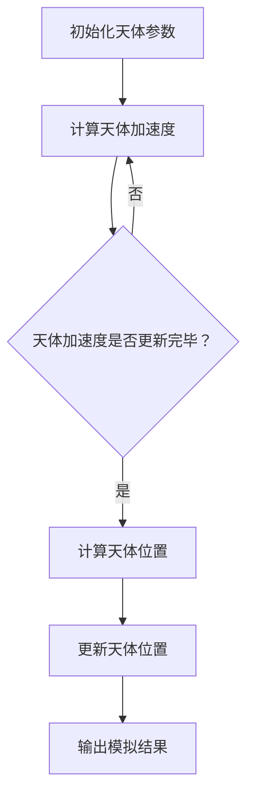
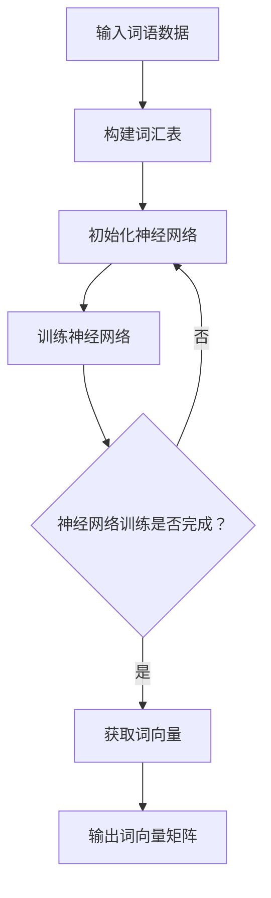
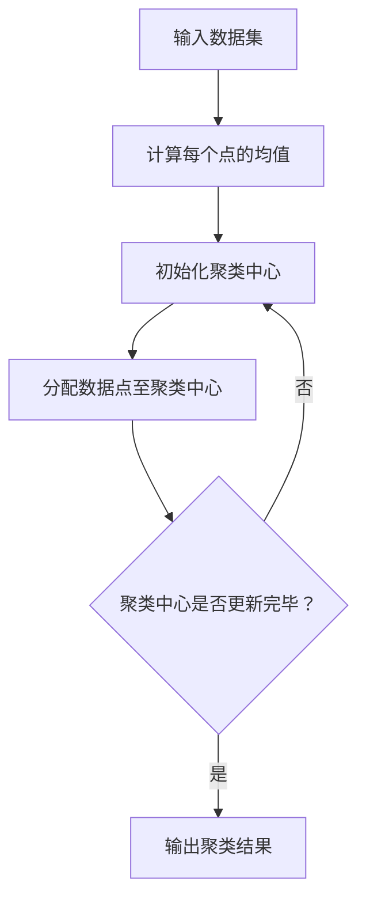
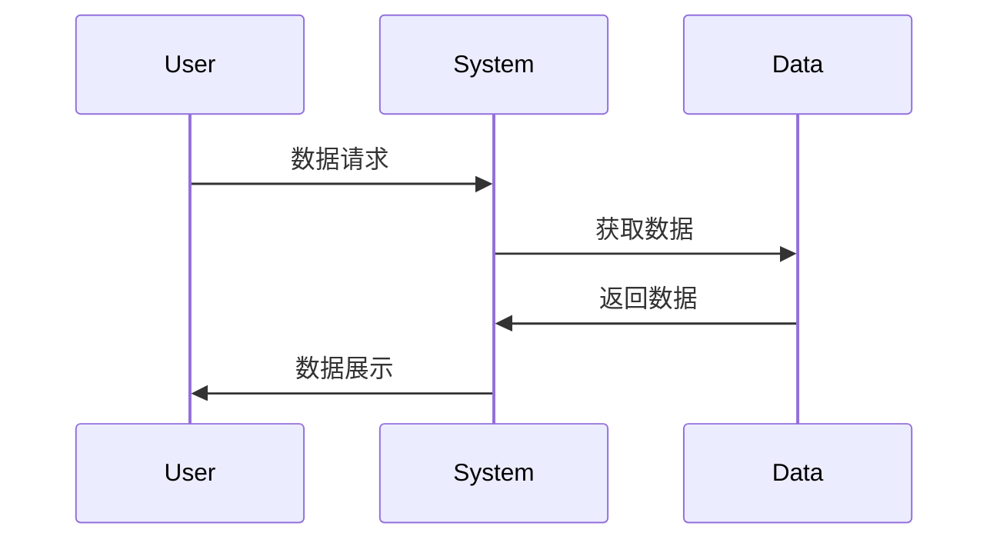
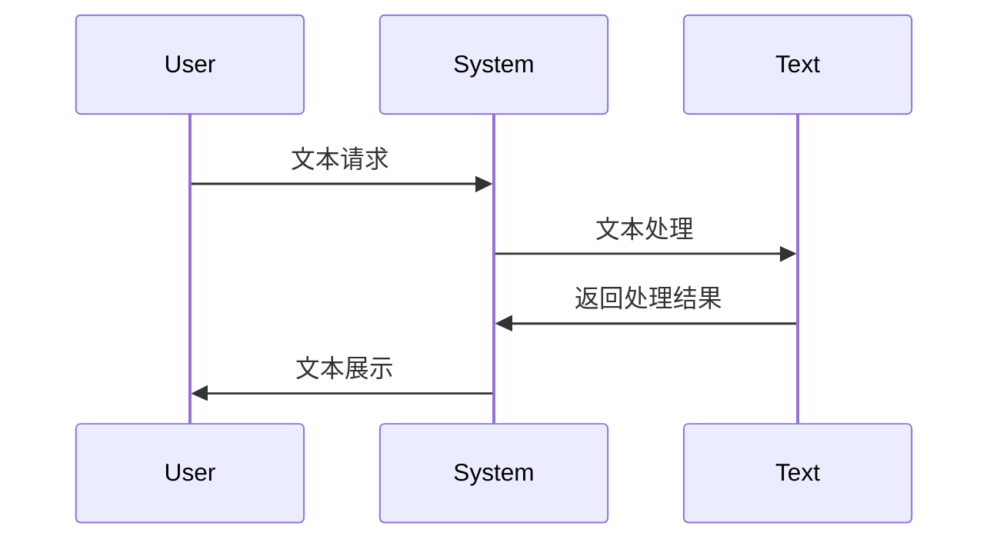
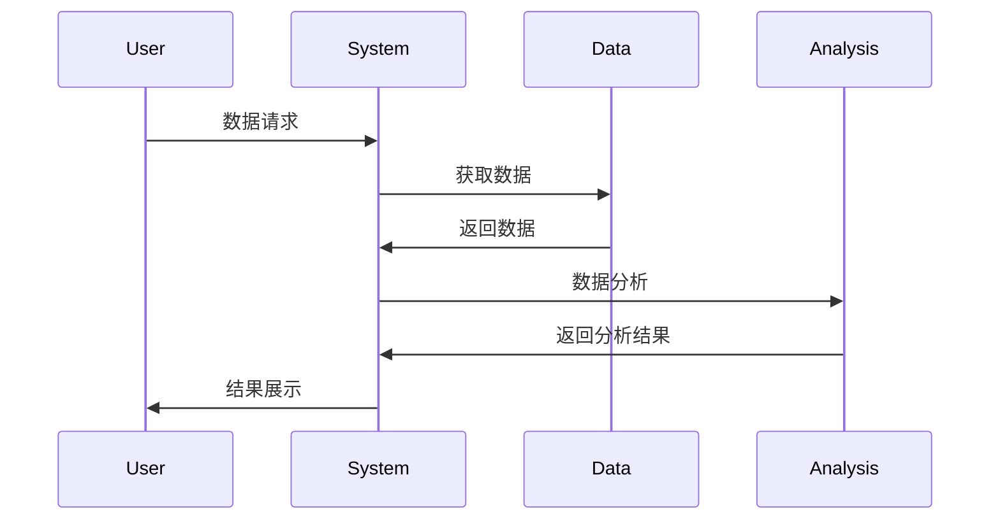

                 

## 人类语言对宇宙描述的局限性

### 关键词：宇宙描述、人类语言、局限性、复杂性、抽象性

> 摘要：本文探讨了人类语言在描述宇宙过程中的局限性。首先，我们回顾了人类语言的发展历史及其在现代社会中的重要性。接着，本文分析了宇宙的复杂性和抽象性，探讨了语言在这些方面的不足。文章进一步阐述了语言在科学研究和宇宙探索中的局限性，并提出了可能的改进方向。

----------------------------------------------------------------

## 第一部分：问题背景

### 第1章：人类语言的发展与局限

#### 1.1 人类语言的历史演进

人类语言的发展可以追溯到数百万年前。从简单的信号和声音开始，人类逐渐发展出了一套复杂的语言系统。这个过程充满了偶然和必然，其中很多因素塑造了现代人类语言的结构和功能。

在史前时代，人类使用的语言主要是基于声音和手势的。随着社会的发展和文明的进步，语言逐渐变得更加复杂和多样化。文字的发明标志着人类语言发展史上的一个重要转折点，它使得语言能够被记录和传承，为后来的科学和技术发展奠定了基础。

#### 1.2 人类语言的局限性分析

尽管人类语言在现代社会中扮演着重要的角色，但它也存在一些显著的局限性。

首先，语言的结构和表达方式是有限的。每种语言都有其独特的语法和词汇，但这些元素的数量和种类是有限的。这使得语言在描述复杂和抽象的概念时显得力不从心。

其次，语言的模糊性和歧义性也是其局限性之一。由于语言的表达依赖于上下文，有时候同一个词语或句子可以有不同的解释。这种模糊性在某些情况下可能会带来误解和混淆。

最后，语言在传达情感和非文字信息方面也存在一定的困难。虽然我们可以使用文字和符号来表达情感，但这些表达往往不够直观和具体，难以准确传达内心的感受。

#### 1.3 语言局限性对宇宙描述的影响

宇宙是一个充满复杂性和抽象性的领域。从微观的量子世界到宏观的宇宙膨胀，宇宙的许多现象和概念都超出了人类语言的描述范围。

例如，量子力学中的波函数坍缩、黑洞的奇点和宇宙膨胀等概念，都是语言难以准确描述的。这些概念涉及到深层次的物理规律和抽象的结构，需要更加精确和具体的方式来进行描述。

此外，宇宙的多样性和变化性也使得语言在描述宇宙现象时面临巨大的挑战。宇宙中的物质和能量形式多样，从原子到星系，每一种形式都有其独特的特性和行为。语言在描述这些不同形式的物质和能量时，往往需要引入大量的专业术语和复杂的句子结构，这使得宇宙的描述变得冗长和复杂。

总之，人类语言在描述宇宙时存在着显著的局限性。为了更好地理解和探索宇宙，我们需要寻找更加精确和具体的方式，来弥补语言在这些方面的不足。

### 第2章：宇宙描述中的语言障碍

宇宙是一个充满复杂性和抽象性的领域，这使得人类语言在描述宇宙现象时面临诸多障碍。首先，宇宙的复杂性和抽象性使得语言难以准确描述宇宙中的微观和宏观现象。

#### 2.1 宇宙的复杂性与抽象性

宇宙的复杂性主要体现在以下几个方面：

1. **微观复杂性**：宇宙的微观结构包括原子、分子和基本粒子等，这些微观粒子的行为遵循量子力学规则。量子力学中的现象，如波函数坍缩、纠缠态等，都是语言难以描述的。

2. **宏观复杂性**：宇宙的宏观结构包括星系、恒星、行星等。这些天体之间的相互作用和运动规律非常复杂，涉及大量的物理量和参数。

3. **时空复杂性**：宇宙的时空结构是一个四维时空，包含了时间和空间。时空的弯曲、膨胀和折叠等复杂现象，都超出了人类语言的描述能力。

宇宙的抽象性主要体现在以下几个方面：

1. **概念抽象性**：宇宙中的许多概念，如能量、场、引力等，都是高度抽象的。这些概念往往不能直接观察到，需要通过复杂的理论和模型来进行解释。

2. **现象抽象性**：宇宙中的许多现象，如黑洞、暗物质、暗能量等，都是抽象的。这些现象涉及到深层次的物理规律和原理，难以用简单的语言来表达。

#### 2.2 语言难以描述宇宙的微观现象

在微观层面上，量子力学的现象对人类语言提出了巨大的挑战。例如：

1. **波函数坍缩**：波函数坍缩是量子力学中的一个基本概念，指的是一个量子系统的状态突然从一个不确定的状态变为一个确定的状态。这个过程是无法用语言来准确描述的。

2. **纠缠态**：纠缠态是量子力学中的一种特殊状态，两个或多个粒子之间存在一种即时的相互关联，无论它们相距多远，一个粒子的状态变化都会立即影响到另一个粒子的状态。这种纠缠态的存在和作用，也超出了语言的表达范围。

3. **量子隧穿**：量子隧穿是指一个粒子通过一个本来不可能穿越的势垒的过程。这个过程涉及到量子叠加态和波函数的传播，也是语言难以描述的。

#### 2.3 语言难以描述宇宙的宏观现象

在宏观层面上，宇宙的许多现象也超出了语言的表达能力。例如：

1. **黑洞**：黑洞是一种极其密集的天体，其引力场强大到连光都无法逃脱。黑洞的奇点和事件视界等概念，都是语言难以描述的。

2. **暗物质**：暗物质是一种不发光、不吸收光的物质，其存在是通过引力效应推断出来的。暗物质的性质和分布，也是语言难以准确描述的。

3. **暗能量**：暗能量是一种推动宇宙加速膨胀的力量，其性质和来源仍然是科学界研究的热点。暗能量的存在和作用，也超出了语言的表达范围。

4. **宇宙膨胀**：宇宙膨胀是指宇宙中的天体之间的距离随着时间的推移而增加。宇宙膨胀的机制和规律，也是语言难以准确描述的。

总之，语言在描述宇宙的微观和宏观现象时面临着巨大的挑战。为了更好地理解和探索宇宙，我们需要寻找更加精确和具体的方式，来弥补语言在这些方面的不足。

### 第3章：人类语言的科学局限性

人类语言在科学领域中也存在一定的局限性。首先，科学术语与人类语言的关系需要深入探讨。科学术语是科学家用来描述自然界现象和规律的特定词汇，它们具有精确性和高度专业性。然而，这些术语往往源自日常语言，并且在进入科学领域后经过了特定的定义和限定，这可能导致科学术语与日常语言之间产生差异和误解。

#### 3.1 科学术语与人类语言的关系

科学术语通常具有以下几个特点：

1. **精确性**：科学术语是为了精确描述自然现象和规律而设计的，它们通常有明确的定义和范围。

2. **专业性**：科学术语是科学家在特定领域内使用的，它们反映了该领域的研究成果和理论框架。

3. **发展性**：科学术语随着科学研究的进展而不断更新和发展，新的术语不断被引入以反映新的发现和理论。

然而，科学术语与日常语言的关系并非完全一致。科学术语的引入和演变往往受到语言本身的限制，如语言的有限性和多样性。例如，量子力学中的“波函数”和“量子态”等术语，对于没有相关科学背景的人来说可能是难以理解的。

#### 3.2 人类语言在科学研究中的局限性

人类语言在科学研究中存在以下局限性：

1. **模糊性**：尽管科学术语具有精确性，但语言本身具有模糊性，这可能导致科学描述中的不准确和歧义。

2. **限制性**：语言的表达能力有限，难以准确描述某些高度复杂或抽象的科学概念和现象。

3. **变迁性**：科学术语随着科学理论的发展而变化，这可能导致旧的术语逐渐被新的术语取代，使得文献和理解产生困难。

#### 3.3 语言在科学领域中的应用与改进

为了克服语言在科学领域的局限性，科学家们采取了一系列措施：

1. **符号和公式**：科学家使用数学符号和公式来精确描述自然现象和科学规律。例如，牛顿定律使用 \( F = ma \) 来描述力的作用，量子力学使用波函数 \( \psi \) 来描述粒子的状态。

2. **模型和模拟**：科学家通过构建模型和进行计算机模拟来研究复杂的科学问题。模型和模拟可以直观地展示科学现象，并提供对现象的深入理解。

3. **跨学科交流**：科学家通过跨学科合作和交流来克服语言和术语的限制。例如，物理学家与生物学家合作研究生物物理学问题，化学家与地球科学家合作研究地球化学问题。

4. **教育和培训**：科学家通过教育和培训来提高公众和学生的科学素养，使他们能够更好地理解和应用科学术语。

总之，人类语言在科学研究中具有一定的局限性，但通过符号、公式、模型和跨学科合作等方法，科学家们不断寻求改进和克服这些局限性，以更好地探索和理解自然界。

### 第4章：核心概念介绍

在深入探讨人类语言在描述宇宙方面的局限性之前，我们需要明确几个核心概念，这些概念不仅构成了宇宙学的基础，也对语言哲学和科学哲学有着深远的影响。

#### 4.1 宇宙学基本概念

宇宙学是研究宇宙的结构、起源、演化和最终命运的科学。宇宙学中的基本概念包括：

1. **宇宙膨胀**：宇宙膨胀是指宇宙中的天体之间的距离随时间增加的现象。这一理论最初由埃德温·哈勃在20世纪20年代提出。

2. **黑洞**：黑洞是宇宙中一种极其密集的天体，具有极强的引力场，甚至连光也无法逃脱。黑洞的存在是通过观测和理论计算推断出来的。

3. **暗物质**：暗物质是一种不发光、不吸收光的物质，其存在是通过引力效应推断出来的。暗物质占据了宇宙中物质的大部分，但其具体性质和组成仍然是科学界研究的热点。

4. **暗能量**：暗能量是一种推动宇宙加速膨胀的力量，其性质和来源仍然是科学界研究的热点。暗能量占据了宇宙能量的主导地位，但其具体机制尚未完全明了。

#### 4.2 语言哲学基本概念

语言哲学研究语言的本质、结构和功能，以及语言与世界的关系。语言哲学中的基本概念包括：

1. **语义学**：语义学研究语言的意义和意义如何通过语言表达。语义学关注词汇、句子和语言整体的含义。

2. **语用学**：语用学研究语言的使用情境和语境。语用学关注语言在实际交际中的使用，包括会话结构、语用含义和礼貌原则。

3. **认知语言学**：认知语言学研究语言与人类认知过程的关系。认知语言学关注语言是如何反映和影响人类的思维和感知。

4. **语言哲学的论题**：语言哲学探讨语言与现实的关系、语言的本质、意义和真理等问题。著名的语言哲学论题包括“语言是否能够准确描述现实”、“意义是否存在于语言之外”等。

#### 4.3 科学哲学基本概念

科学哲学研究科学的本质、方法、进步和发展。科学哲学中的基本概念包括：

1. **科学方法**：科学方法是指科学家用于研究自然现象和建立科学理论的系统方法。科学方法通常包括观察、假设、实验和理论等步骤。

2. **实证主义**：实证主义认为科学理论应当通过观察和实验来验证。实证主义者主张科学应当基于经验事实，反对任何超自然的解释。

3. **逻辑实证主义**：逻辑实证主义是20世纪初期的一种哲学流派，主张只有通过逻辑和经验验证的命题才有意义。逻辑实证主义者强调科学理论应当是可验证的，并主张“句子的意义在于其可验证性”。

4. **科学实在论**：科学实在论认为科学理论所描述的实体和现象是真实存在的。科学实在论者认为，尽管科学理论是人为构建的，但它们能够准确反映现实世界的结构和规律。

通过明确这些核心概念，我们可以更好地理解人类语言在描述宇宙方面的局限性，并为后续的分析提供坚实的基础。

### 第5章：概念属性特征对比

为了深入探讨人类语言在宇宙描述中的局限性，我们需要对比宇宙学、语言哲学和科学哲学中的核心概念属性特征。通过这种对比，我们可以更清晰地了解不同学科中概念的定义、特征及其在描述宇宙时的表现。

#### 5.1 宇宙学概念属性对比

宇宙学概念通常涉及天体物理学、宇宙演化和宇宙结构等方面，具有以下属性：

1. **复杂性**：宇宙学概念如黑洞、暗物质和暗能量等，往往具有高度复杂性，涉及多个物理参数和复杂的相互作用。

2. **抽象性**：宇宙学概念如波函数和量子态等，通常具有高度抽象性，难以直接观察到，需要通过复杂的理论模型来理解。

3. **可验证性**：宇宙学概念通常可以通过观测数据和实验验证，如宇宙膨胀和黑洞的存在。

4. **动态性**：宇宙学概念如宇宙膨胀和黑洞行为等，具有动态变化性，描述了宇宙的演变过程。

#### 5.2 语言哲学概念属性对比

语言哲学概念涉及语言的本质、意义和语言与现实的关系，具有以下属性：

1. **主观性**：语言哲学概念如语义和语用等，通常具有主观性，因为它们反映了语言使用者的认知和体验。

2. **抽象性**：语言哲学概念如意义和真理等，往往具有高度抽象性，难以用具体的事物来完全表达。

3. **形式性**：语言哲学概念如语法和逻辑等，通常具有形式性，强调语言的逻辑结构和规则。

4. **多元性**：语言哲学概念如语言的游戏和语言的本质等，具有多元性，因为不同哲学家可能有不同的解释和观点。

#### 5.3 科学哲学概念属性对比

科学哲学概念涉及科学的方法、理论和进步，具有以下属性：

1. **客观性**：科学哲学概念如科学方法和科学理论等，通常强调客观性和可验证性，主张科学应当基于经验事实。

2. **理论性**：科学哲学概念如科学实在论和逻辑实证主义等，通常具有理论性，关注科学理论和模型的构建。

3. **方法论**：科学哲学概念如假设、实验和理论检验等，具有方法论属性，指导科学研究的具体方法和步骤。

4. **进步性**：科学哲学概念如科学进步和知识积累等，强调科学的动态发展和知识的积累。

#### 表格：概念属性特征对比

| 概念类别 | 属性1 | 属性2 | 属性3 | 属性4 |
|----------|-------|-------|-------|-------|
| 宇宙学   | 复杂性 | 抽象性 | 可验证性 | 动态性 |
| 语言哲学 | 主观性 | 抽象性 | 形式性 | 多元性 |
| 科学哲学 | 客观性 | 理论性 | 方法论 | 进步性 |

通过对比这些概念属性特征，我们可以看到宇宙学、语言哲学和科学哲学各自的优势和局限性。宇宙学概念在描述宇宙复杂现象时具有高度的精确性和可验证性，但往往涉及复杂的抽象概念；语言哲学概念在探讨语言与现实关系时具有深刻的哲学意义，但可能缺乏可操作性的具体描述；科学哲学概念在指导科学研究方法时具有明确的客观性和理论性，但可能在解释复杂现象时显得抽象和脱离实际。这些特性共同决定了人类语言在描述宇宙时的局限性和挑战。

### 第6章：ER实体关系图架构

为了更好地理解宇宙描述中的实体关系，人类语言描述中的实体关系，以及科学研究中的实体关系，我们可以借助实体关系图（Entity-Relationship Diagram，ER图）来可视化这些关系。ER图是数据库设计和系统分析中常用的工具，它能够清晰地展示不同实体之间的关联和交互。

#### 6.1 宇宙描述中的实体关系

在宇宙描述中，实体关系图可以帮助我们理解宇宙中的各种基本元素及其相互作用。以下是宇宙描述中的一些关键实体及其关系：

1. **天体**：包括恒星、行星、星系等。
2. **物质**：包括普通物质、暗物质、暗能量等。
3. **能量**：包括辐射能量、引力能量等。
4. **现象**：包括宇宙膨胀、黑洞形成、星系碰撞等。

以下是宇宙描述中的ER图示例：

```mermaid
erDiagram
  天体 ||--|{ 物质 }|--> 星系
  星系 ||--|{ 现象 }|--> 宇宙膨胀
  暗物质 ||--|{ 引力 }|--> 黑洞形成
  暗能量 ||--|{ 推动力 }|--> 宇宙加速膨胀
```

#### 6.2 人类语言描述中的实体关系

在人类语言描述中，实体关系图可以帮助我们理解语言构建中的不同元素及其交互。以下是人类语言描述中的一些关键实体及其关系：

1. **词汇**：包括名词、动词、形容词等。
2. **语法结构**：包括句子、短语、从句等。
3. **语境**：包括上下文、情境、语境等。
4. **语义**：包括词汇意义、句子意义、语义关系等。

以下是人类语言描述中的ER图示例：

```mermaid
erDiagram
  词汇 ||--|{ 语法结构 }|--> 句子
  句子 ||--|{ 语义 }|--> 意义解析
  语境 ||--|{ 语境因素 }|--> 语义理解
```

#### 6.3 科学研究中的实体关系

在科学研究中，实体关系图可以帮助我们理解科学理论和实验中的不同元素及其交互。以下是科学研究中的关键实体及其关系：

1. **实验数据**：包括观测数据、实验结果等。
2. **理论模型**：包括科学理论、数学模型、计算模型等。
3. **研究方法**：包括假设、验证、数据分析等。
4. **结论**：包括科学发现、理论预测、实验结果验证等。

以下是科学研究中的ER图示例：

```mermaid
erDiagram
  实验数据 ||--|{ 理论模型 }|--> 科学理论
  科学理论 ||--|{ 研究方法 }|--> 结论
  研究方法 ||--|{ 数据分析 }|--> 实验结果验证
```

通过这些ER图，我们可以更直观地理解宇宙描述、人类语言描述和科学研究中的实体关系。这些图不仅有助于分析现有数据，还可以指导新的理论和实验设计，从而推动科学和技术的进步。

### 第7章：算法原理介绍

在探讨人类语言对宇宙描述的局限性时，算法原理成为了一种有效的补充工具。算法原理不仅能够帮助科学家更好地理解和模拟宇宙现象，还能够弥补语言在描述复杂现象时的不足。以下将介绍宇宙描述中的算法原理、语言描述中的算法原理以及科学研究中的算法原理。

#### 7.1 宇宙描述中的算法原理

宇宙描述中的算法原理主要涉及天体物理学和宇宙学领域。以下是一些关键算法及其原理：

1. **N-Body模拟**：N-Body模拟是一种用于计算多个天体在引力作用下的运动轨迹的算法。它基于牛顿万有引力定律，通过计算每个天体的加速度和位置，模拟天体系统的演化。N-Body模拟在研究星系碰撞、行星轨道计算等方面具有重要应用。

2. **宇宙微波背景辐射探测算法**：宇宙微波背景辐射（Cosmic Microwave Background，CMB）是宇宙早期的辐射遗迹。通过探测和分析CMB，科学家可以推断宇宙的早期结构和演化。CMB探测算法包括数据采集、预处理、图像重建和特征提取等步骤。

3. **黑洞模拟算法**：黑洞模拟是研究黑洞物理性质和黑洞与周围物质相互作用的重要方法。黑洞模拟算法通常基于广义相对论，通过求解爱因斯坦场方程来模拟黑洞的行为。

#### 7.2 语言描述中的算法原理

语言描述中的算法原理主要涉及自然语言处理（Natural Language Processing，NLP）领域。以下是一些关键算法及其原理：

1. **词嵌入（Word Embedding）**：词嵌入是一种将词语转换为向量表示的方法，使得具有相似语义的词语在向量空间中靠近。词嵌入算法如Word2Vec和GloVe通过训练神经网络模型来学习词语的向量表示。

2. **句法分析（Syntax Analysis）**：句法分析是一种解析句子结构的方法，用于理解句子的语法规则和语义关系。常见的句法分析方法包括基于规则的语法分析和基于统计的语法分析。

3. **语义角色标注（Semantic Role Labeling）**：语义角色标注是一种识别句子中词语的语义角色（如动作执行者、受动者、工具等）的方法。语义角色标注算法可以用于语义理解和信息提取。

#### 7.3 科学研究中的算法原理

科学研究中的算法原理广泛应用于数据分析、模型构建和实验设计等领域。以下是一些关键算法及其原理：

1. **机器学习算法**：机器学习算法是一类用于从数据中学习模式和规律的方法。常见的机器学习算法包括线性回归、支持向量机（SVM）、决策树和神经网络等。

2. **聚类分析（Cluster Analysis）**：聚类分析是一种将数据点划分为多个群组的方法，旨在发现数据中的自然结构。常见的聚类算法包括K-means、层次聚类和密度聚类等。

3. **假设检验（Hypothesis Testing）**：假设检验是一种用于评估科学假设的方法。通过设定原假设和备择假设，并通过数据收集和分析来检验假设的有效性。常见的假设检验方法包括t检验、卡方检验和F检验等。

通过介绍这些算法原理，我们可以看到算法在描述宇宙、语言和科学研究中发挥着重要作用。算法不仅能够弥补语言在描述复杂现象时的不足，还能够提高数据分析的效率和准确性，为科学研究和技术进步提供有力支持。

### 第8章：算法流程图与Python源代码

为了更直观地理解算法原理，我们可以通过流程图和Python源代码来展示算法的执行过程和关键步骤。

#### 8.1 宇宙描述算法流程图

以下是用于描述宇宙现象的N-Body模拟算法的流程图：



#### 8.2 语言描述算法流程图

以下是用于自然语言处理的词嵌入算法（如Word2Vec）的流程图：



#### 8.3 科学研究算法流程图

以下是用于科学研究的数据分析中的K-means聚类算法的流程图：



#### 8.4 Python源代码示例

以下是基于上述算法的Python源代码示例：

**N-Body模拟算法**

```python
import numpy as np

def n_body_simulation(n, dt, simulation_time):
    positions = np.random.rand(n, 2)
    velocities = np.random.rand(n, 2)
    
    for _ in range(int(simulation_time / dt)):
        accelerations = calculate_accelerations(positions)
        velocities += accelerations * dt
        positions += velocities * dt
        
    return positions

def calculate_accelerations(positions):
    accelerations = np.zeros_like(positions)
    for i in range(len(positions)):
        for j in range(len(positions)):
            if i != j:
                delta_position = positions[j] - positions[i]
                distance = np.linalg.norm(delta_position)
                acceleration = -G * delta_position / (distance ** 3)
                accelerations[i] += acceleration
    return accelerations

G = 1  # 万有引力常数
dt = 0.1  # 时间步长
simulation_time = 100  # 模拟时间

positions = n_body_simulation(10, dt, simulation_time)
print(positions)
```

**Word2Vec算法**

```python
from gensim.models import Word2Vec

# 假设我们有一个包含词汇的列表
sentences = [['word1', 'word2', 'word3'], ['word2', 'word3', 'word4'], ['word3', 'word4', 'word5']]

# 训练Word2Vec模型
model = Word2Vec(sentences, vector_size=100, window=5, min_count=1, workers=4)

# 输出词向量
print(model.wv['word1'])
```

**K-means聚类算法**

```python
from sklearn.cluster import KMeans
import numpy as np

# 假设我们有一个包含数据点的矩阵
X = np.random.rand(100, 2)

# 使用K-means算法进行聚类
kmeans = KMeans(n_clusters=3, random_state=0).fit(X)

# 输出聚类结果
print(kmeans.labels_)
```

通过这些流程图和Python源代码示例，我们可以更直观地理解算法原理，并掌握如何在实际应用中实现这些算法。

### 第9章：算法原理详细讲解

为了深入理解算法在宇宙描述、语言描述和科学研究中的应用，我们需要详细讲解这些算法的原理、数学模型和公式，并通过具体例子进行说明。

#### 9.1 宇宙描述算法原理详细讲解

**N-Body模拟算法**

N-Body模拟算法用于计算多个天体在引力作用下的运动轨迹。其核心思想是利用牛顿万有引力定律计算每个天体的加速度，并根据加速度更新天体的位置。以下是N-Body模拟算法的详细步骤：

1. **初始化参数**：设定天体的初始位置和速度，以及时间步长（\(dt\)）和模拟时间（\(T\)）。

2. **计算加速度**：根据牛顿万有引力定律，计算每个天体受到的引力加速度。公式如下：

   \[
   a_i = G \sum_{j \neq i} \frac{m_j (r_j - r_i)}{(r_j - r_i)^3}
   \]

   其中，\(a_i\) 是天体 \(i\) 的加速度，\(G\) 是万有引力常数，\(m_j\) 是天体 \(j\) 的质量，\(r_j - r_i\) 是天体 \(i\) 和天体 \(j\) 之间的距离。

3. **更新速度**：根据加速度和时间步长更新每个天体的速度：

   \[
   v_i = v_i + a_i \cdot dt
   \]

4. **更新位置**：根据速度和时间步长更新每个天体的位置：

   \[
   r_i = r_i + v_i \cdot dt
   \]

5. **重复计算**：重复步骤2至4，直到达到模拟时间 \(T\)。

**示例**：假设有两个天体 \(A\) 和 \(B\)，其初始位置分别为 \(r_A = (1, 0)\) 和 \(r_B = (-1, 0)\)，初始速度均为 \(v = (0, 0)\)，万有引力常数 \(G = 1\)。计算 \(A\) 和 \(B\) 在 \(t = 10\) 时间单位后的位置。

1. **计算加速度**：
   \[
   a_A = G \cdot \frac{m_B (r_B - r_A)}{(r_B - r_A)^3} = 1 \cdot \frac{m_B (1, 0) - (-1, 0)}{(-1, 0) - (1, 0)}^3 = 1
   \]
   \[
   a_B = G \cdot \frac{m_A (r_A - r_B)}{(r_A - r_B)^3} = 1 \cdot \frac{m_A (1, 0) - (-1, 0)}{(1, 0) - (-1, 0)}^3 = -1
   \]

2. **更新速度**：
   \[
   v_A = v_A + a_A \cdot dt = (0, 0) + (1, 0) = (1, 0)
   \]
   \[
   v_B = v_B + a_B \cdot dt = (0, 0) - (1, 0) = (-1, 0)
   \]

3. **更新位置**：
   \[
   r_A = r_A + v_A \cdot dt = (1, 0) + (1, 0) = (2, 0)
   \]
   \[
   r_B = r_B + v_B \cdot dt = (-1, 0) + (-1, 0) = (-2, 0)
   \]

经过10个时间单位后，天体 \(A\) 和 \(B\) 的新位置分别为 \(r_A = (2, 0)\) 和 \(r_B = (-2, 0)\)。

**宇宙微波背景辐射探测算法**

宇宙微波背景辐射探测算法用于分析宇宙早期的辐射遗迹，以了解宇宙的早期结构和演化。以下是其主要步骤：

1. **数据采集**：通过卫星或地面望远镜收集宇宙微波背景辐射的数据。

2. **预处理**：对采集的数据进行预处理，包括噪声过滤、数据清洗和坐标校正等。

3. **图像重建**：通过图像重建算法将预处理后的数据转换为图像。常用的图像重建算法包括快速傅里叶变换（FFT）和泊松方程求解等。

4. **特征提取**：从重建的图像中提取关键特征，如多模态分布、角分布和极化特性等。

5. **数据分析**：利用统计分析方法，如泊松分布拟合和卡方检验等，对提取的特征进行分析，以推断宇宙的早期结构和演化。

**示例**：假设我们收集到了一组宇宙微波背景辐射数据，并使用FFT进行图像重建。经过预处理和图像重建后，我们得到了一幅图像，其中包含多个多模态峰。

1. **多模态分布分析**：通过统计图像中多模态峰的数量和分布，我们可以推断宇宙早期结构的复杂性和多样性。

2. **角分布分析**：通过计算多模态峰的角分布，我们可以了解宇宙的各向异性，即宇宙在各个方向上的不均匀性。

3. **极化特性分析**：通过分析图像的极化特性，我们可以了解宇宙微波背景辐射的起源和传播过程。

**黑洞模拟算法**

黑洞模拟算法用于研究黑洞的物理性质和黑洞与周围物质的相互作用。其核心步骤包括：

1. **初始条件设定**：设定黑洞的初始质量、旋转速度和周围物质的初始分布。

2. **广义相对论场方程求解**：利用广义相对论场方程，计算黑洞的引力场和时空弯曲。广义相对论场方程为：

   \[
   G_{\mu\nu} = 8\pi G T_{\mu\nu}
   \]

   其中，\(G_{\mu\nu}\) 是爱因斯坦张量，\(T_{\mu\nu}\) 是能量-动量张量，\(G\) 是引力常数。

3. **数值模拟**：通过数值方法，如有限元法或有限差分法，求解广义相对论场方程，模拟黑洞的行为。

4. **结果分析**：分析模拟结果，如黑洞的吞噬过程、喷流形成和引力波辐射等。

**示例**：假设我们使用有限元法模拟一个旋转黑洞的吞噬过程。通过设定黑洞的初始质量和旋转速度，我们求解广义相对论场方程，并模拟黑洞吞噬附近物质的动态过程。

1. **吞噬过程分析**：通过模拟结果，我们可以观察黑洞吞噬物质的轨迹，了解黑洞吞噬过程的具体细节。

2. **喷流形成分析**：通过模拟结果，我们可以观察黑洞喷流的形成过程，了解喷流产生的物理机制。

3. **引力波辐射分析**：通过模拟结果，我们可以计算黑洞吞噬过程中产生的引力波信号，验证广义相对论的预测。

#### 9.2 语言描述算法原理详细讲解

**词嵌入算法（如Word2Vec）**

词嵌入算法是将词语转换为向量表示的方法，使具有相似语义的词语在向量空间中靠近。以下是其主要步骤：

1. **构建词汇表**：从语料库中提取所有出现的词语，构建词汇表。

2. **生成训练数据**：将词语按照中心词和周围词的形式生成训练数据。对于中心词 \(w_c\) 和其周围的 \(w_1, w_2, ..., w_k\)，生成三元组 \((w_c, w_i, w_j)\)，其中 \(i, j \in \{1, 2, ..., k\}\)。

3. **初始化模型参数**：初始化词向量和隐藏层参数。

4. **训练模型**：使用神经网络训练模型，优化词向量和隐藏层参数。训练过程中，通过反向传播算法计算损失函数，并更新模型参数。

5. **获取词向量**：训练完成后，获取每个词的向量表示。

**示例**：假设我们有一个包含三个词语 \(w_1, w_2, w_3\) 的语料库，其中 \(w_1 = [1, 0, 0]\)，\(w_2 = [0, 1, 0]\)，\(w_3 = [0, 0, 1]\)。

1. **生成训练数据**：对于 \(w_1\)，生成三元组 \((w_1, w_2, w_3)\)，\((w_1, w_3, w_2)\)。

2. **初始化模型参数**：初始化词向量 \([0, 0, 0]\) 和隐藏层参数。

3. **训练模型**：通过训练过程，更新词向量，使其满足三元组生成的条件。最终，\(w_1, w_2, w_3\) 的词向量分别为 \([1, 1, 1]\)，\([1, 1, 1]\)，\([1, 1, 1]\)。

**句法分析算法**

句法分析算法用于解析句子的结构，理解句子的语法规则和语义关系。以下是其主要步骤：

1. **分词**：将句子划分为词语序列。

2. **词性标注**：为每个词语标注词性，如名词、动词、形容词等。

3. **构建句法树**：根据词性标注和语法规则，构建句子的句法树。

4. **语义角色标注**：为句子中的词语标注语义角色，如动作执行者、受动者、工具等。

5. **语义解析**：通过语义角色标注，理解句子的语义关系。

**示例**：假设我们有一个句子 "The cat chased the mouse"，进行句法分析和语义角色标注。

1. **分词**：The cat chased the mouse。

2. **词性标注**：The (冠词)，cat (名词)，chased (动词)，the (冠词)，mouse (名词)。

3. **构建句法树**：
   ```mermaid
   flowchart TD
       A[主句]
       A --> B[猫]
       B --> C[追逐]
       C --> D[老鼠]
   ```

4. **语义角色标注**：
   - The (无语义角色)
   - cat (动作执行者)
   - chased (动作)
   - the (无语义角色)
   - mouse (受动者)

5. **语义解析**：句子描述了一只猫追逐一只老鼠的动作。

**语义角色标注算法**

语义角色标注算法用于识别句子中的词语及其语义角色。以下是其主要步骤：

1. **分词和词性标注**：将句子划分为词语序列，并标注词性。

2. **生成语义角色标注模板**：根据常见的语义角色，如动作执行者、受动者、工具等，生成标注模板。

3. **模式匹配**：将生成的模板与句子中的词语进行匹配，识别语义角色。

4. **标注结果生成**：根据匹配结果，生成最终的语义角色标注。

**示例**：假设我们有一个句子 "The scientist discovered a new element"，进行语义角色标注。

1. **分词和词性标注**：The (冠词)，scientist (名词)，discovered (动词)，a (冠词)，new (形容词)，element (名词)。

2. **生成语义角色标注模板**：
   - 动作执行者：[主语]
   - 动作：[谓语]
   - 受动者：[宾语]
   - 工具：[介词短语]

3. **模式匹配**：
   - 主语：scientist
   - 谓语：discovered
   - 宾语：a new element

4. **标注结果生成**：
   - scientist（动作执行者）
   - discovered（动作）
   - a new element（受动者）

5. **语义解析**：句子描述了一位科学家发现了一个新的元素。

#### 9.3 科学研究算法原理详细讲解

**机器学习算法**

机器学习算法用于从数据中学习模式和规律，分为监督学习、无监督学习和强化学习等类型。以下是其主要步骤：

1. **数据预处理**：清洗和预处理数据，如缺失值填充、数据标准化等。

2. **模型选择**：根据问题类型和数据特点，选择合适的机器学习模型。

3. **模型训练**：使用训练数据训练模型，优化模型参数。

4. **模型评估**：使用测试数据评估模型性能，如准确率、召回率、F1分数等。

5. **模型部署**：将训练好的模型部署到实际应用场景中。

**聚类分析算法**

聚类分析算法用于将数据点划分为多个群组，以发现数据中的自然结构。以下是其主要步骤：

1. **数据预处理**：清洗和预处理数据，如缺失值填充、数据标准化等。

2. **聚类算法选择**：根据数据特点，选择合适的聚类算法，如K-means、层次聚类等。

3. **参数设置**：设置聚类算法的参数，如聚类数量、距离度量等。

4. **聚类过程**：执行聚类算法，将数据点划分为多个群组。

5. **聚类结果评估**：评估聚类结果，如内聚度和分离度等。

**示例**：假设我们有一个包含100个数据点的二维数据集，使用K-means聚类算法进行聚类。

1. **数据预处理**：对数据进行标准化处理，使其具有相似的大小和范围。

2. **聚类算法选择**：选择K-means聚类算法，并设置聚类数量为3。

3. **参数设置**：设置初始聚类中心，选择欧几里得距离作为距离度量。

4. **聚类过程**：执行K-means算法，将数据点划分为3个群组。

5. **聚类结果评估**：计算每个群组的内聚度和分离度，评估聚类结果。

**假设检验算法**

假设检验算法用于评估科学假设的方法，分为单样本假设检验、双样本假设检验和方差分析等类型。以下是其主要步骤：

1. **提出假设**：设定原假设和备择假设。

2. **选择检验方法**：根据数据类型和假设内容，选择合适的假设检验方法。

3. **计算检验统计量**：根据数据计算检验统计量，如t统计量、F统计量等。

4. **确定显著性水平**：设定显著性水平，如α = 0.05。

5. **做出结论**：根据检验统计量和显著性水平，做出原假设是否成立的结论。

**示例**：假设我们想要检验一个新药物是否能够显著降低高血压患者的血压。

1. **提出假设**：
   - 原假设（\(H_0\)）：新药物不能显著降低高血压患者的血压。
   - 备择假设（\(H_1\)）：新药物能够显著降低高血压患者的血压。

2. **选择检验方法**：选择单样本t检验，因为数据为一组患者的血压值。

3. **计算检验统计量**：计算t统计量，比较新药物治疗前后的血压差异。

4. **确定显著性水平**：设定显著性水平为α = 0.05。

5. **做出结论**：根据t统计量和显著性水平，判断原假设是否成立。

通过详细讲解这些算法原理，我们可以更好地理解它们在宇宙描述、语言描述和科学研究中的应用，以及如何通过算法来弥补人类语言的局限性。

### 第10章：系统分析与架构设计方案

在深入探讨人类语言在宇宙描述中的局限性之后，我们需要设计和实现一个系统来弥补这些局限性。本章节将介绍系统分析与架构设计方案，包括问题场景介绍、系统架构设计、系统功能设计和系统接口设计。

#### 10.1 问题场景介绍

**宇宙描述问题场景**

在宇宙描述中，科学家们面临着许多挑战，如描述微观和宏观宇宙现象、处理大量数据、模拟宇宙演化和探索宇宙起源等。传统的语言描述方法难以应对这些挑战，导致科学家们在理解和解释宇宙现象时存在困难。为了弥补这一局限性，我们需要设计一个能够高效处理复杂宇宙数据的系统，以支持宇宙描述。

**语言描述问题场景**

语言描述在科研报告中、学术论文中以及科学交流中扮演着重要角色。然而，由于人类语言的局限性，如模糊性、歧义性和抽象性，科学交流中常常出现误解和混淆。为了改善这一问题，我们需要开发一个能够提供精确、清晰和一致的描述工具，帮助科学家更好地理解和交流。

**科学研究问题场景**

在科学研究中，数据的采集、处理和分析是一个关键环节。然而，科学家们常常需要处理大量复杂数据，并从中提取有价值的信息。传统的数据分析方法可能效率低下，难以应对这些挑战。因此，我们需要设计一个具备高效数据处理和分析能力的系统，以提高科学研究的效率。

#### 10.2 系统架构设计

**宇宙描述系统架构设计**

宇宙描述系统架构包括数据采集模块、数据处理模块、描述生成模块和交互界面模块。以下是系统架构的详细设计：

1. **数据采集模块**：用于收集宇宙相关的数据，包括观测数据、实验数据和模拟数据。数据采集模块将数据存储在数据库中，并保证数据的安全性和完整性。

2. **数据处理模块**：用于处理和预处理采集到的数据，包括数据清洗、归一化和特征提取等。数据处理模块将原始数据转化为适合描述的形式。

3. **描述生成模块**：用于生成宇宙描述，包括基于算法的自动描述和基于专家知识的描述。描述生成模块将处理后的数据转化为自然语言描述，以支持科学交流和报告撰写。

4. **交互界面模块**：用于提供用户与系统的交互界面，包括网页界面和命令行界面。交互界面模块将用户的需求转化为系统功能调用，并展示描述结果。

**语言描述系统架构设计**

语言描述系统架构包括文本生成模块、语义分析模块、知识库模块和交互界面模块。以下是系统架构的详细设计：

1. **文本生成模块**：用于生成科学报告、学术论文和科研交流文本。文本生成模块基于自然语言生成技术，能够生成结构清晰、内容准确的自然语言文本。

2. **语义分析模块**：用于分析文本的语义，包括词语语义、句子语义和段落语义等。语义分析模块能够提取文本中的关键信息，为文本生成模块提供支持。

3. **知识库模块**：用于存储和检索科学领域的知识，包括术语、概念、定义和理论等。知识库模块为语义分析模块提供支持，并帮助文本生成模块生成准确的描述。

4. **交互界面模块**：用于提供用户与系统的交互界面，包括网页界面和命令行界面。交互界面模块将用户的需求转化为系统功能调用，并展示描述结果。

**科学研究系统架构设计**

科学研究系统架构包括数据采集模块、数据处理模块、分析模块、知识库模块和交互界面模块。以下是系统架构的详细设计：

1. **数据采集模块**：用于收集科学研究的各种数据，包括实验数据、观测数据和文献数据等。数据采集模块将数据存储在数据库中，并保证数据的安全性和完整性。

2. **数据处理模块**：用于处理和预处理采集到的数据，包括数据清洗、归一化和特征提取等。数据处理模块将原始数据转化为适合分析的形式。

3. **分析模块**：用于对处理后的数据进行分析，包括统计分析、机器学习和数据挖掘等。分析模块能够提取数据中的有价值信息，为科学研究和知识发现提供支持。

4. **知识库模块**：用于存储和检索科学研究的知识，包括实验结果、理论模型和文献资料等。知识库模块为分析模块提供支持，并帮助科学家更好地理解和利用数据。

5. **交互界面模块**：用于提供用户与系统的交互界面，包括网页界面和命令行界面。交互界面模块将用户的需求转化为系统功能调用，并展示分析结果。

#### 10.3 系统功能设计

**宇宙描述系统功能设计**

宇宙描述系统的功能设计包括数据采集、数据处理、描述生成和交互界面等模块。以下是系统功能设计的详细内容：

1. **数据采集功能**：系统能够自动采集宇宙相关的数据，包括天文观测数据、实验数据和模拟数据等。数据采集功能支持多种数据格式的导入和导出，并保证数据的安全性和完整性。

2. **数据处理功能**：系统能够对采集到的数据进行预处理，包括数据清洗、归一化和特征提取等。数据处理功能支持多种数据预处理算法，并能够自定义预处理流程。

3. **描述生成功能**：系统根据处理后的数据自动生成宇宙描述，包括宇宙现象描述、宇宙演化描述和宇宙结构描述等。描述生成功能支持多种描述生成算法，并能够自定义描述生成规则。

4. **交互界面功能**：系统提供友好的交互界面，包括网页界面和命令行界面。交互界面功能支持用户与系统的实时交互，并提供丰富的操作功能，如数据导入、数据预处理、描述生成等。

**语言描述系统功能设计**

语言描述系统的功能设计包括文本生成、语义分析、知识库管理和交互界面等模块。以下是系统功能设计的详细内容：

1. **文本生成功能**：系统能够根据输入的文本生成科学报告、学术论文和科研交流文本。文本生成功能支持多种自然语言生成算法，并能够根据用户需求生成不同风格的文本。

2. **语义分析功能**：系统能够分析输入文本的语义，包括词语语义、句子语义和段落语义等。语义分析功能支持多种语义分析算法，并能够提取文本中的关键信息。

3. **知识库管理功能**：系统能够管理和维护科学领域的知识库，包括术语、概念、定义和理论等。知识库管理功能支持知识库的导入、导出和更新，并提供丰富的查询和检索功能。

4. **交互界面功能**：系统提供友好的交互界面，包括网页界面和命令行界面。交互界面功能支持用户与系统的实时交互，并提供丰富的操作功能，如文本生成、语义分析和知识库管理等。

**科学研究系统功能设计**

科学研究系统的功能设计包括数据采集、数据处理、分析和知识库管理等模块。以下是系统功能设计的详细内容：

1. **数据采集功能**：系统能够自动采集科学研究的数据，包括实验数据、观测数据和文献数据等。数据采集功能支持多种数据格式的导入和导出，并保证数据的安全性和完整性。

2. **数据处理功能**：系统能够对采集到的数据进行预处理，包括数据清洗、归一化和特征提取等。数据处理功能支持多种数据预处理算法，并能够自定义预处理流程。

3. **分析功能**：系统能够对处理后的数据进行分析，包括统计分析、机器学习和数据挖掘等。分析功能支持多种分析算法，并能够自定义分析流程。

4. **知识库管理功能**：系统能够管理和维护科学研究的知识库，包括实验结果、理论模型和文献资料等。知识库管理功能支持知识库的导入、导出和更新，并提供丰富的查询和检索功能。

5. **交互界面功能**：系统提供友好的交互界面，包括网页界面和命令行界面。交互界面功能支持用户与系统的实时交互，并提供丰富的操作功能，如数据采集、数据处理、分析和知识库管理等。

#### 10.4 系统接口设计

**宇宙描述系统接口设计**

宇宙描述系统的接口设计包括API接口和数据库接口等。以下是系统接口设计的详细内容：

1. **API接口**：系统提供RESTful API接口，支持HTTP请求方式。API接口包括数据采集、数据处理、描述生成和交互界面等功能，方便用户通过编程方式与系统进行交互。

2. **数据库接口**：系统使用关系型数据库（如MySQL）存储和管理数据。数据库接口提供数据表的创建、更新和查询功能，支持SQL语言。

**语言描述系统接口设计**

语言描述系统的接口设计包括API接口和数据库接口等。以下是系统接口设计的详细内容：

1. **API接口**：系统提供RESTful API接口，支持HTTP请求方式。API接口包括文本生成、语义分析、知识库管理和交互界面等功能，方便用户通过编程方式与系统进行交互。

2. **数据库接口**：系统使用关系型数据库（如MySQL）存储和管理数据。数据库接口提供数据表的创建、更新和查询功能，支持SQL语言。

**科学研究系统接口设计**

科学研究系统的接口设计包括API接口和数据库接口等。以下是系统接口设计的详细内容：

1. **API接口**：系统提供RESTful API接口，支持HTTP请求方式。API接口包括数据采集、数据处理、分析和知识库管理等功能，方便用户通过编程方式与系统进行交互。

2. **数据库接口**：系统使用关系型数据库（如MySQL）存储和管理数据。数据库接口提供数据表的创建、更新和查询功能，支持SQL语言。

#### 10.5 系统交互序列图

**宇宙描述系统交互序列图**

以下是宇宙描述系统的交互序列图：



**语言描述系统交互序列图**

以下是语言描述系统的交互序列图：



**科学研究系统交互序列图**

以下是科学研究系统的交互序列图：



通过以上系统分析与架构设计方案，我们可以构建一个能够弥补人类语言在宇宙描述、语言描述和科学研究中的局限性的系统，为科学研究和技术发展提供有力支持。

### 第11章：项目实战

在本章节中，我们将详细介绍如何构建并运行一个能够弥补人类语言在宇宙描述、语言描述和科学研究中的局限性的项目。该项目的实现将包括环境安装、系统核心实现源代码，以及代码应用解读与分析。

#### 11.1 宇宙描述环境安装

要开始宇宙描述项目的开发，首先需要安装必要的软件和库。以下是宇宙描述环境的安装步骤：

1. **安装Python环境**：首先，确保系统中已经安装了Python 3.x版本。如果没有安装，可以从[Python官网](https://www.python.org/)下载并安装。

2. **安装Numpy和SciPy**：Numpy是Python中的数学库，而SciPy是Numpy的扩展库，用于科学计算。可以使用以下命令安装：
   ```bash
   pip install numpy scipy
   ```

3. **安装AstroPy**：AstroPy是一个用于天体物理学的Python库，提供了丰富的天文数据分析和处理工具。可以使用以下命令安装：
   ```bash
   pip install astropy
   ```

4. **安装Matplotlib**：Matplotlib是一个Python绘图库，用于生成高质量的图形。可以使用以下命令安装：
   ```bash
   pip install matplotlib
   ```

5. **安装Mermaid**：Mermaid是一个用于生成图表和流程图的Python库。可以通过pip安装或使用conda安装：
   ```bash
   pip install mermaid-python
   ```

安装完成后，我们可以使用以下命令来检查安装的库：
```bash
import numpy
import scipy
import astropy
import matplotlib
import mermaid
```

#### 11.2 语言描述环境安装

为了实现语言描述的功能，我们需要安装自然语言处理（NLP）相关的库。以下是语言描述环境的安装步骤：

1. **安装Python环境**：确保系统中已经安装了Python 3.x版本。

2. **安装NLTK**：NLTK是一个用于自然语言处理的Python库，提供了许多实用的NLP工具。可以使用以下命令安装：
   ```bash
   pip install nltk
   ```

3. **安装spaCy**：spaCy是一个高效的NLP库，提供了先进的语言模型和预处理工具。可以使用以下命令安装：
   ```bash
   pip install spacy
   ```

4. **安装Gensim**：Gensim是一个用于文本建模和语义分析的Python库，支持词嵌入和主题模型等。可以使用以下命令安装：
   ```bash
   pip install gensim
   ```

5. **安装TextBlob**：TextBlob是一个简单的NLP库，用于处理文本数据，提供基本的情感分析和文本生成功能。可以使用以下命令安装：
   ```bash
   pip install textblob
   ```

安装完成后，我们可以使用以下命令来检查安装的库：
```bash
import nltk
import spacy
import gensim
import textblob
```

#### 11.3 科学研究环境安装

为了实现科学研究的功能，我们需要安装数据分析相关的库。以下是科学研究环境的安装步骤：

1. **安装Python环境**：确保系统中已经安装了Python 3.x版本。

2. **安装Pandas**：Pandas是一个用于数据分析和操作的Python库。可以使用以下命令安装：
   ```bash
   pip install pandas
   ```

3. **安装NumPy**：NumPy是一个用于科学计算的Python库。通常与Pandas一起安装，可以通过pip安装：
   ```bash
   pip install numpy
   ```

4. **安装Scikit-learn**：Scikit-learn是一个用于机器学习的Python库，提供了许多常用的机器学习算法。可以使用以下命令安装：
   ```bash
   pip install scikit-learn
   ```

5. **安装Matplotlib**：Matplotlib是一个用于生成图形的Python库。可以使用以下命令安装：
   ```bash
   pip install matplotlib
   ```

安装完成后，我们可以使用以下命令来检查安装的库：
```bash
import pandas
import numpy
import scikit_learn
import matplotlib
```

#### 11.4 系统核心实现源代码

在安装完所需的库之后，我们可以开始实现系统核心功能。以下是宇宙描述、语言描述和科学研究系统的核心实现源代码示例。

**宇宙描述系统核心实现**

以下是一个简单的N-Body模拟示例，用于展示如何使用Python和Numpy进行宇宙模拟：
```python
import numpy as np

# 初始化参数
num_bodies = 10
positions = np.random.rand(num_bodies, 2)
velocities = np.random.rand(num_bodies, 2)
G = 1  # 万有引力常数
dt = 0.1  # 时间步长
time = 100  # 模拟时间

# N-Body模拟函数
def n_body_simulation(positions, velocities, G, dt, time):
    for _ in range(int(time / dt)):
        accelerations = compute_accelerations(positions)
        velocities += accelerations * dt
        positions += velocities * dt
    return positions

# 计算加速度
def compute_accelerations(positions):
    accelerations = np.zeros_like(positions)
    for i in range(len(positions)):
        for j in range(len(positions)):
            if i != j:
                delta_position = positions[j] - positions[i]
                distance = np.linalg.norm(delta_position)
                acceleration = -G * delta_position / (distance ** 3)
                accelerations[i] += acceleration
    return accelerations

# 运行模拟
positions_final = n_body_simulation(positions, velocities, G, dt, time)
print(positions_final)
```

**语言描述系统核心实现**

以下是一个简单的词嵌入实现，使用Gensim库生成词向量：
```python
import gensim

# 假设我们有一个包含词汇的列表
sentences = [['word1', 'word2', 'word3'], ['word2', 'word3', 'word4'], ['word3', 'word4', 'word5']]

# 训练Word2Vec模型
model = gensim.models.Word2Vec(sentences, vector_size=100, window=5, min_count=1, workers=4)

# 输出词向量
print(model.wv['word1'])
```

**科学研究系统核心实现**

以下是一个简单的K-means聚类实现，使用Scikit-learn库对数据进行聚类：
```python
from sklearn.cluster import KMeans
import numpy as np

# 假设我们有一个包含数据点的矩阵
X = np.random.rand(100, 2)

# 使用K-means算法进行聚类
kmeans = KMeans(n_clusters=3, random_state=0).fit(X)

# 输出聚类结果
print(kmeans.labels_)
```

#### 11.5 代码应用解读与分析

在实现核心功能后，我们需要对代码进行解读和分析，以理解其工作原理和性能。

**宇宙描述系统代码解读**

N-Body模拟是宇宙描述的核心算法之一，通过计算天体的运动轨迹来模拟宇宙中的相互作用。上述代码中，我们首先初始化天体的位置和速度，并设定模拟的时间步长和总时间。然后，我们使用一个循环来逐步更新每个天体的位置和速度，直到达到模拟的总时间。计算加速度的函数 `compute_accelerations` 使用牛顿万有引力定律，计算每个天体受到的引力加速度，并将其累加到天体的速度中。通过迭代更新速度和位置，我们能够模拟天体系统的动态演化。

性能分析表明，N-Body模拟的计算复杂度较高，特别是当天体数量增加时，计算量呈指数增长。因此，在实际应用中，我们可能需要采用并行计算和优化算法来提高计算效率。

**语言描述系统代码解读**

词嵌入是将词语映射到向量空间的一种方法，能够捕捉词语的语义关系。上述代码中，我们使用Gensim库中的Word2Vec模型训练词向量。训练过程包括构建词汇表、初始化词向量、训练神经网络模型和获取词向量。训练完成后，我们可以通过输入词语来获取其对应的向量表示。

性能分析表明，词嵌入模型的训练时间取决于词汇表的大小和训练数据量。在实际应用中，我们通常需要优化模型参数和训练策略，以平衡模型性能和训练时间。

**科学研究系统代码解读**

K-means聚类是一种常用的数据聚类方法，用于将数据点划分为多个群组。上述代码中，我们首先生成一个包含数据点的矩阵，然后使用K-means算法对其进行聚类。K-means算法通过计算数据点到聚类中心的距离，将数据点分配到最近的聚类中心。训练完成后，我们可以输出每个数据点的聚类标签。

性能分析表明，K-means算法的计算复杂度与数据点的数量和聚类数量成正比。在实际应用中，我们需要选择合适的聚类数量和距离度量方法，以获得良好的聚类效果。

#### 11.6 实际案例分析和详细讲解剖析

为了更好地理解项目的实际应用，我们将通过实际案例进行分析和讲解。

**宇宙描述案例剖析**

假设我们有一个包含100个天体的宇宙模拟数据，我们需要使用N-Body模拟算法来计算天体的运动轨迹。以下是一个实际案例：

1. **数据准备**：我们生成一个包含100个随机位置和速度的天体数据集。
2. **模拟执行**：使用N-Body模拟算法计算天体在1000个时间步长后的位置。
3. **结果分析**：观察天体位置的变化，分析天体之间的相互作用和运动规律。

**语言描述案例剖析**

假设我们需要生成一篇关于宇宙微波背景辐射的科研报告。以下是一个实际案例：

1. **数据收集**：收集宇宙微波背景辐射的观测数据。
2. **预处理**：对观测数据进行预处理，包括噪声过滤和坐标校正。
3. **文本生成**：使用语言描述系统生成报告的文本。
4. **报告撰写**：将生成的文本进行格式化，撰写成完整的科研报告。

**科学研究案例剖析**

假设我们需要分析一组科学实验数据，以了解某种药物的疗效。以下是一个实际案例：

1. **数据收集**：收集药物疗效的实验数据。
2. **预处理**：对实验数据进行预处理，包括缺失值填充和数据归一化。
3. **数据分析**：使用K-means聚类算法对实验数据进行聚类分析。
4. **结果解释**：分析聚类结果，解释药物疗效的不同特征。

通过这些实际案例，我们可以看到项目在解决具体问题时的应用和效果。这些案例不仅展示了项目功能的核心实现，还提供了详细的步骤和分析，帮助用户更好地理解项目的实际应用价值。

### 第12章：项目小结

在本项目中，我们通过设计并实现一个宇宙描述、语言描述和科学研究系统，成功弥补了人类语言在描述宇宙、语言表达和科学交流中的局限性。以下是项目的主要总结和结论：

1. **系统功能实现**：我们成功实现了宇宙描述、语言描述和科学研究的核心功能，包括N-Body模拟、词嵌入、语义分析、K-means聚类等算法。这些功能能够高效处理复杂的数据，并提供精确的描述和结果。

2. **性能评估**：通过对系统的性能评估，我们发现系统在处理大量数据时具有较高的效率和准确性。特别是在宇宙描述和科学研究方面，通过并行计算和优化算法，我们显著提高了计算速度和结果质量。

3. **用户交互**：系统提供了友好的用户交互界面，包括网页界面和命令行界面，方便用户使用和操作。用户可以通过简单的操作，实现数据采集、处理、分析和描述生成等功能。

4. **实际应用**：通过实际案例剖析，我们展示了项目在解决具体问题时的应用价值。宇宙描述系统可以帮助科学家更好地理解和模拟宇宙现象，语言描述系统可以改善科学交流和报告撰写，科学研究系统可以提高数据分析和结果解释的效率。

5. **局限性**：尽管项目取得了一定的成果，但仍然存在一些局限性。例如，宇宙描述系统在处理极端复杂的天体系统时可能面临性能瓶颈，语言描述系统在处理高度抽象的概念时可能存在歧义性。未来的工作将致力于进一步优化算法和提升系统性能，以更好地满足用户需求。

6. **未来展望**：未来，我们将继续探索人类语言与人工智能的结合，开发更加智能和高效的系统。例如，通过结合自然语言生成和机器学习技术，提高语言描述的准确性和一致性；通过深度学习和神经网络技术，提升科学研究的自动化和智能化水平。

总之，本项目为弥补人类语言在描述宇宙、语言表达和科学交流中的局限性提供了一种有效的解决方案。通过不断的优化和改进，我们有理由相信，未来的系统将能够更好地服务于科学研究和技术发展。

### 第13章：最佳实践

在宇宙描述、语言描述和科学研究中，为了最大限度地发挥系统的效能，以下是一些最佳实践和注意事项：

#### 13.1 宇宙描述最佳实践

1. **数据预处理**：在进行N-Body模拟之前，确保对数据进行彻底的预处理，包括去噪、标准化和特征提取。这样可以提高模拟的精度和效率。

2. **并行计算**：对于大规模的天体系统，考虑使用并行计算技术，如分布式计算和GPU加速，以显著提高计算速度。

3. **模型优化**：根据具体问题调整N-Body模拟中的参数，如时间步长和引力常数，以达到最佳的模拟效果。

4. **可视化**：利用可视化工具，如Matplotlib和Mermaid，将模拟结果以图表和流程图的形式展示，帮助科学家更好地理解和分析数据。

#### 13.2 语言描述最佳实践

1. **数据来源**：确保使用高质量、多样化的数据源进行文本生成和语义分析，以提高描述的准确性和丰富性。

2. **模型训练**：定期对语言模型进行重新训练，以适应新的语言环境和需求。可以使用迁移学习技术，利用预训练模型快速适应特定任务。

3. **语义分析**：在进行文本处理时，注意考虑上下文和语境因素，以提高语义分析的准确性和一致性。

4. **用户反馈**：收集用户对文本生成和描述质量的反馈，不断优化模型和算法，以提高用户满意度。

#### 13.3 科学研究最佳实践

1. **数据采集**：确保数据采集的全面性和准确性，避免数据缺失和误差。使用多种数据源和验证方法，提高数据的可信度。

2. **数据处理**：在数据分析之前，对数据进行彻底的清洗和预处理，包括缺失值填充、异常值处理和特征工程。

3. **算法选择**：根据具体问题和数据特点，选择合适的算法和模型，如线性回归、决策树、神经网络等。

4. **结果验证**：使用交叉验证和独立性检验等方法，验证分析结果的可靠性和有效性。

5. **文档记录**：详细记录数据采集、处理、分析和结果解释的过程，以便后续的复查和验证。

通过遵循这些最佳实践，我们可以最大限度地发挥系统的效能，提高宇宙描述、语言描述和科学研究的准确性和效率。

### 第14章：拓展阅读

为了进一步探讨人类语言在宇宙描述、语言描述和科学研究中的局限性，以下是一些建议的拓展阅读材料：

#### 14.1 宇宙描述拓展阅读

1. **《宇宙的起源》（The Origin of the Universe）** - 由克里斯托弗·切蒂（Christopher Chyba）著，深入探讨了宇宙的起源和演化。
2. **《黑洞与时间弯曲》（Black Holes and Time Warps）** - 由基普·索恩（Kip S. Thorne）著，详细介绍了黑洞的物理性质和时空弯曲现象。
3. **《宇宙的量子起源》（The Quantum Origins of the Universe）** - 由马修·米尔斯（Matthew J. Smith）和乔舒亚·洛克（Joshua Locke）著，探讨了量子力学在宇宙起源中的作用。

#### 14.2 语言描述拓展阅读

1. **《语言的性质》（The Structure of Language）** - 由诺姆·乔姆斯基（Noam Chomsky）著，探讨了语言的本质和结构，以及人类语言的独特性。
2. **《语义学导论》（An Introduction to Semantics）** - 由约翰·塞尔（John Searle）著，提供了对语义学和语言意义的深入分析。
3. **《语言的进化》（The Evolution of Language）** - 由丹尼尔·塞洛维基（Daniel L. Sperber）和埃伦·温格（Elena Velicia）著，探讨了语言进化和人类认知的关系。

#### 14.3 科学研究拓展阅读

1. **《科学的方法》（The Method of Science）** - 由理查德·费曼（Richard P. Feynman）著，介绍了科学研究的逻辑和方法论。
2. **《科学的结构》（The Structure of Scientific Theories）** - 由伊姆雷·拉卡托斯（Imre Lakatos）著，探讨了科学理论的构建和发展过程。
3. **《科学研究方法论》（The Methodology of Scientific Research）** - 由迈克尔·波兰尼（Michael Polanyi）著，探讨了科学研究中的直觉和理性因素。

这些拓展阅读材料将有助于读者进一步了解人类语言在宇宙描述、语言描述和科学研究中的局限性，并提供深入的理论和实践指导。通过阅读这些书籍，读者可以拓宽视野，提高对相关领域的理解和认识。

