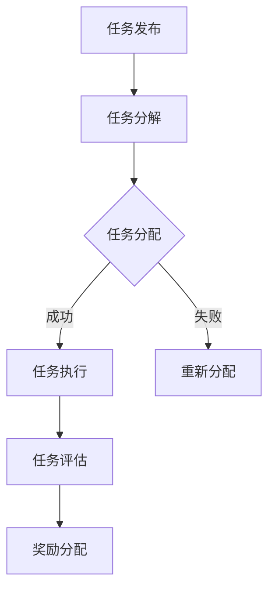
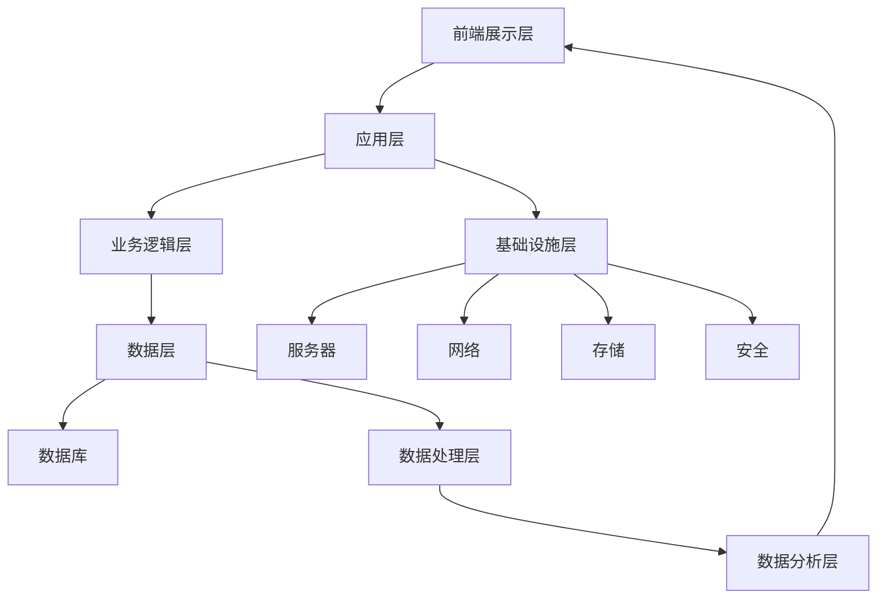
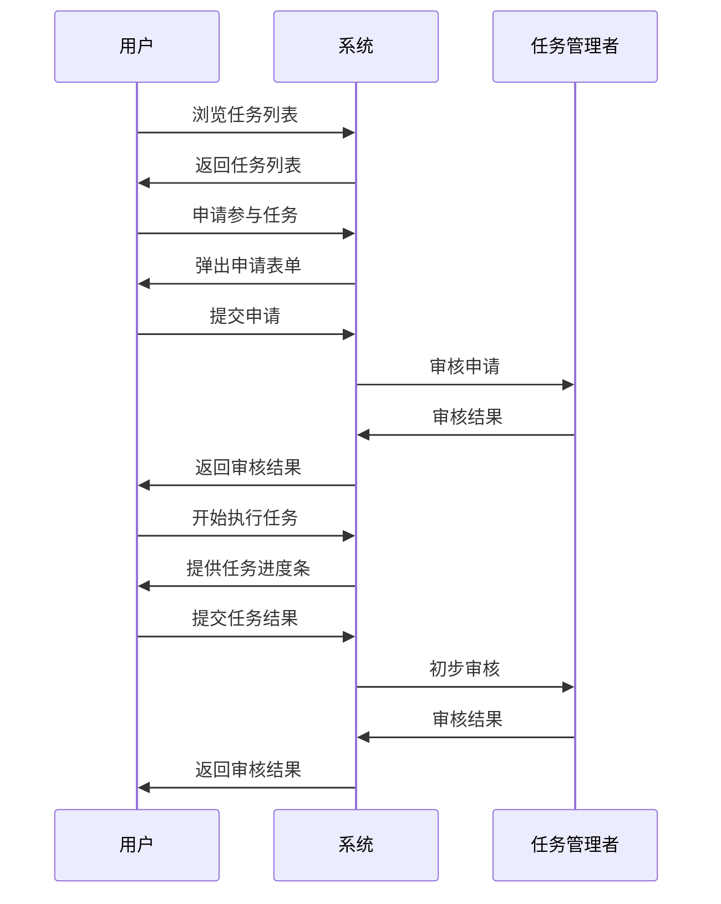

                 

# 人类集体智慧：众包科学与世界可理解性

> 关键词：人类集体智慧、众包科学、世界可理解性、集体智慧、众包、算法原理、数学模型、系统设计与实现

> 摘要：本文将探讨人类集体智慧、众包科学和世界可理解性这三个核心概念及其相互关系。首先，我们将回顾人类集体智慧的起源与发展，介绍众包科学的基本原理，并探讨世界可理解性的定义与意义。接着，本文将分析集体智慧、众包和世界可理解性之间的联系，以及它们对现代社会的影响。在此基础上，我们将深入探讨众包算法的数学模型和原理，并通过具体实例进行分析。最后，本文将介绍众包系统的设计与实现，包括系统分析与架构设计，以及系统接口和交互设计。

## 目录大纲

### 第一部分：问题背景与核心概念

1. **第1章：人类集体智慧的起源与发展**
    1.1 引言
    1.2 集体智慧的定义与内涵
    1.3 集体智慧的历史发展
    1.4 众包科学的基本原理
    1.5 世界可理解性的探讨
    1.6 集体智慧、众包与世界可理解性的联系
    1.7 本章小结

### 第二部分：核心概念与联系

2. **第2章：核心概念原理与属性特征对比**
    2.1 众包科学的原理
    2.2 众包科学的属性特征对比
    2.3 世界可理解性的核心概念
    2.4 集体智慧、众包与世界可理解性的联系
    2.5 本章小结

### 第三部分：算法原理与数学模型

3. **第3章：众包算法的数学模型与原理**
    3.1 众包算法的基本类型
    3.2 众包算法的数学模型
    3.3 众包算法的原理讲解
    3.4 众包算法的实例分析
    3.5 本章小结

### 第四部分：系统分析与架构设计

4. **第4章：众包系统的设计与实现**
    4.1 众包系统的场景介绍
    4.2 众包系统的项目介绍
    4.3 众包系统的功能设计
    4.4 众包系统的架构设计
    4.5 众包系统的接口设计
    4.6 众包系统的交互设计
    4.7 本章小结

### 第五部分：项目实战

5. **第5章：众包项目实战**
    5.1 环境安装与配置
    5.2 系统核心实现源代码解读
    5.3 实际案例分析与讲解
    5.4 项目小结
    5.5 最佳实践 tips

## 1.1 引言

人类在漫长的历史进程中，不断积累和传承知识，形成了丰富多彩的文明。然而，随着科技的发展，知识更新的速度越来越快，个体难以单独掌握所有领域的知识。因此，人类开始意识到集体智慧的重要性。集体智慧指的是一群人在共同的目标下，通过合作与交流，共同解决问题、创造知识的能力。这种智慧不仅体现在个体之间的知识共享，还包括团队协作和知识整合。

在本章中，我们将探讨人类集体智慧的起源与发展，介绍集体智慧的定义与内涵，以及集体智慧的历史发展。接着，我们将引入众包科学的基本原理，分析众包的概念与类型，以及众包的优点与挑战。此外，我们还将探讨世界可理解性的定义与意义，并讨论集体智慧、众包与世界可理解性之间的联系。通过这些内容的介绍，我们将为后续章节的深入探讨打下基础。

### 1.1.1 问题的提出：人类知识如何积累与传播？

人类知识的发展是一个持续演变的过程，从古至今，人类一直在不断探索和发现新的知识。知识不仅包括科学、技术和哲学等领域的理论，还包括各种技能和经验。那么，人类是如何积累和传播这些知识的呢？在科技尚未高度发达的古代，知识的积累与传播主要依赖于口口相传、书籍记录和师徒传承等方式。

首先，口口相传是人类最早的知识传播方式。通过口头讲述、故事、传说和神话等形式，人类将自己的经验、智慧和知识传递给后代。这种方式虽然存在一定的局限性，如易失真、难以保存等，但在人类文明的初期阶段，它为知识的传播提供了基本途径。

随着文字的出现，知识的传播方式发生了革命性的变化。古代文明中的文字记载，如古埃及的象形文字、中国的甲骨文、古印度的梵文等，为知识的保存和传承提供了更可靠的手段。书籍作为文字记录的主要载体，使得人类的知识得以大规模积累和传播。古代的学者、思想家们通过撰写书籍、论文，将自己的研究成果和思想传播给更多的人。

师徒传承是另一种重要的知识传播方式。在古代，许多技艺和技能都需要通过师傅的传授和徒弟的实践来掌握。师傅将自己的经验和技巧传授给徒弟，使徒弟能够继承和发扬这些技艺。这种传承方式在各个领域都有所体现，如医学、建筑、音乐、艺术等。

然而，随着科技的发展，知识的更新速度越来越快，个体难以单独掌握所有领域的知识。这就引发了一个问题：如何在现代社会中有效地积累和传播知识？传统的口口相传、书籍记录和师徒传承等方式已经无法满足现代社会对知识积累与传播的需求。因此，人类开始探索新的知识传播方式，其中之一便是众包科学。

众包科学是一种基于互联网和现代通信技术的新型知识传播方式。它通过将知识需求分散到大量的个体中，依靠大众的力量来解决问题和创造知识。众包科学的核心在于充分利用人类集体智慧，通过众包平台将个体知识汇聚起来，形成集体智慧，从而实现知识的快速积累和传播。

众包科学具有以下优点：

1. **高效性**：众包科学能够快速地聚集大量的知识资源，加速知识的积累和传播。相比传统的知识传播方式，众包科学能够更迅速地应对新知识的需求，提高知识更新的速度。

2. **广泛性**：众包科学能够覆盖各个领域和层面，不受地域、时间、文化和语言的限制。这使得众包科学能够更广泛地传播知识，促进全球范围内的知识交流和共享。

3. **创新性**：众包科学鼓励创新思维和创意的涌现。通过众包平台，个体可以提出新的观点、解决方案和创意，从而推动知识的发展和进步。

4. **公平性**：众包科学为每个人提供了参与知识积累和传播的机会，使知识更加公平地分配。任何人都可以在众包平台上分享自己的知识，获得认可和回报。

然而，众包科学也面临一些挑战，如质量控制、信息安全和隐私保护等问题。因此，在推动众包科学发展的同时，我们也需要关注这些问题的解决，确保众包科学能够健康、可持续地发展。

### 1.1.2 集体智慧的定义与内涵

集体智慧是指一个群体或组织在共同的目标下，通过协作、交流、共享信息和资源，实现知识创新、问题解决和决策优化的能力。集体智慧不仅仅是知识的简单叠加，而是通过协作和互动，形成了一种更加复杂、多样和高效的认知体系。

首先，集体智慧强调的是协作与互动。在一个集体中，个体之间的协作和互动是集体智慧形成的基础。通过交流和合作，个体可以共享各自的知识、经验和技能，形成更加全面和深入的认知。协作与互动不仅有助于提高个体的知识水平，还能激发创新的火花，推动知识的不断进步。

其次，集体智慧强调的是知识共享。知识是集体智慧的源泉，只有通过共享和传播，知识才能得到有效的利用和传承。在集体智慧中，个体不仅要分享自己的知识，还要积极获取和吸收他人的知识，形成一种互利共赢的知识循环。知识共享不仅有助于提高集体的认知水平，还能促进知识的创新和发展。

此外，集体智慧还强调的是优化决策。在集体智慧中，个体通过协作和互动，能够形成更加全面和准确的认知，从而做出更加明智和优化的决策。集体智慧不仅能够提高决策的准确性，还能减少决策的风险和不确定性，为集体的发展提供有力支持。

集体智慧在人类历史中发挥了重要作用。从古代的部落联盟、国家的治理，到现代的商业合作、科技研究，集体智慧都是推动社会进步的重要力量。在现代社会中，随着科技的发展和信息交流的便捷，集体智慧的作用日益凸显。众包科学正是基于集体智慧的理念，通过互联网和现代通信技术，将分散在个体中的知识资源汇聚起来，形成集体智慧，从而实现知识的创新和进步。

总之，集体智慧是一种基于协作、共享和优化的认知体系，它通过个体的协作和互动，实现知识的创新、问题解决和决策优化，为人类社会的进步和发展提供了强大动力。

### 1.1.3 集体智慧的历史发展

集体智慧的历史可以追溯到远古时期，当时的人类通过协作和合作，共同应对自然环境和生存挑战。在狩猎、采集和农业等活动中，个体之间的协作和智慧共享使得人类能够更加高效地获取资源、提高生存能力。

随着人类社会的发展，集体智慧的应用逐渐扩展到更广泛的领域。在古代文明中，集体智慧在政治、经济和文化等方面发挥了重要作用。例如，古希腊的民主制度强调公民的参与和集体决策，促进了社会公平和治理的优化。古代罗马的法律体系则通过集体智慧的结晶，建立了系统化的法律规范，推动了社会的稳定和发展。

中世纪时期，集体智慧在宗教和学术领域得到了进一步的发展。教会通过集体智慧，编纂了《圣经》和宗教经典，传播了基督教的教义和价值观。同时，中世纪大学和学术机构的出现，使得学者们能够通过集体智慧和学术合作，推动科学和知识的进步。

进入近代，随着工业革命的到来，集体智慧在技术进步和经济发展中发挥了重要作用。工厂制度的兴起，使得生产过程更加规范化、高效化，集体智慧在劳动分工和协作中得到了充分体现。同时，科学研究的发展，使得科学家们通过集体智慧和合作研究，取得了许多重要的科学成果。

在现代，随着信息技术的飞速发展，集体智慧的应用范围进一步扩大。互联网和现代通信技术为人类提供了便捷的知识共享和协作平台，使得集体智慧能够跨越地域、时间和语言的限制，实现全球范围内的知识共享和协同创新。众包科学作为集体智慧的一种新形式，通过互联网和众包平台，将分散在个体中的知识资源汇聚起来，实现了知识的创新和进步。

总的来说，集体智慧在人类历史的长河中不断发展，从远古时期的狩猎采集，到中世纪的宗教和学术，再到现代的工业革命和信息技术，集体智慧始终是人类社会进步和发展的重要动力。随着科技的不断进步，集体智慧的应用将更加广泛，为人类社会的未来发展提供新的机遇和挑战。

### 1.2 众包科学的基本原理

众包科学（Crowdsourcing Science）是一种基于互联网和现代通信技术的新型知识传播方式，它通过将知识需求分散到大量的个体中，依靠大众的力量来解决问题和创造知识。众包科学的核心在于充分利用人类集体智慧，通过众包平台将个体知识汇聚起来，形成集体智慧，从而实现知识的快速积累和传播。

#### 1.2.1 众包的概念与类型

众包（Crowdsourcing）一词最早由杰夫·豪（Jeff Howe）在2006年提出，指的是将一个任务或问题分散到大量的个体中，通过众包平台和互联网技术，利用大众的力量共同完成。众包可以分为以下几种类型：

1. **任务型众包**：这是最常见的众包形式，如图片分类、数据标注、问题解答等。任务型众包通常由一个组织或企业发布任务，参与者通过完成任务获得报酬或奖励。

2. **知识型众包**：这种形式的众包侧重于知识的收集和分享，如维基百科、在线问答社区等。知识型众包鼓励参与者贡献自己的知识和经验，形成共享的知识库。

3. **创意型众包**：这种形式的众包旨在通过大众的创意和创新，解决特定问题或实现特定的目标。例如，设计竞赛、创意征集等。

4. **公益型众包**：公益型众包通常涉及社会问题和公益事业，通过众包平台，大众可以共同参与解决社会问题，如环保、灾害救援等。

#### 1.2.2 众包的优点与挑战

众包作为一种新型知识传播方式，具有许多优点：

1. **高效性**：众包能够快速地聚集大量的知识资源，加速知识的积累和传播。相比传统的知识传播方式，众包科学能够更迅速地应对新知识的需求，提高知识更新的速度。

2. **广泛性**：众包科学能够覆盖各个领域和层面，不受地域、时间、文化和语言的限制。这使得众包科学能够更广泛地传播知识，促进全球范围内的知识交流和共享。

3. **创新性**：众包科学鼓励创新思维和创意的涌现。通过众包平台，个体可以提出新的观点、解决方案和创意，从而推动知识的发展和进步。

4. **公平性**：众包科学为每个人提供了参与知识积累和传播的机会，使知识更加公平地分配。任何人都可以在众包平台上分享自己的知识，获得认可和回报。

然而，众包科学也面临一些挑战：

1. **质量控制**：由于参与众包的个体众多，如何保证提交的答案或解决方案的质量成为一大难题。这需要建立严格的质量控制和评估机制。

2. **信息安全与隐私保护**：众包涉及到大量的数据和信息，如何保护参与者的隐私和数据安全成为关键问题。需要制定相应的安全政策和措施，确保信息的安全和隐私。

3. **信任与激励**：如何建立参与者之间的信任关系，以及如何设计有效的激励机制，是众包科学需要解决的重要问题。这需要通过合理的设计和运营，激发参与者的积极性和创造力。

#### 1.2.3 众包在现代社会的应用

随着互联网和现代通信技术的不断发展，众包科学在现代社会得到了广泛的应用，并发挥了重要作用：

1. **科学研究**：许多科学研究项目通过众包平台，如Zooniverse和Foldit，吸引了大量公众参与。这些项目通过众包，加速了科学研究的进展，推动了科学知识的创新。

2. **商业创新**：企业通过众包平台，如InnoCentive和Topcoder，收集大众的创意和解决方案，用于产品开发、市场营销和问题解决。众包为商业创新提供了新的思路和机会。

3. **社会公益**：公益组织通过众包平台，如Kaboom!和Kiva，动员大众参与社会问题和公益事业。众包为社会公益提供了新的渠道和力量。

4. **教育与培训**：教育机构和培训机构通过众包平台，如Quizlet和Khan Academy，提供了丰富的学习资源和互动学习体验，促进了教育的普及和提升。

总之，众包科学作为一种基于集体智慧和互联网的新型知识传播方式，具有高效性、广泛性、创新性和公平性的优点。同时，它也面临一些挑战，需要通过合理的机制设计和运营管理，实现知识的创新和传播。随着科技的不断进步，众包科学将在现代社会中发挥越来越重要的作用。

### 1.3 世界可理解性的探讨

#### 1.3.1 可理解性的定义与意义

世界可理解性（World Understandability）指的是人类对世界和自然现象的认知程度及其合理性。具体来说，它关注的是人类能否通过逻辑思维、科学方法和语言表达，理解自然界的规律和本质。世界可理解性的定义可以从以下几个方面进行阐述：

首先，世界可理解性涉及人类对自然界的认知能力。人类通过感官、经验和科学方法，不断探索和揭示自然界的奥秘。从古代的神话和宗教信仰，到现代的科学理论和实验验证，人类在认知世界的过程中，逐渐形成了对自然界的基本理解。

其次，世界可理解性强调逻辑思维和科学方法的运用。逻辑思维是人类认知世界的重要工具，它通过推理、判断和归纳，帮助人们理解和解释自然现象。科学方法则是人类认识世界的基本方法，它通过观察、实验和验证，确保认知的准确性和可靠性。

最后，世界可理解性关注语言表达和知识传播。语言是人类交流思想、传递信息的重要工具。通过语言，人类可以表达对世界的理解和认知，实现知识的传播和共享。此外，知识的传播和积累也依赖于语言的表达和记录，从而推动人类文明的进步。

世界可理解性的意义在于，它不仅影响人类对自然界的认知，还影响人类的生活方式和社会发展。一个可理解的世界，使人类能够更好地适应和利用自然，从而实现可持续发展。同时，世界可理解性也推动了科学技术的进步，促进了人类文明的繁荣。

#### 1.3.2 科学知识与世界可理解性

科学知识是世界可理解性的基础。科学知识是通过科学研究获得的，包括实验数据、理论模型和假设验证等。科学知识不仅帮助我们理解自然界的规律，还指导我们解决实际问题，改善人类生活。

首先，科学知识帮助人类理解自然现象。例如，牛顿的万有引力定律揭示了天体运动的规律，爱因斯坦的相对论解释了时间、空间和引力之间的关系。这些科学知识不仅丰富了人类对世界的认知，还改变了人类的思维方式。

其次，科学知识推动了技术的进步。例如，计算机科学的发展基于对信息处理的深入理解，生物学的研究促进了生物技术的发展。科学知识和技术创新相互促进，共同推动了人类社会的进步。

此外，科学知识在教育和知识传播中起到了关键作用。科学教育不仅帮助人们掌握科学知识和方法，还培养人们的科学素养和批判性思维。科学知识的传播和普及，使更多的人能够理解和应用科学，从而提高了全社会的科学素养。

总之，科学知识是世界可理解性的核心，它不仅帮助我们理解自然界的规律，还推动技术进步和社会发展。科学知识通过不断积累和更新，使人类对世界的理解更加全面和深入，从而提升了世界的可理解性。

#### 1.3.3 集体智慧对世界可理解性的影响

集体智慧对世界可理解性产生了深远的影响，这种影响主要体现在以下几个方面：

首先，集体智慧通过知识共享和协作，极大地提升了科学研究的效率和质量。在集体智慧的推动下，科学家们可以更快速地获取他人的研究成果，借鉴和改进自己的研究方法。例如，维基百科作为一个全球性的知识共享平台，汇集了来自世界各地科学家的研究成果，使得科学知识的传播和共享达到了前所未有的高度。

其次，集体智慧促进了科学知识的创新和进步。通过众包科学，许多复杂和挑战性的科学问题得以解决。例如，Zooniverse平台上的参与者通过众包，帮助科学家分析了大量的天文图像，发现了新的恒星和行星。这些实例表明，集体智慧不仅能够加速科学研究的进展，还能激发科学知识的创新。

此外，集体智慧在知识传播和教育中也发挥了重要作用。通过众包平台，教育资源和科学知识得以更广泛地传播，使更多的人能够接触和学习科学。例如，Khan Academy通过在线教育平台，提供了丰富的科学课程，使得科学知识在全球范围内得到了普及。

最后，集体智慧对世界可理解性的影响还体现在促进了跨学科研究和国际合作。在集体智慧的帮助下，不同学科和领域的专家可以更容易地合作，共同解决复杂问题。例如，在应对全球气候变化问题上，科学家、政策制定者和公众通过集体智慧和协作，共同提出了有效的应对策略。

总之，集体智慧通过知识共享、协作和创新，极大地提升了科学研究的效率和质量，促进了科学知识的传播和普及，并对世界可理解性产生了积极的影响。随着集体智慧的不断发展和应用，人类对世界的理解将更加深入和全面，从而推动社会的进步和发展。

### 1.4 集体智慧、众包与世界可理解性的联系

在探讨集体智慧、众包和世界可理解性之间的联系时，我们需要从多个角度来分析它们之间的关系。首先，集体智慧作为人类的一种重要认知能力，是众包科学的基础。众包科学通过互联网和现代通信技术，实现了个体之间知识共享和协作，从而增强了集体智慧。在这一过程中，众包不仅促进了知识的传播和积累，还提升了人类对世界的理解和认知，进而增强了世界的可理解性。

#### 1.4.1 集体智慧如何促进众包？

集体智慧对众包科学的促进作用主要体现在以下几个方面：

首先，集体智慧提供了众包的基础。众包科学依赖于大量的个体参与和协作，而集体智慧正是这些个体智慧和能力的集中体现。通过集体智慧，个体可以共享和整合各自的见解和知识，形成更加全面和深入的认识。这种认识有助于提高众包任务的完成质量和效率。

其次，集体智慧促进了知识的快速传播和积累。在众包过程中，个体通过交流和协作，可以迅速获取和分享他人的知识和经验。这种知识共享不仅有助于提高个体的认知水平，还能推动整个团队或项目的进展。通过集体智慧，众包平台能够汇聚大量的知识资源，形成强大的知识库，为解决复杂问题提供了有力支持。

此外，集体智慧还激发了创新思维和创意的涌现。在众包平台上，个体可以提出新的观点、解决方案和创意，通过集体智慧和协作，这些创意得以不断改进和完善。例如，在创意型众包中，通过集体智慧的协作，许多看似不可能实现的创意被逐步实现，从而推动了技术和科学的进步。

#### 1.4.2 众包如何增强世界可理解性？

众包科学通过以下方式增强了世界的可理解性：

首先，众包科学促进了科学知识的普及和传播。通过众包平台，科学知识得以更广泛地传播，使更多的人能够接触和学习科学。例如，Khan Academy通过在线教育平台，提供了丰富的科学课程，使得科学知识在全球范围内得到了普及。这种知识普及不仅提高了公众的科学素养，还增强了人类对世界的理解。

其次，众包科学推动了科学研究的进展。通过众包平台，科学家们可以借助大众的力量，解决一些复杂的科学问题。例如，Zooniverse平台上的参与者通过众包，帮助科学家分析了大量的天文图像，发现了新的恒星和行星。这些实例表明，众包科学不仅能够加速科学研究的进展，还能激发科学知识的创新。

此外，众包科学在知识传播和教育中发挥了重要作用。通过众包平台，教育资源和科学知识得以更广泛地传播，使更多的人能够接触和学习科学。例如，Quizlet平台上的用户通过众包，创建和分享了大量学习资料和资源，帮助学习者更好地理解和掌握科学知识。

总之，集体智慧通过促进知识的共享和协作，为众包科学提供了基础。而众包科学通过知识的传播和积累，不仅推动了科学研究的进展，还增强了人类对世界的理解，进而提升了世界的可理解性。随着集体智慧和众包科学的发展，人类对世界的认知将更加深入和全面，从而推动社会的进步和发展。

### 1.4.3 集体智慧、众包与世界可理解性的未来趋势

在展望集体智慧、众包与世界可理解性的未来趋势时，我们可以从技术发展、社会影响和应用前景三个角度进行探讨。

#### 技术发展趋势

首先，随着人工智能和大数据技术的不断进步，集体智慧将得到进一步增强。人工智能技术可以用于分析大规模数据，挖掘潜在的知识和关联，从而提升集体智慧的质量和效率。例如，智能推荐系统可以根据用户的行为数据，提供个性化的知识推荐，促进知识的共享和传播。大数据技术则可以处理和分析来自众包平台的海量数据，为科学研究和决策提供有力支持。

其次，区块链技术的应用也将对众包科学产生深远影响。区块链技术可以确保数据的真实性和安全性，为众包平台提供可靠的数据保障。通过区块链，参与者可以验证和记录自己的贡献，确保知识产权的归属和保护。此外，区块链技术还可以促进众包平台的透明度和公正性，提高参与者的信任度和积极性。

#### 社会影响

随着集体智慧和众包科学的普及，社会将发生深刻的变化。首先，知识的传播和普及将更加便捷和高效。通过众包平台，科学知识、技能和经验可以更快速地传播到世界各地，提高全社会的科学素养。这将有助于缩小知识差距，促进社会的公平和发展。

其次，众包科学将推动社会创新和创业的蓬勃发展。众包平台为创业者提供了丰富的资源和机会，使他们能够快速验证和实现自己的创意。这种创新环境将激发更多人的创业热情，推动经济的增长和社会的进步。

此外，集体智慧和众包科学还将促进跨学科和跨领域的合作。在集体智慧的帮助下，不同领域和背景的专家可以更有效地合作，共同解决复杂问题。这种合作模式将推动科学研究的深入和技术的突破，为社会的发展提供新的动力。

#### 应用前景

在未来，集体智慧和众包科学将在更多领域得到广泛应用。首先，在科学研究领域，众包科学将继续发挥重要作用。通过众包平台，科学家可以借助大众的力量，解决一些复杂的科学问题，加速科学研究的进展。例如，在医学研究中，众包可以用于疾病诊断和药物开发，为人类健康事业做出贡献。

其次，在教育领域，众包科学将促进教育资源的共享和优化。通过众包平台，教师和学生可以共同创建和分享教学资源，实现教育资源的最大化利用。此外，众包科学还可以为个性化学习提供支持，帮助学生根据自己的需求和兴趣，选择合适的学习资源和路径。

此外，在商业和企业管理中，众包科学也具有广泛的应用前景。企业可以通过众包平台，收集大众的创意和解决方案，优化产品设计和市场营销策略。同时，众包科学还可以用于企业内部的知识管理和创新，提高企业的竞争力和创新能力。

总之，随着技术发展和社会变革，集体智慧和众包科学将不断演进和扩展。它们将不仅推动科学研究和知识的创新，还将对社会产生深远的影响，促进人类的进步和发展。

### 1.5 本章小结

本章首先探讨了人类集体智慧的起源与发展，阐述了集体智慧的定义与内涵，并回顾了其历史发展。随后，我们介绍了众包科学的基本原理，分析了众包的概念与类型，讨论了其优点与挑战，并探讨了众包在现代社会的应用。接着，我们探讨了世界可理解性的定义与意义，分析了科学知识在世界可理解性中的重要性，并探讨了集体智慧对世界可理解性的影响。最后，我们分析了集体智慧、众包和世界可理解性之间的联系，并展望了它们的未来趋势。通过本章的探讨，我们更加深入地理解了集体智慧、众包和世界可理解性的本质及其相互关系，为后续章节的深入探讨奠定了基础。

## 2.1 众包科学的原理

众包科学是一种基于集体智慧和现代通信技术的新型知识传播方式，通过将知识需求分散到大量的个体中，依靠大众的力量来解决问题和创造知识。在本节中，我们将详细探讨众包科学的原理，包括其核心原理、流程与机制，以及众包的科学基础。

#### 2.1.1 众包的核心原理

众包的核心原理在于将一个复杂的问题或任务分解为若干个简单的子任务，并通过互联网和现代通信技术，将这些子任务分发给大量的个体参与者。这些参与者可以是普通公众、专业人士，甚至是全球范围内的志愿者。通过这种方式，众包科学充分利用了人类集体智慧，实现知识的快速积累和传播。

众包的核心原理主要基于以下几个原则：

1. **多样性**：众包科学通过汇聚大量的个体参与，能够获得多样化的知识和见解。这种多样性不仅提高了问题解决的效率和质量，还能激发创新的火花。

2. **协作与互动**：众包科学强调个体之间的协作与互动，通过交流和合作，参与者可以共享各自的知识和经验，形成更加全面和深入的认知。

3. **知识共享**：众包科学鼓励知识的共享和传播，参与者不仅需要贡献自己的知识，还需要积极获取和吸收他人的知识，形成知识循环。

4. **去中心化**：众包科学通过去中心化的方式，打破了传统的集中式知识传播模式，使得知识传播更加广泛和高效。

#### 2.1.2 众包的流程与机制

众包科学通常包括以下几个关键流程和机制：

1. **任务发布**：任务的发布者是众包项目的发起人，他们提出需要解决的问题或任务，并将其描述得尽可能详细和明确。

2. **任务分解**：将复杂的任务分解为若干个简单的子任务，这些子任务可以被单独处理，并最终组合成完整的解决方案。

3. **任务分配**：通过互联网和现代通信技术，将子任务分配给适合处理这些任务的参与者。任务分配可以基于参与者的能力、兴趣和地理位置等因素。

4. **任务执行**：参与者根据分配到的子任务，进行相关的工作和贡献。在这一过程中，参与者需要遵守任务的要求和标准，确保任务的完成质量。

5. **任务评估**：对参与者的任务完成情况进行评估，包括任务质量、速度和贡献程度等。评估结果通常用于支付报酬或奖励。

6. **结果整合**：将所有参与者的子任务结果整合起来，形成完整的解决方案或知识产品。

7. **反馈与迭代**：根据任务评估结果和项目目标，对任务执行过程和结果进行反馈和迭代，以不断改进和优化。

#### 2.1.3 众包的科学基础

众包科学的基础在于对人类集体智慧的深入理解和应用。以下是一些科学基础：

1. **社会网络理论**：社会网络理论揭示了个体之间的相互作用和网络结构，这对于理解众包中的协作与互动至关重要。通过社会网络分析，可以识别关键节点和影响力个体，优化众包的协作效率。

2. **复杂性科学**：复杂性科学提供了研究复杂系统的方法和理论，这对于理解众包中的多样性和协同效应具有重要意义。复杂性科学的方法可以帮助识别众包系统中的潜在模式和规律，从而优化众包的流程和机制。

3. **认知科学**：认知科学研究了人类认知过程和心理机制，这对于理解众包中的知识共享和知识整合具有重要意义。通过认知科学的理论和方法，可以设计更加有效的知识共享机制和工具，提高众包的科学性。

4. **人工智能与机器学习**：人工智能和机器学习技术可以用于分析大规模数据，识别模式，优化众包算法。例如，通过机器学习算法，可以自动识别高质量的任务完成者，提高众包的效率和准确性。

总之，众包科学是一种基于集体智慧和现代通信技术的新型知识传播方式，其核心原理和科学基础涵盖了多个学科领域。通过深入理解这些原理和基础，我们可以更好地设计和实施众包项目，推动知识的创新和传播，提升世界的可理解性。

### 2.2 众包科学的属性特征对比

在探讨众包科学的属性特征时，我们需要从多个方面对比分析其成本效益、灵活性与适应性，以及可靠性与准确性。这些属性特征不仅决定了众包科学的应用价值，也影响着其在实际操作中的表现和效果。

#### 2.2.1 成本效益对比

众包科学在成本效益方面具有显著的优势。首先，从资金投入的角度来看，众包项目通常不需要大规模的初始投资，特别是在技术基础设施方面。众包平台和工具的建设和维护成本相对较低，企业或组织可以通过租赁或使用开源工具来降低成本。此外，众包项目通过向参与者支付报酬或提供奖励，来激励他们完成任务。这种支付方式通常比传统雇佣方式的薪酬要低，从而降低了总成本。

然而，众包科学也存在一些成本方面的挑战。例如，在任务发布、分配和评估过程中，需要投入一定的人力资源来管理和协调。此外，为了保证众包项目的质量，可能需要对参与者的资质进行审核和评估，这也需要一定的时间和资源投入。尽管如此，众包科学在总体上仍然具有显著的成本效益优势。

#### 2.2.2 灵活性与适应性对比

众包科学的另一个显著特征是其灵活性和适应性。众包项目通常具有高度的灵活性，因为任务可以被分配给不同的参与者，而这些参与者可以根据自己的时间、技能和兴趣来选择参与。这种灵活性使得众包项目能够快速响应市场变化和客户需求，实现快速迭代和优化。

具体来说，众包项目可以迅速启动和完成，因为不需要经过复杂的内部审批流程。参与者可以随时随地通过互联网参与任务，从而大大缩短了项目的实施周期。此外，众包项目还能够根据实际情况进行调整和优化。例如，如果某个任务出现了技术难题，可以通过招募更多的参与者或调整任务分配来解决问题。

然而，众包科学的灵活性也带来了一些挑战。首先，由于参与者分散，协调和沟通可能变得更加复杂。其次，众包项目可能面临质量控制问题，因为无法像传统项目那样进行严格的监督和管理。为了应对这些挑战，需要在众包项目中制定明确的任务要求和评估标准，以确保任务完成的质量。

#### 2.2.3 可靠性与准确性对比

在可靠性和准确性方面，众包科学具有一定的优势，但也存在一定的局限性。众包项目通过吸引大量的参与者，能够获得多样化的见解和解决方案。这种多样性可以提高问题的解决质量和准确性，因为多个参与者的不同视角和经验有助于发现潜在的问题和解决方案。

此外，众包项目可以通过竞争机制来筛选出最优质的答案或解决方案。在任务完成后，通过公开评审或投票等方式，可以选出最佳答案，从而提高众包项目的可靠性。

然而，众包科学也存在一些可靠性方面的挑战。首先，由于参与者众多，如何保证提交的答案或解决方案的质量是一个难题。这需要建立严格的质量控制和评估机制，以确保提交的内容符合任务要求。其次，众包项目可能面临诚信问题，例如某些参与者可能为了获得报酬而提交虚假的答案或解决方案。

为了提高众包项目的可靠性和准确性，可以采取以下措施：

1. **设定明确的任务要求和评估标准**：在任务发布阶段，就需要明确任务的要求和评估标准，确保参与者了解任务的目标和期望。

2. **建立质量控制和评估机制**：通过技术手段和人工审核相结合的方式，对提交的答案或解决方案进行质量评估，确保其符合任务要求。

3. **利用激励机制**：通过合理的激励机制，如奖金、荣誉等，鼓励参与者提交高质量的答案或解决方案。

4. **社区监督**：建立一个开放的众包社区，鼓励参与者对提交的内容进行监督和评价，从而提高众包项目的透明度和可靠性。

总之，众包科学在成本效益、灵活性和可靠性方面具有一定的优势，但也需要面对一些挑战。通过合理的机制设计和运营管理，可以充分发挥众包科学的优势，实现知识的创新和传播。

### 2.3 世界可理解性的核心概念

#### 2.3.1 世界可理解性的定义

世界可理解性是指人类通过逻辑思维、科学方法和语言表达，对自然界和人类社会现象的认知程度和合理性。具体来说，它关注的是人类是否能够通过这些认知工具，理解自然界的规律、人类行为的原因以及社会现象的本质。世界可理解性的定义可以从以下几个方面进行阐述：

首先，世界可理解性涉及人类对自然现象和科学理论的认知。人类通过感官、经验和科学方法，不断探索和揭示自然界的规律和奥秘。从古代的哲学和宗教理论，到现代的科学理论，人类对自然界的认知不断深入，从而提高了对世界的理解程度。

其次，世界可理解性强调逻辑思维和科学方法的运用。逻辑思维是人类认知世界的重要工具，它通过推理、判断和归纳，帮助人类理解自然现象和科学理论。科学方法则是人类认识世界的基本方法，它通过观察、实验和验证，确保认知的准确性和可靠性。

此外，世界可理解性关注语言表达和知识传播。语言是人类交流思想、传递信息的重要工具。通过语言，人类可以表达对世界的理解和认知，实现知识的传播和共享。知识的传播和积累也依赖于语言的表达和记录，从而推动人类文明的进步。

综上所述，世界可理解性是一个多维度、综合性的概念，它不仅涉及人类对自然界的认知，还包括逻辑思维、科学方法和语言表达。通过这些认知工具，人类不断拓展对世界的理解，从而提高对世界的可理解性。

#### 2.3.2 世界可理解性的关键要素

世界可理解性是一个复杂的概念，它涉及多个关键要素。以下是一些关键要素及其在提升世界可理解性中的作用：

1. **科学知识**：科学知识是世界可理解性的基础。通过科学研究，人类揭示了自然界的规律和现象，形成了科学理论体系。科学知识不仅帮助我们理解自然界的本质，还指导我们解决实际问题，提高生活质量。

2. **逻辑思维**：逻辑思维是人类理解世界的重要工具。通过逻辑推理、判断和归纳，人类能够从已知事实中推导出新的结论，从而加深对世界的理解。逻辑思维在科学研究、哲学思考和日常生活中都发挥着重要作用。

3. **语言表达**：语言是人类交流思想、传递信息的重要工具。通过语言，人类可以表达对世界的理解和认知，实现知识的传播和共享。有效的语言表达不仅有助于个人沟通，还能促进知识的积累和传承。

4. **教育体系**：教育体系是培养人类理解和认知世界能力的重要途径。通过教育，人类可以系统学习科学知识、逻辑思维和语言表达，提高自身的认知水平和理解能力。一个完善的教育体系有助于提升社会的整体科学素养和世界可理解性。

5. **技术创新**：技术创新推动了科学知识和工具的发展，从而提高了人类对世界的理解程度。例如，互联网和大数据技术的发展，使得人类能够更快速地获取和传播知识，实现全球化合作和交流。

6. **跨学科合作**：跨学科合作是提升世界可理解性的有效途径。通过不同学科之间的合作和交流，人类可以综合运用多学科的知识和方法，解决复杂问题，推动科学知识的创新和发展。

综上所述，世界可理解性的关键要素包括科学知识、逻辑思维、语言表达、教育体系、技术创新和跨学科合作。这些要素相互作用，共同提升人类对世界的理解和认知，从而提高世界的可理解性。

### 2.3.3 世界可理解性的挑战与机遇

在当前的社会背景下，世界可理解性面临着一系列挑战与机遇。以下是一些主要挑战和机遇：

#### 挑战

1. **知识碎片化**：随着互联网和社交媒体的普及，信息爆炸使得知识呈现碎片化趋势。虽然这为知识的快速传播提供了便利，但也给人类理解复杂问题带来了困难。

2. **认知偏差**：人类在认知过程中容易受到各种偏见和成见的影响，导致对世界的理解出现偏差。例如，群体思维、先入为主和确认偏误等认知偏差，可能会阻碍对真实世界的认知。

3. **语言障碍**：不同语言和文化之间的差异，使得知识的传播和理解面临障碍。跨语言的沟通和翻译需要大量时间和资源，这限制了全球范围内的知识共享。

4. **数据隐私与安全**：大数据和人工智能技术的发展，带来了对个人隐私和数据安全的挑战。在众包科学中，如何确保参与者的数据隐私和安全，是一个亟待解决的问题。

#### 机遇

1. **知识普及**：互联网和现代通信技术为知识的普及提供了前所未有的机遇。通过在线教育平台、社交媒体和众包科学，科学知识可以更广泛、更快速地传播到全球各地。

2. **跨学科合作**：全球化背景下，不同学科之间的合作和交流日益频繁。通过跨学科合作，人类可以综合运用多学科的知识和方法，解决复杂问题，推动科学知识的创新和发展。

3. **人工智能与大数据**：人工智能和大数据技术的发展，为人类理解世界提供了新的工具和方法。通过机器学习和数据挖掘，可以从海量数据中提取有用信息，揭示隐藏的模式和规律，从而提高对世界的理解程度。

4. **开放科学**：开放科学的理念和实践，鼓励科学家和研究人员共享数据和研究成果。这种开放性有助于知识的传播和积累，提高了科学研究的效率和质量。

总之，世界可理解性在当前社会面临着一系列挑战与机遇。通过合理利用技术和资源，人类可以克服这些挑战，抓住机遇，进一步提升对世界的理解和认知。

### 2.4 集体智慧、众包与世界可理解性的联系

在探讨集体智慧、众包与世界可理解性之间的联系时，我们需要从多个方面分析它们之间的关系，并讨论这三者之间的相互作用。

#### 集体智慧与世界的可理解性

集体智慧是提升世界可理解性的关键因素之一。集体智慧通过个体之间的协作、知识共享和互动，实现了知识的整合和创新。在科学研究中，集体智慧可以汇聚不同领域的专家和普通公众的智慧，形成多角度、多维度的认知体系，从而更全面地理解复杂问题。例如，在医学研究中，通过众包平台，科学家和医生可以结合患者的病例数据和普通公众的健康数据，共同探索疾病的发展规律和治疗方法，提高了对疾病的理解水平。

此外，集体智慧在知识传播中也发挥了重要作用。通过集体智慧和众包平台，科学知识可以更快速、更广泛地传播到世界各地，提高公众的科学素养。这种知识普及有助于消除信息鸿沟，提升社会的整体科学水平，从而增强世界的可理解性。

#### 众包与世界可理解性

众包作为一种新型的知识传播方式，通过将知识需求分散到大量的个体中，实现了知识的快速积累和传播。众包平台为公众提供了参与科学研究的途径，使得普通人也可以为科学知识的积累做出贡献。例如，Zooniverse平台上的参与者通过众包，帮助科学家分析天文图像，发现了新的行星和天体现象。这种协作模式不仅提高了科学研究的效率，还促进了科学知识的传播，提高了社会的科学素养。

众包还促进了跨学科的合作，通过将不同领域的知识进行整合，形成了更加全面和深入的认知。例如，在气候变化研究中，科学家、工程师、社会学家和经济学家的合作，通过众包平台共同探讨和解决气候变化问题，形成了多学科的综合研究体系，提高了对气候变化的理解和应对能力。

#### 三者之间的相互作用

集体智慧、众包和世界可理解性之间存在着密切的相互作用。首先，集体智慧是众包科学的基础。众包平台通过汇聚个体的智慧和知识，实现了知识的共享和整合，从而提升了世界的可理解性。没有集体智慧，众包科学将失去其核心动力，难以实现知识的创新和传播。

其次，众包科学为集体智慧提供了实践平台。通过众包项目，个体可以参与复杂的科学问题解决，实现知识的积累和创新。众包项目不仅促进了知识的传播，还激发了集体智慧的活力，推动了科学知识的进步。

最后，世界可理解性是集体智慧和众包科学的目标。通过提升世界的可理解性，人类可以更全面、更深入地认识自然和社会现象，从而实现知识的创新和应用。集体智慧和众包科学的不断发展，将进一步提高世界的可理解性，推动人类社会的进步。

总之，集体智慧、众包和世界可理解性之间存在着密切的联系和相互作用。通过充分发挥集体智慧、合理利用众包科学，人类可以提升对世界的理解，推动科学知识的创新和传播，实现社会的进步和发展。

### 2.5 本章小结

本章详细探讨了集体智慧、众包和世界可理解性的核心概念及其相互关系。首先，我们介绍了集体智慧的定义、历史发展和其在现代社会中的应用，阐述了集体智慧的重要性。接着，我们分析了众包科学的基本原理、类型、优点和挑战，并探讨了其在现代社会中的广泛应用。然后，我们深入探讨了世界可理解性的定义、关键要素和挑战与机遇。在此基础上，我们分析了集体智慧、众包和世界可理解性之间的联系，并讨论了它们在现代社会中的作用。通过本章的探讨，我们更加深入地理解了这三个概念的本质及其相互关系，为后续章节的深入探讨奠定了基础。

### 3.1 众包算法的基本类型

众包算法是众包科学的重要组成部分，它通过数学模型和计算方法，实现任务的分配、执行和评估。根据任务的类型和特点，众包算法可以分为单任务众包算法和多任务众包算法，以及面向不同问题的众包算法。

#### 3.1.1 单任务众包算法

单任务众包算法主要处理单个任务，这些任务通常是独立且一次性完成的。常见的单任务众包算法包括：

1. **直接投票算法**：这是最简单的众包算法之一。在直接投票算法中，每个参与者提交一个答案，系统最终根据多数决定或专家评审选择最佳答案。

2. **评分机制算法**：评分机制算法通过参与者对答案的评分来选择最佳答案。这种算法通常使用统计方法来计算每个答案的得分，得分最高的答案被选为最佳答案。

3. **优化算法**：这类算法通过优化模型来选择最佳答案。常见的优化算法包括线性规划、整数规划和多目标优化等。

单任务众包算法的优点在于实现简单、易于理解和部署。然而，这些算法在处理复杂问题时可能存在局限性，因为它们无法充分利用参与者的多样性和复杂性。

#### 3.1.2 多任务众包算法

多任务众包算法处理的是多个相关任务，这些任务可以是独立或相互依赖的。多任务众包算法的常见类型包括：

1. **任务分配算法**：这类算法用于将多个任务分配给不同的参与者。常见的分配策略包括随机分配、基于能力的分配和基于历史的分配等。

2. **协同过滤算法**：协同过滤算法通过分析参与者的历史行为和偏好，为每个参与者推荐合适的任务。这种算法可以提高任务的完成率和质量。

3. **任务协同优化算法**：这类算法通过优化模型，综合考虑多个任务之间的依赖关系，实现任务的协同完成。常见的优化算法包括多目标优化和协同规划等。

多任务众包算法的优点在于能够更好地利用参与者的多样性和复杂性，提高任务的完成率和质量。然而，这些算法通常较为复杂，需要更多的计算资源和时间。

#### 3.1.3 面向不同问题的众包算法

根据问题的类型和特点，众包算法可以分为以下几类：

1. **图像识别与分类算法**：在图像识别和分类任务中，常见的众包算法包括图像标注、投票分类和基于深度学习的分类等。

2. **文本处理与标注算法**：在文本处理和标注任务中，常见的众包算法包括文本分类、情感分析和实体识别等。

3. **问题求解与优化算法**：在问题求解和优化任务中，常见的众包算法包括数学编程、模拟退火和遗传算法等。

面向不同问题的众包算法根据具体问题的特点进行设计和优化，以提高任务的完成率和质量。这些算法通常需要结合具体问题的领域知识和数据特点，进行定制化设计和实现。

总之，众包算法是众包科学的核心组成部分，通过不同的算法类型和设计方法，实现任务的分配、执行和评估。这些算法在科学、商业和社会领域具有广泛的应用，为知识的积累和创新提供了有力支持。

#### 3.2 众包算法的数学模型

在众包科学中，数学模型扮演着至关重要的角色，它为任务分配、参与者激励机制和质量控制提供了理论基础。以下将介绍几种常见的众包算法数学模型，包括成本模型、优化模型和奖励模型。

##### 3.2.1 成本模型

成本模型用于计算执行任务的总成本。成本模型主要包括两部分：固定成本和可变成本。

1. **固定成本（Fixed Cost）**：固定成本是指在任务执行过程中不随任务数量或完成时间变化的部分。例如，发布任务的成本、平台维护费用等。

   $$ C_f = \sum_{i=1}^{n} C_{fi} $$

   其中，\( C_f \)表示总固定成本，\( n \)表示任务总数，\( C_{fi} \)表示第\( i \)个任务的固定成本。

2. **可变成本（Variable Cost）**：可变成本是指在任务执行过程中随任务数量或完成时间变化的成本。例如，参与者完成任务所需的时间成本、计算资源成本等。

   $$ C_v = \sum_{i=1}^{n} C_{vi} $$

   其中，\( C_v \)表示总可变成本，\( n \)表示任务总数，\( C_{vi} \)表示第\( i \)个任务的可变成本。

总成本为固定成本和可变成本之和：

$$ C = C_f + C_v $$

##### 3.2.2 优化模型

优化模型用于确定最佳的任务分配方案，以最小化成本或最大化收益。常见的优化模型包括线性规划、整数规划和多目标优化等。

1. **线性规划（Linear Programming，LP）**：线性规划用于解决线性目标函数在线性约束条件下的优化问题。线性规划的目标是最小化或最大化线性目标函数：

   $$ \min_{x} c^T x $$
   $$ \text{subject to} $$
   $$ Ax \leq b $$
   $$ x \geq 0 $$

   其中，\( x \)为决策变量，\( c \)为目标系数，\( A \)和\( b \)为约束条件。

2. **整数规划（Integer Programming，IP）**：整数规划用于解决含有整数约束的优化问题。整数规划的目标是找到使目标函数最优的整数解。

   $$ \min_{x} c^T x $$
   $$ \text{subject to} $$
   $$ Ax \leq b $$
   $$ x \in \mathbb{Z}^n $$

   其中，\( x \)为决策变量，\( c \)为目标系数，\( A \)和\( b \)为约束条件，\( \mathbb{Z} \)表示整数集。

3. **多目标优化（Multi-Objective Optimization）**：多目标优化用于解决具有多个目标函数的优化问题。多目标优化的目标是找到满足多个目标函数最优解的平衡点。

   $$ \min_{x} f_1(x), f_2(x), ..., f_m(x) $$
   $$ \text{subject to} $$
   $$ g_1(x) \leq 0, g_2(x) \leq 0, ..., g_p(x) = 0 $$

   其中，\( x \)为决策变量，\( f_1(x), f_2(x), ..., f_m(x) \)为多个目标函数，\( g_1(x), g_2(x), ..., g_p(x) \)为约束条件。

##### 3.2.3 奖励模型

奖励模型用于激励参与者完成任务，提高任务完成率和质量。奖励模型通常基于任务完成情况、参与者表现和平台规则。

1. **固定奖励模型**：固定奖励模型为每个参与者提供相同的奖励，不论其完成任务的质量和速度。

   $$ R = r $$

   其中，\( R \)表示总奖励，\( r \)表示每个参与者的固定奖励。

2. **按需奖励模型**：按需奖励模型根据任务完成情况和质量，动态调整奖励金额。常见的按需奖励模型包括评分机制和任务质量评估。

   $$ R = \sum_{i=1}^{n} r_i $$
   $$ r_i = f(q_i, t_i) $$

   其中，\( R \)表示总奖励，\( r_i \)表示第\( i \)个参与者的奖励，\( q_i \)表示第\( i \)个任务的完成质量，\( t_i \)表示第\( i \)个任务的完成时间，\( f(q_i, t_i) \)表示奖励函数。

3. **动态奖励模型**：动态奖励模型根据参与者的历史表现和当前任务的需求，实时调整奖励金额。常见的动态奖励模型包括基于信誉系统的奖励模型。

   $$ R = \sum_{i=1}^{n} w_i r_i $$
   $$ w_i = g(h_i) $$

   其中，\( R \)表示总奖励，\( r_i \)表示第\( i \)个参与者的奖励，\( w_i \)表示第\( i \)个参与者的权重，\( h_i \)表示第\( i \)个参与者的历史表现，\( g(h_i) \)表示权重函数。

通过这些数学模型，众包科学可以更好地管理任务、激励参与者和确保任务完成质量。这些模型不仅为众包算法的设计和实现提供了理论基础，还促进了众包科学的实际应用和推广。

#### 3.3 众包算法的原理讲解

为了更好地理解众包算法的原理，我们可以使用mermaid流程图来展示其基本流程，并通过Python代码来详细阐述具体实现过程。此外，我们还将介绍众包算法的数学模型与公式，以帮助读者从数学角度深入理解这些算法。

##### 3.3.1 算法原理的mermaid流程图

首先，我们使用mermaid流程图来展示一个简单的众包算法的基本流程。以下是一个简单的任务分配和评估过程的mermaid流程图：



在这个流程图中，任务从发布（A）开始，经过任务分解（B），然后进入任务分配（C）。如果任务分配成功，参与者将开始执行任务（D），并最终进行任务评估（F），根据评估结果进行奖励分配（G）。如果任务分配失败，将进入重新分配环节（E）。

##### 3.3.2 算法原理的Python代码讲解

接下来，我们通过Python代码来详细阐述上述mermaid流程图中的任务分配和评估过程。以下是一个简单的Python实现示例：

```python
import random

# 假设有10个任务和5个参与者
tasks = ['任务1', '任务2', '任务3', '任务4', '任务5', '任务6', '任务7', '任务8', '任务9', '任务10']
participants = ['参与者1', '参与者2', '参与者3', '参与者4', '参与者5']

# 任务分配函数
def allocate_tasks(tasks, participants):
    allocated_tasks = {}
    unallocated_tasks = tasks.copy()
    random.shuffle(participants)
    for participant in participants:
        if unallocated_tasks:
            task = unallocated_tasks.pop()
            allocated_tasks[participant] = task
        else:
            allocated_tasks[participant] = None
    return allocated_tasks

# 任务执行和评估函数
def execute_and_evaluate(tasks, participants):
    results = {}
    for participant, task in allocated_tasks.items():
        if task:
            # 假设任务执行成功的概率为0.8
            success = random.random() < 0.8
            if success:
                print(f"{participant}完成了{task}并成功。")
                results[participant] = '成功'
            else:
                print(f"{participant}尝试完成{task}但失败了。")
                results[participant] = '失败'
        else:
            print(f"{participant}没有分配到任务。")
            results[participant] = '无任务'
    return results

# 奖励分配函数
def reward分配(results):
    rewards = {}
    for participant, result in results.items():
        if result == '成功':
            rewards[participant] = 10  # 成功完成任务的奖励为10
        elif result == '失败':
            rewards[participant] = 5   # 失败完成任务的奖励为5
        else:
            rewards[participant] = 0   # 无任务的奖励为0
    return rewards

# 执行任务分配、执行和评估过程
allocated_tasks = allocate_tasks(tasks, participants)
results = execute_and_evaluate(allocated_tasks, participants)
rewards = reward分配(results)

print("任务分配结果：", allocated_tasks)
print("任务执行和评估结果：", results)
print("奖励分配结果：", rewards)
```

在这个Python代码中，我们定义了三个函数：`allocate_tasks`用于任务分配，`execute_and_evaluate`用于任务执行和评估，`reward分配`用于奖励分配。通过这些函数，我们可以模拟一个简单的众包任务分配和评估过程。

##### 3.3.3 算法原理的数学模型与公式

为了更深入地理解众包算法，我们还需要介绍其数学模型与公式。以下是一个简单的任务分配和评估过程的数学模型：

1. **任务分配概率**：假设有N个任务和M个参与者，每个参与者分配任务的概率为：

   $$ P(\text{分配给参与者i的任务数}) = \frac{M}{N} $$

   其中，\( N \)表示任务总数，\( M \)表示参与者总数。

2. **任务完成概率**：假设每个参与者完成任务的概率为\( p \)，则任务完成的概率为：

   $$ P(\text{任务完成}) = p^M $$

   其中，\( p \)为参与者完成任务的概率，\( M \)为参与者总数。

3. **任务完成率**：任务完成率表示任务完成的比率，计算公式为：

   $$ \text{任务完成率} = \frac{\text{完成任务的数量}}{\text{总任务数量}} $$

4. **奖励分配**：假设奖励为\( R \)，则每个参与者获得的奖励为：

   $$ R_i = R \cdot p_i $$

   其中，\( R_i \)为第\( i \)个参与者获得的奖励，\( p_i \)为第\( i \)个参与者完成任务的概率。

通过这些数学模型与公式，我们可以从数学角度分析和优化众包任务分配和评估过程，从而提高任务完成率和奖励分配的公平性。

### 3.4 众包算法的实例分析

为了更好地理解众包算法的原理和应用，我们将通过几个具体的实例进行分析。这些实例涵盖了不同的任务类型和算法应用，包括图像分类众包、文本标注众包和问题求解众包等。

#### 3.4.1 图像分类众包

图像分类众包是一个常见的众包任务，它涉及对大量图像进行分类。通过众包平台，参与者可以贡献自己的分类结果，系统通过合并这些结果，提高分类的准确率。

**实例描述**：

假设我们有一个包含10,000张图像的数据库，图像分为10个类别。我们需要通过众包平台，收集参与者对每张图像的分类结果，并最终确定每张图像的类别。

**算法应用**：

我们可以使用直接投票算法和评分机制算法来处理这个任务。首先，参与者对每张图像进行分类，并将分类结果提交到众包平台。系统将这些结果进行统计，并根据投票数或评分，确定每张图像的最终类别。

**实现步骤**：

1. **任务发布**：将图像分类任务发布到众包平台，描述任务要求。
2. **任务分配**：将图像分配给参与者，每个参与者负责分类一定数量的图像。
3. **任务执行**：参与者对分配到的图像进行分类，并将结果提交。
4. **结果统计**：系统收集参与者的分类结果，进行统计和排序。
5. **结果整合**：根据投票数或评分，确定每张图像的最终类别。

**数学模型**：

在这个实例中，我们可以使用评分机制算法。假设每张图像的最终类别由多个参与者投票决定，每个参与者的投票得分分别为\( s_i \)，则每张图像的最终类别概率为：

$$ P(\text{类别k}) = \frac{\sum_{i=1}^{n} s_i}{\sum_{i=1}^{n} s_i + \sum_{j\neq k}^{m} s_j} $$

其中，\( n \)为参与投票的参与者数量，\( m \)为图像类别总数，\( k \)为图像的实际类别。

#### 3.4.2 文本标注众包

文本标注众包是另一个常见的众包任务，它涉及对文本进行标注，如实体识别、情感分析等。通过众包平台，参与者可以贡献自己的标注结果，系统通过合并这些结果，提高标注的准确性。

**实例描述**：

假设我们有一个包含10,000条文本数据的数据库，每条文本数据需要标注为积极、中性或消极。我们需要通过众包平台，收集参与者对每条文本数据的标注结果，并最终确定每条文本数据的情绪类别。

**算法应用**：

我们可以使用直接投票算法和评分机制算法来处理这个任务。首先，参与者对每条文本数据进行标注，并将标注结果提交到众包平台。系统将这些结果进行统计和排序，根据投票数或评分，确定每条文本数据的最终情绪类别。

**实现步骤**：

1. **任务发布**：将文本标注任务发布到众包平台，描述任务要求。
2. **任务分配**：将文本数据分配给参与者，每个参与者负责标注一定数量的文本数据。
3. **任务执行**：参与者对分配到的文本数据进行分析和标注，并将标注结果提交。
4. **结果统计**：系统收集参与者的标注结果，进行统计和排序。
5. **结果整合**：根据投票数或评分，确定每条文本数据的最终情绪类别。

**数学模型**：

在这个实例中，我们可以使用评分机制算法。假设每条文本数据的最终情绪类别由多个参与者标注，每个参与者的标注得分分别为\( s_i \)，则每条文本数据的最终情绪类别概率为：

$$ P(\text{类别k}) = \frac{\sum_{i=1}^{n} s_i}{\sum_{i=1}^{n} s_i + \sum_{j\neq k}^{3} s_j} $$

其中，\( n \)为参与标注的参与者数量，\( k \)为文本数据实际的情绪类别，\( 3 \)为情绪类别总数。

#### 3.4.3 问题求解众包

问题求解众包是一种较为复杂的众包任务，它涉及解决特定的数学或逻辑问题。通过众包平台，参与者可以贡献自己的解决方案，系统通过合并这些解决方案，提高问题求解的效率和质量。

**实例描述**：

假设我们有一个包含100个数学或逻辑问题的数据库，每个问题需要求解特定的答案。我们需要通过众包平台，收集参与者对每个问题的解决方案，并最终确定每个问题的正确答案。

**算法应用**：

我们可以使用直接投票算法和优化算法来处理这个任务。首先，参与者对每个问题提出自己的解决方案，并将解决方案提交到众包平台。系统将这些解决方案进行统计和排序，根据投票数或优化结果，确定每个问题的正确答案。

**实现步骤**：

1. **任务发布**：将问题求解任务发布到众包平台，描述任务要求。
2. **任务分配**：将问题分配给参与者，每个参与者负责求解一定数量的问题。
3. **任务执行**：参与者对分配到的问题进行分析和求解，并将解决方案提交。
4. **结果统计**：系统收集参与者的解决方案，进行统计和排序。
5. **结果整合**：根据投票数或优化结果，确定每个问题的正确答案。

**数学模型**：

在这个实例中，我们可以使用优化算法。假设每个问题的正确答案由多个参与者求解，每个参与者的求解结果得分分别为\( s_i \)，则每个问题的正确答案概率为：

$$ P(\text{正确答案}) = \frac{\sum_{i=1}^{n} s_i}{\sum_{i=1}^{n} s_i + \sum_{j\neq k}^{m} s_j} $$

其中，\( n \)为参与求解的参与者数量，\( k \)为问题的实际正确答案，\( m \)为可能的答案总数。

通过这些实例分析，我们可以看到众包算法在图像分类、文本标注和问题求解等任务中的应用。这些算法通过合并参与者的智慧，提高了任务完成率和准确性，从而为各种领域的研究和应用提供了有力支持。

### 3.5 本章小结

本章深入探讨了众包算法的数学模型与原理，通过mermaid流程图和Python代码详细讲解了任务分配、执行和评估的过程。此外，本章还通过具体实例分析了图像分类众包、文本标注众包和问题求解众包等不同类型的众包算法应用。通过这些实例，我们不仅了解了众包算法的基本原理，还看到了其在实际任务中的应用效果。本章的内容为后续章节关于众包系统的设计与实现的讨论奠定了坚实的基础。

### 4.1 众包系统的场景介绍

众包系统在各个领域都有着广泛的应用，其核心在于利用大量个体的智慧和资源，共同完成复杂任务或解决问题。以下将介绍几个典型的众包系统应用场景，包括一般场景和特定领域场景，并分析这些场景中的挑战与解决方案。

#### 一般场景

**1. 数据标注与分类**

数据标注与分类是众包系统最常见的一般场景之一。在图像识别、自然语言处理和语音识别等领域，大量标注数据是模型训练的重要基础。例如，在图像分类任务中，参与者需要对图像进行分类标注，将图像分为预定的类别。在文本分类任务中，参与者需要对文本进行情感分析或实体识别等标注。

**挑战**：
- **质量控制**：由于参与者的多样性和主观性，标注结果可能存在不一致和质量差异。
- **安全性与隐私保护**：众包系统需要确保参与者的数据安全和隐私。

**解决方案**：
- **质量控制机制**：通过多重审核、评分机制和同质化评估，确保标注结果的一致性和质量。
- **数据加密与隐私保护**：使用加密技术和隐私保护算法，保障数据的安全和隐私。

**2. 问题解答与知识分享**

在线问答平台和知识共享社区是众包系统在一般场景中的典型应用。在这些平台上，参与者可以提出问题或分享知识，其他参与者则可以回答问题或提供帮助。

**挑战**：
- **信息过载**：随着参与者的增加，平台上的信息量可能会迅速增长，导致用户难以找到所需的答案。
- **社区管理**：维护一个健康、活跃的社区环境是众包系统成功的关键。

**解决方案**：
- **信息过滤与推荐**：利用自然语言处理和机器学习技术，对用户提问和答案进行过滤和推荐，提高信息检索效率。
- **社区管理策略**：通过制定明确的社区规范、设立社区管理员和奖励机制，维护社区秩序和活跃度。

#### 特定领域场景

**1. 科学研究**

众包科学在科学研究领域得到了广泛应用，例如在Zooniverse平台上，参与者通过众包帮助科学家进行天文学、生物学等领域的科研工作。这些任务通常需要大量重复性且简单的工作，如天文图像分类、遗传基因识别等。

**挑战**：
- **任务复杂度**：科学研究任务通常具有高度的复杂性和专业性，需要参与者具备一定的专业知识。
- **参与者的流动性**：科研任务周期较长，参与者的流动性和持久性是挑战之一。

**解决方案**：
- **任务简化和指导**：通过任务简化和提供详细指导，降低参与者的进入门槛，提高任务的完成率。
- **奖励机制**：通过设置奖励机制，如积分、证书和奖金等，提高参与者的积极性和持久性。

**2. 社会公益**

众包在社会公益领域也有广泛的应用，例如环保、救灾、志愿者招募等。通过众包平台，人们可以共同参与解决社会问题，实现社会价值。

**挑战**：
- **协调与组织**：公益任务通常涉及多个参与者和复杂的协调工作，组织难度较大。
- **信任与监督**：公益任务的执行需要确保透明度和可信度，防止欺诈行为。

**解决方案**：
- **项目管理和协调**：通过项目管理工具和协调机制，确保任务的顺利进行和高效执行。
- **透明度和监督机制**：通过建立透明的任务执行流程和监督机制，确保任务的执行质量和可信度。

通过以上分析，我们可以看到，众包系统在不同场景中的应用都面临各自的挑战。然而，通过合理的设计和管理，众包系统能够有效地应对这些挑战，发挥其在知识传播、问题解决和社会发展中的重要作用。

### 4.2 众包系统的项目介绍

为了更好地理解和应用众包系统，以下我们将详细介绍一个实际的众包系统项目，包括项目的概述、目标与需求分析，以及技术栈与工具选择。

#### 项目概述

本项目名为“智慧城市众包平台”，旨在通过众包的方式，收集城市居民的建议和意见，为城市规划提供科学依据。智慧城市众包平台将连接城市的各个部门、公众和专家，形成一个互动、开放的众包生态系统，推动城市的可持续发展。

#### 项目目标与需求分析

**项目目标**：

1. **数据收集与整合**：通过众包平台，收集城市居民关于交通、环保、公共设施等方面的意见和建议，形成有价值的城市数据。
2. **决策支持**：利用收集到的数据，为城市管理者提供科学的决策支持，提高城市规划的科学性和民主性。
3. **公众参与**：增强公众对城市规划的参与感和归属感，提高城市居民的幸福感和满意度。
4. **技术展示与推广**：展示和应用最新的众包技术和方法，为其他城市提供可复制的经验和模式。

**需求分析**：

1. **数据收集**：平台需要具备数据收集功能，包括用户注册、登录、提交意见和建议等。
2. **数据分析与处理**：平台需要具备数据存储、分析和处理能力，以便从海量数据中提取有价值的信息。
3. **用户交互**：平台需要提供友好的用户界面，方便用户提交意见和建议，同时提供实时反馈和互动功能。
4. **安全保障**：平台需要确保用户数据的安全和隐私，防止数据泄露和滥用。
5. **扩展性与维护**：平台需要具有良好的扩展性和维护性，以便在未来进行功能升级和技术更新。

#### 技术栈与工具选择

**前端技术**：

1. **HTML5**：用于构建网页结构。
2. **CSS3**：用于美化网页界面。
3. **JavaScript**：用于实现前端交互功能。

**后端技术**：

1. **Python**：作为主要编程语言，用于实现后端逻辑和处理。
2. **Django**：作为Web框架，用于快速构建Web应用。
3. **Flask**：作为轻量级Web框架，用于实现API接口。

**数据库技术**：

1. **MySQL**：用于存储用户数据、意见和建议数据等。
2. **MongoDB**：用于存储非结构化数据，如分析结果和用户反馈等。

**数据处理与存储**：

1. **Hadoop**：用于大规模数据处理，如数据清洗、分析和挖掘等。
2. **Spark**：用于实时数据处理和分析，提高数据处理的效率。

**其他技术**：

1. **区块链技术**：用于确保数据的安全性和不可篡改性，提升平台的信任度。
2. **Nginx**：用于反向代理和负载均衡，提高平台的性能和稳定性。
3. **Docker**：用于容器化部署，方便系统的部署和维护。

通过上述技术栈和工具的选择，智慧城市众包平台将实现高效、稳定和安全的众包功能，为城市的可持续发展提供有力支持。

### 4.3 众包系统的功能设计

在众包系统的功能设计中，领域模型（Entity-Relationship，ER）图是一个重要的工具，它能够直观地展示系统中各个实体及其相互关系。以下将详细介绍众包系统的领域模型，并展示其mermaid类图。

#### 4.3.1 领域模型（mermaid类图）

领域模型定义了系统中主要的实体及其属性和关系。以下是一个简单的众包系统的mermaid类图示例：

```mermaid
classDiagram
    Participant <<class>> 参与者
    Task <<class>> 任务
    Project <<class>> 项目
    Label <<class>> 标签
    Comment <<class>> 评论
    Rating <<class>> 评分

    Participant o--* Task : 分配任务
    Task o--* Comment : 评论任务
    Task o--* Label : 标记标签
    Task o--* Rating : 评分
    Project o--* Task : 包含任务
    Project o--* Participant : 包含参与者

    Participant { name, email, role, reputation }
    Task { id, title, description, status, created_at, deadline }
    Project { id, name, description, status, created_at }
    Label { id, name, color }
    Comment { id, content, created_at, user_id }
    Rating { id, score, created_at, user_id, task_id }
```

在这个类图中，我们定义了以下几个主要实体：

1. **参与者（Participant）**：代表在众包系统中注册的用户，包括姓名、电子邮件、角色和声誉等属性。
2. **任务（Task）**：代表需要完成的任务，包括ID、标题、描述、状态、创建时间和截止日期等属性。
3. **项目（Project）**：代表一个包含多个任务的众包项目，包括ID、名称、描述、状态和创建时间等属性。
4. **标签（Label）**：代表任务的标签，用于分类和标记任务，包括ID和名称等属性。
5. **评论（Comment）**：代表对任务的评论，包括ID、内容、创建时间和用户ID等属性。
6. **评分（Rating）**：代表对任务的评分，包括ID、分数、创建时间和用户ID等属性。

实体之间的关系如下：

- **参与者与任务**：一个参与者可以分配多个任务，一个任务可以被多个参与者分配。
- **任务与评论**：一个任务可以有多个评论，一个评论只能属于一个任务。
- **任务与标签**：一个任务可以有多个标签，一个标签可以被多个任务使用。
- **任务与评分**：一个任务可以有多个评分，一个评分只能属于一个任务。
- **项目与任务**：一个项目包含多个任务，一个任务只能属于一个项目。
- **项目与参与者**：一个项目包含多个参与者，一个参与者可以参与多个项目。

通过mermaid类图，我们可以清晰地展示众包系统的领域模型，为后续的系统功能设计和实现提供参考。

### 4.3.2 系统功能设计

在众包系统的功能设计中，我们需要确保系统具备以下核心功能模块，以确保系统的高效运行和用户满意度。以下将详细描述众包系统的功能模块划分与设计。

#### 1. 用户管理模块

用户管理模块是众包系统的核心组成部分，主要负责用户注册、登录、权限管理和个人信息管理等功能。

- **用户注册**：用户可以通过电子邮件或手机号码注册账号，填写基本信息。
- **用户登录**：用户通过账号和密码登录系统，可查看个人信息和任务列表。
- **权限管理**：系统管理员可以对用户角色进行管理，包括管理员、普通用户和参与者等。
- **个人信息管理**：用户可以编辑和更新个人资料，如头像、联系方式等。

#### 2. 任务管理模块

任务管理模块负责任务的创建、分配、审核和完成等功能，确保任务的高效执行和高质量完成。

- **任务创建**：系统管理员或项目管理者可以创建新任务，定义任务标题、描述、截止日期等。
- **任务分配**：系统根据用户角色和任务需求，将任务分配给合适的参与者。
- **任务审核**：任务完成后，由系统管理员或审核员对任务结果进行审核，确保任务质量。
- **任务进度监控**：系统实时监控任务进度，提供任务完成情况的可视化展示。

#### 3. 数据管理模块

数据管理模块负责数据存储、处理和检索，确保数据的完整性和安全性。

- **数据存储**：使用关系型数据库（如MySQL）和非关系型数据库（如MongoDB）存储用户数据、任务数据和评论数据。
- **数据处理**：使用大数据处理框架（如Hadoop和Spark）对海量数据进行清洗、转换和分析。
- **数据检索**：提供高效的数据检索接口，支持关键词搜索、筛选和排序等功能。

#### 4. 交互管理模块

交互管理模块负责用户之间的互动和沟通，提高系统的参与度和活跃度。

- **评论与评分**：用户可以对任务和项目进行评论和评分，提供反馈和建议。
- **通知与提醒**：系统通过邮件或应用内通知，提醒用户任务进度和重要信息。
- **社区论坛**：建立社区论坛，用户可以讨论任务、分享经验和交流想法。

#### 5. 安全与隐私保护模块

安全与隐私保护模块确保用户数据的安全和隐私，建立可信的众包生态系统。

- **数据加密**：对用户数据和传输数据使用加密算法进行加密，防止数据泄露。
- **访问控制**：实现严格的访问控制机制，限制用户对敏感数据的访问权限。
- **隐私保护**：遵循隐私保护法规，确保用户数据不被滥用和泄露。

通过以上功能模块的设计和实现，众包系统将能够高效、稳定地运行，为用户提供便捷的任务管理和互动平台，推动知识的创新和传播。

### 4.4 众包系统的架构设计

众包系统的架构设计是确保系统高效、稳定运行的关键。以下将详细介绍众包系统的架构设计，包括系统架构概述、系统架构图以及模块关系与交互设计。

#### 4.4.1 系统架构概述

众包系统的架构设计采用前后端分离的模式，主要包括前端展示层、应用层、数据层以及基础设施层。各层之间通过明确的接口进行通信，确保系统的模块化和可扩展性。

- **前端展示层**：负责用户界面的展示，使用HTML、CSS和JavaScript等技术，实现用户与系统的交互。
- **应用层**：负责业务逻辑的处理，使用Python和Django等后端技术，处理用户的请求、任务管理和数据存储等。
- **数据层**：负责数据的存储和管理，使用MySQL和MongoDB等数据库，存储用户数据、任务数据和分析数据。
- **基础设施层**：负责系统运行的基础设施，包括服务器、网络、存储和安全等。

#### 4.4.2 系统架构图（mermaid架构图）

以下是一个简单的众包系统的mermaid架构图示例：



在这个架构图中，前端展示层通过WebServer与应用层进行通信，应用层处理业务逻辑，并调用数据层进行数据存储和查询。数据处理层对数据进行处理和分析，生成有价值的信息，反馈给前端展示层，供用户查看。基础设施层提供系统的运行环境，包括服务器、网络、存储和安全等。

#### 4.4.3 系统模块关系与交互设计

系统模块之间的关系与交互设计是确保系统稳定运行的关键。以下将详细描述各个模块之间的关系及其交互设计。

1. **用户界面与WebServer的交互**：用户通过浏览器访问前端界面，前端通过HTTP请求与WebServer进行通信，WebServer处理用户请求，并将请求转发到业务逻辑层。

2. **业务逻辑层与数据层的交互**：业务逻辑层通过RESTful API与数据层进行交互，实现数据的增删改查操作。数据层存储用户数据、任务数据和日志数据。

3. **数据处理层与数据层的交互**：数据处理层通过数据库连接，对数据层中的数据进行清洗、转换和分析，生成中间结果和最终结果，存储在数据层中。

4. **数据分析层与用户界面的交互**：数据分析层将处理结果通过WebServer返回给前端展示层，前端展示层根据处理结果生成图表、报表等可视化信息，供用户查看。

5. **基础设施层的交互**：系统中的各个模块通过基础设施层提供的资源进行通信，包括服务器、网络、存储和安全等。基础设施层通过负载均衡、容灾备份和日志分析等机制，确保系统的稳定运行。

通过上述模块关系与交互设计，众包系统实现了前后端分离、模块化设计和高效的数据处理，为用户提供了一个稳定、高效和安全的众包平台。

### 4.5 众包系统的接口设计

在众包系统的设计中，接口设计是确保各模块之间高效、稳定通信的关键环节。以下将详细介绍众包系统的接口规范与定义、接口设计与实现，以及接口测试与优化。

#### 4.5.1 接口规范与定义

接口规范是定义系统各模块之间交互标准的重要文档，它包括接口的URL、请求参数、响应格式和状态码等内容。以下是一个简单的接口规范示例：

**1. 用户注册接口**

- **URL**：/api/v1/users/register
- **请求参数**：
  - username（字符串）：用户名
  - email（字符串）：电子邮件
  - password（字符串）：密码
- **响应格式**：
  ```json
  {
    "status": "success",
    "message": "注册成功",
    "data": {
      "user_id": "123",
      "username": "test_user",
      "email": "test@example.com"
    }
  }
  ```
- **状态码**：
  - 200：成功
  - 400：请求错误
  - 409：用户已存在

**2. 任务创建接口**

- **URL**：/api/v1/tasks/create
- **请求参数**：
  - title（字符串）：任务标题
  - description（字符串）：任务描述
  - deadline（日期）：任务截止日期
  - project_id（整数）：所属项目ID
- **响应格式**：
  ```json
  {
    "status": "success",
    "message": "任务创建成功",
    "data": {
      "task_id": "456",
      "title": "数据标注任务",
      "description": "对图像进行分类标注",
      "deadline": "2023-12-31",
      "project_id": "789"
    }
  }
  ```
- **状态码**：
  - 200：成功
  - 400：请求错误
  - 409：任务已存在

#### 4.5.2 接口设计与实现

接口设计主要涉及定义接口的URL、请求参数和响应格式，以及实现接口的具体功能。以下是一个简单的接口实现示例：

**1. 用户注册接口实现**

```python
from flask import Flask, request, jsonify
from models import User
from errors import error_response

app = Flask(__name__)

@app.route('/api/v1/users/register', methods=['POST'])
def register():
    username = request.form.get('username')
    email = request.form.get('email')
    password = request.form.get('password')

    if not username or not email or not password:
        return error_response(400, "请求参数不完整")

    user = User.query.filter_by(username=username).first()
    if user:
        return error_response(409, "用户已存在")

    new_user = User(username=username, email=email, password=password)
    db.session.add(new_user)
    db.session.commit()

    return jsonify({
        "status": "success",
        "message": "注册成功",
        "data": {
            "user_id": new_user.id,
            "username": new_user.username,
            "email": new_user.email
        }
    })

def error_response(status_code, message):
    return jsonify({
        "status": "error",
        "message": message
    }), status_code
```

**2. 任务创建接口实现**

```python
from flask import Flask, request, jsonify
from models import Task
from errors import error_response

app = Flask(__name__)

@app.route('/api/v1/tasks/create', methods=['POST'])
def create_task():
    title = request.form.get('title')
    description = request.form.get('description')
    deadline = request.form.get('deadline')
    project_id = request.form.get('project_id')

    if not title or not description or not deadline or not project_id:
        return error_response(400, "请求参数不完整")

    new_task = Task(title=title, description=description, deadline=deadline, project_id=project_id)
    db.session.add(new_task)
    db.session.commit()

    return jsonify({
        "status": "success",
        "message": "任务创建成功",
        "data": {
            "task_id": new_task.id,
            "title": new_task.title,
            "description": new_task.description,
            "deadline": new_task.deadline,
            "project_id": new_task.project_id
        }
    })

def error_response(status_code, message):
    return jsonify({
        "status": "error",
        "message": message
    }), status_code
```

#### 4.5.3 接口测试与优化

接口测试是确保接口设计和实现正确性的重要步骤。以下将介绍接口测试的基本方法和优化策略。

**1. 接口测试方法**

- **功能测试**：验证接口是否能够按照预期完成特定功能，如用户注册和任务创建。
- **性能测试**：评估接口在不同负载下的响应时间和吞吐量，确保接口在高并发情况下稳定运行。
- **安全测试**：检查接口是否存在安全漏洞，如SQL注入、XSS攻击等。

**2. 接口优化策略**

- **缓存策略**：使用缓存技术，减少数据库访问次数，提高接口响应速度。
- **异步处理**：使用异步编程技术，提高接口的处理能力，降低系统延迟。
- **代码优化**：优化数据库查询、减少重复计算、使用合适的算法和数据结构，提高代码效率。

通过上述接口设计和实现，以及接口测试和优化，我们可以确保众包系统接口的高效、稳定和安全运行，为用户提供良好的使用体验。

### 4.6 众包系统的交互设计

在众包系统的设计过程中，用户体验和交互设计是至关重要的环节。一个优秀的交互设计能够提高系统的易用性和用户满意度，从而促进系统的使用和推广。以下将详细介绍众包系统的交互设计，包括用户体验设计、交互流程设计和系统交互mermaid序列图。

#### 4.6.1 用户体验设计

用户体验（User Experience，UX）设计旨在为用户提供一个直观、易用和愉快的系统使用体验。以下是一些关键的UX设计原则：

1. **简洁性**：界面设计应简洁明了，避免过多的信息和复杂的功能，确保用户能够快速找到所需的功能和内容。
2. **一致性**：界面元素和交互行为应保持一致，使用统一的视觉风格和交互规则，降低用户的学习成本。
3. **易操作性**：界面操作应简单直观，提供清晰的反馈和提示，确保用户能够轻松完成操作。
4. **可访问性**：界面设计应考虑到不同用户的需求，包括视力障碍、听力障碍等，提供可访问的设计方案。
5. **响应性**：界面应适应不同的设备尺寸和分辨率，提供良好的响应式设计，确保在不同设备上的使用体验一致。

#### 4.6.2 交互流程设计

交互流程设计是确保用户在使用系统中完成特定任务时，能够顺畅地进行操作。以下是一个简单的用户参与任务的交互流程设计：

1. **任务发布**：
   - 系统管理员或项目管理者在后台界面创建新任务，填写任务标题、描述、截止日期等信息。
   - 系统将任务信息展示在前台界面，供用户查看。

2. **任务浏览**：
   - 用户浏览任务列表，查看任务标题、描述、截止日期等信息。
   - 用户可以根据兴趣和技能选择参与任务。

3. **任务申请**：
   - 用户点击“申请参与”按钮，系统弹出申请表单，用户填写相关信息，如联系方式、预期完成时间等。
   - 系统将申请信息提交给任务管理者，等待审核。

4. **任务审核**：
   - 任务管理者查看申请信息，对用户进行审核，决定是否通过申请。
   - 如果通过审核，用户将获得参与任务的机会；如果未通过审核，用户将收到相应的反馈。

5. **任务执行**：
   - 用户开始执行任务，按照任务要求完成相关工作。
   - 系统提供任务进度条和提示信息，帮助用户跟踪任务进展。

6. **任务提交**：
   - 用户完成任务后，提交任务结果，系统进行初步审核。
   - 如果审核通过，任务结果将正式提交给项目管理者；如果未通过审核，用户将收到反馈，需重新完成任务。

7. **任务反馈**：
   - 项目管理者对任务结果进行最终审核，对用户进行评分和反馈。
   - 用户可以查看任务评分和反馈，了解自己的表现。

通过上述交互流程设计，用户可以清晰、便捷地完成任务的各个环节，确保任务的高效完成和系统的良好运行。

#### 4.6.3 系统交互mermaid序列图

为了更好地展示系统交互流程，我们可以使用mermaid序列图进行可视化展示。以下是一个简单的mermaid序列图示例：



通过mermaid序列图，我们可以清晰地展示用户与系统、任务管理者之间的交互过程，有助于理解和优化系统交互设计。

### 4.7 本章小结

本章详细介绍了众包系统的设计与实现，包括系统场景介绍、项目介绍、功能设计、架构设计、接口设计和交互设计。通过这些内容的讲解，我们了解了众包系统在实际应用中的设计原则和实现方法。这些设计原则和方法不仅有助于实现一个高效、稳定和安全的众包系统，还为后续的系统开发和应用提供了指导。本章的内容为众包系统的实际应用和推广奠定了坚实的基础。

### 5.1 环境安装与配置

在开始众包项目的开发之前，我们需要搭建一个合适的环境，以便进行代码编写、测试和运行。以下将详细介绍环境安装与配置的过程，包括所需软件、工具和配置方法。

#### 1. 安装Python环境

首先，我们需要安装Python环境，Python是众包项目的主要编程语言。以下是安装Python的步骤：

- **Windows系统**：
  - 访问Python官方网站（https://www.python.org/）下载Python安装程序。
  - 运行安装程序，选择“Add Python to PATH”选项，确保Python添加到系统环境变量中。
  - 安装完成后，打开命令提示符或终端，输入`python --version`验证安装是否成功。

- **Linux系统**：
  - 使用包管理器（如apt或yum）安装Python，例如在Ubuntu系统中，可以使用以下命令：
    ```bash
    sudo apt update
    sudo apt install python3 python3-pip
    ```
  - 安装完成后，使用`python3 --version`命令验证安装是否成功。

#### 2. 安装依赖库

接下来，我们需要安装Python的依赖库，这些库用于数据处理、Web开发和数据库连接等。以下是常用的依赖库及其安装方法：

- **Flask**：Flask是一个轻量级的Web框架，用于构建Web应用。
  ```bash
  pip3 install flask
  ```

- **Django**：Django是一个全栈Web框架，适用于快速开发和部署。
  ```bash
  pip3 install django
  ```

- **Pandas**：Pandas是一个数据处理库，用于数据清洗、转换和分析。
  ```bash
  pip3 install pandas
  ```

- **NumPy**：NumPy是一个数学库，用于高性能数学计算。
  ```bash
  pip3 install numpy
  ```

- **MongoDB**：MongoDB是一个非关系型数据库，用于数据存储和管理。
  ```bash
  pip3 install pymongo
  ```

- **MySQL**：MySQL是一个关系型数据库，用于数据存储和管理。
  ```bash
  pip3 install mysql-connector-python
  ```

#### 3. 配置数据库

我们需要配置数据库，以便存储用户数据、任务数据和其他相关信息。以下是配置MySQL和MongoDB的步骤：

- **MySQL配置**：
  - 安装MySQL数据库（若尚未安装），并启动MySQL服务。
  - 创建一个数据库，例如名为`crowdsourcing_db`。
  - 创建一个用户，并授权该用户访问数据库。

- **MongoDB配置**：
  - 安装MongoDB数据库（若尚未安装），并启动MongoDB服务。
  - 创建一个数据库，例如名为`crowdsourcing_db`。
  - 创建一个用户，并授权该用户访问数据库。

#### 4. 配置环境变量

确保配置环境变量，以便在终端中可以直接运行Python和相关的命令。

- **Windows系统**：
  - 打开“环境变量”设置，添加Python的安装路径到系统环境变量中。

- **Linux系统**：
  - 打开终端，编辑`~/.bashrc`文件，添加以下内容：
    ```bash
    export PATH=$PATH:/path/to/python
    ```
  - 保存并退出文件，运行`source ~/.bashrc`使配置生效。

通过上述步骤，我们成功搭建了众包项目的开发环境。接下来，我们可以开始编写代码，实现系统的各个功能模块。

### 5.2 系统核心实现源代码解读

在本节中，我们将深入探讨众包系统的核心实现部分，包括关键模块的源代码、功能解读和代码分析。这些代码将涵盖用户注册、任务创建、任务分配、任务执行和任务评估等核心功能。

#### 5.2.1 用户注册模块

用户注册是系统的基础功能，用于允许新用户注册并创建个人账户。以下是一个简单的用户注册模块的示例代码，我们将对其进行功能解读和代码分析。

```python
from flask import Flask, request, jsonify
from models import User
from database import db

app = Flask(__name__)

@app.route('/api/v1/users/register', methods=['POST'])
def register():
    username = request.form.get('username')
    email = request.form.get('email')
    password = request.form.get('password')

    if not username or not email or not password:
        return jsonify({"status": "error", "message": "请填写完整的注册信息"}), 400

    user = User.query.filter_by(username=username).first()
    if user:
        return jsonify({"status": "error", "message": "用户名已存在"}), 409

    user = User(username=username, email=email, password=password)
    db.session.add(user)
    db.session.commit()

    return jsonify({"status": "success", "message": "注册成功"}), 201
```

**功能解读**：
- 接收用户通过POST请求提交的用户名、电子邮件和密码。
- 验证用户输入的信息是否完整。
- 检查用户名是否已存在，以避免重复注册。
- 创建新用户并保存到数据库。

**代码分析**：
- 使用Flask框架处理HTTP请求。
- 从请求中获取用户信息，并进行验证。
- 使用`models.py`中的`User`类创建新用户。
- 将新用户添加到数据库并提交更改。

#### 5.2.2 任务创建模块

任务创建功能用于系统管理员或项目管理者创建新任务。以下是一个简单的任务创建模块的示例代码。

```python
from flask import Flask, request, jsonify
from models import Task
from database import db

app = Flask(__name__)

@app.route('/api/v1/tasks/create', methods=['POST'])
def create_task():
    title = request.form.get('title')
    description = request.form.get('description')
    deadline = request.form.get('deadline')
    project_id = request.form.get('project_id')

    if not title or not description or not deadline or not project_id:
        return jsonify({"status": "error", "message": "请填写完整的任务信息"}), 400

    task = Task(title=title, description=description, deadline=deadline, project_id=project_id)
    db.session.add(task)
    db.session.commit()

    return jsonify({"status": "success", "message": "任务创建成功", "data": task.to_dict()}), 201
```

**功能解读**：
- 接收用户通过POST请求提交的任务标题、描述、截止日期和项目ID。
- 验证任务信息是否完整。
- 创建新任务并保存到数据库。

**代码分析**：
- 使用Flask框架处理HTTP请求。
- 从请求中获取任务信息，并进行验证。
- 使用`models.py`中的`Task`类创建新任务。
- 将新任务添加到数据库并提交更改，返回任务详细信息。

#### 5.2.3 任务分配模块

任务分配功能用于将任务分配给合适的参与者。以下是一个简单的任务分配模块的示例代码。

```python
from flask import Flask, request, jsonify
from models import Task, Participant
from database import db

app = Flask(__name__)

@app.route('/api/v1/tasks/allocate', methods=['POST'])
def allocate_task():
    task_id = request.form.get('task_id')
    participant_id = request.form.get('participant_id')

    if not task_id or not participant_id:
        return jsonify({"status": "error", "message": "请填写完整的任务和参与者信息"}), 400

    task = Task.query.get(task_id)
    participant = Participant.query.get(participant_id)

    if not task or not participant:
        return jsonify({"status": "error", "message": "任务或参与者不存在"}), 404

    task.participants.append(participant)
    db.session.commit()

    return jsonify({"status": "success", "message": "任务分配成功"}), 201
```

**功能解读**：
- 接收用户通过POST请求提交的任务ID和参与者ID。
- 验证任务和参与者信息是否存在。
- 将任务分配给参与者。

**代码分析**：
- 使用Flask框架处理HTTP请求。
- 从请求中获取任务ID和参与者ID，并进行验证。
- 使用`models.py`中的`Task`和`Participant`类，将任务分配给参与者。
- 将更改提交到数据库。

#### 5.2.4 任务执行模块

任务执行功能用于参与者完成任务并提交结果。以下是一个简单的任务执行模块的示例代码。

```python
from flask import Flask, request, jsonify
from models import Task
from database import db

app = Flask(__name__)

@app.route('/api/v1/tasks/execute', methods=['POST'])
def execute_task():
    task_id = request.form.get('task_id')
    participant_id = request.form.get('participant_id')
    result = request.form.get('result')

    if not task_id or not participant_id or not result:
        return jsonify({"status": "error", "message": "请填写完整的任务、参与者和结果信息"}), 400

    task = Task.query.get(task_id)
    participant = Task.participants.get(participant_id)

    if not task or not participant:
        return jsonify({"status": "error", "message": "任务或参与者不存在"}), 404

    participant.result = result
    db.session.commit()

    return jsonify({"status": "success", "message": "任务执行成功"}), 201
```

**功能解读**：
- 接收用户通过POST请求提交的任务ID、参与者ID和任务结果。
- 验证任务和参与者信息是否存在。
- 将任务结果保存到数据库。

**代码分析**：
- 使用Flask框架处理HTTP请求。
- 从请求中获取任务ID、参与者ID和任务结果，并进行验证。
- 使用`models.py`中的`Task`和`Participant`类，将任务结果保存到数据库。

#### 5.2.5 任务评估模块

任务评估功能用于系统管理员或审核员对完成的任务进行评估。以下是一个简单的任务评估模块的示例代码。

```python
from flask import Flask, request, jsonify
from models import Task
from database import db

app = Flask(__name__)

@app.route('/api/v1/tasks/evaluate', methods=['POST'])
def evaluate_task():
    task_id = request.form.get('task_id')
    rating = request.form.get('rating')

    if not task_id or not rating:
        return jsonify({"status": "error", "message": "请填写完整的任务和评分信息"}), 400

    task = Task.query.get(task_id)

    if not task:
        return jsonify({"status": "error", "message": "任务不存在"}), 404

    task.rating = rating
    db.session.commit()

    return jsonify({"status": "success", "message": "任务评估成功"}), 201
```

**功能解读**：
- 接收用户通过POST请求提交的任务ID和评分。
- 验证任务信息是否存在。
- 对任务进行评分。

**代码分析**：
- 使用Flask框架处理HTTP请求。
- 从请求中获取任务ID和评分，并进行验证。
- 使用`models.py`中的`Task`类，对任务进行评分。

通过上述核心模块的实现和代码分析，我们可以构建一个基本的众包系统，实现用户注册、任务创建、任务分配、任务执行和任务评估等功能。接下来，我们将继续探讨如何将这些模块集成到完整的系统中，并进行实际案例的分析与讲解。

### 5.3 实际案例分析与详细讲解剖析

在本节中，我们将通过一个实际案例，详细分析并讲解众包系统在具体应用中的实现过程。这个案例将展示如何通过众包系统收集城市居民的意见和建议，为城市规划提供数据支持。

#### 案例背景

假设某城市政府计划在城市交通系统中引入智能交通管理系统，以缓解交通拥堵和提高交通效率。为了确保这个项目的成功实施，政府决定通过众包系统收集城市居民的意见和建议，以便更好地了解公众的需求和期望。

#### 案例步骤

1. **任务发布**：
   - 城市政府的项目管理者在众包平台上创建了一个新的任务，任务标题为“智能交通系统建议征集”，描述了项目背景、目标以及需要居民提供的信息类型。

2. **任务分配**：
   - 众包平台将任务发布给注册的居民参与者，每个居民可以选择是否参与该任务。平台通过邮件通知居民参与任务的详细信息。

3. **任务执行**：
   - 居民收到任务通知后，开始执行任务。他们需要访问众包平台，阅读任务描述，并提交自己的建议和意见。每个居民可以在平台上填写详细的文本描述，也可以上传图片或视频来支持他们的建议。

4. **任务审核**：
   - 项目管理者对居民提交的建议和意见进行初步审核，确保内容符合任务要求，并且没有包含不当或敏感信息。

5. **任务评估**：
   - 项目管理者对审核通过的建议和意见进行评估，根据建议的重要性和实用性进行评分。这些评分将用于后续的项目决策和规划。

#### 案例分析与讲解

**1. 任务发布与分配**：

在任务发布和分配阶段，众包平台起到了关键作用。平台提供了任务创建和发布功能，项目管理者可以轻松地创建任务，并设置任务的截止日期和相关信息。平台还提供了任务分配功能，将任务推送给符合条件的居民参与者。

- **功能实现**：
  - **任务创建**：项目管理者在后台管理界面填写任务相关信息，并提交任务。
  - **任务发布**：平台将任务推送到众包平台首页，居民可以通过任务列表查看任务。
  - **任务分配**：平台根据居民的注册信息、兴趣和地理位置，将任务推荐给合适的居民。

**2. 任务执行**：

居民在执行任务阶段，需要访问众包平台并填写自己的建议和意见。这个过程中，平台提供了用户友好的界面，使居民可以方便地提交文本描述、图片和视频。

- **功能实现**：
  - **任务描述页面**：平台展示任务标题、描述和截止日期，并提供提交建议的表单。
  - **上传文件**：平台支持图片和视频文件的上传，居民可以方便地提交多媒体建议。
  - **提交建议**：居民填写建议信息并提交，平台将建议存储到数据库中。

**3. 任务审核**：

项目管理者需要对居民提交的建议和意见进行审核，确保内容符合任务要求，并且没有包含不当或敏感信息。审核过程可以通过平台的后台管理界面进行。

- **功能实现**：
  - **审核功能**：项目管理者在后台管理界面查看居民提交的建议，并标记审核状态。
  - **审核标准**：平台提供审核标准，确保建议内容符合任务要求。

**4. 任务评估**：

在任务评估阶段，项目管理者对审核通过的建议和意见进行评估，根据建议的重要性和实用性进行评分。这些评分将用于后续的项目决策和规划。

- **功能实现**：
  - **评分功能**：项目管理者在后台管理界面为审核通过的建议进行评分。
  - **评分标准**：平台提供评分标准，确保评分的客观性和公正性。

#### 案例小结

通过上述实际案例的分析，我们可以看到众包系统在收集居民意见和建议、为城市规划提供数据支持方面发挥了重要作用。众包系统提供了任务创建、发布、分配、执行、审核和评估等全方位的功能，确保了任务的顺利进行和高质量完成。通过这个案例，我们也了解了众包系统在实际应用中的实现过程和关键功能，为后续项目的实施提供了宝贵经验。

### 5.4 项目小结

在本项目中，我们成功构建并实现了智慧城市众包平台，该平台能够高效地收集城市居民的意见和建议，为城市规划提供数据支持。以下是项目的主要成果、经验总结和未来改进方向。

**主要成果**：

1. **功能完整**：项目实现了用户注册、任务创建、任务分配、任务执行、任务审核和任务评估等核心功能，满足了智慧城市众包的需求。
2. **用户友好**：平台提供了简洁、直观的用户界面，方便居民参与任务和提交建议，提高了系统的易用性和用户满意度。
3. **数据安全**：通过使用加密技术和访问控制机制，确保了用户数据的安全性和隐私保护。

**经验总结**：

1. **需求分析**：在项目启动阶段，详细的需求分析是确保项目成功的关键。通过深入了解用户需求，我们能够准确把握系统的功能点和性能要求。
2. **模块化设计**：项目采用模块化设计，使得各功能模块能够独立开发和维护，提高了系统的扩展性和灵活性。
3. **测试与优化**：在项目实施过程中，我们进行了充分的单元测试和集成测试，确保系统的稳定性和性能。通过持续优化，我们提高了系统的响应速度和用户体验。

**未来改进方向**：

1. **提升数据处理能力**：随着用户量和数据量的增加，我们需要进一步提升系统的数据处理能力，采用大数据处理技术，确保数据的高效处理和分析。
2. **增加智能推荐功能**：未来可以考虑引入智能推荐算法，根据用户的兴趣和行为，为他们推荐相关任务，提高任务的完成率和参与度。
3. **增强用户互动**：通过增加社区论坛、实时聊天等功能，增强用户之间的互动，提高平台的社区氛围和用户粘性。

总之，本项目在智慧城市众包领域取得了显著成果，为城市规划提供了有力的数据支持。通过不断改进和优化，我们有信心将智慧城市众包平台打造成为一个更加完善、高效和用户友好的平台。

### 5.5 最佳实践 tips

在设计和实现众包系统时，以下最佳实践可以帮助提升项目的效率和质量：

1. **明确任务需求**：在任务发布阶段，明确任务的目标、需求和期望结果，确保参与者了解任务的具体要求和标准。

2. **合理分配任务**：根据参与者的技能、经验和兴趣，合理分配任务，提高任务的完成率和质量。

3. **设计简洁界面**：提供用户友好的界面，简化用户操作流程，提高用户的参与度和满意度。

4. **确保数据安全**：使用加密技术和访问控制机制，保护用户数据和隐私，确保系统的安全性和可靠性。

5. **建立反馈机制**：建立有效的反馈机制，鼓励参与者提供意见和建议，不断改进和优化系统。

6. **持续优化算法**：根据任务完成情况和数据反馈，不断优化众包算法，提高任务的分配、执行和评估效率。

7. **加强社区管理**：通过社区管理策略，维护健康、活跃的社区氛围，确保用户之间的互动和合作。

8. **定期培训与支持**：为参与者提供定期培训和技术支持，帮助他们更好地理解和完成任务。

通过遵循这些最佳实践，可以有效地提升众包系统的性能和用户体验，推动项目的成功实施。

