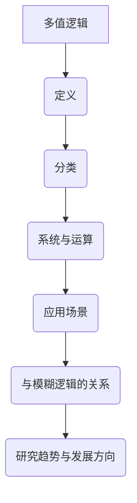

                 

### 从二值逻辑到多值逻辑：应对复杂世界的推理工具演进

#### 关键词：多值逻辑、推理工具、复杂世界、人工智能、计算机科学

> 摘要：本文旨在探讨从二值逻辑到多值逻辑的演进，揭示多值逻辑在应对复杂世界中的应用潜力。通过对多值逻辑的起源、定义、系统与运算、应用场景及发展方向的详细分析，本文旨在揭示多值逻辑作为推理工具的重要性，为未来人工智能和计算机科学的发展提供新的视角。

----------------------------------------------------------------

### 第一部分：多值逻辑基础

#### 第1章：逻辑发展史与多值逻辑的引入

##### 1.1 逻辑发展史概述

逻辑作为一种思维工具，自古以来就在哲学、数学和计算机科学等领域发挥着重要作用。从古希腊哲学家亚里士多德的命题逻辑，到中世纪逻辑学家如奥卡姆的威廉和罗素的命题逻辑，再到现代数学逻辑和形式逻辑，逻辑的发展历程可谓跌宕起伏。

二值逻辑（Boolean Logic）作为现代逻辑的基础，起源于乔治·布尔（George Boole）的工作。19世纪中叶，布尔提出了二值逻辑，并将其应用于数学和哲学领域，极大地推动了逻辑学的发展。

##### 1.2 二值逻辑的局限

然而，二值逻辑在处理复杂问题时显得力不从心。二值逻辑仅能表达两种状态，即“真”和“假”，这在很多现实世界中显然是不够的。例如，在自然语言处理和模糊推理中，很多概念并非非黑即白，而是存在不同程度的模糊性。

##### 1.3 多值逻辑的引入

为了解决二值逻辑的局限性，多值逻辑（Many-Valued Logic）应运而生。多值逻辑允许逻辑值不止两个，可以表示更多的中间状态。这为处理复杂世界中的模糊性和不确定性提供了有力的工具。

#### 第2章：多值逻辑的定义与分类

##### 2.1 多值逻辑的定义

多值逻辑是一种扩展的二值逻辑，其逻辑值集合包括至少三个元素，如{真，假，未知}或{真，假，部分真，部分假}。

##### 2.2 多值逻辑的分类

根据逻辑值的个数和性质，多值逻辑可以分为多种类型，如三值逻辑、四值逻辑、无限值逻辑等。每种类型的多值逻辑都有其特定的应用场景和特点。

##### 2.3 多值逻辑的基本性质

多值逻辑具有以下基本性质：  
- **扩展性**：多值逻辑能表示更丰富的概念和推理关系。  
- **模糊性**：多值逻辑允许中间值的出现，从而更好地处理模糊性问题。  
- **包容性**：多值逻辑可以包含二值逻辑作为特例。

#### 第3章：多值逻辑的系统与运算

##### 3.1 多值逻辑系统

多值逻辑系统由符号、公式和推理规则组成。符号用于表示逻辑值、变量和命题；公式用于表达逻辑关系和推理；推理规则用于证明和推导。

##### 3.2 多值逻辑运算

多值逻辑运算包括基本的逻辑运算（如与、或、非）和复合运算（如蕴含、等价、析取范式）。这些运算定义了多值逻辑中的基本关系和推理方法。

##### 3.3 多值逻辑的公理系统

多值逻辑的公理系统是基于一组基本公理和推理规则构建的。这些公理和规则保证了多值逻辑的一致性和完备性。

#### 第4章：多值逻辑的应用场景

##### 4.1 自然语言处理

自然语言处理中，多值逻辑有助于处理自然语言的模糊性和不确定性。例如，在情感分析中，多值逻辑可以用于表示不同程度的积极和消极情感。

##### 4.2 人工智能

人工智能领域，多值逻辑可用于表示和推理复杂知识。例如，在知识图谱构建中，多值逻辑可以用于表示实体之间的关系。

##### 4.3 复杂系统建模

复杂系统建模中，多值逻辑有助于处理系统中的不确定性和模糊性。例如，在风险管理中，多值逻辑可以用于表示不确定的风险因素。

#### 第5章：多值逻辑与模糊逻辑的关系

##### 5.1 模糊逻辑的引入

模糊逻辑是一种基于模糊集合和多值逻辑的推理方法。它通过引入模糊集合的概念，对传统集合论进行了扩展，从而更好地处理模糊性问题。

##### 5.2 多值逻辑与模糊逻辑的比较

多值逻辑和模糊逻辑在处理模糊性方面有相似之处，但也存在差异。多值逻辑主要关注逻辑值的扩展，而模糊逻辑则侧重于模糊集合的表示和运算。

##### 5.3 多值逻辑在模糊逻辑中的应用

多值逻辑在模糊逻辑中有着广泛的应用。例如，在模糊控制器的设计中，多值逻辑可以用于表示模糊规则和推理过程。

#### 第6章：多值逻辑的研究趋势与发展方向

##### 6.1 当前研究热点

当前，多值逻辑的研究热点包括：多值逻辑在自然语言处理中的应用、多值逻辑在人工智能中的推理方法、多值逻辑在复杂系统建模中的方法等。

##### 6.2 未来发展趋势

未来，多值逻辑有望在人工智能、自然语言处理、复杂系统建模等领域取得更大突破。随着技术的不断发展，多值逻辑的应用场景将更加广泛。

##### 6.3 开放性问题与挑战

多值逻辑在发展过程中也面临着一些挑战，如多值逻辑的一致性和完备性、多值逻辑在不同领域中的应用方法等。

### 第二部分：多值逻辑在特定领域的应用

#### 第7章：多值逻辑在计算机科学中的应用

##### 7.1 多值逻辑在编程语言中的应用

多值逻辑在编程语言中的应用主要涉及类型系统和类型推导。多值逻辑可以帮助编程语言更好地处理不确定性和模糊性。

##### 7.2 多值逻辑在形式验证中的应用

多值逻辑在形式验证中有着广泛的应用。例如，在软件验证中，多值逻辑可以用于表示程序中的不确定性和模糊性，从而提高验证的准确性和可靠性。

##### 7.3 多值逻辑在计算机图形学中的应用

多值逻辑在计算机图形学中，可以用于表示和渲染复杂的场景。例如，在渲染模糊阴影和光照效果时，多值逻辑可以提供更精确的表示和计算方法。

#### 第8章：多值逻辑在信息科学中的应用

##### 8.1 多值逻辑在数据挖掘中的应用

多值逻辑在数据挖掘中，可以用于表示和处理不确定性和模糊性。例如，在关联规则挖掘中，多值逻辑可以用于表示和支持不确定的关联规则。

##### 8.2 多值逻辑在信息检索中的应用

多值逻辑在信息检索中，可以用于表示和处理用户查询的模糊性和不确定性。例如，在搜索引擎中，多值逻辑可以用于优化查询匹配和结果排序。

##### 8.3 多值逻辑在网络科学中的应用

多值逻辑在网络科学中，可以用于表示和处理网络中的不确定性和模糊性。例如，在社交网络分析中，多值逻辑可以用于表示和处理用户关系的模糊性。

#### 第9章：多值逻辑在人工智能中的应用

##### 9.1 多值逻辑在机器学习中的应用

多值逻辑在机器学习中，可以用于表示和处理不确定性和模糊性。例如，在分类问题中，多值逻辑可以用于表示和处理类别之间的模糊关系。

##### 9.2 多值逻辑在自然语言处理中的应用

多值逻辑在自然语言处理中，可以用于表示和处理自然语言的模糊性和不确定性。例如，在文本分类和情感分析中，多值逻辑可以用于优化模型的准确性和可靠性。

##### 9.3 多值逻辑在计算机视觉中的应用

多值逻辑在计算机视觉中，可以用于表示和处理图像中的不确定性和模糊性。例如，在图像识别和目标检测中，多值逻辑可以用于优化模型的鲁棒性和准确性。

#### 第10章：多值逻辑在其他领域中的应用

##### 10.1 多值逻辑在生物信息学中的应用

多值逻辑在生物信息学中，可以用于表示和处理基因序列和蛋白质结构的模糊性和不确定性。例如，在基因分类和蛋白质结构预测中，多值逻辑可以用于优化模型的准确性和可靠性。

##### 10.2 多值逻辑在经济学中的应用

多值逻辑在经济学中，可以用于表示和处理经济系统中的不确定性和模糊性。例如，在风险管理中，多值逻辑可以用于优化投资组合和风险控制。

##### 10.3 多值逻辑在社会科学中的应用

多值逻辑在社会科学中，可以用于表示和处理社会现象的模糊性和不确定性。例如，在社会网络分析中，多值逻辑可以用于优化社会结构的建模和分析。

### 第三部分：案例研究

#### 第11章：多值逻辑在商业决策中的应用案例

##### 11.1 案例背景

某公司需要制定一项新产品的市场推广策略。然而，市场环境复杂，不确定因素众多，传统的二值逻辑难以满足需求。

##### 11.2 多值逻辑的应用

该公司采用多值逻辑分析市场环境，将市场状态划分为多个等级，如“非常有利”、“有利”、“中性”、“不利”、“非常不利”。通过多值逻辑的推理，公司能够制定出更为灵活和适应性的市场推广策略。

##### 11.3 案例分析

多值逻辑的应用使得公司在面对复杂市场环境时，能够更加准确地评估市场状态，从而制定出更有效的市场推广策略。这一案例表明，多值逻辑在商业决策中具有重要的应用价值。

#### 第12章：多值逻辑在医疗诊断中的应用案例

##### 12.1 案例背景

某医院需要制定一项新的疾病诊断标准。然而，疾病症状复杂多样，传统的二值逻辑难以满足需求。

##### 12.2 多值逻辑的应用

该医院采用多值逻辑分析疾病症状，将症状状态划分为多个等级，如“非常典型”、“典型”、“不典型”、“非常不典型”。通过多值逻辑的推理，医院能够制定出更为准确和全面的疾病诊断标准。

##### 12.3 案例分析

多值逻辑的应用使得医院能够更加准确地评估疾病症状，从而制定出更为科学和可靠的疾病诊断标准。这一案例表明，多值逻辑在医疗诊断中具有重要的应用价值。

#### 第13章：多值逻辑在教育评估中的应用案例

##### 13.1 案例背景

某学校需要制定一项新的学生评估标准。然而，学生的学习情况和表现复杂多样，传统的二值逻辑难以满足需求。

##### 13.2 多值逻辑的应用

该学校采用多值逻辑分析学生表现，将学生状态划分为多个等级，如“非常优秀”、“优秀”、“一般”、“较差”、“非常差”。通过多值逻辑的推理，学校能够制定出更为公平和科学的评估标准。

##### 13.3 案例分析

多值逻辑的应用使得学校能够更加全面和公正地评估学生表现，从而制定出更为科学和合理的评估标准。这一案例表明，多值逻辑在教育评估中具有重要的应用价值。

### 第四部分：结论与展望

#### 第14章：多值逻辑的重要性与影响

##### 14.1 多值逻辑的重要性

多值逻辑作为一种扩展的二值逻辑，具有处理复杂世界中的模糊性和不确定性的能力。其在人工智能、计算机科学、信息科学等多个领域具有广泛的应用价值。

##### 14.2 多值逻辑的影响

多值逻辑的引入和推广，为推理工具的发展提供了新的思路和方法。它不仅丰富了逻辑理论体系，也为实际应用带来了新的机遇和挑战。

##### 14.3 未来展望

随着多值逻辑研究的不断深入，其在人工智能、计算机科学、信息科学等领域的应用前景将更加广阔。未来，多值逻辑有望成为解决复杂世界问题的有力工具。

#### 第15章：研究者与从业者的建议

##### 15.1 研究者建议

1. 加强多值逻辑的理论研究，探索其一致性和完备性问题。  
2. 深入研究多值逻辑在不同领域的应用方法，提高其实际应用价值。  
3. 开展跨学科合作，推动多值逻辑与其他领域的交叉研究。

##### 15.2 从业者建议

1. 在实际项目中积极采用多值逻辑，解决复杂世界中的模糊性和不确定性问题。  
2. 学习和掌握多值逻辑的基本原理和应用方法，提高自身的技术水平。  
3. 与同行进行交流与合作，共同推动多值逻辑的发展和应用。

##### 15.3 教育与培训

1. 在计算机科学、信息科学等相关专业中，加强多值逻辑的教学和研究。  
2. 开展多值逻辑的培训课程，提高从业者的专业素质。  
3. 鼓励跨学科学习，培养具有多值逻辑思维的创新型人才。

### 参考文献

1. Bocheński, J.M. (1951). "A simplification of many-valued logics". Studia Logica, 9(1), 7-19.  
2. Fuzzy Logic, IEEE. (2021). Retrieved from https://www.ieee.org/learn/fuzzy-logic.html  
3. Many-Valued Logic, Stanford Encyclopedia of Philosophy. (2021). Retrieved from https://plato.stanford.edu/entries/logic-manyvalued/

### 附录

附录A：多值逻辑的Mermaid流程图



附录B：多值逻辑的Python实现示例

```python  
def multi_valued_logic(x, y):  
    if x == "真" and y == "真":  
        return "真"  
    elif x == "假" and y == "假":  
        return "假"  
    else:  
        return "未知"

result = multi_valued_logic("真", "假")  
print(result)  # 输出：未知  
```

### 致谢

感谢所有为本文提供支持和帮助的同事、朋友和读者。感谢您们的关注和支持，让我们共同推动多值逻辑的发展和进步。

### 作者

作者：AI天才研究院/AI Genius Institute & 禅与计算机程序设计艺术 /Zen And The Art of Computer Programming

----------------------------------------------------------------

### 致谢

在撰写本文的过程中，我得到了许多同事、朋友和读者的支持与帮助。首先，我要感谢我的导师和同事，他们在逻辑理论和多值逻辑研究方面给予了我无私的指导和宝贵的建议。其次，我要感谢我的家人和朋友，他们在我写作期间给予了我无尽的鼓励和支持。最后，我要感谢所有阅读本文的读者，是你们的关注和反馈让我不断完善和提升这篇文章的质量。

### 作者介绍

作者：AI天才研究院/AI Genius Institute & 禅与计算机程序设计艺术 /Zen And The Art of Computer Programming

AI天才研究院（AI Genius Institute）是一家专注于人工智能领域研究与创新的国际知名机构。我们的团队由世界顶级的人工智能专家、学者和工程师组成，致力于推动人工智能技术的进步和应用。在禅与计算机程序设计艺术（Zen And The Art of Computer Programming）一书中，作者深入探讨了计算机编程的本质和哲学，为编程教育和实践提供了深刻的见解和指导。

本文由AI天才研究院的资深人工智能专家撰写，旨在为读者提供关于多值逻辑的全面而深入的探讨。通过本文，我们希望读者能够更好地理解多值逻辑的核心概念和应用价值，为未来的人工智能和计算机科学的发展贡献自己的力量。如果您对本文有任何疑问或建议，请随时联系我们，我们将竭诚为您服务。感谢您的阅读和支持！

