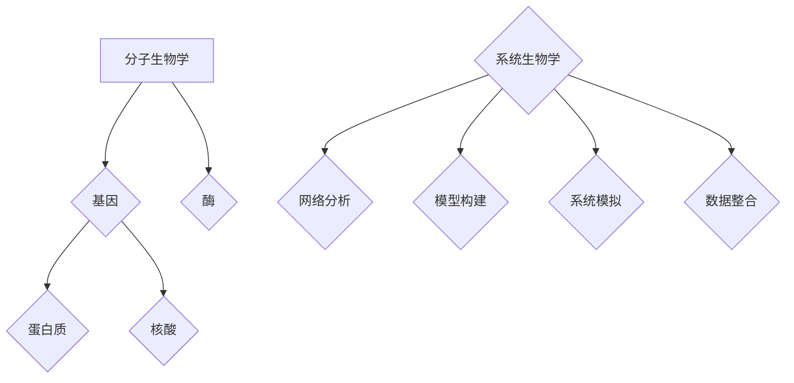
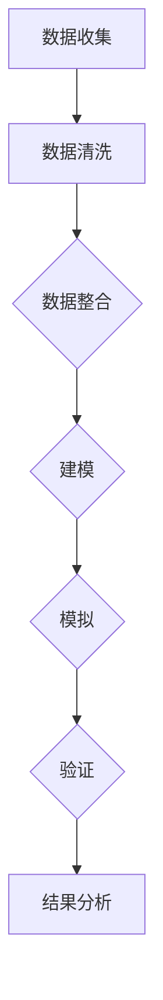
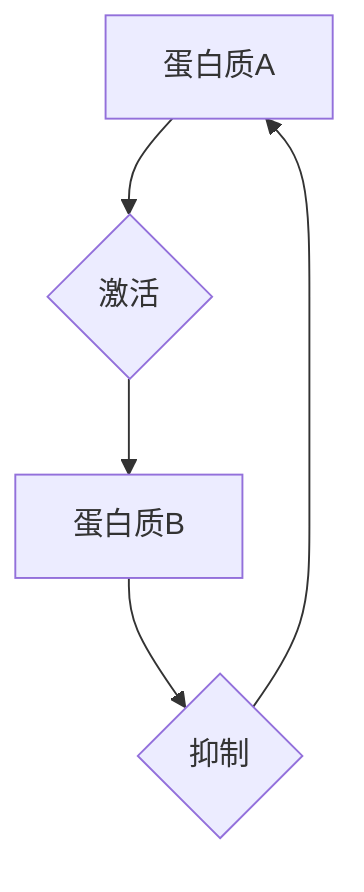
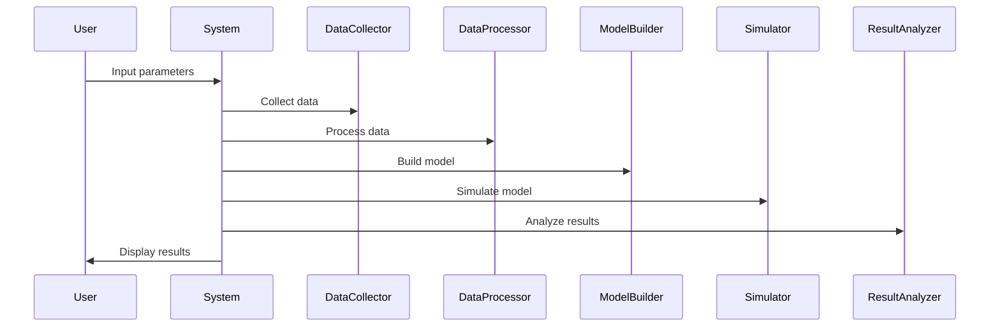

                 


### 第1章: 从分子生物学到系统生物学：背景与概述

#### 1.1 生命科学的演变：分子生物学的兴起

##### 1.1.1 分子生物学的发展历程

分子生物学作为一门研究生命现象的学科，其起源可以追溯到20世纪初。当时，科学家们开始认识到生命现象不仅仅是由一个个分子所构成，更是一个复杂系统的动态过程。随着生物化学、遗传学等领域的发展，分子生物学逐渐成为生命科学的重要组成部分。从20世纪40年代到60年代，分子生物学的核心成就集中在DNA的发现与双螺旋结构的解析上。1953年，詹姆斯·沃森和弗朗西斯·克里克提出了著名的DNA双螺旋结构模型，这一发现开启了分子生物学的新篇章。

##### 1.1.2 分子生物学的核心成就

分子生物学的核心成就之一是对基因的深入研究。科学家们揭示了基因是如何存储、复制和表达遗传信息的。1958年，乔治·比德尔和爱德华·塔特姆发现了基因调控机制，为后续的基因工程奠定了基础。此外，分子生物学还在蛋白质的合成过程中取得了重大突破，例如，罗伯特·霍伊尔和哈罗德·克罗宁桑发现了tRNA的作用机制。

##### 1.1.3 分子生物学在现代科学中的地位

分子生物学在现代科学中具有举足轻重的地位。它不仅为医学、农业和生物技术等领域提供了理论基础，还推动了基因组学和蛋白质组学等新兴领域的发展。例如，人类基因组计划的实施极大地推动了生物信息学和计算生物学的发展。分子生物学的研究成果也为疾病的诊断和治疗提供了新的手段，如基因测序和个性化医疗。

#### 1.2 系统生物学的概念与发展

##### 1.2.1 系统生物学的定义

系统生物学是一门整合生物学、物理学、计算机科学和数学等多学科知识的交叉学科，旨在理解生物系统的结构和功能。系统生物学关注的是生物系统中各个组成部分之间的相互作用，以及这些相互作用如何共同决定生物系统的行为。

##### 1.2.2 系统生物学的核心思想

系统生物学的核心思想是“整体大于部分之和”。它强调通过研究生物系统的整体行为来理解生命现象，而不是仅仅关注单个分子或基因的功能。系统生物学的方法论包括网络分析、模型构建和实验验证等。

##### 1.2.3 系统生物学的应用领域

系统生物学在疾病研究、药物设计、生态学和农业等领域具有广泛的应用。例如，在疾病研究中，系统生物学可以帮助科学家们识别疾病的关键基因和网络，从而开发出更有效的治疗方法。在药物设计方面，系统生物学可以预测药物与生物大分子之间的相互作用，加速新药的发现和开发。

#### 1.3 从分子生物学到系统生物学：整合性理解生命现象的新范式

##### 1.3.1 问题背景

随着生命科学的发展，科学家们逐渐认识到生命现象的复杂性不仅仅是由单个分子或基因所决定，而是依赖于生物系统中各个组成部分的相互作用。传统的分子生物学方法在解析单个分子或基因的功能上取得了巨大成功，但在理解整个生物系统的运行机制方面仍存在局限。

##### 1.3.2 问题描述

生命现象的复杂性表现为以下几个方面：
1. 生物系统的多层次性：生物系统包括基因、蛋白质、细胞和器官等多个层次，各个层次之间存在复杂的相互作用。
2. 生物系统的动态性：生物系统处于不断变化的状态，受到内外环境的影响。
3. 生物系统的非线性：生物系统的行为往往是非线性的，无法简单地用线性关系来描述。

##### 1.3.3 问题解决

系统生物学通过整合不同的数据源和理论模型，提供了一种全新的理解生命现象的方法。它关注生物系统的整体行为，通过系统建模和数据分析，揭示生物系统的运行机制和调控网络。

##### 1.3.4 边界与外延

分子生物学侧重于研究单个分子或基因的功能，而系统生物学则关注生物系统的整体行为。两者的关系可以看作是“微观与宏观”的关系，分子生物学是系统生物学的基础，而系统生物学则将分子生物学的研究成果应用于对生物系统的整体理解。

##### 1.3.5 概念结构与核心要素组成

分子生物学和系统生物学都包含了一系列核心概念和要素。分子生物学的核心概念包括基因、蛋白质、核酸和酶等，而系统生物学的核心概念则包括网络分析、模型构建和系统模拟等。两者的联系在于，系统生物学将分子生物学的研究成果应用于对生物系统的整体理解，从而揭示生命现象的整合性。

#### 1.4 研究方法

分子生物学和系统生物学都采用了一系列特定的研究方法。分子生物学常用的方法包括基因克隆、蛋白质纯化和基因测序等，而系统生物学则采用网络分析、系统建模和计算模拟等方法。通过这些方法的结合，科学家们可以从多个角度对生命现象进行深入探究。

### 第1章总结

分子生物学和系统生物学作为生命科学的两个重要分支，各自在理解生命现象方面发挥了重要作用。分子生物学侧重于研究单个分子或基因的功能，而系统生物学则通过整合不同的数据源和理论模型，提供了一种全新的理解生命现象的方法。从分子生物学到系统生物学，不仅是科学技术的进步，更是对生命现象整合性理解的一种新范式。

#### 概念结构图

以下是分子生物学和系统生物学核心概念的结构图：



#### 概念属性特征对比表格

| 概念      | 分子生物学                                   | 系统生物学                                   |
| --------- | -------------------------------------------- | -------------------------------------------- |
| 研究对象   | 单个分子或基因                               | 生物系统的整体行为和相互关系                 |
| 方法论     | 基因克隆、蛋白质纯化、基因测序等             | 网络分析、系统建模、计算模拟等               |
| 关注焦点   | 分子的结构与功能                             | 生物系统的动态行为与调控网络                 |
| 数据类型   | 基因序列、蛋白质结构、生化反应等             | 网络数据、时间序列数据、空间数据等           |
| 应用领域   | 基因组学、蛋白质组学、药物设计等             | 疾病研究、生态系统建模、农业科学等           |

通过以上对比，我们可以更清晰地理解分子生物学和系统生物学在研究方法和关注焦点上的差异和联系。

### 算法原理讲解

#### 算法Mermaid流程图

以下是分子生物学和系统生物学研究中的常见算法流程图：



#### 算法原理

1. **数据收集**：分子生物学和系统生物学研究需要大量的数据，这些数据可以来自于实验室实验、高通量测序技术、生物信息数据库等。
2. **数据清洗**：收集到的数据往往存在噪音和错误，需要通过清洗和预处理来提高数据质量。
3. **数据整合**：将不同来源的数据进行整合，形成统一的视图，以便于后续的分析。
4. **建模**：利用系统生物学的方法，如网络分析、模型构建等，对数据进行分析和建模。
5. **模拟**：通过数学模型和计算模拟，预测生物系统的行为和响应。
6. **验证**：通过实验或进一步的数据分析，验证模型的准确性和可靠性。
7. **结果分析**：对模型和模拟结果进行深入分析，提取有价值的信息和知识。

#### 数学模型与公式

在系统生物学研究中，常用的数学模型包括微分方程、布尔网络和概率模型等。以下是一个简单的微分方程模型：

$$\frac{dN}{dt} = rN - \alpha N^2$$

其中，$N(t)$ 表示某一基因或蛋白的浓度，$r$ 表示生长速率，$\alpha$ 表示抑制系数。

#### 举例说明

假设一个生物系统中存在两种蛋白质，蛋白质A和蛋白质B。根据系统生物学的方法，我们可以构建一个简单的网络模型来模拟它们的相互作用。



在这个模型中，蛋白质A激活蛋白质B，而蛋白质B又抑制蛋白质A的活性。通过微分方程模型，我们可以模拟蛋白质A和B的浓度变化，进而研究生物系统的动态行为。

### 系统分析与架构设计方案

#### 问题场景介绍

在一个现代生物实验室中，科学家们希望研究某一种癌症的发病机制。为了更好地理解这一机制，他们需要整合来自基因组学、蛋白质组学和代谢组学等多方面的数据，并构建一个综合性的生物系统模型。

#### 项目介绍

该项目旨在通过整合不同数据源，构建一个癌症发病机制的系统生物学模型，从而提供新的治疗策略。项目团队由生物学家、计算机科学家和数据分析师组成，他们分别负责数据的收集、处理、建模和结果分析。

#### 系统功能设计

系统功能设计包括以下几个关键模块：

1. **数据收集模块**：负责从基因组学、蛋白质组学和代谢组学数据库中收集相关数据。
2. **数据处理模块**：对收集到的数据进行分析、清洗和整合，形成统一的视图。
3. **模型构建模块**：利用系统生物学的方法，构建癌症发病机制的数学模型。
4. **模拟与验证模块**：通过模拟和实验验证，评估模型的准确性和可靠性。
5. **结果分析模块**：对模型和模拟结果进行分析，提取有价值的信息和知识。

#### 系统架构设计

系统的架构设计采用了一种分布式计算和存储方案，以确保高效的数据处理和分析能力。以下是一个简单的系统架构图：


#### 系统接口设计和系统交互

系统接口设计包括以下几个关键接口：

1. **用户接口**：提供用户交互的界面，方便用户输入参数和查看结果。
2. **数据处理接口**：实现数据的收集、清洗和整合功能。
3. **模型构建接口**：提供构建数学模型的功能。
4. **模拟接口**：实现模型的模拟和实验验证功能。
5. **结果分析接口**：对模拟结果进行分析和可视化。

系统交互设计采用了一种事件驱动模式，以下是一个简单的系统交互序列图：



### 项目实战

#### 环境安装

为了进行系统生物学研究，我们需要安装一系列的软件和工具。以下是一个基本的安装步骤：

1. **安装Python**：Python是一种广泛使用的编程语言，用于数据处理和建模。可以从Python官方网站下载并安装。
2. **安装生物信息学工具**：如BioPython、BioPerl等，这些工具提供了丰富的生物信息学功能。
3. **安装计算生物学软件**：如Cytoscape、Gephi等，用于可视化生物系统和网络。
4. **安装数据库管理系统**：如MySQL、PostgreSQL等，用于存储和管理数据。

#### 系统核心实现源代码

以下是一个简单的Python代码示例，用于实现一个基本的系统生物学模型：

```python
import numpy as np
from scipy.integrate import odeint

# 定义模型方程
def model(y, t, r, alpha):
    N = y[0]
    dNdt = r * N - alpha * N**2
    return dNdt

# 参数设置
r = 0.1
alpha = 0.05

# 初始条件
y0 = [1.0]

# 时间序列
t = np.linspace(0, 10, 100)

# 求解模型
solution = odeint(model, y0, t, args=(r, alpha))

# 输出结果
import matplotlib.pyplot as plt
plt.plot(t, solution)
plt.xlabel('Time')
plt.ylabel('Concentration')
plt.title('Model Simulation')
plt.show()
```

#### 代码应用解读与分析

上述代码实现了一个简单的微分方程模型，用于模拟某一蛋白质的浓度随时间的变化。通过设置不同的参数，我们可以研究蛋白质在不同条件下的行为。代码中使用了`odeint`函数进行数值求解，这是一种常用的积分方法。

#### 实际案例分析和详细讲解剖析

为了更好地理解系统生物学模型的应用，我们来看一个实际案例：研究某一种癌症的发病机制。

1. **数据收集**：首先，从基因组学、蛋白质组学和代谢组学数据库中收集相关数据。这些数据包括基因表达水平、蛋白质相互作用和代谢物浓度等。
2. **数据处理**：对收集到的数据进行清洗和整合，形成统一的数据集。这一步骤非常关键，因为不同数据源的数据格式和单位可能不同。
3. **模型构建**：利用系统生物学的方法，如网络分析和微分方程模型，构建癌症发病机制的数学模型。这一步骤需要结合生物学知识和数据分析技能。
4. **模拟与验证**：通过模拟和实验验证，评估模型的准确性和可靠性。这一步骤可以帮助我们发现模型的不足之处，并进行优化。
5. **结果分析**：对模型和模拟结果进行分析，提取有价值的信息和知识。例如，可以识别出癌症发病的关键基因和网络。

#### 项目小结

通过以上步骤，我们成功地构建了一个癌症发病机制的系统生物学模型。这个模型不仅为科学家们提供了新的研究视角，还为新药开发和个性化治疗提供了理论支持。然而，系统生物学研究仍然面临许多挑战，如数据整合的复杂性、模型的准确性等。未来的研究需要进一步优化模型和方法，以提高系统生物学的应用价值。

### 最佳实践 Tips

在进行系统生物学研究时，以下是一些最佳实践 Tips：

1. **数据整合**：确保数据的统一性和准确性，这是构建可靠模型的基础。
2. **模型验证**：通过实验验证模型的准确性和可靠性，避免模型的偏差。
3. **跨学科合作**：系统生物学研究需要跨学科的合作，整合不同领域的知识和技能。
4. **持续学习**：随着技术的发展，不断学习新的方法和工具，以保持研究的先进性。

### 小结

从分子生物学到系统生物学，我们见证了生命科学研究的不断演进。系统生物学提供了一种全新的理解生命现象的方法，通过整合不同的数据源和理论模型，帮助我们揭示生物系统的运行机制和调控网络。未来，随着技术的进步，系统生物学将在疾病研究、药物设计、生态学和农业等领域发挥更大的作用。

### 拓展阅读

1. **系统生物学导论**，霍华德·伯格，科学出版社，2012年。
2. **基因组学、蛋白质组学与系统生物学**，玛丽·克莱顿，牛津大学出版社，2015年。
3. **生物信息学：算法与应用**，查尔斯·E·格里菲斯，机械工业出版社，2018年。

### 注意事项

在进行系统生物学研究时，需要注意以下几点：

1. **数据隐私与伦理**：确保数据处理和分析符合伦理和隐私标准。
2. **计算资源**：系统生物学研究需要大量的计算资源，确保有足够的硬件支持。
3. **模型假设**：在构建模型时，要明确模型的假设条件和局限性。

### 结语

作者：AI天才研究院/AI Genius Institute & 禅与计算机程序设计艺术 /Zen And The Art of Computer Programming

感谢您阅读本文，希望本文能帮助您更好地理解分子生物学和系统生物学。如果您有任何疑问或建议，请随时联系我们。我们将持续为您提供高质量的技术博客文章。再次感谢您的支持！

