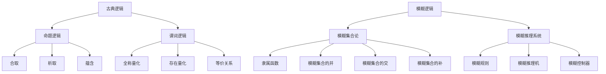

                 

# 从古典逻辑到模糊逻辑：拓展世界可理解性

## 引言

### 1.1 问题背景

在人类历史上，逻辑学一直是哲学、数学和计算机科学的重要分支。它帮助我们理解世界、推理和解决问题。然而，随着科技的进步和应用场景的多样化，古典逻辑的局限性逐渐显现出来。古典逻辑基于二元对立的思维方式，它难以处理现实世界中模糊、不确定和复杂的情况。因此，我们需要探索新的逻辑体系，以拓展我们对世界的理解。

### 1.2 问题描述

问题描述主要集中在以下几个方面：

- 古典逻辑在处理模糊和不确定问题时存在哪些局限性？
- 模糊逻辑是如何产生的，它的核心概念和原理是什么？
- 模糊逻辑在现实世界中有哪些应用场景？
- 模糊逻辑与古典逻辑有何区别和联系？

### 1.3 问题解决

本书将通过以下几个步骤来解决问题：

1. 首先，我们将回顾古典逻辑的发展历史和基本原理。
2. 接着，我们介绍模糊逻辑的概念和原理，并通过Mermaid流程图展示它们之间的联系。
3. 然后，我们深入讲解模糊逻辑和古典逻辑的数学模型，使用Python源代码进行算法原理的说明。
4. 我们将探讨这些逻辑体系在现实世界中的应用，如人工智能、自动化控制和智能交通。
5. 最后，我们将介绍一些拓展知识，如其他类型的逻辑和逻辑的哲学意义。

### 1.4 边界与外延

在探索从古典逻辑到模糊逻辑的转变过程中，我们需要明确一些边界和概念。首先，古典逻辑主要关注清晰、明确和确定的情况，而模糊逻辑则尝试处理模糊、不确定和复杂的问题。其次，虽然模糊逻辑在许多方面扩展了古典逻辑的应用范围，但它并不是古典逻辑的替代品，而是对古典逻辑的一种补充和拓展。

## 1.2 核心概念与联系

### 1.2.1 古典逻辑

#### 1.2.1.1 古典逻辑的定义

古典逻辑，也称为形式逻辑，是一种基于命题和推理规则的逻辑体系。它主要研究命题之间的关系、推理的有效性和证明的方法。

#### 1.2.1.2 古典逻辑的特点

- 命题和推理规则：古典逻辑以命题为基本单位，通过推理规则来推导新的命题。
- 二元对立：古典逻辑基于二元对立的思维方式，即命题要么为真，要么为假。
- 确定性：古典逻辑强调命题的真假确定性，忽略现实世界中的模糊性和不确定性。

#### 1.2.1.3 古典逻辑的分类

- 命题逻辑：主要研究命题之间的关系，如合取、析取、蕴含等。
- 谓词逻辑：主要研究个体、属性和关系，如全称量化、存在量化、等价关系等。

### 1.2.2 模糊逻辑

#### 1.2.2.1 模糊逻辑的定义

模糊逻辑是一种基于模糊集合和模糊推理规则的逻辑体系。它允许处理现实世界中的模糊、不确定和复杂的问题。

#### 1.2.2.2 模糊逻辑的特点

- 模糊集合：模糊逻辑使用模糊集合来表示现实世界中的模糊概念，如“高”、“大”、“快”等。
- 模糊推理：模糊逻辑通过模糊推理规则来推导新的结论，如“如果天气很热，那么我就去游泳”。
- 灰色区域：模糊逻辑允许在真值范围内存在灰色区域，即不是完全的真，也不是完全的假。

#### 1.2.2.3 模糊逻辑的分类

- 模糊集合论：主要研究模糊集合的性质和运算，如隶属函数、模糊集合的并、交、补等。
- 模糊推理系统：主要研究模糊推理的原理和方法，如模糊规则、模糊推理机、模糊控制器等。

### 概念联系

在Mermaid流程图中，我们可以清晰地展示古典逻辑和模糊逻辑之间的联系：



通过这个流程图，我们可以看到古典逻辑和模糊逻辑在概念上的交叉和融合。古典逻辑中的命题逻辑和谓词逻辑为模糊逻辑提供了基础，而模糊逻辑则扩展了古典逻辑的应用范围，使其能够处理更加复杂和模糊的问题。

## 1.3 ER实体关系图架构

### 1.3.1 ER实体关系图的基本概念

#### 1.3.1.1 实体

实体是现实世界中具有独立存在意义的对象，可以是物理对象，如人、物、地点等，也可以是抽象概念，如图表、报告等。在ER图中，实体通常用矩形表示。

#### 1.3.1.2 属性

属性是实体所具有的特征或描述，如人的姓名、年龄、性别等。在ER图中，属性通常用椭圆表示，并通过线段连接到对应的实体。

#### 1.3.1.3 关系

关系是实体之间的联系，可以是单一实体内部的关系，如一个人有多条电话号码；也可以是多个实体之间的关系，如学生和课程之间的选修关系。在ER图中，关系通常用菱形表示，并通过线段连接到对应的实体。

### 1.3.2 Mermaid流程图展示

#### 1.3.2.1 Mermaid流程图介绍

Mermaid是一种简单而强大的图表绘制工具，它支持流程图、ER图、Gantt图等多种图表类型。Mermaid使用Markdown语法，这使得它在各种Markdown编辑器中都能很好地工作。

#### 1.3.2.2 Mermaid流程图实例

以下是一个简单的Mermaid ER图示例：

```mermaid
erDiagram
    实体1 ||--|{ 属性1 属性2 }
    实体2 ||--|{ 属性3 属性4 }
    实体1 ||--|{ 关系1 关系2 }
    实体2 ||--|{ 关系3 关系4 }
```

在这个示例中，我们定义了两个实体（实体1和实体2），每个实体都有两个属性（属性1、属性2和属性3、属性4），并且实体1和实体2之间存在两个关系（关系1和关系2）。

### 1.3.3 Mermaid流程图在逻辑体系中的应用

在逻辑体系的分析中，Mermaid ER图可以帮助我们清晰地展示实体、属性和关系之间的结构关系。例如，在分析古典逻辑和模糊逻辑时，我们可以使用Mermaid ER图来展示它们的核心概念和联系：

```mermaid
erDiagram
    古典逻辑 ||--|{ 命题逻辑 谓词逻辑 }
    模糊逻辑 ||--|{ 模糊集合论 模糊推理系统 }
    古典逻辑 ||--|{ 二元对立 确定性 }
    模糊逻辑 ||--|{ 模糊集合 模糊推理 }
    古典逻辑 ||--|{ 合取 析取 蕴含 }
    模糊逻辑 ||--|{ 并 交 补 }
```

在这个ER图中，我们可以看到古典逻辑和模糊逻辑的核心概念和联系。古典逻辑主要包括命题逻辑和谓词逻辑，而模糊逻辑则包括模糊集合论和模糊推理系统。此外，我们还可以看到古典逻辑和模糊逻辑在处理问题时的不同思维方式：古典逻辑强调二元对立和确定性，而模糊逻辑则允许模糊性和不确定性。

通过使用Mermaid ER图，我们可以更加直观地理解逻辑体系的结构和联系，从而更好地分析、设计和实现相关的逻辑系统。

### 1.4 古典逻辑原理讲解

#### 1.4.1 命题逻辑

##### 1.4.1.1 命题逻辑的定义

命题逻辑，也称为命题演算，是研究命题及其之间关系的形式逻辑系统。命题逻辑的基本单位是命题，命题是可以判断真假的陈述句。

##### 1.4.1.2 命题逻辑的基本原理

命题逻辑的基本原理包括命题联结词和推理规则。

- 命题联结词：命题联结词是用来连接简单命题形成复合命题的符号，常见的命题联结词有合取（∧）、析取（∨）、蕴含（→）和等价（↔）。
- 推理规则：推理规则是用来从已知命题推导出新命题的方法。常见的推理规则有合取律、析取律、蕴含律和等价律。

##### 1.4.1.3 命题逻辑的应用

命题逻辑在计算机科学和数学中有着广泛的应用，如形式化证明、软件验证、人工智能等领域。

- 形式化证明：命题逻辑提供了形式化的证明方法，可以帮助我们验证算法的正确性。
- 软件验证：命题逻辑可以用于软件验证，确保软件系统的正确性和可靠性。
- 人工智能：命题逻辑是人工智能中的逻辑推理基础，可以帮助构建推理系统和智能决策系统。

#### 1.4.2 谓词逻辑

##### 1.4.2.1 谓词逻辑的定义

谓词逻辑，也称为谓词演算，是研究个体、属性和关系的形式逻辑系统。谓词逻辑的基本单位是谓词，谓词是用来描述个体或关系的命题。

##### 1.4.2.2 谓词逻辑的基本原理

谓词逻辑的基本原理包括谓词、量词和推理规则。

- 谓词：谓词是用来描述个体或关系的命题，如“是人”、“大于”等。
- 量词：量词是用来表示全称量词和存在量词的符号，全称量词表示对所有个体的描述，存在量词表示至少存在一个个体的描述。
- 推理规则：推理规则是用来从已知命题推导出新命题的方法，如全称实例化、存在实例化、等价变换等。

##### 1.4.2.3 谓词逻辑的应用

谓词逻辑在计算机科学和数学中也有着广泛的应用，如形式化证明、自动推理、数据库查询等。

- 形式化证明：谓词逻辑提供了形式化的证明方法，可以帮助我们验证算法的正确性。
- 自动推理：谓词逻辑是自动推理的基础，可以帮助计算机自动推导出新的结论。
- 数据库查询：谓词逻辑可以用于数据库查询，通过谓词来表达查询条件，实现复杂查询。

通过详细讲解命题逻辑和谓词逻辑的原理，我们可以更好地理解古典逻辑的体系结构和应用方法。这些原理不仅为形式化证明、软件验证和人工智能等领域提供了理论基础，也为拓展我们对世界的理解提供了工具。在接下来的章节中，我们将继续探讨模糊逻辑的原理和应用，以进一步拓展我们的逻辑思维。

### 1.5 模糊逻辑原理讲解

#### 1.5.1 模糊集合

##### 1.5.1.1 模糊集合的定义

模糊集合是Zadeh在1965年提出的，它是经典集合的一种扩展。在经典集合中，一个元素要么属于集合A，要么不属于集合A，即成员关系是明确的二元（0或1）。而模糊集合则允许成员关系具有某种程度的“灰色性”，即元素属于集合A的程度可以用一个介于0和1之间的数来表示。

定义：设U是一个非空集合，称为论域。对于U上的一个模糊子集A，我们定义一个隶属函数μA：U → [0, 1]，使得对于任意x ∈ U，都有一个隶属度μA(x) ∈ [0, 1]。隶属函数μA(x)表示元素x属于模糊集合A的程度。

##### 1.5.1.2 模糊集合的性质

- 非负性：对于任意x ∈ U，有μA(x) ≥ 0。
- 有界性：对于任意x ∈ U，有μA(x) ≤ 1。
- 完备性：模糊集合的并和交运算保持模糊性，即如果A和B是模糊集合，则A ∪ B和A ∩ B也是模糊集合。
- 确定性：如果A是模糊集合，那么A的补集A'也是一个模糊集合。

##### 1.5.1.3 模糊集合的应用

模糊集合在处理现实世界中的模糊问题时具有重要作用，如模糊控制、模糊推理和模糊聚类等。

- 模糊控制：在自动化控制系统中，模糊逻辑可以用来处理输入输出之间存在复杂非线性关系的问题。
- 模糊推理：模糊逻辑可以用来模拟人类的推理过程，特别是在不确定和模糊环境下。
- 模糊聚类：模糊逻辑可以用来进行数据聚类分析，特别是在处理大规模复杂数据时。

#### 1.5.2 模糊逻辑运算

##### 1.5.2.1 模糊逻辑运算的定义

模糊逻辑运算是指对模糊集合进行操作的方法，常用的模糊逻辑运算有模糊并、模糊交和模糊补等。

- 模糊并：对于两个模糊集合A和B，其模糊并运算定义为一个新的模糊集合C，使得C(x) = max(A(x), B(x))，即C中任意元素x的隶属度是A和B中对应元素隶属度的最大值。
- 模糊交：对于两个模糊集合A和B，其模糊交运算定义为一个新的模糊集合C，使得C(x) = min(A(x), B(x))，即C中任意元素x的隶属度是A和B中对应元素隶属度的最小值。
- 模糊补：对于模糊集合A，其模糊补运算定义为一个新的模糊集合B，使得B(x) = 1 - A(x)，即B中任意元素x的隶属度是A中对应元素隶属度的补值。

##### 1.5.2.2 模糊逻辑运算的基本原理

模糊逻辑运算的基本原理是基于模糊集合的隶属函数。在模糊并和模糊交运算中，我们通过比较两个模糊集合中对应元素的隶属度来计算新集合的隶属度；在模糊补运算中，我们通过取原模糊集合的隶属度的补值来计算新集合的隶属度。

##### 1.5.2.3 模糊逻辑运算的应用

模糊逻辑运算在模糊推理和模糊控制中有着广泛的应用。

- 模糊推理：在模糊推理中，我们通过模糊逻辑运算来计算新的模糊结论，从而模拟人类的推理过程。
- 模糊控制：在模糊控制中，我们通过模糊逻辑运算来处理输入输出之间的非线性关系，从而实现对系统的精确控制。

通过详细讲解模糊集合和模糊逻辑运算的原理，我们可以更好地理解模糊逻辑的基本概念和方法。这些原理为我们在处理现实世界中的模糊和不确定问题提供了强大的工具，也为拓展我们的逻辑思维提供了新的视角。在接下来的章节中，我们将进一步探讨模糊逻辑在现实世界中的应用，以展示其在解决复杂问题方面的潜力。

### 1.6 数学模型与公式

#### 1.6.1 古典逻辑的数学模型

##### 1.6.1.1 命题逻辑的数学模型

命题逻辑的数学模型主要基于布尔代数，其基本运算包括合取（∧）、析取（∨）、蕴含（→）和等价（↔）。

- 合取（∧）：两个命题P和Q的合取是一个新的命题R，使得R为真当且仅当P和Q都为真。数学表示为：R = P ∧ Q。
- 析取（∨）：两个命题P和Q的析取是一个新的命题S，使得S为真当且仅当P或Q至少有一个为真。数学表示为：S = P ∨ Q。
- 蕴含（→）：两个命题P和Q的蕴含是一个新的命题T，使得T为真当且仅当P为假或Q为真。数学表示为：T = P → Q。
- 等价（↔）：两个命题P和Q的等价是一个新的命题U，使得U为真当且仅当P和Q的真假相同。数学表示为：U = P ↔ Q。

##### 1.6.1.2 谓词逻辑的数学模型

谓词逻辑的数学模型主要基于谓词演算，其基本运算包括全称量化（∀）和存在量化（∃）。

- 全称量化：全称量化表示对所有个体的描述，数学表示为：∀x P(x)，其中P(x)是一个谓词，表示对个体x的描述。
- 存在量化：存在量化表示至少存在一个个体满足谓词，数学表示为：∃x P(x)，其中P(x)是一个谓词，表示对个体x的描述。

#### 1.6.2 模糊逻辑的数学模型

##### 1.6.2.1 模糊集合的数学模型

模糊集合的数学模型基于隶属函数，其核心概念是模糊集合的隶属度。

- 隶属函数：隶属函数μA：U → [0, 1]，表示模糊集合A中任意元素x的隶属度。隶属度μA(x) ∈ [0, 1]，表示元素x属于模糊集合A的程度。

##### 1.6.2.2 模糊逻辑运算的数学模型

模糊逻辑运算的数学模型基于模糊集合的运算，包括模糊并、模糊交和模糊补等。

- 模糊并：对于两个模糊集合A和B，其模糊并运算定义为一个新的模糊集合C，使得C(x) = max(A(x), B(x))。数学表示为：C(x) = max(μA(x), μB(x))。
- 模糊交：对于两个模糊集合A和B，其模糊交运算定义为一个新的模糊集合C，使得C(x) = min(A(x), B(x))。数学表示为：C(x) = min(μA(x), μB(x))。
- 模糊补：对于模糊集合A，其模糊补运算定义为一个新的模糊集合B，使得B(x) = 1 - A(x)。数学表示为：B(x) = 1 - μA(x)。

通过数学模型和公式的讲解，我们可以更深入地理解古典逻辑和模糊逻辑的基本原理。这些数学工具不仅帮助我们精确描述和操作逻辑系统，也为我们在实际应用中提供了强大的计算和分析能力。

### 1.7 逻辑体系在现实世界中的应用

#### 1.7.1 人工智能

##### 1.7.1.1 人工智能的基本概念

人工智能（Artificial Intelligence，AI）是研究、开发和应用使计算机模拟人类智能行为的理论和技术的科学。人工智能的目标是使计算机具有类似人类的感知、推理、学习、解决问题和自我改进的能力。

##### 1.7.1.2 人工智能的发展历程

人工智能的发展历程可以分为几个阶段：

- 初创期（1956年-1969年）：人工智能概念被提出，研究人员开始探索如何使计算机模拟人类智能。
- 冬眠期（1974年-1980年）：由于技术限制和理论研究遇到困难，人工智能研究进入低潮期。
- 复兴期（1980年-1987年）：专家系统和机器学习技术的出现使人工智能研究重新焕发生机。
- 商业化期（1988年-至今）：人工智能技术逐渐应用于各个领域，如自然语言处理、图像识别、智能机器人等。

##### 1.7.1.3 人工智能的应用领域

人工智能在现实世界中有着广泛的应用领域：

- 自然语言处理：包括机器翻译、语音识别、文本分类和情感分析等。
- 图像识别：包括人脸识别、图像分类、目标检测和图像生成等。
- 智能机器人：包括服务机器人、无人机、自动驾驶汽车等。
- 医疗诊断：包括疾病预测、影像诊断和药物研发等。
- 金融服务：包括风险控制、欺诈检测和智能投顾等。
- 工业自动化：包括智能工厂、机器人制造和智能物流等。

#### 1.7.2 自动化控制

##### 1.7.2.1 自动化控制的基本概念

自动化控制是指利用计算机、传感器、执行器等设备，实现生产过程或系统运行的自组织和自优化。自动化控制的目标是提高生产效率、降低成本和保障产品质量。

##### 1.7.2.2 自动化控制的发展历程

自动化控制的发展历程可以分为几个阶段：

- 早期阶段（1950年代-1960年代）：采用简单的开关控制和模拟控制。
- 1970年代：数字控制技术的兴起，开始采用计算机进行控制。
- 1980年代：工业控制计算机的应用，出现集散控制系统。
- 1990年代：现场总线技术的应用，实现分布式控制和网络化控制。
- 21世纪初至今：人工智能和机器学习技术的引入，使自动化控制更加智能化和自适应。

##### 1.7.2.3 自动化控制的应用领域

自动化控制在现实世界中有着广泛的应用领域：

- 工业生产：包括制造业、食品加工、化工生产等。
- 能源管理：包括电力系统、燃气系统、热力系统等。
- 交通系统：包括交通信号控制、自动驾驶汽车、智能交通管理等。
- 农业生产：包括智能灌溉、智能种植、智能养殖等。
- 医疗设备：包括手术机器人、医疗影像分析、智能诊断等。
- 家居控制：包括智能门锁、智能照明、智能家电等。

#### 1.7.3 智能交通

##### 1.7.3.1 智能交通的基本概念

智能交通系统（Intelligent Transportation System，ITS）是指利用先进的传感技术、通信技术、控制技术和信息技术，实现交通系统的自动化、智能化和高效化。智能交通系统旨在提高交通效率、减少交通事故、降低污染和节约能源。

##### 1.7.3.2 智能交通的发展历程

智能交通系统的发展历程可以分为几个阶段：

- 初创期（1980年代）：开始研究和开发智能交通系统。
- 发展期（1990年代）：出现一些初步的智能交通应用，如电子收费系统、交通信息发布系统。
- 成熟期（2000年代）：智能交通系统逐渐普及，出现更多应用，如智能信号控制、自动驾驶车辆。
- 智能化期（2010年代至今）：人工智能和大数据技术的引入，使智能交通系统更加智能化和自适应。

##### 1.7.3.3 智能交通的应用领域

智能交通系统在现实世界中有着广泛的应用领域：

- 交通信号控制：通过智能信号控制，实现交通流量的优化和交通效率的提高。
- 车辆管理：包括车辆检测、车辆调度和车辆追踪等，提高交通系统的安全性和可靠性。
- 停车管理：通过智能停车系统，实现停车位的实时监测和智能引导，提高停车效率。
- 交通信息发布：通过实时交通信息发布，为驾驶员提供准确的交通状况和路线建议。
- 事故预警与处理：通过事故预警和事故处理系统，实现交通事故的快速响应和有效处理。
- 公共交通：包括公交车智能调度、地铁智能运营和出租车智能调度等，提高公共交通的运行效率和服务质量。

通过介绍人工智能、自动化控制和智能交通的基本概念、发展历程和应用领域，我们可以看到逻辑体系在这些领域的广泛应用。逻辑体系不仅为这些技术的发展提供了理论基础，也为实现智能化和自动化提供了强大的工具。在未来的发展中，逻辑体系将继续发挥重要作用，推动社会进步和科技发展。

### 1.8 拓展知识

#### 1.8.1 其他类型的逻辑

在古典逻辑和模糊逻辑之外，还有许多其他类型的逻辑体系，每种逻辑都有其独特的特点和适用场景。

##### 1.8.1.1 形式逻辑

形式逻辑是一种研究命题形式和推理规则的形式系统。它主要包括命题逻辑和谓词逻辑，我们在前文中已有详细讨论。形式逻辑强调逻辑推理的严格性和有效性，适用于证明、验证和模型检查等。

##### 1.8.1.2 演绎逻辑

演绎逻辑是一种从一般到特殊的推理方式。它基于一系列的前提（公理或已知事实），通过逻辑推理规则，推导出新的结论。演绎逻辑通常用于数学证明和形式化理论。

##### 1.8.1.3 归纳逻辑

归纳逻辑是一种从特殊到一般的推理方式。它通过观察个别实例，归纳出一般规律或原则。归纳逻辑通常用于科学研究、数据分析和机器学习。

#### 1.8.2 逻辑的哲学意义

逻辑不仅在科学和技术领域有着重要应用，在哲学研究中也有着深远的影响。

##### 1.8.2.1 逻辑在哲学研究中的应用

逻辑是哲学研究的重要工具，它帮助哲学家分析和论证各种观点和理论。逻辑在伦理学、认识论、形而上学等领域都有着广泛应用。

- 伦理学：逻辑可以帮助分析道德原则和道德推理，如康德的道德哲学。
- 认识论：逻辑可以帮助研究知识的本质、来源和范围，如经验论和理性论。
- 形而上学：逻辑可以帮助探讨现实世界的基本结构和本质，如亚里士多德的形而上学。

##### 1.8.2.2 逻辑在伦理学中的应用

逻辑在伦理学中的应用主要体现在道德推理和道德判断上。例如，康德的道德哲学强调形式逻辑在道德判断中的作用，认为道德行为必须符合义务逻辑，即行为是否符合道德原则而不是结果决定道德价值。

##### 1.8.2.3 逻辑在认识论中的应用

逻辑在认识论中的应用主要体现在知识论和论证的分析上。例如，逻辑可以帮助我们分析知识的结构、来源和验证方法，从而更好地理解人类认识世界的过程。

通过介绍其他类型的逻辑和逻辑的哲学意义，我们可以看到逻辑在各个领域的广泛应用和重要性。逻辑不仅为科学和技术提供了理论基础，也为哲学和社会科学的研究提供了有力工具。在未来的发展中，逻辑将继续在各个领域发挥重要作用，推动人类对世界的理解和认知。

### 1.9 小结

在本文中，我们系统地介绍了从古典逻辑到模糊逻辑的发展过程及其在现实世界中的应用。首先，我们回顾了古典逻辑的发展历史和基本原理，包括命题逻辑和谓词逻辑。接着，我们介绍了模糊逻辑的概念、特点和应用，并展示了它们在处理模糊和不确定问题中的优势。此外，我们还探讨了逻辑体系在人工智能、自动化控制和智能交通等领域的应用，展示了逻辑在现代社会中的重要性。

#### 1.9.1 主要内容回顾

- 古典逻辑的发展历史和基本原理；
- 模糊逻辑的概念、特点和应用；
- 逻辑体系在现实世界中的应用领域；
- 其他类型的逻辑和逻辑的哲学意义。

#### 1.9.2 注意事项

- 在理解和应用逻辑时，需要明确问题的背景和目标，选择合适的逻辑体系；
- 模糊逻辑虽然扩展了古典逻辑的应用范围，但并不意味着完全替代古典逻辑，而是对古典逻辑的一种补充和拓展；
- 在处理现实世界中的模糊和不确定问题时，需要结合具体场景，灵活运用逻辑工具。

#### 1.9.3 拓展阅读建议

- 对于希望深入了解逻辑学基础知识的读者，可以阅读《逻辑学导论》和《形式逻辑》；
- 对于希望深入了解模糊逻辑的读者，可以阅读《模糊集合理论及其应用》和《模糊逻辑基础教程》；
- 对于希望了解逻辑在哲学中的应用的读者，可以阅读《逻辑哲学》和《伦理学原理》。

