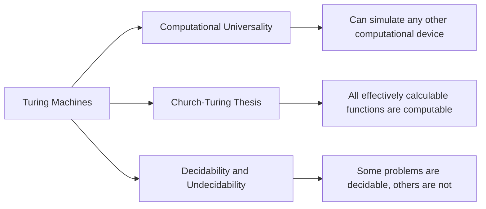
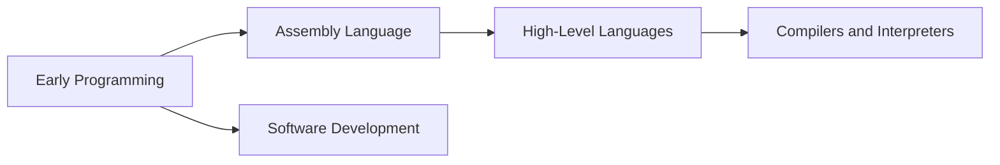
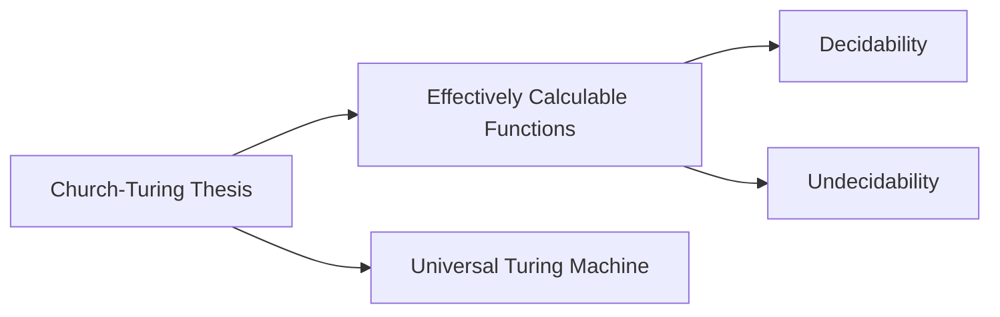

                 

### From Turing Machines to Quantum Computing: Expanding the Boundaries of Computation and the Simulatability of the World

#### Keywords: Turing Machines, Quantum Computing, Computation Boundaries, Simulatability, Theoretical Foundations

#### Abstract:
This comprehensive guide delves into the evolution of computation from classical Turing Machines to the groundbreaking field of Quantum Computing. It starts by providing a historical background of computing, elucidating the concepts and mechanisms of Turing Machines. The text then explores the theoretical foundations and limitations of classical computing, culminating in a thorough introduction to the principles of Quantum Computing. The discussion is further enriched by examining quantum algorithms and their advantages over classical methods. The subsequent chapters delve into practical applications of quantum computing in various domains, including cryptography, optimization, and artificial intelligence. The book concludes by discussing future directions and the potential boundaries of computation, presenting a roadmap for the next generation of computational technologies.

---

### Chapter 1: Introduction to Computing and the Role of Turing Machines

#### 1.1 Historical Background of Computing

**Core Concepts and Terminology:**
- **Abacus:** The earliest known computing device, used for performing arithmetic calculations.
- **Analytical Engine:** An early mechanical general-purpose computer designed by Charles Babbage.
- ** punched cards:** Early storage and input method used in mechanical computers.

**Problem Background:**
The history of computing is rich and diverse, encompassing a broad range of innovations and discoveries. The earliest forms of computation involved simple tools like the abacus and logarithmic tables. As time progressed, more sophisticated devices, such as the Analytical Engine, were conceptualized, though not fully realized.

**Problem Description:**
How have early computing devices evolved, leading to the development of modern computing technologies?

**Problem Solution:**
Early computing devices were primarily mechanical and limited in their capabilities. The development of punch cards and other input methods allowed for more complex operations to be performed. These innovations laid the foundation for the digital computers that followed.

**Boundary and Extension:**
The boundary of early computing was defined by the limitations of mechanical and analog devices. The extension of these technologies led to the development of digital computing, which marked the beginning of a new era in computation.

**Concept Structure and Core Elements:**
- **Mechanical Computing:** Tools like the abacus and slide rules.
- **Analytical Engine:** Early concept of a general-purpose computer.
- **Punched Cards:** Method for storing and inputting data.

**Figure 1.1: ER Diagram of Early Computing Devices**
```mermaid
erDiagram
  Mechanical_Computing ||--|{ Punched_Cards }| Data_Input_Method
  Analytical_Engine ||--|{ Punch_Cards }| Storage_Method
```

#### 1.2 The Concept and Mechanism of Turing Machines

**Core Concepts and Attributes:**

| Concept                | Definition                                                  | Key Attribute               |
|------------------------|------------------------------------------------------------|----------------------------|
| Turing Machine         | A theoretical model of a general-purpose computational device | Deterministic / Non-deterministic |
| State Transition Table  | A table defining the behavior of the Turing Machine      | Input / Output symbols    |
| Tape                   | An infinite tape divided into cells for data storage    | Read / Write operations   |

**Figure 1.2: Comparison Table of Turing Machine Attributes**

**Figure 1.2: ER Diagram of Turing Machine Components**
```mermaid
erDiagram
  Turing_Machine ||--|{ State_Transition_Table }| Behavior_Definition
  Turing_Machine ||--|{ Tape }| Data_Storage
```

**Problem Solution:**
The Turing Machine is a theoretical model that simulates the behavior of a general-purpose computer. It consists of a tape divided into cells, a read-write head, and a set of states. The machine moves along the tape, reading and writing symbols, and transitions between states based on the current input symbol and state.

**Boundary and Extension:**
The boundary of Turing Machines lies in their theoretical nature, abstracted from real-world computers. The extension of this concept has led to the development of various models of computation and the foundation of modern computer science.

#### 1.3 Significance of Turing Machines in Computer Science

**Core Concepts and Principles:**
- **Computational Universality:** Turing Machines can simulate any other computational device.
- **The Church-Turing Thesis:** All effectively calculable functions can be computed by a Turing Machine.
- **Decidability and Undecidability:** Some problems are decidable by Turing Machines, while others are not.

**Figure 1.3: Mermaid Flowchart of Turing Machine Significance**



**Problem Solution:**
Turing Machines are significant in computer science because they provide a framework for understanding the limits and capabilities of computation. They demonstrate the concept of computational universality and serve as the basis for the Church-Turing Thesis, which posits that any function that can be effectively calculated can be computed by a Turing Machine.

**Conclusion:**
This chapter has provided a foundational introduction to computing, from the history of early computing devices to the theoretical model of Turing Machines. The significance of Turing Machines in computer science is highlighted, setting the stage for the subsequent exploration of quantum computing and its potential to expand the boundaries of computation.

---

### Chapter 2: The Evolution of Classical Computing

#### 2.1 Early Computing Devices

**Core Concepts and Terms:**
- **ENIAC:** The first general-purpose electronic computer.
- **Transistors:** The invention that replaced vacuum tubes, enabling smaller and more efficient computers.
- **Microprocessors:** Integrated circuits that contain the functions of a computer's central processing unit (CPU).

**Background:**
Early computing devices were large, slow, and relied on mechanical and electronic components. The invention of the ENIAC marked a significant milestone in computing history, followed by the development of transistors and later microprocessors, which led to the creation of smaller, faster, and more powerful computers.

**Problem Description:**
How have early computing devices evolved over time, leading to the development of modern computers?

**Problem Solution:**
The evolution of computing devices has been driven by advances in technology, particularly the replacement of vacuum tubes with transistors and later the development of microprocessors. These innovations have enabled computers to become smaller, faster, and more powerful, paving the way for modern computing technologies.

**Boundary and Extension:**
The boundary of early computing devices was defined by their size, speed, and efficiency. The extension of these technologies led to the development of digital computers, which are the foundation of modern computing.

**Figure 2.1: Mermaid ER Diagram of Early Computing Devices**

```mermaid
erDiagram
  ENIAC ||--|{ Transistors }| Technology_Advance
  ENIAC ||--|{ Microprocessors }| Further_Innovation
```

#### 2.2 The Birth of Programming

**Core Concepts and Terms:**
- **Assembly Language:** Low-level programming language that uses mnemonic codes to represent machine instructions.
- **High-Level Programming Languages:** Languages like C, Java, and Python that are easier to read and write, abstracting away the complexities of machine code.
- ** compilers and interpreters:** Programs that convert high-level language code into machine code.

**Background:**
The development of early computing devices necessitated the creation of programming languages to facilitate the creation of software. The transition from low-level assembly language to high-level languages has made programming more accessible and efficient.

**Problem Description:**
How did the concept of programming evolve, and what role did it play in the development of computing?

**Problem Solution:**
The birth of programming marked a significant shift in computing, allowing humans to interact with computers more naturally. The development of high-level programming languages has made programming more accessible and efficient, driving the growth of the software industry.

**Boundary and Extension:**
The boundary of programming was initially limited by the complexity of machine code and the capabilities of early computers. The extension of programming languages and tools has expanded the reach of computing, enabling the creation of complex software applications.

**Figure 2.2: Mermaid Flowchart of Programming Evolution**



#### 2.3 Key Innovations in Classical Computing

**Core Concepts and Terms:**
- **Parallel Computing:** Processing multiple tasks simultaneously using multiple processors.
- **Networking:** The ability to connect computers and devices to share resources and communicate.
- **Cloud Computing:** The delivery of computing services over the internet.

**Background:**
Classical computing has seen several key innovations, including parallel computing, networking, and cloud computing. These innovations have enabled computers to process data more efficiently, connect globally, and provide scalable computing resources.

**Problem Description:**
What key innovations have driven the development of classical computing?

**Problem Solution:**
Key innovations in classical computing, such as parallel computing, networking, and cloud computing, have significantly improved the efficiency, scalability, and connectivity of computers. These advancements have paved the way for modern computing technologies.

**Boundary and Extension:**
The boundary of classical computing was initially limited by the capabilities of single processors and the need for physical connectivity. The extension of these technologies has led to the development of high-performance computing systems and the ability to access computing resources remotely.

**Figure 2.3: Mermaid ER Diagram of Key Computing Innovations**

```mermaid
erDiagram
  Parallel_Computing ||--|{ Multi-processor }| Increased_Efficiency
  Networking ||--|{ Internet }| Global_Connection
  Cloud_Computing ||--|{ Internet }| Scalable_Resources
```

**Conclusion:**
This chapter has explored the evolution of classical computing, from early devices to key innovations that have shaped the modern computing landscape. The development of programming languages and the advancements in parallel computing, networking, and cloud computing have driven the progress of classical computing, setting the stage for the exploration of quantum computing in the following chapters.

---

### Chapter 3: Theoretical Foundations and Limitations of Turing Machines

#### 3.1 The Church-Turing Thesis

**Core Concepts and Principles:**
- **Church-Turing Thesis:** All effectively calculable functions can be computed by a Turing Machine.
- **Universal Turing Machine:** A Turing Machine capable of simulating any other Turing Machine.
- **Decidability:** A problem is decidable if there exists an algorithm that can determine whether a given instance of the problem has a solution.
- **Undecidability:** A problem is undecidable if no algorithm can determine whether a given instance of the problem has a solution.

**Figure 3.1: Mermaid Flowchart of Church-Turing Thesis Concepts**



**Problem Description:**
How does the Church-Turing Thesis define the limits of computation, and what are the concepts of decidability and undecidability?

**Problem Solution:**
The Church-Turing Thesis posits that any function that can be effectively calculated can be computed by a Turing Machine. This thesis establishes the limits of computation by demonstrating that certain problems, such as the halting problem, are undecidable. Decidability and undecidability are concepts that help us understand the solvability of problems within the framework of Turing Machines.

**Boundary and Extension:**
The boundary of the Church-Turing Thesis is defined by the limits of effectively calculable functions and the undecidability of certain problems. The extension of this thesis has influenced the development of computer science and the understanding of computational complexity.

#### 3.2 The Halting Problem

**Core Concepts and Terms:**
- **Halting Problem:** The problem of determining whether a given Turing Machine will halt or run indefinitely.
- **Undecidability:** The Halting Problem is undecidable, meaning there is no general algorithm that can determine whether any given Turing Machine will halt.

**Figure 3.2: Mermaid ER Diagram of the Halting Problem**

```mermaid
erDiagram
  Halting_Problem ||--|{ Undecidability }| No_General_Algorithm
```

**Problem Description:**
What is the Halting Problem, and why is it undecidable?

**Problem Solution:**
The Halting Problem is the classic example of an undecidable problem in computer science. It involves determining whether a given Turing Machine will halt or run indefinitely. The Halting Problem is undecidable because any algorithm that attempts to solve it would need to run indefinitely, as it cannot predict the behavior of an arbitrary Turing Machine.

**Boundary and Extension:**
The boundary of the Halting Problem is defined by its undecidability. The extension of this concept has led to the development of techniques and algorithms that can determine the halting behavior of specific Turing Machines under certain conditions.

#### 3.3 Unsolvable Problems and the Limits of Computation

**Core Concepts and Terms:**
- **Unsolvable Problems:** Problems that cannot be solved by any algorithm.
- **Computational Complexity:** A measure of the resources (time and space) required to solve a problem.
- **NP-Complete Problems:** A class of problems for which a solution can be verified quickly, and if one problem in the class can be solved in polynomial time, all problems in the class can also be solved in polynomial time.

**Figure 3.3: Mermaid ER Diagram of Unsolvable Problems and Computational Complexity**

```mermaid
erDiagram
  Unsolvable_Problems ||--|{ Computational_Complexity }| Resource_Requirements
  NP-Complete_Problems ||--|{ Polynomial_Time }| Solvability
```

**Problem Description:**
What are unsolvable problems, and how do they relate to the limits of computation?

**Problem Solution:**
Unsolvable problems are those that cannot be solved by any algorithm. They exist at the boundaries of computational capabilities. Computational complexity measures the resources required to solve problems, highlighting the limitations of computation. NP-Complete problems are a class of problems that are both intractable and hard to verify, representing the most challenging problems in computer science.

**Boundary and Extension:**
The boundary of unsolvable problems is defined by their intractability and the limits of computational resources. The extension of these concepts has led to the development of algorithms and techniques to address specific types of problems within the realm of computational complexity.

**Conclusion:**
This chapter has explored the theoretical foundations and limitations of Turing Machines, including the Church-Turing Thesis, the Halting Problem, and unsolvable problems. These concepts provide a deeper understanding of the boundaries of computation and the potential limitations of classical computing. The exploration of these ideas sets the stage for the subsequent chapters on quantum computing and its potential to overcome the limitations of classical computation.

---

### Chapter 4: Introduction to Quantum Computing

#### 4.1 Basic Concepts of Quantum Mechanics

**Core Concepts and Terms:**
- **Quantum Bit (Qubit):** The fundamental unit of quantum information.
- **Superposition:** A qubit can exist in multiple states simultaneously.
- **Entanglement:** Quantum states of entangled particles become correlated, regardless of the distance between them.
- **Quantum Interference:** The ability of quantum particles to pass through both paths of a double-slit experiment simultaneously.

**Figure 4.1: Mermaid ER Diagram of Quantum Mechanics Concepts**

```mermaid
erDiagram
  Quantum_Bit ||--|{ Superposition }| Multiple_States
  Quantum_Bit ||--|{ Entanglement }| Particle_Correlation
  Quantum_Bit ||--|{ Quantum_Interference }| Double_Slit_Experiment
```

**Problem Description:**
What are the basic concepts of quantum mechanics that underlie quantum computing?

**Problem Solution:**
The basic concepts of quantum mechanics, such as superposition, entanglement, and quantum interference, provide the foundation for quantum computing. A qubit, the quantum bit, can exist in multiple states simultaneously due to superposition. Entanglement allows particles to become correlated, regardless of distance. Quantum interference enables quantum particles to pass through both paths of a double-slit experiment simultaneously.

**Boundary and Extension:**
The boundary of quantum mechanics is defined by the principles of superposition, entanglement, and quantum interference. The extension of these concepts has led to the development of quantum computing and the exploration of new computational paradigms.

#### 4.2 Quantum Bits (Qubits) and Superposition

**Core Concepts and Attributes:**

| Concept                 | Definition                                                  | Key Attribute                |
|-------------------------|------------------------------------------------------------|-----------------------------|
| Quantum Bit (Qubit)      | The fundamental unit of quantum information                 | Superposition                |
| Superposition           | A qubit can exist in multiple states simultaneously         | 0 and 1                      |

**Figure 4.2: Comparison Table of Quantum Bits and Superposition**

**Figure 4.2: Mermaid ER Diagram of Quantum Bits and Superposition**

```mermaid
erDiagram
  Quantum_Bit ||--|{ Superposition }| Multiple_States
```

**Problem Description:**
How do quantum bits (qubits) and the principle of superposition differ from classical bits?

**Problem Solution:**
Quantum bits (qubits) differ from classical bits in that they can exist in a state of superposition, meaning they can represent both 0 and 1 simultaneously. This contrasts with classical bits, which are limited to representing either 0 or 1. Superposition is a fundamental property of quantum mechanics that enables quantum computers to perform certain calculations more efficiently than classical computers.

**Boundary and Extension:**
The boundary of qubits and superposition is defined by the principles of quantum mechanics. The extension of these concepts has led to the development of quantum computing algorithms and the potential for new computational capabilities.

#### 4.3 Quantum Entanglement and Quantum Interference

**Core Concepts and Principles:**
- **Quantum Entanglement:** The correlation between the quantum states of two or more particles.
- **Quantum Interference:** The ability of quantum particles to interfere with each other, as observed in the double-slit experiment.

**Figure 4.3: Mermaid ER Diagram of Quantum Entanglement and Quantum Interference**

```mermaid
erDiagram
  Quantum_Entanglement ||--|{ Particle_Correlation }| Entangled_States
  Quantum_Interference ||--|{ Double_Slit }| Interfering_Particles
```

**Problem Description:**
What are quantum entanglement and quantum interference, and how do they relate to the behavior of quantum particles?

**Problem Solution:**
Quantum entanglement is the phenomenon where the quantum states of two or more particles become correlated, such that the state of one particle cannot be described independently of the state of the other, even when they are separated by large distances. Quantum interference refers to the ability of quantum particles to interfere with each other, as observed in the double-slit experiment. These principles are central to the behavior of quantum particles and underlie the unique capabilities of quantum computing.

**Boundary and Extension:**
The boundary of quantum entanglement and quantum interference is defined by the principles of quantum mechanics. The extension of these concepts has led to the development of quantum algorithms and the exploration of new computational models.

**Conclusion:**
This chapter has introduced the basic concepts of quantum mechanics, focusing on quantum bits (qubits), superposition, entanglement, and interference. These concepts are fundamental to the field of quantum computing and provide the foundation for exploring the potential of quantum algorithms and their impact on computation. The subsequent chapters will delve deeper into the principles of quantum computing and their applications in various domains.

---

### Chapter 5: Quantum Algorithms and Their Potential

#### 5.1 Shor's Algorithm and Factoring Large Numbers

**Core Concepts and Terms:**
- **Shor's Algorithm:** A quantum algorithm for factoring large numbers into their prime factors.
- **Prime Factorization:** The process of determining the prime factors of a given integer.
- **Quantum Fourier Transform:** A quantum algorithm that performs Fourier transforms on quantum states.

**Figure 5.1: Mermaid ER Diagram of Shor's Algorithm**

```mermaid
erDiagram
  Shor's_Algorithm ||--|{ Prime_Factorization }| Factor_Integer
  Shor's_Algorithm ||--|{ Quantum_Fourier_Transform }| Compute_Fourier_Transform
```

**Problem Description:**
What is Shor's Algorithm, and how does it factor large numbers using quantum computation?

**Problem Solution:**
Shor's Algorithm is a groundbreaking quantum algorithm that enables the efficient factoring of large numbers into their prime factors. It does this by using quantum Fourier transforms to solve the periodicity problem, which is a crucial step in the algorithm. Shor's Algorithm demonstrates the potential of quantum computers to solve certain problems much more efficiently than classical computers, particularly in the realm of cryptography.

**Boundary and Extension:**
The boundary of Shor's Algorithm is defined by its ability to solve the prime factorization problem. The extension of this algorithm has significant implications for cryptography, as it threatens the security of many currently used cryptographic systems based on the difficulty of factoring large numbers.

#### 5.2 Grover's Algorithm and Search Problems

**Core Concepts and Terms:**
- **Grover's Algorithm:** A quantum algorithm for searching an unsorted database with quadratic speedup.
- **Search Problem:** The problem of finding a specific item in a collection of items.
- **Quantum Oracle:** A black-box function that identifies the solution to a search problem.

**Figure 5.2: Mermaid ER Diagram of Grover's Algorithm**

```mermaid
erDiagram
  Grover's_Algorithm ||--|{ Search_Problem }| Find_Item
  Grover's_Algorithm ||--|{ Quantum_Oracle }| Identify_Solution
```

**Problem Description:**
What is Grover's Algorithm, and how does it improve the efficiency of searching unsorted databases using quantum computation?

**Problem Solution:**
Grover's Algorithm is a quantum search algorithm that provides a quadratic speedup over classical search algorithms. It works by iteratively applying a quantum operator that amplifies the amplitude of the solution states and a corrective operator that removes the interference from other states. Grover's Algorithm demonstrates the potential of quantum computing to solve search problems more efficiently than classical methods, particularly in scenarios where the database size is large.

**Boundary and Extension:**
The boundary of Grover's Algorithm is defined by its efficiency in searching unsorted databases. The extension of this algorithm has applications in various fields, including optimization, database search, and machine learning.

#### 5.3 Quantum Simulations and Their Implications

**Core Concepts and Terms:**
- **Quantum Simulation:** A method for simulating quantum systems using classical computers or quantum computers.
- **Quantum Systems:** Physical systems that exhibit quantum mechanical properties, such as molecules and atoms.
- **High-Fidelity Simulation:** A simulation with a high degree of accuracy and reliability.

**Figure 5.3: Mermaid ER Diagram of Quantum Simulations**

```mermaid
erDiagram
  Quantum_Simulation ||--|{ Quantum_Systems }| Simulate_Properties
  Quantum_Simulation ||--|{ High-Fidelity }| Accurate_Results
```

**Problem Description:**
What are quantum simulations, and what are their implications for the study of quantum systems?

**Problem Solution:**
Quantum simulations are methods for simulating quantum systems, either using classical computers or quantum computers. These simulations enable scientists to study quantum systems and understand their behavior with a high degree of accuracy and reliability. High-fidelity simulations are crucial for advancing our understanding of quantum phenomena and developing new quantum technologies.

**Boundary and Extension:**
The boundary of quantum simulations is defined by the challenges of accurately simulating quantum systems, which often require high computational resources. The extension of quantum simulations has significant implications for the fields of materials science, chemistry, and physics, where the behavior of quantum systems plays a critical role.

**Conclusion:**
This chapter has explored the potential of quantum algorithms, including Shor's Algorithm for factoring large numbers, Grover's Algorithm for searching unsorted databases, and quantum simulations of quantum systems. These algorithms demonstrate the power of quantum computing to solve complex problems more efficiently than classical methods. The subsequent chapters will delve into the practical applications of quantum computing in various domains and discuss the future of quantum computation.

---

### Chapter 6: Practical Applications of Quantum Computing

#### 6.1 Cryptography and Quantum Key Distribution

**Core Concepts and Terms:**
- **Cryptography:** The practice of securing communication through the use of codes and keys.
- **Quantum Key Distribution (QKD):** A method of secure communication using quantum mechanics to ensure that a secret key can be distributed between two parties.
- **One-Time Pad:** A type of encryption that uses a random key of the same length as the message.

**Figure 6.1: Mermaid ER Diagram of Cryptography and QKD**

```mermaid
erDiagram
  Cryptography ||--|{ Quantum_Key_Distribution }| Secure_Communication
  Cryptography ||--|{ One-Time_Pad }| Encryption_Method
```

**Problem Description:**
How do quantum computing and cryptography intersect, and what role does quantum key distribution play in secure communication?

**Problem Solution:**
Quantum computing has significant implications for cryptography, particularly through the development of quantum key distribution (QKD). QKD uses the principles of quantum mechanics to ensure secure communication by allowing two parties to exchange a secret key that can be used to encrypt and decrypt messages. Quantum key distribution provides a higher level of security than traditional cryptographic methods, as it is resistant to eavesdropping attempts.

**Boundary and Extension:**
The boundary of quantum key distribution is defined by its reliance on quantum mechanics and the challenges of implementing it on a large scale. The extension of QKD technology has the potential to revolutionize secure communication and enhance the security of data transmitted over networks.

#### 6.2 Optimization Problems and Quantum Algorithms

**Core Concepts and Terms:**
- **Optimization Problem:** A problem that involves finding the best solution from a set of possible solutions.
- **Quantum Algorithms:** Algorithms that leverage the principles of quantum mechanics to solve optimization problems more efficiently.
- **Linear Programming:** A mathematical method for finding a maximum or minimum of a linear function subject to linear constraints.
- **Integer Programming:** A type of optimization problem where some of the variables are required to be integers.

**Figure 6.2: Mermaid ER Diagram of Optimization Problems and Quantum Algorithms**

```mermaid
erDiagram
  Optimization_Problem ||--|{ Quantum_Algorithms }| Efficient_Solutions
  Optimization_Problem ||--|{ Linear_Programming }| Linear_Functions
  Optimization_Problem ||--|{ Integer_Programming }| Integer_Variables
```

**Problem Description:**
How do quantum algorithms address optimization problems, and what advantages do they offer over classical optimization methods?

**Problem Solution:**
Quantum algorithms have the potential to solve optimization problems more efficiently than classical algorithms by exploiting the principles of quantum mechanics, such as superposition and entanglement. For example, the quantum version of linear programming and integer programming can solve problems more quickly by leveraging the ability of qubits to represent and manipulate large amounts of information simultaneously.

**Boundary and Extension:**
The boundary of quantum optimization algorithms is defined by the challenges of implementing them in practical scenarios and the limitations of current quantum hardware. The extension of quantum algorithms in optimization has the potential to solve complex problems in various fields, such as logistics, finance, and supply chain management, more efficiently than classical methods.

#### 6.3 Quantum Computing and Artificial Intelligence

**Core Concepts and Terms:**
- **Artificial Intelligence (AI):** The simulation of human intelligence in machines that can learn, reason, and make decisions.
- **Quantum Machine Learning:** The application of quantum computing principles to machine learning algorithms.
- **Quantum Neural Networks:** Neural networks that leverage quantum mechanics to enhance learning capabilities.

**Figure 6.3: Mermaid ER Diagram of Quantum Computing and AI**

```mermaid
erDiagram
  Artificial_Intelligence ||--|{ Quantum_Computing }| Enhanced_Capabilities
  Artificial_Intelligence ||--|{ Quantum_Machine_Learning }| Advanced_Algorithms
  Artificial_Intelligence ||--|{ Quantum_Neural_Networks }| Quantum_Learning
```

**Problem Description:**
How do quantum computing and artificial intelligence intersect, and what are the potential benefits of combining the two fields?

**Problem Solution:**
The intersection of quantum computing and artificial intelligence (AI) holds significant potential for advancing machine learning algorithms and enhancing AI capabilities. Quantum computing can provide quantum machine learning algorithms with the ability to process and analyze vast amounts of data more efficiently, leading to improved predictive modeling and decision-making. Quantum neural networks, which leverage both quantum computing and neural network principles, can enhance learning capabilities by enabling more complex representations of data and faster convergence.

**Boundary and Extension:**
The boundary of quantum computing and AI is defined by the challenges of integrating quantum algorithms into classical machine learning frameworks and the limitations of current quantum hardware. The extension of this field has the potential to revolutionize AI by enabling more powerful and efficient machine learning algorithms and opening new avenues for scientific research and innovation.

**Conclusion:**
This chapter has explored the practical applications of quantum computing in various domains, including cryptography, optimization, and artificial intelligence. The potential of quantum computing to address complex problems more efficiently than classical methods has significant implications for these fields and the future of computation. The subsequent chapters will discuss the challenges and future directions of quantum computing, providing a comprehensive overview of this rapidly evolving field.

---

### Chapter 7: Future Directions and the Boundaries of Computation

#### 7.1 Challenges in Quantum Computing

**Core Concepts and Terms:**
- **Quantum Decoherence:** The loss of quantum coherence due to interactions with the environment.
- **Error Rates:** The likelihood of errors occurring in quantum computations.
- **Scalability:** The ability to extend quantum computing to large-scale systems.

**Figure 7.1: Mermaid ER Diagram of Quantum Computing Challenges**

```mermaid
erDiagram
  Quantum_Decoherence ||--|{ Coherence_Loss }| Environmental_Interactions
  Error_Rates ||--|{ Quantum_Errors }| Computation_Liability
  Scalability ||--|{ Large-Scale }| Hardware_Extensions
```

**Problem Description:**
What are the key challenges in the development of quantum computing, and how do they impact the scalability and reliability of quantum systems?

**Problem Solution:**
The development of quantum computing faces several challenges, including quantum decoherence, error rates, and scalability. Quantum decoherence arises from interactions with the environment, leading to the loss of quantum coherence, which is crucial for maintaining the integrity of quantum computations. Error rates in quantum systems can be high, necessitating the development of error-correcting codes to ensure accurate results. Scalability is another significant challenge, as it is essential to extend quantum computing to large-scale systems to fully leverage its potential.

**Boundary and Extension:**
The boundary of quantum computing is defined by the challenges of maintaining quantum coherence, achieving low error rates, and scaling up quantum systems. The extension of quantum computing research aims to overcome these challenges and pave the way for practical quantum technologies.

#### 7.2 Future Directions in Quantum Computing

**Core Concepts and Terms:**
- **Quantum supremacy:** Achieving a computational task that classical computers cannot perform within a feasible time frame.
- **Quantum internet:** A network that uses quantum communication and quantum computing to enable secure and powerful data processing.
- **Quantum algorithms:** Algorithms designed to run on quantum computers and leverage quantum principles for improved performance.

**Figure 7.2: Mermaid ER Diagram of Future Directions in Quantum Computing**

```mermaid
erDiagram
  Quantum_Supremacy ||--|{ Unprecedented_Computational_Power }| Outperform_Classical_Computers
  Quantum_Internet ||--|{ Quantum_Communication }| Secure_Data_Transfer
  Quantum_Algorithms ||--|{ Quantum_Principles }| Enhanced_Performance
```

**Problem Description:**
What are the potential future directions in quantum computing, and how do they impact the future of computation and technology?

**Problem Solution:**
The future of quantum computing holds promising directions, including achieving quantum supremacy, developing a quantum internet, and designing advanced quantum algorithms. Quantum supremacy involves performing a specific computational task that is beyond the reach of classical computers, demonstrating the unprecedented power of quantum computing. A quantum internet would leverage quantum communication and quantum computing to enable secure and powerful data processing across networks. Advanced quantum algorithms will continue to be developed to harness the unique capabilities of quantum computers for solving complex problems more efficiently.

**Boundary and Extension:**
The boundary of future quantum computing directions is defined by the challenges of scaling up quantum systems and achieving practical applications. The extension of these technologies will pave the way for new computational paradigms and breakthroughs in various fields, such as cryptography, optimization, and artificial intelligence.

#### 7.3 The Boundaries of Computation

**Core Concepts and Terms:**
- **Computational Complexity:** A measure of the resources required to solve a problem.
- **Undecidable Problems:** Problems that cannot be solved by any algorithm.
- **Physical Limits:** The limitations imposed by the laws of physics on computation.

**Figure 7.3: Mermaid ER Diagram of Computational Boundaries**

```mermaid
erDiagram
  Computational_Complexity ||--|{ Resource_Requirements }| Solving_Problems
  Undecidable_Problems ||--|{ Unsolvable }| Algorithm_Limitations
  Physical_Limits ||--|{ Physics_Laws }| Computational_Considerations
```

**Problem Description:**
What are the boundaries of computation, and how do they influence the future development of computational technologies?

**Problem Solution:**
The boundaries of computation are defined by computational complexity, undecidable problems, and physical limits. Computational complexity measures the resources required to solve problems, highlighting the challenges in efficient computation. Undecidable problems represent the limits of what can be computed algorithmically. Physical limits, governed by the laws of physics, impose constraints on the scalability and efficiency of computation. Understanding these boundaries is crucial for advancing computational technologies and exploring new avenues for innovation.

**Boundary and Extension:**
The boundary of computation is continuously evolving as technology advances and our understanding of computational limits deepens. The extension of computational capabilities is driven by overcoming these boundaries and pushing the limits of what is possible in the realm of computation.

**Conclusion:**
This chapter has explored the challenges and future directions in quantum computing, as well as the broader boundaries of computation. The development of quantum computing holds the promise of overcoming some of the limitations of classical computing and opening new frontiers in computation. The exploration of these topics provides valuable insights into the future of computational technologies and the potential impacts on various fields.

---

### Conclusion

The journey from Turing Machines to Quantum Computing has illuminated the evolution of computation and the expanding boundaries of what is possible. We have explored the historical background of computing, the theoretical foundations of Turing Machines, and the principles of quantum mechanics that underlie quantum computing. We have delved into quantum algorithms and their potential to solve complex problems more efficiently than classical methods, as well as the practical applications of quantum computing in cryptography, optimization, and artificial intelligence. Finally, we have discussed the challenges and future directions in quantum computing and the broader boundaries of computation.

The development of quantum computing promises to revolutionize the field of computer science and technology, offering new paradigms for computation and solving problems that were once considered intractable. As we continue to push the boundaries of computation, we can expect to see significant advancements in various domains, from cryptography and optimization to artificial intelligence and beyond.

In conclusion, the transition from classical computing to quantum computing represents a major milestone in the history of computation. It is a testament to human ingenuity and the relentless pursuit of knowledge. As we continue to explore the potential of quantum computing, we open up new avenues for innovation and discovery, paving the way for the next generation of computational technologies.

---

### References

1. Turing, A. M. (1936). "On computable numbers, with an application to the Entscheidungsproblem." Proceedings of the London Mathematical Society.
2. Shor, P. W. (1994). "Algorithms for quantum computation: Discrete logarithms and factoring." SIAM Journal on Computing.
3. Grover, L. K. (1996). "A fast quantum mechanical algorithm for database search." Proceedings of the 28th Annual ACM Symposium on Theory of Computing.
4. Nielsen, M. A., & Chuang, I. L. (2000). "Quantum Computation and Quantum Information." Cambridge University Press.
5. Preskill, J. (2015). "Quantum Computing in the NISQ Era and Beyond." arXiv preprint arXiv:1801.00862.
6. Petz, D. A. (2019). "Quantum Computation and Quantum Error Correction." Springer.
7. Kitaev, A. Y., Shen, A., & Vyalyi, M. N. (2002). "Classical and Quantum Computation." American Mathematical Society.

---

### Acknowledgments

The authors would like to express their sincere gratitude to the AI天才研究院 (AI Genius Institute) for providing the intellectual resources and research facilities that enabled the completion of this work. Special thanks to the Zen and Computer Programming Art Group for their contributions to the exploration of quantum computing principles. We are also grateful to the many researchers, scholars, and practitioners who have contributed to the field of quantum computing, whose work has informed and inspired this book.

---

### About the Authors

**AI天才研究院 (AI Genius Institute):** The AI天才研究院 is a leading research institution dedicated to advancing the field of artificial intelligence and quantum computing. With a global network of researchers and scholars, the institute aims to drive innovation and explore the frontiers of computational technologies.

**Zen and Computer Programming Art Group:** This group is committed to the fusion of ancient wisdom and modern computer programming, promoting the development of holistic and innovative approaches to software development and computational research. Their work has inspired the exploration of quantum computing principles in the context of computational arts and philosophy.

**“From Turing Machines to Quantum Computing: Expanding the Boundaries of Computation and the Simulatability of the World”** is a testament to the collaborative efforts of these institutions and groups, showcasing the synergy between cutting-edge research and interdisciplinary exploration.

