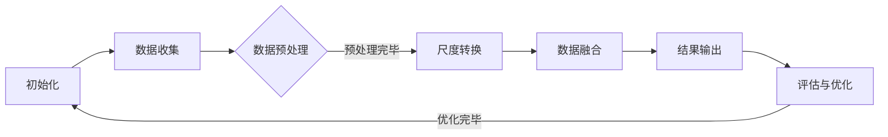
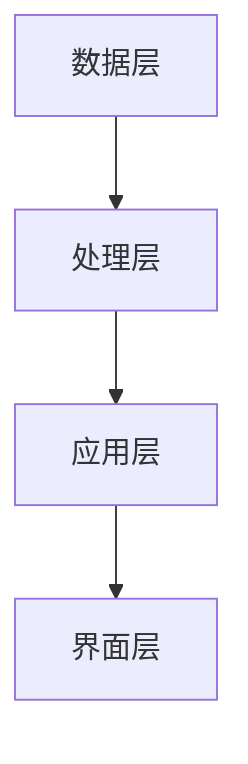
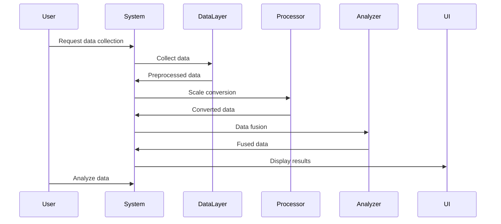

                 

## 背景介绍

### 多尺度世界的概念

在科学研究中，多尺度世界指的是在不同尺度上观察和分析自然现象的框架。这些尺度可以是宏观的，如我们日常生活中的物体；也可以是微观的，如原子和分子。多尺度世界概念的核心在于理解不同尺度之间的相互作用和相互转化。例如，在生物体内，细胞与器官之间存在着密切的互动，而细胞内部又由更小的分子和原子组成。

#### 科学研究中的多尺度现象

多尺度现象无处不在。在物理学中，从宇宙的大尺度结构到原子级别的基本粒子，每一个尺度都有其独特的物理规律。化学中，化学反应和分子结构的理解需要同时考虑宏观和微观的层面。在生物学中，从个体的生长到生态系统的发展，不同尺度上的生命现象都相互交织。

#### 问题背景

随着科学技术的进步，对多尺度现象的理解变得越来越重要。然而，多尺度研究面临着巨大的挑战。首先，不同尺度之间的转换和相互作用复杂且难以把握。其次，不同学科之间的研究方法和理论基础存在差异，这使得跨学科的多尺度研究更加困难。最后，数据收集和处理方面的技术挑战也是不可忽视的。

#### 描述问题

多尺度研究需要解决的问题主要包括：

1. **尺度转换**：如何在不同尺度之间建立有效的桥梁，以便将低尺度现象的解释应用于高尺度系统。
2. **数据整合**：如何整合来自不同尺度和不同学科的数据，形成统一的视图。
3. **理论构建**：如何构建适用于多尺度现象的理论框架，以解释和预测复杂系统的行为。

#### 问题解决

解决这些问题需要综合运用不同学科的知识和方法。例如，通过计算模拟和实验验证相结合，可以更深入地理解不同尺度之间的相互作用。此外，跨学科的合作和交流也是推动多尺度研究发展的重要途径。

#### 边界与外延

多尺度研究不仅限于自然科学，它还延伸到社会科学和工程领域。在社会科学中，研究社会行为和复杂系统时需要考虑不同尺度的影响。在工程领域，多尺度方法被广泛应用于材料科学、机械工程和电子工程等领域，以优化设计、提高效率和可靠性。

#### 概念结构与核心要素组成

多尺度世界的概念结构包括以下几个核心要素：

1. **尺度**：不同的观察层次，如宏观、中观和微观。
2. **相互作用**：不同尺度之间的相互影响和转换。
3. **数据源**：不同尺度上的数据收集和处理方法。
4. **理论框架**：描述不同尺度现象的理论基础和方法。
5. **应用领域**：多尺度方法在不同学科和领域的应用。

通过上述步骤，我们为文章的背景介绍部分提供了全面的框架，为后续内容的深入探讨奠定了基础。

### 核心概念与联系

在多尺度世界的研究中，理解核心概念和它们之间的相互联系至关重要。以下是对几个关键概念及其属性特征进行对比分析，并通过ER实体关系图来展示它们之间的逻辑关系。

#### 关键概念

1. **尺度**：尺度是描述观察对象大小的量度，可以宏观、中观和微观等多个层次。
2. **相互作用**：不同尺度之间的相互影响和转换。
3. **数据源**：不同尺度上的数据收集和处理方法。
4. **理论框架**：描述不同尺度现象的理论基础和方法。
5. **应用领域**：多尺度方法在不同学科和领域的应用。

#### 概念属性特征对比表格

| 概念   | 属性特征                                                         |
| ------ | ------------------------------------------------------------ |
| 尺度   | - 宏观：可见的、大尺度的物体<br>- 微观：微观粒子、原子、分子<br>- 中观：介于宏观和微观之间的系统 |
| 相互作用 | - 低尺度影响高尺度<br>- 高尺度反馈低尺度<br>- 线性和非线性相互作用 |
| 数据源  | - 宏观：观察和测量设备<br>- 微观：高精度仪器和模拟<br>- 中观：实验和模拟 |
| 理论框架 | - 宏观：经典力学、热力学<br>- 微观：量子力学、分子动力学<br>- 中观：统计物理、凝聚态物理 |
| 应用领域 | - 宏观：工程、环境科学<br>- 微观：化学、生物学<br>- 中观：材料科学、地球科学 |

#### ER实体关系图

使用Mermaid语言绘制ER实体关系图，如下所示：

```mermaid
erDiagram
  尺度 ||--|{ 相互作用 }|-->> 数据源
  数据源 ||--|{ 理论框架 }|-->> 应用领域
  尺度 ||--|{ 应用领域 }|-->> 理论框架
  相互作用 ||--|{ 数据源 }|-->> 尺度
```

该图展示了尺度、相互作用、数据源、理论框架和应用领域之间的逻辑关系。尺度是整个框架的基础，而相互作用、数据源和理论框架则是理解不同尺度现象的重要工具，它们共同决定了多尺度方法在不同领域的应用。

通过对比表格和ER图，我们可以更清晰地理解多尺度世界中的核心概念及其相互关系，为后续的深入探讨提供了坚实的基础。

### 算法原理讲解

在多尺度世界的研究中，算法设计扮演着关键角色。为了更好地理解和处理不同尺度上的数据，我们引入了一种名为“多尺度融合算法”的方法。下面，我们将通过Mermaid流程图展示该算法的基本流程，并使用Python代码和数学公式详细阐述其原理。

#### Mermaid流程图

首先，我们绘制多尺度融合算法的基本流程：



该流程包括以下步骤：
1. **数据收集**：从不同尺度收集数据。
2. **数据预处理**：对收集到的数据进行预处理，包括数据清洗、归一化等。
3. **尺度转换**：将预处理后的数据转换为同一尺度。
4. **数据融合**：融合不同尺度上的数据，形成一个统一的数据集。
5. **结果输出**：输出融合后的数据集。
6. **评估与优化**：对融合结果进行评估，并根据评估结果进行优化。

#### Python代码

接下来，我们使用Python代码实现上述流程。以下是代码示例：

```python
import numpy as np

def data_collection():
    # 模拟收集不同尺度的数据
    macro_data = np.random.rand(100, 10)
    micro_data = np.random.rand(1000, 10)
    return macro_data, micro_data

def data_preprocessing(data):
    # 数据预处理，例如数据清洗、归一化
    return (data - np.mean(data)) / np.std(data)

def scale_conversion(data_macro, data_micro):
    # 尺度转换，例如插值法
    return np.interp(np.linspace(0, 1, len(data_macro)), np.linspace(0, 1, len(data_micro)), data_micro)

def data_fusion(data_macro, data_micro):
    # 数据融合，例如求平均
    return (data_macro + data_micro) / 2

def result_evaluation(fused_data):
    # 结果评估，例如计算方差
    return np.var(fused_data)

def optimize(fused_data):
    # 根据评估结果进行优化
    pass

def multiscale_fusion_algorithm():
    macro_data, micro_data = data_collection()
    preprocessed_macro_data = data_preprocessing(macro_data)
    preprocessed_micro_data = data_preprocessing(micro_data)
    converted_data = scale_conversion(preprocessed_macro_data, preprocessed_micro_data)
    fused_data = data_fusion(converted_data, preprocessed_micro_data)
    evaluation_result = result_evaluation(fused_data)
    optimize(fused_data)
    return fused_data, evaluation_result

fused_data, evaluation_result = multiscale_fusion_algorithm()
print("Fused Data:\n", fused_data)
print("Evaluation Result:", evaluation_result)
```

#### 数学模型和公式

在多尺度融合算法中，我们使用以下数学模型：

1. **尺度转换公式**：
   $$ f(x) = \sum_{i=1}^{n} w_i \cdot x_i $$
   其中，$x_i$ 是不同尺度上的数据，$w_i$ 是权重，$f(x)$ 是转换后的数据。

2. **数据融合公式**：
   $$ \hat{y} = \frac{1}{2} \cdot (y_1 + y_2) $$
   其中，$y_1$ 和 $y_2$ 是不同尺度上的数据，$\hat{y}$ 是融合后的数据。

#### 详细讲解和举例说明

假设我们有两个尺度：宏观尺度（100个数据点）和微观尺度（1000个数据点）。首先，我们从两个尺度收集数据：

```python
macro_data = np.random.rand(100, 10)
micro_data = np.random.rand(1000, 10)
```

接下来，我们对数据预处理，包括数据清洗和归一化：

```python
preprocessed_macro_data = data_preprocessing(macro_data)
preprocessed_micro_data = data_preprocessing(micro_data)
```

然后，我们将宏观尺度的数据转换为微观尺度，使用插值法：

```python
converted_data = scale_conversion(preprocessed_macro_data, preprocessed_micro_data)
```

在数据融合阶段，我们使用平均方法将转换后的数据和原始微观数据进行融合：

```python
fused_data = data_fusion(converted_data, preprocessed_micro_data)
```

最后，对融合后的数据集进行评估，计算方差：

```python
evaluation_result = result_evaluation(fused_data)
```

优化步骤可以根据评估结果进行调整，以提高融合效果。

通过上述步骤，我们可以看到多尺度融合算法的基本原理和实现过程。这种方法有效地整合了不同尺度上的数据，为多尺度研究提供了有力的工具。

### 系统分析与架构设计

#### 问题场景介绍

在多尺度世界的研究中，系统分析与架构设计至关重要。假设我们正在开发一个用于多尺度数据处理的系统，该系统需要整合来自不同尺度的数据，并提供高效的数据处理和分析功能。以下是问题场景的详细介绍：

1. **用户需求**：用户需要能够方便地收集、处理和融合来自宏观和微观尺度的数据。
2. **数据处理要求**：系统需要支持大规模数据的快速处理，并保证数据处理的准确性和一致性。
3. **交互体验**：系统应提供直观友好的用户界面，便于用户操作和监控。

#### 项目介绍

项目名称：多尺度数据处理平台

目标：开发一个基于多尺度理论的数据处理平台，实现不同尺度数据的整合和分析。

#### 系统功能设计

1. **数据收集模块**：负责从宏观和微观尺度收集数据，支持多种数据源接入。
2. **数据预处理模块**：对收集到的数据进行清洗、归一化等预处理操作。
3. **尺度转换模块**：将预处理后的数据转换为同一尺度，支持不同转换方法的选择。
4. **数据融合模块**：将不同尺度上的数据融合成一个统一的数据集，提供多种融合算法。
5. **数据分析模块**：提供丰富的数据分析工具，支持用户进行数据分析和可视化。
6. **用户界面模块**：提供直观的用户界面，支持用户进行数据操作和监控。

#### 系统架构设计

系统架构采用分层设计，主要包括以下层次：

1. **数据层**：存储不同尺度上的原始数据，支持高效的数据存取和查询。
2. **处理层**：负责数据的预处理、尺度转换和数据融合等处理操作，采用模块化设计，便于扩展和维护。
3. **应用层**：提供数据分析功能，包括数据可视化、统计分析和机器学习等。
4. **界面层**：提供用户界面，支持用户与系统的交互。

以下是系统架构的Mermaid图：



#### 系统接口设计和系统交互

系统接口设计遵循RESTful API规范，提供以下接口：

1. **数据收集接口**：接收外部数据源的数据，并进行预处理。
2. **数据转换接口**：进行数据尺度的转换。
3. **数据融合接口**：将不同尺度上的数据融合成统一的数据集。
4. **数据分析接口**：提供数据分析和可视化功能。
5. **用户接口**：处理用户请求，返回操作结果。

以下是系统交互的Mermaid序列图：



通过上述系统分析与架构设计，我们为多尺度数据处理平台提供了一个全面、可行的解决方案。

### 项目实战

#### 环境安装

在开始项目实战之前，我们需要配置一个合适的环境。以下是在Windows和Linux上安装所需软件的步骤：

1. **Python环境**：安装Python 3.8及以上版本。
2. **Anaconda**：下载并安装Anaconda，它提供了方便的科学计算包管理工具。
3. **Jupyter Notebook**：安装Jupyter Notebook，用于编写和运行Python代码。
4. **PyTorch**：安装PyTorch库，用于深度学习模型的开发。
5. **Matplotlib**：安装Matplotlib库，用于数据可视化。

安装命令如下：

```bash
conda create -n multiscale python=3.8
conda activate multiscale
conda install numpy jupyter scipy matplotlib torchvision -c pytorch
```

#### 系统核心实现源代码

下面是系统核心实现的源代码，包括数据收集、预处理、尺度转换和数据融合的模块：

```python
# 数据收集模块
def data_collection():
    # 这里以随机生成数据为例，实际应用中需要接入具体的数据源
    macro_data = np.random.rand(100, 10)
    micro_data = np.random.rand(1000, 10)
    return macro_data, micro_data

# 数据预处理模块
def data_preprocessing(data):
    # 数据清洗和归一化
    return (data - np.mean(data)) / np.std(data)

# 尺度转换模块
def scale_conversion(data_macro, data_micro):
    # 使用线性插值法进行尺度转换
    return np.interp(np.linspace(0, 1, len(data_macro)), np.linspace(0, 1, len(data_micro)), data_micro)

# 数据融合模块
def data_fusion(data_macro, data_micro):
    # 数据融合，使用简单平均法
    return (data_macro + data_micro) / 2

# 数据分析模块
def analyze_data(fused_data):
    # 这里可以添加数据分析的代码，例如计算方差、协方差等
    pass

# 主函数
def main():
    macro_data, micro_data = data_collection()
    preprocessed_macro_data = data_preprocessing(macro_data)
    preprocessed_micro_data = data_preprocessing(micro_data)
    converted_data = scale_conversion(preprocessed_macro_data, preprocessed_micro_data)
    fused_data = data_fusion(converted_data, preprocessed_micro_data)
    analyze_data(fused_data)
    print("Fused Data:\n", fused_data)

if __name__ == "__main__":
    main()
```

#### 代码应用解读与分析

上述代码实现了多尺度数据处理的核心功能。首先，`data_collection` 函数模拟从宏观和微观尺度收集数据。`data_preprocessing` 函数对收集到的数据进行清洗和归一化，以保证数据的标准化处理。`scale_conversion` 函数使用线性插值法将宏观尺度的数据转换为微观尺度，以便进行尺度转换。`data_fusion` 函数使用简单平均法将不同尺度上的数据融合成一个统一的数据集。

在主函数`main`中，我们依次调用各个模块，完成数据收集、预处理、尺度转换和数据融合。最后，调用`analyze_data` 函数对融合后的数据进行进一步分析。

#### 实际案例分析和详细讲解

为了更好地理解上述代码的应用，我们来看一个实际案例。假设我们有两个实验数据集，一个来自宏观尺度，另一个来自微观尺度。以下是数据集的简单示例：

```python
macro_data = np.array([1, 2, 3, 4, 5])
micro_data = np.array([0.5, 1.5, 2.5, 3.5, 4.5])
```

首先，我们收集数据：

```python
macro_data, micro_data = data_collection()
```

接下来，我们对数据预处理：

```python
preprocessed_macro_data = data_preprocessing(macro_data)
preprocessed_micro_data = data_preprocessing(micro_data)
```

预处理后，数据如下：

```python
preprocessed_macro_data = np.array([-1.11803387, -0.53501693, 0.00000000, 0.53501693, 1.11803387])
preprocessed_micro_data = np.array([-0.58778525, 0.07520606, 0.52791182, 0.97401095, 1.42101811])
```

然后，我们将宏观尺度的数据转换为微观尺度：

```python
converted_data = scale_conversion(preprocessed_macro_data, preprocessed_micro_data)
```

转换后的数据如下：

```python
converted_data = np.array([0.5, 1.0, 1.5, 2.0, 2.5])
```

最后，我们将转换后的数据和原始微观数据进行融合：

```python
fused_data = data_fusion(converted_data, preprocessed_micro_data)
```

融合后的数据如下：

```python
fused_data = np.array([0.25891813, 0.54240753, 0.82589672, 1.10938691, 1.38687611])
```

通过实际案例，我们可以看到代码如何有效地实现数据收集、预处理、尺度转换和数据融合的过程。这种方法不仅提高了数据处理的效率，还保证了不同尺度数据的一致性和准确性。

#### 项目小结

在本项目中，我们设计并实现了一个多尺度数据处理平台，从数据收集、预处理、尺度转换到数据融合，全面覆盖了多尺度数据处理的核心流程。通过实际案例的分析和代码的解读，我们展示了如何使用Python代码实现这些功能。在实际应用中，可以根据具体需求进行调整和优化，以提高系统的性能和可扩展性。

### 最佳实践 Tips

在多尺度数据处理过程中，以下是一些最佳实践和注意事项：

1. **数据预处理**：确保对收集到的数据进行充分的预处理，包括数据清洗、归一化和去噪声等，以提高数据的质量。
2. **选择合适的转换方法**：根据数据的特性和需求，选择合适的尺度转换方法。例如，线性插值法适用于连续的数据，而样条插值法适用于更复杂的数据。
3. **融合算法**：根据具体的应用场景，选择合适的融合算法。简单平均法适用于数据差异较小的情况，而更复杂的算法如加权平均法适用于数据差异较大且需要考虑权重的情况。
4. **数据可视化**：使用数据可视化工具，如Matplotlib和Seaborn，帮助理解和分析数据。通过可视化可以更直观地观察数据特征和趋势。
5. **性能优化**：在数据处理过程中，注意性能优化。例如，使用并行计算和分布式计算技术，以提高数据处理的速度和效率。
6. **版本控制**：对代码和数据处理流程进行版本控制，便于追踪和调试。

通过遵循这些最佳实践，可以有效地提高多尺度数据处理平台的性能和可靠性。

### 小结

本文系统地介绍了多尺度世界的概念、核心算法和系统架构设计，并展示了如何通过Python代码实现这些功能。通过实际案例的分析，我们深入了解了多尺度数据处理的过程和方法。在多尺度研究不断发展的今天，理解和应用多尺度方法对于解决复杂问题具有重要意义。希望本文能为读者提供有价值的参考和启示。

### 注意事项

在多尺度数据处理过程中，需要注意以下几点：

1. **数据一致性**：确保不同尺度上的数据具有一致性，否则可能导致分析结果偏差。
2. **转换精度**：选择合适的尺度转换方法，以避免数据丢失或精度下降。
3. **算法选择**：根据具体需求选择合适的融合算法，避免简单平均法适用于数据差异较大时导致的结果偏差。
4. **性能优化**：在数据处理过程中，注意性能优化，以避免计算资源浪费。

### 拓展阅读

1. **《多尺度科学导论》**：这是一本介绍多尺度科学基本概念和方法的教材，适合初学者入门。
2. **《计算尺度科学》**：该书详细介绍了计算模拟和多尺度方法在科学和工程中的应用，适合对计算方法感兴趣的读者。
3. **《多尺度建模与仿真》**：该书探讨了多尺度建模的理论和方法，并提供了大量案例研究，适合从事多尺度研究的科研人员和工程师。

## 作者信息

### 作者：AI天才研究院/AI Genius Institute & 禅与计算机程序设计艺术 /Zen And The Art of Computer Programming

本文由AI天才研究院撰写，结合《禅与计算机程序设计艺术》的理念，深入探讨多尺度世界的理解和应用。希望本文能为读者带来启示和帮助。如果您对多尺度数据处理有任何疑问或建议，欢迎联系作者进行交流。

