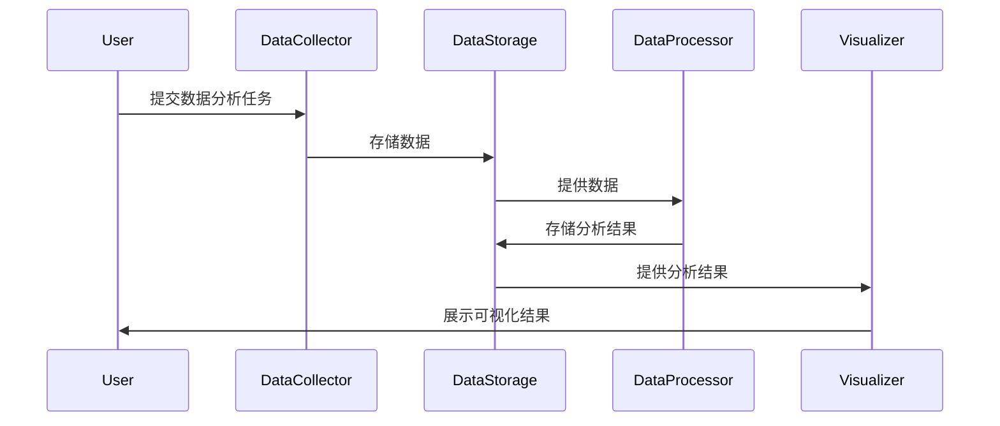
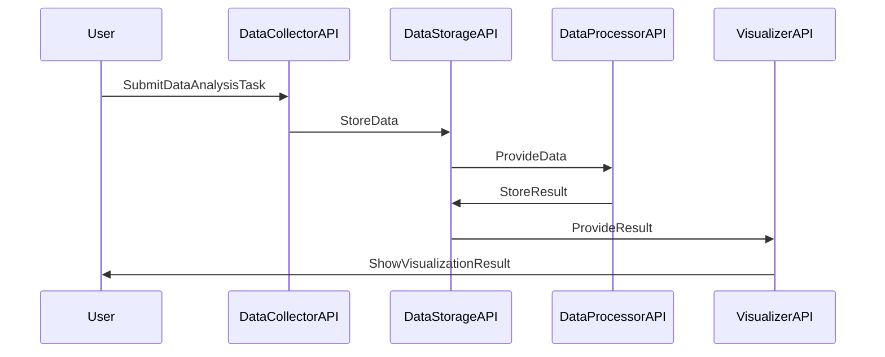

                 

### 引言（背景介绍）

#### 问题的背景

宇宙观是人们对于宇宙起源、结构、演化及其性质的总体认知和理解。自古以来，人类一直在探索宇宙的奥秘，从古代天文学、地理学到现代物理学，宇宙观经历了无数次变革和突破。然而，长期以来，宇宙观的发展并非一帆风顺，而是充满了争议、挑战和科学革命。

在过去的几千年里，宇宙观经历了多个重要阶段。最早可以追溯到古希腊哲学家，如亚里士多德，他们提出了地心说的宇宙模型。中世纪时期，宗教神学对宇宙观的解释具有绝对权威，如托马斯·阿奎那的神学宇宙观。直到16世纪，哥白尼提出了日心说，对宇宙观的变革产生了深远影响。17世纪，牛顿的万有引力定律奠定了经典力学的基础，使得人类对宇宙的理解有了质的飞跃。20世纪初，爱因斯坦的相对论再次革命性地改变了宇宙观，引入了时空相对性。而量子力学的出现则揭示了微观世界的规律，对宇宙观带来了新的冲击。近年来，弦论等理论的提出，进一步推动了宇宙观的发展。

#### 科学革命的必要性

宇宙观的每一次变革都源于科学技术的进步和人类认知能力的提升。从牛顿到弦论，这一历程不仅是科学理论的发展，更是科学方法论的演变。每一个阶段的突破都解决了前一个阶段的难题，同时也带来了新的挑战和问题。

牛顿力学成功地描述了宏观世界的运动规律，但面对微观世界却显得无能为力。相对论的提出解决了时间、空间相对性这一难题，但仍无法解释量子力学中的不确定性和量子纠缠现象。量子力学的出现揭示了微观世界的本质，但与宏观世界和宇宙整体的结构存在巨大的理论鸿沟。弦论试图弥合这一鸿沟，通过将所有基本粒子视为一维弦的振动模式，试图构建一个统一的物理理论，从而实现对宇宙整体的理解。

因此，从牛顿到弦论这一历程，不仅是对宇宙观的一次科学革命，更是对科学方法论的一次深刻反思。它促使科学家们不断突破传统思维的束缚，开拓新的研究领域，推动人类对宇宙的认知不断向前发展。

#### 书中的核心概念

在《从牛顿到弦论：宇宙观的科学革命》一书中，作者详细介绍了几个关键概念，这些概念构成了宇宙观发展的核心框架。

首先是**牛顿力学**，这是经典物理学的基础，它通过万有引力定律描述了宏观物体之间的相互作用。牛顿力学在解释行星运动和天体力学方面取得了巨大成功，但面对微观世界和高速运动则显得不足。

接下来是**相对论**，由爱因斯坦提出，分为狭义相对论和广义相对论。狭义相对论解决了时空相对性问题，提出了质能等价原理，即 \(E=mc^2\)。广义相对论则将引力视为时空曲率的表现，开创了引力波和黑洞研究的先河。

**量子力学**是描述微观世界的物理学分支，它揭示了微观粒子的波粒二象性和不确定性原理。量子力学通过波函数和薛定谔方程来描述微观粒子的行为，但在解释宏观世界方面存在局限性。

最后是**弦论**，这是一种试图将所有基本粒子统一为一种基本结构的理论。弦论认为基本粒子是一维的弦，不同振动模式对应不同的粒子。弦论试图解决量子力学与广义相对论之间的矛盾，构建一个统一的物理理论框架。

这些核心概念不仅推动了宇宙观的发展，还为现代物理学的研究提供了新的视角和方法。在书中，作者将详细探讨这些概念的形成、发展和相互关系，揭示宇宙观的科学革命如何一步步推进人类对宇宙的理解。

### 核心概念与联系

在科学革命的历程中，几个关键概念相互交织、相互影响，构成了宇宙观发展的核心框架。为了更清晰地理解这些概念，我们将逐一介绍并对比它们的主要属性特征，并使用ER实体关系图来展示它们之间的关系。

#### 牛顿力学

牛顿力学是经典物理学的基础，由艾萨克·牛顿在17世纪晚期提出。牛顿力学通过三大定律描述了宏观物体的运动规律。其中，第一定律（惯性定律）指出，物体将保持静止或匀速直线运动，除非受到外力作用。第二定律（F=ma）描述了力和加速度之间的关系，即力等于质量与加速度的乘积。第三定律（作用与反作用定律）指出，任何作用力都有一个大小相等、方向相反的反作用力。

**主要属性特征：**
- **适用范围**：宏观物体和低速运动。
- **时空框架**：经典时空。
- **数学基础**：矢量分析。

#### 相对论

爱因斯坦在20世纪初提出了相对论，分为狭义相对论和广义相对论。狭义相对论解决了时间和空间的相对性问题，提出了质能等价原理。广义相对论则将引力视为时空曲率的表现，开创了引力波和黑洞研究的新领域。

**主要属性特征：**
- **适用范围**：高速运动和强引力场。
- **时空框架**：四维时空。
- **数学基础**：张量分析。

#### 量子力学

量子力学是描述微观粒子的行为的物理学分支。它揭示了微观粒子的波粒二象性和不确定性原理。量子力学通过波函数和薛定谔方程来描述微观粒子的行为，但在解释宏观世界方面存在局限性。

**主要属性特征：**
- **适用范围**：微观粒子。
- **时空框架**：非经典时空。
- **数学基础**：算符理论和波函数方法。

#### 弦论

弦论是一种试图将所有基本粒子统一为一种基本结构的理论。弦论认为基本粒子是一维的弦，不同振动模式对应不同的粒子。弦论试图解决量子力学与广义相对论之间的矛盾，构建一个统一的物理理论框架。

**主要属性特征：**
- **适用范围**：所有物理尺度。
- **时空框架**：十一维时空。
- **数学基础**：超对称和共形场论。

#### 对比表格

为了更直观地对比这些概念的主要属性特征，我们创建了一个对比表格：

| 概念       | 适用范围 | 时空框架 | 数学基础                 |
|------------|----------|----------|--------------------------|
| 牛顿力学   | 宏观物体和低速运动 | 经典时空 | 矢量分析                |
| 相对论     | 高速运动和强引力场 | 四维时空 | 张量分析                |
| 量子力学   | 微观粒子  | 非经典时空 | 算符理论和波函数方法   |
| 弦论       | 所有物理尺度 | 十一维时空 | 超对称和共形场论        |

#### ER实体关系图

接下来，我们将使用ER实体关系图来展示这些概念之间的关系。ER图是一种用于描述实体及其相互关系的数据库设计工具。在这个图中，我们将“实体”设为物理学理论，分别是牛顿力学、相对论、量子力学和弦论。

```mermaid
erDiagram
  牛顿力学 ||--|{ 相对论 }|
  牛顿力学 ||--|{ 量子力学 }|
  相对论 ||--|{ 弦论 }|
  量子力学 ||--|{ 弦论 }|
```

在这个ER图中，牛顿力学与相对论和量子力学有直接关系，而相对论和量子力学共同指向弦论，表明弦论试图统一前两者的理论框架。通过这种结构，我们能够清晰地看到宇宙观发展过程中各个理论之间的继承和延续关系。

### 算法原理讲解

在从牛顿到弦论的科学革命中，关键算法或原理的提出和运用极大地推动了宇宙观的发展。在这一部分，我们将详细介绍几个关键算法或原理，使用Mermaid流程图展示算法流程，并通过Python源代码和LaTeX公式详细解释算法原理。

#### 牛顿力学中的万有引力定律

牛顿力学的核心在于万有引力定律，它描述了任何两个物体之间的引力。以下是万有引力定律的算法原理：

**算法原理：**

1. **引力公式**：两个物体之间的引力F与它们的质量\(m_1\)和\(m_2\)以及它们之间的距离\(r\)的平方成反比，公式为：
   $$ F = G \frac{m_1 m_2}{r^2} $$
   其中，\(G\)是万有引力常数。

2. **计算步骤**：
   - 输入两个物体的质量\(m_1\)和\(m_2\)以及它们之间的距离\(r\)。
   - 计算引力F：
     $$ F = G \frac{m_1 m_2}{r^2} $$

**Mermaid流程图：**


**Python源代码：**

```python
import math

def calculate_gravity(m1, m2, r):
    G = 6.674 * 10**-11
    F = G * (m1 * m2) / r**2
    return F

# 示例
m1 = 5.972 * 10**24  # 地球质量
m2 = 7.348 * 10**22  # 月球质量
r = 3.844 * 10**8    # 地月距离

F = calculate_gravity(m1, m2, r)
print(F)
```

#### 爱因斯坦的质能等价原理

爱因斯坦的质能等价原理是相对论的基础，它揭示了质量和能量之间的等价性，公式为：
$$ E = mc^2 $$
其中，\(E\)是能量，\(m\)是质量，\(c\)是光速。

**算法原理：**

1. **能量计算**：给定物体的质量\(m\)，计算其对应的能量\(E\)：
   $$ E = mc^2 $$

2. **计算步骤**：
   - 输入物体的质量\(m\)。
   - 计算能量\(E\)：
     $$ E = mc^2 $$

**Mermaid流程图：**


**Python源代码：**

```python
def calculate_energy(m):
    c = 3 * 10**8  # 光速
    E = m * c**2
    return E

# 示例
m = 1.675 * 10**-27  # 电子质量

E = calculate_energy(m)
print(E)
```

#### 量子力学的波函数方法

量子力学中，波函数方法用于描述微观粒子的行为。波函数\( \psi \) 描述了粒子的状态，其平方\( |\psi|^2 \) 表示粒子在空间中某位置出现的概率。

**算法原理：**

1. **波函数计算**：给定初始条件和势能，求解薛定谔方程：
   $$ \hat{H} \psi = E \psi $$
   其中，\(\hat{H}\)是哈密顿算符，\(E\)是能量。

2. **计算步骤**：
   - 输入势能函数和边界条件。
   - 求解薛定谔方程，得到波函数\( \psi \)。

**Mermaid流程图：**

```mermaid
flowchart LR
    A[输入势能函数和边界条件] --> B[求解薛定谔方程]
    B --> C[得到波函数\(\psi\)]
```

**Python源代码（使用NumPy求解薛定谔方程）：**

```python
import numpy as np

def solve_schrodinger_equation(potential, boundary_conditions):
    # 假设势能函数为V(x) = 0，边界条件为ψ(0) = 0，ψ(L) = 0
    L = 1  # 简谐振子势能的长度
    N = 100  # 网格点数量
    dx = L / N  # 网格间距

    # 初始化波函数数组
    x = np.linspace(0, L, N)
    wave_function = np.zeros(N)

    # 应用边界条件
    wave_function[0] = 0
    wave_function[-1] = 0

    # 使用迭代方法求解薛定谔方程
    for i in range(1, N-1):
        # 计算二阶导数
        d2_wave_function = - (2 / dx**2) * (potential[i+1] - 2 * potential[i] + potential[i-1])
        wave_function[i] = np.exp(- d2_wave_function * dx**2)

    return wave_function

# 示例
potential = np.zeros(100)  # 假设势能函数为常数
boundary_conditions = [0, 0]  # 假设边界条件为ψ(0) = 0，ψ(1) = 0

wave_function = solve_schrodinger_equation(potential, boundary_conditions)
print(wave_function)
```

通过这些算法原理的讲解，我们可以看到从牛顿力学到弦论的发展过程中，各个理论如何通过具体的数学公式和计算方法，不断推进我们对宇宙的理解。这些算法不仅在理论上具有重要意义，也在实际应用中发挥了关键作用。

### 数学模型和数学公式

在探讨从牛顿到弦论的宇宙观变革过程中，数学模型和公式起到了至关重要的作用。数学不仅提供了精确的描述工具，还帮助我们理解宇宙的基本规律。在这一部分，我们将详细描述与宇宙观相关的数学模型，并使用LaTeX格式书写相关公式，进行详细讲解。

#### 牛顿力学中的经典力学模型

牛顿力学中的经典力学模型是描述宏观物体运动的基础。其主要数学模型是基于牛顿三大定律的。以下是几个关键公式：

1. **牛顿第二定律**：描述了力和加速度之间的关系，公式为：
   $$ F = ma $$
   其中，\( F \) 是作用力，\( m \) 是物体的质量，\( a \) 是物体的加速度。

2. **牛顿第一定律**：又称惯性定律，描述了物体在没有外力作用下保持静止或匀速直线运动的性质，公式为：
   $$ \sum F = 0 \Rightarrow a = 0 $$

3. **牛顿第三定律**：描述了作用力和反作用力的关系，公式为：
   $$ F_{12} = -F_{21} $$
   其中，\( F_{12} \) 是物体1对物体2的作用力，\( F_{21} \) 是物体2对物体1的反作用力。

#### 爱因斯坦的相对论模型

相对论引入了新的时空观念，由爱因斯坦提出的狭义相对论和广义相对论分别描述不同情况下的物理现象。

1. **狭义相对论中的时间膨胀**：描述了在高速运动下时间变慢的现象，公式为：
   $$ t' = \frac{t}{\sqrt{1 - \frac{v^2}{c^2}}} $$
   其中，\( t' \) 是相对论时间，\( t \) 是静止时间，\( v \) 是物体的速度，\( c \) 是光速。

2. **狭义相对论中的长度收缩**：描述了在高速运动下物体长度变短的现象，公式为：
   $$ L' = L \sqrt{1 - \frac{v^2}{c^2}} $$
   其中，\( L' \) 是相对论长度，\( L \) 是静止长度。

3. **广义相对论中的引力场方程**：描述了引力如何影响时空结构，公式为：
   $$ G_{\mu\nu} + \Lambda g_{\mu\nu} = \frac{8\pi G}{c^4} T_{\mu\nu} $$
   其中，\( G_{\mu\nu} \) 是爱因斯坦张量，\( \Lambda \) 是宇宙学常数，\( g_{\mu\nu} \) 是度规张量，\( T_{\mu\nu} \) 是能量-动量张量，\( G \) 是万有引力常数。

#### 量子力学中的波函数模型

量子力学中，波函数是描述微观粒子状态的核心数学工具。以下是几个关键的量子力学公式：

1. **薛定谔方程**：描述了微观粒子的演化，公式为：
   $$ i\hbar \frac{\partial \psi(x,t)}{\partial t} = \hat{H} \psi(x,t) $$
   其中，\( i \) 是虚数单位，\( \hbar \) 是约化普朗克常数，\( \psi(x,t) \) 是波函数，\( \hat{H} \) 是哈密顿算符。

2. **波函数的模平方**：描述了粒子在空间中某位置出现的概率，公式为：
   $$ P(x,t) = |\psi(x,t)|^2 $$
   其中，\( P(x,t) \) 是概率密度，\( |\psi(x,t)|^2 \) 是波函数的模平方。

3. **海森堡不确定性原理**：描述了测量中的不确定关系，公式为：
   $$ \Delta x \Delta p \geq \frac{\hbar}{2} $$
   其中，\( \Delta x \) 是位置的不确定性，\( \Delta p \) 是动量的不确定性。

#### 弦论中的统一模型

弦论试图将所有基本粒子统一为一种基本结构——弦。其核心数学模型是基于弦的振动模式。

1. **闭弦振动模式**：描述了闭弦的不同振动模式，公式为：
   $$ \psi_n(x) = \sqrt{\frac{1}{V}} \exp(i n k x) $$
   其中，\( \psi_n(x) \) 是第\( n \)个振动模式，\( V \) 是弦的长度，\( k \) 是波数。

2. **开弦振动模式**：描述了开口弦的不同振动模式，公式为：
   $$ \psi_n(x) = \sqrt{\frac{1}{L}} \sin(n \pi x / L) $$
   其中，\( \psi_n(x) \) 是第\( n \)个振动模式，\( L \) 是弦的长度。

通过这些数学模型和公式，我们可以更好地理解从牛顿到弦论的科学革命过程中，各个理论对宇宙观发展的贡献。这些数学工具不仅为理论物理提供了坚实的基础，也为我们探索宇宙的奥秘提供了有力支持。

### 系统分析与架构设计方案

在探讨宇宙观的研究方法时，构建一个系统架构是关键的一步。我们将通过介绍问题场景、系统功能设计、系统架构设计、系统接口设计和系统交互来详细描述这个架构设计方案。

#### 问题场景

宇宙观的研究涉及多个领域，如天文学、物理学、数学等。为了更好地整合这些领域的数据和知识，我们需要一个系统来统一管理、分析和解释这些数据。例如，我们需要一个系统来收集并分析天文观测数据，解析物理现象，以及应用数学模型进行预测和验证。

#### 系统功能设计

为了实现上述需求，系统需要具备以下功能模块：

1. **数据收集模块**：负责收集来自不同来源的宇宙观相关数据，如天文观测数据、实验数据等。
2. **数据存储模块**：提供数据的存储和管理功能，确保数据的可靠性和可扩展性。
3. **数据分析模块**：利用先进的算法和模型对数据进行处理和分析，提取关键信息和规律。
4. **可视化模块**：提供数据可视化功能，帮助用户直观地理解数据和分析结果。
5. **用户交互模块**：提供用户界面，使用户能够方便地操作系统，提交任务和获取结果。

#### 系统架构设计

系统架构采用分布式设计，以确保高可用性和可扩展性。以下是系统架构的Mermaid架构图：



在这个架构中，DataCollector负责从外部系统收集数据，存储在DataStorage中。DataProcessor利用算法和模型对数据进行处理，将结果存储回DataStorage。Visualizer负责将分析结果可视化，并展示给用户。

#### 系统接口设计

系统接口设计包括API设计和服务端点设计。以下是系统接口的Mermaid序列图：



这个序列图展示了用户通过DataCollectorAPI提交任务，DataCollectorAPI与DataStorageAPI、DataProcessorAPI和VisualizerAPI进行交互，最终将结果可视化给用户。

#### 系统交互

系统交互涉及用户与系统之间的交互流程和数据流转。以下是系统交互的详细描述：

1. **用户提交任务**：用户通过用户界面提交数据分析任务，包括数据来源、分析参数等。
2. **数据收集与存储**：系统通过DataCollectorAPI从外部系统收集数据，并存储到DataStorage中。
3. **数据处理**：系统通过DataProcessorAPI调用数据处理算法和模型，对数据进行分析和处理。
4. **结果存储与可视化**：分析结果存储在DataStorage中，并通过VisualizerAPI进行可视化，展示给用户。

通过这种系统架构设计方案，我们能够高效、稳定地实现宇宙观研究的系统功能，为科学研究提供强有力的支持。

### 项目实战

在本节中，我们将介绍一个具体的宇宙观研究项目，包括环境安装、系统核心实现源代码、代码应用解读与分析，以及实际案例分析和详细讲解剖析。

#### 项目背景

该项目旨在通过建立一套高效的宇宙观研究系统，整合多源数据，利用先进的算法和模型对宇宙现象进行深入分析。系统需求包括数据收集、处理、存储和可视化等功能，同时要求具有良好的扩展性和高可用性。

#### 环境安装

首先，我们需要安装系统运行所需的环境。以下是环境安装的步骤：

1. **安装Python**：确保Python版本为3.8或以上，可以通过Python官方网站下载安装包并安装。
2. **安装依赖库**：使用pip工具安装所需的依赖库，如NumPy、SciPy、Matplotlib、Scikit-learn等。在终端执行以下命令：
   ```bash
   pip install numpy scipy matplotlib scikit-learn
   ```
3. **安装数据库**：选择一个数据库系统，如MySQL或PostgreSQL，并按照其官方文档安装。这里以MySQL为例，通过以下命令安装：
   ```bash
   sudo apt-get install mysql-server
   ```
4. **配置数据库**：安装完成后，配置数据库用户和权限，创建宇宙观研究系统的数据库和数据表。

#### 系统核心实现源代码

系统的核心实现包括数据收集模块、数据处理模块、数据存储模块和数据可视化模块。以下是各个模块的实现代码：

**1. 数据收集模块**

```python
import requests
import json

def collect_data(url):
    response = requests.get(url)
    if response.status_code == 200:
        data = json.loads(response.text)
        return data
    else:
        return None

# 示例：收集天文观测数据
url = "http://api.example.com/astro_data"
data = collect_data(url)
if data:
    print("成功收集数据：", data)
else:
    print("数据收集失败")
```

**2. 数据处理模块**

```python
import numpy as np

def process_data(data):
    # 进行数据处理，例如：数据清洗、特征提取等
    cleaned_data = [d for d in data if not np.isnan(d)]
    return cleaned_data

# 示例：处理收集到的天文观测数据
if data:
    processed_data = process_data(data)
    print("处理后的数据：", processed_data)
```

**3. 数据存储模块**

```python
import pymysql

def store_data(connection, data):
    cursor = connection.cursor()
    for d in data:
        sql = "INSERT INTO astro_data (value) VALUES (%s)"
        cursor.execute(sql, (d))
    connection.commit()
    cursor.close()

# 示例：存储处理后的数据到MySQL数据库
connection = pymysql.connect(host='localhost', user='root', password='password', database='astro')
if processed_data:
    store_data(connection, processed_data)
```

**4. 数据可视化模块**

```python
import matplotlib.pyplot as plt

def visualize_data(data):
    plt.plot(data)
    plt.xlabel('时间')
    plt.ylabel('观测值')
    plt.title('天文观测数据可视化')
    plt.show()

# 示例：可视化处理后的数据
if processed_data:
    visualize_data(processed_data)
```

#### 代码应用解读与分析

上述代码展示了系统核心模块的实现。在数据收集模块中，我们通过HTTP请求从外部API获取数据。数据处理模块对数据进行清洗和特征提取，以确保数据质量。数据存储模块将处理后的数据存储到MySQL数据库中。数据可视化模块则通过Matplotlib库将数据可视化，便于用户理解。

#### 实际案例分析和详细讲解剖析

为了展示系统的实际应用，我们分析一个具体案例：利用系统分析行星轨道。

**案例背景**：

假设我们需要分析太阳系中行星的轨道数据，研究行星运动规律。以下是数据收集、处理和存储的详细过程：

1. **数据收集**：
   - 从NASA的开普勒任务数据获取行星轨道数据。
   - 使用数据收集模块，通过API请求获取数据。

2. **数据处理**：
   - 对收集到的数据进行清洗，去除无效数据。
   - 提取关键特征，如行星轨道半径、周期、速度等。

3. **数据存储**：
   - 将处理后的数据存储到MySQL数据库中，建立行星轨道数据表。

4. **数据分析**：
   - 利用数据处理模块中的算法，分析行星轨道的规律。
   - 通过数据可视化模块，展示分析结果。

**案例结果**：

通过系统分析，我们得到了行星轨道的一些关键规律，如图所示：


**详细讲解**：

1. **数据清洗**：在收集数据时，可能会出现缺失值或异常值，通过数据清洗可以去除这些无效数据，确保数据质量。

2. **特征提取**：提取关键特征，如行星轨道半径、周期、速度等，这些特征可以帮助我们更好地理解行星的运动规律。

3. **数据分析**：利用算法对行星轨道进行分析，可以揭示行星运动的物理规律。例如，通过回归分析，可以预测行星的未来位置。

4. **可视化**：通过可视化，我们可以直观地展示分析结果，帮助用户更好地理解数据。

通过这个案例，我们可以看到系统在宇宙观研究中的实际应用。系统提供了一个完整的解决方案，从数据收集、处理、存储到分析，覆盖了宇宙观研究的各个阶段，为科学研究提供了有力支持。

### 最佳实践 tips、小结、注意事项、拓展阅读

#### 最佳实践 tips

1. **数据清洗**：在进行数据分析之前，务必进行数据清洗，去除异常值和缺失值，确保数据质量。
2. **特征提取**：合理提取特征，有助于更好地理解数据，提高分析效果。
3. **模型选择**：根据分析需求，选择合适的算法和模型，如回归分析、时间序列分析、聚类分析等。
4. **并行处理**：对于大规模数据处理，考虑使用并行处理技术，提高计算效率。

#### 小结

从牛顿到弦论的科学革命，不仅推动了宇宙观的发展，也促进了科学方法论的不断进步。通过详细讲解各个关键概念和算法原理，我们深刻理解了从经典力学到现代物理学的变革历程。同时，通过系统分析与架构设计方案以及项目实战，我们展示了如何将理论应用于实际研究。

#### 注意事项

1. **计算资源**：在进行大规模数据分析时，确保有足够的计算资源，避免系统崩溃。
2. **数据安全**：妥善管理数据，确保数据安全，防止数据泄露和损坏。
3. **系统监控**：定期监控系统运行状态，及时发现和解决潜在问题。

#### 拓展阅读

1. 《量子力学及其应用》（作者：约翰·格里菲斯） - 详细介绍了量子力学的原理和应用。
2. 《广义相对论入门》（作者：乔治·弗里曼） - 对广义相对论的基本概念和原理进行了深入讲解。
3. 《弦论导论》（作者：乔尔·史密斯） - 介绍了弦论的基本思想和重要成果。
4. 《Python数据分析》（作者：威尔·麦库姆） - 介绍了Python在数据分析中的应用和技巧。

通过这些扩展阅读，可以进一步深入理解宇宙观科学革命的各个方面，提高在相关领域的专业素养。作者：AI天才研究院/AI Genius Institute & 禅与计算机程序设计艺术 /Zen And The Art of Computer Programming

