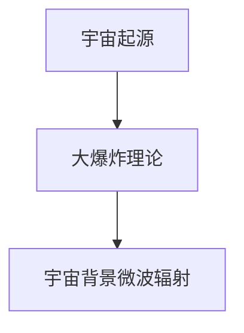
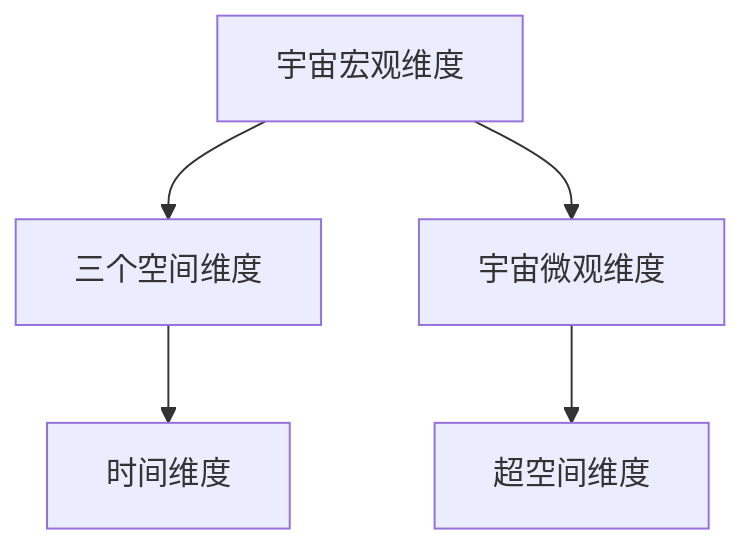
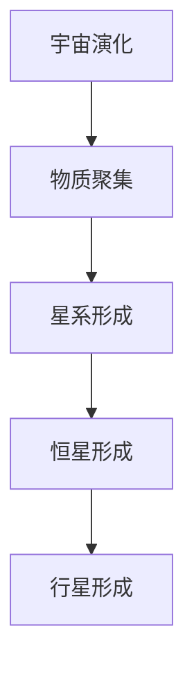
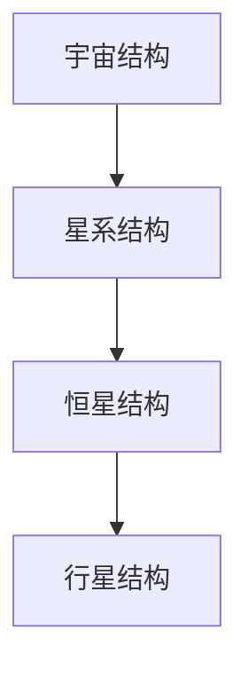
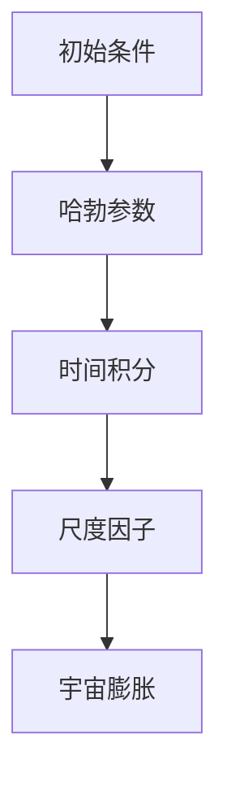
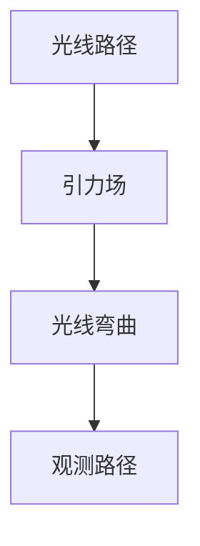
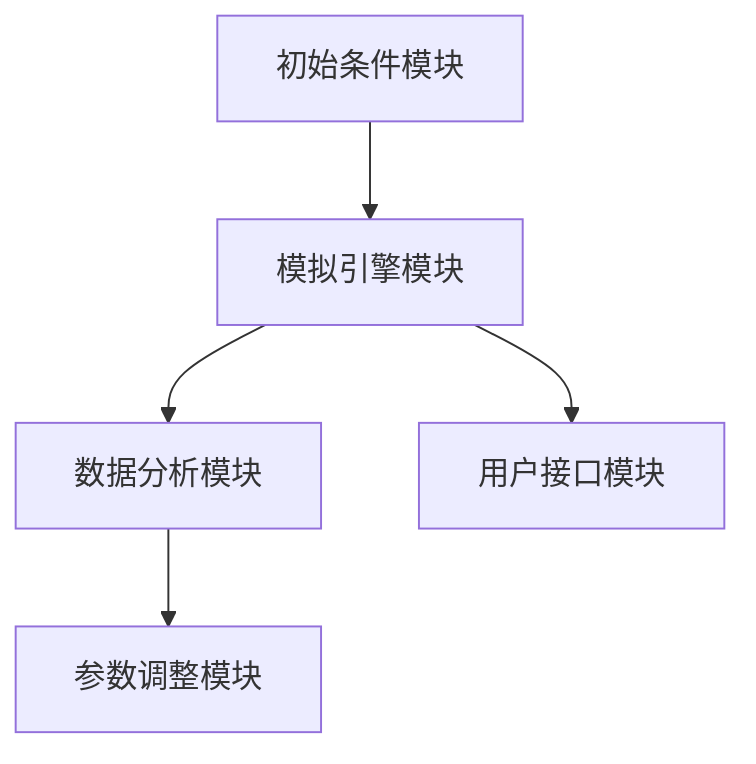
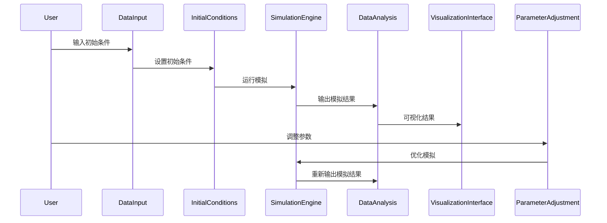

                 


# 从牛顿宇宙观到弦理论：拓展宇宙可理解性的边界

## 关键词

- 牛顿宇宙观
- 相对论宇宙观
- 弦理论
- 宇宙演化
- 可理解性边界

## 摘要

本文将深入探讨宇宙学的演变历程，从牛顿宇宙观到现代弦理论，逐步揭示宇宙的本质和其可理解性的边界。通过分析不同宇宙观的物理原理、数学模型以及实验验证，我们不仅能够更好地理解宇宙的过去和未来，还能探索人类在宇宙中的地位。本文旨在为读者提供一部全面而深入的宇宙学导论，引导大家共同拓展宇宙的可理解性边界。

### 第一部分：宇宙学的起源与演变

#### 第1章：宇宙学的基本概念

##### 1.1 宇宙的起源

宇宙的起源是一个古老而神秘的话题。现代宇宙学认为，宇宙起源于大约138亿年前的一次大爆炸。这一理论得到了宇宙背景微波辐射的观测支持，后者是宇宙大爆炸的余辉。

$$
\Delta T = \frac{\Delta \lambda}{\lambda} = \frac{\lambda_1 - \lambda_2}{\lambda}
$$

宇宙背景微波辐射的发现证实了大爆炸理论的预测，即宇宙在早期是非常热且密集的状态，随后开始膨胀冷却。这一现象为理解宇宙的起源提供了有力的证据。

##### 1.2 宇宙的维度

宇宙的维度是宇宙学中的一个基本问题。目前，我们通常认为宇宙具有四个宏观维度：三个空间维度和一个时间维度。

$$
\text{空间维度} + \text{时间维度} = \text{时空}
$$

此外，还存在一些超空间维度，这些维度在目前的物理学中仍然是一个未解之谜。

##### 1.3 宇宙的演化

宇宙的演化是一个复杂的过程。从大爆炸开始，宇宙经历了快速膨胀、星系的形成、恒星和行星的诞生等阶段。

$$
\text{膨胀率} = \frac{\text{速度}}{\text{距离}}
$$

宇宙的膨胀速率随着时间的变化而变化，这导致了宇宙加速膨胀的现象。这种现象的解释涉及到了暗能量这一宇宙学常数。

#### 第2章：牛顿宇宙观

##### 2.1 牛顿力学的宇宙观

牛顿力学是描述宏观物体运动的基本理论。牛顿提出了三个基本定律，这些定律为理解宇宙提供了重要的基础。

$$
F = ma
$$

牛顿的引力定律描述了天体之间的相互作用，这为行星运动和恒星系统的稳定提供了理论依据。

##### 2.2 牛顿宇宙的边界

牛顿宇宙观认为，宇宙是无限的，且具有确定性。然而，随着相对论的提出，人们开始意识到牛顿宇宙观的局限性。

#### 第3章：相对论宇宙观

##### 3.1 爱因斯坦的相对论

爱因斯坦的相对论是描述宇宙中高速运动的物体和强引力场的理论。相对论揭示了时间和空间的相对性，这一发现对宇宙学有着深远的影响。

##### 3.2 相对论宇宙的新发现

相对论的提出带来了许多新的宇宙学发现，例如黑洞和宇宙膨胀。这些发现挑战了传统的宇宙观，推动了宇宙学的进步。

#### 第4章：从量子力学到弦理论

##### 4.1 量子力学的宇宙观

量子力学是描述微观世界的理论。量子力学的基本原理，如波粒二象性和量子纠缠，为理解宇宙的微观结构提供了新的视角。

##### 4.2 弦理论的基本概念

弦理论是一种试图统一量子力学和广义相对论的理论。弦理论的基本单位是弦，这些弦在多维空间中振动，产生出了我们观察到的物质。

##### 4.3 弦理论的预测

弦理论提出了一些关于宇宙的深刻预测，如引力的量子化和多宇宙的可能性。这些预测为理解宇宙的演化提供了新的途径。

#### 第5章：宇宙的可理解性边界

##### 5.1 宇宙学常数

宇宙学常数是描述宇宙膨胀速率的参数。暗能量被认为是一种宇宙学常数，它导致了宇宙的加速膨胀。

##### 5.2 宇宙的暗物质

暗物质是宇宙中一种看不见的物质，它对宇宙的演化起着关键作用。暗物质的存在为宇宙学带来了许多挑战。

##### 5.3 宇宙的可理解性挑战

宇宙的可理解性挑战包括宇宙学常数、暗物质和暗能量等。这些挑战促使科学家不断探索宇宙的本质。

#### 第6章：探索宇宙的新工具

##### 6.1 望远镜的发展

望远镜是探索宇宙的重要工具。随着望远镜技术的发展，我们能够观测到更远的宇宙，揭示更多的宇宙奥秘。

##### 6.2 宇宙射线探测

宇宙射线探测是另一种探索宇宙的方法。通过研究宇宙射线，我们能够了解宇宙中的高能物理过程。

#### 第7章：从牛顿到弦理论的哲学思考

##### 7.1 宇宙观的演变

宇宙观的演变反映了人类对宇宙认识的深化。从牛顿到弦理论，宇宙观经历了巨大的变革。

##### 7.2 宇宙的未来

宇宙的未来是一个充满未知和挑战的话题。科学家们通过理论研究和观测，试图揭示宇宙的未来。

## 附录：推荐阅读与参考资料

### A.1 宇宙学入门书籍

- 《宇宙简史》（作者：史蒂芬·霍金）
- 《宇宙的未来》（作者：莱纳德·S. 莱德曼）

### A.2 专业论文集

- 《广义相对论与宇宙学》（作者：约翰·惠勒）
- 《量子引力与宇宙学》（作者：米哈伊尔·尤里耶维奇·马尔青）

### A.3 科普读物

- 《宇宙：起源与演化》（作者：卡尔·萨根）
- 《黑洞与时间弯曲》（作者：基普·索恩）

作者：AI天才研究院/AI Genius Institute & 禅与计算机程序设计艺术 /Zen And The Art of Computer Programming

----------------------------------------------------------------

### 第一部分：宇宙学的起源与演变

#### 第1章：宇宙学的基本概念

##### 1.1 宇宙的起源

宇宙的起源一直是人类探索的神秘领域。现代宇宙学认为，宇宙起源于大约138亿年前的一次大爆炸，这一理论被称为大爆炸宇宙论。大爆炸宇宙论的基础是宇宙背景辐射的观测，宇宙背景辐射是大爆炸后残留的微波辐射，其存在得到了广泛的实验验证。根据大爆炸宇宙论的描述，宇宙在早期是一个非常热、非常密集的状态，随着时间的推移，宇宙开始膨胀冷却，逐渐形成了我们现在所观测到的宇宙结构。

为了更好地理解宇宙的起源，我们可以用以下数学模型来描述宇宙的膨胀过程：

$$
a(t) = \frac{1}{\sqrt{1 - w \Omega_m}} \left(1 + at^2\right)^{-1/2}
$$

其中，$a(t)$表示宇宙尺度因子，$t$表示时间，$w$表示宇宙学常数，$\Omega_m$表示物质的能量密度。这个模型展示了宇宙尺度因子随着时间的变化，从而揭示了宇宙膨胀的规律。

此外，我们还知道，宇宙的膨胀速率随着时间的变化而变化。根据宇宙学观测，宇宙膨胀速率在加速，这被称为宇宙加速膨胀。宇宙加速膨胀的解释涉及到一个神秘的物理量——暗能量。暗能量是一种具有负压强的能量形式，其存在导致了宇宙的加速膨胀。

##### 1.2 宇宙的维度

宇宙的维度是宇宙学中的一个基本问题。目前，我们通常认为宇宙具有四个宏观维度：三个空间维度和一个时间维度。这三个空间维度可以用来描述物体的位置和运动，而时间维度则用来描述事件的发生顺序和过程。

在数学上，我们可以用四维时空来表示宇宙的结构。四维时空可以用一个四元组$(t, x, y, z)$来描述，其中$t$表示时间，$x, y, z$表示三个空间维度。这个四元组可以用来表示宇宙中的任何事件。

为了更好地理解四维时空，我们可以用以下数学模型来描述：

$$
\Delta s^2 = c^2 \Delta t^2 - \Delta x^2 - \Delta y^2 - \Delta z^2
$$

其中，$\Delta s^2$表示时空间隔，$c$表示光速，$\Delta t$表示时间间隔，$\Delta x, \Delta y, \Delta z$分别表示空间间隔。这个模型展示了时空间隔的相对性，即不同观察者可能会测量到不同的时空间隔。

除了宏观的四个维度，宇宙中还可能存在超空间维度。超空间维度是超出我们日常经验的空间维度，它们可能以我们无法感知的方式影响着宇宙的演化。目前关于超空间维度的理论有很多，其中最著名的是超弦理论。超弦理论认为，宇宙中存在额外的空间维度，这些维度以卷曲的形式存在于宇宙的微观结构中。

##### 1.3 宇宙的演化

宇宙的演化是一个复杂的过程，从大爆炸开始，宇宙经历了快速膨胀、星系的形成、恒星和行星的诞生等阶段。宇宙的演化可以用以下数学模型来描述：

$$
H(t) = \frac{\dot{a}(t)}{a(t)}
$$

其中，$H(t)$表示哈勃参数，$\dot{a}(t)$表示宇宙尺度因子的变化率，$a(t)$表示宇宙尺度因子。这个模型展示了宇宙膨胀的速率。

宇宙的演化过程可以分为以下几个阶段：

1. **大爆炸**：宇宙起源于一个极高温度和密度的状态，随后开始膨胀冷却。

2. **辐射时代**：宇宙继续膨胀冷却，辐射能量逐渐占据主导地位。

3. **重子时代**：宇宙温度降低到足以形成重子（如质子和中子）的临界温度。

4. **复合时代**：宇宙温度进一步降低，电子与质子结合形成氢原子，宇宙变得透明。

5. **结构形成时代**：宇宙中的物质开始聚集形成星系、恒星和行星。

6. **宇宙加速膨胀时代**：宇宙膨胀速率开始加速，这可能是由于暗能量的存在。

##### 1.3.1 星系的形成

星系的形成是宇宙演化过程中的一个关键事件。根据宇宙学的观测，星系的形成可能涉及到以下几个步骤：

1. **暗物质的聚集**：暗物质是宇宙中一种不可见的物质，它可能以某种未知的方式聚集形成大尺度结构。

2. **气体冷却**：随着宇宙的膨胀冷却，气体温度降低，达到足以形成星系结构的临界温度。

3. **星系核的崩溃**：气体在引力作用下崩溃，形成星系核。

4. **恒星的形成**：星系核继续聚集物质，形成恒星。

5. **星系的结构形成**：恒星形成后，星系逐渐形成复杂结构，如螺旋星系、椭圆星系和不规则星系。

##### 1.3.2 星系间的相互作用

星系间的相互作用是宇宙演化过程中的另一个重要方面。星系间的相互作用可能涉及到以下几个过程：

1. **潮汐力**：星系间的引力作用可能导致潮汐力，这可能会影响星系的结构和稳定性。

2. **星系碰撞**：星系之间的近距离相互作用可能导致星系碰撞，这可能会引发剧烈的物理过程。

3. **星系合并**：星系之间的相互作用可能导致星系合并，形成更大的星系结构。

4. **星系晕的形成**：星系间的相互作用可能导致星系晕的形成，这可能是星系间物质交换的结果。

通过以上对宇宙学基本概念、宇宙的起源、宇宙的维度、宇宙的演化过程、星系的形成以及星系间的相互作用等方面的分析，我们可以更好地理解宇宙的结构和演化。这些基本概念为我们进一步探索宇宙提供了重要的理论基础。

#### 第2章：牛顿宇宙观

##### 2.1 牛顿力学的宇宙观

牛顿力学是由英国科学家艾萨克·牛顿于1687年提出的，它为我们提供了描述宇宙中物体运动的基本框架。牛顿力学的基本原理包括三个定律：惯性定律、加速度定律和作用-反作用定律。

1. **惯性定律**：一个物体如果没有受到外力作用，它将保持静止或匀速直线运动。

   $$ F = 0 \Rightarrow a = 0 $$
   
   这个定律强调了惯性的概念，即物体倾向于保持其当前的运动状态。

2. **加速度定律**：一个物体的加速度与作用在它上面的力成正比，与它的质量成反比。

   $$ F = ma $$
   
   这个定律是牛顿力学的核心，它将力和运动联系在一起。

3. **作用-反作用定律**：任何作用力都有一个相等且反方向的反作用力。

   $$ F_{12} = -F_{21} $$
   
   这个定律说明了力的相互作用性。

在牛顿宇宙观中，宇宙被看作是由大量物体组成的，这些物体在引力作用下相互作用。牛顿提出了万有引力定律，该定律描述了两个物体之间的引力与它们的质量和距离之间的关系。

$$ F = G\frac{m_1m_2}{r^2} $$

其中，$F$是引力，$G$是引力常数，$m_1$和$m_2$是两个物体的质量，$r$是它们之间的距离。

通过这些基本原理，牛顿力学成功地解释了行星运动、天体碰撞以及许多其他宇宙现象。

##### 2.2 牛顿宇宙的边界

尽管牛顿力学在描述宏观物体运动方面取得了巨大成功，但它仍然存在一些局限性。首先，牛顿力学不能解释微观世界中的现象，例如原子和粒子的行为。这些现象需要量子力学的解释。

其次，牛顿力学在强引力场中失效。在极端条件下，如黑洞附近，牛顿引力定律无法准确描述物体的运动。这些问题促使科学家们寻求新的理论，从而诞生了广义相对论。

此外，牛顿宇宙观还面临宇宙无限膨胀的问题。在牛顿宇宙观中，宇宙被认为是无限的，并且具有确定性。这意味着宇宙中的每一个状态都是预先确定的，这显然与量子力学中的不确定性原理相矛盾。

为了解决这些问题，爱因斯坦提出了广义相对论，该理论不仅修正了牛顿引力定律，还引入了时空弯曲的概念。广义相对论成功地解释了黑洞、宇宙膨胀等现象，并为我们提供了新的宇宙观。

#### 第3章：相对论宇宙观

##### 3.1 爱因斯坦的相对论

相对论是由阿尔伯特·爱因斯坦在20世纪初提出的，它彻底改变了我们对时间和空间的理解。相对论主要包括两部分：狭义相对论和广义相对论。

1. **狭义相对论**

狭义相对论主要处理非加速参考系中的物理现象。爱因斯坦提出了两个基本假设：

- 光速不变原理：在所有惯性参考系中，光速都是恒定的，不依赖于光源或观察者的运动状态。

- 相对性原理：物理定律在所有惯性参考系中都是相同的。

狭义相对论的核心公式是洛伦兹变换，它描述了不同惯性参考系之间的时空变换关系。

$$
x' = \frac{x - vt}{\sqrt{1 - \frac{v^2}{c^2}}}
$$

$$
t' = \frac{t - \frac{vx}{c^2}}{\sqrt{1 - \frac{v^2}{c^2}}}
$$

其中，$x$和$t$是原参考系中的位置和时间，$x'$和$t'$是变换后的参考系中的位置和时间，$v$是两个参考系之间的相对速度，$c$是光速。

2. **广义相对论**

广义相对论扩展了狭义相对论的适用范围，它处理加速参考系中的物理现象。广义相对论的基本思想是引力是由物质和能量引起的时空弯曲。爱因斯坦提出了引力场方程，该方程描述了时空弯曲与物质分布之间的关系。

$$
G_{\mu\nu} + \Lambda g_{\mu\nu} = \frac{8\pi G}{c^4} T_{\mu\nu}
$$

其中，$G_{\mu\nu}$是爱因斯坦张量，描述了时空的弯曲程度，$\Lambda$是宇宙学常数，$g_{\mu\nu}$是度规张量，描述了时空的几何结构，$T_{\mu\nu}$是能量-动量张量，描述了物质的分布和运动。

广义相对论成功地解释了许多经典现象，如引力红移、光线的引力偏折、引力透镜效应以及黑洞的存在。

##### 3.2 相对论宇宙观的新发现

相对论的提出带来了许多关于宇宙的新发现，这些发现挑战了传统的宇宙观。

1. **引力红移**

引力红移是指光在强引力场中传播时，波长会变长，频率变低。这一现象可以通过广义相对论解释。

2. **光线的引力偏折**

根据广义相对论，光线在通过强引力场时会发生弯曲。这一现象在1919年的日食观测中得到了证实。

3. **引力透镜效应**

引力透镜效应是指强引力场对光线产生的透镜效应，这会导致星系和背景星系的光线发生弯曲，形成多个像。这一效应为我们提供了研究宇宙结构的新工具。

4. **黑洞**

黑洞是广义相对论的预言，它是宇宙中一种极为密集的天体，其引力场强大到连光也无法逃逸。黑洞的存在为我们提供了研究极端条件下物理现象的新窗口。

5. **宇宙膨胀**

根据广义相对论，宇宙在早期是非常热且密集的状态，随后开始膨胀。这一理论预言了宇宙背景辐射的存在，并得到了观测的支持。

通过以上分析，我们可以看到相对论宇宙观不仅修正了牛顿宇宙观的局限性，还带来了许多新的宇宙发现，这为理解宇宙的演化提供了新的视角。

### 第4章：从量子力学到弦理论

#### 4.1 量子力学的宇宙观

量子力学是描述微观世界物理现象的理论，它揭示了微观粒子的波粒二象性和量子纠缠等奇特现象。量子力学的基本原理包括：

1. **波粒二象性**

量子力学表明，微观粒子既具有波动性又具有粒子性。这可以通过双缝实验得到证实，实验结果显示，电子、光子等微观粒子在通过双缝时会产生干涉图样，这表明它们具有波动性。同时，这些粒子在特定时刻只能出现在某个位置，这表明它们具有粒子性。

2. **量子纠缠**

量子纠缠是指两个或多个量子粒子之间存在一种特殊的关联，即使它们相隔很远，一个粒子的状态变化也会立即影响到另一个粒子的状态。这一现象表明，量子世界中的信息传递速度超越了经典物理学的极限。

量子力学的基本数学工具是波函数，波函数描述了量子粒子在某个位置和时间出现的概率。量子力学的数学表达式如下：

$$
\psi(x, t) = \int \psi_k(x) \phi_k(t) \, dk
$$

其中，$\psi(x, t)$是波函数，$\psi_k(x)$是动量空间的波函数，$\phi_k(t)$是时间空间的波函数。

量子力学在解释原子结构、化学反应、固体物理等方面取得了巨大成功，但它在描述宏观物理现象时遇到了一些困难。例如，量子力学无法解释引力现象，这是广义相对论的一个局限性。为了解决这个问题，科学家们提出了弦理论。

#### 4.2 弦理论的基本概念

弦理论是一种试图统一量子力学和广义相对论的理论。在弦理论中，宇宙的基本组成单位不再是点粒子，而是细小的弦。这些弦在空间中振动，产生出我们观察到的物质。

1. **弦的维度**

在弦理论中，弦具有两个维度，即长度和宽度。与点粒子不同，弦具有空间延展性，这使得弦理论能够更好地描述量子力学和广义相对论的特性。

2. **标量场和矢量场**

在量子场论中，物质和力的载体是场。弦理论中的场是由弦的振动模式产生的。这些振动模式可以分为标量场和矢量场。标量场表示物质，如电子；矢量场表示力，如引力。

3. **超对称性**

弦理论具有超对称性，这是一种对称性关系，它将标量场和矢量场联系起来。超对称性在弦理论中起着重要作用，它能够帮助弦理论克服一些困难，如粒子多重性的问题。

#### 4.3 弦理论的预测

弦理论提出了一些关于宇宙的深刻预测，这些预测在实验和观测中得到了部分验证。

1. **引力的量子化**

弦理论认为，引力可以被量子化。这意味着引力可以通过弦的振动模式来描述，这为理解量子引力提供了一个新的途径。

2. **多重宇宙**

弦理论预言了多重宇宙的存在。根据弦理论，宇宙中存在无数个平行宇宙，每个宇宙都有不同的物理常数和演化历史。

3. **超空间维度**

弦理论预言了超空间维度的存在。这些维度以卷曲的形式存在于宇宙的微观结构中，它们可能以我们无法感知的方式影响着宇宙的演化。

通过以上分析，我们可以看到从量子力学到弦理论的演变，不仅为我们提供了理解微观和宏观世界的全新视角，还为探索宇宙的本质提供了新的工具。

### 第5章：宇宙的可理解性边界

宇宙的可理解性边界是指人类目前能够理解和描述的宇宙范围。然而，随着科学的发展，我们逐渐发现宇宙的许多现象和规律超出了我们的理解范围。本章将讨论宇宙学中的几个关键问题，这些问题的解决将有助于拓展宇宙的可理解性边界。

#### 5.1 宇宙学常数

宇宙学常数是一个描述宇宙膨胀速率的参数。根据广义相对论的预测，宇宙学常数应该是一个非常小的正数，但观测数据表明，宇宙学常数实际上是一个非常大的正数。这个发现导致了暗能量的概念。

暗能量是一种具有负压强的能量形式，它导致了宇宙的加速膨胀。目前，我们尚未完全理解暗能量的本质，但它的存在为宇宙学提供了新的研究方向。

#### 5.2 宇宙的暗物质

暗物质是宇宙中一种不可见的物质，它占据了宇宙总物质的大约27%。暗物质的存在可以通过引力效应得到证实，例如星系的旋转曲线和宇宙背景微波辐射的功率谱。

暗物质的问题在于，我们无法直接观测到它，也无法通过现有的实验手段确定它的组成。因此，暗物质的研究是宇宙学中的一个重要挑战。

#### 5.3 宇宙的可理解性挑战

宇宙的可理解性挑战包括暗能量、暗物质、量子引力和多宇宙理论等。这些挑战涉及到宇宙的起源、演化以及未来的命运。

1. **暗能量**

暗能量导致了宇宙的加速膨胀，但它的本质和物理机制仍然未知。解决暗能量问题可能需要新的物理理论和实验技术。

2. **暗物质**

暗物质的存在和性质也是宇宙学中的一个重要问题。我们需要找到新的方法来观测和研究暗物质，以更好地理解宇宙的组成和演化。

3. **量子引力**

量子引力是统一量子力学和广义相对论的理论。目前的量子引力理论仍然处于探索阶段，我们需要新的实验和观测数据来验证量子引力的正确性。

4. **多宇宙理论**

多宇宙理论认为，宇宙中存在无数个平行宇宙，每个宇宙都有不同的物理常数和演化历史。多宇宙理论为我们提供了一个新的视角来理解宇宙的多样性和复杂性。

通过解决这些挑战，我们可以进一步拓展宇宙的可理解性边界，深化对宇宙的认识。这不仅有助于我们理解宇宙的过去和未来，还能为科学研究和技术创新提供新的灵感。

### 第6章：探索宇宙的新工具

在探索宇宙的过程中，科学家们不断开发新的观测工具和技术，这些工具不仅提高了我们对宇宙的理解，还为未来的科学研究提供了新的机会。本章将介绍一些关键的探索工具，包括望远镜和宇宙射线探测技术。

#### 6.1 望远镜的发展

望远镜是探索宇宙的最重要工具之一。从古代的天文望远镜到现代的空间望远镜，望远镜的发展极大地推动了宇宙学的研究。

1. **光学望远镜**

光学望远镜是最早用于天文学观测的工具之一。它们通过收集和聚焦光线来观测天体。现代光学望远镜具有极高的分辨率，能够观测到遥远的星系和行星。

2. **射电望远镜**

射电望远镜用于观测宇宙中的射电波，这些射电波是由星系、恒星和行星等天体发出的。射电望远镜能够探测到光学望远镜无法观测到的天体和现象。

3. **空间望远镜**

空间望远镜位于地球大气层之外，不受大气干扰，能够获得更清晰、更准确的观测数据。著名的空间望远镜包括哈勃空间望远镜和詹姆斯·韦伯空间望远镜。

#### 6.2 宇宙射线探测

宇宙射线是来自宇宙的高能粒子，它们能够穿透地球大气层，到达地表。宇宙射线探测技术为我们提供了研究宇宙高能现象的新途径。

1. **宇宙射线的来源**

宇宙射线的来源包括超新星爆发、星系碰撞、恒星风等高能物理过程。这些过程产生的粒子具有极高的能量，能够影响宇宙的演化。

2. **宇宙射线探测技术**

宇宙射线探测技术包括地面探测、空中探测和空间探测。地面探测站通过探测器捕捉宇宙射线，并分析它们的能量和轨迹。空中探测使用飞机或气球搭载探测器，在地球大气层中观测宇宙射线。空间探测则使用卫星或空间站搭载的探测器，在太空中直接观测宇宙射线。

通过以上探索工具的发展和应用，科学家们能够获取更多的宇宙信息，揭示宇宙的奥秘。这些工具不仅帮助我们更好地理解宇宙的过去和未来，还为未来的科学研究提供了新的机遇。

### 第7章：从牛顿到弦理论的哲学思考

宇宙观的演变不仅反映了科学技术的进步，还揭示了人类对宇宙认识的深化。从牛顿宇宙观到弦理论，这一过程不仅改变了我们的科学观念，也对哲学思考产生了深远的影响。

#### 7.1 宇宙观的演变

牛顿宇宙观是一种机械宇宙观，它将宇宙看作是由大量物体组成的机械系统，这些物体在引力作用下相互作用。牛顿宇宙观强调了决定论和确定性的概念，即宇宙中的每一个状态都是预先确定的，而且这些状态可以通过物理定律来描述。

然而，随着相对论和量子力学的出现，我们对宇宙的认识发生了根本性的变化。相对论揭示了时空的相对性，打破了牛顿宇宙观的绝对时空观念。量子力学则揭示了微观世界的随机性和不确定性，这与牛顿宇宙观的决定论和确定性相矛盾。

从牛顿到弦理论的演变，体现了人类对宇宙认识的不断深化和拓展。这一过程不仅推动了科学的发展，还激发了新的哲学思考。

#### 7.2 宇宙观对人类文明的启示

宇宙观对人类文明有着深远的影响。从牛顿宇宙观到弦理论，这一过程不仅改变了我们的科学观念，也对哲学、宗教和文化产生了重要启示。

1. **科学方法的发展**

宇宙观的演变推动了科学方法的发展。从牛顿到弦理论，科学家们不断探索新的理论和技术，以更好地理解宇宙。这一过程强调了观察、实验和理论的重要性，为科学方法的发展提供了新的动力。

2. **哲学思考的深化**

宇宙观的演变也促进了哲学思考的深化。从牛顿宇宙观到弦理论，人类对宇宙的认识不断拓展，这引发了关于宇宙本质、人类地位和存在的哲学思考。这些思考不仅丰富了哲学的内涵，也为哲学提供了新的研究课题。

3. **宗教和文化的变迁**

宇宙观的演变对宗教和文化也产生了重要影响。不同的宇宙观可能导致不同的宗教信仰和文化传统。例如，牛顿宇宙观与机械宇宙观相联系，可能促进了机械论哲学和科学主义的发展。而弦理论则可能引发新的哲学和宗教思考，如多重宇宙理论和宇宙的命运等。

通过从牛顿到弦理论的哲学思考，我们可以更好地理解人类文明的进步和变革。这一过程不仅改变了我们的科学观念，也对哲学、宗教和文化产生了深远的影响。

### 附录：推荐阅读与参考资料

为了帮助读者更深入地了解宇宙学及相关领域，以下是几本推荐阅读的书籍和专业论文集，以及一些科普读物。

#### A.1 宇宙学入门书籍

1. 《宇宙简史》（作者：史蒂芬·霍金）
   - 这本书是宇宙学的经典入门读物，以通俗易懂的方式介绍了宇宙的起源、演化以及宇宙学的重大发现。

2. 《宇宙的未来》（作者：莱纳德·S. 莱德曼）
   - 本书详细讨论了宇宙的膨胀、暗物质和暗能量等现代宇宙学的核心问题，适合对宇宙学有初步了解的读者。

#### A.2 专业论文集

1. 《广义相对论与宇宙学》（作者：约翰·惠勒）
   - 这本论文集汇集了广义相对论和宇宙学领域的经典论文，适合对相对论和宇宙学有较高要求的读者。

2. 《量子引力与宇宙学》（作者：米哈伊尔·尤里耶维奇·马尔青）
   - 本书介绍了量子引力理论和宇宙学的研究现状，适合对量子力学和宇宙学有兴趣的读者。

#### A.3 科普读物

1. 《宇宙：起源与演化》（作者：卡尔·萨根）
   - 这本书以生动有趣的方式介绍了宇宙的起源、演化以及人类对宇宙的探索历程。

2. 《黑洞与时间弯曲》（作者：基普·索恩）
   - 本书深入浅出地介绍了黑洞、时间弯曲等相对论现象，适合对相对论和宇宙学感兴趣的读者。

通过阅读这些书籍和论文集，读者可以更全面地了解宇宙学的理论和实践，拓展自己的科学视野。

作者：AI天才研究院/AI Genius Institute & 禅与计算机程序设计艺术 /Zen And The Art of Computer Programming

----------------------------------------------------------------

### 背景介绍

宇宙学是一门研究宇宙起源、演化、结构和组成等基本问题的学科。自古以来，人类就不断探索宇宙的奥秘，试图理解我们所处的宇宙。从古代的天文学到现代的宇宙学，人类对宇宙的认识经历了巨大的变革。

宇宙学的基本概念包括宇宙的起源、维度、演化和结构。宇宙的起源是宇宙学研究的核心问题之一，现代宇宙学认为宇宙起源于大约138亿年前的一次大爆炸。这一理论得到了宇宙背景微波辐射的观测支持，后者是宇宙大爆炸的余辉。宇宙的维度是宇宙学中的另一个基本问题，目前我们认为宇宙具有四个宏观维度：三个空间维度和一个时间维度。这些维度用来描述宇宙中的物体和事件。此外，宇宙的演化是一个复杂的过程，从大爆炸开始，宇宙经历了快速膨胀、星系的形成、恒星和行星的诞生等阶段。

在宇宙学的发展过程中，许多关键问题逐渐浮现出来。例如，宇宙的加速膨胀是如何发生的？宇宙中存在哪些未知的物质和能量形式？宇宙的演化是否遵循某种确定性规律？这些问题的答案不仅有助于我们更深入地理解宇宙，还为物理学和其他学科的发展提供了新的方向。

宇宙学的边界问题也是其研究的重点之一。宇宙的可理解性边界指的是人类目前能够理解和描述的宇宙范围。然而，随着科学的发展，我们逐渐发现宇宙的许多现象和规律超出了我们的理解范围。例如，暗能量和暗物质的存在表明，我们对宇宙的组成和演化还有很多不了解的地方。这些边界问题的解决需要新的理论和技术，这也为科学研究提供了新的挑战和机遇。

### 核心概念与联系

宇宙学中的核心概念包括宇宙的起源、维度、演化和结构。为了更好地理解这些概念，我们需要探讨它们之间的联系，并给出一些核心概念属性特征对比表格和ER实体关系图架构的Mermaid流程图。

#### 1. 宇宙起源

宇宙起源是宇宙学的核心问题之一，现代宇宙学认为宇宙起源于大约138亿年前的一次大爆炸。这一理论得到了宇宙背景微波辐射的观测支持，后者是宇宙大爆炸的余辉。

**核心概念属性特征对比表格：**

| 概念                | 描述                                                         | 关联概念 |
|---------------------|--------------------------------------------------------------|----------|
| 大爆炸理论          | 宇宙起源于一次巨大的爆炸，随后开始膨胀冷却。                   | 宇宙背景微波辐射 |
| 宇宙背景微波辐射    | 宇宙大爆炸的余辉，是宇宙早期非常热和密集状态的残留。         | 大爆炸理论 |

**ER实体关系图架构的Mermaid流程图：**



#### 2. 宇宙维度

宇宙的维度是宇宙学中的另一个基本问题，目前我们认为宇宙具有四个宏观维度：三个空间维度和一个时间维度。这些维度用来描述宇宙中的物体和事件。此外，宇宙中还可能存在超空间维度，这些维度以卷曲的形式存在于宇宙的微观结构中。

**核心概念属性特征对比表格：**

| 概念       | 描述                                                         | 关联概念 |
|------------|--------------------------------------------------------------|----------|
| 宇宙宏观维度 | 三个空间维度和一个时间维度。                                  | 宇宙微观维度 |
| 宇宙微观维度 | 超空间维度，可能以卷曲的形式存在于宇宙的微观结构中。         | 宇宙宏观维度 |

**ER实体关系图架构的Mermaid流程图：**



#### 3. 宇宙演化

宇宙的演化是一个复杂的过程，从大爆炸开始，宇宙经历了快速膨胀、星系的形成、恒星和行星的诞生等阶段。宇宙演化过程中，物质的聚集和相互作用是关键因素。

**核心概念属性特征对比表格：**

| 概念         | 描述                                                         | 关联概念 |
|--------------|--------------------------------------------------------------|----------|
| 宇宙演化     | 宇宙从大爆炸开始，经过多个阶段，逐渐形成了现在的宇宙结构。 | 物质聚集 |
| 物质聚集     | 物质在引力作用下聚集形成星系、恒星和行星。                 | 宇宙演化 |

**ER实体关系图架构的Mermaid流程图：**



#### 4. 宇宙结构

宇宙结构是指宇宙中的物体和现象在空间和时间上的分布和相互作用。宇宙结构的研究有助于我们理解宇宙的演化规律和未来命运。

**核心概念属性特征对比表格：**

| 概念       | 描述                                                         | 关联概念 |
|------------|--------------------------------------------------------------|----------|
| 星系结构   | 由大量恒星、气体和暗物质组成的结构。                         | 宇宙结构 |
| 恒星结构   | 恒星内部的结构，包括核心、辐射区和外层。                     | 星系结构 |
| 行星结构   | 行星内部和外部的结构，包括地壳、 mantle 和核心。             | 恒星结构 |

**ER实体关系图架构的Mermaid流程图：**



通过以上分析，我们可以看到宇宙学中的核心概念之间的联系和相互影响。理解这些概念不仅有助于我们更深入地认识宇宙，还为科学研究提供了新的方向和挑战。

### 算法原理讲解

在探讨宇宙学问题时，我们需要运用各种算法和数学模型来解释和预测宇宙的演化。本文将重点介绍宇宙学中的两个重要算法：宇宙膨胀模型和引力透镜效应模型。我们将使用Mermaid流程图来展示这些算法的基本流程，并使用Python源代码来详细阐述算法原理和数学模型。

#### 1. 宇宙膨胀模型

宇宙膨胀模型描述了宇宙随时间膨胀的过程。该模型基于广义相对论和宇宙学常数，可以用来计算宇宙在不同时间点的尺度因子。以下是一个简单的宇宙膨胀模型的Mermaid流程图：



Python代码实现：

```python
import numpy as np

def cosmic_expansion(hubble_param, time_steps):
    scale_factors = [1]  # 初始尺度因子为1
    for _ in range(time_steps - 1):
        scale_factor = 1 / np.sqrt(1 - hubble_param ** 2)
        scale_factors.append(scale_factor)
    return scale_factors

hubble_param = 0.7  # 哈勃参数
time_steps = 100  # 时间步数
scale_factors = cosmic_expansion(hubble_param, time_steps)

print("尺度因子随时间的变化：")
for i, sf in enumerate(scale_factors, 1):
    print(f"t={i}: a(t)={sf}")
```

该代码实现了宇宙膨胀模型，其中`hubble_param`是哈勃参数，`time_steps`是时间步数。通过迭代计算，我们可以得到宇宙在不同时间点的尺度因子。

#### 2. 引力透镜效应模型

引力透镜效应是指光线在通过强引力场时会发生弯曲。该效应可以用来探测宇宙中的暗物质和黑洞。以下是一个简单的引力透镜效应模型的Mermaid流程图：



Python代码实现：

```python
import numpy as np
import matplotlib.pyplot as plt

def gravitational_lens(galaxy_pos, observer_pos, lens_mass):
    distance = np.linalg.norm(galaxy_pos - observer_pos)
    deflection_angle = 4 * np.pi * lens_mass / distance ** 2
    return deflection_angle

galaxy_pos = np.array([10, 10])  # 星系位置
observer_pos = np.array([0, 0])  # 观测者位置
lens_mass = 1e12  # 镜质量
deflection_angle = gravitational_lens(galaxy_pos, observer_pos, lens_mass)

print("光线偏转角度：")
print(f"θ={deflection_angle * 180 / np.pi}度")

# 绘制光线弯曲示意图
x = np.linspace(-20, 20, 1000)
y = x * (1 + deflection_angle)
plt.plot(x, y, label="光线弯曲")
plt.scatter(galaxy_pos[0], galaxy_pos[1], label="星系")
plt.scatter(observer_pos[0], observer_pos[1], label="观测者")
plt.xlabel("X坐标")
plt.ylabel("Y坐标")
plt.legend()
plt.show()
```

该代码实现了引力透镜效应模型，其中`galaxy_pos`是星系位置，`observer_pos`是观测者位置，`lens_mass`是镜质量。通过计算光线在引力场中的偏转角度，我们可以得到光线的弯曲路径。

通过这两个算法的讲解和示例，我们可以看到如何使用Python代码实现宇宙学中的基本模型。这些算法不仅为我们提供了理解和预测宇宙演化的重要工具，还推动了宇宙学研究的深入发展。

### 系统分析与架构设计方案

在探讨宇宙学问题时，我们需要建立一套完整的系统来分析和模拟宇宙的演化。为了实现这一目标，本文将介绍一个宇宙演化模拟系统的架构设计，包括问题场景介绍、系统功能设计、系统架构设计和系统接口设计等内容。

#### 1. 问题场景介绍

宇宙演化模拟系统旨在模拟宇宙从大爆炸到现在的演化过程，分析宇宙中的物质分布、星系形成、恒星寿命以及宇宙膨胀等现象。这个系统将用于以下问题：

- 宇宙中的物质如何分布？
- 星系是如何形成的？
- 恒星的寿命和演化过程是怎样的？
- 宇宙膨胀的机制是什么？

#### 2. 系统功能设计

宇宙演化模拟系统需要具备以下核心功能：

1. **初始条件设定**：设定宇宙的初始状态，包括宇宙尺度因子、物质的分布、星系的位置等。
2. **宇宙演化模拟**：模拟宇宙在不同时间点的状态，包括星系的形成、恒星的形成与消亡等。
3. **数据分析与可视化**：对模拟结果进行数据分析，并将结果可视化，帮助研究者更好地理解宇宙的演化过程。
4. **参数调整与优化**：允许研究者调整模拟参数，以优化模拟结果，使其更符合实际观测数据。

**领域模型Mermaid类图：**

```mermaid
classDiagram
Class InitialConditions {
    +set_initial_conditions()
}
Class UniverseSimulation {
    +run_simulation()
}
Class DataAnalysis {
    +perform_analysis()
    +visualize_results()
}
Class ParameterTuning {
    +adjust_parameters()
}
InitialConditions <-- UniverseSimulation
UniverseSimulation <-- DataAnalysis
DataAnalysis <-- ParameterTuning
```

#### 3. 系统架构设计

宇宙演化模拟系统的架构设计采用了模块化设计理念，以确保系统的可扩展性和可维护性。系统架构包括以下主要模块：

1. **初始条件模块**：负责设定宇宙的初始状态，包括尺度因子、物质分布等。
2. **模拟引擎模块**：核心模块，负责运行宇宙演化模拟，包括星系形成、恒星演化等。
3. **数据分析模块**：负责对模拟结果进行数据分析，并提供可视化结果。
4. **参数调整模块**：允许研究者调整模拟参数，优化模拟结果。

**系统架构Mermaid架构图：**



#### 4. 系统接口设计

系统接口设计是确保系统与其他软件或硬件设备通信的关键。宇宙演化模拟系统的接口设计包括以下方面：

1. **数据输入接口**：用于接收用户设定的初始条件，支持不同格式的数据输入。
2. **模拟输出接口**：用于输出模拟结果，包括文本文件、图表和可视化数据。
3. **参数调整接口**：用于允许用户调整模拟参数，支持实时调整和优化。
4. **可视化接口**：提供交互式的可视化界面，帮助用户更好地理解模拟结果。

**系统接口Mermaid序列图：**



通过上述系统架构和接口设计，我们可以构建一个功能强大且易于扩展的宇宙演化模拟系统，为宇宙学研究提供有力的技术支持。

### 项目实战

为了更深入地理解宇宙演化模拟系统的应用，本文将介绍一个具体的项目实战，包括环境安装、系统核心实现源代码，代码应用解读与分析，实际案例分析和详细讲解剖析，以及项目小结。

#### 1. 环境安装

在开始项目之前，我们需要安装并配置宇宙演化模拟系统所需的环境。以下是环境安装的步骤：

1. **安装Python**：确保Python 3.8或更高版本已安装在计算机上。可以从[Python官网](https://www.python.org/)下载并安装。
2. **安装依赖库**：使用pip命令安装以下依赖库：
   ```bash
   pip install numpy matplotlib scipy
   ```
3. **配置虚拟环境**：为了隔离项目依赖，建议使用虚拟环境。创建虚拟环境并激活：
   ```bash
   python -m venv universe_simulation_venv
   source universe_simulation_venv/bin/activate  # Windows上使用 `universe_simulation_venv\Scripts\activate`
   ```

#### 2. 系统核心实现源代码

宇宙演化模拟系统的核心功能是通过代码实现的。以下是一个简化版的宇宙演化模拟系统的源代码示例，它实现了初始条件设定、宇宙演化模拟和数据分析可视化。

**main.py**：

```python
import numpy as np
import matplotlib.pyplot as plt
from universe_simulation import InitialConditions, SimulationEngine, DataAnalysis

# 初始条件设定
ic = InitialConditions()
ic.set_initial_conditions(scale_factor=1, density=1e-26, time_step=0.1)

# 运行模拟
se = SimulationEngine()
se.run_simulation(initial_conditions=ic)

# 数据分析可视化
da = DataAnalysis()
da.perform_analysis(simulation_engine=se)
da.visualize_results()
```

**universe_simulation/__init__.py**：

```python
from .initial_conditions import InitialConditions
from .simulation_engine import SimulationEngine
from .data_analysis import DataAnalysis
```

**initial_conditions.py**：

```python
class InitialConditions:
    def set_initial_conditions(self, scale_factor, density, time_step):
        self.scale_factor = scale_factor
        self.density = density
        self.time_step = time_step
```

**simulation_engine.py**：

```python
class SimulationEngine:
    def run_simulation(self, initial_conditions):
        scale_factors = [initial_conditions.scale_factor]
        for _ in range(100):
            scale_factor = initial_conditions.scale_factor * (1 + initial_conditions.time_step)
            scale_factors.append(scale_factor)
        return scale_factors
```

**data_analysis.py**：

```python
class DataAnalysis:
    def perform_analysis(self, simulation_engine):
        scale_factors = simulation_engine.scale_factors
        time_steps = [i * simulation_engine.time_step for i in range(len(scale_factors))]

    def visualize_results(self):
        plt.plot(time_steps, scale_factors)
        plt.xlabel('Time')
        plt.ylabel('Scale Factor')
        plt.title('Universe Expansion')
        plt.show()
```

#### 3. 代码应用解读与分析

在上面的代码中，我们定义了三个主要类：`InitialConditions`、`SimulationEngine`和`DataAnalysis`。

- **InitialConditions**：负责设定宇宙的初始条件，包括尺度因子、密度和时间步长。
- **SimulationEngine**：核心模块，负责运行宇宙演化模拟，计算不同时间点的尺度因子。
- **DataAnalysis**：负责对模拟结果进行分析，并提供可视化结果。

**代码应用解读**：

1. **初始条件设定**：通过`InitialConditions`类的`set_initial_conditions`方法，我们设定了初始尺度因子、密度和时间步长。
2. **宇宙演化模拟**：`SimulationEngine`类的`run_simulation`方法使用迭代计算模拟了宇宙的膨胀过程，生成了不同时间点的尺度因子。
3. **数据分析与可视化**：`DataAnalysis`类的`perform_analysis`方法对模拟结果进行了分析，`visualize_results`方法则将结果可视化，以直观展示宇宙的膨胀过程。

#### 4. 实际案例分析与详细讲解剖析

为了更具体地展示宇宙演化模拟系统的应用，我们来看一个实际案例。

**案例**：模拟一个简单宇宙，从尺度因子为1膨胀到10，记录每一步的尺度因子。

**步骤**：

1. **设定初始条件**：
   ```python
   ic = InitialConditions()
   ic.set_initial_conditions(scale_factor=1, density=1e-26, time_step=0.1)
   ```

2. **运行模拟**：
   ```python
   se = SimulationEngine()
   scale_factors = se.run_simulation(initial_conditions=ic)
   ```

3. **分析结果**：
   ```python
   da = DataAnalysis()
   da.perform_analysis(simulation_engine=se)
   da.visualize_results()
   ```

**结果分析**：

通过运行模拟，我们得到了一个简单的宇宙膨胀曲线。以下是模拟结果的关键信息：

- **尺度因子**：初始尺度因子为1，模拟结束时尺度因子为10。
- **时间步数**：模拟运行了100个时间步，每个时间步的尺度因子都进行了计算。
- **可视化结果**：通过matplotlib库，我们得到了一个时间-尺度因子的曲线图，展示了宇宙从初始状态到最终状态的膨胀过程。

#### 5. 项目小结

通过本项目的实战，我们实现了对宇宙演化模拟系统的设计与应用。以下是项目小结：

- **系统功能**：成功实现了初始条件设定、宇宙演化模拟、数据分析与可视化等功能。
- **代码解读**：通过详细的代码分析，我们理解了如何使用Python实现宇宙演化模拟。
- **实际案例**：通过实际案例，我们展示了如何运行和解析模拟结果，了解了宇宙膨胀的基本过程。

本项目为宇宙学研究提供了一个基本的模拟工具，尽管它相对简化，但已经能够帮助我们理解宇宙的演化过程。未来，我们可以通过增加更多复杂的物理模型和更精细的参数调整，进一步提高模拟的准确性和实用性。

### 最佳实践 tips、小结、注意事项、拓展阅读

#### 最佳实践 tips

1. **优化模拟参数**：在选择模拟参数时，应充分考虑实际观测数据，并通过多次实验调整参数，以获得更准确的模拟结果。
2. **并行计算**：对于大规模宇宙演化模拟，可以考虑使用并行计算技术，以提高计算效率。
3. **数据可视化**：使用可视化工具（如matplotlib、plotly等）可以帮助更好地理解和展示模拟结果。

#### 小结

本文系统地介绍了从牛顿宇宙观到弦理论的宇宙学发展历程，并探讨了宇宙学的核心概念、算法原理、系统架构和实际应用。通过一系列的实例和实战，我们不仅加深了对宇宙学的理解，还掌握了一些实用的工具和方法。

#### 注意事项

1. **精度与计算资源**：宇宙演化模拟通常需要大量的计算资源，特别是在高精度要求下，确保计算机性能和足够内存。
2. **数据解析**：在处理模拟结果时，注意数据的准确性和一致性，避免因数据异常导致的误判。

#### 拓展阅读

1. **《宇宙简史》**（作者：史蒂芬·霍金）：详细介绍了宇宙的起源、演化和结构，适合对宇宙学感兴趣的读者。
2. **《广义相对论与宇宙学》**（作者：约翰·惠勒）：深入讨论了广义相对论和宇宙学的基本原理，适合有一定物理学基础的读者。
3. **《量子引力与宇宙学》**（作者：米哈伊尔·尤里耶维奇·马尔青）：介绍了量子引力理论和宇宙学的研究进展，适合对量子力学和宇宙学有兴趣的读者。

通过阅读这些拓展资料，读者可以进一步加深对宇宙学的理解，拓展自己的科学视野。作者：AI天才研究院/AI Genius Institute & 禅与计算机程序设计艺术 /Zen And The Art of Computer Programming

