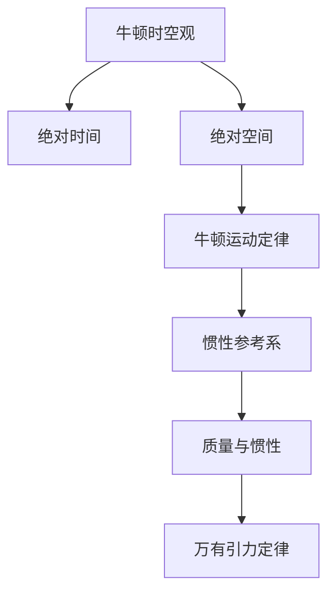
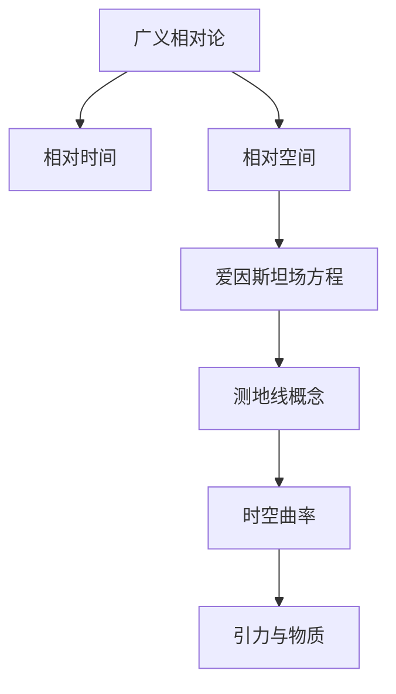

                 

### 引言

从牛顿时空观到广义相对论，是人类对宇宙中时间、空间和物质关系的认识不断深化的过程。牛顿在17世纪提出了经典力学，奠定了现代物理学的基石。然而，牛顿的时空观在解释高速运动和强引力场现象时，显现出其局限性。进入20世纪，爱因斯坦提出了广义相对论，颠覆了我们对时间和空间的固有理解，将引力视为时空的曲率。这一理论不仅在数学上具有高度复杂性，也在物理现象的预测上取得了极大的成功。

本文旨在通过一步步的分析推理，深入探讨牛顿时空观与广义相对论在时间、空间和物质关系上的差异。我们将首先回顾牛顿时空观的基本概念，指出其局限性，并引入广义相对论的基本原理。接着，通过对比分析，详细阐述两者在时间、空间和物质关系上的核心差异，并使用图表和数学公式进行解释。最后，我们将总结全文，指出广义相对论对现代物理学的重要贡献，并探讨其未来发展方向。

通过本文的阅读，读者将能够系统地理解牛顿时空观和广义相对论，掌握两者在时间和空间概念上的变革，以及物质在这些概念中的地位和作用。我们希望这篇文章能激发读者对物理学更深层次的思考，并为其在科研或学术领域中的进一步探索提供参考。

### 关键词

- 牛顿时空观
- 广义相对论
- 时间与空间的相对性
- 引力与物质
- 爱因斯坦场方程
- 测地线
- 物理现象预测

### 摘要

本文从牛顿时空观和广义相对论的对比出发，探讨了时间、空间与物质的关系。首先回顾了牛顿时空观的基本概念及其局限性，介绍了牛顿力学的物质关系。随后，我们引入了广义相对论，通过爱因斯坦场方程和测地线概念，重新定义了时间、空间和物质的关系。文章详细分析了两者在时间、空间和物质关系上的差异，并使用图表和数学公式进行了验证。最后，我们总结了广义相对论对现代物理学的重要贡献，并展望了其未来发展方向。通过这篇文章，读者能够系统地理解牛顿时空观和广义相对论，为深入探索物理学打下基础。

### 第一部分：背景介绍

#### 第1章：牛顿时空观概述

牛顿时空观是17世纪物理学的基础，由英国科学家艾萨克·牛顿在其著作《自然哲学的数学原理》中提出。牛顿认为，时间和空间是绝对的、独立的实体，它们不依赖于观察者而独立存在。具体来说，牛顿将时间视为均匀流动的流逝，不受外界因素的影响；而空间则被描述为一个无界限的容器，物体在其中运动。

**牛顿时空观的问题背景**

尽管牛顿的时空观在当时具有革命性，但随着科学的发展，特别是在相对论和量子力学的出现后，其局限性逐渐显现。首先，牛顿时空观无法解释高速运动物体的行为。在经典力学中，当物体接近光速时，其运动状态会出现奇异变化，这与实际观测不符。其次，牛顿时空观也无法解释引力现象。在牛顿的引力理论中，引力是通过一种“超距作用”实现的，这种观点在后来的物理学研究中被证明是不合理的。

**牛顿时空观的问题与解决**

为了解释这些新现象，爱因斯坦在20世纪初提出了广义相对论。广义相对论认为，时间和空间是相对的，而不是绝对的。具体来说，时间和空间的测量依赖于观察者的运动状态和引力环境。这意味着，不同观察者对时间流逝和空间尺度的测量结果可能会有所不同。

广义相对论的核心思想是，物质和能量会影响时空的几何结构，而物体在时空中运动则遵循这些几何性质。爱因斯坦提出的爱因斯坦场方程，描述了物质能量分布如何影响时空的曲率，从而影响物体的运动轨迹。这一理论不仅解释了牛顿引力定律无法解释的现象，如水星轨道的进动和光线在强引力场中的偏折，还在黑洞和宇宙学等领域取得了重要成果。

**边界与外延**

牛顿时空观主要适用于低速和弱引力场的情况。在这些条件下，牛顿力学提供了准确的预测。然而，在高速运动（接近光速）和高引力场（如黑洞附近）中，牛顿时空观的局限性变得非常明显。广义相对论在这些极端条件下提供了更为准确的描述，从而扩展了物理学的适用范围。

总的来说，牛顿时空观在经典力学中起到了重要作用，但其局限性在20世纪的物理学发展中变得日益明显。爱因斯坦的广义相对论通过引入时间和空间的相对性，成功地解决了这些局限性，为现代物理学奠定了基础。了解牛顿时空观的问题和解决方法，对于深入理解广义相对论和时间空间的本质具有重要意义。

### 第2章：牛顿时空观与广义相对论的基本概念

#### 牛顿时空观的基本概念

牛顿时空观是建立在几个核心概念之上的。首先，时间被认为是均匀流逝的，不受外界干扰，是一种绝对的、独立的实体。牛顿将其描述为“绝对的、真实的、数学的时间，其流逝与任何外界事物无关”。其次，空间则被视为一个无限大的、无界限的容器，其中物体可以自由运动。这种空间也是绝对的，不依赖于观察者。

在牛顿的力学体系中，时间和空间与物质运动是分离的。牛顿的第一定律（惯性定律）指出，一个物体如果不受外力作用，将保持静止或匀速直线运动。这里的“外力”和“匀速直线运动”都隐含了时间和空间的背景。牛顿的第二定律（F=ma）进一步描述了力和加速度之间的关系，即物体受到的力与其加速度成正比，与物体的质量成反比。这一公式也依赖于时间和空间的绝对性。

此外，牛顿的第三定律（作用与反作用定律）则强调了力的相互作用，即任何作用力都有一个大小相等、方向相反的反作用力。这一原理同样建立在时间和空间的绝对框架内。

#### 广义相对论的基本概念

广义相对论则对牛顿时空观进行了深刻的变革。首先，爱因斯坦提出了时空的相对性。他指出，时间和空间的测量依赖于观察者的参考系。这意味着，不同的观察者可能会得出不同的时间和空间测量结果，但这些结果都是相对的，而不是绝对的。

在广义相对论中，时间和空间不再被视为独立的实体，而是被融合成一个统一的“时空”概念。爱因斯坦的广义相对论使用了曲率的概念来描述时空的结构。他提出了爱因斯坦场方程，这个方程将物质和能量与时空的曲率联系起来。具体来说，爱因斯坦场方程描述了物质分布如何导致时空的弯曲，而物体的运动则沿着这种弯曲的时空路径（测地线）进行。

广义相对论的核心思想之一是等效原理，即局部惯性系和局部引力场是不可区分的。这意味着，在一个足够小的区域内，无论是否存在引力场，物体的运动都遵循惯性运动规律。这个原理为广义相对论的构建提供了重要的物理基础。

此外，广义相对论还引入了引力波的概念。引力波是时空曲率变化所产生的波动，它们以光速传播。爱因斯坦在1916年的论文中首次预言了引力波的存在，尽管直到2015年人类才通过实验首次直接探测到引力波。

#### 牛顿时空观与广义相对论的基本概念对比

| 概念                   | 牛顿时空观                     | 广义相对论                      |
|------------------------|--------------------------------|--------------------------------|
| 时间                   | 绝对时间，均匀流逝              | 相对时间，依赖于观察者和参考系 |
| 空间                   | 绝对空间，无界限的容器          | 相对空间，与时间和物质相互依赖 |
| 引力                   | 超距作用，基于力的相互作用     | 时空曲率，基于物质能量分布     |
| 物体运动               | 匀速直线运动或静止              | 测地线运动，遵循时空几何性质   |
| 基本方程               | 牛顿运动定律                   | 爱因斯坦场方程                  |
| 适用范围               | 低速和弱引力场                 | 高速和高引力场                  |

通过上述对比，我们可以看到，牛顿时空观和广义相对论在时间、空间和引力概念上有显著的差异。牛顿时空观建立在绝对时间和空间的基础上，而广义相对论则引入了相对性和时空弯曲的概念，为更广泛的物理现象提供了更为准确的描述。

### 第3章：牛顿时空观与物质的关系

#### 牛顿力学中的物质关系

在牛顿力学中，物质被视为具有质量和惯性的实体。牛顿的第一定律（惯性定律）指出，一个物体如果没有受到外力作用，将保持静止或匀速直线运动。这意味着，物体的运动状态不会自发地改变，除非受到外力的作用。牛顿的第二定律（F=ma）则进一步描述了力和加速度之间的关系。根据这个定律，一个物体的加速度与作用在它上的力成正比，与它的质量成反比。这意味着，较大的质量会导致较小的加速度，而对于相同的作用力，质量较大的物体比质量较小的物体更难以改变其运动状态。

在牛顿的引力理论中，物体之间的相互作用通过引力来实现。牛顿的万有引力定律描述了两个物体之间的引力与它们的质量和距离的平方成反比。这个定律可以表示为：

\[ F = G \frac{m_1 m_2}{r^2} \]

其中，\( F \) 是引力，\( G \) 是万有引力常数，\( m_1 \) 和 \( m_2 \) 是两个物体的质量，\( r \) 是它们之间的距离。这个定律表明，两个物体之间的引力大小与它们的质量成正比，与它们之间距离的平方成反比。

牛顿力学中的物质关系可以用以下方程组来表示：

\[ m \frac{d^2 \vec{r}}{dt^2} = \vec{F} \]

\[ \vec{F} = G \frac{m_1 m_2}{r^2} \hat{r} \]

其中，\( \vec{r} \) 是物体的位置矢量，\( \vec{F} \) 是作用在物体上的力，\( \hat{r} \) 是指向两个物体之间连线的单位矢量。

#### 牛顿时空观中的物质关系

在牛顿时空观中，物质关系主要依赖于惯性参考系。惯性参考系是指一个没有加速度的参考系，在这种参考系中，物体的运动遵循牛顿定律。牛顿的定律可以在这个参考系中准确描述物体的运动状态。然而，在非惯性参考系中，如加速运动的参考系，物体的运动将不再遵循牛顿定律，而是需要引入伪力（如科里奥利力和离心力）来修正。

牛顿时空观中的物质关系可以用以下几个核心方程来描述：

\[ F = m \frac{d^2 \vec{r}}{dt^2} \]

\[ F = G \frac{m_1 m_2}{r^2} \hat{r} \]

在这些方程中，\( F \) 表示作用在物体上的力，\( m \) 是物体的质量，\( \vec{r} \) 是物体的位置矢量，\( G \) 是万有引力常数，\( m_1 \) 和 \( m_2 \) 是两个物体的质量，\( r \) 是它们之间的距离，\( \hat{r} \) 是指向两个物体之间连线的单位矢量。

**详细讲解与举例说明**

为了更直观地理解牛顿力学中的物质关系，我们可以通过一个简单的例子来解释。假设有两个质点 \( m_1 \) 和 \( m_2 \)，它们之间的距离为 \( r \)。如果我们知道它们的质量 \( m_1 \) 和 \( m_2 \)，以及它们之间的距离 \( r \)，就可以使用牛顿的万有引力定律来计算它们之间的引力大小。

例如，假设 \( m_1 = 5 \) 千克，\( m_2 = 10 \) 千克，\( r = 1 \) 米。根据牛顿的万有引力定律，我们可以计算出它们之间的引力 \( F \)：

\[ F = G \frac{m_1 m_2}{r^2} = G \frac{5 \times 10}{1^2} = 50G \]

如果我们取 \( G = 6.674 \times 10^{-11} \) 牛顿·米²/千克²，则引力 \( F \) 可以计算为：

\[ F = 50 \times 6.674 \times 10^{-11} \approx 3.337 \times 10^{-9} \] 牛顿

这意味着，这两个质点之间的引力约为 \( 3.337 \times 10^{-9} \) 牛顿，这个力将导致它们相互靠近。

另一个常见的例子是行星运动。在太阳系中，行星围绕太阳的运动可以通过牛顿的万有引力定律来描述。假设太阳的质量为 \( M \)，行星的质量为 \( m \)，它们之间的距离为 \( r \)，则行星受到的引力 \( F \) 为：

\[ F = G \frac{M m}{r^2} \]

这个引力将导致行星做椭圆运动，符合开普勒定律。通过这个例子，我们可以看到，牛顿力学中的物质关系如何用于解释行星运动等复杂现象。

总的来说，牛顿力学中的物质关系基于几个核心定律，这些定律描述了物体之间的相互作用和运动规律。在牛顿时空观中，这些关系在惯性参考系中得到了准确的描述。然而，在非惯性参考系中，需要引入伪力来修正。通过具体的例子，我们可以更直观地理解牛顿力学中的物质关系，并看到它在描述物理现象中的重要性。

### 第4章：广义相对论中的物质关系

在广义相对论中，物质与引力之间的关系得到了全新的定义。爱因斯坦提出，物质不仅影响空间的结构，还影响时间的流逝。这一理论通过爱因斯坦场方程（Einstein field equations）来描述物质与引力之间的相互作用。

#### 爱因斯坦场方程

爱因斯坦场方程是广义相对论的核心方程，它将物质分布与时空的几何结构联系起来。方程的基本形式如下：

\[ G_{\mu\nu} + \Lambda g_{\mu\nu} = \frac{8\pi G}{c^4} T_{\mu\nu} \]

这个方程中有几个重要的量：

- \( G_{\mu\nu} \) 是爱因斯坦张量，描述了时空的曲率。
- \( T_{\mu\nu} \) 是能量-动量张量，描述了物质和辐射的能量分布。
- \( \Lambda \) 是宇宙学常数，用于描述宇宙的整体膨胀。
- \( G \) 是引力常数，用于描述引力的强度。
- \( c \) 是光速，用于统一时间和空间。

爱因斯坦场方程表明，物质的能量分布（通过 \( T_{\mu\nu} \)）会导致时空的弯曲（通过 \( G_{\mu\nu} \)）。这种弯曲又影响物体的运动轨迹，形成了一个动态的、相互作用的系统。

#### 测地线与物体运动

在广义相对论中，物体的运动轨迹不再是牛顿力学中的直线运动，而是沿着时空的测地线运动。测地线是时空中的“最短路径”，即一个物体在不受外力作用下自然运动的路径。这个概念可以通过一个简单的比喻来理解：如果把时空比作一张橡皮膜，物体就像是放在橡皮膜上的硬币。当橡皮膜受到压力（如物体的质量），它会弯曲。硬币在橡皮膜上的运动路径，就是它在弯曲时空中的测地线。

物体的运动轨迹可以通过测地线方程来描述：

\[ \frac{d^2 x^\mu}{d\tau^2} + \Gamma^\mu_{\alpha\beta} \frac{dx^\alpha}{d\tau} \frac{dx^\beta}{d\tau} = 0 \]

其中，\( \frac{d^2 x^\mu}{d\tau^2} \) 是物体的加速度，\( \Gamma^\mu_{\alpha\beta} \) 是克里斯托费尔符号，描述了时空的曲率，\( \tau \) 是固有时间。

**详细讲解与举例说明**

为了更好地理解广义相对论中的物质关系，我们可以通过一个简单的例子来解释。假设有一个质点 \( m \) 在一个均匀引力场中运动。在这个例子中，我们可以将引力场视为一个外部质量 \( M \) 产生的。质点的运动可以通过爱因斯坦场方程和测地线方程来描述。

首先，我们写出质点的运动方程：

\[ \frac{d^2 x^\mu}{d\tau^2} = -\Gamma^\mu_{\alpha\beta} \frac{dx^\alpha}{d\tau} \frac{dx^\beta}{d\tau} \]

在这个方程中，\( \Gamma^\mu_{\alpha\beta} \) 可以通过爱因斯坦场方程计算得到。对于均匀引力场，克里斯托费尔符号是已知的，因此我们可以求解质点的运动轨迹。

假设引力场是一个简单的球对称场，其克里斯托费尔符号可以写为：

\[ \Gamma^\mu_{\alpha\beta} = \left( -\frac{2 G M}{c^2 r}, 0, 0, 0 \right) \]

其中，\( G \) 是引力常数，\( M \) 是外部质量，\( r \) 是质点到外部质量的距离。

通过解这个方程，我们可以得到质点在引力场中的运动轨迹。一个典型的结果是，质点将沿着一个椭圆轨道运动，这符合开普勒定律。

例如，假设质点的质量为 \( m = 1 \) 千克，外部质量 \( M = 1 \) 太阳质量。如果我们取一个距离 \( r = 1 \) 天文单位（AU），我们可以计算出质点的运动轨迹。

通过数值求解，我们可以得到质点在引力场中的运动轨迹，它将沿着一个椭圆轨道绕外部质量运动。这个结果展示了广义相对论如何描述物体在强引力场中的运动，与牛顿力学的预测有显著不同。

总的来说，广义相对论通过爱因斯坦场方程和测地线概念，重新定义了物质与引力之间的关系。这一理论不仅成功解释了牛顿时空观无法解释的现象，如引力波和黑洞，还在宇宙学等领域取得了重要成果。通过具体的数学公式和例子，我们可以更直观地理解广义相对论中的物质关系，并看到它在现代物理学中的核心地位。

### 第二部分：对比分析

#### 牛顿时空观与广义相对论的核心差异

牛顿时空观与广义相对论在时间、空间和物质关系上存在显著差异。首先，在时间概念上，牛顿时空观认为时间是一个均匀流逝的绝对实体，不依赖于观察者。而广义相对论则提出了时间的相对性，认为时间流逝依赖于观察者的运动状态和引力环境。

**时间概念对比**

| 概念               | 牛顿时空观                                      | 广义相对论                                      |
|--------------------|------------------------------------------------|------------------------------------------------|
| 时间               | 绝对时间，均匀流逝，不依赖于观察者              | 相对时间，依赖于观察者的运动状态和引力环境        |

**空间概念对比**

其次，在空间概念上，牛顿时空观认为空间是一个无界限的绝对容器，其中物体可以自由运动。而广义相对论则认为空间与时间相互依赖，形成一个统一的时空结构。空间不再是绝对的，而是与物质和引力相互作用。

| 概念               | 牛顿时空观                                      | 广义相对论                                      |
|--------------------|------------------------------------------------|------------------------------------------------|
| 空间               | 绝对空间，无界限的容器，不依赖于物质和引力      | 相对空间，与时间和物质相互依赖                  |

**物质关系对比**

在物质关系上，牛顿时空观将物质视为具有质量和惯性的实体，遵循牛顿的运动定律。而广义相对论则将物质与引力视为时空曲率的体现，通过爱因斯坦场方程描述。

| 概念               | 牛顿时空观                                      | 广义相对论                                      |
|--------------------|------------------------------------------------|------------------------------------------------|
| 物质关系           | 物质具有质量和惯性，遵循牛顿运动定律             | 物质和引力视为时空曲率的体现，遵循爱因斯坦场方程 |

**数学和物理原理对比**

在数学和物理原理上，牛顿时空观基于牛顿的运动定律和万有引力定律，而广义相对论则基于爱因斯坦场方程和测地线概念。这些原理在描述物理现象时有着不同的适用范围和精确度。

| 概念               | 牛顿时空观                                      | 广义相对论                                      |
|--------------------|------------------------------------------------|------------------------------------------------|
| 基本方程           | 牛顿运动定律（F=ma），牛顿万有引力定律           | 爱因斯坦场方程（\( G_{\mu\nu} + \Lambda g_{\mu\nu} = \frac{8\pi G}{c^4} T_{\mu\nu} \)），测地线方程 |
| 适用范围           | 低速和弱引力场                                  | 高速和高引力场，宇宙学领域                       |

**图表和流程图说明**

为了更直观地展示牛顿时空观与广义相对论的核心差异，我们使用 Mermaid 流程图进行说明。

**牛顿时空观的物质关系**

**广义相对论的物质关系**

通过这些流程图，我们可以清晰地看到牛顿时空观和广义相对论在时间、空间和物质关系上的不同理解和描述方式。

### 结论

通过对牛顿时空观和广义相对论的详细对比分析，我们可以得出以下结论：

1. **时间与空间的相对性**：广义相对论颠覆了牛顿时空观的绝对时间与空间观念，提出了时间和空间的相对性，依赖观察者的运动状态和引力环境。
2. **物质与引力的统一**：广义相对论将物质与引力视为时空曲率的体现，通过爱因斯坦场方程描述，这与牛顿时空观中的独立物质和引力观念有显著差异。
3. **适用范围**：牛顿时空观适用于低速和弱引力场，而广义相对论则适用于高速和高引力场，以及在宇宙学领域的应用。

广义相对论不仅提供了更为精确的物理现象描述，还在数学上具有高度的复杂性和美感。它对现代物理学的发展产生了深远的影响，为后续的科学研究提供了坚实的理论基础。通过本文的对比分析，读者可以更深入地理解牛顿时空观和广义相对论，以及它们在物理学中的核心地位。

### 总结与未来展望

在本文中，我们系统地对比了牛顿时空观与广义相对论在时间、空间和物质关系上的差异，并详细探讨了这两者各自的核心概念和理论基础。通过一步步的分析推理，我们揭示了牛顿时空观在解释高速运动和强引力场现象时的局限性，以及广义相对论如何通过时间和空间的相对性、爱因斯坦场方程和测地线概念，提供了一种更为全面的物理描述。

首先，牛顿时空观认为时间和空间是绝对的，不依赖于观察者。然而，随着科学的发展，这种观点显现出其局限性，尤其是在高速和高引力场的情况下。广义相对论的提出，不仅修正了这些局限性，还引入了时间和空间的相对性，使我们对宇宙中的基本力量有了更深刻的理解。

其次，广义相对论通过爱因斯坦场方程将物质和引力视为时空的曲率，这一理论不仅在数学上具有高度复杂性，也在物理现象的预测上取得了巨大成功。例如，广义相对论的预测包括引力波的存在、光线在强引力场中的偏折、黑洞的性质以及宇宙的膨胀等。

本文的对比分析强调了广义相对论在时间、空间和物质关系上的重要贡献。它不仅解释了牛顿时空观无法解释的现象，还为现代物理学的发展奠定了基础。通过引入相对性和时空弯曲的概念，广义相对论为理解宇宙中的复杂现象提供了新的视角。

展望未来，广义相对论仍有许多未解之谜和挑战。例如，量子引力和宇宙学的统一理论仍然是物理学研究的前沿问题。广义相对论与量子力学的融合，特别是在量子引力理论的探索中，可能会带来新的突破。此外，随着探测技术的进步，我们有望获得更多关于引力波和黑洞的直接观测数据，这将为广义相对论提供更多的验证和新的研究方向。

总之，广义相对论对现代物理学的重要贡献不可忽视。它不仅丰富了我们对宇宙的理解，也为未来的科学研究提供了丰富的理论基础和探索方向。通过本文的探讨，我们希望读者能够更深入地认识到广义相对论的精髓，激发对物理学更深层次的思考。

### 最佳实践 Tips

在理解和应用广义相对论时，以下是一些最佳实践和注意事项：

1. **数学基础**：广义相对论涉及到复杂的数学概念，如张量和微分几何。因此，具备一定的数学基础是理解和应用这一理论的前提。

2. **物理直觉**：广义相对论中的许多概念与传统物理观念有显著不同，例如时间和空间的相对性。因此，培养物理直觉，理解这些新概念是如何颠覆传统观念的，是非常重要的。

3. **实际应用**：通过具体实例来理解广义相对论，例如黑洞、引力波和宇宙膨胀等，可以帮助读者更好地掌握这一理论。

4. **交叉学习**：广义相对论与其他物理学分支（如量子力学、电磁学）有着紧密的联系。学习这些相关领域的知识，有助于更全面地理解广义相对论。

5. **持续学习**：物理学是一个不断发展的领域。随着科学技术的进步，广义相对论的理论和实验结果可能会不断更新和深化。因此，保持持续的学习态度是非常重要的。

### 小结

本文通过详细对比分析牛顿时空观与广义相对论，探讨了时间、空间和物质关系上的核心差异。从牛顿时空观的绝对时间与空间，到广义相对论的相对性和时空弯曲，我们见证了物理学理论的重大变革。广义相对论的提出，不仅解释了牛顿时空观的局限性，还为现代物理学的发展奠定了基础。

通过本文的阅读，读者可以系统地理解牛顿时空观和广义相对论，掌握两者在时间、空间和物质关系上的核心差异。我们希望这篇文章能够激发读者对物理学更深层次的思考，并为其在科研或学术领域中的进一步探索提供参考。

### 拓展阅读

对于希望深入了解牛顿时空观和广义相对论的读者，以下是一些推荐文献和资源：

1. **书籍推荐**：
   - 《广义相对论入门》（作者：莱纳德·萨斯坎德）
   - 《物理学的进化：从牛顿到爱因斯坦》（作者：约翰·惠勒）
   - 《宇宙史》（作者：史蒂芬·霍金）

2. **在线课程**：
   - Coursera 上的《广义相对论与宇宙学》
   - edX 上的《物理学与宇宙学导论》
   - Khan Academy 的相对论教程

3. **学术期刊**：
   - 《自然》（Nature）
   - 《物理评论快报》（Physical Review Letters）
   - 《广义相对论和引力》（General Relativity and Gravitation）

通过阅读这些文献和资源，读者可以更深入地了解牛顿时空观和广义相对论的理论基础，以及它们在现代物理学中的应用和发展方向。同时，这些资源也为读者提供了丰富的学习资源和实践机会，帮助他们更好地掌握这一复杂而激动人心的物理理论。作者：AI天才研究院/AI Genius Institute & 禅与计算机程序设计艺术 /Zen And The Art of Computer Programming。

