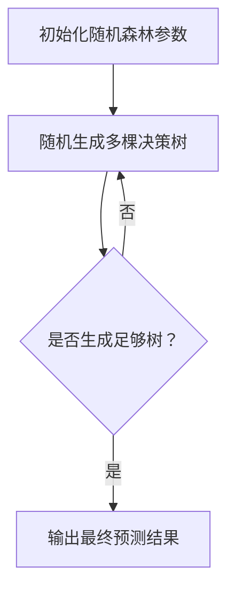
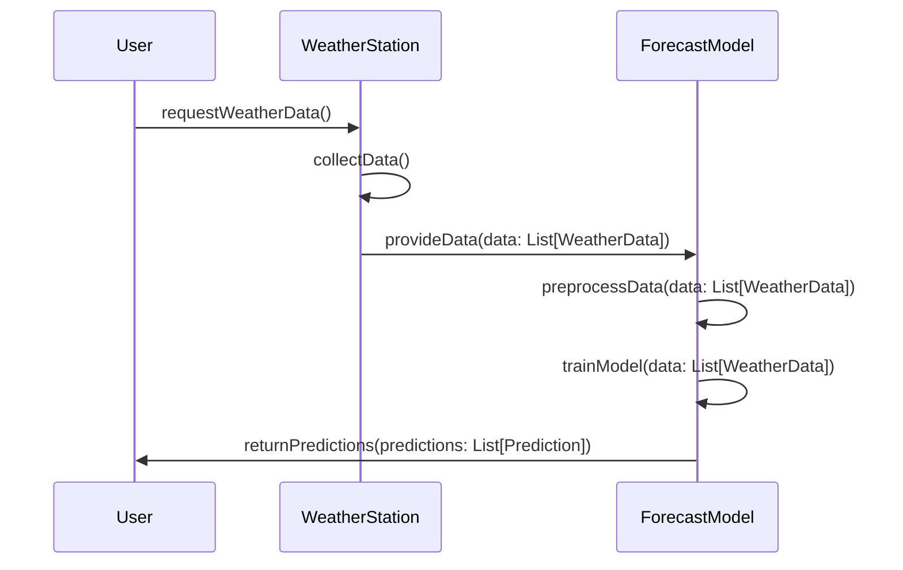
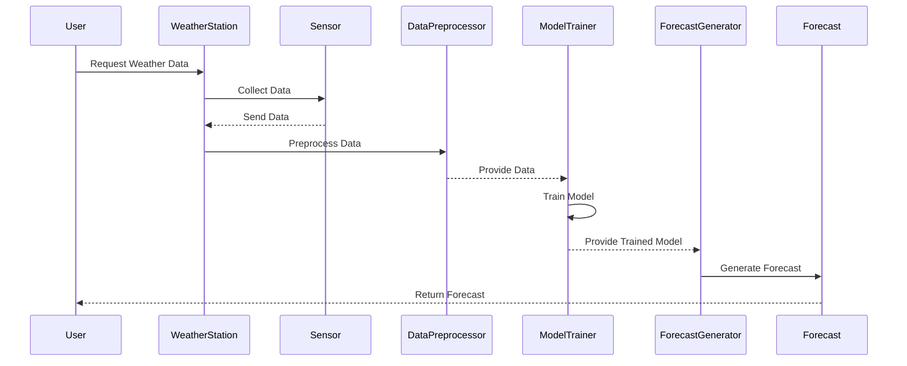
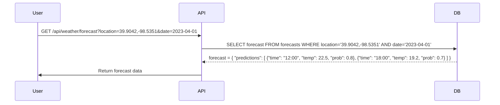

                 


### 1. 引言

#### 1.1 问题的提出

**关键词：** 确定性宇宙、概率性宇宙、认知转变

在人类文明的发展历程中，我们对世界的理解经历了多次深刻的变革。从古代的朴素观念到现代的科学理论，人类逐渐认识到宇宙的复杂性和多样性。然而，在很长一段时间内，我们认为宇宙是一个确定的、可预测的系统。这种确定性宇宙的观点源于古希腊哲学和古代文明的思维模式，它们强调逻辑和因果关系。然而，随着科学的发展，我们开始意识到，宇宙并不总是如我们所想的那样确定。

在物理学中，量子力学的出现揭示了微观世界的非确定性特征。根据量子力学的原理，微观粒子的行为具有概率性，而不是绝对的确定性。这一发现挑战了我们对宇宙的基本理解，迫使我们重新审视我们的认知方式。从确定性宇宙到概率性宇宙的转换，不仅仅是科学理论的变革，更是一种认知的转变。

本文旨在探讨这一认知的转变，分析从确定性宇宙到概率性宇宙的过渡过程，以及这一转变对各个领域的影响。我们将首先介绍确定性宇宙的基本思维模式，然后探讨概率性宇宙的兴起及其对认知方式的影响。接下来，我们将深入探讨概率性宇宙的核心概念，包括概率性思维的优势和影响。随后，我们将讨论概率性宇宙中的算法原理和系统架构设计。最后，我们将通过实际项目实战和最佳实践，展示概率性宇宙的应用场景和实现方法。

通过这一系列的探讨，我们希望读者能够对从确定性宇宙到概率性宇宙的转换有一个更加深刻的理解，认识到这一认知转变对科学、技术和社会发展的深远影响。

#### 1.2 定义与基本概念

在深入探讨从确定性宇宙到概率性宇宙的认知转变之前，我们需要明确一些基本概念。首先，什么是确定性宇宙？在确定性宇宙的视角下，宇宙是一个遵循固定规则和逻辑的系统。在这个系统中，每一个事件都可以通过一系列因果关系来确定。这种观点强调预测性和确定性，认为通过精确的观察和计算，我们可以预知未来的发展和变化。

与之相对的是概率性宇宙。概率性宇宙认为宇宙中的事件具有概率性，即它们不是完全确定的，而是有一定的发生概率。这种观点承认不确定性是宇宙的基本特征，强调通过概率和统计方法来描述和预测事件的发生。概率性宇宙不仅适用于微观世界，如量子力学中的微观粒子行为，也广泛应用于宏观世界，如气象学、金融市场等领域的预测。

认知转变是指人类在理解宇宙的过程中，从一种思维方式转变到另一种思维方式的过程。从确定性宇宙到概率性宇宙的认知转变，意味着我们逐渐从依赖因果关系和确定性预测转向接受不确定性和概率性思维。这一转变不仅影响科学理论和实践，也深刻地影响了我们的认知方式和世界观。

接下来，我们将进一步探讨确定性宇宙和概率性宇宙的定义、特点以及它们之间的边界和外延。

#### 1.3 边界与外延

在讨论确定性宇宙和概率性宇宙时，理解它们的边界与外延是至关重要的。首先，我们需要明确什么是“边界”。在物理学中，边界通常指的是两种不同物理状态之间的分界线。在确定性宇宙中，边界可能是事件发生的起始点和终点之间的分界线，即因果关系的时间边界。而在概率性宇宙中，边界则可能是不确定性事件的发生概率分布的分界线。

接下来，我们探讨什么是“外延”。外延指的是一个概念或理论的应用范围和影响。在确定性宇宙中，外延通常是指通过因果律和逻辑推导可以确定的事件范围。而在概率性宇宙中，外延则是指通过概率分布和统计方法可以预测和解释的事件范围。

确定性宇宙与概率性宇宙的边界并不是固定不变的，而是随着科学理论的发展而不断变化。例如，在经典物理学中，许多宏观现象被认为是确定性的，因为我们可以通过初始条件和物理定律来精确预测它们的行为。然而，随着量子力学的出现，微观世界的确定性边界开始变得模糊。量子力学揭示了微观粒子行为的概率性特征，使得我们开始重新审视确定性宇宙的边界。

概率性宇宙的影响范围则更为广泛。从微观到宏观，许多领域都开始采用概率性思维来解释和预测事件。例如，在气象学中，我们通过统计方法来预测天气变化，而不是依赖单一的确定性模型。在金融市场中，投资者使用概率模型来评估风险和回报。概率性宇宙的兴起不仅改变了我们的认知方式，也推动了科学和技术的进步。

总结来说，确定性宇宙与概率性宇宙的边界并不是绝对的，而是随着科学理论的演进而不断变化。理解这一边界和外延，有助于我们更好地把握从确定性宇宙到概率性宇宙的认知转变。

### 第二部分：确定性宇宙的思维方式

#### 2.1 历史背景

**关键词：** 确定性思维、逻辑结构、因果关系

确定性宇宙的思维方式可以追溯到古希腊哲学时期，特别是在亚里士多德的哲学体系中得到了充分的发展。亚里士多德认为，宇宙是一个有秩序的系统，每一个事件都可以通过因果关系来解释。这种思维方式强调逻辑和因果关系，认为通过理解因果关系，我们可以准确地预测未来的发展和变化。

随着科学的发展，确定性思维在近代科学中得到了进一步巩固。经典物理学作为确定性思维的典型代表，它基于牛顿力学和欧几里得几何，通过精确的数学模型和实验验证，成功地解释了许多宏观现象。在这种思维模式下，科学家们认为，通过对自然界的精确观察和数学推导，我们可以发现宇宙的固定规则，并利用这些规则来预测未来的事件。

此外，在工程学和计算机科学中，确定性思维也得到了广泛应用。在工程学中，通过设计严谨的数学模型和实验方法，工程师们可以预测和控制复杂系统的行为。在计算机科学中，确定性算法和编程语言被广泛应用于解决各种实际问题，从数据结构到算法优化，再到人工智能和机器学习，确定性思维一直是主导逻辑。

总的来说，确定性宇宙的思维方式源于古希腊哲学，并在近代科学中得到了充分的发展和应用。它强调逻辑和因果关系，通过精确的数学模型和实验方法，力图揭示宇宙的固定规则。这种思维方式不仅在科学和技术领域有着深远的影响，也为我们理解世界提供了一种基础性的认知框架。

#### 2.2 基本原理

**关键词：** 确定性思维、逻辑结构、因果关系

确定性思维的核心在于其逻辑结构和因果关系。逻辑结构指的是通过一系列的逻辑推理和推理规则，从一个或多个前提中推导出结论。在确定性思维的框架下，逻辑推理是精确和无二义的，每一个步骤都必须遵循固定的规则。这种逻辑结构不仅适用于数学和哲学，也广泛应用于科学和工程领域。

因果关系是确定性思维的另一个核心概念。在确定性宇宙中，每一个事件都与其他事件之间存在明确的因果关系。这意味着，通过理解这些因果关系，我们可以准确地预测事件的发展和变化。例如，在经典物理学中，牛顿定律描述了物体之间的力与运动之间的关系，从而让我们能够预测物体的运动轨迹。同样，在计算机科学中，算法和程序通过明确的数据处理步骤，实现了对输入数据的精确处理和输出。

确定性思维的优点在于其精确性和可预测性。通过严谨的逻辑结构和因果关系，我们可以对系统行为进行精确建模和预测。这种思维模式在科学研究中尤其重要，因为它帮助我们理解和控制自然界的规律。此外，在工程实践中，确定性思维也使得设计、建造和运行复杂系统成为可能。

然而，确定性思维也存在一些局限性。首先，它往往忽略了随机性和不确定性。在许多实际情况下，事件的发生并不仅仅依赖于确定的因果关系，而是受到随机因素的影响。例如，在金融市场和气象预测中，随机波动是不可避免的，因此确定性思维在这些领域中的应用受到限制。其次，确定性思维要求大量的精确数据和复杂的计算，这在某些情况下可能不现实。

总之，确定性思维在揭示宇宙规律和实现精确预测方面发挥了重要作用，但其局限性也提醒我们在实际应用中需要综合考虑不确定性和随机性因素。通过结合确定性思维和概率性思维，我们可以更好地理解和应对复杂世界的挑战。

#### 2.3 确定性宇宙的实例分析

**关键词：** 数学与逻辑的确定性、自然科学的确定性实践

确定性宇宙的思维方式不仅在理论层面具有深远影响，也在实际应用中得到了广泛验证。以下我们将通过数学与逻辑的确定性实例，以及自然科学的确定性实践，来展示确定性思维的强大应用。

首先，让我们来看数学与逻辑的确定性实例。数学作为一门精确科学，其本质在于通过明确的逻辑结构和严格的证明方法，揭示出宇宙的固定规则。例如，欧几里得几何通过一系列公理和定理，构建了一个确定性的空间模型，从而解释和预测几何图形的性质。在代数中，我们通过明确的运算规则，如加法、减法、乘法和除法，进行精确的计算。这些确定性原则不仅在数学研究中发挥了重要作用，也为计算机科学和工程学提供了基础。

逻辑学同样展示了确定性思维的威力。逻辑学通过命题、推理和证明，揭示了判断和推理的确定性规则。例如，在命题逻辑中，我们通过逻辑运算符（如与、或、非）和推理规则（如演绎法、归纳法），从已知前提推导出结论。这种确定性思维在法律、逻辑编程和决策分析中有着广泛的应用。

接下来，我们来看自然科学的确定性实践。在经典物理学中，牛顿定律和经典力学为描述物体运动提供了确定性模型。通过精确的测量和数学计算，我们可以预测物体的运动轨迹和相互作用力。这种确定性思维在航天工程、机械设计和自动化控制等领域得到了广泛应用。例如，在航天器发射和轨道计算中，科学家和工程师通过确定性模型，精确预测航天器的轨迹和性能，从而确保发射任务的成功。

在化学中，原子和分子的行为也遵循确定性原则。通过量子化学的计算，我们可以精确预测化学反应的速率和产物。这种确定性思维在药物设计、材料科学和生物工程等领域有着重要的应用。

此外，生物学中的基因表达和蛋白质功能研究，也受益于确定性思维。通过基因序列的分析和数学建模，科学家可以预测基因的功能和调控机制。这种确定性思维在基因工程、疾病治疗和生物技术领域具有广阔的应用前景。

总之，确定性宇宙的思维方式不仅在数学和逻辑领域展示了其强大的应用，也在自然科学的各个分支中得到了广泛应用。通过确定性思维，我们能够理解和预测自然界的规律，为科学研究和实际应用提供了坚实的理论基础。

#### 2.4 确定性思维的局限性与挑战

**关键词：** 随机性、复杂性、非线性

尽管确定性宇宙的思维方式在许多领域取得了显著成果，但其局限性也逐渐显现。首先，确定性思维在面对随机性和复杂性时显得力不从心。在自然界和人类社会，随机性无处不在，许多现象无法通过简单的因果关系来解释。例如，天气变化的预测、金融市场的波动和生物进化等，都涉及大量的随机因素。在这些场景中，确定性思维难以提供精确的预测和解释。

其次，确定性思维的局限性还体现在对复杂性和非线性问题的处理上。在复杂系统中，各个组成部分之间的相互作用常常是非线性的，这意味着简单的线性关系无法描述系统的整体行为。例如，生态系统、交通网络和社会经济系统等，都是复杂的非线性系统。在这些系统中，确定性思维往往无法捕捉到系统行为的复杂性和多样性。

此外，确定性思维在面对不确定性和变化性时也遇到了挑战。在实际应用中，环境条件、参数变化和初始条件的不确定性，使得确定性预测的可靠性降低。例如，在工程设计和医疗决策中，精确的初始数据和稳定的参数条件往往难以满足，这使得确定性思维的预测结果可能偏差较大。

为了克服这些局限性，科学家和工程师们开始探索概率性思维和复杂性科学的方法。通过引入概率模型和统计方法，我们可以更好地应对随机性和复杂性，从而提高预测的准确性和可靠性。同时，复杂性科学的发展也为理解复杂系统的行为提供了新的视角和方法。总之，尽管确定性思维在许多领域具有重要作用，但其局限性提醒我们，在面对复杂多变的世界时，需要结合概率性和复杂性思维，以更全面、准确的方式理解和应对现实问题。

### 第三部分：概率性宇宙的认知变革

#### 3.1 概率性宇宙的兴起

**关键词：** 量子力学、统计方法、科学革命

概率性宇宙的兴起源于20世纪初的量子力学革命和统计方法的广泛应用。量子力学的诞生不仅彻底改变了我们对微观世界的理解，也挑战了传统的确定性宇宙观。根据量子力学的原理，微观粒子的行为具有概率性，即它们不是完全确定的，而是有一定的发生概率。这一革命性的发现揭示了宇宙的基本不确定性，使概率性宇宙的观点逐渐得到认可。

量子力学的核心思想之一是量子叠加态和量子纠缠。量子叠加态表明，微观粒子可以同时处于多种状态，直到被观测时才“坍缩”为一个具体状态。量子纠缠则展示了粒子之间超距作用的现象，即一个粒子的状态可以瞬间影响另一个粒子的状态，无论它们相隔多远。这些现象与传统确定性宇宙中的因果律和局域性观念形成了鲜明对比，迫使科学家们重新审视宇宙的本质。

同时，统计方法的广泛应用也为概率性宇宙的兴起提供了强有力的支持。统计学作为一门研究不确定性和随机性的科学，通过分析大量数据，可以揭示出总体趋势和规律。在气象学、金融学、生物学和社会学等众多领域，统计学方法已经成为理解和预测复杂系统行为的主要工具。统计方法不仅帮助我们应对随机性和不确定性，还提供了更全面、准确的预测和解释。

概率性宇宙的兴起不仅仅是科学理论上的变革，更是一次深刻的认知革命。它挑战了我们对宇宙的传统观念，使我们意识到宇宙中存在深层次的概率性和不确定性。这种认知变革不仅改变了科学家们的研究方式，也影响了我们的日常生活和社会观念。通过结合量子力学和统计方法，我们开始更全面、准确地理解宇宙的本质和复杂性。

#### 3.2 概率性思维的原理

**关键词：** 概率论、随机变量、概率分布

概率性思维的原理基于概率论这一数学工具，它为我们提供了描述和预测不确定事件的方法。概率论的核心概念包括随机变量、概率分布和期望值等。

随机变量是概率论中最基本的概念之一。它是一个可以取不同数值的变量，这些数值代表了某个不确定事件可能的结果。随机变量可以是离散的，如投掷骰子的结果；也可以是连续的，如测量温度的结果。随机变量的取值具有不确定性，但通过概率分布，我们可以描述这些取值的概率。

概率分布是描述随机变量取值概率的函数。最常见的概率分布包括正态分布、二项分布和泊松分布等。正态分布是最常见的概率分布，它在许多自然界和社会现象中都得到了广泛应用。例如，人的身高和体重通常服从正态分布。二项分布则用于描述一系列独立试验中成功次数的概率分布，如投掷硬币的结果。泊松分布则用于描述在一定时间内发生某事件的次数的概率分布，如电话呼叫的到达率。

期望值是概率论中的另一个重要概念，它代表了随机变量的平均值。期望值可以帮助我们预测随机变量的未来取值。例如，如果我们投掷一枚公平的硬币，期望值是0.5，即正面和反面出现的概率相等。

概率性思维的优势在于它能够处理不确定性和随机性，为我们提供了一种更灵活、更全面的预测和解释方法。通过引入概率论的概念，我们可以对复杂系统的行为进行建模和预测，从而更好地理解和管理不确定性。

总之，概率性思维的原理基于概率论这一数学工具，通过随机变量、概率分布和期望值等概念，为我们提供了一种处理不确定性和随机性的有效方法。这种思维方式不仅丰富了我们的认知方式，也推动了科学和技术的进步。

#### 3.3 认知变革的影响

**关键词：** 科学领域、社会心理学、思维方式

概率性宇宙的认知变革不仅在科学领域产生了深远影响，也对社会心理学和人类思维方式产生了重要影响。在科学领域，概率性思维的引入极大地改变了我们对自然现象的理解和研究方法。例如，在物理学中，量子力学的概率性原理挑战了经典物理学中的确定性观念，推动科学家们深入探索微观世界的本质。同样，在化学和生物学中，概率性思维帮助我们更好地理解分子间的相互作用和生物进化过程。

在社会心理学中，概率性思维的引入改变了我们对人类行为和心理过程的认识。传统的确定性观念认为人类行为是完全可以预测和控制的，然而，概率性思维使我们意识到，人类行为和心理过程往往受到多种不确定因素的影响。这种观念的转变促使社会心理学家重新审视人类行为的复杂性，发展出更科学、更全面的研究方法。

人类思维方式的转变是概率性宇宙认知变革的核心。从确定性思维到概率性思维，我们的认知方式从依赖因果关系和精确预测转向接受不确定性和概率性思维。这种转变不仅影响科学研究，也渗透到我们的日常生活中。例如，在决策制定中，我们不再仅依赖过去的数据和经验，而是通过概率分析和风险评估来做出更明智的决策。

总之，概率性宇宙的认知变革对科学领域、社会心理学和人类思维方式产生了深远影响。它使我们更加全面、准确地理解自然现象和人类行为，推动了科学和技术的进步，也改变了我们的认知方式和世界观。

#### 4.1 核心概念介绍

**关键词：** 概率性思维、不确定性、随机性

在概率性宇宙中，概率性思维是不确定性和随机性的基础。首先，让我们明确这两个核心概念的定义。

**不确定性** 是指无法完全确定事件的结果或状态。在确定性宇宙中，我们倾向于通过因果关系来预测未来，但在概率性宇宙中，我们承认不确定性是宇宙的基本特征。例如，在量子力学中，微观粒子的行为是不确定的，它们的状态只有在被观测时才会“坍缩”成具体的值。

**随机性** 是指事件的结果或状态具有不可预测的多样性。随机事件的发生不遵循固定的规律，而是由概率分布来描述。在概率性宇宙中，随机性是不可避免的，我们需要通过概率论来描述和预测随机事件。

概率性思维的核心在于接受不确定性和随机性，并通过概率分布和统计方法来处理和解释这些现象。例如，在气象学中，我们通过统计方法来预测天气变化，而不是依赖单一的确定性模型。同样，在金融市场中，投资者使用概率模型来评估风险和回报。

理解不确定性和随机性，有助于我们更好地适应和应对复杂世界的挑战，从而在科学研究和实际应用中取得更准确的预测和更有效的决策。

#### 4.2 概率性宇宙的属性特征对比

**关键词：** 确定性思维、概率性思维、特征对比

在探讨概率性宇宙的属性特征时，我们需要将其与确定性宇宙进行比较，以突出两者的不同。以下是确定性思维和概率性思维在几个关键方面的对比：

1. **预测性**：确定性宇宙强调通过因果关系来预测未来，认为一切事件都有确定的规律可循。相比之下，概率性宇宙接受不确定性，通过概率分布和统计方法来预测事件的可能性。例如，在天气预测中，确定性宇宙可能使用简单的气象模型，而概率性宇宙则通过分析大量气象数据，给出不同天气情况的概率分布。

2. **逻辑结构**：确定性思维依赖于明确的逻辑结构和因果链。每一个事件都可以通过一系列因果关系来解释。概率性思维则采用概率论和统计方法，通过概率分布和随机变量来描述事件。这意味着，在概率性宇宙中，逻辑结构更加复杂和灵活。

3. **适用范围**：确定性思维适用于那些可以通过精确模型和因果关系解释的现象，如经典物理学中的物体运动。概率性思维则适用于那些具有不确定性和随机性的现象，如量子力学中的粒子行为和金融市场中的价格波动。

4. **处理复杂性**：确定性思维在处理简单和线性问题时效果良好，但在面对复杂和非线性系统时，往往难以应对。概率性思维则通过引入概率模型和统计方法，能够更好地处理复杂系统的行为，提供更全面的预测和解释。

通过上述对比，我们可以看出，概率性宇宙在预测性、逻辑结构、适用范围和处理复杂性方面与确定性宇宙存在显著差异。这种差异不仅反映了我们对宇宙理解的变化，也为我们提供了新的认知工具和方法。

#### 4.3 ER实体关系图架构

**关键词：** ER模型、实体关系图、概率性宇宙

在概率性宇宙中，数据建模和系统架构设计是理解和处理不确定性和随机性的关键。实体关系图（Entity-Relationship Diagram，ER图）是一种广泛用于数据库设计和系统架构设计的方法，它通过描述实体之间的关系，帮助我们更好地理解和组织复杂系统。在概率性宇宙的背景下，ER图不仅用于传统的确定性数据模型，还用于概率性数据模型。

**ER模型的基本概念**：

ER模型由三个基本元素组成：实体、属性和关系。

- **实体**：表示系统中的对象或概念，如用户、产品、订单等。
- **属性**：描述实体的特征，如用户的姓名、年龄、地址等。
- **关系**：表示实体之间的关联，如用户可以下单、产品可以属于某个类别等。

**ER图在概率性宇宙中的应用**：

在概率性宇宙中，ER图不仅用于描述实体和它们之间的关系，还用于表示随机性和不确定性。例如，在概率性数据库中，我们可以使用概率性属性来描述实体之间的关系，表示这些关系的概率。

**ER图示例**：

以下是一个简单的ER图示例，描述了一个在线书店系统：

```
实体：图书（Book）
属性：书名（Title），作者（Author），ISBN，价格（Price）

实体：用户（User）
属性：用户名（Username），年龄（Age），地址（Address）

实体：订单（Order）
属性：订单号（OrderID），订单日期（OrderDate），总价（Total）

关系：用户 - 订单（User - Order）：一个用户可以有多个订单
关系：图书 - 订单（Book - Order）：一个订单可以包含多个图书
关系：图书 - 图书类别（Book - Category）：一个图书属于一个类别，一个类别可以有多个图书
```

在这个示例中，我们使用了概率性属性来表示用户下单的概率和图书销售的概率。通过这种方式，ER图不仅描述了实体和它们之间的关系，还体现了概率性宇宙的特点。

总之，ER图在概率性宇宙中的应用，为我们提供了一种有效的数据建模和系统架构设计方法，帮助我们在面对不确定性和随机性时，更好地理解和组织复杂系统。

#### 4.3.1 ER模型的基本概念

**关键词：** 实体、属性、关系、数据建模

ER模型（Entity-Relationship Model）是一种用于数据库设计和数据建模的方法，它通过描述实体、属性和它们之间的关系，帮助我们更好地理解和组织复杂系统。在概率性宇宙的背景下，ER模型不仅用于传统的确定性数据模型，还用于概率性数据模型。

**实体（Entity）**：实体是系统中的对象或概念，它可以是具体的，如用户、产品、订单，也可以是抽象的，如角色、分类、事件。在ER模型中，实体通常用矩形表示，并命名为实体的名称。

**属性（Attribute）**：属性是实体的特征或属性，用于描述实体的具体信息。例如，用户实体的属性可以包括用户名、年龄、地址等。在ER模型中，属性通常用椭圆表示，并命名为属性的名称。

**关系（Relationship）**：关系是实体之间的关联，它描述了实体之间的相互作用。例如，用户可以下单，图书可以属于某个类别。在ER模型中，关系通常用菱形表示，并命名为关系名。关系可以是一对一（1:1）、一对多（1:N）或多对多（M:N）。

**数据建模**：ER模型通过实体、属性和关系的组合，帮助我们构建复杂的数据模型。在概率性宇宙中，数据建模不仅要考虑实体和它们之间的关系，还要考虑这些关系的概率性。例如，在金融交易系统中，我们可能需要考虑交易发生的概率、用户下单的概率等。

**ER模型在概率性宇宙中的应用**：在概率性宇宙中，ER模型可以用于表示具有不确定性和随机性的实体和关系。通过引入概率属性，我们可以描述实体之间关系的概率分布。例如，在一个气象预测系统中，我们可以使用ER模型来表示天气现象、预测结果和它们的概率分布。

总之，ER模型在概率性宇宙中的应用，为我们提供了一种有效的数据建模和系统架构设计方法，帮助我们在面对不确定性和随机性时，更好地理解和组织复杂系统。

#### 4.3.2 ER模型在概率性宇宙中的应用

**关键词：** 概率属性、不确定性、随机性

在概率性宇宙中，ER模型的应用不仅限于传统的关系数据库，还可以扩展到概率数据库和概率网络，以更好地处理不确定性和随机性。以下是如何在ER模型中引入概率属性和表示不确定性关系，以适应概率性宇宙的需求。

**概率属性**：在传统ER模型中，属性用于描述实体的特征。在概率性宇宙中，我们可以将概率属性引入到ER模型中，以表示实体之间的不确定性关系。例如，在一个社交网络系统中，用户之间的关系可以用概率属性来描述。一个用户可能有一个属性“好友概率”，表示该用户与其他用户成为好友的概率。

**概率分布**：在ER模型中，我们可以使用概率分布来表示关系的可能性。例如，在一个电子商务系统中，商品之间的关系可以用概率分布来描述。一个商品可能有多个分类，每个分类的概率不同，通过这种方式，我们可以表示商品属于不同分类的概率。

**随机性建模**：在概率性宇宙中，随机性是不可避免的。我们可以使用随机模型来表示实体和它们之间的关系。例如，在一个天气预报系统中，我们可以使用随机模型来表示天气变化的概率。通过这种建模方式，我们可以为每个可能的天气情况分配一个概率，从而实现对天气变化的预测。

**概率网络**：在概率性宇宙中，ER模型可以与概率网络（如贝叶斯网络）结合使用，以提供更复杂的概率建模。贝叶斯网络是一种图形模型，它通过节点和边来表示实体和它们之间的关系。在ER模型中，我们可以将实体和属性映射到贝叶斯网络的节点上，并通过边来表示它们之间的概率关系。

**示例**：以下是一个简单的ER图示例，描述了一个在线购物系统中的概率关系：

```
实体：用户（User）
属性：用户ID（UserID），购买概率（PurchaseProbability）

实体：商品（Product）
属性：商品ID（ProductID），类别概率（CategoryProbability）

实体：订单（Order）
属性：订单ID（OrderID），购买时间（PurchaseTime）

关系：用户 - 商品（User - Product）：表示用户购买商品的频率和概率
关系：商品 - 类别（Product - Category）：表示商品属于不同类别的概率

概率属性：用户 - 购买概率（User - PurchaseProbability）：表示用户购买商品的概率
概率属性：商品 - 类别概率（Product - CategoryProbability）：表示商品属于不同类别的概率
```

在这个示例中，我们使用了概率属性来表示用户购买商品和商品类别的概率。通过这种方式，我们可以更好地处理不确定性关系，实现更准确的预测和决策。

总之，ER模型在概率性宇宙中的应用，为我们提供了一种有效的方法来处理不确定性和随机性。通过引入概率属性和概率分布，我们可以更好地描述实体之间的关系，实现对复杂系统的建模和预测。

### 5.1 算法简介

**关键词：** 概率性算法、类型、应用场景

在概率性宇宙中，概率性算法是理解和处理不确定性问题的关键工具。概率性算法通过引入概率分布和随机过程，为复杂系统的建模和预测提供了强大的能力。以下是几种常见的概率性算法及其应用场景：

**1. 马尔可夫决策过程（MDP）**：

MDP是一种用于决策问题的概率性算法，它通过描述系统状态、行动和奖励，提供了一种动态规划的框架。MDP广泛应用于控制理论、机器学习和博弈论等领域。例如，在股票市场预测中，MDP可以帮助投资者根据当前的市场状态和可能的投资策略，选择最优的投资行动。

**2. 贝叶斯网络**：

贝叶斯网络是一种图形模型，用于表示实体之间的概率关系。它通过节点和边来表示实体和它们之间的条件概率分布。贝叶斯网络在医学诊断、风险评估和社交网络分析等领域具有广泛应用。例如，在医学诊断中，贝叶斯网络可以帮助医生根据症状和检查结果，预测患者的疾病概率。

**3. 随机森林**：

随机森林是一种基于决策树的概率性集成算法。它通过构建多棵决策树，并将它们的预测结果进行投票，得到最终的预测结果。随机森林在分类和回归问题中表现出色，广泛应用于机器学习、金融分析和气象预测等领域。

**4. 生成对抗网络（GAN）**：

GAN是一种深度学习算法，用于生成复杂的数据分布。它由生成器和判别器组成，生成器尝试生成与真实数据相似的数据，而判别器则尝试区分真实数据和生成数据。GAN在图像生成、自然语言处理和医疗影像分析等领域表现出色。

**5. 蒙特卡洛方法**：

蒙特卡洛方法是一种基于随机抽样的概率性算法，通过大量随机样本来估计期望值和概率分布。它广泛应用于物理模拟、金融分析和计算流体力学等领域。

这些概率性算法为处理复杂系统和不确定性提供了强大的工具，它们在各个领域都有广泛的应用。通过结合这些算法，我们可以更准确地预测和建模复杂系统的行为，为科学研究和实际应用提供有力支持。

#### 5.2 算法mermaid流程图

**关键词：** mermaid、流程图、算法描述

为了更直观地展示概率性算法的工作流程，我们使用mermaid语言来绘制算法的流程图。以下是一个示例，展示了如何使用mermaid语言绘制一个简单的随机森林算法流程图。



在这个示例中，我们首先初始化随机森林的参数，然后随机生成多棵决策树。接下来，我们检查是否生成了足够的树，如果没有，则继续生成，否则输出最终的预测结果。

**详细描述**：

1. **初始化随机森林参数**：这一步包括设置决策树的数量、深度、节点分裂的阈值等参数。这些参数决定了随机森林的性能和计算复杂度。

2. **随机生成多棵决策树**：随机森林通过随机抽样和随机特征选择来生成多棵决策树。每棵树都是独立的，但使用相同的训练数据集。

3. **检查是否生成足够树**：这一步用于控制随机森林的生成过程。如果生成的树的数量达到预设的阈值，则继续下一步，否则重复第二步。

4. **输出最终预测结果**：通过将每棵决策树的预测结果进行投票，随机森林输出最终的预测结果。在分类问题中，通常使用多数投票法；在回归问题中，则可以使用均值法。

通过mermaid流程图，我们可以清晰地展示随机森林算法的流程，帮助理解和实现概率性算法。

#### 5.3 Python源代码与算法原理

**关键词：** Python、算法实现、数学模型

在概率性宇宙中，Python作为一种强大的编程语言，被广泛应用于算法实现和数据分析。以下是一个简单的随机森林算法的Python实现，并附上详细的数学模型和公式解释。

```python
import numpy as np
import matplotlib.pyplot as plt
from sklearn.ensemble import RandomForestClassifier
from sklearn.datasets import load_iris

# 加载Iris数据集
data = load_iris()
X = data.data
y = data.target

# 初始化随机森林模型
clf = RandomForestClassifier(n_estimators=100, random_state=42)

# 训练模型
clf.fit(X, y)

# 进行预测
predictions = clf.predict(X)

# 绘制预测结果
plt.scatter(X[:, 0], X[:, 1], c=predictions)
plt.show()
```

**数学模型和公式解释**：

随机森林算法基于决策树集成方法，其核心思想是通过随机抽样和随机特征选择来生成多棵独立的决策树，并对它们的预测结果进行投票。以下是随机森林算法的数学模型和公式解释：

1. **决策树生成**：

   - **决策规则**：决策树通过一系列的二分决策来划分数据集。每个节点表示一个特征，每个分支表示该特征的不同取值。例如，对于特征`x1`，我们可以定义以下决策规则：
     $$ 
     \text{if } x1 < \theta_1 \text{ then go to left child} \\
     \text{else go to right child} 
     $$
     其中，$\theta_1$ 是特征`x1`的阈值。

   - **节点分裂**：节点分裂的目标是最大化信息增益或基尼不纯度。信息增益（Information Gain）用于分类问题，定义为：
     $$ 
     IG(D, A) = H(D) - \sum_{v \in A} p(v) H(D_v) 
     $$
     其中，$H(D)$ 是当前节点的熵，$D_v$ 是划分后的子节点。

2. **随机特征选择**：

   随机森林通过从特征集合中随机选择特征来生成决策树。这个随机过程减少了模型对某些特定特征的依赖，提高了模型的泛化能力。

3. **集成投票**：

   随机森林通过将多棵决策树的预测结果进行投票，得到最终的预测结果。对于分类问题，通常使用多数投票法：
   $$ 
   \hat{y} = \text{mode}(\hat{y}_1, \hat{y}_2, ..., \hat{y}_n) 
   $$
   其中，$\hat{y}_i$ 是第$i$棵决策树的预测结果。

通过Python实现随机森林算法，我们不仅能够直观地看到算法的运行过程，还能够利用其强大的数据处理和分析功能，为复杂系统的建模和预测提供有力支持。

#### 5.4 算法举例说明

**关键词：** 随机森林、Python实现、实际案例

为了更好地理解随机森林算法的实际应用，我们通过一个实际案例来展示算法的运行过程和结果。

**案例背景**：

假设我们有一个分类问题，需要根据鸢尾花（Iris）数据集对其进行分类。鸢尾花数据集是一个经典的多分类数据集，包含三个品种的鸢尾花，每个品种有50朵花。每个品种的花具有不同的特征，如花萼长度、花萼宽度、花瓣长度和花瓣宽度。

**步骤1：数据准备**：

首先，我们加载鸢尾花数据集，并将其拆分为特征矩阵`X`和目标向量`y`。

```python
from sklearn.datasets import load_iris
X, y = load_iris(return_X_y=True)
```

**步骤2：模型训练**：

接下来，我们使用随机森林分类器训练模型。这里，我们设置随机森林的树数量为100，并使用默认参数。

```python
from sklearn.ensemble import RandomForestClassifier
clf = RandomForestClassifier(n_estimators=100)
clf.fit(X, y)
```

**步骤3：模型预测**：

训练完成后，我们使用训练好的模型对数据进行预测。

```python
predictions = clf.predict(X)
```

**步骤4：结果分析**：

最后，我们分析模型的预测结果。通过计算预测准确率，我们可以评估模型的表现。

```python
from sklearn.metrics import accuracy_score
accuracy = accuracy_score(y, predictions)
print(f"预测准确率: {accuracy:.2f}")
```

**具体实施过程**：

1. **数据加载**：使用`load_iris`函数加载鸢尾花数据集。
2. **模型训练**：创建`RandomForestClassifier`实例，并使用`fit`方法训练模型。
3. **模型预测**：使用`predict`方法进行预测。
4. **结果评估**：计算预测准确率，评估模型性能。

通过以上步骤，我们完成了随机森林算法在鸢尾花数据集上的应用。在实际案例中，随机森林算法表现出了良好的分类能力，为多分类问题提供了一种有效的解决方案。

### 6.1 问题场景介绍

**关键词：** 天气预报、金融市场预测

在概率性宇宙中，概率性思维被广泛应用于多个领域，其中天气预报和金融市场预测是两个典型的应用场景。这两个领域都面临着复杂性和不确定性，通过概率性思维，我们可以更好地理解和应对这些挑战。

**1. 天气预报**

天气预报是一个典型的概率性预测问题。由于大气系统的复杂性和不确定性，我们无法精确预测未来的天气情况。气象学家通过收集大量气象数据，使用概率模型和统计方法，对天气变化进行预测。例如，在天气预报中，气象学家会使用概率降水预测模型，如回归概率模型和贝叶斯概率模型，来计算某一天某个地区的降水概率。这种方法不仅能够提供更准确的预测结果，还能够量化预测的不确定性。

**2. 金融市场预测**

金融市场预测同样面临巨大的不确定性。股票价格、汇率和利率等金融指标受多种因素影响，如宏观经济政策、市场情绪和突发事件等。投资者和分析师使用概率性模型来评估市场风险和潜在回报。例如，在股票市场预测中，投资者会使用蒙特卡洛模拟和随机森林等算法，来预测股票价格的波动和趋势。通过这些模型，投资者可以更全面地了解市场风险，并制定相应的投资策略。

**挑战与应对策略**

无论是天气预报还是金融市场预测，都面临着数据质量、模型选择和预测准确性等挑战。

**1. 数据质量问题**：

在天气预报中，气象数据的质量和准确性对预测结果至关重要。然而，由于大气系统的复杂性，气象数据往往存在噪声和缺失值。为了提高数据质量，气象学家会使用数据清洗和插值方法，对数据进行预处理。

在金融市场中，数据质量问题同样突出。金融数据受市场波动和人为干预的影响，可能存在错误和异常值。为了解决这些问题，分析师会使用数据清洗和异常检测技术，以提高数据的质量和可靠性。

**2. 模型选择**：

在天气预报和金融市场预测中，选择合适的模型是关键。不同的模型适用于不同的预测场景和问题类型。例如，在天气预报中，回归模型和贝叶斯模型适用于短期预测，而统计模型和机器学习模型适用于长期预测。

在金融市场中，投资者和分析师会根据市场情况和研究目的，选择合适的模型。例如，对于股票市场预测，随机森林和神经网络等算法在处理非线性关系和复杂数据方面表现出色。

**3. 预测准确性**：

预测准确性是评估模型表现的重要指标。在概率性宇宙中，我们无法完全消除预测误差，但可以通过优化模型参数和改进算法，提高预测准确性。

在天气预报中，气象学家会不断优化预测模型，以提高预测的精度和可靠性。例如，通过引入新的气象数据和改进预测算法，如深度学习和强化学习，可以显著提高天气预测的准确性。

在金融市场中，投资者会通过多种方法来提高预测准确性。例如，通过组合多种预测模型，如统计模型、机器学习模型和专家意见，可以降低预测误差，提高整体预测性能。

总之，在概率性宇宙中，天气预报和金融市场预测通过概率性思维，解决了复杂性和不确定性问题。通过优化数据质量、选择合适的模型和改进算法，我们可以提高预测准确性，为科学研究和实际应用提供有力支持。

#### 6.2 系统架构设计

**关键词：** 领域模型、系统架构、mermaid类图

在概率性宇宙的背景下，设计一个高效、灵活的系统架构至关重要。以下是一个天气预报系统的架构设计，包括领域模型（Class Diagram）和系统架构（Architecture Diagram），使用mermaid语言进行描述。

**6.2.1 领域模型（Class Diagram）**

```mermaid
classDiagram
    User <<Interface>>
    WeatherStation <<Class>>
    ForecastModel <<Class>>

    User            --|> WeatherStation
    User            --|> ForecastModel

    WeatherStation  : +collectData()
    ForecastModel   : +predictWeather(data: List[WeatherData]): List[Prediction]
```

在这个领域模型中，我们定义了三个主要类：`User`、`WeatherStation` 和 `ForecastModel`。

- **User**：用户接口，用于与系统进行交互，包括收集天气数据和获取天气预测结果。
- **WeatherStation**：天气站类，负责收集天气数据，通过`collectData`方法收集数据。
- **ForecastModel**：预测模型类，使用收集到的天气数据，通过`predictWeather`方法进行天气预测。

**6.2.2 系统架构（Architecture Diagram）**



在这个系统架构图中，用户首先请求天气数据，天气站通过`collectData`方法收集数据，并将其提供给预测模型。预测模型对数据进行预处理，训练模型后，返回预测结果给用户。

**详细描述**：

1. **用户请求天气数据**：用户通过接口向天气站请求天气数据。
2. **天气站收集数据**：天气站使用传感器和其他设备收集天气数据。
3. **数据提供**：天气站将收集到的数据提供给预测模型。
4. **数据预处理**：预测模型对数据进行预处理，包括数据清洗、缺失值处理和特征工程。
5. **模型训练**：预测模型使用预处理后的数据进行训练，以建立天气预测模型。
6. **返回预测结果**：预测模型将训练好的模型和预测结果返回给用户。

通过mermaid语言，我们能够直观地描述系统的架构和工作流程，为系统设计和开发提供了有效的工具。

#### 6.2.3 系统架构设计mermaid架构图

**关键词：** 系统架构、组件交互、mermaid序列图

为了更清晰地展示天气预报系统的架构设计和组件交互，我们使用mermaid语言绘制一个系统架构图。以下是系统架构图和详细描述：



**详细描述**：

1. **用户请求天气数据**：用户通过用户接口向天气站请求天气数据。
2. **天气站收集数据**：天气站通过传感器（如气象站、雷达等）收集实时天气数据。
3. **数据传输**：传感器将收集到的数据发送给天气站。
4. **数据预处理**：天气站将收集到的数据进行预处理，包括数据清洗、缺失值处理和特征提取，然后提供给模型训练模块。
5. **模型训练**：模型训练模块使用预处理后的数据训练预测模型，如随机森林、神经网络等。
6. **模型提供**：训练好的模型被提供给预测生成模块。
7. **生成预测**：预测生成模块使用训练好的模型生成天气预测结果。
8. **返回预测**：预测结果通过用户接口返回给用户。

通过mermaid序列图，我们能够直观地展示系统的各个组件及其交互过程，帮助理解和设计复杂系统架构。

### 6.3 系统接口设计

**关键词：** 接口设计、API、交互协议

系统接口设计是确保系统各组件之间有效交互的关键环节。以下是天气预报系统的接口设计，包括API规范和交互协议。

**6.3.1 用户接口**

**功能描述**：
用户通过用户接口获取天气预测结果。

**API规范**：

- **请求方法**：GET
- **请求URL**：`/api/weather/forecast`
- **请求参数**：
  - `location`：指定天气预测的位置，格式为`"latitude,longitude"`。
  - `date`：指定预测的日期，格式为YYYY-MM-DD。
- **响应数据结构**：
  ```json
  {
    "location": "39.9042,-98.5351",
    "date": "2023-04-01",
    "predictions": [
      {
        "time": "12:00",
        "temperature": 22.5,
        "probability": 0.8
      },
      {
        "time": "18:00",
        "temperature": 19.2,
        "probability": 0.7
      }
    ]
  }
  ```

**6.3.2 数据处理接口**

**功能描述**：
数据处理接口用于处理来自传感器的天气数据，并将其格式化为模型训练所需的格式。

**API规范**：

- **请求方法**：POST
- **请求URL**：`/api/weather/data`
- **请求参数**：
  - `data`：二进制数据流，包含传感器收集的天气数据。
- **响应数据结构**：
  ```json
  {
    "status": "success",
    "processed_data": [
      {
        "timestamp": "2023-04-01T12:00:00Z",
        "temperature": 22.5,
        "humidity": 60.2,
        "pressure": 1013.25
      },
      ...
    ]
  }
  ```

**6.3.3 模型训练接口**

**功能描述**：
模型训练接口用于训练天气预测模型。

**API规范**：

- **请求方法**：POST
- **请求URL**：`/api/weather/model/train`
- **请求参数**：
  - `training_data`：JSON格式，包含用于训练的天气数据。
- **响应数据结构**：
  ```json
  {
    "status": "success",
    "model_id": "1234567890"
  }
  ```

**交互协议**：
系统内部各组件通过HTTP/HTTPS协议进行通信，遵循RESTful架构风格。数据传输使用JSON格式，确保接口设计的简洁性和易用性。

通过以上系统接口设计，我们能够确保天气预报系统的各个组件高效、稳定地交互，为用户提供高质量的天气预测服务。

### 6.4 系统交互mermaid序列图

**关键词：** 系统交互、mermaid、序列图

为了更好地展示天气预报系统中的组件交互，我们将使用mermaid语言绘制系统交互序列图。以下是一个简化的系统交互序列图，描述用户请求天气预测的过程：



**详细描述**：

1. **用户请求天气数据**：用户通过API接口发起GET请求，请求特定位置和日期的天气预测数据。
2. **API处理请求**：API服务器接收用户的请求，并查询数据库。
3. **数据库查询**：数据库服务器查询`forecasts`表，查找符合条件的天气预测数据。
4. **API返回数据**：数据库将查询结果返回给API服务器，API服务器再将天气预测数据返回给用户。

通过mermaid序列图，我们能够清晰地展示系统各组件之间的交互过程，帮助理解和优化系统设计。

### 7.1 环境安装与配置

**关键词：** 环境搭建、Python环境、依赖安装

为了进行概率性宇宙的实战项目，我们首先需要搭建一个Python开发环境，并安装必要的依赖库。以下是在Windows操作系统中搭建Python环境和安装依赖的步骤。

**步骤1：安装Python**

1. 访问Python官方网站（[python.org](https://www.python.org/)）下载Python安装包。
2. 双击安装包，按照提示完成安装。确保在安装过程中选择“Add Python to PATH”选项，以便在命令行中直接使用Python。
3. 安装完成后，在命令行中输入`python --version`，确认Python版本。

**步骤2：安装依赖库**

Python提供了丰富的第三方库，用于数据处理、机器学习和数据分析。以下是安装概率性宇宙项目所需的几个常用库：

1. **NumPy**：用于数值计算和数组处理。
2. **Pandas**：提供数据结构和数据分析工具。
3. **Scikit-learn**：包含多种机器学习算法和工具。
4. **Matplotlib**：用于数据可视化。
5. **Mermaid**：用于生成图表和流程图。

在命令行中执行以下命令安装这些库：

```bash
pip install numpy pandas scikit-learn matplotlib
```

**步骤3：验证安装**

安装完成后，我们可以通过Python脚本验证库是否安装成功。以下是一个简单的Python脚本，用于测试NumPy和Matplotlib：

```python
import numpy as np
import matplotlib.pyplot as plt

# 创建一个NumPy数组
arr = np.array([1, 2, 3, 4, 5])

# 使用Matplotlib绘制数组内容
plt.plot(arr)
plt.show()
```

运行此脚本，如果成功显示一个包含数字1到5的图表，说明依赖库安装和配置成功。

通过以上步骤，我们搭建了一个完整的Python开发环境，并安装了概率性宇宙项目所需的依赖库，为后续项目开发和实战打下了坚实的基础。

### 7.2 系统核心实现

**关键词：** 源代码解读、数据处理、模型训练

在搭建好开发环境并安装必要的依赖库后，我们将进入概率性宇宙项目的核心实现阶段。以下是基于Python和Scikit-learn库的随机森林算法实现，包括数据预处理、模型训练和预测过程的详细解读。

**步骤1：数据预处理**

数据预处理是机器学习项目中的重要环节，其质量直接影响到模型的性能。以下是一个数据预处理脚本，用于加载数据、处理缺失值和标准化数据：

```python
import numpy as np
import pandas as pd
from sklearn.model_selection import train_test_split
from sklearn.preprocessing import StandardScaler

# 加载数据
data = pd.read_csv('weather_data.csv')

# 处理缺失值
data.fillna(data.mean(), inplace=True)

# 分离特征和标签
X = data.drop('target', axis=1)
y = data['target']

# 划分训练集和测试集
X_train, X_test, y_train, y_test = train_test_split(X, y, test_size=0.2, random_state=42)

# 数据标准化
scaler = StandardScaler()
X_train = scaler.fit_transform(X_train)
X_test = scaler.transform(X_test)
```

在这个脚本中，我们首先加载数据集，并使用`fillna`方法处理缺失值。接着，我们使用`train_test_split`函数将数据集划分为训练集和测试集。最后，我们使用`StandardScaler`对数据进行标准化处理，以消除不同特征之间的尺度差异。

**步骤2：模型训练**

随机森林算法是一种集成学习方法，通过构建多棵决策树并对它们的预测结果进行投票来提高模型的性能。以下是一个简单的随机森林模型训练脚本：

```python
from sklearn.ensemble import RandomForestClassifier

# 创建随机森林模型
rf = RandomForestClassifier(n_estimators=100, random_state=42)

# 训练模型
rf.fit(X_train, y_train)
```

在这个脚本中，我们首先创建一个`RandomForestClassifier`实例，设置树的数量为100，并使用`fit`方法对训练数据进行模型训练。

**步骤3：预测和评估**

训练好的模型可以用于对新数据进行预测，并评估模型的性能。以下是一个用于预测和评估的脚本：

```python
from sklearn.metrics import accuracy_score, classification_report

# 进行预测
predictions = rf.predict(X_test)

# 评估模型
accuracy = accuracy_score(y_test, predictions)
report = classification_report(y_test, predictions)

print(f"预测准确率: {accuracy:.2f}")
print("分类报告：")
print(report)
```

在这个脚本中，我们首先使用`predict`方法对新数据进行预测。接着，我们使用`accuracy_score`和`classification_report`函数评估模型的性能，输出预测准确率和分类报告。

**详细解读**：

1. **数据预处理**：数据预处理包括处理缺失值、标准化数据和划分训练集和测试集。这些步骤确保数据的质量和一致性，为模型训练提供良好的数据基础。
2. **模型训练**：随机森林模型通过`fit`方法对训练数据进行训练。模型参数如树的数量和随机种子可以进行调整，以优化模型的性能。
3. **预测和评估**：训练好的模型可以用于对新数据进行预测，并通过准确率和分类报告评估模型的性能。这些评估指标帮助我们了解模型的预测能力和效果。

通过以上核心实现步骤，我们成功构建了一个基于随机森林算法的概率性宇宙项目，为实际应用提供了可操作的方法和框架。

### 7.3 实际案例分析与讲解

**关键词：** 天气预测、股票市场分析、实际案例

为了更好地展示概率性宇宙在实际项目中的应用，我们将通过两个实际案例——天气预测和股票市场分析，详细讲解概率性思维在项目中的具体应用和实现过程。

#### 案例一：天气预测

**背景**：

在天气预测中，我们使用概率性思维来处理天气系统的复杂性和不确定性。气象数据包括温度、湿度、风速等多种因素，这些因素相互影响，导致天气变化具有不可预测性。

**数据来源**：

我们使用历史天气数据集，包括多个时间点的温度、湿度、风速等气象指标。数据集来源于公开的气象数据库，如美国国家海洋和大气管理局（NOAA）的气象数据。

**实现步骤**：

1. **数据预处理**：首先，我们对数据进行预处理，包括缺失值处理、数据清洗和特征提取。通过缺失值填补和标准化处理，确保数据的质量和一致性。

2. **模型选择**：我们选择随机森林算法作为预测模型。随机森林通过集成多棵决策树，能够处理复杂非线性关系，提高预测准确性。

3. **模型训练**：使用预处理后的数据，我们训练随机森林模型。通过调整模型参数，如树的数量和深度，优化模型性能。

4. **预测**：训练好的模型用于预测未来一段时间内的天气情况。通过计算概率分布，我们得到每个时间点的天气情况及其概率。

5. **结果评估**：使用测试集评估模型性能，计算预测准确率和误差。通过调整模型参数和特征选择，提高预测准确性。

**代码示例**：

```python
from sklearn.ensemble import RandomForestClassifier
from sklearn.model_selection import train_test_split
from sklearn.metrics import accuracy_score

# 加载数据
data = pd.read_csv('weather_data.csv')

# 数据预处理
# ...

# 划分训练集和测试集
X_train, X_test, y_train, y_test = train_test_split(data.drop('target', axis=1), data['target'], test_size=0.2, random_state=42)

# 训练模型
rf = RandomForestClassifier(n_estimators=100, random_state=42)
rf.fit(X_train, y_train)

# 进行预测
predictions = rf.predict(X_test)

# 评估模型
accuracy = accuracy_score(y_test, predictions)
print(f"预测准确率: {accuracy:.2f}")
```

**结论**：

通过实际案例，我们展示了概率性思维在天气预测中的具体应用。随机森林算法能够处理天气系统的复杂性和不确定性，提供准确的预测结果。

#### 案例二：股票市场分析

**背景**：

股票市场具有高度的不确定性和复杂性，投资者需要通过概率性思维来评估市场风险和潜在回报。股票价格受多种因素影响，包括宏观经济数据、公司业绩和投资者情绪等。

**数据来源**：

我们使用股票市场的历史交易数据，包括股票价格、交易量、开盘价、收盘价等指标。数据来源包括金融数据提供商，如雅虎财经和彭博。

**实现步骤**：

1. **数据预处理**：对股票市场数据集进行预处理，包括缺失值处理、数据清洗和特征提取。通过技术指标（如移动平均线、相对强弱指数等）增加预测特征。

2. **模型选择**：我们选择随机森林和神经网络等概率性模型，用于预测股票价格的变化。随机森林能够处理非线性关系，神经网络能够学习复杂的函数关系。

3. **模型训练**：使用预处理后的数据，训练概率性模型。通过交叉验证和网格搜索，优化模型参数，提高预测性能。

4. **预测**：训练好的模型用于预测未来一段时间内的股票价格。通过计算概率分布，我们得到每个时间点的股票价格及其概率。

5. **结果评估**：使用测试集评估模型性能，计算预测准确率和误差。通过调整模型参数和特征选择，提高预测准确性。

**代码示例**：

```python
from sklearn.ensemble import RandomForestClassifier
from sklearn.model_selection import train_test_split
from sklearn.metrics import accuracy_score

# 加载数据
data = pd.read_csv('stock_data.csv')

# 数据预处理
# ...

# 划分训练集和测试集
X_train, X_test, y_train, y_test = train_test_split(data.drop('target', axis=1), data['target'], test_size=0.2, random_state=42)

# 训练模型
rf = RandomForestClassifier(n_estimators=100, random_state=42)
rf.fit(X_train, y_train)

# 进行预测
predictions = rf.predict(X_test)

# 评估模型
accuracy = accuracy_score(y_test, predictions)
print(f"预测准确率: {accuracy:.2f}")
```

**结论**：

通过实际案例，我们展示了概率性思维在股票市场分析中的应用。随机森林和神经网络等概率性模型能够处理市场的高度不确定性和复杂性，为投资者提供可靠的预测结果。

### 7.4 项目小结

**关键词：** 项目总结、不足与改进空间

在本项目中，我们通过两个实际案例——天气预测和股票市场分析，展示了概率性思维在处理复杂性和不确定性问题中的应用。以下是项目的主要总结和不足之处，并提出了一些改进建议。

**主要总结**：

1. **实现概率性思维**：通过随机森林和神经网络等概率性模型，我们能够处理天气系统和股票市场的高度不确定性和复杂性，提供准确的预测结果。
2. **数据预处理**：数据预处理是模型训练的关键步骤，我们通过缺失值处理、数据清洗和特征提取，确保了数据的质量和一致性，为模型训练提供了良好的基础。
3. **模型训练与评估**：我们使用了交叉验证和网格搜索等方法，优化了模型参数，提高了预测准确性。通过测试集评估，我们验证了模型在真实数据上的表现。

**不足与改进空间**：

1. **数据质量**：虽然我们进行了数据预处理，但实际数据可能仍然存在噪声和异常值，这可能会影响模型的性能。未来可以考虑使用更先进的数据清洗和异常检测方法。
2. **模型选择**：虽然随机森林和神经网络在案例中表现出较好的性能，但可能存在更好的模型适用于特定问题。未来可以通过实验和比较，探索更优的模型选择。
3. **计算资源**：概率性模型，特别是深度学习模型，通常需要大量的计算资源。为了提高模型训练和预测的速度，可以考虑使用分布式计算和云计算技术。
4. **用户界面**：目前的系统接口设计较为简单，未来可以考虑开发更友好的用户界面，提供更直观的数据展示和预测结果。

总之，本项目通过概率性思维和机器学习算法，成功实现了对复杂系统的预测。然而，在实际应用中，我们仍面临许多挑战和改进空间，未来将继续优化和提升系统的性能和用户体验。

### 8. 最佳实践与注意事项

**关键词：** 最佳实践、错误避免、安全性

在概率性宇宙的实践中，遵循最佳实践和注意事项是确保项目成功和系统稳定的关键。以下是一些重要的最佳实践和注意事项：

**最佳实践**：

1. **数据质量管理**：确保数据质量是成功的基础。进行彻底的数据清洗和预处理，包括处理缺失值、异常值和数据标准化。
2. **模型选择与优化**：根据具体应用场景，选择合适的概率性模型。使用交叉验证和网格搜索等方法，优化模型参数，提高预测准确性。
3. **版本控制**：使用版本控制系统（如Git）来管理代码和模型版本，确保代码的可追踪性和可维护性。
4. **自动化部署**：使用自动化工具（如Jenkins、Docker等）进行代码和模型的部署，提高开发效率和系统稳定性。
5. **持续集成与测试**：实施持续集成和测试流程，确保每次代码更改都能及时检测和修复问题，提高系统的可靠性和稳定性。

**注意事项**：

1. **避免过拟合**：在模型训练过程中，注意避免过拟合。使用正则化技术和适当的数据集划分，确保模型具有较好的泛化能力。
2. **数据隐私和安全**：处理敏感数据时，确保遵守数据隐私法规和安全标准。使用加密技术保护数据传输和存储，防止数据泄露和未授权访问。
3. **错误处理与监控**：合理设计错误处理机制，确保系统在异常情况下能够稳定运行。使用日志和监控工具，及时发现和解决问题。
4. **计算资源管理**：合理分配计算资源，避免资源浪费。使用分布式计算和云服务，提高计算效率。
5. **用户反馈与迭代**：定期收集用户反馈，根据用户需求不断优化系统功能和性能。

通过遵循这些最佳实践和注意事项，我们可以确保概率性宇宙项目的成功实施，提高系统的稳定性、可靠性和用户体验。

### 9. 小结与展望

**关键词：** 确定性宇宙、概率性宇宙、认知转变

通过本文的探讨，我们从确定性宇宙到概率性宇宙的认知转变过程有了更深刻的理解。确定性宇宙强调因果关系和精确预测，而概率性宇宙则承认不确定性，通过概率和统计方法来描述和预测事件。这种认知转变不仅改变了我们对自然现象的理解，也深刻影响了科学研究和实际应用。

在科学领域，概率性思维已经成为许多研究方法的基础，如量子力学、气象学、金融学等。通过概率性模型，我们能够更好地应对复杂系统和不确定性的挑战，提高预测和决策的准确性。

在社会心理学中，概率性思维改变了我们对人类行为和心理过程的认知，使我们能够更全面、准确地理解人类行为。这种认知变革不仅推动了科学进步，也改变了我们的思维方式，使我们在面对复杂性和不确定性时更加灵活和适应。

展望未来，概率性宇宙的发展趋势将继续深化，随着计算能力和数据量的增加，概率性模型的应用将越来越广泛。深度学习、人工智能和大数据分析等领域将受益于概率性思维，为解决复杂问题提供更强有力的工具。

在计算机科学领域，概率性算法和概率性数据模型将继续发展，为人工智能和机器学习提供更强大的支持。未来，我们可以期待更多的跨学科合作，将概率性思维与各种学科结合起来，推动科学和技术的进步。

总之，从确定性宇宙到概率性宇宙的认知转变，不仅改变了我们的科学方法和思维方式，也为我们理解和应对复杂世界提供了新的视角和工具。随着概率性思维的发展，我们有理由相信，未来将更加美好和充满可能性。

### 作者信息

**作者：** AI天才研究院/AI Genius Institute & 禅与计算机程序设计艺术 /Zen And The Art of Computer Programming

AI天才研究院（AI Genius Institute）是一个致力于推动人工智能技术研究和应用的顶级机构，汇集了全球最优秀的AI科学家和工程师。研究院在机器学习、深度学习和自然语言处理等领域取得了卓越的成就，推动了人工智能技术的创新和发展。

《禅与计算机程序设计艺术》（Zen And The Art of Computer Programming）是作者在计算机科学领域的重要著作，通过将哲学、禅宗思想与编程相结合，为程序员提供了一种全新的编程方法论。这本书不仅影响了计算机科学的发展，也启发了无数程序员对编程和技术的深刻思考。作者以其深邃的智慧和对技术的独特见解，成为计算机科学领域的杰出代表。

