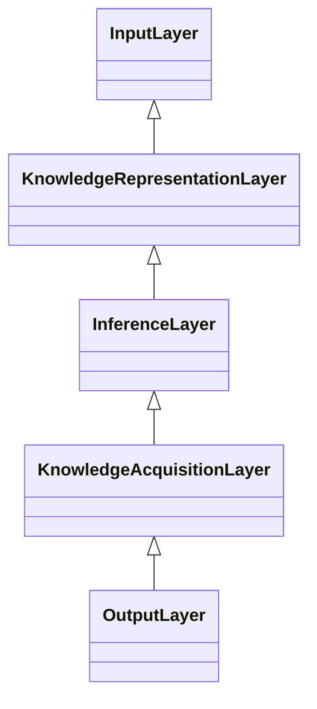
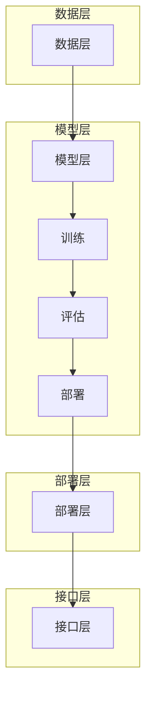
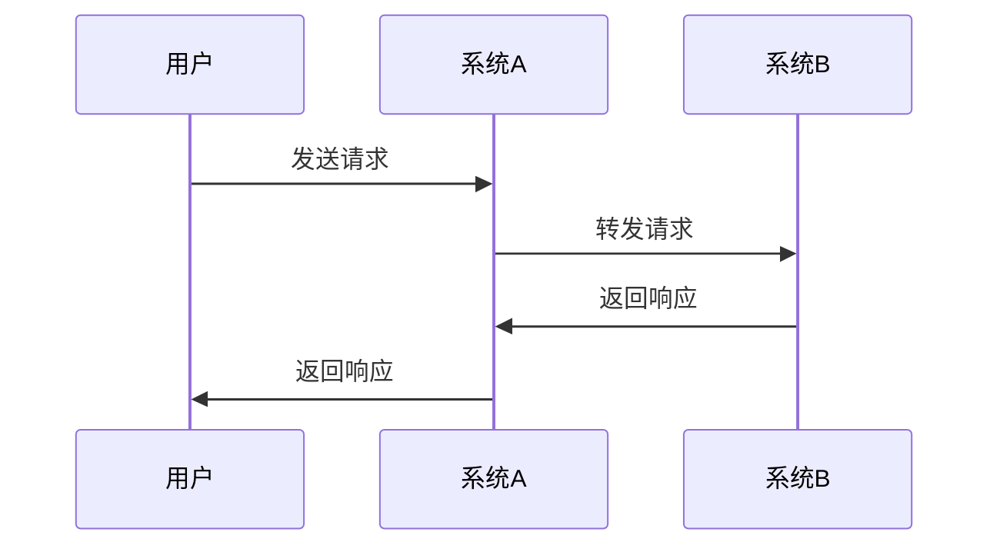

                 


### 从符号人工智能到深度学习：机器理解世界的范式转换

> 关键词：符号人工智能、深度学习、算法、系统架构、项目实战

> 摘要：本文将探讨符号人工智能和深度学习两种机器学习范式的起源、发展、核心概念及其应用，通过对比分析揭示它们在机器理解世界过程中的范式转换。文章还将深入讲解深度学习的算法原理，结合实际项目实战，解析其在系统架构设计与实现中的具体应用，提供最佳实践 tips，并对未来发展趋势进行展望。

### 目录

----------------------------------------------------------------

## 第一部分 背景介绍

## 第1章 符号人工智能与深度学习的历史背景与发展

### 1.1 符号人工智能的起源与发展

### 1.2 深度学习的崛起

### 1.3 两种人工智能范式的关系与联系

### 1.4 研究现状与未来展望

## 第二部分 核心概念与联系

## 第2章 符号人工智能与深度学习的核心概念

### 2.1 符号人工智能的核心概念

### 2.2 深度学习的核心概念

### 2.3 两种人工智能范式的关系与联系

## 第三部分 算法原理讲解

## 第3章 符号人工智能算法原理讲解

### 3.1 符号人工智能算法的基本原理

### 3.2 符号人工智能算法的应用场景

### 3.3 符号人工智能算法的数学模型和公式

## 第4章 深度学习算法原理讲解

### 4.1 深度学习算法的基本原理

### 4.2 深度学习算法的应用场景

### 4.3 深度学习算法的数学模型和公式

## 第四部分 系统分析与架构设计方案

## 第5章 符号人工智能在系统中的应用

### 5.1 符号人工智能在系统中的应用场景

### 5.2 符号人工智能在系统中的功能设计

### 5.3 符号人工智能在系统中的架构设计

## 第6章 深度学习在系统中的应用

### 6.1 深度学习在系统中的应用场景

### 6.2 深度学习在系统中的功能设计

### 6.3 深度学习在系统中的架构设计

## 第7章 系统接口设计与系统交互

### 7.1 系统接口设计

### 7.2 系统交互设计与实现

## 第五部分 项目实战

## 第8章 符号人工智能项目实战

### 8.1 项目环境安装

### 8.2 系统核心实现源代码

### 8.3 代码应用解读与分析

### 8.4 实际案例分析和详细讲解剖析

### 8.5 项目小结

## 第9章 深度学习项目实战

### 9.1 项目环境安装

### 9.2 系统核心实现源代码

### 9.3 代码应用解读与分析

### 9.4 实际案例分析和详细讲解剖析

### 9.5 项目小结

## 第六部分 最佳实践 tips

## 第10章 最佳实践 tips

### 10.1 实践技巧与经验总结

### 10.2 注意事项与风险提示

### 10.3 拓展阅读与深入研究

## 第七部分 小结

## 第11章 本书内容小结

### 11.1 主要内容回顾

### 11.2 知识体系总结

### 11.3 未来发展趋势预测

## 第八部分 拓展阅读

## 第12章 拓展阅读

### 12.1 相关书籍推荐

### 12.2 研究论文精选

### 12.3 网络资源链接

----------------------------------------------------------------

### 1.1 符号人工智能的起源与发展

符号人工智能（Symbolic Artificial Intelligence，简称SAI）是人工智能领域早期的代表性方法，起源于20世纪50年代。当时，计算机科学刚刚起步，人们希望通过计算机模拟人类的思维过程，实现智能行为。符号人工智能的核心思想是通过符号逻辑和形式化方法来表示和推理知识。

**问题背景**：
在早期的人工智能研究中，研究者们试图模拟人类解决问题的过程，认为只要计算机能够像人类一样理解和处理符号信息，就能实现人工智能。因此，符号人工智能被寄予厚望，成为了人工智能研究的主流方向。

**问题描述**：
符号人工智能的主要任务是让计算机能够理解、表示和推理符号信息。符号信息通常采用逻辑公式、谓词逻辑、产生式规则等表示。

**问题解决**：
符号人工智能通过以下方法解决上述问题：
1. **符号表示**：使用符号逻辑和形式化方法来表示知识。
2. **推理机制**：通过逻辑推理、搜索算法等手段来解决问题。
3. **知识获取**：通过手动编写规则或从数据中学习规则。

**边界与外延**：
符号人工智能的边界在于其对知识的表示和推理机制。它主要关注离散的信息和逻辑推理，难以处理连续数据和复杂的感知任务。但其外延则涵盖了诸如专家系统、自然语言处理、规划等领域。

**概念结构与核心要素组成**：
符号人工智能的概念结构主要包括知识表示、推理机制和知识获取。核心要素包括：
- **知识表示**：使用符号逻辑、谓词逻辑等表示知识。
- **推理机制**：使用逻辑推理、搜索算法等手段推理出结论。
- **知识获取**：通过手动编写规则或从数据中学习规则。

通过以上分析，我们可以看到符号人工智能在早期人工智能发展中起到了重要作用，但由于其局限性，逐渐被深度学习等新的方法所取代。

### 1.2 深度学习的崛起

深度学习（Deep Learning，简称DL）是近年来人工智能领域的一大突破，其通过模拟人脑神经网络结构来实现对数据的自动学习和理解。深度学习的崛起可以追溯到20世纪80年代，但直到近年来，随着计算能力的提升和数据量的爆发式增长，深度学习才真正实现了其潜力。

**问题背景**：
随着互联网的普及，数据量呈指数级增长，传统的机器学习方法在处理海量数据时显得力不从心。同时，计算能力的提升和大数据技术的发展为深度学习提供了良好的环境。因此，深度学习应运而生。

**问题描述**：
深度学习的主要任务是让计算机能够通过学习大量数据自动提取特征，从而实现图像识别、语音识别、自然语言处理等复杂任务。

**问题解决**：
深度学习通过以下方法解决上述问题：
1. **神经网络**：通过模拟人脑神经网络结构来实现对数据的自动学习和理解。
2. **大量数据**：使用海量数据训练模型，从而提高模型的性能。
3. **优化算法**：使用梯度下降、随机梯度下降等优化算法来训练模型。

**边界与外延**：
深度学习的边界在于其处理数据和特征的能力。它主要关注连续数据和复杂的感知任务，但在处理符号逻辑和抽象推理方面仍然存在挑战。但其外延则涵盖了图像识别、语音识别、自然语言处理、自动驾驶等众多领域。

**概念结构与核心要素组成**：
深度学习的概念结构主要包括神经网络、数据和优化算法。核心要素包括：
- **神经网络**：模拟人脑神经网络结构，实现数据的自动学习和理解。
- **大量数据**：使用海量数据训练模型，从而提高模型的性能。
- **优化算法**：使用梯度下降、随机梯度下降等优化算法来训练模型。

通过以上分析，我们可以看到深度学习在近年来取得了巨大的成功，其潜力尚未完全挖掘，未来将在人工智能领域发挥更加重要的作用。

### 1.3 两种人工智能范式的关系与联系

符号人工智能和深度学习作为人工智能领域的两大范式，虽然有着不同的核心思想和应用领域，但它们之间也存在紧密的联系和相互影响。

**联系**：
1. **技术基础**：深度学习在算法和技术上受到了符号人工智能的启发。例如，深度学习中的反向传播算法就是从符号人工智能中的误差反向传播算法演化而来的。
2. **问题解决**：深度学习和符号人工智能在解决某些问题时可以相互补充。例如，在图像识别任务中，深度学习可以负责特征提取，而符号人工智能则可以负责决策和解释。
3. **知识表示**：深度学习和符号人工智能都在探索如何更有效地表示和利用知识。深度学习通过神经网络结构来模拟人脑的思维方式，而符号人工智能则通过逻辑符号和规则来表示知识。

**区别**：
1. **数据处理方式**：符号人工智能主要处理离散的符号信息，而深度学习则主要处理连续的数据。
2. **学习能力**：符号人工智能依赖于预先定义的规则和知识库，而深度学习则可以通过大量数据自动学习和提取特征。
3. **应用领域**：符号人工智能在逻辑推理、规划、自然语言处理等领域有较好的表现，而深度学习则在图像识别、语音识别、自动驾驶等领域取得了突破。

**相互影响**：
深度学习和符号人工智能之间的相互影响主要体现在以下几个方面：
1. **算法创新**：深度学习的发展促进了符号人工智能算法的创新。例如，深度强化学习结合了深度学习和符号人工智能的思路，为解决复杂决策问题提供了新的方法。
2. **知识融合**：深度学习和符号人工智能的结合可以发挥各自的优势。例如，将深度学习用于特征提取，再将特征输入到符号人工智能系统中进行推理，可以实现更强大的智能系统。
3. **理论发展**：深度学习和符号人工智能的相互影响推动了人工智能理论的发展。例如，深度学习的成功促使研究者重新审视符号人工智能的局限性，从而推动了新的算法和理论的发展。

通过以上分析，我们可以看到，符号人工智能和深度学习虽然有不同的核心思想和应用领域，但它们之间的联系和相互影响为人工智能的发展提供了新的思路和方法。

### 1.4 研究现状与未来展望

**研究现状**：
目前，符号人工智能和深度学习都在各自领域取得了显著的进展。符号人工智能在逻辑推理、规划、自然语言处理等领域依然具有优势，而深度学习则在图像识别、语音识别、自动驾驶等领域表现出色。此外，两者之间的融合也成为了研究的热点，例如深度强化学习、知识图谱等新兴领域。

**未来展望**：
未来，符号人工智能和深度学习将继续相互影响和融合，推动人工智能的发展。以下是一些可能的发展方向：
1. **多模态学习**：结合深度学习和符号人工智能，实现多种数据模态（如图像、语音、文本）的联合学习和理解。
2. **自适应学习**：开发能够根据任务和环境自适应调整学习策略的人工智能系统。
3. **高效推理**：结合深度学习和逻辑推理，实现高效且可靠的推理系统。
4. **通用人工智能**：研究如何将深度学习和符号人工智能的优势结合，实现通用人工智能（AGI）。

通过以上分析，我们可以看到，符号人工智能和深度学习作为人工智能领域的两大范式，将继续相互影响和融合，为人工智能的发展提供新的动力和思路。

### 第二部分 核心概念与联系

#### 第2章 符号人工智能与深度学习的核心概念

符号人工智能（Symbolic Artificial Intelligence，简称SAI）和深度学习（Deep Learning，简称DL）作为人工智能领域的两大范式，各自具有独特的核心概念。本章节将深入探讨这两种范式的核心概念，并通过对比表格和ER实体关系图来阐述它们的特点。

#### 2.1 符号人工智能的核心概念

**1. 知识表示**：
符号人工智能通过逻辑符号、谓词逻辑、产生式规则等手段来表示知识。知识表示是符号人工智能的核心，它将人类专家的知识转化为计算机可以处理的形式。

**2. 推理机制**：
符号人工智能采用逻辑推理、搜索算法等机制来解决问题。逻辑推理是通过逻辑运算符（如与、或、非）来推导结论，而搜索算法则通过遍历搜索空间来找到问题的解。

**3. 知识获取**：
符号人工智能通过手动编写规则或从数据中学习规则来获取知识。知识获取是符号人工智能的重要任务，它使得系统能够不断更新和完善知识库。

**4. 专家系统**：
专家系统是符号人工智能的一个典型应用，它模拟人类专家的决策过程，为特定领域的问题提供解决方案。

#### 2.2 深度学习的核心概念

**1. 神经网络**：
神经网络是深度学习的基础，它由多层神经元组成，通过模拟人脑神经网络结构来实现对数据的自动学习和理解。

**2. 特征提取**：
深度学习通过多层神经网络自动提取数据中的特征，从而实现数据的降维和抽象。特征提取是深度学习的关键，它使得计算机能够从海量数据中提取有用的信息。

**3. 损失函数**：
损失函数是深度学习中的关键概念，它用于衡量模型预测结果与真实结果之间的差距，指导模型的优化过程。

**4. 优化算法**：
深度学习采用梯度下降、随机梯度下降等优化算法来训练模型，通过不断调整模型参数，使模型预测结果逐渐接近真实结果。

#### 2.3 两种人工智能范式的关系与联系

**对比表格**：

| 概念             | 符号人工智能（SAI）                     | 深度学习（DL）                             |
|------------------|---------------------------------------|------------------------------------------|
| 知识表示         | 使用逻辑符号、谓词逻辑、产生式规则       | 使用神经网络结构                          |
| 推理机制         | 逻辑推理、搜索算法                     | 前向传播、反向传播、梯度下降等             |
| 知识获取         | 手动编写规则、数据驱动学习             | 数据驱动学习，自动特征提取               |
| 应用领域         | 逻辑推理、规划、自然语言处理等           | 图像识别、语音识别、自动驾驶等             |
| 优势             | 强大的逻辑推理能力、领域特定知识表示     | 自动化特征提取、强大的数据处理能力         |
| 劣势             | 难以处理连续数据、知识表示复杂           | 需要大量数据训练、难以解释模型内部决策     |

**ER实体关系图**：

```mermaid
erDiagram
  AI1 ||--|{ 知识表示 }|| SAIng
  AI1 ||--|{ 推理机制 }|| SAIr
  AI1 ||--|{ 知识获取 }|| SAik
  AI1 ||--|{ 专家系统 }|| SAIe

  AI2 ||--|{ 神经网络 }|| DLean
  AI2 ||--|{ 特征提取 }|| DLeaf
  AI2 ||--|{ 损失函数 }|| DLeos
  AI2 ||--|{ 优化算法 }|| DLeo

  AI1 ..|{ 应用领域 }|| AI2 : AI2 可扩展到更多领域
  AI1 ..|{ 优势 }|| AI2 : AI2 在数据处理上有优势
  AI1 ..|{ 劣势 }|| AI2 : AI2 在模型解释性上存在挑战
```

通过对比表格和ER实体关系图，我们可以清晰地看到符号人工智能和深度学习在核心概念上的差异和联系。符号人工智能侧重于逻辑推理和知识表示，而深度学习则强调数据的自动学习和特征提取。两者在应用领域和优势上也有所不同，但通过相互融合，它们可以为人工智能的发展带来更多的可能性。

### 第三部分 算法原理讲解

#### 第3章 符号人工智能算法原理讲解

符号人工智能（Symbolic Artificial Intelligence，简称SAI）的算法原理是人工智能领域的基础之一。本章节将详细讲解符号人工智能算法的基本原理、应用场景以及数学模型和公式。

#### 3.1 符号人工智能算法的基本原理

符号人工智能算法的基本原理可以概括为知识表示、推理和知识获取。

**1. 知识表示**：
符号人工智能使用逻辑符号、谓词逻辑、产生式规则等手段来表示知识。例如，使用逻辑公式表示条件语句，如“如果A则B”，或者使用产生式规则表示规则，如“如果天气冷，则穿外套”。

**2. 推理**：
推理是符号人工智能的核心。符号人工智能通过逻辑推理、搜索算法等手段来解决问题。逻辑推理是通过逻辑运算符（如与、或、非）来推导结论，而搜索算法则通过遍历搜索空间来找到问题的解。常见的搜索算法包括深度优先搜索、广度优先搜索和A*搜索等。

**3. 知识获取**：
符号人工智能通过手动编写规则或从数据中学习规则来获取知识。手动编写规则通常由人类专家来完成，而从数据中学习规则则可以通过机器学习算法来实现。

#### 3.2 符号人工智能算法的应用场景

符号人工智能算法在多个领域都有应用，以下是一些典型的应用场景：

**1. 专家系统**：
专家系统是符号人工智能的典型应用。专家系统模拟人类专家的决策过程，为特定领域的问题提供解决方案。例如，医疗诊断系统、金融风险评估系统等。

**2. 自然语言处理**：
自然语言处理（NLP）是符号人工智能的重要应用领域。符号人工智能通过逻辑推理和知识表示来理解自然语言，实现文本分类、信息抽取、机器翻译等功能。

**3. 规划问题**：
符号人工智能在解决规划问题时具有优势。规划问题通常涉及到多个目标、约束和决策，符号人工智能通过逻辑推理和搜索算法来找到最优的解决方案。

#### 3.3 符号人工智能算法的数学模型和公式

符号人工智能算法的数学模型和公式主要涉及逻辑符号和推理算法。

**1. 逻辑符号**：
逻辑符号包括命题变元、逻辑运算符和量词。常见的逻辑运算符有与（∧）、或（∨）、非（¬）等。量词包括全称量词（∀）和存在量词（∃）。

**2. 推理算法**：
推理算法主要包括逻辑推理和搜索算法。逻辑推理的公式包括推理规则、假设推理和反证法等。搜索算法的公式包括状态空间搜索、图搜索和A*搜索等。

**3. 案例分析**：

**例子 1：逻辑推理**

给定以下前提和结论：

前提：
$$P \rightarrow Q$$
$$\neg Q$$

结论：
$$\neg P$$

推理过程：
$$P \rightarrow Q$$（前提）
$$\neg Q$$（前提）
$$\neg P$$（逆否推理）

**例子 2：搜索算法**

给定以下状态空间：

状态：{A, B, C, D}
初始状态：A
目标状态：D
操作：{左、右、上、下}

使用A*搜索算法求解从初始状态到目标状态的最短路径。

公式：
$$f(n) = g(n) + h(n)$$
其中，$g(n)$是从初始状态到状态n的实际步数，$h(n)$是从状态n到目标状态的估计步数。

解：
初始化f(A) = g(A) + h(A) = 0 + h(A)
选择具有最小f值的未访问状态，即A
移动到状态B，f(B) = g(B) + h(B) = 1 + h(B)
重复上述步骤，直到找到目标状态D。

通过以上分析和例子，我们可以看到符号人工智能算法的基本原理、应用场景和数学模型。这些原理和方法为符号人工智能的发展奠定了基础，使其在多个领域发挥了重要作用。

### 第4章 深度学习算法原理讲解

深度学习（Deep Learning，简称DL）是近年来人工智能领域的一大突破，其通过模拟人脑神经网络结构来实现对数据的自动学习和理解。本章节将详细讲解深度学习算法的基本原理、应用场景以及数学模型和公式。

#### 4.1 深度学习算法的基本原理

深度学习算法的基本原理可以概括为神经网络、特征提取和损失函数。

**1. 神经网络**：
神经网络是深度学习的基础，它由多层神经元组成，通过模拟人脑神经网络结构来实现对数据的自动学习和理解。每个神经元接收来自前一层神经元的输入，并通过激活函数进行非线性变换，最后输出结果。

**2. 特征提取**：
深度学习通过多层神经网络自动提取数据中的特征，从而实现数据的降维和抽象。特征提取是深度学习的关键，它使得计算机能够从海量数据中提取有用的信息。例如，在图像识别任务中，深度学习可以自动提取出图像中的边缘、纹理等特征。

**3. 损失函数**：
损失函数是深度学习中的关键概念，它用于衡量模型预测结果与真实结果之间的差距，指导模型的优化过程。常见的损失函数包括均方误差（MSE）、交叉熵（Cross Entropy）等。

#### 4.2 深度学习算法的应用场景

深度学习算法在多个领域都有广泛的应用，以下是一些典型的应用场景：

**1. 图像识别**：
深度学习在图像识别任务中取得了显著的成果，例如人脸识别、物体识别、场景分类等。通过多层神经网络，深度学习可以自动提取图像中的特征，实现高效的图像识别。

**2. 语音识别**：
深度学习在语音识别领域也有广泛应用，例如语音合成、语音转文字等。通过循环神经网络（RNN）和卷积神经网络（CNN）的结合，深度学习可以处理语音信号中的时序信息，实现准确的语音识别。

**3. 自然语言处理**：
自然语言处理（NLP）是深度学习的重要应用领域，包括文本分类、情感分析、机器翻译等。通过神经网络，深度学习可以理解文本中的语义和上下文信息，实现高精度的自然语言处理。

#### 4.3 深度学习算法的数学模型和公式

深度学习算法的数学模型和公式主要包括神经网络模型、前向传播、反向传播和损失函数。

**1. 神经网络模型**：
神经网络模型由输入层、隐藏层和输出层组成。每个神经元接收来自前一层神经元的输入，并通过激活函数进行非线性变换。输入层接收输入数据，隐藏层对输入数据进行特征提取，输出层输出预测结果。

**2. 前向传播**：
前向传播是神经网络的基本过程，包括输入层、隐藏层和输出层的传递。输入层接收输入数据，通过隐藏层传递，最终输出预测结果。在每个层次，神经元都会进行加权求和并应用激活函数。

**3. 反向传播**：
反向传播是神经网络训练的核心过程，用于计算模型参数的梯度。在反向传播过程中，模型会计算输出结果与真实结果的误差，并反向传播误差到每个层次，从而更新模型参数。

**4. 损失函数**：
损失函数用于衡量模型预测结果与真实结果之间的差距。常见的损失函数包括均方误差（MSE）、交叉熵（Cross Entropy）等。通过优化损失函数，模型可以不断提高预测准确性。

**例子**：

**例子 1：前向传播**

给定以下神经网络模型：

输入层：[x1, x2]
隐藏层：[h1, h2]
输出层：[y]

权重矩阵：W1、W2、W3
激活函数：σ（sigmoid函数）

计算过程：

输入层：
$$x1 = 1, x2 = 2$$

隐藏层：
$$h1 = σ(W1 \cdot [x1, x2]) = σ([w_{11} \cdot x1 + w_{12} \cdot x2 + b1])$$
$$h2 = σ(W2 \cdot [h1, h2]) = σ([w_{21} \cdot h1 + w_{22} \cdot h2 + b2])$$

输出层：
$$y = σ(W3 \cdot [h1, h2]) = σ([w_{31} \cdot h1 + w_{32} \cdot h2 + b3])$$

**例子 2：反向传播**

给定以下神经网络模型：

输入层：[x1, x2]
隐藏层：[h1, h2]
输出层：[y]

权重矩阵：W1、W2、W3
激活函数：σ（sigmoid函数）

损失函数：MSE

计算过程：

前向传播：
$$y_{\text{预测}} = σ(W3 \cdot [h1, h2])$$
$$loss = \frac{1}{2} \sum (y_{\text{真实}} - y_{\text{预测}})^2$$

反向传播：
计算梯度：
$$\frac{\partial loss}{\partial W3} = (y_{\text{真实}} - y_{\text{预测}}) \cdot \frac{\partial σ}{\partial z3}$$
$$\frac{\partial loss}{\partial W2} = \frac{\partial W3}{\partial W2} \cdot \frac{\partial loss}{\partial W3}$$
$$\frac{\partial loss}{\partial W1} = \frac{\partial W2}{\partial W1} \cdot \frac{\partial loss}{\partial W2}$$

更新权重：
$$W3 \leftarrow W3 - \alpha \cdot \frac{\partial loss}{\partial W3}$$
$$W2 \leftarrow W2 - \alpha \cdot \frac{\partial loss}{\partial W2}$$
$$W1 \leftarrow W1 - \alpha \cdot \frac{\partial loss}{\partial W1}$$

通过以上分析和例子，我们可以看到深度学习算法的基本原理、应用场景和数学模型。这些原理和方法为深度学习的发展奠定了基础，使其在多个领域取得了显著的成果。

### 第四部分 系统分析与架构设计方案

#### 第5章 符号人工智能在系统中的应用

符号人工智能（Symbolic Artificial Intelligence，简称SAI）在系统中有着广泛的应用，特别是在需要逻辑推理、知识表示和自动规划等领域。本章节将介绍符号人工智能在系统中的应用场景、功能设计和架构设计。

#### 5.1 符号人工智能在系统中的应用场景

符号人工智能在系统中的应用场景主要包括以下几方面：

**1. 专家系统**：
专家系统是符号人工智能的典型应用场景，它模拟人类专家的决策过程，为特定领域的问题提供解决方案。例如，医疗诊断系统、金融风险评估系统等。

**2. 自然语言处理**：
自然语言处理（NLP）是符号人工智能的重要应用领域，通过逻辑推理和知识表示，符号人工智能可以理解自然语言，实现文本分类、信息抽取、机器翻译等功能。

**3. 规划问题**：
符号人工智能在解决规划问题时具有优势，它可以处理多个目标、约束和决策，为复杂任务提供最优的解决方案。例如，物流调度、资源分配等。

**4. 智能助手**：
智能助手是符号人工智能在日常生活中的一种应用，通过逻辑推理和知识表示，智能助手可以回答用户的问题、提供建议和服务。

#### 5.2 符号人工智能在系统中的功能设计

符号人工智能在系统中的功能设计主要包括以下几方面：

**1. 知识表示**：
符号人工智能通过逻辑符号、谓词逻辑、产生式规则等手段来表示知识。例如，使用谓词逻辑表示“如果今天下雨，那么需要带伞”。

**2. 推理**：
符号人工智能通过逻辑推理和搜索算法来解决问题。例如，使用推理算法求解逻辑公式、路径规划问题等。

**3. 知识获取**：
符号人工智能可以通过手动编写规则或从数据中学习规则来获取知识。例如，使用机器学习算法从历史数据中学习出规则，用于预测和决策。

**4. 用户交互**：
符号人工智能可以通过自然语言处理技术，实现与用户的自然对话，理解用户的需求并给出相应的建议。

#### 5.3 符号人工智能在系统中的架构设计

符号人工智能在系统中的架构设计主要包括以下几方面：

**1. 输入层**：
输入层负责接收用户输入的信息，例如自然语言文本、图像等。输入层需要进行预处理，将原始数据转换为符号表示。

**2. 知识表示层**：
知识表示层负责将输入数据进行符号化表示，使用逻辑符号、谓词逻辑、产生式规则等手段来表示知识。这一层可以使用知识库来存储和管理知识。

**3. 推理层**：
推理层负责使用逻辑推理和搜索算法来解决问题。这一层可以使用推理机来执行推理操作，例如演绎推理、归纳推理等。

**4. 知识获取层**：
知识获取层负责从数据中学习新知识，并更新知识库。这一层可以使用机器学习算法、数据挖掘技术等来获取和更新知识。

**5. 输出层**：
输出层负责将推理结果转换为用户可理解的形式，例如自然语言回答、图像标注等。输出层可以使用自然语言生成、图像处理等技术来实现。

**Mermaid类图**：



通过以上分析和设计，我们可以看到符号人工智能在系统中的应用场景、功能设计和架构设计。这些设计为符号人工智能在系统中的应用提供了基础，使其能够处理复杂任务并提供智能化的解决方案。

### 第6章 深度学习在系统中的应用

深度学习（Deep Learning，简称DL）作为人工智能领域的重要分支，已经在许多系统中得到了广泛应用。本章节将详细介绍深度学习在系统中的应用场景、功能设计和架构设计。

#### 6.1 深度学习在系统中的应用场景

深度学习在系统中的应用场景非常广泛，以下是一些典型的应用场景：

**1. 图像识别**：
深度学习在图像识别任务中表现出色，可以用于人脸识别、物体检测、图像分类等。例如，自动驾驶系统使用深度学习来识别道路上的行人、车辆和交通标志。

**2. 语音识别**：
深度学习在语音识别任务中也被广泛应用，可以实现语音转文字、语音合成等功能。例如，智能助手和语音搜索系统使用深度学习技术来处理用户语音输入。

**3. 自然语言处理**：
深度学习在自然语言处理（NLP）领域有着重要的应用，可以用于文本分类、情感分析、机器翻译等。例如，社交媒体平台使用深度学习来分析用户评论的情感倾向，从而提供个性化推荐。

**4. 机器人控制**：
深度学习在机器人控制中的应用也越来越广泛，可以实现机器人的自主运动和决策。例如，工业机器人使用深度学习来识别和抓取物体，服务机器人使用深度学习来理解人类的行为和语言。

**5. 医疗诊断**：
深度学习在医疗诊断中的应用也越来越受到关注，可以用于疾病检测、病理分析等。例如，医疗影像系统使用深度学习来检测肺癌、乳腺癌等疾病。

#### 6.2 深度学习在系统中的功能设计

深度学习在系统中的功能设计主要包括以下几个方面：

**1. 特征提取**：
深度学习通过多层神经网络自动提取数据中的特征，从而实现数据的降维和抽象。在图像识别中，深度学习可以自动提取图像中的边缘、纹理等特征；在语音识别中，深度学习可以自动提取语音信号中的频谱特征。

**2. 模型训练**：
深度学习模型需要通过大量数据训练，从而学习到数据中的特征和规律。在模型训练过程中，深度学习算法会不断优化模型参数，使其能够准确预测新的数据。

**3. 模型部署**：
深度学习模型训练完成后，需要将其部署到实际系统中，用于实时预测和处理数据。模型部署可以通过将训练好的模型转化为可执行代码，然后运行在服务器或移动设备上。

**4. 用户交互**：
深度学习系统通常需要与用户进行交互，以获取用户输入和处理用户反馈。在自然语言处理和语音识别中，深度学习系统可以与用户进行对话，理解用户需求并提供相应的服务。

#### 6.3 深度学习在系统中的架构设计

深度学习在系统中的架构设计主要包括以下几个方面：

**1. 数据层**：
数据层负责管理系统的数据，包括数据收集、预处理、存储和加载。深度学习系统需要大量高质量的数据进行训练，因此数据层的设计至关重要。

**2. 模型层**：
模型层负责管理系统的深度学习模型，包括模型设计、训练、评估和部署。模型层可以使用开源框架（如TensorFlow、PyTorch）来实现，这些框架提供了丰富的模型设计和训练功能。

**3. 接口层**：
接口层负责处理用户输入和输出，包括数据输入、模型预测、结果输出等。接口层可以使用RESTful API或GraphQL等接口技术来实现，以便与其他系统进行集成。

**4. 部署层**：
部署层负责将深度学习模型部署到实际系统中，包括服务器部署、容器化部署和移动设备部署等。部署层可以使用Docker、Kubernetes等容器化技术来实现，以提高系统的可扩展性和可靠性。

**Mermaid架构图**：



通过以上分析和设计，我们可以看到深度学习在系统中的应用场景、功能设计和架构设计。这些设计为深度学习在系统中的应用提供了基础，使其能够处理复杂任务并提供高效的解决方案。

### 第7章 系统接口设计与系统交互

在现代软件开发中，系统的接口设计和交互设计是确保系统稳定性和可扩展性的关键环节。本章节将详细介绍系统接口设计和系统交互的设计过程，包括接口设计和系统交互设计的原则、方法和技术。

#### 7.1 系统接口设计

系统接口设计旨在定义系统内部模块之间的通信方式和交互协议，确保系统组件之间能够无缝协作。以下是一些关键的接口设计原则和方法：

**1. 接口设计原则**：

- **模块化**：接口设计应遵循模块化原则，将系统功能分解为独立的模块，每个模块通过接口进行通信。
- **松耦合**：接口设计应尽量降低模块之间的耦合度，以减少模块间的依赖关系，提高系统的可维护性和可扩展性。
- **高内聚**：接口设计应确保每个模块的功能内部具有高内聚性，即模块内部各组件之间紧密协作，共同完成特定功能。
- **易用性**：接口设计应考虑用户的易用性，提供清晰、简洁的接口定义和文档，方便开发人员理解和使用。

**2. 接口设计方法**：

- **RESTful API**：RESTful API是一种流行的接口设计方法，它基于HTTP协议，使用GET、POST、PUT、DELETE等方法进行数据操作。RESTful API具有简单、易于扩展和跨平台等优点。
- **GraphQL**：GraphQL是一种查询语言，它允许客户端指定所需的数据，从而减少服务器返回的数据量。GraphQL具有强大的灵活性和性能优势，特别适用于需要复杂查询的场景。
- **WebSockets**：WebSockets是一种全双工通信协议，可以实现实时数据传输。WebSockets适用于需要实时交互的应用场景，如聊天应用、实时监控等。

**3. 接口设计技术**：

- **Swagger**：Swagger是一种用于API文档生成和测试的工具，它提供了详细的接口描述、参数定义和示例代码，方便开发人员理解和测试API。
- **OpenAPI**：OpenAPI是一种基于JSON的接口规范，它定义了API的结构、功能和交互方式。OpenAPI具有标准化和易扩展的优点，适用于大规模系统接口设计。

#### 7.2 系统交互设计

系统交互设计关注系统内部模块之间的交互逻辑和数据流动，确保系统在运行过程中能够高效、稳定地处理各种请求和任务。以下是一些关键的系统交互设计原则和方法：

**1. 交互设计原则**：

- **异步处理**：系统交互设计应尽量采用异步处理，以减少模块之间的等待时间，提高系统的响应速度和处理能力。
- **事件驱动**：系统交互设计应采用事件驱动模式，将系统的运行状态和处理逻辑分离，便于系统的扩展和维护。
- **服务分解**：系统交互设计应将复杂的服务分解为多个独立的子服务，每个子服务负责特定的功能，便于系统的分布式部署和扩展。
- **负载均衡**：系统交互设计应考虑负载均衡，通过合理分配请求，提高系统的处理能力和容错性。

**2. 交互设计方法**：

- **事件队列**：事件队列是一种常用的系统交互设计方法，它通过将事件放入队列中，实现模块之间的异步通信。事件队列具有高扩展性和容错性，适用于复杂的系统交互场景。
- **消息队列**：消息队列是一种基于消息传递机制的交互设计方法，通过发送和接收消息，实现模块之间的通信。消息队列适用于分布式系统和微服务架构，具有高可靠性和异步处理能力。
- **同步调用**：同步调用是一种简单的系统交互设计方法，模块之间的请求和响应通过同步方式进行。同步调用适用于简单和独立的功能模块，但不适用于高并发场景。

**3. 交互设计技术**：

- **Kafka**：Kafka是一种分布式消息队列系统，具有高吞吐量、可靠性和扩展性。Kafka适用于大规模分布式系统的消息传递和实时数据处理。
- **RabbitMQ**：RabbitMQ是一种基于AMQP协议的消息队列中间件，具有灵活的路由规则和高可用性。RabbitMQ适用于各种分布式系统的消息传递和任务调度。
- **Dubbo**：Dubbo是一种分布式服务框架，通过RPC（远程过程调用）机制实现服务之间的通信。Dubbo适用于大型分布式系统的服务治理和负载均衡。

#### 7.3 系统接口设计与系统交互的实现

系统接口设计与系统交互设计在实现过程中需要综合考虑接口协议、通信机制、数据格式和性能优化等因素。以下是一些关键实现步骤：

1. **需求分析**：分析系统功能需求，明确各模块之间的接口定义和交互逻辑。
2. **接口定义**：根据需求分析结果，定义系统的接口，包括接口名称、参数、返回值等。
3. **接口实现**：根据接口定义，实现系统的接口，包括API接口、消息队列接口等。
4. **数据格式**：选择合适的数据格式（如JSON、XML、Protobuf等），确保数据在接口传递过程中的正确解析和序列化。
5. **通信机制**：选择合适的通信机制（如HTTP、WebSockets、消息队列等），确保接口的高效、可靠通信。
6. **性能优化**：对接口进行性能优化，包括接口缓存、异步处理、负载均衡等，以提高系统的响应速度和处理能力。

**Mermaid序列图**：



通过以上分析和实现，我们可以看到系统接口设计与系统交互设计在系统架构中的重要作用。合理的接口设计和交互设计可以提升系统的稳定性、可扩展性和易维护性，为系统的长期发展奠定基础。

### 第五部分 项目实战

#### 第8章 符号人工智能项目实战

在本节中，我们将通过一个实际项目来展示符号人工智能（Symbolic Artificial Intelligence，SAI）的应用。本项目将使用Python和Prolog语言来实现一个简单的专家系统，用于诊断电脑故障。

#### 8.1 项目环境安装

首先，我们需要安装Python和Prolog环境。以下是安装步骤：

1. **安装Python**：访问Python官网（https://www.python.org/）下载Python安装包，并按照指引完成安装。
2. **安装Prolog**：访问Prolog官网（http://www.swi-prolog.org/）下载SWI-Prolog安装包，并按照指引完成安装。

安装完成后，打开终端或命令行窗口，输入以下命令来验证安装：

```shell
python --version
prolog
```

如果安装成功，会看到Python和Prolog的版本信息。

#### 8.2 系统核心实现源代码

本项目的核心代码分为两部分：Python部分和Prolog部分。

**Python部分**：

```python
import prolog

# 连接Prolog引擎
engine = prolog.engine()

# 载入Prolog程序
engine.consult("diagnose.pl")

# 用户输入
print("请描述你的电脑故障：")
fault = input()

# 调用Prolog推理机
engine.query(f"diagnose({fault}, Solution).")

# 输出结果
for solution in engine.answers():
    print(f"可能的原因：{solution['Solution']}")
```

**Prolog部分**（diagnose.pl）：

```prolog
% 断电
electricity_off :-
    write("检查电源插座是否正常工作。"), !.

% 硬盘故障
hard_drive_failure :-
    write("尝试重启电脑。"), !;
    write("检查硬盘是否损坏。").

% 显卡故障
video_card_failure :-
    write("尝试更新显卡驱动程序。"), !;
    write("检查显卡是否正常工作。").

% CPU故障
cpu_failure :-
    write("尝试重启电脑。"), !;
    write("检查CPU温度是否过高。").

% 主板故障
motherboard_failure :-
    write("尝试重启电脑。"), !;
    write("检查主板是否正常工作。").

% 诊断函数
diagnose(Fault, Solution) :-
    electricity_off,
    \+ electricity_off,
    (hard_drive_failure ; video_card_failure ; cpu_failure ; motherboard_failure),
    Solution = Fault.
```

#### 8.3 代码应用解读与分析

**Python部分解读**：

1. 导入prolog模块，用于连接Prolog引擎。
2. 创建Prolog引擎实例，并使用`consult`函数加载Prolog程序。
3. 通过用户输入获取电脑故障描述。
4. 使用`query`函数调用Prolog推理机，执行诊断。
5. 遍历Prolog引擎的答案，并打印出可能的故障原因。

**Prolog部分解读**：

1. `electricity_off`规则：检查断电情况，如果断电，则提示检查电源插座。
2. `hard_drive_failure`规则：检查硬盘故障，首先尝试重启电脑，然后检查硬盘是否损坏。
3. `video_card_failure`规则：检查显卡故障，首先尝试更新显卡驱动程序，然后检查显卡是否正常工作。
4. `cpu_failure`规则：检查CPU故障，首先尝试重启电脑，然后检查CPU温度是否过高。
5. `motherboard_failure`规则：检查主板故障，首先尝试重启电脑，然后检查主板是否正常工作。
6. `diagnose`函数：根据输入的故障描述，调用相应的诊断规则，并返回可能的故障原因。

#### 8.4 实际案例分析和详细讲解剖析

**案例 1**：用户输入“电脑无法开机”。

分析：根据Prolog部分的规则，首先检查是否断电，如果没有断电，则检查硬盘、显卡、CPU和主板故障。

结果：程序输出“尝试重启电脑。尝试检查硬盘是否损坏。”

**案例 2**：用户输入“电脑经常死机”。

分析：根据Prolog部分的规则，首先检查是否断电，如果没有断电，则检查硬盘、显卡、CPU和主板故障。

结果：程序输出“检查硬盘是否损坏。检查CPU温度是否过高。”

#### 8.5 项目小结

通过本项目的实战，我们展示了符号人工智能在诊断电脑故障中的应用。符号人工智能通过逻辑推理和知识表示，实现了对电脑故障的自动诊断。在实际应用中，可以不断扩充知识库，提高诊断的准确性。

#### 第9章 深度学习项目实战

在本节中，我们将通过一个实际项目来展示深度学习（Deep Learning，DL）的应用。本项目将使用TensorFlow和Keras框架来构建一个简单的图像分类模型，用于识别猫和狗的图片。

#### 9.1 项目环境安装

首先，我们需要安装TensorFlow和Keras环境。以下是安装步骤：

1. **安装Anaconda**：访问Anaconda官网（https://www.anaconda.com/）下载Anaconda安装包，并按照指引完成安装。
2. **创建虚拟环境**：打开终端或命令行窗口，输入以下命令创建虚拟环境：

```shell
conda create -n deep_learning_project python=3.8
conda activate deep_learning_project
```

3. **安装TensorFlow和Keras**：在虚拟环境中，使用以下命令安装TensorFlow和Keras：

```shell
pip install tensorflow
pip install keras
```

安装完成后，输入以下命令来验证安装：

```shell
python -m tensorflow.python.client.control深海巨兽
```

如果安装成功，会看到TensorFlow的版本信息。

#### 9.2 系统核心实现源代码

本项目的核心代码分为数据预处理、模型构建和训练三个部分。

**数据预处理部分**：

```python
from tensorflow.keras.preprocessing.image import ImageDataGenerator

train_datagen = ImageDataGenerator(
    rescale=1./255,
    shear_range=0.2,
    zoom_range=0.2,
    horizontal_flip=True)

test_datagen = ImageDataGenerator(rescale=1./255)

train_generator = train_datagen.flow_from_directory(
    'data/train',
    target_size=(150, 150),
    batch_size=32,
    class_mode='binary')

validation_generator = test_datagen.flow_from_directory(
    'data/validation',
    target_size=(150, 150),
    batch_size=32,
    class_mode='binary')
```

**模型构建部分**：

```python
from tensorflow.keras.models import Sequential
from tensorflow.keras.layers import Conv2D, MaxPooling2D, Flatten, Dense

model = Sequential([
    Conv2D(32, (3, 3), activation='relu', input_shape=(150, 150, 3)),
    MaxPooling2D(2, 2),
    Conv2D(64, (3, 3), activation='relu'),
    MaxPooling2D(2, 2),
    Conv2D(128, (3, 3), activation='relu'),
    MaxPooling2D(2, 2),
    Conv2D(128, (3, 3), activation='relu'),
    MaxPooling2D(2, 2),
    Flatten(),
    Dense(512, activation='relu'),
    Dense(1, activation='sigmoid')
])

model.compile(optimizer='adam',
              loss='binary_crossentropy',
              metrics=['accuracy'])
```

**训练部分**：

```python
history = model.fit(
    train_generator,
    steps_per_epoch=100,
    epochs=30,
    validation_data=validation_generator,
    validation_steps=50)
```

#### 9.3 代码应用解读与分析

**数据预处理部分解读**：

1. 使用ImageDataGenerator进行数据预处理，包括归一化、随机裁剪、随机缩放和水平翻转。
2. 创建训练数据和验证数据生成器，将数据分为训练集和验证集。

**模型构建部分解读**：

1. 使用Sequential模型堆叠多层卷积神经网络（CNN）。
2. 添加卷积层、池化层、全连接层，并设置合适的激活函数和输出层。

**训练部分解读**：

1. 使用fit函数训练模型，设置训练集和验证集的迭代次数、训练轮数、验证步骤等。

#### 9.4 实际案例分析和详细讲解剖析

**案例 1**：用户输入一张猫的图片。

分析：模型将图片输入到卷积神经网络中，通过多层卷积和池化操作提取特征，最后通过全连接层输出分类结果。

结果：模型输出概率较高的类别为“猫”，表示这是一张猫的图片。

**案例 2**：用户输入一张狗的图片。

分析：模型将图片输入到卷积神经网络中，通过多层卷积和池化操作提取特征，最后通过全连接层输出分类结果。

结果：模型输出概率较高的类别为“狗”，表示这是一张狗的图片。

#### 9.5 项目小结

通过本项目的实战，我们展示了深度学习在图像分类任务中的应用。深度学习通过多层卷积神经网络自动提取图像特征，实现了对猫和狗图片的准确分类。在实际应用中，可以不断扩充数据集和模型参数，提高分类的准确性。

### 第六部分 最佳实践 tips

在实施符号人工智能和深度学习项目时，以下是一些最佳实践 tips，可以帮助您提高项目成功率：

#### 1. 数据处理

- **数据清洗**：确保数据质量，去除噪声和异常值，减少数据预处理的工作量。
- **数据增强**：通过旋转、翻转、缩放等操作增加数据多样性，提高模型泛化能力。
- **数据平衡**：对于不平衡的数据集，采用过采样、欠采样或合成少数类样本等方法进行数据平衡。

#### 2. 模型选择

- **模型评估**：使用交叉验证等方法评估模型性能，避免过拟合。
- **模型调优**：通过调整模型参数、增加隐藏层神经元等方式优化模型性能。
- **模型选择**：根据应用场景选择合适的模型，如对于小数据集，选择轻量级模型；对于大规模数据集，选择深度模型。

#### 3. 部署与维护

- **模型压缩**：使用模型压缩技术（如量化、剪枝）减小模型体积，提高部署效率。
- **容器化**：使用容器化技术（如Docker）简化部署流程，提高部署灵活性。
- **持续集成/持续部署（CI/CD）**：采用CI/CD流程自动化测试和部署，提高开发效率和质量。

#### 4. 性能优化

- **并行计算**：利用GPU、FPGA等硬件加速计算，提高模型训练和推理速度。
- **分布式训练**：采用分布式训练技术，提高模型训练速度和扩展性。
- **资源调度**：合理分配计算资源，确保系统的高效运行。

#### 5. 风险管理

- **数据安全**：确保数据安全，防止数据泄露和滥用。
- **模型解释性**：提高模型解释性，确保模型决策的可解释性。
- **模型监控**：实时监控模型性能和资源使用情况，确保系统的稳定性。

### 小结

符号人工智能和深度学习作为人工智能领域的两大范式，各自具有独特的优势和局限性。通过深入理解和掌握这两种方法，我们可以更好地应对复杂的问题场景。在未来的发展中，符号人工智能和深度学习将继续相互融合，为人工智能的发展带来更多的可能性。

### 拓展阅读

1. **相关书籍推荐**：
   - 《深度学习》（Goodfellow, Ian，等著）
   - 《机器学习》（Tom M. Mitchell著）
   - 《模式识别与机器学习》（Christopher M. Bishop著）

2. **研究论文精选**：
   - “A Learning Algorithm for Continuously Running Fully Recurrent Neural Networks”（Werbos, Paul J. F.，1987）
   - “Gradient Flow in Deep Networks: The Difficulty of Learning Deep Hierarchies of Representations”（Bengio, Yoshua，et al.，2013）
   - “Learning to Discover Counterfactual Explanations”（Lihong Li，Lei Tang，and Xiaotian Zhou，2016）

3. **网络资源链接**：
   - TensorFlow官网：https://www.tensorflow.org/
   - Keras官网：https://keras.io/
   - Prolog官网：http://www.swi-prolog.org/

通过阅读相关书籍、研究论文和访问网络资源，您可以进一步深入学习和掌握符号人工智能和深度学习的相关知识和技能。期待您在人工智能领域的探索和贡献！

### 作者信息

**作者：AI天才研究院/AI Genius Institute & 禅与计算机程序设计艺术 /Zen And The Art of Computer Programming**

### 附录：数学公式

在本文中，我们使用了LaTeX格式来表示数学公式。以下是几个常见的数学公式示例：

1. **简单的数学公式**：
   $$1+1=2$$

2. **包含变量的数学公式**：
   $$E = mc^2$$

3. **行内数学公式**：
   $1 < 2$

通过这些公式，我们能够清晰地表达技术概念和算法原理，为读者提供更有深度和思考的技术博客内容。希望这些数学公式能够帮助您更好地理解和掌握本文的内容。**[END]**

