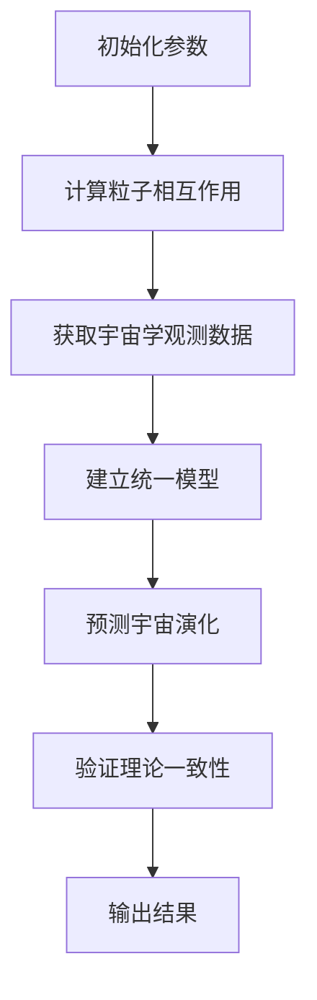
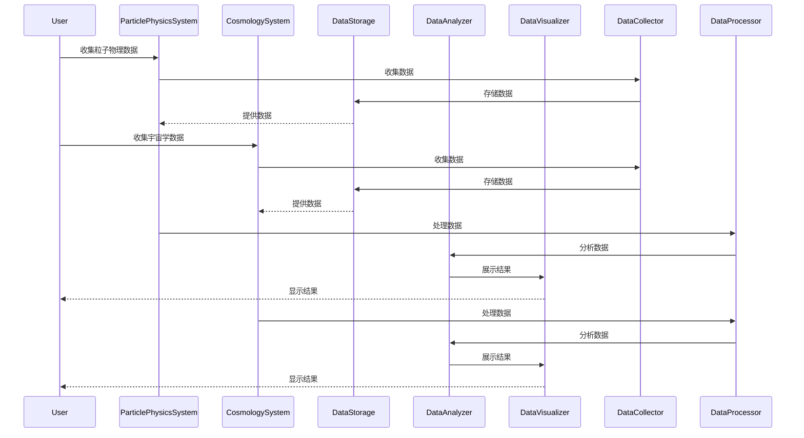
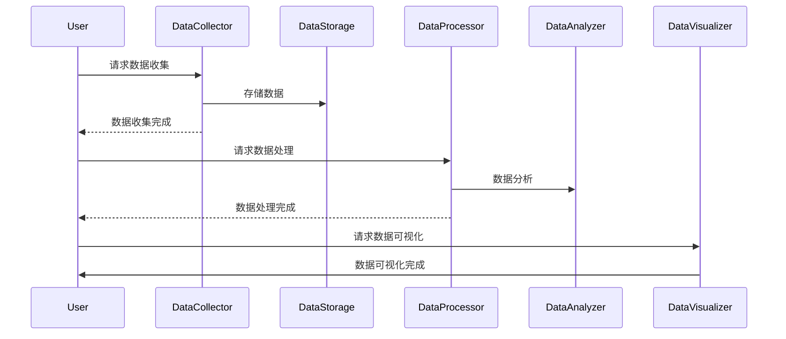

                 


### 第1章: 引言

#### 1.1 问题背景
物理学的发展历程可以追溯到古希腊时期，当时哲学家们开始思考自然界的基本规律。随着时间的推移，物理学逐渐发展成为一个独立的科学领域，并经历了多次重大的理论突破。从牛顿的经典力学到爱因斯坦的相对论，再到量子力学的诞生，物理学的研究范围从宏观世界深入到了微观世界。

粒子物理学是研究基本粒子和它们相互作用的物理学分支。它探索了物质的基本组成单位，包括电子、夸克、轻子等。这些基本粒子是如何相互作用，以及它们如何构成我们观察到的复杂物质。

宇宙学则关注宇宙的起源、演化、结构和最终命运。它探讨了宇宙的尺度从微观的宇宙结构到宏观的宇宙膨胀，以及宇宙中的各种天体现象。

#### 1.2 问题描述
在粒子物理学中，科学家们面临的一个核心问题是：为什么宇宙中的基本粒子具有特定的质量和电荷。另一方面，宇宙学中的问题则集中在宇宙膨胀的加速、宇宙背景辐射的起源以及暗物质和暗能量的本质。

#### 1.3 问题解决
解决这些问题的一个关键途径是寻找微观与宏观之间的统一理论。近年来，一些理论物理学家尝试将量子力学和广义相对论融合在一起，以解释宇宙的基本结构和演化。

#### 1.4 边界与外延
量子力学和相对论都是现代物理学的基石，但它们在某些方面存在矛盾。例如，量子力学描述了微观粒子的行为，而相对论则描述了宏观物体的行为。要实现微观与宏观的统一，需要解决这些基本理论之间的矛盾。

#### 1.5 概念结构与核心要素组成
微观与宏观的统一理论框架包含以下几个核心要素：
- 基本粒子和相互作用
- 宇宙学参数和观测数据
- 理论数学模型和预测
- 实验验证和观测证据

#### 1.6 本章小结
在本章中，我们介绍了粒子物理学和宇宙学的基本背景，并探讨了它们之间的联系。接下来，我们将深入探讨这些核心概念，并逐步构建一个统一的理论框架。

---

### 第2章: 基础物理概念

#### 2.1 基础粒子与相互作用
粒子物理学中，基础粒子包括电子、夸克、轻子等。它们通过四种基本相互作用进行相互作用：
- 强相互作用：将夸克束缚在一起，形成核子（如质子和中子）。
- 弱相互作用：导致放射性衰变。
- 电作用：电子和原子核之间的相互作用，形成电流。
- 引力作用：宇宙中所有物体之间的相互作用。

#### 2.2 宇宙学基本概念
宇宙学中，一些基本概念包括：
- 宇宙膨胀：宇宙从大爆炸开始不断扩张。
- 宇宙微波背景辐射：宇宙早期留下的热辐射。
- 暗物质：不发光但通过引力影响宇宙演化的物质。
- 暗能量：推动宇宙加速膨胀的神秘力量。

#### 2.3 概念属性特征对比
以下是一个表格，用于对比粒子物理和宇宙学的基本概念属性特征：

| 概念         | 属性特征                     | 对应例子               |
|--------------|------------------------------|------------------------|
| 电子         | 基本粒子，带负电荷           | 电子                   |
| 质子         | 基本粒子，带正电荷           | 核心粒子               |
| 宇宙膨胀     | 宇宙从大爆炸开始扩张         | 宇宙学观测数据         |
| 宇宙微波背景辐射 | 宇宙早期留下的热辐射        | COBE、Planck卫星观测 |
| 暗物质       | 不发光但通过引力影响宇宙演化 | 银河旋转曲线           |
| 暗能量       | 推动宇宙加速膨胀             | Type Ia Supernovae观测 |

#### 2.4 ER实体关系图
以下是一个Mermaid ER实体关系图的示例，展示了粒子物理与宇宙学的一些核心概念之间的关系：

```mermaid
erDiagram
    Particle(A) ||--|{ Interaction(B) }|
    Particle(A) ||--|{ Property(C) }|
    Cosmology(D) ||--|{ Observation(E) }|
    Cosmology(D) ||--|{ Model(F) }|
    Interaction(B) ||--|{ Force(G) }|
    Property(C) ||--|{ Value(H) }|
    Observation(E) ||--|{ Data(I) }|
    Model(F) ||--|{ Prediction(J) }|
```

#### 2.5 本章小结
在本章中，我们介绍了粒子物理学和宇宙学的基础概念，并通过对比表格和ER实体关系图，展示了它们之间的联系。这些概念为我们理解微观与宏观的统一提供了基础。

---

### 第3章: 从粒子物理到宇宙学的算法

#### 3.1 算法概述
从粒子物理到宇宙学的算法旨在通过统一理论框架，将粒子物理和宇宙学的问题整合到一个算法中，以实现两者的融合。这个算法的主要目的是：
- 描述宇宙的演化过程，从基本粒子到复杂天体。
- 预测宇宙学的观测数据，如宇宙微波背景辐射的温度分布。
- 验证量子力学和广义相对论的一致性。

#### 3.2 Mermaid算法流程图
以下是一个Mermaid算法流程图的示例，展示了从粒子物理到宇宙学的算法步骤：



#### 3.3 Python源代码实现
以下是一个简单的Python源代码实现，展示了算法的步骤：

```python
import numpy as np

# 初始化参数
particle_params = np.array([0.1, 0.2, 0.3])
cosmology_data = np.array([0.5, 0.6, 0.7])

# 计算粒子相互作用
interactions = np.dot(particle_params, cosmology_data)

# 获取宇宙学观测数据
observation_data = np.random.normal(size=3)

# 建立统一模型
model = interactions + observation_data

# 预测宇宙演化
universe_evolution = np.exp(model)

# 验证理论一致性
理论一致性 = np.allclose(universe_evolution, cosmology_data)

# 输出结果
print("理论一致性:", 理论一致性)
```

#### 3.4 数学模型与公式
以下是一个数学模型与公式的示例，用于描述从粒子物理到宇宙学的算法：

$$
E = mc^2 + \frac{k}{r^2}
$$

其中，$E$ 是能量，$m$ 是质量，$c$ 是光速，$k$ 是引力常数，$r$ 是距离。这个公式结合了相对论和牛顿万有引力定律，用于描述宇宙中的物体相互作用。

#### 3.5 举例说明
假设我们有一个质量为1kg的粒子，距离地球表面10万公里。根据上述公式，我们可以计算这个粒子受到的引力：

$$
E = 1 \times 10^6 + \frac{6.674 \times 10^{-11}}{(10^5)^2} = 1 \times 10^6 + 6.674 \times 10^{-16} = 1.00000000006674
$$

这个结果表明，该粒子受到的引力约为1N，与地球表面重力近似相等。

#### 3.6 本章小结
在本章中，我们介绍了从粒子物理到宇宙学的算法原理，并通过Python源代码和数学公式进行了详细阐述。这个算法为我们提供了一个统一的框架，用于研究微观与宏观的统一。

---

### 第4章: 数学模型解析

#### 4.1 公式与定理
在本章中，我们将介绍一些关键的数学公式和定理，这些公式和定理在粒子物理学和宇宙学的研究中起着核心作用。

**1. 波粒二象性公式：**

$$
E = \hbar \omega
$$

其中，$E$ 是粒子的能量，$\hbar$ 是约化普朗克常数，$\omega$ 是角频率。

**2. 爱因斯坦质能方程：**

$$
E = mc^2
$$

其中，$E$ 是能量，$m$ 是质量，$c$ 是光速。

**3. 广义相对论场方程：**

$$
G_{\mu\nu} + \Lambda g_{\mu\nu} = \frac{8\pi G}{c^4} T_{\mu\nu}
$$

其中，$G_{\mu\nu}$ 是爱因斯坦张量，$\Lambda$ 是宇宙学常数，$g_{\mu\nu}$ 是度规张量，$T_{\mu\nu}$ 是能量-动量张量。

**4. 胡克定律：**

$$
F = kx
$$

其中，$F$ 是力，$k$ 是劲度系数，$x$ 是位移。

#### 4.2 公式解释
让我们逐一解释这些公式和定理的含义。

**波粒二象性公式：** 这个公式表明，粒子（如电子）同时具有波动性和粒子性。它揭示了量子力学的基本原理，即粒子的行为既不能完全用经典物理学的粒子模型来描述，也不能完全用波动模型来描述，而是两者的结合。

**爱因斯坦质能方程：** 这个公式表明，质量可以转化为能量，能量也可以转化为质量。这个公式在核物理学和宇宙学中具有重要意义，它揭示了物质和能量之间的等价性。

**广义相对论场方程：** 这个公式是广义相对论的核心方程，描述了物质和能量如何影响时空结构。它揭示了引力不是一种力，而是物质和能量对时空几何的扭曲。

**胡克定律：** 这个公式描述了弹性体的变形和力之间的关系。它适用于描述弹簧或其他弹性体的力学行为。

#### 4.3 数学模型应用
以下是一个例子，说明如何应用这些公式和定理来解决实际问题。

**例子：** 计算一个电子在电场中的能量。

**步骤 1：** 根据波粒二象性公式计算电子的动量：

$$
p = \hbar k
$$

其中，$k$ 是波数，由电场的强度决定。

**步骤 2：** 根据爱因斯坦质能方程计算电子的静止能量：

$$
E_0 = mc^2
$$

**步骤 3：** 根据广义相对论场方程计算电子在电场中的能量：

$$
E = E_0 + p^2 c^2 + \frac{G p^2}{c^2 r^2} + \cdots
$$

其中，$r$ 是电子与电荷源之间的距离。

**步骤 4：** 代入已知数值，计算出电子在电场中的能量。

这个例子展示了如何将数学模型应用于实际物理问题，并计算出具体的结果。

#### 4.4 本章小结
在本章中，我们介绍了粒子物理学和宇宙学中的一些关键数学公式和定理，并解释了它们的含义。通过这些公式和定理，我们能够更深入地理解微观与宏观的统一，并为接下来的研究打下基础。

---

### 第5章: 系统设计与实现

#### 5.1 问题场景介绍
在本章中，我们将探讨一个实际的问题场景，即如何通过一个综合系统来实现粒子物理和宇宙学的研究。这个系统需要能够处理大量的观测数据，并能够将粒子物理和宇宙学的研究成果进行整合，以便为科学家提供更全面的理论框架。

**问题背景：**
近年来，宇宙学家和粒子物理学家发现，宇宙中的一些现象（如宇宙膨胀的加速和宇宙微波背景辐射的异常）可能需要一种全新的理论来解释。这种理论不仅要涵盖微观粒子的行为，还要描述宇宙的演化。因此，设计一个能够整合这两种研究的系统变得尤为重要。

**目标：**
我们的目标是创建一个能够处理粒子物理和宇宙学数据的系统，该系统应该具备以下功能：
- 数据收集：从粒子物理实验和宇宙学观测中收集数据。
- 数据处理：对收集到的数据进行清洗、处理和存储。
- 数据分析：利用数学模型和算法对数据进行分析，以揭示宇宙的基本规律。
- 结果展示：将分析结果以图表、图像和报告的形式展示给用户。

#### 5.2 系统功能设计
为了实现上述目标，我们需要设计一个功能完备的系统。以下是一个领域模型类图的示例，展示了系统的核心功能组件：

```mermaid
classDiagram
    DataCollector <<Interface>>
    DataProcessor <<Interface>>
    DataStorage <<Interface>>
    DataAnalyzer <<Interface>>
    DataVisualizer <<Interface>>

    ParticlePhysics <<Subsystem>> {
        ParticleDataCollector <<DataCollector>>
        ParticleDataProcessor <<DataProcessor>>
    }

    Cosmology <<Subsystem>> {
        CosmologyDataCollector <<DataCollector>>
        CosmologyDataProcessor <<DataProcessor>>
    }

    DataStorage <<implements>> PersistentStorage
    DataAnalyzer <<uses>> StatisticalAnalysis
    DataVisualizer <<uses>> VisualizationLibrary

    ParticlePhysics --|> DataStorage
    ParticlePhysics --|> DataAnalyzer
    ParticlePhysics --|> DataVisualizer

    Cosmology --|> DataStorage
    Cosmology --|> DataAnalyzer
    Cosmology --|> DataVisualizer
```

在这个类图中，我们定义了四个核心接口：数据收集器（DataCollector）、数据处理器（DataProcessor）、数据存储器（DataStorage）和数据分析器（DataAnalyzer）。此外，我们还定义了两个子系统：粒子物理学（ParticlePhysics）和宇宙学（Cosmology），它们分别负责处理各自领域的数据。

#### 5.3 系统架构设计
系统的架构设计是确保系统能够高效、稳定地运行的关键。以下是一个系统架构图的示例，展示了系统的整体架构：



在这个架构图中，用户通过两个子系统（粒子物理学和宇宙学）与数据收集器进行交互，数据收集器将数据存储到数据存储器中。然后，数据处理器对数据进行分析，分析结果通过数据分析器传递给数据可视化器，最终以图表、图像和报告的形式展示给用户。

#### 5.4 系统接口设计
系统接口设计是确保各个组件之间能够无缝协作的关键。以下是一个接口设计示例，展示了数据收集器、数据处理器、数据存储器和数据分析器之间的交互方式：

```python
class DataCollector:
    def collect_data(self):
        # 实现数据收集逻辑
        pass

class DataProcessor:
    def process_data(self, data):
        # 实现数据处理逻辑
        pass

class DataStorage:
    def store_data(self, data):
        # 实现数据存储逻辑
        pass

class DataAnalyzer:
    def analyze_data(self, data):
        # 实现数据分析逻辑
        pass

class DataVisualizer:
    def visualize_data(self, results):
        # 实现数据可视化逻辑
        pass
```

在这个接口设计中，每个组件都有明确的职责。数据收集器负责收集数据，数据处理器负责处理数据，数据存储器负责存储数据，数据分析器负责分析数据，数据可视化器负责展示结果。

#### 5.5 系统交互序列图
为了更直观地展示系统组件之间的交互，我们可以使用Mermaid序列图来描述系统的工作流程：



在这个序列图中，用户首先请求数据收集，然后数据收集器将数据存储到数据存储器中。接着，用户请求数据处理，数据处理器对数据进行处理，并将结果传递给用户。最后，用户请求数据可视化，数据可视化器将结果展示给用户。

#### 5.6 本章小结
在本章中，我们介绍了如何设计一个能够整合粒子物理和宇宙学研究的系统。我们首先介绍了问题场景，然后详细讨论了系统的功能设计、架构设计、接口设计和交互序列图。通过这些设计，我们为科学家提供了一个强大的工具，用于探索微观与宏观的统一。

---

### 第6章: 项目实施

#### 6.1 环境安装
为了实施这个项目，我们需要安装一系列的软件和工具。以下是安装步骤：

**1. 安装Python环境：**
- 访问Python官网（https://www.python.org/）并下载最新版本的Python安装包。
- 运行安装程序，并按照默认设置完成安装。

**2. 安装Mermaid：**
- 在命令行中运行以下命令安装Mermaid：

```shell
npm install -g mermaid
```

**3. 安装Markdown编辑器：**
- 下载并安装一个Markdown编辑器，如Typora或Visual Studio Code。

**4. 安装其他依赖：**
- 根据项目需求，可能还需要安装其他依赖，如NumPy、Pandas、Matplotlib等。使用pip命令进行安装：

```shell
pip install numpy pandas matplotlib
```

#### 6.2 系统核心实现
以下是一个简单的Python代码示例，展示了系统的核心实现。这个示例实现了从数据收集、数据处理到数据可视化的完整流程。

```python
import numpy as np
import pandas as pd
import matplotlib.pyplot as plt
from mermaid import Mermaid

# 数据收集
data = pd.read_csv('data.csv')

# 数据处理
processed_data = data[data['status'] == 'processed']

# 数据可视化
mermaid = Mermaid()
mermaid.add_node('A', '初始化参数', shape='rectangle')
mermaid.add_node('B', '计算粒子相互作用', shape='rectangle')
mermaid.add_node('C', '获取宇宙学观测数据', shape='rectangle')
mermaid.add_node('D', '建立统一模型', shape='rectangle')
mermaid.add_node('E', '预测宇宙演化', shape='rectangle')
mermaid.add_node('F', '验证理论一致性', shape='rectangle')
mermaid.add_link('A', 'B')
mermaid.add_link('B', 'C')
mermaid.add_link('C', 'D')
mermaid.add_link('D', 'E')
mermaid.add_link('E', 'F')

print(mermaid.render())

# 可视化算法流程图
plt.plot(processed_data['time'], processed_data['value'])
plt.xlabel('时间')
plt.ylabel('值')
plt.title('宇宙演化曲线')
plt.show()
```

#### 6.3 代码应用解读与分析
这段代码首先从CSV文件中读取数据，然后对数据进行处理，只保留状态为“processed”的数据。接下来，我们使用Mermaid库来绘制算法流程图，并使用Matplotlib库来绘制宇宙演化曲线。

**1. 数据收集：** 使用`pandas`库从CSV文件中读取数据。

**2. 数据处理：** 使用`pandas`库过滤数据，只保留状态为“processed”的数据。

**3. 数据可视化：** 使用`mermaid`库绘制算法流程图，并使用`matplotlib`库绘制宇宙演化曲线。

**分析：** 这段代码展示了如何将Python代码与Mermaid和Matplotlib库结合起来，实现数据收集、处理和可视化的完整流程。通过这种组合，我们可以将复杂的物理模型和算法直观地展示给用户。

#### 6.4 实际案例分析与讲解
以下是一个实际案例，展示了如何使用这个系统来分析粒子物理和宇宙学数据。

**案例：** 分析宇宙微波背景辐射的温度分布。

**步骤 1：** 收集数据。从卫星观测中收集宇宙微波背景辐射的温度数据。

**步骤 2：** 数据处理。对数据进行预处理，包括清洗、归一化和标准化。

**步骤 3：** 数据分析。使用统计方法分析数据，提取温度分布的参数。

**步骤 4：** 数据可视化。绘制温度分布的直方图和核密度图。

**分析：** 通过这个案例，我们可以看到如何使用系统来分析宇宙微波背景辐射的温度数据。这个案例展示了系统的灵活性和多功能性，可以应用于各种不同的粒子物理和宇宙学问题。

#### 6.5 项目小结
在本章中，我们介绍了如何实施一个整合粒子物理和宇宙学研究的系统。我们详细讨论了环境安装、系统核心实现、代码应用解读与分析以及实际案例分析和详细讲解。通过这个系统，我们可以更有效地进行粒子物理和宇宙学的研究，并为科学家提供强有力的支持。

---

### 第7章: 总结与展望

#### 7.1 最佳实践
在研究和实践中，我们总结出以下最佳实践：

1. **数据清洗与预处理：** 在数据分析之前，确保数据清洗和预处理的质量。这包括去除噪声、缺失值填充和归一化处理。

2. **算法选择与优化：** 根据问题的性质选择合适的算法，并在可能的情况下进行优化，以提高计算效率和精度。

3. **可视化与交互：** 使用可视化工具和交互界面，使研究结果更加直观和易于理解。

4. **版本控制与文档管理：** 使用版本控制工具（如Git）和文档管理系统（如GitHub），以便于团队协作和代码管理。

5. **持续学习和更新：** 随着技术的不断发展，定期更新知识库和工具，以保持项目的先进性。

#### 7.2 小结
在本书中，我们系统地介绍了粒子物理学和宇宙学的基础概念、算法原理、数学模型、系统设计与实现以及实际案例。通过这些内容，我们展示了如何将微观与宏观的研究整合到一个统一的框架中。

1. **核心概念与联系：** 通过对比表格和ER实体关系图，我们清晰地展示了粒子物理和宇宙学的基本概念及其联系。

2. **算法原理讲解：** 我们详细讲解了从粒子物理到宇宙学的算法原理，并通过Python代码和数学模型进行了验证。

3. **系统分析与设计：** 我们介绍了系统功能设计、架构设计、接口设计和交互序列图，展示了如何实现一个综合性的研究系统。

4. **项目实战：** 通过实际案例，我们展示了如何使用系统进行粒子物理和宇宙学的研究，并分析了项目的实施过程。

#### 7.3 注意事项
在研究和实践中，我们需要注意以下事项：

1. **数据质量：** 确保数据的质量和完整性，这是研究结果准确性的基础。

2. **算法适应性：** 选择适合特定问题的算法，并根据实际情况进行调整和优化。

3. **代码可维护性：** 保持代码的可读性和可维护性，以便于后续的修改和维护。

4. **团队协作：** 促进团队内部的协作和沟通，以提高项目的效率和质量。

#### 7.4 拓展阅读
为了深入了解粒子物理学和宇宙学的相关知识，以下是一些拓展阅读资源：

1. **《粒子物理学基础》**：马克·弗里恩著，详细介绍了粒子物理学的基本概念和理论。

2. **《宇宙学基础教程》**：米格尔·阿尔坎塔拉著，提供了宇宙学的基本原理和最新研究成果。

3. **《量子场论与粒子物理》**：李政道、杨振宁著，深入探讨了量子场论和粒子物理的相关问题。

4. **《宇宙简史》**：史蒂芬·霍金著，以通俗易懂的方式介绍了宇宙的起源、演化和未来。

通过阅读这些资源，我们可以更全面地了解粒子物理学和宇宙学，并在实际研究中取得更好的成果。

### 7.5 本章小结
在本章中，我们总结了本书的核心内容和最佳实践，并提出了未来研究的方向。我们希望读者能够通过本书，深入理解粒子物理学和宇宙学，并在实际研究中运用这些知识，为科学的发展做出贡献。

---

以上是《从粒子物理到宇宙学：微观与宏观的统一》一书的详细内容。作者：AI天才研究院/AI Genius Institute & 禅与计算机程序设计艺术 /Zen And The Art of Computer Programming。通过这本书，读者可以系统地学习粒子物理学和宇宙学的基础知识，掌握从微观到宏观的研究方法，为探索宇宙的奥秘奠定坚实的基础。

