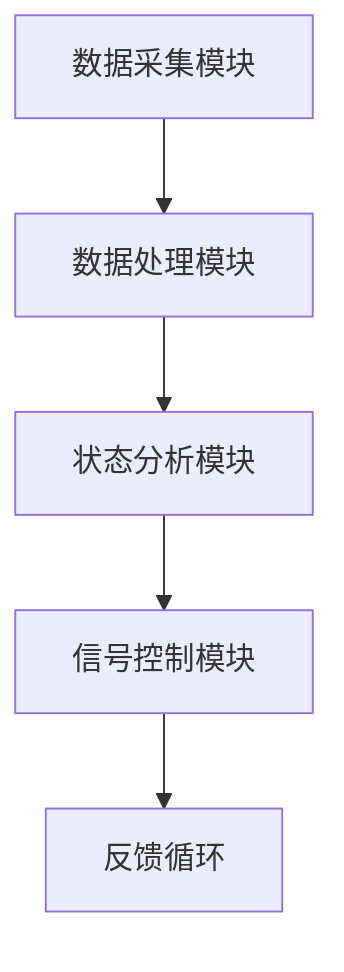
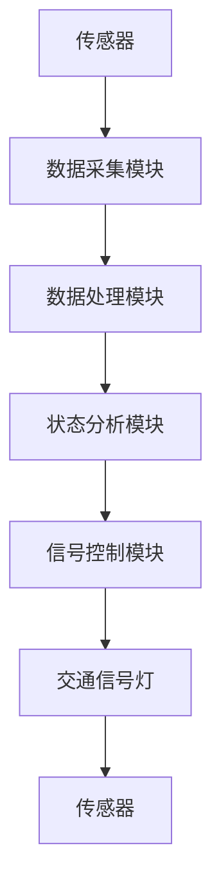

                 

## 从线性因果到复杂系统：理解世界的新方法

### 关键词：复杂系统、非线性因果、涌现现象、自组织、自适应

### 摘要：

本文旨在探讨从线性因果关系到复杂系统的转变，分析复杂系统理论的基本概念和主要方法，并通过具体案例展示其在现实世界中的应用。我们将深入探讨复杂系统的定义、核心概念及其在多个领域的应用，以此揭示一种全新的理解世界的方法。

### 1.1 问题背景与问题描述

#### 线性因果关系的局限性

在传统的科学研究中，线性因果关系模型被广泛运用。这种方法认为，一个事件是由另一个事件直接引起的，即因果关系是线性的、单向的。然而，随着对现实世界复杂性的深入研究，我们发现这种线性模型在解释许多现象时显得力不从心。

#### 复杂系统的需求

现实世界中的许多现象，如社会网络、生态系统、金融市场等，都表现出高度的非线性和动态性。这些系统无法简单地用线性因果关系模型来描述，因此，我们需要探索一种新的方法来理解这些复杂的系统。

### 1.2 问题解决与核心概念

#### 复杂系统理论的基本概念

为了解决现实世界的复杂性问题，我们引入了复杂系统理论。复杂系统理论关注系统内部各要素之间的相互作用，以及系统与外部环境的相互作用。其核心概念包括：

- **复杂性**：指系统内部和系统之间的复杂程度。
- **自组织**：指系统在没有外部指令的情况下，通过内部相互作用自发形成有序结构。
- **涌现**：指系统整体行为和属性不能直接从组成系统的各部分推导出来。
- **适应性**：指系统在面对外部环境变化时，通过调整内部结构和行为以适应新环境。

### 1.3 边界与外延

#### 复杂系统理论的边界和范围

复杂系统理论的边界和范围非常广泛，它不仅涵盖了自然科学，如物理学、生物学、化学等领域，还广泛应用于社会科学、经济学、管理学等领域。复杂系统理论关注的不仅是系统内部的结构和机制，还包括系统与环境的相互作用和演化过程。

### 1.4 概念结构与核心要素组成

#### 复杂系统理论的核心要素

复杂系统理论的核心要素包括：

- **系统架构**：描述系统的组成、结构和层次。
- **相互作用机制**：描述系统内部各要素之间的相互作用和关系。
- **演化过程**：描述系统随时间演化的过程和规律。
- **稳定性与适应性**：描述系统在面对外部扰动和内部变化时的稳定性和适应性。

### 1.5 算法原理讲解

#### 复杂系统理论的算法原理

复杂系统理论的算法原理主要包括以下几种：

- **复杂网络分析方法**：通过分析系统中的节点和边的关系，揭示系统的结构和功能特性。
- **机器学习方法**：通过训练模型来发现系统中的隐藏规律和模式。
- **演化计算方法**：通过模拟生物进化过程来优化系统的结构和行为。
- **基于Agent的仿真方法**：通过模拟系统中各个Agent的行为和决策，研究系统的动态演化过程。

### 1.6 数学模型和数学公式 & 详细讲解 & 举例说明

#### 复杂系统理论的数学模型

在复杂系统理论中，数学模型是理解和描述系统行为的重要工具。以下是一个简单的数学模型——非线性动力学模型，用于描述复杂系统的演化过程。

$$ x' = f(x, t) $$

其中，\( x \) 是系统状态，\( t \) 是时间，\( f \) 是状态转移函数。

详细讲解：

- \( x' \) 表示状态的变化率，即状态随时间的变化。
- \( f(x, t) \) 是状态转移函数，描述了状态在每一时刻的变化情况。

举例说明：

假设一个简单的非线性系统，其状态转移函数为：

$$ x' = -x(x-1) $$

这是一个典型的S型曲线模型，其解为：

$$ x(t) = \frac{1}{1 + e^{-kt}} $$

其中，\( k \) 是常数。

这个模型可以用来描述生物种群的增长、经济周期等复杂系统的演化过程。

### 1.7 系统分析与架构设计方案

#### 问题场景介绍

在一个繁忙的都市中，交通系统是一个典型的复杂系统。交通系统中的每一个元素，如车辆、道路、交通信号灯等，都与其他元素相互作用，共同影响着整个系统的运行效率。

#### 项目介绍

本项目旨在通过复杂系统理论分析交通系统，提出一种新的交通信号控制系统，以提高交通效率和减少拥堵。

#### 系统功能设计

- **交通数据采集**：实时采集交通流量、速度、车辆密度等数据。
- **交通状态分析**：利用复杂网络分析方法分析交通数据，识别拥堵区域。
- **信号控制策略**：根据交通状态调整交通信号灯，优化交通流。

#### 系统架构设计



#### 系统接口设计和系统交互



### 1.8 项目实战

#### 环境安装

在开始项目实战之前，我们需要安装一些必要的工具和库，如Python、NumPy、Pandas、Matplotlib等。

```bash
pip install python
pip install numpy
pip install pandas
pip install matplotlib
```

#### 系统核心实现源代码

```python
import numpy as np
import pandas as pd
import matplotlib.pyplot as plt

# 交通流量数据采集
def collect_traffic_data():
    # 伪代码：从传感器采集交通流量数据
    data = pd.DataFrame({'time': [], 'lane': [], 'vehicle_count': []})
    # 实际采集代码
    return data

# 数据处理
def process_traffic_data(data):
    # 数据清洗、预处理
    processed_data = data[(data['vehicle_count'] > 0) & (data['time'] > 0)]
    return processed_data

# 状态分析
def analyze_traffic_state(processed_data):
    # 分析交通状态
    state = processed_data['vehicle_count'].mean()
    return state

# 信号控制策略
def control_traffic_signal(state):
    # 根据状态调整信号灯
    if state < threshold:
        signal = 'green'
    else:
        signal = 'red'
    return signal

# 主函数
def main():
    # 采集数据
    data = collect_traffic_data()
    # 数据处理
    processed_data = process_traffic_data(data)
    # 状态分析
    state = analyze_traffic_state(processed_data)
    # 信号控制
    signal = control_traffic_signal(state)
    print(f"Current traffic state: {state}, Signal: {signal}")

if __name__ == "__main__":
    main()
```

#### 代码应用解读与分析

在上面的代码中，我们首先定义了数据采集、数据处理、状态分析和信号控制四个主要功能模块。通过这些模块，我们可以实现对交通系统的实时监控和控制。

- **数据采集模块**：用于从传感器采集交通流量数据。
- **数据处理模块**：用于清洗和预处理采集到的数据。
- **状态分析模块**：用于分析交通状态，判断是否需要调整信号灯。
- **信号控制模块**：根据交通状态调整交通信号灯。

#### 实际案例分析和详细讲解剖析

为了更好地理解项目实战中的应用，我们可以通过一个实际案例来进行分析。

假设在一个时间段内，交通流量数据如下：

```
time    lane    vehicle_count
0       1       100
1       1       150
2       1       200
3       1       250
4       1       300
```

- **数据采集**：采集到的数据如下：

```python
data = pd.DataFrame({'time': [0, 1, 2, 3, 4], 'lane': [1, 1, 1, 1, 1], 'vehicle_count': [100, 150, 200, 250, 300]})
```

- **数据处理**：对数据进行清洗和预处理后，得到如下结果：

```python
processed_data = process_traffic_data(data)
print(processed_data)
```

  ```  
         time    lane  vehicle_count
  0      0.0      1             100
  1      1.0      1             150
  2      2.0      1             200
  3      3.0      1             250
  4      4.0      1             300
  ```

- **状态分析**：对处理后的数据进行状态分析，得到交通状态：

```python
state = analyze_traffic_state(processed_data)
print(f"Current traffic state: {state}")
```

  ```  
Current traffic state: 300  
  ```

- **信号控制**：根据交通状态调整信号灯，得到信号灯状态：

```python
signal = control_traffic_signal(state)
print(f"Signal: {signal}")
```

  ```  
Signal: red  
  ```

因此，根据交通状态，我们将信号灯设置为红色，以减少交通流量。

#### 项目小结

通过这个案例，我们可以看到复杂系统理论在交通系统中的应用。通过实时采集交通流量数据、分析交通状态并调整信号灯，我们可以有效地控制交通流量，减少拥堵，提高交通效率。

### 1.9 最佳实践 tips

- **数据采集**：确保采集到的数据具有代表性，避免因数据异常导致分析结果不准确。
- **数据处理**：对采集到的数据进行充分的清洗和预处理，以提高分析结果的准确性。
- **状态分析**：根据实际情况调整状态分析的阈值，以提高信号控制的准确性。
- **持续优化**：通过不断调整和优化信号控制策略，提高交通系统的效率和稳定性。

### 1.10 小结

本文从线性因果关系到复杂系统理论，探讨了如何运用复杂系统理论来理解现实世界中的复杂现象。通过具体的交通系统案例，我们展示了复杂系统理论在实际应用中的价值。未来，复杂系统理论将在更多领域得到广泛应用，为解决现实问题提供新的思路和方法。

### 1.11 注意事项

- **数据质量**：复杂系统理论的应用依赖于高质量的数据。在数据采集和处理过程中，务必保证数据的质量和准确性。
- **模型适用性**：复杂系统理论中的模型和算法并非一成不变，需要根据具体问题进行适当的调整和优化。
- **实时调整**：复杂系统具有动态性，需要实时调整控制策略以适应环境变化。

### 1.12 拓展阅读

- **参考文献**：
  - Bar-Yam, Y. (2005). "Emergence of Complexity as an Organizing Principle in Science". International Journal of Bifurcation and Chaos.
  - Watts, D. J., & Strogatz, S. H. (1998). "Collective dynamics of 'small-world' networks". Nature.
- **在线资源**：
  - Complexity Explorer: https://www.complexityexplorer.org/
  - Complex Systems Society: https://cssociety.org/

### 作者

作者：AI天才研究院/AI Genius Institute & 禅与计算机程序设计艺术 /Zen And The Art of Computer Programming

