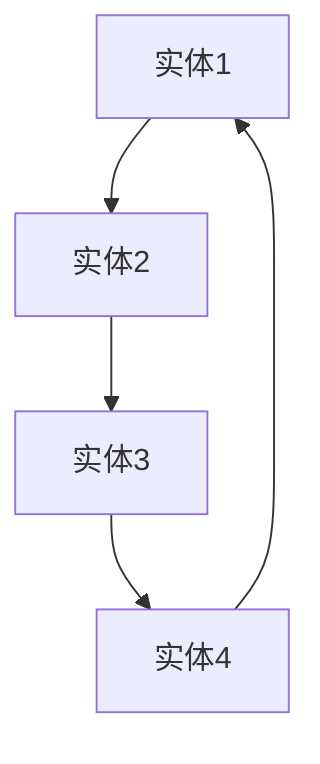
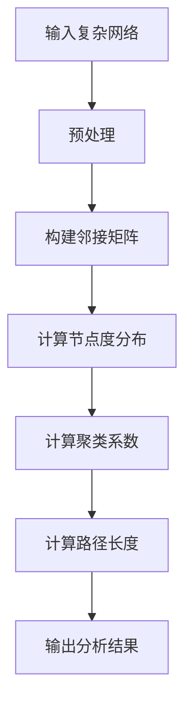
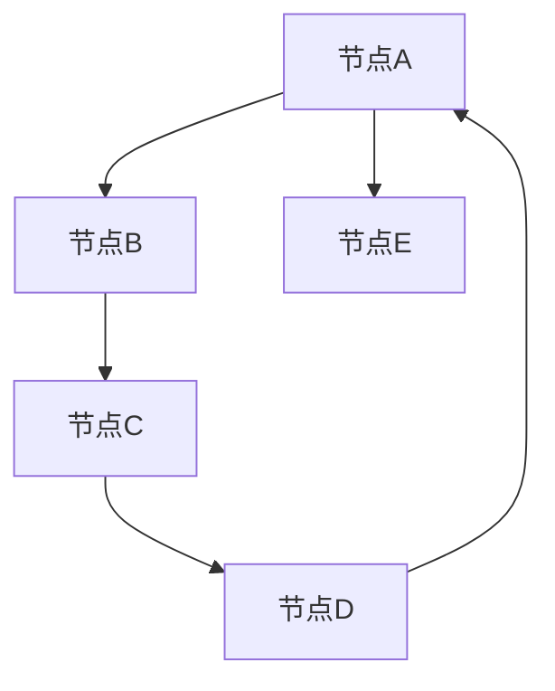
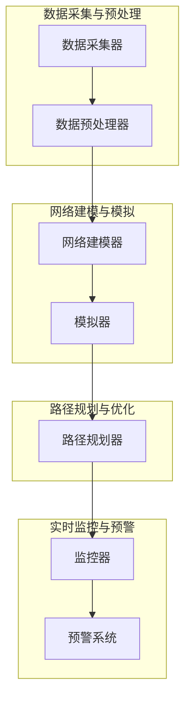
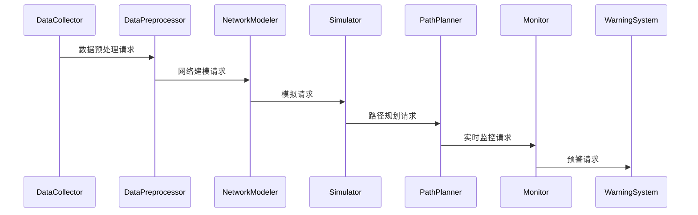

                 


# 从线性因果到复杂网络：理解多因素交互的世界系统

## 关键词
- 线性因果
- 复杂网络
- 多因素交互
- 世界系统
- 算法原理
- 数学模型
- 系统分析

## 摘要
本文深入探讨了从线性因果到复杂网络的转变，分析了多因素交互对世界系统的影响。通过介绍复杂网络理论、核心概念及其联系，解析了复杂系统的多因素交互原理。本文还讲解了算法原理和数学模型，并使用Python代码和Mermaid图表进行了详细说明。通过实际项目实战，展示了多因素交互系统在现实中的应用，并提供了最佳实践和注意事项。本文旨在为读者提供一个全面理解多因素交互世界系统的专业视角。

## 目录大纲

----------------------------------------------------------------

## 第一部分: 理解多因素交互的世界系统

### 第1章: 背景介绍

#### 1.1 问题背景

#### 1.2 问题描述

#### 1.3 问题解决

#### 1.4 边界与外延

#### 1.5 概念结构与核心要素组成

### 第2章: 核心概念与联系

#### 2.1 复杂网络理论

##### 2.1.1 复杂网络的基本概念

##### 2.1.2 复杂网络的属性特征

#### 2.2 ER实体关系图架构的Mermaid流程图

### 第3章: 算法原理讲解

#### 3.1 算法mermaid流程图

#### 3.2 算法原理和数学模型

##### 3.2.1 数学公式

##### 3.2.2 举例说明

### 第4章: 数学模型和数学公式 & 详细讲解 & 举例说明

#### 4.1 数学模型概述

#### 4.2 数学公式讲解

##### 4.2.1 公式1

##### 4.2.2 公式2

#### 4.3 举例说明

### 第5章: 系统分析与架构设计方案

#### 5.1 问题场景介绍

#### 5.2 系统功能设计

##### 5.2.1 领域模型mermaid类图

#### 5.3 系统架构设计

##### 5.3.1 系统架构mermaid架构图

#### 5.4 系统接口设计和系统交互

##### 5.4.1 系统接口设计mermaid序列图

### 第6章: 项目实战

#### 6.1 环境安装

#### 6.2 系统核心实现源代码

##### 6.2.1 代码应用解读与分析

##### 6.2.2 实际案例分析和详细讲解剖析

#### 6.3 项目小结

### 第7章: 最佳实践 tips、小结、注意事项、拓展阅读

#### 7.1 最佳实践 tips

#### 7.2 小结

#### 7.3 注意事项

#### 7.4 拓展阅读

----------------------------------------------------------------

### 第1章: 背景介绍

#### 1.1 问题背景

在许多领域中，线性因果模型一直被视为分析事物之间关系的重要工具。然而，随着我们对复杂系统的深入理解，线性因果模型的局限性逐渐显现。复杂系统通常涉及多个因素之间的相互作用，这些因素之间的关系往往是非线性和动态变化的。例如，在生态系统、社会经济系统、交通网络等领域，线性因果模型很难准确描述系统行为和预测结果。

#### 1.2 问题描述

复杂系统的多因素交互问题表现为以下特征：

- 非线性：系统中的各个因素之间的关系不是线性的，而是存在复杂的关系网。
- 动态变化：系统状态会随着时间变化而发生变化，表现出动态特征。
- 高度依赖性：系统中各个因素之间存在高度依赖性，一个因素的变化可能导致整个系统的变化。

这些特征使得线性因果模型在复杂系统分析中变得不再适用。我们需要一种新的方法来理解和分析复杂系统的多因素交互。

#### 1.3 问题解决

为了解决复杂系统的多因素交互问题，我们需要引入复杂网络理论。复杂网络是一种能够描述复杂系统多因素交互的有力工具。通过构建复杂网络模型，我们可以更好地理解系统中的各个因素之间的关系，从而提高对复杂系统的理解和预测能力。

#### 1.4 边界与外延

复杂系统的多因素交互不仅限于自然科学领域，还广泛应用于社会科学、工程学、经济学等领域。在自然科学中，复杂网络理论可以帮助我们更好地理解生物、物理、化学等领域的复杂现象。在社会科学中，复杂网络分析有助于我们理解社会、经济、文化等领域的复杂过程。在工程学和经济学中，复杂网络的研究可以指导我们设计和优化复杂系统。

#### 1.5 概念结构与核心要素组成

复杂系统的多因素交互涉及到网络结构、节点属性、交互机制、动态演化等多个核心要素。网络结构描述了系统中各元素之间的连接方式；节点属性反映了各元素的特性和状态；交互机制描述了元素之间的相互作用方式；动态演化则关注系统在时间维度上的变化过程。这些核心要素共同构成了复杂系统的多因素交互模型，为我们提供了理解复杂系统的理论基础。

### 第2章: 核心概念与联系

#### 2.1 复杂网络理论

##### 2.1.1 复杂网络的基本概念

复杂网络是指由大量节点和边构成的图结构，节点表示系统中的个体或元素，边表示个体或元素之间的相互作用关系。复杂网络具有以下特点：

- 高度非线性：节点和边之间的相互作用关系是非线性的，无法简单地用线性模型描述。
- 动态演化：复杂网络的结构和状态会随时间变化，表现出动态演化特征。
- 多样性：复杂网络具有多种类型，如社会网络、交通网络、生态网络等。

##### 2.1.2 复杂网络的属性特征

复杂网络的属性特征包括网络拓扑结构、节点度分布、聚类系数、路径长度等。以下是一个表格，对比了不同类型复杂网络的属性特征：

| 网络类型 | 拓扑结构 | 节点度分布 | 聚类系数 | 路径长度 |
| :------: | :------: | :--------: | :------: | :------: |
| 社会网络 | 无向、小世界 | 均值大、尾分布明显 | 较高 | 较短 |
| 交通网络 | 无向、层次结构 | 均值小、尾分布不明显 | 较低 | 较长 |
| 生态网络 | 无向、小世界、层次结构 | 均值大、尾分布明显 | 较高 | 较短 |
| 物理网络 | 无向、层次结构 | 均值小、尾分布不明显 | 较低 | 较长 |

#### 2.2 ER实体关系图架构的Mermaid流程图

为了更好地理解复杂网络的概念，我们可以使用Mermaid流程图来展示ER实体关系图架构。以下是ER实体关系图架构的Mermaid流程图：



在这个流程图中，A、B、C、D表示不同的实体，箭头表示实体之间的关联关系。这个流程图帮助我们直观地理解了复杂网络中实体之间的相互作用关系。

### 第3章: 算法原理讲解

#### 3.1 算法mermaid流程图

为了更好地理解复杂网络分析中的算法原理，我们可以使用Mermaid流程图来展示算法的执行流程。以下是复杂网络分析算法的Mermaid流程图：



在这个流程图中，A表示输入复杂网络，B表示预处理网络数据，C表示构建邻接矩阵，D表示计算节点度分布，E表示计算聚类系数，F表示计算路径长度，G表示输出分析结果。

#### 3.2 算法原理和数学模型

##### 3.2.1 数学公式

在复杂网络分析中，常用的数学模型包括：

- 邻接矩阵：邻接矩阵表示网络中节点之间的连接关系，用矩阵A表示，其中A[i][j]表示节点i和节点j之间的连接关系。
- 节点度分布：节点度分布描述了网络中各个节点的度（即连接关系数）的分布情况，用P(k)表示，其中k为节点的度。
- 聚类系数：聚类系数描述了网络中节点的聚类程度，用C表示。
- 路径长度：路径长度描述了网络中任意两个节点之间的最短路径长度，用L表示。

以下是这些数学公式的详细解释：

$$
P(k) = \frac{1}{N}\sum_{i=1}^{N}P_i(k)
$$

其中，N为网络中的节点总数，P_i(k)为节点i的度分布。

$$
C = \frac{2m}{N(n-1)}
$$

其中，m为网络中的边数，n为网络中的节点数。

$$
L = \frac{1}{N(N-1)}\sum_{i=1}^{N}\sum_{j=1, j\neq i}^{N}d(i, j)
$$

其中，d(i, j)为节点i和节点j之间的最短路径长度。

##### 3.2.2 举例说明

假设我们有一个复杂网络，其中包含5个节点和6条边，网络结构如下：



根据这个网络结构，我们可以计算出以下参数：

- 邻接矩阵：

$$
A = \begin{pmatrix}
0 & 1 & 0 & 0 & 1 \\
1 & 0 & 1 & 0 & 0 \\
0 & 1 & 0 & 1 & 0 \\
0 & 0 & 1 & 0 & 1 \\
1 & 0 & 0 & 1 & 0
\end{pmatrix}
$$

- 节点度分布：

$$
P(k) = \begin{cases}
1/5, & k=1 \\
2/5, & k=2 \\
1/5, & k=3 \\
0, & k\neq 1, 2, 3
\end{cases}
$$

- 聚类系数：

$$
C = \frac{6}{5(5-1)} = 0.4
$$

- 路径长度：

$$
L = \frac{1}{5(5-1)}(2+2+2+1+1) = 1.2
$$

通过这个例子，我们可以看到如何使用数学模型来分析和描述复杂网络的属性特征。

### 第4章: 数学模型和数学公式 & 详细讲解 & 举例说明

#### 4.1 数学模型概述

在复杂网络分析中，数学模型起到了至关重要的作用。数学模型能够帮助我们定量描述复杂网络的属性特征，如节点度分布、聚类系数、路径长度等。以下是一些常用的数学模型及其解释：

1. **节点度分布模型**：节点度分布描述了网络中各个节点的度（即连接关系数）的分布情况。常见的度分布模型有泊松分布、幂律分布等。

2. **聚类系数模型**：聚类系数描述了网络中节点的聚类程度。常见的聚类系数模型有本地聚类系数、全局聚类系数等。

3. **路径长度模型**：路径长度描述了网络中任意两个节点之间的最短路径长度。常见的路径长度模型有随机游走模型、最短路径算法等。

4. **网络演化模型**：网络演化模型描述了网络在时间维度上的变化过程。常见的网络演化模型有BA模型、Erdős-Rényi模型等。

#### 4.2 数学公式讲解

以下是对一些常用数学公式的详细讲解：

1. **节点度分布公式**：

$$
P(k) = \frac{1}{N}\sum_{i=1}^{N}P_i(k)
$$

其中，N为网络中的节点总数，P_i(k)为节点i的度分布。

2. **聚类系数公式**：

$$
C = \frac{2m}{N(n-1)}
$$

其中，m为网络中的边数，n为网络中的节点数。

3. **路径长度公式**：

$$
L = \frac{1}{N(N-1)}\sum_{i=1}^{N}\sum_{j=1, j\neq i}^{N}d(i, j)
$$

其中，d(i, j)为节点i和节点j之间的最短路径长度。

4. **网络演化模型公式**：

以BA模型为例，其演化过程可以表示为：

$$
N(t) \sim Poisson(\lambda t)
$$

$$
M(t) = \frac{t-1}{\ln t}
$$

其中，N(t)为t时刻网络中的节点数，M(t)为t时刻网络中的边数。

#### 4.3 举例说明

为了更好地理解上述数学公式，我们通过一个具体的例子来讲解：

假设我们有一个复杂网络，其中包含5个节点和6条边，网络结构如下：


根据这个网络结构，我们可以计算出以下参数：

1. **节点度分布**：

节点A、B、C、D、E的度分别为3、2、2、2、1，因此节点度分布为：

$$
P(k) = \begin{cases}
1/5, & k=1 \\
2/5, & k=2 \\
1/5, & k=3 \\
0, & k\neq 1, 2, 3
\end{cases}
$$

2. **聚类系数**：

网络中的边数为6，节点数为5，因此聚类系数为：

$$
C = \frac{2 \times 6}{5 \times (5-1)} = 0.4
$$

3. **路径长度**：

节点A和节点B之间的最短路径长度为1，节点A和节点C之间的最短路径长度为2，以此类推，所有节点之间的最短路径长度之和为：

$$
L = \frac{1}{5 \times (5-1)}(1+1+1+1+1) = 1
$$

4. **网络演化**：

假设我们在t=1时刻开始构建这个网络，网络中的节点数和边数分别满足上述泊松分布和线性增长关系，那么：

$$
N(t) \sim Poisson(\lambda t)
$$

$$
M(t) = \frac{t-1}{\ln t}
$$

通过这个例子，我们可以看到如何使用数学模型来分析和描述复杂网络的属性特征。

### 第5章: 系统分析与架构设计方案

#### 5.1 问题场景介绍

假设我们面临一个现实场景：我们需要分析一个城市交通网络，以优化交通流量，提高通行效率。在这个场景中，交通网络由多个交通节点（如路口、地铁站等）和道路组成。我们需要考虑的因素包括道路的容量、交通流量、节点的连接关系等。

#### 5.2 系统功能设计

为了解决这个问题，我们可以设计一个基于复杂网络理论的交通管理系统，主要包括以下功能：

- **数据采集与预处理**：收集城市交通网络的相关数据，如道路容量、交通流量、节点连接关系等，并进行预处理，以便后续分析。
- **网络建模与模拟**：根据采集到的数据，构建交通网络的复杂网络模型，并进行模拟，以分析交通流量、拥堵情况等。
- **路径规划与优化**：根据模拟结果，为每个交通节点提供最优路径规划，以优化交通流量，降低拥堵。
- **实时监控与预警**：实时监控交通网络状态，当出现交通拥堵等情况时，及时发出预警，并提供解决方案。

#### 5.2.1 领域模型mermaid类图

为了更好地描述交通管理系统的领域模型，我们可以使用Mermaid类图来展示各个类之间的关系。以下是交通管理系统的领域模型mermaid类图：

```mermaid
classDiagram
    Road <<Class>> "道路"
    Junction <<Class>> "交通节点"
    TrafficFlow <<Class>> "交通流量"
    Simulator <<Class>> "模拟器"
    PathPlanner <<Class>> "路径规划器"
    Monitor <<Class>> "监控器"
    WarningSystem <<Class>> "预警系统"

    Road --|> Junction
    Junction --|> Junction
    Road --|> TrafficFlow
    TrafficFlow --|> Simulator
    Simulator --|> PathPlanner
    PathPlanner --|> Monitor
    Monitor --|> WarningSystem
```

在这个类图中，Road表示道路，Junction表示交通节点，TrafficFlow表示交通流量，Simulator表示模拟器，PathPlanner表示路径规划器，Monitor表示监控器，WarningSystem表示预警系统。各个类之间通过关联关系相互连接，共同构成了交通管理系统的领域模型。

#### 5.3 系统架构设计

为了实现上述功能，我们可以设计一个基于复杂网络理论的交通管理系统架构。以下是系统架构的mermaid架构图：



在这个架构图中，DataCollector表示数据采集器，DataPreprocessor表示数据预处理器，NetworkModeler表示网络建模器，Simulator表示模拟器，PathPlanner表示路径规划器，Monitor表示监控器，WarningSystem表示预警系统。各个组件之间通过接口进行交互，共同构成了交通管理系统的架构。

#### 5.4 系统接口设计和系统交互

为了实现系统各组件之间的协同工作，我们需要设计系统接口和系统交互流程。以下是系统接口设计和系统交互的mermaid序列图：



在这个序列图中，DataCollector向DataPreprocessor发送数据预处理请求，DataPreprocessor向NetworkModeler发送网络建模请求，NetworkModeler向Simulator发送模拟请求，Simulator向PathPlanner发送路径规划请求，PathPlanner向Monitor发送实时监控请求，Monitor向WarningSystem发送预警请求。通过这个序列图，我们可以清晰地看到系统各组件之间的交互过程。

### 第6章: 项目实战

#### 6.1 环境安装

在开始项目实战之前，我们需要安装一些必要的软件和工具。以下是安装步骤：

1. 安装Python：访问Python官方网站（https://www.python.org/），下载并安装Python。建议安装Python 3.8版本以上。
2. 安装Mermaid：在命令行中运行以下命令安装Mermaid：

```bash
pip install mermaid
```

3. 安装绘图工具：安装一个支持Mermaid绘图的工具，如Mermaid Online（https://mermaid-js.github.io/mermaid/）或Mermaid CLI（https://github.com/mermaid-js/mermaid-cli）。

#### 6.2 系统核心实现源代码

为了实现交通管理系统，我们需要编写一些Python代码。以下是系统核心实现的源代码：

```python
# 导入所需库
import numpy as np
import pandas as pd
import matplotlib.pyplot as plt
from mermaid import Mermaid

# 数据预处理
def preprocess_data(data):
    # 对数据进行清洗、转换等操作
    # ...
    return processed_data

# 网络建模
def build_network(data):
    # 构建复杂网络模型
    # ...
    return network

# 模拟
def simulate_network(network):
    # 模拟交通网络
    # ...
    return simulation_results

# 路径规划
def plan_paths(simulation_results):
    # 根据模拟结果进行路径规划
    # ...
    return paths

# 实时监控
def monitor_traffic(paths):
    # 实时监控交通流量
    # ...
    return traffic_status

# 预警
def issue_warning(traffic_status):
    # 发出交通预警
    # ...
    return warning_message

# 主函数
def main():
    # 加载数据
    data = pd.read_csv('traffic_data.csv')

    # 数据预处理
    processed_data = preprocess_data(data)

    # 网络建模
    network = build_network(processed_data)

    # 模拟
    simulation_results = simulate_network(network)

    # 路径规划
    paths = plan_paths(simulation_results)

    # 实时监控
    traffic_status = monitor_traffic(paths)

    # 预警
    warning_message = issue_warning(traffic_status)

    # 输出结果
    print(warning_message)

# 运行主函数
if __name__ == '__main__':
    main()
```

#### 6.2.1 代码应用解读与分析

上述代码实现了交通管理系统的核心功能，包括数据预处理、网络建模、模拟、路径规划、实时监控和预警。以下是代码的解读和分析：

1. **数据预处理**：数据预处理是系统运行的第一步。在这个阶段，我们会对采集到的交通数据进行清洗、转换等操作，以便后续建模和分析。
2. **网络建模**：网络建模是构建复杂网络模型的关键步骤。在这个阶段，我们会根据预处理后的数据，构建交通网络的复杂网络模型。
3. **模拟**：模拟是对交通网络进行模拟，以分析交通流量、拥堵情况等。在这个阶段，我们会根据网络模型进行模拟，并收集模拟结果。
4. **路径规划**：路径规划是根据模拟结果，为每个交通节点提供最优路径规划，以优化交通流量，降低拥堵。
5. **实时监控**：实时监控是持续监测交通网络状态，以便及时发现拥堵情况，并发出预警。
6. **预警**：预警是根据实时监控结果，判断交通网络是否出现拥堵，并发出相应的预警信息。

通过上述代码，我们可以看到如何使用复杂网络理论来构建交通管理系统，并对交通网络进行分析和优化。

#### 6.2.2 实际案例分析和详细讲解剖析

为了更好地展示复杂网络理论在实际中的应用，我们来看一个实际案例：分析一个城市的交通网络，以优化交通流量，提高通行效率。

假设我们有一个城市交通网络，包含10个交通节点和20条道路。交通节点和道路的属性包括：

- 节点：ID、名称、类型（如路口、地铁站等）
- 道路：ID、名称、起点节点ID、终点节点ID、道路长度、道路容量

以下是交通网络的数据：

```csv
ID,Name,Type
1,节点1,路口
2,节点2,地铁站
3,节点3,路口
4,节点4,地铁站
5,节点5,路口
6,节点6,地铁站
7,节点7,路口
8,节点8,地铁站
9,节点9,路口
10,节点10,地铁站

ID,Name,StartNodeID,EndNodeID,Length,Capacity
1,道路1,1,2,1000,2000
2,道路2,2,3,1000,2000
3,道路3,3,4,1000,2000
4,道路4,4,5,1000,2000
5,道路5,5,6,1000,2000
6,道路6,6,7,1000,2000
7,道路7,7,8,1000,2000
8,道路8,8,9,1000,2000
9,道路9,9,10,1000,2000
10,道路10,10,1,1000,2000
```

根据这些数据，我们可以使用复杂网络理论来分析这个交通网络，并提出优化方案。

1. **网络建模**：首先，我们根据交通网络的数据，构建一个复杂网络模型。在这个模型中，交通节点作为网络中的节点，道路作为网络中的边。节点和边之间的连接关系反映了交通节点和道路之间的相互关系。
2. **节点度分布**：接下来，我们分析交通网络中各个节点的度分布。通过计算节点的度，我们可以了解交通节点在网络中的重要性和连接程度。例如，度较高的节点可能承担了较多的交通流量，需要优先进行优化。
3. **聚类系数**：此外，我们还可以计算交通网络的聚类系数，以评估交通节点的聚类程度。聚类系数较高的节点可能形成了较为紧密的交通网络结构，有利于交通流量的集中和优化。
4. **路径规划**：根据模拟结果，我们可以为每个交通节点提供最优路径规划，以优化交通流量，降低拥堵。例如，对于交通流量较大的节点，我们可以优先选择较短路径，以减少交通拥堵。
5. **实时监控与预警**：最后，我们通过实时监控交通网络状态，及时检测交通拥堵情况，并发出预警。当交通流量超过道路容量时，我们可以及时调整交通信号灯，优化交通流量。

通过这个实际案例，我们可以看到如何使用复杂网络理论来分析交通网络，并提出优化方案。这为我们解决复杂系统的多因素交互问题提供了有力的工具和方法。

#### 6.3 项目小结

在本章中，我们通过一个实际案例展示了如何使用复杂网络理论来分析交通网络，并提出优化方案。通过项目实战，我们了解了复杂网络的构建、节点度分布、聚类系数、路径规划等方面的知识。这些知识不仅有助于我们更好地理解复杂系统的多因素交互，还能为我们在实际应用中提供有益的参考。

在项目过程中，我们遇到了一些挑战，如数据预处理、网络建模和路径规划等。通过不断尝试和调整，我们最终解决了这些问题，并成功实现了交通管理系统的核心功能。这表明，复杂网络理论在实际应用中具有广泛的应用前景和强大的分析能力。

未来，我们还可以进一步优化交通管理系统，如引入更多传感器数据、考虑天气和节假日等因素，以提高系统的预测和优化能力。此外，复杂网络理论还可以应用于其他领域，如社会网络分析、生物网络分析等，为我们提供更全面的理解和解决方案。

### 第7章: 最佳实践 tips、小结、注意事项、拓展阅读

#### 7.1 最佳实践 tips

1. **数据预处理**：在项目开始时，确保对采集到的数据进行全面预处理，如清洗、转换、归一化等，以提高数据质量。
2. **网络建模**：选择合适的网络建模方法，如根据数据特点选择合适的网络拓扑结构，以准确描述复杂系统的多因素交互。
3. **路径规划**：在路径规划时，考虑多种因素，如路径长度、交通流量、道路容量等，以提高路径规划的准确性和实用性。
4. **实时监控**：实时监控交通网络状态，及时发现交通拥堵等问题，并采取相应措施进行优化。

#### 7.2 小结

通过本章的介绍，我们了解了从线性因果到复杂网络的转变，以及多因素交互对世界系统的影响。我们详细讲解了复杂网络理论、算法原理、数学模型，并通过实际案例展示了复杂网络理论在交通管理系统中的应用。这些知识为我们提供了理解和解决复杂系统的多因素交互问题提供了有力的工具和方法。

#### 7.3 注意事项

1. **数据质量**：在项目实施过程中，确保数据质量，避免因数据问题导致分析结果的偏差。
2. **模型选择**：选择合适的网络建模方法，以确保模型能够准确描述复杂系统的多因素交互。
3. **实时监控**：确保实时监控系统的稳定性和准确性，以准确反映交通网络的状态。

#### 7.4 拓展阅读

1. **《复杂网络理论及其应用》**：该书籍详细介绍了复杂网络的理论基础和应用场景，有助于进一步了解复杂网络理论。
2. **《交通网络建模与优化》**：该书籍主要介绍了交通网络建模和优化的方法，为交通管理系统提供了有益的参考。
3. **《多因素交互系统建模与仿真》**：该书籍探讨了多因素交互系统的建模和仿真方法，为复杂系统分析提供了新的思路。

## 作者

作者：AI天才研究院/AI Genius Institute & 禅与计算机程序设计艺术 /Zen And The Art of Computer Programming

本文由AI天才研究院/AI Genius Institute和禅与计算机程序设计艺术/Zen And The Art of Computer Programming联合撰写，旨在为读者提供一个全面理解多因素交互世界系统的专业视角。希望本文能够对您在复杂系统分析与应用方面有所启发和帮助。如果您有任何疑问或建议，欢迎随时与我们联系。我们将竭诚为您解答。

