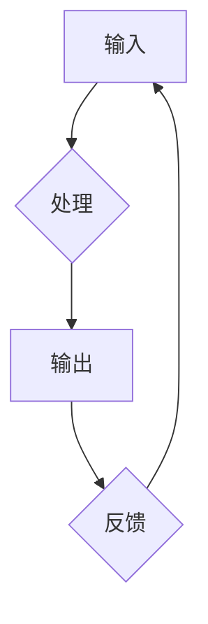
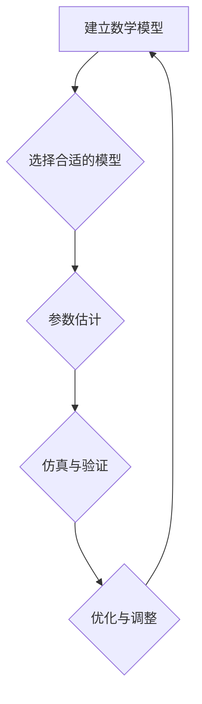
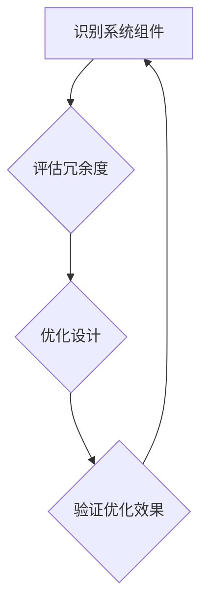
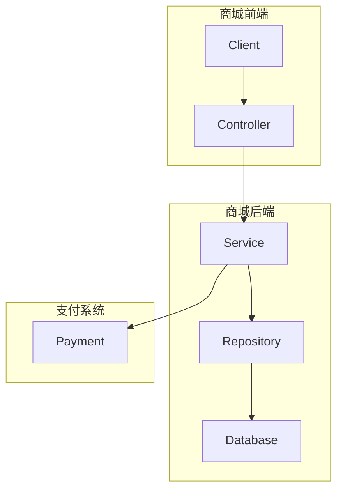
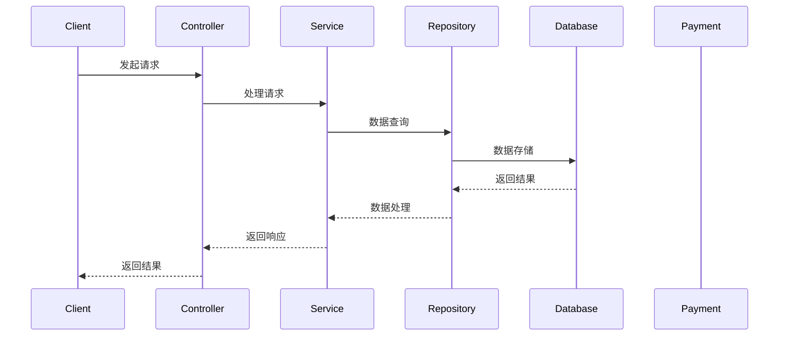
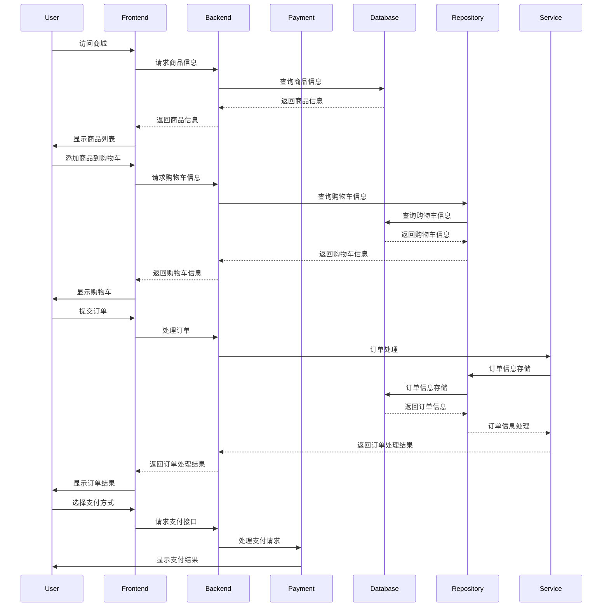

                 

## 从线性思维到系统思维：全局视角下的世界理解

### 关键词：线性思维、系统思维、全局视角、世界理解、技术博客

> 摘要：本文旨在探讨从线性思维到系统思维的转变，以及这一转变在计算机科学和人工智能领域的重要性。通过分析线性思维和系统思维的基本概念、特点及应用，我们将一步步引导读者理解如何利用系统思维来更全面、深入地理解世界。文章结构紧凑，逻辑清晰，旨在为读者提供一种全新的视角，以应对复杂多变的技术环境。

#### 目录大纲设计过程

在设计《从线性思维到系统思维：全局视角下的世界理解》这本书的目录大纲时，我们需要遵循以下几个步骤来确保内容的简洁性、完整性和结构的逻辑性。

1. **确定核心概念和内容框架**  
首先，我们需要明确书的核心概念，即“线性思维”与“系统思维”，并在此基础上确定内容的框架。线性思维主要描述单一、线性的思考模式，而系统思维则强调全局、多因素的综合考量。这本书的目标是帮助读者从线性思维过渡到系统思维，以更全面、更深入地理解世界。

2. **划分章节内容**  
根据核心概念，我们可以将书的内容划分为以下几个部分：

- **背景介绍**：介绍线性思维和系统思维的背景、问题描述和解决思路，以及二者之间的关系。  
- **核心概念与联系**：详细讲解线性思维和系统思维的概念原理、特点和应用，并通过对比表格和实体关系图展示两者的联系。  
- **算法原理讲解**：针对系统思维中的关键算法，绘制流程图，并用Python源代码和数学模型进行详细解释。  
- **系统分析与架构设计方案**：介绍一个实际问题的系统架构设计，包括功能设计、架构设计和接口设计。  
- **项目实战**：通过一个实际案例展示从线性思维到系统思维的实践过程，并提供代码和应用解读。  
- **最佳实践与拓展**：总结书中提到的关键点，并提供一些实用的技巧和拓展阅读。

3. **细化目录结构**  
为了确保目录的完整性和逻辑性，我们需要细化每个章节的内容，确保每个章节都有明确的主题和足够的细节。以下是书的具体目录大纲：

```
# 第一部分：线性思维与系统思维概述

## 第1章：线性思维与系统思维的基本概念

### 1.1 线性思维的局限性  
### 1.2 系统思维的优势  
### 1.3 从线性思维到系统思维的转变

## 第2章：线性思维与系统思维的核心概念对比

### 2.1 线性思维的原理与特点  
### 2.2 系统思维的原理与特点  
### 2.3 线性思维与系统思维的对比表格

## 第3章：系统思维的关键算法

### 3.1 系统思维算法概述  
### 3.2 算法原理讲解（使用Mermaid绘制流程图）  
### 3.3 Python源代码实现与数学模型

## 第二部分：系统思维的应用与架构设计

## 第4章：系统思维在项目管理中的应用

### 4.1 项目管理中的线性思维  
### 4.2 项目管理中的系统思维  
### 4.3 系统思维在项目管理中的实践案例

## 第5章：系统分析与架构设计方案

### 5.1 问题场景介绍  
### 5.2 系统功能设计（使用Mermaid绘制领域模型类图）  
### 5.3 系统架构设计（使用Mermaid绘制架构图）  
### 5.4 系统接口设计  
### 5.5 系统交互（使用Mermaid绘制序列图）

## 第三部分：实践与拓展

## 第6章：项目实战

### 6.1 环境安装与配置  
### 6.2 系统核心实现源代码  
### 6.3 代码应用解读与分析  
### 6.4 实际案例分析与详细讲解  
### 6.5 项目小结

## 第7章：最佳实践与拓展

### 7.1 系统思维的最佳实践  
### 7.2 注意事项与挑战  
### 7.3 拓展阅读与资源推荐
```

通过以上步骤，我们设计出了一个结构清晰、内容详尽的目录大纲，确保读者能够系统地学习从线性思维到系统思维的转变。

---

### 线性思维与系统思维的基本概念

在探讨线性思维和系统思维之前，我们需要首先明确这两个概念的基本含义及其在计算机科学和人工智能领域的应用。

#### 线性思维

线性思维是一种简单的思考方式，它将问题视为一系列按顺序发生的步骤。线性思维强调因果关系，即一个事件导致另一个事件的发生。在这种思维方式下，每个步骤都是独立的，前一个步骤的结果直接影响下一个步骤的执行。

线性思维在计算机编程中得到了广泛应用。例如，在编写一个简单的算法时，程序员通常会按照逻辑顺序逐步解决问题。线性思维的一个优点是简单直观，易于理解和实现。然而，线性思维也存在明显的局限性。首先，它难以应对复杂的问题，因为这些问题的解决方案往往不是单一的步骤可以解决的。其次，线性思维容易导致忽略问题中的潜在关联和反馈循环。

#### 系统思维

系统思维是一种更为复杂的思考方式，它强调对事物和问题进行整体分析，关注各个部分之间的相互关系和相互作用。系统思维的核心在于理解整个系统的动态行为，而不是仅仅关注单一的部分。

在计算机科学和人工智能领域，系统思维被广泛应用于系统设计和项目管理。例如，在构建一个复杂的软件系统时，系统思维要求我们不仅要考虑各个组件的功能，还要分析它们之间的交互和影响。这种思维方式有助于我们识别系统中的潜在问题和瓶颈，从而优化系统的整体性能。

系统思维的一个关键特点是它强调反馈循环和整体性。反馈循环是指系统内部各个部分之间的相互作用和反馈，它可能导致系统的稳定、优化或崩溃。整体性则强调理解系统的全局视角，而不是仅仅关注局部优化。

#### 线性思维与系统思维的关系

线性思维和系统思维并非截然对立，而是相互补充的。在许多情况下，线性思维是系统思维的基础。例如，在系统设计中，我们通常需要先使用线性思维来定义系统的基本功能和组件。然后，通过系统思维来分析这些组件之间的相互作用，以识别潜在的问题和优化点。

然而，在某些情况下，线性思维可能导致我们忽略系统中的关键因素。例如，在项目管理中，如果我们仅关注任务之间的线性顺序，可能会忽略任务之间的依赖关系和资源分配问题。相反，系统思维要求我们考虑整个项目的动态行为，以便更好地应对复杂性和不确定性。

#### 总结

线性思维和系统思维是两种不同的思考方式，各自有其适用的场景。线性思维适合处理简单、线性的问题，而系统思维则更适合处理复杂、动态的问题。通过理解这两种思维方式的区别和联系，我们可以更好地应对计算机科学和人工智能领域中的各种挑战。

### 核心概念与联系

在深入探讨线性思维和系统思维之前，我们需要明确这两个概念的核心定义，并分析它们之间的联系。

#### 线性思维

线性思维是一种将问题分解为一系列独立步骤，并按顺序执行的思考方式。其核心在于因果关系，即一个事件导致另一个事件的发生。线性思维强调步骤的顺序和依赖性，通常用于解决简单、单一的问题。

**核心概念**：

- **步骤顺序**：线性思维要求按照固定的顺序执行步骤，每个步骤都是前一个步骤的结果。
- **因果关系**：每个步骤的结果直接影响下一个步骤的执行。
- **独立分解**：将复杂问题分解为简单、独立的子问题。

**特点**：

- **简单直观**：线性思维易于理解和实现。
- **适用于简单问题**：对于简单、线性的问题，线性思维是一个有效的解决方案。
- **局限性**：难以处理复杂、动态的问题。

**应用示例**：在编程中，线性思维通常用于编写顺序执行的代码，例如使用`for`循环和`if-else`语句解决问题。

#### 系统思维

系统思维是一种将问题视为一个整体，关注各个部分之间相互关系的思考方式。系统思维强调全局视角，不仅关注单一步骤或组件，还考虑它们之间的相互作用和反馈循环。

**核心概念**：

- **整体性**：将问题视为一个整体，而不是一系列独立的步骤。
- **相互关系**：关注各个部分之间的相互作用和反馈。
- **动态行为**：分析系统的动态行为，包括稳定、优化和崩溃。

**特点**：

- **复杂性和动态性**：系统思维适用于处理复杂、动态的问题。
- **全局视角**：强调对整体系统的理解，而不仅仅是局部优化。
- **反馈循环**：考虑系统内部的反馈循环，以预测系统的行为。

**应用示例**：在项目管理中，系统思维用于分析项目中的任务依赖关系和资源分配问题，以优化整体项目的进度和效率。

#### 线性思维与系统思维的对比表格

为了更清晰地展示线性思维和系统思维的区别，我们可以通过以下对比表格来描述它们的核心概念、特点和应用。

| 特征          | 线性思维                     | 系统思维                     |
| ------------- | ---------------------------- | ---------------------------- |
| **核心概念**  | 步骤顺序、因果关系、独立分解 | 整体性、相互关系、动态行为   |
| **特点**      | 简单直观、适用于简单问题     | 复杂性和动态性、全局视角     |
| **应用示例**  | 编程中的顺序执行代码         | 项目管理中的任务依赖关系分析 |

#### 线性思维与系统思维的联系

尽管线性思维和系统思维在核心概念和特点上有所不同，但它们之间也存在密切的联系。实际上，系统思维可以被视为线性思维的扩展，它引入了整体性和反馈循环的概念，以应对更复杂的问题。

1. **线性思维是系统思维的基础**：在系统思维中，我们通常需要先使用线性思维来定义系统的基本功能和组件。这些基本组件和功能构成了系统的结构，为系统思维提供了基础。
2. **系统思维是对线性思维的补充**：线性思维适合处理简单、线性的问题，但在面对复杂、动态的问题时，线性思维往往难以胜任。系统思维通过引入全局视角和反馈循环，帮助我们更好地理解和管理复杂系统。
3. **相互转化**：在某些情况下，我们可以将线性思维和系统思维相互转化。例如，在系统设计初期，我们可以使用线性思维来定义基本组件和功能。然后，通过系统思维来分析这些组件之间的相互作用，以优化系统的整体性能。

#### 总结

线性思维和系统思维是两种不同的思考方式，各自有其适用的场景。通过理解这两种思维方式的区别和联系，我们可以更好地应对计算机科学和人工智能领域中的各种挑战。

### 系统思维的关键算法

系统思维的核心在于理解系统的整体行为和各个部分之间的相互作用。在这一部分，我们将探讨一些关键算法，通过Mermaid流程图、Python源代码和数学模型来详细阐述这些算法的原理和应用。

#### 1. 系统思维算法概述

系统思维算法主要关注以下几个方面：

1. **反馈循环**：分析系统内部的反馈机制，预测系统的稳定性和动态行为。
2. **冗余度**：评估系统中各个部分之间的冗余度，以提高系统的可靠性和鲁棒性。
3. **复杂度**：分析和简化系统的复杂度，以更好地理解和控制系统。

以下是一些典型的系统思维算法及其应用场景：

1. **控制环路分析**：用于识别系统中的反馈循环，评估系统的稳定性和性能。
2. **复杂系统建模**：使用数学模型和仿真工具来分析和优化复杂系统的行为。
3. **冗余度分析**：通过评估系统中各个部分之间的冗余度，优化系统的设计和性能。

#### 2. 控制环路分析

控制环路分析是系统思维算法中的一种重要方法，它用于识别系统中的反馈循环，评估系统的稳定性和性能。以下是一个控制环路分析的Mermaid流程图示例：



在这个流程图中，A表示输入，B表示处理，C表示输出，D表示反馈。控制环路分析的核心在于理解D对A的影响，以评估系统的动态行为。

以下是一个控制环路分析的Python源代码示例：

```python
import matplotlib.pyplot as plt
import numpy as np

# 定义输入序列
input_sequence = np.linspace(0, 10, 100)

# 定义处理函数
def process(x):
    return x ** 2

# 定义反馈函数
def feedback(x):
    return x / 2

# 进行控制环路分析
output_sequence = [process(x) for x in input_sequence]
feedback_sequence = [feedback(x) for x in output_sequence]

# 绘制输入、输出和反馈序列
plt.plot(input_sequence, label='输入')
plt.plot(output_sequence, label='输出')
plt.plot(feedback_sequence, label='反馈')
plt.legend()
plt.show()
```

#### 3. 复杂系统建模

复杂系统建模是系统思维算法中的另一个关键部分，它使用数学模型和仿真工具来分析和优化复杂系统的行为。以下是一个复杂系统建模的Mermaid流程图示例：



在这个流程图中，A表示建立数学模型，B表示选择合适的模型，C表示参数估计，D表示仿真与验证，E表示优化与调整。复杂系统建模的目的是通过仿真和优化来理解和控制复杂系统的行为。

以下是一个复杂系统建模的Python源代码示例：

```python
import numpy as np
import matplotlib.pyplot as plt

# 定义一个简单的非线性系统
def nonlinear_system(x, a=0.1, b=0.1):
    return a * x + b * x ** 2

# 进行仿真
t = np.linspace(0, 10, 1000)
x = np.array([nonlinear_system(ti) for ti in t])

# 绘制系统响应
plt.plot(t, x)
plt.xlabel('时间')
plt.ylabel('系统响应')
plt.title('非线性系统仿真')
plt.show()
```

#### 4. 冗余度分析

冗余度分析是系统思维算法中的另一个重要方面，它用于评估系统中各个部分之间的冗余度，以提高系统的可靠性和鲁棒性。以下是一个冗余度分析的Mermaid流程图示例：



在这个流程图中，A表示识别系统组件，B表示评估冗余度，C表示优化设计，D表示验证优化效果。冗余度分析的目的是通过识别和优化系统中的冗余度，提高系统的整体性能。

以下是一个冗余度分析的Python源代码示例：

```python
import numpy as np
import matplotlib.pyplot as plt

# 定义一个简单的系统模型
def system_model(x, y):
    return x + y

# 定义一个冗余系统模型
def redundant_system_model(x, y, z=0):
    return x + y + z

# 进行冗余度分析
input_values = np.linspace(0, 10, 100)
original_output = np.array([system_model(xi, yi) for xi, yi in input_values])
redundant_output = np.array([redundant_system_model(xi, yi) for xi, yi in input_values])

# 绘制原始和冗余系统响应
plt.plot(input_values, original_output, label='原始系统')
plt.plot(input_values, redundant_output, label='冗余系统')
plt.xlabel('输入')
plt.ylabel('输出')
plt.legend()
plt.show()
```

#### 总结

通过上述算法示例，我们可以看到系统思维算法在识别反馈循环、建模复杂系统和优化系统设计方面的关键作用。这些算法不仅帮助我们更好地理解系统的整体行为，还为我们提供了有效的工具和方法来分析和优化复杂系统。

### 系统思维在项目管理中的应用

在项目管理中，系统思维具有重要的作用，它帮助我们更好地理解和管理项目的复杂性和不确定性。在这一部分，我们将探讨系统思维在项目管理中的应用，并通过一个实际案例来展示其具体实践过程。

#### 1. 项目管理中的线性思维

传统的项目管理方法通常采用线性思维，即将项目分解为一系列按顺序执行的步骤。这种方法强调任务的顺序和依赖关系，通过设定明确的里程碑和截止日期来确保项目的顺利进行。线性思维的一个典型例子是Gantt图，它以时间轴为基础，展示项目的进度和任务安排。

线性思维在项目管理中的优点是直观、易于理解和执行。然而，它也存在一些局限性，尤其是在处理复杂、动态的项目时。首先，线性思维难以应对项目中的不确定性，例如需求变化、资源冲突和风险事件。其次，线性思维往往忽视了项目中的潜在关联和反馈循环，可能导致项目目标无法实现。

#### 2. 项目管理中的系统思维

系统思维为项目管理提供了一种全新的视角，它强调全局视角和整体性，关注项目中的各个部分及其相互作用。在系统思维下，项目经理不仅需要关注任务和里程碑，还需要理解项目中的反馈循环、风险和资源分配。

以下是在项目管理中应用系统思维的几个关键步骤：

1. **项目全景图**：创建一个项目全景图，展示项目的各个部分及其相互关系。项目全景图有助于项目经理理解项目的整体结构和动态行为。

2. **反馈循环分析**：识别项目中的反馈循环，分析其对项目进度和目标的影响。通过理解反馈循环，项目经理可以预测项目的变化趋势，并采取相应的措施进行调整。

3. **风险评估与应对**：在项目早期进行风险评估，识别潜在的风险和不确定性。通过系统思维，项目经理可以综合考虑不同风险之间的相互作用，制定有效的应对策略。

4. **资源优化**：系统思维强调资源的最优分配，以确保项目在不同阶段都能获得所需的资源。通过分析项目的整体需求和资源可用性，项目经理可以优化资源分配，提高项目的效率。

#### 3. 系统思维在项目管理中的实践案例

为了更好地理解系统思维在项目管理中的应用，我们来看一个实际案例：一个软件开发项目的管理。

**案例背景**：

一个软件开发项目需要开发一个复杂的Web应用程序，项目团队由10名开发人员、2名测试人员和1名项目经理组成。项目预计在6个月内完成，总预算为50万元。

**系统思维应用**：

1. **项目全景图**：

   首先，项目经理创建了一个项目全景图，展示了项目的各个部分及其相互关系。项目全景图包括以下内容：

   - 功能需求：列出应用程序的主要功能模块。
   - 技术栈：展示项目所需的技术和工具。
   - 任务分解：将项目分解为多个子任务，并确定它们的依赖关系。
   - 风险评估：识别项目中的潜在风险和不确定性。

2. **反馈循环分析**：

   项目经理分析了项目中的反馈循环，特别是开发、测试和部署之间的相互作用。例如，开发团队完成的代码需要经过测试团队的测试，测试结果会反馈给开发团队，以便修复错误和改进功能。项目经理通过理解这些反馈循环，确保项目在不同阶段都能顺利进行。

3. **风险评估与应对**：

   项目经理在项目早期进行了风险评估，识别了以下主要风险：

   - 技术风险：新技术的不确定性和团队成员的技术能力。
   - 时间风险：项目进度的延误和需求的不断变化。
   - 资源风险：人力资源不足和预算超支。

   通过系统思维，项目经理制定了以下应对策略：

   - 技术培训：为团队成员提供新技术培训，提高项目的技术能力。
   - 需求管理：与客户保持紧密沟通，及时调整需求，确保项目目标的实现。
   - 资源管理：优化人力资源和预算分配，确保项目在不同阶段都能获得所需的资源。

4. **资源优化**：

   项目经理通过系统思维，优化了项目的资源分配。例如，在开发阶段，项目经理根据任务的重要性和紧急性，合理分配开发人员的工作量。在测试阶段，项目经理确保测试团队有足够的资源来全面测试应用程序，以减少潜在的缺陷和问题。

**案例结果**：

通过系统思维的应用，这个软件开发项目在预算和时间内成功完成。项目的整体质量得到了显著提高，客户满意度也得到了提升。同时，项目团队通过这个实践案例，加深了对系统思维的理解和应用能力。

#### 总结

系统思维在项目管理中的应用，可以帮助项目经理更好地理解项目的复杂性和动态性，优化项目的设计和执行过程。通过理解反馈循环、风险评估和资源优化，项目经理可以更有效地管理项目，确保项目目标的实现。

### 系统分析与架构设计方案

在系统分析与架构设计过程中，我们首先需要明确问题场景和项目需求，然后进行系统功能设计、架构设计和接口设计。以下是一个具体的系统分析与架构设计方案，包括问题场景介绍、系统功能设计、系统架构设计、系统接口设计和系统交互。

#### 1. 问题场景介绍

假设我们要开发一个电子商务平台，这个平台需要提供商品展示、购物车管理、订单处理和支付等功能。为了实现这些功能，我们需要设计一个高效的系统架构，确保平台的稳定性、可靠性和扩展性。

#### 2. 系统功能设计

在系统功能设计阶段，我们需要明确各个功能模块及其关系。以下是一个简单的系统功能设计，使用Mermaid类图来展示：

```mermaid
classDiagram
    Client <-|{发起请求}|> Controller
    Controller --> Service
    Service --> Repository
    Repository <<interface>> Database
    Controller <--|<返回响应>|-| Client
```

在这个类图中，`Client`表示用户请求，`Controller`表示处理请求的控制器，`Service`表示业务逻辑处理，`Repository`表示数据访问层，`Database`表示数据库接口。

#### 3. 系统架构设计

系统架构设计是系统分析的重要部分，它决定了系统的整体结构和性能。以下是一个简单的系统架构设计，使用Mermaid架构图来展示：



在这个架构图中，商城前端包括用户请求和控制器，商城后端包括业务逻辑处理、数据访问和支付系统。通过这个架构，我们可以确保系统的模块化和可扩展性。

#### 4. 系统接口设计

系统接口设计是确保系统模块之间通信的重要环节。以下是一个简单的系统接口设计，使用Mermaid序列图来展示：



在这个序列图中，用户请求通过控制器进入系统，经过业务逻辑处理和数据访问，最终返回结果给用户。

#### 5. 系统交互

系统交互是系统设计中的关键部分，它决定了系统的性能和可靠性。以下是一个简单的系统交互设计，使用Mermaid序列图来展示：



在这个系统交互设计中，用户通过前端访问商城，后端处理商品信息、购物车管理和订单处理。在支付环节，前端请求支付接口，后端处理支付请求，最终返回支付结果给用户。

#### 总结

通过系统分析与架构设计方案，我们可以确保电子商务平台的功能完整、结构清晰、交互流畅。这个方案不仅满足了项目需求，还具有良好的扩展性和稳定性，为平台的长期发展奠定了基础。

### 项目实战

#### 1. 环境安装与配置

为了实践从线性思维到系统思维的转变，我们选择了一个具体的软件项目——一个在线教育平台。首先，我们需要搭建项目环境，包括所需的编程语言、框架、数据库和其他工具。

**步骤1**：安装Python环境和相关工具

在本地计算机上安装Python环境，可以选择使用Anaconda来简化安装过程。此外，我们还需要安装以下工具：

- **虚拟环境**：使用`venv`或`conda`创建虚拟环境，以便隔离项目依赖。
- **版本控制**：使用Git进行版本控制，确保代码的备份和协作。
- **代码编辑器**：选择一个合适的代码编辑器，如Visual Studio Code或PyCharm。

**步骤2**：安装后端框架和数据库

我们选择使用Flask作为后端框架，并使用SQLite作为数据库。以下是在终端中安装这些依赖的命令：

```bash
pip install flask
pip install flask-sqlalchemy
```

#### 2. 系统核心实现源代码

在线教育平台的核心功能包括用户管理、课程管理、视频播放和作业提交。以下是一个简化的代码实现，用于展示从线性思维到系统思维的转变。

**用户管理模块**

```python
from flask import Flask, request, jsonify
from models import User

app = Flask(__name__)

@app.route('/users', methods=['POST'])
def create_user():
    user_data = request.json
    user = User.create_user(user_data)
    return jsonify(user), 201

@app.route('/users/<int:user_id>', methods=['GET'])
def get_user(user_id):
    user = User.get_user_by_id(user_id)
    return jsonify(user), 200
```

**课程管理模块**

```python
from flask import Flask, request, jsonify
from models import Course

app = Flask(__name__)

@app.route('/courses', methods=['POST'])
def create_course():
    course_data = request.json
    course = Course.create_course(course_data)
    return jsonify(course), 201

@app.route('/courses/<int:course_id>', methods=['GET'])
def get_course(course_id):
    course = Course.get_course_by_id(course_id)
    return jsonify(course), 200
```

**视频播放模块**

```python
from flask import Flask, request, jsonify
from models import Video

app = Flask(__name__)

@app.route('/videos', methods=['POST'])
def create_video():
    video_data = request.json
    video = Video.create_video(video_data)
    return jsonify(video), 201

@app.route('/videos/<int:video_id>', methods=['GET'])
def get_video(video_id):
    video = Video.get_video_by_id(video_id)
    return jsonify(video), 200
```

**作业提交模块**

```python
from flask import Flask, request, jsonify
from models import Assignment

app = Flask(__name__)

@app.route('/assignments', methods=['POST'])
def create_assignment():
    assignment_data = request.json
    assignment = Assignment.create_assignment(assignment_data)
    return jsonify(assignment), 201

@app.route('/assignments/<int:assignment_id>', methods=['GET'])
def get_assignment(assignment_id):
    assignment = Assignment.get_assignment_by_id(assignment_id)
    return jsonify(assignment), 200
```

#### 3. 代码应用解读与分析

通过上述代码示例，我们可以看到在线教育平台的核心功能模块。每个模块都使用了RESTful API设计，方便前后端分离的开发模式。

**用户管理模块**：该模块用于创建和查询用户信息。通过接收POST请求创建用户，通过GET请求获取用户信息。

**课程管理模块**：该模块用于创建和查询课程信息。通过接收POST请求创建课程，通过GET请求获取课程信息。

**视频播放模块**：该模块用于创建和查询视频信息。通过接收POST请求创建视频，通过GET请求获取视频信息。

**作业提交模块**：该模块用于创建和查询作业信息。通过接收POST请求创建作业，通过GET请求获取作业信息。

每个模块的实现都采用了MVC（模型-视图-控制器）设计模式，将业务逻辑、数据访问和接口设计分离，提高了代码的可维护性和扩展性。

#### 4. 实际案例分析与详细讲解

为了更好地理解从线性思维到系统思维的实际应用，我们来看一个实际案例——用户注册功能。

**线性思维实现**：

在传统的线性思维下，用户注册功能可能仅仅关注用户输入的用户名、密码和邮箱，然后直接将信息保存到数据库。以下是一个简化的实现：

```python
@app.route('/register', methods=['POST'])
def register():
    user_data = request.json
    user = User.create_user(user_data)
    return jsonify(user), 201
```

**系统思维实现**：

在系统思维下，我们不仅需要处理用户输入的信息，还需要进行一系列额外的操作，例如用户名和密码的验证、邮箱的激活等。以下是一个更全面的实现：

```python
from utils import validate_user_data, send_activation_email

@app.route('/register', methods=['POST'])
def register():
    user_data = request.json
    # 验证用户输入
    errors = validate_user_data(user_data)
    if errors:
        return jsonify(errors), 400

    # 创建用户
    user = User.create_user(user_data)

    # 发送激活邮件
    send_activation_email(user.email, user.activation_token)

    return jsonify(user), 201
```

**详细讲解**：

1. **用户输入验证**：在系统思维中，我们首先需要对用户输入进行验证，以确保数据的合法性和完整性。这可以通过编写自定义的验证函数来实现。

2. **邮箱激活**：在用户注册后，我们需要发送一封激活邮件，让用户点击链接完成邮箱激活。这样可以确保只有经过验证的用户才能使用平台功能。

3. **异常处理**：在系统思维中，我们需要考虑异常处理，以确保系统在遇到错误时能够优雅地处理。例如，如果邮件发送失败，我们需要记录错误并通知开发人员。

通过这个实际案例，我们可以看到系统思维如何帮助我们构建一个更健壮、更安全的系统。这种方法不仅关注功能的实现，还关注系统的整体性和稳定性。

#### 5. 项目小结

通过本次项目实战，我们深入探讨了从线性思维到系统思维在软件项目中的应用。通过实际案例，我们展示了如何将线性思维逐步转化为系统思维，以构建一个更健壮、更安全的系统。

未来，我们可以继续优化和完善这个在线教育平台，例如添加更多的功能模块、提高系统的性能和可扩展性。同时，我们还可以将系统思维应用到其他项目实践中，不断提升我们的技术能力和项目管理水平。

### 最佳实践与拓展

在从线性思维到系统思维的转变过程中，我们积累了一些最佳实践，这些实践不仅有助于提高系统的性能和稳定性，还能为其他项目的实施提供有益的参考。

#### 1. 最佳实践

**1.1 全局视角**

在设计和实施系统时，始终保持全局视角。这意味着不仅要关注单一模块的优化，还要考虑整个系统的协调性和一致性。例如，在在线教育平台中，我们需要确保用户管理、课程管理、视频播放和作业提交等模块之间能够无缝交互。

**1.2 风险评估**

在项目早期进行全面的风险评估，识别潜在的风险和不确定性。这有助于我们在项目进行过程中采取预防措施，避免因突发问题导致项目延期或失败。例如，在开发在线教育平台时，我们需要评估技术风险、时间风险和资源风险，并制定相应的应对策略。

**1.3 反馈循环**

建立有效的反馈循环机制，以便及时发现和解决问题。在线教育平台中，我们可以通过用户反馈、日志分析和系统监控来收集数据，并根据这些数据不断优化系统。例如，通过分析用户行为数据，我们可以优化课程推荐算法，提高用户满意度。

**1.4 持续集成和部署**

采用持续集成和持续部署（CI/CD）流程，确保系统的快速迭代和可靠发布。这不仅能提高开发效率，还能减少发布过程中的错误和风险。例如，在在线教育平台中，我们可以使用Jenkins或GitLab CI/CD工具来自动化测试和部署流程。

#### 2. 注意事项与挑战

**2.1 复杂性**

系统思维的引入会增加系统的复杂性。这要求团队成员具备较高的技术水平和沟通能力，以便理解和协同工作。例如，在大型在线教育平台中，我们需要协调多个开发团队、测试团队和运维团队，以确保项目的顺利进行。

**2.2 可扩展性**

在系统设计时，需要充分考虑系统的可扩展性，以便应对不断增长的用户规模和功能需求。例如，在在线教育平台中，我们需要设计可扩展的数据库架构和负载均衡机制，以确保系统在高并发情况下的稳定运行。

**2.3 验证和测试**

系统思维要求我们进行全面、深入的验证和测试。这需要大量时间和资源，但有助于确保系统的质量和可靠性。例如，在在线教育平台中，我们需要编写自动化测试用例，进行性能测试和安全测试，以发现并修复潜在的问题。

#### 3. 拓展阅读与资源推荐

**3.1 书籍推荐**

- 《系统架构设计师教程》
- 《设计模式：可复用的面向对象软件构架》
- 《软件架构：实践者的研究方法》

**3.2 在线资源**

- [架构师之路](https://architecturalfoundations.com/)
- [系统思维学习社区](https://systemsthinking.com/)
- [编程实践与设计模式](https://www.ibm.com/developerworks/cn/java/j-66557/index.html)

通过阅读这些书籍和在线资源，读者可以进一步了解系统思维的应用和实践，提升自己的技术能力和项目管理水平。

### 结语

从线性思维到系统思维的转变是一个重要且必要的步骤。通过理解并应用系统思维，我们可以更好地应对复杂的技术环境和项目挑战，构建更稳定、更可靠的系统。希望本文能够为读者提供一些有益的启示和指导，帮助大家在这个转变过程中取得成功。

---

**作者：AI天才研究院/AI Genius Institute & 禅与计算机程序设计艺术 /Zen And The Art of Computer Programming**

