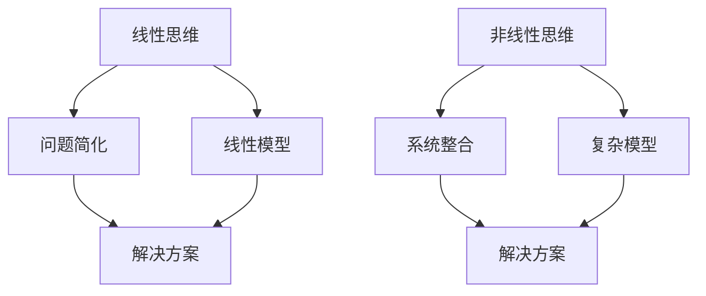
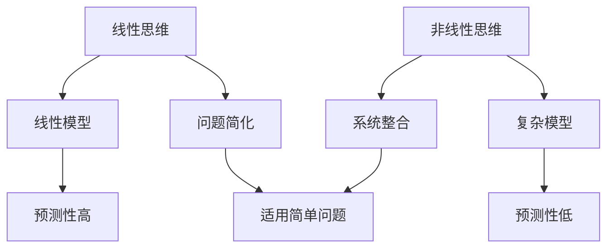

                 

# 从线性思维到非线性思维：理解复杂世界

## 关键词
非线性思维、复杂系统、混沌理论、复杂问题解决、创新设计、决策制定

## 摘要
本文旨在探讨从线性思维向非线性思维的转变，通过分析非线性思维的核心原理、应用领域和实践方法，帮助读者理解复杂世界的本质。文章将结合具体案例，阐述非线性思维在各个领域的实际应用，并讨论其局限性。通过本文的阅读，读者将能够掌握非线性思维的精髓，提升解决复杂问题的能力。

## 目录
1. 背景介绍
   1.1 核心概念
   1.2 核心概念与联系
   1.3 ER实体关系图架构的Mermaid流程图
2. 非线性思维的核心原理
   2.1 非线性思维的定义与特点
   2.2 主流非线性理论简介
   2.3 非线性思维的应用领域
3. 非线性思维的实践方法
   3.1 非线性思维在问题解决中的应用
   3.2 非线性思维在决策制定中的应用
   3.3 非线性思维在创新与设计中的应用
4. 非线性思维的局限性
   4.1 非线性思维的挑战
   4.2 非线性思维的适用性
5. 总结
   5.1 最佳实践 tips
   5.2 小结
   5.3 注意事项
   5.4 拓展阅读

## 第一部分：背景介绍

### 1.1 核心概念

在现代社会中，我们面对的是一个高度复杂、多变且相互关联的世界。传统的线性思维方式，即通过将问题分解为一系列简单步骤来解决，已经无法有效地应对这种复杂性。线性思维依赖于因果关系和线性关系，它强调顺序性和单一性。然而，在复杂系统中，线性思维往往无法捕捉到系统内部各元素之间的复杂相互作用和非线性关系。

非线性思维，则是一种应对复杂性的新方法。它强调系统的整体性和动态性，认为系统的行为往往是不可预测的，因为系统内部存在复杂的反馈循环和相互依赖关系。非线性思维不仅关注局部效应，更关注全局效应，它通过整合不同元素之间的相互作用来理解系统的整体行为。

#### 核心概念原理

非线性思维基于复杂系统的特性，认为系统的行为往往无法简单预测，因为系统内部存在复杂的相互作用和反馈循环。例如，在一个生态系统中，物种之间的相互作用可以导致种群数量的非线性变化，而一个小小的扰动可能会引起整个系统的剧烈变化，这种现象被称为“蝴蝶效应”。

#### 概念属性特征对比表格

| 特征 | 线性思维 | 非线性思维 |
| --- | --- | --- |
| 预测性 | 强 | 弱 |
| 分析方法 | 分解 | 整合 |
| 复杂性 | 低 | 高 |
| 适用场景 | 简单问题 | 复杂问题 |

#### ER实体关系图架构的Mermaid流程图

### 1.2 核心概念与联系

#### 核心概念原理

非线性思维的核心在于理解复杂系统。复杂系统是由许多相互作用的元素组成的，这些元素之间的关系是动态和复杂的。非线性思维通过研究系统内部的各种反馈机制和相互作用，来揭示系统的整体行为。这种方法认为，系统的行为往往不是简单的线性叠加，而是受到非线性关系的支配。

#### 概念属性特征对比表格

| 特征 | 线性思维 | 非线性思维 |
| --- | --- | --- |
| 预测性 | 强 | 弱 |
| 分析方法 | 分解 | 整合 |
| 复杂性 | 低 | 高 |
| 适用场景 | 简单问题 | 复杂问题 |

#### ER实体关系图架构的Mermaid流程图

### 1.3 非线性思维的应用领域

非线性思维在各个领域都有着广泛的应用，以下是几个主要的应用领域：

#### 社会科学

在社会科学中，非线性思维可以帮助我们更好地理解社会行为、经济波动等复杂现象。例如，通过研究社会网络中的相互作用，我们可以预测社会动荡的潜在风险。

#### 工程技术

在工程技术领域，非线性思维有助于设计更复杂的系统，如控制系统、通信系统等。例如，在航空领域，非线性思维用于分析飞行器的动态行为，以提高飞行的稳定性和安全性。

#### 生物学

在生物学中，非线性思维用于研究生态系统的复杂行为和生物群体的演化。例如，通过分析食物链中的相互作用，我们可以预测生态系统的稳定性和物种多样性。

### 第一部分总结

非线性思维是一种应对复杂性的新方法，它强调系统的整体性和动态性。通过理解非线性思维的核心原理和应用领域，我们可以更好地应对现代社会中的复杂问题。接下来，我们将进一步探讨非线性思维的核心原理，以及它在各个领域的具体应用。

## 第二部分：非线性思维的核心原理

### 2.1 非线性思维的定义与特点

非线性思维是一种理解复杂系统的方法，它强调系统的整体性和动态性。与线性思维不同，非线性思维关注系统的整体行为和各元素之间的相互作用。非线性思维的核心特点包括：

#### 整体性

非线性思维认为，系统的行为不仅仅由其各个部分的行为决定，而是由各部分之间的相互作用和整体动态决定。这意味着，要理解一个复杂的系统，我们需要关注其内部各个元素如何相互影响和相互作用。

#### 动态性

非线性思维强调系统的动态性，认为系统的行为会随着时间和环境的变化而变化。因此，非线性思维不仅关注系统的当前状态，还关注系统的发展趋势和演化过程。

#### 不可预测性

非线性系统的一个显著特征是其行为往往不可预测。即使在确定性系统中，由于其内部复杂的反馈循环和相互作用，初始条件的小幅变化可能导致系统行为的巨大差异，这种现象被称为“混沌”。非线性思维接受并利用这种不可预测性，以更全面地理解系统的行为。

### 2.2 主流非线性理论简介

非线性思维的理论基础主要建立在几个关键的非线性科学上，包括混沌理论、复杂系统理论和自组织理论。以下是对这些理论的基本介绍：

#### 混沌理论

混沌理论是研究确定性系统中出现的不规则性和复杂行为的一门学科。它揭示了即使在简单的线性系统中，也可能出现难以预测的复杂行为。混沌理论的标志性概念包括“蝴蝶效应”和“分岔现象”。蝴蝶效应表明，系统初始条件的小幅变化可能导致长期行为的巨大差异。分岔现象则描述了系统在参数变化时，从稳定状态向不稳定状态的转变。

#### 复杂系统理论

复杂系统理论关注由大量相互作用的元素组成的大型系统的行为。复杂系统具有高度的非线性特性，其行为往往无法通过简单的因果关系来解释。复杂系统理论的研究内容包括网络结构、非线性动力学、同步现象等。通过研究复杂系统的行为，我们可以更好地理解社会、经济、生态等复杂现象。

#### 自组织理论

自组织理论探讨系统在无外部指令的情况下如何自发形成组织结构和秩序。自组织理论的核心思想是系统通过内部相互作用和自适应行为，从无序状态向有序状态演变。自组织理论在生物进化、社会动力学、经济系统等领域有广泛应用。

### 2.3 非线性思维的应用领域

非线性思维在多个领域都有广泛的应用，以下是几个主要的应用领域：

#### 社会科学

在社会科学领域，非线性思维帮助研究人员理解社会行为的复杂性。例如，通过分析社会网络中的相互作用，可以预测社会动荡的风险。此外，非线性思维在研究经济波动、政治选举等方面也有重要应用。

#### 工程技术

在工程技术领域，非线性思维有助于设计和分析复杂的系统。例如，在航空领域，非线性思维用于分析飞行器的动态行为，以提高飞行的稳定性和安全性。在控制系统和通信系统设计方面，非线性思维也发挥着重要作用。

#### 生物学

在生物学领域，非线性思维用于研究生态系统的复杂行为。例如，通过分析食物链中的相互作用，可以预测生态系统的稳定性和物种多样性。此外，非线性思维在医学研究中也有应用，如通过分析生物数据来提高诊断的准确性。

### 第二部分总结

非线性思维是一种强大的工具，它帮助我们理解复杂系统的本质。通过混沌理论、复杂系统理论和自组织理论，我们可以更深入地探讨非线性现象。非线性思维在社会科学、工程技术、生物学等多个领域都有广泛应用，它为我们提供了一种全新的视角来应对复杂问题。

接下来，我们将探讨非线性思维的实践方法，并分析其在实际应用中的具体案例。

## 第三部分：非线性思维的实践方法

非线性思维的实践方法主要涉及如何在实际问题解决、决策制定和创新设计中应用非线性思维。以下是这三个方面的具体方法和应用案例。

### 3.1 非线性思维在问题解决中的应用

非线性思维在问题解决中的应用主要体现在对复杂问题的分析和处理上。传统的线性思维往往将问题分解为一系列简单的步骤，而非线性思维则通过整合和整体视角来解决问题。

#### 案例1：项目管理

在项目管理中，非线性思维可以帮助项目经理更好地应对项目的复杂性和不确定性。传统的项目管理方法通常依赖于计划和时间表，但非线性思维强调动态调整和适应性。

**具体步骤：**
1. **全面了解项目背景**：首先，项目经理需要全面了解项目的背景、目标和关键约束条件。
2. **识别关键变量和相互作用**：通过分析项目中的关键变量及其相互作用，识别可能影响项目成功的因素。
3. **建立动态模型**：使用非线性模型来模拟项目的动态行为，考虑各种变量之间的复杂关系。
4. **迭代优化方案**：基于模型输出，不断迭代和优化项目计划，以应对不确定性。

#### 案例2：医学诊断

在医学诊断中，非线性思维可以帮助医生更好地分析复杂的生物数据，以提高诊断的准确性。

**具体步骤：**
1. **收集和分析数据**：收集病人的各种生物数据，如基因序列、影像数据、临床表现等。
2. **建立非线性模型**：使用非线性模型来分析数据，揭示不同变量之间的非线性关系。
3. **综合诊断**：基于模型输出和专家经验，综合判断病人的病情，提供诊断建议。

### 3.2 非线性思维在决策制定中的应用

非线性思维在决策制定中的应用主要体现在对复杂情景的分析和策略选择上。线性思维往往依赖于简单的预测模型，而非线性思维则通过整合不同因素之间的相互作用来制定更灵活的策略。

#### 案例1：企业战略规划

在企业战略规划中，非线性思维可以帮助企业领导者预测市场变化，制定更具适应性的策略。

**具体步骤：**
1. **分析市场趋势**：通过收集和分析市场数据，了解市场的发展趋势和潜在风险。
2. **建立非线性模型**：使用非线性模型来模拟市场变化，考虑各种因素之间的复杂关系。
3. **情景分析**：基于模型输出，分析不同情景下的策略效果。
4. **制定适应性策略**：根据分析结果，制定灵活的应对策略，以应对不确定的市场环境。

#### 案例2：金融投资

在金融投资中，非线性思维可以帮助投资者理解市场波动，做出更明智的投资决策。

**具体步骤：**
1. **收集市场数据**：收集股票、债券、基金等金融产品的历史和当前数据。
2. **建立非线性模型**：使用非线性模型来分析市场数据，揭示市场波动的复杂规律。
3. **风险评估**：基于模型输出，评估不同投资策略的风险和收益。
4. **投资决策**：根据风险评估结果，选择合适的投资组合，制定投资策略。

### 3.3 非线性思维在创新与设计中的应用

非线性思维在创新与设计中的应用主要体现在对复杂问题的创造性解决和设计优化上。线性思维往往受到传统设计原则和规则的限制，而非线性思维则通过突破这些限制，创造出新颖的设计方案。

#### 案例1：产品设计

在产品设计过程中，非线性思维可以帮助设计师创造性地解决设计问题。

**具体步骤：**
1. **理解用户需求**：通过用户调研和需求分析，理解用户的需求和期望。
2. **探索创意方案**：基于用户需求，探索各种可能的创意方案，不考虑传统的规则和限制。
3. **迭代优化设计**：通过迭代和优化，不断完善设计，以满足用户需求。
4. **验证和改进**：通过用户测试和反馈，验证设计的效果，并进行改进。

#### 案例2：艺术创作

在艺术创作中，非线性思维可以帮助艺术家突破传统束缚，创造独特的艺术作品。

**具体步骤：**
1. **探索创意思维**：鼓励艺术家尝试新的表现手法和创意思维，不受传统艺术规则的限制。
2. **整合多元元素**：通过整合不同元素，如色彩、形状、材质等，创造出新颖的艺术作品。
3. **实验与创新**：在创作过程中不断进行实验和尝试，探索新的艺术形式和表达方式。
4. **艺术展示与反馈**：通过展览和观众反馈，评估艺术作品的效果，并进行调整和改进。

### 第三部分总结

非线性思维在问题解决、决策制定和创新设计中具有广泛的应用。通过具体案例，我们可以看到非线性思维如何帮助人们应对复杂问题，制定灵活的决策，创造新颖的设计方案。非线性思维的实践方法不仅提高了我们的问题解决能力，也激发了我们的创新潜力。在接下来的部分，我们将探讨非线性思维的局限性，帮助读者更全面地理解非线性思维。

## 第四部分：非线性思维的局限性

### 4.1 非线性思维的挑战

非线性思维的实践虽然具有显著的优点，但在实际应用中也面临着一些挑战：

#### 复杂性

非线性思维涉及大量的数据和复杂的模型，这对计算能力和算法设计提出了高要求。非线性系统通常难以用简单的数学公式描述，因此需要复杂的计算方法和高级的算法来分析和模拟。

#### 可解释性

非线性模型往往缺乏透明性，这使得结果难以解释和理解。在许多情况下，非线性模型会产生难以解释的输出，这给决策者带来了困难，尤其是在需要向非专业人士解释模型结果时。

#### 数据需求

非线性思维依赖于大量的高质量数据。然而，在许多实际问题中，获取高质量数据可能非常困难，尤其是在动态和多变的环境中。

### 4.2 非线性思维的适用性

非线性思维并非适用于所有问题。在某些情况下，线性思维仍然具有优势：

#### 简单问题

对于简单的问题，线性思维可能更加高效。线性模型通常更简单，更容易理解和解释，因此在处理简单问题时，线性思维往往更加合适。

#### 稳定环境

在稳定和可控的环境中，线性思维可以提供稳定的预测和解决方案。例如，在机械工程和结构分析中，线性模型经常用于预测系统的行为。

#### 资源限制

在资源有限的情况下，如时间或计算能力有限，线性思维可能更加可行。线性模型通常需要的计算资源较少，因此在资源受限的情境下，线性思维可能更为合适。

### 平衡线性与非线性的应用

在实际应用中，需要根据问题的特点和要求，选择合适的思维方法。以下是一些建议：

#### 混合方法

结合线性思维和非线性思维的方法，可以更好地解决复杂问题。例如，在问题建模时，可以先使用线性思维来简化问题，然后逐步引入非线性因素，以获得更准确的模型。

#### 模型选择

根据问题的复杂性和数据质量，选择合适的模型。对于简单问题，可以使用线性模型；对于复杂问题，可能需要使用非线性模型。

#### 数据分析

在数据分析中，可以结合线性分析和非线性分析，以获得更全面的视角。例如，可以使用线性回归来识别主要变量，然后使用非线性模型来探索变量之间的复杂关系。

### 第四部分总结

非线性思维在应对复杂问题上具有巨大潜力，但也面临一些挑战。通过合理地平衡线性思维和非线性思维，我们可以更好地解决复杂问题，实现创新和进步。在下一部分，我们将总结本文的主要观点，并给出一些最佳实践建议。

## 第五部分：总结

### 5.1 最佳实践 tips

1. **结合线性与非线性的思维**：在实际问题解决中，根据问题的复杂性和数据质量，灵活地运用线性思维和非线性思维，以实现最优的解决方案。

2. **数据分析与模型选择**：在进行数据分析时，先使用线性模型来识别主要变量，再结合非线性模型来探索复杂关系，以提高模型的准确性和解释性。

3. **持续学习和实践**：非线性思维是一种不断发展的思维方式，需要通过持续学习和实践来提升。

### 5.2 小结

非线性思维是一种理解复杂系统的新方法，它强调系统的整体性和动态性，通过研究系统内部复杂的相互作用和反馈机制，帮助我们更好地应对现代社会的复杂问题。非线性思维在社会科学、工程技术、生物学等多个领域都有广泛应用，它不仅提高了我们的问题解决能力，也激发了我们的创新潜力。

### 5.3 注意事项

1. **数据质量**：非线性思维依赖于高质量的数据，因此在进行非线性分析时，需要确保数据的质量和准确性。

2. **计算资源**：非线性模型通常需要较高的计算资源，因此在资源受限的情境下，可能需要选择更简单的线性模型。

3. **可解释性**：非线性模型往往缺乏透明性，因此在应用非线性思维时，需要关注模型的可解释性，以确保决策者能够理解和接受模型结果。

### 5.4 拓展阅读

1. **《复杂性科学导论》**：本书系统地介绍了复杂性科学的基本概念和方法，适合对非线性思维感兴趣的读者。

2. **《非线性动力学与混沌》**：本书详细介绍了非线性动力学的理论和应用，是研究非线性思维的重要参考书。

3. **《非线性思维的实践艺术》**：本书通过多个实际案例，详细阐述了非线性思维在各个领域的应用，适合希望提升非线性思维能力的读者。

### 第五部分总结

非线性思维是一种强大的工具，它帮助我们更好地理解复杂世界。通过本文的探讨，我们了解了非线性思维的核心原理、应用领域和实践方法，以及其局限性。在实际应用中，我们需要结合线性思维和非线性思维，灵活运用，以应对复杂问题，实现创新和进步。

## 作者

作者：AI天才研究院/AI Genius Institute & 禅与计算机程序设计艺术 /Zen And The Art of Computer Programming

感谢您的阅读，希望本文能帮助您更好地理解非线性思维，并在实际工作中运用这一思维方式，解决复杂问题，推动创新和进步。如果您有任何疑问或建议，欢迎在评论区留言，我们将在第一时间回复您。

[AI天才研究院官网链接](https://www.ai-genius-institute.com/)
[禅与计算机程序设计艺术官网链接](https://www.zen-and-art-of-computer-programming.com/)

