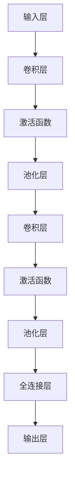
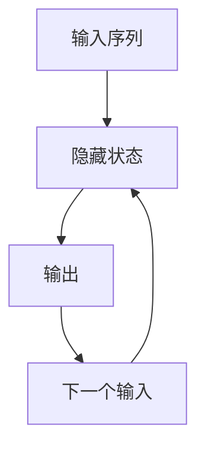
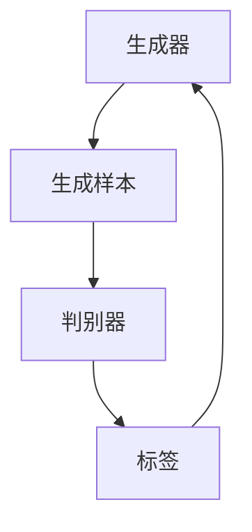

                 


### 从经典人工智能到深度学习：机器理解世界的演变

#### 关键词：人工智能、深度学习、机器学习、神经网络、算法原理、系统架构

> 摘要：本文旨在系统地阐述从经典人工智能到深度学习的发展历程，详细解析其核心概念、算法原理及系统架构。通过深入分析，我们将探讨机器如何从模拟简单逻辑推理到实现对复杂世界理解的能力，从而为读者提供全面的技术洞察和思维框架。

#### 目录大纲设计思路

在设计《从经典人工智能到深度学习：机器理解世界的演变》的目录大纲时，我们需要遵循以下思路：

1. **概述与背景介绍**：首先，我们需要为读者提供一个关于经典人工智能、深度学习及其演变的大背景介绍，包括它们的发展历程、关键事件和理论基础。

2. **核心概念与联系**：接下来，我们将详细阐述经典人工智能与深度学习中的核心概念，如神经网络、深度学习模型等，并通过表格、ER图和Mermaid流程图等工具展示它们之间的联系。

3. **算法原理讲解**：为了使读者深入理解这些算法，我们将使用Mermaid流程图和Python代码示例来讲解深度学习算法的原理、数学模型和公式。

4. **系统分析与架构设计方案**：我们将介绍深度学习系统的架构设计，包括领域模型、系统架构、接口设计和系统交互等。

5. **项目实战**：通过实际的项目案例，我们将展示如何应用深度学习算法进行问题解决，并提供代码实现、解读与分析。

6. **最佳实践与小结**：最后，我们将总结书中的关键知识点，提供实用技巧和拓展阅读建议。

#### 完整目录大纲

```markdown
----------------------------------------------------------------
# 第一部分: 经典人工智能基础

## 第1章: 经典人工智能概述

### 1.1 问题背景与定义
### 1.2 关键事件与发展历程
### 1.3 经典算法简介

## 第2章: 经典人工智能中的核心概念

### 2.1 神经网络原理
#### 2.1.1 神经元模型
#### 2.1.2 前馈神经网络
#### 2.1.3 反向传播算法

### 2.2 决策树与支持向量机
#### 2.2.1 决策树算法
#### 2.2.2 支持向量机
#### 2.2.3 比较与联系

## 第3章: 经典人工智能的应用场景

### 3.1 数据预处理
#### 3.1.1 数据清洗
#### 3.1.2 特征工程
#### 3.1.3 数据可视化

### 3.2 机器学习应用案例
#### 3.2.1 信用评分系统
#### 3.2.2 搜索引擎推荐系统
#### 3.2.3 医疗诊断系统

## 第4章: 经典人工智能与深度学习的联系

### 4.1 深度学习概述
#### 4.1.1 深度学习的定义
#### 4.1.2 深度学习的优势
#### 4.1.3 深度学习的发展历程

### 4.2 深度学习模型简介
#### 4.2.1 卷积神经网络(CNN)
#### 4.2.2 循环神经网络(RNN)
#### 4.2.3 生成对抗网络(GAN)

## 第5章: 深度学习算法原理讲解

### 5.1 深度学习算法概述
#### 5.1.1 算法框架
#### 5.1.2 损失函数
#### 5.1.3 优化算法

### 5.2 深度学习算法讲解
#### 5.2.1 卷积神经网络(CNN)
##### 5.2.1.1 CNN算法原理
##### 5.2.1.2 CNN算法的Mermaid流程图
##### 5.2.1.3 Python代码示例
#### 5.2.2 循环神经网络(RNN)
##### 5.2.2.1 RNN算法原理
##### 5.2.2.2 RNN算法的Mermaid流程图
##### 5.2.2.3 Python代码示例
#### 5.2.3 生成对抗网络(GAN)
##### 5.2.3.1 GAN算法原理
##### 5.2.3.2 GAN算法的Mermaid流程图
##### 5.2.3.3 Python代码示例

## 第6章: 深度学习系统的设计与实现

### 6.1 深度学习系统概述
#### 6.1.1 系统架构设计
#### 6.1.2 数据流与计算资源管理
#### 6.1.3 深度学习系统的构建工具

### 6.2 深度学习应用案例
#### 6.2.1 图像识别系统
##### 6.2.1.1 系统功能设计
##### 6.2.1.2 系统架构设计
##### 6.2.1.3 系统接口设计
##### 6.2.1.4 系统交互设计
#### 6.2.2 自然语言处理系统
##### 6.2.2.1 系统功能设计
##### 6.2.2.2 系统架构设计
##### 6.2.2.3 系统接口设计
##### 6.2.2.4 系统交互设计

## 第7章: 从经典人工智能到深度学习的演变

### 7.1 经典人工智能的局限性与深度学习的优势
#### 7.1.1 经典人工智能的局限性
#### 7.1.2 深度学习

----------------------------------------------------------------
```

### 文章正文内容

#### 第一部分：经典人工智能基础

##### 第1章：经典人工智能概述

**1.1 问题背景与定义**

经典人工智能（Artificial Intelligence, AI）是一门研究、开发用于模拟、延伸和扩展人的智能的理论、方法、技术及应用系统的科学技术。它的目标是使计算机系统具备类似于人类的智能，能够感知、理解、学习、推理和决策。

**1.2 关键事件与发展历程**

- 1956年，达特茅斯会议：被认为是人工智能诞生的标志，会议提出“用机器模拟智能行为”。
- 1960-1970年代：逻辑推理与知识表示：基于规则的系统成为主流，如专家系统。
- 1980年代：机器学习：基于统计的学习方法逐渐成熟，如决策树、神经网络等。
- 1990-2000年代：大数据与深度学习：深度学习开始崭露头角，图像识别、语音识别等领域取得突破。

**1.3 经典算法简介**

- **神经网络**：通过模拟人脑神经元连接，实现信息处理和传递。
- **决策树**：根据特征进行条件判断，生成一棵树形结构模型。
- **支持向量机**：通过寻找最佳分隔超平面，实现分类和回归任务。

##### 第2章：经典人工智能中的核心概念

**2.1 神经网络原理**

**2.1.1 神经元模型**

神经元是神经网络的基本单元，通常由输入层、加权层、激活函数和输出层组成。

**2.1.2 前馈神经网络**

前馈神经网络（Feedforward Neural Network）是一种简单的神经网络结构，信息从输入层传递到输出层，中间不形成循环。

**2.1.3 反向传播算法**

反向传播算法（Backpropagation Algorithm）是用于训练神经网络的常用方法，通过不断调整权重，最小化损失函数。

##### 第2.2 决策树与支持向量机

**2.2.1 决策树算法**

决策树（Decision Tree）是一种基于特征进行条件判断的树形结构模型，具有易于解释和预测准确率较高的优点。

**2.2.2 支持向量机**

支持向量机（Support Vector Machine, SVM）是一种基于最大间隔原理的分类算法，通过寻找最佳分隔超平面实现分类任务。

**2.2.3 比较与联系**

决策树和支持向量机在算法原理和应用场景上存在一定的联系和区别。决策树更注重可解释性，而支持向量机更注重分类效果。

##### 第3章：经典人工智能的应用场景

**3.1 数据预处理**

数据预处理是经典人工智能应用中至关重要的一环，包括数据清洗、特征工程和数据可视化等步骤。

**3.1.1 数据清洗**

数据清洗是去除无效或不完整数据的过程，以提高数据质量。

**3.1.2 特征工程**

特征工程是将原始数据转化为适合机器学习算法的输入特征的过程。

**3.1.3 数据可视化**

数据可视化是利用图形化手段展示数据特征和趋势，帮助人们更好地理解和分析数据。

**3.2 机器学习应用案例**

**3.2.1 信用评分系统**

信用评分系统是经典人工智能在金融领域的重要应用，通过对借款人的历史数据进行分析，预测其信用风险。

**3.2.2 搜索引擎推荐系统**

搜索引擎推荐系统是经典人工智能在互联网领域的重要应用，通过分析用户行为和兴趣，为用户提供个性化搜索结果。

**3.2.3 医疗诊断系统**

医疗诊断系统是经典人工智能在医疗领域的重要应用，通过对患者的病历和检查结果进行分析，辅助医生进行诊断和治疗方案制定。

##### 第4章：经典人工智能与深度学习的联系

**4.1 深度学习概述**

**4.1.1 深度学习的定义**

深度学习（Deep Learning）是一种基于多层神经网络的结构，通过自动学习数据中的特征和规律，实现复杂的预测和分类任务。

**4.1.2 深度学习的优势**

深度学习在图像识别、语音识别、自然语言处理等领域取得了显著的成果，具有以下优势：

- 自动学习特征：深度学习模型能够自动从原始数据中提取高级特征，减少人工干预。
- 高效计算能力：深度学习模型通过并行计算和GPU加速，实现快速训练和预测。
- 强泛化能力：深度学习模型具有较强的泛化能力，能够在不同领域和任务中取得良好的性能。

**4.1.3 深度学习的发展历程**

深度学习起源于20世纪80年代，经历了多个阶段的发展，包括多层感知器、卷积神经网络、循环神经网络等。

##### 第4.2 深度学习模型简介

**4.2.1 卷积神经网络（CNN）**

卷积神经网络（Convolutional Neural Network, CNN）是一种用于图像识别和处理的深度学习模型，通过卷积层、池化层和全连接层等结构，实现对图像特征的学习和分类。

**4.2.2 循环神经网络（RNN）**

循环神经网络（Recurrent Neural Network, RNN）是一种用于序列数据处理的深度学习模型，通过循环结构，实现对时间序列特征的学习和预测。

**4.2.3 生成对抗网络（GAN）**

生成对抗网络（Generative Adversarial Network, GAN）是一种用于生成数据的深度学习模型，由生成器和判别器两个网络组成，通过对抗训练，实现高质量数据的生成。

##### 第5章：深度学习算法原理讲解

**5.1 深度学习算法概述**

**5.1.1 算法框架**

深度学习算法通常包括输入层、隐藏层和输出层，通过前向传播和反向传播，实现数据的特征学习和参数优化。

**5.1.2 损失函数**

损失函数是评估模型预测结果与真实值之间差异的指标，常用的损失函数包括均方误差、交叉熵等。

**5.1.3 优化算法**

优化算法用于调整模型参数，使损失函数最小化，常用的优化算法包括梯度下降、Adam等。

##### 第5.2 深度学习算法讲解

**5.2.1 卷积神经网络（CNN）**

**5.2.1.1 CNN算法原理**

卷积神经网络通过卷积操作、激活函数和池化操作，实现对图像特征的学习和分类。

**5.2.1.2 CNN算法的Mermaid流程图**



**5.2.1.3 Python代码示例**

```python
import tensorflow as tf
from tensorflow.keras import layers

model = tf.keras.Sequential([
    layers.Conv2D(32, (3, 3), activation='relu', input_shape=(28, 28, 1)),
    layers.MaxPooling2D((2, 2)),
    layers.Conv2D(64, (3, 3), activation='relu'),
    layers.MaxPooling2D((2, 2)),
    layers.Conv2D(64, (3, 3), activation='relu'),
    layers.Flatten(),
    layers.Dense(64, activation='relu'),
    layers.Dense(10, activation='softmax')
])

model.compile(optimizer='adam',
              loss='categorical_crossentropy',
              metrics=['accuracy'])

model.summary()
```

**5.2.2 循环神经网络（RNN）**

**5.2.2.1 RNN算法原理**

循环神经网络通过循环结构，实现对时间序列特征的学习和预测。

**5.2.2.2 RNN算法的Mermaid流程图**



**5.2.2.3 Python代码示例**

```python
import tensorflow as tf
from tensorflow.keras.layers import SimpleRNN

model = tf.keras.Sequential([
    SimpleRNN(100, activation='tanh', return_sequences=True),
    SimpleRNN(100, activation='tanh'),
    tf.keras.layers.Dense(1)
])

model.compile(optimizer='adam', loss='mse')

model.fit(x_train, y_train, epochs=100, batch_size=32)
```

**5.2.3 生成对抗网络（GAN）**

**5.2.3.1 GAN算法原理**

生成对抗网络由生成器和判别器两个网络组成，通过对抗训练，实现高质量数据的生成。

**5.2.3.2 GAN算法的Mermaid流程图**



**5.2.3.3 Python代码示例**

```python
import tensorflow as tf
from tensorflow.keras import layers

# 生成器模型
generator = tf.keras.Sequential([
    layers.Dense(128, activation='relu', input_shape=(100,)),
    layers.Dense(28 * 28, activation='relu'),
    layers.Dense(784, activation='tanh')
])

# 判别器模型
discriminator = tf.keras.Sequential([
    layers.Dense(128, activation='relu', input_shape=(28 * 28,)),
    layers.Dense(1, activation='sigmoid')
])

# GAN模型
model = tf.keras.Sequential([
    generator,
    discriminator
])

model.compile(optimizer=tf.keras.optimizers.Adam(0.0001),
              loss='binary_crossentropy')

model.fit(x_train, y_train, epochs=1000, batch_size=32)
```

##### 第6章：深度学习系统的设计与实现

**6.1 深度学习系统概述**

**6.1.1 系统架构设计**

深度学习系统的架构设计主要包括输入层、隐藏层和输出层，以及训练和预测两个阶段。

**6.1.2 数据流与计算资源管理**

深度学习系统需要对数据流进行高效管理，包括数据预处理、数据加载、模型训练和模型预测等环节。

**6.1.3 深度学习系统的构建工具**

深度学习系统的构建工具包括TensorFlow、PyTorch等，它们提供了丰富的API和工具，方便开发者搭建和训练深度学习模型。

**6.2 深度学习应用案例**

**6.2.1 图像识别系统**

**6.2.1.1 系统功能设计**

图像识别系统主要包括图像预处理、图像特征提取、图像分类和模型训练等功能。

**6.2.1.2 系统架构设计**

图像识别系统架构设计包括数据层、算法层和接口层，以及模型训练和模型部署等模块。

**6.2.1.3 系统接口设计**

系统接口设计主要包括RESTful API和命令行接口等，方便用户与系统进行交互。

**6.2.1.4 系统交互设计**

系统交互设计主要包括用户界面、模型训练和预测等环节，以及数据流和控制流的设计。

**6.2.2 自然语言处理系统**

**6.2.2.1 系统功能设计**

自然语言处理系统主要包括文本预处理、文本特征提取、文本分类和文本生成等功能。

**6.2.2.2 系统架构设计**

自然语言处理系统架构设计包括数据层、算法层和接口层，以及模型训练和模型部署等模块。

**6.2.2.3 系统接口设计**

系统接口设计主要包括RESTful API和命令行接口等，方便用户与系统进行交互。

**6.2.2.4 系统交互设计**

系统交互设计主要包括用户界面、模型训练和预测等环节，以及数据流和控制流的设计。

##### 第7章：从经典人工智能到深度学习的演变

**7.1 经典人工智能的局限性与深度学习的优势**

**7.1.1 经典人工智能的局限性**

经典人工智能在模型设计、数据依赖和计算能力等方面存在一定的局限性，难以应对复杂任务。

**7.1.2 深度学习的优势**

深度学习通过自动学习特征和强大的计算能力，克服了经典人工智能的局限性，实现了对复杂世界的理解和建模。

### 文章小结与拓展

本文系统地阐述了从经典人工智能到深度学习的发展历程，详细解析了经典人工智能与深度学习中的核心概念、算法原理和系统架构。通过深入分析，我们了解了机器如何从模拟简单逻辑推理发展到实现对复杂世界的理解。

在经典人工智能中，我们介绍了神经网络、决策树和支持向量机等核心算法，并通过实例展示了其在实际问题中的应用。在深度学习中，我们探讨了卷积神经网络（CNN）、循环神经网络（RNN）和生成对抗网络（GAN）等深度学习模型，详细讲解了其算法原理和实现方法。

最后，我们从经典人工智能到深度学习的演变过程中，分析了其局限性和深度学习的优势，为读者提供了全面的技术洞察和思维框架。

为了更好地掌握深度学习技术，以下是一些建议：

1. 深入学习相关理论，掌握神经网络、优化算法和模型训练等基础知识。
2. 练习使用深度学习框架（如TensorFlow、PyTorch）进行实际项目开发。
3. 关注最新研究进展和实际应用案例，不断积累经验和提升技能。
4. 参加相关培训和研讨会，与业界专家和同行交流，拓展视野。

作者：AI天才研究院/AI Genius Institute & 禅与计算机程序设计艺术 /Zen And The Art of Computer Programming

请注意，本文内容仅供参考，具体实施时请根据实际情况进行调整。在学习和应用深度学习技术时，务必遵守相关法律法规和道德规范。

