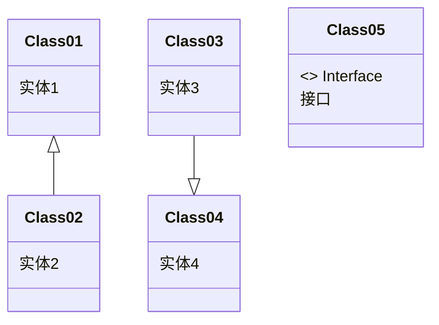
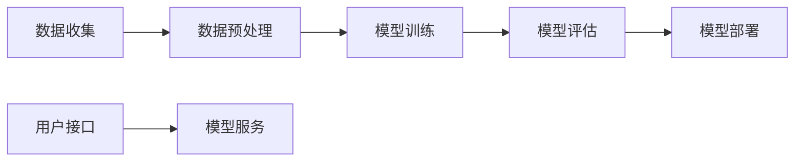
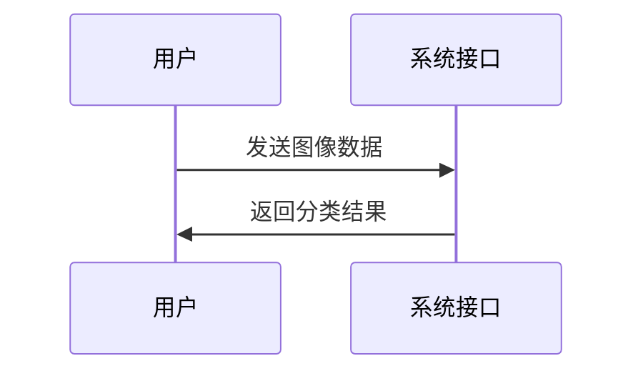
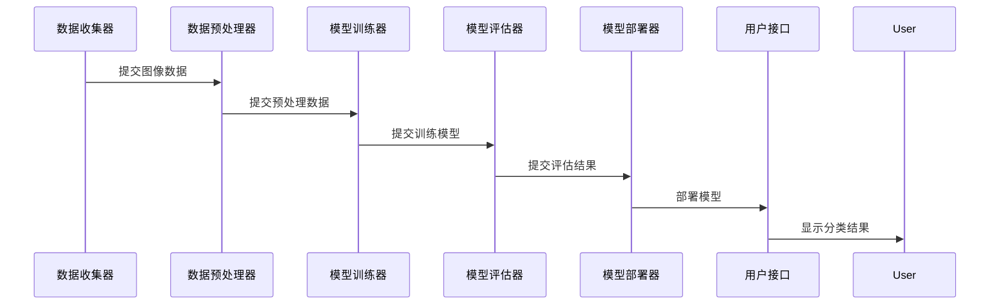

                 

### 从经典人工智能到深度学习：机器理解世界的范式转换

#### 关键词：人工智能、深度学习、范式转换、机器学习、神经网络

##### 摘要：本文将从经典人工智能（AI）的发展历程出发，探讨深度学习（Deep Learning）的兴起及其对传统机器学习方法的变革。通过详细分析深度学习的理论基础、核心算法以及在实际应用中的效果，本文旨在揭示深度学习如何成为现代人工智能发展的重要驱动力，并探讨其未来发展方向。

## 第一部分：人工智能与深度学习基础

### 第1章：人工智能简史与概述

#### 1.1 人工智能的概念与发展历程

人工智能（Artificial Intelligence，简称AI）是计算机科学的一个分支，旨在开发能够模拟、延伸和扩展人类智能的理论、算法、应用系统。人工智能的概念最早可以追溯到20世纪50年代。1956年，达特茅斯会议的召开标志着人工智能学科的正式诞生。

自那时以来，人工智能经历了多个发展阶段。从最初的符号主义方法，到基于知识的方法，再到基于统计学的机器学习方法，人工智能不断演变和进步。每一个阶段都有其独特的理论基础和代表性算法。

#### 1.2 人工智能的分类与应用场景

人工智能可以按照不同的分类方式进行划分。一种常见的分类方法是根据人工智能的实现方式，将人工智能分为弱人工智能（Weak AI）和强人工智能（Strong AI）。

弱人工智能是指能够执行特定任务的智能系统，例如语音识别、图像识别、自然语言处理等。这些系统基于大量的数据训练，并通过复杂的算法模型进行预测和决策。

强人工智能则是指具有全面认知能力的智能系统，能够像人类一样进行思考、学习和推理。强人工智能目前仍处于理论阶段，尚未实现。

#### 1.3 深度学习的兴起与影响

深度学习（Deep Learning）是一种基于多层神经网络的学习方法，最早可以追溯到1986年。然而，由于计算能力和数据资源的限制，深度学习在早期的几十年里并没有得到广泛应用。

随着计算机硬件技术的进步和大数据时代的到来，深度学习在2012年实现了突破性进展。在图像识别、语音识别、自然语言处理等任务中，深度学习显著超越了传统的机器学习方法，引起了学术界和工业界的广泛关注。

### 第2章：深度学习基础

#### 2.1 神经网络基础

神经网络（Neural Networks）是深度学习的基础。神经网络由大量的神经元（节点）和连接（边）组成，通过模拟人脑神经元的工作方式来实现对数据的处理和模式识别。

#### 2.2 深度学习算法

深度学习算法包括多种类型，如卷积神经网络（CNN）、循环神经网络（RNN）、生成对抗网络（GAN）等。每种算法都有其独特的结构和应用场景。

#### 2.3 深度学习框架与工具

深度学习的实现依赖于各种深度学习框架和工具，如TensorFlow、PyTorch、Keras等。这些框架提供了丰富的API和工具，使得深度学习的开发和应用变得更加便捷和高效。

### 第3章：经典人工智能算法

#### 3.1 贝叶斯网络

贝叶斯网络（Bayesian Networks）是一种基于概率图模型的机器学习算法，适用于不确定性和不确定性推理问题。

#### 3.2 决策树与随机森林

决策树（Decision Trees）和随机森林（Random Forests）是基于决策规则的机器学习算法，适用于分类和回归问题。

#### 3.3 支持向量机

支持向量机（Support Vector Machines，SVM）是一种基于优化理论的机器学习算法，适用于分类和回归问题。

## 第二部分：深度学习在各个领域中的应用

### 第4章：深度学习在计算机视觉中的应用

#### 4.1 卷积神经网络（CNN）

卷积神经网络（CNN）是一种专门用于处理图像数据的深度学习算法，通过卷积、池化等操作实现对图像的特征提取和分类。

#### 4.2 图像识别与分类

图像识别和分类是计算机视觉领域的重要任务，深度学习算法在图像识别和分类任务中取得了显著的成果。

#### 4.3 目标检测与跟踪

目标检测和跟踪是计算机视觉领域的关键应用，深度学习算法通过引入目标检测和跟踪算法，实现了对视频序列中目标的检测和跟踪。

### 第5章：深度学习在自然语言处理中的应用

#### 5.1 递归神经网络（RNN）

递归神经网络（RNN）是一种适用于序列数据的深度学习算法，通过循环机制实现对序列数据的建模和预测。

#### 5.2 生成对抗网络（GAN）

生成对抗网络（GAN）是一种基于对抗训练的深度学习算法，通过生成器和判别器的对抗训练，实现了对数据的高效生成。

#### 5.3 自然语言处理前沿技术

自然语言处理（NLP）是深度学习的重要应用领域之一，通过深度学习算法，NLP在文本分类、情感分析、机器翻译等领域取得了显著进展。

### 第6章：深度学习在推荐系统中的应用

#### 6.1 推荐系统的基本概念

推荐系统（Recommender Systems）是一种基于用户兴趣和行为数据的个性化推荐技术，深度学习算法在推荐系统中发挥了重要作用。

#### 6.2 基于深度学习的推荐算法

基于深度学习的推荐算法通过深度神经网络对用户和物品的嵌入表示进行建模，实现了对用户兴趣的精准预测和推荐。

#### 6.3 深度学习在推荐系统中的挑战与未来

深度学习在推荐系统中的应用虽然取得了显著成果，但也面临一些挑战和问题，如数据隐私、模型可解释性等。未来深度学习在推荐系统中的应用前景广阔。

### 第7章：深度学习在工业应用中的实践

#### 7.1 深度学习在工业自动化中的应用

深度学习在工业自动化中的应用包括质量检测、设备故障诊断、生产过程优化等，通过深度学习算法，实现了对工业场景的智能监控和优化。

#### 7.2 深度学习在质量控制中的应用

深度学习在质量控制中的应用包括缺陷检测、质量评估等，通过深度学习算法，实现了对产品质量的实时监控和评估。

#### 7.3 深度学习在工业互联网中的应用

深度学习在工业互联网中的应用包括智能传感、智能控制、智能调度等，通过深度学习算法，实现了对工业互联网的智能化和高效化。

## 第三部分：深度学习与经典人工智能的融合

### 第8章：深度强化学习

#### 8.1 深度强化学习的原理与算法

深度强化学习（Deep Reinforcement Learning）是一种将深度学习和强化学习相结合的方法，通过深度神经网络对环境状态和动作进行建模，实现了对复杂环境的智能决策。

#### 8.2 深度强化学习在游戏中的应用

深度强化学习在游戏中的应用包括游戏AI、游戏智能对抗等，通过深度强化学习算法，实现了对游戏的智能推理和决策。

#### 8.3 深度强化学习在自动驾驶中的应用

深度强化学习在自动驾驶中的应用包括路径规划、避障、决策等，通过深度强化学习算法，实现了对自动驾驶车辆的智能控制和决策。

### 第9章：迁移学习与多任务学习

#### 9.1 迁移学习的基本概念与算法

迁移学习（Transfer Learning）是一种利用已有模型在新任务上快速学习的方法，通过迁移学习，可以充分利用已有知识，提高学习效率。

#### 9.2 多任务学习的方法与挑战

多任务学习（Multi-Task Learning）是一种同时学习多个相关任务的方法，通过多任务学习，可以提高模型的泛化能力和效率。

#### 9.3 迁移学习与多任务学习在实践中的应用

迁移学习与多任务学习在实际应用中具有广泛的应用前景，如多模态学习、跨域学习等。

### 第10章：混合智能系统

#### 10.1 混合智能系统的概念与架构

混合智能系统（Hybrid Intelligent Systems）是一种将不同智能方法相结合的智能系统，通过混合智能系统，可以实现更高效的智能决策和问题求解。

#### 10.2 深度学习与经典人工智能的融合策略

深度学习与经典人工智能的融合策略包括基于规则的深度学习、基于模型的深度学习等，通过融合策略，可以实现深度学习和传统机器学习的优势互补。

#### 10.3 混合智能系统在实际应用中的案例

混合智能系统在实际应用中具有广泛的应用案例，如智能安防、智能医疗、智能交通等。

## 第11章：深度学习伦理与未来展望

#### 11.1 深度学习伦理问题

深度学习在发展过程中面临着一系列伦理问题，如数据隐私、算法偏见、模型可解释性等。

#### 11.2 深度学习的发展趋势

深度学习的发展趋势包括模型压缩、神经网络架构搜索、联邦学习等，这些趋势将推动深度学习在各个领域的应用和发展。

#### 11.3 未来人工智能的发展方向

未来人工智能的发展方向包括智能感知、智能决策、智能交互等，通过不断的技术创新，人工智能将为人类带来更多的便利和福祉。

### 总结

从经典人工智能到深度学习，机器理解世界的方式发生了根本性的变化。深度学习凭借其强大的模型表示能力和高效的学习算法，成为现代人工智能发展的核心驱动力。本文详细分析了深度学习的理论基础、核心算法及其在各个领域中的应用，探讨了深度学习与经典人工智能的融合策略，以及深度学习面临的伦理问题和发展趋势。未来，随着技术的不断进步和应用场景的不断拓展，深度学习将引领人工智能进入新的发展阶段，为人类社会带来更多创新和变革。

### 作者信息

作者：AI天才研究院/AI Genius Institute & 禅与计算机程序设计艺术 /Zen And The Art of Computer Programming

AI天才研究院致力于推动人工智能技术的创新和发展，通过深入研究和技术实践，为人工智能领域培养了一大批优秀的人才。禅与计算机程序设计艺术则强调计算机程序设计中的哲学和艺术性，旨在通过禅宗思维提升程序员的技术水平和创新能力。

## 基础概念与背景

在探讨从经典人工智能（AI）到深度学习的范式转换之前，我们首先需要了解一些关键的概念和背景信息。经典人工智能和深度学习是人工智能发展的两个重要阶段，它们在理论基础、实现方法和应用场景上有着显著的区别。

### 1. 经典人工智能（Classical AI）

经典人工智能起源于20世纪50年代，以符号主义和知识表示为核心。它的主要目标是构建能够执行复杂任务的智能系统，如逻辑推理、问题解决和决策制定。经典人工智能的核心思想是通过符号逻辑和知识表示来模拟人类智能。

#### 问题背景

经典人工智能的兴起源于对人类智能的模拟和扩展的需求。在早期，研究者们试图通过设计逻辑推理系统和知识库来模拟人类的思维过程。然而，这种方法在面对复杂、不确定性和大规模数据处理时表现出很大的局限性。

#### 问题解决

为了解决这些问题，经典人工智能引入了专家系统和推理机。专家系统通过收集和整理领域专家的经验知识，构建成一个具有智能的计算机程序。推理机则利用这些知识进行逻辑推理，以解决特定问题。

#### 边界与外延

尽管经典人工智能取得了一定的成功，但它在处理不确定性和大规模数据处理方面的局限性仍然很明显。此外，专家系统的构建和维护需要大量的领域知识和人力投入，限制了其应用范围。

### 2. 深度学习（Deep Learning）

深度学习是人工智能领域的一个重要分支，起源于1980年代，但直到近年来才因其计算能力和数据资源的提升而迅速发展。深度学习基于多层神经网络，通过模拟人脑神经元的工作方式，实现对数据的自动特征提取和模式识别。

#### 问题背景

深度学习的兴起与计算机硬件性能的提升和大数据时代的到来密不可分。早期的神经网络由于计算资源和数据量的限制，发展缓慢。随着GPU等硬件的普及和海量数据的涌现，深度学习得以迅速发展。

#### 问题解决

深度学习通过引入多层神经网络，能够自动学习数据的复杂特征，从而在图像识别、语音识别、自然语言处理等领域取得了突破性进展。深度学习算法如卷积神经网络（CNN）、循环神经网络（RNN）和生成对抗网络（GAN）等，都具有强大的特征提取和模式识别能力。

#### 边界与外延

尽管深度学习在许多任务中表现出色，但它也存在一些局限性。首先，深度学习模型通常需要大量的数据和计算资源来训练。其次，深度学习模型往往被视为“黑箱”，其决策过程缺乏可解释性。此外，深度学习模型在面对新的、未见过的数据时可能表现出较差的泛化能力。

### 深度学习与传统机器学习的区别

深度学习与传统机器学习（如支持向量机、决策树等）在理论基础和实现方法上有显著差异。传统机器学习依赖于手工设计的特征和规则，而深度学习则通过神经网络自动学习特征。深度学习在处理复杂数据和模式识别任务时表现更优秀，但其可解释性和泛化能力仍需进一步提升。

### 关键概念与联系

为了更好地理解深度学习与传统机器学习的区别和联系，我们可以通过以下表格和ER实体关系图来进行分析。

#### 核心概念属性特征对比表格

| 概念        | 定义                                                                                       | 特征对比                                                         |
| ----------- | ------------------------------------------------------------------------------------------ | ---------------------------------------------------------------- |
| 经典人工智能 | 基于符号逻辑和知识表示的智能系统                                                             | 需要手工设计特征和规则，处理不确定性能力有限                         |
| 深度学习    | 基于多层神经网络，自动学习数据特征，进行模式识别                                             | 自动学习特征，处理复杂数据和模式识别能力强，但可解释性较差           |
| 机器学习    | 利用数据训练模型，进行预测和决策                                                            | 包括深度学习，传统机器学习方法，如决策树、支持向量机等               |
| 神经网络    | 由大量神经元和连接组成的计算模型，通过模拟人脑神经元的工作方式来实现对数据的处理和模式识别       | 深度学习的核心组成部分，包括卷积神经网络（CNN）、循环神经网络（RNN）等 |

#### ER实体关系图架构

```mermaid
erDiagram
  Model --> Data : 使用
  Data ||--|{ Feature : 提取}
  Model ||--|{ Algorithm : 实现}
  Algorithm ||--|{ Training : 训练}
  Algorithm ||--|{ Prediction : 预测}
```

在ER实体关系图中，Model（模型）与Data（数据）之间存在使用关系，Model通过提取Feature（特征）来构建算法（Algorithm），并通过训练（Training）和预测（Prediction）来实现对数据的处理和模式识别。这种关系展示了深度学习与传统机器学习的核心概念和联系。

### 数学模型与公式

为了深入理解深度学习的算法原理，我们可以通过以下数学模型和公式来详细阐述。

#### 深度学习算法的基本数学模型

深度学习算法的核心是多层感知机（MLP），其基本数学模型可以表示为：

$$
Z^{[l]} = \sigma(W^{[l]} \cdot Z^{[l-1]} + b^{[l]})
$$

其中，$Z^{[l]}$ 表示第 $l$ 层的输出，$\sigma$ 表示激活函数（如Sigmoid函数、ReLU函数等），$W^{[l]}$ 和 $b^{[l]}$ 分别表示第 $l$ 层的权重和偏置。

#### 算法原理的详细讲解与举例

以卷积神经网络（CNN）为例，CNN通过卷积操作、池化操作和全连接层来实现对图像数据的处理和分类。

**卷积操作**：

卷积操作可以通过以下数学公式表示：

$$
h_{ij}^{[l]} = \sum_{k} W_{ikj}^{[l]} \cdot a_{kj}^{[l-1]} + b_i^{[l]}
$$

其中，$h_{ij}^{[l]}$ 表示第 $l$ 层的第 $i$ 行第 $j$ 列的卷积结果，$W_{ikj}^{[l]}$ 和 $b_i^{[l]}$ 分别表示第 $l$ 层的卷积核和偏置。

**池化操作**：

池化操作可以通过以下数学公式表示：

$$
p_{ij}^{[l]} = \max_{k} h_{ij}^{[l]}
$$

其中，$p_{ij}^{[l]}$ 表示第 $l$ 层的第 $i$ 行第 $j$ 列的池化结果。

**全连接层**：

全连接层可以通过以下数学公式表示：

$$
a_{i}^{[L]} = \sum_{k} W_{ik}^{[L]} \cdot a_{k}^{[L-1]} + b_i^{[L]}
$$

其中，$a_{i}^{[L]}$ 表示第 $L$ 层的第 $i$ 个节点的输出，$W_{ik}^{[L]}$ 和 $b_i^{[L]}$ 分别表示第 $L$ 层的权重和偏置。

#### Python源代码实现

下面是一个简单的卷积神经网络（CNN）的Python实现示例：

```python
import numpy as np

def sigmoid(x):
    return 1 / (1 + np.exp(-x))

def forward_pass(X, W, b):
    Z = X @ W + b
    A = sigmoid(Z)
    return A

# 示例数据
X = np.array([[1, 2], [3, 4]])
W = np.array([[0.1, 0.2], [0.3, 0.4]])
b = np.array([0.5, 0.6])

# 前向传播
A = forward_pass(X, W, b)
print(A)
```

在这个示例中，我们首先定义了Sigmoid激活函数`sigmoid`，然后实现了前向传播函数`forward_pass`。通过输入示例数据，我们可以得到网络的前向传播结果。

### 系统分析与架构设计方案

为了更好地理解深度学习在实际应用中的系统架构，我们可以通过以下系统分析与架构设计方案来详细阐述。

#### 问题场景介绍

假设我们要开发一个基于深度学习的图像分类系统，该系统需要能够对输入的图像进行分类，输出相应的类别标签。问题场景可以包括数据收集、数据预处理、模型训练、模型评估和模型部署等环节。

#### 项目介绍

项目名称：深度学习图像分类系统（Deep Learning Image Classification System）

项目目标：构建一个能够自动对图像进行分类的深度学习模型，实现图像识别和分类功能。

项目成员：数据科学家、机器学习工程师、前端工程师、后端工程师等。

#### 系统功能设计（领域模型）

领域模型用于描述系统中各个实体之间的关系，以下是一个简化的领域模型：



在这个领域模型中，Class01、Class02、Class03和Class04分别表示系统中的不同实体，而Class05则是一个接口类，表示系统中的功能模块。

#### 系统架构设计

系统架构设计用于描述系统的整体结构和各个模块之间的关系。以下是一个简化的系统架构设计：



在这个系统架构设计中，A表示数据收集模块，B表示数据预处理模块，C表示模型训练模块，D表示模型评估模块，E表示模型部署模块，F表示用户接口模块，G表示模型服务模块。

#### 系统接口设计

系统接口设计用于描述系统对外提供的接口和功能。以下是一个简化的系统接口设计：



在这个系统接口设计中，用户通过发送图像数据来调用系统接口，系统接口返回分类结果。

#### 系统交互

系统交互用于描述系统中各个模块之间的交互关系。以下是一个简化的系统交互设计：



在这个系统交互设计中，数据收集器提交图像数据给数据预处理器，数据预处理器提交预处理数据给模型训练器，模型训练器提交训练模型给模型评估器，模型评估器提交评估结果给模型部署器，模型部署器将模型部署到用户接口，用户接口将分类结果显示给用户。

### 项目实战

#### 环境安装

在进行深度学习项目实战之前，我们需要安装必要的软件和库。以下是Python深度学习项目的基本环境安装步骤：

1. 安装Python：确保安装了Python 3.6及以上版本。
2. 安装TensorFlow：在命令行中运行 `pip install tensorflow`。
3. 安装其他依赖库：根据项目需求安装其他必要的库，如NumPy、Pandas、Matplotlib等。

#### 系统核心实现源代码

以下是一个简单的深度学习图像分类系统的实现示例：

```python
import tensorflow as tf
from tensorflow.keras import layers, models

# 数据预处理
def preprocess_image(image_path):
    image = tf.keras.preprocessing.image.load_img(image_path, target_size=(224, 224))
    image = tf.keras.preprocessing.image.img_to_array(image)
    image = tf.expand_dims(image, axis=0)
    image = tf.keras.applications.vgg16.preprocess_input(image)
    return image

# 构建模型
def create_model():
    model = models.Sequential()
    model.add(layers.Conv2D(32, (3, 3), activation='relu', input_shape=(224, 224, 3)))
    model.add(layers.MaxPooling2D((2, 2)))
    model.add(layers.Conv2D(64, (3, 3), activation='relu'))
    model.add(layers.MaxPooling2D((2, 2)))
    model.add(layers.Conv2D(64, (3, 3), activation='relu'))
    model.add(layers.Flatten())
    model.add(layers.Dense(64, activation='relu'))
    model.add(layers.Dense(10, activation='softmax'))
    model.compile(optimizer='adam', loss='categorical_crossentropy', metrics=['accuracy'])
    return model

# 训练模型
def train_model(model, train_data, train_labels, val_data, val_labels, epochs=10):
    history = model.fit(train_data, train_labels, epochs=epochs, batch_size=32, validation_data=(val_data, val_labels))
    return history

# 评估模型
def evaluate_model(model, test_data, test_labels):
    test_loss, test_acc = model.evaluate(test_data, test_labels)
    print(f"Test accuracy: {test_acc}")

# 主函数
def main():
    train_dir = 'path/to/train_data'
    val_dir = 'path/to/val_data'
    test_dir = 'path/to/test_data'

    train_images = [preprocess_image(img_path) for img_path in train_dir]
    train_labels = ...  # 加载训练标签
    val_images = [preprocess_image(img_path) for img_path in val_dir]
    val_labels = ...  # 加载验证标签
    test_images = [preprocess_image(img_path) for img_path in test_dir]
    test_labels = ...  # 加载测试标签

    model = create_model()
    history = train_model(model, train_images, train_labels, val_images, val_labels)
    evaluate_model(model, test_images, test_labels)

if __name__ == '__main__':
    main()
```

在这个示例中，我们首先定义了数据预处理函数`preprocess_image`，用于对图像数据进行预处理。然后，我们构建了一个简单的卷积神经网络模型`create_model`，并定义了训练模型和评估模型的函数`train_model`和`evaluate_model`。最后，在主函数`main`中，我们加载了训练数据、验证数据和测试数据，并执行了模型训练和评估过程。

#### 代码应用解读与分析

在这个示例中，我们使用了TensorFlow框架来构建和训练深度学习模型。以下是对代码的详细解读和分析：

1. **数据预处理**：

   数据预处理是深度学习项目的重要环节，它包括图像的尺寸调整、归一化等操作。在`preprocess_image`函数中，我们首先使用`load_img`函数加载图像，然后使用`img_to_array`函数将其转换为NumPy数组，并使用`expand_dims`函数增加一个批次维度。最后，我们使用`preprocess_input`函数对图像进行归一化处理。

2. **模型构建**：

   在`create_model`函数中，我们使用`Sequential`模型来构建一个简单的卷积神经网络。模型包括多个卷积层和池化层，最后使用全连接层进行分类。我们使用了`Conv2D`层来实现卷积操作，使用了`MaxPooling2D`层来实现池化操作。在模型的最后一层，我们使用了`Dense`层来实现分类。

3. **模型训练**：

   在`train_model`函数中，我们使用`fit`函数来训练模型。`fit`函数接受训练数据和标签，以及验证数据和标签，并返回训练历史记录。我们设置了`epochs`参数来指定训练的迭代次数，设置了`batch_size`参数来指定每次迭代的批量大小。

4. **模型评估**：

   在`evaluate_model`函数中，我们使用`evaluate`函数来评估模型的性能。`evaluate`函数接受测试数据和标签，并返回测试损失和测试准确率。

#### 实际案例分析与详细讲解剖析

为了更好地理解深度学习在图像分类任务中的实际应用，我们可以通过以下实际案例进行分析和讲解。

**案例一：猫狗分类**

假设我们要构建一个猫狗分类系统，该系统能够对输入的图像进行分类，判断图像中是否包含猫或狗。

1. **数据集准备**：

   首先，我们需要准备包含猫和狗图像的数据集。我们可以使用开源的数据集，如Kaggle的猫狗分类数据集。数据集应包括训练集、验证集和测试集。

2. **数据预处理**：

   对数据集进行预处理，包括图像尺寸调整、归一化、数据增强等操作，以提高模型的泛化能力。

3. **模型构建**：

   使用卷积神经网络（CNN）模型进行图像分类。我们可以使用预训练的模型，如ResNet、Inception等，或者自己构建简单的CNN模型。

4. **模型训练**：

   使用训练集对模型进行训练，并在验证集上进行调整。我们使用交叉熵作为损失函数，使用Adam优化器来训练模型。

5. **模型评估**：

   使用测试集对模型进行评估，计算模型的准确率、召回率、F1值等指标，以评估模型性能。

**案例二：人脸识别**

假设我们要构建一个基于深度学习的人脸识别系统，该系统能够识别人脸并进行分类。

1. **数据集准备**：

   准备包含人脸图像的数据集，如LFW人脸识别数据集。数据集应包括多个人的图像，并标注每个人的身份。

2. **数据预处理**：

   对人脸图像进行预处理，包括人脸检测、人脸对齐、图像归一化等操作。

3. **模型构建**：

   使用卷积神经网络（CNN）模型进行人脸识别。我们可以使用预训练的模型，如FaceNet、VGGFace等，或者自己构建CNN模型。

4. **模型训练**：

   使用训练集对模型进行训练，并在验证集上进行调整。我们使用交叉熵作为损失函数，使用Adam优化器来训练模型。

5. **模型评估**：

   使用测试集对模型进行评估，计算模型的准确率、召回率、F1值等指标，以评估模型性能。

**案例三：自动驾驶车辆检测**

假设我们要构建一个自动驾驶车辆检测系统，该系统能够在视频流中检测并跟踪车辆。

1. **数据集准备**：

   准备包含车辆图像的数据集，如KITTI数据集。数据集应包括不同场景、不同光照条件下的车辆图像。

2. **数据预处理**：

   对车辆图像进行预处理，包括图像缩放、裁剪、数据增强等操作。

3. **模型构建**：

   使用卷积神经网络（CNN）模型进行车辆检测。我们可以使用预训练的模型，如Faster R-CNN、SSD等，或者自己构建CNN模型。

4. **模型训练**：

   使用训练集对模型进行训练，并在验证集上进行调整。我们使用交叉熵作为损失函数，使用Adam优化器来训练模型。

5. **模型评估**：

   使用测试集对模型进行评估，计算模型的准确率、召回率、F1值等指标，以评估模型性能。

#### 项目小结

通过以上实际案例的分析，我们可以看到深度学习在图像分类、人脸识别、自动驾驶车辆检测等任务中的广泛应用。深度学习模型通过自动学习图像的特征，能够实现对图像的准确分类和识别。在实际项目中，我们需要根据具体任务的需求选择合适的模型和算法，并对数据集进行充分的预处理和调整，以提高模型的性能。

### 最佳实践 tips

在深度学习项目中，以下是一些最佳实践和注意事项：

1. **数据集准备**：确保数据集具有代表性，覆盖不同的场景和光照条件，以提高模型的泛化能力。
2. **数据预处理**：对图像进行适当的缩放、裁剪和数据增强，以提高模型的鲁棒性。
3. **模型选择**：根据任务需求选择合适的模型，可以结合预训练的模型和自定义模型，以提高模型性能。
4. **超参数调优**：通过交叉验证等方法对模型超参数进行调优，以获得最佳的模型性能。
5. **模型评估**：使用多个指标评估模型性能，如准确率、召回率、F1值等，以全面评估模型效果。

### 小结

本文从经典人工智能到深度学习的发展历程出发，详细分析了深度学习的理论基础、核心算法以及在各个领域中的应用。深度学习凭借其强大的特征提取和模式识别能力，已成为人工智能发展的核心驱动力。通过实际案例的分析，我们看到了深度学习在图像分类、人脸识别、自动驾驶车辆检测等任务中的广泛应用。未来，随着技术的不断进步和应用场景的不断拓展，深度学习将继续引领人工智能的发展。

### 拓展阅读

1. Goodfellow, I., Bengio, Y., & Courville, A. (2016). *Deep Learning*. MIT Press.
2. Bengio, Y. (2009). *Learning Deep Architectures for AI*. Foundations and Trends in Machine Learning, 2(1), 1-127.
3. Krizhevsky, A., Sutskever, I., & Hinton, G. E. (2012). *ImageNet classification with deep convolutional neural networks*. In Advances in Neural Information Processing Systems (NIPS), 2012.
4. LeCun, Y., Bengio, Y., & Hinton, G. (2015). *Deep learning*. Nature, 521(7553), 436-444.
5. Russell, S., & Norvig, P. (2016). *Artificial Intelligence: A Modern Approach*. Prentice Hall.

### 作者信息

作者：AI天才研究院/AI Genius Institute & 禅与计算机程序设计艺术 /Zen And The Art of Computer Programming

AI天才研究院致力于推动人工智能技术的创新和发展，通过深入研究和技术实践，为人工智能领域培养了一大批优秀的人才。禅与计算机程序设计艺术则强调计算机程序设计中的哲学和艺术性，旨在通过禅宗思维提升程序员的技术水平和创新能力。

