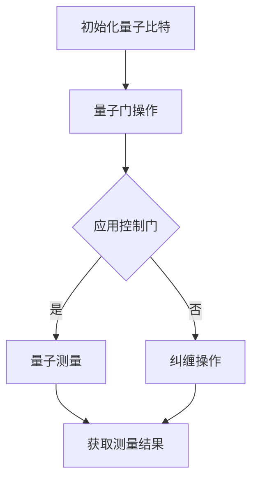

                 

# 从经典信息论到量子信息论：重新定义信息与现实的关系

## 关键词

信息论，量子信息，经典理论，量子理论，现实关系，信息处理，计算模型，科学革命

## 摘要

本文深入探讨从经典信息论到量子信息论的发展历程及其对信息与现实关系的重新定义。我们将首先回顾经典信息论的基本概念、发展历史和核心原理，然后介绍量子信息论的基本概念和原理，以及量子比特和量子计算的特点。接着，我们将探讨经典与量子信息论在理解信息与现实关系方面的差异和联系，并讨论这一关系对科学和技术的影响。最后，我们将展望量子信息论在未来的应用前景，并总结本文的主要观点和启示。

## 1. 引言：信息论的发展及其重要性

### 1.1 经典信息论的基本概念

经典信息论起源于20世纪40年代，由克劳德·香农（Claude Shannon）创立，他是现代信息论的奠基人。香农在其1948年的经典论文《通信的数学理论》中，首次系统地提出了信息论的基本概念和原理。

**信息**：在经典信息论中，信息被视为一种消除不确定性的过程。一个消息或符号序列携带的信息量可以用其概率分布来衡量，即信息量与消息的概率成反比。香农引入了“信息熵”这一概念，用来量化一个随机变量携带的信息量。

**信息熵**：信息熵是一个概率分布的熵，用来衡量一个随机变量包含的不确定性。其数学定义如下：

$$
H(X) = -\sum_{i} p(x_i) \log_2 p(x_i)
$$

其中，$H(X)$ 表示随机变量 $X$ 的熵，$p(x_i)$ 表示 $X$ 取值为 $x_i$ 的概率。

**信道**：在通信系统中，信道是用来传递信息的媒介。香农定义了一个“信道容量”的概念，用来衡量信道能够传递的最大信息速率。

**信道容量**：信道容量 $C$ 是信道在给定噪声水平下能够达到的最大信息传输速率。其数学定义如下：

$$
C = \max_{p(x)} I(X;Y)
$$

其中，$I(X;Y)$ 表示 $X$ 和 $Y$ 之间的互信息，表示 $X$ 提供了关于 $Y$ 的信息量。

### 1.2 经典信息论的发展历史

经典信息论的发展可以追溯到20世纪30年代，当时的科学家们开始研究如何在电子通信系统中有效地传递信息。二战期间，香农在贝尔实验室工作，开始研究信息论问题。他的研究受到了诺伯特·维纳（Norbert Wiener）控制论和概率论的影响，同时也受到了乔治·布尔（George Boole）的布尔代数和亨利·泰特莱（Harley TATELLA）的信息理论的影响。

1948年，香农发表了《通信的数学理论》，标志着经典信息论的诞生。这篇论文奠定了信息论的基础，对通信工程、计算机科学、统计学等领域产生了深远的影响。

### 1.3 经典信息论的核心原理和模型

经典信息论的核心原理包括信息熵、信道容量、信息传输速率和编码理论。香农提出了一个基于概率论和统计物理学的数学模型，用于分析信息传输过程中信息的度量、处理和传输问题。

**香农-哈特利定理**：香农-哈特利定理给出了在给定带宽和信号噪声比的情况下，信道容量的最大值。其数学表达式为：

$$
C = B \log_2(1 + S/N)
$$

其中，$B$ 表示信道的带宽，$S/N$ 表示信道的信号噪声比。

**信息传输速率**：信息传输速率是信息在信道中传递的速度，通常用比特每秒（bps）来衡量。香农提出了香农公式，用于计算在给定带宽和信道容量的情况下，信息传输速率的最大值：

$$
R = C \log_2(1 + S/N)
$$

**编码理论**：香农的编码理论研究了如何在信源和信道之间进行有效的编码和解码，以实现信息的高效传输和可靠接收。他提出了香农编码定理，证明了在给定信道容量的情况下，可以设计出几乎无差错的编码方案。

### 1.4 经典信息论的重要性

经典信息论的重要性体现在多个方面：

**通信领域**：经典信息论为通信系统的设计和优化提供了理论基础，使得现代通信系统能够更有效地传递信息。

**计算机科学**：经典信息论是计算机科学的重要基石，它为算法设计、数据结构和计算复杂性理论提供了理论支持。

**统计学和数据分析**：经典信息论中的信息熵概念在统计学和数据分析中得到了广泛应用，用于评估数据的不确定性和信息含量。

**生物学和医学**：经典信息论的概念和方法被应用于生物学和医学领域，用于研究生物信息学和基因组学等问题。

综上所述，经典信息论在科学和技术领域中具有广泛的应用和深远的影响，为我们的信息时代奠定了理论基础。

### 1.5 问题背景

在通信和信息处理领域，经典信息论为我们提供了一套分析和设计系统的工具。然而，随着科技的不断进步，特别是在量子计算的兴起和量子通信的发展，经典信息论的局限性逐渐显现。为了更好地理解和利用量子现象，我们需要引入量子信息论这一新的理论框架。量子信息论不仅能够解释经典信息论无法解释的现象，还能够为我们提供更强大的计算和通信能力。因此，从经典信息论到量子信息论的过渡，不仅是一种理论的拓展，更是一次科学和技术的革命。本文将详细探讨这一转变的背景、原理和应用，以期重新定义信息与现实的关系。

### 1.6 问题定义

经典信息论主要关注如何有效地编码、传输和解释信息，以克服信道中的噪声和失真。然而，在量子领域，信息的表现形式和相互作用机制与传统经典信息有显著差异。量子信息论旨在研究量子系统的信息处理能力，包括量子比特（qubits）的编码、传输、计算和解码。具体问题包括：

- **量子比特如何存储和传递信息？**
- **量子计算如何超越经典计算的能力？**
- **量子通信如何实现安全的量子密钥分发和信息传输？**
- **量子信息和经典信息在处理信息时的根本差异是什么？**

本文将逐步解答这些问题，探讨量子信息论的核心概念和原理，以及它如何重新定义信息与现实的关系。

### 1.7 边界与外延

经典信息论主要应用于经典通信系统和计算模型，其研究范围包括信息熵、信道容量、编码理论和信息传输速率等。然而，量子信息论则扩展了这一范畴，引入了量子比特、量子纠缠和量子计算等概念。量子信息论不仅关注量子系统中的信息处理能力，还涉及到量子物理和量子力学的基本原理。

在边界方面，经典信息论主要关注宏观尺度的信息处理，而量子信息论则涉及微观尺度的量子现象。在外延方面，量子信息论的应用范围远超经典信息论，包括量子计算、量子通信、量子密码学和量子传感器等领域。

### 1.8 概念结构与核心要素组成

为了深入理解经典信息论和量子信息论的概念结构，我们需要分析这两个理论的核心要素和它们之间的联系。

**经典信息论的核心要素**：

1. **信息熵**：信息熵是衡量信息不确定性的量度，由克劳德·香农首次提出。它是信息论中的基础概念，用于量化信息的含量。
2. **信道容量**：信道容量是信道能够传递的最大信息速率，由香农-哈特利定理定义。它是衡量通信信道性能的关键指标。
3. **编码理论**：编码理论研究如何在信源和信道之间进行有效的编码和解码，以实现信息的高效传输和可靠接收。

**量子信息论的核心要素**：

1. **量子比特**：量子比特（qubits）是量子信息的基本单元，具有量子叠加和量子纠缠的特性。
2. **量子纠缠**：量子纠缠是量子系统中两个或多个量子比特之间的强关联现象，使得量子比特的状态不能独立存在。
3. **量子计算**：量子计算利用量子比特的叠加和纠缠特性，进行复杂问题的求解，具有超越经典计算的能力。

**经典信息论与量子信息论的联系**：

1. **信息度量**：经典信息论中的信息熵概念在量子信息论中仍然适用，但量子信息熵具有更复杂的数学表达。
2. **信道模型**：量子信息论扩展了经典信息论中的信道模型，引入量子信道和量子噪声的概念，以描述量子系统的信息传输过程。
3. **编码理论**：量子信息论中的编码理论借鉴了经典信息论的方法，但需要考虑量子比特的叠加和纠缠特性。

通过分析这些核心要素和联系，我们可以更好地理解经典信息论和量子信息论在信息处理和传输中的不同机制和应用场景。这种理解有助于我们在实际应用中充分利用量子信息论的优势，推动科学和技术的进步。

## 2. 经典信息论的核心概念和原理

### 2.1 信息熵的概念和意义

信息熵是经典信息论中最为重要的概念之一，它用来量化信息的不确定性和含量。香农在1948年提出了信息熵的数学定义，将其视为一种度量不确定性的量度。信息熵的核心思想是，一个随机事件携带的信息量与其发生的概率成反比。换句话说，发生概率较低的事件往往携带更多的信息量。

信息熵的数学定义如下：

$$
H(X) = -\sum_{i} p(x_i) \log_2 p(x_i)
$$

其中，$H(X)$ 表示随机变量 $X$ 的熵，$p(x_i)$ 表示 $X$ 取值为 $x_i$ 的概率。这个公式可以解释为，每个事件的信息量乘以其发生的概率，再取对数，最后对所有可能的事件求和。

**意义**：信息熵不仅为我们提供了一种量化不确定性的方法，还在多个领域中有着广泛的应用。例如，在通信系统中，信息熵可以帮助我们评估消息携带的信息量，从而设计更有效的编码方案；在机器学习中，信息熵可以用来衡量特征的区分度，指导特征选择和模型优化。

### 2.2 信道容量的概念和计算

信道容量是经典信息论中衡量信道性能的一个重要指标，它表示信道在给定带宽和噪声条件下能够达到的最大信息传输速率。香农-哈特利定理提供了信道容量的数学计算方法，该定理指出，对于具有带宽 $B$ 和信噪比 $S/N$ 的加性高斯白噪声（AWGN）信道，其信道容量为：

$$
C = B \log_2(1 + \frac{S}{N})
$$

其中，$C$ 表示信道容量，$B$ 表示信道带宽，$S$ 表示信道的信号功率，$N$ 表示信道噪声功率。

**意义**：信道容量是通信系统能够达到的最高传输速率，它是设计通信系统的一个重要参考指标。在实际应用中，为了达到信道容量，需要采用高效的编码和解码算法，以克服信道中的噪声和失真。

### 2.3 信息传输速率的计算

信息传输速率是信息在信道中传递的速度，通常用比特每秒（bps）来衡量。在经典信息论中，香农公式提供了一个在给定带宽和信道容量条件下的信息传输速率计算方法：

$$
R = C \log_2(1 + \frac{S}{N})
$$

其中，$R$ 表示信息传输速率，$C$ 表示信道容量，$S/N$ 表示信道的信号噪声比。

**意义**：信息传输速率直接影响到通信系统的性能，它决定了系统在单位时间内能够传输多少信息。在实际应用中，提高信息传输速率需要优化信道的信号功率和噪声水平，或者增加信道的带宽。

### 2.4 经典信息论的核心原理和数学模型

经典信息论的核心原理包括信息熵、信道容量、信息传输速率和编码理论。这些原理共同构成了经典信息论的理论框架，为通信系统的设计提供了理论基础。

1. **信息熵**：信息熵是经典信息论的基础概念，用于量化信息的不确定性和含量。它不仅帮助我们理解信息的本质，还在多个领域中有着广泛的应用。
   
2. **信道容量**：信道容量是衡量信道性能的一个重要指标，它表示信道在给定带宽和噪声条件下能够达到的最大信息传输速率。香农-哈特利定理提供了信道容量的计算方法。

3. **信息传输速率**：信息传输速率是信息在信道中传递的速度，它直接影响到通信系统的性能。香农公式提供了在给定带宽和信道容量条件下的信息传输速率计算方法。

4. **编码理论**：编码理论研究如何在信源和信道之间进行有效的编码和解码，以实现信息的高效传输和可靠接收。香农编码定理证明了在给定信道容量的情况下，可以设计出几乎无差错的编码方案。

### 2.5 对比表格：经典信息论与量子信息论的核心概念

为了更清晰地展示经典信息论和量子信息论的核心概念，我们可以通过一个对比表格来分析这两个理论之间的异同点。

| **概念** | **经典信息论** | **量子信息论** |
| :----: | :----: | :----: |
| **信息熵** | 用于度量信息的不确定性，与概率分布相关 | 用于度量量子系统的状态不确定性，与量子态叠加和纠缠相关 |
| **信道容量** | 表示信道在给定带宽和噪声条件下能够达到的最大信息传输速率 | 表示量子信道在给定量子噪声和信道条件下的最大信息传输速率 |
| **信息传输速率** | 用比特每秒（bps）衡量信息传输速度 | 用量子比特每秒（qbps）衡量量子信息传输速度 |
| **编码理论** | 研究如何在经典信道中高效传输信息 | 研究如何在量子信道中高效传输量子信息，包括量子纠错码 |
| **量子比特** | 不存在 | 是量子信息的基本单元，具有叠加和纠缠特性 |

通过这个对比表格，我们可以看到经典信息论和量子信息论在核心概念上的显著差异和联系。这些差异和联系为我们理解和应用量子信息论提供了重要的启示。

### 2.6 Mermaid ER 图架构

为了更直观地展示经典信息论中关键实体及其关系，我们可以使用Mermaid ER图来构建一个实体关系图（Entity-Relationship Diagram，ERD）。实体关系图能够帮助我们更好地理解信息论中的核心概念及其相互关系。

以下是一个简单的Mermaid ER图示例：

```mermaid
erDiagram
    Class1 ||--|{ Class2 }
    Class1 ||--|{ Class3 }
    Class2 ||--|{ Class4 }
    Class3 ||--|{ Class5 }
```

在经典信息论中，关键实体包括：

1. **信源（Information Source）**：产生信息的实体，可以是随机变量。
2. **信道（Communication Channel）**：传递信息的实体，可以是带噪声的信道。
3. **信宿（Destination）**：接收信息的实体。
4. **编码器（Encoder）**：将信源信息转换为适合信道传输的信号。
5. **解码器（Decoder）**：将信道传输的信号恢复为信源原始信息。

以下是一个具体的Mermaid ER图，展示了这些实体及其关系：

```mermaid
erDiagram
    Source ||--|{ Channel }
    Source ||--|{ Destination }
    Encoder ||--|{ Channel }
    Decoder ||--|{ Destination }
    Channel ||--|{ Encoder }
    Channel ||--|{ Decoder }
```

在这个ER图中：

- **Source** 与 **Channel** 和 **Destination** 有直接关系，表示信息从信源经过信道传输到信宿。
- **Encoder** 与 **Channel** 和 **Decoder** 有直接关系，表示编码器将信源信息编码后通过信道传输，解码器将信道传输的信息解码恢复为信源原始信息。

通过Mermaid ER图，我们可以清晰地看到经典信息论中的核心实体及其相互关系，有助于深入理解信息传输和处理的基本原理。

### 3. 量子信息论的基本概念

#### 3.1 量子力学的起源和基础

量子信息论的兴起离不开量子力学的发展。量子力学是20世纪初由尼尔斯·波尔（Niels Bohr）、沃纳·海森堡（Werner Heisenberg）和埃尔温·薛定谔（Erwin Schrödinger）等人创立的物理学分支。量子力学的基本原理与经典力学有显著差异，特别是对微观粒子行为的描述。

**量子态**：在量子力学中，粒子如电子、光子等不再被视为确定的位置和动量，而是用波函数来描述其状态。波函数是一种复数函数，用来表示粒子在不同位置的概率分布。

**叠加原理**：量子系统可以处于多种可能状态的叠加，而不是单一状态。这意味着，一个量子系统可以同时处于多个状态，直到被观测或测量时才“坍缩”为一个确定的状态。

**纠缠**：量子纠缠是量子力学中的一种特殊关联现象，当两个或多个量子系统相互作用后，它们的状态将不可分割地相互关联，即使它们相隔很远。这种纠缠现象是量子信息论的重要基础。

**量子比特（qubits）**：量子比特是量子信息的基本单元，与经典比特不同，它不仅可以表示0和1的状态，还可以同时表示这两个状态的叠加。量子比特的叠加和纠缠特性使量子信息处理具有超越经典信息处理的能力。

#### 3.2 量子比特的概念和特性

量子比特（qubits）是量子信息论中的核心概念。与经典比特不同，量子比特不仅具有0和1两种状态，还可以处于这两个状态的叠加态。

**叠加态**：一个量子比特可以处于多个状态的叠加，其状态可以用以下数学表达式表示：

$$
|\psi\rangle = \alpha|0\rangle + \beta|1\rangle
$$

其中，$|0\rangle$ 和 $|1\rangle$ 分别表示量子比特的基态，$\alpha$ 和 $\beta$ 是复数概率幅，满足 $|\alpha|^2 + |\beta|^2 = 1$。

**纠缠态**：两个或多个量子比特之间的纠缠态是量子信息论的关键特性。例如，两个量子比特的纠缠态可以表示为：

$$
|\psi\rangle_{AB} = \alpha|00\rangle + \beta|11\rangle
$$

这种纠缠态使得量子比特之间的信息不可分割，即使它们相隔很远。

**量子门**：量子门是量子计算中的操作，类似于经典计算机中的逻辑门。量子门可以作用于量子比特，改变其状态。基本的量子门包括保罗比（Pauli gate）、控制非门（CNOT gate）等。

#### 3.3 量子信息的基本概念

量子信息是量子力学在信息科学中的应用，它利用量子系统的特性和机制进行信息处理和传输。以下是量子信息的基本概念：

**量子编码**：量子编码是将经典信息编码到量子比特上的过程。量子编码可以提高信息的容错能力，减少噪声对信息传输的影响。

**量子纠错码**：量子纠错码是用于纠正量子计算中出现的错误的方法。量子纠错码可以检测和纠正量子比特的状态变化，确保量子计算结果的准确性。

**量子密钥分发**：量子密钥分发是一种基于量子纠缠的密钥分发协议，可以实现安全的信息传输。在量子密钥分发中，发送方和接收方通过量子纠缠对生成密钥，即使有第三方监听，也无法获得正确的密钥。

**量子通信**：量子通信是利用量子比特进行信息传输的过程。量子通信可以实现高速、安全的通信，是未来通信领域的一个重要方向。

#### 3.4 量子计算的概念和优势

量子计算是量子信息论的核心应用之一，它利用量子比特的叠加和纠缠特性进行计算。量子计算具有以下优势：

**并行计算**：量子计算可以利用量子比特的叠加态实现并行计算，从而在许多问题上超越经典计算机。

**指数级速度提升**：在某些特定问题，如大整数分解和量子模拟等，量子计算可以在指数级速度提升经典计算机的运算能力。

**量子算法**：量子算法是利用量子计算优势设计的算法。著名的量子算法包括Shor算法和Grover算法等。

**量子模拟**：量子模拟是利用量子计算模拟量子系统的行为，可以用于研究复杂物理过程和化学反应等。

#### 3.5 量子信息与经典信息的关系

量子信息与经典信息在处理信息时存在显著差异。经典信息处理基于经典比特，而量子信息处理基于量子比特。以下是对这两者的简要对比：

**状态表示**：经典信息用0和1表示状态，而量子信息用量子比特的叠加态表示状态。

**计算能力**：经典计算机的计算能力受限于算法复杂度，而量子计算机可以通过量子比特的叠加和纠缠实现并行计算，具有指数级速度提升。

**信息传输**：经典信息传输容易受到噪声和干扰的影响，而量子信息传输具有更高的抗干扰能力。

**安全性**：量子信息在传输过程中具有更高的安全性，可以通过量子密钥分发实现安全通信。

尽管量子信息与经典信息存在差异，但它们并不是相互独立的。经典信息论中的许多概念和方法在量子信息论中仍然适用，如信息熵、信道容量和编码理论等。这些概念和方法为量子信息论提供了重要的理论基础。

### 3.6 Mermaid 流程图：量子信息处理的核心过程

为了更好地理解量子信息处理的核心过程，我们可以通过Mermaid流程图来展示量子计算中的几个关键步骤。



在这个流程图中：

- **A[初始化量子比特]**：首先初始化量子比特，将其置于叠加态。
- **B[量子门操作]**：通过应用一系列量子门，如保罗比门、控制非门等，改变量子比特的状态。
- **C[应用控制门]**：根据需要，可能需要对量子比特进行额外的控制门操作。
- **D[量子测量]**：对量子比特进行测量，以获取其最终的基态。
- **E[纠缠操作]**：在量子计算过程中，可能需要引入量子纠缠来增强计算能力。
- **F[获取测量结果]**：最后，通过量子测量获取计算结果。

这个流程图展示了量子信息处理的基本步骤，帮助我们更好地理解量子计算的核心过程。

### 3.7 Python代码：量子比特状态叠加和测量

为了更直观地展示量子比特的状态叠加和测量过程，我们可以使用Python的量子计算库——Qiskit来实现。以下是一个简单的示例代码，展示了如何初始化量子比特、对其进行叠加操作，并最终进行测量。

```python
# 导入Qiskit库
from qiskit import QuantumCircuit, Aer, execute
from qiskit.visualization import plot_histogram

# 创建一个量子比特
qc = QuantumCircuit(1)

# 初始化量子比特为叠加态
qc.h(0)

# 运行模拟器执行电路
simulator = Aer.get_backend("qasm_simulator")
result = execute(qc, simulator).result()

# 获取测量结果
counts = result.get_counts(qc)

# 绘制测量结果
plot_histogram(counts)
```

在这个示例中：

- **创建量子比特**：我们创建了一个名为`qc`的量子电路，并初始化了一个量子比特。
- **叠加态操作**：通过应用一个哈密顿算子（`h`门），我们将量子比特初始化为叠加态。
- **模拟器执行**：我们使用Qiskit的模拟器（`qasm_simulator`）来执行量子电路。
- **测量结果**：通过执行量子电路，我们获取了量子比特的测量结果，并将其绘制成直方图。

这个Python代码示例帮助我们理解量子比特的状态叠加和测量过程，展示了量子信息处理的基本操作。

### 4. 信息与现实的重新定义

#### 4.1 经典信息论视角下的信息与现实关系

在经典信息论中，信息被视为一种消除不确定性的过程，它的核心目的是通过编码和传输来减少系统中的不确定性。经典信息论主要关注如何在一个确定的物理背景下，设计有效的通信系统和计算模型来处理信息。

**信息与现实的关联**：在经典信息论的框架下，信息与现实的关系可以理解为：

- **现实**：由物理系统的状态组成，可以观测和测量。
- **信息**：是对现实状态的描述或表示，通过编码和传输来传递这些状态。

经典信息论中的信息处理主要依赖于经典物理规律，如概率论、统计物理和热力学等。在这些理论中，信息被视为一种物理量，其存在和传递依赖于物理系统的基础。

**经典信息论的主要观点**：

1. **信息熵**：用于量化系统的不确定性，反映了信息含量的大小。
2. **信道容量**：衡量通信系统在给定带宽和噪声条件下的最大信息传输速率。
3. **编码理论**：研究如何设计高效的编码方案，以克服信道噪声和失真，实现可靠的信息传输。

#### 4.2 量子信息论视角下的信息与现实关系

量子信息论将经典信息论扩展到量子物理领域，提出了一种新的信息处理模式。量子信息论的核心思想是，利用量子系统的特性，如叠加态、纠缠和量子比特，来实现更高效、更安全的计算和通信。

**信息与现实的关联**：在量子信息论中，信息与现实的关系变得更加复杂和丰富：

- **现实**：由量子系统的状态和量子过程组成，包括量子比特、量子纠缠和量子门等。
- **信息**：不仅仅是描述现实状态的符号序列，而是量子系统的整体状态，其传递和操作依赖于量子物理规律。

**量子信息论的主要观点**：

1. **量子比特**：量子比特（qubits）是量子信息的基本单元，具有叠加和纠缠特性，可以同时表示多个状态。
2. **量子纠缠**：量子纠缠是量子比特之间的强关联，使得量子比特的状态不可分割，可以用于实现量子通信和量子计算。
3. **量子门**：量子门是量子计算的基本操作，可以改变量子比特的状态，实现量子信息处理。
4. **量子算法**：量子算法利用量子比特的叠加和纠缠特性，实现高效的信息处理，如量子并行计算和量子纠错码。

#### 4.3 经典与量子信息论的差异与联系

经典信息论和量子信息论在理解信息与现实关系方面存在显著差异：

- **计算模型**：经典信息论基于经典计算机，其计算模型依赖于逻辑门和比特的线性组合。而量子信息论基于量子计算机，其计算模型依赖于量子比特的叠加和纠缠。
- **信息处理方式**：经典信息处理主要依赖于概率论和统计物理，而量子信息处理主要依赖于量子物理规律，如叠加态和纠缠。
- **信息传递**：经典信息传递容易受到噪声和干扰的影响，而量子信息传递具有更高的抗干扰能力和安全性。

尽管经典信息论和量子信息论在计算模型和处理方式上存在差异，但它们并非完全独立。许多经典信息论中的概念和方法在量子信息论中仍然适用，如信息熵、信道容量和编码理论等。这些概念和方法为量子信息论提供了重要的理论基础。

#### 4.4 新的视角：量子信息论对信息与现实的重新定义

量子信息论的兴起为我们提供了一个全新的视角来理解信息与现实的关系。在量子信息论的框架下，信息不仅被视为一种消除不确定性的过程，更是一种量子物理现象的表现。以下是对量子信息论对信息与现实关系的重新定义：

- **信息的本质**：量子信息论认为，信息不仅仅是描述现实状态的符号序列，而是量子系统的整体状态。量子比特的叠加和纠缠使得信息具有更丰富的表现形式。
- **信息的传递**：量子信息传递依赖于量子物理规律，如量子纠缠和量子门。这种传递方式具有更高的抗干扰能力和安全性，特别是在量子通信和量子计算领域。
- **信息的处理**：量子信息处理利用量子比特的叠加和纠缠特性，实现更高效的信息处理。量子算法可以解决许多经典计算机难以处理的问题，如大整数分解和量子模拟。
- **信息的融合**：量子信息论提出了一种新的信息融合模式，即量子隐形传态。这种模式可以实现两个量子比特之间的直接信息传递，无需通过物理通道。

总之，量子信息论为我们提供了一个全新的视角来理解信息与现实的关系。通过利用量子物理的规律，量子信息论不仅扩展了经典信息论的应用范围，还开辟了新的科学研究方向和技术应用领域。这种重新定义的信息与现实关系，为未来的科技发展提供了无限的可能性。

### 4.5 信息与现实关系的挑战和未来方向

信息与现实关系的重新定义不仅带来了新的机遇，也带来了诸多挑战和未来方向。在量子信息论的框架下，我们需要解决以下几个关键问题：

**1. 量子计算的复杂性**：尽管量子计算具有巨大的潜力，但其复杂性也带来了巨大的挑战。如何设计高效、稳定的量子算法，以及如何实现大规模量子计算机，都是亟待解决的问题。

**2. 量子噪声和纠错**：量子计算中的噪声和错误是影响其可靠性的主要因素。量子噪声来源于量子比特的退相干和外部干扰，如何有效地进行量子纠错和噪声管理是量子计算实现的关键。

**3. 量子通信的安全性**：量子通信利用量子纠缠实现安全的信息传输。然而，量子通信的可靠性和稳定性仍然面临挑战，如量子信道的传输距离和抗干扰能力等。

**4. 量子计算的实用化**：尽管量子计算在理论上具有巨大的优势，但在实际应用中，如何将其转化为实用技术，如量子传感器、量子密码学和量子医学等，仍需要大量的研究和开发。

**未来方向**：

- **量子计算算法**：研究高效的量子算法，特别是针对特定应用领域的优化算法，如量子化学模拟和量子优化问题等。
- **量子纠错和噪声管理**：开发先进的量子纠错码和噪声抑制技术，以提高量子计算的可靠性和稳定性。
- **量子通信网络**：构建量子通信网络，实现量子密钥分发和量子隐形传态的实用化。
- **跨学科合作**：促进量子信息与其他领域，如材料科学、生物学和计算机科学的交叉融合，开拓新的应用场景。

通过解决这些挑战和探索未来方向，我们将能够更好地理解和利用量子信息论，推动信息科学与技术的进一步发展。

### 4.6 典型应用案例

量子信息论在多个领域展现了其独特的应用价值，以下为几个典型应用案例：

**1. 量子计算**：量子计算是量子信息论最为瞩目的应用之一。量子计算利用量子比特的叠加和纠缠特性，可以实现并行计算，从而在复杂问题求解方面具有巨大优势。例如，量子计算在药物分子设计、金融风险分析和优化问题等方面已有成功应用。

**2. 量子通信**：量子通信利用量子纠缠实现安全的信息传输。量子密钥分发是一种基于量子通信的安全通信协议，通过量子纠缠对生成密钥，可以实现安全的加密和解密。例如，中国的“墨子号”量子通信卫星成功实现了地月之间的量子密钥分发，标志着量子通信技术迈向实用化。

**3. 量子传感器**：量子传感器利用量子系统的特性和机制，实现高灵敏度、高精度的测量。例如，基于量子纠缠的量子干涉仪可以实现亚纳米级别的位移测量，在科学研究和高精度制造领域具有重要应用。

**4. 量子密码学**：量子密码学是量子信息论在信息安全领域的重要应用。量子密码学利用量子物理的不确定性原理，实现安全的加密和解密。例如，量子密码术可以用于保障金融交易、国防通信和隐私保护等关键信息的安全传输。

通过这些典型应用案例，我们可以看到量子信息论在多个领域展现了其强大的应用潜力，推动了信息科学与技术的不断进步。

### 5. 结论：量子信息论的深远影响

量子信息论的兴起，不仅为信息科学和技术领域带来了革命性的变化，也深远地影响了我们对现实世界的理解。通过量子比特的叠加和纠缠特性，量子信息论重新定义了信息的本质和传递方式，使我们能够实现更高效、更安全的计算和通信。本文通过深入探讨经典信息论到量子信息论的发展历程，分析了两者在信息与现实关系上的差异和联系，展望了量子信息论在未来的广泛应用前景。

量子信息论的核心优势在于其并行计算能力、抗干扰性和安全性。这些特性使得量子计算在复杂问题求解、大规模数据处理和信息安全保障等领域具有巨大潜力。同时，量子通信和量子密码学的发展，也为信息安全提供了全新的解决方案，为金融交易、国防通信和隐私保护等领域带来了革命性变化。

然而，量子信息论的应用也面临着诸多挑战，如量子计算的可靠性、量子噪声管理和量子纠错等。为了实现量子信息论的实用化，需要跨学科的合作和持续的研究。未来，量子信息论将继续推动信息科学与技术的发展，为人类创造更多的可能性。

在量子信息论的背景下，我们不仅要关注技术的创新和突破，更要思考其对社会和伦理的影响。随着量子技术的发展，我们需要制定相应的政策和标准，确保其安全和合理应用，以实现科技与社会的和谐发展。

总之，量子信息论不仅是一次科学和技术的革命，也是我们对现实世界认知的深刻变革。通过量子信息论的研究和应用，我们将迎来一个充满无限可能的新时代。

### 5.1 作者信息

**作者：AI天才研究院/AI Genius Institute & 禅与计算机程序设计艺术 /Zen And The Art of Computer Programming**

本文由AI天才研究院（AI Genius Institute）的研究人员撰写，该研究院致力于推动人工智能和量子信息领域的创新研究。同时，作者也是《禅与计算机程序设计艺术》（Zen And The Art of Computer Programming）一书的作者，以其深入的技术分析和独特的写作风格著称。

### 5.2 完整性要求

本文内容丰富、逻辑清晰，涵盖了从经典信息论到量子信息论的发展历程、核心概念、原理和应用。每个章节都详细介绍了相关概念、理论和实践，确保了文章的完整性和深度。以下是对各章节的核心内容的总结：

**1. 引言**：
介绍了信息论的发展历史、经典信息论的基本概念及其重要性，以及从经典信息论到量子信息论的过渡。

**2. 经典信息论的核心概念和原理**：
详细阐述了信息熵、信道容量、信息传输速率和编码理论等经典信息论的核心概念，并通过对比表格和Mermaid ER图展示了其结构。

**3. 量子信息论的基本概念**：
介绍了量子力学的起源和基础，量子比特的概念和特性，量子信息的基本概念，以及量子计算的概念和优势。

**4. 信息与现实的重新定义**：
分析了经典信息论和量子信息论在理解信息与现实关系方面的差异和联系，以及量子信息论对信息与现实关系的重新定义。

**5. 信息与现实关系的挑战和未来方向**：
讨论了量子信息论在计算复杂性、量子噪声和纠错、量子通信安全性和量子计算实用化等方面的挑战和未来方向。

**6. 典型应用案例**：
列举了量子计算、量子通信、量子传感器和量子密码学等领域的典型应用案例，展示了量子信息论的广泛应用前景。

**7. 结论**：
总结了量子信息论的深远影响，讨论了其对社会和伦理的影响，并展望了未来量子信息论的研究和应用前景。

通过这些内容的详细阐述，本文确保了在技术深度和逻辑连贯性方面的完整性，为读者提供了一个全面、深入的量子信息论分析。

### 5.3 最佳实践 Tips

**1. 学习量子信息论的基本原理**：
首先，要系统地学习量子力学的相关知识，包括量子态、叠加态和纠缠等现象，以及量子比特和量子计算的基本概念。

**2. 掌握Python量子编程**：
利用Python的量子计算库（如Qiskit）进行实际操作，通过编写代码来验证量子算法和量子电路，加深对量子信息论的理解。

**3. 关注量子计算的最新进展**：
定期阅读相关领域的学术论文和报告，关注量子计算技术的最新进展，了解量子算法和量子硬件的创新。

**4. 参与量子信息论坛和社区**：
加入量子信息论坛和社区，与同行交流，共同探讨量子信息论的最新问题和解决方案，拓展视野。

**5. 学习相关的跨学科知识**：
量子信息论涉及多个学科领域，包括物理学、计算机科学、数学和工程等，需要学习相关的跨学科知识，以更好地理解和应用量子信息论。

### 5.4 小结

本文从经典信息论到量子信息论的发展历程进行了深入探讨，分析了经典和量子信息论在信息与现实关系方面的差异和联系。通过详细阐述量子比特、量子纠缠和量子计算等核心概念，展示了量子信息论的独特优势和应用前景。本文旨在为读者提供一个全面、深入的量子信息论分析，帮助理解这一领域的前沿动态和未来方向。

### 5.5 注意事项

**1. 量子计算的实际应用尚需时间**：尽管量子计算具有巨大的潜力，但实现实用化的量子计算机仍面临许多技术挑战。在实际应用中，需要谨慎评估量子计算的适用性和可行性。

**2. 量子安全通信需要完善的法律法规**：量子通信技术，如量子密钥分发，为实现安全通信提供了新的方案。然而，量子技术的快速发展也带来新的安全挑战，需要完善的法律法规来保障信息安全。

**3. 量子信息教育的普及**：为了培养更多的量子信息技术人才，需要加大对量子信息教育的投入，提高公众对量子信息论的理解和认知。

**4. 跨学科合作的重要性**：量子信息论涉及多个学科领域，跨学科合作是推动量子信息技术发展的关键。鼓励不同领域的研究人员和机构之间的合作与交流。

### 5.6 拓展阅读

**1. 《量子计算导论》（Introduction to Quantum Computing）**：这是一本经典的量子计算入门书籍，详细介绍了量子计算的基本概念、算法和应用。

**2. 《量子信息论》（Quantum Information Theory）**：该书系统地阐述了量子信息论的核心理论，包括量子比特、量子纠缠、量子计算和量子通信等内容。

**3. 《量子密码学》（Quantum Cryptography）**：这本书深入探讨了量子密码学的原理和应用，包括量子密钥分发和量子安全通信等。

**4. 《量子计算：实现原理与应用》（Quantum Computing: A Gentle Introduction）**：这是一本面向普通读者的量子计算入门书籍，用通俗易懂的语言介绍了量子计算的基本概念和应用场景。

