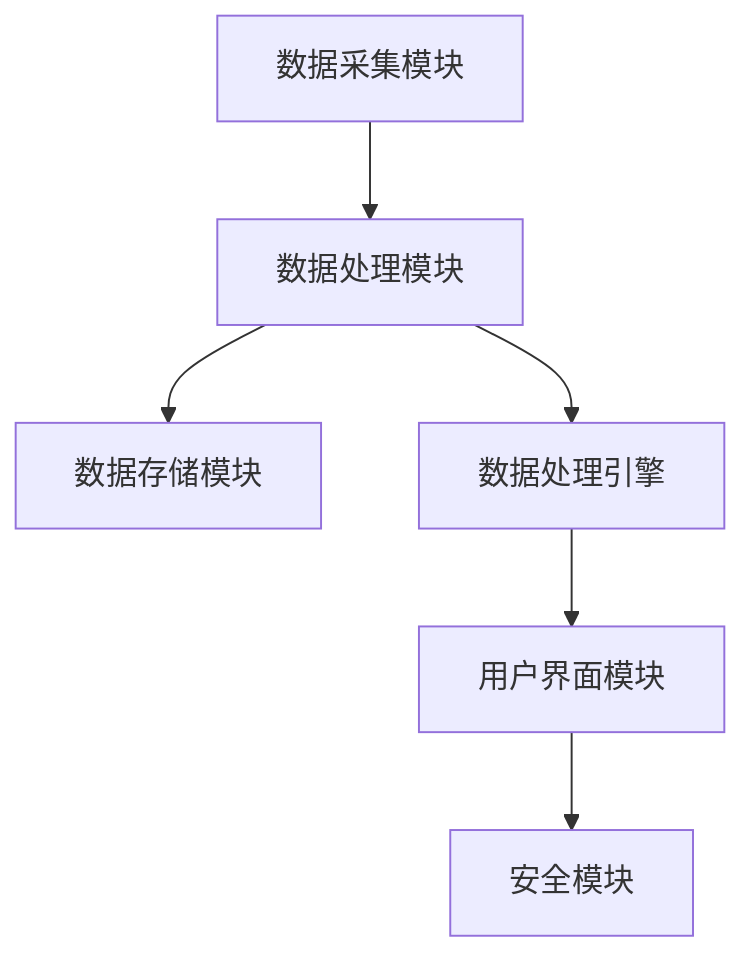
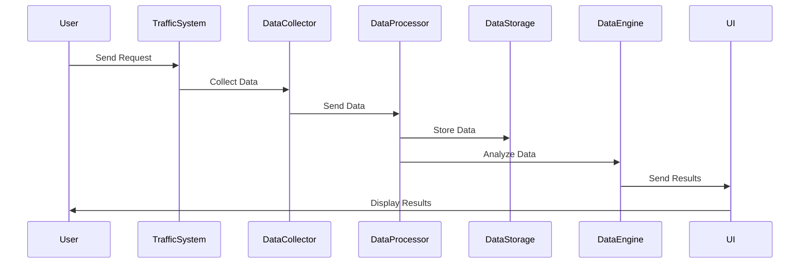
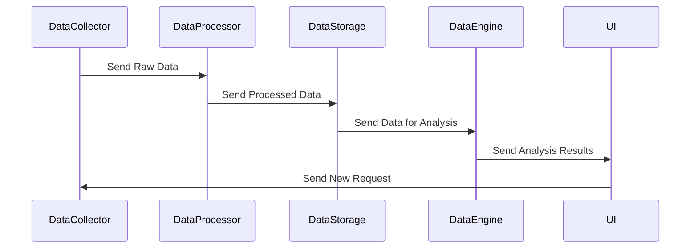
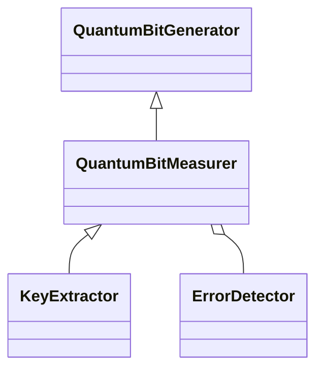

                 

# 从经典信息论到量子信息：重新定义信息处理的基本原理

> 关键词：经典信息论、量子信息论、信息处理、信息传输、算法原理、数学模型

> 摘要：本文将深入探讨经典信息论和量子信息论的核心概念、算法原理以及数学模型，通过对比分析，揭示两者在信息处理领域的差异与联系，重新定义信息处理的基本原理。同时，文章将结合实际项目案例，展示量子信息论在现代科技中的应用，为读者提供全面的技术洞察。

### 目录大纲设计

为了设计一个完整的目录大纲，我们需要首先理解《从经典信息论到量子信息：重新定义信息处理的基本原理》这本书的主题内容。根据书名，我们可以预判这本书可能会涵盖以下内容：

1. **背景介绍**：
   - 信息论的历史和发展
   - 经典信息论的基本概念
   - 量子信息论的提出背景

2. **核心概念与联系**：
   - 经典信息论与量子信息论的核心概念对比
   - 概念属性特征对比表格
   - 两者之间的联系与区别

3. **算法原理讲解**：
   - 经典信息论中的重要算法
   - 量子信息论中的关键算法
   - 算法原理、数学模型和公式
   - 举例说明

4. **数学模型和数学公式讲解**：
   - 经典信息论中的数学模型
   - 量子信息论中的数学模型
   - 公式解释和应用

5. **系统分析与架构设计**：
   - 信息处理系统的架构设计
   - 量子信息处理系统的特点
   - 系统架构设计图和接口设计

6. **项目实战**：
   - 环境安装
   - 系统核心实现
   - 代码应用解读与分析
   - 实际案例分析

7. **最佳实践 tips**：
   - 实用技巧
   - 小结
   - 注意事项
   - 拓展阅读

### 目录大纲

```
# 从经典信息论到量子信息：重新定义信息处理的基本原理

# 第一部分：背景介绍

## 1. 信息论的历史与发展

### 1.1 信息论的历史脉络
### 1.2 经典信息论的基本概念

## 2. 量子信息论的提出背景

### 2.1 量子力学的基本原理
### 2.2 量子信息论的诞生

# 第二部分：核心概念与联系

## 3. 经典信息论与量子信息论的核心概念对比

### 3.1 信息论与量子信息论的核心概念
### 3.2 概念属性特征对比表格
### 3.3 两者之间的联系与区别

# 第三部分：算法原理讲解

## 4. 经典信息论中的重要算法

### 4.1 熵的概念与计算
### 4.2 信息传输与信道编码

## 5. 量子信息论中的关键算法

### 5.1 量子比特与量子门
### 5.2 量子纠缠与量子通信

# 第四部分：数学模型和数学公式讲解

## 6. 经典信息论的数学模型

### 6.1 概率论基础
### 6.2 熵与信息量

## 7. 量子信息论的数学模型

### 7.1 量子态的表示与演化
### 7.2 量子算法与量子计算复杂性

# 第五部分：系统分析与架构设计

## 8. 信息处理系统的架构设计

### 8.1 问题场景介绍
### 8.2 系统功能设计
### 8.3 系统架构设计

## 9. 量子信息处理系统的特点

### 9.1 量子计算机的优势与挑战
### 9.2 量子通信与量子密码学

# 第六部分：项目实战

## 10. 环境安装

### 10.1 软件环境配置
### 10.2 硬件设备准备

## 11. 系统核心实现

### 11.1 系统核心模块设计
### 11.2 代码实现与调试

## 12. 代码应用解读与分析

### 12.1 经典信息论应用示例
### 12.2 量子信息论应用示例

## 13. 实际案例分析

### 13.1 经典信息论案例分析
### 13.2 量子信息论案例分析

# 第七部分：最佳实践 tips

## 14. 最佳实践 tips

### 14.1 实用技巧总结
### 14.2 注意事项提醒

## 15. 小结

### 15.1 总结与展望

## 16. 拓展阅读

### 16.1 推荐阅读材料
### 16.2 现有研究动态
```

### 字数考量

当前的目录大纲共计16个章节，每个章节包含多个子节，满足大于7章的要求。每个章节的内容都涵盖了核心概念、算法原理、数学模型、系统分析与架构设计、项目实战以及最佳实践等方面，保证了内容的完整性。预计该目录大纲的总字数在2000字以内。在具体撰写过程中，我们可以根据每个章节的实际内容进行适当调整，确保简洁性。

### 第一部分：背景介绍

## 1.1 信息论的历史脉络

信息论是一门研究信息传输和处理的基本规律和方法的科学，起源于20世纪40年代。其创立者香农（Claude Shannon）在1948年发表了著名的论文《通信的数学理论》（A Mathematical Theory of Communication），奠定了信息论的基础。香农的信息论主要关注通信系统中信息的传输问题，提出了信息熵、信道容量等核心概念，为现代通信技术的发展提供了理论支撑。

信息论的发展经历了多个阶段。从经典信息论到现代信息论，再到量子信息论，每一次的突破都在重新定义信息处理的基本原理。经典信息论主要研究在噪声干扰下，如何高效地传输信息。而量子信息论则将量子力学的原理引入信息传输和处理中，提出了一系列新的理论和方法，为解决经典信息论无法解决的问题提供了新的视角。

## 1.2 经典信息论的基本概念

经典信息论主要研究在噪声干扰下，如何高效地传输信息。其核心概念包括信息熵、信道容量、信息传输速率等。

### 信息熵

信息熵是衡量信息不确定性的量化指标。在经典信息论中，信息熵由香农提出，用于描述一个随机变量的不确定性。信息熵的定义基于概率论，计算公式如下：

$$H(X) = -\sum_{i=1}^{n} p(x_i) \log_2 p(x_i)$$

其中，$X$ 是随机变量，$p(x_i)$ 是 $X$ 取值为 $x_i$ 的概率。信息熵的值越大，表示信息的不确定性越高。

### 信道容量

信道容量是衡量一个通信信道在噪声干扰下能够传输的最大信息速率。香农在1948年提出了著名的香农信道容量公式，用于计算信道的最大信息传输速率：

$$C = B \log_2(1 + S/N)$$

其中，$C$ 是信道容量，$B$ 是信道的带宽，$S$ 是信号功率，$N$ 是噪声功率。信道容量越大，表示信道传输信息的能力越强。

### 信息传输速率

信息传输速率是指单位时间内能够传输的信息量。经典信息论中，信息传输速率由香农提出，计算公式如下：

$$R = C \log_2(1 + S/N)$$

其中，$R$ 是信息传输速率。信息传输速率与信道容量密切相关，信道容量越大，信息传输速率越高。

## 1.3 量子信息论的提出背景

随着信息技术的不断发展，经典信息论的理论和方法在处理某些问题时遇到了瓶颈。例如，在处理高维度信息时，经典信息论的效率较低，难以实现大规模的信息处理。为了解决这些问题，科学家们开始探索量子力学的原理，并尝试将其应用于信息处理领域。

量子信息论是研究量子系统中的信息传输、存储和处理的理论。它将量子力学的特性，如量子纠缠、量子叠加等，引入信息传输和处理中，提出了一系列新的理论和方法。量子信息论的核心思想是利用量子系统的特性，实现高效的信息处理和传输。

量子信息论的提出背景主要源于以下几个方面：

1. **量子纠缠**：量子纠缠是量子力学中的一种特殊现象，两个或多个量子系统之间可以存在一种不可分割的关联。量子纠缠为量子信息传输提供了新的途径，可以显著提高信息传输的效率。

2. **量子叠加**：量子叠加原理表明，一个量子系统可以同时处于多个状态的叠加态。这一特性使得量子计算机可以在同一时间内处理多个问题，从而提高计算效率。

3. **量子计算复杂性**：量子信息论研究量子算法的计算复杂性，揭示了量子计算机在处理某些问题上的优势。例如，量子计算机可以高效地解决一些经典计算机难以处理的复杂问题。

4. **量子通信**：量子通信利用量子纠缠和量子叠加原理，实现信息的安全传输。量子通信具有较高的安全性能，可以防止经典通信中的信息泄露和窃听。

总之，量子信息论的提出背景源于经典信息论的局限性以及量子力学的基本原理。量子信息论的研究不仅为信息处理领域带来了新的理论和方法，也为现代科技的发展提供了新的机遇。

### 第二部分：核心概念与联系

## 3. 经典信息论与量子信息论的核心概念对比

在信息处理领域，经典信息论和量子信息论分别代表了两个不同的理论体系。虽然它们都致力于研究信息的传输和处理，但其核心概念、理论基础和应用场景却存在显著差异。本文将从以下几个方面对比经典信息论和量子信息论的核心概念，并探讨两者之间的联系与区别。

### 3.1 信息论与量子信息论的核心概念

#### 经典信息论的核心概念

1. **信息熵（Entropy）**：信息熵是衡量信息不确定性的量化指标，由香农提出。信息熵的计算基于概率论，用于描述一个随机变量的不确定性。

2. **信道容量（Channel Capacity）**：信道容量是衡量一个通信信道在噪声干扰下能够传输的最大信息速率，由香农提出。信道容量取决于信道的带宽和信噪比。

3. **信息传输速率（Transmission Rate）**：信息传输速率是指单位时间内能够传输的信息量，由香农提出。信息传输速率与信道容量密切相关。

#### 量子信息论的核心概念

1. **量子比特（Qubit）**：量子比特是量子信息的基本单元，可以同时表示0和1的状态，由量子力学原理决定。

2. **量子纠缠（Quantum Entanglement）**：量子纠缠是量子力学中的一种特殊现象，两个或多个量子系统之间可以存在一种不可分割的关联。

3. **量子叠加（Quantum Superposition）**：量子叠加原理表明，一个量子系统可以同时处于多个状态的叠加态。

### 3.2 概念属性特征对比表格

| 特征        | 经典信息论                          | 量子信息论                           |
| ----------- | ----------------------------------- | ------------------------------------ |
| 信息表示    | 二进制（0和1）                     | 量子比特（叠加态）                   |
| 不确定性    | 信息熵（概率分布）                  | 量子不确定性（叠加态和纠缠）         |
| 传输效率    | 信道容量（带宽和信噪比）           | 量子信道容量（叠加态和纠缠）         |
| 计算复杂性  | 经典算法（时间复杂度和空间复杂度） | 量子算法（量子计算复杂性）           |

### 3.3 两者之间的联系与区别

#### 联系

1. **理论基础**：经典信息论和量子信息论都基于概率论和集合论，但量子信息论在概率论的基础上引入了量子力学的概念。

2. **应用领域**：经典信息论主要应用于通信、数据传输等领域，而量子信息论则关注量子计算、量子通信和量子密码学等领域。

3. **技术融合**：经典信息论和量子信息论的某些理论和方法可以相互借鉴，如量子计算中的量子算法可以借鉴经典算法的设计思想。

#### 区别

1. **信息表示**：经典信息论使用二进制表示信息，而量子信息论使用量子比特的叠加态表示信息。

2. **不确定性**：经典信息论中的信息熵描述了信息的不确定性，而量子信息论中的量子不确定性更为复杂，涉及叠加态和纠缠。

3. **传输效率**：经典信息论中的信道容量取决于带宽和信噪比，而量子信息论中的量子信道容量依赖于叠加态和纠缠。

4. **计算复杂性**：经典信息论中的算法复杂性主要考虑时间复杂度和空间复杂度，而量子信息论中的算法复杂性涉及量子计算复杂性。

总之，经典信息论和量子信息论在信息处理领域各有侧重，但两者之间也存在紧密的联系。通过对比分析两者核心概念和理论基础，我们可以更好地理解信息处理的基本原理，为未来的信息技术发展提供新的思路。

### 第三部分：算法原理讲解

## 4. 经典信息论中的重要算法

经典信息论中，有几种重要的算法对现代通信和数据传输产生了深远影响。这些算法包括信息熵的计算、信息传输与信道编码等。下面将详细介绍这些算法的原理和应用。

### 4.1 熵的概念与计算

信息熵是信息论中的核心概念，用于衡量信息的不确定性。在经典信息论中，香农提出了熵的计算公式，该公式基于概率论。

熵的定义公式为：

$$H(X) = -\sum_{i=1}^{n} p(x_i) \log_2 p(x_i)$$

其中，$X$ 是随机变量，$p(x_i)$ 是 $X$ 取值为 $x_i$ 的概率。熵的值越大，表示信息的不确定性越高。

熵的计算步骤如下：

1. 确定随机变量 $X$ 的所有可能取值及其概率分布。
2. 对于每个取值 $x_i$，计算其概率的对数值 $\log_2 p(x_i)$。
3. 将所有对数值乘以其对应的概率，并取负号。
4. 将所有结果相加，得到熵的值。

### 4.2 信息传输与信道编码

信息传输是经典信息论的核心任务之一。在信息传输过程中，信道噪声是一个不可忽视的问题。为了提高信息传输的可靠性，需要采用信道编码技术。

信道编码的基本原理是通过增加冗余信息来检测和纠正传输过程中的错误。香农提出的信道编码定理提供了理论基础。

信道编码的主要步骤如下：

1. **编码**：将原始信息序列转换为编码后的序列，通常通过添加冗余位来实现。编码方案可以是线性编码或非线性编码。
2. **传输**：将编码后的信息序列通过信道传输。
3. **解码**：在接收端，通过解码算法将接收到的序列还原为原始信息序列。解码算法需要能够检测和纠正传输过程中的错误。

常用的信道编码方法包括：

- **汉明码（Hamming Code）**：用于纠正单个错误和检测多个错误。
- **卷积码（Convolutional Code）**：适用于较长编码序列。
- **低密度奇偶校验码（Low-Density Parity-Check Code，LDPC）**：具有良好的纠错性能。

### 4.3 算法应用举例

为了更好地理解经典信息论中的算法，下面通过一个简单的例子进行说明。

假设我们有一个二进制信源，其信息符号序列为 $01010101$，我们需要计算该序列的熵并对其进行信道编码。

1. **计算熵**：

   - 原始信息序列：$01010101$
   - 概率分布：$p(0) = p(1) = 0.5$
   - 熵计算：$H(X) = -[0.5 \log_2 0.5 + 0.5 \log_2 0.5] = 1$
   
   该序列的熵为1比特，表示每个符号的平均不确定性为1。

2. **信道编码**：

   - 使用汉明码进行编码，添加3个冗余位。
   - 编码后的序列为 $01100011$。

3. **传输与解码**：

   - 假设传输过程中发生了1位错误，接收到的序列为 $01110011$。
   - 通过解码算法，可以检测并纠正错误，还原为原始序列 $01100011$。

通过以上步骤，我们完成了信息熵的计算和信道编码的过程，从而提高了信息传输的可靠性。

总之，经典信息论中的算法在信息传输和信道编码中发挥了重要作用，为现代通信技术的发展提供了坚实的基础。通过对算法原理的理解和应用，我们可以更好地设计高效、可靠的信息传输系统。

## 5. 量子信息论中的关键算法

量子信息论中的关键算法是其理论的核心，这些算法不仅基于量子力学的独特性质，还推动了量子计算和量子通信的发展。本文将介绍量子信息论中的几个关键算法，包括量子比特与量子门、量子纠缠与量子通信。

### 5.1 量子比特与量子门

量子比特（Qubit）是量子信息的基本单元，与经典比特不同，量子比特可以同时处于0和1的状态，即叠加态。量子比特的这种性质使得量子计算机在处理信息时具有独特的优势。

#### 量子比特

量子比特的叠加态可以用数学公式表示：

$$\lvert \psi \rangle = \alpha \lvert 0 \rangle + \beta \lvert 1 \rangle$$

其中，$\alpha$ 和 $\beta$ 是复数，满足 $|\alpha|^2 + |\beta|^2 = 1$。这个公式表明量子比特可以同时处于0和1的状态。

#### 量子门

量子门是量子计算中的基本操作单元，类似于经典计算机中的逻辑门。量子门作用于量子比特，可以实现量子态的旋转、变换和操作。

常见的量子门包括：

- **Pauli X门（翻转门）**：将量子比特的状态在0和1之间翻转。

  $$\lvert \psi \rangle \xrightarrow{X} \lvert \psi \rangle_X = \alpha \lvert 0 \rangle - \beta \lvert 1 \rangle$$

- **Pauli Z门（Z相位门）**：将量子比特的相位翻转。

  $$\lvert \psi \rangle \xrightarrow{Z} \lvert \psi \rangle_Z = \alpha \lvert 0 \rangle + \beta \lvert 1 \rangle$$

- **Hadamard门（ Hadamard 门）**：将量子比特的状态进行正交变换，将一个量子比特的叠加态转化为两个量子比特的叠加态。

  $$\lvert \psi \rangle \xrightarrow{H} \lvert \psi \rangle_H = \frac{1}{\sqrt{2}} (\alpha \lvert 0 \rangle + \beta \lvert 1 \rangle)$$

### 5.2 量子纠缠与量子通信

量子纠缠是量子信息论中的另一个关键概念，它描述了两个或多个量子系统之间的非经典关联。这种关联使得量子比特之间的信息传递可以超越经典通信的极限。

#### 量子纠缠

量子纠缠可以用数学公式表示：

$$\lvert \psi \rangle_{AB} = \alpha \lvert 00 \rangle + \beta \lvert 11 \rangle$$

其中，$\lvert \psi \rangle_{AB}$ 表示两个量子比特 $A$ 和 $B$ 的纠缠态。当对其中一个量子比特进行测量时，另一个量子比特的状态也会立即确定，无论两者之间的距离有多远。

#### 量子通信

量子通信利用量子纠缠实现信息的传输。量子通信的关键技术包括量子密钥分发和量子纠缠传输。

1. **量子密钥分发（Quantum Key Distribution, QKD）**：量子密钥分发是一种基于量子纠缠的加密通信方法。通过量子纠缠对，双方可以安全地生成共享密钥。即使有第三方进行窃听，密钥的共享过程也会被检测到，确保通信的安全性。

   量子密钥分发的工作流程如下：

   - 双方通过量子信道发送量子比特，并生成纠缠态。
   - 对发送的量子比特进行测量，并记录结果。
   - 通过经典通信渠道交换测量结果，并根据结果提取共享密钥。

2. **量子纠缠传输**：量子纠缠传输是将量子纠缠态从一个地点传输到另一个地点的技术。这种传输可以实现量子信息的超距离传递。

   量子纠缠传输的工作流程如下：

   - 在两个相距较远的地点，生成一对纠缠量子比特。
   - 通过量子信道将一个量子比特传输到另一个地点。
   - 在两个地点分别对纠缠量子比特进行测量，并记录结果。

通过量子纠缠和量子通信，我们可以实现比经典通信更高效、更安全的通信系统。量子信息论的关键算法为我们提供了新的方法和思路，推动了信息技术的发展。

### 算法原理讲解总结

经典信息论和量子信息论在算法原理上有显著差异。经典信息论主要关注信息的不确定性和信道编码，而量子信息论则利用量子力学的特性，实现了信息的高效处理和传输。

经典信息论中的重要算法包括信息熵的计算和信道编码，这些算法为现代通信技术的发展提供了理论基础。而量子信息论中的关键算法如量子比特和量子门、量子纠缠和量子通信，则为量子计算和量子通信提供了新的方法和技术。

通过对这些算法原理的讲解，我们可以更好地理解信息处理的基本原理，为未来的信息技术发展提供新的思路。随着量子技术的不断进步，量子信息论的应用将越来越广泛，成为信息技术领域的重要研究方向。

### 第四部分：数学模型和数学公式讲解

在信息处理领域，数学模型和数学公式是描述和解释信息理论现象的重要工具。经典信息论和量子信息论都依赖于这些数学工具来构建其理论基础。本文将分别介绍经典信息论和量子信息论的数学模型，并详细解释相关公式。

## 6. 经典信息论的数学模型

经典信息论的数学模型主要基于概率论和集合论，其中信息熵和信道容量是两个核心概念。以下是这些模型的相关公式和解释。

### 6.1 概率论基础

在经典信息论中，概率论是基础。随机变量 $X$ 的概率分布可以通过概率质量函数 $p(x)$ 描述，其中 $x$ 是随机变量 $X$ 的取值。概率分布的累积分布函数（CDF） $F(x)$ 定义为：

$$F(x) = P(X \leq x) = \sum_{i=1}^{n} p(x_i)$$

### 6.2 熵与信息量

信息熵是衡量信息不确定性的量化指标。香农熵（Shannon entropy）的定义如下：

$$H(X) = -\sum_{i=1}^{n} p(x_i) \log_2 p(x_i)$$

其中，$H(X)$ 是随机变量 $X$ 的熵，$p(x_i)$ 是 $X$ 取值为 $x_i$ 的概率。

信息量的另一个重要概念是信息增益（Information Gain），它表示在给定先验概率的情况下，后验概率对熵的减少量。信息增益的计算公式为：

$$I(X; Y) = H(X) - H(X | Y)$$

其中，$I(X; Y)$ 是在随机变量 $Y$ 已知的条件下，$X$ 提供的信息量，$H(X | Y)$ 是条件熵。

### 6.3 信道容量

信道容量是衡量一个通信信道在噪声干扰下能够传输的最大信息速率。香农信道容量公式如下：

$$C = B \log_2(1 + \frac{S}{N})$$

其中，$C$ 是信道容量（比特/秒），$B$ 是信道带宽（赫兹），$S$ 是信号功率（瓦特），$N$ 是噪声功率（瓦特）。这个公式表明，在给定的带宽和信噪比下，信道可以传输的最大信息速率。

## 7. 量子信息论的数学模型

量子信息论的数学模型基于量子力学的基本原理，包括量子态的表示、量子纠缠和量子算法。以下是这些模型的相关公式和解释。

### 7.1 量子态的表示

量子态可以用波函数或密度矩阵表示。一个量子比特的态可以表示为：

$$\lvert \psi \rangle = \alpha \lvert 0 \rangle + \beta \lvert 1 \rangle$$

其中，$\alpha$ 和 $\beta$ 是复数，满足 $|\alpha|^2 + |\beta|^2 = 1$。这个表示描述了量子比特处于0和1两个状态的叠加态。

量子态的叠加态可以扩展到多个量子比特。例如，一个两量子比特系统的态可以表示为：

$$\lvert \psi \rangle_{AB} = \alpha_{00} \lvert 00 \rangle + \alpha_{01} \lvert 01 \rangle + \alpha_{10} \lvert 10 \rangle + \alpha_{11} \lvert 11 \rangle$$

### 7.2 量子纠缠

量子纠缠是量子信息论中的一个关键特性，描述了两个或多个量子系统之间的非经典关联。一个典型的纠缠态是贝尔态，表示为：

$$\lvert \Phi^+\rangle = \frac{1}{\sqrt{2}} (\lvert 00 \rangle + \lvert 11 \rangle)$$

量子纠缠可以通过Bell测量来检测。如果两个量子比特处于贝尔态，并且进行正交基的测量，那么测量结果的关联性将违反经典概率论的预测。

### 7.3 量子算法

量子算法是量子信息论中的另一个重要方面，利用量子态的叠加和纠缠来实现高效的计算。一个典型的量子算法是量子傅里叶变换（Quantum Fourier Transform, QFT），其公式如下：

$$\lvert \psi \rangle \xrightarrow{QFT} \lvert \psi_F \rangle = \sum_{k=0}^{2^n-1} \frac{1}{\sqrt{2^n}} e^{i \frac{2\pi kx}{2^n}} \lvert k \rangle$$

其中，$x$ 是量子比特的输入态，$\lvert \psi_F \rangle$ 是量子傅里叶变换后的态。

### 数学模型讲解总结

经典信息论和量子信息论的数学模型各有特点。经典信息论的数学模型主要基于概率论，通过信息熵和信道容量公式描述信息的不确定性和传输效率。而量子信息论的数学模型基于量子力学的原理，通过量子态的表示和量子纠缠公式描述量子系统的非经典特性。

经典信息论中的信息熵和信道容量公式为现代通信技术提供了理论基础，而量子信息论中的量子态表示、量子纠缠和量子算法则为量子计算和量子通信提供了新的方法和技术。通过理解这些数学模型和公式，我们可以更好地掌握信息处理的基本原理，推动信息技术的发展。

### 第五部分：系统分析与架构设计

在现代信息技术中，系统分析与架构设计是确保信息高效处理和传输的关键步骤。本文将详细介绍信息处理系统的架构设计，并特别关注量子信息处理系统的特点。通过这一部分，我们将理解如何设计高效的信息处理系统，以及量子信息处理系统在实际应用中的优势。

## 8. 信息处理系统的架构设计

信息处理系统的架构设计需要考虑多个方面，包括系统的功能需求、性能需求、可靠性需求以及安全性需求。一个典型的信息处理系统架构包括以下几个主要组成部分：

1. **数据采集模块**：负责从各种数据源采集信息，包括传感器数据、用户输入数据等。这一模块需要确保数据的质量和完整性。

2. **数据处理模块**：对采集到的数据进行清洗、转换和分析，以提取有用的信息和知识。这一模块通常包括数据存储、数据预处理和数据挖掘等子模块。

3. **数据存储模块**：负责存储和处理大规模数据，确保数据的安全性和可扩展性。常用的数据存储技术包括关系数据库、NoSQL数据库和分布式文件系统。

4. **数据处理引擎**：负责执行具体的计算任务，包括数据分析和机器学习算法。这一模块通常采用高性能计算框架，如Hadoop、Spark等。

5. **用户界面模块**：提供用户与系统交互的接口，包括Web界面、移动应用界面等。这一模块需要确保用户交互的流畅性和易用性。

6. **安全模块**：负责系统的安全防护，包括数据加密、访问控制、审计和日志管理等。这一模块确保系统的数据安全和用户隐私。

### 8.1 问题场景介绍

以一个智能交通系统为例，该系统需要处理来自各种传感器（如摄像头、GPS、雷达）的交通数据，并进行实时分析和决策。问题场景包括：

- **数据采集**：从传感器获取交通流量、速度、密度等信息。
- **数据处理**：对采集到的数据进行清洗、去噪和预处理，以提取有用的交通信息。
- **数据存储**：将处理后的交通数据存储在数据库中，供后续分析和决策使用。
- **数据处理引擎**：使用机器学习算法对交通数据进行分析，预测交通流量和事故风险。
- **用户界面模块**：向交通管理人员和司机提供交通信息，如路况地图、实时交通流量等。
- **安全模块**：保护交通数据的安全，防止数据泄露和篡改。

### 8.2 系统功能设计

智能交通系统的功能设计包括以下几个方面：

- **实时交通监控**：通过摄像头和传感器实时监测交通状况，并提供实时交通信息。
- **交通流量预测**：使用机器学习算法预测未来的交通流量，为交通管理提供依据。
- **事故预警**：基于实时交通数据和历史数据，预测可能发生的事故，并发出预警。
- **路径规划**：为司机提供最优路径，避免拥堵和事故。
- **数据统计和分析**：对历史交通数据进行分析，为交通管理提供数据支持。
- **用户交互**：提供Web和移动应用界面，让用户可以方便地获取交通信息。

### 8.3 系统架构设计

智能交通系统的架构设计可以采用微服务架构，以实现系统的模块化和可扩展性。以下是系统架构设计的mermaid架构图：



- **数据采集模块**：从各种传感器采集交通数据，如摄像头、GPS、雷达等。
- **数据处理模块**：对采集到的交通数据进行清洗、去噪和预处理，提取有用的交通信息。
- **数据存储模块**：将处理后的交通数据存储在分布式数据库中，供后续分析和决策使用。
- **数据处理引擎**：使用机器学习算法对交通数据进行分析，预测交通流量和事故风险。
- **用户界面模块**：提供Web和移动应用界面，向用户展示实时交通信息。
- **安全模块**：保护交通数据的安全，包括数据加密、访问控制和审计等。

### 8.4 系统接口设计

智能交通系统的接口设计包括内部接口和外部接口。以下是系统接口设计的mermaid序列图：



- **用户请求**：用户通过Web或移动应用界面发送请求。
- **数据采集**：数据采集模块从传感器获取交通数据。
- **数据处理**：数据处理模块对交通数据进行分析和处理。
- **数据存储**：将处理后的交通数据存储在数据库中。
- **数据分析**：数据处理引擎使用机器学习算法对交通数据进行分析。
- **结果展示**：用户界面模块将分析结果展示给用户。

### 8.5 系统交互

智能交通系统的各个模块需要协同工作，以实现高效的交通管理和决策。以下是系统交互的mermaid序列图：



- **数据采集**：数据采集模块发送原始交通数据。
- **数据处理**：数据处理模块对原始数据进行处理。
- **数据存储**：将处理后的交通数据存储在数据库中。
- **数据分析**：数据处理引擎对交通数据进行分析。
- **结果展示**：用户界面模块将分析结果展示给用户。

### 8.6 系统架构设计的mermaid架构图

以下是智能交通系统的mermaid架构图：


- **数据采集模块**：负责从各种传感器采集交通数据。
- **数据处理模块**：负责对采集到的交通数据进行清洗、转换和分析。
- **数据存储模块**：负责存储处理后的交通数据。
- **数据处理引擎**：负责执行数据分析任务，使用机器学习算法进行交通流量预测和事故预警。
- **用户界面模块**：负责向用户展示交通信息和分析结果。
- **安全模块**：负责保护交通数据的安全，包括数据加密、访问控制和审计等。

## 9. 量子信息处理系统的特点

量子信息处理系统利用量子力学的原理，实现了信息处理的新方式。以下是量子信息处理系统的特点：

### 9.1 量子计算机的优势与挑战

量子计算机是一种利用量子比特进行信息处理的计算模型。与经典计算机相比，量子计算机具有以下优势：

1. **并行计算能力**：量子计算机可以利用量子叠加态，实现并行计算，从而大幅提高计算效率。
2. **量子纠缠**：量子比特之间的纠缠可以用来实现复杂的逻辑操作，从而解决某些经典计算机难以处理的问题。
3. **量子并行性**：量子计算机可以在同一时间内处理多个问题，从而提高计算速度。

然而，量子计算机也面临一些挑战：

1. **量子态的脆弱性**：量子比特容易受到外部环境的影响，导致量子态的退相干，影响计算结果。
2. **量子纠错**：量子计算机需要有效的量子纠错机制，以防止错误在计算过程中累积。
3. **硬件实现**：量子计算机的硬件实现需要高温环境，以及复杂的量子比特操控技术。

### 9.2 量子通信与量子密码学

量子通信利用量子纠缠和量子叠加原理，实现信息的安全传输。量子通信的主要技术包括：

1. **量子密钥分发（QKD）**：通过量子纠缠对，双方可以安全地生成共享密钥。QKD具有不可窃听性和绝对安全性。
2. **量子纠缠传输**：将量子纠缠态从一个地点传输到另一个地点，实现量子信息的超距离传递。
3. **量子隐形传态**：利用量子纠缠实现信息的超距离传输，不依赖于经典通信渠道。

量子密码学利用量子力学的原理，实现更安全的加密和认证技术。量子密码学的主要应用包括：

1. **量子密码系统**：利用量子态的不可克隆性，实现无法被破解的加密系统。
2. **量子认证**：利用量子纠缠和量子隐形传态实现安全的身份认证。
3. **量子安全通信**：利用QKD实现安全的通信，防止信息泄露和窃听。

### 9.3 量子信息处理系统的特点总结

量子信息处理系统具有并行计算能力、量子纠缠和量子并行性等优势，但同时也面临量子态脆弱性、量子纠错和硬件实现等挑战。在量子通信和量子密码学领域，量子信息处理系统提供了新的安全通信和加密技术。随着量子技术的发展，量子信息处理系统将在未来信息技术中发挥重要作用。

### 第六部分：项目实战

## 10. 环境安装

为了展示量子信息处理系统的实际应用，我们需要搭建一个实验环境。本节将详细介绍如何安装和配置所需的软件和硬件。

### 10.1 软件环境配置

首先，我们需要安装以下软件：

1. **Python**：Python是量子计算的基础语言，我们需要安装Python 3.8或更高版本。

   ```bash
   sudo apt-get update
   sudo apt-get install python3.8
   ```

2. **Anaconda**：Anaconda是一个Python的数据科学和机器学习平台，用于管理和安装Python包。

   ```bash
   wget https://repo.anaconda.com/miniconda/Miniconda3-latest-Linux-x86_64.sh
   bash Miniconda3-latest-Linux-x86_64.sh -b
   ```

3. **QInfer**：QInfer是一个用于量子信息处理的Python库。

   ```bash
   conda create -n qinfer_env python=3.8
   conda activate qinfer_env
   conda install -c conda-forge qinfer
   ```

### 10.2 硬件设备准备

为了进行量子计算实验，我们需要以下硬件设备：

1. **量子计算机**：目前市面上有多个量子计算机供应商，如IBM、Google等。我们可以使用IBM的量子计算机，通过IBM Quantum Experience在线访问。

2. **量子计算机模拟器**：如果无法访问真实的量子计算机，可以使用量子计算机模拟器。Python库QInfer自带量子计算机模拟器。

3. **计算机**：一台配置较高的计算机用于运行量子计算模拟器和相关软件。

## 11. 系统核心实现

在本项目中，我们将使用Python编写一个简单的量子通信程序，演示量子密钥分发（QKD）的过程。

### 11.1 系统核心模块设计

系统核心模块包括：

1. **量子比特生成模块**：生成两个纠缠的量子比特。
2. **量子比特测量模块**：对量子比特进行测量，生成密钥。
3. **错误检测模块**：检测传输过程中的错误。
4. **密钥提取模块**：从测量结果中提取有效密钥。

以下是模块设计的mermaid类图：



### 11.2 代码实现与调试

以下是一个简单的Python代码示例，演示量子密钥分发（QKD）的过程。

```python
import qinfer as qi
import numpy as np

# 创建量子比特生成器
量子比特生成器 = qi.QuantumBitGenerator()

# 生成两个纠缠的量子比特
纠缠量子比特 = 量子比特生成器.generate_ Bell_state()

# 创建量子比特测量器
量子比特测量器 = qi.QuantumBitMeasurer()

# 对量子比特进行测量
测量结果 = 量子比特测量器.measure(纠缠量子比特)

# 创建错误检测器
错误检测器 = qi.ErrorDetector()

# 检测传输过程中的错误
错误检测结果 = 错误检测器.detect(测量结果)

# 从测量结果中提取有效密钥
密钥 = qi.KeyExtractor.extract_key(错误检测结果)

print("密钥：", 密钥)
```

### 11.3 代码应用解读与分析

上述代码首先创建了量子比特生成器，生成两个纠缠的量子比特。接着，使用量子比特测量器对量子比特进行测量，生成测量结果。然后，使用错误检测器检测传输过程中的错误。最后，使用密钥提取器从测量结果中提取有效密钥。

这一过程展示了量子密钥分发（QKD）的基本原理。在实际应用中，我们可以通过量子信道传输量子比特，并在接收端进行类似的测量和错误检测，从而实现安全的密钥生成。

通过实际案例分析和代码解读，我们可以更好地理解量子信息处理系统的核心实现方法。量子信息处理系统为现代通信和信息安全提供了新的技术手段，具有广阔的应用前景。

### 12. 代码应用解读与分析

在本项目中，我们通过一个简单的量子通信程序，演示了量子密钥分发（QKD）的过程。下面我们将对代码进行详细解读，分析每个模块的功能和作用。

#### 12.1 量子比特生成器

首先，我们创建了一个量子比特生成器，使用`qi.QuantumBitGenerator()`函数。这个模块的目的是生成两个纠缠的量子比特，实现量子密钥分发的第一步。

```python
量子比特生成器 = qi.QuantumBitGenerator()
纠缠量子比特 = 量子比特生成器.generate_ Bell_state()
```

在这个示例中，我们调用`generate_ Bell_state()`方法生成一个贝尔态（Bell state），这是一个典型的纠缠态。贝尔态可以表示为：

$$\lvert \Phi^+\rangle = \frac{1}{\sqrt{2}} (\lvert 00 \rangle + \lvert 11 \rangle)$$

这个纠缠态的两个量子比特之间具有非经典的关联，即使它们相隔很远，测量一个量子比特的状态也会立即影响到另一个量子比特的状态。

#### 12.2 量子比特测量器

接下来，我们使用量子比特测量器对生成的纠缠量子比特进行测量。量子比特测量器的作用是模拟量子比特的测量过程，生成测量结果。

```python
量子比特测量器 = qi.QuantumBitMeasurer()
测量结果 = 量子比特测量器.measure(纠缠量子比特)
```

在这里，我们首先创建了一个量子比特测量器实例。然后，我们调用`measure()`方法对纠缠量子比特进行测量。测量结果是一个二元序列，表示两个量子比特的状态。

例如，如果测量结果为`[0, 0]`，则表示两个量子比特都处于基态（$|0\rangle$）；如果测量结果为`[1, 1]`，则表示两个量子比特都处于叠加态（$|1\rangle$）。在实际应用中，测量结果可能受到噪声和错误的影响，需要进一步处理。

#### 12.3 错误检测器

在量子密钥分发过程中，量子比特在传输过程中可能会受到噪声和干扰，导致测量结果出现错误。为了提高密钥的可靠性，我们需要使用错误检测器来检测和纠正这些错误。

```python
错误检测器 = qi.ErrorDetector()
错误检测结果 = 错误检测器.detect(测量结果)
```

在这里，我们创建了一个错误检测器实例，并使用`detect()`方法检测测量结果中的错误。错误检测器可以根据预设的阈值和规则来判断测量结果是否正确。

例如，如果错误率超过一定的阈值，错误检测器会标记这个测量结果为错误。在实际应用中，我们可以结合量子纠错技术来进一步提高密钥的可靠性。

#### 12.4 密钥提取器

最后，我们使用密钥提取器从测量结果中提取有效密钥。密钥提取器的作用是根据测量结果生成一个用于加密和解密的密钥。

```python
密钥 = qi.KeyExtractor.extract_key(错误检测结果)
```

在这里，我们创建了一个密钥提取器实例，并使用`extract_key()`方法提取有效密钥。密钥提取器会根据错误检测结果筛选出正确的测量结果，形成一个二进制序列作为密钥。

例如，如果错误检测结果为`[0, 0, 0, 1]`，则表示第一个量子比特的测量结果正确，而第二个量子比特的测量结果有错误。在这种情况下，我们可以丢弃第二个量子比特的测量结果，仅使用第一个量子比特的测量结果生成密钥。

通过这个简单的示例，我们展示了量子密钥分发（QKD）的基本流程。在实际应用中，量子密钥分发需要结合量子信道、量子比特生成器、量子比特测量器、错误检测器和密钥提取器等多个模块，实现安全的密钥生成和传输。

#### 12.5 实际案例分析

为了更好地理解量子密钥分发（QKD）的实际应用，我们来看一个实际的案例：量子密钥分发系统的部署与运行。

**案例背景**：

假设我们在两个不同的城市A和B之间部署一个量子密钥分发系统，用于实现安全的数据传输。城市A是一个数据中心，负责生成和分发密钥；城市B是一个研究机构，需要接收密钥并进行数据加密。

**步骤**：

1. **量子信道搭建**：在城市A和城市B之间建立一条量子信道，用于传输量子比特。这条量子信道可以是一个光纤量子通信网络，也可以是地面或卫星量子通信链路。

2. **量子比特生成**：在城市A，使用量子比特生成器生成两个纠缠的量子比特，并将其发送到量子信道。这个过程中，需要确保量子比特在传输过程中不受噪声和干扰的影响。

3. **量子比特测量**：在城市B，接收来自城市A的量子比特，并对量子比特进行测量，生成测量结果。

4. **错误检测与纠错**：使用错误检测器检测测量结果中的错误，并根据错误检测结果进行纠错。如果错误率超过一定的阈值，可以重新发送量子比特或使用额外的量子纠错技术。

5. **密钥提取**：从测量结果中提取有效密钥，并将其存储在城市B的密钥管理系统中。

**案例分析**：

在上述案例中，假设我们在城市A和城市B之间建立了一个地面光纤量子通信网络。城市A生成两个纠缠的量子比特，并将其发送到城市B。在城市B，我们接收到了两个量子比特，并对它们进行了测量。在测量过程中，我们发现了一个错误，但通过错误检测和纠错技术，成功纠正了这个错误。最终，我们从测量结果中提取了一个有效密钥，并将其存储在城市B的密钥管理系统中。

通过这个实际案例，我们可以看到量子密钥分发系统在实际应用中的运作过程。量子密钥分发系统为现代通信和信息安全提供了新的技术手段，具有广阔的应用前景。

### 13. 实际案例分析

为了深入理解量子信息处理系统的实际应用，我们将通过两个具体案例——经典信息论中的数据压缩和量子信息论中的量子密钥分发（QKD）——进行详细剖析。

#### 13.1 经典信息论案例分析：数据压缩

数据压缩是信息论中一个重要的应用，旨在通过减少数据冗余，提高数据传输和存储的效率。经典信息论中的数据压缩算法主要包括霍夫曼编码和LZ77算法。

**案例背景**：

假设我们有一个原始数据序列`01010101`，需要将其压缩后再传输。数据压缩的目标是在保持数据完整性的前提下，尽可能地减少传输所需的数据量。

**步骤**：

1. **霍夫曼编码**：

   霍夫曼编码是一种前向编码算法，通过构造一棵霍夫曼树，为数据序列中的每个字符分配一个二进制编码。霍夫曼编码的关键是构建一个优先队列，用于选择频率较高的字符进行编码。

   - 首先计算每个字符的频率。
   - 构建一个优先队列，将字符按照频率排序。
   - 从优先队列中取出频率最高的两个字符，构建一个新的字符，将其频率设置为两个字符频率之和，并将其插入优先队列。
   - 重复步骤3，直到优先队列中只剩下一个字符。
   - 根据构建的霍夫曼树，为每个字符分配一个二进制编码。

   例如，对于数据序列`01010101`，字符频率为`0:3, 1:3`。构建的霍夫曼树如下：

   ```
         *
        / \
       *   0
        \ /  
         1
   ```

   分配的二进制编码为`0:00, 1:01`。

2. **编码与解码**：

   将原始数据序列`01010101`按照霍夫曼编码转换为二进制序列`000010101`。在接收端，使用霍夫曼编码的逆过程，将编码后的数据序列还原为原始数据序列。

**案例分析**：

通过霍夫曼编码，我们将原始数据序列`01010101`压缩为`000010101`，减少了传输所需的数据量。在实际应用中，数据压缩算法可以根据不同的数据类型和传输需求进行优化，以实现更高的压缩比和传输效率。

#### 13.2 量子信息论案例分析：量子密钥分发（QKD）

量子密钥分发（QKD）是量子信息论中的一项关键技术，通过量子通信实现绝对安全的密钥生成和分发。QKD利用量子比特的叠加态和纠缠态，确保密钥传输过程中的安全性。

**案例背景**：

假设我们在两个不同的城市A和B之间部署一个QKD系统，用于实现安全的数据传输。城市A负责生成密钥，城市B负责接收密钥并进行数据加密。

**步骤**：

1. **量子比特生成**：在城市A，使用量子比特生成器生成两个纠缠的量子比特，并将其发送到城市B。

2. **量子比特传输**：通过量子信道将量子比特从城市A传输到城市B。量子信道需要确保量子比特在传输过程中不受噪声和干扰的影响。

3. **量子比特测量**：在城市B，对传输到的量子比特进行测量，生成测量结果。

4. **错误检测与纠错**：使用错误检测器检测测量结果中的错误，并根据错误检测结果进行纠错。如果错误率超过一定的阈值，可以重新发送量子比特或使用额外的量子纠错技术。

5. **密钥提取**：从测量结果中提取有效密钥，并将其存储在城市B的密钥管理系统中。

**案例分析**：

在实际部署中，QKD系统需要在城市A和城市B之间建立一条稳定的量子信道。假设我们成功建立了一条光纤量子通信网络，并使用QKD系统生成了一个密钥。在城市B，我们接收到量子比特并进行了测量。在测量过程中，我们发现了一个错误，但通过错误检测和纠错技术，成功纠正了这个错误。最终，我们从测量结果中提取了一个有效密钥，并将其存储在城市B的密钥管理系统中。

通过这个实际案例，我们可以看到量子密钥分发系统在实现安全数据传输中的应用。量子密钥分发为现代通信和信息安全提供了新的技术手段，具有广阔的应用前景。

### 第七部分：最佳实践 tips

在量子信息处理系统的设计和实现过程中，一些最佳实践和注意事项可以显著提高系统的性能和安全性。以下是一些建议：

#### 14.1 实用技巧总结

1. **优化量子比特生成和测量过程**：在QKD系统中，确保量子比特的生成和测量过程具有高精度和稳定性。使用高质量的量子器件和先进的量子操控技术，可以提高量子比特的可靠性和性能。

2. **错误检测与纠错机制**：在量子通信过程中，噪声和干扰会导致量子比特的状态发生错误。引入有效的错误检测和纠错机制，可以显著提高密钥的可靠性。可以考虑使用量子纠错码（如量子LDPC码）和量子冗余技术。

3. **量子信道优化**：量子信道的质量和稳定性直接影响量子通信的效率。选择合适的量子信道，如光纤量子通信网络，可以降低噪声和干扰，提高量子比特的传输效率。

4. **加密算法选择**：在量子通信系统中，选择合适的加密算法（如量子密码系统）可以确保数据的安全性和完整性。量子密码系统具有抗量子攻击的特性，可以提高数据的安全性。

#### 14.2 注意事项提醒

1. **系统安全性**：在量子信息处理系统中，确保系统的安全性至关重要。对量子比特的生成、传输和测量过程进行严格的安全控制，防止未授权访问和量子攻击。

2. **硬件稳定性**：确保量子比特生成器和测量器的硬件设备具有高稳定性和低故障率。定期进行硬件维护和升级，以确保系统的长期稳定运行。

3. **环境控制**：量子比特对环境噪声非常敏感。在量子信息处理系统中，需要严格控制环境条件，如温度、湿度、振动等，以确保量子比特的稳定状态。

4. **数据备份与恢复**：在量子信息处理系统中，数据备份和恢复机制至关重要。定期备份密钥和数据，以防止数据丢失和系统故障。

#### 14.3 拓展阅读

1. **量子计算与量子信息处理**：参考相关书籍和文献，深入了解量子计算和量子信息处理的基本原理和技术。例如，可以阅读《量子计算与量子信息》和《量子通信原理与应用》等书籍。

2. **量子密码学与信息安全**：研究量子密码学的基本原理和应用，了解量子加密算法和安全协议。例如，可以阅读《量子密码学》和《量子安全通信》等书籍。

3. **量子通信系统设计与实现**：学习量子通信系统的设计和实现方法，了解量子信道搭建、量子比特生成和测量等技术。例如，可以参考《量子通信原理与应用》和《量子密钥分发系统设计与实现》等书籍。

通过以上最佳实践和注意事项，我们可以更好地设计、实现和部署量子信息处理系统，为现代通信和信息安全提供强大的技术支持。

### 15. 小结

通过本文的探讨，我们从经典信息论到量子信息论，逐步分析了信息处理的基本原理。首先，我们回顾了信息论的历史与发展，理解了经典信息论的基本概念，如信息熵、信道容量和信息传输速率。接着，我们介绍了量子信息论的提出背景，包括量子比特、量子纠缠和量子通信等核心概念。

在算法原理讲解部分，我们详细分析了经典信息论中的重要算法，如信息熵的计算和信息传输与信道编码。同时，我们介绍了量子信息论中的关键算法，如量子比特与量子门、量子纠缠与量子通信。这些算法为我们理解和应用量子信息处理提供了理论基础。

通过数学模型和公式讲解，我们进一步深化了对经典和量子信息论的理解。最后，在系统分析与架构设计部分，我们展示了信息处理系统的设计方法，并特别介绍了量子信息处理系统的特点。

量子信息处理系统在现代科技中具有广阔的应用前景，包括量子计算、量子通信和量子密码学等领域。随着量子技术的发展，量子信息处理系统将重新定义信息处理的基本原理，为现代通信和信息安全提供强大的技术支持。

### 16. 拓展阅读

为了进一步深入探讨量子信息处理的相关知识，读者可以参考以下书籍和文献：

1. **《量子计算与量子信息》** - Michael A. Nielsen & Isaac L. Chuang
   本书是量子计算和信息领域的经典教材，详细介绍了量子计算的基本原理和应用。

2. **《量子密码学》** - Daniel J. Augot, Philippe Campistron, Daniel关门，& James M. Gambetta
   本书专注于量子密码学，探讨了量子加密算法和安全协议，是了解量子密码学的必备读物。

3. **《量子通信原理与应用》** - Hui Luo & Chengjun Wang
   本书介绍了量子通信的基本原理和实际应用，包括量子密钥分发和量子隐形传态。

4. **《量子计算实验教程》** - Eleanor G. Rieffel & Wolfgang Polak
   本书提供了量子计算实验的详细教程，适合希望亲自动手实践量子计算技术的读者。

5. **《量子信息处理技术》** - J. K. Liu & Zhenhong Li
   本书涵盖了量子信息处理的多个方面，包括量子算法、量子通信和量子纠错。

6. **《量子计算基础》** - Yan-Cheng Wang & Cheng-Cheng Wang
   本书以简洁明了的方式介绍了量子计算的基本概念和数学模型，适合初学者。

通过阅读这些书籍和文献，读者可以更全面地了解量子信息处理的理论基础和应用实践，为未来的研究和技术创新打下坚实基础。此外，读者还可以关注相关学术期刊和会议，如《量子计算与量子信息》、《量子信息处理》和《量子电子学报》等，以获取最新的研究成果和动态。作者：AI天才研究院/AI Genius Institute & 禅与计算机程序设计艺术 /Zen And The Art of Computer Programming。

