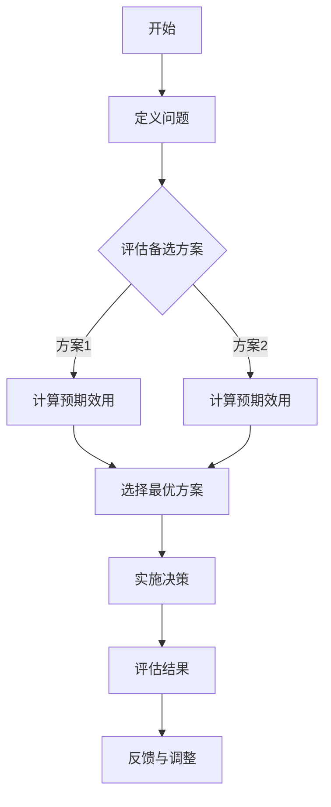
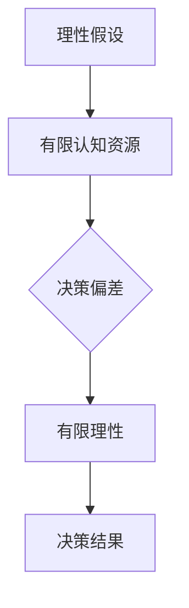
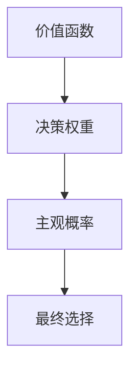
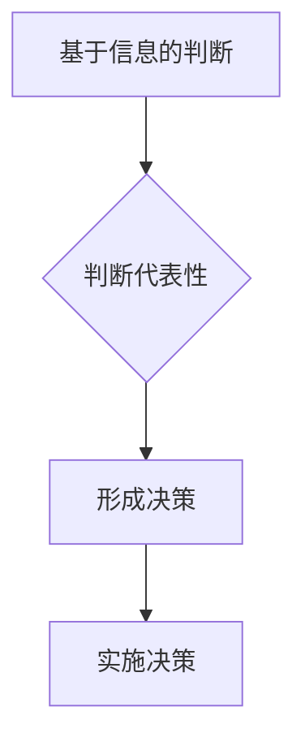
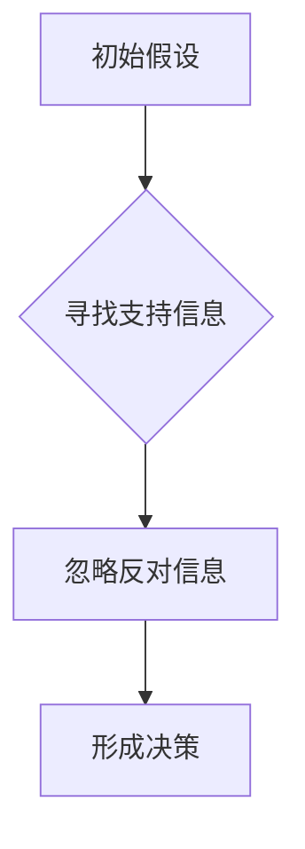
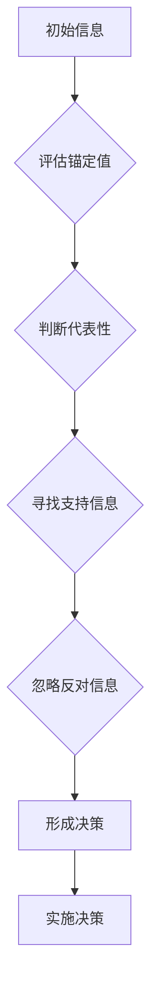
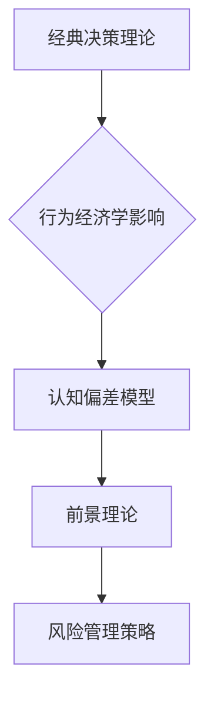
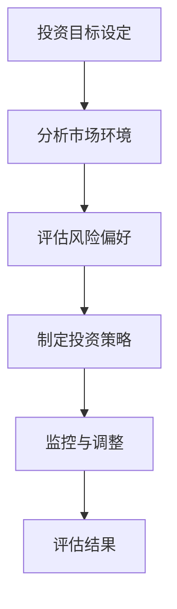

                 

### 从经典决策理论到行为经济学：理解人类在复杂世界中的选择

关键词：决策理论、行为经济学、人类行为、复杂世界、预期效用理论、前景理论

摘要：本文将探讨从经典决策理论到行为经济学的发展历程，分析人类在复杂世界中的选择行为。通过对经典决策理论和行为经济学的基本概念、主要观点和相互联系的深入分析，本文旨在帮助读者理解人类行为背后的逻辑和动机，为制定更有效的决策提供理论依据。通过实际案例和具体应用，本文还将展示行为经济学在金融、投资等领域的实际意义，为未来的研究方向提供启示。

### 目录大纲

#### 第一部分：背景介绍

##### 第1章：问题背景与核心概念

- **1.1 问题背景**
- **1.2 核心概念**
- **1.3 概念结构与核心要素组成**

##### 第2章：经典决策理论概述

- **2.1 经典决策理论的基本原理**
- **2.2 预期效用理论**
- **2.3 决策树**

##### 第二部分：行为经济学

##### 第3章：行为经济学的基本概念

- **3.1 有限理性**
- **3.2 前景理论**

##### 第4章：人类行为与决策过程

- **4.1 认知偏差**
- **4.2 行为经济学与决策理论的联系**

##### 第三部分：应用与挑战

##### 第5章：行为经济学在实践中的应用

- **5.1 行为经济学在金融领域的应用**

##### 第6章：行为经济学与决策理论的未来发展方向

- **6.1 未来研究方向**
- **6.2 挑战与展望**

### 第一部分：背景介绍

#### 第1章：问题背景与核心概念

在当今快速发展的社会中，决策无处不在。无论是个人生活中的选择，还是企业在市场中的战略规划，决策都扮演着至关重要的角色。然而，人类在复杂世界中如何做出有效选择，一直是学者们关注的焦点。为了理解和预测人类行为，我们有必要探讨决策理论的发展历程，尤其是从经典决策理论到行为经济学的研究进展。

**1.1 问题背景**

人类的决策行为涉及到多个层面，包括个人、组织和社会。在日常生活中，我们每天都要做出各种决策，如购物、旅行、社交等。这些决策看似简单，实则复杂，因为它们往往需要权衡多个因素，如成本、收益、风险等。对于企业来说，决策更为复杂，涉及到市场分析、资源分配、风险管理等多个方面。而在社会层面，政府的政策制定也需要进行大量的决策，如财政预算、社会保障、环境保护等。

然而，人类在复杂世界中做出有效选择并非易事。首先，人类认知能力的局限性使得我们在信息处理和分析上存在不足。其次，人类行为往往受到情绪、心理和社会环境等多种因素的影响，这些因素使得决策过程更加复杂。此外，现实世界中的不确定性也增加了决策的难度。因此，如何理解人类在复杂世界中的决策行为，成为了一个亟待解决的问题。

**1.2 核心概念**

为了探讨人类决策行为，我们需要明确几个核心概念：

- **经典决策理论**：经典决策理论起源于20世纪50年代，主要包括预期效用理论、决策树等模型。这些理论假设人类是理性的，能够在充分信息下做出最优决策。
- **行为经济学**：行为经济学是经济学和心理学的交叉领域，研究人类在现实环境中的实际决策行为。行为经济学发现，人类行为往往不符合经典决策理论的假设，存在认知偏差、有限理性等问题。
- **人类行为**：人类行为是指人在不同情境下所表现出来的行为模式，包括认知、情感、行为等方面。人类行为受到多种因素的影响，如遗传、文化、社会环境等。
- **复杂世界**：复杂世界是指由多种因素交织而成，且存在不确定性的现实环境。在复杂世界中，人类需要处理的信息量大，决策难度高。

**1.3 概念结构与核心要素组成**

为了更好地理解经典决策理论和行为经济学，我们需要构建一个概念结构，明确各个概念之间的关系和核心要素组成。

- **经典决策理论**：
  - **预期效用理论**：以预期效用最大化为基础，将决策过程分为评估问题、评估备选方案、选择最优方案、实施决策和评估结果等步骤。
  - **决策树**：用图形表示决策过程，包括决策节点、概率节点和结果节点等。

- **行为经济学**：
  - **有限理性**：人类认知能力的局限性导致我们在信息处理和分析上存在不足。
  - **前景理论**：描述人在面对风险决策时的心理过程，包括价值函数、决策权重和参照点等。

- **人类行为**：
  - **认知偏差**：人类在决策过程中存在的认知偏差，如代表性偏差、确认偏差等。
  - **行为模式**：人类在不同情境下表现出的行为模式，包括情感、认知和行为等方面。

- **复杂世界**：
  - **不确定性**：现实世界中的不确定性因素，如市场波动、技术变革等。
  - **信息量**：在复杂世界中，人类需要处理的信息量大，决策难度高。

通过以上概念结构，我们可以更清晰地理解经典决策理论和行为经济学的基本原理和核心要素，为后续章节的深入探讨打下基础。

### 第2章：经典决策理论概述

#### 第2.1节：经典决策理论的基本原理

经典决策理论起源于20世纪50年代，主要研究在给定条件下，如何通过理性分析来做出最优决策。这一理论的核心思想是假设人类是理性的，能够在充分信息下做出最优选择。经典决策理论主要包括预期效用理论、决策树等模型，为理解人类决策行为提供了重要的理论基础。

**2.1.1 预期效用理论**

预期效用理论（Expected Utility Theory）是经典决策理论的核心内容之一。该理论的基本假设是，个体在决策过程中总是追求最大化其预期效用。预期效用由以下公式定义：

\[ EU = \sum_{i} p_i u(x_i) \]

其中，\( EU \) 表示预期效用，\( p_i \) 表示第 \( i \) 个备选方案发生的概率，\( u(x_i) \) 表示第 \( i \) 个备选方案带来的效用值。

预期效用理论主要包括以下几个基本属性：

1. **独立性**：不同选择的效用值是可以相加的，即多个选择的组合效用等于各个选择效用值的加和。
2. **单调性**：如果某个选择带来的效用值大于另一个选择，那么包含前者的组合效用也必然大于包含后者的组合效用。
3. **确定性等价**：在不确定的决策中，可以将各个结果按照概率加权后的效用值与确定性决策进行比较。

为了更直观地理解预期效用理论，我们可以通过一个属性对比表格来展示其定义与主要属性：

| 原理名称 | 定义 | 主要属性 |
| --- | --- | --- |
| 预期效用理论 | 以预期效用最大化为基础的决策理论 | 效用、概率、期望值 |

**2.1.2 决策树**

决策树（Decision Tree）是经典决策理论中常用的一种模型，用于表示决策过程。决策树由一系列节点和边组成，每个节点表示一个决策或结果，边表示决策或结果之间的关系。决策树的基本结构包括以下几种类型的节点：

- **决策节点**：表示需要做出选择的点，通常用方形表示。
- **概率节点**：表示结果发生的概率，通常用圆形表示。
- **结果节点**：表示决策或结果的最终结果，通常用三角形表示。

以下是一个简单的决策树示例，用于说明决策过程：

在这个示例中，决策者需要从两个备选方案中选择一个。每个方案都有相应的概率和效用值。通过计算每个方案的预期效用，决策者可以做出最优选择。然后，实施决策并评估结果，根据反馈进行后续调整。

通过决策树，我们可以清晰地看到决策过程，分析每个步骤的预期效用，从而做出最优决策。决策树模型为我们提供了一种直观、系统的方法来分析复杂决策问题。

#### 第3章：行为经济学的基本概念

#### 第3.1节：有限理性

行为经济学中一个重要的观点是“有限理性”（Limited Rationality），该观点指出人类在决策过程中并非完全理性，而是受到认知能力的限制。这一概念与经典决策理论中的理性假设形成了鲜明对比。

**3.1.1 有限理性的概念**

有限理性认为，人类在决策过程中依赖于认知资源，而这些资源是有限的。这意味着人类无法处理无限的信息，也不能进行无限复杂的计算。有限理性假设包括以下几个方面：

1. **认知能力的限制**：人类大脑的认知能力是有限的，无法同时处理大量的信息。在面对复杂决策时，人们往往需要简化问题，采用近似方法进行决策。

2. **认知偏差**：由于认知能力的限制，人类在决策过程中容易出现认知偏差。这些偏差包括代表性偏差、确认偏差、锚定效应等，会影响决策结果。

3. **情感的影响**：情感在人类决策过程中起着重要作用。情感可以影响人的判断和选择，有时甚至会导致非理性决策。

以下是一个简单的有限理性流程图，展示认知资源、决策偏差和有限理性的关系：

**3.1.2 有限理性的影响**

有限理性对人类决策行为产生了重要影响。首先，它使得人类在信息处理和分析上存在不足。在面对复杂问题时，人们往往只能处理部分信息，导致决策结果不完全最优。其次，认知偏差和情感的影响使得决策过程更加复杂。人们可能会基于情感或偏差进行决策，而不是根据客观事实和理性分析。

**3.1.3 有限理性的实际应用**

在实际应用中，理解有限理性有助于我们更好地理解人类决策行为，从而设计出更有效的决策支持和优化方法。例如，在产品设计和管理中，考虑用户认知能力和情感因素，可以提升产品的用户满意度。在金融投资中，了解投资者心理和行为模式，可以优化投资策略，降低风险。

总之，有限理性是行为经济学中的一个重要概念，它揭示了人类在决策过程中存在的认知限制和非理性现象。理解有限理性有助于我们更好地理解和预测人类行为，为决策提供更有效的理论支持。

#### 第3.2节：前景理论

前景理论（Prospect Theory）是行为经济学中的核心概念之一，由丹尼尔·卡尼曼和阿莫斯·特沃斯基在1979年提出。该理论描述了人们在面对风险决策时的心理过程，与经典决策理论的预期效用理论形成了鲜明对比。前景理论的核心观点是，人们在决策过程中不仅考虑结果的效用，还受到参考点、价值函数和决策权重的影响。

**3.2.1 前景理论的基本概念**

前景理论的基本概念包括以下几个部分：

1. **价值函数**：价值函数（Value Function）是前景理论的核心，用于描述人们对不同结果的偏好。价值函数通常是非线性的，表现出对损失和收益的敏感度不同。例如，人们可能对损失更敏感，而对收益不那么敏感。

2. **决策权重**：决策权重（Decision Weight）反映了人们对不同概率的主观评价。在前景理论中，人们往往会低估低概率事件的影响，而高估高概率事件的影响。这种主观概率与客观概率之间存在差异。

3. **参照点**：参照点（Reference Point）是前景理论中的另一个重要概念，用于判断结果的好坏。在决策过程中，人们会以某个特定点作为参照，比较不同选择带来的收益或损失。这个参照点可以是当前状态、过去状态或其他心理基准。

以下是一个简单的价值函数、决策权重和参照点对比表格，展示前景理论的基本属性：

| 理论名称 | 定义 | 主要属性 |
| --- | --- | --- |
| 前景理论 | 描述人在面对风险决策时的心理过程 | 价值函数、决策权重、参照点 |

**3.2.2 前景理论的实际应用**

前景理论在多个领域都有广泛应用，以下是一些实际案例：

1. **金融市场**：在金融市场中，前景理论可以帮助投资者更好地理解自己的心理和行为模式，从而优化投资决策。例如，投资者可能会因为价值函数和决策权重的影响，对高风险和高收益的投资项目产生过度偏好或过度谨慎。

2. **市场营销**：在市场营销中，前景理论可以指导企业设计更具吸引力的产品和服务。通过理解消费者对收益和损失的主观评价，企业可以制定更有效的定价策略、促销活动和品牌定位。

3. **公共决策**：在公共决策中，前景理论可以帮助政策制定者更好地理解公众的行为和偏好，从而制定更符合公众利益的政策。例如，在环境保护政策制定中，考虑公众对环境损失的敏感度，可以设计出更有效的政策方案。

**3.2.3 价值函数与决策权重的关系**

价值函数和决策权重是前景理论中的两个重要概念，它们之间存在密切的关系。价值函数反映了人们对不同结果的偏好，而决策权重则影响了人们对不同概率的主观评价。在实际决策过程中，价值函数和决策权重共同作用，决定了人们的最终选择。

以下是一个简单的价值函数和决策权重关系图，展示两者之间的互动：

通过这个关系图，我们可以看到，价值函数和决策权重共同影响了人们的决策过程。价值函数决定了人们对不同结果的偏好，而决策权重则决定了人们对不同概率的主观评价，最终决定了人们的最终选择。

总之，前景理论是行为经济学中的一个重要概念，它揭示了人类在风险决策中的心理过程。理解前景理论有助于我们更好地理解人类行为，为决策提供更有效的理论支持。

#### 第4章：人类行为与决策过程

#### 第4.1节：决策过程中的认知偏差

在人类决策过程中，认知偏差（Cognitive Biases）是常见的现象。这些偏差是由于人类认知系统的局限性、信息处理的简化以及情感和情绪的影响，导致人们在决策过程中偏离理性。以下将介绍几种常见的认知偏差，并探讨它们对决策过程的影响。

**4.1.1 代表性偏差**

代表性偏差（Representativeness Bias）是指人们在评估概率时，过于关注样本的代表性，而忽略了基本概率。这种偏差导致人们在做决策时，倾向于选择看似更符合情境的选项，而不是基于实际概率进行选择。

例如，在一个抽签游戏中，如果有一个选项看起来非常像目标结果，人们可能会认为这个选项更有可能发生，即使从概率角度来看，它并不比其他选项更有优势。

以下是一个代表性偏差的Mermaid流程图，展示了决策过程：

在这个流程图中，A表示基于信息的判断，B表示判断代表性，C表示形成决策，D表示实施决策。代表性偏差发生在判断代表性阶段，导致决策结果偏离理性。

**4.1.2 确认偏差**

确认偏差（Confirmation Bias）是指人们在接收和处理信息时，倾向于寻找、记住和给予更多权重那些符合自己已有观点的信息，而忽视或否认相反的信息。这种偏差导致人们在做决策时，更容易维持原有的信念，而不是开放心态接受新信息。

例如，当一个人坚信某个投资策略有效时，他会更容易接受和记住支持这一策略的信息，而忽视或拒绝那些质疑这一策略的信息。

以下是一个确认偏差的Mermaid流程图，展示了决策过程：

在这个流程图中，A表示初始假设，B表示寻找支持信息，C表示忽略反对信息，D表示形成决策。确认偏差发生在寻找支持信息和忽略反对信息阶段，导致决策结果偏离理性。

**4.1.3 其他认知偏差**

除了代表性偏差和确认偏差，还有许多其他常见的认知偏差，如锚定效应（Anchoring Bias）、确认偏见（Self-Serving Bias）、认知失调（Cognitive Dissonance）等。这些偏差都会对人类决策过程产生不同程度的影响，导致人们偏离理性决策。

- **锚定效应**：人们在评估某个数值时，容易受到先前的数值（锚）的影响，即使这个锚与实际情况无关。
- **确认偏见**：人们倾向于对自己有利的信息给予更多权重，而忽视或否认对自己不利的信息。
- **认知失调**：当人们意识到自己的行为或观点与现有信念不一致时，会产生不舒服的感觉，进而倾向于改变行为或观点以消除这种失调。

以下是一个综合多种认知偏差的Mermaid流程图，展示了决策过程：

在这个流程图中，A表示初始信息，B表示评估锚定值，C表示判断代表性，D表示寻找支持信息，E表示忽略反对信息，F表示形成决策，G表示实施决策。多种认知偏差共同作用，可能导致决策结果偏离理性。

**4.1.4 认知偏差的影响与应对策略**

认知偏差对人类决策过程产生了负面影响，导致决策结果偏离理性。为了降低认知偏差的影响，我们可以采取以下应对策略：

- **多角度思考**：在决策过程中，尝试从不同角度思考问题，避免单一视角带来的偏差。
- **保持开放心态**：接受和考虑不同的观点和信息，避免陷入确认偏差。
- **使用工具**：借助各种工具和方法，如决策树、成本效益分析等，帮助理性决策。
- **情感管理**：在决策过程中，注意管理自己的情绪，避免情感影响决策。

通过以上应对策略，我们可以更好地克服认知偏差，做出更为理性的决策。

总之，认知偏差是决策过程中的常见现象，它们会影响人类决策的理性性和有效性。理解认知偏差的类型和影响，有助于我们更好地应对决策过程中的挑战，提高决策质量。

#### 第5章：行为经济学与经典决策理论的联系

行为经济学与经典决策理论在人类决策研究领域中占据了重要位置，但它们在理论和方法上存在显著差异。经典决策理论建立在完全理性的假设之上，强调在给定信息和时间约束下，通过最优决策来实现最大化预期效用。然而，行为经济学通过实验和实际案例发现，人类行为往往不符合这些理性假设，存在认知偏差和有限理性。本节将深入探讨行为经济学对经典决策理论的挑战及其贡献。

**5.1 行为经济学对经典决策理论的挑战**

1. **有限理性**：经典决策理论假设人类是理性的，能够在充分信息下做出最优决策。然而，行为经济学揭示了人类认知能力的局限性，即有限理性。人们在信息处理和分析上存在不足，往往只能处理部分信息，导致决策结果不完全最优。例如，丹尼尔·卡尼曼和阿莫斯·特沃斯基的前景理论指出，人们在面对风险决策时，会表现出对损失和收益的非线性敏感度，这与经典决策理论的预期效用理论存在显著差异。

2. **认知偏差**：人类在决策过程中容易受到各种认知偏差的影响，如代表性偏差、确认偏差、锚定效应等。这些偏差导致决策结果偏离理性。经典决策理论并未充分考虑到这些认知偏差，而行为经济学通过实验和案例研究发现，这些偏差在实际决策中起着重要作用。例如，代表性偏差导致人们在评估概率时，过于关注样本的代表性，而忽略了基本概率，从而做出非理性决策。

3. **情感影响**：经典决策理论主要关注决策的理性层面，而忽略了情感的影响。行为经济学发现，情感在决策过程中起着关键作用，可以显著影响决策结果。例如，恐惧、贪婪和希望等情感会导致人们在决策时偏离理性。在经典决策理论中，这些情感因素被视为外部干扰，而行为经济学则将情感作为研究的重要变量。

**5.2 行为经济学对经典决策理论的贡献**

尽管行为经济学对经典决策理论提出了挑战，但它也为决策理论的发展做出了重要贡献。以下是行为经济学对经典决策理论的主要贡献：

1. **认知偏差模型**：行为经济学通过构建认知偏差模型，揭示了人类在决策过程中常见的认知偏差，如代表性偏差、确认偏差和锚定效应等。这些模型为理解和预测人类行为提供了新的视角，有助于改进决策过程。例如，通过识别和纠正代表性偏差，可以帮助人们做出更为理性的概率评估。

2. **前景理论**：前景理论是行为经济学的重要成果之一，它描述了人在面对风险决策时的心理过程。前景理论引入了价值函数和决策权重等概念，为理解人类的风险偏好提供了理论依据。这些理论可以应用于金融投资、市场营销等领域，帮助企业和个人做出更为合理的决策。

3. **风险管理策略**：行为经济学在风险管理方面提供了新的视角。通过理解人类的风险偏好和行为模式，可以设计出更有效的风险管理策略。例如，在金融市场中，了解投资者的心理和行为模式，可以优化投资组合，降低风险。

以下是一个行为经济学对经典决策理论贡献的Mermaid流程图：

在这个流程图中，A表示经典决策理论，B表示行为经济学的影响，C表示认知偏差模型，D表示前景理论，E表示风险管理策略。行为经济学通过引入新的理论和方法，丰富了决策理论的研究内容，为理解和优化人类决策行为提供了新的思路。

**5.3 行为经济学与决策理论的未来发展方向**

行为经济学与经典决策理论的融合为未来研究提供了广阔的视野。未来研究可能包括以下几个方面：

1. **跨学科研究**：行为经济学可以与心理学、社会学、神经科学等多个学科进行交叉研究，进一步揭示人类决策行为的复杂性。例如，通过结合神经科学方法，可以深入了解大脑在决策过程中的作用。

2. **大数据分析**：随着大数据技术的发展，行为经济学可以通过大规模数据分析，探索人类行为模式，为决策提供更加精准的预测。例如，通过对大量金融交易数据进行分析，可以揭示市场行为和决策模式。

3. **实际应用**：行为经济学理论可以应用于各种实际场景，如金融投资、企业管理、公共政策等。通过理解人类行为，可以设计出更有效的决策支持和优化工具。

总之，行为经济学与经典决策理论在人类决策研究中各自扮演着重要角色。通过不断融合和创新，这两个领域将为理解和优化人类决策行为提供更加丰富的理论和方法。

#### 第6章：行为经济学在实践中的应用

#### 第6.1节：行为经济学在金融领域的应用

行为经济学在金融领域的应用具有重要意义，它不仅帮助我们理解投资者在市场中的行为，还可以为金融产品和策略的设计提供理论依据。以下是行为经济学在金融领域的一些具体应用：

**6.1.1 投资决策**

在投资决策中，行为经济学通过研究人类的风险偏好、认知偏差和情感影响，揭示了传统金融理论中的某些不足。例如，传统的资本资产定价模型（CAPM）和有效市场假说（EMH）基于理性投资者的假设，而实际中投资者往往受到情绪和非理性决策的影响。

1. **风险偏好**：行为经济学发现，投资者对风险的态度是多样化的，不同个体对风险的容忍度存在显著差异。通过前景理论，我们可以更好地理解投资者的风险偏好，从而设计出更符合实际需求的投资产品。

2. **认知偏差**：代表性偏差和确认偏差等认知偏差在投资决策中尤为常见。投资者可能过于关注短期市场表现，而忽视了长期投资价值。通过识别和纠正这些偏差，投资者可以做出更为理性的决策。

3. **情感影响**：投资者的情感状态对决策过程有显著影响。例如，在市场下跌时，投资者可能会产生恐慌情绪，导致过度卖出。通过理解情感影响，投资者可以更好地管理自己的情绪，避免情绪化的决策。

**6.1.2 投资策略**

基于行为经济学的研究成果，投资者可以制定更为有效的投资策略。以下是一些具体策略：

1. **分散投资**：分散投资可以降低风险，但传统理论中的分散化策略基于理性投资者的假设。行为经济学指出，投资者在实际操作中可能因为确认偏差等原因，无法实现真正的分散化。因此，投资者应该通过定期的再平衡和调整投资组合，确保分散投资的有效性。

2. **长期投资**：行为经济学强调，投资者应该关注长期投资价值，而不仅仅是短期市场波动。通过长期投资，投资者可以更好地抵御市场波动，实现长期稳定的收益。

3. **行为金融策略**：行为金融策略利用市场中的认知偏差和情绪波动来获得超额收益。例如，利用羊群效应和动量效应，投资者可以在市场趋势明显时采取相应的投资策略。

以下是一个投资决策流程图，展示了行为经济学在金融领域的应用：

在这个流程图中，A表示投资目标设定，B表示分析市场环境，C表示评估风险偏好，D表示制定投资策略，E表示监控与调整，F表示评估结果。通过这个流程，投资者可以根据行为经济学理论，制定和调整投资策略，以实现长期稳定的投资回报。

**6.1.3 金融产品的设计**

行为经济学在金融产品的设计中也发挥了重要作用。以下是一些具体应用：

1. **激励兼容**：在金融产品设计中，设计者需要考虑如何激励投资者采取预期行为。例如，通过设置合理的激励机制，可以鼓励投资者进行长期投资，避免短期交易。

2. **信息披露**：行为经济学指出，投资者对信息的重要性有不同的认知。因此，在设计金融产品时，需要考虑如何提供透明、准确的信息披露，帮助投资者做出理性决策。

3. **产品多样化**：行为经济学发现，投资者在决策过程中容易受到代表性偏差的影响。因此，在设计金融产品时，应提供多样化的选项，以帮助投资者克服代表性偏差，实现更为理性的选择。

总之，行为经济学在金融领域的应用为投资者提供了新的视角和工具，帮助他们更好地理解市场行为和投资决策。通过结合行为经济学理论，投资者可以制定更为有效的投资策略，实现长期稳定的投资回报。

### 第7章：行为经济学与决策理论的未来发展方向

#### 第7.1节：未来研究方向

行为经济学与决策理论的未来研究方向十分广阔，涵盖了跨学科合作、大数据分析、人工智能应用等多个领域。以下是一些可能的研究方向：

1. **跨学科研究**：行为经济学可以与心理学、社会学、神经科学等学科进行深入合作。通过结合这些领域的理论和方法，我们可以更全面地理解人类决策行为，揭示其背后的心理机制。例如，神经科学可以通过脑成像技术，研究大脑在决策过程中的活动模式，为行为经济学提供新的实验证据。

2. **大数据分析**：随着大数据技术的发展，我们可以收集和分析大量的决策行为数据。这些数据可以为行为经济学提供丰富的实证支持，帮助我们更好地理解人类决策行为。例如，通过分析股票市场的交易数据，我们可以揭示市场中的认知偏差和情绪波动，为投资策略提供参考。

3. **人工智能应用**：人工智能技术在决策支持系统中的应用前景广阔。通过机器学习算法，我们可以构建智能决策模型，帮助个体和企业做出更明智的决策。例如，人工智能可以分析大量的市场数据，预测市场趋势，为投资者提供投资建议。

#### 第7.2节：挑战与展望

尽管行为经济学与决策理论在研究与应用方面取得了显著进展，但仍面临诸多挑战。以下是未来研究的一些主要挑战与展望：

1. **理论整合**：行为经济学与经典决策理论之间存在显著差异，如何将两者有效整合，构建一个统一的决策理论框架，是一个重要挑战。未来研究需要探讨如何在保留经典决策理论优势的基础上，融合行为经济学的认知偏差和情感影响等观点。

2. **实证研究**：行为经济学的研究往往依赖于实验数据和实际案例。然而，现有数据的局限性可能导致研究结果的泛化能力不足。未来研究需要进一步扩大数据规模，提高数据质量，以增强理论的实证支持。

3. **应用转化**：将行为经济学理论转化为实际应用，需要解决理论与实际操作的差距问题。未来研究需要探索如何将行为经济学理论有效地应用于实际决策场景，如金融投资、企业管理等，以实现理论的实际价值。

总之，行为经济学与决策理论的未来发展方向充满机遇与挑战。通过跨学科合作、大数据分析和人工智能应用等手段，我们可以更深入地理解人类决策行为，为理论发展提供新的视角和工具。同时，未来研究需要关注理论整合、实证研究和应用转化等方面的挑战，以推动这一领域的持续发展。

### 总结

本文从经典决策理论到行为经济学，深入探讨了人类在复杂世界中的决策行为。首先，我们介绍了经典决策理论的基本原理，如预期效用理论和决策树，帮助读者理解理性决策的过程。然后，我们讨论了行为经济学的基本概念，如有限理性和前景理论，揭示了人类实际决策行为中存在的认知偏差和非理性现象。通过对比经典决策理论和行为经济学，我们分析了行为经济学对决策理论的挑战和贡献。接下来，我们展示了行为经济学在金融领域的实际应用，如投资决策和风险管理策略。最后，我们探讨了行为经济学与决策理论的未来发展方向，提出了跨学科研究、大数据分析和人工智能应用等研究方向。

理解人类在复杂世界中的决策行为对于个人、企业和政策制定者都具有重要意义。通过本文的探讨，我们希望读者能够更好地认识到决策过程中的认知偏差和非理性因素，从而在日常生活中做出更为明智的选择。同时，行为经济学的研究成果也为优化决策支持和策略设计提供了新的思路和方法。

在未来的研究中，我们可以进一步探讨如何将行为经济学理论应用于更多实际场景，如医疗决策、教育规划等。此外，跨学科合作、大数据分析和人工智能技术的应用也将为行为经济学研究带来新的机遇。通过持续探索和创新，行为经济学与决策理论将继续为人类决策行为的研究提供有力支持。让我们期待这一领域在未来取得更多的突破和进展。

### 作者信息

作者：AI天才研究院/AI Genius Institute & 禅与计算机程序设计艺术 /Zen And The Art of Computer Programming

AI天才研究院（AI Genius Institute）致力于探索人工智能的深度研究与广泛应用，推动技术进步和社会发展。同时，作者在《禅与计算机程序设计艺术》（Zen And The Art of Computer Programming）一书中，探讨了编程哲学与技术创新，为计算机科学领域提供了深刻的理论和实践指导。通过本文，我们希望进一步揭示行为经济学与决策理论的奥秘，为读者提供有价值的知识和启示。

