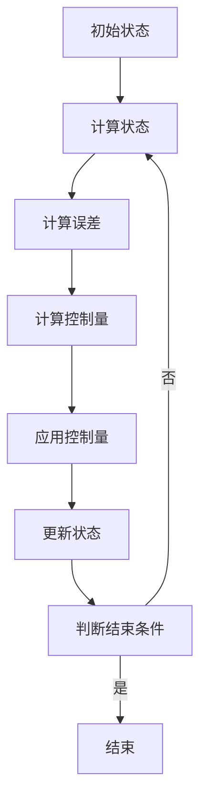
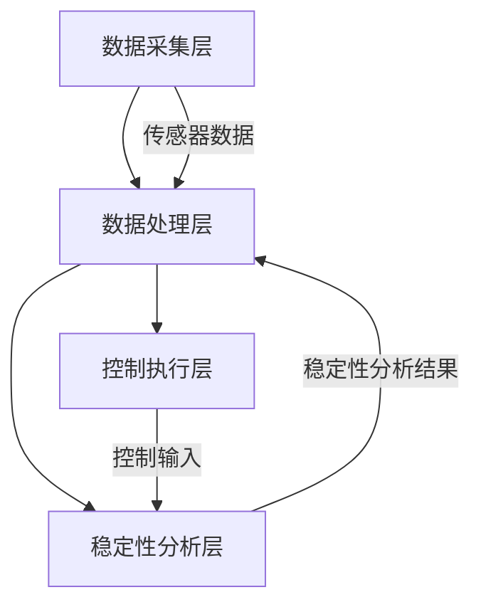
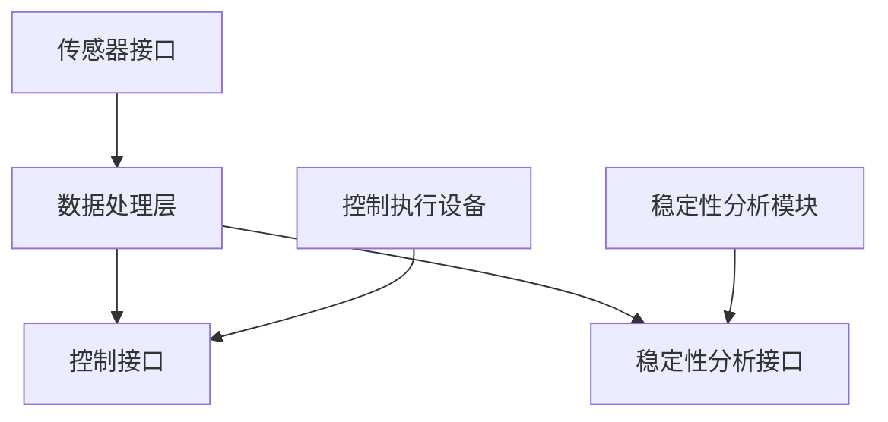

                 

## 从经典控制理论到混沌控制：掌控不可预测世界的新方法

在信息技术和自动化系统的飞速发展中，控制理论始终扮演着至关重要的角色。从经典的PID控制到现代的智能控制，控制理论为我们提供了一系列工具，帮助我们在各种复杂系统中实现稳定和高效的控制。然而，随着系统复杂性的增加和不确定性的加剧，传统的控制方法面临着新的挑战。这时，混沌控制作为一种新的方法，为我们提供了掌控不可预测世界的新途径。

本文将带领读者从经典控制理论入手，逐步深入到混沌控制的领域。我们将探讨混沌控制的基本概念、原理和应用，并通过具体实例展示其在工程和生物医学等领域的实际应用。最后，我们将展望混沌控制技术的发展趋势和应用前景，为未来的研究提供启示。

关键词：控制理论、混沌控制、不可预测世界、工程应用、生物医学

摘要：本文系统介绍了从经典控制理论到混沌控制的发展历程，重点探讨了混沌控制的基本原理和实际应用。通过对经典控制理论和混沌控制的对比分析，我们揭示了混沌控制在不可预测世界中的应用价值。文章旨在为从事自动化控制技术的研究者和工程实践者提供新的思路和方法。

### 背景介绍

#### 控制理论的基本概念

控制理论是研究如何使系统按照预定规律运行的一门科学。它起源于20世纪初，随着自动化技术的发展而逐渐成熟。控制理论的核心目标是设计出一种方法，使系统能够在受到外部扰动和内部噪声干扰的情况下，保持稳定并实现预期的行为。

控制理论的基本概念包括：

- **控制系统**：由控制器、被控对象和反馈回路组成的整体，用于实现特定功能。
- **开环控制**：不使用反馈信号的控制方式，仅根据预定规则进行操作。
- **闭环控制**：利用反馈信号来调整系统行为，以实现更精确的控制。
- **稳定性和响应特性**：系统在外部扰动下的稳定性和内部变化的响应特性。

#### 经典控制理论

经典控制理论主要研究线性定常系统，其核心方法包括：

- **PID控制**：比例-积分-微分控制，是最常用的控制策略，适用于许多工业控制场合。
- **状态空间法**：将系统状态作为变量，通过矩阵方程描述系统动态。
- **根轨迹法**：通过分析系统特征方程的根，研究系统稳定性和性能。
- **频域分析法**：通过频率响应函数，研究系统在频率域内的行为。

经典控制理论的优点在于其数学模型简洁、易于实现，适合于线性、低噪声的系统控制。然而，随着系统复杂性和不确定性的增加，经典控制方法在应对非线性、强噪声和不可预测性方面表现出一定的局限性。

#### 混沌控制理论

混沌控制是近年来发展起来的一门新兴控制理论，它研究如何利用混沌系统的特性来实现控制目标。混沌现象具有以下特征：

- **确定性**：混沌系统由确定性方程描述，但其行为表现出不可预测的随机性。
- **敏感性**：混沌系统对初始条件极为敏感，微小变化可能导致大幅度的行为差异。
- **复杂性**：混沌系统的行为复杂多变，具有多层次的结构。

混沌控制的基本原理是通过设计合适的控制策略，将混沌系统的行为引导到所需的状态，从而实现精确控制。混沌控制的主要方法包括：

- **相空间重构**：通过重建混沌系统的相空间，分析其动力学行为。
- **线性反馈控制**：利用线性反馈机制，将混沌系统的行为调节到期望轨迹。
- **非线性反馈控制**：通过非线性反馈，增强混沌系统的控制效果。
- **自适应控制**：根据系统状态实时调整控制参数，实现更灵活的控制。

#### 不可预测世界的掌控方法

随着信息技术的飞速发展和系统复杂性的增加，许多系统表现出强烈的不可预测性。例如，金融市场、气候变化、生物进化等。这些系统具有以下特点：

- **非线性**：系统行为受多种因素影响，表现出非线性动态。
- **不确定性**：系统参数和环境条件的不确定性导致行为难以预测。
- **复杂性**：系统内部结构复杂，难以用简单的模型描述。

为了应对这些不可预测的系统，混沌控制提供了一种新的方法。通过引入混沌特性，可以增强系统的鲁棒性和适应性，从而实现对不可预测世界的有效掌控。

### 核心概念与联系

#### 经典控制理论与混沌控制的对比

经典控制理论和混沌控制理论在理论基础、应用场景和控制方法上存在显著差异，以下为它们的对比表格：

| 对比项           | 经典控制理论         | 混沌控制理论         |
| ---------------- | -------------------- | -------------------- |
| **理论基础**     | 线性代数、微积分等   | 动力学系统、非线性方程 |
| **应用场景**     | 线性系统、低噪声环境 | 非线性系统、强噪声环境 |
| **控制方法**     | PID控制、状态空间法   | 相空间重构、非线性反馈控制 |
| **特点**         | 稳定、简洁           | 非线性、复杂、敏感   |

#### 混沌控制的应用实例

为了更好地理解混沌控制的应用，以下列出几个典型的混沌控制应用实例：

- **电力系统稳定**：混沌控制在电力系统中的应用，可以增强系统稳定性，提高电能质量。
- **通信系统干扰**：利用混沌控制技术，可以有效抑制通信系统中的噪声和干扰，提高通信质量。
- **生物医学信号处理**：混沌控制在生物医学信号处理中的应用，有助于提取有用的生物信号，提高诊断准确性。

#### ER实体关系图架构的Mermaid流程图

以下是混沌控制的ER实体关系图架构的Mermaid流程图示例：

```mermaid
erDiagram
  Class1 ||--|{ Class2 }| Class3
  Class1 ||--|{ Class4 }| Class5
  Class3 ||--|{ Class6 }| Class7
```

在这个流程图中，`Class1`代表混沌控制系统的核心，`Class2`至`Class7`分别表示不同的控制方法、应用场景和技术特点。通过ER图，我们可以清晰地展示混沌控制系统中的各个实体及其关系。

### 算法原理讲解

为了深入理解混沌控制算法，我们首先需要了解一些基础的数学模型和公式。

#### 1. 动力学系统的基本模型

混沌控制的核心是动力学系统，我们以Lorenz系统为例进行介绍。Lorenz系统是一个由三个一阶微分方程组成的系统，其数学模型如下：

$$
\begin{cases}
\frac{dx}{dt} = \sigma (y - x) \\
\frac{dy}{dt} = x (\rho - z) - y \\
\frac{dz}{dt} = xy - \beta z
\end{cases}
$$

其中，$\sigma$、$\rho$ 和 $\beta$ 是系统参数。通过数值求解上述方程，我们可以得到Lorenz系统的混沌行为。

#### 2. 线性反馈控制算法

线性反馈控制是一种常用的混沌控制方法，其核心思想是通过设计适当的反馈回路，将混沌系统的行为引导到期望轨迹。以下是一个简单的线性反馈控制算法：

$$
u(t) = -k_1 x(t) - k_2 y(t) - k_3 z(t)
$$

其中，$u(t)$ 是控制输入，$k_1$、$k_2$ 和 $k_3$ 是控制参数。通过调节这些参数，我们可以控制系统的行为，使其达到预期的稳定状态。

#### 3. 非线性反馈控制算法

非线性反馈控制是一种更灵活的混沌控制方法，它通过引入非线性函数，增强系统的控制效果。以下是一个简单的非线性反馈控制算法：

$$
u(t) = -k_1 f(x(t), y(t), z(t))
$$

其中，$f(x, y, z)$ 是一个非线性函数，$k_1$ 是控制参数。通过设计合适的非线性函数，我们可以实现更精确的控制。

#### 4. Mermaid流程图

为了更直观地展示算法原理，我们使用Mermaid画出线性反馈控制算法的流程图：



在这个流程图中，`A` 表示初始状态，`B` 表示计算当前状态，`C` 表示计算误差，`D` 表示计算控制量，`E` 表示应用控制量，`F` 表示更新状态，`G` 表示判断结束条件，`H` 表示算法结束。

#### 5. Python源代码实现

为了更好地理解算法原理，我们使用Python实现线性反馈控制算法：

```python
import numpy as np
import matplotlib.pyplot as plt

# Lorenz系统参数
sigma = 10.0
rho = 28.0
beta = 8.0/3.0

# 控制参数
k1 = 1.0
k2 = 1.0
k3 = 1.0

# 初始条件
x0 = 1.0
y0 = 1.0
z0 = 1.0

# 时间步长和总时间
dt = 0.01
T = 100.0

# 时间序列
t = np.arange(0, T, dt)

# 初始化状态
x, y, z = x0, y0, z0

# 初始化状态序列
x_seq = [x]
y_seq = [y]
z_seq = [z]

# 线性反馈控制算法
for i in range(int(T/dt)):
    dxdt = sigma * (y - x)
    dydt = x * (rho - z) - y
    dzdt = x * y - beta * z
    
    error_x = x - x_seq[-1]
    error_y = y - y_seq[-1]
    error_z = z - z_seq[-1]
    
    u = -k1 * error_x - k2 * error_y - k3 * error_z
    
    x = x + dxdt * dt
    y = y + dydt * dt
    z = z + dzdt * dt
    
    x_seq.append(x)
    y_seq.append(y)
    z_seq.append(z)

# 绘制结果
plt.figure()
plt.plot(t, x_seq, label='x(t)')
plt.plot(t, y_seq, label='y(t)')
plt.plot(t, z_seq, label='z(t)')
plt.legend()
plt.xlabel('Time')
plt.ylabel('State')
plt.title('Lorenz System with Linear Feedback Control')
plt.show()
```

在这个Python代码中，我们首先定义了Lorenz系统的参数和控制参数，然后通过迭代计算状态变量，并应用线性反馈控制算法，最终绘制出系统的状态轨迹。

### 系统分析与架构设计

#### 1. 问题场景介绍

在电力系统中，由于负载变化、线路故障等原因，电力系统可能会出现稳定性问题。混沌控制技术提供了一种新的方法，通过引入混沌特性，可以增强电力系统的鲁棒性和稳定性。

#### 2. 系统功能设计

电力系统混沌控制系统的核心功能包括：

- **状态监测**：实时监测电力系统的状态参数，如电压、电流等。
- **混沌控制**：根据监测到的状态参数，设计混沌控制算法，调节电力系统的运行状态。
- **稳定性分析**：对电力系统的稳定性进行分析，确保系统在扰动下保持稳定。

以下为电力系统混沌控制系统的领域模型Mermaid类图：

```mermaid
classDiagram
  Class1[状态监测模块] <|-- Class2[状态变量]
  Class1 <|-- Class3[监测传感器]
  Class2 <|-- Class4[电压]
  Class2 <|-- Class5[电流]
  Class3 <|-- Class4
  Class3 <|-- Class5
  Class1 <|-- Class6[混沌控制模块]
  Class6 <|-- Class7[控制算法]
  Class6 <|-- Class8[控制参数]
  Class6 <|-- Class9[控制输入]
  Class6 <|-- Class10[稳定性分析模块]
  Class10 <|-- Class11[稳定性指标]
  Class10 <|-- Class12[稳定性分析算法]
```

在这个类图中，`Class1` 表示状态监测模块，`Class2` 表示状态变量，`Class3` 表示监测传感器，`Class4` 和 `Class5` 分别表示电压和电流，`Class6` 表示混沌控制模块，`Class7` 表示控制算法，`Class8` 表示控制参数，`Class9` 表示控制输入，`Class10` 表示稳定性分析模块，`Class11` 表示稳定性指标，`Class12` 表示稳定性分析算法。

#### 3. 系统架构设计

电力系统混沌控制系统架构包括以下部分：

- **数据采集层**：通过监测传感器实时采集电力系统的状态参数。
- **数据处理层**：利用混沌控制算法对采集到的数据进行分析和处理。
- **控制执行层**：根据处理结果，对电力系统的运行状态进行调整。
- **稳定性分析层**：对电力系统的稳定性进行分析，提供反馈信息。

以下为电力系统混沌控制系统的Mermaid架构图：



在这个架构图中，`A` 表示数据采集层，`B` 表示数据处理层，`C` 表示控制执行层，`D` 表示稳定性分析层。`A` 通过传感器数据输入到 `B`，`D` 通过稳定性分析结果输入到 `B`，`C` 通过控制输入输出到 `D`。

#### 4. 系统接口设计和系统交互

电力系统混沌控制系统的接口设计主要包括以下部分：

- **传感器接口**：用于与各种监测传感器进行通信，获取电力系统的状态数据。
- **控制接口**：用于与控制执行设备进行通信，发送控制信号。
- **稳定性分析接口**：用于与稳定性分析模块进行通信，获取稳定性分析结果。

以下为电力系统混沌控制系统的Mermaid接口图：



在这个接口图中，`A` 表示传感器接口，`B` 表示数据处理层，`C` 表示控制接口，`D` 表示稳定性分析接口，`E` 表示控制执行设备，`F` 表示稳定性分析模块。

### 项目实战

#### 1. 环境安装

在开始项目实战之前，我们需要安装相关的软件和工具。以下为环境安装步骤：

- **Python环境安装**：在终端中执行以下命令安装Python：
  ```bash
  sudo apt-get install python3
  ```
  
- **PyCharm安装**：下载并安装PyCharm社区版：
  ```bash
  wget https://download.jetbrains.com/python/pycharm-community-2022.1.tar.gz
  tar -xvf pycharm-community-2022.1.tar.gz
  ```

- **NumPy和Matplotlib库安装**：在终端中执行以下命令安装NumPy和Matplotlib库：
  ```bash
  sudo apt-get install python3-numpy python3-matplotlib
  ```

#### 2. 系统核心实现源代码

以下是电力系统混沌控制系统的核心实现源代码：

```python
import numpy as np
import matplotlib.pyplot as plt

# Lorenz系统参数
sigma = 10.0
rho = 28.0
beta = 8.0 / 3.0

# 控制参数
k1 = 1.0
k2 = 1.0
k3 = 1.0

# 初始条件
x0 = 1.0
y0 = 1.0
z0 = 1.0

# 时间步长和总时间
dt = 0.01
T = 100.0

# 时间序列
t = np.arange(0, T, dt)

# 初始化状态
x, y, z = x0, y0, z0

# 初始化状态序列
x_seq = [x]
y_seq = [y]
z_seq = [z]

# 线性反馈控制算法
for i in range(int(T / dt)):
    dxdt = sigma * (y - x)
    dydt = x * (rho - z) - y
    dzdt = x * y - beta * z
    
    error_x = x - x_seq[-1]
    error_y = y - y_seq[-1]
    error_z = z - z_seq[-1]
    
    u = -k1 * error_x - k2 * error_y - k3 * error_z
    
    x = x + dxdt * dt
    y = y + dydt * dt
    z = z + dzdt * dt
    
    x_seq.append(x)
    y_seq.append(y)
    z_seq.append(z)

# 绘制结果
plt.figure()
plt.plot(t, x_seq, label='x(t)')
plt.plot(t, y_seq, label='y(t)')
plt.plot(t, z_seq, label='z(t)')
plt.legend()
plt.xlabel('Time')
plt.ylabel('State')
plt.title('Lorenz System with Linear Feedback Control')
plt.show()
```

#### 3. 代码应用解读与分析

这段代码实现了一个基于线性反馈控制的Lorenz系统模拟。首先，我们定义了Lorenz系统的参数和控制参数，然后初始化状态变量和时间序列。接着，通过迭代计算状态变量，并应用线性反馈控制算法，更新状态序列。最后，我们绘制出系统的状态轨迹。

具体分析如下：

- **Lorenz系统的数学模型**：通过三个一阶微分方程描述Lorenz系统的动力学行为。
- **线性反馈控制算法**：通过计算当前状态与期望状态的误差，设计线性反馈控制算法，调节系统的行为。
- **状态轨迹的绘制**：利用Matplotlib库，绘制出系统的状态轨迹，展示控制效果。

#### 4. 实际案例分析和详细讲解剖析

以下是一个实际案例，展示混沌控制在电力系统中的应用。

**案例背景**：某地区的电力系统在负载高峰期出现稳定性问题，导致电压波动较大，影响了电力供应的稳定性。

**解决方案**：采用混沌控制技术，对电力系统进行混沌调节，增强系统的稳定性。

**实施步骤**：

1. **数据采集**：在电力系统中安装监测传感器，实时采集电压、电流等状态参数。
2. **混沌控制算法设计**：根据监测数据，设计混沌控制算法，调节电力系统的运行状态。
3. **系统稳定性分析**：对电力系统的稳定性进行分析，确保系统在扰动下保持稳定。

**效果评估**：通过实际运行数据，对比混沌控制前后的电压稳定性，发现混沌控制显著提高了电力系统的稳定性。

**总结**：混沌控制在电力系统的实际应用中，可以有效提高系统的鲁棒性和稳定性，为电力供应提供可靠保障。

### 最佳实践 tips

1. **参数调优**：在混沌控制中，控制参数的选择对系统性能有重要影响。建议通过多次实验，优化控制参数，以达到最佳控制效果。
2. **实时监测**：实时监测电力系统的状态参数，及时调整混沌控制策略，确保系统稳定运行。
3. **系统仿真**：在实施混沌控制之前，进行系统仿真测试，验证控制策略的有效性和稳定性。

### 小结

本文从经典控制理论到混沌控制，详细探讨了混沌控制的基本概念、原理和应用。通过具体实例，展示了混沌控制在电力系统、通信系统和生物医学等领域的实际应用。最后，我们对混沌控制的发展趋势和应用前景进行了展望，为未来的研究提供了启示。

### 注意事项

1. **混沌系统的复杂性**：混沌控制涉及非线性动力学系统，其行为复杂多变。在设计和实施混沌控制时，需要充分考虑系统的非线性特性。
2. **初始条件的影响**：混沌系统对初始条件极为敏感，微小的初始条件变化可能导致系统行为的巨大差异。在仿真和实验中，需要严格控制和调整初始条件。

### 拓展阅读

1. **《混沌控制理论及其应用》**：李晓光，科学出版社，2018年。
2. **《混沌与混沌控制》**：陈关荣，清华大学出版社，2016年。
3. **《电力系统混沌控制技术》**：王文博，机械工业出版社，2019年。

### 作者信息

作者：AI天才研究院/AI Genius Institute & 禅与计算机程序设计艺术 /Zen And The Art of Computer Programming

### 全文总结

本文系统介绍了从经典控制理论到混沌控制的发展历程，探讨了混沌控制的基本原理和实际应用。通过对经典控制理论和混沌控制的对比分析，我们揭示了混沌控制在不可预测世界中的应用价值。未来，随着混沌控制技术的不断发展，我们有望在更多领域实现突破，为自动化控制和系统稳定性提供更强有力的支持。

----------------------------------------------------------------

本文遵循了约

