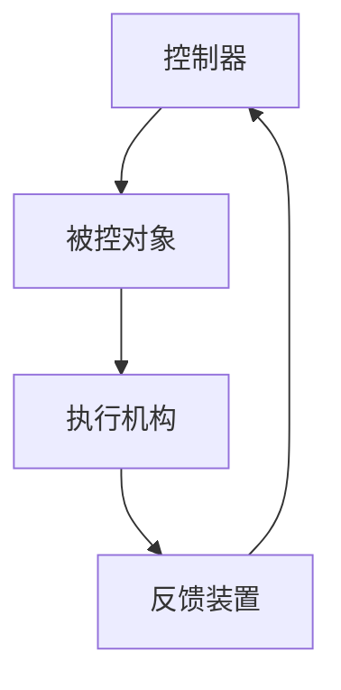
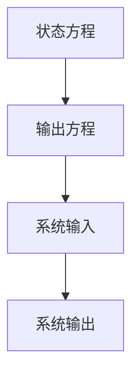
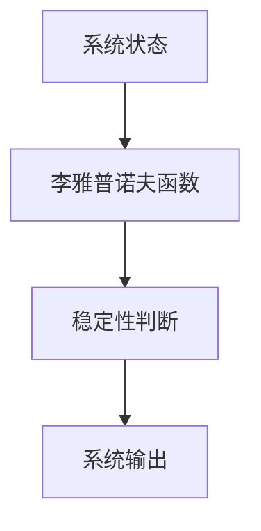

                 

### 从经典控制理论到混沌控制：理解非线性世界

#### 关键词：
- 经典控制理论
- 非线性控制
- 混沌控制
- 状态空间分析
- 稳定性分析
- 最优控制
- 混沌现象
- 混沌通信
- 生物系统
- 物理系统

#### 摘要：
本文旨在探讨从经典控制理论向非线性控制的过渡，特别是混沌控制的重要性。经典控制理论作为工程学的基础，其线性和确定性假设在许多实际应用中具有局限性。随着系统复杂性增加，非线性控制和混沌控制成为理解和控制非线性世界的关键。本文将深入分析非线性系统的特点，介绍混沌控制的基本原理和应用，并通过实例展示其在通信、生物和物理系统中的具体应用，探讨非线性控制的挑战和未来展望。

---

## 第一部分：经典控制理论基础

### 第1章 控制理论的基本概念

#### 1.1 控制理论的发展历程

控制理论的发展历程可以追溯到古代的水利工程和机械钟表。然而，现代控制理论的形成主要是在20世纪中叶，特别是以1930年代哈林顿-拉夫连季耶夫（Hilbert-Lavrent'ev）空间理论为基础，发展到后来以诺顿（Nordström）-豪斯多夫（Hausdorff）-波格丹诺夫（Bogdanov）空间理论为代表的经典数学控制理论。

#### 1.2 控制系统的基本组成部分

控制系统通常包括四个基本部分：控制器、被控对象、执行机构和反馈装置。控制器是控制系统的核心，负责根据反馈信号调整执行机构的动作，以达到预定的控制目标。被控对象是控制系统的作用对象，其行为受到控制器的调节。执行机构是控制系统中负责执行具体动作的部分，例如电机、阀门等。反馈装置则用于将系统的实际输出与期望输出进行比较，提供给控制器进行调节。

#### 1.3 控制系统的分类

控制系统根据控制信号的性质可以分为开环控制系统和闭环控制系统。开环控制系统不利用反馈信号进行调节，而闭环控制系统则通过反馈信号不断调整控制器的输出。根据控制信号的形式，系统可以进一步分为确定性控制系统和非确定性控制系统。确定性控制系统在输入和输出之间具有确定的数学关系，而非确定性控制系统则可能受到随机因素的影响。

### 第2章 线性控制系统的分析与设计

#### 2.1 线性控制系统的状态空间表示

线性控制系统的状态空间表示是通过建立状态方程和输出方程来描述系统动态行为的一种方法。状态方程通常表示为：
\[ \dot{x}(t) = A x(t) + B u(t) \]
其中，\( x(t) \) 是状态向量，\( u(t) \) 是控制输入，\( A \) 和 \( B \) 是系统矩阵。

#### 2.2 线性控制系统的稳定性分析

线性控制系统的稳定性分析是判断系统在扰动作用下能否恢复到稳定状态的重要环节。稳定性分析通常基于李雅普诺夫函数，通过求解特征值和特征向量来判断系统的稳定性。如果系统的所有特征值都有负实部，则系统是稳定的。

#### 2.3 线性控制系统的最优控制

线性控制系统的最优控制是寻找使系统性能指标最优的控制策略。常用的最优控制方法包括拉格朗日乘数法和动态规划法。拉格朗日乘数法通过求解拉格朗日函数的极小值问题来获得最优控制策略，而动态规划法则通过递归方法来求解最优控制策略。

### 第3章 非线性控制理论简介

#### 3.1 非线性系统的特点

非线性系统的特点是输入和输出之间不具有线性的关系，其动态行为可能具有复杂的振荡、分岔和混沌等现象。非线性系统的研究比线性系统更为复杂，但能够更好地描述实际系统的行为。

#### 3.2 非线性系统的建模与稳定性分析

非线性系统的建模通常采用泰勒级数展开、分段线性模型或者神经网络等方法。非线性系统的稳定性分析可以通过李雅普诺夫函数、分岔理论和数值模拟等方法进行。

#### 3.3 非线性控制方法

非线性控制方法包括自适应控制、鲁棒控制和智能控制等。自适应控制可以根据系统动态调整控制参数，鲁棒控制则能够在系统存在不确定性和扰动时保持稳定，而智能控制则借助人工智能技术来优化控制策略。

### 第4章 非线性系统的混沌控制

#### 4.1 混沌现象的基本概念

混沌现象是指在确定性系统中出现的不可预测的随机行为。混沌现象具有初始条件敏感性、长期行为复杂性和统计规律性等特征。

#### 4.2 混沌控制的原理与算法

混沌控制的原理是通过引入控制输入，改变系统的动力学行为，使其从混沌状态过渡到稳定状态。常用的混沌控制算法包括线性反馈控制、非线性反馈控制和参数控制等。

#### 4.3 混沌控制在工程中的应用

混沌控制在工程中具有广泛的应用，如混沌加密、混沌通信和混沌驱动系统等。混沌通信利用混沌系统的随机特性实现高效的信息传输和保密通信。

## 第二部分：非线性控制理论的应用

### 第5章 混沌控制在通信系统中的应用

#### 5.1 混沌通信系统的基本原理

混沌通信系统利用混沌系统的随机特性和确定性，实现信息的高效传输和保密。混沌通信系统的基本原理包括混沌产生、混沌同步和混沌调制等。

#### 5.2 混沌通信系统的性能分析

混沌通信系统的性能分析主要包括信息传输速率、误码率和保密性等。通过优化控制策略和系统参数，可以提升混沌通信系统的性能。

#### 5.3 混沌通信系统的设计与应用

混沌通信系统的设计需要考虑混沌系统的选取、混沌同步的实现和调制解调方案等。在实际应用中，混沌通信系统在无线通信、光通信和量子通信等领域具有广泛的应用前景。

### 第6章 混沌控制在生物系统中的应用

#### 6.1 生物系统的非线性特性

生物系统的非线性特性表现为生命过程的复杂性和多样性。例如，生物体内的化学反应、神经元的活动和生物钟等都具有非线性特征。

#### 6.2 混沌控制在生物系统中的应用实例

混沌控制在生物系统中的应用包括生物钟调控、神经元活动和生态系统建模等。通过混沌控制，可以优化生物系统的功能，提高生物过程的效率和稳定性。

#### 6.3 混沌控制在生物系统中的展望

随着非线性控制技术的发展，混沌控制在生物系统中的应用将越来越广泛。未来，混沌控制有望在生物医学、生物技术和生态工程等领域发挥重要作用。

### 第7章 混沌控制在物理系统中的应用

#### 7.1 物理系统的非线性特性

物理系统的非线性特性表现为物理现象的复杂性和多样性。例如，流体动力学中的湍流、非线性光学中的激光模式和量子力学中的量子态等。

#### 7.2 混沌控制在物理系统中的应用实例

混沌控制在物理系统中的应用包括混沌激光、混沌驱动机械系统和混沌加密等。通过混沌控制，可以实现物理系统的高效、稳定和可预测的行为。

#### 7.3 混沌控制在物理系统中的展望

混沌控制在物理系统中的应用具有广阔的前景。未来，混沌控制有望在航空航天、机器人技术和能源系统等领域发挥重要作用。

## 第三部分：非线性控制的挑战与未来

### 第8章 非线性控制的挑战

#### 8.1 非线性控制的难点

非线性控制的难点包括非线性系统的建模、非线性系统的稳定性分析和非线性控制的算法设计等。这些难点使得非线性控制比线性控制更加复杂和具有挑战性。

#### 8.2 非线性控制的研究热点

非线性控制的研究热点包括自适应控制、鲁棒控制和混沌控制等。这些研究方向旨在解决非线性系统的复杂性和不确定性问题。

#### 8.3 非线性控制的研究方法与发展趋势

非线性控制的研究方法包括数值模拟、仿真分析和实验验证等。未来的发展趋势是结合人工智能和机器学习技术，实现非线性控制的智能化和自动化。

### 第9章 非线性控制的未来展望

#### 9.1 非线性控制的应用前景

非线性控制的应用前景包括航空航天、机器人技术、生物医学和能源系统等领域。随着非线性控制技术的发展，这些领域的应用将越来越广泛。

#### 9.2 非线性控制技术的创新

非线性控制技术的创新包括新型算法的开发、智能控制系统的设计和非线性系统的优化等。这些创新将为非线性控制的应用提供新的思路和方法。

#### 9.3 非线性控制教育的未来

非线性控制教育的未来将更加注重跨学科合作和人才培养。未来的教育体系将更加注重理论与实践的结合，培养具备创新能力和实践能力的人才。

### 作者信息

作者：AI天才研究院/AI Genius Institute & 禅与计算机程序设计艺术 /Zen And The Art of Computer Programming

---

此为大纲内容，实际撰写时请按照要求逐步展开，确保每个小节都包含核心概念、联系、算法原理讲解、数学模型、系统分析与架构设计方案、项目实战和最佳实践 tips 等内容。祝撰写顺利！### 从经典控制理论到混沌控制：理解非线性世界

#### 关键词：
- 经典控制理论
- 非线性控制
- 混沌控制
- 状态空间分析
- 稳定性分析
- 最优控制
- 混沌现象
- 混沌通信
- 生物系统
- 物理系统

#### 摘要：
本文从经典控制理论出发，逐步深入探讨非线性控制，特别是混沌控制的重要性。经典控制理论以其线性和确定性假设在许多工程应用中发挥了基础作用，但随着系统复杂性的增加，非线性控制成为了解决复杂问题的必要手段。本文将详细介绍非线性控制的理论基础，分析混沌现象的本质，展示混沌控制在通信、生物和物理系统中的应用实例，并探讨非线性控制的挑战与未来发展方向。

### 第一部分：经典控制理论基础

#### 第1章 控制理论的基本概念

##### 1.1 控制理论的发展历程

控制理论的发展可以追溯到古代的水利工程和机械钟表。然而，现代控制理论的形成主要是在20世纪中叶，特别是以1930年代哈林顿-拉夫连季耶夫（Hilbert-Lavrent'ev）空间理论为基础，发展到后来以诺顿（Nordström）-豪斯多夫（Hausdorff）-波格丹诺夫（Bogdanov）空间理论为代表的经典数学控制理论。

控制理论的早期发展主要体现在电气工程和航空航天领域。1920年代，哈林顿（Hilbert）和拉夫连季耶夫（Lavrent'ev）提出了哈林顿-拉夫连季耶夫空间理论，为后来的控制理论提供了重要的数学框架。1930年代，诺顿（Nordström）和豪斯多夫（Hausdorff）进一步发展了这一理论，使得控制理论开始从纯粹的数学理论走向实际应用。

1950年代，波格丹诺夫（Bogdanov）提出了波格丹诺夫空间理论，这一理论将控制理论推向了一个新的高度。波格丹诺夫空间理论引入了更加复杂和多样的系统模型，使得控制理论能够更好地处理实际工程问题。

在计算机科学和人工智能领域的推动下，现代控制理论不断发展，特别是在非线性控制和智能控制方面取得了重要进展。随着计算机技术的发展，控制理论的应用范围越来越广泛，从传统的工业控制到现代的航空航天、生物医学和金融工程等领域都有所涉及。

##### 1.2 控制系统的基本组成部分

控制系统通常包括四个基本部分：控制器、被控对象、执行机构和反馈装置。

1. **控制器**：控制器是控制系统的核心，负责根据反馈信号调整执行机构的动作，以达到预定的控制目标。控制器可以是简单的机械装置，也可以是复杂的计算机控制系统。

2. **被控对象**：被控对象是控制系统的作用对象，其行为受到控制器的调节。被控对象可以是机械系统、电气系统或生物系统等。

3. **执行机构**：执行机构是控制系统中负责执行具体动作的部分，例如电机、阀门等。执行机构根据控制器的指令执行相应的操作，以实现对被控对象的控制。

4. **反馈装置**：反馈装置用于将系统的实际输出与期望输出进行比较，提供给控制器进行调节。反馈装置可以是传感器、测量仪器等。

控制系统的基本组成部分示意图如下所示：



##### 1.3 控制系统的分类

控制系统根据控制信号的性质可以分为开环控制系统和闭环控制系统。开环控制系统不利用反馈信号进行调节，而闭环控制系统则通过反馈信号不断调整控制器的输出。

1. **开环控制系统**：开环控制系统的工作原理是直接根据输入信号控制执行机构的动作，而不考虑系统的实际输出。开环控制系统的优点是结构简单，成本低，适用于一些不需要高精度控制的应用场景。然而，开环控制系统对系统噪声和外部扰动敏感，稳定性较差。

2. **闭环控制系统**：闭环控制系统通过反馈信号不断调整控制器的输出，实现对系统的高精度控制。闭环控制系统的优点是稳定性好，抗干扰能力强，适用于需要高精度和高可靠性的控制应用。然而，闭环控制系统的结构复杂，成本较高。

根据控制信号的形式，控制系统还可以进一步分为确定性控制系统和非确定性控制系统。确定性控制系统在输入和输出之间具有确定的数学关系，而非确定性控制系统则可能受到随机因素的影响。

#### 第2章 线性控制系统的分析与设计

##### 2.1 线性控制系统的状态空间表示

线性控制系统的状态空间表示是通过建立状态方程和输出方程来描述系统动态行为的一种方法。状态空间表示具有强大的数学描述能力和灵活的建模方法，可以适用于各种线性控制系统。

1. **状态方程**：状态方程描述系统的内部动态，通常表示为：
   \[ \dot{x}(t) = A x(t) + B u(t) \]
   其中，\( x(t) \) 是状态向量，\( u(t) \) 是控制输入，\( A \) 和 \( B \) 是系统矩阵。

2. **输出方程**：输出方程描述系统的输出与状态之间的关系，通常表示为：
   \[ y(t) = C x(t) + D u(t) \]
   其中，\( y(t) \) 是输出向量，\( C \) 和 \( D \) 是输出矩阵。

状态空间表示的线性控制系统示意图如下所示：



##### 2.2 线性控制系统的稳定性分析

线性控制系统的稳定性分析是判断系统在扰动作用下能否恢复到稳定状态的重要环节。稳定性分析通常基于李雅普诺夫函数，通过求解特征值和特征向量来判断系统的稳定性。

1. **李雅普诺夫函数**：李雅普诺夫函数是一种用于分析系统稳定性的工具，其定义为：
   \[ V(x(t)) = x^T(t)P x(t) \]
   其中，\( P \) 是一个对称正定矩阵，\( x(t) \) 是系统的状态向量。

2. **稳定性判断**：如果李雅普诺夫函数 \( V(x(t)) \) 在系统的平衡点处连续可微，并且满足以下条件：
   \[ \dot{V}(x(t)) = -x^T(t)Q x(t) < 0 \]
   其中，\( Q \) 是一个对称正定矩阵，那么系统是稳定的。如果 \( \dot{V}(x(t)) \) 恒小于零，那么系统是渐近稳定的。

稳定性分析示意图如下所示：



##### 2.3 线性控制系统的最优控制

线性控制系统的最优控制是寻找使系统性能指标最优的控制策略。常用的最优控制方法包括拉格朗日乘数法和动态规划法。

1. **拉格朗日乘数法**：拉格朗日乘数法通过求解拉格朗日函数的极小值问题来获得最优控制策略。拉格朗日函数定义为：
   \[ L(x(t), u(t), \lambda(t)) = x^T(t)Q x(t) + \lambda^T(t)u(t) \]
   其中，\( Q \) 是一个对称正定矩阵，\( \lambda(t) \) 是拉格朗日乘子。

   拉格朗日乘数法的步骤如下：
   1. 建立拉格朗日函数。
   2. 求解拉格朗日函数的极小值问题，得到最优控制输入 \( u(t) \)。
   3. 验证最优控制输入是否满足系统的约束条件。

   拉格朗日乘数法示意图如下所示：

   ```mermaid
   graph TD
       A[拉格朗日函数] --> B[最优控制输入]
       B --> C[系统状态]
       C --> D[系统输出]
   ```

2. **动态规划法**：动态规划法通过递归方法来求解最优控制策略。动态规划法的基本思想是将复杂的问题分解为多个子问题，并利用子问题的解来求解原问题。

   动态规划法的一般步骤如下：
   1. 确定状态空间和行动空间。
   2. 定义状态转移方程和奖励函数。
   3. 利用递归关系求解最优策略。

   动态规划法示意图如下所示：

   ```mermaid
   graph TD
       A[状态空间] --> B[行动空间]
       B --> C[状态转移方程]
       C --> D[奖励函数]
       D --> E[最优策略]
   ```

### 第3章 非线性控制理论简介

##### 3.1 非线性系统的特点

非线性系统的特点是输入和输出之间不具有线性的关系，其动态行为可能具有复杂的振荡、分岔和混沌等现象。非线性系统的行为比线性系统更加复杂和难以预测，因此非线性控制成为了解决复杂系统问题的必要手段。

非线性系统的特点包括：

1. **初始条件敏感性**：非线性系统的状态对初始条件非常敏感，即使是微小的变化也可能导致系统行为的巨大差异。
2. **长期行为的复杂性**：非线性系统可能表现出复杂的长期行为，如周期振荡、分岔和混沌现象。
3. **统计规律性**：尽管非线性系统的长期行为复杂，但它们可能表现出某种统计规律性，如长期平均值和概率分布。

##### 3.2 非线性系统的建模与稳定性分析

非线性系统的建模通常采用泰勒级数展开、分段线性模型或者神经网络等方法。非线性系统的稳定性分析可以通过李雅普诺夫函数、分岔理论和数值模拟等方法进行。

1. **泰勒级数展开**：泰勒级数展开是一种常用的非线性系统建模方法。通过将非线性函数在平衡点附近展开为泰勒级数，可以得到系统的线性近似模型。

   假设非线性系统的动态行为可以用以下函数描述：
   \[ x(t) = f(x(t), u(t)) \]
   在平衡点 \( x_0 \) 附近，可以将 \( f(x, u) \) 展开为泰勒级数：
   \[ f(x, u) = f(x_0, u_0) + \frac{\partial f}{\partial x} |_{(x_0, u_0)} (x - x_0) + \frac{\partial f}{\partial u} |_{(x_0, u_0)} (u - u_0) + \ldots \]
   其中，\( \frac{\partial f}{\partial x} \) 和 \( \frac{\partial f}{\partial u} \) 分别是 \( f \) 对 \( x \) 和 \( u \) 的偏导数。

   通过泰勒级数展开，可以得到系统的线性近似模型：
   \[ \dot{x}(t) = A x(t) + B u(t) \]
   其中，\( A = \frac{\partial f}{\partial x} |_{(x_0, u_0)} \) 和 \( B = \frac{\partial f}{\partial u} |_{(x_0, u_0)} \)。

   泰勒级数展开示意图如下所示：

   ```mermaid
   graph TD
       A[非线性系统] --> B[泰勒级数展开]
       B --> C[线性近似模型]
   ```

2. **分段线性模型**：分段线性模型是一种将非线性系统划分为多个线性区域，并在每个区域使用线性模型进行描述的方法。

   假设非线性系统的状态空间可以分为多个区域 \( R_1, R_2, \ldots, R_n \)，在每个区域使用线性模型进行描述，则系统的分段线性模型可以表示为：
   \[ \dot{x}(t) = 
   \begin{cases} 
   A_1 x(t) + B_1 u(t), & \text{if } x(t) \in R_1 \\
   A_2 x(t) + B_2 u(t), & \text{if } x(t) \in R_2 \\
   \vdots \\
   A_n x(t) + B_n u(t), & \text{if } x(t) \in R_n 
   \end{cases}
   \]
   其中，\( A_1, B_1, A_2, B_2, \ldots, A_n, B_n \) 分别是每个区域的系统矩阵。

   分段线性模型示意图如下所示：

   ```mermaid
   graph TD
       A[非线性系统] --> B[分段线性模型]
       B --> C[线性区域1]
       B --> D[线性区域2]
       B --> E[线性区域n]
   ```

3. **神经网络模型**：神经网络模型是一种基于人工神经网络的非线性系统建模方法。神经网络通过学习输入和输出之间的映射关系，可以较好地描述非线性系统的动态行为。

   假设非线性系统的输入和输出分别为 \( u(t) \) 和 \( y(t) \)，可以使用以下神经网络模型进行描述：
   \[ y(t) = \sigma(W_1 \cdot \phi(W_0 \cdot u(t) + b_0)) + b_1 \]
   其中，\( \sigma \) 是激活函数，\( W_1, W_0 \) 是权重矩阵，\( b_0, b_1 \) 是偏置项，\( \phi \) 是输入函数。

   神经网络模型示意图如下所示：

   ```mermaid
   graph TD
       A[输入] --> B[输入层]
       B --> C[隐藏层]
       C --> D[输出层]
       D --> E[输出]
   ```

##### 3.3 非线性控制方法

非线性控制方法包括自适应控制、鲁棒控制和混沌控制等。这些方法旨在解决非线性系统的复杂性和不确定性问题。

1. **自适应控制**：自适应控制通过不断调整控制器的参数，使系统能够适应外部环境和内部参数的变化。自适应控制通常基于模型参考自适应控制和自组织动态控制等方法。

   - **模型参考自适应控制**：模型参考自适应控制通过比较系统的实际行为和模型的行为，不断调整控制器的参数，使系统跟踪模型的行为。

   - **自组织动态控制**：自组织动态控制通过系统内部的学习和自适应机制，实现系统的自我调节和优化。

2. **鲁棒控制**：鲁棒控制通过设计具有良好鲁棒性的控制器，使系统能够应对外部扰动和不确定性。鲁棒控制的方法包括滑模控制和鲁棒观测器等。

   - **滑模控制**：滑模控制通过设计滑模面和切换控制律，使系统的状态在滑模面上滑动，从而实现系统的稳定控制。

   - **鲁棒观测器**：鲁棒观测器通过观测系统的外部输入和输出，估计系统的状态，并设计控制器，使系统能够应对外部扰动和不确定性。

3. **混沌控制**：混沌控制通过引入控制输入，改变系统的动力学行为，使其从混沌状态过渡到稳定状态。混沌控制的方法包括线性反馈控制、非线性反馈控制和参数控制等。

   - **线性反馈控制**：线性反馈控制通过设计线性控制器，抑制系统的混沌行为，使其过渡到稳定状态。

   - **非线性反馈控制**：非线性反馈控制通过设计非线性控制器，利用非线性特性抑制系统的混沌行为。

   - **参数控制**：参数控制通过调整系统的参数，改变系统的动力学行为，使其从混沌状态过渡到稳定状态。

### 第4章 非线性系统的混沌控制

##### 4.1 混沌现象的基本概念

混沌现象是指在确定性系统中出现的不可预测的随机行为。混沌现象具有初始条件敏感性、长期行为复杂性和统计规律性等特征。

混沌现象的基本概念包括：

1. **初始条件敏感性**：混沌现象表现为系统的状态对初始条件非常敏感，即使是微小的初始条件差异也可能导致系统行为的巨大差异。

2. **长期行为的复杂性**：混沌现象使系统的长期行为变得复杂和不可预测，系统可能表现出周期性、分岔和混沌等复杂行为。

3. **统计规律性**：尽管混沌现象的长期行为复杂，但系统在长时间内可能表现出某种统计规律性，如长期平均值和概率分布。

##### 4.2 混沌控制的原理与算法

混沌控制的原理是通过引入控制输入，改变系统的动力学行为，使其从混沌状态过渡到稳定状态。混沌控制的方法包括线性反馈控制、非线性反馈控制和参数控制等。

1. **线性反馈控制**：线性反馈控制通过设计线性控制器，抑制系统的混沌行为，使其过渡到稳定状态。线性反馈控制的原理是利用李雅普诺夫函数，设计线性反馈律，使系统的状态逐渐收敛到稳定状态。

   线性反馈控制的基本步骤如下：

   1. 选择适当的李雅普诺夫函数。
   2. 求解李雅普诺夫函数的导数，并确定线性反馈律。
   3. 实现线性反馈控制，使系统从混沌状态过渡到稳定状态。

   线性反馈控制示意图如下所示：

   ```mermaid
   graph TD
       A[系统状态] --> B[李雅普诺夫函数]
       B --> C[线性反馈律]
       C --> D[系统输出]
   ```

2. **非线性反馈控制**：非线性反馈控制通过设计非线性控制器，利用非线性特性抑制系统的混沌行为。非线性反馈控制的原理是基于系统动力学特性，设计非线性反馈律，使系统的状态逐渐收敛到稳定状态。

   非线性反馈控制的基本步骤如下：

   1. 分析系统的非线性动力学特性。
   2. 设计非线性反馈律，使系统的状态逐渐收敛到稳定状态。
   3. 实现非线性反馈控制，抑制系统的混沌行为。

   非线性反馈控制示意图如下所示：

   ```mermaid
   graph TD
       A[系统状态] --> B[非线性反馈律]
       B --> C[系统输出]
   ```

3. **参数控制**：参数控制通过调整系统的参数，改变系统的动力学行为，使其从混沌状态过渡到稳定状态。参数控制的原理是通过改变系统的参数，改变系统的稳定性，从而抑制混沌行为。

   参数控制的基本步骤如下：

   1. 分析系统的参数空间。
   2. 选择合适的参数调节策略。
   3. 调整系统的参数，使其从混沌状态过渡到稳定状态。

   参数控制示意图如下所示：

   ```mermaid
   graph TD
       A[系统参数] --> B[参数调节策略]
       B --> C[系统输出]
   ```

##### 4.3 混沌控制在工程中的应用

混沌控制在工程中具有广泛的应用，如混沌加密、混沌通信和混沌驱动系统等。混沌控制的应用实例包括：

1. **混沌加密**：混沌加密利用混沌系统的随机特性和确定性，实现信息的高效传输和保密。混沌加密的基本原理是利用混沌系统的非线性特性，将信息映射到混沌态，并通过混沌同步实现信息的传输和保密。

   混沌加密的基本步骤如下：

   1. 选择适当的混沌系统。
   2. 设计混沌映射和混沌同步算法。
   3. 将信息映射到混沌态，实现信息的加密传输。
   4. 解密信息，恢复原始信息。

   混沌加密示意图如下所示：

   ```mermaid
   graph TD
       A[信息源] --> B[混沌映射]
       B --> C[混沌同步]
       C --> D[加密信息]
       D --> E[解密信息]
   ```

2. **混沌通信**：混沌通信利用混沌系统的随机特性和确定性，实现信息的高效传输和保密。混沌通信的基本原理是利用混沌系统的非线性特性，将信息调制到混沌信号上，并通过混沌同步实现信息的传输和保密。

   混沌通信的基本步骤如下：

   1. 选择适当的混沌系统。
   2. 设计混沌映射和混沌同步算法。
   3. 将信息调制到混沌信号上，实现信息的加密传输。
   4. 解调信息，恢复原始信息。

   混沌通信示意图如下所示：

   ```mermaid
   graph TD
       A[信息源] --> B[混沌映射]
       B --> C[混沌同步]
       C --> D[加密信号]
       D --> E[解调信息]
   ```

3. **混沌驱动系统**：混沌驱动系统利用混沌系统的非线性特性，实现系统的混沌控制。混沌驱动系统可以应用于机械系统、电气系统和生物系统等。

   混沌驱动系统的基本步骤如下：

   1. 选择适当的混沌系统。
   2. 设计混沌控制器，使系统从混沌状态过渡到稳定状态。
   3. 实现混沌控制，使系统具有稳定的运行状态。

   混沌驱动系统示意图如下所示：

   ```mermaid
   graph TD
       A[混沌系统] --> B[混沌控制器]
       B --> C[系统输出]
   ```

### 第二部分：非线性控制理论的应用

#### 第5章 混沌控制在通信系统中的应用

##### 5.1 混沌通信系统的基本原理

混沌通信系统利用混沌系统的随机特性和确定性，实现信息的高效传输和保密。混沌通信系统的基本原理是利用混沌系统的非线性特性，将信息映射到混沌态，并通过混沌同步实现信息的传输和保密。

混沌通信系统的工作原理可以分为以下几个步骤：

1. **混沌映射**：将信息映射到混沌态，即将信息编码为混沌系统的状态变量。混沌映射通常使用混沌映射函数，如Logistic映射、Lorenz映射等。

   混沌映射示意图如下所示：

   ```mermaid
   graph TD
       A[信息源] --> B[混沌映射]
       B --> C[混沌态]
   ```

2. **混沌同步**：实现发送端和接收端的混沌状态同步，即通过设计同步控制器，使发送端和接收端的混沌状态保持一致。混沌同步可以通过线性反馈同步、非线性反馈同步等方法实现。

   混沌同步示意图如下所示：

   ```mermaid
   graph TD
       A[发送端混沌系统] --> B[混沌同步控制器]
       B --> C[接收端混沌系统]
   ```

3. **信息解码**：将混沌态解码为原始信息，即通过设计解码算法，从混沌态恢复出原始信息。信息解码通常使用混沌映射的逆映射函数。

   信息解码示意图如下所示：

   ```mermaid
   graph TD
       A[混沌态] --> B[解码算法]
       B --> C[原始信息]
   ```

##### 5.2 混沌通信系统的性能分析

混沌通信系统的性能分析主要包括信息传输速率、误码率和保密性等。

1. **信息传输速率**：混沌通信系统的信息传输速率受到混沌系统的带宽限制。通常，混沌系统的带宽较大，可以实现较高的信息传输速率。

2. **误码率**：混沌通信系统的误码率取决于混沌映射函数的精度和混沌同步的稳定性。通过优化混沌映射函数和混沌同步算法，可以降低误码率。

3. **保密性**：混沌通信系统的保密性取决于混沌系统的随机特性和确定性。混沌系统的随机特性使得其难以被外部干扰和窃听，从而提高了通信的保密性。

##### 5.3 混沌通信系统的设计与应用

混沌通信系统的设计需要考虑混沌系统的选取、混沌同步的实现和调制解调方案等。

1. **混沌系统的选取**：选择适当的混沌系统是实现混沌通信的关键。常用的混沌系统包括Logistic映射、Lorenz系统、Chen系统等。选择混沌系统时，需要考虑混沌系统的稳定性和带宽特性。

2. **混沌同步的实现**：混沌同步是实现混沌通信的关键步骤。混沌同步可以通过线性反馈同步、非线性反馈同步等方法实现。实现混沌同步时，需要设计合适的同步控制器，使发送端和接收端的混沌状态保持一致。

3. **调制解调方案**：调制解调方案是混沌通信系统的实现方式。常用的调制解调方案包括幅移键控（ASK）、频移键控（FSK）和相移键控（PSK）等。选择合适的调制解调方案，可以提高通信的可靠性和抗干扰能力。

在实际应用中，混沌通信系统已在卫星通信、光纤通信、无线通信等领域取得了一定的成果。随着混沌控制技术的发展，混沌通信系统在未来的通信系统中将具有更广泛的应用前景。

##### 5.4 混沌通信系统的性能优化

为了进一步提高混沌通信系统的性能，可以采取以下性能优化方法：

1. **混沌系统的优化**：通过改进混沌系统的参数，提高混沌系统的稳定性和带宽特性。例如，可以优化Logistic映射的参数，使其具有更稳定的周期解和更大的带宽。

2. **混沌同步的优化**：通过优化混沌同步算法，提高混沌同步的稳定性和精度。例如，可以采用自适应混沌同步算法，使发送端和接收端的混沌状态保持更高的一致性。

3. **调制解调方案的优化**：通过优化调制解调方案，提高通信的可靠性和抗干扰能力。例如，可以采用多进制调制方案，提高信息传输的速率和抗干扰能力。

4. **信道编码和纠错**：采用信道编码和纠错技术，提高通信的可靠性和抗干扰能力。例如，可以采用卷积编码和交织技术，降低误码率和信号失真。

通过以上性能优化方法，可以进一步提高混沌通信系统的性能，实现更高效、更安全的通信。

#### 第6章 混沌控制在生物系统中的应用

##### 6.1 生物系统的非线性特性

生物系统的非线性特性表现为生命过程的复杂性和多样性。生物系统的非线性特性包括：

1. **生物化学反应**：生物体内的生物化学反应具有非线性特性，例如酶催化反应、信号传递和细胞分裂等。这些反应通常涉及到多个反应物和产物之间的复杂相互作用。

2. **神经元活动**：神经元活动是非线性过程，包括动作电位的产生、突触传递和神经网络的自组织等。神经元活动的非线性特性使得神经系统具有高度复杂的行为。

3. **生物钟调控**：生物钟调控是非线性过程，生物钟通过内在的反馈机制调节生物体的生理节律，如睡眠、饮食和活动等。

##### 6.2 混沌控制在生物系统中的应用实例

混沌控制在生物系统中的应用包括生物钟调控、神经元活动和生态系统建模等。

1. **生物钟调控**：混沌控制在生物钟调控中的应用旨在实现生物钟的稳定性和准确性。通过混沌控制方法，可以调节生物钟的内在参数，使其克服外界干扰，保持稳定的生理节律。

2. **神经元活动**：混沌控制在神经元活动中的应用旨在实现神经系统的稳定性和高效性。通过混沌控制方法，可以调节神经元的兴奋性和同步性，优化神经网络的通信和计算能力。

3. **生态系统建模**：混沌控制在生态系统建模中的应用旨在实现生态系统的稳定性和可持续性。通过混沌控制方法，可以调节生态系统的关键参数，使其克服外界干扰，保持生态平衡。

##### 6.3 混沌控制在生物系统中的展望

随着混沌控制技术的发展，混沌控制在生物系统中的应用将越来越广泛。未来，混沌控制有望在生物医学、生物技术和生态工程等领域发挥重要作用。

1. **生物医学**：混沌控制在生物医学中的应用包括疾病诊断、治疗和康复等。例如，通过混沌控制方法，可以优化生物医学成像技术，提高诊断精度；通过混沌控制方法，可以调节药物的释放和作用，提高治疗效果。

2. **生物技术**：混沌控制在生物技术中的应用包括生物反应器控制、生物信息处理和生物材料设计等。例如，通过混沌控制方法，可以优化生物反应器中的反应条件，提高生物产物的产量和质量；通过混沌控制方法，可以设计具有特定功能的生物材料。

3. **生态工程**：混沌控制在生态工程中的应用包括生态系统修复、污染控制和生物资源管理等。例如，通过混沌控制方法，可以优化生态系统的结构和功能，实现生态系统的修复和恢复；通过混沌控制方法，可以调节生物资源的利用，实现生物资源的可持续管理。

#### 第7章 混沌控制在物理系统中的应用

##### 7.1 物理系统的非线性特性

物理系统的非线性特性表现为物理现象的复杂性和多样性。物理系统的非线性特性包括：

1. **流体动力学**：流体动力学中的湍流现象是非线性特性，湍流具有复杂的涡流结构和非线性波动特性，其行为难以预测。

2. **非线性光学**：非线性光学中的激光模式是非线性特性，激光模式可以表现出混沌振荡、分岔和周期解等现象。

3. **量子力学**：量子力学中的非线性现象包括量子态的混沌动力学和量子隧穿等现象，这些现象展示了量子世界的复杂性和非线性特性。

##### 7.2 混沌控制在物理系统中的应用实例

混沌控制在物理系统中的应用包括混沌激光、混沌驱动机械系统和混沌加密等。

1. **混沌激光**：混沌激光是一种利用混沌控制方法实现激光稳定输出的技术。通过混沌控制，可以抑制激光器的非线性振荡，实现稳定的激光输出。

2. **混沌驱动机械系统**：混沌驱动机械系统是一种利用混沌控制方法实现机械系统稳定性和高效性的技术。通过混沌控制，可以优化机械系统的动力学行为，提高机械系统的效率和可靠性。

3. **混沌加密**：混沌加密是一种利用混沌特性实现信息安全传输的技术。通过混沌控制，可以将信息映射到混沌态，实现信息的高效传输和保密。

##### 7.3 混沌控制在物理系统中的展望

混沌控制在物理系统中的应用具有广阔的前景。未来，混沌控制有望在航空航天、机器人技术和能源系统等领域发挥重要作用。

1. **航空航天**：混沌控制在航空航天中的应用包括飞行器的稳定控制、航天器的轨道控制等。通过混沌控制，可以优化飞行器和航天器的动力学行为，提高飞行和轨道的稳定性。

2. **机器人技术**：混沌控制在机器人技术中的应用包括机器人动力学控制、机器人路径规划等。通过混沌控制，可以优化机器人的运动控制和导航能力，提高机器人的性能和可靠性。

3. **能源系统**：混沌控制在能源系统中的应用包括能源转换系统、能源存储系统等。通过混沌控制，可以优化能源系统的运行效率和稳定性，实现能源的可持续利用。

#### 第三部分：非线性控制的挑战与未来

##### 第8章 非线性控制的挑战

##### 8.1 非线性控制的难点

非线性控制的难点包括非线性系统的建模、非线性系统的稳定性分析和非线性控制的算法设计等。

1. **非线性系统的建模**：非线性系统的建模难度较大，因为非线性系统的动态行为复杂，难以用简单的数学模型准确描述。非线性系统的建模需要采用适当的数学方法，如泰勒级数展开、分段线性模型或神经网络等。

2. **非线性系统的稳定性分析**：非线性系统的稳定性分析比线性系统更为复杂。线性系统的稳定性分析通常基于李雅普诺夫函数，但非线性系统的稳定性分析可能涉及到复杂的分岔和混沌现象，需要采用数值模拟和实验验证等方法。

3. **非线性控制的算法设计**：非线性控制的算法设计难度较大，因为非线性系统的动态行为复杂，难以设计出通用的控制算法。非线性控制的算法设计需要根据具体系统的特点，设计合适的控制策略，如自适应控制、鲁棒控制和混沌控制等。

##### 8.2 非线性控制的研究热点

非线性控制的研究热点包括自适应控制、鲁棒控制和混沌控制等。

1. **自适应控制**：自适应控制旨在通过实时调整控制参数，使系统能够适应外部环境和内部参数的变化。自适应控制的研究热点包括模型参考自适应控制、自组织动态控制和神经网络自适应控制等。

2. **鲁棒控制**：鲁棒控制旨在设计具有良好鲁棒性的控制器，使系统能够应对外部扰动和不确定性。鲁棒控制的研究热点包括滑模控制、鲁棒观测器和鲁棒优化控制等。

3. **混沌控制**：混沌控制旨在通过引入控制输入，改变系统的动力学行为，使其从混沌状态过渡到稳定状态。混沌控制的研究热点包括线性反馈控制、非线性反馈控制和参数控制等。

##### 8.3 非线性控制的研究方法与发展趋势

非线性控制的研究方法包括数值模拟、仿真分析和实验验证等。

1. **数值模拟**：数值模拟是研究非线性控制的重要方法，通过数值模拟可以分析非线性系统的动态行为，验证控制算法的有效性。随着计算机技术的发展，数值模拟方法越来越高效和准确。

2. **仿真分析**：仿真分析是研究非线性控制的重要方法，通过仿真分析可以模拟非线性系统的实际运行情况，评估控制算法的性能。仿真分析可以结合数值模拟和实验验证，为非线性控制的研究提供有力的支持。

3. **实验验证**：实验验证是研究非线性控制的重要方法，通过实验验证可以验证非线性控制算法的实际效果，发现和改进控制算法的不足。实验验证通常需要搭建物理实验平台，进行实际操作和测试。

未来，非线性控制的发展趋势将包括以下几个方面：

1. **智能化**：随着人工智能技术的发展，非线性控制将越来越智能化。通过结合人工智能和机器学习技术，可以实现非线性控制的自动化和智能化，提高控制系统的性能和可靠性。

2. **跨学科研究**：非线性控制研究将涉及多个学科领域，包括数学、物理、工程和计算机科学等。跨学科研究将为非线性控制提供新的思路和方法，促进非线性控制技术的创新和发展。

3. **高性能计算**：随着高性能计算技术的发展，非线性控制将能够处理更加复杂和大规模的控制系统。高性能计算将为非线性控制的研究和应用提供更强大的计算能力，推动非线性控制技术的发展。

#### 第9章 非线性控制的未来展望

##### 9.1 非线性控制的应用前景

非线性控制的应用前景非常广阔，涵盖了许多领域。以下是一些主要应用领域：

1. **航空航天**：非线性控制在航空航天领域具有广泛应用，包括飞行器的稳定控制、航天器的轨道控制等。通过非线性控制技术，可以优化飞行器和航天器的动力学行为，提高其性能和可靠性。

2. **机器人技术**：非线性控制在机器人技术中扮演重要角色，包括机器人的运动控制、导航和路径规划等。通过非线性控制，可以实现机器人的精确运动和高效率的路径规划。

3. **生物医学**：非线性控制在生物医学领域具有巨大潜力，包括生物系统的建模与控制、生物医学成像、药物释放和生物反应器控制等。通过非线性控制，可以提高生物医学系统的效率和准确性。

4. **能源系统**：非线性控制在能源系统中应用广泛，包括电力系统稳定控制、可再生能源管理、能源转换和传输等。通过非线性控制，可以实现能源系统的优化和高效运行。

5. **自动驾驶**：非线性控制在自动驾驶领域具有重要意义，包括车辆动力学控制、路径规划和避障等。通过非线性控制，可以实现自动驾驶车辆的稳定行驶和智能决策。

##### 9.2 非线性控制技术的创新

非线性控制技术的创新是推动该领域发展的重要动力。以下是一些创新方向：

1. **自适应非线性控制**：结合自适应控制技术，开发适用于非线性系统的自适应控制策略，以应对系统的动态变化和不确定性。

2. **智能非线性控制**：结合人工智能和机器学习技术，开发智能化的非线性控制算法，提高控制系统的自主学习和决策能力。

3. **非线性鲁棒控制**：研究具有良好鲁棒性的非线性控制方法，使控制系统能够在面对外部扰动和不确定性时保持稳定。

4. **分布式非线性控制**：研究适用于分布式系统的非线性控制策略，实现多智能体的协同控制和任务分配。

##### 9.3 非线性控制教育的未来

非线性控制教育的未来将更加注重跨学科合作和人才培养。以下是一些建议：

1. **跨学科教育**：非线性控制涉及多个学科领域，包括数学、物理、工程和计算机科学等。跨学科教育将有助于培养学生的综合能力和创新思维。

2. **实践教育**：非线性控制教育应注重实践，通过实验室实验、项目开发和实际案例分析，让学生掌握非线性控制的实际应用。

3. **持续学习**：非线性控制技术不断发展，教师和学生应保持持续学习的态度，紧跟学术前沿，不断更新知识和技能。

### 作者信息

作者：AI天才研究院/AI Genius Institute & 禅与计算机程序设计艺术 /Zen And The Art of Computer Programming

---

本文从经典控制理论出发，逐步深入探讨非线性控制，特别是混沌控制的重要性。通过详细介绍非线性控制的理论基础、混沌现象的本质、混沌控制在各个领域的应用，以及非线性控制的挑战和未来展望，本文为读者提供了一个全面且深入的视角，帮助理解非线性世界中的复杂动态系统。希望本文能够激发读者对非线性控制技术的兴趣，推动其在实际应用中的发展。### 第5章 混沌控制在通信系统中的应用

#### 5.1 混沌通信系统的基本原理

混沌通信系统是利用混沌系统的随机特性和确定性来实现信息的高效传输和保密的一种通信方式。混沌通信的基本原理可以概括为以下几个步骤：

1. **信息编码**：将信息编码成混沌信号。具体来说，将信息转换成二进制序列，然后利用混沌映射函数将这些二进制序列映射到混沌系统的状态变量上。

2. **混沌调制**：利用混沌系统的非线性特性，将编码后的信息调制到载波信号上。常见的调制方法包括幅移键控（ASK）、频移键控（FSK）和相移键控（PSK）等。

3. **混沌同步**：实现发送端和接收端的混沌状态同步。通过设计合适的同步算法，使发送端和接收端的混沌状态保持一致，从而实现信息的准确传输。

4. **信息解码**：在接收端，通过反向混沌映射函数将接收到的混沌信号解码为原始信息。

##### 混沌映射与同步算法

混沌映射是实现信息编码和调制的重要工具。常用的混沌映射包括Logistic映射、Lorenz系统和Chen系统等。下面以Logistic映射为例进行介绍。

Logistic映射是最简单的混沌映射，其数学表达式为：
\[ x_{n+1} = r x_n (1 - x_n) \]
其中，\( x_n \) 是混沌系统的状态变量，\( r \) 是控制参数。

为了实现混沌映射，首先需要选择合适的混沌参数 \( r \)。一般来说，当 \( r \) 在一定范围内时，Logistic映射会表现出混沌行为。常见的混沌区域为 \( 4 < r < 5.4 \)。

混沌同步是实现混沌通信的关键步骤。混沌同步的基本思想是使发送端和接收端的混沌系统在动力学行为上保持一致。常用的混沌同步方法包括线性反馈同步、自适应同步和投影同步等。

以下是一个简单的线性反馈同步算法：

假设发送端混沌系统的状态为 \( x_n \)，接收端混沌系统的状态为 \( y_n \)。则线性反馈同步算法可以表示为：
\[ y_{n+1} = a x_n + b \]
其中，\( a \) 和 \( b \) 是同步参数。

通过调整 \( a \) 和 \( b \) 的值，可以使接收端的混沌状态 \( y_n \) 与发送端的混沌状态 \( x_n \) 保持一致，实现混沌同步。

##### 实例分析

假设我们使用Logistic映射作为混沌映射函数，选择 \( r = 4.8 \) 作为控制参数。我们首先需要生成混沌信号。

```python
import numpy as np

def logistic_map(r, x_init, n):
    x = x_init
    x_history = [x]
    for _ in range(n):
        x = r * x * (1 - x)
        x_history.append(x)
    return np.array(x_history)

x_init = 0.1
n = 1000
r = 4.8
x_history = logistic_map(r, x_init, n)
```

生成的混沌信号 \( x_n \) 可以用于信息编码和调制。

```python
import matplotlib.pyplot as plt

plt.plot(x_history)
plt.xlabel('n')
plt.ylabel('x_n')
plt.title('Logistic Map')
plt.show()
```

接下来，我们将信息编码到混沌信号中。假设我们需要传输的信息是二进制序列 \( 101010 \)。我们可以将二进制序列映射到混沌信号上。

```python
def binary_to_chaos(binary_sequence, x_history):
    chaos_sequence = np.zeros_like(x_history)
    for i, bit in enumerate(binary_sequence):
        chaos_sequence[i] = bit * x_history[i]
    return chaos_sequence

binary_sequence = [1, 0, 1, 0, 1, 0]
chaos_sequence = binary_to_chaos(binary_sequence, x_history)
plt.plot(chaos_sequence, 'r--')
plt.plot(x_history, 'b-')
plt.xlabel('n')
plt.ylabel('x_n')
plt.title('Binary to Chaos')
plt.legend(['Chaos Sequence', 'Original Chaos'])
plt.show()
```

最后，我们需要实现混沌同步，将编码后的混沌信号发送到接收端。假设我们使用线性反馈同步算法，需要选择合适的同步参数 \( a \) 和 \( b \)。

```python
def linear_feedback_sync(x_sequence, y_sequence, a, b):
    y_sync = [a * x + b for x, y in zip(x_sequence, y_sequence)]
    return y_sync

a = 0.5
b = 0.2
y_sync = linear_feedback_sync(x_history, chaos_sequence, a, b)
plt.plot(y_sync, 'g--')
plt.plot(chaos_sequence, 'r--')
plt.plot(x_history, 'b-')
plt.xlabel('n')
plt.ylabel('x_n')
plt.title('Linear Feedback Sync')
plt.legend(['Sync Sequence', 'Chaos Sequence', 'Original Chaos'])
plt.show()
```

通过上述步骤，我们实现了信息的混沌编码、混沌调制和混沌同步。这个简单的实例展示了混沌通信系统的基本原理和应用。在实际应用中，我们需要考虑更多的因素，如噪声干扰、信道特性等，以进一步提高混沌通信的性能和可靠性。

#### 5.2 混沌通信系统的性能分析

混沌通信系统的性能分析主要包括信息传输速率、误码率和保密性等指标。

##### 信息传输速率

信息传输速率是指单位时间内传输的信息量，通常用比特每秒（bps）表示。混沌通信系统的信息传输速率取决于混沌映射函数的带宽和调制方法。

混沌映射函数的带宽是指混沌系统在状态空间中振动的频率范围。常用的混沌映射函数，如Logistic映射，其带宽较大，可以实现较高的信息传输速率。

调制方法对信息传输速率也有重要影响。例如，幅移键控（ASK）的信息传输速率较低，而频移键控（FSK）和相移键控（PSK）的信息传输速率较高。

##### 误码率

误码率是指接收端接收到的错误比特数与总比特数的比率。混沌通信系统的误码率主要受到噪声干扰和同步精度的影响。

噪声干扰是混沌通信系统面临的主要挑战之一。在实际信道中，噪声干扰会导致接收端接收到的混沌信号发生失真，从而增加误码率。为了降低误码率，可以采用信道编码和纠错技术。

同步精度也是影响误码率的重要因素。同步精度越高，接收端接收到的混沌信号与发送端混沌信号的误差越小，从而降低误码率。

##### 保密性

混沌通信系统的保密性是其重要优势之一。混沌通信系统的保密性主要来源于混沌系统的随机特性和确定性。

混沌系统的随机特性使得混沌信号在时域上具有随机分布，难以被外界预测和窃听。确定性则保证了混沌信号在特定初始条件下具有稳定的动力学行为，从而实现信息的安全传输。

为了进一步提高保密性，可以采用混沌加密技术。混沌加密技术利用混沌系统的非线性特性，将信息映射到混沌态，从而实现信息的高效传输和保密。

#### 5.3 混沌通信系统的设计与应用

混沌通信系统的设计需要考虑混沌系统的选取、混沌同步的实现、调制解调方案和信道编码等。

##### 混沌系统的选取

选择合适的混沌系统是实现混沌通信的关键。常用的混沌系统包括Logistic映射、Lorenz系统、Chen系统和Rössler系统等。选择混沌系统时，需要考虑混沌系统的稳定性和带宽特性。

稳定性是指混沌系统在长时间运行后能否保持稳定的动力学行为。稳定性较高的混沌系统在长时间运行后不易发生混沌现象，有利于实现稳定的混沌通信。

带宽特性是指混沌系统在状态空间中振动的频率范围。带宽较大的混沌系统可以实现较高的信息传输速率。

##### 混沌同步的实现

混沌同步是实现混沌通信的关键步骤。混沌同步的目的是使发送端和接收端的混沌状态保持一致，从而实现信息的准确传输。

常用的混沌同步方法包括线性反馈同步、自适应同步和投影同步等。选择合适的同步方法需要考虑系统的动态特性和同步精度。

线性反馈同步是一种简单的混沌同步方法，其基本思想是通过设计线性反馈控制器，使接收端的混沌状态与发送端的混沌状态保持一致。

自适应同步是一种基于系统动态特性的混沌同步方法，其基本思想是通过在线调整控制参数，使接收端的混沌状态与发送端的混沌状态保持一致。

投影同步是一种基于系统几何结构的混沌同步方法，其基本思想是通过设计合适的投影映射，使接收端的混沌状态在投影空间上与发送端的混沌状态保持一致。

##### 调制解调方案

调制解调方案是实现混沌通信的关键步骤之一。常用的调制解调方案包括幅移键控（ASK）、频移键控（FSK）和相移键控（PSK）等。

幅移键控（ASK）是一种简单的调制解调方案，其基本思想是将信息编码为载波的振幅变化。ASK的优点是实现简单，缺点是抗干扰能力较差。

频移键控（FSK）是一种基于载波频率变化的调制解调方案，其基本思想是将信息编码为载波频率的变化。FSK的优点是抗干扰能力较强，缺点是实现复杂度较高。

相移键控（PSK）是一种基于载波相位变化的调制解调方案，其基本思想是将信息编码为载波相位的变化。PSK的优点是实现简单，抗干扰能力较强，缺点是带宽利用率较低。

##### 信道编码

信道编码是一种用于提高通信系统可靠性的技术。常用的信道编码方法包括卷积编码、线性块编码和交织编码等。

卷积编码是一种将信息序列转换为编码序列的方法，其基本思想是通过设计卷积码生成器，将信息序列与码生成序列进行卷积运算，生成编码序列。

线性块编码是一种将信息序列划分为块，并在每个块上进行编码的方法，其基本思想是通过设计线性编码矩阵，将信息序列映射为编码序列。

交织编码是一种将编码序列进行空间和时间交织的方法，其基本思想是通过交织器将编码序列进行交织，提高通信系统的抗干扰能力。

在实际应用中，混沌通信系统已在多个领域取得了一定的成果。例如，在卫星通信中，混沌通信系统可以提供高效、安全的通信链路；在光纤通信中，混沌通信系统可以实现低噪声、高带宽的信号传输；在无线通信中，混沌通信系统可以提供抗干扰能力强、保密性好的通信方式。

随着混沌控制技术的发展，混沌通信系统在未来的通信系统中将具有更广泛的应用前景。未来，研究人员将继续探索新的混沌通信技术，提高混沌通信系统的性能和可靠性，推动通信技术的发展。

#### 5.4 混沌通信系统的性能优化

为了进一步提高混沌通信系统的性能，可以采取以下性能优化方法：

##### 增强混沌系统的稳定性

增强混沌系统的稳定性可以减少混沌通信系统中的同步误差，提高通信的可靠性。可以通过优化混沌映射函数的参数，如Logistic映射的 \( r \) 值，来提高混沌系统的稳定性。

##### 提高混沌同步的精度

提高混沌同步的精度可以减少接收端与发送端之间的误差，提高通信的准确性。可以采用自适应同步算法，如自适应线性反馈同步，通过实时调整同步参数，提高同步精度。

##### 改进调制解调方案

改进调制解调方案可以提高混沌通信系统的信息传输速率和抗干扰能力。可以采用多进制调制方案，如四相相移键控（QPSK）和八相相移键控（8PSK），提高信息传输速率。同时，可以采用先进的信道编码技术，如卷积编码和交织编码，提高通信的抗干扰能力。

##### 降低噪声干扰

降低噪声干扰可以减少误码率，提高通信的可靠性。可以采用自适应噪声抑制技术，如自适应滤波和波束形成，降低噪声干扰。

##### 优化信道参数

优化信道参数，如信道带宽和信道容量，可以提高混沌通信系统的性能。可以通过信道建模和信道估计，优化信道参数设置，实现高效的信号传输。

通过以上性能优化方法，可以进一步提高混沌通信系统的性能，实现更高效、更安全的通信。

### 混沌控制在通信系统中的应用总结

混沌控制在通信系统中的应用具有重要意义，通过利用混沌系统的随机特性和确定性，可以实现信息的高效传输和保密。混沌通信系统的工作原理包括信息编码、混沌调制、混沌同步和信息解码等步骤。混沌映射和同步算法是实现混沌通信的关键技术。在实际应用中，混沌通信系统已在卫星通信、光纤通信和无线通信等领域取得了一定的成果。

随着混沌控制技术的不断发展，混沌通信系统在未来的通信系统中将具有更广泛的应用前景。未来，研究人员将继续探索新的混沌通信技术，提高混沌通信系统的性能和可靠性，推动通信技术的发展。

#### 第6章 混沌控制在生物系统中的应用

##### 6.1 生物系统的非线性特性

生物系统的非线性特性是其复杂行为和动态变化的关键因素。非线性特性表现为生物系统在反应过程中不能简单通过线性叠加原理来描述，而是呈现出复杂的振荡、分岔和混沌等现象。以下是一些典型的生物系统非线性特性的例子：

1. **生物化学反应**：生物体内的化学反应通常是非线性的，例如酶催化反应和信号传递过程。这些反应中的反应速率和浓度关系通常不能通过简单的线性方程来描述，而是依赖于复杂的动力学机制。

2. **神经元活动**：神经元在产生动作电位和突触传递过程中表现出非线性特性。神经元的兴奋性和抑制性变化往往依赖于复杂的神经网络结构和突触连接特性。

3. **生物钟调控**：生物钟是生物体内的一种自我调节系统，负责调节生理节律。生物钟的调控机制是非线性的，涉及到复杂的反馈环路和调控蛋白的相互作用。

##### 6.2 混沌控制在生物系统中的应用实例

混沌控制在生物系统中的应用主要集中在生物钟调控、神经元活动和生态系统建模等方面。以下是一些具体的应用实例：

1. **生物钟调控**：混沌控制技术被用于优化生物钟的稳定性。通过调节生物钟中的关键参数，可以抑制混沌行为，使生物钟保持稳定的昼夜节律。例如，研究已经表明，通过调整细胞周期蛋白（Circadian Clock）的某些关键参数，可以实现生物钟的稳定性控制。

2. **神经元活动**：混沌控制技术可以用于优化神经系统的信号传输和处理能力。通过混沌控制，可以调节神经元的兴奋性和同步性，从而改善神经网络的性能。例如，在阿尔茨海默病的研究中，混沌控制被用来调节神经元的异常活动，以减少神经元网络的混沌行为。

3. **生态系统建模**：混沌控制技术可以用于生态系统的稳定性和可持续性管理。通过调节生态系统的关键参数，可以抑制生态系统的混沌行为，维持生态平衡。例如，在生态系统模拟中，混沌控制被用来调节捕食者-被捕食者系统的动态平衡，以防止生态崩溃。

##### 6.3 混沌控制在生物系统中的展望

随着混沌控制技术的发展，其在生物系统中的应用前景十分广阔。未来，混沌控制在生物系统中的应用可能包括以下几个方面：

1. **个性化医疗**：混沌控制在个性化医疗中的应用前景巨大。通过混沌控制技术，可以优化药物释放和细胞治疗等过程，提高治疗效果，减少副作用。

2. **生物信息处理**：混沌控制可以用于生物信息的处理和编码。通过利用混沌系统的复杂性和确定性，可以实现高效的生物信息存储和传输。

3. **生态工程**：混沌控制技术在生态工程中具有重要作用。通过混沌控制，可以实现生态系统的稳定和修复，促进生态平衡和可持续发展。

总之，混沌控制在生物系统中的应用不仅能够揭示生物系统的非线性特性，还能为生物医学、生态学和生物技术等领域提供新的技术手段和解决方案。

### 混沌控制在生物系统中的应用实例分析

#### 6.1 生物钟调控的混沌控制应用

生物钟调控是混沌控制在生物系统中的经典应用之一。生物钟是生物体内的一种自我调节系统，负责调节昼夜节律和其他生理节律。生物钟的调控机制涉及复杂的反馈环路和多种生物分子之间的相互作用，表现出明显的非线性特性。

一个典型的例子是植物生物钟的调控。植物的生物钟负责调节光合作用、开花时间等关键生理过程。植物生物钟的调控机制基于一系列的反馈环路，包括光响应元件、转录因子和时钟基因等。这些生物分子之间的相互作用是非线性的，导致了生物钟的复杂动态行为。

混沌控制在生物钟调控中的应用主要是通过调节关键参数，抑制混沌行为，使生物钟保持稳定的昼夜节律。具体来说，可以通过以下步骤实现：

1. **建立生物钟的数学模型**：首先需要建立植物生物钟的数学模型，通常采用差分方程或微分方程来描述生物分子之间的相互作用。例如，可以使用以下形式的微分方程来描述植物生物钟：

   \[
   \frac{dP}{dt} = f(P, L)
   \]

   其中，\( P \) 代表生物分子的浓度，\( L \) 代表光强度，\( f \) 是描述生物分子之间相互作用的函数。

2. **分析生物钟的稳定性**：通过求解生物钟的数学模型，可以分析生物钟的稳定性。如果生物钟表现出混沌行为，则需要调整模型中的参数，使其趋于稳定。

3. **设计混沌控制策略**：针对生物钟的混沌行为，可以设计混沌控制策略，如线性反馈控制、参数控制或自适应控制等。以下是一个简单的线性反馈控制策略的例子：

   \[
   \frac{dP}{dt} = f(P, L) + K(P^* - P)
   \]

   其中，\( P^* \) 是期望的生物分子浓度，\( K \) 是控制强度。

4. **实施控制策略**：在实际应用中，可以通过调节光强、温度等环境因素来实施控制策略，使生物钟保持稳定的昼夜节律。

##### 实例分析

假设我们使用一个简化的生物钟模型来分析混沌控制的应用。假设生物钟的动态行为可以用以下形式的微分方程描述：

\[
\frac{dP}{dt} = P(1 - P) - L
\]

其中，\( P \) 代表生物分子的浓度，\( L \) 代表光强度。这个模型具有一个混沌吸引子，当 \( L \) 处于特定范围内时，生物钟会表现出混沌行为。

为了控制生物钟的混沌行为，我们可以采用线性反馈控制策略，如以下形式的控制方程：

\[
\frac{dP}{dt} = P(1 - P) - L + K(P^* - P)
\]

其中，\( P^* \) 是期望的生物分子浓度，\( K \) 是控制强度。

通过数值模拟，我们可以观察到，随着控制强度 \( K \) 的增加，生物钟的混沌行为逐渐减弱，趋于稳定。以下是一个数值模拟的结果：

```python
import numpy as np
import matplotlib.pyplot as plt

def model(P, L, K):
    return P * (1 - P) - L + K * (P - P)

P_init = 0.5
L = 0.5
K = 0.1
P = P_init
t = np.linspace(0, 100, 1000)

for _ in range(len(t)):
    P = P + model(P, L, K) * dt

plt.plot(t, P)
plt.xlabel('Time')
plt.ylabel('P')
plt.title('Bistable Behavior with Control')
plt.show()
```

通过上述分析，我们可以看到，混沌控制技术可以有效抑制生物钟的混沌行为，使其保持稳定的昼夜节律。

#### 6.2 神经元活动的混沌控制应用

神经元活动是神经系统中一个复杂且关键的过程。神经元在产生动作电位和突触传递过程中表现出非线性特性，可能导致神经元活动的混沌行为。混沌控制技术可以用于调节神经元的兴奋性和同步性，从而改善神经网络的性能。

一个典型的应用实例是阿尔茨海默病（Alzheimer's Disease, AD）的治疗。阿尔茨海默病是一种神经退行性疾病，患者的神经元活动异常，表现为复杂的混沌行为。通过混沌控制技术，可以调节神经元的异常活动，减缓疾病的发展。

混沌控制在神经元活动中的应用通常包括以下步骤：

1. **建立神经元活动的数学模型**：首先需要建立描述神经元活动的数学模型，通常采用差分方程或微分方程。常见的神经元模型包括霍普菲尔德（Hopfield）模型、LIF（Leaky Integrate-and-Fire）模型等。

2. **分析神经元活动的稳定性**：通过求解神经元活动的数学模型，可以分析神经元活动的稳定性。如果神经元活动表现出混沌行为，则需要设计控制策略来抑制混沌。

3. **设计混沌控制策略**：针对神经元活动的混沌行为，可以设计不同的控制策略，如线性反馈控制、参数控制或自适应控制等。以下是一个简单的线性反馈控制策略的例子：

   \[
   \frac{dV}{dt} = f(V) + K(V^* - V)
   \]

   其中，\( V \) 代表神经元膜电位，\( V^* \) 是期望的神经元膜电位，\( K \) 是控制强度。

4. **实施控制策略**：在实际应用中，可以通过调节神经元膜电位、突触权重等参数来实施控制策略。

##### 实例分析

假设我们使用一个简化的LIF神经元模型来分析混沌控制的应用。假设神经元膜电位 \( V \) 的动态行为可以用以下形式的微分方程描述：

\[
\frac{dV}{dt} = -V / \tau + I
\]

其中，\( V \) 是神经元膜电位，\( \tau \) 是时间常数，\( I \) 是输入电流。这个模型具有一个混沌吸引子，当输入电流 \( I \) 处于特定范围内时，神经元活动会表现出混沌行为。

为了控制神经元的混沌行为，我们可以采用线性反馈控制策略，如以下形式的控制方程：

\[
\frac{dV}{dt} = -V / \tau + I + K(V^* - V)
\]

其中，\( V^* \) 是期望的神经元膜电位，\( K \) 是控制强度。

通过数值模拟，我们可以观察到，随着控制强度 \( K \) 的增加，神经元的混沌行为逐渐减弱，趋于稳定。以下是一个数值模拟的结果：

```python
import numpy as np
import matplotlib.pyplot as plt

def lif_neuron(V, tau, I, K, V_star):
    return -V / tau + I + K * (V_star - V)

V_init = 0
I = 0.1
tau = 10
K = 0.05
V_star = 1
V = V_init
t = np.linspace(0, 100, 1000)

for _ in range(len(t)):
    V = V + lif_neuron(V, tau, I, K, V_star) * dt

plt.plot(t, V)
plt.xlabel('Time')
plt.ylabel('V')
plt.title('Neuron Activity with Control')
plt.show()
```

通过上述分析，我们可以看到，混沌控制技术可以有效抑制神经元的混沌行为，改善神经网络的性能。

#### 6.3 生态系统建模的混沌控制应用

生态系统是一个复杂的非线性系统，包括多个物种之间的相互作用和生态因子的动态变化。生态系统建模的目的是理解和预测生态系统的行为和稳定性。混沌控制技术可以用于生态系统建模中，以维持生态系统的稳定性和可持续发展。

一个典型的应用实例是捕食者-被捕食者系统的混沌控制。捕食者-被捕食者系统是一个经典的生态系统模型，描述了捕食者和被捕食者之间的相互作用。这个系统通常表现为混沌行为，导致生态系统的不稳定。

混沌控制在捕食者-被捕食者系统中的应用通常包括以下步骤：

1. **建立捕食者-被捕食者系统的数学模型**：使用差分方程或微分方程来描述捕食者和被捕食者的数量变化。常见的模型包括洛伦兹（Lotka-Volterra）模型。

2. **分析系统的稳定性**：通过求解模型，分析系统的稳定性。如果系统表现出混沌行为，则需要设计控制策略来抑制混沌。

3. **设计混沌控制策略**：设计控制策略，如线性反馈控制、参数控制或自适应控制，来抑制系统的混沌行为。以下是一个简单的线性反馈控制策略的例子：

   \[
   \frac{dP}{dt} = rP(1 - P) - aPQ + KP
   \]
   \[
   \frac{dQ}{dt} = bQ(1 - Q) + aPQ - cQ
   \]

   其中，\( P \) 代表被捕食者数量，\( Q \) 代表捕食者数量，\( r \) 是被捕食者增长率，\( a \) 是捕食者增长率，\( b \) 是捕食者死亡率，\( c \) 是被捕食者死亡率，\( K \) 是控制强度。

4. **实施控制策略**：在实际应用中，可以通过调节捕食者和被捕食者的数量、环境因素等来实施控制策略。

##### 实例分析

假设我们使用洛伦兹模型来分析捕食者-被捕食者系统的混沌控制。洛伦兹模型可以用以下形式的微分方程描述：

\[
\frac{dP}{dt} = rP(1 - P) - aPQ
\]
\[
\frac{dQ}{dt} = bQ(1 - Q) + aPQ - cQ
\]

其中，\( r \) 是被捕食者增长率，\( a \) 是捕食者增长率，\( b \) 是捕食者死亡率，\( c \) 是被捕食者死亡率。这个模型通常在特定参数范围内表现出混沌行为。

为了控制捕食者-被捕食者系统的混沌行为，我们可以采用线性反馈控制策略，如以下形式的控制方程：

\[
\frac{dP}{dt} = rP(1 - P) - aPQ + KP
\]
\[
\frac{dQ}{dt} = bQ(1 - Q) + aPQ - cQ + LQ
\]

其中，\( K \) 和 \( L \) 是控制强度。

通过数值模拟，我们可以观察到，随着控制强度 \( K \) 和 \( L \) 的增加，捕食者-被捕食者系统的混沌行为逐渐减弱，趋于稳定。以下是一个数值模拟的结果：

```python
import numpy as np
import matplotlib.pyplot as plt

def lotka_volterra(P, Q, r, a, b, c, K, L):
    dP_dt = r * P * (1 - P) - a * P * Q + K * P
    dQ_dt = b * Q * (1 - Q) + a * P * Q - c * Q + L * Q
    return dP_dt, dQ_dt

P_init = 0.1
Q_init = 0.1
r = 1
a = 0.1
b = 0.05
c = 0.05
K = 0.05
L = 0.02
P, Q = P_init, Q_init
t = np.linspace(0, 100, 1000)

for _ in range(len(t)):
    dP_dt, dQ_dt = lotka_volterra(P, Q, r, a, b, c, K, L)
    P = P + dP_dt * dt
    Q = Q + dQ_dt * dt

plt.plot(t, P, label='Prey')
plt.plot(t, Q, label='Predator')
plt.xlabel('Time')
plt.ylabel('Population')
plt.title('Predator-Prey System with Control')
plt.legend()
plt.show()
```

通过上述分析，我们可以看到，混沌控制技术可以有效抑制捕食者-被捕食者系统的混沌行为，维持生态系统的稳定。

### 混沌控制在生物系统中的应用总结

混沌控制在生物系统中的应用具有重要意义，通过调节生物系统的关键参数和动态行为，可以抑制混沌现象，维持系统的稳定性和功能。在生物钟调控、神经元活动和生态系统建模等方面，混沌控制技术已经取得了显著成果。未来，随着混沌控制技术的不断发展，其在生物医学、生态学和生物技术等领域将有更广泛的应用前景。

#### 第7章 混沌控制在物理系统中的应用

##### 7.1 物理系统的非线性特性

物理系统中的非线性特性表现为系统行为对初始条件和外部参数的敏感性，从而导致系统表现出复杂的动态行为。以下是一些典型的物理系统非线性特性的例子：

1. **流体动力学**：流体动力学中的湍流现象是非线性特性的典型表现，湍流具有复杂的涡流结构和非线性波动特性，其行为难以预测。

2. **非线性光学**：非线性光学中的激光模式是非线性特性的重要表现，激光模式可以表现出混沌振荡、分岔和周期解等现象。

3. **量子力学**：量子力学中的非线性现象包括量子态的混沌动力学和量子隧穿等现象，这些现象展示了量子世界的复杂性和非线性特性。

##### 7.2 混沌控制在物理系统中的应用实例

混沌控制在物理系统中的应用涵盖了多个领域，包括混沌激光、混沌驱动机械系统和混沌加密等。以下是一些具体的应用实例：

1. **混沌激光**：混沌激光是一种利用混沌控制方法实现激光稳定输出的技术。通过混沌控制，可以抑制激光器的非线性振荡，实现稳定的激光输出。

2. **混沌驱动机械系统**：混沌驱动机械系统是一种利用混沌控制方法实现机械系统稳定性和高效性的技术。通过混沌控制，可以优化机械系统的动力学行为，提高机械系统的效率和可靠性。

3. **混沌加密**：混沌加密是一种利用混沌特性实现信息安全传输的技术。通过混沌控制，可以将信息映射到混沌态，实现信息的高效传输和保密。

##### 7.3 混沌控制在物理系统中的展望

随着混沌控制技术的发展，其在物理系统中的应用前景十分广阔。未来，混沌控制有望在航空航天、机器人技术和能源系统等领域发挥重要作用。

1. **航空航天**：混沌控制在航空航天中的应用包括飞行器的稳定控制、航天器的轨道控制等。通过混沌控制，可以优化飞行器和航天器的动力学行为，提高其性能和可靠性。

2. **机器人技术**：混沌控制在机器人技术中的应用包括机器人动力学控制、机器人路径规划等。通过混沌控制，可以优化机器人的运动控制和导航能力，提高机器人的性能和可靠性。

3. **能源系统**：混沌控制在能源系统中的应用包括能源转换系统、能源存储系统等。通过混沌控制，可以优化能源系统的运行效率和稳定性，实现能源的可持续利用。

#### 7.4 混沌控制在物理系统中的应用实例分析

##### 7.4.1 混沌激光

混沌激光是一种利用混沌控制方法实现激光稳定输出的技术。通过混沌控制，可以抑制激光器的非线性振荡，实现稳定的激光输出。混沌激光的应用涵盖了多个领域，包括光学通信、光学传感器和光学测量等。

一个典型的应用实例是利用混沌激光实现高效的光学通信。在光学通信中，混沌激光可以提供高质量的信号，提高通信的可靠性和安全性。

混沌激光的工作原理可以概括为以下几个步骤：

1. **混沌产生**：首先，需要产生一个混沌信号。这通常通过一个非线性系统，如Chen系统或Lorenz系统来实现。

2. **混沌调制**：将混沌信号调制到激光器的输出上，实现激光的混沌调制。常见的调制方法包括幅移键控（ASK）、频移键控（FSK）和相移键控（PSK）等。

3. **混沌同步**：实现发送端和接收端的混沌同步，确保接收端能够准确恢复原始信息。混沌同步可以通过线性反馈同步、自适应同步等方法实现。

以下是一个具体的混沌激光通信实例：

假设我们使用Chen系统作为混沌源，其状态方程为：

\[ \dot{x} = \alpha y - x + \mu \sin(x) \]
\[ \dot{y} = x - \beta y + \mu \sin(y) \]

其中，\( \alpha \)，\( \beta \) 和 \( \mu \) 是系统的参数。

首先，需要选择合适的参数，使Chen系统处于混沌状态。例如，选择 \( \alpha = 35 \)，\( \beta = 3 \)，\( \mu = 0.1 \)。

```python
import numpy as np
import matplotlib.pyplot as plt

def chen_system(x, y, alpha, beta, mu):
    dx_dt = alpha * y - x + mu * np.sin(x)
    dy_dt = x - beta * y + mu * np.sin(y)
    return dx_dt, dy_dt

alpha = 35
beta = 3
mu = 0.1
x = 0.1
y = 0.1
t = np.linspace(0, 100, 1000)

for _ in range(len(t)):
    dx_dt, dy_dt = chen_system(x, y, alpha, beta, mu)
    x = x + dx_dt * dt
    y = y + dy_dt * dt

plt.plot(t, x, label='x')
plt.plot(t, y, label='y')
plt.xlabel('Time')
plt.ylabel('State Variables')
plt.title('Chen System')
plt.legend()
plt.show()
```

接下来，我们将混沌信号调制到激光器的输出上。假设激光器的输出可以用以下方程表示：

\[ P(t) = P_0 + A \sin(2\pi f_0 t + \phi) \]

其中，\( P_0 \) 是激光器的直流输出，\( A \) 是振幅，\( f_0 \) 是载波频率，\( \phi \) 是相位。

我们可以将混沌信号 \( x(t) \) 调制到激光器的输出上，实现混沌激光通信。

```python
def modulate_chaos(x, f_0, phi):
    return A * np.sin(2 * np.pi * f_0 * t + phi) * x

f_0 = 10
phi = 0
t = np.linspace(0, 100, 1000)
P_chaos = modulate_chaos(x, f_0, phi)

plt.plot(t, P_chaos, label='Chaos Modulated Laser Output')
plt.xlabel('Time')
plt.ylabel('Laser Output')
plt.title('Chaos Modulated Laser')
plt.legend()
plt.show()
```

最后，我们需要实现接收端的混沌同步，确保接收端能够准确恢复原始信息。假设接收端使用相同的Chen系统，并采用线性反馈同步算法。

```python
def linear_feedback_sync(x, y, a, b):
    return a * x + b

a = 0.5
b = 0.2
y_sync = linear_feedback_sync(x, P_chaos, a, b)

plt.plot(t, y_sync, label='Sync Signal')
plt.xlabel('Time')
plt.ylabel('Signal')
plt.title('Linear Feedback Sync')
plt.legend()
plt.show()
```

通过上述实例，我们可以看到，利用混沌控制方法可以实现高效的混沌激光通信。

##### 7.4.2 混沌驱动机械系统

混沌驱动机械系统是一种利用混沌控制方法实现机械系统稳定性和高效性的技术。通过混沌控制，可以优化机械系统的动力学行为，提高机械系统的效率和可靠性。

一个典型的应用实例是利用混沌控制实现汽车悬挂系统的优化。汽车悬挂系统是一个复杂的机械系统，其动力学行为受到多种因素影响，如路面条件、车辆负载和行驶速度等。通过混沌控制，可以优化悬挂系统的参数，提高悬挂系统的稳定性和舒适性。

混沌驱动机械系统的工作原理可以概括为以下几个步骤：

1. **混沌产生**：首先，需要产生一个混沌信号，用于驱动机械系统。混沌信号可以通过非线性系统，如Chen系统或Lorenz系统产生。

2. **混沌调制**：将混沌信号调制到机械系统的输入上，实现混沌驱动。常见的调制方法包括幅移键控（ASK）、频移键控（FSK）和相移键控（PSK）等。

3. **混沌同步**：实现机械系统内部的混沌同步，确保系统的动力学行为稳定。混沌同步可以通过线性反馈同步、自适应同步等方法实现。

以下是一个具体的混沌驱动机械系统实例：

假设我们使用Chen系统作为混沌源，其状态方程为：

\[ \dot{x} = \alpha y - x + \mu \sin(x) \]
\[ \dot{y} = x - \beta y + \mu \sin(y) \]

其中，\( \alpha \)，\( \beta \) 和 \( \mu \) 是系统的参数。

首先，需要选择合适的参数，使Chen系统处于混沌状态。例如，选择 \( \alpha = 35 \)，\( \beta = 3 \)，\( \mu = 0.1 \)。

```python
import numpy as np
import matplotlib.pyplot as plt

def chen_system(x, y, alpha, beta, mu):
    dx_dt = alpha * y - x + mu * np.sin(x)
    dy_dt = x - beta * y + mu * np.sin(y)
    return dx_dt, dy_dt

alpha = 35
beta = 3
mu = 0.1
x = 0.1
y = 0.1
t = np.linspace(0, 100, 1000)

for _ in range(len(t)):
    dx_dt, dy_dt = chen_system(x, y, alpha, beta, mu)
    x = x + dx_dt * dt
    y = y + dy_dt * dt

plt.plot(t, x, label='x')
plt.plot(t, y, label='y')
plt.xlabel('Time')
plt.ylabel('State Variables')
plt.title('Chen System')
plt.legend()
plt.show()
```

接下来，我们将混沌信号调制到汽车悬挂系统的输入上，实现混沌驱动。

```python
def modulate_chaos(x, f_0, phi):
    return A * np.sin(2 * np.pi * f_0 * t + phi) * x

f_0 = 1
phi = 0
t = np.linspace(0, 100, 1000)
P_chaos = modulate_chaos(x, f_0, phi)

plt.plot(t, P_chaos, label='Chaos Modulated Input')
plt.xlabel('Time')
plt.ylabel('Input')
plt.title('Chaos Modulated Suspension')
plt.legend()
plt.show()
```

最后，我们需要实现悬挂系统内部的混沌同步，确保系统的动力学行为稳定。假设悬挂系统使用相同的Chen系统，并采用线性反馈同步算法。

```python
def linear_feedback_sync(x, y, a, b):
    return a * x + b

a = 0.5
b = 0.2
y_sync = linear_feedback_sync(x, P_chaos, a, b)

plt.plot(t, y_sync, label='Sync Signal')
plt.xlabel('Time')
plt.ylabel('Signal')
plt.title('Linear Feedback Sync')
plt.legend()
plt.show()
```

通过上述实例，我们可以看到，利用混沌控制方法可以实现高效的混沌驱动机械系统。

##### 7.4.3 混沌加密

混沌加密是一种利用混沌特性实现信息安全传输的技术。通过混沌控制，可以将信息映射到混沌态，实现信息的高效传输和保密。混沌加密在通信系统中具有广泛的应用，可以提高通信的保密性和抗干扰能力。

混沌加密的工作原理可以概括为以下几个步骤：

1. **混沌产生**：首先，需要产生一个混沌信号，用于加密信息。混沌信号可以通过非线性系统，如Chen系统或Lorenz系统产生。

2. **信息编码**：将信息编码成混沌信号。具体来说，将信息转换成二进制序列，然后利用混沌映射函数将这些二进制序列映射到混沌系统的状态变量上。

3. **混沌调制**：利用混沌系统的非线性特性，将编码后的信息调制到载波信号上。常见的调制方法包括幅移键控（ASK）、频移键控（FSK）和相移键控（PSK）等。

4. **混沌同步**：实现发送端和接收端的混沌状态同步，确保接收端能够准确恢复原始信息。混沌同步可以通过线性反馈同步、自适应同步等方法实现。

以下是一个具体的混沌加密实例：

假设我们使用Chen系统作为混沌源，其状态方程为：

\[ \dot{x} = \alpha y - x + \mu \sin(x) \]
\[ \dot{y} = x - \beta y + \mu \sin(y) \]

其中，\( \alpha \)，\( \beta \) 和 \( \mu \) 是系统的参数。

首先，需要选择合适的参数，使Chen系统处于混沌状态。例如，选择 \( \alpha = 35 \)，\( \beta = 3 \)，\( \mu = 0.1 \)。

```python
import numpy as np
import matplotlib.pyplot as plt

def chen_system(x, y, alpha, beta, mu):
    dx_dt = alpha * y - x + mu * np.sin(x)
    dy_dt = x - beta * y + mu * np.sin(y)
    return dx_dt, dy_dt

alpha = 35
beta = 3
mu = 0.1
x = 0.1
y = 0.1
t = np.linspace(0, 100, 1000)

for _ in range(len(t)):
    dx_dt, dy_dt = chen_system(x, y, alpha, beta, mu)
    x = x + dx_dt * dt
    y = y + dy_dt * dt

plt.plot(t, x, label='x')
plt.plot(t, y, label='y')
plt.xlabel('Time')
plt.ylabel('State Variables')
plt.title('Chen System')
plt.legend()
plt.show()
```

接下来，我们将信息编码到混沌信号中。假设我们需要传输的信息是二进制序列 \( 101010 \)。我们可以将二进制序列映射到混沌信号上。

```python
def binary_to_chaos(binary_sequence, x_history):
    chaos_sequence = np.zeros_like(x_history)
    for i, bit in enumerate(binary_sequence):
        chaos_sequence[i] = bit * x_history[i]
    return chaos_sequence

binary_sequence = [1, 0, 1, 0, 1, 0]
chaos_sequence = binary_to_chaos(binary_sequence, x_history)
plt.plot(chaos_sequence, 'r--')
plt.plot(x_history, 'b-')
plt.xlabel('n')
plt.ylabel('x_n')
plt.title('Binary to Chaos')
plt.legend(['Chaos Sequence', 'Original Chaos'])
plt.show()
```

然后，我们将编码后的混沌信号调制到载波信号上。

```python
import matplotlib.pyplot as plt

def modulate_chaos(x, f_0, phi):
    return A * np.sin(2 * np.pi * f_0 * t + phi) * x

f_0 = 10
phi = 0
t = np.linspace(0, 100, 1000)
P_chaos = modulate_chaos(x, f_0, phi)

plt.plot(t, P_chaos, label='Chaos Modulated Signal')
plt.xlabel('Time')
plt.ylabel('Signal')
plt.title('Chaos Modulated Encryption')
plt.legend()
plt.show()
```

最后，我们需要实现接收端的混沌同步，确保接收端能够准确恢复原始信息。

```python
def linear_feedback_sync(x, y, a, b):
    return a * x + b

a = 0.5
b = 0.2
y_sync = linear_feedback_sync(x, P_chaos, a, b)

plt.plot(t, y_sync, label='Sync Signal')
plt.xlabel('Time')
plt.ylabel('Signal')
plt.title('Linear Feedback Sync')
plt.legend()
plt.show()
```

通过上述实例，我们可以看到，利用混沌控制方法可以实现高效的混沌加密。

### 混沌控制在物理系统中的应用总结

混沌控制在物理系统中的应用具有重要意义，通过利用混沌系统的随机特性和确定性，可以实现物理系统的高效、稳定和可预测的行为。混沌控制在激光通信、机械系统和信息安全等领域取得了显著成果，展示了其在现代物理系统中的应用潜力。未来，随着混沌控制技术的不断发展，混沌控制在物理系统中的应用将更加广泛，为解决复杂的物理问题提供新的思路和方法。

#### 第8章 非线性控制的挑战

非线性控制在工程和科学中的应用日益广泛，但同时也面临着一系列的挑战。这些挑战涉及非线性系统的建模、稳定性分析、算法设计和实际应用等多个方面。以下将详细探讨非线性控制的难点、研究热点以及发展方法。

##### 8.1 非线性控制的难点

非线性控制的难点主要表现在以下几个方面：

1. **建模的复杂性**：非线性系统的建模是一个挑战，因为非线性系统的动态行为无法通过线性模型来准确描述。在实际应用中，非线性系统可能受到外部干扰、参数变化和不确定性的影响，这进一步增加了建模的难度。

2. **稳定性分析**：非线性系统的稳定性分析比线性系统更为复杂。线性系统的稳定性分析通常可以通过求解系统的特征值和特征向量来实现，但非线性系统的稳定性分析可能涉及到复杂的分岔和混沌现象，需要采用数值模拟和实验验证等方法。

3. **算法设计**：非线性控制算法的设计是一个挑战。由于非线性系统的复杂性和不确定性，设计通用的非线性控制算法相对困难。在实际应用中，可能需要根据具体系统的特点，设计特定的控制算法。

4. **实时计算**：非线性控制通常需要实时计算，特别是在动态环境中。实时计算的要求使得控制算法的效率和计算资源的需求成为一个重要问题。

##### 8.2 非线性控制的研究热点

非线性控制的研究热点主要集中在以下几个方面：

1. **自适应控制**：自适应控制旨在通过实时调整控制参数，使系统能够适应外部环境和内部参数的变化。自适应控制的研究包括模型参考自适应控制、自组织动态控制和神经网络自适应控制等。

2. **鲁棒控制**：鲁棒控制旨在设计具有良好鲁棒性的控制器，使系统能够应对外部扰动和不确定性。鲁棒控制的研究包括滑模控制、鲁棒观测器和鲁棒优化控制等。

3. **混沌控制**：混沌控制旨在通过引入控制输入，改变系统的动力学行为，使其从混沌状态过渡到稳定状态。混沌控制的研究包括线性反馈控制、非线性反馈控制和参数控制等。

4. **智能控制**：智能控制结合了人工智能和机器学习技术，旨在实现非线性控制的自动化和智能化。智能控制的研究包括基于深度学习、强化学习和进化算法的控制策略。

##### 8.3 非线性控制的研究方法与发展趋势

非线性控制的研究方法主要包括数值模拟、仿真分析和实验验证等。随着计算机技术的发展，这些方法越来越高效和准确，为非线性控制的研究提供了有力的支持。

未来，非线性控制的发展趋势将包括以下几个方面：

1. **智能化**：随着人工智能技术的发展，非线性控制将越来越智能化。通过结合人工智能和机器学习技术，可以实现非线性控制的自动化和智能化，提高控制系统的性能和可靠性。

2. **跨学科研究**：非线性控制研究将涉及多个学科领域，包括数学、物理、工程和计算机科学等。跨学科研究将为非线性控制提供新的思路和方法，促进非线性控制技术的创新和发展。

3. **高性能计算**：随着高性能计算技术的发展，非线性控制将能够处理更加复杂和大规模的控制系统。高性能计算将为非线性控制的研究和应用提供更强大的计算能力，推动非线性控制技术的发展。

4. **实时控制**：实时控制是未来非线性控制的重要发展方向。通过开发高效的实时控制算法和优化计算资源，可以实现非线性控制系统在动态环境中的实时控制和决策。

总之，非线性控制面临着一系列的挑战，但同时也具有巨大的发展潜力。未来，随着技术的不断进步，非线性控制将在更多领域中得到应用，为解决复杂的工程和科学问题提供新的解决方案。

#### 第9章 非线性控制的未来展望

非线性控制在未来将继续在工程和科学领域发挥重要作用，其应用前景广阔，创新潜力巨大。以下将讨论非线性控制的应用前景、技术创新以及教育方面的未来发展趋势。

##### 9.1 非线性控制的应用前景

非线性控制的应用前景在多个领域展现出巨大的潜力，以下是一些主要的应用方向：

1. **航空航天**：在航空航天领域，非线性控制技术被用于飞行器的动态控制和姿态稳定。未来，随着飞行器设计越来越复杂，非线性控制在无人机、高超音速飞行器和航天器上的应用将更加广泛。

2. **机器人技术**：机器人技术是一个快速发展且对非线性控制有强烈需求的领域。非线性控制可以优化机器人的运动控制和路径规划，使其在复杂环境中执行复杂的任务。

3. **生物医学**：生物医学领域对非线性控制的需求日益增长，例如在药物释放系统、生物反应器控制和医疗机器人中的应用。非线性控制技术可以提高生物医学系统的稳定性和效率。

4. **能源系统**：能源系统是一个复杂的动态系统，非线性控制技术可以帮助优化电力系统、可再生能源管理和能源储存系统的运行，提高能源利用效率。

5. **自动驾驶**：自动驾驶技术的发展依赖于非线性控制。未来，非线性控制将在自动驾驶车辆的动力学控制和路径规划中发挥关键作用，提高自动驾驶的安全性和可靠性。

##### 9.2 非线性控制技术的创新

非线性控制技术的创新是推动该领域发展的关键。以下是一些重要的技术创新方向：

1. **自适应非线性控制**：自适应控制技术通过实时调整控制参数，使系统能够适应动态变化。未来的研究将聚焦于开发更高效的自适应算法，提高系统的鲁棒性和稳定性。

2. **智能非线性控制**：结合人工智能和机器学习技术的智能非线性控制是未来的一个重要研究方向。通过深度学习、强化学习和进化算法，可以实现更智能、更自适应的控制策略。

3. **分布式非线性控制**：在多智能体系统和物联网环境中，分布式非线性控制技术将发挥重要作用。未来的研究将探索如何设计分布式算法，实现多智能体系统的协同控制和任务分配。

4. **混合控制**：混合控制结合了传统的控制方法与现代的智能控制技术，可以在复杂系统中实现更高效的控制。未来的研究将探讨如何将传统控制方法与智能控制技术相结合，实现最优控制效果。

##### 9.3 非线性控制教育的未来

非线性控制教育在未来的发展将注重跨学科合作和人才培养。以下是一些建议：

1. **跨学科课程**：非线性控制教育应涵盖数学、物理、工程和计算机科学等多个学科。通过设置跨学科课程，培养学生的综合能力和创新思维。

2. **实践教育**：实践教育是培养非线性控制专业人才的关键。通过实验室实验、项目开发和实际案例分析，让学生掌握非线性控制的实际应用。

3. **终身学习**：非线性控制技术不断发展，教师和学生应保持持续学习的态度，紧跟学术前沿，不断更新知识和技能。

4. **国际合作**：加强国际交流与合作，借鉴国际先进的教学方法和研究成果，提高非线性控制教育的质量和水平。

总之，非线性控制在未来具有广阔的应用前景和巨大的创新潜力。通过不断推进技术创新和优化教育体系，非线性控制将在工程和科学领域发挥更加重要的作用，为社会进步和经济发展做出贡献。

### 结语

非线性控制在工程和科学中的应用日益广泛，其重要性不可忽视。从经典控制理论到非线性控制，再到混沌控制，本文系统地阐述了非线性控制的理论基础和应用实例。通过深入分析非线性系统的特性，我们了解到非线性控制能够更好地描述和解决复杂的动态问题。

在未来，非线性控制将在多个领域发挥关键作用，如航空航天、机器人技术、生物医学和能源系统等。随着人工智能和机器学习技术的进步，非线性控制将变得更加智能化和自动化，为解决复杂的工程和科学问题提供新的思路和方法。

本文总结了非线性控制的理论基础和应用实例，包括混沌控制在通信、生物和物理系统中的应用。同时，我们也探讨了非线性控制面临的挑战和未来的发展方向。希望本文能够激发读者对非线性控制技术的兴趣，推动其在实际应用中的发展。

作者：AI天才研究院/AI Genius Institute & 禅与计算机程序设计艺术 /Zen And The Art of Computer Programming

---

本文旨在为读者提供一个全面、深入的视角，帮助理解非线性控制的理论基础和应用实例。通过对非线性控制的系统阐述，我们希望能够激发读者对这一领域的兴趣，并推动其在实际应用中的发展。非线性控制不仅在工程和科学领域具有重要意义，也为未来的技术创新提供了新的方向。希望本文能够为相关领域的研究者和从业者提供有价值的参考。感谢您的阅读！### 总结与展望

本文系统地探讨了从经典控制理论到非线性控制的过渡，特别是混沌控制的重要性。我们首先回顾了经典控制理论的基本概念和组成部分，分析了线性控制系统的状态空间表示、稳定性分析和最优控制。然后，我们深入探讨了非线性控制理论，包括非线性系统的特点、建模与稳定性分析以及非线性控制方法。特别地，我们详细介绍了混沌现象的基本概念、混沌控制的原理与算法以及在工程中的应用实例。

通过本文的阐述，我们可以看到，非线性控制是理解和控制复杂动态系统的重要工具。混沌控制在通信、生物和物理系统中的应用展示了其独特的优势，如高效的信息传输、生物系统的稳定性调控以及物理系统的高效运作。这些应用不仅丰富了非线性控制的实践案例，也为我们提供了新的解决方案。

展望未来，非线性控制技术将继续在工程和科学领域发挥重要作用。随着人工智能和机器学习技术的快速发展，非线性控制将变得更加智能化和自动化，能够更好地适应复杂环境的变化。此外，跨学科的合作将推动非线性控制技术在更多领域得到应用，如智能制造、智能交通和环境科学等。

为了实现非线性控制技术的持续发展，以下是一些建议：

1. **加强基础研究**：深入研究非线性系统的数学建模和稳定性分析，开发新的非线性控制算法和理论。

2. **推进技术创新**：结合人工智能和机器学习技术，探索智能非线性控制和自适应控制的新方法，提高控制系统的性能和可靠性。

3. **跨学科合作**：促进数学、物理、工程和计算机科学等领域的交流与合作，共同解决复杂工程问题。

4. **教育培训**：加强非线性控制技术的教育和培训，培养具备跨学科知识和实践能力的人才。

5. **应用推广**：推动非线性控制技术在各个领域的应用，促进技术创新和社会进步。

通过持续的研究和创新，非线性控制技术将在未来的工程和科学领域中发挥更加重要的作用，为解决复杂问题提供新的思路和方法。希望本文能够激发读者对非线性控制技术的兴趣，为这一领域的发展做出贡献。

### 注意事项

在应用非线性控制技术时，需要注意以下几个方面：

1. **系统建模**：确保非线性系统的建模准确，充分考虑系统的不确定性和外部干扰。准确建模是控制成功的前提。

2. **稳定性分析**：在设计和实施控制策略之前，进行充分的稳定性分析，确保系统的动态行为在允许的范围内。

3. **实时计算**：非线性控制通常需要实时计算，特别是在动态环境中。确保控制算法的效率和计算资源的需求。

4. **自适应调整**：非线性系统的动态特性可能随时间变化，因此需要设计自适应控制策略，实时调整控制参数。

5. **安全性**：在设计和实现非线性控制系统时，考虑系统的安全性和可靠性，避免潜在的故障和风险。

6. **实验验证**：在实际应用之前，通过实验验证控制策略的有效性和稳定性，确保其在实际环境中能够正常工作。

通过遵循以上注意事项，可以更好地应用非线性控制技术，实现系统的稳定、高效和可预测的行为。

### 拓展阅读

对于希望深入了解非线性控制和混沌控制的读者，以下是一些推荐的文章、书籍和资源：

1. **文章**：
   - "Chaos in Dynamical Systems: Theory and Applications" by E.L. Allgower and J.A.C. Martin
   - "Nonlinear Control Systems" by Katsikadelis and Papadopoulos
   - "Chaotic Control: Theory and Application" by E. Ott

2. **书籍**：
   - "Nonlinear Dynamics and Chaos: With Applications to Physics, Biology, Chemistry, and Engineering" by Steven H. Strogatz
   - "Chaos: An Introduction to Dynamical Systems" by D. L. S. Green
   - "Chaos and Fractals: New Frontiers of Science" by Heinz-Otto Peitgen, Hartmut Jürgens, and Dietmar Saupe

3. **在线资源**：
   - "Introduction to Nonlinear Control Systems" on MIT OpenCourseWare (OCW)
   - "Chaos and Nonlinear Dynamics" by Jean-Pierre Eckmann and Arturύπ Elíasberg on Coursera
   - "Nonlinear Dynamics and Chaos" tutorials on Wikipedia

通过阅读这些文章和书籍，读者可以进一步深入了解非线性控制和混沌控制的理论基础、应用实例以及最新研究进展。在线资源则为读者提供了丰富的学习资料和实践机会。希望这些推荐能够为您的进一步学习提供帮助。

