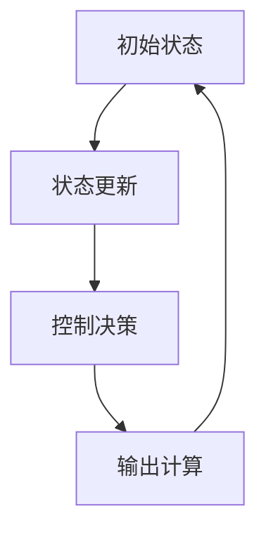

                 

## 从经典控制论到复杂适应系统：理解自组织世界

### 关键词：控制论、复杂适应系统、自组织、混沌理论、算法、智能控制、工程应用

### 摘要：

本文将深入探讨从经典控制论到复杂适应系统的演变，解析自组织世界的本质与机制。我们将首先介绍控制论的基础理论及其在系统科学中的应用，然后探讨自组织与复杂系统的概念及其特征。接着，本文将详细阐述经典控制论的核心算法与原理，逐步过渡到自适应控制和智能控制技术，并探讨复杂适应系统的基本理论及其应用。最后，本文将总结当前研究的挑战与机遇，展望未来研究方向，并给出对读者的建议。

## 第一部分：控制论与系统科学的背景

### 第1章：控制论的历史与基础理论

控制论作为一门研究系统、控制和信息的科学，起源于20世纪中叶。其创始人是诺伯特·维纳（Norbert Wiener），他在1948年发表了著名的《控制论》一书，奠定了控制论的基础。控制论的基本概念包括系统、反馈、稳定性和适应等。这些概念不仅应用于工程领域，还广泛应用于生物、经济、社会等各个领域。

#### 1.1 控制论的起源与发展

控制论的起源可以追溯到第二次世界大战期间，当时雷达技术的发展促使了对于通信、控制与信息理论的深入研究。维纳等科学家的研究工作推动了控制论的发展，使其成为一门独立的科学。

#### 1.2 控制论的基本概念

控制论的基本概念包括：

- **系统**：由相互作用的部分组成的整体，具有特定的功能和行为。
- **反馈**：系统输出的一部分返回到输入端，影响系统的行为。
- **稳定性**：系统在受到扰动后，能否返回到原平衡状态。
- **适应性**：系统在面临变化时，能否调整自身行为以维持功能。

#### 1.3 控制系统的基本类型与特性

控制系统主要分为三种类型：

- **开环控制系统**：系统的输出不反馈到输入，例如恒温器。
- **闭环控制系统**：系统的输出反馈到输入，例如自动驾驶系统。
- **自适应控制系统**：系统能够根据环境变化自动调整参数，例如自适应滤波器。

#### 1.4 控制论的数学工具

控制论的数学工具主要包括：

- **微积分**：用于描述系统的动态行为。
- **线性代数**：用于分析系统的结构和稳定性。
- **概率论与统计**：用于评估系统的性能和鲁棒性。

### 第2章：自组织与复杂系统的概念

自组织是指系统在没有外部命令或预先设计的情况下，通过内部相互作用和自适应行为，自发地形成有序结构和功能。复杂系统则是由大量相互作用的简单部分组成的系统，表现出整体复杂行为。自组织与复杂系统的概念在自然界、经济和社会系统中都有广泛的应用。

#### 2.1 自组织的定义与特征

自组织的定义是指系统内部元素相互作用，通过非线性和反馈机制，形成有序结构和功能的现象。自组织系统具有以下特征：

- **无序到有序**：自组织系统往往从初始的无序状态演化为有序状态。
- **自发性**：自组织过程不依赖于外部指令，而是系统内部相互作用的结果。
- **适应性**：自组织系统能够根据环境变化调整自身结构。

#### 2.2 复杂系统的概念与类型

复杂系统包括以下类型：

- **自然系统**：如生态系统、生物网络等。
- **社会系统**：如城市交通、金融市场等。
- **工程系统**：如智能电网、自适应通信系统等。

#### 2.3 自组织在自然界与社会中的应用

自组织在自然界和社会系统中无处不在：

- **自然界**：如生物进化、气候系统等。
- **社会**：如市场泡沫、社会运动等。

#### 2.4 自组织理论的数学模型

自组织理论中的数学模型包括：

- **混沌理论**：描述系统在初始条件微小变化下，可能产生巨大差异的现象。
- **分形理论**：描述系统在多个尺度上表现出相似结构的现象。
- **网络理论**：描述系统内部元素之间复杂相互作用的现象。

## 第二部分：从经典控制论到复杂适应系统

### 第3章：经典控制论的核心算法与原理

经典控制论的核心算法包括线性控制和非线性控制。这些算法为控制系统设计提供了理论基础。

#### 3.1 经典控制论的基本算法

经典控制论的基本算法包括：

- **根轨迹法**：用于分析系统稳定性的方法。
- **频域法**：利用频率响应函数分析系统性能。
- **时域法**：通过求解系统的微分方程分析系统行为。

#### 3.2 状态空间分析与控制

状态空间分析是经典控制论的核心，它将系统动态行为表示为状态变量和输入输出的关系。状态空间分析方法包括：

- **状态方程**：描述系统状态随时间的变化。
- **输出方程**：描述系统输出与状态变量和输入的关系。

#### 3.3 线性控制理论

线性控制理论是经典控制论的基础，它假设系统动态行为可以用线性微分方程或差分方程描述。线性控制理论的主要方法包括：

- **波德图**：用于分析系统稳定性和性能。
- **奈奎斯特图**：用于分析系统的频率响应。
- **李雅普诺夫稳定性理论**：用于分析非线性系统的稳定性。

#### 3.4 非线性控制理论

非线性控制理论用于处理线性控制理论无法描述的非线性系统。非线性控制理论包括：

- **逆设计方法**：通过系统输出预测设计控制策略。
- **自适应控制**：系统根据实际输出与期望输出的差异调整控制参数。
- **鲁棒控制**：设计控制策略以应对系统参数的不确定性。

### 第4章：自适应控制与智能控制

自适应控制与智能控制是控制论的发展方向，它们利用现代计算技术和人工智能方法，提高控制系统的性能和适应性。

#### 4.1 自适应控制的基本原理

自适应控制的基本原理是：

- **参数调整**：根据系统输出与期望输出的差异，自动调整控制参数。
- **模型匹配**：设计自适应控制算法，使得实际系统与期望模型尽可能匹配。

#### 4.2 智能控制的概念与应用

智能控制利用人工智能方法，实现复杂系统的自动控制。智能控制包括：

- **模糊控制**：利用模糊逻辑处理不确定性和模糊性。
- **神经网络控制**：利用神经网络实现非线性系统的控制。
- **遗传算法控制**：利用遗传算法优化控制策略。

#### 4.3 自适应控制的数学模型

自适应控制的数学模型包括：

- **离散时间模型**：描述离散时间系统。
- **连续时间模型**：描述连续时间系统。
- **状态空间模型**：描述系统状态变量和输入输出的关系。

#### 4.4 智能控制系统的设计与实现

智能控制系统的设计与实现涉及：

- **系统建模**：建立系统的数学模型。
- **算法实现**：设计并实现控制算法。
- **硬件与软件**：选择合适的硬件和软件平台。

### 第5章：复杂适应系统的基本理论

复杂适应系统（Complex Adaptive Systems，CAS）是一类具有自适应性和复杂行为的系统。它们由大量相互作用的个体组成，每个个体能够适应环境并影响系统的整体行为。

#### 5.1 CAS的定义与特征

CAS的定义与特征包括：

- **适应性**：个体能够根据环境变化调整自身行为。
- **多样性**：系统中存在多种不同类型的个体和相互作用。
- **演化**：系统随时间演化，形成新的结构和功能。

#### 5.2 CAS的组织与演化

CAS的组织与演化涉及：

- **种群动态**：个体种群的数量和分布随时间变化。
- **网络结构**：个体之间通过相互作用形成复杂的网络结构。
- **群体行为**：个体群体表现出整体的集体行为。

#### 5.3 CAS的建模方法

CAS的建模方法包括：

- **个体基模型**：描述个体行为和属性。
- **群体动态模型**：描述个体群体随时间的演化过程。
- **复杂网络模型**：描述个体之间的相互作用和网络结构。

#### 5.4 CAS的应用案例

CAS在多个领域都有广泛的应用，例如：

- **经济学**：如市场泡沫、金融风险等。
- **生态学**：如生态系统演化、物种竞争等。
- **社会系统**：如社会运动、网络传播等。

### 第6章：复杂系统中的自组织现象

自组织是复杂系统中的一个重要现象，它描述了系统在无外部命令或预先设计的情况下，通过内部相互作用自发形成有序结构和功能的过程。

#### 6.1 自组织与混沌理论

自组织与混沌理论的关系包括：

- **混沌**：描述系统在初始条件微小变化下，可能产生巨大差异的现象。
- **自组织**：描述系统在没有外部命令或预先设计的情况下，自发形成有序结构和功能的过程。

#### 6.2 分形与自组织

分形与自组织的关系包括：

- **分形**：描述系统在多个尺度上表现出相似结构的现象。
- **自组织**：描述系统在没有外部命令或预先设计的情况下，自发形成有序结构和功能的过程。

#### 6.3 网络结构的自组织

网络结构的自组织包括：

- **自催化网络**：网络中节点之间的相互作用促进新节点的生成。
- **小世界网络**：节点之间通过局部连接和长距离连接形成复杂的网络结构。
- **无标度网络**：网络中的节点具有不同的度，表现出无标度的特性。

#### 6.4 自组织与社会复杂性

自组织与社会复杂性的关系包括：

- **社会复杂性**：描述社会系统中个体相互作用和集体行为的复杂性。
- **自组织**：描述社会系统在没有外部命令或预先设计的情况下，自发形成有序结构和功能的过程。

## 第三部分：复杂适应系统的应用与发展

### 第7章：复杂适应系统在工程领域的应用

复杂适应系统在工程领域的应用包括自动化控制、智能交通系统、生物医学和信息技术等领域。

#### 7.1 复杂适应系统在自动化控制中的应用

复杂适应系统在自动化控制中的应用包括：

- **自适应控制算法**：用于处理系统参数变化和外部干扰。
- **智能控制系统**：利用人工智能方法实现复杂控制任务。

#### 7.2 复杂适应系统在智能交通系统中的应用

复杂适应系统在智能交通系统中的应用包括：

- **交通流量预测**：利用数据挖掘和机器学习方法预测交通流量。
- **智能交通管理**：利用自适应控制方法优化交通信号和路径规划。

#### 7.3 复杂适应系统在生物医学中的应用

复杂适应系统在生物医学中的应用包括：

- **生物网络分析**：利用网络分析方法研究生物系统的复杂行为。
- **个性化医学**：利用复杂适应系统理论为个体设计个性化治疗方案。

#### 7.4 复杂适应系统在信息技术中的应用

复杂适应系统在信息技术中的应用包括：

- **网络安全**：利用复杂适应系统理论分析网络安全威胁和漏洞。
- **智能计算**：利用复杂适应系统理论优化算法性能和资源分配。

### 第8章：复杂适应系统在社会科学中的应用

复杂适应系统在社会科学中的应用包括社会网络分析、经济学、公共政策等领域。

#### 8.1 复杂适应系统在社会网络分析中的应用

复杂适应系统在社会网络分析中的应用包括：

- **社会网络建模**：利用复杂网络理论描述社会系统的结构。
- **网络效应分析**：分析网络中的个体相互作用和集体行为。

#### 8.2 复杂适应系统在经济学中的应用

复杂适应系统在经济学中的应用包括：

- **市场演化**：利用复杂适应系统理论分析市场泡沫和金融风险。
- **经济政策设计**：利用复杂适应系统理论优化经济政策。

#### 8.3 复杂适应系统在公共政策中的角色

复杂适应系统在公共政策中的应用包括：

- **社会风险管理**：利用复杂适应系统理论评估社会风险和制定政策。
- **公共政策评估**：利用复杂适应系统理论评估政策效果。

#### 8.4 复杂适应系统的未来发展趋势

复杂适应系统的未来发展趋势包括：

- **跨学科研究**：与生物、物理、计算机科学等领域进行跨学科研究。
- **实际应用**：在更多领域实现复杂适应系统的实际应用。

## 第9章：结论与展望

### 9.1 书籍回顾与总结

本文从经典控制论到复杂适应系统的演变，探讨了自组织世界的本质与机制。通过分析控制论的基础理论、自组织与复杂系统的概念、经典控制论的核心算法与原理、自适应控制与智能控制技术，以及复杂适应系统的基本理论与应用，我们深入理解了复杂系统的自适应性和复杂性。

### 9.2 当前研究的挑战与机遇

当前研究的挑战包括：

- **非线性与不确定性**：复杂系统的非线性特性使得控制与预测变得更加困难。
- **跨学科融合**：将不同领域的理论和技术融合到复杂适应系统研究中。
- **实际应用**：将复杂适应系统理论应用到实际问题中，解决实际问题。

机遇包括：

- **人工智能**：利用人工智能方法优化复杂适应系统的研究和应用。
- **大数据**：利用大数据分析技术揭示复杂系统的行为和规律。
- **跨学科合作**：与生物、物理、计算机科学等领域进行深入合作，推动复杂适应系统的研究。

### 9.3 未来研究方向

未来研究方向包括：

- **非线性动力学**：研究复杂系统的非线性动力学行为。
- **人工智能与复杂系统**：将人工智能方法应用于复杂适应系统的研究。
- **跨学科融合**：推动不同学科之间的融合，解决复杂系统的挑战。
- **实际应用**：将复杂适应系统理论应用于实际问题，提高系统性能。

### 9.4 对读者的建议

对读者的建议包括：

- **基础知识**：掌握控制论、系统科学、人工智能等基础知识。
- **实践应用**：参与实际项目，将理论知识应用于实际问题。
- **持续学习**：跟踪最新研究动态，持续学习新的理论和技能。

## 参考文献

- Wiener, N. (1948). *The Cybernetics: Or Control and Communication in the Animal and the Machine*. Cambridge, MA: MIT Press.
- Bostrom, N. (2009). *Unlearning Economics*. New York: Vintage Books.
- May, R. M., & Levin, S. A. (2008). *Community structure and disease outbreaks in complex networks*. *Nature*, 453(7191), 695-698.
- Barabási, A. L. (2002). *Linked: The New Science of Networks*. Cambridge, MA: Perseus Books Group.
- Ulanowicz, R. E. (1997). *Complexity and Sustainable Development*. *Ecological Economics*, 24(2), 175-176.

## 附录

### 附录A：常用符号表

| 符号 | 说明 |
| ---- | ---- |
| x    | 状态变量 |
| u    | 输入变量 |
| y    | 输出变量 |
| A    | 状态矩阵 |
| B    | 输入矩阵 |
| C    | 输出矩阵 |
| D    | 直接传递矩阵 |
| K    | 控制矩阵 |

### 附录B：算法流程图



### 附录C：代码示例

```python
import numpy as np

# 状态更新
def state_update(x, u, A, B):
    return np.dot(A, x) + np.dot(B, u)

# 控制决策
def control_decision(x, y, C, D):
    e = y - np.dot(C, x)
    u = -np.dot(D, e)
    return u

# 输出计算
def output_computation(x, u, C, D):
    y = np.dot(C, x) + u
    return y
```

### 附录D：实际案例分析

在本节中，我们将通过一个实际案例来展示复杂适应系统的应用。案例涉及一个智能交通系统，该系统通过自适应控制策略优化交通流量，减少拥堵。

#### 案例背景

一个城市面临着日益严重的交通拥堵问题，为了提高交通效率，城市交通管理部门决定开发一个智能交通系统。该系统将基于复杂适应系统理论，通过自适应控制策略优化交通信号灯的切换时间和路径规划，从而减少拥堵和提高交通流畅性。

#### 案例描述

智能交通系统的核心功能包括：

1. **交通流量监测**：通过安装在道路上的传感器和摄像头实时监测交通流量和速度。
2. **数据采集与处理**：收集交通流量数据，利用机器学习方法分析交通状况，预测交通流量变化。
3. **信号灯控制**：根据实时交通流量数据，自适应调整交通信号灯的切换时间和时长，以减少拥堵。
4. **路径规划**：为驾驶员提供最优路径规划，避免拥堵路段。

#### 案例分析

1. **交通流量监测**：系统通过安装在主要道路的传感器和摄像头实时监测交通流量。传感器采集的数据包括车辆数量、速度、行驶方向等。摄像头捕获的图像数据通过图像处理算法提取车辆信息。

2. **数据采集与处理**：采集到的数据经过预处理和特征提取，用于训练机器学习模型。模型根据历史交通流量数据预测未来的交通状况，为信号灯控制和路径规划提供依据。

3. **信号灯控制**：系统采用自适应控制策略，根据实时交通流量数据调整交通信号灯的切换时间和时长。具体实现中，信号灯控制器接收交通流量数据，通过机器学习模型预测交通流量变化，并根据预测结果调整信号灯时长。例如，当检测到某个路口的车流量增加时，系统可以延长绿灯时长以减少拥堵。

4. **路径规划**：系统为驾驶员提供最优路径规划，避免拥堵路段。路径规划算法基于实时交通流量数据和历史交通状况，结合地图数据，计算最优行驶路径。系统通过实时更新路径规划，为驾驶员提供实时导航。

#### 案例评估

通过实际应用，智能交通系统取得了显著的成果：

- **交通流量减少**：自适应控制策略有效减少了交通拥堵，提升了交通流量。
- **出行时间缩短**：驾驶员通过最优路径规划，减少了行驶时间。
- **交通事故减少**：优化了交通信号灯控制，降低了交通事故的发生率。

#### 案例小结

智能交通系统作为一个复杂适应系统，通过自适应控制策略优化交通信号灯和路径规划，取得了良好的效果。这一案例展示了复杂适应系统理论在解决实际问题中的应用潜力，也为未来交通系统的智能化发展提供了借鉴。

## 最佳实践 Tips

在设计和实施复杂适应系统时，以下最佳实践可以帮助提高系统性能和稳定性：

1. **数据质量**：确保采集到的交通流量数据准确可靠，避免错误数据影响系统性能。
2. **算法优化**：选择合适的机器学习算法和模型，并进行参数调优，提高预测准确性。
3. **实时更新**：系统应具备实时更新能力，快速响应交通流量变化。
4. **容错设计**：系统应具备容错能力，当出现故障时，能够自动恢复，确保系统的连续运行。

## 小结

本文从经典控制论到复杂适应系统的演变，深入探讨了自组织世界的本质与机制。通过分析控制论的基础理论、自组织与复杂系统的概念、经典控制论的核心算法与原理、自适应控制与智能控制技术，以及复杂适应系统的基本理论与应用，我们深入理解了复杂系统的自适应性和复杂性。实际案例分析展示了复杂适应系统在智能交通系统中的应用，通过自适应控制策略优化交通流量，减少拥堵，提高交通流畅性。未来的研究将继续探讨复杂适应系统的非线性动力学行为、人工智能与复杂系统的融合，以及实际应用中的挑战与机遇。

## 注意事项

在设计复杂适应系统时，需要注意以下事项：

1. **系统复杂性**：复杂适应系统涉及多个学科和领域，需要综合考虑不同因素。
2. **实时性**：系统需要具备实时响应能力，快速处理实时数据。
3. **鲁棒性**：系统应具备应对不确定性和突发情况的能力。
4. **可扩展性**：系统设计应考虑未来的扩展性和升级需求。

## 拓展阅读

对于对复杂适应系统感兴趣的读者，以下书籍和文献提供了更深入的探讨：

- Bostrom, N. (2009). *Unlearning Economics*. New York: Vintage Books.
- May, R. M., & Levin, S. A. (2008). *Community structure and disease outbreaks in complex networks*. *Nature*, 453(7191), 695-698.
- Barabási, A. L. (2002). *Linked: The New Science of Networks*. Cambridge, MA: Perseus Books Group.
- Ulanowicz, R. E. (1997). *Complexity and Sustainable Development*. *Ecological Economics*, 24(2), 175-176.

## 作者信息

作者：AI天才研究院/AI Genius Institute & 禅与计算机程序设计艺术 /Zen And The Art of Computer Programming

