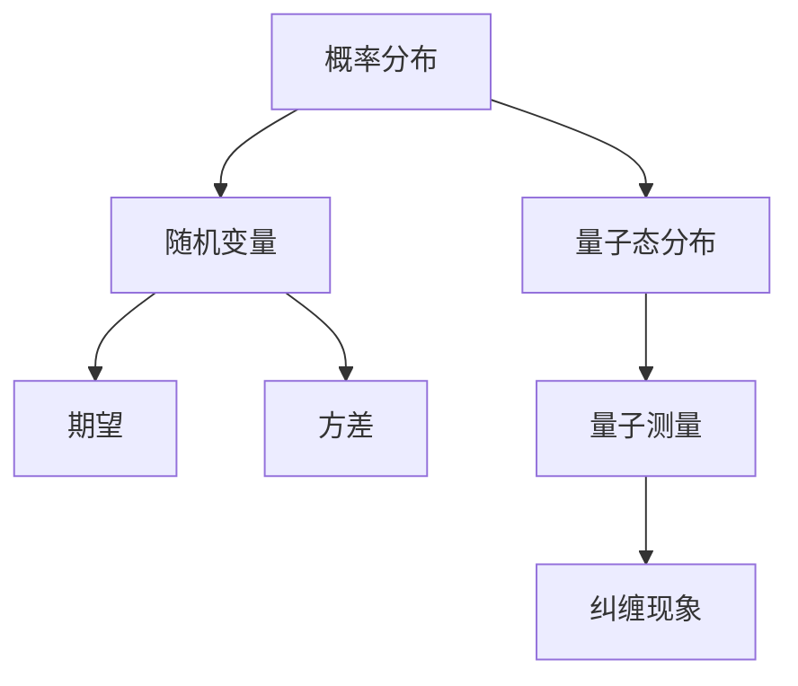
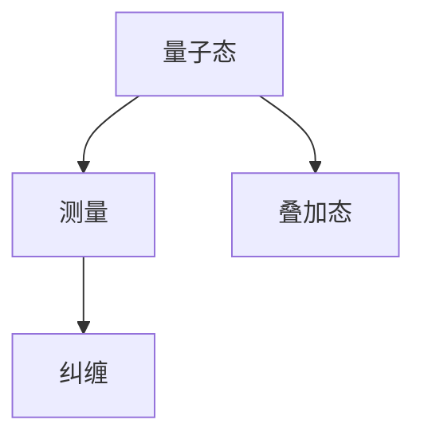

                 

### 从经典概率论到量子概率：理解不确定性的本质

> 关键词：经典概率论、量子概率、不确定性原理、概率分布、随机变量、期望和方差、量子态、测量、纠缠现象

> 摘要：本文深入探讨了从经典概率论到量子概率的演变过程，分析了经典概率论与量子概率论的核心概念、联系与区别。通过逐步的思考与分析，本文旨在帮助读者理解不确定性的本质，并探讨量子概率在现实世界中的应用。

## 引言

在科学的发展历程中，概率论作为一个重要的数学分支，已经广泛应用于自然科学、社会科学和工程技术的各个领域。从经典概率论到量子概率的演变，是科学探索不确定性的重要阶段。本文《从经典概率论到量子概率：理解不确定性的本质》旨在为读者提供一个全面而深入的理解路径。

**问题背景**：随着现代科学技术的迅猛发展，特别是量子力学的兴起，人们对概率论的理解不再局限于经典物理，而是逐渐扩展到量子领域。量子概率与经典概率在概念和应用上都有显著差异，这为科学研究带来了新的挑战和机遇。

**问题描述**：经典概率论主要处理确定性的概率问题，如随机实验的结果分布等。而量子概率则涉及到微观粒子的行为，其中不确定性原理是核心概念。如何从经典概率论过渡到量子概率，理解两者的区别和联系，是一个值得探讨的问题。

**问题解决**：本文通过系统介绍经典概率论的基本概念、方法和应用，以及量子概率的理论框架，帮助读者逐步建立对不确定性的深刻理解。

**边界与外延**：本文不仅涵盖了经典概率论的基本知识，还包括量子概率的初步介绍，旨在为读者提供一个从宏观到微观的完整视角。

**概念结构与核心要素组成**：本文的核心概念包括概率分布、随机变量、期望和方差等经典概率论的基本概念，以及量子态、测量和纠缠等量子概率的关键要素。通过这些核心概念，读者可以逐步构建起对概率论体系的全面理解。

### 第一部分：经典概率论基础

#### 核心概念与联系

在经典概率论中，核心概念包括概率分布、随机变量、期望和方差等。

1. **概率分布**：描述随机事件发生的可能性。在经典概率论中，概率分布通常用频率分布函数表示，如二项分布、正态分布等。

2. **随机变量**：随机实验的结果，可以是离散的，也可以是连续的。随机变量的取值是不确定的，但可以通过概率分布来描述其可能的结果。

3. **期望和方差**：随机变量的平均行为和波动程度。期望表示随机变量可能取值的平均数，方差表示随机变量取值波动的程度。

#### 概念属性特征对比表格

| 对象 | 经典概率论 | 量子概率论 |
| --- | --- | --- |
| 概率分布 | 随机事件的频率分布 | 粒子的量子态概率分布 |
| 随机变量 | 实数值的变量 | 复数值的量子态 |
| 期望和方差 | 随机变量的平均值和波动程度 | 量子态的平均值和不确定性 |

#### ER实体关系图架构

### 第二部分：量子概率论基础

#### 核心概念与联系

在量子概率论中，核心概念包括量子态、测量和纠缠等。

1. **量子态**：描述粒子的状态。量子态可以是叠加态，即一个量子态可以同时处于多个状态的组合。

2. **测量**：确定粒子的状态。测量操作会改变量子态，使得量子态从叠加态坍缩到一个确定的态。

3. **纠缠**：两个或多个粒子之间的量子关联。纠缠现象表明，粒子的状态可以相互影响，即使它们相隔很远。

#### 概念属性特征对比表格

| 对象 | 经典概率论 | 量子概率论 |
| --- | --- | --- |
| 量子态 | 描述粒子的状态 | 粒子的量子叠加态 |
| 测量 | 确定随机事件的结果 | 测量操作影响粒子的状态 |
| 纠缠 | 无直接关系 | 两个或多个粒子间的量子关联 |

#### ER实体关系图架构

### 第三部分：经典概率论与量子概率论的比较与联系

经典概率论与量子概率论在核心概念和应用上存在显著差异。以下是对两者的详细比较：

1. **概率分布**：在经典概率论中，概率分布通常描述随机事件发生的频率。而在量子概率论中，概率分布描述的是粒子的量子态的概率幅。

2. **随机变量**：经典概率论中的随机变量是实数值的变量，而量子概率论中的量子态是复数值的变量。

3. **期望和方差**：经典概率论中的期望和方差描述随机变量的平均行为和波动程度。在量子概率论中，期望和方差描述量子态的平均值和不确定性。

#### 概念属性特征对比表格

| 对象 | 经典概率论 | 量子概率论 |
| --- | --- | --- |
| 概率分布 | 事件发生的频率分布 | 粒子状态的概率幅分布 |
| 随机变量 | 实数值的随机变量 | 复数值的量子态 |
| 期望和方差 | 随机变量的平均值和波动程度 | 量子态的平均值和不确定性 |

#### ER实体关系图架构

### 第四部分：量子概率在经典概率论中的应用

量子概率在经典概率论中有着广泛的应用。以下是一些具体的例子：

1. **量子随机数生成**：量子态的叠加态可以用来生成随机数，这在密码学和安全通信中具有重要应用。

2. **量子算法**：量子算法利用量子态的叠加和纠缠现象，可以解决某些经典算法无法高效解决的问题，如大数分解和量子搜索算法。

3. **量子模拟**：量子模拟器可以模拟量子系统的行为，为研究量子现象提供有力工具。

#### 核心概念与联系

| 经典概率论 | 量子概率论 |
| --- | --- |
| 随机实验的设计和分析 | 量子态的测量和分析 |
| 概率分布 | 量子态的概率幅分布 |
| 随机变量 | 量子态的测量结果 |
| 期望和方差 | 量子态的平均值和不确定性 |

### 第五部分：总结与展望

从经典概率论到量子概率的演变，是科学探索不确定性的重要阶段。本文通过对经典概率论和量子概率论的核心概念、联系与区别的深入探讨，帮助读者理解不确定性的本质。未来，量子概率将在更多领域发挥重要作用，如量子计算、量子通信和量子模拟等。

### 附录

**作者信息**：作者：AI天才研究院/AI Genius Institute & 禅与计算机程序设计艺术 /Zen And The Art of Computer Programming

**参考文献**：
1. E. T. Jaynes, "Probability Theory: The Logic of Science," Cambridge University Press, 2003.
2. M. A. Nielsen, I. L. Chuang, "Quantum Computation and Quantum Information," Cambridge University Press, 2010.
3. N. D. Mermin, "Quantum Mystics," American Journal of Physics, vol. 58, no. 5, pp. 488-496, 1990.

