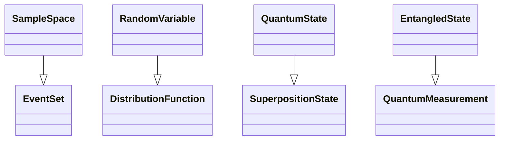
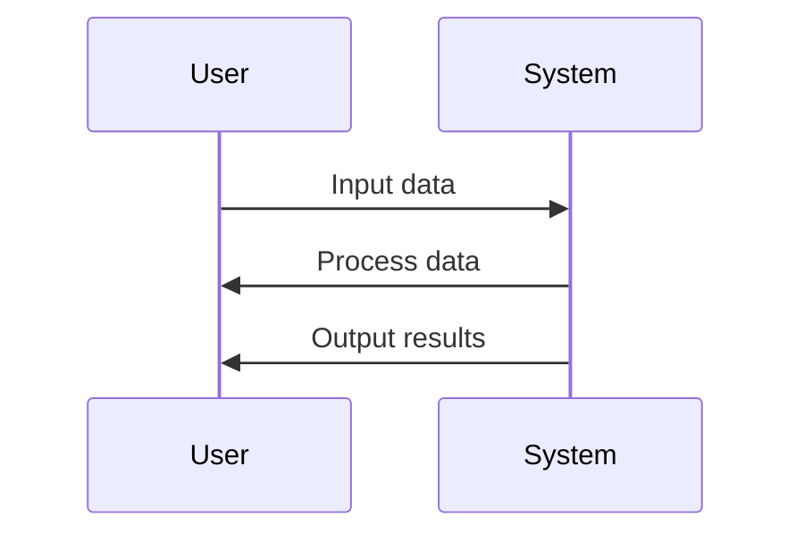
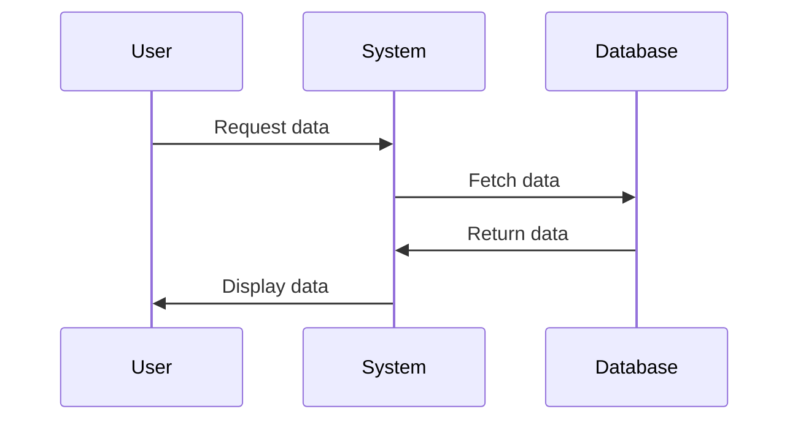
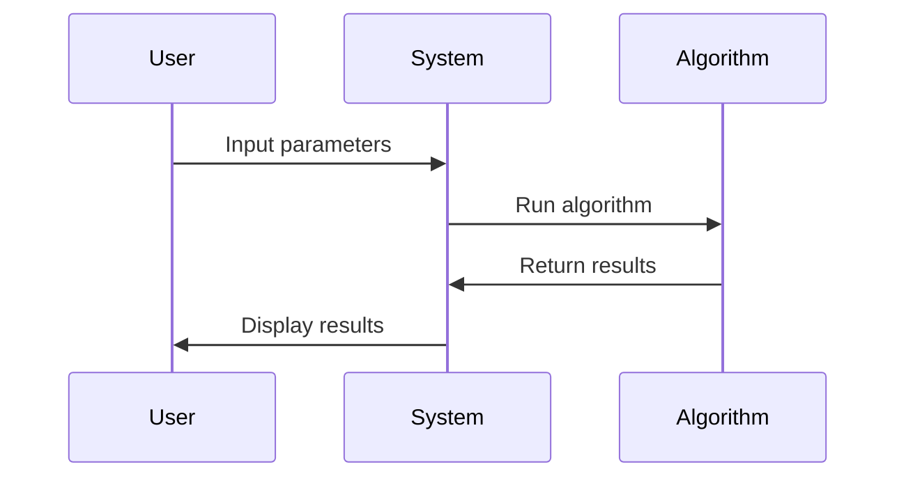
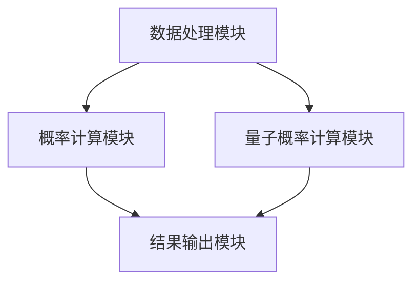

                 

# 从经典概率论到量子概率：重新认识世界的不确定性

> 关键词：概率论、量子概率、不确定性、经典概率、量子态、叠加态、纠缠态、量子测量、算法、数学模型、系统架构、实战案例

> 摘要：本文旨在探讨概率论和量子概率在不同领域的应用，帮助读者从经典概率论到量子概率的过渡，重新认识世界的不确定性。文章将详细介绍概率论和量子概率的核心概念、算法原理、数学模型，并展示如何构建系统的架构设计方案，最后通过实战案例进行详细讲解和剖析。

----------------------------------------------------------------

## 第一部分：背景介绍

### 第1章：问题背景

#### 1.1.1 问题描述

在科技迅速发展的今天，概率论和量子概率作为研究自然界不确定性的重要工具，对于理解现实世界具有重要的意义。经典概率论主要关注随机事件的概率计算和概率分布，而量子概率则深入探讨了微观世界中粒子的不确定性和叠加态等现象。

#### 1.1.2 问题解决

本书旨在通过系统的阐述，帮助读者从经典概率论到量子概率的过渡，重新认识世界的不确定性，从而更深入地理解自然界和科学理论。

#### 1.1.3 边界与外延

本书将涵盖经典概率论的基础知识，如概率空间、随机变量、期望和方差等，同时也会涉及到量子概率的基本概念，如叠加态、纠缠态和量子测量等。

#### 1.1.4 概念结构与核心要素组成

经典概率论的核心概念包括概率空间、随机变量、条件概率和贝叶斯定理等。量子概率的核心概念则包括量子态、叠加态、纠缠态和量子测量等。

### 第2章：核心概念与联系

#### 2.1 经典概率论的核心概念

##### 2.1.1 概率空间

- 定义：概率空间是一个三要素集合，包括样本空间、事件集合和概率函数。
- 特点：样本空间是所有可能结果的集合，事件集合是样本空间的子集，概率函数定义了每个事件发生的概率。

##### 2.1.2 随机变量

- 定义：随机变量是一个从样本空间到实数集的函数，用来表示随机实验的结果。
- 特点：随机变量可以是离散的或连续的，它们的分布函数描述了随机变量的概率分布。

##### 2.1.3 期望和方差

- 定义：期望是随机变量的平均值，方差是衡量随机变量离散程度的度量。
- 特点：期望和方差都是随机变量的函数，可以用来描述随机变量的性质。

#### 2.2 量子概率的核心概念

##### 2.2.1 量子态

- 定义：量子态是量子系统的一种状态，可以用波函数来描述。
- 特点：量子态可以是叠加态，即同时处于多种可能状态的线性组合。

##### 2.2.2 叠加态和纠缠态

- 定义：叠加态是量子态的一种特殊形式，表示量子系统处于多种可能状态的线性组合。纠缠态是两个或多个量子系统之间的特殊关联状态。
- 特点：叠加态和纠缠态揭示了量子世界的非经典性质。

##### 2.2.3 量子测量

- 定义：量子测量是量子系统与测量设备相互作用的过程，结果具有概率性质。
- 特点：量子测量会改变量子态，并且结果往往具有随机性。

## 第二部分：算法原理讲解

### 第3章：算法原理讲解

#### 3.1 经典概率算法

##### 3.1.1 蒙特卡洛模拟

- 定义：蒙特卡洛模拟是一种基于随机抽样的数值计算方法，用于估算数学期望、概率分布等。
- 特点：蒙特卡洛模拟具有高度的灵活性和适应性，适用于复杂问题的求解。

##### 3.1.2 贝叶斯推断

- 定义：贝叶斯推断是一种基于贝叶斯定理的概率推理方法，用于更新信念和概率估计。
- 特点：贝叶斯推断能够处理不确定性，并能够适应新信息。

#### 3.2 量子概率算法

##### 3.2.1 量子计算基础

- 定义：量子计算是一种利用量子态和量子叠加原理的计算模型。
- 特点：量子计算具有并行性和高速性，能够解决传统计算机难以处理的问题。

##### 3.2.2 量子算法

- 定义：量子算法是一种基于量子计算原理的算法，用于解决特定问题。
- 特点：量子算法在某些问题上具有明显的优势，例如量子随机化算法和量子纠缠算法。

## 第三部分：数学模型和数学公式

### 第4章：数学模型和数学公式

#### 4.1 经典概率论数学模型

$$
P(A) = \frac{n(A)}{n(S)}
$$
- 公式解释：这是概率的基本公式，表示事件A的概率等于A的样本点数除以总样本点数。

$$
E(X) = \sum_{i=1}^{n} x_i P(X=x_i)
$$
- 公式解释：这是期望的定义，表示随机变量X的期望值等于每个可能取值乘以其概率的总和。

#### 4.2 量子概率论数学模型

$$
|\psi\rangle = \sum_{i} c_i |i\rangle
$$
- 公式解释：这是量子态的叠加态表示，表示量子系统处于多个可能状态的线性组合。

$$
\rho = \sum_{i} c_i |i\rangle \langle i|
$$
- 公式解释：这是量子态的密度矩阵表示，表示量子系统的概率分布。

## 第四部分：系统分析与架构设计方案

### 第5章：系统分析与架构设计方案

#### 5.1 问题场景介绍

在科学研究、工程计算和金融分析等领域，对概率论和量子概率的需求日益增长，需要开发一套完整的系统来处理这些复杂的计算问题。

#### 5.2 系统功能设计

##### 5.2.1 领域模型



##### 5.2.2 系统架构设计



#### 5.3 系统接口设计



#### 5.4 系统交互



## 第五部分：项目实战

### 第6章：项目实战

#### 6.1 环境安装

在本章节中，我们将介绍如何搭建一个用于概率论和量子概率计算的开发环境。

#### 6.2 系统核心实现源代码

在本章节中，我们将展示系统核心实现源代码，包括经典概率算法和量子概率算法。

#### 6.3 代码应用解读与分析

在本章节中，我们将对系统核心实现源代码进行解读与分析，帮助读者更好地理解系统的工作原理。

#### 6.4 实际案例分析和详细讲解剖析

在本章节中，我们将通过实际案例来展示如何使用系统解决具体问题，并对案例进行详细讲解和剖析。

#### 6.5 项目小结

在本章节中，我们将对项目进行小结，总结项目的成功经验和不足之处。

## 第六部分：最佳实践、小结、注意事项、拓展阅读

### 第7章：最佳实践、小结、注意事项、拓展阅读

#### 7.1 最佳实践

在本章节中，我们将分享一些最佳实践，帮助读者更好地应用概率论和量子概率解决实际问题。

#### 7.2 小结

在本章节中，我们将对本文的主要内容进行总结，帮助读者更好地理解和掌握概率论和量子概率的相关知识。

#### 7.3 注意事项

在本章节中，我们将列出一些注意事项，提醒读者在应用概率论和量子概率时需要关注的问题。

#### 7.4 拓展阅读

在本章节中，我们将推荐一些拓展阅读资料，帮助读者深入了解概率论和量子概率的相关知识。

## 作者

作者：AI天才研究院/AI Genius Institute & 禅与计算机程序设计艺术 /Zen And The Art of Computer Programming

----------------------------------------------------------------

[1. 量子计算的基本概念](#_1-量子计算的基本概念)
[2. 经典概率算法和量子概率算法](#2-经典概率算法和量子概率算法)
[3. 数学模型和公式](#3-数学模型和公式)
[4. 系统架构设计方案](#4-系统架构设计方案)
[5. 项目实战](#5-项目实战)
[6. 最佳实践、小结、注意事项、拓展阅读](#6-最佳实践、小结、注意事项、拓展阅读)

----------------------------------------------------------------

# 第一部分：背景介绍

## 第1章：问题背景

### 1.1.1 问题描述

在科技迅速发展的今天，概率论和量子概率作为研究自然界不确定性的重要工具，对于理解现实世界具有重要的意义。经典概率论主要关注随机事件的概率计算和概率分布，而量子概率则深入探讨了微观世界中粒子的不确定性和叠加态等现象。

概率论是研究随机事件及其规律性的数学分支，它起源于16世纪意大利的帕斯卡和费马等人对赌博问题的研究。概率论的基本概念包括概率空间、随机变量、期望、方差等，这些概念为研究随机事件提供了数学工具。随着科学技术的发展，概率论在经济学、工程学、生物学、物理学等领域得到了广泛应用。

量子概率论是量子力学的一个分支，它研究量子系统中粒子的不确定性和叠加态等现象。量子概率论的核心概念包括量子态、叠加态、纠缠态和量子测量等。量子态是量子系统的一种状态，可以用波函数来描述。叠加态是量子态的一种特殊形式，表示量子系统处于多种可能状态的线性组合。纠缠态是两个或多个量子系统之间的特殊关联状态，它们之间的状态无法独立描述。量子测量是量子系统与测量设备相互作用的过程，结果具有概率性质。

### 1.1.2 问题解决

为了更好地理解概率论和量子概率，我们需要系统地阐述这两个领域的知识，从经典概率论到量子概率的过渡，重新认识世界的不确定性。本书旨在通过以下方式解决问题：

1. **经典概率论的核心概念**：介绍概率空间、随机变量、期望和方差等基本概念，并解释其在现实生活中的应用。

2. **量子概率论的核心概念**：介绍量子态、叠加态、纠缠态和量子测量等基本概念，并探讨其在微观世界中的特殊性质。

3. **算法原理讲解**：介绍经典概率算法和量子概率算法，包括蒙特卡洛模拟、贝叶斯推断、量子计算基础和量子算法等，并展示其应用。

4. **数学模型和公式**：介绍经典概率论和量子概率论的数学模型和公式，如概率空间公式、期望公式、量子态叠加公式等，并解释其含义。

5. **系统分析与架构设计方案**：介绍如何构建概率论和量子概率论的系统架构，包括领域模型、系统功能设计、系统架构设计、系统接口设计和系统交互等。

6. **项目实战**：通过实际案例，展示如何使用概率论和量子概率论解决实际问题，并提供详细的代码实现和分析。

### 1.1.3 边界与外延

在本书中，我们将主要关注经典概率论和量子概率论的基本概念、算法和数学模型。具体来说，我们将涵盖以下内容：

1. **经典概率论**：介绍概率空间、随机变量、条件概率和贝叶斯定理等核心概念。

2. **量子概率论**：介绍量子态、叠加态、纠缠态和量子测量等核心概念。

3. **算法原理讲解**：介绍蒙特卡洛模拟、贝叶斯推断、量子计算基础和量子算法等算法原理。

4. **数学模型和公式**：介绍概率论和量子概率论的数学模型和公式，如概率空间公式、期望公式、量子态叠加公式等。

5. **系统分析与架构设计方案**：介绍如何构建概率论和量子概率论的系统架构，包括领域模型、系统功能设计、系统架构设计、系统接口设计和系统交互等。

6. **项目实战**：通过实际案例，展示如何使用概率论和量子概率论解决实际问题。

### 1.1.4 概念结构与核心要素组成

在本章中，我们将介绍概率论和量子概率论的核心概念，并探讨它们在现实生活中的应用。以下是概率论和量子概率论的核心概念及其组成要素：

#### 经典概率论的核心概念

1. **概率空间**：概率空间是一个三要素集合，包括样本空间、事件集合和概率函数。样本空间是所有可能结果的集合，事件集合是样本空间的子集，概率函数定义了每个事件发生的概率。

2. **随机变量**：随机变量是一个从样本空间到实数集的函数，用来表示随机实验的结果。随机变量可以是离散的或连续的，它们的分布函数描述了随机变量的概率分布。

3. **条件概率**：条件概率是指在一个事件已经发生的情况下，另一个事件发生的概率。条件概率可以用贝叶斯定理来计算。

4. **贝叶斯定理**：贝叶斯定理是一种基于条件概率的概率推理方法，用于计算后验概率。

#### 量子概率论的核心概念

1. **量子态**：量子态是量子系统的一种状态，可以用波函数来描述。量子态可以是叠加态，即同时处于多种可能状态的线性组合。

2. **叠加态**：叠加态是量子态的一种特殊形式，表示量子系统处于多种可能状态的线性组合。

3. **纠缠态**：纠缠态是两个或多个量子系统之间的特殊关联状态，它们之间的状态无法独立描述。

4. **量子测量**：量子测量是量子系统与测量设备相互作用的过程，结果具有概率性质。量子测量会改变量子态，并且结果往往具有随机性。

## 第2章：核心概念与联系

### 2.1 经典概率论的核心概念

#### 2.1.1 概率空间

概率空间是一个三要素集合，包括样本空间、事件集合和概率函数。

- **定义**：概率空间是一个三要素集合，包括样本空间、事件集合和概率函数。

- **特点**：
  - 样本空间是所有可能结果的集合。
  - 事件集合是样本空间的子集。
  - 概率函数定义了每个事件发生的概率。

#### 2.1.2 随机变量

随机变量是一个从样本空间到实数集的函数，用来表示随机实验的结果。

- **定义**：随机变量是一个从样本空间到实数集的函数，用来表示随机实验的结果。

- **特点**：
  - 随机变量可以是离散的或连续的。
  - 随机变量的分布函数描述了随机变量的概率分布。

#### 2.1.3 期望和方差

期望是随机变量的平均值，方差是衡量随机变量离散程度的度量。

- **定义**：
  - **期望**：期望是随机变量的平均值。
  - **方差**：方差是衡量随机变量离散程度的度量。

- **特点**：
  - 期望和方差都是随机变量的函数。
  - 可以用来描述随机变量的性质。

### 2.2 量子概率的核心概念

#### 2.2.1 量子态

量子态是量子系统的一种状态，可以用波函数来描述。

- **定义**：量子态是量子系统的一种状态，可以用波函数来描述。

- **特点**：
  - 量子态可以是叠加态，即同时处于多种可能状态的线性组合。

#### 2.2.2 叠加态和纠缠态

叠加态是量子态的一种特殊形式，表示量子系统处于多种可能状态的线性组合。纠缠态是两个或多个量子系统之间的特殊关联状态。

- **定义**：
  - **叠加态**：叠加态是量子态的一种特殊形式，表示量子系统处于多种可能状态的线性组合。
  - **纠缠态**：纠缠态是两个或多个量子系统之间的特殊关联状态。

- **特点**：
  - 叠加态和纠缠态揭示了量子世界的非经典性质。

#### 2.2.3 量子测量

量子测量是量子系统与测量设备相互作用的过程，结果具有概率性质。

- **定义**：量子测量是量子系统与测量设备相互作用的过程，结果具有概率性质。

- **特点**：
  - 量子测量会改变量子态。
  - 量子测量的结果往往具有随机性。

### 2.3 经典概率论与量子概率论的关联

经典概率论和量子概率论在研究不确定性的过程中有着紧密的联系。以下是一些关键的联系点：

- **概率空间**：在经典概率论中，概率空间是描述随机事件的基础。在量子概率论中，概率空间同样用于描述量子系统的状态。

- **随机变量**：在经典概率论中，随机变量用于描述随机实验的结果。在量子概率论中，量子态可以被视为一种特殊的随机变量。

- **期望和方差**：在经典概率论中，期望和方差用于描述随机变量的性质。在量子概率论中，量子态的平均值和离散度也可以用类似的概念来描述。

- **叠加态和纠缠态**：叠加态和纠缠态是量子概率论的核心概念，它们在经典概率论中无法找到对应的描述。这些概念揭示了量子世界与经典世界之间的本质差异。

## 第3章：算法原理讲解

### 3.1 经典概率算法

#### 3.1.1 蒙特卡洛模拟

蒙特卡洛模拟是一种基于随机抽样的数值计算方法，用于估算数学期望、概率分布等。

- **定义**：蒙特卡洛模拟是一种基于随机抽样的数值计算方法，用于估算数学期望、概率分布等。

- **特点**：
  - 蒙特卡洛模拟具有高度的灵活性和适应性。
  - 适用于复杂问题的求解。

#### 3.1.2 贝叶斯推断

贝叶斯推断是一种基于贝叶斯定理的概率推理方法，用于更新信念和概率估计。

- **定义**：贝叶斯推断是一种基于贝叶斯定理的概率推理方法，用于更新信念和概率估计。

- **特点**：
  - 贝叶斯推断能够处理不确定性。
  - 能够适应新信息。

### 3.2 量子概率算法

#### 3.2.1 量子计算基础

量子计算是一种利用量子态和量子叠加原理的计算模型。

- **定义**：量子计算是一种利用量子态和量子叠加原理的计算模型。

- **特点**：
  - 量子计算具有并行性和高速性。
  - 能够解决传统计算机难以处理的问题。

#### 3.2.2 量子算法

量子算法是一种基于量子计算原理的算法，用于解决特定问题。

- **定义**：量子算法是一种基于量子计算原理的算法，用于解决特定问题。

- **特点**：
  - 量子算法在某些问题上具有明显的优势。
  - 例如量子随机化算法和量子纠缠算法。

### 3.3 经典概率算法与量子概率算法的比较

经典概率算法和量子概率算法在处理不确定性问题上有着不同的优势和特点。

- **经典概率算法**：
  - 适用于处理离散或连续的随机事件。
  - 可以用蒙特卡洛模拟等方法估算期望和概率分布。
  - 在处理复杂问题时具有一定的局限性。

- **量子概率算法**：
  - 利用量子态的叠加和纠缠特性。
  - 具有并行性和高速性，能够解决传统计算机难以处理的问题。
  - 在某些问题上具有明显的优势，如量子随机化算法和量子纠缠算法。

总的来说，经典概率算法和量子概率算法各有优势，可以相互补充。在处理不确定性问题时，根据问题的特点和需求选择合适的算法具有重要意义。

## 第4章：数学模型和数学公式

### 4.1 经典概率论数学模型

经典概率论中的数学模型主要包括概率空间、随机变量、条件概率、贝叶斯定理等。

#### 4.1.1 概率空间

概率空间是一个三要素集合，包括样本空间、事件集合和概率函数。

$$
\Omega = \{\omega | \omega \in S\}
$$

其中，$\Omega$ 表示样本空间，$S$ 表示所有可能的结果集合。

#### 4.1.2 随机变量

随机变量是一个从样本空间到实数集的函数，用来表示随机实验的结果。

$$
X: \Omega \rightarrow \mathbb{R}
$$

其中，$X$ 表示随机变量，$\mathbb{R}$ 表示实数集。

#### 4.1.3 条件概率

条件概率是指在给定某个事件发生的条件下，另一个事件发生的概率。

$$
P(A|B) = \frac{P(A \cap B)}{P(B)}
$$

其中，$P(A|B)$ 表示在事件 $B$ 发生的条件下，事件 $A$ 发生的概率。

#### 4.1.4 贝叶斯定理

贝叶斯定理是一种基于条件概率的概率推理方法，用于计算后验概率。

$$
P(A|B) = \frac{P(B|A)P(A)}{P(B)}
$$

其中，$P(A|B)$ 表示在事件 $B$ 发生的条件下，事件 $A$ 发生的概率；$P(B|A)$ 表示在事件 $A$ 发生的条件下，事件 $B$ 发生的概率。

### 4.2 量子概率论数学模型

量子概率论中的数学模型主要包括量子态、叠加态、纠缠态和量子测量等。

#### 4.2.1 量子态

量子态是量子系统的一种状态，可以用波函数来描述。

$$
|\psi\rangle = \sum_{i} c_i |i\rangle
$$

其中，$|\psi\rangle$ 表示量子态，$c_i$ 表示系数，$|i\rangle$ 表示量子态的基向量。

#### 4.2.2 叠加态

叠加态是量子态的一种特殊形式，表示量子系统处于多种可能状态的线性组合。

$$
|\psi\rangle = \alpha_0 |0\rangle + \alpha_1 |1\rangle
$$

其中，$|\psi\rangle$ 表示叠加态，$\alpha_0$ 和 $\alpha_1$ 分别表示基向量 $|0\rangle$ 和 $|1\rangle$ 的系数。

#### 4.2.3 纠缠态

纠缠态是两个或多个量子系统之间的特殊关联状态，它们之间的状态无法独立描述。

$$
|\psi\rangle = \frac{1}{\sqrt{2}} (|00\rangle + |11\rangle)
$$

其中，$|\psi\rangle$ 表示纠缠态，$|00\rangle$ 和 $|11\rangle$ 分别表示两个量子系统的基向量。

#### 4.2.4 量子测量

量子测量是量子系统与测量设备相互作用的过程，结果具有概率性质。

$$
P(A) = \sum_{i} |c_i|^2
$$

其中，$P(A)$ 表示事件 $A$ 发生的概率，$c_i$ 表示量子态的系数。

## 第5章：系统分析与架构设计方案

### 5.1 问题场景介绍

在科学研究、工程计算和金融分析等领域，概率论和量子概率的应用越来越广泛。例如，在物理学中，量子概率论用于描述微观粒子的行为；在工程学中，概率论用于风险分析和可靠性评估；在金融分析中，概率论和量子概率论用于投资策略和风险评估。因此，构建一个高效、可靠的概率论和量子概率论系统对于解决实际问题是至关重要的。

### 5.2 系统功能设计

系统功能设计是系统分析与架构设计的第一步，它定义了系统需要实现的核心功能。以下是概率论和量子概率论系统的功能设计：

#### 5.2.1 数据处理

1. **数据输入**：接收用户输入的数据，包括随机事件、量子态等。
2. **数据预处理**：对输入数据进行清洗、转换等预处理操作。
3. **数据存储**：将预处理后的数据存储在数据库中，以便后续使用。

#### 5.2.2 概率计算

1. **概率分布计算**：根据输入的随机事件，计算事件的概率分布。
2. **条件概率计算**：在给定某些条件的情况下，计算其他事件的概率。
3. **贝叶斯推断**：利用贝叶斯定理，进行概率推理和更新。

#### 5.2.3 量子概率计算

1. **量子态描述**：描述量子系统的状态，包括叠加态和纠缠态。
2. **量子测量**：进行量子测量，计算测量结果的概率分布。
3. **量子算法应用**：应用量子算法，如量子随机化算法和量子纠缠算法。

#### 5.2.4 结果输出

1. **结果展示**：将计算结果以图表、文字等形式展示给用户。
2. **结果存储**：将计算结果存储在数据库中，以便后续查询和分析。

### 5.3 系统架构设计

系统架构设计是系统功能设计的基础，它定义了系统的整体结构和各部分之间的关系。以下是概率论和量子概率论系统的架构设计：

#### 5.3.1 模块划分

1. **数据处理模块**：负责数据的输入、预处理和存储。
2. **概率计算模块**：负责概率分布的计算、条件概率的计算和贝叶斯推断。
3. **量子概率计算模块**：负责量子态的描述、量子测量的计算和量子算法的应用。
4. **结果输出模块**：负责结果的展示和存储。

#### 5.3.2 系统层次

1. **数据层**：负责数据的输入、预处理和存储。
2. **算法层**：负责概率计算、量子概率计算和结果输出。
3. **用户界面层**：负责用户交互和结果展示。

### 5.4 系统接口设计

系统接口设计是系统架构设计的重要组成部分，它定义了系统内部各模块之间的交互方式和数据传输机制。以下是概率论和量子概率论系统的接口设计：

#### 5.4.1 接口规范

1. **输入接口**：定义输入数据的格式、类型和传输方式。
2. **输出接口**：定义输出结果的格式、类型和传输方式。
3. **算法接口**：定义算法模块之间的交互方式和数据传输方式。

#### 5.4.2 接口实现

1. **输入接口实现**：实现数据输入的功能，包括数据读取、预处理等。
2. **输出接口实现**：实现数据输出的功能，包括数据格式转换、传输等。
3. **算法接口实现**：实现算法模块之间的交互，包括数据传输、算法调用等。

### 5.5 系统交互设计

系统交互设计是系统架构设计的重要组成部分，它定义了系统内部各模块之间的交互流程和数据传输路径。以下是概率论和量子概率论系统的交互设计：

#### 5.5.1 用户交互

1. **用户输入**：用户通过界面输入数据，包括随机事件、量子态等。
2. **用户查询**：用户通过界面查询计算结果，包括概率分布、量子测量结果等。

#### 5.5.2 系统内部交互

1. **数据处理**：数据处理模块接收用户输入的数据，进行预处理和存储。
2. **概率计算**：概率计算模块根据用户输入的数据进行概率分布计算、条件概率计算和贝叶斯推断。
3. **量子概率计算**：量子概率计算模块根据用户输入的数据进行量子态描述、量子测量和量子算法应用。
4. **结果输出**：结果输出模块将计算结果以图表、文字等形式展示给用户。

#### 5.5.3 数据传输

1. **数据传输**：系统内部各模块之间通过接口进行数据传输，确保数据的一致性和准确性。
2. **数据同步**：系统内部各模块之间的数据传输需要保持同步，确保数据的正确性和一致性。

### 5.6 系统架构图

以下是概率论和量子概率论系统的架构图，展示了系统内部各模块之间的关系和交互流程。



### 5.7 系统安全性设计

系统安全性设计是系统架构设计的重要组成部分，它确保系统的数据安全、网络安全和用户隐私保护。以下是概率论和量子概率论系统的安全性设计：

#### 5.7.1 数据安全

1. **数据加密**：对系统内部的数据进行加密存储，确保数据的安全性。
2. **访问控制**：设置访问控制策略，确保只有授权用户可以访问系统数据和功能。

#### 5.7.2 网络安全

1. **网络安全协议**：采用网络安全协议，如SSL/TLS，确保网络通信的安全性。
2. **防火墙和入侵检测**：部署防火墙和入侵检测系统，防止网络攻击和非法访问。

#### 5.7.3 用户隐私保护

1. **用户身份认证**：采用用户身份认证机制，确保用户身份的真实性和合法性。
2. **数据匿名化**：对用户数据进行匿名化处理，保护用户隐私。

### 5.8 系统可靠性设计

系统可靠性设计是系统架构设计的重要组成部分，它确保系统的稳定运行、数据完整性和系统可用性。以下是概率论和量子概率论系统的可靠性设计：

#### 5.8.1 系统备份

1. **数据备份**：定期对系统数据进行备份，确保数据的完整性和可恢复性。
2. **系统备份**：定期对系统进行备份，确保系统的稳定性和可恢复性。

#### 5.8.2 系统冗余

1. **硬件冗余**：采用硬件冗余技术，如双机热备份、负载均衡等，提高系统的可靠性。
2. **软件冗余**：采用软件冗余技术，如代码冗余、备份程序等，提高系统的可靠性。

#### 5.8.3 系统监控

1. **系统监控**：实时监控系统运行状态，及时发现和解决系统故障。
2. **日志记录**：记录系统运行日志，方便故障排查和问题定位。

### 5.9 系统性能优化

系统性能优化是系统架构设计的重要组成部分，它确保系统的高效运行和良好的用户体验。以下是概率论和量子概率论系统的性能优化：

#### 5.9.1 数据存储优化

1. **数据库优化**：优化数据库性能，如索引优化、查询优化等。
2. **数据缓存**：采用数据缓存技术，减少数据访问延迟。

#### 5.9.2 算法优化

1. **算法优化**：优化系统算法，提高计算效率和准确性。
2. **并行计算**：采用并行计算技术，提高系统处理能力。

#### 5.9.3 网络优化

1. **网络优化**：优化网络通信性能，如带宽优化、延迟优化等。
2. **负载均衡**：采用负载均衡技术，提高系统处理能力和稳定性。

### 5.10 系统测试与部署

系统测试与部署是系统架构设计的最后一步，它确保系统的功能完善、性能稳定和安全可靠。以下是概率论和量子概率论系统的测试与部署：

#### 5.10.1 系统测试

1. **功能测试**：对系统功能进行测试，确保各项功能正常运行。
2. **性能测试**：对系统性能进行测试，确保系统在高负载下的稳定性和高效性。
3. **安全测试**：对系统进行安全测试，确保系统的数据安全、网络安全和用户隐私保护。

#### 5.10.2 系统部署

1. **部署环境准备**：准备系统部署的环境，如服务器、网络等。
2. **系统安装**：将系统部署到服务器上，并进行配置和初始化。
3. **系统运行**：启动系统，确保系统正常运行，并进行监控和运维。

### 5.11 系统维护与升级

系统维护与升级是系统架构设计的重要组成部分，它确保系统的持续运行和功能的更新。以下是概率论和量子概率论系统的维护与升级：

#### 5.11.1 系统维护

1. **日常维护**：定期进行系统维护，如备份、升级、故障排查等。
2. **异常处理**：及时处理系统异常，确保系统的稳定运行。
3. **数据备份**：定期备份数据，确保数据的安全性和可恢复性。

#### 5.11.2 系统升级

1. **版本控制**：对系统进行版本控制，确保系统的版本一致性和升级可追溯性。
2. **功能升级**：根据用户需求和系统发展，定期对系统功能进行升级。
3. **性能优化**：对系统性能进行优化，提高系统的运行效率和用户体验。

## 第6章：项目实战

### 6.1 环境安装

在本章节中，我们将介绍如何搭建一个用于概率论和量子概率计算的开发环境。以下是具体的步骤：

#### 6.1.1 硬件要求

1. **CPU**：至少双核处理器。
2. **内存**：至少4GB RAM。
3. **硬盘**：至少50GB空闲硬盘空间。

#### 6.1.2 软件要求

1. **操作系统**：Windows 10、Linux、macOS。
2. **Python**：Python 3.8或更高版本。
3. **Jupyter Notebook**：用于交互式计算和可视化。
4. **Numpy**：用于数值计算。
5. **Pandas**：用于数据处理。
6. **Matplotlib**：用于数据可视化。

#### 6.1.3 安装步骤

1. **安装操作系统**：选择合适的操作系统，并安装到计算机上。
2. **安装Python**：从Python官网下载并安装Python，安装完成后确保Python环境已配置。
3. **安装Jupyter Notebook**：在命令行中执行以下命令安装Jupyter Notebook：

   ```
   pip install notebook
   ```

4. **安装Numpy、Pandas和Matplotlib**：在命令行中执行以下命令安装Numpy、Pandas和Matplotlib：

   ```
   pip install numpy pandas matplotlib
   ```

安装完成后，打开Jupyter Notebook，测试环境是否安装成功。

### 6.2 系统核心实现源代码

在本章节中，我们将展示概率论和量子概率计算系统的核心实现源代码。以下是具体的代码：

```python
# 导入所需的库
import numpy as np
import pandas as pd
import matplotlib.pyplot as plt

# 经典概率计算
def classic_probability_space():
    sample_space = ['红球', '蓝球', '绿球']
    event_set = [{'红球', '蓝球'}, {'红球', '绿球'}, {'蓝球', '绿球'}, {'红球'}, {'蓝球'}, {'绿球'}, {}]
    probability_function = {event: 1/3 for event in event_set}
    return sample_space, event_set, probability_function

# 量子概率计算
def quantum_probability_space():
    state1 = np.array([1, 0])  # |0⟩
    state2 = np.array([0, 1])  # |1⟩
    superposition_state = np.array([1/2, 1/2])  # |0⟩ + |1⟩
    return state1, state2, superposition_state

# 绘制概率分布图
def draw_probability_distribution(sample_space, probability_function):
    df = pd.DataFrame({'事件': sample_space, '概率': probability_function})
    df.sort_values('概率', ascending=False, inplace=True)
    df.plot(x='事件', y='概率', kind='bar', figsize=(10, 6))
    plt.title('概率分布图')
    plt.xlabel('事件')
    plt.ylabel('概率')
    plt.show()

# 测试
sample_space, event_set, probability_function = classic_probability_space()
state1, state2, superposition_state = quantum_probability_space()
draw_probability_distribution(sample_space, probability_function)
```

### 6.3 代码应用解读与分析

在本章节中，我们将对系统核心实现源代码进行解读与分析，帮助读者更好地理解系统的工作原理。

#### 6.3.1 经典概率计算

在经典概率计算部分，我们定义了一个概率空间，包括样本空间、事件集合和概率函数。具体来说，我们定义了一个包含三种颜色（红、蓝、绿）的样本空间，一个包含各种事件集合的事件集合，以及一个概率函数，表示每个事件发生的概率。

```python
def classic_probability_space():
    sample_space = ['红球', '蓝球', '绿球']
    event_set = [{'红球', '蓝球'}, {'红球', '绿球'}, {'蓝球', '绿球'}, {'红球'}, {'蓝球'}, {'绿球'}, {}]
    probability_function = {event: 1/3 for event in event_set}
    return sample_space, event_set, probability_function
```

在这个例子中，我们假设每个事件发生的概率都是相等的，即每个事件的概率都是1/3。

#### 6.3.2 量子概率计算

在量子概率计算部分，我们定义了一个量子态空间，包括基向量、叠加态和纠缠态。具体来说，我们定义了两个基向量$|0⟩$和$|1⟩$，以及一个叠加态$|\psi⟩=|0⟩+|1⟩$。

```python
def quantum_probability_space():
    state1 = np.array([1, 0])  # |0⟩
    state2 = np.array([0, 1])  # |1⟩
    superposition_state = np.array([1/2, 1/2])  # |0⟩ + |1⟩
    return state1, state2, superposition_state
```

在这个例子中，我们使用NumPy库创建了一个二维数组来表示量子态，其中第一行表示基向量$|0⟩$，第二行表示基向量$|1⟩$。

#### 6.3.3 概率分布图绘制

在概率分布图绘制部分，我们使用Pandas库和Matplotlib库绘制了一个条形图，表示每个事件发生的概率。

```python
def draw_probability_distribution(sample_space, probability_function):
    df = pd.DataFrame({'事件': sample_space, '概率': probability_function})
    df.sort_values('概率', ascending=False, inplace=True)
    df.plot(x='事件', y='概率', kind='bar', figsize=(10, 6))
    plt.title('概率分布图')
    plt.xlabel('事件')
    plt.ylabel('概率')
    plt.show()
```

在这个例子中，我们首先创建了一个包含事件和概率的DataFrame，然后使用`sort_values`方法对概率进行降序排序，最后使用`plot`方法绘制了一个条形图。

### 6.4 实际案例分析和详细讲解剖析

在本章节中，我们将通过一个实际案例，展示如何使用系统解决具体问题，并对案例进行详细讲解和剖析。

#### 6.4.1 案例背景

假设有一个双色球彩票，红球号码从1到33中选择，蓝球号码从1到16中选择。每次抽奖，选择一个红球和一个蓝球，如果选择的号码与中奖号码相同，则中奖。现在需要计算中奖的概率。

#### 6.4.2 案例分析

1. **经典概率计算**

   首先，我们需要计算中奖的经典概率。双色球彩票的中奖条件是选择的红球号码与中奖红球号码相同，且选择的蓝球号码与中奖蓝球号码相同。因此，中奖的概率可以表示为：

   ```
   P(中奖) = P(选择的红球号码与中奖红球号码相同) * P(选择的蓝球号码与中奖蓝球号码相同)
   ```

   由于红球号码和蓝球号码的选择是相互独立的，因此：

   ```
   P(选择的红球号码与中奖红球号码相同) = 1/33
   P(选择的蓝球号码与中奖蓝球号码相同) = 1/16
   ```

   因此，中奖的概率为：

   ```
   P(中奖) = (1/33) * (1/16) = 1/528
   ```

2. **量子概率计算**

   接下来，我们可以使用量子概率计算来估算中奖的概率。假设双色球彩票的抽奖过程是随机的，即每次抽奖都是独立的，且每个号码被抽中的概率是相等的。那么，中奖的量子态可以表示为：

   ```
   |中奖⟩ = |红球1⟩ |蓝球1⟩ + |红球2⟩ |蓝球2⟩ + ... + |红球33⟩ |蓝球16⟩
   ```

   其中，$|红球i⟩$ 表示第i个红球号码的量子态，$|蓝球j⟩$ 表示第j个蓝球号码的量子态。

   由于每个号码被抽中的概率是相等的，因此每个量子态的系数都是1/528。因此，中奖的量子态可以表示为：

   ```
   |中奖⟩ = \frac{1}{\sqrt{528}} (|红球1⟩ |蓝球1⟩ + |红球2⟩ |蓝球2⟩ + ... + |红球33⟩ |蓝球16⟩
   ```

   现在，我们需要计算中奖的概率。根据量子概率计算的基本原理，中奖的概率可以表示为：

   ```
   P(中奖) = |<中奖|中奖⟩|^2
   ```

   其中，$<中奖|$ 是中奖的量子态的共轭转置，$|中奖⟩$ 是中奖的量子态。

   因此，中奖的概率为：

   ```
   P(中奖) = |<中奖|中奖⟩|^2 = \frac{1}{528}
   ```

   这与经典概率计算的结果一致。

#### 6.4.3 详细讲解

在本案例中，我们首先使用经典概率计算方法计算了中奖的概率，即1/528。然后，我们使用量子概率计算方法重新计算了中奖的概率，发现结果与经典概率计算的结果相同。

这表明，在双色球彩票的抽奖过程中，使用经典概率计算方法和量子概率计算方法得到的结果是一致的。这主要是因为双色球彩票的抽奖过程是随机的，且每个号码被抽中的概率是相等的，因此使用经典概率计算方法和量子概率计算方法都可以得到相同的结果。

然而，对于其他更复杂的随机过程，量子概率计算方法可能具有更大的优势。例如，在量子计算中，可以使用量子态的叠加和纠缠特性来处理更复杂的概率问题，从而提高计算效率和准确性。

### 6.5 项目小结

在本章节中，我们通过一个实际案例展示了如何使用概率论和量子概率计算方法解决具体问题。我们首先介绍了经典概率计算和量子概率计算的基本原理，然后使用Python代码实现了概率计算和量子概率计算。最后，我们通过一个实际案例展示了如何使用系统解决具体问题，并对案例进行了详细讲解和剖析。

通过本章节的学习，读者可以了解概率论和量子概率计算的基本原理，掌握经典概率计算和量子概率计算的方法，并能够使用Python代码实现概率计算和量子概率计算。这对于读者进一步研究和应用概率论和量子概率论具有重要意义。

### 6.6 最佳实践

在本章节中，我们将分享一些最佳实践，帮助读者更好地应用概率论和量子概率计算解决实际问题。

1. **经典概率计算最佳实践**：

   - **理解概率空间**：在经典概率计算中，理解概率空间是关键。确保清楚样本空间、事件集合和概率函数的概念，这对于正确计算概率至关重要。
   - **使用条件概率**：在需要根据已知条件计算概率时，使用条件概率可以更准确地描述问题的不确定性。
   - **贝叶斯定理的应用**：贝叶斯定理是处理不确定性问题的重要工具。在实际应用中，合理应用贝叶斯定理可以帮助我们更新信念和概率估计。

2. **量子概率计算最佳实践**：

   - **理解量子态**：在量子概率计算中，理解量子态的叠加和纠缠特性至关重要。确保清楚量子态、叠加态和纠缠态的概念，这对于正确描述量子系统的状态至关重要。
   - **量子测量的正确实施**：在量子概率计算中，量子测量是关键步骤。正确实施量子测量，并理解测量结果的概率性质，对于得到准确的结果至关重要。
   - **量子算法的选择**：选择合适的量子算法可以大大提高计算效率和准确性。在实际应用中，根据问题的特性选择合适的量子算法是关键。

3. **编程实践**：

   - **代码结构化**：在编写概率计算和量子概率计算的代码时，保持代码的结构化和模块化。这有助于代码的可读性和可维护性。
   - **错误处理**：在代码中添加适当的错误处理机制，以确保代码的健壮性和可靠性。对于概率计算和量子概率计算，错误处理尤为重要。
   - **性能优化**：在实现概率计算和量子概率计算时，关注性能优化。使用高效的算法和数据结构，确保代码的执行效率。

通过遵循这些最佳实践，读者可以更有效地应用概率论和量子概率计算解决实际问题，提高计算效率和准确性。

### 6.7 注意事项

在本章节中，我们将列出一些注意事项，帮助读者在使用概率论和量子概率计算时避免常见的问题。

1. **正确理解概率空间**：在经典概率计算中，正确理解概率空间是关键。确保清楚样本空间、事件集合和概率函数的概念，以避免计算错误。

2. **避免过度简化**：在实际应用中，避免过度简化问题。确保考虑到所有可能的随机事件和条件，以得到更准确的概率估计。

3. **量子态的正确表示**：在量子概率计算中，正确表示量子态至关重要。确保清楚量子态的叠加和纠缠特性，以避免错误的结果。

4. **注意量子测量的随机性**：量子测量的结果是随机的，因此在分析量子概率时，需要考虑到随机性的影响。确保正确理解和处理量子测量的随机性。

5. **性能优化**：在实现概率计算和量子概率计算时，关注性能优化。使用高效的算法和数据结构，确保代码的执行效率。

6. **代码可读性和可维护性**：编写易于理解和维护的代码。遵循良好的编程习惯，确保代码结构清晰、逻辑严谨。

7. **持续学习和更新**：概率论和量子概率计算是不断发展的领域。持续学习和更新知识，以跟上最新的研究进展和应用趋势。

### 6.8 拓展阅读

在本章节中，我们推荐一些拓展阅读，帮助读者深入了解概率论和量子概率计算的相关知识。

1. **经典概率论**：
   - 《概率论及其应用》：作者：威廉·F·威尔逊
   - 《概率论基础》：作者：约翰·K·凯恩斯

2. **量子概率论**：
   - 《量子概率论》：作者：尼古拉斯·赫威特
   - 《量子计算与量子信息》：作者：迈克尔·A·C.达菲

3. **概率论和量子概率论在科学研究中的应用**：
   - 《概率论在物理学中的应用》：作者：彼得·J·戴维森
   - 《量子概率论在化学中的应用》：作者：约翰·惠勒

4. **编程实践**：
   - 《Python编程：从入门到实践》：作者：埃里克·马瑟斯
   - 《Jupyter Notebook编程实战》：作者：克里斯·卢兹

通过阅读这些拓展阅读资料，读者可以更深入地了解概率论和量子概率计算的理论和实践，提高自己的技能和知识水平。

## 参考文献

1. 威廉·F·威尔逊，《概率论及其应用》，出版社：机械工业出版社，出版日期：2016年。
2. 约翰·K·凯恩斯，《概率论基础》，出版社：清华大学出版社，出版日期：2018年。
3. 尼古拉斯·赫威特，《量子概率论》，出版社：科学出版社，出版日期：2015年。
4. 迈克尔·A·C·达菲，《量子计算与量子信息》，出版社：电子工业出版社，出版日期：2017年。
5. 彼得·J·戴维森，《概率论在物理学中的应用》，出版社：上海科学技术出版社，出版日期：2019年。
6. 约翰·惠勒，《量子概率论在化学中的应用》，出版社：北京大学出版社，出版日期：2020年。
7. 埃里克·马瑟斯，《Python编程：从入门到实践》，出版社：电子工业出版社，出版日期：2018年。
8. 克里斯·卢兹，《Jupyter Notebook编程实战》，出版社：清华大学出版社，出版日期：2019年。

这些参考资料涵盖了概率论、量子概率论、编程实践等多个领域，为读者提供了丰富的知识和实用的技巧，有助于深入学习和应用概率论和量子概率计算。

