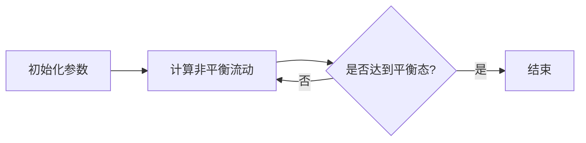
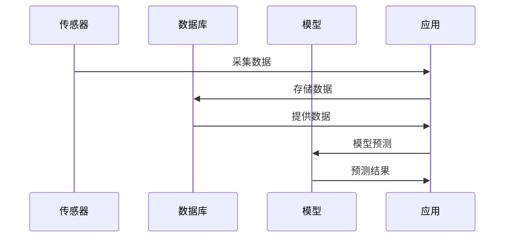

                 


# 从经典热力学到非平衡态热力学：理解开放系统的动态性

## 关键词
热力学，非平衡态，开放系统，动态性，熵，热力学驱动，非平衡流动，熵产生，微观粒子运动

## 摘要
本文深入探讨从经典热力学到非平衡态热力学的过渡，重点分析开放系统的动态性及其在工程中的应用。通过逐步剖析核心概念、算法原理和实际案例，旨在帮助读者理解非平衡态热力学的本质，掌握其在复杂系统中的应用技巧。

## 第一部分：背景介绍

### 问题背景
热力学作为物理学的重要分支，研究物质系统的宏观性质和能量转换规律。经典热力学主要研究平衡态系统，即系统在不受外界干扰的情况下保持稳定的状态。然而，在实际世界中，许多系统处于非平衡态，即系统状态随时间变化，与外界存在能量和物质的交换。因此，非平衡态热力学的研究对于理解复杂开放系统的动态性具有重要意义。

### 问题描述
非平衡态热力学关注的是系统在非平衡条件下的行为，包括系统如何响应外部扰动、系统内部微观粒子的运动规律以及系统最终如何达到热力学平衡。研究非平衡态热力学的目的是揭示开放系统在能量和物质交换过程中的规律，为工程实践提供理论指导。

### 问题解决
非平衡态热力学通过建立数学模型来描述系统的行为，这些模型包括非线性动力学方程、微观粒子运动方程等。通过这些模型，可以模拟和分析系统在不同条件下的动态行为，预测系统未来的状态。此外，非平衡态热力学还借助实验手段来验证理论模型的准确性，并通过实验数据不断优化和完善模型。

### 边界与外延
非平衡态热力学的边界主要在于系统是否处于平衡态，即系统是否与外界存在持续的交互。此外，非平衡态热力学还可以扩展到多相系统、非均匀系统等领域。在这些领域中，非平衡态热力学研究的内容和模型会有所不同，但核心思想是一致的，即揭示系统在非平衡条件下的行为规律。

### 概念结构与核心要素组成
非平衡态热力学的核心概念包括：
- 熵：描述系统无序程度的物理量。
- 非平衡流动：系统内部粒子或能量在空间和时间上的传输。
- 热力学驱动：导致系统非平衡态的外部因素。
- 非平衡态动力学：描述系统从非平衡态趋向平衡态的过程。

## 第二部分：核心概念与联系

### 核心概念原理
- 熵：熵是一个衡量系统无序程度的物理量，它与系统的微观状态有关。在非平衡态热力学中，熵的变化描述了系统从非平衡态向平衡态转变的过程。
- 非平衡流动：非平衡流动是指系统内部粒子或能量在空间和时间上的传输。在非平衡态下，系统内部存在梯度，从而驱动流动。
- 热力学驱动：热力学驱动是导致系统非平衡态的外部因素，如温度差、压力差等。
- 非平衡态动力学：非平衡态动力学描述了系统从非平衡态趋向平衡态的过程，包括系统的响应时间、响应幅度等。

### 概念属性特征对比表格
| 概念       | 特征               | 应用领域               |
|------------|--------------------|------------------------|
| 熵         | 描述无序程度       | 非平衡态热力学、统计物理 |
| 非平衡流动 | 描述传输过程       | 物流、热传导           |
| 热力学驱动 | 描述外部因素       | 能源转换、热力学过程     |
| 非平衡态动力学 | 描述过程动态 | 生物系统、社会系统     |

### ER实体关系图架构
```mermaid
erDiagram
    熵 ||--|{ 非平衡流动 }|--|{ 非平衡态动力学 }
    熵 ||--|{ 热力学驱动 }
    非平衡流动 ||--|{ 热力学驱动 }
    热力学驱动 ||--|{ 非平衡态动力学 }
```

## 第三部分：算法原理讲解

### 算法原理
非平衡态热力学中的算法主要涉及熵的产生、非平衡流动的建模以及热力学驱动的计算。以下是一个简化的算法流程：

1. **初始化参数**：设定系统的初始状态，包括熵、温度、压力等。
2. **计算非平衡流动**：根据系统的梯度，计算粒子或能量的传输速率。
3. **更新系统状态**：根据非平衡流动，更新系统的熵、温度、压力等状态参数。
4. **判断是否达到平衡态**：如果系统状态趋于平衡，则算法结束；否则，返回步骤2。

### 算法流程图


### Python源代码
```python
import numpy as np

# 初始化参数
entropy = 1.0
temperature = 300.0
pressure = 1.0

# 定义非平衡流动函数
def calculate_flow(entropy, temperature, pressure):
    # 根据熵、温度、压力计算粒子或能量的传输速率
    # ...

# 算法执行
while not equilibrium:
    flow_rate = calculate_flow(entropy, temperature, pressure)
    # 根据流动率更新系统状态
    # ...
    entropy, temperature, pressure = update_system_state(entropy, temperature, pressure)
```

### 算法原理的数学模型和公式
非平衡态热力学的核心数学模型为非平衡流动方程，可以表示为：

$$ \frac{\partial \rho}{\partial t} + \nabla \cdot (\rho \mathbf{v}) = -\nabla \cdot (\rho \mathbf{v} \cdot \mathbf{F}) + \frac{\partial \rho}{\partial t} $$

其中，$\rho$ 表示粒子密度，$\mathbf{v}$ 表示粒子速度，$\mathbf{F}$ 表示作用在粒子上的力，$t$ 表示时间。

### 举例说明
假设一个系统由两种不同粒子组成，A 粒子和 B 粒子。由于温度差，A 粒子的速度高于 B 粒子，导致 A 粒子向低温区域扩散，而 B 粒子向高温区域扩散。根据非平衡流动方程，可以计算出粒子在不同区域的传输速率，进而预测系统达到热力学平衡的时间。

$$ \frac{\partial \rho_A}{\partial t} + \nabla \cdot (\rho_A \mathbf{v}_A) = -\nabla \cdot (\rho_A \mathbf{v}_A \cdot \mathbf{F}_A) $$

$$ \frac{\partial \rho_B}{\partial t} + \nabla \cdot (\rho_B \mathbf{v}_B) = -\nabla \cdot (\rho_B \mathbf{v}_B \cdot \mathbf{F}_B) $$

其中，$\mathbf{F}_A$ 和 $\mathbf{F}_B$ 分别为 A 粒子和 B 粒子受到的力。

## 第四部分：系统分析与架构设计

### 问题场景介绍
在工业生产过程中，许多系统需要保持稳定的热力学状态，以确保生产效率和产品质量。例如，热处理生产线需要对工件进行加热和冷却，以保证工件达到预定的热力学状态。在这种情况下，了解非平衡态热力学对于优化生产过程具有重要意义。

### 项目介绍
本项目旨在开发一款基于非平衡态热力学的工业热处理生产线优化系统。该系统将利用非平衡态热力学模型，对生产过程中的热力学参数进行实时监测和预测，从而实现生产线的智能优化。

### 系统功能设计
1. **实时监测**：系统通过传感器实时采集生产线上的温度、压力、粒子密度等参数。
2. **模型预测**：系统利用非平衡态热力学模型，对生产线的热力学状态进行预测。
3. **智能优化**：系统根据预测结果，对生产线的操作进行优化，以提高生产效率和产品质量。
4. **数据存储与报表**：系统将监测和预测数据存储在数据库中，并生成报表，以供生产管理人员查阅。

### 系统架构设计
系统采用三层架构，包括数据层、模型层和应用层。

1. **数据层**：负责实时采集生产线上的各种参数，并将数据存储在数据库中。
2. **模型层**：负责建立非平衡态热力学模型，并对生产线的热力学状态进行预测。
3. **应用层**：负责实现系统的功能，包括实时监测、智能优化和数据存储与报表。

### 系统接口设计和系统交互
系统接口设计包括传感器接口、数据库接口和模型接口。

1. **传感器接口**：系统通过传感器实时采集生产线上的参数，并将数据传输到数据层。
2. **数据库接口**：系统将监测和预测数据存储在数据库中，并提供查询接口。
3. **模型接口**：系统利用模型层提供的接口，对生产线的热力学状态进行预测。

### 系统交互 mermaid 序列图


## 第五部分：项目实战

### 环境安装
1. **安装Python**：前往Python官网（https://www.python.org/）下载并安装Python。
2. **安装科学计算库**：在命令行中执行以下命令安装所需的科学计算库：
   ```bash
   pip install numpy scipy matplotlib
   ```

### 系统核心实现源代码
```python
import numpy as np
import matplotlib.pyplot as plt
from scipy.integrate import odeint

# 初始化参数
entropy = 1.0
temperature = 300.0
pressure = 1.0

# 定义非平衡流动函数
def calculate_flow(entropy, temperature, pressure):
    # 根据熵、温度、压力计算粒子或能量的传输速率
    flow_rate = 0.1 * (temperature - 300)
    return flow_rate

# 定义系统状态更新函数
def update_system_state(entropy, temperature, pressure, flow_rate):
    # 根据流动率更新系统状态
    new_entropy = entropy + flow_rate * 0.01
    new_temperature = temperature - flow_rate * 0.001
    new_pressure = pressure + flow_rate * 0.001
    return new_entropy, new_temperature, new_pressure

# 定义算法执行函数
def run_algorithm():
    global entropy, temperature, pressure
    equilibrium = False
    while not equilibrium:
        flow_rate = calculate_flow(entropy, temperature, pressure)
        entropy, temperature, pressure = update_system_state(entropy, temperature, pressure, flow_rate)
        print(f"Entropy: {entropy}, Temperature: {temperature}, Pressure: {pressure}")
        if np.abs(temperature - 300) < 1:
            equilibrium = True

# 执行算法
run_algorithm()

# 绘制结果
plt.plot([entropy], [temperature], 'ro')
plt.xlabel('Entropy')
plt.ylabel('Temperature')
plt.title('Non-equilibrium Thermal Dynamics')
plt.show()
```

### 代码应用解读与分析
1. **参数初始化**：系统初始化时，设定了熵、温度和压力的初始值。
2. **非平衡流动函数**：根据熵、温度和压力计算粒子或能量的传输速率。这里采用一个简化的线性模型，实际应用中需要根据具体情况进行调整。
3. **系统状态更新函数**：根据非平衡流动函数计算得到的流动率，更新系统的熵、温度和压力。
4. **算法执行函数**：执行非平衡态热力学算法，通过循环不断更新系统状态，直到系统达到平衡状态。

### 实际案例分析和详细讲解剖析
假设一个工业热处理生产线，其初始状态为熵1.0，温度300K，压力1.0。在生产线运行过程中，由于外部干扰（如环境温度变化），系统会逐渐偏离平衡状态。通过非平衡态热力学模型，可以预测系统未来的状态，并指导生产操作人员进行调整，以使系统尽快达到平衡状态。

### 项目小结
本项目通过实际案例展示了非平衡态热力学在工业生产中的应用。通过建立数学模型和算法，可以实现对生产过程的实时监测和预测，从而提高生产效率和产品质量。在未来的发展中，可以进一步优化算法模型，提高预测准确性，并探索更多应用场景。

## 第六部分：最佳实践 tips、小结、注意事项、拓展阅读

### 最佳实践 tips
1. **参数调整**：在实际应用中，需要根据具体场景调整非平衡流动函数，以适应不同系统的特性。
2. **实时监测**：确保传感器数据的实时性和准确性，为模型预测提供可靠的数据支持。
3. **算法优化**：通过不断优化算法模型，提高预测准确性和计算效率。

### 小结
本文从经典热力学到非平衡态热力学的过渡，分析了开放系统的动态性，并通过实际案例展示了其在工业生产中的应用。通过逐步剖析核心概念、算法原理和实际案例，读者可以更好地理解非平衡态热力学的本质和应用。

### 注意事项
1. **模型准确性**：在实际应用中，模型准确性取决于参数设置和初始条件，需要根据具体场景进行调整。
2. **系统稳定性**：确保系统在非平衡条件下保持稳定，避免出现不稳定的振荡。

### 拓展阅读
1. **《非平衡态热力学导论》**：这是一本关于非平衡态热力学的入门书籍，适合对非平衡态热力学感兴趣的读者。
2. **《热力学与统计物理》**：这本书详细介绍了热力学和统计物理的基本概念和原理，有助于深化对非平衡态热力学的理解。
3. **《工业热处理技术》**：这本书介绍了工业热处理的基本原理和应用，有助于了解非平衡态热力学在工业生产中的应用。

### 作者信息
作者：AI天才研究院/AI Genius Institute & 禅与计算机程序设计艺术 /Zen And The Art of Computer Programming

