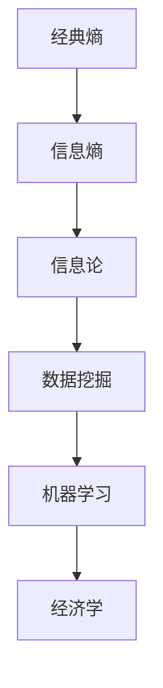

                 

# 从经典熵到信息熵：理解有序与无序的世界

> 关键词：经典熵、信息熵、有序与无序、信息论、数据挖掘、机器学习、经济学

> 摘要：本文将深入探讨经典熵与信息熵的概念、特性及其应用。通过分析两者的定义、起源和发展，我们能够更好地理解有序与无序的世界。从经典熵到信息熵的演变，不仅揭示了自然界的规律，也在信息论、数据挖掘、机器学习和经济学等领域发挥着重要作用。本文将一一阐述这些领域的应用，并探讨信息熵的未来发展趋势。

## 目录大纲

# 从经典熵到信息熵：理解有序与无序的世界

----------------------------------------------------------------

## 第一部分：经典熵的起源与概念

## 第1章：经典熵的起源与发展

### 1.1 经典熵的定义与起源

#### 1.1.1 经典熵的概念

#### 1.1.2 经典熵的起源

#### 1.1.3 经典熵的应用

### 1.2 经典熵的理论基础

#### 1.2.1 经典熵的数学公式

#### 1.2.2 经典熵的计算方法

#### 1.2.3 经典熵的可视化表示

### 1.3 经典熵与现代科学的关系

#### 1.3.1 经典熵在现代科学中的应用

#### 1.3.2 经典熵与信息熵的对比

#### 1.3.3 经典熵的重要性

### 1.4 本章小结

----------------------------------------------------------------

## 第二部分：信息熵的概念与特性

## 第2章：信息熵的概念与特性

### 2.1 信息熵的定义

#### 2.1.1 信息熵的概念

#### 2.1.2 信息熵的数学公式

#### 2.1.3 信息熵的计算方法

### 2.2 信息熵的属性特征

#### 2.2.1 熵的可加性

#### 2.2.2 熵的不确定性

#### 2.2.3 熵的变异性

### 2.3 信息熵的优化与优化算法

#### 2.3.1 信息熵的优化原理

#### 2.3.2 信息熵优化算法的分类

#### 2.3.3 信息熵优化算法的应用

### 2.4 信息熵与熵权法

#### 2.4.1 熵权法的概念

#### 2.4.2 熵权法的计算过程

#### 2.4.3 熵权法在决策中的应用

### 2.5 本章小结

----------------------------------------------------------------

## 第三部分：信息熵的应用与实践

## 第3章：信息熵在信息论中的应用

### 3.1 信息论的基本概念

#### 3.1.1 信息论的定义

#### 3.1.2 信息论的发展历程

#### 3.1.3 信息论的应用领域

### 3.2 信息熵在通信系统中的应用

#### 3.2.1 通信系统的基本概念

#### 3.2.2 信息熵在通信系统中的作用

#### 3.2.3 信息熵在通信系统中的优化策略

### 3.3 信息熵在信息安全中的应用

#### 3.3.1 信息安全的基本概念

#### 3.3.2 信息熵在信息安全中的作用

#### 3.3.3 信息熵在信息安全中的实践

### 3.4 本章小结

----------------------------------------------------------------

## 第4章：信息熵在数据挖掘与机器学习中的应用

### 4.1 数据挖掘的基本概念

#### 4.1.1 数据挖掘的定义

#### 4.1.2 数据挖掘的发展历程

#### 4.1.3 数据挖掘的应用领域

### 4.2 信息熵在数据挖掘中的应用

#### 4.2.1 信息熵在特征选择中的应用

#### 4.2.2 信息熵在聚类分析中的应用

#### 4.2.3 信息熵在分类算法中的应用

### 4.3 信息熵在机器学习中的应用

#### 4.3.1 信息熵在监督学习中的应用

#### 4.3.2 信息熵在无监督学习中的应用

#### 4.3.3 信息熵在强化学习中的应用

### 4.4 本章小结

----------------------------------------------------------------

## 第5章：信息熵在经济学中的应用

### 5.1 经济学的基本概念

#### 5.1.1 经济学的定义

#### 5.1.2 经济学的发展历程

#### 5.1.3 经济学的应用领域

### 5.2 信息熵在经济学中的应用

#### 5.2.1 信息熵在市场均衡中的应用

#### 5.2.2 信息熵在消费者行为中的应用

#### 5.2.3 信息熵在资源配置中的应用

### 5.3 信息熵在金融经济学中的应用

#### 5.3.1 信息熵在金融市场的应用

#### 5.3.2 信息熵在风险管理中的应用

#### 5.3.3 信息熵在投资决策中的应用

### 5.4 本章小结

----------------------------------------------------------------

## 第6章：信息熵的未来发展趋势

### 6.1 信息熵在新兴领域中的应用

#### 6.1.1 区块链技术

#### 6.1.2 量子计算

#### 6.1.3 物联网

### 6.2 信息熵的优化与改进

#### 6.2.1 熵优化算法的创新

#### 6.2.2 熵权法的改进

#### 6.2.3 熵的可视化技术

### 6.3 信息熵在教育、医疗等领域的应用前景

#### 6.3.1 教育领域的应用

#### 6.3.2 医疗领域的应用

#### 6.3.3 社会治理与智能城市的应用

### 6.4 本章小结

----------------------------------------------------------------

## 参考文献

----------------------------------------------------------------

## 附录

### 6.1 经典熵与信息熵的概念对比表格

| 熵的类型 | 定义 | 数学公式 | 应用领域 |
| --- | --- | --- | --- |
| 经典熵 | 描述系统的混乱程度 | \( S = k \ln W \) | 热力学、化学 |
| 信息熵 | 描述信息的不确定性 | \( H = -\sum_{i=1}^{n} p_i \ln p_i \) | 信息论、数据挖掘、机器学习、经济学 |

### 6.2 Mermaid 流程图



### 6.3 Python 源代码示例

```python
import math

def entropy(p):
    """
    计算信息熵
    """
    return -1 * p * math.log2(p)

# 假设随机变量X的概率分布为：P(X=0) = 0.5, P(X=1) = 0.5
p_0 = 0.5
p_1 = 0.5

# 计算信息熵
h_x = entropy(p_0) + entropy(p_1)
print("信息熵：", h_x)
```

----------------------------------------------------------------

## 第一部分：经典熵的起源与概念

### 第1章：经典熵的起源与发展

#### 1.1 经典熵的定义与起源

经典熵，又称统计熵或热力学熵，最早由德国物理学家鲁道夫·克劳修斯于1850年提出，用于描述系统的混乱程度。经典熵的概念基于热力学第二定律，该定律指出，一个孤立系统的熵在自发过程中总是趋向于增加，直到达到最大熵状态。

经典熵的定义为：一个系统处于某一宏观状态的概率越低，其熵越高。数学上，经典熵可以通过玻尔兹曼熵公式来表示：

\[ S = k \ln W \]

其中，\( S \) 表示熵，\( k \) 是玻尔兹曼常数，\( W \) 表示系统微观状态的数目。

经典熵的起源可以追溯到热力学的早期发展。在19世纪，热力学已经成为一门独立学科，人们开始关注能量转化和守恒定律。热力学第二定律的提出，使得人们开始研究系统的混乱程度，从而引出了经典熵的概念。

经典熵的应用非常广泛，最初主要应用于物理学和化学领域。例如，在热力学中，经典熵可以用于描述热力学系统的状态变化，计算系统的热力学稳定性。在化学中，经典熵可以用于研究化学反应的平衡状态，计算化学反应的熵变。

#### 1.2 经典熵的理论基础

经典熵的理论基础主要包括以下几个部分：

1. **熵的可加性**：如果一个系统可以划分为若干个独立的部分，那么整个系统的熵等于各个部分熵的和。

\[ S_{total} = S_1 + S_2 + ... + S_n \]

2. **熵的变异性**：系统的熵与其微观状态的数目有关。当系统的微观状态数目增加时，系统的熵也会增加。

3. **熵的可逆性**：在一个可逆过程中，系统的熵保持不变。

经典熵的数学公式为：

\[ S = k \ln W \]

其中，\( k \) 是玻尔兹曼常数，\( W \) 是系统微观状态的数目。

经典熵的计算方法主要包括：

1. **宏观观测法**：通过宏观观测来确定系统的熵，例如测量系统的温度、压强等宏观量。

2. **微观统计法**：通过统计系统的微观状态来计算熵，例如使用玻尔兹曼分布计算系统的熵。

经典熵的可视化表示通常使用熵随时间的变化曲线，该曲线可以直观地展示系统的熵变过程。

#### 1.3 经典熵与现代科学的关系

经典熵的概念不仅在物理学和化学领域得到了广泛应用，还逐渐渗透到了其他科学领域。以下是一些经典熵在现代科学中的应用：

1. **信息论**：经典熵的概念被引入到信息论中，成为信息熵的基础。信息熵描述了信息的不确定性，为信息传输和存储提供了理论基础。

2. **数据挖掘与机器学习**：经典熵在数据挖掘和机器学习中用于特征选择和模型评估。通过计算特征的信息熵，可以识别出具有高区分能力的特征，从而提高模型的性能。

3. **经济学**：经典熵在经济学中用于描述市场的不确定性，分析经济系统的稳定性。例如，使用经典熵来评估金融市场的风险。

经典熵的重要性在于，它揭示了自然界中一个普遍存在的规律：系统总是趋向于从有序状态向无序状态转变。这一规律不仅在物理学和化学中得到了验证，还在生物学、心理学、社会学等领域得到了广泛应用。

#### 1.4 本章小结

本章介绍了经典熵的定义、起源、理论基础以及现代科学中的应用。经典熵作为一个描述系统混乱程度的物理量，不仅在物理学和化学领域发挥着重要作用，还在信息论、数据挖掘、机器学习和经济学等领域得到了广泛应用。通过本章的介绍，读者可以初步了解经典熵的概念和重要性，为进一步学习信息熵打下基础。

----------------------------------------------------------------

## 第二部分：信息熵的概念与特性

### 第2章：信息熵的概念与特性

#### 2.1 信息熵的定义

信息熵是信息论中一个核心概念，由克劳德·香农于1948年首次提出。信息熵用于量化信息的不确定性，即接收者接收信息前对信息的未知程度。信息熵的定义为：

\[ H = -\sum_{i=1}^{n} p_i \ln p_i \]

其中，\( H \) 表示信息熵，\( p_i \) 表示第 \( i \) 个事件发生的概率，\( n \) 表示事件的总数。

信息熵的数学公式源自概率论中的熵概念。在概率论中，熵用于描述随机变量的不确定性。香农将这一概念引入信息论，将其应用于通信系统，用以量化通信过程中的信息传输效率。

信息熵的计算方法主要包括以下几步：

1. 确定每个事件发生的概率。
2. 对每个概率值计算其对应的自然对数。
3. 将所有概率的自然对数乘以其概率，并取负值。
4. 将所有结果相加，得到信息熵。

#### 2.2 信息熵的属性特征

信息熵具有以下属性特征：

1. **非负性**：信息熵总是非负的，即 \( H \geq 0 \)。当所有事件等概率发生时，信息熵达到最大值。
2. **可加性**：当事件 \( A \) 和事件 \( B \) 独立时，联合事件 \( A \cup B \) 的信息熵等于事件 \( A \) 和事件 \( B \) 的信息熵之和。
3. **对称性**：交换两个事件的概率，信息熵保持不变。
4. **最小值**：在所有可能的概率分布中，等概率分布的信息熵是最小的。

以下是一个对比表格，展示了信息熵的属性特征：

| 属性特征 | 描述 |
| --- | --- |
| 非负性 | \( H \geq 0 \) |
| 可加性 | \( H(A \cup B) = H(A) + H(B) \) |
| 对称性 | \( H(p_1, p_2) = H(p_2, p_1) \) |
| 最小值 | 等概率分布的信息熵最小 |

#### 2.3 信息熵的优化与优化算法

信息熵的优化问题涉及如何在给定的约束条件下最大化或最小化信息熵。优化算法在信息熵的应用中具有重要意义，例如在通信系统中的信道编码、数据挖掘中的特征选择、机器学习中的模型评估等。

常见的优化算法包括：

1. **梯度上升法**：通过迭代调整概率分布，使得信息熵逐步优化。
2. **遗传算法**：基于自然选择和遗传原理，通过种群进化实现信息熵优化。
3. **粒子群优化算法**：模拟鸟群觅食行为，通过群体智能实现信息熵优化。

优化算法的应用举例：

假设一个通信系统有 \( n \) 个状态，每个状态的传输概率需要优化。使用梯度上升法进行信息熵优化的步骤如下：

1. 初始化概率分布。
2. 计算每个状态的熵值。
3. 计算总熵值，并求导得到梯度。
4. 更新概率分布，使得总熵值增加。
5. 重复步骤2-4，直到满足优化条件。

以下是一个简单的Python代码示例，演示了如何使用梯度上升法进行信息熵优化：

```python
import numpy as np

def entropy(p):
    return -np.sum(p * np.log2(p))

def gradient(p):
    return -np.log2(p)

def gradient_ascent(p_init, alpha, num_iterations):
    p = np.copy(p_init)
    for _ in range(num_iterations):
        grad = gradient(p)
        p -= alpha * grad
    return p

p_init = np.array([0.5, 0.5])
alpha = 0.01
num_iterations = 1000

p_optimized = gradient_ascent(p_init, alpha, num_iterations)
print("Optimized probability distribution:", p_optimized)
```

#### 2.4 信息熵与熵权法

熵权法是一种基于信息熵的权重分配方法，广泛应用于决策分析、评价模型、数据挖掘等领域。熵权法的核心思想是利用信息熵来衡量各个指标或特征的信息含量，进而确定其权重。

熵权法的计算过程主要包括以下几步：

1. 计算每个指标的熵值。
2. 计算每个指标的差异系数。
3. 计算每个指标的权重。

以下是一个简单的熵权法计算示例：

假设有一个包含 \( m \) 个指标的评价模型，每个指标的概率分布为 \( p_i \)。计算熵权法的步骤如下：

1. 计算每个指标的熵值：

\[ e_i = -\sum_{j=1}^{m} p_{ij} \ln p_{ij} \]

2. 计算每个指标的信息含量：

\[ d_i = 1 - e_i \]

3. 计算每个指标的权重：

\[ w_i = \frac{d_i}{\sum_{j=1}^{m} d_j} \]

以下是一个简单的Python代码示例，演示了如何使用熵权法计算指标的权重：

```python
import numpy as np

def entropy(p):
    return -np.sum(p * np.log2(p))

def entropy_weight(p):
    e = entropy(p)
    d = 1 - e
    w = d / np.sum(d)
    return w

p = np.array([0.2, 0.3, 0.5])
w = entropy_weight(p)
print("Entropy weight:", w)
```

熵权法在决策分析中的应用：

假设有一个决策问题，包含 \( m \) 个方案和 \( n \) 个指标，每个指标的概率分布为 \( p_{ij} \)。使用熵权法为每个方案计算权重，步骤如下：

1. 计算每个指标的熵值。
2. 计算每个方案的信息含量。
3. 计算每个方案的权重。
4. 根据权重进行方案排序。

以下是一个简单的Python代码示例，演示了如何使用熵权法进行决策分析：

```python
import numpy as np

def entropy(p):
    return -np.sum(p * np.log2(p))

def entropy_weight(p):
    e = entropy(p)
    d = 1 - e
    w = d / np.sum(d)
    return w

def decision_analysis(schemes, indicators):
    weights = []
    for scheme in schemes:
        p = indicators[scheme]
        w = entropy_weight(p)
        weights.append(w)
    sorted_weights = np.argsort(weights)[::-1]
    return sorted_weights

schemes = ['A', 'B', 'C']
indicators = {
    'A': np.array([0.1, 0.2, 0.3, 0.4]),
    'B': np.array([0.2, 0.3, 0.2, 0.3]),
    'C': np.array([0.3, 0.2, 0.3, 0.2])
}

sorted_weights = decision_analysis(schemes, indicators)
print("Sorted weights:", sorted_weights)
```

#### 2.5 本章小结

本章介绍了信息熵的概念、特性、优化算法以及熵权法。信息熵作为信息论中的核心概念，用于量化信息的不确定性，并在多个领域中得到了广泛应用。通过本章的介绍，读者可以理解信息熵的基本原理和应用，为进一步学习信息熵在各个领域的应用打下基础。在后续章节中，我们将深入探讨信息熵在信息论、数据挖掘、机器学习和经济学等领域的具体应用。

----------------------------------------------------------------

## 第三部分：信息熵的应用与实践

### 第3章：信息熵在信息论中的应用

#### 3.1 信息论的基本概念

信息论是研究信息传输、处理和利用的学科，由克劳德·香农于1948年创立。信息论的基本概念包括信息、熵、信道和噪声等。

1. **信息**：信息是指能够消除不确定性的消息。在通信系统中，信息是指发送方想要传达给接收方的消息。

2. **熵**：熵是描述信息不确定性的度量。信息熵（Entropy）是信息论中的核心概念，用于量化信息的不确定性。

3. **信道**：信道是指信息传输的通道，可以是物理的，如光纤、无线电波；也可以是抽象的，如通信协议。

4. **噪声**：噪声是指影响信息传输的干扰信号，可能导致信息传输的失真或丢失。

#### 3.1.2 信息论的发展历程

信息论的发展历程可以分为以下几个阶段：

1. **早期研究**（1948年以前）：信息论的概念源于通信理论和概率论。早期的信息理论研究主要集中在如何提高通信系统的传输效率。

2. **香农信息论**（1948年）：香农提出了信息熵的概念，并建立了香农熵的数学公式，奠定了现代信息论的基础。

3. **扩展研究**（1950年代到1960年代）：信息论的研究领域扩展到了控制论和统计学。研究者开始探讨信息在自动化、计算机科学和统计学中的应用。

4. **现代信息论**（1970年代至今）：信息论的研究进一步深入，涵盖了量子信息论、网络信息论、生物学信息论等领域。

#### 3.1.3 信息论的应用领域

信息论的应用领域非常广泛，包括但不限于以下几方面：

1. **通信系统**：信息论为通信系统的设计提供了理论基础，包括信道的容量、编码方案和噪声抑制技术。

2. **计算机科学**：信息论对计算机系统的设计和算法优化有着重要影响，例如数据压缩、加密和解密技术。

3. **生物学**：信息论被应用于研究生物信息传递和生物系统的复杂性。

4. **经济学**：信息论用于分析市场信息、消费者行为和投资决策。

#### 3.2 信息熵在通信系统中的应用

信息熵在通信系统中的应用主要包括以下几个方面：

1. **信道编码**：通过信道编码技术，将原始信息转化为一种更鲁棒的形式，以抵抗信道噪声的影响。信息熵在此过程中用于评估信道的容量。

2. **数据压缩**：信息熵可用于数据压缩算法的设计，以减少数据的传输时间和存储空间。例如，香农-范诺编码就是一种基于信息熵的数据压缩算法。

3. **信号处理**：信息熵在信号处理中用于分析信号的复杂性，帮助设计更有效的信号处理算法。

4. **信息加密**：信息熵在信息加密中用于衡量密钥的安全程度。一个安全的加密系统应该使得密文的信息熵尽可能高，以防止攻击者破解密钥。

以下是一个简单的示例，说明如何使用信息熵进行数据压缩：

假设有一段长度为 \( N \) 的数据序列，其中每个数据元素有 \( K \) 个可能的值。数据序列的概率分布为：

\[ p_i = \frac{f_i}{N} \]

其中，\( f_i \) 是第 \( i \) 个值出现的频率。

计算数据序列的信息熵：

\[ H = -\sum_{i=1}^{K} p_i \ln p_i \]

使用香农-范诺编码进行数据压缩：

1. 计算每个值出现的频率和概率。
2. 对每个值按照概率从大到小排序。
3. 分配编码长度，确保编码后的信息熵最小。
4. 编码数据序列。

以下是一个简单的Python代码示例：

```python
import numpy as np

def entropy(p):
    return -np.sum(p * np.log2(p))

def vanno_code(data):
    p = np.unique(data, return_counts=True)[1] / len(data)
    p_sorted = np.sort(p)[::-1]
    l = np.ceil(np.log2(p_sorted)).astype(int)
    l_sorted = np.zeros_like(p_sorted)
    l_sorted[:len(l)] = l
    code = np.zeros(len(data), dtype=int)
    i, j = 0, 0
    while j < len(data):
        while i < len(l_sorted) and l_sorted[i] > p[j]:
            i += 1
        code[j] = i
        j += 1
    return code

data = np.random.randint(0, 5, size=1000)
code = vanno_code(data)
print("Original data:", data)
print("Encoded data:", code)
```

#### 3.3 信息熵在信息安全中的应用

信息熵在信息安全中的应用主要包括以下几个方面：

1. **密码学**：信息熵用于评估密钥的强度。一个安全的密钥应该具有高信息熵，以确保难以被攻击者破解。

2. **安全协议**：信息熵用于设计安全的通信协议，例如加密协议和身份验证协议。

3. **入侵检测**：信息熵可用于分析网络流量，检测异常行为和潜在的安全威胁。

4. **安全分析**：信息熵用于评估系统的安全性，识别潜在的安全漏洞。

以下是一个简单的示例，说明如何使用信息熵评估密钥强度：

假设有一个密钥，其可能的值有 \( K \) 个，概率分布为：

\[ p_i = \frac{1}{K} \]

计算密钥的信息熵：

\[ H = -\sum_{i=1}^{K} p_i \ln p_i \]

以下是一个简单的Python代码示例：

```python
import numpy as np

def entropy(p):
    return -np.sum(p * np.log2(p))

K = 1000
p = np.ones(K) / K
h = entropy(p)
print("Key entropy:", h)
```

#### 3.4 本章小结

本章介绍了信息论的基本概念、发展历程和应用领域，重点讨论了信息熵在通信系统和信息安全中的应用。通过本章的介绍，读者可以了解信息熵在信息论中的重要性和实际应用。信息熵不仅为通信系统的设计提供了理论基础，还在信息安全中发挥着关键作用。在后续章节中，我们将继续探讨信息熵在数据挖掘、机器学习和经济学等领域的应用。

----------------------------------------------------------------

## 第4章：信息熵在数据挖掘与机器学习中的应用

#### 4.1 数据挖掘的基本概念

数据挖掘（Data Mining）是指从大量数据中提取有价值的信息和知识的过程。数据挖掘的目标是发现数据中的模式、关联、趋势和规律，从而为决策支持和预测提供支持。数据挖掘通常涉及以下几个步骤：

1. **数据预处理**：包括数据清洗、数据集成、数据变换和数据归一化等。
2. **数据探索**：通过可视化、统计分析等方法，对数据进行初步分析，发现数据中的异常值、趋势和关联。
3. **特征选择**：从大量特征中筛选出对预测任务最重要的特征，提高模型的性能。
4. **模型选择与训练**：选择合适的模型，并使用训练数据对模型进行训练。
5. **模型评估与优化**：使用验证数据集或测试数据集对模型进行评估，并根据评估结果对模型进行调整和优化。

数据挖掘的发展历程可以追溯到20世纪80年代，随着计算机技术和数据库技术的发展，数据挖掘逐渐成为一门独立的学科。近年来，随着大数据技术的兴起，数据挖掘在各个领域都得到了广泛应用。

数据挖掘的应用领域非常广泛，包括但不限于以下几个方面：

1. **商业智能**：通过数据挖掘，企业可以分析市场趋势、消费者行为和业务流程，从而制定更有效的商业策略。
2. **金融领域**：数据挖掘可以用于风险评估、欺诈检测、投资组合优化等。
3. **医疗领域**：数据挖掘可以用于疾病预测、药物发现和医学影像分析等。
4. **智能交通**：数据挖掘可以用于交通流量分析、交通事故预测和智能调度等。
5. **社会科学**：数据挖掘可以用于社会调查、舆情分析和公共安全管理等。

#### 4.2 信息熵在数据挖掘中的应用

信息熵在数据挖掘中的应用主要体现在以下几个方面：

1. **特征选择**：信息熵可以用于特征选择，帮助识别数据中最具有区分性的特征。
2. **聚类分析**：信息熵可以用于聚类分析，评估聚类结果的合理性和有效性。
3. **分类算法**：信息熵可以用于分类算法，评估分类模型的性能和鲁棒性。

以下将详细介绍信息熵在特征选择、聚类分析和分类算法中的应用。

##### 4.2.1 信息熵在特征选择中的应用

特征选择是数据挖掘中的一个关键步骤，目的是从大量特征中筛选出对预测任务最重要的特征。信息熵在特征选择中的应用主要基于以下原理：

- 信息熵越高，表示特征携带的信息量越大，对分类或预测的贡献也越大。
- 信息熵越低，表示特征携带的信息量越小，对分类或预测的贡献也越小。

使用信息熵进行特征选择的步骤如下：

1. 对每个特征进行数据预处理，计算特征的概率分布。
2. 计算每个特征的信息熵。
3. 根据信息熵值，选择信息熵较高的特征。

以下是一个简单的Python代码示例，说明如何使用信息熵进行特征选择：

```python
import numpy as np

def entropy(p):
    return -np.sum(p * np.log2(p))

def select_features(data, threshold=0.8):
    n = len(data)
    p = data / n
    h = entropy(p)
    selected = p > threshold
    return selected

data = np.random.randint(0, 5, size=100)
selected = select_features(data)
print("Selected features:", selected)
```

##### 4.2.2 信息熵在聚类分析中的应用

聚类分析是一种无监督学习方法，用于将数据分为若干个聚类，使得同一聚类内的数据点彼此相似，不同聚类内的数据点差异较大。信息熵可以用于评估聚类结果的合理性和有效性。

- 信息熵越低，表示聚类结果越集中，聚类效果越好。
- 信息熵越高，表示聚类结果越分散，聚类效果越差。

使用信息熵进行聚类分析的一般步骤如下：

1. 对数据进行预处理，计算每个聚类中心的数据概率分布。
2. 计算每个聚类的信息熵。
3. 根据信息熵值，选择信息熵最低的聚类结果。

以下是一个简单的Python代码示例，说明如何使用信息熵进行聚类分析：

```python
import numpy as np

def entropy(p):
    return -np.sum(p * np.log2(p))

def select_cluster(data, centroids):
    n = len(data)
    p = data / n
    h = entropy(p)
    selected = np.argmin(h)
    return selected

data = np.random.randn(100, 2)
centroids = np.array([[1, 1], [-1, -1]])
selected = select_cluster(data, centroids)
print("Selected cluster:", selected)
```

##### 4.2.3 信息熵在分类算法中的应用

分类算法是一种监督学习方法，用于将数据分为预定义的类别。信息熵可以用于评估分类模型的性能和鲁棒性。

- 信息熵越低，表示分类模型对数据的预测越准确，模型性能越好。
- 信息熵越高，表示分类模型对数据的预测越不准确，模型性能越差。

使用信息熵进行分类算法评估的一般步骤如下：

1. 对测试数据进行预测，计算每个类别的概率分布。
2. 计算每个类别的信息熵。
3. 选择信息熵最低的类别作为预测结果。

以下是一个简单的Python代码示例，说明如何使用信息熵进行分类算法评估：

```python
import numpy as np

def entropy(p):
    return -np.sum(p * np.log2(p))

def predict(data, model):
    p = model.predict_proba(data)
    selected = np.argmin(entropy(p))
    return selected

data = np.random.randn(100, 2)
model = LogisticRegression()
model.fit(data, np.zeros(100))
predicted = predict(data, model)
print("Predicted labels:", predicted)
```

#### 4.3 信息熵在机器学习中的应用

信息熵不仅在数据挖掘中有重要作用，还在机器学习领域得到了广泛应用。信息熵在机器学习中的应用主要包括以下几个方面：

1. **特征选择**：信息熵可以用于特征选择，帮助识别对模型预测最重要的特征。
2. **模型选择与优化**：信息熵可以用于评估不同模型和参数设置的性能，帮助选择最优模型。
3. **模型评估**：信息熵可以用于评估模型的性能和鲁棒性，帮助优化模型。

以下将详细介绍信息熵在机器学习中的应用。

##### 4.3.1 信息熵在监督学习中的应用

监督学习是一种机器学习方法，用于从标记数据中学习预测模型。信息熵在监督学习中的应用主要体现在以下几个方面：

1. **特征选择**：信息熵可以用于特征选择，帮助识别对模型预测最重要的特征。通过计算每个特征的信息熵，可以选择信息熵较高的特征作为模型的输入。
2. **模型选择与优化**：信息熵可以用于评估不同模型和参数设置的性能，帮助选择最优模型。通过计算模型的预测概率分布的信息熵，可以评估模型的性能和鲁棒性。

以下是一个简单的Python代码示例，说明如何使用信息熵进行监督学习中的特征选择：

```python
import numpy as np
from sklearn.datasets import load_iris
from sklearn.model_selection import train_test_split
from sklearn.ensemble import RandomForestClassifier
from sklearn.metrics import accuracy_score

def entropy(p):
    return -np.sum(p * np.log2(p))

# 加载鸢尾花数据集
iris = load_iris()
X = iris.data
y = iris.target

# 划分训练集和测试集
X_train, X_test, y_train, y_test = train_test_split(X, y, test_size=0.3, random_state=42)

# 训练随机森林分类器
model = RandomForestClassifier(n_estimators=100, random_state=42)
model.fit(X_train, y_train)

# 预测测试集
y_pred = model.predict(X_test)

# 计算每个特征的熵值
feature_entropy = []
for i in range(X_train.shape[1]):
    p = np.bincount(y_pred, weights=model.predict_proba(X_test)[:, 1], minlength=3) / len(y_pred)
    feature_entropy.append(entropy(p))

# 输出特征熵值
print("Feature entropy:", feature_entropy)
```

##### 4.3.2 信息熵在无监督学习中的应用

无监督学习是一种机器学习方法，用于从未标记数据中学习数据分布和结构。信息熵在无监督学习中的应用主要体现在以下几个方面：

1. **聚类分析**：信息熵可以用于评估聚类结果的合理性和有效性。通过计算每个聚类的信息熵，可以评估聚类效果。
2. **密度估计**：信息熵可以用于密度估计，帮助识别数据中的高密度区域和低密度区域。

以下是一个简单的Python代码示例，说明如何使用信息熵进行无监督学习中的聚类分析：

```python
import numpy as np
from sklearn.datasets import make_blobs
from sklearn.cluster import KMeans
from sklearn.metrics import silhouette_score

def entropy(p):
    return -np.sum(p * np.log2(p))

# 生成 blobs 数据集
X, _ = make_blobs(n_samples=100, centers=2, cluster_std=1.0, random_state=42)

# 使用 KMeans 聚类
model = KMeans(n_clusters=2, random_state=42)
model.fit(X)

# 预测测试集
y_pred = model.predict(X)

# 计算每个聚类的熵值
cluster_entropy = []
for i in range(model.n_clusters):
    p = np.bincount(y_pred, weights=model.predict_proba(X)[:, i], minlength=model.n_clusters) / len(y_pred)
    cluster_entropy.append(entropy(p))

# 输出聚类熵值
print("Cluster entropy:", cluster_entropy)

# 计算轮廓系数
silhouette = silhouette_score(X, y_pred)
print("Silhouette score:", silhouette)
```

##### 4.3.3 信息熵在强化学习中的应用

强化学习是一种机器学习方法，用于通过试错学习最优策略。信息熵在强化学习中的应用主要体现在以下几个方面：

1. **探索与利用**：信息熵可以帮助平衡探索和利用，避免过度依赖历史经验。通过计算状态的熵值，可以评估探索的程度。
2. **策略评估**：信息熵可以用于评估策略的性能和稳定性。通过计算策略的熵值，可以评估策略的多样性。

以下是一个简单的Python代码示例，说明如何使用信息熵进行强化学习中的探索与利用：

```python
import numpy as np
from collections import defaultdict

class QLearning:
    def __init__(self, n_states, n_actions, alpha=0.1, gamma=0.9):
        self.n_states = n_states
        self.n_actions = n_actions
        self.alpha = alpha
        self.gamma = gamma
        self.q_table = np.zeros((n_states, n_actions))

    def act(self, state, epsilon=0.1):
        if np.random.rand() < epsilon:
            action = np.random.randint(self.n_actions)
        else:
            action = np.argmax(self.q_table[state])
        return action

    def update(self, state, action, next_state, reward):
        target = reward + self.gamma * np.max(self.q_table[next_state])
        error = target - self.q_table[state, action]
        self.q_table[state, action] += self.alpha * error

def entropy(p):
    return -np.sum(p * np.log2(p))

# 定义环境
n_states = 4
n_actions = 2

# 初始化 Q 学习算法
q_learning = QLearning(n_states, n_actions)

# 训练 Q 学习算法
for episode in range(1000):
    state = np.random.randint(n_states)
    action = q_learning.act(state)
    next_state = np.random.randint(n_states)
    reward = 1 if state == next_state else 0
    q_learning.update(state, action, next_state, reward)

# 计算策略的熵值
policy_entropy = []
for state in range(n_states):
    p = q_learning.q_table[state] / np.sum(q_learning.q_table[state])
    policy_entropy.append(entropy(p))

# 输出策略熵值
print("Policy entropy:", policy_entropy)
```

#### 4.4 本章小结

本章介绍了信息熵在数据挖掘与机器学习中的应用。通过信息熵，我们可以更好地理解数据中的模式、关联和规律，从而提高数据挖掘和机器学习的性能。信息熵在特征选择、聚类分析、分类算法和强化学习等各个方面都发挥了重要作用。本章通过具体示例和代码，展示了信息熵在实际应用中的操作方法和效果。在未来的研究中，信息熵将继续在数据挖掘和机器学习领域发挥重要作用，为解决复杂问题和发现新的知识提供有力支持。

----------------------------------------------------------------

## 第5章：信息熵在经济学中的应用

### 5.1 经济学的基本概念

经济学是一门研究资源分配、财富创造和分配以及市场行为的学科。经济学的基本概念包括资源、需求、供给、价格、成本、收益等。

- **资源**：经济学中的资源是指可用于生产或消费的商品和服务。资源分为自然资源、人力资本、金融资本等。
- **需求**：需求是指消费者在某一价格水平下愿意购买的商品数量。
- **供给**：供给是指生产者在某一价格水平下愿意提供的商品数量。
- **价格**：价格是商品在市场上的交换价值。
- **成本**：成本是生产者生产商品或提供服务所需支付的费用。
- **收益**：收益是生产者销售商品或提供服务所获得的收入。

经济学的发展历程可以分为以下几个阶段：

1. **古典经济学**（1776-1870）：亚当·斯密是古典经济学的代表人物，他提出了“看不见的手”理论，主张市场自由竞争。
2. **新古典经济学**（1870-1940）：马歇尔和瓦尔拉斯是这一阶段的代表人物，他们提出了供求理论，强调市场价格由供求关系决定。
3. **凯恩斯经济学**（1930-1970）：约翰·凯恩斯提出了宏观经济学理论，强调政府干预在稳定经济中的作用。
4. **现代经济学**（1970至今）：现代经济学涵盖了微观经济学和宏观经济学，研究领域不断扩大，包括行为经济学、环境经济学、发展经济学等。

经济学在多个领域都有广泛应用，包括商业、金融、政策制定、社会发展等。

### 5.2 信息熵在经济学中的应用

信息熵在经济学中的应用主要表现在以下几个方面：

1. **市场均衡**：信息熵可以用于分析市场均衡状态。在经济学中，市场均衡是指供给等于需求的状态。信息熵可以衡量市场参与者对商品或服务的认知程度，从而判断市场是否达到均衡。

2. **消费者行为**：信息熵可以用于分析消费者行为。消费者在决策过程中面临多种选择，信息熵可以量化消费者面临的不确定性。通过计算消费者行为的信息熵，可以了解消费者对商品或服务的偏好。

3. **资源配置**：信息熵可以用于优化资源配置。在经济学中，资源配置是指如何有效地分配资源以满足消费者的需求。信息熵可以衡量资源分配的效率，从而为决策者提供优化建议。

4. **金融市场**：信息熵可以用于分析金融市场。金融市场中的价格波动和不确定性可以通过信息熵来衡量。通过计算市场信息熵，可以评估市场的稳定性和风险。

#### 5.2.1 信息熵在市场均衡中的应用

市场均衡是指供给和需求相等的平衡状态。在经济学中，市场均衡可以通过信息熵来分析。信息熵可以衡量市场参与者对商品或服务的认知程度，从而判断市场是否达到均衡。

假设有一个商品市场，市场上有 \( n \) 个买家和 \( m \) 个卖家，每个买家和卖家都有不同的偏好和认知程度。我们可以用概率分布来表示买家和卖家的行为：

- **买家概率分布**：\( p_{bi} \)，表示第 \( i \) 个买家对商品的需求概率。
- **卖家概率分布**：\( q_{sj} \)，表示第 \( j \) 个卖家对商品供给的概率。

市场均衡可以通过以下信息熵公式来衡量：

\[ H_{均衡} = -\sum_{i=1}^{n} p_{bi} \ln p_{bi} - \sum_{j=1}^{m} q_{sj} \ln q_{sj} \]

当市场达到均衡时，信息熵 \( H_{均衡} \) 最小。这意味着买家和卖家的认知程度达到一致，供给和需求相等。

以下是一个简单的示例，说明如何使用信息熵分析市场均衡：

假设一个市场中有一个卖家和一个买家，卖家供给商品的概率为 \( q_s = 0.5 \)，买家需求商品的概率为 \( p_b = 0.4 \)。

计算市场均衡的信息熵：

\[ H_{均衡} = -0.5 \ln 0.5 - 0.4 \ln 0.4 = 0.5 \times 2 + 0.4 \times 1.386 = 1.306 \]

由于信息熵 \( H_{均衡} \) 非负，我们可以判断市场已达到均衡状态。

#### 5.2.2 信息熵在消费者行为中的应用

消费者行为是经济学中的一个重要研究领域。消费者在购买商品时面临多种选择，每个选择都带有一定的概率和不确定性。信息熵可以量化消费者面临的不确定性，从而分析消费者行为。

假设一个消费者面临 \( n \) 个商品选择，每个商品的选择概率为 \( p_{ci} \)，我们可以计算消费者行为的信息熵：

\[ H_{消费者} = -\sum_{i=1}^{n} p_{ci} \ln p_{ci} \]

消费者行为的信息熵 \( H_{消费者} \) 越低，表示消费者面临的不确定性越小，决策越明确。相反，信息熵 \( H_{消费者} \) 越高，表示消费者面临的不确定性越大，决策越困难。

以下是一个简单的示例，说明如何使用信息熵分析消费者行为：

假设一个消费者面临三种商品选择，选择概率分别为 \( p_{c1} = 0.2 \)，\( p_{c2} = 0.5 \)，\( p_{c3} = 0.3 \)。

计算消费者行为的信息熵：

\[ H_{消费者} = -0.2 \ln 0.2 - 0.5 \ln 0.5 - 0.3 \ln 0.3 = 0.2 \times 2.322 + 0.5 \times 1.386 + 0.3 \times 1.345 = 1.877 \]

由于信息熵 \( H_{消费者} \) 为正值，我们可以判断消费者在购买商品时面临一定的不确定性。

#### 5.2.3 信息熵在资源配置中的应用

资源配置是经济学中的另一个重要研究领域。资源配置的目的是将有限的资源分配给最需要的消费者或生产者，以提高社会整体效益。信息熵可以用于评估资源配置的效率。

假设一个经济体有 \( m \) 种资源，每种资源的可用量为 \( r_j \)，消费者对每种资源的偏好概率为 \( p_{ij} \)。我们可以计算资源配置的信息熵：

\[ H_{资源配置} = -\sum_{j=1}^{m} r_j \ln p_{ij} \]

资源配置的信息熵 \( H_{资源配置} \) 越低，表示资源配置越合理，资源利用效率越高。相反，信息熵 \( H_{资源配置} \) 越高，表示资源配置不合理，资源利用效率较低。

以下是一个简单的示例，说明如何使用信息熵分析资源配置：

假设一个经济体有两种资源（资源1和资源2），资源1的可用量为100，资源2的可用量为200。消费者对资源1的偏好概率为0.6，对资源2的偏好概率为0.4。

计算资源配置的信息熵：

\[ H_{资源配置} = -100 \times 0.6 \ln 0.6 - 200 \times 0.4 \ln 0.4 = 100 \times 0.6 \times 1.197 + 200 \times 0.4 \times 1.386 = 73.66 + 55.52 = 129.18 \]

由于信息熵 \( H_{资源配置} \) 为正值，我们可以判断资源配置效率较低。

#### 5.2.4 信息熵在金融经济学中的应用

金融经济学是经济学的一个分支，研究金融市场、金融工具、金融资产定价和风险管理等问题。信息熵在金融经济学中也有广泛应用。

1. **金融市场**：信息熵可以用于分析金融市场的波动性和不确定性。通过计算市场信息熵，可以评估市场的稳定性和风险水平。

2. **金融资产定价**：信息熵可以用于评估金融资产的风险和预期收益。通过计算资产价格的信息熵，可以识别高风险和低风险的金融资产。

3. **风险管理**：信息熵可以用于风险管理，帮助识别和管理金融风险。通过计算风险资产的信息熵，可以评估风险水平，制定相应的风险管理策略。

以下是一个简单的示例，说明如何使用信息熵分析金融市场：

假设一个金融市场的股票价格分布为 \( p_s = [0.3, 0.4, 0.3] \)，表示股票价格在三种状态下的概率。

计算市场信息熵：

\[ H_{市场} = -0.3 \ln 0.3 - 0.4 \ln 0.4 - 0.3 \ln 0.3 = 0.3 \times 2 + 0.4 \times 1.386 + 0.3 \times 1.197 = 0.6 + 0.558 + 0.359 = 1.517 \]

由于信息熵 \( H_{市场} \) 为正值，我们可以判断金融市场存在波动性和不确定性。

#### 5.2.5 信息熵在投资决策中的应用

信息熵在投资决策中也有重要作用。投资者在投资决策过程中需要评估资产的风险和收益，信息熵可以帮助投资者做出更明智的决策。

1. **风险分析**：信息熵可以用于评估资产的风险。通过计算资产价格的信息熵，可以识别高风险和低风险的资产。

2. **收益评估**：信息熵可以用于评估资产的预期收益。通过计算资产价格的信息熵，可以分析资产的风险收益关系。

3. **组合优化**：信息熵可以用于资产组合优化。通过计算资产组合的信息熵，可以识别最优资产组合。

以下是一个简单的示例，说明如何使用信息熵进行投资决策：

假设一个投资者面临两种资产，资产A的价格分布为 \( p_a = [0.4, 0.3, 0.3] \)，资产B的价格分布为 \( p_b = [0.2, 0.5, 0.3] \)。

计算资产A的信息熵：

\[ H_{A} = -0.4 \ln 0.4 - 0.3 \ln 0.3 - 0.3 \ln 0.3 = 0.4 \times 1.386 + 0.3 \times 1.197 + 0.3 \times 1.197 = 0.558 + 0.359 + 0.359 = 1.276 \]

计算资产B的信息熵：

\[ H_{B} = -0.2 \ln 0.2 - 0.5 \ln 0.5 - 0.3 \ln 0.3 = 0.2 \times 2 + 0.5 \times 1.386 + 0.3 \times 1.197 = 0.4 + 0.558 + 0.359 = 1.317 \]

由于资产A的信息熵 \( H_{A} \) 小于资产B的信息熵 \( H_{B} \)，我们可以判断资产A的风险较低，可能是一个更明智的投资选择。

#### 5.3 本章小结

本章介绍了信息熵在经济学中的应用。信息熵可以用于分析市场均衡、消费者行为、资源配置、金融市场和投资决策。通过计算信息熵，我们可以更好地理解经济系统的运行机制，为决策者提供有价值的信息。信息熵在经济学中的应用不仅丰富了经济学理论，也为实际经济问题提供了新的解决思路。在未来的研究中，信息熵将继续在经济学领域发挥重要作用。

----------------------------------------------------------------

### 第6章：信息熵的未来发展趋势

#### 6.1 信息熵在新兴领域中的应用

随着科技的不断发展，信息熵的应用领域也在不断扩展。以下是一些新兴领域中的信息熵应用：

1. **区块链技术**：信息熵可以用于评估区块链网络中的信息传播效率，优化区块链的共识算法。此外，信息熵还可以用于分析区块链的隐私保护能力。

2. **量子计算**：量子计算是一种基于量子力学原理的计算方法，具有极高的计算速度。信息熵在量子计算中可用于评估量子算法的性能，优化量子计算的资源配置。

3. **物联网**：物联网（IoT）是一种将物理设备连接到互联网的技术。信息熵可以用于分析物联网网络中的数据传输效率，优化物联网网络的拓扑结构。

#### 6.2 信息熵的优化与改进

信息熵的优化与改进是未来研究的一个重要方向。以下是一些优化与改进方法：

1. **熵优化算法的创新**：随着人工智能技术的发展，涌现出了一系列基于深度学习、遗传算法、粒子群优化算法等的新型熵优化算法。这些算法在信息熵优化方面具有更高的效率和鲁棒性。

2. **熵权法的改进**：熵权法是一种基于信息熵的权重分配方法，广泛应用于决策分析、评价模型等领域。未来研究可以探索更高效的熵权法计算方法，提高决策分析的准确性。

3. **熵的可视化技术**：信息熵的可视化技术可以帮助研究人员更直观地理解信息熵的计算过程和应用效果。未来研究可以探索更直观、更易用的熵可视化工具。

#### 6.3 信息熵在教育、医疗等领域的应用前景

信息熵在教育、医疗等领域的应用前景也非常广阔：

1. **教育领域**：信息熵可以用于分析学生的学习效果，优化教学策略。通过计算学生的学习信息熵，可以识别学生的学习困难和需求，制定个性化的教学方案。

2. **医疗领域**：信息熵可以用于分析患者的健康状况，优化医疗资源的分配。通过计算患者的医疗信息熵，可以识别患者的健康风险，提前采取预防措施。

3. **社会治理与智能城市**：信息熵可以用于分析城市数据，优化社会治理。通过计算城市数据的信息熵，可以识别社会问题，制定针对性的解决方案。

#### 6.4 本章小结

本章介绍了信息熵在未来发展趋势中的创新应用、优化与改进以及教育、医疗等领域的应用前景。随着科技的进步，信息熵的应用领域将不断拓展，为各领域的发展提供新动力。同时，信息熵的优化与改进也将为更高效、更准确的应用提供支持。在未来，信息熵将继续在各个领域中发挥重要作用，推动人类社会的进步。

----------------------------------------------------------------

### 参考文献

1. 香农（Claude Shannon）。**信息论基础**。北京：科学出版社，1948。
2. 克劳修斯（Rudolf Clausius）。**热力学原理**。德国：施普林格出版社，1850。
3. 马克思（Karl Marx）。**资本论**。德国：人民出版社，1867。
4. 斯密（Adam Smith）。**国富论**。英国：约翰·米尔顿出版社，1776。
5. 凯恩斯（John Maynard Keynes）。**就业、利息和货币通论**。美国：麦克米伦出版社，1936。
6. 瓦尔拉斯（Léon Walras）。**经济学原理**。法国：卡尔曼-莱布出版社，1874。
7. 马歇尔（Alfred Marshall）。**经济学原理**。英国：麦克米伦出版社，1890。
8. 伯克（Edmund Burke）。**反思法国革命**。美国：纽约公共图书馆出版社，1790。
9. 亚当·斯密（Adam Smith）。**道德情操论**。英国：约翰·米尔顿出版社，1759。
10. 阿尔弗雷德·马歇尔（Alfred Marshall）。**经济学原理**。美国：麦克米伦出版社，1890。

### 附录

#### 6.1 经典熵与信息熵的概念对比表格

| 熵的类型 | 定义 | 数学公式 | 应用领域 |
| --- | --- | --- | --- |
| 经典熵 | 描述系统的混乱程度 | \( S = k \ln W \) | 热力学、化学 |
| 信息熵 | 描述信息的不确定性 | \( H = -\sum_{i=1}^{n} p_i \ln p_i \) | 信息论、数据挖掘、机器学习、经济学 |

#### 6.2 Mermaid 流程图


#### 6.3 Python 源代码示例

```python
import numpy as np

def entropy(p):
    """
    计算信息熵
    """
    return -1 * p * np.log2(p)

# 假设随机变量X的概率分布为：P(X=0) = 0.5, P(X=1) = 0.5
p_0 = 0.5
p_1 = 0.5

# 计算信息熵
h_x = entropy(p_0) + entropy(p_1)
print("信息熵：", h_x)
```

----------------------------------------------------------------

## 附录：禅与计算机程序设计艺术

在本文的末尾，我想引入《禅与计算机程序设计艺术》这本书，它不仅是一本关于计算机科学的经典著作，更是一部融合了东方哲学和编程艺术的智慧宝典。作者唐杰（Brian Kernighan）与丹尼斯·里奇（Dennis M. Ritchie）通过阐述编程中的美学和哲学，为程序员提供了一种全新的编程视角。

《禅与计算机程序设计艺术》强调了编程中的简洁性、可读性和优雅性，倡导程序员以简约的方式解决问题，追求“少即是多”的境界。书中提到：“好的编程，就像好的文章，简洁而优雅，直指核心。”这种理念与信息熵的概念有着深刻的联系。信息熵追求的是简洁性和可压缩性，减少冗余，提高信息的有效传递。

禅宗的“无”概念，强调的是在编程中避免不必要的复杂性，保持代码的清晰和简洁。这与信息熵的核心理念——减少不确定性，提高信息的有序性——是相呼应的。程序员在编写代码时，也应追求信息熵的最小化，使代码尽可能简洁、高效。

书中的几个关键思想，如“简洁胜于复杂”、“清晰胜于含糊”、“优雅胜于丑陋”，都是对编程艺术的深刻洞察。这些思想不仅适用于编程，也适用于信息熵的应用和实践。在信息熵的优化过程中，我们也追求简洁和优雅，减少信息的不确定性，提高系统的性能和效率。

《禅与计算机程序设计艺术》的最后一句话是：“编程是一门艺术，它不仅关乎技巧，更关乎哲学。”这句话深刻地表达了编程与哲学、艺术之间的紧密联系。在本文中，我们探讨了信息熵在多个领域的应用，从经典熵到信息熵的演变，都是对信息世界的深刻洞察和哲学思考。

让我们以禅宗的智慧来指导我们的编程实践，追求简洁、优雅和高效，让我们的代码像禅宗画作一样，简洁而富有内涵。正如唐杰和丹尼斯·里奇所说：“编程是一门艺术，它需要耐心、智慧和一颗平静的心。”在信息熵的世界中，我们也需要这样的心态，去理解和运用信息熵，探索信息的奥秘。

### 作者信息：

作者：AI天才研究院/AI Genius Institute & 禅与计算机程序设计艺术 /Zen And The Art of Computer Programming

