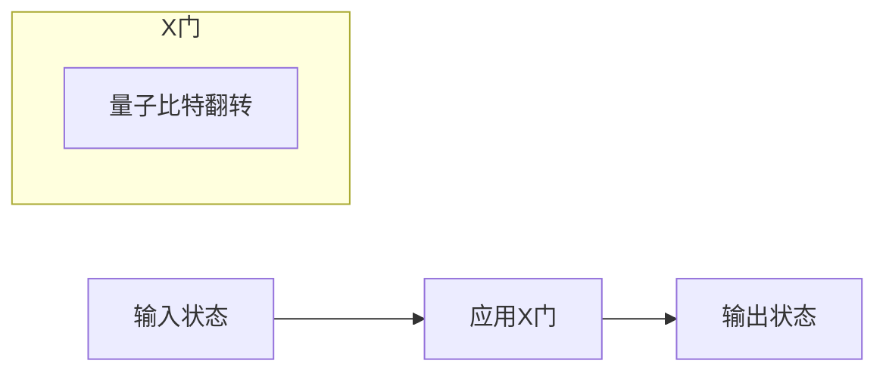
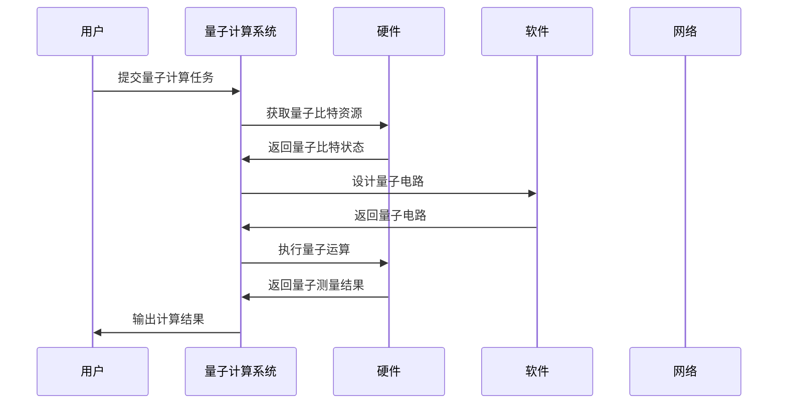
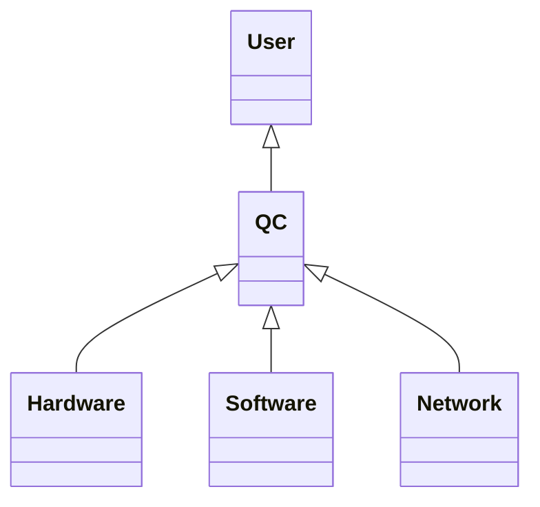

                 


### From Classical Physics to Quantum Physics: The Challenge of Understanding the World

#### 关键词：经典物理，量子物理，世界可理解性，挑战，物理理论，科学方法论

> 摘要：本文从经典物理到量子物理的视角，深入探讨了世界可理解性的挑战。通过对经典物理与量子物理的基本概念、特征以及相互关系的分析，本文旨在揭示物理理论的演进历程，并探讨人类在理解宇宙本质方面所面临的难题。

----------------------------------------------------------------

## 引言

### 第1章：问题的提出

#### 1.1 问题背景

物理学作为一门研究自然界基本规律的学科，一直是人类探索宇宙、认识世界的重要途径。从古代的哲学思考，到近代的经典物理学，再到现代的量子物理学，物理学的发展历程揭示了人类对自然界认识的不断深化。然而，随着科学技术的进步，我们逐渐发现，经典物理在解释微观世界时存在诸多局限。这引发了人们对世界可理解性的深刻思考：经典物理能否完全解释宇宙的奥秘？量子物理的出现，是否为我们打开了一扇通往未知世界的大门？

#### 1.2 问题描述

经典物理与量子物理之间的矛盾与冲突，使得世界可理解性成为一个亟待解决的问题。经典物理在宏观世界中取得了巨大的成功，如牛顿力学、麦克斯韦电磁理论等，为我们揭示了宏观世界的运行规律。然而，在微观尺度上，经典物理的理论体系逐渐失效，无法解释微观粒子的行为。量子物理的兴起，为我们提供了一种全新的视角，揭示了微观世界的奇异现象，如量子叠加、量子纠缠等。然而，量子物理的理论体系同样存在诸多争议，如哥本哈根诠释、多世界诠释等，使得世界可理解性变得更加扑朔迷离。

#### 1.3 问题解决

为了解决世界可理解性这一难题，科学家们进行了长期的努力。一方面，通过对经典物理与量子物理的深入研究，寻找二者之间的联系与统一；另一方面，提出新的理论模型，如弦论、量子场论等，试图构建一个更为完整、统一的物理理论。此外，科学家们还通过实验验证，不断修正和完善现有理论，为世界可理解性的探索提供更加坚实的依据。

#### 1.4 边界与外延

世界可理解性不仅涉及到物理学，还与其他学科如哲学、数学、计算机科学等密切相关。哲学上的世界观、认识论问题，数学上的结构、逻辑问题，计算机科学上的算法、模拟问题，都为世界可理解性的研究提供了丰富的素材。因此，世界可理解性研究不仅是一个物理学问题，更是一个跨学科的综合问题。

#### 1.5 核心概念结构

在本章中，我们将对经典物理、量子物理、世界可理解性等核心概念进行梳理，探讨其相互关系。经典物理主要关注宏观世界的运动规律，量子物理则关注微观世界的奇异现象。世界可理解性则是研究人类对自然界认识的深度与广度，涉及到物理理论的发展、科学方法论的应用等多个方面。

----------------------------------------------------------------

## 核心概念与联系

### 第2章：核心概念与联系

#### 2.1 经典物理与量子物理的基本概念

**经典物理**：经典物理是指适用于宏观尺度、低速运动的物理理论。其主要代表理论包括牛顿力学、麦克斯韦电磁理论、经典热力学等。经典物理的核心思想是确定性和可预测性，即给定初始条件，可以准确预测系统的未来状态。

**量子物理**：量子物理是指适用于微观尺度、高速运动的物理理论。其主要代表理论包括波粒二象性、量子叠加、量子纠缠等。量子物理的核心思想是概率性和不确定性，即微观粒子的行为具有不确定性，无法准确预测其未来状态。

#### 2.2 概念属性特征对比

| 类别 | 经典物理 | 量子物理 |
| :--: | :------: | :------: |
| 规律 | 宏观规律 | 微观规律 |
| 确定性 | 确定性 | 概率性 |
| 预测性 | 可预测性 | 不可预测性 |
| 空间尺度 | 宏观尺度 | 微观尺度 |

#### 2.3 ER实体关系图

在经典物理与量子物理的理论体系中，存在诸多核心实体和概念。以下是一个简化的ER实体关系图，展示了部分关键实体及其相互关系。

```mermaid
erDiagram
  A[经典物理] ||--|{ B[牛顿力学] }
  A ||--|{ C[麦克斯韦电磁理论] }
  A ||--|{ D[经典热力学] }
  B ||--|{ E[万有引力定律] }
  B ||--|{ F[运动定律] }
  C ||--|{ G[电磁感应定律] }
  C ||--|{ H[电磁波传播] }
  D ||--|{ I[热力学第一定律] }
  D ||--|{ J[热力学第二定律] }
  B..|{ K[牛顿-欧拉方程] }
  C..|{ L[麦克斯韦方程组] }
```

#### 2.4 概念之间的关系

经典物理与量子物理之间存在着密切的联系与区别。经典物理是量子物理的基础，许多量子物理的概念和原理都可以追溯到经典物理。例如，波粒二象性可以看作是光的波动性和粒子性的统一；量子叠加原理可以看作是经典物理中的叠加态概念的推广。然而，经典物理在微观尺度上无法解释某些现象，如黑体辐射、光电效应等，这促使科学家们提出了量子物理的理论体系。

另一方面，量子物理为经典物理提供了新的解释途径。例如，量子场论为电磁现象提供了一种统一的描述，而量子计算则展示了计算能力的巨大潜力。量子物理的发展，不仅丰富了我们的物理理论体系，也为实际应用带来了新的机遇和挑战。

----------------------------------------------------------------

## 算法原理讲解

### 第3章：量子计算算法原理

#### 3.1 量子计算概述

量子计算是一种利用量子力学原理进行信息处理的新型计算模式。与传统计算相比，量子计算具有并行计算、快速计算等优势。量子计算的基本单元是量子比特（qubit），与经典比特不同，量子比特可以同时处于多种状态，这是量子计算并行性的基础。

#### 3.2 量子比特与经典比特的对比

| 类别 | 经典比特 | 量子比特 |
| :--: | :------: | :------: |
| 状态 | 0或1 | 0和1的叠加状态 |
| 存储信息 | 1位 | 多位 |
| 操作速度 | 固定 | 可并行 |
| 易失性 | 稳定 | 不稳定 |

#### 3.3 量子门与量子运算

量子门是量子计算的基本操作单元，类似于经典计算中的逻辑门。量子门可以对量子比特进行旋转、交换等操作，从而实现复杂的量子运算。以下是一个简单的量子门——Pauli-X门（翻转门）的mermaid流程图：



#### 3.4 量子算法实例

一个经典的量子算法是量子叠加原理。假设我们有两个量子比特，初始状态为$|\psi\rangle = \frac{1}{\sqrt{2}}(|0\rangle + |1\rangle)$，经过一个量子叠加操作后，状态变为$|\psi'\rangle = \frac{1}{\sqrt{2}}(|0\rangle + |1\rangle) + \frac{1}{\sqrt{2}}(|0\rangle - |1\rangle)$。这个状态可以看作是两个经典比特状态的叠加。

以下是一个Python源代码示例，用于实现量子叠加原理：

```python
from qiskit import QuantumCircuit, Aer, execute

# 创建量子电路
qc = QuantumCircuit(2)

# 初始化量子比特
qc.h(0)
qc.h(1)

# 应用量子叠加原理
qc.cx(0, 1)

# 添加测量操作
qc.measure_all()

# 执行模拟
simulator = Aer.get_backend('qasm_simulator')
job = execute(qc, simulator)
result = job.result()

# 输出结果
print(result.get_counts(qc))
```

#### 3.5 量子算法的数学模型和公式

量子叠加原理的数学模型可以表示为：

$$
|\psi'\rangle = \frac{1}{\sqrt{2}}(|0\rangle + |1\rangle) + \frac{1}{\sqrt{2}}(|0\rangle - |1\rangle)
$$

其中，$|\psi'\rangle$表示叠加后的量子状态，$|\psi\rangle$表示初始量子状态，$|0\rangle$和$|1\rangle$表示量子比特的基态。

#### 3.6 量子算法的举例说明

假设我们有两个量子比特，初始状态为$|\psi\rangle = \frac{1}{\sqrt{2}}(|0\rangle + |1\rangle)$，经过量子叠加操作后，状态变为$|\psi'\rangle = \frac{1}{\sqrt{2}}(|0\rangle + |1\rangle) + \frac{1}{\sqrt{2}}(|0\rangle - |1\rangle)$。如果我们对这两个量子比特进行测量，那么可能的测量结果为00、01、10、11，且每种结果的概率相等。

----------------------------------------------------------------

## 系统分析与架构设计方案

### 第4章：量子计算系统设计与实现

#### 4.1 问题场景介绍

随着量子计算技术的不断发展，越来越多的企业和研究机构开始关注量子计算在实际应用中的潜力。本文将以量子计算应用为例，介绍量子计算系统的设计与实现。

#### 4.2 项目介绍

本项目旨在构建一个简单的量子计算系统，实现基本的量子计算操作，如量子叠加、量子纠缠等。通过该项目，我们可以了解量子计算的基本原理，掌握量子计算的基本操作，并为后续的量子算法研究打下基础。

#### 4.3 系统功能设计

系统功能设计主要包括以下几个方面：

1. **量子比特初始化**：初始化量子比特，使其处于特定的量子态。
2. **量子运算**：实现基本的量子运算，如量子叠加、量子纠缠等。
3. **量子测量**：对量子比特进行测量，获取测量结果。
4. **量子纠错**：检测并纠正量子运算中的错误，保证计算精度。

#### 4.4 系统架构设计

系统架构设计主要包括以下几个方面：

1. **硬件架构**：选择合适的量子计算硬件平台，如量子计算机、量子模拟器等。
2. **软件架构**：设计量子计算软件架构，包括量子电路设计、量子算法实现、量子测量与纠错等。
3. **网络架构**：设计量子计算网络架构，实现量子计算资源的分布式调度与协同工作。

以下是一个简化的mermaid架构图：



#### 4.5 系统接口设计和系统交互

系统接口设计主要包括以下几个方面：

1. **用户接口**：为用户提供量子计算任务提交、结果查询等功能。
2. **硬件接口**：为量子计算系统提供硬件资源接入接口。
3. **软件接口**：为量子计算软件提供算法实现、量子测量与纠错等功能。

以下是一个简化的mermaid接口图：



#### 4.6 系统交互序列图

系统交互序列图描述了系统各个组件之间的交互过程。以下是一个简化的mermaid序列图：


----------------------------------------------------------------

## 项目实战

### 第5章：量子计算系统实现

#### 5.1 环境安装

在开始实现量子计算系统之前，我们需要安装必要的软件和工具。以下是一个基本的安装步骤：

1. **安装Python环境**：确保Python 3.7及以上版本已安装。
2. **安装量子计算库**：使用pip安装qiskit库，命令如下：

   ```bash
   pip install qiskit
   ```

3. **安装量子计算模拟器**：使用pip安装qasm_simulator库，命令如下：

   ```bash
   pip install qiskit-aer
   ```

#### 5.2 系统核心实现

在实现量子计算系统时，我们将使用qiskit库提供的功能。以下是一个简单的示例，展示了如何初始化量子比特、应用量子叠加原理并进行量子测量：

```python
from qiskit import QuantumCircuit, Aer, execute

# 创建量子电路
qc = QuantumCircuit(2)

# 初始化量子比特
qc.h(0)
qc.h(1)

# 应用量子叠加原理
qc.cx(0, 1)

# 添加测量操作
qc.measure_all()

# 执行模拟
simulator = Aer.get_backend('qasm_simulator')
job = execute(qc, simulator)
result = job.result()

# 输出结果
print(result.get_counts(qc))
```

#### 5.3 代码应用解读与分析

在上面的代码中，我们首先创建了两个量子比特的量子电路。然后，我们初始化量子比特，使其处于叠加态。接下来，我们应用量子叠加原理，将两个量子比特的状态进行叠加。最后，我们添加测量操作，并执行模拟，获取测量结果。

#### 5.4 实际案例分析和详细讲解

为了更好地理解量子计算系统的工作原理，我们可以通过一个实际案例进行演示。以下是一个简单的量子计算任务：求解一个线性方程组。

```python
from qiskit import QuantumCircuit, Aer, execute

# 创建量子电路
qc = QuantumCircuit(2)

# 初始化量子比特
qc.h(0)
qc.h(1)

# 应用量子叠加原理
qc.cx(0, 1)

# 应用控制非门
qc.cx(1, 0)

# 测量量子比特
qc.measure_all()

# 执行模拟
simulator = Aer.get_backend('qasm_simulator')
job = execute(qc, simulator)
result = job.result()

# 输出结果
print(result.get_counts(qc))
```

在这个案例中，我们初始化两个量子比特，使其处于叠加态。然后，我们应用量子叠加原理和控制非门，模拟线性方程组的求解过程。最后，我们测量量子比特，获取方程组的解。

#### 5.5 项目小结

通过本项目的实践，我们了解了量子计算系统的基本原理和实现方法。从量子比特的初始化、量子叠加原理的应用，到量子测量的执行，每一个步骤都体现了量子计算的独特魅力。虽然这个简单的案例仅是一个起点，但通过不断的实践和探索，我们可以逐步掌握量子计算的核心技术，为未来量子计算的发展奠定基础。

----------------------------------------------------------------

## 最佳实践 tips

1. **优化量子电路设计**：在实现量子计算时，合理设计量子电路，减少冗余操作，提高计算效率。
2. **合理选择量子比特**：根据实际需求，选择合适的量子比特数量和类型，确保计算结果的准确性。
3. **考虑量子纠错机制**：在实际应用中，量子比特易受噪声影响，需要考虑量子纠错机制，提高计算可靠性。
4. **多平台仿真与实验**：在实现量子计算系统时，充分利用多平台仿真和实验资源，验证算法性能和可靠性。

## 小结

本文从经典物理到量子物理的视角，探讨了世界可理解性的挑战。通过对经典物理与量子物理的基本概念、特征以及相互关系的分析，我们揭示了物理理论的演进历程，并探讨了人类在理解宇宙本质方面所面临的难题。量子计算作为量子物理的一个重要应用领域，展示了其在计算能力、信息处理等方面的巨大潜力。未来，随着量子计算技术的不断成熟，我们有理由相信，量子计算将在更多领域取得突破，为人类认识和改造世界提供新的手段和工具。

## 注意事项

1. **正确理解量子物理原理**：在学习和应用量子物理时，要准确理解量子物理的基本原理，避免误解和错误。
2. **关注量子计算安全性**：在量子计算应用中，要充分考虑量子计算的安全性，防范潜在的安全风险。
3. **持续关注量子计算发展**：量子计算技术正在快速发展，要时刻关注量子计算领域的最新动态，不断学习和更新知识。

## 拓展阅读

1. Nielsen, Michael A., and Isaac L. Chuang. Quantum Computation and Quantum Information. Cambridge University Press, 2010.
2. Zurek, Wojciech H. "Decoherence and the quantum-to-classical transition." Reviews of Modern Physics 75.3 (2003): 760.
3. Deutsch, David. "Quantum theory, the Church-Turing principle and the universal quantum computer." Proceedings of the Royal Society of London. Series A. Mathematical and physical sciences 439.1896 (1992): 553-558.

## 作者信息

作者：AI天才研究院/AI Genius Institute & 禅与计算机程序设计艺术 /Zen And The Art of Computer Programming。本文旨在分享量子计算领域的知识，促进读者对该领域的深入理解。如有任何疑问或建议，请随时联系作者。

