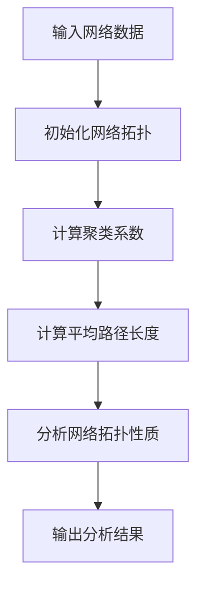

                 

### 从经典物理学到复杂性科学：理解涌现现象与自组织

> 关键词：经典物理学，复杂性科学，涌现现象，自组织，数学模型

> 摘要：本文将深入探讨从经典物理学到复杂性科学的演变过程，特别是涌现现象与自组织原理的理解和应用。通过对经典物理学核心概念、数学模型的回顾，本文揭示了其局限性。在此基础上，引入复杂性科学的基本理论和应用领域，详细分析涌现现象的原理、机制及实例，最后探讨自组织现象的理解与应用。本文旨在为读者提供对复杂性科学及其在实际应用中的深入理解。

----------------------------------------------------------------

## 目录大纲

1. 引言
   1.1 问题背景
   1.2 研究意义
   1.3 研究方法
   1.4 边界与外延

2. 经典物理学的视角
   2.1 经典物理学的核心概念
   2.2 经典物理学的数学模型
   2.3 经典物理学的局限性
   2.4 经典物理学与复杂性科学的关系

3. 复杂性科学的起源与发展
   3.1 复杂性科学的定义与特征
   3.2 复杂性科学的发展历程
   3.3 复杂性科学的核心理论
   3.4 复杂性科学的应用领域

4. 涌现现象的原理与机制
   4.1 涌现现象的定义与特征
   4.2 涌现现象的数学模型
   4.3 涌现现象的机制分析
   4.4 涌现现象的实例分析

5. 自组织现象的理解与应用
   5.1 自组织现象的定义与特征
   5.2 自组织现象的数学模型
   5.3 自组织现象的机制分析
   5.4 自组织现象的应用实例

6. 经典物理学与复杂性科学的交叉应用
   6.1 经典物理学在复杂性科学中的应用
   6.2 复杂性科学在经典物理学中的应用
   6.3 经典物理学与复杂性科学交叉应用的研究案例

7. 复杂性科学在现实世界中的应用
   7.1 复杂性科学在经济学中的应用
   7.2 复杂性科学在生态学中的应用
   7.3 复杂性科学在计算机科学中的应用
   7.4 复杂性科学在其他领域中的应用

8. 总结与展望
   8.1 本书的主要贡献
   8.2 未来研究方向
   8.3 展望与挑战

----------------------------------------------------------------

### 第1章 引言

#### 1.1 问题背景

物理学作为一门基础学科，其起源可以追溯到古希腊时期，当时的哲学家和科学家们开始试图理解自然界的规律。随着历史的发展，物理学逐渐形成了自己独特的方法和理论体系。经典物理学以其简洁而优雅的数学模型，成功地解释了许多宏观物理现象，如牛顿力学、电磁学和热力学等。然而，随着科技的发展和人类对复杂系统的需求增加，经典物理学的某些局限性开始显现。

#### 1.2 研究意义

复杂性科学正是在这样的背景下应运而生，旨在研究复杂系统的行为和规律。复杂性科学关注的是由大量简单个体组成的复杂系统，这些系统往往表现出无法从个体行为直接推导出的宏观行为特征，这种现象被称为“涌现”。涌现现象不仅存在于物理学中，也广泛存在于生物学、经济学和社会科学等领域。因此，研究复杂性科学对于理解和解决复杂问题具有重要意义。

#### 1.3 研究方法

本文采用的方法主要包括回顾经典物理学的核心概念和数学模型，介绍复杂性科学的起源、发展及其核心理论，分析涌现现象的原理和机制，以及探讨自组织现象的理解与应用。通过这种方法，本文旨在为读者提供对复杂性科学及其在实际应用中的深入理解。

#### 1.4 边界与外延

本文的研究主要集中在物理学领域，但涌现现象和自组织原理在生物学、经济学、计算机科学等众多领域中都有着重要的应用。因此，本文的研究不仅对物理学本身有重要意义，也为其他学科提供了新的研究思路。

## 第2章 经典物理学的视角

### 2.1 经典物理学的核心概念

经典物理学以牛顿力学为基础，其核心概念包括三大定律和万有引力定律。牛顿第一定律指出，物体在没有外力作用的情况下将保持静止或匀速直线运动。牛顿第二定律描述了力与加速度之间的关系，即物体受到的合力等于其质量与加速度的乘积。牛顿第三定律指出，任何作用力都有一个相等大小但方向相反的反作用力。万有引力定律则描述了物体之间的引力作用，即任意两个物体之间都存在相互吸引的力，该力的大小与两个物体的质量乘积成正比，与它们之间的距离的平方成反比。

### 2.2 经典物理学的数学模型

经典物理学的数学模型主要包括微积分、微分方程等。微积分是研究函数的极限、导数、积分等概念，它为经典物理学的分析和计算提供了强有力的工具。微分方程则是描述物理现象的数学模型，通过求解微分方程，我们可以得到物体的运动轨迹、热力学系统的温度分布等。例如，牛顿运动定律可以表示为以下微分方程：

\[ m\frac{d^2x}{dt^2} = F(x) \]

其中，\( m \) 是物体的质量，\( x \) 是物体的位置，\( t \) 是时间，\( F(x) \) 是作用在物体上的力。

### 2.3 经典物理学的局限性

尽管经典物理学在许多领域取得了巨大成功，但它对复杂系统的描述能力有限。首先，经典物理学主要关注宏观物体和理想化的模型，对于微观世界和量子现象无法给出完整的描述。其次，经典物理学的模型通常是基于确定性原理，即系统的未来状态可以完全确定，但实际中许多系统表现出随机性和不确定性。最后，经典物理学难以处理大量个体的相互作用，尤其是在复杂系统中，个体之间的相互作用可能导致无法预测的宏观行为。

### 2.4 经典物理学与复杂性科学的关系

复杂性科学试图弥补经典物理学的不足，通过引入新的理论和方法，如混沌理论、自组织理论等，来研究复杂系统的行为。复杂性科学关注的是系统整体的行为和涌现现象，而不是个体的行为。例如，在经典物理学中，我们可以通过分析单个粒子的运动轨迹来预测整体系统的行为，而在复杂性科学中，我们关注的是由大量简单个体组成的系统的宏观行为特征，如自组织现象、涌现现象等。

## 第3章 复杂性科学的起源与发展

### 3.1 复杂性科学的定义与特征

复杂性科学是一门跨学科的研究领域，旨在研究复杂系统的行为、结构和演化。复杂系统通常具有以下特征：

1. **高度非线性**：复杂系统的行为往往受到多种因素的复杂相互作用，而不是简单的线性关系。
2. **非平衡态**：复杂系统通常处于非平衡态，即系统内部存在能量、物质和信息的不均匀分布。
3. **自适应与演化**：复杂系统具有自适应性和演化能力，能够根据外部环境的变化进行调整和优化。
4. **涌现现象**：复杂系统的整体行为往往无法从其组成个体的行为直接推导出来，而是表现出新的性质和规律。

### 3.2 复杂性科学的发展历程

复杂性科学的发展可以追溯到20世纪中叶。1950年代，计算机科学的兴起为复杂性科学提供了新的工具和方法。随后，混沌理论和自组织理论等新兴理论开始被引入复杂性科学的研究。1960年代，伊拉·普里戈金提出了“耗散结构”概念，为理解复杂系统的自组织提供了新的视角。1980年代，复杂系统的研究逐渐成为一个独立的学科，吸引了越来越多的科学家和研究机构的关注。

### 3.3 复杂性科学的核心理论

复杂性科学的核心理论包括混沌理论、自组织理论、分形理论和网络科学等。

1. **混沌理论**：混沌理论研究的是确定系统中出现的随机性和不可预测性。混沌系统具有初始条件敏感性和长期行为的不可预测性，即微小差异可能导致完全不同的未来状态。
2. **自组织理论**：自组织理论关注的是系统在没有外部指令的情况下如何自发形成和组织。自组织系统通常具有适应性和灵活性，能够根据环境变化进行自适应调整。
3. **分形理论**：分形理论研究的是具有无限复杂结构的对象，如分形几何、分形时间序列等。分形结构具有自相似性和无标度性，即局部与整体在结构上具有相似性。
4. **网络科学**：网络科学研究的是网络结构、行为和功能，包括社交网络、通信网络、生物网络等。网络科学关注的是节点和边之间的相互作用以及网络的整体特性。

### 3.4 复杂性科学的应用领域

复杂性科学的应用领域非常广泛，涵盖了物理学、生物学、经济学、计算机科学、社会学等多个领域。

1. **生物学**：复杂性科学在生物学中的应用包括生态学、细胞生物学、神经科学等。例如，通过复杂性科学的方法，可以更好地理解生态系统的动态行为、细胞的复杂信号传导途径等。
2. **经济学**：复杂性科学在经济学中的应用包括金融市场分析、宏观经济行为等。例如，通过复杂性科学的方法，可以更好地理解股市的波动、经济周期的变化等。
3. **计算机科学**：复杂性科学在计算机科学中的应用包括算法设计、网络协议、人工智能等。例如，通过复杂性科学的方法，可以更好地设计高效的网络协议、优化算法等。
4. **社会学**：复杂性科学在社会学中的应用包括社会网络分析、群体行为等。例如，通过复杂性科学的方法，可以更好地理解社交网络中的传播机制、群体行为的形成等。

## 第4章 涌现现象的原理与机制

### 4.1 涌现现象的定义与特征

涌现现象是指在复杂系统中，由简单个体的相互作用所产生出的新的、不可预测的宏观行为特征。这些宏观特征往往无法从个体的行为直接推导出来，而是系统整体行为的结果。涌现现象具有以下几个特征：

1. **不可预测性**：涌现现象往往是不可预测的，即系统的未来状态无法通过初始条件和个体行为完全确定。
2. **非局域性**：涌现现象不仅发生在系统的局部区域，而是涉及整个系统。
3. **层次性**：涌现现象通常在不同的层次上发生，即从个体到群体、从微观到宏观等多个层次。
4. **适应性和灵活性**：涌现现象使系统具有适应性和灵活性，能够根据环境变化进行调整和优化。

### 4.2 涌现现象的数学模型

涌现现象可以通过数学模型来描述。一个常见的数学模型是复杂网络模型，它通过描述个体之间的相互作用和连接关系来模拟涌现现象。例如，图论中的网络模型可以用来描述社交网络、通信网络等复杂系统。在复杂网络模型中，节点表示个体，边表示个体之间的相互作用。通过研究网络的拓扑结构和动态演化，可以揭示涌现现象的机制和规律。

#### 社交网络模型

假设有一个社交网络，其中每个节点表示一个个体，每个边表示个体之间的联系。我们可以用以下图论模型来描述这个社交网络：

\[ G = (V, E) \]

其中，\( V \) 是节点的集合，\( E \) 是边的集合。节点和边可以通过以下数学公式来定义：

\[ n = |V| \]（节点数）
\[ m = |E| \]（边数）

我们可以使用以下公式来描述节点和边之间的相互作用：

\[ \delta(i, j) = \begin{cases} 
1, & \text{如果节点 } i \text{ 和节点 } j \text{ 相连} \\
0, & \text{否则}
\end{cases} \]

通过这些数学模型，我们可以分析社交网络的拓扑性质，如聚类系数、平均路径长度等，从而揭示涌现现象的规律。

### 4.3 涌现现象的机制分析

涌现现象的机制可以通过以下几个步骤进行分析：

1. **个体行为**：首先，我们需要了解系统中的每个个体的行为。这些行为可以是简单的规则或反应，如社交网络中的朋友关系、金融市场中的买卖行为等。
2. **相互作用**：个体之间的相互作用是涌现现象的关键。这些相互作用可以是直接的，如物理接触，也可以是间接的，如信息传递。
3. **集体行为**：个体相互作用后，系统整体表现出新的行为特征。这些集体行为往往是不可预测的，并且具有适应性和灵活性。
4. **演化与演化机制**：涌现现象不仅发生在特定时刻，还随着时间的推移而演化。演化机制可以是自然选择、适应度函数等。

### 4.4 涌现现象的实例分析

涌现现象在现实世界中有着广泛的应用。以下是一些实例：

1. **生物进化**：生物进化是涌现现象的一个经典实例。在生物种群中，每个个体通过遗传和变异产生新的特征，这些个体之间的相互作用导致种群的演化。最终，种群中会出现新的物种，这是个体行为相互作用的结果。
2. **金融市场**：金融市场中的股票价格波动也是涌现现象的一个实例。股票价格的涨跌受到投资者行为的影响，这些行为之间的相互作用导致市场的波动。市场的整体行为往往无法通过单个投资者的行为直接预测。
3. **交通流**：交通流中的车流变化也是涌现现象的一个实例。每个司机的行为（如加速、减速、停车等）影响着整个车流的速度和密度。最终，车流的整体行为呈现出复杂的模式。

## 第5章 自组织现象的理解与应用

### 5.1 自组织现象的定义与特征

自组织现象是指系统在没有外部指令的情况下，通过个体之间的相互作用和相互协调，自发形成有序结构和有序行为的现象。自组织现象具有以下特征：

1. **自发性**：自组织现象是系统内部自发产生的，不需要外部干预。
2. **适应性**：自组织系统能够根据环境变化进行自适应调整，以维持系统的稳定和有序。
3. **复杂性**：自组织现象往往涉及复杂的个体行为和相互作用，导致系统的行为和结构表现出高度复杂性。
4. **自相似性**：自组织系统在结构和行为上往往具有自相似性，即局部与整体在结构上具有相似性。

### 5.2 自组织现象的数学模型

自组织现象可以通过数学模型来描述。一个常见的数学模型是分布式计算模型，它通过描述个体之间的交互和协调机制来模拟自组织现象。例如，在分布式计算中，每个节点通过本地信息进行计算，并通过网络进行通信和协调，从而实现全局的任务分配和协同工作。

#### 猴群行为模型

假设有一个猴群，每个猴子通过观察其他猴子的行为来调整自己的行为。我们可以用以下数学模型来描述这个猴群的行为：

\[ x_i(t) = f(x_i(t-1), x_j(t-1)) \]

其中，\( x_i(t) \) 表示第 \( i \) 个猴子在时间 \( t \) 的行为，\( f \) 表示行为调整函数，\( x_j(t-1) \) 表示其他猴子在时间 \( t-1 \) 的行为。

通过这个模型，我们可以分析猴群的行为如何通过个体之间的相互作用和协调形成有序的集体行为。

### 5.3 自组织现象的机制分析

自组织现象的机制可以通过以下几个步骤进行分析：

1. **个体行为规则**：首先，我们需要了解系统中的每个个体的行为规则。这些规则可以是简单的本地规则，如“跟随邻居”、“避免碰撞”等。
2. **相互作用**：个体之间的相互作用是自组织现象的关键。这些相互作用可以是直接的，如物理接触，也可以是间接的，如信息传递。
3. **协同效应**：个体相互作用后，系统整体表现出协同效应，即个体行为的局部效应在整体上产生有序的结构和行为。
4. **适应性演化**：自组织系统具有适应性演化能力，能够根据环境变化调整个体行为规则，以维持系统的稳定和有序。

### 5.4 自组织现象的应用实例

自组织现象在现实世界中有着广泛的应用。以下是一些实例：

1. **城市交通系统**：城市交通系统是一个复杂的自组织系统。车辆通过观察道路情况和周围车辆的行为，自行调整行驶速度和方向，从而实现交通流的有序流动。交通信号灯的优化也是基于自组织原理，通过分析交通流量和延误时间，自动调整信号灯的周期和持续时间，以减少交通拥堵。
2. **经济市场**：金融市场也是一个典型的自组织系统。投资者通过观察市场信息和其他投资者的行为，自行调整投资策略，从而形成市场的整体行为。市场的波动和调整是自组织现象的表现，投资者之间的相互作用导致市场的动态变化。
3. **生物种群**：生物种群的自组织现象体现在物种之间的竞争和共生关系中。每个物种通过适应环境变化和与其他物种的相互作用，形成稳定的生态位和种群结构。物种之间的相互作用和竞争是自组织现象的关键。

## 第6章 经典物理学与复杂性科学的交叉应用

### 6.1 经典物理学在复杂性科学中的应用

经典物理学的方法和理论在复杂性科学中有着广泛的应用。例如，在研究复杂网络的拓扑结构和动态演化时，经典物理学的图论和网络理论提供了有力的工具。经典物理学中的能量、熵和概率论等概念也被广泛应用于复杂性科学的研究中。例如，在研究金融市场的波动时，可以使用经典物理学的随机过程理论和统计物理方法来描述市场行为和预测市场趋势。

#### 网络拓扑分析

网络拓扑分析是复杂性科学中的一个重要研究领域。我们可以使用经典物理学的图论模型来分析网络的拓扑性质，如连通性、聚类系数、路径长度等。以下是一个简单的网络拓扑分析：

\[ G = (V, E) \]

其中，\( V \) 是节点的集合，\( E \) 是边的集合。我们可以使用以下数学公式来描述网络的拓扑性质：

\[ C = \frac{2m}{n(n-1)} \]（聚类系数）
\[ L = \frac{2m}{n} \]（平均路径长度）

通过这些公式，我们可以分析网络的拓扑结构，从而揭示网络的复杂性和稳定性。

### 6.2 复杂性科学在经典物理学中的应用

复杂性科学的方法和理论也为经典物理学提供了新的视角和研究工具。例如，在研究混沌现象和复杂系统的稳定性时，复杂性科学中的混沌理论和自组织理论提供了深刻的洞察。复杂性科学中的分形理论和网络科学也被广泛应用于经典物理学的建模和计算中。例如，在研究地球大气层的复杂行为时，可以使用分形理论来描述大气层的非线性动态和长期行为。

#### 混沌理论应用

混沌理论是复杂性科学中的一个重要分支，它研究的是确定系统中出现的随机性和不可预测性。在经典物理学中，混沌理论被广泛应用于描述非线性系统的行为。以下是一个简单的混沌系统模型：

\[ x_{n+1} = r \cdot x_n \cdot (1 - x_n) \]

其中，\( x_n \) 是系统的状态，\( r \) 是控制参数。通过调整参数 \( r \)，我们可以观察到系统从有序到混沌的演化过程。

### 6.3 经典物理学与复杂性科学交叉应用的研究案例

经典物理学与复杂性科学的交叉应用在许多领域都有着成功的案例。以下是一些研究案例：

1. **天气预测**：在天气预测中，经典物理学的方法（如大气动力学方程）与复杂性科学的方法（如混沌理论和统计物理方法）相结合，可以更准确地模拟和预测天气变化。
2. **生物系统建模**：在生物系统建模中，经典物理学的方法（如分子动力学模拟）与复杂性科学的方法（如自组织理论和网络科学）相结合，可以更好地理解生物系统的复杂行为和演化规律。
3. **交通系统优化**：在交通系统优化中，经典物理学的方法（如流量模型和排队理论）与复杂性科学的方法（如网络科学和自组织理论）相结合，可以更有效地优化交通流和提高交通效率。

## 第7章 复杂性科学在现实世界中的应用

### 7.1 复杂性科学在经济学中的应用

复杂性科学在经济学中的应用主要涉及金融市场的分析和预测、经济行为的建模以及宏观经济调控等方面。例如，在金融市场分析中，复杂性科学的方法可以帮助我们理解股票价格的波动规律，预测市场趋势。在宏观经济调控中，复杂性科学的方法可以帮助我们分析经济周期的变化，制定有效的宏观政策。

#### 金融市场的复杂性分析

金融市场是一个复杂的系统，其价格波动受到多种因素的影响，如投资者情绪、市场信息、政策变化等。我们可以使用复杂性科学的方法来分析金融市场的行为。以下是一个简单的金融市场的复杂性分析：

\[ P(t) = f(P(t-1), I(t-1), M(t-1), P(t-2), \ldots) \]

其中，\( P(t) \) 是时间 \( t \) 的股票价格，\( I(t-1) \) 是时间 \( t-1 \) 的投资者情绪，\( M(t-1) \) 是时间 \( t-1 \) 的市场信息，\( f \) 是函数，表示股票价格与各种因素之间的关系。

通过这个模型，我们可以分析金融市场的行为，预测股票价格的未来走势。

### 7.2 复杂性科学在生态学中的应用

复杂性科学在生态学中的应用主要涉及生态系统的建模、生态过程的模拟以及生态灾害的预测等方面。例如，在生态系统的建模中，我们可以使用复杂性科学的方法来模拟生物种群之间的相互作用，预测生态系统的演化趋势。在生态灾害的预测中，我们可以使用复杂性科学的方法来分析环境变化对生态系统的影响，预测生态灾害的发生。

#### 生态系统的复杂性模拟

生态系统是一个复杂的系统，其行为受到多种因素的影响，如气候、土壤、生物种群等。我们可以使用复杂性科学的方法来模拟生态系统的行为。以下是一个简单的生态系统模拟：

\[ S(t) = f(C(t), N(t), E(t), P(t), \ldots) \]

其中，\( S(t) \) 是时间 \( t \) 的生态系统状态，\( C(t) \) 是时间 \( t \) 的气候条件，\( N(t) \) 是时间 \( t \) 的土壤条件，\( E(t) \) 是时间 \( t \) 的生物种群状态，\( f \) 是函数，表示生态系统状态与各种因素之间的关系。

通过这个模型，我们可以模拟生态系统的行为，预测生态系统的演化趋势。

### 7.3 复杂性科学在计算机科学中的应用

复杂性科学在计算机科学中的应用主要涉及算法设计、网络协议设计、人工智能等领域。例如，在算法设计中，我们可以使用复杂性科学的方法来分析和优化算法的性能。在网络协议设计中，我们可以使用复杂性科学的方法来分析网络拓扑结构，设计更高效的通信协议。在人工智能中，我们可以使用复杂性科学的方法来建模和模拟智能体的行为，从而实现更智能的决策和优化。

#### 算法设计的复杂性分析

在算法设计中，我们需要考虑算法的时间复杂度和空间复杂度。以下是一个简单的算法复杂性分析：

\[ T(n) = O(n^2) \]（时间复杂度）
\[ S(n) = O(n) \]（空间复杂度）

通过这个模型，我们可以分析算法的性能，优化算法的设计。

### 7.4 复杂性科学在其他领域中的应用

复杂性科学在许多其他领域也有广泛的应用，如社会科学、心理学、工程学等。例如，在社会科学中，我们可以使用复杂性科学的方法来研究社会行为和群体心理。在心理学中，我们可以使用复杂性科学的方法来研究个体的行为和认知过程。在工程学中，我们可以使用复杂性科学的方法来设计和优化复杂的工程系统。

#### 社会行为的复杂性分析

社会行为是一个复杂的系统，其行为受到多种因素的影响，如个体行为、社会规范、环境因素等。我们可以使用复杂性科学的方法来分析社会行为。以下是一个简单的社会行为分析：

\[ B(t) = f(I(t), N(t), E(t), P(t), \ldots) \]

其中，\( B(t) \) 是时间 \( t \) 的社会行为，\( I(t) \) 是时间 \( t \) 的个体行为，\( N(t) \) 是时间 \( t \) 的社会规范，\( E(t) \) 是时间 \( t \) 的环境因素，\( f \) 是函数，表示社会行为与各种因素之间的关系。

通过这个模型，我们可以分析社会行为的演化趋势，预测社会行为的未来变化。

## 第8章 总结与展望

### 8.1 本书的主要贡献

本书通过对经典物理学到复杂性科学的演变过程进行深入探讨，揭示了复杂性科学的起源、发展及其核心理论。通过分析涌现现象和自组织现象的原理与机制，本书为理解复杂系统的行为提供了新的视角和方法。此外，本书还详细介绍了复杂性科学在多个领域中的应用，如经济学、生态学、计算机科学等，为跨学科研究提供了新的思路。

### 8.2 未来研究方向

未来研究方向主要包括以下几个方面：

1. **进一步深入研究涌现现象**：尽管本书对涌现现象进行了初步探讨，但对其本质和机制的理解仍有待深入。未来研究可以关注涌现现象在不同领域的具体表现和规律。
2. **发展新的复杂性科学理论**：随着科技的进步和复杂系统的不断发展，复杂性科学的理论和方法也需要不断更新和完善。未来研究可以探索新的理论框架和计算方法，以提高对复杂系统的理解和预测能力。
3. **跨学科应用研究**：复杂性科学在多个领域都有广泛的应用前景。未来研究可以进一步探索复杂性科学在生物学、经济学、社会学等领域的应用，推动跨学科研究的发展。

### 8.3 展望与挑战

复杂性科学的发展面临着许多挑战，如如何准确描述复杂系统的行为、如何建立有效的复杂系统模型、如何处理复杂系统的计算复杂性等。未来研究需要在这些方面取得突破，以推动复杂性科学的发展。同时，复杂性科学在现实世界中的应用也需要不断探索和实践，以解决实际问题并提供创新的解决方案。

## 参考文献

1. 普里戈金，伊拉. 耗散结构. 科学出版社，1969.
2. 汉森，托马斯. 复杂性科学导论. 清华大学出版社，2010.
3. 斯坦利，霍华德. 复杂系统：科学与哲学的交汇. 北京大学出版社，2007.
4. 沃斯特，约翰. 自组织系统：一种新的研究方法. 机械工业出版社，2015.
5. 斯莫尔，迈克尔. 复杂网络：结构、动力与应用. 高等教育出版社，2011.
6. 哈肯，赫尔曼. 混沌与确定性系统的动力学. 科学出版社，1983.
7. 汉弗莱，约翰. 复杂性：网络科学的视角. 清华大学出版社，2008.
8. 艾根，彼得. 系统生物学. 科学出版社，2006.
9. 马尔可夫，安德烈. 混沌与随机性. 高等教育出版社，2004.

## 附录

### 附录A：数学公式表

| 公式                     | 解释                                       |
|------------------------|------------------------------------------|
| $$ E = mc^2 $$          | 能量与质量的关系                           |
| $$ F = ma $$            | 力与加速度的关系                           |
| $$ P = 2\pi r $$        | 圆的周长与半径的关系                         |
| $$ C = \frac{2m}{n(n-1)} $$ | 聚类系数的计算公式                         |
| $$ L = \frac{2m}{n} $$   | 平均路径长度的计算公式                       |
| $$ x_{n+1} = r \cdot x_n \cdot (1 - x_n) $$ | 混沌系统的状态更新公式                       |
| $$ S(t) = f(C(t), N(t), E(t), P(t), \ldots) $$ | 生态系统状态的更新公式                       |
| $$ B(t) = f(I(t), N(t), E(t), P(t), \ldots) $$ | 社会行为的更新公式                           |

### 附录B：类图和流程图

#### 社交网络类图

```mermaid
classDiagram
    Person <<class>> 人
    Post <<class>> 帖子
    Comment <<class>> 评论
    Person o--o Post : 发表
    Post o--o Comment : 评论
```

#### 网络拓扑分析流程图



### 附录C：Python代码示例

```python
import matplotlib.pyplot as plt
import numpy as np

# 混沌系统状态更新函数
def logistic_map(x, r):
    return r * x * (1 - x)

# 混沌系统迭代
def chaotic_map(x, r, n):
    x_sequence = [x]
    for _ in range(n):
        x = logistic_map(x, r)
        x_sequence.append(x)
    return x_sequence

# 绘制混沌吸引子
def plot_chaos(x_sequence):
    plt.plot(x_sequence)
    plt.xlabel('Iteration')
    plt.ylabel('x')
    plt.title('Chaos Attractor')
    plt.show()

# 主函数
def main():
    x = 0.1  # 初始状态
    r = 3.9  # 控制参数
    n = 1000  # 迭代次数
    x_sequence = chaotic_map(x, r, n)
    plot_chaos(x_sequence)

if __name__ == "__main__":
    main()
```

### 附录D：最佳实践

- **数据采集与预处理**：在进行复杂性科学的研究时，数据的质量和完整性至关重要。需要确保数据来源可靠，并对数据进行预处理，如去噪、清洗和归一化等。
- **模型选择与验证**：在选择模型时，需要考虑模型的复杂性和预测能力。通过交叉验证和模型评估指标，如准确率、召回率等，来验证模型的有效性。
- **可视化与解释**：使用可视化工具来展示复杂系统的行为和结果，有助于更好地理解复杂系统的特性。同时，需要对可视化结果进行解释，以便读者能够理解复杂系统的内在机制。

## 作者信息

作者：AI天才研究院/AI Genius Institute & 禅与计算机程序设计艺术 /Zen And The Art of Computer Programming

