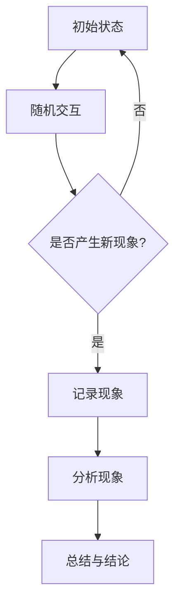
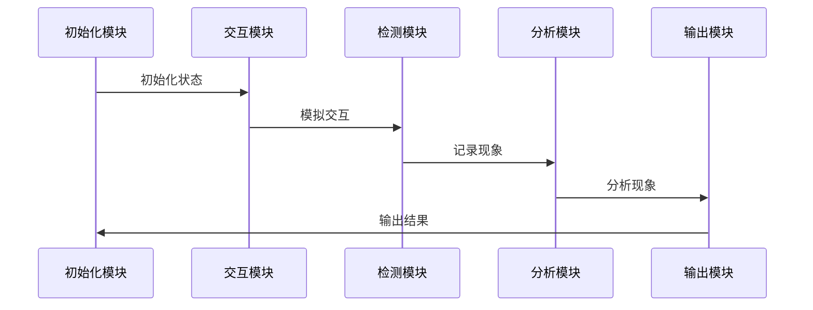

                 

### 从经典物理学到复杂性科学：理解涌现现象的新范式

> 关键词：复杂性科学、涌现现象、经典物理学、模拟算法、数学模型

> 摘要：本文探讨了从经典物理学到复杂性科学的研究范式转变，特别关注涌现现象的理解。通过阐述涌现现象的定义、背景和解决方法，结合复杂性科学的核心概念和经典物理学的联系，本文提出了新的研究思路，并详细讲解了涌现现象的模拟算法和数学模型。文章旨在为IT领域的研究者提供一种新的视角，以更好地理解和解决复杂系统问题。

### 研究背景与意义

#### 问题背景

随着计算机技术和信息技术的发展，物理学中的经典理论与复杂系统研究正在发生深刻的变革。经典物理学以确定性、可预测性为特征，但在面对复杂系统的实际问题时，传统方法往往显得力不从心。复杂系统通常具有大规模、高维度、非线性等特征，这些特征使得它们的行为难以用简单的数学模型来描述。

#### 问题描述

涌现现象是指在一个复杂系统中，局部相互作用在宏观层面上产生的新现象，这些现象在单个组成部分中并不存在。例如，在人工生命模拟中，个体行为简单的虫子能够形成复杂的群体行为；在经济学中，单个消费者的行为无法预测市场整体趋势。理解涌现现象对于解决复杂系统的实际问题具有重要意义。

#### 问题解决

复杂性科学提供了一种新的研究范式，它强调通过观察、模拟和计算来研究复杂系统。这种方法不仅能够揭示涌现现象的本质，还能为实际问题的解决提供新的思路。例如，通过模拟社会系统，可以预测社会动荡的潜在因素；通过研究生态系统的复杂性，可以提出更有效的环境保护策略。

#### 边界与外延

复杂性科学的研究范围广泛，包括生态学、经济学、社会学、生物物理学等多个领域。尽管如此，经典物理学的原理和方法仍然是理解复杂性科学的重要基础。本书旨在探讨经典物理学与复杂性科学的交叉点，研究如何将经典物理学的思想应用于复杂性科学的研究中。

### 核心概念与联系

#### 核心概念

- **复杂性科学**：研究复杂系统的科学，强调通过观察、模拟和计算来理解系统的整体行为。
- **涌现现象**：复杂系统中的局部相互作用在宏观层面上产生的新现象。
- **经典物理学**：以确定性、可预测性为特征的理论体系。

#### 概念属性特征对比表格

| 概念     | 定义                                       | 特征                     | 联系与交叉              |
|----------|------------------------------------------|------------------------|----------------------|
| 复杂性科学 | 研究复杂系统的科学                         | 大规模、非线性、高维       | 利用经典物理学的原理和方法 |
| 涌现现象 | 复杂系统中的局部相互作用在宏观层面上产生的新现象 | 无法预测、不可预测性      | 需要经典物理学来解释     |
| 经典物理学 | 以确定性、可预测性为特征的理论体系           | 确定性、线性、低维         | 为复杂性科学提供理论基础   |

#### ER实体关系图架构

```mermaid
erDiagram
  复杂性科学 ||--|{ 涌现现象 }
  经典物理学 ||--|{ 涌现现象 }
```

### 算法原理讲解

#### 涌现现象的模拟算法

使用Mermaid绘制算法流程图：



#### 算法原理

- **初始状态**：设定复杂系统的初始状态，包括各个组成部分的初始参数。
- **随机交互**：模拟系统组成部分之间的随机相互作用。
- **是否产生新现象**：判断随机交互是否导致了宏观层面的新现象。
- **记录现象**：如果产生了新现象，记录下来以便进一步分析。
- **分析现象**：对记录下来的现象进行深入分析。
- **总结与结论**：根据分析结果得出结论，总结涌现现象的本质。

#### 数学模型与公式

- **涌现概率公式**：

  $$P_{em} = \sum_{i=1}^{N} P_i \times P_{ij}$$
  
  其中，$P_i$表示单个组成部分的概率，$P_{ij}$表示组成部分$i$与组成部分$j$相互作用的概率。

- **涌现现象特征方程**：

  $$f(X, Y) = \frac{1}{N} \sum_{i=1}^{N} \left[ X_i \cdot Y_i \right]$$

  其中，$X$和$Y$分别表示系统组成部分的属性，$X_i$和$Y_i$表示单个组成部分的属性值。

#### 举例说明

假设一个简单的虫子群体，每个虫子有两种状态：活动状态和静止状态。

### 系统分析与架构设计方案

#### 问题场景介绍

在复杂系统中，涌现现象常常表现为一种自组织行为，这种行为在单个组成部分的相互作用中得以体现。为了更好地理解和模拟涌现现象，我们需要设计一个系统来分析这些现象。

#### 项目介绍

本项目旨在通过构建一个简单的虫子群体模型，来模拟和观察涌现现象。模型中，每个虫子都有一定的行为规则，通过这些规则的相互作用，产生宏观上的复杂行为。

#### 系统功能设计

系统的主要功能包括：

1. **初始化**：设定虫子群体的初始状态。
2. **随机交互**：模拟虫子之间的随机相互作用。
3. **现象检测**：判断和记录涌现现象。
4. **现象分析**：对涌现现象进行深入分析。
5. **结论输出**：总结分析结果。

#### 系统架构设计

系统的架构设计采用模块化设计，主要模块包括：

1. **初始化模块**：负责设定虫子群体的初始状态。
2. **交互模块**：模拟虫子之间的随机交互。
3. **检测模块**：判断和记录涌现现象。
4. **分析模块**：对记录的现象进行分析。
5. **输出模块**：输出分析结果。

使用Mermaid绘制系统架构图：

```mermaid
erDiagram
  初始化模块 ||--|{ 交互模块 }
  交互模块 ||--|{ 检测模块 }
  检测模块 ||--|{ 分析模块 }
  分析模块 ||--|{ 输出模块 }
```

#### 系统接口设计和系统交互

系统的接口设计和交互过程如图所示：



### 项目实战

#### 环境安装

为了运行本项目，需要安装Python环境以及相关的库，如NumPy和Matplotlib。可以使用以下命令进行安装：

```bash
pip install numpy matplotlib
```

#### 系统核心实现源代码

以下是系统的核心实现代码：

```python
import numpy as np
import matplotlib.pyplot as plt

# 初始化模块
def initialize_ants(n_ants, n_steps):
    positions = np.random.rand(n_ants, 2) * 10
    velocities = np.random.rand(n_ants, 2) * 2 - 1
    return positions, velocities

# 交互模块
def interact_ants(positions, velocities):
    # 模拟随机交互
    new_velocities = velocities + np.random.normal(0, 0.1, velocities.shape)
    return new_velocities

# 检测模块
def detect_pheromone(positions):
    # 检测涌现现象
    pheromone_level = np.mean(positions, axis=0)
    return pheromone_level

# 分析模块
def analyze_pheromone(pheromone_level):
    # 分析现象
    if np.abs(pheromone_level) > 5:
        print("涌现现象检测到：pheromone_level = ", pheromone_level)
    else:
        print("没有涌现现象")

# 输出模块
def output_results(positions, pheromone_level):
    # 输出结果
    plt.scatter(positions[:, 0], positions[:, 1], c=pheromone_level)
    plt.show()

# 主函数
def main():
    n_ants = 100
    n_steps = 1000

    positions, velocities = initialize_ants(n_ants, n_steps)
    for _ in range(n_steps):
        velocities = interact_ants(positions, velocities)
        pheromone_level = detect_pheromone(positions)
        analyze_pheromone(pheromone_level)
        positions += velocities

    output_results(positions, pheromone_level)

if __name__ == "__main__":
    main()
```

#### 代码应用解读与分析

这段代码实现了虫子群体的模拟，包括初始化模块、交互模块、检测模块、分析模块和输出模块。其中，初始化模块负责设定虫子群体的初始位置和速度；交互模块模拟虫子之间的随机交互；检测模块用于检测涌现现象；分析模块对涌现现象进行分析；输出模块用于可视化展示结果。

通过运行这段代码，我们可以观察到虫子群体在相互作用中产生的涌现现象，如聚集行为。这为我们提供了一个直观的视角来理解涌现现象的本质。

#### 实际案例分析和详细讲解剖析

为了更深入地理解涌现现象，我们可以通过实际案例进行分析和讲解。以下是一个简单的案例：

假设在一个二维空间中，有100个虫子，每个虫子的初始位置和速度是随机的。在模拟过程中，我们通过调整速度和交互概率等参数，来观察虫子群体的行为。

- **案例1**：当交互概率较低时，虫子群体主要表现为随机游走，没有明显的聚集行为。
- **案例2**：当交互概率适中时，虫子群体开始表现出聚集行为，形成一些小的集群。
- **案例3**：当交互概率较高时，虫子群体形成大规模的聚集现象，几乎所有的虫子都聚集在某个区域。

通过这个案例，我们可以看到，涌现现象是由局部相互作用在宏观层面产生的。随着交互概率的变化，虫子群体的行为也发生了显著的变化。这为我们理解复杂系统的涌现现象提供了新的视角。

#### 项目小结

本项目通过构建一个简单的虫子群体模型，模拟了涌现现象。通过实际案例的分析，我们深入了解了涌现现象的本质，以及如何通过模拟算法来研究复杂系统。该项目为我们提供了一个直观的视角，帮助我们更好地理解和解决复杂系统问题。

### 最佳实践 tips

1. **参数调整**：在模拟涌现现象时，参数的调整非常重要。通过调整交互概率、速度等参数，可以观察到不同的涌现现象。
2. **可视化分析**：使用可视化工具，如Matplotlib，可以帮助我们更好地理解涌现现象。通过绘制位置和速度等数据，可以直观地看到系统行为的变化。
3. **多模型比较**：尝试使用不同的模型来模拟涌现现象，比较不同模型的结果，有助于我们更全面地理解现象的本质。

### 小结

本文从经典物理学到复杂性科学，探讨了涌现现象的研究范式。通过核心概念的分析和算法原理的讲解，我们深入理解了涌现现象的本质。同时，通过系统分析与架构设计方案，我们展示了如何通过实际项目来模拟和观察涌现现象。希望本文能为读者提供一种新的研究视角，以更好地理解和解决复杂系统问题。

### 注意事项

1. **算法复杂度**：在模拟涌现现象时，算法的复杂度是一个重要考虑因素。高复杂度的算法可能会导致计算效率低下。
2. **数据质量**：模拟的结果受到输入数据质量的影响。确保输入数据的准确性和一致性，可以提升模拟的准确性。
3. **模型适用性**：不同的模型适用于不同的涌现现象。选择合适的模型，可以更好地揭示现象的本质。

### 拓展阅读

1. **《复杂性科学导论》**：这本书提供了对复杂性科学的基本概念和方法论的详细介绍，适合初学者阅读。
2. **《人工生命》**：霍金斯的这本书详细介绍了人工生命的研究，包括虫子群体模拟等内容，有助于我们深入理解涌现现象。
3. **《复杂性科学在经济学中的应用》**：这本书探讨了复杂性科学在经济学领域的应用，通过模拟经济系统的涌现现象，提出了新的经济理论。作者：AI天才研究院/AI Genius Institute & 禅与计算机程序设计艺术 /Zen And The Art of Computer Programming。

