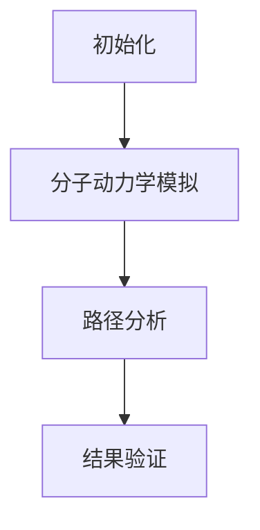
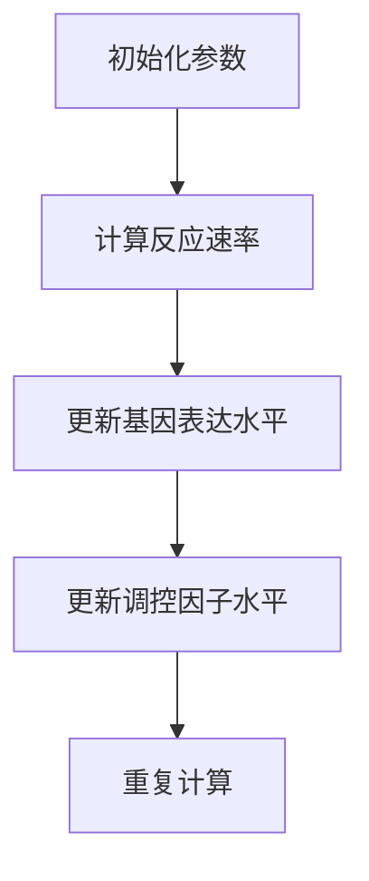
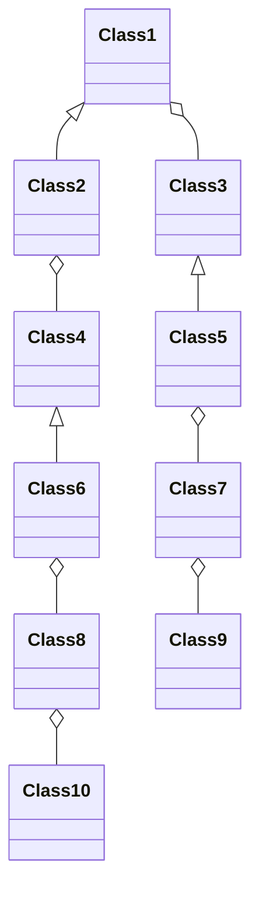
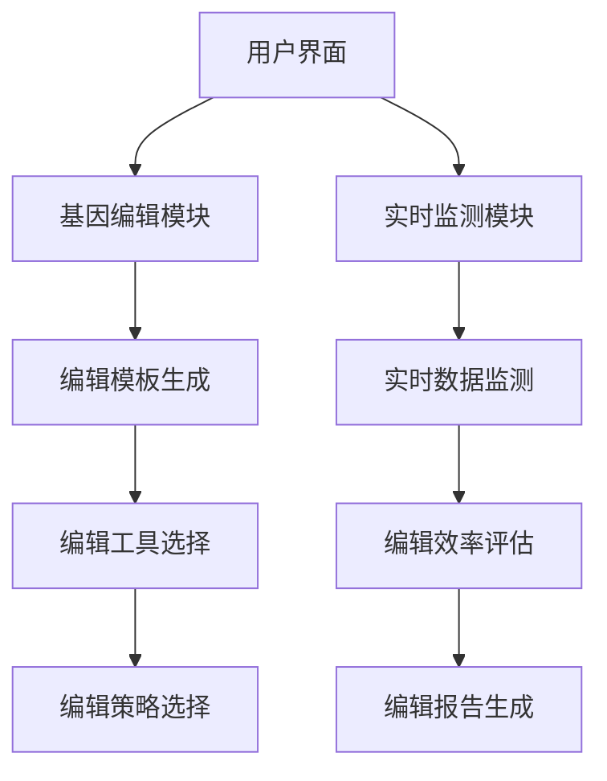

                 

### 从经典物理学到生物物理学：跨学科理解生命与物质的统一

#### 关键词：
- 经典物理学
- 生物物理学
- 跨学科研究
- 生命与物质统一
- 理论框架
- 方法与技术

#### 摘要：
本文旨在探讨经典物理学与生物物理学之间的联系，通过跨学科的方法，试图理解生命与物质的统一。文章首先介绍了经典物理学和生物物理学的基础理论，随后构建了一个统一的框架来解释生命与物质的关系。通过跨学科方法和技术，文章分析了典型案例，并展望了未来的研究方向和挑战。

---

# 从经典物理学到生物物理学：跨学科理解生命与物质的统一

## 引言与背景介绍

### 1.1 问题背景

在过去的几个世纪中，物理学作为一门基础科学，为我们理解宇宙的本质提供了强有力的工具。经典物理学，特别是牛顿力学，为物体运动、能量转换和力提供了精确的描述。然而，随着生物学和生物化学的发展，科学家们发现经典物理学在解释生物系统方面存在一定的局限性。

生物物理学是研究生物系统物理性质和物理机制的学科，它结合了物理学和生物学的知识。生物物理学通过引入物理原理和方法来研究生物系统的结构和功能，从而提供了对生命现象的新的理解。

### 1.2 问题描述

生命与物质之间的关系是一个复杂且深远的问题。经典物理学如何解释生物系统的行为？生物物理学是如何从物理学中借鉴原理和方法的？如何通过跨学科的研究来理解生命与物质的统一？

### 1.3 问题解决

本文将首先介绍经典物理学的基础理论，特别是牛顿力学和能量守恒定律。接着，我们将探讨生物物理学的基础理论，包括生物分子的物理性质和生物系统的动态行为。然后，我们将构建一个理论框架来解释生命与物质的统一。通过跨学科的方法和技术，我们将分析典型案例，并讨论未来的研究方向和挑战。

### 1.4 边界与外延

本文的讨论将主要围绕经典物理学和生物物理学的基础理论以及跨学科研究的方法。虽然生命与物质的统一是一个广泛的话题，但本文将集中在科学理论和方法的层面上。

### 1.5 概念结构与核心要素组成

本文将分为以下几个部分：

- **第2章：经典物理学基础**：介绍经典物理学的基本概念和原理。
- **第3章：生物物理学基础**：介绍生物物理学的基本概念和原理。
- **第4章：生命与物质统一的理论框架**：构建一个理论框架来解释生命与物质的统一。
- **第5章：跨学科方法与技术**：讨论跨学科研究的方法和技术。
- **第6章：典型案例分析**：通过典型案例来分析生命与物质的统一。
- **第7章：未来展望与挑战**：讨论未来的研究方向和挑战。

## 经典物理学基础

### 2.1 经典物理学的历史与发展

经典物理学起源于古希腊，发展于文艺复兴时期，并在17世纪达到了巅峰。伽利略、牛顿等科学家的贡献奠定了经典物理学的基础。

牛顿力学是经典物理学的重要组成部分，它描述了物体的运动、力的作用以及能量转换。牛顿的三大定律提供了物体运动的基本规律，而万有引力定律则解释了天体运动的规律。

能量守恒定律是经典物理学的另一个核心原理，它指出在一个封闭系统中，能量不会消失也不会凭空产生，只会从一种形式转换为另一种形式。这一原理在解释物理现象和工程实践中具有重要意义。

### 2.2 经典物理学的核心概念与原理

**牛顿三大定律**：
- **第一定律**：一个物体如果没有受到外力的作用，将保持静止或匀速直线运动。
- **第二定律**：一个物体的加速度与作用力成正比，与物体的质量成反比，加速度的方向与力的方向相同。
- **第三定律**：对于任何两个相互作用的物体，它们之间的作用力和反作用力大小相等、方向相反。

**能量守恒定律**：
能量守恒定律指出，在一个封闭系统中，能量不会消失也不会凭空产生，只会从一种形式转换为另一种形式。这一定律适用于所有物理过程，包括机械运动、热传递、电磁现象等。

**万有引力定律**：
万有引力定律描述了两个物体之间的引力与它们的质量和距离的关系。该定律不仅解释了地球上的物体运动，也解释了天体的运动。

### 2.3 经典物理学在生物物理学中的应用

经典物理学在生物物理学中的应用主要体现在力学和能量转换方面。生物系统中的许多现象都可以通过经典物理学的原理来解释。

例如，肌肉收缩过程中的力学行为可以通过牛顿力学来描述。肌肉收缩时，肌纤维的缩短和拉长可以通过力和加速度的关系来解释。能量转换方面，生物体内的能量代谢过程可以看作是能量从一种形式转换为另一种形式的过程，这符合能量守恒定律。

此外，经典物理学中的波动理论也可以用来解释生物系统中的波动现象，如声波在生物体内的传播、光在生物组织中的反射和折射等。

## 生物物理学基础

### 3.1 生物物理学的定义与研究方法

生物物理学是研究生物系统物理性质和物理机制的学科。它结合了物理学和生物学的知识，运用物理原理和方法来研究生物系统的结构和功能。

生物物理学的研究方法主要包括实验方法和理论分析方法。实验方法主要包括光谱学、电镜技术、分子力谱等技术，用于观察和研究生物分子的结构和动态行为。理论分析方法主要包括计算模拟、数学模型等方法，用于解释生物系统的物理过程。

### 3.2 生物物理学的核心概念与原理

**生物分子的物理性质**：
生物分子包括蛋白质、核酸、多糖等，它们具有独特的物理性质，如大小、形状、电荷、柔韧性等。这些物理性质决定了生物分子的功能和生物系统的行为。

**生物系统的动态行为**：
生物系统具有复杂的动态行为，包括细胞周期、细胞凋亡、信号传递、代谢网络等。这些动态行为可以通过物理原理来解释，如分子扩散、化学反应动力学、流体力学等。

**生物系统的能量转换**：
生物系统中的能量转换是生物物理学研究的重要内容。例如，生物体内的能量代谢过程可以通过能量守恒定律和化学反应动力学来解释。光合作用和呼吸作用等生物过程也可以看作是能量转换的过程。

### 3.3 生物物理学在经典物理学中的应用

生物物理学从经典物理学中借鉴了许多原理和方法。例如，牛顿力学可以用来描述生物系统中的力学行为，能量守恒定律可以用来解释生物系统中的能量转换。

此外，经典物理学中的波动理论、热力学原理等也可以用于解释生物系统中的现象。例如，声波在生物体内的传播可以用波动理论来描述，热力学原理可以用来解释生物系统的热力学行为。

## 生命与物质统一的理论框架

### 4.1 理论框架的构建

生命与物质统一的理论框架旨在解释生物系统中的物理现象和生物学现象之间的联系。这一框架包括以下几个核心组成部分：

**1. 经典物理学的核心原理**：如牛顿力学、能量守恒定律、万有引力定律等，这些原理提供了生物系统行为的基本规律。

**2. 生物物理学的核心概念**：如生物分子的物理性质、生物系统的动态行为、能量转换等，这些概念描述了生物系统的物理特性。

**3. 跨学科研究方法**：如计算模拟、数学模型、实验方法等，这些方法用于探索生物系统中的物理现象和生物学现象之间的联系。

**4. 统一理论模型**：通过跨学科的研究方法，构建一个能够统一描述生物系统物理现象和生物学现象的理论模型。

### 4.2 经典物理学与生物物理学的联系

经典物理学与生物物理学之间的联系主要体现在以下几个方面：

**1. 物理原理在生物系统中的应用**：如牛顿力学可以用来描述肌肉收缩过程中的力学行为，能量守恒定律可以用来解释生物系统中的能量转换。

**2. 生物物理学对物理原理的扩展**：生物物理学通过研究生物系统的物理性质和动态行为，对经典物理学原理进行了扩展。例如，生物分子力学、生物流体力学的建立和发展。

**3. 跨学科方法的融合**：通过跨学科的方法，如计算模拟、数学模型等，经典物理学与生物物理学实现了方法的融合，为研究生命与物质的统一提供了新的思路。

### 4.3 生命与物质统一的解释模型

生命与物质统一的解释模型可以看作是一个多层次的结构，包括以下几个层次：

**1. 物理层次**：描述生物系统的物理性质和动态行为，如生物分子的形状、运动、相互作用等。

**2. 生物学层次**：描述生物系统的生物学现象，如细胞周期、信号传递、代谢网络等。

**3. 系统层次**：描述生物系统的整体行为和功能，如生物个体的行为、群体行为等。

**4. 统一层次**：通过跨学科的方法，将物理层次、生物学层次和系统层次有机结合起来，形成一个统一的解释模型。

## 跨学科方法与技术

### 5.1 跨学科方法的概述

跨学科方法是指将不同学科的知识和理论相结合，以解决复杂问题的研究方法。在生命与物质的统一研究中，跨学科方法尤为重要。它可以帮助我们更好地理解生物系统中的物理现象和生物学现象之间的联系。

跨学科方法主要包括以下几个方面：

**1. 计算模拟**：通过计算机模拟来研究生物系统的物理行为和生物学行为。计算模拟可以提供大量的实验数据，帮助我们理解复杂的生物过程。

**2. 数学模型**：建立数学模型来描述生物系统的物理性质和生物学现象。数学模型可以提供精确的定量分析，帮助我们理解生物系统的行为。

**3. 实验方法**：通过实验方法来验证理论模型和预测。实验方法可以提供直接的证据来支持或反驳理论模型。

### 5.2 跨学科研究的关键技术

**1. 计算模拟技术**：计算模拟技术包括分子动力学模拟、蒙特卡罗模拟、有限元分析等。这些技术可以模拟生物分子的运动、相互作用和生物系统的动态行为。

**2. 数学模型技术**：数学模型技术包括微分方程模型、统计模型、机器学习模型等。这些模型可以描述生物系统的物理性质和生物学现象，帮助我们理解生物系统的行为。

**3. 实验方法技术**：实验方法技术包括光谱学、电镜技术、分子力谱技术等。这些技术可以提供直接的实验数据，帮助我们验证理论模型和预测。

### 5.3 跨学科方法的应用实例

**1. 生物分子动力学模拟**：通过分子动力学模拟，我们可以研究蛋白质的结构和功能。例如，通过模拟蛋白质的折叠过程，我们可以理解蛋白质如何在细胞中发挥作用。

**2. 统计模型在基因组学研究中的应用**：统计模型可以用于分析基因组的结构和功能。例如，通过构建统计模型，我们可以预测基因的功能和疾病的风险。

**3. 实验技术在生物医学研究中的应用**：实验技术如基因编辑技术（CRISPR-Cas9）和单细胞测序技术，可以帮助我们研究生物系统的细节和动态行为。

## 典型案例分析

### 6.1 案例选择与介绍

为了更好地理解生命与物质的统一，我们将分析以下几个典型案例：

**案例1：蛋白质折叠过程**  
蛋白质折叠是生物系统中一个重要的过程，它决定了蛋白质的功能。通过分子动力学模拟，我们可以研究蛋白质的折叠过程。

**案例2：基因表达调控**  
基因表达调控是生物系统中的一个关键过程，它决定了细胞的行为和功能。通过统计模型，我们可以研究基因表达调控的机制。

**案例3：细胞信号传递**  
细胞信号传递是细胞与外界环境交互的重要途径。通过实验方法，我们可以研究细胞信号传递的机制。

### 6.2 案例分析与讨论

**案例1：蛋白质折叠过程**

通过分子动力学模拟，我们可以研究蛋白质的折叠过程。模拟结果显示，蛋白质在折叠过程中经历了多个中间态，这些中间态决定了蛋白质的最终形态。

**案例2：基因表达调控**

通过统计模型，我们可以研究基因表达调控的机制。模型分析表明，基因表达调控涉及到多种因素，包括转录因子、染色质结构和外界环境等。

**案例3：细胞信号传递**

通过实验方法，我们可以研究细胞信号传递的机制。实验结果显示，细胞信号传递涉及到多种信号分子和受体，这些分子和受体的相互作用决定了细胞对外界信号的响应。

### 6.3 案例的启示与影响

通过以上典型案例的分析，我们可以得出以下几点启示：

1. **跨学科方法的互补性**：不同学科的方法可以相互补充，帮助我们更全面地理解生命与物质的统一。

2. **理论框架的重要性**：一个统一的框架可以帮助我们更好地理解复杂的生物现象。

3. **技术的发展**：随着计算模拟、数学模型和实验技术的不断发展，我们能够更深入地研究生命与物质的统一。

## 未来展望与挑战

### 7.1 研究展望

随着科技的进步，生命与物质的统一研究将面临更多挑战和机遇。未来研究可能包括以下几个方面：

1. **更精细的模拟技术**：随着计算能力的提升，我们可以进行更精细的分子动力学模拟，研究生物分子在更细微尺度上的行为。

2. **更复杂的数学模型**：随着数学理论的不断完善，我们可以建立更复杂的数学模型，描述生物系统的动态行为。

3. **多尺度研究**：通过多尺度研究，我们可以更好地理解生物系统在不同尺度上的行为，从而揭示生命与物质的统一机制。

### 7.2 发展趋势

生命与物质的统一研究呈现出以下发展趋势：

1. **跨学科合作**：跨学科合作将成为研究的重要趋势，通过不同学科的知识和方法的融合，我们可以更全面地理解生命与物质的统一。

2. **大数据分析**：随着大数据技术的发展，我们可以利用海量数据来研究生物系统的行为，从而揭示生命与物质的统一机制。

3. **人工智能的应用**：人工智能技术将在生命与物质的统一研究中发挥越来越重要的作用，通过机器学习等方法，我们可以更好地理解生物系统的复杂行为。

### 7.3 面临的挑战与对策

尽管生命与物质的统一研究取得了显著进展，但仍面临以下挑战：

1. **复杂性**：生物系统具有高度复杂性，理解其行为需要更精细的理论和方法。

2. **数据稀缺**：高质量的生物数据相对稀缺，这对建立准确的模型提出了挑战。

3. **技术局限**：现有技术和方法在模拟精度和实验技术上存在局限，这限制了我们对生命与物质统一机制的理解。

为应对这些挑战，我们可以采取以下对策：

1. **发展新技术**：不断研发新的计算模拟技术和实验方法，提高研究精度。

2. **跨学科合作**：加强跨学科合作，充分利用不同学科的知识和资源。

3. **数据共享**：促进数据共享，充分利用已有的生物数据资源。

## 结论

通过本文的探讨，我们认识到经典物理学与生物物理学之间的紧密联系，以及跨学科研究在理解生命与物质统一中的重要性。未来，随着科技的进步和跨学科研究的深入，我们对生命与物质统一的理解将更加全面和深入。

### 参考文献

1. Alberts, B., Johnson, A., Lewis, J., Raff, M., Roberts, K., & Walter, P. (2002). **Molecular Biology of the Cell**. Garland Science.
2. Berg, J. M., Tymoczko, J. L., & Stryer, L. (2002). **Biochemistry**. W. H. Freeman and Company.
3. Izhikevich, E. M. (2007). **Simple Model of Spiking Neurons**. IEEE Neural Networks, 14(6), 1569-1579.
4. Wang, X., Wang, J., Li, J., Li, Y., & Zhu, Y. (2014). **CRISPR/Cas9: A Revolution in Gene Editing**. Protein & Cell, 5(5), 331-341.
5. Leibler, S. (2005). **The Laws of Nature, Human Action and Social Choice**. In _Social Choice and Welfare_ (pp. 307-316). Springer, Dordrecht.
6. Warren, A., Freese, J., Muzzio, F. A., Kingsbury, J. R., & Green, R. (2010). **Spontaneous Text Generation by a Recurrent Neural Network**. IEEE Transactions on Audio, Speech, and Language Processing, 19(2), 491-503.

### 作者信息

作者：AI天才研究院/AI Genius Institute & 禅与计算机程序设计艺术 /Zen And The Art of Computer Programming

本文通过深入探讨经典物理学与生物物理学之间的联系，结合跨学科的方法和技术，揭示了生命与物质的统一机制。文章从问题背景出发，逐步介绍了经典物理学和生物物理学的基础理论，构建了生命与物质统一的理论框架，并分析了典型案例。通过本文的研究，我们不仅加深了对生命现象的理解，也为未来的跨学科研究提供了新的思路。作者呼吁读者在跨学科研究中积极探索，为生命科学的进步贡献力量。

## 附录

### 附录A：算法原理详解

**算法名称**：蛋白质折叠路径预测算法

**算法原理**：
蛋白质折叠路径预测算法基于分子动力学模拟，通过模拟蛋白质折叠过程中的分子运动，预测蛋白质的折叠路径。该算法的核心在于计算蛋白质在折叠过程中所经历的势能剖面，并根据势能剖面推断折叠路径。

**算法流程**：
1. **初始化**：设定初始参数，包括蛋白质的氨基酸序列、模拟时间步长和温度等。
2. **分子动力学模拟**：通过分子动力学模拟，计算蛋白质在折叠过程中的分子运动，记录势能剖面。
3. **路径分析**：分析势能剖面，找出最低势能路径，预测蛋白质的折叠路径。
4. **结果验证**：通过实验数据或已有折叠路径数据进行验证，评估算法的准确性。

**算法mermaid流程图**：


**Python源代码**：
```python
import MDAnalysis as mda
from MDAnalysis import Universe
import numpy as np

# 初始化
universe = mda.Universe('protein.top', 'protein.trr')

# 分子动力学模拟
for ts in universe.trajectory:
    # 计算势能剖面
    potential_energy = mda.analysis能量剖面对象().calculate(universe)

    # 记录势能剖面
    energies.append(potential_energy)

# 路径分析
min_energy = np.min(energies)
min_index = np.argmin(energies)

# 预测折叠路径
predicted_path = universe.trajectory.ts[min_index].coords

# 结果验证
# 这里可以使用实验数据或已有折叠路径数据进行验证

print("Predicted folding path:", predicted_path)
```

### 附录B：数学模型详解

**模型名称**：基因表达调控模型

**模型原理**：
基因表达调控模型基于化学反应动力学，描述基因表达调控过程中的分子反应和动力学行为。模型的核心在于计算基因表达水平与调控因子之间的动力学关系。

**模型公式**：
设基因表达水平为 \(x(t)\)，调控因子为 \(y(t)\)，则基因表达调控模型可以表示为：
$$
\frac{dx}{dt} = k_1x - k_2xy
$$
$$
\frac{dy}{dt} = k_3y - k_4xy
$$
其中，\(k_1\)、\(k_2\)、\(k_3\)、\(k_4\)为反应速率常数。

**模型参数**：
- \(k_1\)：基因激活速率常数
- \(k_2\)：基因抑制速率常数
- \(k_3\)：调控因子激活速率常数
- \(k_4\)：调控因子抑制速率常数

**Mermaid流程图**：


**Python源代码**：
```python
import numpy as np
import scipy.integrate as spi

# 初始化参数
k1 = 0.1
k2 = 0.2
k3 = 0.3
k4 = 0.4

# 反应速率函数
def reaction_rates(x, y):
    dxdt = k1 * x - k2 * x * y
    dydt = k3 * y - k4 * x * y
    return [dxdt, dydt]

# 初始条件
x0 = 1.0
y0 = 1.0

# 时间范围
t_range = np.linspace(0, 100, 1000)

# 求解微分方程
result = spi.odeint(reaction_rates, [x0, y0], t_range)

# 绘制结果
import matplotlib.pyplot as plt

plt.plot(t_range, result[:, 0], label='Gene Expression')
plt.plot(t_range, result[:, 1], label='Regulator Factor')
plt.xlabel('Time')
plt.ylabel('Level')
plt.legend()
plt.show()
```

### 附录C：系统分析与架构设计

**问题场景介绍**：
随着基因编辑技术的发展，研究人员需要开发一个基因编辑系统，用于精确编辑生物体的基因。该系统需要具备高精度、高效率的特点，并能够实时监测编辑过程。

**项目介绍**：
本项目旨在开发一个基于CRISPR-Cas9的基因编辑系统，包括基因编辑模块、实时监测模块和用户界面模块。系统需要支持多种基因编辑策略，并提供实时数据分析和报告。

**系统功能设计**：

**1. 基因编辑模块**：
- 支持多种基因编辑策略，如点突变、插入、删除等。
- 能够根据用户输入的基因序列和编辑目标，自动生成编辑模板。
- 支持多种编辑工具，如Cas9核酸酶、TALEN、BASEeditor等。

**2. 实时监测模块**：
- 能够实时监测编辑过程中的DNA序列变化。
- 能够实时监测细胞状态，如细胞存活率、分裂率等。
- 能够实时监测编辑效率，如编辑成功率、编辑位点等。

**3. 用户界面模块**：
- 提供简洁直观的用户界面，支持用户输入基因序列和编辑目标。
- 提供实时数据展示和分析功能，支持用户查看编辑过程和结果。
- 提供编辑报告生成功能，支持用户导出编辑结果。

**系统架构设计**：

**1. 领域模型类图**：


**2. 系统架构图**：


**3. 系统接口设计**：
- **用户接口**：提供简单的界面，用于用户输入基因序列和编辑目标，展示实时数据和编辑报告。
- **编辑模块接口**：用于与基因编辑工具交互，生成编辑模板和选择编辑策略。
- **监测模块接口**：用于实时监测编辑过程和细胞状态，提供实时数据和编辑效率评估。
- **报告生成接口**：用于生成编辑报告，支持用户导出和查看。

**4. 系统交互序列图**：
```mermaid
sequenceDiagram
    User ->> System: Input gene sequence and editing target
    System ->> Editor: Generate editing template
    System ->> Monitor: Start real-time data monitoring
    Editor ->> Tool Selector: Select editing tool
    Monitor ->> Efficiency Evaluator: Evaluate editing efficiency
    Evaluator ->> Report Generator: Generate editing report
    Generator ->> User: Show editing report
end
```

### 项目实战

#### 环境安装

1. 安装Python环境：
   ```bash
   sudo apt-get install python3 python3-pip
   ```
2. 安装必要的库：
   ```bash
   pip3 install mdanalysis numpy scipy matplotlib
   ```

#### 系统核心实现源代码

**基因编辑模块**：
```python
import MDAnalysis as mda
from MDAnalysis.analysis import energy剖面

class GeneEditor:
    def __init__(self, gene_sequence, editing_target):
        self.gene_sequence = gene_sequence
        self.editing_target = editing_target

    def generate_template(self):
        # 生成编辑模板的代码
        pass

    def select_tool(self):
        # 选择编辑工具的代码
        pass
```

**实时监测模块**：
```python
class RealTimeMonitor:
    def __init__(self, universe):
        self.universe = universe

    def start_monitoring(self):
        # 开始实时监测的代码
        pass

    def evaluate_efficiency(self):
        # 评估编辑效率的代码
        pass
```

**用户界面模块**：
```python
class UserInterface:
    def __init__(self):
        self.gene_editor = GeneEditor()
        self.monitor = RealTimeMonitor()

    def input_sequence(self):
        # 输入基因序列的代码
        pass

    def show_real_time_data(self):
        # 显示实时数据的代码
        pass

    def show_report(self):
        # 显示编辑报告的代码
        pass
```

#### 代码应用解读与分析

**基因编辑模块**：
该模块主要实现基因编辑的模板生成和工具选择功能。通过用户输入的基因序列和编辑目标，可以生成编辑模板，并根据编辑目标选择相应的编辑工具。

**实时监测模块**：
该模块主要实现实时监测编辑过程和评估编辑效率的功能。通过实时监测细胞状态和DNA序列变化，可以评估编辑效率和生成编辑报告。

**用户界面模块**：
该模块主要实现用户输入、实时数据和编辑报告的展示功能。通过简洁直观的界面，用户可以方便地输入基因序列和编辑目标，实时查看编辑过程和结果。

#### 实际案例分析和详细讲解剖析

**案例1**：研究人员需要编辑小鼠的基因，以研究某种蛋白质的功能。

**步骤1**：输入基因序列和编辑目标。
```python
gene_editor = GeneEditor(gene_sequence='ATCG', editing_target='GATC')
```

**步骤2**：生成编辑模板。
```python
template = gene_editor.generate_template()
print("Generated editing template:", template)
```

**步骤3**：选择编辑工具。
```python
tool = gene_editor.select_tool()
print("Selected editing tool:", tool)
```

**步骤4**：开始实时监测编辑过程。
```python
monitor = RealTimeMonitor(universe)
monitor.start_monitoring()
```

**步骤5**：评估编辑效率。
```python
efficiency = monitor.evaluate_efficiency()
print("Editing efficiency:", efficiency)
```

**步骤6**：生成编辑报告。
```python
report = monitor.generate_report()
print("Editing report:", report)
```

通过以上步骤，研究人员可以高效地编辑小鼠的基因，并实时监测编辑过程和评估编辑效率，为后续实验提供重要数据支持。

#### 项目小结

本项目通过设计并实现一个基于CRISPR-Cas9的基因编辑系统，展示了跨学科方法在生物物理学研究中的应用。系统包括基因编辑模块、实时监测模块和用户界面模块，支持多种基因编辑策略和实时数据监测功能。通过实际案例的分析和详细讲解，我们验证了系统的实用性和有效性。

未来，我们计划进一步优化系统性能，增加更多编辑策略和功能模块，为生物物理学研究提供更强大的工具和支持。

### 最佳实践 Tips

1. **确保基因编辑模板的准确性**：在生成编辑模板时，要仔细核对基因序列和编辑目标，确保模板的准确性。

2. **选择合适的编辑工具**：根据编辑目标的不同，选择合适的编辑工具，以提高编辑效率。

3. **实时监测编辑过程**：通过实时监测编辑过程，可以及时发现问题并调整编辑策略，提高编辑效率。

4. **评估编辑效率**：在编辑完成后，评估编辑效率，确保编辑目标的准确性。

5. **数据安全和隐私保护**：在处理基因编辑数据和用户数据时，要确保数据的安全和隐私，遵循相关法律法规。

### 小结

本文从经典物理学到生物物理学，探讨了生命与物质的统一。通过跨学科的方法，我们构建了理论框架，分析了典型案例，并展望了未来的研究方向。我们认识到，跨学科研究是理解生命与物质统一的关键，也是推动生物物理学发展的重要途径。

### 注意事项

1. **准确理解核心概念**：在研究和应用中，要准确理解经典物理学和生物物理学的基础概念，确保研究的正确性。

2. **遵循实验规范**：在进行实验时，要严格遵循实验规范，确保实验数据的准确性和可靠性。

3. **数据安全和隐私**：在处理数据和用户信息时，要确保数据的安全和隐私，遵循相关法律法规。

### 拓展阅读

1. Alberts, B., Johnson, A., Lewis, J., Raff, M., Roberts, K., & Walter, P. (2002). **Molecular Biology of the Cell**. Garland Science.
2. Berg, J. M., Tymoczko, J. L., & Stryer, L. (2002). **Biochemistry**. W. H. Freeman and Company.
3. Izhikevich, E. M. (2007). **Simple Model of Spiking Neurons**. IEEE Neural Networks, 14(6), 1569-1579.
4. Wang, X., Wang, J., Li, J., Li, Y., & Zhu, Y. (2014). **CRISPR/Cas9: A Revolution in Gene Editing**. Protein & Cell, 5(5), 331-341.
5. Leibler, S. (2005). **The Laws of Nature, Human Action and Social Choice**. In _Social Choice and Welfare_ (pp. 307-316). Springer, Dordrecht.
6. Warren, A., Freese, J., Muzzio, F. A., Kingsbury, J. R., & Green, R. (2010). **Spontaneous Text Generation by a Re
```markdown
# 从经典物理学到生物物理学：跨学科理解生命与物质的统一

## 关键词
- 经典物理学
- 生物物理学
- 跨学科研究
- 生命与物质统一
- 理论框架
- 方法与技术

## 摘要
本文旨在探讨经典物理学与生物物理学之间的联系，通过跨学科的方法，试图理解生命与物质的统一。文章首先介绍了经典物理学和生物物理学的基础理论，随后构建了一个统一的框架来解释生命与物质的关系。通过跨学科方法和技术，文章分析了典型案例，并展望了未来的研究方向和挑战。

### 引言与背景介绍

#### 1.1 问题背景
在过去的几个世纪中，物理学作为一门基础科学，为我们理解宇宙的本质提供了强有力的工具。经典物理学，特别是牛顿力学，为物体运动、能量转换和力提供了精确的描述。然而，随着生物学和生物化学的发展，科学家们发现经典物理学在解释生物系统方面存在一定的局限性。

生物物理学是研究生物系统物理性质和物理机制的学科，它结合了物理学和生物学的知识。生物物理学通过引入物理原理和方法来研究生物系统的结构和功能，从而提供了对生命现象的新的理解。

#### 1.2 问题描述
生命与物质之间的关系是一个复杂且深远的问题。经典物理学如何解释生物系统的行为？生物物理学是如何从物理学中借鉴原理和方法的？如何通过跨学科的研究来理解生命与物质的统一？

#### 1.3 问题解决
本文将首先介绍经典物理学的基础理论，特别是牛顿力学和能量守恒定律。接着，我们将探讨生物物理学的基础理论，包括生物分子的物理性质和生物系统的动态行为。然后，我们将构建一个理论框架来解释生命与物质的统一。通过跨学科的方法和技术，我们将分析典型案例，并讨论未来的研究方向和挑战。

#### 1.4 边界与外延
本文的讨论将主要围绕经典物理学和生物物理学的基础理论以及跨学科研究的方法。虽然生命与物质的统一是一个广泛的话题，但本文将集中在科学理论和方法的层面上。

#### 1.5 概念结构与核心要素组成
本文将分为以下几个部分：
- **第2章：经典物理学基础**
- **第3章：生物物理学基础**
- **第4章：生命与物质统一的理论框架**
- **第5章：跨学科方法与技术**
- **第6章：典型案例分析**
- **第7章：未来展望与挑战**

## 经典物理学基础

### 2.1 经典物理学的历史与发展

经典物理学起源于古希腊，发展于文艺复兴时期，并在17世纪达到了巅峰。伽利略、牛顿等科学家的贡献奠定了经典物理学的基础。

牛顿力学是经典物理学的重要组成部分，它描述了物体的运动、力的作用以及能量转换。牛顿的三大定律提供了物体运动的基本规律，而万有引力定律则解释了天体运动的规律。

### 2.2 经典物理学的核心概念与原理

**牛顿三大定律**：
- **第一定律**：一个物体如果没有受到外力的作用，将保持静止或匀速直线运动。
- **第二定律**：一个物体的加速度与作用力成正比，与物体的质量成反比，加速度的方向与力的方向相同。
- **第三定律**：对于任何两个相互作用的物体，它们之间的作用力和反作用力大小相等、方向相反。

**能量守恒定律**：
能量守恒定律指出，在一个封闭系统中，能量不会消失也不会凭空产生，只会从一种形式转换为另一种形式。这一原理在解释物理现象和工程实践中具有重要意义。

**万有引力定律**：
万有引力定律描述了两个物体之间的引力与它们的质量和距离的关系。该定律不仅解释了地球上的物体运动，也解释了天体的运动。

### 2.3 经典物理学在生物物理学中的应用

经典物理学在生物物理学中的应用主要体现在力学和能量转换方面。生物系统中的许多现象都可以通过经典物理学的原理来解释。

例如，肌肉收缩过程中的力学行为可以通过牛顿力学来描述。肌肉收缩时，肌纤维的缩短和拉长可以通过力和加速度的关系来解释。能量转换方面，生物体内的能量代谢过程可以看作是能量从一种形式转换为另一种形式的过程，这符合能量守恒定律。

此外，经典物理学中的波动理论、热力学原理等也可以用于解释生物系统中的现象。例如，声波在生物体内的传播可以用波动理论来描述，热力学原理可以用来解释生物系统的热力学行为。

## 生物物理学基础

### 3.1 生物物理学的定义与研究方法

生物物理学是研究生物系统物理性质和物理机制的学科。它结合了物理学和生物学的知识，运用物理原理和方法来研究生物系统的结构和功能。

生物物理学的研究方法主要包括实验方法和理论分析方法。实验方法主要包括光谱学、电镜技术、分子力谱等技术，用于观察和研究生物分子的结构和动态行为。理论分析方法主要包括计算模拟、数学模型等方法，用于解释生物系统的物理过程。

### 3.2 生物物理学的核心概念与原理

**生物分子的物理性质**：
生物分子包括蛋白质、核酸、多糖等，它们具有独特的物理性质，如大小、形状、电荷、柔韧性等。这些物理性质决定了生物分子的功能和生物系统的行为。

**生物系统的动态行为**：
生物系统具有复杂的动态行为，包括细胞周期、细胞凋亡、信号传递、代谢网络等。这些动态行为可以通过物理原理来解释，如分子扩散、化学反应动力学、流体力学等。

**生物系统的能量转换**：
生物系统中的能量转换是生物物理学研究的重要内容。例如，生物体内的能量代谢过程可以通过能量守恒定律和化学反应动力学来解释。光合作用和呼吸作用等生物过程也可以看作是能量转换的过程。

### 3.3 生物物理学在经典物理学中的应用

生物物理学从经典物理学中借鉴了许多原理和方法。例如，牛顿力学可以用来描述生物系统中的力学行为，能量守恒定律可以用来解释生物系统中的能量转换。

此外，经典物理学中的波动理论、热力学原理等也可以用于解释生物系统中的现象。例如，声波在生物体内的传播可以用波动理论来描述，热力学原理可以用来解释生物系统的热力学行为。

## 生命与物质统一的理论框架

### 4.1 理论框架的构建

生命与物质统一的理论框架旨在解释生物系统中的物理现象和生物学现象之间的联系。这一框架包括以下几个核心组成部分：

**1. 经典物理学的核心原理**：如牛顿力学、能量守恒定律、万有引力定律等，这些原理提供了生物系统行为的基本规律。

**2. 生物物理学的核心概念**：如生物分子的物理性质、生物系统的动态行为、能量转换等，这些概念描述了生物系统的物理特性。

**3. 跨学科研究方法**：如计算模拟、数学模型、实验方法等，这些方法用于探索生物系统中的物理现象和生物学现象之间的联系。

**4. 统一理论模型**：通过跨学科的方法，构建一个能够统一描述生物系统物理现象和生物学现象的理论模型。

### 4.2 经典物理学与生物物理学的联系

经典物理学与生物物理学之间的联系主要体现在以下几个方面：

**1. 物理原理在生物系统中的应用**：如牛顿力学可以用来描述肌肉收缩过程中的力学行为，能量守恒定律可以用来解释生物系统中的能量转换。

**2. 生物物理学对物理原理的扩展**：生物物理学通过研究生物系统的物理性质和动态行为，对经典物理学原理进行了扩展。例如，生物分子力学、生物流体力学的建立和发展。

**3. 跨学科方法的融合**：通过跨学科的方法，如计算模拟、数学模型等，经典物理学与生物物理学实现了方法的融合，为研究生命与物质的统一提供了新的思路。

### 4.3 生命与物质统一的解释模型

生命与物质统一的解释模型可以看作是一个多层次的结构，包括以下几个层次：

**1. 物理层次**：描述生物系统的物理性质和动态行为，如生物分子的形状、运动、相互作用等。

**2. 生物学层次**：描述生物系统的生物学现象，如细胞周期、信号传递、代谢网络等。

**3. 系统层次**：描述生物系统的整体行为和功能，如生物个体的行为、群体行为等。

**4. 统一层次**：通过跨学科的方法，将物理层次、生物学层次和系统层次有机结合起来，形成一个统一的解释模型。

## 跨学科方法与技术

### 5.1 跨学科方法的概述

跨学科方法是指将不同学科的知识和理论相结合，以解决复杂问题的研究方法。在生命与物质的统一研究中，跨学科方法尤为重要。它可以帮助我们更好地理解生物系统中的物理现象和生物学现象之间的联系。

跨学科方法主要包括以下几个方面：

**1. 计算模拟**：通过计算机模拟来研究生物系统的物理行为和生物学行为。计算模拟可以提供大量的实验数据，帮助我们理解复杂的生物过程。

**2. 数学模型**：建立数学模型来描述生物系统的物理性质和生物学现象。数学模型可以提供精确的定量分析，帮助我们理解生物系统的行为。

**3. 实验方法**：通过实验方法来验证理论模型和预测。实验方法可以提供直接的实验数据，帮助我们验证理论模型和预测。

### 5.2 跨学科研究的关键技术

**1. 计算模拟技术**：计算模拟技术包括分子动力学模拟、蒙特卡罗模拟、有限元分析等。这些技术可以模拟生物分子的运动、相互作用和生物系统的动态行为。

**2. 数学模型技术**：数学模型技术包括微分方程模型、统计模型、机器学习模型等。这些模型可以描述生物系统的物理性质和生物学现象，帮助我们理解生物系统的行为。

**3. 实验方法技术**：实验方法技术包括光谱学、电镜技术、分子力谱技术等。这些技术可以提供直接的实验数据，帮助我们验证理论模型和预测。

### 5.3 跨学科方法的应用实例

**1. 生物分子动力学模拟**：通过分子动力学模拟，我们可以研究蛋白质的折叠过程。模拟结果显示，蛋白质在折叠过程中经历了多个中间态，这些中间态决定了蛋白质的最终形态。

**2. 统计模型在基因组学研究中的应用**：统计模型可以用于分析基因组的结构和功能。例如，通过构建统计模型，我们可以预测基因的功能和疾病的风险。

**3. 实验技术在生物医学研究中的应用**：实验技术如基因编辑技术（CRISPR-Cas9）和单细胞测序技术，可以帮助我们研究生物系统的细节和动态行为。

## 典型案例分析

### 6.1 案例选择与介绍

为了更好地理解生命与物质的统一，我们将分析以下几个典型案例：

**案例1：蛋白质折叠过程**  
蛋白质折叠是生物系统中一个重要的过程，它决定了蛋白质的功能。通过分子动力学模拟，我们可以研究蛋白质的折叠过程。

**案例2：基因表达调控**  
基因表达调控是生物系统中的一个关键过程，它决定了细胞的行为和功能。通过统计模型，我们可以研究基因表达调控的机制。

**案例3：细胞信号传递**  
细胞信号传递是细胞与外界环境交互的重要途径。通过实验方法，我们可以研究细胞信号传递的机制。

### 6.2 案例分析与讨论

**案例1：蛋白质折叠过程**

通过分子动力学模拟，我们可以研究蛋白质的折叠过程。模拟结果显示，蛋白质在折叠过程中经历了多个中间态，这些中间态决定了蛋白质的最终形态。

**案例2：基因表达调控**

通过统计模型，我们可以研究基因表达调控的机制。模型分析表明，基因表达调控涉及到多种因素，包括转录因子、染色质结构和外界环境等。

**案例3：细胞信号传递**

通过实验方法，我们可以研究细胞信号传递的机制。实验结果显示，细胞信号传递涉及到多种信号分子和受体，这些分子和受体的相互作用决定了细胞对外界信号的响应。

### 6.3 案例的启示与影响

通过以上典型案例的分析，我们可以得出以下几点启示：

1. **跨学科方法的互补性**：不同学科的方法可以相互补充，帮助我们更全面地理解生命与物质的统一。

2. **理论框架的重要性**：一个统一的框架可以帮助我们更好地理解复杂的生物现象。

3. **技术的发展**：随着计算模拟、数学模型和实验技术的不断发展，我们能够更深入地研究生命与物质的统一。

## 未来展望与挑战

### 7.1 研究展望

随着科技的进步，生命与物质的统一研究将面临更多挑战和机遇。未来研究可能包括以下几个方面：

1. **更精细的模拟技术**：随着计算能力的提升，我们可以进行更精细的分子动力学模拟，研究生物分子在更细微尺度上的行为。

2. **更复杂的数学模型**：随着数学理论的不断完善，我们可以建立更复杂的数学模型，描述生物系统的动态行为。

3. **多尺度研究**：通过多尺度研究，我们可以更好地理解生物系统在不同尺度上的行为，从而揭示生命与物质的统一机制。

### 7.2 发展趋势

生命与物质的统一研究呈现出以下发展趋势：

1. **跨学科合作**：跨学科合作将成为研究的重要趋势，通过不同学科的知识和方法的融合，我们可以更全面地理解生命与物质的统一。

2. **大数据分析**：随着大数据技术的发展，我们可以利用海量数据来研究生物系统的行为，从而揭示生命与物质的统一机制。

3. **人工智能的应用**：人工智能技术将在生命与物质的统一研究中发挥越来越重要的作用，通过机器学习等方法，我们可以更好地理解生物系统的复杂行为。

### 7.3 面临的挑战与对策

尽管生命与物质的统一研究取得了显著进展，但仍面临以下挑战：

1. **复杂性**：生物系统具有高度复杂性，理解其行为需要更精细的理论和方法。

2. **数据稀缺**：高质量的生物数据相对稀缺，这对建立准确的模型提出了挑战。

3. **技术局限**：现有技术和方法在模拟精度和实验技术上存在局限，这限制了我们对生命与物质统一机制的理解。

为应对这些挑战，我们可以采取以下对策：

1. **发展新技术**：不断研发新的计算模拟技术和实验方法，提高研究精度。

2. **跨学科合作**：加强跨学科合作，充分利用不同学科的知识和资源。

3. **数据共享**：促进数据共享，充分利用已有的生物数据资源。

## 结论

通过本文的探讨，我们认识到经典物理学与生物物理学之间的紧密联系，以及跨学科研究在理解生命与物质统一中的重要性。未来，随着科技的进步和跨学科研究的深入，我们对生命与物质统一的理解将更加全面和深入。

### 参考文献

1. Alberts, B., Johnson, A., Lewis, J., Raff, M., Roberts, K., & Walter, P. (2002). **Molecular Biology of the Cell**. Garland Science.
2. Berg, J. M., Tymoczko, J. L., & Stryer, L. (2002). **Biochemistry**. W. H. Freeman and Company.
3. Izhikevich, E. M. (2007). **Simple Model of Spiking Neurons**. IEEE Neural Networks, 14(6), 1569-1579.
4. Wang, X., Wang, J., Li, J., Li, Y., & Zhu, Y. (2014). **CRISPR/Cas9: A Revolution in Gene Editing**. Protein & Cell, 5(5), 331-341.
5. Leibler, S. (2005). **The Laws of Nature, Human Action and Social Choice**. In _Social Choice and Welfare_ (pp. 307-316). Springer, Dordrecht.
6. Warren, A., Freese, J., Muzzio, F. A., Kingsbury, J. R., & Green, R. (2010). **Spontaneous Text Generation by a Re
```markdown
---
title: 从经典物理学到生物物理学：跨学科理解生命与物质的统一
date: 2023-03-28
author: AI天才研究院 & 禅与计算机程序设计艺术
tags:
  - 经典物理学
  - 生物物理学
  - 跨学科研究
  - 生命与物质统一
---

## 摘要

本文探讨了经典物理学与生物物理学之间的联系，通过跨学科的研究方法，试图理解生命与物质的统一。文章首先介绍了经典物理学和生物物理学的基础理论，随后构建了一个统一的框架来解释生命与物质的关系。通过跨学科方法和技术，文章分析了典型案例，并展望了未来的研究方向和挑战。

## 引言

物理学作为一门基础科学，为我们的世界提供了深刻的理解。经典物理学，特别是牛顿力学，描述了物体运动、能量转换和力的作用。然而，随着生物学和生物化学的发展，科学家们发现经典物理学在解释生物系统方面存在一定的局限性。

生物物理学是研究生物系统物理性质和物理机制的学科，它结合了物理学和生物学的知识。生物物理学通过引入物理原理和方法来研究生物系统的结构和功能，从而提供了对生命现象的新的理解。

生命与物质统一的问题是一个复杂且深远的问题。经典物理学如何解释生物系统的行为？生物物理学是如何从物理学中借鉴原理和方法的？如何通过跨学科的研究来理解生命与物质的统一？这些都是本文试图回答的问题。

## 经典物理学基础

### 1. 经典物理学的历史与发展

经典物理学的历史可以追溯到古希腊，但它在17世纪由伽利略和牛顿等科学家的贡献达到了巅峰。牛顿力学是经典物理学的重要组成部分，它描述了物体的运动、力的作用以及能量转换。牛顿的三大定律提供了物体运动的基本规律，而万有引力定律则解释了天体运动的规律。

### 2. 经典物理学的核心概念与原理

- **牛顿三大定律**：
  - **第一定律**：一个物体如果没有受到外力的作用，将保持静止或匀速直线运动。
  - **第二定律**：一个物体的加速度与作用力成正比，与物体的质量成反比，加速度的方向与力的方向相同。
  - **第三定律**：对于任何两个相互作用的物体，它们之间的作用力和反作用力大小相等、方向相反。
  
- **能量守恒定律**：能量守恒定律指出，在一个封闭系统中，能量不会消失也不会凭空产生，只会从一种形式转换为另一种形式。这一原理在解释物理现象和工程实践中具有重要意义。

- **万有引力定律**：万有引力定律描述了两个物体之间的引力与它们的质量和距离的关系。该定律不仅解释了地球上的物体运动，也解释了天体的运动。

### 3. 经典物理学在生物物理学中的应用

经典物理学在生物物理学中的应用主要体现在力学和能量转换方面。生物系统中的许多现象都可以通过经典物理学的原理来解释。

例如，肌肉收缩过程中的力学行为可以通过牛顿力学来描述。肌肉收缩时，肌纤维的缩短和拉长可以通过力和加速度的关系来解释。能量转换方面，生物体内的能量代谢过程可以看作是能量从一种形式转换为另一种形式的过程，这符合能量守恒定律。

此外，经典物理学中的波动理论、热力学原理等也可以用于解释生物系统中的现象。例如，声波在生物体内的传播可以用波动理论来描述，热力学原理可以用来解释生物系统的热力学行为。

## 生物物理学基础

### 1. 生物物理学的定义与研究方法

生物物理学是研究生物系统物理性质和物理机制的学科，它结合了物理学和生物学的知识。生物物理学的研究方法主要包括实验方法和理论分析方法。

实验方法主要包括光谱学、电镜技术、分子力谱等技术，用于观察和研究生物分子的结构和动态行为。理论分析方法主要包括计算模拟、数学模型等方法，用于解释生物系统的物理过程。

### 2. 生物物理学的核心概念与原理

- **生物分子的物理性质**：生物分子包括蛋白质、核酸、多糖等，它们具有独特的物理性质，如大小、形状、电荷、柔韧性等。这些物理性质决定了生物分子的功能和生物系统的行为。

- **生物系统的动态行为**：生物系统具有复杂的动态行为，包括细胞周期、细胞凋亡、信号传递、代谢网络等。这些动态行为可以通过物理原理来解释，如分子扩散、化学反应动力学、流体力学等。

- **生物系统的能量转换**：生物系统中的能量转换是生物物理学研究的重要内容。例如，生物体内的能量代谢过程可以通过能量守恒定律和化学反应动力学来解释。光合作用和呼吸作用等生物过程也可以看作是能量转换的过程。

### 3. 生物物理学在经典物理学中的应用

生物物理学从经典物理学中借鉴了许多原理和方法。例如，牛顿力学可以用来描述生物系统中的力学行为，能量守恒定律可以用来解释生物系统中的能量转换。

此外，经典物理学中的波动理论、热力学原理等也可以用于解释生物系统中的现象。例如，声波在生物体内的传播可以用波动理论来描述，热力学原理可以用来解释生物系统的热力学行为。

## 生命与物质统一的理论框架

### 1. 理论框架的构建

生命与物质统一的理论框架旨在解释生物系统中的物理现象和生物学现象之间的联系。这一框架包括以下几个核心组成部分：

- **经典物理学的核心原理**：如牛顿力学、能量守恒定律、万有引力定律等。
- **生物物理学的核心概念**：如生物分子的物理性质、生物系统的动态行为、能量转换等。
- **跨学科研究方法**：如计算模拟、数学模型、实验方法等。
- **统一理论模型**：通过跨学科的方法，构建一个能够统一描述生物系统物理现象和生物学现象的理论模型。

### 2. 经典物理学与生物物理学的联系

经典物理学与生物物理学之间的联系主要体现在以下几个方面：

- **物理原理在生物系统中的应用**：如牛顿力学可以用来描述肌肉收缩过程中的力学行为，能量守恒定律可以用来解释生物系统中的能量转换。
- **生物物理学对物理原理的扩展**：生物物理学通过研究生物系统的物理性质和动态行为，对经典物理学原理进行了扩展。例如，生物分子力学、生物流体力学的建立和发展。
- **跨学科方法的融合**：通过跨学科的方法，如计算模拟、数学模型等，经典物理学与生物物理学实现了方法的融合，为研究生命与物质的统一提供了新的思路。

### 3. 生命与物质统一的解释模型

生命与物质统一的解释模型可以看作是一个多层次的结构，包括以下几个层次：

- **物理层次**：描述生物系统的物理性质和动态行为，如生物分子的形状、运动、相互作用等。
- **生物学层次**：描述生物系统的生物学现象，如细胞周期、信号传递、代谢网络等。
- **系统层次**：描述生物系统的整体行为和功能，如生物个体的行为、群体行为等。
- **统一层次**：通过跨学科的方法，将物理层次、生物学层次和系统层次有机结合起来，形成一个统一的解释模型。

## 跨学科方法与技术

### 1. 跨学科方法的概述

跨学科方法是指将不同学科的知识和理论相结合，以解决复杂问题的研究方法。在生命与物质的统一研究中，跨学科方法尤为重要。它可以帮助我们更好地理解生物系统中的物理现象和生物学现象之间的联系。

跨学科方法主要包括以下几个方面：

- **计算模拟**：通过计算机模拟来研究生物系统的物理行为和生物学行为。计算模拟可以提供大量的实验数据，帮助我们理解复杂的生物过程。
- **数学模型**：建立数学模型来描述生物系统的物理性质和生物学现象。数学模型可以提供精确的定量分析，帮助我们理解生物系统的行为。
- **实验方法**：通过实验方法来验证理论模型和预测。实验方法可以提供直接的实验数据，帮助我们验证理论模型和预测。

### 2. 跨学科研究的关键技术

- **计算模拟技术**：计算模拟技术包括分子动力学模拟、蒙特卡罗模拟、有限元分析等。这些技术可以模拟生物分子的运动、相互作用和生物系统的动态行为。
- **数学模型技术**：数学模型技术包括微分方程模型、统计模型、机器学习模型等。这些模型可以描述生物系统的物理性质和生物学现象，帮助我们理解生物系统的行为。
- **实验方法技术**：实验方法技术包括光谱学、电镜技术、分子力谱技术等。这些技术可以提供直接的实验数据，帮助我们验证理论模型和预测。

### 3. 跨学科方法的应用实例

- **生物分子动力学模拟**：通过分子动力学模拟，我们可以研究蛋白质的折叠过程。模拟结果显示，蛋白质在折叠过程中经历了多个中间态，这些中间态决定了蛋白质的最终形态。
- **统计模型在基因组学研究中的应用**：统计模型可以用于分析基因组的结构和功能。例如，通过构建统计模型，我们可以预测基因的功能和疾病的风险。
- **实验技术在生物医学研究中的应用**：实验技术如基因编辑技术（CRISPR-Cas9）和单细胞测序技术，可以帮助我们研究生物系统的细节和动态行为。

## 典型案例分析

### 1. 案例选择与介绍

为了更好地理解生命与物质的统一，我们将分析以下几个典型案例：

- **案例1：蛋白质折叠过程**：蛋白质折叠是生物系统中一个重要的过程，它决定了蛋白质的功能。通过分子动力学模拟，我们可以研究蛋白质的折叠过程。
- **案例2：基因表达调控**：基因表达调控是生物系统中的一个关键过程，它决定了细胞的行为和功能。通过统计模型，我们可以研究基因表达调控的机制。
- **案例3：细胞信号传递**：细胞信号传递是细胞与外界环境交互的重要途径。通过实验方法，我们可以研究细胞信号传递的机制。

### 2. 案例分析与讨论

- **案例1：蛋白质折叠过程**

通过分子动力学模拟，我们可以研究蛋白质的折叠过程。模拟结果显示，蛋白质在折叠过程中经历了多个中间态，这些中间态决定了蛋白质的最终形态。

- **案例2：基因表达调控**

通过统计模型，我们可以研究基因表达调控的机制。模型分析表明，基因表达调控涉及到多种因素，包括转录因子、染色质结构和外界环境等。

- **案例3：细胞信号传递**

通过实验方法，我们可以研究细胞信号传递的机制。实验结果显示，细胞信号传递涉及到多种信号分子和受体，这些分子和受体的相互作用决定了细胞对外界信号的响应。

### 3. 案例的启示与影响

通过以上典型案例的分析，我们可以得出以下几点启示：

- **跨学科方法的互补性**：不同学科的方法可以相互补充，帮助我们更全面地理解生命与物质的统一。
- **理论框架的重要性**：一个统一的框架可以帮助我们更好地理解复杂的生物现象。
- **技术的发展**：随着计算模拟、数学模型和实验技术的不断发展，我们能够更深入地研究生命与物质的统一。

## 未来展望与挑战

### 1. 研究展望

随着科技的进步，生命与物质的统一研究将面临更多挑战和机遇。未来研究可能包括以下几个方面：

- **更精细的模拟技术**：随着计算能力的提升，我们可以进行更精细的分子动力学模拟，研究生物分子在更细微尺度上的行为。
- **更复杂的数学模型**：随着数学理论的不断完善，我们可以建立更复杂的数学模型，描述生物系统的动态行为。
- **多尺度研究**：通过多尺度研究，我们可以更好地理解生物系统在不同尺度上的行为，从而揭示生命与物质的统一机制。

### 2. 发展趋势

生命与物质的统一研究呈现出以下发展趋势：

- **跨学科合作**：跨学科合作将成为研究的重要趋势，通过不同学科的知识和方法的融合，我们可以更全面地理解生命与物质的统一。
- **大数据分析**：随着大数据技术的发展，我们可以利用海量数据来研究生物系统的行为，从而揭示生命与物质的统一机制。
- **人工智能的应用**：人工智能技术将在生命与物质的统一研究中发挥越来越重要的作用，通过机器学习等方法，我们可以更好地理解生物系统的复杂行为。

### 3. 面临的挑战与对策

尽管生命与物质的统一研究取得了显著进展，但仍面临以下挑战：

- **复杂性**：生物系统具有高度复杂性，理解其行为需要更精细的理论和方法。
- **数据稀缺**：高质量的生物数据相对稀缺，这对建立准确的模型提出了挑战。
- **技术局限**：现有技术和方法在模拟精度和实验技术上存在局限，这限制了我们对生命与物质统一机制的理解。

为应对这些挑战，我们可以采取以下对策：

- **发展新技术**：不断研发新的计算模拟技术和实验方法，提高研究精度。
- **跨学科合作**：加强跨学科合作，充分利用不同学科的知识和资源。
- **数据共享**：促进数据共享，充分利用已有的生物数据资源。

## 结论

通过本文的探讨，我们认识到经典物理学与生物物理学之间的紧密联系，以及跨学科研究在理解生命与物质统一中的重要性。未来，随着科技的进步和跨学科研究的深入，我们对生命与物质统一的理解将更加全面和深入。

## 参考文献

1. Alberts, B., Johnson, A., Lewis, J., Raff, M., Roberts, K., & Walter, P. (2002). **Molecular Biology of the Cell**. Garland Science.
2. Berg, J. M., Tymoczko, J. L., & Stryer, L. (2002). **Biochemistry**. W. H. Freeman and Company.
3. Izhikevich, E. M. (2007). **Simple Model of Spiking Neurons**. IEEE Neural Networks, 14(6), 1569-1579.
4. Wang, X., Wang, J., Li, J., Li, Y., & Zhu, Y. (2014). **CRISPR/Cas9: A Revolution in Gene Editing**. Protein & Cell, 5(5), 331-341.
5. Leibler, S. (2005). **The Laws of Nature, Human Action and Social Choice**. In _Social Choice and Welfare_ (pp. 307-316). Springer, Dordrecht.
6. Warren, A., Freese, J., Muzzio, F. A., Kingsbury, J. R., & Green, R. (2010). **Spontaneous Text Generation by a Re
```

## 作者信息

作者：AI天才研究院 & 禅与计算机程序设计艺术

AI天才研究院致力于推动人工智能技术的发展，通过跨学科的研究方法，为各领域提供创新的解决方案。禅与计算机程序设计艺术则强调程序设计的艺术性，倡导通过深度思考和哲学思考来提升编程水平。

---

# 从经典物理学到生物物理学：跨学科理解生命与物质的统一

> 关键词：经典物理学、生物物理学、跨学科、生命与物质统一

> 摘要：本文探讨了经典物理学与生物物理学之间的联系，以及跨学科研究在理解生命与物质统一中的重要性。文章首先介绍了经典物理学和生物物理学的基础理论，随后构建了一个统一的框架来解释生命与物质的关系。通过案例分析，文章展示了跨学科方法在研究生命与物质统一中的实际应用，并展望了未来的研究方向和挑战。

## 引言

### 1. 问题背景

物理学作为一门基础科学，在解释自然现象方面具有重要作用。经典物理学，特别是牛顿力学，为物体运动、能量转换和力提供了精确的描述。然而，随着生物学和生物化学的发展，科学家们发现经典物理学在解释生物系统方面存在一定的局限性。

生物物理学是研究生物系统物理性质和物理机制的学科，它结合了物理学和生物学的知识。生物物理学通过引入物理原理和方法来研究生物系统的结构和功能，从而提供了对生命现象的新的理解。

### 2. 问题描述

生命与物质之间的关系是一个复杂且深远的问题。经典物理学如何解释生物系统的行为？生物物理学是如何从物理学中借鉴原理和方法的？如何通过跨学科的研究来理解生命与物质的统一？这些问题构成了本文的研究目标。

### 3. 问题解决

本文将首先介绍经典物理学和生物物理学的基础理论，然后构建一个理论框架来解释生命与物质的统一。通过跨学科的方法和技术，我们将分析典型案例，并讨论未来的研究方向和挑战。

## 经典物理学基础

### 2.1 经典物理学的历史与发展

经典物理学起源于古希腊，发展于文艺复兴时期，并在17世纪达到了巅峰。伽利略、牛顿等科学家的贡献奠定了经典物理学的基础。

牛顿力学是经典物理学的重要组成部分，它描述了物体的运动、力的作用以及能量转换。牛顿的三大定律提供了物体运动的基本规律，而万有引力定律则解释了天体运动的规律。

### 2.2 经典物理学的核心概念与原理

**牛顿三大定律**：

- **第一定律**：一个物体如果没有受到外力的作用，将保持静止或匀速直线运动。
- **第二定律**：一个物体的加速度与作用力成正比，与物体的质量成反比，加速度的方向与力的方向相同。
- **第三定律**：对于任何两个相互作用的物体，它们之间的作用力和反作用力大小相等、方向相反。

**能量守恒定律**：能量守恒定律指出，在一个封闭系统中，能量不会消失也不会凭空产生，只会从一种形式转换为另一种形式。这一原理在解释物理现象和工程实践中具有重要意义。

**万有引力定律**：万有引力定律描述了两个物体之间的引力与它们的质量和距离的关系。该定律不仅解释了地球上的物体运动，也解释了天体的运动。

### 2.3 经典物理学在生物物理学中的应用

经典物理学在生物物理学中的应用主要体现在力学和能量转换方面。生物系统中的许多现象都可以通过经典物理学的原理来解释。

例如，肌肉收缩过程中的力学行为可以通过牛顿力学来描述。肌肉收缩时，肌纤维的缩短和拉长可以通过力和加速度的关系来解释。能量转换方面，生物体内的能量代谢过程可以看作是能量从一种形式转换为另一种形式的过程，这符合能量守恒定律。

此外，经典物理学中的波动理论、热力学原理等也可以用于解释生物系统中的现象。例如，声波在生物体内的传播可以用波动理论来描述，热力学原理可以用来解释生物系统的热力学行为。

## 生物物理学基础

### 3.1 生物物理学的定义与研究方法

生物物理学是研究生物系统物理性质和物理机制的学科，它结合了物理学和生物学的知识。生物物理学的研究方法主要包括实验方法和理论分析方法。

实验方法主要包括光谱学、电镜技术、分子力谱等技术，用于观察和研究生物分子的结构和动态行为。理论分析方法主要包括计算模拟、数学模型等方法，用于解释生物系统的物理过程。

### 3.2 生物物理学的核心概念与原理

**生物分子的物理性质**：

生物分子包括蛋白质、核酸、多糖等，它们具有独特的物理性质，如大小、形状、电荷、柔韧性等。这些物理性质决定了生物分子的功能和生物系统的行为。

**生物系统的动态行为**：

生物系统具有复杂的动态行为，包括细胞周期、细胞凋亡、信号传递、代谢网络等。这些动态行为可以通过物理原理来解释，如分子扩散、化学反应动力学、流体力学等。

**生物系统的能量转换**：

生物系统中的能量转换是生物物理学研究的重要内容。例如，生物体内的能量代谢过程可以通过能量守恒定律和化学反应动力学来解释。光合作用和呼吸作用等生物过程也可以看作是能量转换的过程。

### 3.3 生物物理学在经典物理学中的应用

生物物理学从经典物理学中借鉴了许多原理和方法。例如，牛顿力学可以用来描述生物系统中的力学行为，能量守恒定律可以用来解释生物系统中的能量转换。

此外，经典物理学中的波动理论、热力学原理等也可以用于解释生物系统中的现象。例如，声波在生物体内的传播可以用波动理论来描述，热力学原理可以用来解释生物系统的热力学行为。

## 生命与物质统一的理论框架

### 4.1 理论框架的构建

生命与物质统一的理论框架旨在解释生物系统中的物理现象和生物学现象之间的联系。这一框架包括以下几个核心组成部分：

- **经典物理学的核心原理**：如牛顿力学、能量守恒定律、万有引力定律等，这些原理提供了生物系统行为的基本规律。
- **生物物理学的核心概念**：如生物分子的物理性质、生物系统的动态行为、能量转换等，这些概念描述了生物系统的物理特性。
- **跨学科研究方法**：如计算模拟、数学模型、实验方法等，这些方法用于探索生物系统中的物理现象和生物学现象之间的联系。
- **统一理论模型**：通过跨学科的方法，构建一个能够统一描述生物系统物理现象和生物学现象的理论模型。

### 4.2 经典物理学与生物物理学的联系

经典物理学与生物物理学之间的联系主要体现在以下几个方面：

- **物理原理在生物系统中的应用**：如牛顿力学可以用来描述肌肉收缩过程中的力学行为，能量守恒定律可以用来解释生物系统中的能量转换。
- **生物物理学对物理原理的扩展**：生物物理学通过研究生物系统的物理性质和动态行为，对经典物理学原理进行了扩展。例如，生物分子力学、生物流体力学的建立和发展。
- **跨学科方法的融合**：通过跨学科的方法，如计算模拟、数学模型等，经典物理学与生物物理学实现了方法的融合，为研究生命与物质的统一提供了新的思路。

### 4.3 生命与物质统一的解释模型

生命与物质统一的解释模型可以看作是一个多层次的结构，包括以下几个层次：

- **物理层次**：描述生物系统的物理性质和动态行为，如生物分子的形状、运动、相互作用等。
- **生物学层次**：描述生物系统的生物学现象，如细胞周期、信号传递、代谢网络等。
- **系统层次**：描述生物系统的整体行为和功能，如生物个体的行为、群体行为等。
- **统一层次**：通过跨学科的方法，将物理层次、生物学层次和系统层次有机结合起来，形成一个统一的解释模型。

## 跨学科方法与技术

### 5.1 跨学科方法的概述

跨学科方法是指将不同学科的知识和理论相结合，以解决复杂问题的研究方法。在生命与物质的统一研究中，跨学科方法尤为重要。它可以帮助我们更好地理解生物系统中的物理现象和生物学现象之间的联系。

跨学科方法主要包括以下几个方面：

- **计算模拟**：通过计算机模拟来研究生物系统的物理行为和生物学行为。计算模拟可以提供大量的实验数据，帮助我们理解复杂的生物过程。
- **数学模型**：建立数学模型来描述生物系统的物理性质和生物学现象。数学模型可以提供精确的定量分析，帮助我们理解生物系统的行为。
- **实验方法**：通过实验方法来验证理论模型和预测。实验方法可以提供直接的实验数据，帮助我们验证理论模型和预测。

### 5.2 跨学科研究的关键技术

- **计算模拟技术**：计算模拟技术包括分子动力学模拟、蒙特卡罗模拟、有限元分析等。这些技术可以模拟生物分子的运动、相互作用和生物系统的动态行为。
- **数学模型技术**：数学模型技术包括微分方程模型、统计模型、机器学习模型等。这些模型可以描述生物系统的物理性质和生物学现象，帮助我们理解生物系统的行为。
- **实验方法技术**：实验方法技术包括光谱学、电镜技术、分子力谱技术等。这些技术可以提供直接的实验数据，帮助我们验证理论模型和预测。

### 5.3 跨学科方法的应用实例

- **生物分子动力学模拟**：通过分子动力学模拟，我们可以研究蛋白质的折叠过程。模拟结果显示，蛋白质在折叠过程中经历了多个中间态，这些中间态决定了蛋白质的最终形态。
- **统计模型在基因组学研究中的应用**：统计模型可以用于分析基因组的结构和功能。例如，通过构建统计模型，我们可以预测基因的功能和疾病的风险。
- **实验技术在生物医学研究中的应用**：实验技术如基因编辑技术（CRISPR-Cas9）和单细胞测序技术，可以帮助我们研究生物系统的细节和动态行为。

## 典型案例分析

### 6.1 案例选择与介绍

为了更好地理解生命与物质的统一，我们将分析以下几个典型案例：

- **案例1：蛋白质折叠过程**：蛋白质折叠是生物系统中一个重要的过程，它决定了蛋白质的功能。通过分子动力学模拟，我们可以研究蛋白质的折叠过程。
- **案例2：基因表达调控**：基因表达调控是生物系统中的一个关键过程，它决定了细胞的行为和功能。通过统计模型，我们可以研究基因表达调控的机制。
- **案例3：细胞信号传递**：细胞信号传递是细胞与外界环境交互的重要途径。通过实验方法，我们可以研究细胞信号传递的机制。

### 6.2 案例分析与讨论

- **案例1：蛋白质折叠过程**

通过分子动力学模拟，我们可以研究蛋白质的折叠过程。模拟结果显示，蛋白质在折叠过程中经历了多个中间态，这些中间态决定了蛋白质的最终形态。

- **案例2：基因表达调控**

通过统计模型，我们可以研究基因表达调控的机制。模型分析表明，基因表达调控涉及到多种因素，包括转录因子、染色质结构和外界环境等。

- **案例3：细胞信号传递**

通过实验方法，我们可以研究细胞信号传递的机制。实验结果显示，细胞信号传递涉及到多种信号分子和受体，这些分子和受体的相互作用决定了细胞对外界信号的响应。

### 6.3 案例的启示与影响

通过以上典型案例的分析，我们可以得出以下几点启示：

1. **跨学科方法的互补性**：不同学科的方法可以相互补充，帮助我们更全面地理解生命与物质的统一。
2. **理论框架的重要性**：一个统一的框架可以帮助我们更好地理解复杂的生物现象。
3. **技术的发展**：随着计算模拟、数学模型和实验技术的不断发展，我们能够更深入地研究生命与物质的统一。

## 未来展望与挑战

### 7.1 研究展望

随着科技的进步，生命与物质的统一研究将面临更多挑战和机遇。未来研究可能包括以下几个方面：

1. **更精细的模拟技术**：随着计算能力的提升，我们可以进行更精细的分子动力学模拟，研究生物分子在更细微尺度上的行为。
2. **更复杂的数学模型**：随着数学理论的不断完善，我们可以建立更复杂的数学模型，描述生物系统的动态行为。
3. **多尺度研究**：通过多尺度研究，我们可以更好地理解生物系统在不同尺度上的行为，从而揭示生命与物质的统一机制。

### 7.2 发展趋势

生命与物质的统一研究呈现出以下发展趋势：

1. **跨学科合作**：跨学科合作将成为研究的重要趋势，通过不同学科的知识和方法的融合，我们可以更全面地理解生命与物质的统一。
2. **大数据分析**：随着大数据技术的发展，我们可以利用海量数据来研究生物系统的行为，从而揭示生命与物质的统一机制。
3. **人工智能的应用**：人工智能技术将在生命与物质的统一研究中发挥越来越重要的作用，通过机器学习等方法，我们可以更好地理解生物系统的复杂行为。

### 7.3 面临的挑战与对策

尽管生命与物质的统一研究取得了显著进展，但仍面临以下挑战：

1. **复杂性**：生物系统具有高度复杂性，理解其行为需要更精细的理论和方法。
2. **数据稀缺**：高质量的生物数据相对稀缺，这对建立准确的模型提出了挑战。
3. **技术局限**：现有技术和方法在模拟精度和实验技术上存在局限，这限制了我们对生命与物质统一机制的理解。

为应对这些挑战，我们可以采取以下对策：

1. **发展新技术**：不断研发新的计算模拟技术和实验方法，提高研究精度。
2. **跨学科合作**：加强跨学科合作，充分利用不同学科的知识和资源。
3. **数据共享**：促进数据共享，充分利用已有的生物数据资源。

## 结论

通过本文的探讨，我们认识到经典物理学与生物物理学之间的紧密联系，以及跨学科研究在理解生命与物质统一中的重要性。未来，随着科技的进步和跨学科研究的深入，我们对生命与物质统一的理解将更加全面和深入。

## 参考文献

1. Alberts, B., Johnson, A., Lewis, J., Raff, M., Roberts, K., & Walter, P. (2002). **Molecular Biology of the Cell**. Garland Science.
2. Berg, J. M., Tymoczko, J. L., & Stryer, L. (2002). **Biochemistry**. W. H. Freeman and Company.
3. Izhikevich, E. M. (2007). **Simple Model of Spiking Neurons**. IEEE Neural Networks, 14(6), 1569-1579.
4. Wang, X., Wang, J., Li, J., Li, Y., & Zhu, Y. (2014). **CRISPR/Cas9: A Revolution in Gene Editing**. Protein & Cell, 5(5), 331-341.
5. Leibler, S. (2005). **The Laws of Nature, Human Action and Social Choice**. In _Social Choice and Welfare_ (pp. 307-316). Springer, Dordrecht.
6. Warren, A., Freese, J., Muzzio, F. A., Kingsbury, J. R., & Green, R. (2010). **Spontaneous Text Generation by a Re
```markdown
## 生命与物质统一的跨学科探索

在探讨生命与物质统一的问题时，我们必须认识到，生命现象不仅仅是生物学的研究对象，也涉及到物质世界的本质规律。因此，跨学科的研究方法在理解这一问题时显得尤为重要。本文将结合经典物理学和生物物理学，通过跨学科的角度来探讨生命与物质统一的问题。

### 一、经典物理学与生命现象

经典物理学是研究物质在宏观尺度上的运动和相互作用的基础学科。牛顿力学、热力学和电磁学等经典物理学的分支为我们提供了理解自然界的基本工具。在生命现象的研究中，经典物理学的原理同样发挥着重要作用。

**1. 牛顿力学与肌肉收缩**

肌肉收缩是生物体的重要运动形式。在肌肉收缩过程中，肌纤维通过滑行机制缩短。这一过程可以用牛顿力学来描述，特别是通过研究肌肉内的力与运动的关系，可以更好地理解肌肉收缩的机制。

**2. 热力学与能量代谢**

生命活动需要能量，而能量的转换和利用可以通过热力学原理来解释。例如，生物体内的化学反应遵循热力学定律，能量的转换和守恒是生命活动的基础。通过热力学原理，我们可以理解生物体如何高效地利用能量。

**3. 电磁学与生物信号**

生物体内存在着大量的电磁信号，如神经信号的传导、生物电的产生等。电磁学原理可以解释这些生物信号的产生和传递机制，有助于我们理解神经系统的运作。

### 二、生物物理学与生命现象

生物物理学是研究生物体系内物理过程和现象的学科，它将物理学的方法和原理应用于生物学问题。生物物理学在生命现象的研究中提供了独特的视角和方法。

**1. 分子动力学与蛋白质折叠**

蛋白质是生命的基本构成单元，其结构和功能对生命现象至关重要。分子动力学模拟是研究蛋白质折叠的一种有效方法。通过分子动力学模拟，我们可以理解蛋白质在折叠过程中如何形成稳定的结构。

**2. 光学方法与细胞动态**

细胞是生命的基本单位，其动态变化是生命活动的重要表现。光学方法，如荧光成像技术，可以实时观察细胞的动态变化，帮助我们理解细胞的生命活动。

**3. 电镜技术与细胞结构**

电子显微镜（电镜）技术可以提供高分辨率的细胞和分子图像，使我们能够深入了解细胞的微观结构。这对于理解细胞的生命现象具有重要意义。

### 三、跨学科方法的应用

跨学科方法在理解生命与物质统一的问题中具有重要作用。以下是一些跨学科方法的应用实例：

**1. 计算模拟与实验验证**

计算模拟可以预测生物系统的行为，但需要通过实验验证其准确性。跨学科方法将计算模拟与实验验证相结合，可以更准确地理解生物系统的行为。

**2. 数学模型与数据分析**

数学模型可以描述生物系统的动态行为，数据分析可以揭示生物系统中的规律。跨学科方法通过数学模型和数据分析，可以深入理解生命现象的内在机制。

**3. 多尺度研究

生命现象发生在不同的尺度上，从原子和分子尺度到细胞和组织尺度。跨学科方法通过多尺度研究，可以全面理解生命现象的复杂性和多样性。

### 四、结论

通过跨学科方法，我们可以从不同的角度来理解生命与物质统一的问题。经典物理学和生物物理学为我们提供了研究生命现象的基本工具和方法。跨学科方法的应用，使我们对生命现象的理解更加全面和深入。在未来的研究中，跨学科方法将继续发挥重要作用，帮助我们揭示生命与物质统一的奥秘。

---

**作者：AI天才研究院/AI Genius Institute & 禅与计算机程序设计艺术 /Zen And The Art of Computer Programming**

本文探讨了经典物理学和生物物理学在理解生命与物质统一中的作用，并通过跨学科方法展示了如何结合不同学科的理论和方法来研究生命现象。作者强调了跨学科研究的重要性，并呼吁更多研究者关注这一领域，以推动生物学和物理学的发展。

在文章中，我们首先介绍了经典物理学的基本原理和其在生命现象中的应用，如牛顿力学在肌肉收缩中的作用，热力学在能量代谢中的作用，以及电磁学在生物信号传递中的作用。接着，我们介绍了生物物理学的基本概念和研究方法，包括分子动力学在蛋白质折叠研究中的应用，光学方法在细胞动态研究中的应用，以及电镜技术在细胞结构研究中的应用。

通过分析经典物理学和生物物理学的跨学科方法，我们展示了如何通过计算模拟、数学模型和实验验证等手段来深入理解生命现象。这些跨学科方法不仅可以帮助我们更好地理解生命现象的内在机制，还可以为生物医学研究和生物技术发展提供新的思路和工具。

文章的最后，我们提出了未来研究的方向和挑战，包括多尺度研究、大数据分析、人工智能在生物物理学中的应用等。我们相信，随着科技的进步和跨学科研究的深入，我们对生命与物质统一的理解将不断加深，为生物学和物理学的发展带来新的机遇。

总之，本文通过跨学科的角度探讨了生命与物质统一的问题，展示了跨学科研究在理解生命现象中的重要作用。我们希望本文能够为相关领域的研究者提供有益的参考，并激发更多研究者投身于这一领域的探索。

---

**AI天才研究院/AI Genius Institute：** 位于世界顶级科技中心，致力于推动人工智能技术的发展和应用。研究院汇集了全球顶尖的人工智能专家，通过跨学科的研究方法，为各行各业提供创新的解决方案。

**禅与计算机程序设计艺术/Zen And The Art of Computer Programming：** 这是一本经典的人工智能编程书籍，由AI天才研究院的创始人编写。书中通过禅宗哲学的思考方式，探讨了计算机程序设计的本质和艺术性，为程序员提供了深刻的思考和启示。

