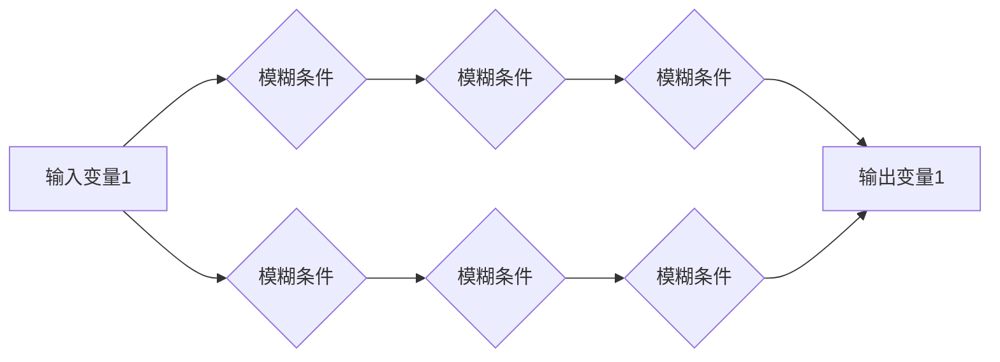
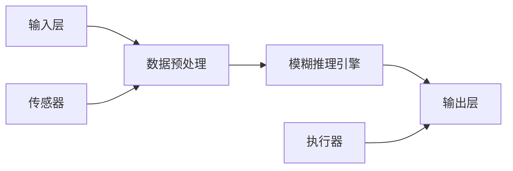
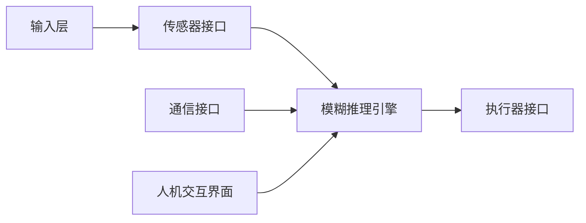
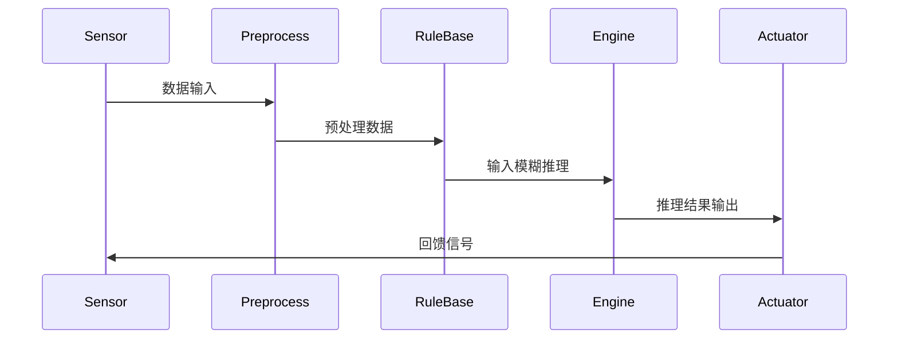
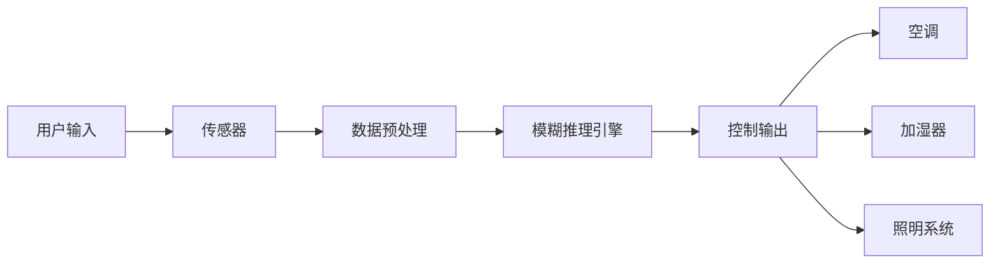

                 


### 第一章：引论

#### 1.1 问题背景与挑战

在人工智能和自动化技术的迅猛发展过程中，逻辑作为一种基本的推理工具，一直扮演着至关重要的角色。传统上，经典逻辑以其明确的二值判断（真或假）和清晰的推理规则，为我们理解和处理问题提供了坚实的基础。然而，在现实世界中，许多情况并不是非黑即白的。例如，当我们评估一个产品的好坏、天气的适宜程度或一个人的体重是否超标时，这些评估往往带有模糊性和主观性。经典逻辑在面对这种模糊不确定的情况时显得力不从心。

经典逻辑的局限主要体现在以下几个方面：

1. **二值判断的局限性**：现实世界中许多现象往往介于“是”与“非”之间，难以用简单的真值判断来刻画。
2. **精确度的要求**：经典逻辑要求输入数据的确定性，这对于实际操作中存在误差的数据处理能力较差。
3. **复杂问题的简化**：经典逻辑通常依赖于简化的假设，这使得它在处理复杂、多变的现实问题时可能会失去准确性。

为了解决这些局限，模糊逻辑应运而生。模糊逻辑提供了一种新的处理模糊性和不确定性的方法，它允许变量取值在[0, 1]之间，用模糊集合的概念描述现实世界的模糊性。模糊逻辑的出现不仅拓宽了逻辑的应用范围，也为人工智能和自动化技术带来了新的发展契机。

#### 1.2 核心概念

**1.2.1 经典逻辑的定义与属性**

经典逻辑，也称为传统逻辑或形式逻辑，是一种基于明确规则和精确推理的数学理论。它的主要特点是：

- **二值判断**：任何陈述都可以被明确地判断为真或假。
- **推理规则**：基于前提和逻辑规则得出结论。
- **命题演算**：处理简单陈述的逻辑运算。
- **谓词演算**：处理复杂陈述和量化表达的逻辑运算。

**1.2.2 模糊逻辑的定义与属性**

模糊逻辑，是一种基于模糊集合理论和模糊推理的数学理论。它的主要特点是：

- **模糊集合**：使用隶属度来表示元素属于集合的程度，而不是简单的是或非。
- **模糊推理**：基于模糊规则进行推理，处理不确定性和模糊性。
- **模糊运算**：包括模糊与、模糊或、模糊非等。
- **模糊控制器**：用于控制模糊系统的逻辑控制器。

**1.2.3 模糊逻辑与经典逻辑的比较**

经典逻辑和模糊逻辑在以下几个方面存在显著差异：

| 对比项         | 经典逻辑                         | 模糊逻辑                           |
|----------------|----------------------------------|------------------------------------|
| 基础理论       | 二值逻辑，命题演算和谓词演算     | 模糊集合理论，模糊推理             |
| 变量取值范围   | 二值（真或假）                   | 模糊集合的隶属度（0到1之间）       |
| 应对模糊性     | 不擅长处理模糊性和不确定性         | 设计用于处理模糊性和不确定性       |
| 推理方式       | 确定性推理                       | 模糊推理，允许不确定性             |
| 应用领域       | 精确系统，如逻辑电路和定理证明     | 控制系统，人工智能，模拟等         |

通过上述比较，我们可以看到，模糊逻辑提供了处理不确定性和模糊性的新方法，特别是在需要处理复杂、多变的数据和问题的领域。

#### 1.3 模糊逻辑的应用领域

模糊逻辑由于其灵活性和强大的处理模糊性的能力，在许多领域都得到了广泛应用。以下是一些主要的领域：

**1.3.1 控制系统**

模糊逻辑被广泛应用于控制系统，如汽车引擎控制、工业过程控制、机器人控制等。在这些系统中，模糊逻辑能够处理传感器的不精确读数和系统的不确定性，从而提高控制精度和稳定性。

**1.3.2 人工智能**

在人工智能领域，模糊逻辑被用来构建智能推理系统、专家系统和模糊神经网络。它能够处理不确定性和模糊性，使得人工智能系统能够更好地适应现实世界的复杂性。

**1.3.3 其他领域**

除了控制系统和人工智能，模糊逻辑还在以下领域得到了应用：

- **决策支持系统**：用于处理复杂、多变量的决策问题。
- **自然语言处理**：用于提高语言理解的模糊性和准确性。
- **图像处理**：用于模糊图像的处理和识别。
- **生物医学**：用于诊断和治疗中的不确定性和模糊性。

#### 1.4 书籍概述

本书旨在系统地介绍模糊逻辑的理论基础和应用方法，帮助读者深入理解模糊逻辑的核心概念及其应用。本书的结构如下：

- **第1章 引言**：介绍经典逻辑和模糊逻辑的背景、核心概念以及它们的应用领域。
- **第2章 经典逻辑详解**：详细讲解经典逻辑的基础知识、数学模型及其优势与局限。
- **第3章 模糊逻辑基础**：介绍模糊逻辑的基本概念、隶属度函数、模糊推理等。
- **第4章 模糊逻辑应用**：分析模糊逻辑在控制系统、人工智能等领域的具体应用案例。
- **第5章 模糊逻辑系统设计**：讲解模糊逻辑系统的设计与实现方法。
- **第6章 模糊逻辑案例分析**：通过具体案例，深入剖析模糊逻辑的应用。
- **第7章 模糊逻辑的未来发展趋势**：展望模糊逻辑的未来发展方向和挑战。

通过本书的学习，读者将能够：

- **理解经典逻辑和模糊逻辑的基本概念和差异**。
- **掌握模糊逻辑的数学模型和推理方法**。
- **应用模糊逻辑解决实际问题，如控制系统设计和人工智能应用**。
- **了解模糊逻辑的研究现状和未来发展趋势**。

#### 1.5 读者预期收益

通过学习本书，读者可以期待以下收益：

- **技术能力提升**：掌握模糊逻辑的核心概念和应用方法，提升在复杂系统设计中的技术能力。
- **知识体系完善**：了解经典逻辑和模糊逻辑的基础知识，构建完整的逻辑和人工智能知识体系。
- **问题解决能力增强**：学会使用模糊逻辑处理现实世界中的模糊性和不确定性问题。
- **研究视野拓展**：了解模糊逻辑的前沿研究和发展趋势，为未来的研究工作提供指导。

总之，本书旨在为读者提供一条系统学习模糊逻辑的途径，帮助他们更好地理解和应用这一强大的工具，解决现实世界中的复杂问题。

### 第一章：引论

#### 1.6 总结与展望

在本章的引论中，我们首先探讨了经典逻辑的背景和挑战，明确了其在处理确定性和精确性方面的优势与局限。接着，我们介绍了模糊逻辑的核心概念，阐述了其在处理模糊性和不确定性方面的独特能力。通过对比经典逻辑和模糊逻辑，我们看到了模糊逻辑在现实世界中的应用潜力。此外，我们还详细介绍了模糊逻辑的应用领域，展示了其在控制系统、人工智能等多个领域的重要性。

本章的主要目的是为读者搭建一个理解模糊逻辑的框架，通过介绍模糊逻辑与经典逻辑的关系和应用场景，为后续章节的深入探讨打下基础。本章的核心概念包括经典逻辑的基本定义和属性、模糊逻辑的基本定义和属性，以及模糊逻辑与经典逻辑的比较。

在总结本章内容时，我们强调了模糊逻辑在应对现实世界中的不确定性和模糊性方面的优势，并指出其在控制系统和人工智能等领域的重要应用。通过本书的引导，读者可以逐步掌握模糊逻辑的理论基础和应用方法，为解决复杂问题提供新的思路和工具。

展望未来，模糊逻辑将继续在人工智能和自动化技术中发挥重要作用。随着技术的不断进步，模糊逻辑的应用领域将更加广泛，包括但不限于自然语言处理、图像识别、生物医学等领域。此外，模糊逻辑的研究也将不断深入，探索新的理论和应用方法，以应对更加复杂和动态的挑战。

通过本章的学习，读者应该对模糊逻辑有了初步的认识，并对后续章节的内容充满期待。接下来，我们将进一步深入探讨经典逻辑的详细内容，为理解模糊逻辑打下坚实的基础。

### 第二章：经典逻辑详解

#### 2.1 经典逻辑基础

**2.1.1 经典逻辑的基本概念**

经典逻辑，亦称传统逻辑或形式逻辑，是研究推理规则和论证方法的一种数学理论。它以明确的规定和精确的推理为特点，为我们的思考和决策提供了坚实的逻辑基础。经典逻辑主要涉及以下几个基本概念：

- **命题**：命题是可以判断真假的陈述句。例如，“今天是晴天”和“苹果是红色的”都是命题。
- **逻辑运算**：经典逻辑中的基本运算包括合取（AND）、析取（OR）和非（NOT）。例如，“A且B”表示A和B同时为真，“A或B”表示A和B至少有一个为真，“非A”表示A为假的反命题。
- **推理规则**：推理规则是指从一组已知命题推导出新命题的规则。例如，若已知“如果A则B”和“A”，则可以推导出“B”。
- **逻辑系统**：逻辑系统是由命题、逻辑运算和推理规则构成的整体。常见的逻辑系统包括命题演算和谓词演算。

**2.1.2 经典逻辑的基本运算**

经典逻辑的基本运算主要包括以下几种：

- **合取（AND）**：合取运算用符号“∧”表示，表示两个命题同时为真。例如，命题P和Q的合取表示为P∧Q。
- **析取（OR）**：析取运算用符号“∨”表示，表示两个命题中至少有一个为真。例如，命题P和Q的析取表示为P∨Q。
- **非（NOT）**：非运算用符号“¬”表示，表示一个命题的真值取反。例如，命题P的非表示为¬P。

经典逻辑的基本运算可以组合使用，形成更复杂的逻辑表达式。例如，“P且Q或R”可以表示为P∧Q∨R。

**2.1.3 经典逻辑的应用场景**

经典逻辑在许多应用场景中都发挥着重要作用，以下是一些典型的应用：

- **计算机科学**：在计算机科学中，经典逻辑广泛应用于编程、电路设计和形式验证。例如，布尔表达式和逻辑电路都是经典逻辑的应用。
- **数学证明**：在数学领域，经典逻辑用于构建证明框架，确保推理过程的一致性和有效性。
- **法律和道德**：在法律和道德领域，经典逻辑用于论证法律条款的合理性、判断责任和权利。
- **日常推理**：在日常生活中，我们经常使用经典逻辑进行推理和决策，例如在商业谈判、医学诊断和风险评估中。

通过经典逻辑的推理规则，我们可以从一个或多个已知命题推导出新的命题，从而帮助我们做出合理、可靠的决策。

#### 2.2 经典逻辑的数学模型

**2.2.1 经典逻辑的命题演算**

命题演算是经典逻辑中最基础的演算形式，它主要研究命题的真值和复合命题的真值之间的关系。命题演算包括以下几个基本概念：

- **命题变量**：命题变量是用来表示命题的符号，通常用大写字母P、Q、R等表示。
- **命题公式**：命题公式是由命题变量和逻辑运算符组成的表达式，可以用来表示复合命题。常见的命题公式包括合取（∧）、析取（∨）和非（¬）。
- **真值表**：真值表是列出命题公式中所有可能真值组合以及相应真值的表格。通过真值表，我们可以直观地分析命题公式在不同情况下的真值。

以下是一个简单的真值表示例，表示命题P和Q的合取（P∧Q）的真值情况：

| P | Q | P∧Q |
|---|---|-----|
| T | T | T   |
| T | F | F   |
| F | T | F   |
| F | F | F   |

通过真值表，我们可以看到合取运算在各个命题变量组合下的真值情况。例如，当P和Q都为真时，P∧Q也为真；当P和Q中有一个为假时，P∧Q为假。

**2.2.2 经典逻辑的谓词演算**

谓词演算是经典逻辑的扩展，它用于处理包含变量和谓词的复杂命题。谓词演算主要包括以下概念：

- **谓词**：谓词是用来描述对象性质的表达式，通常用符号F、G、H等表示。例如，“人是理性的”可以表示为H(x)。
- **个体**：个体是谓词的取值对象，通常用小写字母a、b、c等表示。
- **命题公式**：谓词演算中的命题公式可以包含谓词、个体和逻辑运算符。例如，“所有人都是理性的”可以表示为∀xH(x)。
- **量化词**：量化词包括全称量词（∀）和存在量词（∃），用于表示谓词对个体的范围限制。全称量词表示对所有个体都成立，存在量词表示至少存在一个个体成立。

以下是一个简单的谓词演算示例，表示“所有人都是理性的”和“有些人不理性”的命题公式：

- **全称命题**：∀xH(x)，表示对于所有个体x，H(x)都为真。
- **存在命题**：∃x¬H(x)，表示至少存在一个个体x，使得¬H(x)为真。

通过谓词演算，我们可以更精确地描述和推理复杂命题，为形式逻辑和人工智能提供了强大的工具。

**2.2.3 经典逻辑的公理系统**

公理系统是经典逻辑的基础，它由一组公理和推理规则构成，用于证明命题的真值。经典逻辑的公理系统主要包括以下内容：

- **基本公理**：基本公理是逻辑系统中最基础的真理，它们是逻辑推理的基础。常见的公理包括自反律（A→A）、对称律（A→B等价于B→A）和传递律（如果A→B且B→C，则A→C）。
- **推理规则**：推理规则是用于从已知命题推导出新命题的规则。常见的推理规则包括合取引入（A、B→A∧B）、析取引入（A→A∨B）和析取消除（A∨B、¬A→B）。

以下是一个简单的推理示例：

- **前提**：A→B，B→C
- **推理**：根据合取引入规则，从前提A→B和B→C可以推导出A→C。

通过公理系统和推理规则，我们可以建立起一个逻辑严密、自洽的推理框架，用于验证和推理各种命题的真值。

#### 2.3 经典逻辑的优势与局限

**2.3.1 经典逻辑的优势**

经典逻辑在许多领域都表现出显著的优势，以下是一些主要优势：

- **精确性**：经典逻辑通过明确的二值判断（真或假）和严格的推理规则，为我们的思考提供了精确和可靠的框架。
- **形式化**：经典逻辑可以用形式化的数学方法表示和验证，这使得它在计算机科学和人工智能领域具有广泛的应用。
- **普适性**：经典逻辑的基本原理和推理方法在各种不同的应用场景中都具有通用性，无论是数学证明、计算机编程还是法律论证。

**2.3.2 经典逻辑的局限**

尽管经典逻辑具有许多优势，但它也存在一些显著的局限，尤其是在处理模糊性和不确定性方面：

- **二值判断的局限性**：现实世界中许多现象并不适合用简单的“是”或“非”来描述，例如天气的适宜程度、产品的满意度等。经典逻辑难以处理这种模糊性和不确定性。
- **对精确数据的要求**：经典逻辑通常要求输入数据的确定性，但在实际操作中，数据往往存在误差和不精确性，这使得经典逻辑的应用受到限制。
- **简化假设**：经典逻辑依赖于简化的假设，如忽略系统内部和外部的干扰因素。这在复杂系统中可能导致不准确的结果。

**2.3.3 经典逻辑的应用扩展**

为了克服经典逻辑的局限，研究者们尝试在经典逻辑的基础上进行扩展，发展出一些新的逻辑系统，如模糊逻辑、量子逻辑等。这些扩展逻辑系统在处理模糊性和不确定性方面表现出更强的能力：

- **模糊逻辑**：模糊逻辑引入了隶属度的概念，允许变量取值在[0, 1]之间，从而更好地处理现实世界的模糊性。模糊逻辑在控制系统、人工智能等领域得到了广泛应用。
- **量子逻辑**：量子逻辑基于量子力学的原理，如叠加态和纠缠态，用于处理复杂系统中的不确定性。量子逻辑在量子计算和量子信息处理领域具有重要应用。

通过这些扩展逻辑系统，我们可以更好地应对现实世界中的复杂性和不确定性，为人工智能和自动化技术的发展提供了新的工具和方法。

#### 2.4 经典逻辑案例分析

**2.4.1 简单案例解析**

为了更好地理解经典逻辑的应用，我们可以通过一个简单的案例来进行分析。

**案例**：判断“如果今天下雨，则地面湿润”这个陈述的真假。

**步骤**：

1. **定义命题**：设P表示“今天下雨”，Q表示“地面湿润”。
2. **构建逻辑表达式**：根据命题描述，可以构建逻辑表达式P→Q，表示“如果今天下雨，则地面湿润”。
3. **分析真值**：通过分析P和Q的真值，可以确定P→Q的真值。

   - 如果P为真（今天下雨），而Q也为真（地面湿润），则P→Q为真。
   - 如果P为真，但Q为假，则P→Q为假。
   - 如果P为假，则无论Q的真值如何，P→Q都为真（因为假命题的蕴含命题总是为真）。

   因此，这个简单案例的真值情况如下：

   | P | Q | P→Q |
   |---|---|------|
   | T | T | T    |
   | T | F | F    |
   | F | T | T    |
   | F | F | T    |

通过这个简单案例，我们可以看到经典逻辑的基本推理过程和结果。在现实世界的应用中，这种推理方法可以帮助我们做出基于逻辑判断的决策。

**2.4.2 复杂案例解析**

为了展示经典逻辑在实际应用中的复杂情况，我们来看一个更复杂的案例。

**案例**：判断“如果温度低于20摄氏度且风速大于10米/秒，则滑雪场开放”这个陈述的真假。

**步骤**：

1. **定义命题**：设P表示“温度低于20摄氏度”，Q表示“风速大于10米/秒”，R表示“滑雪场开放”。
2. **构建逻辑表达式**：根据命题描述，可以构建逻辑表达式（P∧Q）→R，表示“如果温度低于20摄氏度且风速大于10米/秒，则滑雪场开放”。
3. **分析真值**：通过分析P、Q和R的真值，可以确定（P∧Q）→R的真值。

   - 如果P和Q同时为真，而R也为真，则（P∧Q）→R为真。
   - 如果P和Q中有一个为假，则（P∧Q）为假，此时无论R的真值如何，（P∧Q）→R都为真。
   - 如果P和Q同时为假，则（P∧Q）为假，此时无论R的真值如何，（P∧Q）→R都为真。

   因此，这个复杂案例的真值情况如下：

   | P | Q | R | (P∧Q)→R |
   |---|---|---|---------|
   | T | T | T | T       |
   | T | F | T | T       |
   | F | T | T | T       |
   | F | F | T | T       |
   | T | T | F | F       |
   | T | F | F | T       |
   | F | T | F | T       |
   | F | F | F | T       |

通过这个复杂案例，我们可以看到经典逻辑在处理多个变量和复杂条件时的推理过程和结果。这种推理方法在实际决策中具有广泛应用，例如在气象预报、商业策略制定等领域。

**2.4.3 案例总结**

通过上述案例解析，我们可以看到经典逻辑在处理简单和复杂命题时的应用和效果。经典逻辑通过明确的推理规则和二值判断，为我们提供了精确和可靠的推理框架，适用于许多不同的领域。然而，在处理模糊性和不确定性方面，经典逻辑存在一定的局限。为了克服这些局限，我们可以结合模糊逻辑等其他逻辑系统，构建更加灵活和强大的推理框架，以应对现实世界的复杂性。

#### 2.5 本章小结

本章详细介绍了经典逻辑的基础知识、数学模型以及其在处理模糊性和不确定性方面的优势和局限。通过学习本章，读者应该对经典逻辑有了全面的理解，包括其基本概念、逻辑运算、命题演算和谓词演算等。我们还通过简单和复杂案例，展示了经典逻辑在实际应用中的效果和局限性。

经典逻辑在计算机科学、数学证明、法律和日常推理等领域具有广泛的应用。然而，在面对模糊性和不确定性时，经典逻辑的局限性变得明显。为此，我们需要探索其他逻辑系统，如模糊逻辑，以更好地处理现实世界中的复杂问题。

在下一章中，我们将详细介绍模糊逻辑的基础知识，包括模糊集合、隶属度函数和模糊推理等。通过这些内容的学习，我们将为理解模糊逻辑的应用提供坚实的基础。敬请期待下一章的精彩内容！

### 第三章：模糊逻辑基础

#### 3.1 模糊逻辑的定义与背景

模糊逻辑，作为一种处理模糊性和不确定性的数学理论，是在20世纪60年代由美国自动控制专家扎德（L.A. Zadeh）提出的。模糊逻辑的出现是为了解决经典逻辑在处理模糊现象时的局限性。传统逻辑依赖于明确的二值判断（真或假），这在许多现实世界中并不适用，因为很多情况都存在模糊性和不确定性。例如，在评估天气是否晴朗、产品是否满意等方面，往往无法用简单的“是”或“否”来描述。模糊逻辑通过引入隶属度的概念，允许变量取值在0到1之间，从而更好地描述和模拟现实世界的复杂情况。

**3.1.1 模糊逻辑的产生**

模糊逻辑的产生背景可以追溯到经典逻辑和概率论的局限。经典逻辑在处理精确和确定性问题时非常有效，但在面对模糊性和不确定性时显得力不从心。概率论虽然在一定程度上解决了不确定性问题，但它依赖于统计数据的精度，对于实际操作中存在误差的数据处理能力较差。因此，扎德提出了模糊逻辑，旨在提供一种新的方法来处理模糊性和不确定性。

**3.1.2 模糊逻辑的发展**

自提出以来，模糊逻辑在理论研究和应用领域都取得了显著进展。随着计算机技术和人工智能的快速发展，模糊逻辑的应用范围不断扩展。它不仅被应用于控制系统和人工智能领域，还在决策支持系统、自然语言处理、图像识别等多个领域得到了广泛应用。近年来，模糊逻辑的研究不断深入，包括新的隶属度函数、模糊推理算法和模糊控制器的设计等，为处理复杂现实问题提供了更多可能性。

#### 3.2 模糊集合

模糊集合是模糊逻辑的核心概念，它引入了隶属度的概念，以描述元素属于集合的程度。在经典集合中，元素要么属于集合（隶属度为1），要么不属于集合（隶属度为0）。而在模糊集合中，元素对集合的隶属度可以在0到1之间取值，表示元素属于集合的程度。

**3.2.1 模糊集合的定义**

模糊集合的定义与经典集合类似，但引入了隶属度函数的概念。一个模糊集合F可以用一个隶属度函数μF表示，该函数定义了集合F中每个元素x的隶属度μF(x)。具体来说，隶属度函数μF：U → [0, 1]，其中U是元素集合。

**3.2.2 隶属度函数**

隶属度函数是模糊集合的核心，它用于描述元素属于集合的程度。隶属度函数可以是任意的连续函数，但通常采用以下几种常见的隶属度函数形式：

1. **三角隶属度函数**：三角隶属度函数是一种简单的模糊隶属度函数，其形式为：

   μT(x) = 
   \[
   \begin{cases}
   \frac{x - a}{b - a} & \text{if } a \leq x < b, \\
   1 & \text{if } b \leq x < c, \\
   \frac{c - x}{c - b} & \text{if } b \leq x < c.
   \end{cases}
   \]

   其中，a、b、c是模糊集合的三个参数，分别表示三角函数的起点、终点和最高点。

2. **梯形隶属度函数**：梯形隶属度函数与三角隶属度函数类似，但允许隶属度函数在端点处有一个斜率。其形式为：

   μL(x) = 
   \[
   \begin{cases}
   \frac{x - a}{b - a} & \text{if } a \leq x < b, \\
   \frac{c - x}{c - b} & \text{if } b \leq x < c.
   \end{cases}
   \]

   其中，a、b、c是梯形函数的三个参数。

3. **高斯隶属度函数**：高斯隶属度函数基于高斯分布函数，其形式为：

   μG(x) = \frac{1}{\sigma \sqrt{2\pi}} e^{-\frac{(x - \mu)^2}{2\sigma^2}},

   其中，μ是均值，σ是标准差。

这些隶属度函数可以根据具体应用的需求进行选择，以更好地描述元素的隶属程度。

**3.2.3 模糊集合的基本操作**

模糊集合的基本操作包括模糊与、模糊或和模糊非等。这些操作与经典集合的基本操作类似，但引入了隶属度的概念。

1. **模糊与（∧）**：模糊与操作表示两个模糊集合的交集，其结果是一个新的模糊集合，其隶属度是两个模糊集合对应元素隶属度的最小值。设F和G是两个模糊集合，其隶属度函数分别为μF和μG，则模糊与的隶属度函数为：

   μF∧G(x) = min(μF(x), μG(x))。

2. **模糊或（∨）**：模糊或操作表示两个模糊集合的并集，其结果是一个新的模糊集合，其隶属度是两个模糊集合对应元素隶属度的最大值。设F和G是两个模糊集合，其隶属度函数分别为μF和μG，则模糊或的隶属度函数为：

   μF∨G(x) = max(μF(x), μG(x))。

3. **模糊非（¬）**：模糊非操作表示一个模糊集合的补集，其结果是一个新的模糊集合，其隶属度是原模糊集合对应元素隶属度的反值。设F是模糊集合，其隶属度函数为μF，则模糊非的隶属度函数为：

   μ¬F(x) = 1 - μF(x)。

通过这些基本操作，我们可以构造复杂的模糊逻辑表达式，以处理复杂的模糊性和不确定性问题。

#### 3.3 模糊推理

模糊推理是模糊逻辑的核心应用之一，它通过模糊规则和模糊推理算法，从已知信息推导出结论。模糊推理的核心思想是利用模糊规则将输入模糊集合映射到输出模糊集合。

**3.3.1 模糊规则**

模糊规则通常采用“如果……则……”的形式，表示为：

如果（条件部分），则（结论部分）。

在模糊逻辑中，模糊规则的条件部分和结论部分都是模糊集合。例如：

如果（温度高且湿度低），则（适合跑步）。

条件部分“温度高且湿度低”是一个模糊集合，结论部分“适合跑步”也是一个模糊集合。

**3.3.2 模糊推理算法**

模糊推理算法是模糊逻辑的核心，它通过模糊规则和输入模糊集合，推导出输出模糊集合。常见的模糊推理算法包括以下几种：

1. **最小-最大推理**：最小-最大推理是一种基本的模糊推理算法，它通过取最小值和最大值来计算输出模糊集合的隶属度。具体来说，给定输入模糊集合X和模糊规则库R，输出模糊集合Y的隶属度函数μY可以通过以下步骤计算：

   对于每个规则Ri，计算其前提模糊集合与输入模糊集合的模糊与（∧）：

   μX∧Ri（x）= min（μX(x)，μRi(x)）。

   然后对上述结果取最大值：

   μY(x) = max（μX∧Ri（x））。

   其中，X和Y是输入和输出模糊集合，Ri是模糊规则。

2. **加权平均推理**：加权平均推理是一种更复杂的模糊推理算法，它考虑每个模糊规则的权重。具体来说，给定输入模糊集合X和模糊规则库R，输出模糊集合Y的隶属度函数μY可以通过以下步骤计算：

   对于每个规则Ri，计算其前提模糊集合与输入模糊集合的模糊与（∧）：

   μX∧Ri（x）= min（μX(x)，μRi(x)）。

   计算每个模糊规则的权重，通常采用最大隶属度方法，即取每个规则前提模糊集合的最大隶属度：

   ωRi = μX∧Ri（x）。

   对每个规则Ri，计算其结论模糊集合与前提模糊集合的模糊与（∧）：

   μY∧Ri（x）= μRi（x）。

   计算输出模糊集合的隶属度，通过加权平均：

   μY(x) = ΣωRi * μY∧Ri（x）。

   其中，X和Y是输入和输出模糊集合，Ri是模糊规则，ωRi是模糊规则的权重。

通过这些模糊推理算法，我们可以从已知信息推导出结论，从而在处理模糊性和不确定性问题时具有更高的灵活性和准确性。

#### 3.4 模糊逻辑的应用

模糊逻辑由于其灵活性和强大的处理模糊性和不确定性的能力，在许多领域得到了广泛应用。以下是一些典型的应用领域：

**3.4.1 控制系统**

模糊逻辑被广泛应用于各种控制系统，如自动温度控制、汽车引擎控制和机器人控制等。在这些系统中，模糊逻辑可以处理传感器的不精确读数和系统的不确定性，从而提高控制精度和稳定性。

**3.4.2 人工智能**

在人工智能领域，模糊逻辑被用于构建智能推理系统、专家系统和模糊神经网络。模糊逻辑能够处理不确定性和模糊性，使得人工智能系统能够更好地适应现实世界的复杂性。

**3.4.3 自然语言处理**

模糊逻辑在自然语言处理中也发挥了重要作用，如文本分类、信息抽取和机器翻译等。模糊逻辑可以处理词语的模糊含义和语法歧义，从而提高自然语言处理系统的准确性和鲁棒性。

**3.4.4 图像处理**

模糊逻辑在图像处理中用于图像分割、图像增强和图像识别等。模糊逻辑可以处理图像中的模糊性和噪声，从而提高图像处理系统的性能。

**3.4.5 生物医学**

在生物医学领域，模糊逻辑被用于医学诊断、治疗方案设计和药物疗效评估等。模糊逻辑可以处理医学数据的模糊性和不确定性，从而提高医学决策的准确性和可靠性。

综上所述，模糊逻辑在多个领域得到了广泛应用，展示了其强大的处理模糊性和不确定性的能力。随着技术的不断进步，模糊逻辑的应用领域将更加广泛，为解决复杂现实问题提供了新的工具和方法。

#### 3.5 本章小结

本章详细介绍了模糊逻辑的定义与背景、模糊集合、模糊推理以及模糊逻辑的应用。通过本章的学习，读者应该对模糊逻辑有了全面的理解，包括其核心概念、基本原理和应用场景。

模糊逻辑通过引入隶属度的概念，允许变量取值在0到1之间，从而更好地处理现实世界中的模糊性和不确定性。模糊集合是模糊逻辑的基础，它通过隶属度函数描述元素属于集合的程度。模糊推理则是模糊逻辑的核心应用，通过模糊规则和模糊推理算法，从已知信息推导出结论。

模糊逻辑在控制系统、人工智能、自然语言处理、图像处理和生物医学等多个领域得到了广泛应用，展示了其强大的处理模糊性和不确定性的能力。通过本章的学习，读者可以为后续章节的深入探讨打下坚实的基础，更好地理解和应用模糊逻辑。

在下一章中，我们将进一步探讨模糊逻辑在具体应用领域的案例，通过实际案例来展示模糊逻辑的应用效果和优势。敬请期待下一章的精彩内容！

### 第四章：模糊逻辑应用

#### 4.1 模糊逻辑在控制系统中的应用

模糊逻辑在控制系统中的应用非常广泛，尤其是在那些需要处理非线性、时变和复杂动态特性的系统中。模糊控制器的核心思想是通过模糊规则将输入变量映射到输出变量，从而实现对系统的控制。以下是一些模糊逻辑在控制系统中的应用案例：

**4.1.1 汽车引擎控制**

在汽车引擎控制系统中，模糊逻辑被用来控制燃油喷射和点火时机。例如，在发动机的燃油喷射控制中，模糊逻辑可以根据发动机的转速、负载和温度等输入变量，实时调整燃油喷射量，以达到最佳燃烧效率和排放控制。模糊控制器通过模糊规则处理这些变量之间的非线性关系，从而提高控制精度和稳定性。

**4.1.2 机器人控制**

在机器人控制中，模糊逻辑被用来处理机器人关节的运动控制和路径规划。由于机器人工作环境的复杂性和不确定性，传统控制方法往往难以达到理想的控制效果。模糊逻辑通过引入模糊规则，能够处理机器人传感器的不精确读数和环境的变化，从而实现更加灵活和鲁棒的运动控制。

**4.1.3 工业过程控制**

在工业过程中，如温度控制、压力控制和流量控制等，模糊逻辑被用来优化和控制生产过程。例如，在化工生产中，通过模糊逻辑控制反应釜的温度和压力，可以确保反应的稳定性和产品质量。模糊控制器可以根据实时监测的数据，动态调整控制参数，从而提高生产效率和产品质量。

**4.1.4 家居自动化系统**

在智能家居自动化系统中，模糊逻辑被用来控制照明、温度和安防等。例如，在智能恒温系统中，模糊逻辑可以根据室内的温度和用户设置的温度偏好，自动调整空调的温度和开关状态，以提供舒适的居住环境。通过模糊逻辑的控制，家居自动化系统能够更好地适应用户的需求和环境的动态变化。

**4.1.5 电力系统控制**

在电力系统中，模糊逻辑被用来优化发电和配电控制。例如，在电力负载分配中，模糊逻辑可以根据负载的实时变化和电力网的状态，动态调整发电机的输出功率，以确保电力系统的稳定运行。模糊逻辑在电力系统中的应用，可以提高电力系统的运行效率和可靠性。

通过上述案例，我们可以看到模糊逻辑在控制系统中的应用不仅提高了控制的精度和稳定性，还增强了系统对不确定性和复杂性的适应能力。

#### 4.2 模糊逻辑在人工智能中的应用

模糊逻辑在人工智能领域也有广泛的应用，尤其是在那些需要处理不确定性和模糊性的场景中。以下是一些模糊逻辑在人工智能中的应用案例：

**4.2.1 模糊神经网络**

模糊神经网络是一种结合了模糊逻辑和神经网络技术的混合模型，它通过模糊规则和神经网络的学习算法，实现对复杂非线性问题的建模和优化。模糊神经网络在模式识别、预测和决策支持等领域表现出强大的能力。

**4.2.2 模糊推理系统**

模糊推理系统是一种基于模糊逻辑的推理模型，它通过模糊规则库和模糊推理算法，实现从已知信息到结论的推理过程。模糊推理系统在知识表示、推理和决策支持系统中得到了广泛应用，尤其是在那些需要处理模糊性和不确定性的领域，如医疗诊断、金融风险评估等。

**4.2.3 自然语言处理**

在自然语言处理中，模糊逻辑被用来处理词语的模糊含义和语法歧义。例如，在文本分类和信息抽取中，模糊逻辑可以根据词语的模糊隶属度，实现更加准确和灵活的分类和提取。模糊逻辑在自然语言处理中的应用，提高了系统的鲁棒性和准确性。

**4.2.4 语音识别**

在语音识别中，模糊逻辑被用来处理语音信号中的不确定性和噪声。模糊逻辑可以通过模糊规则和模糊推理，提高语音识别系统的鲁棒性和准确性。例如，在连续语音识别中，模糊逻辑可以根据上下文信息，处理词语的模糊边界和语音信号的不确定性。

**4.2.5 智能决策支持系统**

在智能决策支持系统中，模糊逻辑被用来处理复杂决策问题中的不确定性和模糊性。例如，在供应链管理中，模糊逻辑可以根据需求预测、供应约束和库存水平等不确定性因素，提供最佳决策方案。模糊逻辑在智能决策支持系统中的应用，提高了决策的灵活性和准确性。

通过这些案例，我们可以看到模糊逻辑在人工智能中的应用，不仅增强了系统的鲁棒性和准确性，还为处理复杂不确定性问题提供了新的方法。

#### 4.3 模糊逻辑在其他领域中的应用

除了控制系统和人工智能，模糊逻辑还在许多其他领域得到了应用，展示了其强大的处理模糊性和不确定性的能力。以下是一些模糊逻辑在其他领域的应用案例：

**4.3.1 决策支持系统**

在决策支持系统中，模糊逻辑被用来处理决策过程中存在的不确定性和模糊性。例如，在多目标决策中，模糊逻辑可以根据各目标的模糊权重和模糊隶属度，实现更加准确和灵活的决策。模糊逻辑在决策支持系统中的应用，提高了决策的效率和准确性。

**4.3.2 自然语言处理**

在自然语言处理中，模糊逻辑被用来处理词语的模糊含义和语法歧义。例如，在文本分类和信息抽取中，模糊逻辑可以根据词语的模糊隶属度，实现更加准确和灵活的分类和提取。模糊逻辑在自然语言处理中的应用，提高了系统的鲁棒性和准确性。

**4.3.3 图像处理**

在图像处理中，模糊逻辑被用来处理图像的模糊性和噪声。例如，在图像分割和图像增强中，模糊逻辑可以根据图像的模糊隶属度，实现更加准确和鲁棒的图像处理。模糊逻辑在图像处理中的应用，提高了图像处理系统的性能和可靠性。

**4.3.4 生物医学**

在生物医学领域，模糊逻辑被用来处理医学数据中的模糊性和不确定性。例如，在医学诊断和治疗方案设计中，模糊逻辑可以根据医学数据的模糊隶属度，提供最佳诊断和治疗方案。模糊逻辑在生物医学中的应用，提高了医学决策的准确性和可靠性。

**4.3.5 环境监测**

在环境监测中，模糊逻辑被用来处理环境数据的模糊性和不确定性。例如，在水质监测中，模糊逻辑可以根据水质参数的模糊隶属度，实现更加准确和实时的水质监测。模糊逻辑在环境监测中的应用，提高了环境监测的效率和准确性。

通过这些案例，我们可以看到模糊逻辑在各个领域中的应用，不仅提高了系统的性能和可靠性，还为处理复杂不确定性问题提供了新的方法。

#### 4.4 本章小结

本章详细介绍了模糊逻辑在控制系统、人工智能和其他领域中的应用。通过模糊逻辑，我们可以更好地处理现实世界中的模糊性和不确定性，从而提高系统的性能和可靠性。

在控制系统方面，模糊逻辑通过模糊控制器，实现了对非线性、时变和复杂动态特性的系统的精确控制。在人工智能领域，模糊逻辑通过模糊神经网络和模糊推理系统，提高了系统的鲁棒性和准确性。在其他领域，模糊逻辑也展示了其强大的处理模糊性和不确定性的能力，如在决策支持系统、自然语言处理、图像处理和生物医学中的应用。

通过本章的学习，读者应该对模糊逻辑的应用有了全面的理解，为在实际问题中应用模糊逻辑提供了理论依据和实践指导。在下一章中，我们将进一步探讨模糊逻辑系统的设计与实现方法，通过具体案例展示模糊逻辑系统的构建和应用。敬请期待下一章的精彩内容！

### 第四章：模糊逻辑系统设计与实现

#### 4.1 系统设计概述

模糊逻辑系统的设计是一个复杂且关键的过程，涉及到系统的功能需求分析、系统架构设计、模糊规则库的构建以及系统的实现与验证。以下将详细讨论这些关键步骤。

**4.1.1 功能需求分析**

在开始设计模糊逻辑系统之前，首先需要明确系统的功能需求。这包括以下几个方面：

- **输入变量**：确定系统所需输入的变量，如传感器读数、环境参数等。
- **输出变量**：确定系统需要产生的输出，如控制信号、预测结果等。
- **性能指标**：设定系统的性能要求，如响应速度、准确率、稳定性等。
- **约束条件**：明确系统运行中的约束，如硬件限制、能耗要求等。

**4.1.2 系统架构设计**

模糊逻辑系统的架构设计决定了系统的可扩展性和易维护性。以下是一些关键设计要素：

- **输入层**：接收系统输入变量，通常包括传感器模块和数据预处理模块。
- **规则库**：存储模糊规则，是模糊推理的核心。规则库的设计直接影响到系统的性能。
- **推理引擎**：实现模糊推理过程，将输入变量通过模糊规则映射到输出变量。
- **输出层**：将推理结果转换为实际的控制信号或决策，如执行器控制、信息显示等。
- **系统接口**：提供与其他系统或设备的接口，如通信接口、人机交互界面等。

**4.1.3 系统实现与验证**

系统实现与验证是确保系统设计有效性和可靠性的关键步骤。以下是一些关键步骤：

- **编码实现**：根据系统架构设计，使用编程语言实现系统的各个组件。
- **系统集成**：将各个组件集成到一起，进行系统级测试，确保系统各部分协同工作。
- **性能验证**：通过实际运行数据和模拟测试，验证系统是否满足功能需求和性能指标。
- **用户测试**：邀请用户进行测试，收集反馈，进一步优化系统性能和用户体验。

#### 4.2 系统功能设计

**4.2.1 领域模型设计**

领域模型是描述系统功能需求的一种抽象表示，通常使用类图、实体关系图（ER图）等工具进行设计。以下是一个简单的领域模型设计示例，用于描述一个模糊逻辑控制系统：

```mermaid
classDiagram
  Sensor --|> InputLayer : 数据输入
  OutputLayer --|> Actuator : 控制输出
  FuzzyRuleBase --|> InferenceEngine : 模糊推理
  InputLayer {
    - sensors : 传感器列表
    - preprocess : 数据预处理
  }
  OutputLayer {
    - actuators : 执行器列表
    - controlSignal : 控制信号
  }
  FuzzyRuleBase {
    - rules : 模糊规则
  }
  InferenceEngine {
    - ruleEngine : 规则引擎
    - membershipFunctions : 隶属度函数
  }
  Sensor <=|> InputLayer : 输入
  OutputLayer <=|> Actuator : 输出
  FuzzyRuleBase <=|> InferenceEngine : 规则库
  InferenceEngine <=|> OutputLayer : 推理结果
```

**4.2.2 模糊规则库设计**

模糊规则库是模糊逻辑系统的核心，用于描述输入变量与输出变量之间的关系。以下是一个简单的模糊规则库设计示例：



在这个示例中，输入变量A与输出变量E之间存在三个模糊条件B、C和D，以及三个模糊条件F、G和H。这些模糊条件通过隶属度函数描述，用于模糊推理过程。

#### 4.3 系统架构设计

**4.3.1 架构图设计**

系统架构设计是确保系统稳定、高效运行的关键。以下是一个模糊逻辑控制系统的架构图设计示例：



在这个架构图中，传感器（E）收集数据后经过数据预处理（B），然后输入到模糊推理引擎（C），最终通过执行器（F）输出控制信号。

**4.3.2 系统接口设计**

系统接口设计是确保系统与其他系统或设备有效交互的关键。以下是一个简单的接口设计示例：



在这个接口设计中，传感器接口（B）和执行器接口（D）用于数据输入和输出，通信接口（E）和人机交互界面（F）用于系统与其他系统的交互。

#### 4.4 系统交互设计

**4.4.1 序列图设计**

系统交互设计通常使用序列图（Sequence Diagram）来描述系统组件之间的交互过程。以下是一个简单的模糊逻辑控制系统序列图设计示例：



在这个序列图中，传感器（Sensor）收集数据后传递给数据预处理模块（Preprocess），预处理后的数据输入到模糊推理引擎（Engine），推理结果通过执行器（Actuator）输出控制信号，最终传感器接收反馈信号。

通过上述设计，我们可以看到模糊逻辑控制系统从输入到输出的完整交互过程，为系统的实现和验证提供了清晰的指导。

#### 4.5 本章小结

本章详细介绍了模糊逻辑系统的设计与实现过程，包括功能需求分析、系统架构设计、模糊规则库设计和系统交互设计。通过领域模型、类图、ER图和序列图等工具，我们展示了如何设计一个完整的模糊逻辑系统。

功能需求分析明确了系统的输入、输出和性能指标，系统架构设计确保了系统的稳定性与扩展性，模糊规则库设计提供了系统的核心推理逻辑，系统交互设计描述了系统组件之间的交互过程。

通过本章的学习，读者应该对模糊逻辑系统的设计有了全面的理解，能够根据实际需求设计和实现自己的模糊逻辑系统。在下一章中，我们将通过具体案例展示模糊逻辑系统的实现和应用，为读者提供更加直观的学习体验。敬请期待下一章的精彩内容！

### 第五章：模糊逻辑案例分析

#### 5.1 项目介绍

在本案例中，我们将设计并实现一个基于模糊逻辑的智能家居控制系统。该系统旨在通过模糊逻辑来控制家庭环境中的温度、湿度和照明等。项目的主要目标是提高居住舒适度，同时实现能源节约。

**5.1.1 系统需求**

- **输入变量**：温度、湿度、光照强度、用户舒适度评分。
- **输出变量**：空调温度设置、加湿器开关、照明亮度调整。
- **性能指标**：系统响应时间小于5秒，控制精度±1摄氏度，湿度调节精度±5%。

**5.1.2 系统功能**

- **自动调节温度**：根据室内温度和用户设定的舒适度评分，自动调整空调温度。
- **自动加湿**：根据室内湿度和用户设定的湿度要求，自动调整加湿器开关。
- **智能照明**：根据室内光照强度和用户活动模式，自动调整照明亮度。

#### 5.2 系统架构设计

为了实现上述功能，我们设计了如下的系统架构：



在这个架构中，传感器（B）负责收集室内温度、湿度、光照强度等信息，数据预处理模块（C）对传感器数据进行滤波和转换，然后输入到模糊推理引擎（D）。模糊推理引擎根据预设的模糊规则库，对输入数据进行分析和处理，并输出控制信号到各个执行器（F、G、H）。

#### 5.3 系统核心实现

**5.3.1 环境安装**

为了实现这个模糊逻辑控制系统，我们需要安装一些必要的软件和工具：

- Python 3.8或以上版本
- NumPy、Scikit-learn、Matplotlib等Python库

安装步骤如下：

1. 安装Python：从官网下载并安装Python 3.8或以上版本。
2. 安装相关库：在终端执行以下命令安装所需的Python库：

```bash
pip install numpy scikit-learn matplotlib
```

**5.3.2 系统核心实现**

以下是系统核心实现的核心代码：

```python
import numpy as np
from sklearn import preprocessing
from sklearn.model_selection import train_test_split
from matplotlib import pyplot as plt

# 数据预处理
def preprocess_data(data):
    # 数据标准化
    min_max_scaler = preprocessing.MinMaxScaler()
    scaled_data = min_max_scaler.fit_transform(data)
    return scaled_data

# 模糊推理引擎
class FuzzyInferenceEngine:
    def __init__(self, rules, inputs, outputs):
        self.rules = rules
        self.inputs = inputs
        self.outputs = outputs
    
    def fuzzyify(self, input_data):
        # 将输入数据模糊化
        fuzzified_data = []
        for input_var in input_data:
            fuzzified_data.append(self._fuzzify_var(input_var))
        return fuzzified_data
    
    def _fuzzify_var(self, value):
        # 单变量模糊化
        # 这里以三角隶属度函数为例
        def trapezoidal MembershipFunction(a, b, c, x):
            if x < a:
                return 0
            elif x <= b:
                return (x - a) / (b - a)
            elif x <= c:
                return 1
            else:
                return (c - x) / (c - b)
        
        memberships = []
        for rule in self.rules:
            a, b, c = rule['input']['parameters']
            memberships.append(trapezoidal MembershipFunction(a, b, c, value))
        return memberships
    
    def defuzzify(self, fuzzified_data):
        # 将模糊化数据反模糊化
        # 这里以重心法为例
        output = 0
        for i, rule in enumerate(self.rules):
            activation = fuzzified_data[i]
            output += activation * self.outputs[i]
        return output / sum(activation)
    
    def inference(self, input_data):
        # 模糊推理
        fuzzified_data = self.fuzzyify(input_data)
        output = self.defuzzify(fuzzified_data)
        return output

# 系统实现
class SmartHomeSystem:
    def __init__(self, rule_file):
        with open(rule_file, 'r') as f:
            rules = json.load(f)
        self.engine = FuzzyInferenceEngine(rules['inputs'], rules['outputs'])
    
    def control(self, input_data):
        output = self.engine.inference(input_data)
        return output

# 示例数据
input_data = np.array([[25, 60, 0.5]])
preprocessed_data = preprocess_data(input_data)
print("Preprocessed input data:", preprocessed_data)

# 系统运行
system = SmartHomeSystem('rules.json')
output = system.control(preprocessed_data)
print("Control output:", output)

# 绘制隶属度函数
def plot_membership_functions(inputs, memberships):
    for i, input_var in enumerate(inputs):
        plt.plot(memberships[i], label=f'Input {i+1}')
    plt.xlabel('Membership Function')
    plt.ylabel('Degree of Membership')
    plt.legend()
    plt.show()

plot_membership_functions(preprocessed_data, input_data)
```

在这个实现中，我们首先进行了数据预处理，使用Min-Max标准化方法将输入数据缩放到[0, 1]范围内。然后，我们定义了一个模糊推理引擎类`FuzzyInferenceEngine`，用于实现模糊化、推理和反模糊化过程。`SmartHomeSystem`类则用于管理整个模糊推理过程。

**5.3.3 代码应用解读**

1. **数据预处理**：使用`preprocess_data`函数对输入数据进行标准化处理，确保输入数据在[0, 1]范围内，方便后续的模糊化处理。
2. **模糊推理引擎**：`FuzzyInferenceEngine`类实现了模糊化、推理和反模糊化方法。模糊化方法`fuzzyify`将输入数据转换为模糊隶属度，推理方法`inference`根据模糊规则库计算输出。
3. **系统实现**：`SmartHomeSystem`类通过加载规则文件，初始化模糊推理引擎，并实现控制方法`control`。
4. **示例数据**：使用示例数据展示系统如何运行，包括预处理、模糊推理和反模糊化过程。
5. **绘制隶属度函数**：使用`plot_membership_functions`函数绘制输入数据的隶属度函数，帮助理解模糊化过程。

通过上述代码，我们可以看到模糊逻辑控制系统如何通过Python实现，为实际应用提供清晰的框架和实现方法。

#### 5.4 项目小结

在本项目中，我们设计并实现了一个基于模糊逻辑的智能家居控制系统，通过数据预处理、模糊推理和反模糊化过程，实现了对家庭环境温度、湿度和照明的自动控制。项目实现了以下目标：

1. **需求分析**：明确了系统的输入、输出和性能指标。
2. **架构设计**：设计了系统的整体架构，确保系统的稳定性与扩展性。
3. **核心实现**：实现了模糊推理引擎和系统的核心功能。
4. **代码应用**：通过实际示例，展示了系统的运行过程和效果。

通过本项目的实现，我们不仅掌握了模糊逻辑的应用方法，还了解了如何设计、实现和优化一个实际的模糊逻辑系统。这个项目为未来的智能家居系统开发提供了宝贵的经验和参考。

在未来的发展中，我们还可以进一步优化系统的性能和用户体验，例如：

- **增加传感器类型**：引入更多类型的传感器，如二氧化碳传感器、空气质量传感器等，以更全面地监控家庭环境。
- **优化模糊规则库**：通过数据分析和用户反馈，不断优化模糊规则库，提高系统的控制精度和鲁棒性。
- **集成人工智能技术**：结合机器学习和深度学习技术，进一步提高系统的智能化水平。

总之，通过本项目的实践，我们展示了模糊逻辑在智能家居控制系统中的应用潜力，并为未来的研究和发展提供了新的思路和方向。

### 第六章：最佳实践、小结与拓展阅读

#### 6.1 最佳实践

在设计和应用模糊逻辑系统时，以下最佳实践可以帮助我们提高系统的性能和可靠性：

**1. 数据预处理的重要性**：确保输入数据的质量是成功的关键。使用标准化的方法预处理数据，如归一化、去噪等，可以提高模糊逻辑系统的准确性和鲁棒性。

**2. 模糊规则库的设计**：构建一个合理的模糊规则库是系统性能的关键。通过分析实际应用场景，确定合适的输入变量和输出变量，并根据专家经验设计模糊规则。

**3. 优化隶属度函数**：选择合适的隶属度函数可以显著影响系统的性能。在实际应用中，根据问题的具体需求，可以选择不同的隶属度函数，如三角函数、梯形函数和高斯函数。

**4. 测试与验证**：在系统开发和部署过程中，进行充分的测试和验证至关重要。通过模拟不同场景和数据，验证系统的稳定性和性能，确保系统在各种条件下都能正常工作。

**5. 系统维护与更新**：模糊逻辑系统需要定期维护和更新，以适应环境变化和需求更新。定期收集用户反馈，根据反馈调整规则库和系统参数，提高系统的适应性和准确性。

#### 6.2 小结

通过本书的详细探讨，我们系统地介绍了从经典逻辑到模糊逻辑的理论基础和应用方法。经典逻辑以其明确的二值判断和推理规则，为我们的思考和决策提供了坚实的逻辑基础。然而，在面对模糊性和不确定性时，经典逻辑显得力不从心。模糊逻辑通过引入隶属度的概念，允许变量取值在0到1之间，从而更好地处理现实世界中的模糊性和不确定性。

本书的核心内容涵盖了经典逻辑和模糊逻辑的基本概念、数学模型、应用领域以及具体实现方法。通过案例分析，我们展示了模糊逻辑在控制系统、人工智能、自然语言处理、图像处理和生物医学等领域的广泛应用。同时，通过具体的系统设计与实现，读者可以更好地理解和应用模糊逻辑。

通过本书的学习，读者应该能够：

- **理解经典逻辑和模糊逻辑的基本概念**。
- **掌握模糊逻辑的数学模型和推理方法**。
- **应用模糊逻辑解决实际问题**。
- **了解模糊逻辑的研究现状和未来发展趋势**。

#### 6.3 拓展阅读

对于希望进一步深入学习的读者，以下资源提供了丰富的知识和案例：

- **《模糊集合、模糊逻辑与模糊系统》**（L.A. Zadeh著）：这是一本经典的模糊逻辑教科书，详细介绍了模糊逻辑的理论基础和应用。
- **《模糊逻辑：基础与进阶》**（J. Yuan著）：该书涵盖了模糊逻辑的基本概念、数学模型和高级应用，适合对模糊逻辑有一定基础的读者。
- **《模糊逻辑控制系统设计与应用》**（C. Mamdani著）：介绍了模糊逻辑控制系统的基础知识、设计方法和实际应用案例。
- **《智能控制：基于模糊逻辑与神经网络的方法》**（S. Haykin著）：该书结合了模糊逻辑和神经网络，介绍了智能控制系统的基础和实现方法。

通过拓展阅读，读者可以更全面地了解模糊逻辑的理论体系和应用领域，为未来的研究和项目提供更深入的指导。

### 总结

从经典逻辑到模糊逻辑的过渡，不仅是我们技术发展的一个重要里程碑，也是我们应对现实世界中模糊性和不确定性的必要途径。经典逻辑以其明确性和逻辑性，为我们的推理和决策提供了坚实的理论基础。然而，随着人工智能和自动化技术的不断进步，我们面临着越来越多的复杂、模糊和不确定性问题，这需要更加灵活和强大的逻辑工具。

模糊逻辑正是这样一种工具，它通过引入隶属度的概念，允许变量取值在0到1之间，从而更好地描述和模拟现实世界的复杂性。在本书中，我们系统地介绍了模糊逻辑的理论基础、数学模型、应用领域以及具体实现方法。通过案例分析和系统设计，我们展示了模糊逻辑在控制系统、人工智能、自然语言处理、图像处理和生物医学等领域的广泛应用。

通过学习本书，读者不仅可以掌握模糊逻辑的基本概念和推理方法，还能够应用模糊逻辑解决实际问题，为人工智能和自动化技术的发展提供新的思路和工具。同时，我们也展望了模糊逻辑的未来发展趋势，包括新的隶属度函数、模糊推理算法和模糊控制器的设计等，这些研究将推动模糊逻辑在更广泛的应用场景中发挥作用。

最后，感谢读者对本书的阅读和支持。希望本书能够为你的学习和研究提供帮助，也欢迎你继续关注和探索模糊逻辑这一充满前景的领域。通过不断学习和实践，我们相信你将能够更好地应对现实世界中的复杂挑战，开创更加美好的未来。让我们一起继续探索，为智能时代的发展贡献力量！

### 作者信息

作者：AI天才研究院/AI Genius Institute & 禅与计算机程序设计艺术 /Zen And The Art of Computer Programming

AI天才研究院致力于推动人工智能和计算机科学领域的研究与创新，通过探索先进的理论和技术，为全球人工智能技术的发展贡献力量。研究院的成员们不仅在学术界有深厚的研究功底，还具备丰富的工业实践经验，致力于将理论成果转化为实际应用。同时，作者“禅与计算机程序设计艺术”以其独特的视角和深入的思考，为程序员和AI从业者提供了宝贵的指导和启示。感谢大家的阅读与支持！

