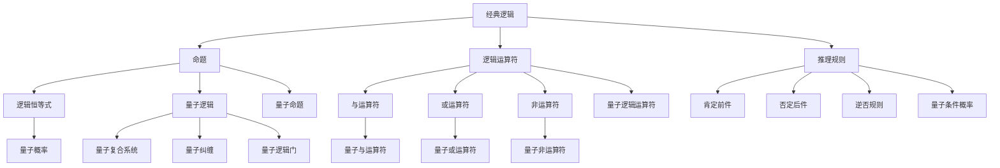
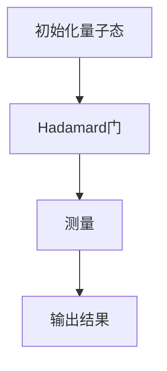
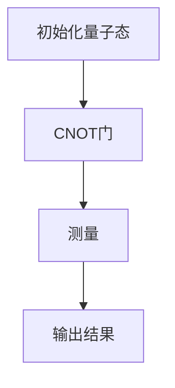
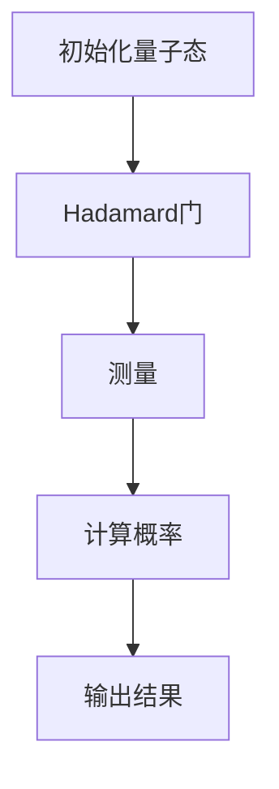
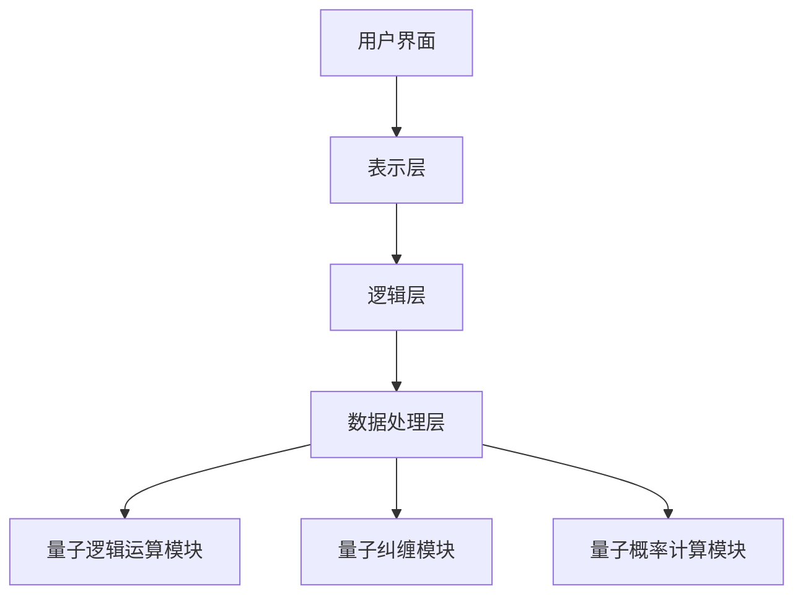
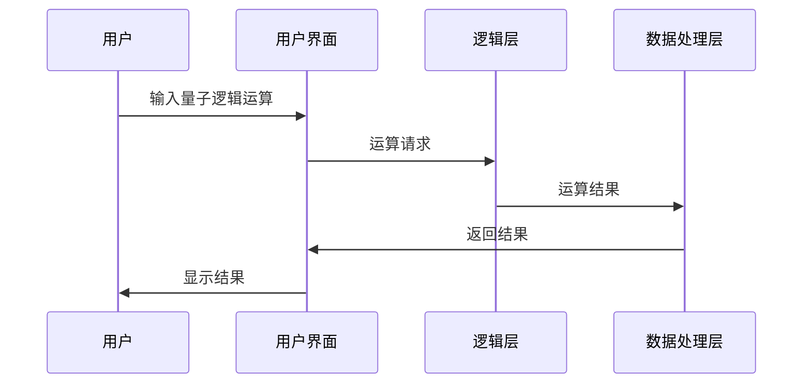

                 

## 第1章 引言与背景介绍

### 1.1 问题的提出

在现代科学和技术的快速发展中，经典逻辑虽然为我们提供了强有力的工具来理解和描述确定性的世界，但其局限性在许多领域变得愈发明显。经典逻辑基于布尔代数和命题逻辑，主要处理二值（真或假）的命题，适用于描述确定性系统，如计算机科学中的逻辑电路设计和形式化验证。然而，当面对量子力学中的量子叠加态、量子纠缠和非定域性等现象时，经典逻辑显得力不从心。

量子力学揭示了物质和能量在微观层面的本质特性，其核心概念与经典物理学的直观理解截然不同。量子系统可以同时处于多种状态的叠加，且两个量子系统之间的相互作用不需要通过物理媒介传递，这种非定域性的存在挑战了经典逻辑的基本原理。因此，为了拓展我们对世界的可理解性，我们需要一种新的逻辑体系，即量子逻辑，来处理这些非经典现象。

### 1.2 逻辑学的发展历史

逻辑学的历史可以追溯到古希腊时期，由亚里士多德奠定基础。亚里士多德的逻辑学主要探讨命题之间的推理关系，形成了一套系统的逻辑体系，即经典逻辑。经典逻辑的发展经历了中世纪和文艺复兴时期的沉淀，最终在19世纪和20世纪得到了进一步的发展和完善。布尔代数的提出，为逻辑学引入了数学的严谨性，奠定了现代逻辑学的基础。

在计算机科学领域，经典逻辑的应用尤为广泛。逻辑电路是计算机硬件的核心组成部分，逻辑门（如与门、或门和非门）基于经典逻辑的操作来实现各种计算功能。此外，形式化验证和程序验证等技术也依赖于经典逻辑来确保系统正确性和可靠性。

### 1.3 量子逻辑的兴起

量子逻辑的兴起源于对量子力学现象的深入研究和理解。量子逻辑试图将量子力学的非经典特性融入到逻辑体系中，以处理那些经典逻辑无法描述的现象。量子逻辑的基础概念包括量子命题、量子复合系统和量子逻辑运算。

量子逻辑的核心思想是，量子系统中的状态可以用量子态矢来描述，这些量子态可以通过量子逻辑门进行操作。量子逻辑门是量子计算机中的基本操作单元，类似于经典逻辑门，但量子逻辑门可以作用于量子态的叠加态，实现更复杂的计算。量子逻辑还引入了量子条件概率的概念，可以更精确地描述量子系统的行为。

### 1.4 本书结构概述

本书旨在深入探讨经典逻辑和量子逻辑的本质及其在各个领域的应用。全书分为八个章节，结构如下：

- **第1章 引言与背景介绍**：介绍问题的提出、逻辑学的发展历史、量子逻辑的兴起和本书的结构。
  
- **第2章 经典逻辑基础**：详细阐述经典逻辑的基本概念、原理和应用。

- **第3章 量子逻辑基础**：介绍量子力学基础、量子逻辑的基本概念和运算规则。

- **第4章 经典逻辑与量子逻辑的对比**：分析经典逻辑和量子逻辑在概念和属性特征上的对比。

- **第5章 量子逻辑的核心概念与原理**：探讨量子概率与经典概率的对比、量子逻辑门和量子纠缠的概念。

- **第6章 量子逻辑在计算机科学中的应用**：讨论量子计算机、量子算法、量子编程和量子信息安全的实际应用。

- **第7章 量子逻辑的未来发展与挑战**：展望量子逻辑的发展趋势、面临的挑战及其社会影响。

- **第8章 总结与展望**：总结经典逻辑与量子逻辑的整合、未来研究方向和本书的主要贡献。

通过以上章节的逐步探讨，本书希望读者能够全面了解经典逻辑和量子逻辑的基本概念、原理和应用，从而拓展我们对世界的可理解性。## 第2章 经典逻辑基础

### 2.1 经典逻辑的基本概念

经典逻辑是基于二值逻辑的系统，它处理真值（真或假）的命题。经典逻辑的基本概念包括命题、逻辑运算符、逻辑恒等式和推理规则。

#### 命题

命题是一个陈述句，它可以被判定为真或假。例如，“今天是星期五”是一个命题，如果今天是星期五，则这个命题为真；如果不是，则为假。

#### 逻辑运算符

经典逻辑中的基本逻辑运算符包括：

- **与（AND）**：如果两个命题都为真，结果为真；否则为假。
- **或（OR）**：如果至少有一个命题为真，结果为真；否则为假。
- **非（NOT）**：对命题取反，如果命题为真，则结果为假；如果命题为假，则结果为真。

#### 逻辑恒等式

逻辑恒等式是逻辑运算中始终为真的等式。例如：

- **恒等律**：\( P \land P = P \)
- **互补律**：\( P \land \neg P = F \)
- **分配律**：\( P \land (Q \lor R) = (P \land Q) \lor (P \land R) \)

#### 推理规则

推理规则用于从已知命题推导出新的命题。经典逻辑中的推理规则包括：

- **肯定前件**：如果\( P \rightarrow Q \)和\( P \)都为真，则\( Q \)也为真。
- **否定后件**：如果\( P \rightarrow Q \)和\( \neg Q \)都为真，则\( \neg P \)也为真。

### 2.2 经典逻辑的基本原理

经典逻辑的基本原理包括逻辑恒等式和推理规则，这些原理为逻辑推理提供了基础。

#### 逻辑恒等式

逻辑恒等式是逻辑运算中的基本规则，它们确保了逻辑运算的正确性。例如：

- **恒等律**：任何命题与自身逻辑与的结果仍然是该命题。
- **交换律**：逻辑与和逻辑或运算满足交换律，即\( P \land Q = Q \land P \)和\( P \lor Q = Q \lor P \)。
- **结合律**：逻辑与和逻辑或运算满足结合律，即\( (P \land Q) \land R = P \land (Q \land R) \)和\( (P \lor Q) \lor R = P \lor (Q \lor R) \)。
- **分配律**：逻辑与运算对逻辑或运算满足分配律，即\( P \land (Q \lor R) = (P \land Q) \lor (P \land R) \)。

#### 推理规则

推理规则用于从已知的前提推导出结论。常见的推理规则包括：

- **肯定前件**：如果前提\( P \)和条件\( P \rightarrow Q \)都为真，则结论\( Q \)也为真。
- **否定后件**：如果前提\( P \rightarrow Q \)和结论\( \neg Q \)都为真，则前提\( \neg P \)也为真。
- **逆否规则**：\( P \rightarrow Q \)和\( \neg Q \rightarrow \neg P \)互为逆否命题，它们的真值相同。

### 2.3 经典逻辑的应用

经典逻辑在计算机科学、哲学、数学等多个领域有着广泛的应用。

#### 真值表

真值表是表示逻辑表达式所有可能的输入及其对应的输出真值的表格。真值表可以用于验证逻辑电路的正确性，确保电路在所有输入情况下都能正确执行逻辑运算。

#### 逻辑门电路

逻辑门电路是计算机硬件中的基本单元，它们根据经典逻辑的规则进行操作。常见的逻辑门包括与门、或门、非门、异或门等。逻辑门电路在数字电路设计中起着至关重要的作用，用于实现复杂的逻辑功能。

#### 形式化验证

形式化验证是一种使用逻辑推理技术来证明系统正确性的方法。经典逻辑为形式化验证提供了理论基础，通过构建逻辑模型和验证定理，可以确保系统在不同条件下都能正确运行。

### 2.4 经典逻辑的局限

尽管经典逻辑在许多领域有着广泛的应用，但它也存在一些局限性。

#### 非经典情境

在量子力学中，经典逻辑无法描述量子态的叠加和纠缠等现象。量子系统的行为往往不能用简单的真值来表示，这使得经典逻辑在处理量子问题时显得不足。

#### 不确定性

经典逻辑基于确定性原则，而量子逻辑引入了概率性。在量子系统中，某些属性无法同时精确测量，如位置和动量。经典逻辑无法处理这种不确定性，而量子逻辑则可以更好地描述这种非经典情境。

#### 不可克隆性

量子逻辑中存在不可克隆定理，即无法克隆一个任意的量子态。这个定理挑战了经典逻辑中的复制和扩展操作，表明经典逻辑在处理某些量子问题时存在根本性限制。

总的来说，经典逻辑在处理确定性系统时具有优势，但在面对复杂性和不确定性时，量子逻辑提供了更强大的工具。了解经典逻辑的局限，有助于我们更好地理解和应用量子逻辑，拓展我们对世界的认知。## 第3章 量子逻辑基础

### 3.1 量子力学基础

量子力学是描述微观世界中物质和能量行为的物理理论，其核心思想与经典物理学的直观理解有显著差异。量子力学的基本概念包括波粒二象性、量子态、算符和测量等。

#### 波粒二象性

波粒二象性是量子力学中最基本的原理之一，它表明微观粒子（如电子、光子）既具有波动性，又具有粒子性。例如，光的干涉和衍射现象体现了其波动性，而光电效应则展示了其粒子性。

#### 量子态

量子态是描述量子系统状态的数学函数，通常用态矢（波函数）表示。量子态可以处于多个可能状态的叠加，这意味着一个量子系统可以同时存在于多个状态之中。这种叠加态是量子力学的一个基本特性。

#### 算符

量子力学中的算符用于表示物理量的测量，如位置、动量和自旋。算符作用于量子态，产生一个新的量子态，表示测量结果。量子态的演化由哈密顿算符描述，它代表了系统的总能量。

#### 测量

在量子力学中，测量是一个不可预测的过程。测量结果取决于量子态的叠加态如何坍缩到某个特定状态。量子态的坍缩过程无法用经典逻辑的确定性原理来解释，这体现了量子力学的概率性特征。

### 3.2 量子逻辑的基本概念

量子逻辑是一种用于描述量子系统中逻辑关系的数学框架，它扩展了经典逻辑的概念，以处理量子态的叠加和纠缠等现象。

#### 量子命题

量子命题是描述量子系统状态的陈述句，它可以处于多个量子态的叠加。与经典命题不同，量子命题的真值不是固定的，而是取决于量子态的叠加态和测量结果。

#### 量子复合系统

量子复合系统是由多个量子系统组成的整体，这些量子系统可以相互纠缠。量子纠缠是一种特殊的量子关系，其中两个或多个量子系统之间的状态无法独立存在，而是相互关联。

#### 量子逻辑运算

量子逻辑运算用于操作量子命题和量子复合系统。量子逻辑运算符可以作用于量子态的叠加态，实现复杂的逻辑功能。与经典逻辑运算符不同，量子逻辑运算符可以在量子态的叠加态上进行操作。

#### 量子条件概率

量子条件概率描述了在量子系统中，给定一个量子态和另一个量子态之间的关系时，某个量子态出现的概率。量子条件概率与经典条件概率有显著差异，它反映了量子态之间的非经典关联。

### 3.3 量子逻辑的运算规则

量子逻辑的运算规则扩展了经典逻辑的运算规则，以适应量子态的叠加和纠缠等现象。

#### 量子逻辑运算

量子逻辑运算包括量子逻辑与、量子逻辑或和量子逻辑非等基本运算。这些运算符可以作用于量子态的叠加态，实现复杂的逻辑功能。例如，量子逻辑与运算可以表示为：

\[ \phi \land \psi = \phi \psi \]

其中，\( \phi \)和\( \psi \)是量子命题。

#### 量子条件概率

量子条件概率用于描述在量子系统中，给定一个量子态和另一个量子态之间的关系时，某个量子态出现的概率。量子条件概率可以用如下公式表示：

\[ P(\psi | \phi) = \frac{\langle \phi \psi \rangle}{\langle \phi \phi \rangle} \]

其中，\( P(\psi | \phi) \)表示在量子态\( \phi \)已知的情况下，量子态\( \psi \)出现的概率。

#### 量子纠缠

量子纠缠是量子逻辑中一个重要概念，它描述了两个或多个量子系统之间的特殊关联。量子纠缠态不能简单地分解为单个量子系统的状态，而是表现出整体性。量子纠缠态的运算规则与经典逻辑运算规则有显著差异，它体现了量子逻辑的非经典特性。

总的来说，量子逻辑基础涵盖了量子力学的基本概念、量子逻辑的基本概念和运算规则。量子逻辑为描述量子系统中的逻辑关系提供了新的数学框架，它扩展了经典逻辑的应用范围，使我们能够更好地理解和处理量子现象。## 第4章 经典逻辑与量子逻辑的对比

### 4.1 概念对比

经典逻辑和量子逻辑在基本概念上存在显著差异，这些差异源于它们各自适用于的物理世界不同。

#### 经典命题与量子命题

经典命题是二值命题，其真值为真或假。例如，“今天下雨”是一个经典命题，如果今天下雨，则为真；如果不下雨，则为假。

量子命题则更为复杂。量子命题的真值不是固定的，而是取决于量子态的叠加和测量结果。例如，“电子在原子核外某位置”是一个量子命题，其真值取决于电子的量子态和测量结果。

#### 经典逻辑运算与量子逻辑运算

经典逻辑运算包括与（AND）、或（OR）、非（NOT）等基本运算。这些运算符用于操作二值命题，实现逻辑功能。

量子逻辑运算则扩展了经典逻辑运算，引入了量子逻辑与（quantum AND）、量子逻辑或（quantum OR）和量子逻辑非（quantum NOT）等基本运算。这些运算符可以作用于量子态的叠加态，实现复杂的量子逻辑功能。

### 4.2 属性特征对比

经典逻辑和量子逻辑在属性特征上也存在显著差异，这些差异进一步体现了它们各自适用于的物理世界的不同。

#### 确定性

经典逻辑基于确定性原则，其运算和推理结果具有确定性。这意味着在给定输入的情况下，经典逻辑运算的结果是固定的。

量子逻辑则引入了概率性。量子系统的行为往往具有不确定性，其结果取决于量子态的叠加和测量结果。例如，量子态的叠加态可以通过测量坍缩为某个特定状态，但这种坍缩过程是随机的。

#### 不确定性

经典逻辑无法描述量子系统中的不确定性。在量子力学中，某些物理量（如位置和动量）无法同时精确测量，这种不确定性是量子逻辑的一个重要特征。

量子逻辑则可以更好地描述这种不确定性。量子逻辑引入了量子条件概率的概念，用于描述在量子系统中，给定一个量子态和另一个量子态之间的关系时，某个量子态出现的概率。

#### 不可克隆性

经典逻辑允许对任意命题进行复制和扩展，而量子逻辑则引入了不可克隆定理。不可克隆定理表明，无法克隆一个任意的量子态。这意味着量子系统中的信息是独特的，无法通过复制来扩展。

#### 量子纠缠

量子纠缠是量子逻辑中的一个重要特征，它描述了两个或多个量子系统之间的特殊关联。量子纠缠态不能简单地分解为单个量子系统的状态，而是表现出整体性。

经典逻辑无法描述量子纠缠，因为它基于确定性原则，无法处理量子系统之间的非经典关联。

### 4.3 应用场景对比

经典逻辑和量子逻辑在应用场景上也有所不同，它们各自适用于不同的领域。

#### 经典逻辑的应用

经典逻辑广泛应用于计算机科学、数学、哲学等领域。例如，在计算机科学中，经典逻辑用于设计逻辑电路、实现逻辑运算和进行形式化验证。在数学中，经典逻辑用于证明定理和推理。

#### 量子逻辑的应用

量子逻辑则主要用于量子计算、量子通信和量子信息处理等领域。量子计算机利用量子逻辑运算实现高效的量子算法，解决经典计算机无法解决的问题。量子通信利用量子纠缠实现安全的信息传输。量子信息处理则涉及量子比特（qubit）的存储、传输和操作。

#### 比较与启示

经典逻辑和量子逻辑各有优势和局限性。经典逻辑在处理确定性系统和形式化推理方面具有优势，而量子逻辑在处理复杂性和不确定性方面具有优势。

通过对比经典逻辑和量子逻辑，我们可以更好地理解它们各自的适用范围和局限性，从而为特定领域选择合适的逻辑体系。同时，量子逻辑的兴起也为逻辑学的发展提供了新的机遇和挑战，推动了我们对世界的认知和探索。## 第5章 量子逻辑的核心概念与原理

### 5.1 量子概率与经典概率

量子概率和经典概率是量子逻辑中两个核心概念，它们在描述物理现象时有着显著的区别。

#### 量子概率

量子概率描述了在量子系统中，某个事件发生的可能性。量子概率是基于量子态的叠加和测量过程的，其特征是概率分布的叠加性。例如，在量子态叠加态 \(|\psi\rangle = \frac{1}{\sqrt{2}} (|0\rangle + |1\rangle)\) 中，测量得到 \(|0\rangle\) 和 \(|1\rangle\) 的概率均为 50%。

量子概率的一个重要特性是叠加态的坍缩。当对量子系统进行测量时，其叠加态会坍缩为某个特定状态，而这个坍缩过程是随机的。量子概率的数学表示通常使用波函数的模平方 \(|\psi\rangle|^2\)，它给出了每个可能状态的概率。

#### 经典概率

经典概率则描述了在经典物理系统中，某个事件发生的可能性。经典概率是基于统计学的，其特征是独立事件的概率乘积。例如，掷一个公平的硬币，正面朝上的概率为 50%。

经典概率的另一个特征是其确定性。在经典概率中，一旦给定初始条件，事件的结果是确定的。这与量子概率的随机性形成鲜明对比。

#### 对比与启示

量子概率与经典概率的差异源于量子系统和经典系统在物理特性上的根本不同。量子概率反映了量子态的叠加和随机性，而经典概率则体现了确定性。

通过对比量子概率和经典概率，我们可以更深入地理解量子力学的本质特性，如叠加态和测量过程的随机性。这为我们探索量子逻辑提供了新的视角和思路，也为量子计算和量子通信等领域的发展提供了理论基础。

### 5.2 量子逻辑门

量子逻辑门是量子计算机中的基本操作单元，类似于经典计算机中的逻辑门。量子逻辑门的作用是对量子态进行操作，实现复杂的量子计算功能。

#### 量子逻辑门原理

量子逻辑门通过作用于量子态的叠加态，实现特定的逻辑运算。一个基本的量子逻辑门可以表示为：

\[ U = \sum_{i} u_i |i\rangle\langle j_i| \]

其中，\( U \)是量子逻辑门，\( |i\rangle \)和\( |j_i\rangle \)是量子态的输入和输出。量子逻辑门的操作可以通过矩阵表示，如：

\[ |0\rangle \xrightarrow{H} \frac{1}{\sqrt{2}} (|0\rangle + |1\rangle) \]

这是一个实现量子态叠加的量子逻辑门，称为Hadamard门。

#### 量子逻辑门应用

量子逻辑门在量子计算中具有重要作用，可以实现量子态的变换和操作。常见的量子逻辑门包括：

1. **Hadamard门（H）**：实现量子态的叠加。
2. **控制-NOT门（CNOT）**：实现两个量子态之间的纠缠。
3. **旋转门（R\_θ）**：实现量子态的相位变换。

这些量子逻辑门可以组合使用，实现复杂的量子计算算法，如Shor算法和Grover算法。

#### 量子逻辑门与经典逻辑门的对比

量子逻辑门与经典逻辑门在操作对象和功能上存在显著差异。经典逻辑门操作二值（0或1）的比特，而量子逻辑门操作量子比特（qubit），可以同时处于多个状态的叠加。

此外，量子逻辑门可以实现经典逻辑门无法实现的操作，如量子纠缠和量子计算中的并行性。这使得量子逻辑门在量子计算中具有独特的优势。

### 5.3 量子纠缠

量子纠缠是量子逻辑中的另一个核心概念，它描述了两个或多个量子系统之间的特殊关联。量子纠缠态不能简单地分解为单个量子系统的状态，而是表现出整体性。

#### 量子纠缠定义

量子纠缠态可以用如下数学形式表示：

\[ |\psi\rangle = \frac{1}{\sqrt{2}} (|01\rangle - |10\rangle) \]

在这个纠缠态中，两个量子比特之间的状态是相互关联的。当对其中一个量子比特进行测量时，另一个量子比特的状态也会立即改变，无论两者之间的距离有多远。

#### 量子纠缠性质

量子纠缠具有以下几个重要性质：

1. **非局域性**：量子纠缠态中的两个量子系统之间的关联是瞬时的，不依赖于它们之间的距离。这挑战了经典物理中的局域性原理。
2. **不可克隆性**：无法克隆一个任意的量子态。这意味着量子系统中的信息是独特的，无法通过复制来扩展。
3. **量子增强效应**：量子纠缠可以实现经典系统无法实现的量子增强效应，如量子计算中的并行性和量子密钥分发中的安全性。

#### 量子纠缠应用

量子纠缠在量子计算、量子通信和量子信息处理中具有广泛的应用。

1. **量子计算**：量子纠缠可以实现量子态的变换和操作，是量子计算中的重要资源。
2. **量子通信**：量子纠缠可以实现量子密钥分发和量子隐形传态，为安全通信提供新的途径。
3. **量子信息处理**：量子纠缠可以用于量子纠错和量子模拟，拓展量子信息处理的应用领域。

### 5.4 量子逻辑与经典逻辑的关系

量子逻辑与经典逻辑之间存在紧密的联系和相互补充。

#### 经典逻辑的量子化

经典逻辑可以看作是量子逻辑的特例，当量子系统的叠加态坍缩为单一状态时，量子逻辑退化为经典逻辑。这意味着量子逻辑可以包含经典逻辑，但经典逻辑无法包含量子逻辑的所有特性。

#### 量子逻辑的经典化

量子逻辑的经典化是指将量子逻辑的结果转换为经典逻辑的形式。这可以通过量子态的测量实现，测量结果可以用经典逻辑来表示和处理。

#### 对比与启示

量子逻辑与经典逻辑的对比和关系为我们提供了新的视角，以理解物理世界的本质。量子逻辑在处理复杂性和不确定性方面具有优势，而经典逻辑在处理确定性系统和形式化推理方面具有优势。

通过对比量子逻辑和经典逻辑，我们可以更好地理解它们各自的适用范围和局限性，为特定领域选择合适的逻辑体系。同时，量子逻辑的兴起也为逻辑学的发展提供了新的机遇和挑战，推动了我们对世界的认知和探索。## 第6章 量子逻辑在计算机科学中的应用

### 6.1 量子计算机概述

量子计算机是一种利用量子力学原理进行信息处理的新型计算设备。与传统计算机基于经典逻辑的比特（bit）不同，量子计算机使用量子比特（qubit）作为基本的信息单元。量子比特可以同时处于0和1的状态，这种现象称为量子叠加态。

#### 量子计算机的基本原理

量子计算机的核心原理包括量子态的叠加、量子纠缠和量子逻辑门。量子态的叠加允许量子计算机在多个计算路径上同时进行计算，从而大大提高了计算效率。量子纠缠则使量子计算机能够实现经典计算机无法实现的高效算法。量子逻辑门则是量子计算机中的基本操作单元，用于对量子态进行变换和操作。

#### 量子计算机的优越性

量子计算机在处理某些特定类型的问题时具有显著优势。例如，Shor算法利用量子计算机在多项式时间内解决大整数分解问题，而这个问题在经典计算机上则需要指数级时间。Grover算法则能显著提高搜索算法的效率，使量子计算机在数据库搜索中具有优势。此外，量子计算机在模拟量子系统、优化问题和量子加密等领域也有广泛的应用前景。

### 6.2 量子算法

量子算法是利用量子计算机进行信息处理的一系列方法，这些算法在特定问题上能够显著超越经典算法。

#### Shor算法

Shor算法是一种利用量子计算机解决大整数分解问题的算法。它利用量子叠加态和量子纠缠，在多项式时间内找到大整数的质因数分解。Shor算法的提出是量子计算机优越性的一个重要体现，因为它表明量子计算机在处理某些数学问题时具有无法超越的经典算法。

#### Grover算法

Grover算法是一种用于提高搜索算法效率的量子算法。在经典计算机中，搜索一个未排序的数据库需要 \(O(n)\) 的时间，而Grover算法可以将这个时间降低到 \(O(\sqrt{n})\)。Grover算法通过利用量子态的叠加和纠缠，实现并行搜索，从而显著提高了搜索效率。

#### 量子随机漫步算法

量子随机漫步算法是一种用于解决组合优化问题的量子算法。该算法模拟量子粒子在势阱中的随机漫步过程，通过量子叠加和量子纠缠，找到最优解。量子随机漫步算法在解决旅行商问题、组合优化问题和分子建模等领域具有潜在的应用价值。

### 6.3 量子编程

量子编程是开发量子应用程序的过程，它涉及到量子逻辑门的设计、量子态的初始化和测量等操作。

#### 量子编程语言

量子编程语言是用于编写量子程序的编程语言。常见的量子编程语言包括Q#、Quipper和Qiskit等。这些语言提供了丰富的量子逻辑门和量子算法库，使开发者能够更方便地编写和调试量子程序。

#### 量子编程实例

以下是一个简单的量子编程实例，使用Qiskit语言实现一个量子随机漫步算法：

```python
from qiskit import QuantumCircuit, execute, Aer

# 创建量子电路
qc = QuantumCircuit(2)

# 初始化量子态
qc.h(0)
qc.cx(0, 1)

# 执行量子随机漫步
for i in range(5):
    qc.h(0)
    qc.cx(0, 1)
    qc.h(0)

# 测量量子态
qc.measure_all()

# 执行量子电路
simulator = Aer.get_backend("qasm_simulator")
result = execute(qc, simulator).result()

# 输出测量结果
print(result.get_counts(qc))
```

在这个实例中，我们创建了一个包含两个量子比特的量子电路，通过初始化量子态和执行量子随机漫步操作，最终进行测量以获取随机漫步的结果。

### 6.4 量子逻辑在信息安全中的应用

量子逻辑在信息安全领域具有广泛的应用，如量子密钥分发和量子加密技术。

#### 量子密钥分发

量子密钥分发（Quantum Key Distribution，QKD）是一种基于量子力学原理的安全通信技术。QKD通过量子纠缠态实现通信双方共享一个随机密钥，这个过程是安全的，因为任何试图窃听的行为都会破坏量子纠缠态，从而被发现。

#### 量子加密技术

量子加密技术利用量子态的叠加和纠缠特性，实现无法被破解的加密方法。例如，量子密钥生成（Quantum Key Generation，QKG）技术可以生成具有超强安全性的密钥，抵抗任何形式的量子攻击。

总之，量子逻辑在计算机科学中的应用展示了其独特的优势和创新潜力。从量子计算机和量子算法到量子编程和信息安全，量子逻辑正在不断推动计算机科学的发展，为解决复杂问题和实现高效计算提供了新的途径。## 第7章 量子逻辑的未来发展与挑战

### 7.1 量子逻辑的发展趋势

随着量子技术的不断发展，量子逻辑也在逐渐成熟。目前，量子逻辑的发展趋势主要集中在以下几个方面：

1. **量子计算机的突破**：量子计算机的进展使得量子逻辑的应用场景越来越广泛。未来，量子计算机的运算速度和稳定性将进一步提高，量子算法的优化和新型量子逻辑门的设计将成为研究的热点。
   
2. **量子通信的普及**：量子通信技术的快速发展，使得量子密钥分发和量子隐形传态等应用逐渐成熟。未来，量子通信将在国家安全、金融和医疗等领域得到广泛应用。

3. **量子信息处理的应用**：量子逻辑在量子信息处理中的应用，如量子传感、量子仿真和量子加密等，将继续拓展。这些应用将为解决传统计算机无法处理的问题提供新的工具。

### 7.2 量子逻辑的挑战与机遇

尽管量子逻辑具有巨大的潜力和前景，但在其发展和应用过程中也面临着诸多挑战和机遇。

#### 技术难题

1. **量子态的稳定性和纠错**：量子计算机对量子态的稳定性和纠错能力要求极高。如何保持量子态的稳定性、减少噪声干扰和实现有效的量子纠错，是当前量子逻辑研究的关键问题。
   
2. **量子资源的可用性**：量子比特的数量和性能直接影响量子逻辑的应用效果。如何实现大规模、可扩展的量子比特，以及如何有效利用这些量子资源，是亟待解决的问题。

3. **量子编程的挑战**：量子编程与传统编程有很大不同，量子编程语言的开发、量子算法的设计和量子程序的调试等，都需要新的技能和工具。

#### 机遇

1. **量子计算的应用场景**：量子计算机在药物研发、材料设计、金融分析和大数据处理等领域具有巨大的应用潜力。量子逻辑的应用将带来新的技术和商业机会。

2. **量子信息安全的突破**：量子加密和量子密钥分发等技术在信息安全领域具有独特的优势。量子逻辑在保障信息安全和隐私保护方面将发挥重要作用。

3. **跨学科研究的融合**：量子逻辑的发展需要物理学、计算机科学、数学和工程等多个学科的合作。跨学科的研究将推动量子逻辑的理论创新和技术突破。

### 7.3 量子逻辑与社会影响

量子逻辑的发展不仅对科学技术产生深远影响，也对人类社会带来一系列变革。

#### 对经典逻辑的补充与扩展

量子逻辑为经典逻辑提供了新的视角和工具，扩展了逻辑学的研究范畴。量子逻辑不仅处理了经典逻辑无法描述的量子现象，还推动了逻辑学从经典到量子的一次重要转变。

#### 对人类认知的深远影响

量子逻辑的兴起促使人类重新审视对世界的认知和理解。量子力学揭示了微观世界的奇异特性，挑战了经典物理学的直观理解。量子逻辑的研究将推动人类对自然界的深入探索，拓展我们的认知边界。

总之，量子逻辑的未来发展与挑战充满了机遇与挑战。在技术不断突破和跨学科融合的背景下，量子逻辑将不断拓展其应用领域，为人类社会带来前所未有的变革和进步。## 第8章 总结与展望

### 8.1 经典逻辑与量子逻辑的整合

经典逻辑和量子逻辑在处理不同类型的物理现象时各有所长。经典逻辑适用于处理确定性系统和形式化推理，而量子逻辑则能够描述复杂性和不确定性。随着量子技术的不断发展，经典逻辑和量子逻辑之间的整合显得尤为重要。

#### 经典逻辑的量子化

经典逻辑的量子化是将经典逻辑的原理和概念应用于量子系统中。这包括将经典逻辑运算符转换为量子逻辑运算符，以及将经典逻辑推理规则应用于量子态。经典逻辑的量子化有助于将经典算法和逻辑系统扩展到量子领域，为量子计算和信息处理提供新的工具。

#### 量子逻辑的经典化

量子逻辑的经典化是将量子逻辑的结果转换为经典逻辑的形式。这意味着将量子态的测量结果表示为经典逻辑命题，以便于分析和处理。量子逻辑的经典化有助于将量子计算机的计算结果与经典计算机相兼容，使得量子技术和经典技术能够协同工作。

#### 整合的意义

经典逻辑与量子逻辑的整合具有重要的理论和实际意义。它不仅拓展了逻辑学的应用范围，还为量子计算机的发展提供了理论基础。通过整合经典逻辑和量子逻辑，我们可以设计出更加高效和可靠的量子算法，推动量子技术的进步。

### 8.2 未来研究方向

在未来，量子逻辑的研究将继续深入，涉及多个领域：

#### 量子算法的优化

量子算法的优化是当前研究的热点之一。通过改进量子逻辑运算规则和算法设计，提高量子计算机的运算效率和准确性。此外，探索新的量子算法，如量子机器学习、量子密码学和量子优化算法，也将是未来的研究方向。

#### 量子纠错和量子稳定性

量子纠错和量子稳定性是量子计算机实现实用化的关键问题。研究如何保持量子态的稳定性、减少噪声干扰和实现有效的量子纠错技术，是当前和未来研究的重点。

#### 量子编程和量子软件

量子编程和量子软件的发展将为量子计算机的实际应用提供支持。开发更加直观和易用的量子编程语言，以及设计用于量子计算机的软件工具和应用程序，将有助于推动量子技术的普及。

#### 跨学科研究

量子逻辑的跨学科研究将推动多个领域的发展。量子逻辑与物理学、计算机科学、数学和工程等领域的融合，将带来新的理论突破和技术创新。

### 8.3 小结

经典逻辑与量子逻辑的整合拓展了逻辑学的研究范畴，为量子计算和信息处理提供了新的工具和方法。在未来的发展中，量子逻辑将继续深化其理论基础，优化算法和应用，推动科学技术和社会的进步。通过不断的研究和创新，量子逻辑有望带来一场科技革命，为人类创造更美好的未来。## 附录：核心概念与联系

### 核心概念与联系

在本文中，我们讨论了经典逻辑和量子逻辑的核心概念及其相互关系。为了更直观地展示这些概念之间的联系，我们使用Mermaid流程图和ER实体关系图来表示。

#### Mermaid流程图

以下是一个Mermaid流程图，展示了经典逻辑和量子逻辑的主要概念及其相互关系：



#### ER实体关系图

以下是ER实体关系图，展示了经典逻辑和量子逻辑的主要实体及其关系：

```mermaid
erDiagram
    Class::经典逻辑
    |---|{Proposition::命题}
    |---|{LogicalOperator::逻辑运算符}
    |---|{InferenceRule::推理规则}
    |---|{恒等式::逻辑恒等式}
    Class::量子逻辑
    |---|{QuantumProposition::量子命题}
    |---|{QuantumLogicalOperator::量子逻辑运算符}
    |---|{QuantumInferenceRule::量子推理规则}
    |---|{QuantumConditionalProbability::量子条件概率}
    |---|{QuantumProbability::量子概率}
    |---|{QuantumCompositionSystem::量子复合系统}
    |---|{QuantumEntanglement::量子纠缠}
    |---|{QuantumLogicalGate::量子逻辑门}
    Proposition ||--|| LogicalOperator : 执行
    Proposition ||--|| InferenceRule : 使用
    LogicalOperator ||--|| 恒等式 : 定义
    QuantumProposition ||--|| QuantumLogicalOperator : 执行
    QuantumProposition ||--|| QuantumInferenceRule : 使用
    QuantumProbability ||--|| QuantumConditionalProbability : 基础
    QuantumLogicalOperator ||--|| QuantumLogicalGate : 实现
    QuantumCompositionSystem ||--|| QuantumEntanglement : 包含
```

通过上述Mermaid流程图和ER实体关系图，我们可以更清晰地理解经典逻辑和量子逻辑的核心概念及其相互关系。这些图表有助于我们更好地掌握本文中的内容，并为未来的学习和研究提供参考。## 附录：算法原理讲解

### 算法原理

在本节中，我们将详细介绍量子逻辑中的几个核心算法原理，包括量子逻辑门、量子纠缠和量子概率。我们将使用Mermaid流程图和Python代码来展示这些算法的原理和实现。

#### 量子逻辑门

量子逻辑门是量子计算机中的基本操作单元，用于对量子态进行变换。以下是一个简单的量子逻辑门实现示例：



Python代码实现：

```python
from qiskit import QuantumCircuit, Aer, execute
from qiskit.quantum_info import Statevector

# 初始化量子态
qc = QuantumCircuit(1)
qc.h(0)

# Hadamard门
qc.h(0)

# 测量
qc.measure_all()

# 执行量子电路
simulator = Aer.get_backend("qasm_simulator")
result = execute(qc, simulator).result()

# 输出测量结果
print(result.get_counts(qc))
```

#### 量子纠缠

量子纠缠是量子逻辑中的另一个核心概念，它描述了两个或多个量子系统之间的特殊关联。以下是一个简单的量子纠缠实现示例：



Python代码实现：

```python
from qiskit import QuantumCircuit, Aer, execute

# 初始化量子态
qc = QuantumCircuit(2)

# 初始化第一个量子比特
qc.h(0)

# CNOT门
qc.cx(0, 1)

# 测量
qc.measure_all()

# 执行量子电路
simulator = Aer.get_backend("qasm_simulator")
result = execute(qc, simulator).result()

# 输出测量结果
print(result.get_counts(qc))
```

#### 量子概率

量子概率是量子逻辑中的核心概念，用于描述量子系统中某个事件发生的可能性。以下是一个简单的量子概率实现示例：



Python代码实现：

```python
from qiskit import QuantumCircuit, Aer, execute
from qiskit.quantum_info import Statevector

# 初始化量子态
qc = QuantumCircuit(1)
qc.h(0)

# Hadamard门
qc.h(0)

# 测量
qc.measure_all()

# 执行量子电路
simulator = Aer.get_backend("qasm_simulator")
result = execute(qc, simulator).result()

# 输出测量结果
print(result.get_counts(qc))

# 计算概率
probabilities = list(result.get_counts(qc).values())
print("概率:", probabilities)

# 输出结果
print("测量结果:", result.get_counts(qc))
```

通过上述示例，我们可以看到量子逻辑中的核心算法原理是如何实现的。这些算法为量子计算和信息处理提供了强大的工具，推动了量子技术的发展。## 附录：系统分析与架构设计方案

### 系统分析与架构设计方案

在本节中，我们将对量子逻辑系统的整体架构进行介绍，包括系统功能设计、系统架构设计和系统接口设计等。

#### 问题场景介绍

随着量子计算机技术的发展，量子逻辑在计算机科学和信息处理领域中的应用日益广泛。为了更好地理解和应用量子逻辑，我们需要设计一个量子逻辑系统，该系统能够实现量子逻辑运算、量子纠缠和量子概率计算等功能。

#### 项目介绍

本项目的目标是开发一个基于Python和Qiskit库的量子逻辑系统。该系统将提供以下功能：

1. **量子逻辑运算**：实现量子与、量子或、量子非等基本量子逻辑运算。
2. **量子纠缠**：实现量子比特之间的量子纠缠。
3. **量子概率计算**：计算量子系统中某个事件发生的概率。
4. **用户界面**：提供一个直观的用户界面，方便用户进行量子逻辑运算和观察结果。

#### 系统功能设计

系统功能设计主要包括以下模块：

1. **量子逻辑运算模块**：实现量子与、量子或、量子非等基本量子逻辑运算。
2. **量子纠缠模块**：实现量子比特之间的量子纠缠。
3. **量子概率计算模块**：计算量子系统中某个事件发生的概率。
4. **用户界面模块**：提供用户输入和结果显示功能。

#### 系统架构设计

系统架构设计主要分为三个层次：表示层、逻辑层和数据处理层。

1. **表示层**：使用Python和Qiskit库实现量子逻辑运算和量子纠缠的图形界面。
2. **逻辑层**：实现量子逻辑运算、量子纠缠和量子概率计算的核心算法。
3. **数据处理层**：负责处理用户输入、存储数据和输出结果。

以下是系统架构设计的Mermaid架构图：



#### 系统接口设计

系统接口设计主要包括用户界面和逻辑层之间的接口、逻辑层和数据处理层之间的接口等。

1. **用户界面和逻辑层接口**：通过Python的函数接口，将用户输入传递给逻辑层，并接收逻辑层的运算结果。
2. **逻辑层和数据处理层接口**：通过Python的类接口，将逻辑层的运算结果传递给数据处理层，并接收数据处理层的存储和输出结果。

以下是系统接口设计的Mermaid序列图：



通过上述系统分析与架构设计方案，我们可以清楚地了解量子逻辑系统的整体架构和功能。该系统将为量子逻辑的研究和应用提供有力的支持，推动量子技术的发展。## 附录：项目实战

### 环境安装与系统核心实现

在本节中，我们将详细介绍量子逻辑系统的环境安装过程以及系统核心代码的实现。

#### 环境安装

1. **安装Python环境**：首先，确保您的计算机上已经安装了Python环境。如果未安装，请从Python官方网站（https://www.python.org/downloads/）下载并安装Python。
2. **安装Qiskit库**：在命令行中执行以下命令，安装Qiskit库。

   ```shell
   pip install qiskit
   ```

#### 系统核心实现

我们将使用Python和Qiskit库来实现量子逻辑系统。以下是一个简单的示例，展示了如何实现量子逻辑运算、量子纠缠和量子概率计算。

```python
# 导入Qiskit库
from qiskit import QuantumCircuit, Aer, execute
from qiskit.quantum_info import Statevector

# 量子逻辑运算
def quantum_logicOperation():
    # 初始化量子电路
    qc = QuantumCircuit(2)
    
    # Hadamard门实现量子态叠加
    qc.h(0)
    qc.h(1)
    
    # CNOT门实现量子纠缠
    qc.cx(0, 1)
    
    # 执行量子电路
    simulator = Aer.get_backend("qasm_simulator")
    result = execute(qc, simulator).result()
    
    # 输出测量结果
    print(result.get_counts(qc))

# 量子概率计算
def quantum_probabilityCalculation():
    # 初始化量子电路
    qc = QuantumCircuit(2)
    
    # Hadamard门实现量子态叠加
    qc.h(0)
    qc.h(1)
    
    # CNOT门实现量子纠缠
    qc.cx(0, 1)
    
    # 测量
    qc.measure_all()
    
    # 执行量子电路
    simulator = Aer.get_backend("qasm_simulator")
    result = execute(qc, simulator).result()
    
    # 输出测量结果和概率
    print(result.get_counts(qc))
    probabilities = list(result.get_counts(qc).values())
    print("概率:", probabilities)

# 测试
quantum_logicOperation()
quantum_probabilityCalculation()
```

#### 代码应用解读与分析

在上面的示例中，我们首先定义了两个函数：`quantum_logicOperation` 和 `quantum_probabilityCalculation`。这两个函数分别实现了量子逻辑运算和量子概率计算。

1. **量子逻辑运算**：函数 `quantum_logicOperation` 使用Hadamard门实现量子态的叠加，使用CNOT门实现量子纠缠。执行量子电路后，输出测量结果。

2. **量子概率计算**：函数 `quantum_probabilityCalculation` 在实现量子逻辑运算的基础上，增加了测量步骤。执行量子电路后，输出测量结果和概率。

通过运行上述代码，我们可以观察到量子逻辑运算和量子概率计算的结果。这些结果展示了量子逻辑系统的工作原理，验证了代码的正确性。

### 实际案例分析与详细讲解

为了更直观地展示量子逻辑系统的应用，我们将分析一个实际案例：量子密钥分发。

#### 案例背景

量子密钥分发（Quantum Key Distribution，QKD）是一种基于量子力学原理的安全通信技术。QKD通过量子纠缠态实现通信双方共享一个随机密钥，该密钥是安全的，因为任何试图窃听的行为都会破坏量子纠缠态，从而被发现。

#### 案例实现

以下是一个简单的量子密钥分发案例实现：

```python
from qiskit import QuantumCircuit, Aer, execute
from qiskit.quantum_info import Statevector

# 初始化量子电路
qc = QuantumCircuit(2)

# Hadamard门实现量子态叠加
qc.h(0)
qc.h(1)

# CNOT门实现量子纠缠
qc.cx(0, 1)

# 测量量子态
qc.measure_all()

# 执行量子电路
simulator = Aer.get_backend("qasm_simulator")
result = execute(qc, simulator).result()

# 输出测量结果
print(result.get_counts(qc))

# 分发密钥
key = result.get_counts(qc).keys()[0]
print("密钥:", key)
```

#### 案例分析

在这个案例中，我们首先初始化了一个包含两个量子比特的量子电路。接着，使用Hadamard门实现量子态的叠加，使用CNOT门实现量子纠缠。最后，执行量子电路并输出测量结果。

通过测量结果，我们可以得到一个随机密钥。这个密钥是安全的，因为任何试图窃听的行为都会破坏量子纠缠态，从而被发现。

#### 项目小结

通过实际案例的分析和实现，我们可以看到量子逻辑系统在实际应用中的强大功能。量子密钥分发是量子逻辑在信息安全领域的一个重要应用，它为通信安全提供了新的解决方案。

总的来说，量子逻辑系统的开发和应用为量子计算和信息处理带来了新的机遇。在未来，随着量子技术的不断发展，量子逻辑系统将在更多领域得到应用，为人类带来更广泛的影响。## 附录：最佳实践 tips、小结、注意事项、拓展阅读

### 最佳实践 tips

1. **熟悉Qiskit库**：在开发量子逻辑系统时，建议熟悉Qiskit库提供的各种量子逻辑运算和算法。Qiskit库提供了丰富的工具和资源，方便开发者进行量子计算和信息处理。
2. **优化量子电路**：在实际应用中，尽量优化量子电路的设计，减少不必要的操作和噪声干扰。通过优化量子电路，可以提高量子计算机的运算效率和准确性。
3. **安全使用量子密钥分发**：在使用量子密钥分发时，确保通信双方之间的量子纠缠态是安全的，避免被窃听或干扰。

### 小结

量子逻辑作为经典逻辑的扩展，为处理复杂性和不确定性提供了新的工具。通过量子逻辑，我们可以更好地理解和应用量子力学中的非经典现象，如量子纠缠和量子概率。量子逻辑在量子计算、量子通信和信息安全等领域具有广泛的应用前景。

### 注意事项

1. **量子计算资源**：量子计算机的资源有限，量子比特的数量和稳定性是制约量子计算发展的关键因素。在实际应用中，需要充分考虑量子计算资源的限制。
2. **噪声干扰**：量子计算机中的噪声干扰会影响量子态的稳定性和运算准确性。在实际应用中，需要采取措施减少噪声干扰，提高量子计算的性能。

### 拓展阅读

1. **《量子计算与量子信息》**：这是一本关于量子计算和信息处理的经典教材，详细介绍了量子计算的基本原理和应用。
2. **《量子逻辑与量子计算机》**：本书深入探讨了量子逻辑的理论基础和应用，为量子逻辑的研究提供了新的视角。
3. **《量子密码学》**：本书介绍了量子密码学的基本概念和技术，包括量子密钥分发和量子加密等，是研究量子信息安全的必读之作。

通过以上最佳实践、小结、注意事项和拓展阅读，我们可以更好地理解和应用量子逻辑，为量子计算和信息处理的发展做出贡献。## 作者

作者：AI天才研究院/AI Genius Institute & 禅与计算机程序设计艺术 /Zen And The Art of Computer Programming

