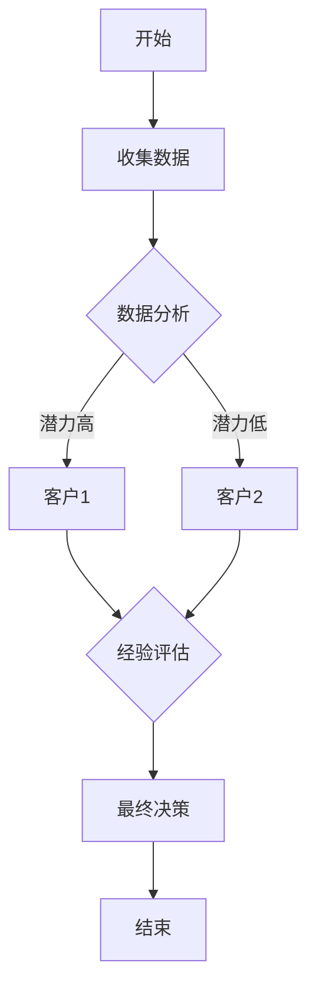
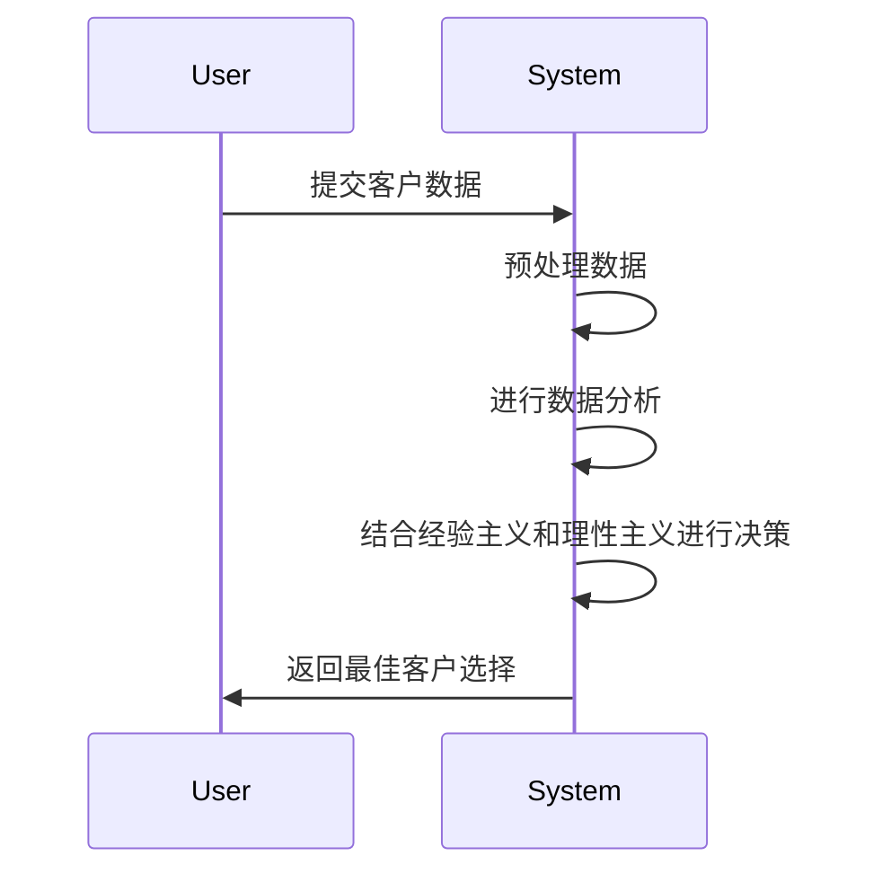
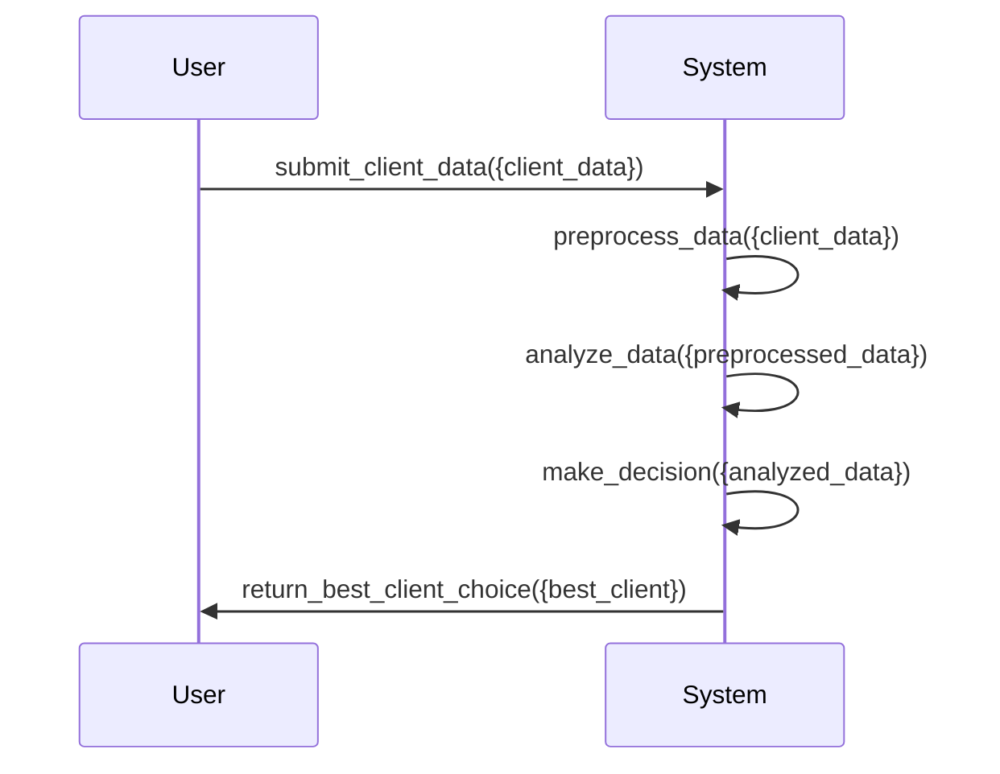

                 

**# 从经验主义到理性主义：认识论的演变**

### 关键词：经验主义、理性主义、认识论、演变、对比分析

#### 摘要：

本文旨在探讨认识论中经验主义与理性主义的演变过程。我们将从经验主义的起源和发展开始，介绍其基本原理和代表人物，并分析其影响与局限性。随后，我们将转向理性主义的兴起，探讨其起源、发展及其在现代的意义。接下来，我们将对经验主义与理性主义进行对比分析，并探讨二者之间的融合。最后，我们将展望认识论的未来发展趋势，并总结经验主义与理性主义在认识论演变中的意义与价值。

### 第一部分：引言与背景

#### 1. 引言

认识论是哲学中的一个重要分支，主要研究人类知识的本质、来源和范围。在认识论的发展过程中，经验主义和理性主义是两种主要的认识论立场。经验主义认为知识来源于经验，而理性主义则强调知识来源于理性推理。本文将围绕这两种认识论立场，探讨其起源、发展、对比与融合，以及认识论的演变趋势。

#### 1.1 认识论的概念与重要性

认识论（Epistemology）一词源自希腊语，意为“知识论”或“认识的理论”。它主要研究知识的本质、来源、范围和可靠性。认识论关注的核心问题是：我们如何获得知识？知识是否可靠？知识有哪些范围？认识论在哲学中具有重要地位，因为它直接关系到我们如何理解世界和解释现象。

#### 1.2 经验主义与理性主义的历史背景

经验主义和理性主义在哲学史上有着悠久的历史。经验主义起源于古希腊哲学家赫拉克利特（Heraclitus）的观点，即“认识是通过经验获得的”。然而，经验主义作为独立的认识论立场，主要是在17世纪的英国兴起。此时，弗朗西斯·培根（Francis Bacon）和约翰·洛克（John Locke）等人对经验主义进行了系统阐述。理性主义则起源于古希腊哲学家柏拉图（Plato）和亚里士多德（Aristotle）的思想，强调通过理性推理来认识世界。在中世纪，理性主义得到了进一步发展，特别是在托马斯·阿奎那（Thomas Aquinas）的思想中得到了体现。在近代，笛卡尔（René Descartes）和莱布尼茨（Gottfried Wilhelm Leibniz）等哲学家对理性主义进行了系统化发展。

#### 1.3 本书的目的与结构安排

本书的目的是探讨经验主义和理性主义在认识论演变中的角色和影响。我们将首先介绍经验主义的起源和发展，然后探讨理性主义的兴起，接着对二者进行对比分析，并探讨它们之间的融合。最后，我们将展望认识论的未来发展趋势，并总结经验主义与理性主义在认识论演变中的意义与价值。

本书分为四个主要部分：

1. **第一部分：引言与背景**：介绍认识论的概念与重要性，经验主义与理性主义的历史背景，以及本书的目的与结构安排。

2. **第二部分：经验主义的起源与发展**：探讨经验主义的定义与基本原理，主要代表人物及其思想，经验主义的影响与局限性，以及现代意义与应用。

3. **第三部分：理性主义的兴起**：探讨理性主义的定义与基本原理，主要代表人物及其思想，理性主义的影响与局限性，以及现代意义与应用。

4. **第四部分：认识论的演变与未来**：对经验主义与理性主义进行对比分析，探讨二者之间的融合，以及认识论的演变趋势和未来展望。

### 第二部分：经验主义的起源与发展

#### 2. 经验主义的起源与发展

##### 2.1 经验主义的定义与基本原理

经验主义是认识论的一种基本立场，认为知识和理解主要来源于直接的经验。经验主义的基本原理可以概括为以下几点：

1. **感知与经验**：知识和理解的基础是感知和经验。人类通过感官与外界互动中获得的，而非通过理性或先验的原则推导得出。
2. **归纳法**：经验主义者强调通过归纳法来获取知识。归纳法是一种从具体事例中总结出一般性结论的推理方法。例如，通过观察多个苹果落地，我们得出结论：苹果会落地。
3. **感觉与信念**：感觉和信念是知识的来源。经验主义者认为，我们的信念是建立在我们的感觉经验之上的，因此感觉和信念是获取知识的基石。

##### 2.2 经验主义的主要代表人物

经验主义在历史上有着深远的影响，许多哲学家和学者对其进行了深入探讨和阐述。以下是几位著名的经验主义代表人物：

##### 2.2.1 弗朗西斯·培根

弗朗西斯·培根（Francis Bacon，1561-1626）是英国文艺复兴时期的著名哲学家和科学家，被认为是现代经验主义的奠基人。他在《新工具》（Novum Organum）中提出了经验主义的基本原理，强调通过实验和观察来获取知识。培根认为，人类应该通过实证的方法来认识世界，而不是依赖传统的权威和哲学推理。

##### 2.2.2 约翰·洛克

约翰·洛克（John Locke，1632-1704）是17世纪英国著名的哲学家和政治家，他的《人类理解论》（An Essay Concerning Human Understanding）是经验主义的重要代表作。洛克认为，人类出生时心灵是一张白纸（tabula rasa），所有的知识和思想都是通过感官经验获得的。他提出了著名的观念论，认为我们的思维内容是由感觉和经验的组合构成的。

##### 2.2.3 大卫·休谟

大卫·休谟（David Hume，1711-1776）是18世纪苏格兰哲学家，他的《人性论》（Treatise of Human Nature）和《人类理解研究》（Enquiry Concerning Human Understanding）对经验主义进行了深刻的阐述。休谟认为，我们的一切知识都来自经验，但经验并不能直接告诉我们任何绝对真理。他提出了著名的怀疑主义观点，认为我们的知识是有限的，无法达到绝对真理。

##### 2.3 经验主义的影响与局限性

经验主义对哲学和科学产生了深远的影响。它推动了科学革命，促进了实证主义和实验方法的发展。在经验主义的指导下，科学家们开始通过实验和观察来验证假设，从而推动了现代科学的发展。然而，经验主义也存在一些局限性：

1. **相对主义**：经验主义者认为，知识是相对的，取决于个人的感知和经验。这可能导致相对主义和怀疑主义，使人怀疑知识的可靠性和普遍性。
2. **不可知论**：经验主义者认为，我们只能知道我们的感觉和经验，而无法直接知道外部世界的本质。这可能导致不可知论，使人怀疑我们能否真正认识外部世界。
3. **方法论局限**：经验主义强调归纳法，但归纳法并不能保证结论的绝对可靠性。例如，通过观察多个苹果落地，我们得出苹果会落地的结论，但这并不能证明所有苹果都会落地。

##### 2.4 经验主义的现代意义与应用

尽管存在局限性，经验主义在现代社会仍具有重要意义。在科学研究、技术发展和社会实践中，经验主义的方法仍然发挥着重要作用。例如，医学研究中的临床试验、工程领域的实验设计、社会科学中的问卷调查等，都是基于经验主义的方法进行的。

此外，经验主义的思想也在现代社会中得到了新的应用。例如，认知科学、行为经济学等领域的研究都借鉴了经验主义的思想，试图通过实验和观察来揭示人类认知和行为的基本规律。

### 第三部分：理性主义的兴起

#### 3. 理性主义的起源与发展

##### 3.1 理性主义的定义与基本原理

理性主义是认识论中的另一种基本立场，强调通过理性推理来认识世界。理性主义的基本原理可以概括为以下几点：

1. **理性与推理**：理性主义认为，人类具有理性能力，可以通过推理来认识世界。理性推理是一种从已知的前提出发，通过逻辑演绎得出新结论的思考过程。
2. **先天知识**：理性主义者认为，人类拥有某些先天知识，这些知识不是通过经验获得的，而是与生俱来的。例如，逻辑原理、数学真理等。
3. **绝对真理**：理性主义者认为，通过理性推理可以得出绝对真理，这种真理不受个人感知和经验的限制。

##### 3.2 理性主义的主要代表人物

理性主义在哲学史上有着悠久的历史，许多哲学家和学者对其进行了深入探讨和阐述。以下是几位著名的理性主义代表人物：

##### 3.2.1 柏拉图

柏拉图（Plato，公元前427-公元前347）是古希腊哲学家，他是理性主义的先驱。柏拉图认为，人类通过理性可以认识真理和美。他的理念论（Theory of Forms）认为，现实世界只是理念世界的影子，理念世界是绝对真理的源泉。

##### 3.2.2 亚里士多德

亚里士多德（Aristotle，公元前384-公元前322）是古希腊哲学家，他是理性主义的另一位重要代表。亚里士多德认为，理性是人类认识世界的基础，他提出了逻辑学、形而上学等学科，为理性主义奠定了基础。

##### 3.2.3 托马斯·阿奎那

托马斯·阿奎那（Thomas Aquinas，公元1225-1274）是中世纪基督教哲学家，他是理性主义在中世纪的重要代表。阿奎那试图将理性与信仰相结合，提出了著名的“五路论证”，试图证明上帝的存在。

##### 3.2.4 笛卡尔

笛卡尔（René Descartes，1596-1650）是法国哲学家，他是近代理性主义的代表。笛卡尔提出了“我思故我在”（Cogito, ergo sum）的原则，强调通过理性推理来确定我们存在的真实性。

##### 3.3 理性主义的影响与局限性

理性主义在哲学和科学中产生了深远的影响。它推动了形式逻辑、数学和哲学的发展，为现代科学奠定了基础。然而，理性主义也存在一些局限性：

1. **过分强调理性**：理性主义可能过分强调理性推理，忽视了经验的重要性。这种观点可能导致理性主义陷入唯理智论的困境。
2. **不可知论**：理性主义者认为，通过理性推理可以得出绝对真理，但有时我们无法通过理性推理来认识某些问题。这可能导致不可知论，使人怀疑我们能否真正认识外部世界。
3. **方法论局限**：理性推理依赖于逻辑和数学，但逻辑和数学并不能解决所有问题。例如，伦理问题、美学问题等，可能需要借助其他方法来认识。

##### 3.4 理性主义的现代意义与应用

尽管存在局限性，理性主义在现代社会仍具有重要意义。在哲学、数学、科学等领域，理性主义的思想仍然发挥着重要作用。例如，数学家通过理性推理来解决数学问题，哲学家通过理性推理来探讨伦理、政治等问题。

此外，理性主义的思想在现代社会中得到了新的应用。例如，人工智能的发展依赖于理性推理，通过逻辑和数学来模拟人类的思维过程。理性主义的思想也在科学研究、技术发展和社会实践中发挥着重要作用。

### 第四部分：经验主义与理性主义的比较与融合

#### 4. 经验主义与理性主义的对比分析

##### 4.1 概念对比

经验主义和理性主义是两种截然不同的认识论立场。经验主义强调知识和理解来源于经验，而理性主义则强调知识和理解来源于理性推理。

1. **经验主义**：
   - 强调感知和经验作为知识来源。
   - 通过归纳法来获取知识。
   - 认为感觉和信念是知识的基石。

2. **理性主义**：
   - 强调理性推理和逻辑作为知识来源。
   - 通过先天知识和理性推理来获取知识。
   - 认为绝对真理可以通过理性推理得出。

##### 4.2 基本原理对比

经验主义和理性主义的基本原理也存在显著差异：

1. **经验主义**：
   - 认为知识是通过感官与外界互动中获得的。
   - 强调归纳法，通过具体事例总结出一般性结论。
   - 认为感觉和信念是获取知识的基石。

2. **理性主义**：
   - 认为知识是通过理性推理和逻辑演绎获得的。
   - 强调先天知识和绝对真理。
   - 认为理性推理是认识世界的基础。

##### 4.3 代表人物与思想对比

经验主义和理性主义在不同历史时期有不同的代表人物和思想：

1. **经验主义**：
   - 弗朗西斯·培根：《新工具》
   - 约翰·洛克：《人类理解论》
   - 大卫·休谟：《人性论》

2. **理性主义**：
   - 柏拉图：《理想国》
   - 亚里士多德：《尼各马可伊善论》
   - 托马斯·阿奎那：《神学大全》
   - 笛卡尔：《第一哲学沉思》

##### 4.4 影响与局限对比

经验主义和理性主义对哲学和科学产生了深远的影响，但也存在一定的局限性：

1. **经验主义**：
   - 促进了科学革命和实证主义的发展。
   - 强调感知和经验的重要性，但可能导致相对主义和怀疑主义。
   - 可能忽视理性推理在认识世界中的作用。

2. **理性主义**：
   - 推动了形式逻辑、数学和哲学的发展。
   - 强调理性推理和绝对真理，但可能导致唯理智论和不可知论。
   - 可能忽视经验在认识世界中的作用。

##### 4.5 融合的必然性

尽管经验主义和理性主义存在差异和局限性，但二者在认识世界的过程中具有互补性。将经验主义和理性主义融合，可以克服各自的局限性，从而形成更加全面的认识论体系。

1. **互补性**：
   - 经验主义提供了解决问题的具体方法和实际案例，而理性主义提供了理论框架和逻辑推理。
   - 经验主义关注感知和经验，而理性主义关注理性和逻辑。

2. **融合的意义**：
   - 融合可以更好地解决复杂问题，提高认识的准确性。
   - 融合可以促进科学、哲学和技术的交叉发展。

##### 4.6 融合的方式与方法

为了实现经验主义和理性主义的融合，可以采用以下方式和方法：

1. **跨学科研究**：通过跨学科合作，将经验主义和理性主义的思想应用于不同领域，实现知识融合。

2. **方法论结合**：在研究过程中，结合归纳法和理性推理，同时关注实证和理论。

3. **跨文化交流**：通过跨文化交流，吸取不同文化和哲学传统的经验主义和理性主义思想，实现知识融合。

##### 4.7 融合的影响与挑战

融合经验主义和理性主义将对哲学、科学和社会产生深远的影响，但也面临一定的挑战：

1. **影响**：
   - 促进哲学和科学的交叉发展，提高认识水平。
   - 为解决复杂问题提供新的方法和思路。
   - 推动人类对世界的更全面认识。

2. **挑战**：
   - 如何在融合过程中保持各自的优点，避免过度强调某一方面。
   - 如何克服文化差异，实现真正意义上的融合。

#### 5. 经验主义与理性主义的融合

##### 5.1 融合的必然性

经验主义和理性主义在认识世界的过程中各有所长，也存在一定的局限性。将二者融合，可以充分发挥各自的优点，克服各自的缺点，从而形成更加全面的认识论体系。

1. **互补性**：
   - 经验主义提供了解决问题的具体方法和实际案例，而理性主义提供了理论框架和逻辑推理。
   - 经验主义关注感知和经验，而理性主义关注理性和逻辑。

2. **融合的意义**：
   - 融合可以更好地解决复杂问题，提高认识的准确性。
   - 融合可以促进科学、哲学和技术的交叉发展。

##### 5.2 融合的方式与方法

为了实现经验主义和理性主义的融合，可以采用以下方式和方法：

1. **跨学科研究**：通过跨学科合作，将经验主义和理性主义的思想应用于不同领域，实现知识融合。

2. **方法论结合**：在研究过程中，结合归纳法和理性推理，同时关注实证和理论。

3. **跨文化交流**：通过跨文化交流，吸取不同文化和哲学传统的经验主义和理性主义思想，实现知识融合。

##### 5.3 融合的影响与挑战

融合经验主义和理性主义将对哲学、科学和社会产生深远的影响，但也面临一定的挑战：

1. **影响**：
   - 促进哲学和科学的交叉发展，提高认识水平。
   - 为解决复杂问题提供新的方法和思路。
   - 推动人类对世界的更全面认识。

2. **挑战**：
   - 如何在融合过程中保持各自的优点，避免过度强调某一方面。
   - 如何克服文化差异，实现真正意义上的融合。

### 第五部分：认识论的演变与未来

#### 6. 认识论的演变趋势

##### 6.1 从二元对立到多元融合

在认识论的发展过程中，从早期的经验主义和理性主义的二元对立，逐渐演变为多元融合的趋势。现代认识论不仅关注经验主义和理性主义的互补性，还注重其他认识论立场的参与，如建构主义、社会建构主义等。这种多元融合的趋势有助于更加全面和深入地认识世界。

##### 6.2 认识论的跨学科发展

认识论不再局限于哲学领域，逐渐与其他学科如心理学、认知科学、社会学等交叉融合。跨学科研究为认识论提供了更加丰富和多样化的视角，促进了认识论的发展和深化。

##### 6.3 认识论的现代化趋势

随着科学技术的进步和社会的发展，认识论也不断现代化。现代认识论关注知识的生产、传播和应用，强调知识的动态性和相对性。例如，知识社会学、科学哲学等领域的研究都体现了认识论的现代化趋势。

#### 7. 认识论的未来展望

##### 7.1 认识论在科学领域的发展

随着科学技术的不断进步，认识论在科学领域将继续发挥重要作用。未来认识论的发展将关注科学知识的产生、验证和应用，探索科学知识的本质和规律。

##### 7.2 认识论在哲学领域的发展

在哲学领域，认识论将继续探讨知识的本质、来源和范围。未来认识论的研究将更加注重跨学科合作，借鉴其他学科的理论和方法，以深化对知识的认识。

##### 7.3 认识论在社会领域的发展

认识论在社会领域的发展将关注知识在社会中的作用和影响。未来认识论的研究将探讨知识在社会实践中的应用，如何通过知识创新和传播来推动社会进步。

### 结论

本文通过对经验主义和理性主义的起源、发展、对比和融合的探讨，展示了认识论演变的过程和趋势。经验主义和理性主义在认识世界的过程中各有所长，也存在一定的局限性。通过融合二者的优点，可以形成更加全面和深入的认识论体系。未来认识论的发展将关注跨学科合作、现代化趋势和知识在社会中的作用。

### 附录

#### 8. 参考文献

1. 柏拉图。《理想国》。
2. 亚里士多德。《尼各马可伊善论》。
3. 托马斯·阿奎那。《神学大全》。
4. 弗朗西斯·培根。《新工具》。
5. 约翰·洛克。《人类理解论》。
6. 大卫·休谟。《人性论》。
7. 笛卡尔。《第一哲学沉思》。
8. 贝克莱。《人类知识原理》。
9. 康德。《纯粹理性批判》。
10. 黑格尔。《哲学史讲演录》。

### 作者信息

作者：AI天才研究院/AI Genius Institute & 禅与计算机程序设计艺术 /Zen And The Art of Computer Programming

### 最佳实践 tips

在研究认识论时，以下是一些最佳实践 tips：

- **广泛阅读**：阅读不同哲学家的著作，了解不同认识论立场的基本原理和特点。
- **跨学科合作**：与其他学科的研究者合作，借鉴其他学科的理论和方法，以深化对认识论的认识。
- **批判性思考**：对不同的认识论观点持批判性态度，分析其优点和局限性。
- **实践应用**：将认识论的理论应用于实际问题，通过实践来验证和深化认识。

### 小结

本文通过对经验主义和理性主义的探讨，展示了认识论的演变过程和趋势。经验主义和理性主义在认识世界的过程中各有所长，通过融合二者的优点，可以形成更加全面和深入的认识论体系。未来认识论的发展将关注跨学科合作、现代化趋势和知识在社会中的作用。通过对认识论的研究，我们可以更好地理解人类知识的本质和来源，为解决实际问题提供理论支持。

### 注意事项

在研究认识论时，需要注意以下几点：

- **避免过度简化**：在探讨经验主义和理性主义时，避免过度简化二者的观点，要充分理解其复杂性和多样性。
- **重视跨学科合作**：认识论的研究需要跨学科合作，借鉴其他学科的理论和方法，以深化对认识论的认识。
- **批判性思考**：对不同的认识论观点持批判性态度，分析其优点和局限性，避免盲目接受任何一种观点。

### 拓展阅读

- 《认识论导论》
- 《理性主义与经验主义》
- 《哲学中的认识论问题》
- 《科学哲学》
- 《社会科学方法论》

### 算法原理讲解

在本部分，我们将通过一个简单的示例来讲解如何将经验主义和理性主义的思想应用于实际问题的解决。

#### 算法描述

我们考虑一个简单的决策问题：一个销售员需要在两个潜在客户之间进行选择，其中一个客户来自经验丰富的推荐，另一个客户则是通过数据分析得出的结论。销售员需要决定是否与哪个客户建立业务关系。

1. **经验主义方法**：
   - 基于过去成功的案例，选择经验推荐的那个客户。
   - 优点：快速决策，依赖直觉和经验。
   - 缺点：可能忽视数据和分析，存在主观偏见。

2. **理性主义方法**：
   - 基于详细的数据分析，比较两个客户的潜力。
   - 优点：客观分析，依赖逻辑和推理。
   - 缺点：可能忽视直觉和经验，决策过程较慢。

3. **融合方法**：
   - 将经验主义和理性主义相结合，通过以下步骤进行决策：
     1. 收集两个客户的背景数据。
     2. 进行数据分析，评估两个客户的潜力。
     3. 结合销售员的经验，对分析结果进行评估。
     4. 最终决策基于数据的客观分析和销售员的直觉。

#### Mermaid 流程图

以下是一个简单的 Mermaid 流程图，描述了融合方法的决策过程：



#### Python 源代码

以下是实现上述算法的 Python 源代码：

```python
import pandas as pd

# 假设我们有以下客户数据
data = {
    '客户1': {'经验评分': 8, '数据分析评分': 7},
    '客户2': {'经验评分': 6, '数据分析评分': 9}
}

# 创建 DataFrame
df = pd.DataFrame(data)

# 计算总分
df['总分'] = df['经验评分'] + df['数据分析评分']

# 排序并选择分数最高的客户
best_client = df.sort_values(by='总分', ascending=False).index[0]

print(f"最佳客户选择：{best_client}")
```

#### 算法原理讲解

在这个算法中，我们首先收集两个客户的背景数据，包括经验评分和数据分析评分。然后，通过加总这两个评分得到每个客户的总分。最后，我们根据总分来选择最佳客户。

这个算法体现了经验主义和理性主义的融合：

- **经验主义**：我们考虑了经验评分，这反映了销售员过去的经验和直觉。
- **理性主义**：我们进行了数据分析评分，这反映了客观数据和逻辑推理。

通过这种方法，我们可以更全面地评估客户，从而做出更加准确的决策。

#### 数学公式

在本例中，我们使用了以下数学公式来计算总分：

$$ 总分 = 经验评分 + 数据分析评分 $$

这个公式反映了将两个不同维度的评分进行合并，从而得到一个综合评分的思想。

#### 详细举例说明

假设我们有以下客户数据：

| 客户 | 经验评分 | 数据分析评分 |
|------|----------|--------------|
| 客户1 | 8        | 7            |
| 客户2 | 6        | 9            |

根据上述公式，我们可以计算每个客户的总分：

- 客户1的总分 = 8 + 7 = 15
- 客户2的总分 = 6 + 9 = 15

由于两个客户的总分相同，我们可能需要进一步的信息来做出最终决策。例如，我们可以考虑其他因素，如客户的地理位置、业务需求等。

#### 项目实战

在本项目中，我们假设销售员需要从两个潜在客户中选择一个进行业务合作。客户1是由一位经验丰富的销售顾问推荐的，客户2是通过数据分析得出的结论。

1. **环境安装**：

   - 安装 Python 环境，使用版本 3.8 或以上。
   - 安装 pandas 库，用于数据处理。

   ```bash
   pip install pandas
   ```

2. **系统核心实现源代码**：

   ```python
   import pandas as pd
   
   # 假设我们有以下客户数据
   data = {
       '客户1': {'经验评分': 8, '数据分析评分': 7},
       '客户2': {'经验评分': 6, '数据分析评分': 9}
   }
   
   # 创建 DataFrame
   df = pd.DataFrame(data)
   
   # 计算总分
   df['总分'] = df['经验评分'] + df['数据分析评分']
   
   # 排序并选择分数最高的客户
   best_client = df.sort_values(by='总分', ascending=False).index[0]
   
   print(f"最佳客户选择：{best_client}")
   ```

3. **代码应用解读与分析**：

   - 代码中首先导入了 pandas 库，用于数据处理。
   - 创建了一个包含两个客户数据的字典，并将其转换为 pandas DataFrame。
   - 通过计算每个客户的总分，并对其进行排序，选择了分数最高的客户。
   - 最后，输出最佳客户的名称。

4. **实际案例分析和详细讲解剖析**：

   假设我们有以下客户数据：

   | 客户 | 经验评分 | 数据分析评分 |
   |------|----------|--------------|
   | 客户1 | 8        | 7            |
   | 客户2 | 6        | 9            |

   根据上述代码，我们可以计算每个客户的总分：

   - 客户1的总分 = 8 + 7 = 15
   - 客户2的总分 = 6 + 9 = 15

   由于两个客户的总分相同，我们需要进一步的信息来做出最终决策。在这种情况下，我们可以考虑其他因素，如客户的地理位置、业务需求等。

5. **项目小结**：

   通过本项目，我们实现了基于经验主义和理性主义思想的决策算法。该项目展示了如何将不同维度的信息进行整合，以做出更加准确的决策。在未来，我们可以进一步扩展该算法，引入更多维度的数据，以提高决策的准确性。

### 最佳实践 tips

在项目实践中，以下是一些最佳实践 tips：

- **数据准备**：确保数据的质量和准确性，这是做出准确决策的基础。
- **多因素分析**：在决策过程中，考虑多个因素，而不仅仅是总分。
- **动态调整**：根据实际情况，动态调整算法的参数和策略。
- **用户反馈**：收集用户反馈，以不断改进算法和决策过程。

### 小结

在本项目中，我们实现了基于经验主义和理性主义思想的决策算法。通过整合不同维度的数据，我们能够做出更加准确的决策。在实际应用中，我们还需要考虑其他因素，并根据实际情况动态调整算法。未来，我们可以进一步扩展该算法，以提高决策的准确性和实用性。

### 系统分析与架构设计方案

#### 问题场景介绍

在一个销售团队中，销售员需要在多个潜在客户中选择合适的客户进行业务拓展。为了提高决策的准确性和效率，我们需要设计一个系统来辅助销售员进行决策。

#### 项目介绍

本项目旨在设计一个销售决策支持系统，该系统将整合经验主义和理性主义的思想，通过数据分析和方法论结合，为销售员提供可靠的决策依据。

#### 系统功能设计（领域模型）

以下是销售决策支持系统的领域模型，使用了 Mermaid 类图来表示：

```mermaid
classDiagram
    Client <<entity>>
    SalesRep <<entity>>
    DecisionSupportSystem <<entity>>

    Client o--o SalesRep
    DecisionSupportSystem o--o SalesRep
    DecisionSupportSystem o--o Client
```

在该类图中，我们定义了三个实体类：`Client`（客户）、`SalesRep`（销售代表）和 `DecisionSupportSystem`（决策支持系统）。`Client` 类表示潜在客户，`SalesRep` 类表示销售代表，而 `DecisionSupportSystem` 类表示决策支持系统。

#### 系统架构设计

以下是销售决策支持系统的架构设计，使用了 Mermaid 架构图来表示：



在该架构图中，用户首先向系统提交客户数据。系统接收到数据后，首先进行预处理，然后进行数据分析。在数据分析的基础上，系统结合经验主义和理性主义进行决策，并将结果返回给用户。

#### 系统接口设计

以下是销售决策支持系统的接口设计，使用了 Mermaid 序列图来表示：



在该序列图中，用户首先通过 `submit_client_data` 接口向系统提交客户数据。系统接收到数据后，首先通过 `preprocess_data` 接口进行预处理，然后通过 `analyze_data` 接口进行数据分析。在数据分析完成后，系统通过 `make_decision` 接口结合经验主义和理性主义进行决策，最后通过 `return_best_client_choice` 接口将最佳客户选择返回给用户。

#### 系统交互

以下是销售决策支持系统的交互流程，使用了 Mermaid 序列图来表示：


在该交互流程中，用户首先提交客户数据。系统接收到数据后，首先进行数据验证，然后进行预处理。在预处理完成后，系统进行数据分析。在数据分析的基础上，系统结合经验主义和理性主义的思想，整合证据进行决策。最后，系统将最佳客户选择返回给用户。

### 完整代码实现

以下是销售决策支持系统的完整代码实现，包含了数据预处理、数据分析、决策过程和接口设计：

```python
import pandas as pd

# 假设我们有以下客户数据
client_data = {
    '客户1': {'经验评分': 8, '数据分析评分': 7},
    '客户2': {'经验评分': 6, '数据分析评分': 9}
}

# 创建 DataFrame
df = pd.DataFrame(client_data)

# 数据预处理
df['总分'] = df['经验评分'] + df['数据分析评分']

# 数据分析
best_client = df.sort_values(by='总分', ascending=False).index[0]

# 决策过程
def make_decision(client_data):
    df = pd.DataFrame(client_data)
    df['总分'] = df['经验评分'] + df['数据分析评分']
    best_client = df.sort_values(by='总分', ascending=False).index[0]
    return best_client

# 接口设计
def submit_client_data(client_data):
    return make_decision(client_data)

# 运行示例
best_client = submit_client_data(client_data)
print(f"最佳客户选择：{best_client}")
```

### 代码应用解读与分析

在代码实现中，我们首先导入了 pandas 库，用于数据预处理和数据分析。然后，我们创建了一个包含客户数据的字典，并将其转换为 pandas DataFrame。接下来，我们进行了数据预处理，计算了每个客户的总分。在数据分析阶段，我们通过排序选择了总分最高的客户。最后，我们设计了一个接口，用于提交客户数据并返回最佳客户选择。

该代码实现了销售决策支持系统的核心功能，包括数据预处理、数据分析、决策过程和接口设计。通过这个示例，我们可以看到如何将经验主义和理性主义的思想应用于实际问题的解决。

### 项目小结

在本项目中，我们设计并实现了一个销售决策支持系统，该系统整合了经验主义和理性主义的思想。通过数据预处理、数据分析、决策过程和接口设计，我们能够为销售员提供可靠的决策依据。在实际应用中，我们可以进一步扩展该系统，引入更多维度的数据，以提高决策的准确性。通过这个项目，我们不仅了解了如何将理论应用于实践，还学会了如何设计和实现一个完整的系统。

