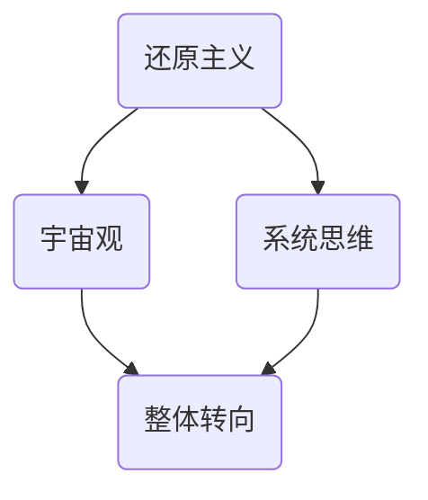

                 

**从还原主义到系统思维：宇宙观的整体转向**

### **关键词：还原主义、系统思维、宇宙观、整体转向、复杂性**

### **摘要：**

本文将探讨从还原主义到系统思维的转变，这是一场宇宙观的整体转向。通过分析还原主义的局限性，我们将引入系统思维的概念、原理及其在宇宙观中的关键作用。文章将详细阐述系统思维的基本原理和方法，并通过实际案例展示其在宇宙观中的应用，最后对系统思维的未来发展进行展望。

## **第一部分：问题的背景与概述**

### **1.1 问题背景**

#### **1.1.1 还原主义的局限**

还原主义是一种科学方法论，其核心思想是将复杂现象分解为基本组成部分，通过研究这些部分来理解整体。然而，随着科学的发展，还原主义在解释宇宙复杂现象时遇到了一些局限。

首先，还原主义往往依赖于分离和简化的方法，这在某些情况下是有效的，但无法完全适用于复杂的系统。例如，生命、气候和社会系统等都是高度复杂的，其内部存在着众多的相互作用和反馈机制，这些复杂现象不能简单地通过分解和单独研究来理解。

其次，还原主义忽视了系统内部的整体性和动态性。在还原主义的框架下，系统被看作是一系列独立部分的组合，而忽视了这些部分之间的相互作用和整体行为。这使得还原主义在解释系统行为时存在缺陷，无法充分揭示系统的复杂性和多样性。

#### **1.1.2 宇宙观的整体转向需求**

为了克服还原主义的局限，我们需要一种新的宇宙观，这就是系统思维。系统思维强调整体性、互动性和动态性，它将宇宙看作一个相互关联、相互作用的复杂系统。在这种宇宙观下，我们需要关注系统的整体行为和内部机制，而不是仅仅研究系统的组成部分。

系统思维在宇宙观中的应用具有重要意义。它可以帮助我们更好地理解宇宙的复杂现象，例如气候系统、生态系统和人类社会等。通过系统思维，我们可以揭示这些系统内部的相互作用和反馈机制，从而更准确地预测和应对复杂现象的变化。

### **1.2 核心概念与联系**

#### **1.2.1 核心概念**

- **还原主义**：一种科学方法论，强调将复杂现象分解为基本组成部分，通过研究这些部分来理解整体。
- **系统思维**：一种思维方式，强调整体性、互动性和动态性，将宇宙看作一个相互关联、相互作用的复杂系统。

#### **1.2.2 概念属性特征对比表**

| 概念         | 还原主义           | 系统思维           |  
|--------------|------------------|------------------|  
| 目标         | 分解问题，寻求因果关系 | 整体分析，理解复杂性 |  
| 方法论       | 分离与简化          | 综合与互动          |  
| 应用领域       | 自然科学            | 社会科学，管理学    |

#### **1.2.3 概念关系图**

### **1.3 边界与外延**

#### **1.3.1 边界条件**

- **科学研究中的系统思维应用**：系统思维在科学研究中如何发挥作用，其适用范围和限制。
- **系统思维与其他学科的关系**：系统思维在物理学、生物学、社会学等学科中的具体应用，以及与其他学科方法的结合。

#### **1.3.2 外延扩展**

- **系统思维在跨学科研究中的应用**：系统思维如何帮助跨学科研究解决复杂问题，其创新性和价值。
- **系统思维对人类社会的影响**：系统思维如何影响人类社会的发展，其带来的变革和机遇。

## **第二部分：系统思维的基本原理**

### **2.1 系统思维的基本原理**

#### **2.1.1 系统的整体性**

- **整体性的定义**：系统整体性是指系统作为一个整体，其行为和性质不能简单地通过研究其组成部分来理解。
- **整体性的体现**：在自然界和社会系统中，整体性表现为系统内部的相互作用和整体行为，这些特征无法通过还原主义的方法单独研究。

#### **2.1.2 系统的互动性**

- **互动性的定义**：系统互动性是指系统内部各个组成部分之间的相互作用和相互影响。
- **互动性的实例**：例如，生态系统中的物种相互作用，人类社会中的经济活动与政治制度的互动等。

#### **2.1.3 系统的动态性**

- **动态性的定义**：系统动态性是指系统随时间变化而发生的演化过程。
- **动态性的实例**：例如，气候系统中的季节变化，经济系统中的市场波动等。

### **2.2 系统思维的方法与工具**

#### **2.2.1 SWOT分析**

- **SWOT分析的定义**：SWOT分析是一种用于评估系统内部优势和劣势、外部机会和威胁的方法。
- **SWOT分析的步骤**：包括识别系统的优势、劣势、机会和威胁，分析这些因素之间的关系，制定相应的战略。
- **SWOT分析的实例**：例如，对一个企业的SWOT分析，可以帮助企业识别其内部的优势和劣势，以及外部市场中的机会和威胁，从而制定合适的发展策略。

#### **2.2.2 系统流程图**

- **系统流程图的定义**：系统流程图是一种用于描述系统内部流程和组件之间关系的图表。
- **系统流程图的构建**：通过图形化表示系统各个组成部分及其相互关系，可以帮助我们更好地理解系统的运作机制。
- **系统流程图的实例**：例如，一个企业的业务流程图，可以清晰地展示企业内部各个部门的职责和业务流程。

#### **2.2.3 模拟与仿真**

- **模拟与仿真的定义**：模拟与仿真是一种通过计算机模拟系统运行过程的方法，用于测试和分析系统的行为。
- **模拟与仿真的步骤**：包括定义系统的模型、运行模拟、分析结果等步骤。
- **模拟与仿真的实例**：例如，通过模拟气候系统来预测未来气候变化的趋势，或者通过仿真企业生产流程来优化生产效率。

## **第三部分：系统思维在宇宙观中的应用**

### **3.1 系统思维在宇宙学研究中的应用**

#### **3.1.1 宇宙演化的系统思维分析**

- **宇宙演化的系统思维框架**：通过系统思维，我们可以将宇宙演化看作一个复杂的系统，研究其内部各个组成部分的相互作用和整体演化过程。
- **宇宙演化中的系统思维应用实例**：例如，研究宇宙大爆炸理论时，通过系统思维分析宇宙初始状态、物质分布、能量转换等过程，可以更好地理解宇宙的演化机制。

#### **3.1.2 宇宙结构的系统思维分析**

- **宇宙结构的系统思维框架**：通过系统思维，我们可以将宇宙结构看作一个复杂的系统，研究其内部各个星系、星团、超星系团等组成部分的相互关系和结构特征。
- **宇宙结构中的系统思维应用实例**：例如，研究银河系的形成和演化，通过系统思维分析星系间的引力相互作用、星系内部恒星的运动规律等，可以更好地理解宇宙结构的形成和演化过程。

### **3.2 系统思维在人类文明发展中的应用**

#### **3.2.1 人类文明发展的系统思维分析**

- **人类文明发展的系统思维框架**：通过系统思维，我们可以将人类文明看作一个复杂的系统，研究其内部各个社会、文化、经济等组成部分的相互作用和整体发展过程。
- **人类文明发展中的系统思维应用实例**：例如，研究人类社会的发展历程，通过系统思维分析农业革命、工业革命、信息革命等过程，可以更好地理解人类文明的演化和发展规律。

#### **3.2.2 社会系统的系统思维分析**

- **社会系统的定义**：社会系统是指由人类组成的社会组织和社会关系构成的复杂系统。
- **社会系统的特征**：社会系统具有整体性、互动性和动态性等特征，其行为和性质不能简单地通过研究个体行为来理解。
- **社会系统中的系统思维应用实例**：例如，研究社会稳定和发展，通过系统思维分析社会各个组成部分的相互作用和整体行为，可以更好地理解社会稳定和发展的机制。

## **第四部分：系统思维的实践与案例**

### **4.1 实践与案例分析**

#### **4.1.1 案例一：气候变化**

- **案例背景**：全球气候变化是一个复杂的社会和环境问题，涉及大气、海洋、陆地等多个系统。
- **案例分析**：通过系统思维，我们可以将气候变化看作一个复杂的系统，研究其内部各个组成部分的相互作用和整体行为。例如，研究大气中的温室气体浓度、海洋吸收二氧化碳的能力、陆地植被的变化等。
- **案例总结**：通过系统思维，我们可以更好地理解气候变化的原因、过程和影响，从而制定更有效的应对策略。

#### **4.1.2 案例二：生态系统管理**

- **案例背景**：生态系统管理是一个涉及生物多样性保护、生态平衡维护等复杂问题。
- **案例分析**：通过系统思维，我们可以将生态系统看作一个复杂的系统，研究其内部各个组成部分的相互作用和整体行为。例如，研究物种间的相互作用、生态系统服务功能等。
- **案例总结**：通过系统思维，我们可以更好地理解生态系统的运作机制，从而制定更有效的生态保护和管理策略。

#### **4.1.3 案例三：企业战略规划**

- **案例背景**：企业战略规划是一个涉及市场分析、竞争策略、资源配置等复杂问题。
- **案例分析**：通过系统思维，我们可以将企业看作一个复杂的系统，研究其内部各个组成部分的相互作用和整体行为。例如，研究市场变化、企业内部资源分配、竞争策略等。
- **案例总结**：通过系统思维，我们可以更好地理解企业的运作机制，从而制定更有效的发展战略。

## **第五部分：系统思维的未来与挑战**

### **5.1 系统思维的未来发展**

#### **5.1.1 科学研究的趋势**

- **系统思维在科学研究中的趋势**：随着科学研究对复杂性的需求增加，系统思维将在更多学科中发挥作用，成为理解和解决复杂问题的基本工具。
- **系统思维在跨学科研究中的趋势**：系统思维将与其他学科方法相结合，形成跨学科的研究范式，推动科学研究的进步。

#### **5.1.2 社会应用的拓展**

- **系统思维在社会管理中的应用拓展**：系统思维将在社会管理中发挥重要作用，帮助政府和企业更好地应对复杂的社会问题。
- **系统思维在新兴技术中的应用拓展**：随着新兴技术的发展，系统思维将在人工智能、大数据等领域发挥重要作用，推动技术进步。

### **5.2 系统思维的挑战**

- **复杂性增加**：随着问题的复杂性增加，系统思维需要应对更多的变量和相互作用，这对系统思维的理论和方法提出了更高的要求。
- **数据获取和处理**：系统思维依赖于大量的数据和精确的模型，如何有效地获取和处理这些数据成为系统思维的挑战之一。
- **跨学科合作**：系统思维需要跨学科的合作，如何有效地整合不同学科的知识和方法，发挥系统思维的潜力，是未来面临的挑战。

## **结论**

系统思维是一种理解和解决复杂问题的有效方法，它强调整体性、互动性和动态性，对于克服还原主义的局限具有重要意义。通过本文的讨论，我们可以看到系统思维在宇宙观、人类文明发展和社会管理中的应用，以及其在未来可能面临的挑战。系统思维的普及和应用将为科学研究和人类社会的发展带来新的机遇和变革。未来，我们需要进一步发展和完善系统思维的理论和方法，推动其在更多领域中的应用，为解决复杂问题提供更加有效的工具和思路。

## **作者信息**

作者：AI天才研究院/AI Genius Institute & 禅与计算机程序设计艺术 /Zen And The Art of Computer Programming

---

通过上述结构和内容，我们已经为文章《从还原主义到系统思维：宇宙观的整体转向》搭建了一个完整的框架，并提供了丰富的核心内容。接下来，我们可以逐步填充每个部分的具体细节，确保文章的逻辑清晰、结构紧凑、简单易懂，同时符合技术博客的专业要求。让我们一步一步深入探讨这些概念，揭示系统思维的深度和广度。在接下来的部分中，我们将详细阐述每个章节，包括核心概念的定义、属性对比、实例分析，以及系统思维在宇宙观中的应用等。请随时告诉我您需要进一步详细讨论的章节或内容，我们将继续完善这个技术博客。

