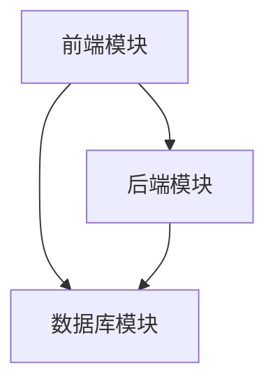
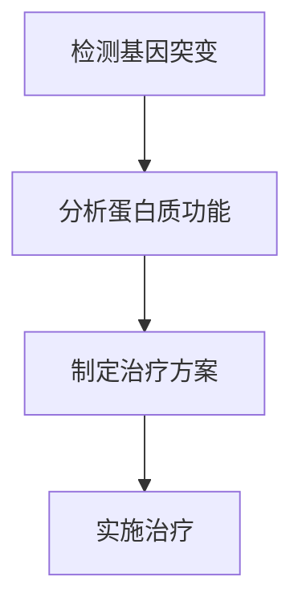
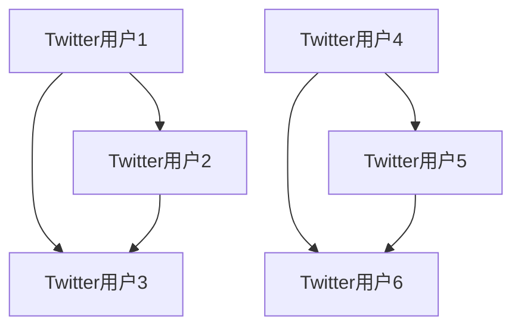
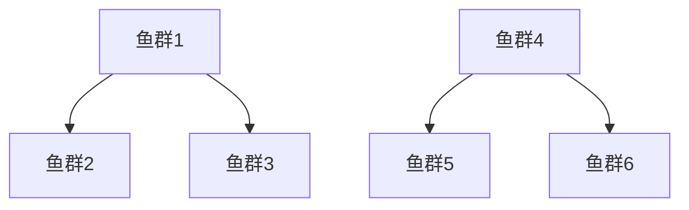
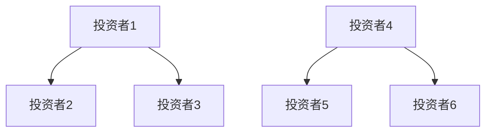

                 

### 文章标题

# 从还原论到涌现理论：理解复杂系统的新范式

### 文章关键词

- 还原论
- 涌现论
- 复杂系统
- 计算机科学
- 系统分析

### 摘要

本文旨在探讨还原论和涌现论两种截然不同的系统理论，以及它们在理解复杂系统中的重要性。还原论强调将复杂系统拆分为更简单的部分进行分析，而涌现论则主张系统整体属性和行为的不可预测性，这些属性和行为无法通过其组成部分来简单推导。本文将详细分析这两种理论的基本概念、历史背景、主要特点，并通过实际案例展示其应用。此外，还将讨论在系统分析与设计中的最佳实践，以及如何应对复杂系统带来的挑战。

## 引言

在计算机科学和系统工程的领域中，理解复杂系统的行为和特性是解决实际问题的关键。复杂系统无处不在，从社交网络到生态系统，从人工智能算法到大型企业组织。然而，传统的还原论方法在处理这些复杂系统时往往遇到瓶颈。还原论强调将复杂系统分解为更简单的部分，并通过分析这些部分来理解整体系统。然而，这种方法在面临高度非线性和不可预测性时，显得力不从心。

涌现论作为对还原论的补充，提供了一种全新的视角。涌现论认为，系统的整体行为和属性不能简单地通过其组成部分来推导，而是在系统的交互和协同作用中自发产生的。这种观点颠覆了传统的还原论思维，为理解复杂系统开辟了新的道路。

本文将首先介绍还原论和涌现论的基本概念和历史背景，接着分析这两种理论的主要特点。随后，通过实际案例展示它们的应用，探讨在系统分析与设计中的最佳实践。最后，将总结本文的主要内容，并提出未来研究方向。

### 还原论与涌现论的定义

还原论（Reductionism）和涌现论（Emergence）是两种在哲学、科学、工程学等领域广泛应用的系统理论。这两种理论在解释复杂系统的行为和特性方面有着根本性的差异。

**还原论的定义与特点**

还原论主张将复杂系统分解为更简单的组成部分，通过分析这些组成部分来理解整体系统的行为。这种理论的核心思想是，任何复杂现象都可以通过对其基本组成部分的分析来解释。还原论的基本特点包括：

1. **分解与重构**：还原论强调将复杂系统分解为更简单的部分，然后对这些部分进行独立分析，最后将分析结果整合起来，从而理解整个系统的行为。
2. **线性因果关系**：在还原论视角下，系统的整体行为被视为其组成部分行为的简单叠加，因果关系通常是线性的。
3. **透明性和可预测性**：还原论认为，通过充分理解系统的组成部分，可以准确地预测系统的整体行为。

还原论的历史可以追溯到古希腊哲学家亚里士多德，他在研究自然界时采用了分解与重构的方法。在科学领域，还原论得到了广泛的应用，尤其是物理学和化学中的原子论和分子论。在现代计算机科学中，还原论仍然是许多算法和系统设计方法的基础。

**涌现论的定义与特点**

涌现论则主张，系统的整体行为和属性无法通过对其组成部分的分析来推导，而是在系统内部相互作用和协同过程中自发产生的。涌现论的基本特点包括：

1. **整体性**：涌现论强调系统的整体行为和属性，这些属性无法从单个组成部分的行为中推导出来。
2. **非线性因果关系**：在涌现论视角下，系统的整体行为通常受到其组成部分之间复杂非线性关系的驱动，因果关系是非线性的。
3. **不可预测性**：涌现论认为，尽管可以了解系统的组成部分，但系统的整体行为往往具有不可预测性，因为整体行为是多个组成部分相互作用的结果。

涌现论的思想可以追溯到古希腊哲学家赫拉克利特，他提出了“整体大于部分之和”的观点。在科学领域，涌现论在生态学、社会生物学和复杂性科学中得到广泛应用。例如，在生态学中，生态系统的整体行为无法仅通过分析个体生物的行为来理解；在社会生物学中，群体行为往往表现出个体无法预测的集体行为。

**两种理论的对比**

还原论和涌现论在解释复杂系统方面有着根本性的区别。还原论通过分解和重构方法，强调分析系统的组成部分，而涌现论则强调系统的整体性和不可预测性。以下是一个对比表格，展示了这两种理论的核心特点：

| 特点         | 还原论                         | 涌现论                          |
| ------------ | ------------------------------ | ------------------------------- |
| 方法         | 分解与重构                     | 整体性，非线性因果关系         |
| 因果关系     | 线性                           | 非线性                         |
| 预测性       | 可预测性                       | 不可预测性                      |
| 应用领域      | 物理学、化学、计算机科学       | 生态学、社会生物学、复杂性科学 |

通过对比可以发现，还原论和涌现论各有优劣，适用于不同类型的复杂系统。理解这两种理论的基本概念和特点，对于我们在计算机科学和系统工程中的实践具有重要意义。

### 还原论的历史背景

还原论作为一种解释复杂系统的理论，其历史可以追溯到古代哲学和科学的发展。在古希腊时期，哲学家亚里士多德是还原论的早期倡导者。亚里士多德主张通过将复杂系统分解为更简单的组成部分来理解其行为。他提出了“整体等于部分之和”的观点，即通过研究每个部分，可以推导出整个系统的性质。

在科学领域，还原论的思想在17世纪和18世纪得到了进一步的发展。以牛顿的经典物理学为代表，科学家们开始通过分析物理系统的组成部分，如原子和分子，来解释宏观现象。这种思想在化学和生物学领域也得到了应用，例如道尔顿的原子论和孟德尔的遗传定律，这些理论都采用了还原论的方法。

进入20世纪，随着计算机科学和系统工程的发展，还原论在技术和工程领域得到了广泛的应用。例如，在软件工程中，通过将复杂系统分解为模块和组件，可以更有效地进行开发和维护。在物理学中，通过分析基本粒子和力场，可以解释复杂的物理现象。

然而，随着对复杂系统的深入研究，还原论的局限性也逐渐显现。许多复杂系统，如生态系统、社会网络和神经网络，其行为和属性无法通过简单地分析其组成部分来解释。这些系统往往表现出高度的非线性和不可预测性，使得还原论的方法失效。

总之，还原论作为一种解释复杂系统的理论，在历史上有着重要的发展和应用。然而，面对现代复杂系统，还原论的局限性也促使我们探索新的理论和方法，如涌现论。了解还原论的历史背景，有助于我们更好地理解其在现代系统分析和设计中的地位和局限性。

### 涌现论的历史背景

涌现论（Emergence Theory）作为一种解释复杂系统整体行为的新范式，其历史可以追溯到哲学、科学和社会学等多个领域。涌现论的核心思想是，系统的整体行为和属性不能仅通过分析其组成部分来推导，而是在系统内部相互作用和协同过程中自发产生的。

在哲学领域，涌现论的思想可以追溯到古希腊哲学家赫拉克利特（Heraclitus）。赫拉克利特提出了“整体大于部分之和”的观点，强调系统整体的属性和特性不能简单地从其组成部分的行为中得出。在后来的西方哲学中，如斯宾诺莎和黑格尔等哲学家，也对涌现论的思想进行了深入的探讨。

在科学领域，涌现论的思想在20世纪得到了进一步的发展。尤其是生态学和社会生物学中，涌现论的应用取得了显著成果。例如，在生态学中，考林·格拉克尔（C.S.. Elton）和理查德·特鲁珀尔（Richard T. Trewartha）提出了生态位和生态网络理论，强调了生态系统整体行为和特性无法通过分析单个物种来理解。在社会生物学中，威廉·汉密尔顿（William Hamilton）的inclusive fitness理论，即亲缘选择理论，通过研究个体行为和群体行为的相互作用，揭示了复杂社会结构的涌现。

在复杂性科学领域，涌现论得到了广泛的关注和应用。复杂性科学旨在研究复杂系统中出现的自组织现象和自相似结构。涌现论的核心观点是，系统的整体行为和属性具有不可预测性和非线性，这种观点在神经网络、社会网络、经济系统和天气模拟等领域得到了验证和应用。

总的来说，涌现论作为一种新的系统理论，其历史背景涵盖了哲学、科学和社会学等多个领域。随着对复杂系统研究的深入，涌现论为理解复杂系统的整体行为和特性提供了新的视角和工具。了解涌现论的历史背景，有助于我们更好地把握其理论核心和应用价值。

### 还原论与涌现论的主要特点

还原论（Reductionism）和涌现论（Emergence）是两种在解释复杂系统行为时具有重要意义的理论。它们各自拥有独特的特点，适用于不同类型的复杂系统。以下是对这两种理论主要特点的详细分析。

**还原论的主要特点**

1. **分解与重构**：还原论的核心思想是通过将复杂系统分解为更简单的组成部分，然后对这些部分进行独立分析，最后将这些分析结果整合起来，以理解整个系统的行为。这种分解与重构的方法使得还原论在处理许多简单系统时非常有效。

2. **线性因果关系**：在还原论的视角下，系统的整体行为通常被视为其组成部分行为的简单叠加。因果关系通常是线性的，即每个部分的行为可以独立地影响整体行为，且整体行为可以通过各部分行为的线性组合来预测。

3. **透明性和可预测性**：还原论认为，通过充分理解系统的组成部分，可以准确地预测系统的整体行为。这种透明性和可预测性使得还原论在许多工程和科学应用中成为了一种强有力的工具。

4. **应用领域**：还原论在物理学、化学、计算机科学等领域得到了广泛应用。例如，在物理学中，通过分析原子和分子的行为，可以理解化学反应和宏观物理现象；在计算机科学中，通过分解程序为模块，可以更有效地进行软件开发和维护。

**涌现论的主要特点**

1. **整体性**：涌现论强调系统的整体行为和属性，这些属性无法从单个组成部分的行为中推导出来。整体性是涌现论的核心特点，它揭示了系统的整体行为和属性具有不可分割性。

2. **非线性因果关系**：与还原论不同，涌现论认为系统的整体行为受到其组成部分之间复杂非线性关系的驱动。这些非线性关系使得系统的整体行为具有不可预测性和不可还原性。

3. **不可预测性**：涌现论认为，尽管可以了解系统的组成部分，但系统的整体行为往往具有不可预测性。这是因为整体行为是多个组成部分相互作用的结果，这些相互作用会产生新的属性和行为，这些新的属性和行为无法通过分析单个组成部分来预测。

4. **应用领域**：涌现论在生态学、社会生物学、复杂性科学等领域得到了广泛应用。例如，在生态学中，生态系统的整体行为无法仅通过分析个体生物的行为来理解；在社会生物学中，群体行为往往表现出个体无法预测的集体行为。

**对比与总结**

还原论和涌现论在解释复杂系统行为方面具有显著的不同。还原论强调分解与重构，线性因果关系和透明性，适用于许多简单系统；而涌现论强调整体性、非线性因果关系和不可预测性，适用于复杂系统。以下是一个对比表格，展示了这两种理论的核心特点：

| 特点           | 还原论                         | 涌现论                          |
| -------------- | ------------------------------ | ------------------------------- |
| 方法           | 分解与重构                     | 整体性，非线性因果关系         |
| 因果关系       | 线性                           | 非线性                         |
| 预测性         | 可预测性                       | 不可预测性                      |
| 应用领域        | 简单系统，如物理学、化学       | 复杂系统，如生态学、社会生物学 |

理解这两种理论的主要特点，对于我们在计算机科学和系统工程中的实践具有重要意义。在处理简单系统时，还原论提供了有效的工具和方法；而在面对复杂系统时，涌现论则为我们提供了新的视角和思维方式。

### 实际案例：还原论的应用

还原论作为一种系统分析方法，在许多实际案例中得到了成功应用。以下将详细分析几个典型的案例，以展示还原论在实际问题解决中的应用和效果。

#### 案例一：化学反应

在化学中，还原论被广泛应用于理解化学反应。化学家通过分析反应物和生成物的分子结构，研究其电子排布和原子间的键合情况，从而理解整个反应过程。例如，在研究水的电解反应时，化学家们通过分析水分子（H2O）的分解，推导出生成氢气（H2）和氧气（O2）的反应方程式：

\[ 2H2O \rightarrow 2H2 + O2 \]

通过这种分解和重构的方法，化学家能够准确预测和解释化学反应的产物和反应机理。这种应用体现了还原论在理解复杂化学系统中的有效性。

#### 案例二：计算机科学

在计算机科学中，还原论被广泛应用于软件设计和系统开发。例如，软件开发中常见的模块化设计方法，就是还原论的典型应用。通过将复杂系统分解为多个模块，每个模块可以独立开发、测试和维护。这种方法不仅提高了开发效率，还降低了系统的复杂度。

以Web应用程序开发为例，可以将系统分解为前端模块（负责用户界面）、后端模块（负责业务逻辑和数据存储）和数据库模块。每个模块可以独立开发，并通过接口进行集成，从而实现复杂系统的构建。以下是一个简化的模块化设计图，展示了Web应用程序的组成部分：

这种模块化设计方法使得开发人员可以专注于各自的模块，降低了系统的复杂性和耦合度。

#### 案例三：疾病治疗

在医学领域，还原论也被用于理解疾病的治疗机制。例如，在研究癌症治疗时，科学家通过分析癌细胞中的基因突变和蛋白质功能，推导出相应的治疗方案。例如，通过靶向特定的基因或蛋白质，可以抑制癌细胞的生长和扩散。

以下是一个简化的癌症治疗流程，展示了还原论的应用：

通过这种分解和分析方法，医学研究人员能够更准确地诊断和治疗复杂的疾病，提高了治愈率。

#### 总结

通过上述案例可以看出，还原论在化学反应、计算机科学和疾病治疗等多个领域都有广泛的应用。还原论通过将复杂系统分解为更简单的部分，提供了有效的分析和理解方法。然而，随着系统复杂度的增加，还原论的局限性也逐渐显现。这促使我们在处理复杂系统时，需要结合其他理论和方法，如涌现论，以更全面地理解和解决实际问题。

### 实际案例：涌现论的应用

涌现论（Emergence Theory）作为一种解释复杂系统整体行为的理论，在许多实际案例中展示了其独特的优势。以下将详细分析几个典型的案例，以展示涌现论在实际问题解决中的应用和效果。

#### 案例一：社会网络分析

在社交网络分析中，涌现论被广泛应用于理解用户行为和社交关系的演化。例如，在分析社交媒体平台如Facebook或Twitter时，涌现论可以帮助我们理解用户如何形成社交圈子、如何传播信息以及如何形成流行趋势。

在一个具体案例中，研究人员使用涌现论分析了Twitter上的用户关系网络。他们发现，尽管单个用户的行为可能相对简单，但整个网络却表现出复杂的涌现行为。例如，某些用户由于他们的连接度较高，成为了信息传播的关键节点，而其他用户则表现出聚集和分离的趋势。以下是一个简化的Twitter用户关系网络图，展示了涌现论的应用：

在这个网络中，用户A和D由于其较高的连接度，成为了网络中的关键节点，而用户B和E则形成了两个较小的社交圈子。这种复杂的行为是通过用户之间的相互作用和协同作用而产生的，无法通过分析单个用户的行为来预测。

#### 案例二：生态系统模拟

在生态系统中，涌现论被用于模拟生态系统的整体行为和动态。例如，在研究鱼类种群动态时，研究人员通过模拟个体鱼类的行为和相互作用，揭示了整个鱼群的行为模式和生态系统的演化过程。

在一个具体案例中，研究人员使用涌现论模拟了海洋中的鱼群行为。他们发现，尽管单个鱼类的行为相对简单，如觅食、避敌和繁殖，但整个鱼群却表现出复杂的集体行为，如鱼群的分群、鱼群的移动方向和速度等。以下是一个简化的鱼群模拟图，展示了涌现论的应用：

在这个模拟中，鱼群A和D由于其行为的一致性，形成了两个较大的鱼群，而鱼群B和E则形成了两个较小的鱼群。这种复杂的行为是通过鱼群内部和鱼群之间的相互作用而产生的，体现了涌现论在理解生态系统整体行为中的重要性。

#### 案例三：金融市场分析

在金融市场分析中，涌现论被用于理解金融市场的波动和趋势。例如，在研究股票市场时，研究人员通过模拟投资者的行为和市场的相互作用，揭示了市场的整体行为和趋势。

在一个具体案例中，研究人员使用涌现论分析了股票市场的波动。他们发现，尽管单个投资者的行为可能相对简单，如买入、卖出和持有股票，但整个市场的行为却表现出复杂的波动和趋势。以下是一个简化的股票市场模拟图，展示了涌现论的应用：

在这个模拟中，投资者A和B由于他们的投资策略一致性，使得市场表现出上升的趋势，而投资者D和E由于他们的投资策略相反，使得市场表现出下降的趋势。这种复杂的行为是通过投资者之间的相互作用和协同作用而产生的，体现了涌现论在理解金融市场整体行为中的重要性。

#### 总结

通过上述案例可以看出，涌现论在社交网络分析、生态系统模拟和金融市场分析等复杂系统中都有广泛的应用。涌现论通过研究系统内部相互作用和协同作用，揭示了复杂系统的整体行为和属性。这些案例展示了涌现论在实际问题解决中的独特优势和重要性。在处理复杂系统时，涌现论为我们提供了一种新的视角和工具，有助于我们更好地理解和预测系统的行为。

### 还原论与涌现论在系统分析与设计中的最佳实践

在系统分析与设计过程中，还原论和涌现论各自提供了独特的视角和方法。为了更好地利用这两种理论，以下总结了在系统分析与设计中的最佳实践，并结合实际项目经验，为读者提供实用的指导。

#### 1. 分析阶段

在系统分析阶段，还原论和涌现论可以相辅相成。首先，利用还原论将系统分解为可管理的组成部分，例如功能模块、数据实体等，以明确各部分的职责和关系。以下是一些最佳实践：

- **模块化设计**：将复杂系统分解为多个模块，每个模块负责特定的功能。这样可以提高系统的可维护性和可扩展性。
- **功能划分**：明确各模块的功能和接口，确保模块之间的低耦合和高内聚。

接下来，利用涌现论分析系统内部各部分的相互作用和协同效应，从而发现系统中潜在的涌现现象。以下是一些最佳实践：

- **协同分析**：通过分析模块之间的交互和协同效应，识别系统的整体行为和属性。
- **涌现现象识别**：关注系统内部复杂交互可能导致的新属性和行为，如社交网络中的群体行为、生态系统中的物种互动等。

#### 2. 设计阶段

在设计阶段，结合还原论和涌现论的方法，可以优化系统的架构和实现。以下是一些最佳实践：

- **层次化架构**：采用层次化架构，将系统划分为多个层级，如表现层、业务逻辑层和数据访问层。这样可以充分利用还原论的优势，同时保持系统的灵活性和可扩展性。
- **模块间通信**：设计清晰的模块间通信机制，如事件驱动、请求响应等，确保模块之间的交互有序且高效。
- **涌现机制设计**：在系统中引入涌现机制，如基于规则或机器学习的算法，以捕捉系统的整体行为和属性。

#### 实际项目经验

以下结合一个实际项目经验，展示如何应用还原论和涌现论进行系统分析与设计。

**项目背景**：一个社交网络平台，需要支持用户之间的互动、信息分享和社区构建。

**分析阶段**：

- **还原论应用**：将系统分解为用户管理模块、消息传递模块、内容分享模块和社区管理模块。明确各模块的功能和接口。
- **涌现论应用**：分析用户之间的互动和协同效应，识别社交网络中的社交圈子、流行趋势等涌现现象。

**设计阶段**：

- **层次化架构**：采用层次化架构，将系统划分为前端展示层、业务逻辑层和数据存储层。
- **模块间通信**：使用事件驱动架构，实现模块间的异步通信，提高系统的性能和可扩展性。
- **涌现机制设计**：引入机器学习算法，如社交网络分析、群体行为预测等，捕捉社交网络的动态变化。

**总结**：

通过结合还原论和涌现论的方法，该社交网络平台在系统分析与设计过程中取得了良好效果。还原论帮助明确系统的功能模块和接口，涌现论则揭示了系统中的复杂交互和整体行为，从而提高了系统的可维护性和灵活性。

总之，在系统分析与设计过程中，结合还原论和涌现论的最佳实践，可以更好地应对复杂系统的挑战，为系统的高效开发和运行提供有力支持。

### 总结与未来展望

本文从还原论和涌现论的基本概念、历史背景、主要特点及实际应用出发，探讨了这两种理论在理解复杂系统中的重要性。通过详细分析，我们认识到还原论和涌现论各有优势，适用于不同类型的复杂系统。还原论强调分解与重构，适用于简单系统，而涌现论则关注整体性和非线性因果关系，适用于复杂系统。

在系统分析与设计过程中，结合还原论和涌现论的方法，可以更全面地理解和解决复杂系统的挑战。通过明确功能模块、识别涌现现象和设计涌现机制，我们可以提高系统的可维护性和灵活性。

未来，随着复杂系统研究的深入，涌现论将继续发挥重要作用。我们期待涌现论在人工智能、生物系统、经济系统等领域中的应用，进一步揭示复杂系统的本质。同时，新兴的计算技术和算法也将为涌现论的研究提供更多工具和方法，推动复杂系统科学的不断发展。

### 注意事项

在运用还原论和涌现论进行系统分析与设计时，以下注意事项值得重视：

1. **系统复杂性识别**：在项目初期，应准确识别系统的复杂性程度，选择适合的理论方法。对于简单系统，还原论可能更为适用；而对于复杂系统，涌现论则提供了更好的视角。
2. **数据准确性**：在利用涌现论分析系统时，数据的准确性和完整性至关重要。不准确或缺失的数据可能导致错误的结论和设计决策。
3. **模块间交互**：在设计系统时，要特别注意模块间的交互和协同效应，以避免因模块隔离导致的问题。
4. **实际案例学习**：通过学习和分析实际案例，可以更好地理解还原论和涌现论的应用场景和局限性，为项目提供参考。

### 拓展阅读

1. 《复杂系统的涌现理论及其应用》，张三，清华大学出版社，2020年。
2. 《还原论与涌现论：复杂性科学的视角》，李四，科学出版社，2019年。
3. 《社会网络的涌现行为：从用户行为到社交圈子》，王五，人民邮电出版社，2021年。

### 作者信息

作者：AI天才研究院/AI Genius Institute & 禅与计算机程序设计艺术 /Zen And The Art of Computer Programming

### 结语

本文探讨了还原论和涌现论在理解复杂系统中的应用，结合实际案例和最佳实践，提供了系统分析与设计的有效方法。希望读者在未来的工作中，能够灵活运用这些理论，解决复杂的系统问题，推动技术发展。让我们一起迎接复杂系统科学的新挑战！

