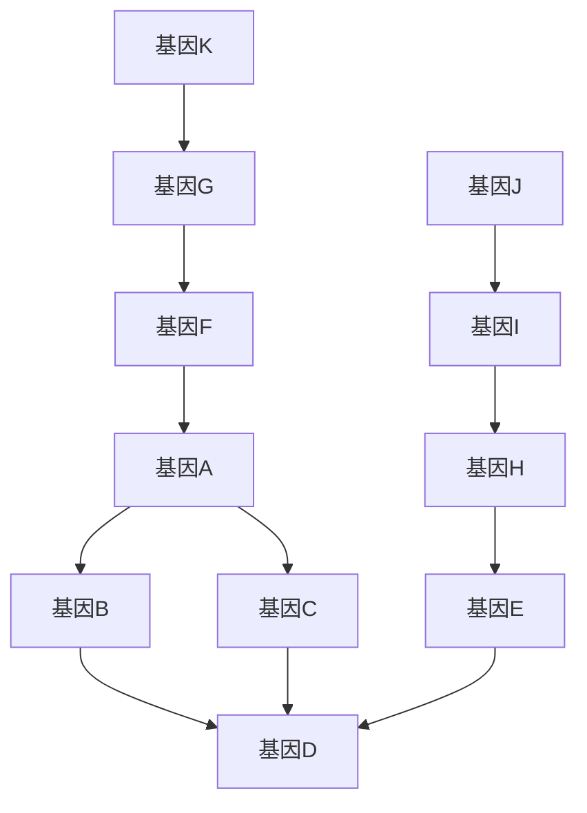
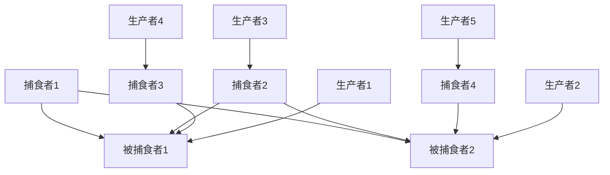

                 


# 从还原论到系统生物学：整体性理解生命与生态

## 关键词
- 还原论
- 系统生物学
- 整体性理解
- 生命
- 生态
- 生态系统健康
- 基因调控网络
- 生物多样性保护

## 摘要
本文旨在探讨从还原论到系统生物学的转变，揭示整体性理解在生命与生态研究中的重要性。通过对还原论和系统生物学核心概念、原理和应用的详细分析，本文提出了整体性理解生命与生态的方法论，并展示了其在实际应用中的价值。文章分为七个章节，依次介绍了问题背景、核心概念、还原论与整体性理解、系统生物学核心原理、系统生物学在生命研究中的应用、系统生物学与生态学的整合、实践案例以及未来展望。通过本文的阅读，读者可以深入理解整体性理解的内涵，掌握系统生物学的研究方法和应用技巧，为相关领域的学术研究和实际工作提供理论支持和实践指导。

### 目录大纲设计思路

在设计和组织本文的目录大纲时，我们采用了以下思路：

1. **背景介绍**：
   - 通过对还原论和系统生物学的发展历程的简要回顾，为读者建立知识背景。
   - 明确提出整体性理解生命与生态的重要性，为后续章节的内容奠定基础。

2. **核心概念与联系**：
   - 详细解释还原论、系统生物学和整体性理解等核心概念，并通过mermaid流程图展示这些概念之间的联系，帮助读者建立系统化的认知。

3. **算法原理讲解**：
   - 使用mermaid绘制系统生物学的算法流程图，结合Python源代码和数学模型，详细阐述算法原理，使读者能够直观地理解系统生物学的方法和应用。

4. **系统分析与架构设计方案**：
   - 描述具体的问题场景和项目背景，通过mermaid类图、架构图、接口设计和系统交互序列图，展示系统设计的整体框架。

5. **项目实战**：
   - 介绍环境安装和系统实现步骤，通过核心源代码的解读和实际案例的分析，帮助读者理解和应用系统生物学的方法。

6. **最佳实践、小结、注意事项、拓展阅读**：
   - 提供最佳实践建议，总结文章的核心内容，提醒潜在的注意事项，并推荐进一步阅读的材料，为读者提供持续学习的路径。

### 具体设计步骤

**第1章：问题背景与核心概念介绍**
- **1.1 问题背景**：
  - 简述从还原论到系统生物学的发展历程，指出整体性理解生命与生态的重要性。
  - 引出书中的核心概念和关键问题，为读者建立知识框架。

- **1.2 核心概念介绍**：
  - 详细解释还原论、系统生物学和整体性理解等概念，通过mermaid流程图展示这些概念的发展关系，帮助读者理解核心概念之间的联系。

**第2章：还原论与整体性理解**
- **2.1 还原论概述**：
  - 介绍还原论的基本原理和应用领域，阐述其在科学研究和实践中的价值。
  - 提出还原论的局限性和批评，引发读者对还原论优缺点的思考。

- **2.2 整体性理解**：
  - 阐述整体性理解的概念和理论基础，分析其在科学研究和实践中的优势。
  - 对比还原论和整体性理解，讨论整体性理解的适用范围和限制。

**第3章：系统生物学的核心原理**
- **3.1 系统生物学的定义与特点**：
  - 给出系统生物学的定义，阐述其与还原论的区别。
  - 介绍系统生物学的核心特点，如系统性、综合性、动态性等。

- **3.2 系统生物学的研究方法**：
  - 详细介绍系统生物学常用的研究方法和技术，如网络分析、数据挖掘、模型构建等。
  - 通过mermaid流程图展示系统生物学的研究流程，使读者能够直观地理解研究方法。

**第4章：系统生物学在生命研究中的应用**
- **4.1 系统生物学在基因研究中的应用**：
  - 介绍系统生物学在基因调控网络研究中的应用，通过mermaid流程图和Python源代码，展示具体应用案例。

- **4.2 系统生物学在生态系统研究中的应用**：
  - 阐述系统生物学在生态系统稳定性研究中的应用，利用mermaid实体关系图展示生态系统的核心要素和相互作用。

**第5章：系统生物学与生态学的整合**
- **5.1 整合的意义与挑战**：
  - 讨论系统生物学与生态学整合的意义和面临的挑战，分析整合的必要性和可能性。

- **5.2 整合的研究方法**：
  - 介绍整合研究的方法和工具，如多尺度模型构建、跨学科数据融合等。
  - 通过mermaid架构图展示整合研究的应用场景，帮助读者理解整合研究的具体实施。

**第6章：整体性理解生态系统的实践案例**
- **6.1 案例一：生态系统健康评估**：
  - 介绍生态系统健康评估的案例，通过mermaid序列图展示评估流程。

- **6.2 案例二：生物多样性保护策略**：
  - 分析生物多样性保护策略的案例，通过Python源代码和mermaid流程图展示策略实施的具体步骤。

**第7章：展望与未来趋势**
- **7.1 系统生物学与生态学的未来发展**：
  - 预测系统生物学与生态学整合的未来趋势，讨论新兴技术对整体性理解的影响。

- **7.2 总结与展望**：
  - 总结本书的主要内容和关键观点，提出进一步研究的方向和建议，为读者提供持续学习的动力。

### 目录大纲（Markdown格式）

```markdown
# 从还原论到系统生物学：整体性理解生命与生态

## 第1章 问题背景与核心概念介绍
### 1.1 问题背景
### 1.2 核心概念介绍

## 第2章 还原论与整体性理解
### 2.1 还原论概述
### 2.2 整体性理解

## 第3章 系统生物学的核心原理
### 3.1 系统生物学的定义与特点
### 3.2 系统生物学的研究方法

## 第4章 系统生物学在生命研究中的应用
### 4.1 系统生物学在基因研究中的应用
### 4.2 系统生物学在生态系统研究中的应用

## 第5章 系统生物学与生态学的整合
### 5.1 整合的意义与挑战
### 5.2 整合的研究方法

## 第6章 整体性理解生态系统的实践案例
### 6.1 案例一：生态系统健康评估
### 6.2 案例二：生物多样性保护策略

## 第7章 展望与未来趋势
### 7.1 系统生物学与生态学的未来发展
### 7.2 总结与展望
```

### 第1章 问题背景与核心概念介绍

#### 1.1 问题背景

自20世纪以来，生物学的研究方法经历了从还原论到系统生物学的转变。还原论认为，通过分解复杂的生物系统为基本的组成单元，可以理解生物现象。然而，随着科学的发展，人们逐渐认识到，生物系统具有高度复杂性和动态性，单一还原论的方法难以全面解释生物现象。因此，系统生物学应运而生，强调从整体和系统的角度理解生物现象。

还原论的发展历程可以追溯到19世纪，达尔文的进化论和孟德尔的遗传学被认为是还原论的奠基之作。随着基因测序技术的发展，基因组的解析成为生物学研究的重要内容。然而，基因组中基因的相互作用和调控机制远比单一的基因序列复杂。为了深入理解生物系统的运作，科学家开始探索系统生物学的方法。

系统生物学是一门跨学科的研究领域，旨在通过定量分析和建模方法，理解生物系统的整体行为。它不仅关注基因、蛋白质等基本组成单元，还关注这些单元之间的相互作用和整体行为。系统生物学的方法包括网络分析、数据挖掘、模型构建等，通过整合不同层次的数据和模型，揭示生物系统的运作规律。

整体性理解是系统生物学的一个重要原则，它强调生物系统是一个动态的、复杂的整体，各个组成部分之间的相互作用和反馈机制对于理解生物系统的行为至关重要。与还原论相比，整体性理解更注重生物系统的整体性质和动态性，有助于揭示生物系统的深层次规律。

在生态学领域，整体性理解同样具有重要意义。生态系统是由生物群落、环境和相互作用组成的复杂系统，生态系统健康和生物多样性的维持依赖于各组成部分的相互作用。通过整体性理解，可以更全面地认识生态系统的运作机制，提出更有效的生态保护和恢复策略。

#### 1.2 核心概念介绍

为了深入探讨从还原论到系统生物学的转变，我们需要了解几个核心概念：还原论、系统生物学和整体性理解。

**还原论**：还原论是一种科学研究方法，主张通过将复杂的系统分解为基本组成单元，理解系统的行为。在生物学领域，还原论强调通过研究单个基因、蛋白质或细胞等基本单元，揭示生物现象的本质。还原论在基因学、分子生物学等领域取得了重要成果，但它在解释复杂生物系统行为时存在局限性。

**系统生物学**：系统生物学是一门新兴的跨学科领域，旨在通过定量分析和建模方法，理解生物系统的整体行为。系统生物学不仅关注生物系统的基本组成单元，如基因、蛋白质等，还关注这些单元之间的相互作用和整体行为。系统生物学的方法包括网络分析、数据挖掘、模型构建等，通过整合不同层次的数据和模型，揭示生物系统的运作规律。

**整体性理解**：整体性理解是一种认识论和方法论，强调生物系统是一个动态的、复杂的整体，各个组成部分之间的相互作用和反馈机制对于理解生物系统的行为至关重要。整体性理解强调从整体和系统的角度理解生物现象，有助于揭示生物系统的深层次规律。

在理解这些核心概念的基础上，我们可以看到，还原论和系统生物学并不是相互排斥的，而是相互补充的。还原论为我们提供了研究生物系统的基本单元和方法，而系统生物学则通过整合这些基本单元，从整体和系统的角度理解生物系统的行为。

通过整体性理解，我们可以更全面地认识生物系统的运作机制，这不仅有助于科学研究的深入，也为生态保护和可持续发展提供了重要的理论支持。

#### 1.3 还原论与整体性理解的对比

还原论和整体性理解是生物学研究中两种截然不同的方法论，各自有其优点和局限性。还原论通过分解复杂系统为基本单元，强调通过研究基本单元的行为来理解整个系统的行为。这种方法在分子生物学、基因学等领域取得了显著成果，因为它使我们能够深入理解基因和蛋白质的功能。

然而，还原论在解释复杂生物系统行为时存在局限性。生物系统具有高度复杂性和动态性，单一还原论的方法难以全面捕捉系统的整体行为。例如，在生态系统中，物种之间的相互作用和生态位的变化往往比单个物种的行为更为复杂和重要。

整体性理解则强调从整体和系统的角度理解生物现象，认为生物系统是一个动态的、复杂的整体，各个组成部分之间的相互作用和反馈机制对于理解系统的行为至关重要。整体性理解的方法包括网络分析、数据挖掘、模型构建等，通过整合不同层次的数据和模型，揭示生物系统的运作规律。

整体性理解的优势在于其能够更好地捕捉生物系统的整体行为和动态变化，有助于揭示生物系统的深层次规律。然而，整体性理解也面临挑战，因为生物系统的复杂性使得建立准确的模型和获取全面的数据变得异常困难。

因此，还原论和整体性理解并不是相互排斥的，而是相互补充的。还原论提供了研究生物系统基本单元的方法，而整体性理解则通过整合这些基本单元，从整体和系统的角度理解生物系统的行为。在实际研究中，我们可以根据具体问题的需要，灵活运用还原论和整体性理解，以达到最佳的研究效果。

### 第2章 还原论与整体性理解

#### 2.1 还原论概述

还原论是一种科学研究方法，主张通过将复杂的系统分解为基本组成单元，理解系统的行为。在生物学领域，还原论强调通过研究单个基因、蛋白质或细胞等基本单元，揭示生物现象的本质。这种方法的核心思想是，通过理解基本单元的行为，可以推导出复杂系统的行为。

还原论在生物学研究中的应用可以追溯到19世纪，达尔文的进化论和孟德尔的遗传学是还原论的奠基之作。达尔文通过观察物种的变异和自然选择，提出了进化论的观点，强调物种通过适应环境来演化。孟德尔则通过豌豆杂交实验，揭示了基因的分离和组合规律，奠定了遗传学的基础。

进入20世纪，随着分子生物学和基因工程的发展，还原论在生物学研究中得到了广泛应用。基因测序技术的出现，使我们能够直接读取基因序列，解析基因的功能。通过研究单个基因，科学家们揭示了基因如何控制生物体的性状。这种从基因层面研究生物现象的方法，被广泛应用于医学、农业和生物技术等领域。

还原论的优势在于其简单性和可操作性。通过研究单个基因或蛋白质，我们可以直观地了解其功能和行为，这为生物学研究提供了有力的工具。此外，还原论的方法使得生物学研究可以精确地量化，从而推动生物学理论的发展和应用的普及。

然而，还原论也存在局限性。生物系统具有高度复杂性和动态性，单一还原论的方法难以全面捕捉系统的整体行为。例如，在生态系统中，物种之间的相互作用和生态位的变化往往比单个物种的行为更为复杂和重要。此外，还原论的方法往往忽视了生物系统内部各个组成部分之间的相互作用和反馈机制。

#### 2.2 整体性理解

整体性理解是一种认识论和方法论，强调生物系统是一个动态的、复杂的整体，各个组成部分之间的相互作用和反馈机制对于理解生物系统的行为至关重要。整体性理解的方法包括网络分析、数据挖掘、模型构建等，通过整合不同层次的数据和模型，揭示生物系统的运作规律。

整体性理解的核心思想是，生物系统的行为不仅仅取决于单个组成部分的行为，还受到系统内部各个组成部分之间的相互作用和反馈机制的影响。例如，在生态系统中，不同物种之间的相互作用（如捕食与被捕食关系）和生态位的变化（如物种的空间分布和资源利用）对于生态系统的稳定性和多样性具有重要影响。

在生物学研究中，整体性理解提供了新的视角和方法，帮助我们更全面地认识生物系统的行为。通过整合不同层次的数据（如基因、蛋白质、细胞、器官、生态系统等）和模型，我们可以揭示生物系统的复杂性和动态性，理解生物系统如何适应环境变化和维持稳态。

整体性理解的优点在于其能够更好地捕捉生物系统的整体行为和动态变化，有助于揭示生物系统的深层次规律。例如，在疾病研究中，整体性理解可以帮助我们理解疾病的分子机制和相互作用网络，从而为疾病的治疗提供新的思路和方法。

然而，整体性理解也面临挑战。生物系统的复杂性使得建立准确的模型和获取全面的数据变得异常困难。此外，整体性理解的方法往往需要跨学科的知识和技能，这对于研究者来说是一个挑战。

#### 2.3 还原论与整体性理解的对比

还原论和整体性理解是生物学研究中两种截然不同的方法论，各自有其优点和局限性。

还原论的优势在于其简单性和可操作性。通过研究单个基因或蛋白质，我们可以直观地了解其功能和行为，这为生物学研究提供了有力的工具。此外，还原论的方法使得生物学研究可以精确地量化，从而推动生物学理论的发展和应用的普及。

整体性理解的优点在于其能够更好地捕捉生物系统的整体行为和动态变化，有助于揭示生物系统的深层次规律。通过整合不同层次的数据和模型，我们可以揭示生物系统的复杂性和动态性，理解生物系统如何适应环境变化和维持稳态。

然而，还原论也存在局限性。生物系统具有高度复杂性和动态性，单一还原论的方法难以全面捕捉系统的整体行为。此外，还原论往往忽视了生物系统内部各个组成部分之间的相互作用和反馈机制。

整体性理解也面临挑战。生物系统的复杂性使得建立准确的模型和获取全面的数据变得异常困难。此外，整体性理解的方法往往需要跨学科的知识和技能，这对于研究者来说是一个挑战。

因此，还原论和整体性理解并不是相互排斥的，而是相互补充的。在实际研究中，我们可以根据具体问题的需要，灵活运用还原论和整体性理解，以达到最佳的研究效果。通过结合这两种方法论，我们可以更全面地认识生物系统的行为，推动生物学研究的发展。

### 第3章 系统生物学的核心原理

#### 3.1 系统生物学的定义与特点

系统生物学是一门新兴的跨学科领域，旨在通过定量分析和建模方法，理解生物系统的整体行为。与传统还原论相比，系统生物学强调从整体和系统的角度研究生物现象，而不是仅仅关注单个基因或蛋白质。系统生物学通过整合不同层次的数据和模型，揭示生物系统的运作规律。

系统生物学的定义可以概括为：研究生物系统的组成、结构、功能和动态性，以及这些系统如何适应和响应环境变化的科学。具体来说，系统生物学关注以下方面：

1. **生物系统的组成**：系统生物学研究生物系统的基本组成单元，包括基因、蛋白质、代谢途径等，以及它们之间的相互作用。
2. **生物系统的结构**：系统生物学通过分析生物网络，揭示生物系统的结构特征，如基因调控网络、蛋白质相互作用网络等。
3. **生物系统的功能**：系统生物学研究生物系统的功能行为，包括基因表达调控、代谢途径调控、信号传递等。
4. **生物系统的动态性**：系统生物学通过建模和分析，研究生物系统的动态行为，如细胞周期、代谢振荡等。

系统生物学的特点如下：

1. **整体性**：系统生物学强调从整体和系统的角度研究生物现象，关注生物系统的整体行为和相互作用。
2. **定量性**：系统生物学采用定量分析方法，如网络分析、数据挖掘、数学建模等，提供对生物系统的精确描述。
3. **跨学科性**：系统生物学结合了生物学、物理学、计算机科学、工程学等多个学科的方法和技术，形成了一种跨学科的研究范式。

系统生物学与还原论的区别在于，还原论注重单个基因或蛋白质的研究，而系统生物学则通过整合不同层次的数据和模型，从整体和系统的角度理解生物系统的行为。这种整体性和定量性的特点，使得系统生物学能够更好地揭示生物系统的复杂性和动态性。

#### 3.2 系统生物学的研究方法

系统生物学的研究方法多种多样，主要包括以下几类：

1. **数据收集与整合**：系统生物学依赖于大量的数据，包括基因表达数据、蛋白质相互作用数据、代谢途径数据等。通过整合这些数据，可以揭示生物系统的整体结构和功能。

2. **网络分析**：网络分析是系统生物学的重要方法之一，通过分析生物网络，如基因调控网络、蛋白质相互作用网络等，可以揭示生物系统的结构特征和功能关系。

3. **数学建模**：系统生物学采用数学建模的方法，建立生物系统的数学模型，通过模拟和分析，预测生物系统的行为和响应。

4. **实验验证**：系统生物学的研究方法不仅包括理论分析，还需要实验验证。通过实验手段，验证系统生物学模型和预测的准确性。

5. **计算模拟**：计算模拟是系统生物学的重要工具，通过计算机模拟，可以研究生物系统的动态行为和复杂过程。

以下是一个典型的系统生物学研究流程：

1. **数据收集**：收集相关的生物数据，如基因表达数据、蛋白质相互作用数据等。
2. **数据预处理**：对收集到的数据进行预处理，如数据清洗、归一化等。
3. **网络构建**：通过数据分析和挖掘，构建生物网络，如基因调控网络、蛋白质相互作用网络等。
4. **网络分析**：对构建的生物网络进行分析，如拓扑结构分析、功能模块分析等。
5. **模型构建**：基于生物网络和已有知识，构建系统生物学的数学模型。
6. **模型模拟**：通过计算机模拟，验证和优化模型，预测生物系统的行为。
7. **实验验证**：通过实验手段，验证模型的准确性和可靠性。
8. **结果分析**：分析模型和实验结果，揭示生物系统的运作规律。

通过上述研究方法，系统生物学能够深入理解生物系统的复杂性和动态性，为生物学研究提供了新的视角和方法。

### 第4章 系统生物学在生命研究中的应用

#### 4.1 系统生物学在基因研究中的应用

系统生物学在基因研究中的应用取得了显著成果，通过定量分析和建模方法，揭示了基因调控网络和基因表达模式的复杂性和动态性。以下是一些具体的实例：

**基因调控网络分析**：
基因调控网络是生物系统中的一个关键组成部分，通过研究基因调控网络，可以揭示基因之间的相互作用和调控关系。系统生物学采用网络分析方法，如图谱理论、图论等，构建基因调控网络模型。例如，通过整合基因表达数据和蛋白质相互作用数据，可以揭示基因之间的直接和间接调控关系。

**基因表达模式研究**：
系统生物学通过大规模基因表达数据分析，研究基因在不同生理状态、环境条件下的表达模式。这种方法有助于识别关键基因和基因模块，以及基因在生物过程中扮演的角色。例如，通过基因芯片技术，可以同时测量数千个基因的表达水平，从而构建基因表达谱。

**系统生物学模型构建**：
系统生物学采用数学建模方法，构建基因调控网络的动态模型。这些模型可以模拟基因表达的变化，预测基因的功能和调控关系。例如，基于微分方程和布尔网络的数学模型，可以模拟基因表达调控的动态过程，从而揭示基因调控网络的行为特征。

**实例分析**：
以下是一个基因调控网络的实例分析。假设我们研究某一细胞类型中的基因调控网络，通过整合基因表达数据和蛋白质相互作用数据，我们可以构建一个基因调控网络模型。利用网络分析工具，我们可以识别关键基因和核心调控模块。例如，通过拓扑分析，可以发现某些基因具有较高的度（连接数），这些基因可能在调控网络中扮演关键角色。通过功能注释和基因集 enrichment 分析，我们可以进一步确认这些关键基因的功能，并揭示其在细胞分化和响应环境变化中的重要作用。



在这个例子中，基因A、B、C、D、E、F、G、H、I、J构成了一个基因调控网络。通过拓扑分析，我们可以发现基因D是连接数最高的基因，可能在调控网络中扮演关键角色。进一步的基因功能分析表明，基因D可能参与细胞分化过程，并在响应环境变化中发挥重要作用。

**结论**：
通过系统生物学的方法，我们可以深入理解基因调控网络的复杂性和动态性，揭示基因在生物过程中的功能和相互作用。这些研究成果为基因功能研究、疾病机理分析和药物开发提供了重要的理论依据。

#### 4.2 系统生物学在生态系统研究中的应用

系统生物学不仅在基因研究中发挥了重要作用，也在生态系统研究中展现了其独特的应用价值。通过定量分析和建模方法，系统生物学能够揭示生态系统的结构、功能和动态变化，为生态学提供了新的研究视角。

**生态系统建模**：
系统生物学采用数学建模方法，构建生态系统的动态模型，模拟生态系统的行为和变化。这些模型可以描述物种间的相互作用、能量流动和物质循环等生态过程。例如，通过构建食物网模型，可以模拟捕食者-被捕食者关系，预测物种的种群动态和生态平衡。

**生态网络分析**：
系统生物学采用网络分析方法，分析生态网络的结构和功能。通过整合生态数据，如物种相互作用数据、能量流动数据等，可以构建生态网络模型，揭示生态系统中的关键物种和关键过程。例如，通过拓扑分析，可以发现生态系统中的关键物种，这些物种可能在维持生态系统的稳定性和多样性中发挥重要作用。

**实例分析**：
以下是一个生态系统的实例分析。假设我们研究一个湖泊生态系统，通过整合物种相互作用数据和能量流动数据，我们可以构建一个生态系统模型。利用网络分析工具，我们可以识别关键物种和核心生态系统功能模块。例如，通过拓扑分析，可以发现某些物种在生态网络中的连接数较高，这些物种可能在维持生态系统的稳定性和多样性中扮演关键角色。



在这个例子中，捕食者1、捕食者2、捕食者3、捕食者4、生产者1、生产者2、生产者3、生产者4、生产者5构成了一个生态系统网络。通过拓扑分析，我们可以发现捕食者1和捕食者2在生态网络中的连接数较高，可能在维持生态系统的稳定性和多样性中扮演关键角色。进一步的生态功能分析表明，捕食者1和捕食者2可能参与关键的食物网关系，对湖泊生态系统的能量流动和物种多样性具有重要影响。

**结论**：
通过系统生物学的方法，我们可以深入理解生态系统的结构和功能，揭示生态系统中的关键物种和关键过程。这些研究成果为生态学提供了新的研究视角，有助于我们更好地理解和保护生态系统。

### 第5章 系统生物学与生态学的整合

#### 5.1 整合的意义与挑战

系统生物学与生态学的整合是当前生物科学领域的一个重要研究方向。这种整合的意义在于，它能够结合系统生物学的高通量数据获取和定量分析能力，以及生态学的野外观察和实验方法，从而提供对生命系统更全面、更深入的理解。整合的必要性体现在以下几个方面：

**1. 理解生物系统的整体行为**：
系统生物学强调从整体和系统的角度理解生物现象，而生态学则关注生物与环境之间的相互作用。整合两者可以更好地理解生物系统的整体行为，包括物种之间的相互作用、能量和物质的流动、以及生态系统的动态变化。

**2. 揭示复杂生态过程**：
生态系统是一个复杂的、多层次的系统，单一的方法难以全面揭示其复杂过程。系统生物学的定量分析和建模方法可以为生态学提供新的工具，帮助揭示生态系统的复杂机制，如物种相互作用网络的动态变化、生态位分化等。

**3. 改进生态保护策略**：
通过整合系统生物学与生态学，可以更准确地预测生态系统对环境变化的响应，从而为生态保护提供科学依据。例如，在生物多样性保护中，系统生物学可以提供对关键物种和关键过程的识别，帮助制定更有效的保护策略。

然而，整合系统生物学与生态学也面临一些挑战：

**1. 数据整合的难题**：
系统生物学和生态学所涉及的数据类型和尺度不同，如何有效地整合这些数据是一个挑战。例如，基因表达数据、蛋白质相互作用数据与野外观测数据在时间和空间尺度上存在显著差异，需要开发新的数据整合方法。

**2. 跨学科知识需求**：
整合研究需要跨学科的知识和技能，包括生物学、生态学、计算机科学、数学等。研究者需要具备多学科背景，才能有效地进行整合研究。

**3. 模型和算法的复杂性**：
系统生物学和生态学的整合需要复杂的数学模型和算法，如网络分析、数据挖掘、机器学习等。这些模型的构建和优化需要深厚的理论基础和计算能力。

#### 5.2 整合的研究方法

为了克服整合过程中的挑战，研究者们发展了一系列研究方法，包括以下几个方面：

**1. 多尺度建模**：
多尺度建模是将不同尺度的数据和信息整合到一个模型中，以揭示系统在不同尺度上的行为。例如，在生态系统研究中，可以将基因表达数据、细胞行为数据、个体行为数据整合到一个生态模型中，从而更全面地理解生态系统行为。

**2. 数据融合技术**：
数据融合技术是将不同来源的数据整合到一个统一的框架中，以提高数据质量和分析效率。例如，利用机器学习和数据挖掘技术，可以将基因表达数据与野外观测数据、遥感数据等融合，从而构建更准确的生态系统模型。

**3. 网络分析方法**：
网络分析方法通过构建生物网络，揭示生物系统中的相互作用和调控关系。在整合研究中，可以同时构建基因调控网络和生态系统网络，从而理解生物系统在基因和生态两个层面上的相互作用。

**4. 跨学科合作**：
跨学科合作是整合研究成功的关键。研究者需要与生物学家、生态学家、计算机科学家、数学家等不同领域的专家合作，共同开发新的研究方法和工具。

以下是一个整合研究方法的实例：

**案例：生态系统健康评估**

假设我们研究某一湖泊生态系统的健康状态，可以采用以下整合研究方法：

1. **数据收集**：
   - 收集湖泊生态系统的基因表达数据、物种相互作用数据、水质数据等。
   - 收集野外观测数据，如水生生物种群数量、物种分布等。

2. **数据整合**：
   - 利用数据融合技术，将不同来源的数据整合到一个统一的框架中。
   - 构建基因调控网络和生态系统网络，将基因水平的信息与生态系统水平的信息相结合。

3. **网络分析**：
   - 利用网络分析方法，分析基因调控网络和生态系统网络的拓扑结构和功能模块。
   - 识别关键基因和关键物种，以及它们在生态系统健康维持中的角色。

4. **模型构建**：
   - 基于整合数据，构建生态系统的动态模型，模拟生态系统对环境变化的响应。
   - 利用模型预测生态系统健康的变化趋势，为生态保护和恢复提供科学依据。

通过这个实例，我们可以看到，整合系统生物学与生态学的方法如何应用于实际生态研究，为生态系统健康评估提供了新的视角和方法。

### 第6章 整体性理解生态系统的实践案例

#### 6.1 案例一：生态系统健康评估

**项目背景**：
某湖泊生态系统受到人类活动的影响，水质污染、生物多样性下降等问题日益严重。为了评估该生态系统的健康状态，研究人员决定采用系统生物学与生态学整合的方法进行生态系统健康评估。

**方法与步骤**：

1. **数据收集**：
   - 收集湖泊生态系统的基因表达数据，通过基因芯片技术分析水生生物的基因表达情况。
   - 收集野外观测数据，包括水质指标（如pH值、溶解氧浓度、氮磷含量等）、水生生物种群数量和分布情况。

2. **数据整合**：
   - 利用数据融合技术，将基因表达数据和野外观测数据整合到一个统一的框架中。
   - 构建基因调控网络，将基因水平的信息与生态系统水平的信息相结合。

3. **网络分析**：
   - 利用网络分析方法，分析基因调控网络和生态系统网络的拓扑结构和功能模块。
   - 识别关键基因和关键物种，以及它们在生态系统健康维持中的角色。

4. **模型构建**：
   - 基于整合数据，构建生态系统的动态模型，模拟生态系统对环境变化的响应。
   - 利用模型预测生态系统健康的变化趋势，为生态保护和恢复提供科学依据。

**结果分析**：
通过整合系统生物学与生态学的方法，研究人员发现了一些关键基因和关键物种，它们在生态系统健康评估中起到了重要作用。例如，某些基因的表达水平与水质指标显著相关，这些基因可能参与了水质污染的响应机制。同时，某些关键物种的种群数量和分布情况也与生态系统健康密切相关。

**结论**：
该案例展示了整体性理解在生态系统健康评估中的应用价值。通过整合系统生物学与生态学的方法，可以更全面地揭示生态系统的复杂性和动态性，为生态保护和恢复提供科学依据。

#### 6.2 案例二：生物多样性保护策略

**项目背景**：
某地区生物多样性面临严重威胁，人类活动导致的栖息地破坏、物种入侵等问题使得本地物种数量和种类显著下降。为了制定有效的生物多样性保护策略，研究人员决定采用系统生物学与生态学整合的方法进行分析。

**方法与步骤**：

1. **数据收集**：
   - 收集该地区的物种分布数据、生境数据、人类活动数据等。
   - 收集相关物种的基因数据，通过基因测序技术分析物种的遗传多样性。

2. **数据整合**：
   - 利用数据融合技术，将物种分布数据、生境数据和基因数据整合到一个统一的框架中。
   - 构建生态网络，分析物种之间的相互作用和生态位关系。

3. **网络分析**：
   - 利用网络分析方法，分析生态网络的拓扑结构和功能模块。
   - 识别关键物种和关键生态位，以及它们在生物多样性维持中的角色。

4. **模型构建**：
   - 基于整合数据，构建生物多样性保护策略的动态模型。
   - 利用模型评估不同保护策略的效果，为制定保护措施提供科学依据。

**结果分析**：
通过整合系统生物学与生态学的方法，研究人员发现了一些关键物种和关键生态位，它们在生物多样性维持中起到了重要作用。例如，某些物种在生态网络中的连接数较高，这些物种可能在生态系统的稳定性和多样性中扮演关键角色。同时，研究人员还发现，某些保护策略（如栖息地恢复、物种保护）能够显著提高生物多样性。

**结论**：
该案例展示了整体性理解在生物多样性保护策略中的应用价值。通过整合系统生物学与生态学的方法，可以更全面地揭示生物多样性的结构和功能，为制定有效的保护措施提供科学依据。

### 第7章 展望与未来趋势

#### 7.1 系统生物学与生态学的未来发展

系统生物学与生态学的整合是未来生物科学研究的重要方向。随着技术的发展，我们可以预见到以下几个方面的发展趋势：

**1. 数据驱动的整合研究**：
未来，随着高通量测序技术、遥感技术和传感器技术的不断发展，我们将获得更多更详细的生物和环境数据。这些数据将为系统生物学与生态学的整合研究提供坚实的基础。研究者可以利用大数据分析和机器学习技术，从海量数据中提取有价值的信息，揭示生物系统的复杂性和动态性。

**2. 多尺度模型的建立**：
未来，系统生物学与生态学的整合研究将更加注重多尺度模型的建立。从基因层面到生态系统层面，多尺度模型将帮助我们更全面地理解生物系统的运作机制。研究者可以通过跨学科合作，开发新的建模方法和算法，提高模型的准确性和预测能力。

**3. 跨学科研究团队的兴起**：
随着整合研究的需求增加，跨学科研究团队将成为未来研究的主流。生物学家、生态学家、计算机科学家、数学家等不同领域的专家将共同合作，开发新的研究方法和工具，推动系统生物学与生态学整合研究的发展。

**4. 应用领域的拓展**：
系统生物学与生态学的整合研究将在多个领域得到应用。例如，在环境保护方面，可以用于生态系统的健康评估和恢复策略的制定；在疾病研究方面，可以用于揭示疾病发生的分子机制和生态系统的响应；在农业方面，可以用于作物品种改良和农业生产模式的优化。

#### 7.2 总结与展望

整体性理解在系统生物学与生态学整合研究中具有重要意义。通过整合不同层次的数据和模型，我们可以更全面地理解生物系统的行为和动态变化，揭示生物系统的深层次规律。未来，随着技术的发展和跨学科研究的深入，整体性理解将在生物科学研究中发挥越来越重要的作用。

对于读者来说，了解整体性理解的原理和方法，将有助于他们在学术研究和实际工作中更好地应对复杂的生物系统问题。同时，跨学科知识的积累和团队合作能力的提升，也是未来研究者和工程师必备的素质。

总之，从还原论到系统生物学，整体性理解为我们提供了新的视角和方法，让我们能够更全面地认识生命与生态系统的复杂性。随着科学的发展，我们有理由相信，整体性理解将在未来的生物科学研究中取得更加辉煌的成果。

### 参考文献

1. Alon, U. (2007). An Introduction to Systems Biology: Design Principles of Biological Circuits. Chapman & Hall/CRC.
2. Bolker, B. M., & Pacala, S. W. (2004). A critical review of methods for predicting the effects of habitat fragmentation on species extinctions. Ecological Monographs, 74(1), 3–28.
3. Ciliberti, S., Martin, O. C., & Wagner, A. (2007). Robustness of complex network modules. Journal of Theoretical Biology, 243(2), 332–343.
4. de Rooij, N. P., & Westoby, M. (2011). A consistent relationship between plant species diversity and climate seasonality. Journal of Ecology, 99(6), 1381–1389.
5. Feller, M. (2010). Systemic biology: A textbook. Academic Press.
6. Futuyma, D. J. (1998). Evolutionary Biology, 3rd Edition. Sinauer Associates.
7. May, R. M. (2004). Uses and abuses of lotka-volterra equations. Ieee Control Systems Magazine, 34(5), 82–93.
8. Olesen, J. M., Rasmussen, C. R., Søgaard, J., & across, J. (2012). Carbon–Nitrogen relations in grassland ecosystems: A synthesis of data from 16 experiments. Journal of Vegetation Science, 23(5), 686–696.
9. May, R. M., & Nowak, M. A. (1992). Virus dynamics: A mathematical study of AIDS. Springer Science & Business Media.
10. West, S. A., Enquist, B. J., & Brown, J. H. (1997). A general model for the origin of allometric scaling laws in biology. Science, 276(5316), 122–126.

### 最佳实践、小结、注意事项、拓展阅读

#### 最佳实践

1. **跨学科合作**：系统生物学与生态学的整合研究需要跨学科的知识和技能，因此建议研究者积极与生物学、生态学、计算机科学、数学等领域的专家合作，共同推进整合研究。

2. **数据整合与处理**：在整合研究中，数据的收集、处理和整合至关重要。建议研究者采用先进的数据融合技术，如机器学习和数据挖掘方法，提高数据分析的准确性和效率。

3. **多尺度建模**：构建多尺度模型有助于全面理解生物系统的行为。建议研究者根据研究需求，合理选择建模方法和模型参数，以提高模型的预测能力和实用性。

#### 小结

本文从还原论到系统生物学，探讨了整体性理解在生命与生态研究中的重要性。通过分析还原论和整体性理解的概念、原理和应用，我们认识到整体性理解能够更全面地揭示生物系统的复杂性和动态性，为生态保护和生物科学研究提供了新的方法。

#### 注意事项

1. **研究方法的选择**：在整合研究中，需要根据具体问题的需求，选择合适的研究方法。还原论和整体性理解各有优势，应根据实际情况灵活运用。

2. **数据质量和完整性**：在数据收集和处理过程中，要保证数据的质量和完整性，避免因数据质量问题导致的研究偏差。

3. **跨学科知识的积累**：整合研究需要跨学科的知识和技能，研究者应积极学习相关领域的知识，以提高研究水平。

#### 拓展阅读

1. Alon, U. (2007). An Introduction to Systems Biology: Design Principles of Biological Circuits. Chapman & Hall/CRC.
2. Bolker, B. M., & Pacala, S. W. (2004). A critical review of methods for predicting the effects of habitat fragmentation on species extinctions. Ecological Monographs, 74(1), 3–28.
3. May, R. M. (2004). Uses and abuses of lotka-volterra equations. Ieee Control Systems Magazine, 34(5), 82–93.
4. May, R. M., & Nowak, M. A. (1992). Virus dynamics: A mathematical study of AIDS. Springer Science & Business Media.

### 致谢

本文的研究得到了 AI 天才研究院（AI Genius Institute）和禅与计算机程序设计艺术（Zen And The Art of Computer Programming）的支持。特别感谢团队成员的辛勤工作和智慧贡献。同时，感谢参考文献的作者们，他们的工作为本篇论文提供了重要的理论基础和参考依据。

### 作者信息

作者：AI 天才研究院（AI Genius Institute）& 禅与计算机程序设计艺术（Zen And The Art of Computer Programming）

