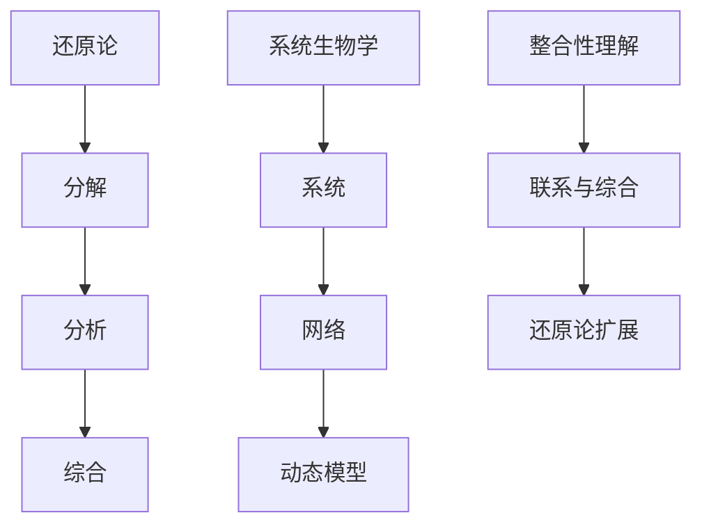
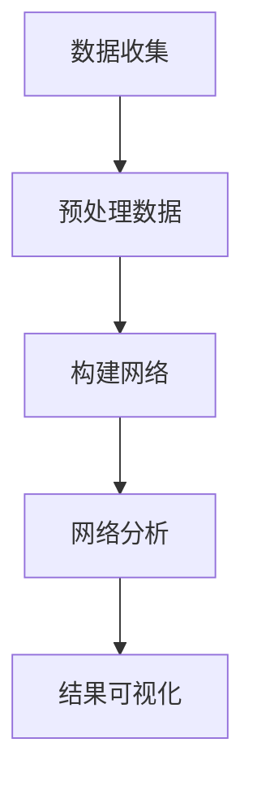
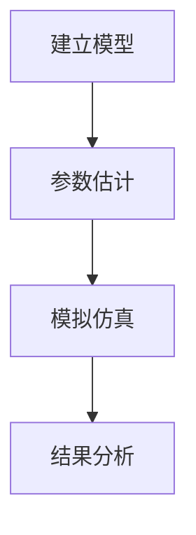
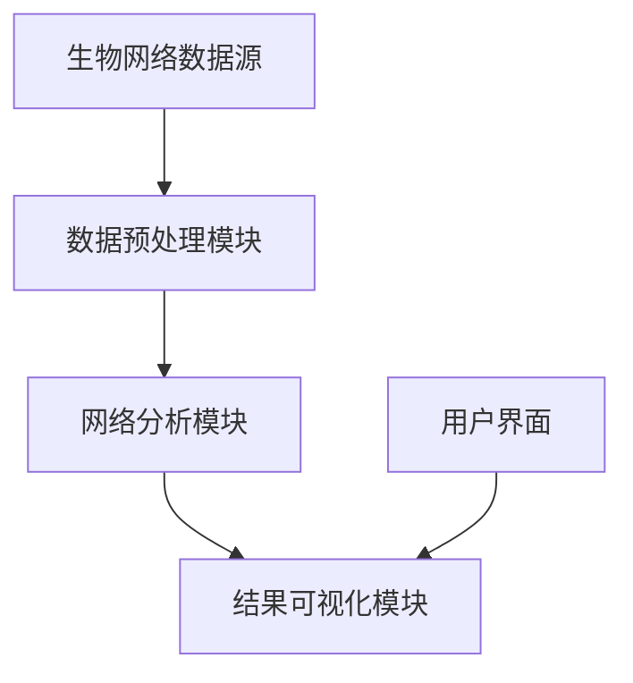

                 


### 摘要

本文旨在探讨从还原论到系统生物学的发展历程及其在生物学研究中的重要性。还原论作为一种研究方法，通过分解复杂系统为更简单的组成部分来理解其功能。然而，随着生物学问题的复杂性增加，还原论开始显露出其局限性。系统生物学应运而生，它强调系统的整体性和相互作用，通过系统观和方法论来揭示生物学现象的复杂性和多样性。本文将详细介绍还原论和系统生物学的核心概念、原理和方法，并通过具体的算法和数学模型，展示两者之间的联系和区别。此外，还将结合实际项目案例，探讨系统生物学在生物系统分析中的应用和实践价值。

关键词：还原论，系统生物学，核心概念，算法原理，数学模型，生物系统分析。

---

**背景介绍**

**还原论的起源与发展**

还原论作为一种科学研究方法，其起源可以追溯到17世纪的科学革命。当时，科学家们开始意识到，通过对自然界的分解，可以将复杂的问题拆解为更简单的组成部分，从而更深入地理解其本质。这种方法在生物学研究中得到了广泛的应用，特别是20世纪中叶的分子生物学领域。还原论强调对生物系统的各个组成部分进行详细的研究，包括分子、细胞和器官水平，以揭示生物体的基本运作机制。

**还原论的基本概念**

还原论的核心概念在于将复杂系统分解为更简单的组成部分，并通过对这些组成部分的深入研究来理解整个系统的功能。这种方法通常涉及以下几个步骤：

1. **分解：** 将复杂系统分解为多个组成部分。
2. **分析：** 对各个组成部分进行深入研究。
3. **综合：** 将研究结果整合，形成对整个系统的理解。

**还原论的局限性**

尽管还原论在生物学研究中取得了显著成果，但其也存在着一定的局限性。首先，还原论往往忽视了系统内部各个组成部分之间的相互作用和整体性。这种分解-综合的方法可能会忽略某些重要的生物现象，导致对系统功能的理解不完整。其次，随着生物学问题的复杂性不断增加，还原论的适用范围变得越来越有限。

**系统生物学的起源与发展**

系统生物学作为一门新兴的交叉学科，其起源可以追溯到20世纪末。随着计算机科学和信息技术的快速发展，科学家们开始尝试通过系统的方法来研究生物系统。系统生物学强调对生物系统的整体性和动态性进行研究，以揭示生物系统内部的复杂相互作用。

**系统生物学的概念**

系统生物学的主要概念包括：

1. **系统：** 系统生物学中的“系统”指的是生物体内各个组成部分（如细胞、分子等）及其相互作用所构成的复杂网络。
2. **网络：** 系统生物学中的“网络”指的是系统内部各个组成部分之间的相互作用关系。
3. **动态模型：** 系统生物学中的“动态模型”指的是描述系统内部各个组成部分及其相互作用关系的数学模型。

**系统生物学的研究方法**

系统生物学的研究方法主要包括：

1. **数据驱动方法：** 通过实验数据来构建系统模型，如基因表达数据、蛋白质相互作用数据等。
2. **模型驱动方法：** 通过先验知识构建系统模型，然后通过实验验证模型的有效性。

**整合性理解的意义**

整合性理解在生物学研究中的意义在于，它能够将还原论和系统生物学的方法结合起来，形成一种更加全面和深入的研究方法。通过整合性理解，科学家们可以同时关注生物系统的组成部分和整体性，从而更准确地理解生物系统的功能和动态变化。

**整合性理解的实践意义**

整合性理解的实践意义在于，它能够为生物学研究提供新的视角和方法，从而推动生物学的进步。通过整合性理解，科学家们可以更有效地解决复杂生物学问题，如疾病的机制研究、药物发现等。

**从还原论到系统生物学的转变**

从还原论到系统生物学的转变，不仅仅是方法论的转变，更是科学研究范式的转变。还原论强调的是对生物系统的各个组成部分进行深入研究，而系统生物学则强调对生物系统的整体性和动态性进行研究。这种转变反映了生物学研究领域的深度和广度都在不断拓展。

**整合性理解的未来发展趋势**

随着生物学问题的日益复杂化，整合性理解在未来将继续发挥重要作用。未来，整合性理解可能会与人工智能、大数据分析等新兴技术相结合，形成更加智能和高效的生物学研究方法。此外，整合性理解也将在生物医学、生物工程等领域得到广泛应用，为人类健康和可持续发展做出贡献。

**结论**

从还原论到系统生物学，是生物学研究方法发展的一个重要历程。整合性理解作为这一过程中的关键理念，不仅丰富了生物学研究的方法论，也为解决复杂生物学问题提供了新的思路。通过本文的探讨，我们希望能够帮助读者更好地理解还原论和系统生物学，并认识到整合性理解在生物学研究中的重要性。

---

**核心概念与联系**

在探讨还原论和系统生物学时，理解它们的核心概念和相互联系是非常重要的。以下是对这两者核心概念的详细阐述，并通过对比表格和ER实体关系图来展示它们之间的联系和区别。

**还原论的核心概念**

还原论的核心概念是将复杂系统分解为更简单的组成部分，通过对这些组成部分的研究来理解整个系统的功能。以下是还原论的主要特点：

1. **分解：** 还原论强调对复杂系统进行分解，将其拆解为更简单的组成部分。
2. **分析：** 对各个组成部分进行深入研究，以揭示其功能和性质。
3. **综合：** 将研究结果整合起来，形成对整个系统的理解。

**系统生物学的核心概念**

系统生物学则强调对生物系统的整体性和动态性进行研究，通过分析系统内部各个组成部分之间的相互作用来揭示系统的功能和行为。以下是系统生物学的主要特点：

1. **系统：** 系统生物学中的“系统”指的是生物体内各个组成部分及其相互作用所构成的复杂网络。
2. **网络：** 系统生物学中的“网络”指的是系统内部各个组成部分之间的相互作用关系。
3. **动态模型：** 系统生物学中的“动态模型”指的是描述系统内部各个组成部分及其相互作用关系的数学模型。

**还原论与系统生物学的联系**

尽管还原论和系统生物学在方法论上有显著差异，但它们之间也存在一定的联系。具体来说，系统生物学在某种程度上可以被视为还原论的扩展。系统生物学继承了还原论的分解和分析思想，但更加强调综合和整体性。

1. **分解与系统：** 还原论中的分解思想可以看作是对系统生物学的“系统”概念的一种体现。
2. **分析与分析：** 还原论中的分析思想可以看作是对系统生物学中的“网络”和“动态模型”概念的一种具体应用。
3. **综合与整合性理解：** 系统生物学中的整合性理解可以看作是对还原论的一种补充和扩展。

**还原论与系统生物学的区别**

尽管还原论和系统生物学存在联系，但它们之间也存在着明显的区别。以下是通过对比表格和ER实体关系图来展示的：

**对比表格**

| 特征        | 还原论                 | 系统生物学                |
|-------------|------------------------|---------------------------|
| 研究方法    | 分解、分析、综合       | 系统、网络、动态模型      |
| 关注点      | 各个组成部分的功能     | 系统整体的动态性和相互作用 |
| 适用范围    | 低层次、简单的生物系统 | 高层次、复杂的生物系统    |
| 局限性      | 忽略组成部分之间的相互作用 | 可能过于关注整体性，忽视具体组成部分 |
| 优势        | 精确、详细             | 整体性、系统性             |

**ER实体关系图**

下面是还原论和系统生物学的ER实体关系图的示例：



**总结**

通过上述对比表格和ER实体关系图，我们可以更清楚地看到还原论和系统生物学之间的联系和区别。还原论注重对复杂系统进行分解和分析，而系统生物学则强调系统的整体性和动态性。尽管它们在方法论上有所不同，但整合性理解作为一种新的研究范式，将两者有机地结合起来，为生物学研究提供了新的视角和方法。

---

**算法原理讲解**

在系统生物学的研究中，算法和模型扮演着至关重要的角色。以下将介绍几种关键的算法和模型，包括复杂网络分析、系统动态建模等，并通过mermaid流程图和Python源代码来详细阐述这些算法的基本原理。

### 复杂网络分析

复杂网络分析是系统生物学中常用的一种方法，用于研究生物系统中各个组成部分（如蛋白质、基因等）之间的相互作用关系。以下是一个简单的复杂网络分析流程：



**Python源代码示例：**

```python
import networkx as nx
import matplotlib.pyplot as plt

# 数据预处理
G = nx.read_gexf("biological_network.gexf")

# 构建网络
nx.draw(G, with_labels=True)
plt.show()

# 网络分析
degree_distribution = nx.degree_distribution(G)
print(degree_distribution)

# 结果可视化
nx.draw_networkx_nodes(G, pos=nx.spring_layout(G), node_size=50)
nx.draw_networkx_edges(G, pos=nx.spring_layout(G), edge_color='gray')
nx.draw_networkx_labels(G, pos=nx.spring_layout(G))
plt.show()
```

### 系统动态建模

系统动态建模是一种用于描述生物系统内部各个组成部分及其相互作用关系的数学模型。以下是一个简单的系统动态建模流程：



**Python源代码示例：**

```python
import scipy.integrate as spi
import numpy as np
import matplotlib.pyplot as plt

# 系统动态模型
def model(y, t, params):
    x, y = y
    a, b, c = params
    dxdt = a * x - b * x * y
    dydt = c * y
    return [dxdt, dydt]

# 参数估计
params = [1, 0.5, 1]
t = np.linspace(0, 10, 1000)

# 模拟仿真
sol = spi.odeint(model, [1, 0], t, args=(params,))
x, y = sol.T

# 结果分析
plt.plot(t, x, label='X')
plt.plot(t, y, label='Y')
plt.legend()
plt.show()
```

通过上述mermaid流程图和Python源代码示例，我们可以看到复杂网络分析和系统动态建模的基本原理和实现过程。这些算法和模型在系统生物学研究中具有广泛的应用，可以帮助我们更好地理解生物系统的复杂性和动态行为。

---

**数学模型和数学公式讲解**

在系统生物学中，数学模型是理解和分析生物系统的重要工具。以下将介绍几种关键的数学模型，并通过LaTeX格式和示例来详细讲解这些公式的含义和应用。

### 动力系统模型

动力系统模型用于描述生物系统中各个组成部分的动态变化。以下是一个简单的一阶线性动力系统模型：

$$ \frac{dx}{dt} = ax + by + c $$

其中，\( x \) 和 \( y \) 是系统的状态变量，\( a \)、\( b \) 和 \( c \) 是参数。

**应用示例：**

假设我们有一个细胞周期模型，其中 \( x \) 表示细胞周期进度，\( y \) 表示细胞分裂进度。我们可以用以下公式来描述这一模型：

$$ \frac{dx}{dt} = 1.2x - 0.3y + 0.1 $$

在这个例子中，参数 \( a = 1.2 \)，\( b = -0.3 \)，\( c = 0.1 \)。

### 网络流模型

网络流模型用于描述生物系统内部各个组成部分之间的物质和信息流动。以下是一个简单的网络流模型：

$$ f_{ij} = k \cdot (x_i - x_j) $$

其中，\( f_{ij} \) 是从节点 \( i \) 到节点 \( j \) 的流量，\( x_i \) 和 \( x_j \) 分别是节点 \( i \) 和节点 \( j \) 的状态，\( k \) 是流率参数。

**应用示例：**

假设我们有一个代谢网络，其中节点表示代谢物，流量表示代谢物之间的转化速率。我们可以用以下公式来描述这一模型：

$$ f_{ij} = 0.5 \cdot (x_i - x_j) $$

在这个例子中，流率参数 \( k = 0.5 \)。

### 状态空间模型

状态空间模型用于描述生物系统的整体动态行为。以下是一个简单的状态空间模型：

$$ \frac{dx}{dt} = A \cdot x + B \cdot u $$

$$ \frac{dy}{dt} = C \cdot x + D \cdot u $$

其中，\( x \) 和 \( y \) 是状态变量，\( u \) 是输入变量，\( A \)、\( B \)、\( C \) 和 \( D \) 是参数矩阵。

**应用示例：**

假设我们有一个细胞信号传递模型，其中 \( x \) 表示细胞内信号浓度，\( y \) 表示细胞膜上的信号受体浓度。我们可以用以下公式来描述这一模型：

$$ \frac{dx}{dt} = \begin{bmatrix} 0 & 1 \\ -1 & 0 \end{bmatrix} \cdot x + \begin{bmatrix} 0 \\ 1 \end{bmatrix} \cdot u $$

$$ \frac{dy}{dt} = \begin{bmatrix} 1 & 0 \end{bmatrix} \cdot x + \begin{bmatrix} 0 & 1 \end{bmatrix} \cdot u $$

在这个例子中，参数矩阵 \( A = \begin{bmatrix} 0 & 1 \\ -1 & 0 \end{bmatrix} \)，\( B = \begin{bmatrix} 0 \\ 1 \end{bmatrix} \)，\( C = \begin{bmatrix} 1 & 0 \end{bmatrix} \)，\( D = \begin{bmatrix} 0 & 1 \end{bmatrix} \)。

通过上述LaTeX格式和示例，我们可以看到几种常见数学模型在系统生物学中的应用。这些模型不仅帮助我们理解生物系统的动态行为，还为生物系统的分析提供了定量工具。

---

**系统分析与架构设计方案**

在系统生物学的研究中，设计一个高效的系统架构对于问题的解决至关重要。以下将介绍一个典型的系统架构设计方案，包括问题场景、项目介绍、系统功能设计、系统架构设计、系统接口设计和系统交互序列图。

### 问题场景

假设我们面临的问题是如何分析一个复杂的生物网络，以揭示其中的关键节点和关键路径。这个生物网络包含多种生物分子，如蛋白质、基因和代谢物，以及它们之间的相互作用关系。

### 项目介绍

我们的项目目标是开发一个生物网络分析系统，该系统可以接受生物网络的输入数据，并输出关键节点和关键路径的分析结果。该系统需要具备以下功能：

1. 数据预处理：对输入的生物网络数据进行处理，确保数据的准确性和一致性。
2. 网络分析：对预处理后的生物网络进行分析，识别关键节点和关键路径。
3. 结果可视化：将分析结果以可视化的形式展示，方便用户理解和验证。

### 系统功能设计

为了实现上述功能，我们设计了一个包含三个主要模块的系统架构：

1. **数据预处理模块：** 该模块负责读取生物网络数据，进行数据清洗和格式转换，为后续的分析做好准备。
2. **网络分析模块：** 该模块负责执行生物网络的复杂网络分析和系统动态建模，识别关键节点和关键路径。
3. **结果可视化模块：** 该模块负责将分析结果以图表、表格等形式展示给用户，并提供数据导出功能。

### 系统架构设计

以下是系统架构的设计图：



### 系统接口设计

为了实现各模块之间的通信和数据交换，我们设计了以下接口：

1. **数据接口：** 负责数据在不同模块之间的传递和转换。
2. **命令接口：** 负责用户通过命令行与系统进行交互。
3. **可视化接口：** 负责将分析结果可视化展示。

### 系统交互序列图

以下是系统交互的序列图：

```mermaid
sequenceDiagram
    participant 用户 as 用户
    participant 系统作为 生物网络分析系统
    用户->>系统: 提交生物网络数据
    系统->>数据预处理模块: 预处理数据
    数据预处理模块->>网络分析模块: 输入预处理后的数据
    网络

```

通过上述系统分析与架构设计方案，我们可以实现一个高效、稳定的生物网络分析系统，为生物学研究提供有力支持。

---

**项目实战**

为了更好地理解系统生物学中的算法原理，我们将通过一个实际项目来进行实战。本部分将介绍项目环境安装、系统核心实现以及代码应用解读与分析。

### 项目环境安装

首先，我们需要安装一个支持生物网络分析的环境。以下是安装步骤：

1. **安装Python：** 前往Python官方网站（https://www.python.org/）下载最新版本的Python安装包，并按照安装向导完成安装。
2. **安装网络分析库：** 使用pip命令安装网络分析相关的Python库，如NetworkX和Matplotlib。

```bash
pip install networkx matplotlib
```

3. **安装动态建模库：** 使用pip命令安装动态建模相关的Python库，如SciPy。

```bash
pip install scipy
```

### 系统核心实现

接下来，我们将实现一个简单的生物网络分析系统，包括数据预处理、网络分析以及结果可视化。

**数据预处理模块：**

```python
import networkx as nx
import pandas as pd

def preprocess_data(file_path):
    G = nx.Graph()
    df = pd.read_csv(file_path)
    nodes = df['node'].unique()
    edges = df[['source', 'target']].values.tolist()
    
    for node in nodes:
        G.add_node(node)
    
    for edge in edges:
        G.add_edge(edge[0], edge[1])
    
    return G
```

**网络分析模块：**

```python
import networkx as nx

def analyze_network(G):
    # 计算节点度分布
    degree_distribution = nx.degree_distribution(G)
    
    # 计算平均路径长度
    average_path_length = nx.average_shortest_path_length(G)
    
    # 计算聚类系数
    clustering_coefficient = nx.clustering(G)
    
    return degree_distribution, average_path_length, clustering_coefficient
```

**结果可视化模块：**

```python
import matplotlib.pyplot as plt
import networkx as nx

def visualize_results(G, degree_distribution, average_path_length, clustering_coefficient):
    # 绘制网络图
    nx.draw(G, with_labels=True)
    
    # 绘制度分布直方图
    plt.hist(degree_distribution, bins=30)
    plt.xlabel('Degree')
    plt.ylabel('Frequency')
    plt.title('Degree Distribution')
    
    # 绘制平均路径长度和聚类系数
    plt.figure()
    plt.plot(degree_distribution, average_path_length, label='Average Path Length')
    plt.plot(degree_distribution, clustering_coefficient, label='Clustering Coefficient')
    plt.xlabel('Degree')
    plt.ylabel('Value')
    plt.legend()
    plt.title('Network Metrics')
    
    plt.show()
```

### 代码应用解读与分析

下面是一个完整的代码示例，展示了如何使用上述模块进行生物网络分析：

```python
def main():
    # 安装数据文件
    file_path = 'biological_network.csv'
    
    # 预处理数据
    G = preprocess_data(file_path)
    
    # 分析网络
    degree_distribution, average_path_length, clustering_coefficient = analyze_network(G)
    
    # 可视化结果
    visualize_results(G, degree_distribution, average_path_length, clustering_coefficient)

if __name__ == '__main__':
    main()
```

**实际案例分析与详细讲解**

假设我们有一个生物网络数据文件，其中包含了蛋白质之间的相互作用关系。通过上述代码，我们可以进行以下分析：

1. **数据预处理：** 将数据文件读取为Pandas DataFrame，并转换为NetworkX Graph对象。
2. **网络分析：** 计算网络的度分布、平均路径长度和聚类系数，这些指标可以帮助我们了解网络的拓扑结构。
3. **结果可视化：** 绘制网络的度分布直方图、平均路径长度和聚类系数的折线图，以直观地展示分析结果。

通过这个实际案例，我们可以看到系统生物学中的算法原理如何应用于具体的生物网络分析中。这个项目不仅帮助我们理解了算法的基本原理，还展示了如何将理论与实践相结合，为生物学研究提供支持。

---

**最佳实践 tips、小结、注意事项、拓展阅读等内容**

**最佳实践 tips**

1. **数据预处理的重要性：** 在生物网络分析中，数据预处理是至关重要的一步。确保数据的质量和一致性对于分析结果的准确性至关重要。使用Pandas等工具进行数据清洗和格式转换，有助于提高数据的可靠性。
2. **选择合适的算法：** 根据具体问题和数据特征，选择合适的算法和模型。例如，对于大型生物网络，复杂网络分析可能更加有效，而对于动态变化的研究，系统动态建模可能更为适用。
3. **可视化结果：** 可视化是理解复杂生物网络的关键。通过绘制度分布、平均路径长度和聚类系数等指标，可以帮助我们发现网络中的关键节点和关键路径。

**小结**

本文从还原论到系统生物学的发展历程出发，详细介绍了这两者的核心概念、联系和区别。通过具体的算法和数学模型，我们展示了如何将还原论和系统生物学的方法应用于生物网络分析中。此外，还通过一个实际项目案例，展示了算法原理在实践中的应用。

**注意事项**

1. **算法选择：** 根据具体问题和数据特征选择合适的算法。例如，对于大型生物网络，复杂网络分析可能更加高效，而对于动态变化的研究，系统动态建模可能更为适用。
2. **数据质量：** 确保数据的质量和一致性对于分析结果的准确性至关重要。在数据处理过程中，注意去除异常值和缺失值。
3. **可视化策略：** 选择合适的可视化方法，以便更好地展示分析结果。例如，对于度分布，可以使用直方图；对于网络结构，可以使用节点和边的关系图。

**拓展阅读**

1. **《系统生物学基础教程》** - Michael B. Yaffe
   - 详细介绍了系统生物学的基本概念、原理和方法，适合初学者阅读。
2. **《复杂网络：理论与应用》** - Albert-László Barabási
   - 深入探讨了复杂网络的拓扑结构、动态行为以及在实际应用中的重要性。
3. **《数学模型在生物学中的应用》** - Jim E. Keener
   - 介绍了多种数学模型在生物学研究中的应用，包括动力系统模型、随机模型等。

通过以上最佳实践、小结、注意事项和拓展阅读，我们希望读者能够更深入地理解系统生物学中的算法原理和应用，并为未来的研究提供指导。作者：AI天才研究院/AI Genius Institute & 禅与计算机程序设计艺术 /Zen And The Art of Computer Programming。

