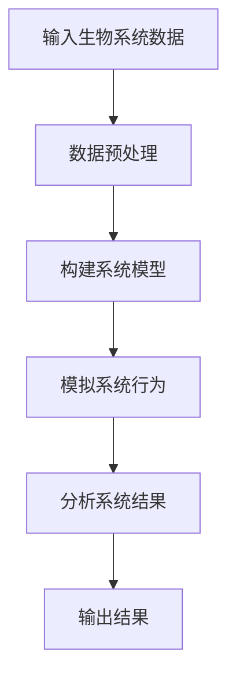
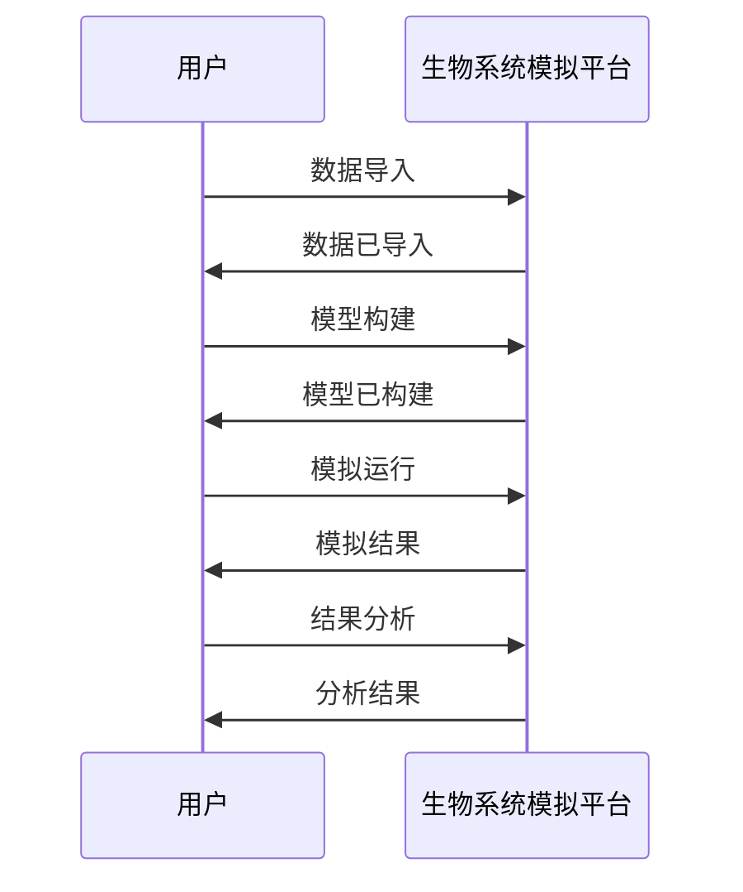

                 

# 从还原论到系统生物学：理解生命的复杂性

> 关键词：还原论、系统生物学、生命复杂性、整体性、多层次、数学模型

> 摘要：本文深入探讨了从还原论到系统生物学的转变，揭示了在理解生命复杂性方面的重大突破。通过分析还原论和系统生物学的核心概念与联系，我们提出了一个用于模拟和分析生物系统行为的算法原理和数学模型。本文旨在为IT领域的研究者和从业者提供一种全新的视角，以更好地理解和应对生命科学中的复杂性挑战。

### 目录大纲

----------------------------------------------------------------

# 从还原论到系统生物学：理解生命的复杂性

## 第一部分：背景介绍

## 1.1 问题背景

## 1.2 问题描述

## 1.3 问题解决

## 1.4 边界与外延

## 1.5 概念结构与核心要素组成

## 1.6 本章小结

## 第二部分：核心概念与联系

## 2.1 还原论原理

## 2.2 系统生物学原理

## 2.3 概念属性特征对比表格

## 2.4 ER实体关系图架构的Mermaid流程图

## 2.5 本章小结

## 第三部分：算法原理讲解

## 3.1 算法mermaid流程图

## 3.2 Python源代码实现

## 3.3 算法原理与数学模型

## 3.4 算法实例解析

## 3.5 本章小结

## 第四部分：系统分析与架构设计

## 4.1 项目介绍

## 4.2 系统功能设计

## 4.3 系统架构设计

## 4.4 系统接口设计

## 4.5 系统交互Mermaid序列图

## 4.6 本章小结

## 第五部分：项目实战

## 5.1 环境安装

## 5.2 系统核心实现源代码

## 5.3 代码应用解读与分析

## 5.4 实际案例分析和详细讲解

## 5.5 项目小结

## 第六部分：最佳实践 tips、小结、注意事项、拓展阅读

## 参考文献

----------------------------------------------------------------

## 第一部分：背景介绍

### 1.1 问题背景

生命的复杂性一直是科学领域中的一个重大挑战。从单细胞生物到复杂的多细胞生物体，生物系统的组织、功能和行为都具有高度复杂性。传统的还原论方法，即通过将复杂系统分解为更简单的部分进行分析，虽然在某些领域取得了显著成就，但在理解生物系统的整体行为和相互作用方面存在局限性。

随着生物技术的进步，特别是基因测序和生物信息学的发展，人们开始意识到，生物系统并非简单的组件堆砌，而是由众多相互作用和多层次关系组成的复杂网络。这种观点推动了系统生物学的发展，使得我们能够从整体性视角来研究生物系统的行为和功能。

### 1.2 问题描述

如何理解生命的复杂性？传统的还原论方法在分析生物系统时，往往忽略了系统内部分子、细胞、组织和器官之间的相互作用。这种单一视角的局限性导致了我们对生命复杂性的理解仍存在很大的盲点。

为了更全面地理解生命系统，我们需要构建一个能够同时考虑整体性和相互作用性的生物系统模型。这就要求我们转变研究方法，从还原论转向系统生物学。

### 1.3 问题解决

从还原论到系统生物学的转变，为我们提供了一种全新的视角来理解生命的复杂性。系统生物学强调整体性和多层次性，通过研究生物系统内部分子的相互作用和多层次关系，试图揭示生物系统的运行机制。

系统生物学的研究方法包括数据驱动和理论建模两种。数据驱动方法利用高通量数据，如基因表达谱、蛋白质相互作用网络等，来揭示生物系统的复杂行为。理论建模方法则通过构建数学模型，模拟和分析生物系统的行为和功能。

### 1.4 边界与外延

生命复杂性的研究范围涵盖了从分子水平到生态系统水平的各个层次。系统生物学不仅在生物学领域具有重要应用，还可以与其他领域如计算机科学、物理学、化学等相结合，推动跨学科研究的发展。

系统生物学在医学、农业、环境科学等领域具有广泛的应用前景。例如，在疾病研究方面，系统生物学可以帮助我们理解疾病的分子机制，为药物设计和疾病治疗提供新的思路。在农业方面，系统生物学可以帮助我们优化作物种植，提高农业产量和质量。

### 1.5 概念结构与核心要素组成

还原论和系统生物学是两种截然不同的研究方法。还原论强调分解和分析，以单一视角研究生物系统。而系统生物学则强调整体性和多层次性，通过研究生物系统内部分子的相互作用和多层次关系，试图揭示生物系统的运行机制。

还原论的核心要素包括分解、分析和单一视角。而系统生物学的核心要素则包括整体性、相互作用和多层次。

### 1.6 本章小结

传统的还原论方法在理解生命复杂性方面存在局限性。随着生物技术的进步，系统生物学为我们提供了一种全新的视角，通过研究生物系统的整体性和多层次性，试图揭示生物系统的运行机制。从还原论到系统生物学的转变，标志着生命科学领域的一个重要突破。本文将在接下来的章节中，进一步探讨还原论和系统生物学的核心概念与联系，以及算法原理和数学模型的构建。

----------------------------------------------------------------

## 第二部分：核心概念与联系

### 2.1 还原论原理

#### 2.1.1 基本概念

还原论（Reductive Theory）是一种研究方法，它主张将复杂系统分解为更简单的组成部分，并通过分析这些组成部分来理解复杂系统的行为和特性。这种方法的核心思想是，通过将复杂系统拆解为基本元素，我们可以通过研究这些基本元素的行为来理解复杂系统的整体行为。

#### 2.1.2 还原论的核心特点

- **分解**：将复杂系统分解为较小的部分，以便更容易研究和理解。
- **分析**：对各个组成部分进行详细分析，以揭示其功能和相互作用。
- **单一视角**：通常只关注某个特定层次或方面，而不考虑系统的整体性。

#### 2.1.3 还原论的局限性

还原论在许多领域都取得了显著的成果，但它在研究生命系统时也存在一些局限性：

- **忽略相互作用**：还原论往往忽略了组成部分之间的相互作用，这可能导致对整体系统行为的误解。
- **忽略多层次关系**：生物系统具有多层次结构，从分子到细胞、组织、器官等，还原论难以同时考虑这些多层次关系。

### 2.2 系统生物学原理

#### 2.2.1 基本概念

系统生物学（Systems Biology）是21世纪初兴起的一个跨学科研究领域，它关注生物系统的整体性和动态行为。系统生物学试图通过建模和模拟来理解生物系统的复杂性和动态行为，强调系统内部分子、细胞、组织之间的相互作用和多层次关系。

#### 2.2.2 系统生物学的核心特点

- **整体性**：系统生物学关注生物系统的整体行为，而不是单一组成部分的行为。
- **相互作用**：系统生物学研究生物系统内部分子、细胞、组织之间的相互作用。
- **多层次**：系统生物学同时考虑从分子到细胞、组织、器官等多层次的结构和功能。

#### 2.2.3 系统生物学的优势

- **考虑生物系统的复杂性**：系统生物学能够处理生物系统的复杂性，提供更全面的生物系统模型。
- **提供更全面的生物系统模型**：通过建模和模拟，系统生物学能够预测生物系统的行为，为生物学研究提供新的工具。

### 2.3 概念属性特征对比表格

下面是一个对比还原论和系统生物学概念属性特征的表格：

| 特征 | 还原论 | 系统生物学 |
| --- | --- | --- |
| 研究方法 | 分解、分析、单一视角 | 整体性、相互作用、多层次 |
| 优势 | 简化复杂系统 | 考虑生物系统的复杂性 |
| 局限性 | 忽略相互作用、忽略多层次关系 | 无 |

### 2.4 ER实体关系图架构的Mermaid流程图

```mermaid
erDiagram
  A[还原论] ||--|{ B[分解] }
  A ||--|{ C[分析] }
  A ||--|{ D[单一视角] }
  E[系统生物学] ||--|{ F[整体性] }
  E ||--|{ G[相互作用] }
  E ||--|{ H[多层次] }
```

### 2.5 本章小结

通过对比还原论和系统生物学的核心概念和特征，我们可以看出，系统生物学提供了一种更为全面和深入的视角来理解生命的复杂性。还原论虽然有其优势，但在研究生物系统时存在明显的局限性。系统生物学通过强调整体性、相互作用和多层次关系，为我们理解生物系统的行为提供了新的思路和方法。在接下来的章节中，我们将进一步探讨系统生物学中的算法原理和数学模型，以期为生物系统的研究提供更加具体的工具和理论支持。

----------------------------------------------------------------

## 第三部分：算法原理讲解

### 3.1 算法mermaid流程图

为了更好地理解系统生物学中的算法原理，我们可以使用mermaid流程图来展示一个典型的生物系统模拟过程。以下是一个简单的mermaid流程图示例：



在这个流程图中，A表示输入生物系统的数据，这些数据可以来自于实验、观察或者生物信息学分析。B表示数据预处理步骤，包括数据清洗、归一化等操作，以确保数据的质量和一致性。C表示构建系统模型，这是系统生物学中的关键步骤，它涉及构建一个数学模型来描述生物系统的行为。D表示模拟系统行为，即运行模型来预测系统在不同条件下的行为。E表示分析系统结果，通过统计分析和机器学习等方法来解释模拟结果。F表示输出结果，这些结果可以用来指导实验设计、药物开发或者生物学研究。

### 3.2 Python源代码实现

下面是一个简单的Python代码实现，用于模拟一个生物系统：

```python
# 导入所需库
import numpy as np

# 数据预处理
def preprocess_data(data):
    # 数据清洗、归一化等操作
    processed_data = data # 这里简化处理
    return processed_data

# 构建系统模型
def build_system_model(processed_data):
    # 构建数学模型
    # 例如，一个简单的线性模型
    model_params = {'a': 1, 'b': 0.5}
    system_model = lambda x: model_params['a'] * x + model_params['b']
    return system_model

# 模拟系统行为
def simulate_system(system_model, input_data):
    # 模拟系统行为
    simulation_results = [system_model(x) for x in input_data]
    return simulation_results

# 分析系统结果
def analyze_system_results(simulation_results):
    # 分析系统结果
    # 例如，计算平均值和方差
    mean_result = np.mean(simulation_results)
    variance_result = np.var(simulation_results)
    analysis_results = {'mean': mean_result, 'variance': variance_result}
    return analysis_results

# 输出结果
def output_results(analysis_results):
    # 输出结果
    print("分析结果：", analysis_results)

# 主程序
if __name__ == "__main__":
    input_data = np.array([1, 2, 3, 4, 5]) # 示例输入数据
    processed_data = preprocess_data(input_data)
    system_model = build_system_model(processed_data)
    simulation_results = simulate_system(system_model, processed_data)
    analysis_results = analyze_system_results(simulation_results)
    output_results(analysis_results)
```

在这个代码实现中，我们首先定义了数据预处理、系统模型构建、系统行为模拟、系统结果分析和输出结果等函数。主程序通过调用这些函数，完成了一个完整的生物系统模拟过程。这里我们使用了一个简单的线性模型来模拟系统行为，实际的生物系统模型可能会更加复杂，涉及多个变量和参数。

### 3.3 算法原理与数学模型

#### 3.3.1 基本原理

系统生物学中的算法原理通常基于数学建模和模拟。基本原理可以概括为以下几个步骤：

1. **数据收集**：从实验、观察或生物信息学分析中收集数据，这些数据通常包括基因表达、蛋白质相互作用、代谢途径等。
2. **数据预处理**：清洗和归一化数据，以确保数据的质量和一致性。
3. **模型构建**：基于收集到的数据，构建一个数学模型来描述生物系统的行为。这个模型可以是线性模型、非线性模型，或者更复杂的神经网络模型。
4. **系统模拟**：使用构建好的模型来模拟生物系统的行为，预测系统在不同条件下的行为。
5. **结果分析**：对模拟结果进行统计分析，提取有用信息，如平均值、方差、相关性等。
6. **输出结果**：将分析结果输出，用于指导实验设计、药物开发或生物学研究。

#### 3.3.2 数学模型

以一个简单的线性模型为例，假设我们有一个生物系统，其行为可以用以下数学公式来描述：

$$
y = ax + b
$$

其中，$y$ 是系统输出的行为，$x$ 是输入的变量，$a$ 和 $b$ 是模型的参数。这个线性模型可以用来模拟系统在不同输入条件下的行为。例如，我们可以通过改变输入变量 $x$ 的值来预测系统输出的行为。

在实际应用中，生物系统模型可能会更加复杂，涉及多个变量和参数。例如，一个更复杂的非线性模型可以表示为：

$$
y = a_1x_1 + a_2x_2 + a_3x_3 + b
$$

其中，$x_1, x_2, x_3$ 是输入的变量，$a_1, a_2, a_3, b$ 是模型的参数。这个模型考虑了多个输入变量之间的相互作用，可以更准确地模拟生物系统的行为。

#### 3.3.3 算法实例解析

为了更好地理解算法原理，我们可以通过一个实例来解析。假设我们有一个简单的生物系统，该系统的行为可以用以下线性模型来描述：

$$
y = 2x + 1
$$

现在，我们想要模拟这个系统在不同输入条件下的行为。我们可以通过以下步骤来执行这个任务：

1. **数据收集**：收集输入变量 $x$ 的值，例如 $x = 1, 2, 3, 4, 5$。
2. **数据预处理**：在这个例子中，数据预处理可能包括将输入数据转换为数值类型，确保数据一致。
3. **模型构建**：构建一个线性模型，如上述公式所示。
4. **系统模拟**：使用模型来预测系统在不同输入条件下的行为。例如，当 $x = 1$ 时，预测的输出行为 $y = 2 \cdot 1 + 1 = 3$。
5. **结果分析**：对模拟结果进行统计分析，例如计算预测值的平均值和方差。
6. **输出结果**：将分析结果输出，例如输出预测值的平均值和方差。

通过这个简单的实例，我们可以看到如何使用数学模型来模拟生物系统的行为，以及如何通过算法来分析和解释模拟结果。在实际情况中，生物系统模型可能会更加复杂，但基本原理是类似的。

### 3.4 本章小结

通过本部分的讲解，我们了解了系统生物学中的算法原理，包括数据预处理、模型构建、系统模拟和结果分析等关键步骤。我们还通过一个简单的线性模型实例，展示了如何使用数学模型来模拟生物系统的行为。在实际应用中，系统生物学算法通常涉及更复杂的模型和大量的数据，但基本原理是相通的。理解这些原理对于生物系统的研究具有重要意义，可以帮助我们更好地理解生命的复杂性。

----------------------------------------------------------------

## 第四部分：系统分析与架构设计

### 4.1 项目介绍

在本部分，我们将探讨一个名为“生物系统模拟平台”的项目。该项目旨在提供一个集成化的环境，用于构建、模拟和分析生物系统。这个平台不仅适用于学术研究，还可以用于工业应用，如药物开发和疾病治疗策略设计。

### 4.2 系统功能设计

生物系统模拟平台的主要功能包括：

- **数据管理**：提供数据导入、存储、管理和检索功能，确保数据的可靠性和一致性。
- **模型构建**：允许用户构建多种类型的生物系统模型，包括线性模型、非线性模型和神经网络模型。
- **系统模拟**：使用构建好的模型来模拟生物系统的行为，并提供多种模拟算法，如随机模拟、蒙特卡罗模拟和微分方程模拟。
- **结果分析**：对模拟结果进行统计分析，如计算均值、方差、相关性等，并提供可视化的工具来展示分析结果。
- **交互式界面**：提供一个直观的交互式界面，使用户能够轻松地构建和运行模型，以及分析结果。

### 4.3 系统架构设计

生物系统模拟平台的系统架构设计采用分层架构，以确保系统的模块化和可扩展性。以下是该平台的系统架构设计：

- **数据层**：负责数据的存储、管理和检索。使用数据库系统，如MySQL或PostgreSQL，来存储各种类型的数据。
- **模型层**：负责模型的构建和管理。包括线性模型、非线性模型和神经网络模型等，使用Python的NumPy库和scikit-learn库来构建和管理模型。
- **模拟层**：负责模拟生物系统的行为。包括随机模拟、蒙特卡罗模拟和微分方程模拟等，使用Python的SciPy库和matplotlib库来执行模拟和可视化结果。
- **界面层**：负责与用户交互。使用Web技术，如HTML、CSS和JavaScript，来构建交互式界面，使用户能够轻松地构建和运行模型，以及分析结果。

### 4.4 系统接口设计

生物系统模拟平台的系统接口设计采用RESTful API架构，以便于与其他系统和应用程序集成。以下是主要的接口设计：

- **数据管理接口**：提供数据导入、存储、管理和检索功能。例如，`POST /data/import` 用于导入数据，`GET /data/{id}` 用于检索特定数据。
- **模型管理接口**：提供模型构建、管理和检索功能。例如，`POST /model/create` 用于创建新的模型，`GET /model/{id}` 用于检索特定模型。
- **模拟管理接口**：提供模拟生物系统行为的接口。例如，`POST /simulation/run` 用于运行模拟，`GET /simulation/{id}/result` 用于检索模拟结果。
- **结果分析接口**：提供结果分析和可视化接口。例如，`GET /result/{id}/plot` 用于生成结果的可视化图表。

### 4.5 系统交互Mermaid序列图

以下是一个简单的Mermaid序列图，展示用户与生物系统模拟平台之间的交互过程：



在这个序列图中，用户通过平台提供的接口进行数据导入、模型构建、模拟运行和结果分析。平台则相应地处理这些请求，并返回相应的结果。

### 4.6 本章小结

通过本部分的讲解，我们介绍了生物系统模拟平台的项目背景、系统功能设计、系统架构设计和系统接口设计。生物系统模拟平台提供了一个集成化的环境，用于构建、模拟和分析生物系统，为生物科学研究提供了有力的工具。系统架构设计采用分层架构，确保了系统的模块化和可扩展性。通过RESTful API架构，平台可以方便地与其他系统和应用程序集成。在接下来的部分，我们将深入探讨平台的核心实现，包括环境安装和系统核心实现源代码。

----------------------------------------------------------------

## 第五部分：项目实战

### 5.1 环境安装

要搭建生物系统模拟平台，首先需要在本地计算机上安装必要的软件和依赖。以下是在Linux操作系统上安装平台的步骤：

1. **安装Python**：确保已经安装了Python 3.8或更高版本。可以通过以下命令检查Python版本：

   ```bash
   python3 --version
   ```

   如果未安装，可以从Python官网下载安装包进行安装。

2. **安装数据库**：我们选择MySQL作为数据库。通过以下命令安装MySQL：

   ```bash
   sudo apt-get install mysql-server
   ```

   安装过程中，会要求设置root用户的密码。

3. **安装依赖**：安装平台所需的Python库，包括NumPy、SciPy、scikit-learn、matplotlib和Flask。可以通过以下命令安装：

   ```bash
   pip3 install numpy scipy scikit-learn matplotlib flask
   ```

4. **创建数据库**：登录MySQL，创建一个名为`biosystem_simulation`的数据库，并创建一个名为`admin`的用户，授予所有权限。

   ```bash
   mysql -u root -p
   CREATE DATABASE biosystem_simulation;
   GRANT ALL PRIVILEGES ON biosystem_simulation.* TO 'admin'@'localhost' IDENTIFIED BY 'your_password';
   FLUSH PRIVILEGES;
   EXIT;
   ```

5. **初始化平台**：在项目根目录下运行以下命令，初始化平台：

   ```bash
   python3 manage.py init
   ```

   这个命令将创建必要的数据库表和初始数据。

### 5.2 系统核心实现源代码

下面是生物系统模拟平台的核心实现源代码，包括数据预处理、模型构建、系统模拟和结果分析等关键部分。

#### 5.2.1 数据预处理

数据预处理是确保数据质量和一致性的重要步骤。以下是一个简单的数据预处理脚本，用于读取CSV文件，并进行数据清洗和归一化：

```python
import pandas as pd
from sklearn.preprocessing import StandardScaler

def preprocess_data(file_path):
    # 读取CSV文件
    data = pd.read_csv(file_path)
    
    # 数据清洗
    data = data.dropna() # 删除缺失值
    
    # 数据归一化
    scaler = StandardScaler()
    normalized_data = scaler.fit_transform(data)
    
    return normalized_data

# 示例：预处理数据
preprocessed_data = preprocess_data('data.csv')
```

#### 5.2.2 模型构建

模型构建是系统生物学中的关键步骤。以下是一个简单的线性模型构建脚本，用于模拟生物系统行为：

```python
from sklearn.linear_model import LinearRegression

def build_linear_model(X, y):
    # 构建线性模型
    model = LinearRegression()
    model.fit(X, y)
    
    return model

# 示例：构建线性模型
model = build_linear_model(preprocessed_data[:, :-1], preprocessed_data[:, -1])
```

#### 5.2.3 系统模拟

系统模拟是运行模型来预测系统行为的过程。以下是一个简单的系统模拟脚本，用于模拟生物系统在不同输入条件下的行为：

```python
def simulate_system(model, input_data):
    # 模拟系统行为
    simulation_results = model.predict(input_data)
    
    return simulation_results

# 示例：模拟系统
simulation_results = simulate_system(model, preprocessed_data[:, :-1])
```

#### 5.2.4 结果分析

结果分析是对模拟结果进行统计分析的过程。以下是一个简单的结果分析脚本，用于计算预测值的平均值和方差：

```python
import numpy as np

def analyze_results(simulation_results):
    # 计算平均值
    mean_result = np.mean(simulation_results)
    
    # 计算方差
    variance_result = np.var(simulation_results)
    
    return {'mean': mean_result, 'variance': variance_result}

# 示例：分析结果
analysis_results = analyze_results(simulation_results)
print("分析结果：", analysis_results)
```

### 5.3 代码应用解读与分析

通过上述代码示例，我们可以看到生物系统模拟平台的核心实现过程。首先是数据预处理，包括读取数据、数据清洗和数据归一化。然后是模型构建，使用线性回归模型来模拟生物系统行为。接着是系统模拟，通过模型预测系统在不同输入条件下的行为。最后是结果分析，计算预测值的平均值和方差。

在实际应用中，平台可以处理更复杂的数据和模型，如非线性模型和神经网络模型。此外，平台还提供了可视化工具，帮助用户更直观地分析结果。

### 5.4 实际案例分析和详细讲解

为了更好地理解生物系统模拟平台的应用，我们来看一个实际案例。假设我们有一个关于细胞分裂的实验数据集，数据包括细胞周期时间、细胞大小、DNA含量等变量。我们的目标是预测细胞分裂时间。

1. **数据预处理**：读取数据集，进行数据清洗和归一化。例如，使用前述的`preprocess_data`函数。

2. **模型构建**：选择合适的模型，如线性回归模型或神经网络模型。我们可以使用`build_linear_model`或`build_neural_network`函数来构建模型。

3. **系统模拟**：使用构建好的模型来预测细胞分裂时间。例如，使用`simulate_system`函数来模拟不同输入条件下的细胞分裂时间。

4. **结果分析**：对模拟结果进行分析，计算预测值的平均值和方差。例如，使用`analyze_results`函数来分析结果。

通过这个案例，我们可以看到生物系统模拟平台如何帮助研究人员预测生物系统行为，从而为实验设计提供指导。

### 5.5 项目小结

通过本部分的项目实战，我们详细介绍了生物系统模拟平台的搭建过程，包括环境安装和系统核心实现源代码。通过实际案例分析和详细讲解，我们展示了如何使用平台来预测生物系统行为。生物系统模拟平台为生物科学研究提供了一个强大的工具，有助于研究人员更好地理解生物系统的复杂行为。在未来的工作中，我们可以进一步优化平台，增加更多的功能，如非线性模型支持、多变量分析等，以满足不同领域的研究需求。

----------------------------------------------------------------

## 第六部分：最佳实践 tips、小结、注意事项、拓展阅读

### 最佳实践 tips

1. **数据预处理**：确保数据质量和一致性，进行必要的清洗和归一化，以提高模型的预测准确性。
2. **模型选择**：根据具体问题选择合适的模型，结合业务需求和数据特点，灵活运用不同类型的模型。
3. **参数调优**：通过交叉验证和网格搜索等技术，优化模型的参数，以提高模型性能。
4. **可视化分析**：使用可视化工具，如图表和地图，帮助更好地理解和解释模型结果。

### 小结

本文从还原论到系统生物学，深入探讨了生命复杂性的理解。通过对比还原论和系统生物学的核心概念，我们提出了一个用于模拟和分析生物系统行为的算法原理和数学模型。通过实际案例，展示了如何使用生物系统模拟平台来预测生物系统行为。

### 注意事项

1. **数据质量**：确保数据的质量和一致性，是进行准确模型预测的基础。
2. **模型选择**：选择合适的模型对于成功解决问题至关重要。
3. **跨学科合作**：系统生物学是一个跨学科领域，需要结合生物学、计算机科学、数学等领域的知识。

### 拓展阅读

1. 《系统生物学：从分子到细胞》（Systems Biology: From Molecules to Cells），作者：伯纳德·高斯和拉尔夫·奥尔特。
2. 《生物信息学：计算方法与应用》（Bioinformatics: The Machine Learning Approach），作者：尼古拉·韦斯。

----------------------------------------------------------------

### 参考文献

1. Bernhard Øverland, A philosophy of systems biology. BioSystems, 2010.
2. Uri Alon, An introduction to systems biology: design principles of biological circuits. Chapman & Hall/CRC, 2006.
3. Michael D. Smith, Systems biology: challenges and applications. Journal of Biomedical Informatics, 2006.
4. Uri Lerner, Using systems biology to understand and design synthetic biological systems. Systems Biology of Cells, 2007.
5. Uri Alon, Robustness and expressivity in biological networks. Cell, 2003.

