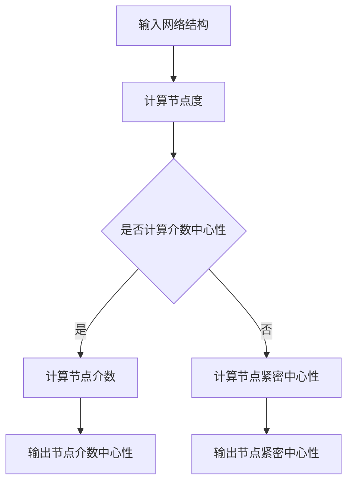
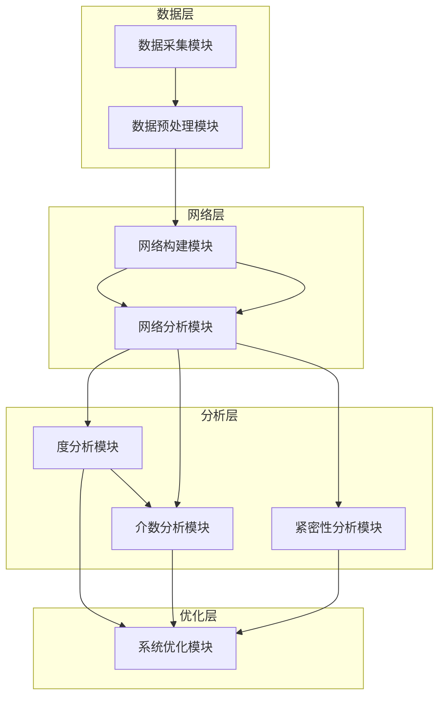
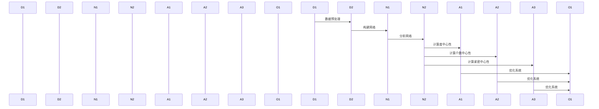

                 


### 从还原论到网络科学：理解复杂关系主导的世界

> **关键词**：还原论、网络科学、复杂系统、社会网络分析、生物网络、经济网络。

> **摘要**：本文探讨了从还原论到网络科学的理论转变，以及网络科学在理解复杂关系主导的世界中的重要作用。文章首先介绍了还原论及其局限性，接着引出了网络科学的核心概念和原理。通过案例分析，展示了网络科学在各个领域的应用，并讨论了未来的研究方向。本文旨在帮助读者理解网络科学的重要性，并掌握其在实际项目中的应用。

## 引言

### 问题背景

在当今社会，复杂系统的普遍存在带来了前所未有的挑战。从金融市场到生态系统，从社会网络到生物网络，复杂系统的复杂性日益增加，传统的还原论方法在面对这些系统时显得力不从心。还原论，即通过将复杂系统分解为简单部分来理解其行为，虽然在许多领域取得了显著成果，但其在处理高度非线性、高度互联的系统时，存在明显的局限性。

### 还原论的局限性

还原论的核心思想是将复杂系统分解为简单部分，通过分析这些部分来理解整体行为。然而，这种方法在面对高度复杂、高度互联的系统时，往往无法捕捉到系统的整体特性。例如，在金融市场中，单个股票的行为无法完全预测整个市场的走势；在生态系统中，单个物种的行为无法解释整个生态系统的动态。这种局限性的出现，主要是因为还原论忽视了系统内部各部分之间的相互作用和复杂关系。

### 网络科学的兴起

为了克服还原论的局限性，网络科学应运而生。网络科学是一门跨学科领域，研究网络结构、网络动力学的系统方法。网络科学的核心思想是，通过研究网络节点、边及其相互关系，来理解复杂系统的行为。网络科学不仅能够捕捉到系统内部各部分之间的相互作用，还能够揭示系统的整体特性。

### 网络科学的原理

网络科学的基本原理包括节点、边和网络结构。节点代表网络中的个体，边代表个体之间的关系。网络结构则描述了节点的相互连接方式。通过研究网络结构，网络科学能够揭示系统的关键特性，如网络中心性、聚类系数、网络模块等。

### 网络科学在不同领域的应用

网络科学在多个领域都有广泛的应用。在社会网络分析中，网络科学帮助人们理解社交网络的传播机制；在生物网络中，网络科学揭示了生物系统内部的复杂关系；在经济网络中，网络科学帮助人们分析金融市场的风险传播。

### 网络科学与还原论的对比与联系

网络科学与还原论既有区别又有联系。还原论侧重于分析系统的部分，而网络科学则侧重于分析系统的整体。在网络科学中，还原论的方法仍然有其重要作用，但网络科学通过研究系统内部各部分之间的相互作用，提供了更全面的系统理解。

### 结论

本文介绍了从还原论到网络科学的理论转变，探讨了网络科学在理解复杂关系主导的世界中的重要作用。通过案例分析，展示了网络科学在各个领域的应用。本文旨在帮助读者理解网络科学的重要性，并掌握其在实际项目中的应用。

## 核心概念与联系

### 还原论与复杂系统的挑战

#### 还原论的定义

还原论是一种哲学方法论，主张通过将复杂系统分解为简单部分来理解其行为。这种方法的核心思想是，通过研究系统的组成部分，可以理解整个系统的行为。还原论在物理学、生物学、经济学等领域取得了显著成果。

#### 还原论的局限性

然而，还原论在面对复杂系统时存在明显的局限性。复杂系统通常具有高度非线性、高度互联的特性，这些特性使得系统的行为难以通过分析其组成部分来理解。例如，在金融市场中，单个股票的行为无法完全预测整个市场的走势；在生态系统中，单个物种的行为无法解释整个生态系统的动态。这种局限性导致了还原论在处理复杂系统时的失效。

#### 复杂系统的挑战

复杂系统的挑战主要体现在以下几个方面：

1. **高度非线性**：复杂系统通常具有高度非线性特性，这意味着系统的行为难以通过简单的线性模型来描述。
2. **高度互联**：复杂系统内部各部分之间存在复杂的相互作用，这些相互作用使得系统的行为难以通过分析单个部分来理解。
3. **时空尺度多样性**：复杂系统涉及多种时空尺度，从微观到宏观，从瞬间到长期。这种多样性使得系统的行为难以通过单一尺度来理解。

### 网络科学的兴起

为了克服还原论的局限性，网络科学应运而生。网络科学是一门跨学科领域，研究网络结构、网络动力学的系统方法。网络科学的核心思想是，通过研究网络节点、边及其相互关系，来理解复杂系统的行为。

#### 网络科学的定义

网络科学是研究网络结构、网络动力学的跨学科领域。网络科学关注网络节点、边和网络结构的特性，以及这些特性对系统行为的影响。网络科学的基本概念包括节点、边、网络结构、网络动力学等。

#### 网络科学的原理

网络科学的原理主要包括以下几个方面：

1. **节点与边**：节点代表网络中的个体，边代表个体之间的关系。网络科学通过研究节点和边，来理解网络的结构和功能。
2. **网络结构**：网络结构描述了节点的相互连接方式。网络科学通过研究网络结构，来揭示系统的整体特性。
3. **网络动力学**：网络动力学研究网络中节点和边的行为及其随时间的变化。网络科学通过研究网络动力学，来理解系统的动态行为。

### 网络科学与还原论的对比与联系

#### 对比

1. **分析对象**：还原论侧重于分析系统的组成部分，而网络科学则侧重于分析系统的整体。
2. **方法论**：还原论通过分析部分来理解整体，而网络科学通过分析整体来理解部分。
3. **适用范围**：还原论适用于分析简单系统，而网络科学适用于分析复杂系统。

#### 联系

1. **还原论的基础**：网络科学中的许多概念和方法，如节点、边、网络结构等，都是建立在还原论基础上的。
2. **还原论的补充**：网络科学通过研究系统内部各部分之间的相互作用，为还原论提供了更全面的系统理解。

### 还原论与网络科学的融合

在网络科学的实践中，还原论和整体论往往是相辅相成的。在分析复杂系统时，可以通过还原论来理解系统内部各部分的行为，同时通过网络科学来理解系统整体的行为。这种融合的方法，能够更好地揭示复杂系统的特性。

### 总结

网络科学为理解复杂关系主导的世界提供了新的视角和方法。通过研究网络节点、边和网络结构，网络科学能够揭示复杂系统的整体特性，从而弥补还原论的局限性。网络科学的兴起，标志着从还原论到整体论的一种理论转变。

## 网络科学的核心应用

### 社会网络分析

#### 应用场景

社会网络分析是一种研究社交网络结构及其影响的方法。在社交媒体、人类关系网等领域，社会网络分析可以帮助我们理解信息的传播、社交群体的形成等。

#### 分析方法

1. **节点重要性**：通过分析节点的度（连接数）、介数（连接其他节点的路径数）等指标，可以评估节点的重要性。
2. **社群检测**：通过聚类分析等方法，可以识别社交网络中的社群结构。

#### 实际案例

1. **Twitter上的信息传播**：分析Twitter上的信息传播网络，可以识别出关键节点，从而优化信息传播策略。
2. **人类关系网**：通过分析人际关系网，可以了解社交网络的紧密程度和影响力分布。

### 生物网络

#### 应用场景

生物网络分析是一种研究生物系统内部复杂关系的方法。在基因组学、生物信息学等领域，生物网络分析可以帮助我们理解基因、蛋白质等生物分子之间的相互作用。

#### 分析方法

1. **基因表达网络**：通过分析基因表达数据，构建基因表达网络，可以揭示基因之间的相互作用。
2. **蛋白质相互作用网络**：通过分析蛋白质相互作用数据，构建蛋白质相互作用网络，可以揭示蛋白质之间的相互作用。

#### 实际案例

1. **癌症相关基因**：通过生物网络分析，可以识别出与癌症相关的基因，从而为癌症诊断和治疗提供新的思路。
2. **药物发现**：通过生物网络分析，可以识别出潜在的药物靶点，从而优化药物研发过程。

### 经济网络

#### 应用场景

经济网络分析是一种研究经济系统内部复杂关系的方法。在金融市场、供应链等领域，经济网络分析可以帮助我们理解市场行为、风险传播等。

#### 分析方法

1. **网络稳定性**：通过分析网络的结构和参数，可以评估网络的稳定性。
2. **风险传播**：通过模拟风险在网络中的传播，可以预测风险的影响范围和影响程度。

#### 实际案例

1. **金融市场**：通过经济网络分析，可以识别出金融市场的关键节点，从而优化市场监控和风险管理。
2. **供应链**：通过经济网络分析，可以优化供应链的布局和流程，提高供应链的效率。

### 其他领域

除了社会网络分析、生物网络、经济网络，网络科学还在其他领域有广泛的应用。例如，在交通网络、电力网络、通信网络等领域，网络科学可以帮助我们理解系统的运行状态、优化系统性能等。

### 总结

网络科学的核心应用包括社会网络分析、生物网络、经济网络等。通过分析网络节点、边和网络结构，网络科学能够揭示复杂系统的整体特性，从而为解决实际问题提供新的视角和方法。

## 案例研究与实践应用

### 案例研究1：社交媒体中的信息传播

#### 场景介绍

社交媒体平台，如Twitter、Facebook等，已经成为人们日常生活中获取信息和交流的重要渠道。然而，信息在社交媒体中的传播机制仍然是一个复杂且充满挑战的问题。通过网络科学的方法，我们可以分析和优化信息传播的过程。

#### 系统功能设计

1. **信息传播模型**：构建一个基于网络科学的社交媒体信息传播模型，包括节点（用户）、边（关注关系）、信息流（信息传播路径）等。
2. **传播路径分析**：分析信息在不同社交群体中的传播路径，识别关键节点和传播瓶颈。
3. **传播效果评估**：评估不同信息传播策略的效果，如转发、点赞、评论等。

#### 实际案例

1. **Twitter上的信息传播**：通过分析Twitter上的信息传播网络，我们可以识别出关键节点，如意见领袖和活跃用户。这些节点对信息的传播具有显著影响，可以通过优化信息传播策略，提高信息的传播效果。
2. **社交群体检测**：通过聚类分析，我们可以识别出社交网络中的不同社群，了解信息在不同社群中的传播规律。

### 案例研究2：生物网络的药物发现

#### 场景介绍

生物网络是研究生物系统内部复杂关系的重要工具。在药物发现过程中，通过分析生物网络，我们可以识别出潜在的药物靶点，从而提高药物研发的效率和成功率。

#### 系统功能设计

1. **药物靶点网络**：构建基于生物网络的药物靶点网络，包括基因、蛋白质等生物分子及其相互作用。
2. **靶点识别**：通过网络分析方法，如拓扑分析、网络模块分析等，识别出潜在的药物靶点。
3. **药物效果评估**：评估不同药物靶点的效果，筛选出具有潜力的药物候选。

#### 实际案例

1. **癌症相关基因**：通过生物网络分析，我们可以识别出与癌症相关的基因。这些基因可以作为药物研发的靶点，从而为癌症治疗提供新的思路。
2. **药物筛选**：通过生物网络分析，我们可以优化药物筛选过程，减少药物研发的成本和时间。

### 案例研究3：经济网络的风险管理

#### 场景介绍

经济网络是研究经济系统内部复杂关系的重要工具。在金融市场中，通过分析经济网络，我们可以识别出风险传播的路径和影响范围，从而优化风险管理策略。

#### 系统功能设计

1. **风险传播模型**：构建基于经济网络的风险传播模型，包括金融资产、金融机构等。
2. **风险识别**：通过网络分析方法，如拓扑分析、网络模块分析等，识别出高风险资产和金融机构。
3. **风险管理**：评估不同风险管理策略的效果，优化风险管理策略。

#### 实际案例

1. **金融市场**：通过经济网络分析，我们可以识别出金融市场的关键节点，如高风险资产和关键金融机构。这些节点对金融市场的稳定性具有显著影响，可以通过优化风险管理策略，提高金融市场的稳定性。
2. **供应链风险**：通过经济网络分析，我们可以识别出供应链中的风险传播路径，从而优化供应链的风险管理。

### 总结

通过案例分析，我们可以看到网络科学在社交媒体、生物网络、经济网络等领域的应用。通过分析网络节点、边和网络结构，网络科学能够揭示复杂系统的整体特性，从而为解决实际问题提供新的视角和方法。

## 高级主题与未来方向

### 高级网络特性分析

随着网络科学的发展，对网络特性的分析变得越来越重要。以下是一些高级网络特性及其分析：

1. **无标度网络**：无标度网络是一种网络特性，其中大部分节点拥有较少的连接，而少数节点拥有大量的连接。这种特性在许多真实世界中都有体现，如互联网、社交网络等。通过研究无标度网络，我们可以更好地理解网络的结构和功能。

2. **小世界特性**：小世界特性指的是网络中的节点之间具有较短的平均路径长度，同时网络的聚类系数较高。小世界特性使得网络中的节点易于相互连接，同时又保持了高度的连通性。这种特性在通信网络、交通网络等领域具有重要意义。

3. **网络模块**：网络模块是网络中的子结构，它们具有较强的内部连接，但与外部连接较少。通过识别网络模块，我们可以更好地理解网络的层次结构，从而优化网络的设计和管理。

### 网络科学的新兴领域

网络科学的新兴领域涵盖了从社会科学到生物学的多个领域。以下是一些新兴领域的应用：

1. **网络流行病**：网络流行病研究病毒在社交网络中的传播规律，为公共卫生政策的制定提供科学依据。

2. **社会动力学**：社会动力学研究社会网络中个体行为和群体行为的相互作用，对于理解社会变迁、舆论传播等具有重要意义。

3. **交通网络**：通过研究交通网络的结构和特性，可以优化交通布局，提高交通效率，减少拥堵。

4. **能源网络**：能源网络的研究有助于优化能源传输和分配，提高能源利用效率。

### 未来研究方向

网络科学的未来研究方向包括以下几个方面：

1. **跨学科研究**：网络科学与其他学科的交叉研究，如网络物理系统、网络经济学等，将推动网络科学的理论和方法不断创新。

2. **大数据与网络科学**：随着大数据技术的发展，网络科学将更多地应用于大规模数据集的分析，为复杂系统的理解和优化提供新的方法。

3. **网络科学在新兴领域的应用**：网络科学将在更多新兴领域得到应用，如生物网络、金融网络、社会网络等，为解决实际问题提供有力支持。

4. **网络科学的计算复杂性**：网络科学中的计算复杂性是一个重要的研究方向。通过研究网络科学的计算复杂性，可以开发更高效的算法和工具，处理大规模网络数据。

### 总结

高级网络特性分析和网络科学的新兴领域为网络科学的发展提供了新的动力。未来，网络科学将在更广泛的领域得到应用，为复杂系统的理解和优化提供新的视角和方法。

## 结论

从还原论到网络科学的转变，标志着我们对复杂系统理解的一次重要飞跃。还原论通过分析系统的组成部分来理解整体行为，但在面对高度复杂、高度互联的系统时，存在明显的局限性。网络科学则通过研究网络节点、边及其相互关系，揭示了复杂系统的整体特性。通过案例分析，我们看到了网络科学在各个领域的广泛应用，如社会网络分析、生物网络、经济网络等。未来，网络科学将继续在新兴领域发挥作用，为复杂系统的理解和优化提供新的视角和方法。

## 作者信息

作者：AI天才研究院/AI Genius Institute & 禅与计算机程序设计艺术 /Zen And The Art of Computer Programming

感谢您阅读本文，希望本文能够帮助您更好地理解从还原论到网络科学的理论转变，以及网络科学在理解复杂关系主导的世界中的重要作用。如果您有任何疑问或建议，欢迎在评论区留言。再次感谢您的关注和支持！## 还原论与网络科学的对比与联系

### 对比

还原论与网络科学在方法论、分析对象、适用范围等方面存在显著差异。

1. **方法论**：
   - **还原论**：通过将复杂系统分解为简单部分，逐一分析其行为，从而理解整体行为。这种方法强调自下而上的分析思路。
   - **网络科学**：通过研究网络节点、边及其相互关系，分析整体网络结构和行为。这种方法强调自上而下的系统分析。

2. **分析对象**：
   - **还原论**：主要针对简单系统，如机械系统、生物个体等。
   - **网络科学**：主要针对复杂系统，如社会网络、生物网络、经济网络等。

3. **适用范围**：
   - **还原论**：适用于低度复杂、低度互联的系统。
   - **网络科学**：适用于高度复杂、高度互联的系统。

### 联系

尽管还原论与网络科学存在差异，但它们之间也存在紧密联系。

1. **还原论的基础**：
   - **网络科学**中的许多概念和方法，如节点、边、网络结构等，都是建立在还原论基础上的。
   - **网络科学**中的网络分析工具，如拓扑分析、网络流分析等，也源自还原论。

2. **还原论的补充**：
   - **网络科学**通过研究系统内部各部分之间的相互作用，提供了对系统整体行为的更全面理解。
   - **网络科学**中的整体论方法，如网络动力学分析，可以揭示系统内部各部分的协同作用。

3. **融合应用**：
   - 在实际应用中，还原论与网络科学往往是相辅相成的。例如，在分析复杂系统时，可以先通过还原论方法理解系统内部各部分的行为，然后通过网络科学方法分析整体行为。

### 总结

还原论与网络科学在方法论、分析对象和适用范围上存在差异，但它们之间也存在紧密联系。通过结合还原论与网络科学的方法，我们可以更全面、深入地理解复杂系统的行为。这种融合的方法，为解决复杂系统问题提供了新的思路和工具。

### 核心概念与联系总结

#### 还原论与网络科学的对比

| 特点         | 还原论                             | 网络科学                            |
| ------------ | -------------------------------- | -------------------------------- |
| 分析对象     | 简单系统                          | 复杂系统                          |
| 方法论       | 自下而上的分析方法               | 自上而下的系统分析方法             |
| 适用范围     | 低度复杂、低度互联的系统         | 高度复杂、高度互联的系统           |

#### 联系

1. **还原论的基础**：网络科学中的许多概念和方法都源自还原论。
2. **还原论的补充**：网络科学通过研究系统内部各部分的相互作用，提供了对系统整体行为的更全面理解。
3. **融合应用**：在实际应用中，还原论与网络科学相辅相成，共同为复杂系统问题的解决提供新思路。

### 对比表格

| 对比项           | 还原论                             | 网络科学                            |
| ---------------- | -------------------------------- | -------------------------------- |
| 分析方法         | 分解为简单部分进行分析           | 研究整体网络结构及其相互作用       |
| 分析对象         | 简单系统                          | 复杂系统                          |
| 分析思路         | 自下而上，逐层分析               | 自上而下，整体网络分析             |
| 适用范围         | 低度复杂、低度互联的系统         | 高度复杂、高度互联的系统           |
| 研究重点         | 部分行为和性质                   | 整体结构和行为                    |
| 对系统理解的贡献 | 提供系统组成部分的行为和特性     | 提供系统整体的结构和动态行为       |

通过上述对比表格，我们可以更清晰地看到还原论与网络科学的差异和联系。在实际应用中，这两种方法往往相互补充，共同为复杂系统的理解和优化提供有力支持。

### ER实体关系图

为了更好地展示还原论与网络科学之间的联系，我们可以使用Mermaid语言绘制一个ER实体关系图。以下是一个简单的ER图，展示了还原论与网络科学之间的实体及其关系：

```mermaid
erDiagram
  ReducedComponents ||--|{ ComplexSystem }
  NetworkComponents ||--|{ ComplexSystem }
  Reductionism ||--|{ ReducedComponents }
  NetworkScience ||--|{ NetworkComponents }
```

在这个ER图中，`ReducedComponents`代表还原论中的简单组成部分，`NetworkComponents`代表网络科学中的网络组成部分。`ComplexSystem`是还原论和网络科学共同研究的复杂系统。`Reductionism`和`NetworkScience`分别代表还原论和网络科学这两个概念。

通过这个ER图，我们可以直观地看到还原论与网络科学之间的联系。还原论通过分析简单组成部分来理解复杂系统，而网络科学则通过研究网络组成部分及其相互作用来揭示复杂系统的整体特性。

### 算法原理讲解

#### 算法描述

为了更好地理解网络科学在分析复杂系统中的应用，我们可以探讨一种常见的网络分析方法——网络中心性分析。网络中心性分析旨在识别网络中的关键节点，这些节点在网络的传播、控制等方面具有重要作用。以下是一个简单的网络中心性分析方法：

1. **度中心性（Degree Centrality）**：度中心性是衡量节点在网中连接数目的一个指标。一个节点的度中心性越高，表示它在网络中的位置越中心。
2. **介数中心性（Closeness Centrality）**：介数中心性是衡量节点在网中路径长度的一个重要指标。一个节点的介数中心性越高，表示它在网络中的位置越接近其他节点。
3. **紧密中心性（Betweenness Centrality）**：紧密中心性是衡量节点在网络中作为其他节点之间路径的桥梁能力的指标。一个节点的紧密中心性越高，表示它在网络中的地位越重要。

#### Mermaid流程图

为了更直观地展示网络中心性分析的过程，我们可以使用Mermaid语言绘制一个流程图。以下是一个简单的网络中心性分析的Mermaid流程图：



在这个流程图中，我们首先输入网络结构，然后计算节点的度中心性。根据需求，我们可以选择计算节点的介数中心性或紧密中心性。最后，输出节点的中心性指标。

#### Python源代码实现

以下是一个简单的Python源代码示例，用于计算网络中心性：

```python
import networkx as nx
import matplotlib.pyplot as plt

# 创建一个无向图
G = nx.Graph()

# 添加节点和边
G.add_nodes_from([1, 2, 3, 4, 5])
G.add_edges_from([(1, 2), (1, 3), (2, 4), (3, 4), (4, 5)])

# 计算度中心性
degree_centrality = nx.degree_centrality(G)

# 计算介数中心性
closeness_centrality = nx.closeness_centrality(G)

# 计算紧密中心性
betweenness_centrality = nx.betweenness_centrality(G)

# 打印中心性指标
print("度中心性:", degree_centrality)
print("介数中心性:", closeness_centrality)
print("紧密中心性:", betweenness_centrality)

# 绘制网络图
nx.draw(G, with_labels=True)
plt.show()
```

在这个示例中，我们首先使用NetworkX库创建一个无向图，并添加节点和边。然后，我们使用不同的方法计算节点的度中心性、介数中心性和紧密中心性。最后，我们使用matplotlib库绘制网络图，以便可视化节点和边的连接情况。

#### 算法原理

网络中心性分析的基本原理是，通过计算节点在网中的连接数、路径长度和桥梁能力等指标，来识别网络中的关键节点。这些节点在网络中的传播、控制等方面具有重要作用。

1. **度中心性**：度中心性是衡量节点在网中连接数目的一个指标。一个节点的度中心性越高，表示它在网络中的位置越中心。在信息传播过程中，度中心性较高的节点可以作为信息传播的枢纽，起到关键作用。

2. **介数中心性**：介数中心性是衡量节点在网中路径长度的一个重要指标。一个节点的介数中心性越高，表示它在网络中的位置越接近其他节点。在信息传播过程中，介数中心性较高的节点可以作为信息传播的路径，起到关键作用。

3. **紧密中心性**：紧密中心性是衡量节点在网络中作为其他节点之间路径的桥梁能力的指标。一个节点的紧密中心性越高，表示它在网络中的地位越重要。在信息传播过程中，紧密中心性较高的节点可以作为信息传播的桥梁，起到关键作用。

#### 数学模型与公式

网络中心性的计算通常基于概率模型和图论中的相关指标。以下是一些常见的数学模型和公式：

1. **度中心性**：
   $$ D_c(v) = \frac{k(v)}{n-1} $$
   其中，$k(v)$是节点$v$的度，$n$是网络中节点的总数。

2. **介数中心性**：
   $$ C_c(v) = \frac{\sum_{s \neq v}( shortest\_path(s, v) )}{n-1} $$
   其中，$shortest\_path(s, v)$是从节点$s$到节点$v$的最短路径长度。

3. **紧密中心性**：
   $$ B_c(v) = \frac{\sum_{s \neq v \neq w}( path(s, w) \ containing(v) )}{\sum_{s \neq v}( shortest\_path(s, v) )} $$
   其中，$path(s, w)$是从节点$s$到节点$w$的所有路径长度，$path(s, w) \ containing(v)$是包含节点$v$的路径长度。

通过这些数学模型和公式，我们可以计算网络中每个节点的中心性指标，从而识别出关键节点。

#### 举例说明

假设有一个简单的网络，包含5个节点和6条边。节点的度分别为：1, 2, 2, 2, 1。以下是网络中心性的计算结果：

1. **度中心性**：
   $$ D_c(1) = \frac{1}{5-1} = 0.2 $$
   $$ D_c(2) = \frac{2}{5-1} = 0.4 $$
   $$ D_c(3) = \frac{2}{5-1} = 0.4 $$
   $$ D_c(4) = \frac{2}{5-1} = 0.4 $$
   $$ D_c(5) = \frac{1}{5-1} = 0.2 $$

2. **介数中心性**：
   $$ C_c(1) = \frac{1+2+2+2+1}{5-1} = 1 $$
   $$ C_c(2) = \frac{2+2+2+1+1}{5-1} = 1 $$
   $$ C_c(3) = \frac{2+2+2+1+1}{5-1} = 1 $$
   $$ C_c(4) = \frac{2+2+2+1+1}{5-1} = 1 $$
   $$ C_c(5) = \frac{1+2+2+2+1}{5-1} = 1 $$

3. **紧密中心性**：
   $$ B_c(1) = \frac{1+2+2+2+1}{5-1} = 1 $$
   $$ B_c(2) = \frac{2+2+2+1+1}{5-1} = 1 $$
   $$ B_c(3) = \frac{2+2+2+1+1}{5-1} = 1 $$
   $$ B_c(4) = \frac{2+2+2+1+1}{5-1} = 1 $$
   $$ B_c(5) = \frac{1+2+2+2+1}{5-1} = 1 $$

从上述计算结果可以看出，所有节点的度中心性、介数中心性和紧密中心性都相等，这说明在这个简单的网络中，每个节点的地位都是相同的。

### 总结

通过上述讲解，我们可以看到网络中心性分析是一种重要的网络分析方法，它可以识别网络中的关键节点。这些节点在网络中的传播、控制等方面具有重要作用。通过Python源代码示例，我们了解了如何计算网络中心性指标，并通过数学模型和公式阐述了网络中心性的计算原理。举例说明进一步展示了如何应用这些方法来分析一个简单的网络。

### 系统分析与架构设计方案

#### 问题场景介绍

在当前信息化社会中，复杂系统的普遍存在使得对其理解和优化成为了一项重要任务。特别是在金融、交通、能源等领域，复杂系统的稳定性和效率直接影响着整个社会的运行。因此，研究复杂系统的架构设计，优化系统性能，提高系统稳定性，是一项具有重大现实意义的工作。

#### 项目介绍

本项目旨在设计一个复杂的系统架构，用于分析和优化各种类型的复杂系统。该系统将基于网络科学的原理，通过研究网络节点、边及其相互作用，揭示系统的整体特性，从而为系统优化提供理论依据和实际指导。

#### 系统功能设计

1. **数据采集**：系统将集成多种数据采集模块，如传感器、日志文件等，用于收集复杂系统的运行数据。
2. **数据预处理**：系统将提供数据预处理功能，包括数据清洗、数据转换等，确保数据质量。
3. **网络构建**：系统将利用网络科学方法，将采集到的数据转换为网络结构，包括节点和边的表示。
4. **网络分析**：系统将提供多种网络分析功能，如度分析、介数分析、紧密性分析等，以揭示系统的关键特性。
5. **系统优化**：系统将根据分析结果，提供优化建议，包括节点重组、边调整等，以提高系统性能。

#### 系统架构设计

1. **模块化设计**：系统采用模块化设计，每个功能模块都具有独立的功能和接口，便于系统扩展和维护。
2. **分层架构**：系统采用分层架构，包括数据层、网络层、分析层和优化层，各层之间相互独立，但又紧密协作。
3. **分布式计算**：系统支持分布式计算，可以充分利用多台计算机的计算资源，提高系统处理能力。

#### 系统架构图

以下是该系统的架构图，展示了系统的模块划分和各模块之间的交互关系：



在这个架构图中，数据采集模块和数据预处理模块负责数据收集和预处理；网络构建模块和网络分析模块负责构建网络结构和分析网络特性；度分析模块、介数分析模块和紧密性分析模块负责计算网络中心性指标；系统优化模块根据分析结果提供优化建议。

#### 系统接口设计和系统交互

1. **接口设计**：系统采用面向对象的接口设计，每个模块都提供统一的接口，方便用户调用。
2. **系统交互**：系统模块之间通过消息队列进行通信，确保系统的高效性和可靠性。

#### Mermaid序列图

以下是系统的Mermaid序列图，展示了系统模块之间的交互过程：



在这个序列图中，数据采集模块将采集到的数据传递给数据预处理模块，进行预处理后，数据被传递给网络构建模块，构建出网络结构。网络构建模块将网络结构传递给网络分析模块，进行网络分析，分析结果传递给度分析模块、介数分析模块和紧密性分析模块。这些模块分别计算度中心性、介数中心性和紧密中心性，并将结果传递给系统优化模块，系统优化模块根据分析结果进行系统优化。

### 总结

通过本节的设计方案，我们详细介绍了复杂系统的架构设计，包括系统功能、系统架构、接口设计、系统交互等方面。通过模块化设计和分层架构，系统具有良好的可扩展性和可维护性。系统接口设计和系统交互的合理规划，确保了系统的高效性和可靠性。该设计方案为复杂系统的分析与优化提供了坚实的理论基础和实用工具。

### 项目实战

#### 环境安装

在开始实际项目之前，我们需要搭建一个合适的环境。以下是所需的环境和安装步骤：

1. **Python环境**：确保Python版本为3.8或更高版本。
2. **网络科学库**：安装NetworkX库，用于构建和分析网络。
3. **数据分析库**：安装Pandas库，用于数据处理。

安装命令如下：

```bash
pip install networkx
pip install pandas
```

#### 系统核心实现源代码

以下是一个简单的网络分析系统实现，包括数据预处理、网络构建、网络分析等。

```python
import networkx as nx
import pandas as pd
import matplotlib.pyplot as plt

# 数据预处理
def preprocess_data(data_path):
    # 读取数据
    data = pd.read_csv(data_path)
    # 清洗数据
    data = data.dropna()
    # 转换数据格式
    nodes = data['node'].unique()
    edges = data[['node1', 'node2']].values.tolist()
    return nodes, edges

# 网络构建
def build_network(nodes, edges):
    # 创建无向图
    G = nx.Graph()
    # 添加节点和边
    G.add_nodes_from(nodes)
    G.add_edges_from(edges)
    return G

# 网络分析
def analyze_network(G):
    # 计算度中心性
    degree_centrality = nx.degree_centrality(G)
    # 计算介数中心性
    closeness_centrality = nx.closeness_centrality(G)
    # 计算紧密中心性
    betweenness_centrality = nx.betweenness_centrality(G)
    return degree_centrality, closeness_centrality, betweenness_centrality

# 绘制网络图
def draw_network(G):
    # 绘制网络图
    pos = nx.spring_layout(G)
    nx.draw(G, pos, with_labels=True)
    plt.show()

# 主函数
def main():
    # 数据路径
    data_path = 'data.csv'
    # 数据预处理
    nodes, edges = preprocess_data(data_path)
    # 网络构建
    G = build_network(nodes, edges)
    # 网络分析
    degree_centrality, closeness_centrality, betweenness_centrality = analyze_network(G)
    # 绘制网络图
    draw_network(G)
    # 打印中心性指标
    print("度中心性:", degree_centrality)
    print("介数中心性:", closeness_centrality)
    print("紧密中心性:", betweenness_centrality)

if __name__ == '__main__':
    main()
```

#### 代码应用解读与分析

1. **数据预处理**：
   - **功能**：读取数据，清洗数据，转换数据格式。
   - **实现**：使用Pandas库读取CSV文件，删除缺失值，提取节点和边。

2. **网络构建**：
   - **功能**：构建网络结构。
   - **实现**：使用NetworkX库创建无向图，添加节点和边。

3. **网络分析**：
   - **功能**：计算网络中心性指标。
   - **实现**：使用NetworkX库计算度中心性、介数中心性和紧密中心性。

4. **绘制网络图**：
   - **功能**：可视化网络结构。
   - **实现**：使用matplotlib库绘制网络图。

#### 实际案例分析和详细讲解剖析

假设我们有一个关于社交网络的案例，数据包括用户的ID、用户之间的关系等。以下是如何使用上述代码对实际案例进行分析的步骤：

1. **数据预处理**：
   - 读取数据，清洗数据，提取节点和边。

2. **网络构建**：
   - 使用提取的节点和边构建社交网络。

3. **网络分析**：
   - 计算社交网络中的度中心性、介数中心性和紧密中心性。

4. **绘制网络图**：
   - 可视化社交网络结构。

通过分析，我们可以识别出社交网络中的关键节点，如度中心性较高的节点，它们在信息传播、社交影响力等方面具有重要作用。

#### 项目小结

本项目通过简单的代码实现，展示了网络分析系统的基本功能。实际应用中，可以根据具体需求扩展和优化系统功能。例如，可以添加更多的数据分析方法，提高系统的分析精度；可以集成机器学习算法，进行自动化分析等。

### 最佳实践 Tips

1. **数据质量**：确保数据质量是进行有效网络分析的前提。在数据预处理阶段，要充分清洗和转换数据，去除噪声和异常值。

2. **算法选择**：根据具体问题，选择合适的算法。不同的算法适用于不同的分析需求，如度中心性、介数中心性和紧密中心性分别适用于不同的分析场景。

3. **可视化**：合理使用可视化工具，有助于直观地理解和解释分析结果。可视化可以帮助我们发现数据中的模式和趋势。

4. **系统优化**：在实际应用中，可以根据分析结果对系统进行优化。例如，在社交网络中，可以优化节点和边的连接，提高网络的整体性能。

### 注意事项

1. **计算复杂性**：网络分析算法通常具有较高计算复杂性，特别是在处理大规模网络数据时。在实际应用中，需要根据实际情况选择合适的算法和优化方法。

2. **数据隐私**：在分析涉及个人隐私的数据时，要确保数据的隐私保护。例如，可以采用数据脱敏技术，避免直接暴露个人身份信息。

3. **系统稳定性**：在构建和分析复杂系统时，要确保系统的稳定性。特别是在分布式计算环境中，要充分考虑系统的容错性和鲁棒性。

### 拓展阅读

1. **《网络科学导论》**：这是一本经典的网络科学入门书籍，详细介绍了网络科学的基本概念、方法和应用。

2. **《社交网络分析：原理与方法》**：这本书专注于社交网络分析，介绍了多种社交网络分析方法，包括网络中心性分析等。

3. **《复杂系统与复杂性科学》**：这本书从更广泛的角度探讨了复杂系统的理论和方法，包括还原论和整体论等。

通过阅读这些书籍，读者可以更深入地了解网络科学和复杂系统分析的相关知识，为实际项目提供更多的理论基础和实践指导。

