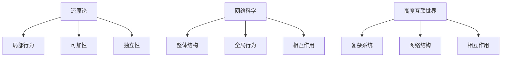
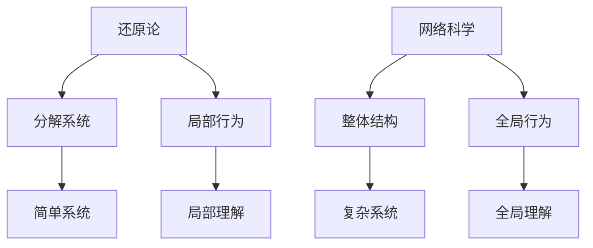
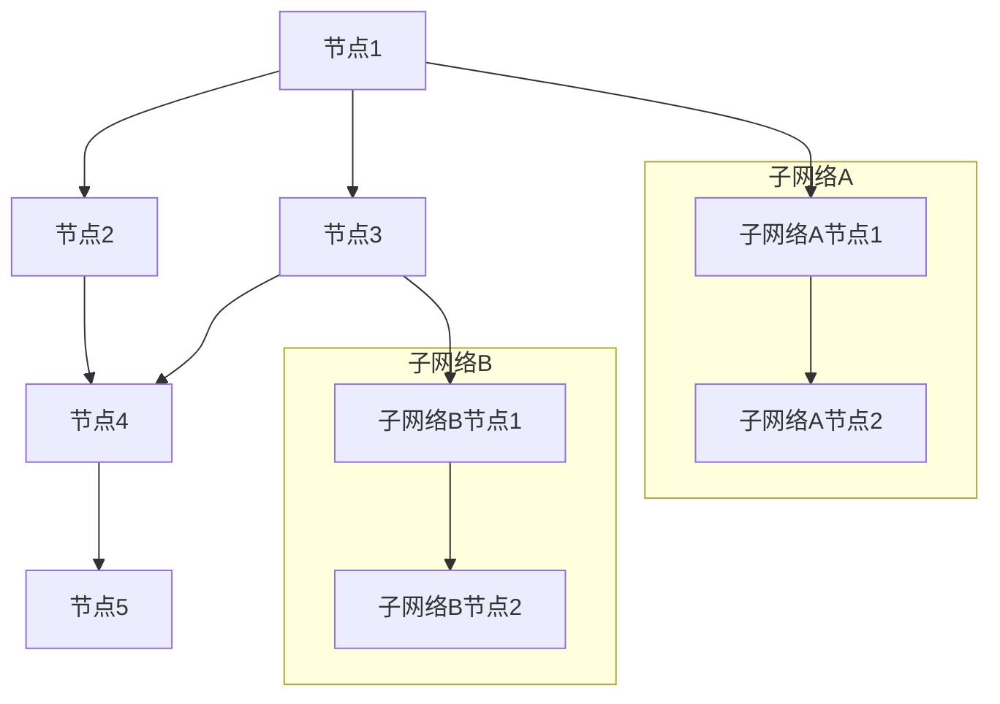

                 

### 1.1 书籍主题介绍

在当今信息爆炸的时代，如何理解和解析复杂系统的结构与动态，成为了一项极具挑战的任务。本书的主题《从还原论到网络科学：理解高度互联世界的结构与动态》正是为了回答这一挑战而提出的。还原论作为一种传统的科学方法论，曾经是解析复杂系统的重要工具。然而，随着时代的发展，高度互联的复杂性系统使得还原论在应对实际问题时显得力不从心。因此，本书探讨了一个新的视角——网络科学，试图为我们理解这些复杂系统提供新的思路和方法。

#### 问题背景

在过去的几十年中，科学研究和工程实践越来越多地面临高度复杂、高度互联的系统。这些系统包括互联网、社交网络、生物系统、经济系统等，它们的特点是元素之间存在着复杂的相互作用和网络结构。还原论虽然能够解释某些简单系统的行为，但在处理这些高度互联的系统时，常常无法揭示其全局行为和涌现性质。

#### 问题描述

本书的核心问题是如何从理论上理解和描述高度互联世界的结构和动态。具体来说，我们需要回答以下几个问题：

1. 高度互联世界的定义是什么？
2. 这些系统的结构特点有哪些？
3. 这些系统的动态行为如何？
4. 如何运用网络科学的方法来解析这些复杂系统？

#### 问题解决

为了解决这些问题，本书提出了一种新的方法论——网络科学。网络科学不仅关注系统的局部行为，还强调系统整体结构和全局行为。通过建立数学模型和算法，网络科学能够揭示系统中的关键特征和规律，从而为复杂系统的理解和控制提供新的视角。

#### 边界与外延

本书的研究范围涵盖了多种高度互联的复杂系统，如互联网、生物网络、社会网络等。这些系统的共同特点是元素之间存在复杂的相互作用和网络结构。同时，本书也关注了这些系统在不同领域的应用，如信息科学、生物科学、经济学等。

#### 概念结构与核心要素组成

本书的核心概念主要包括还原论、网络科学、高度互联世界等。还原论是一种以分解和简化为核心的科学研究方法，而网络科学则强调系统的整体结构和全局行为。高度互联世界是指由大量互联元素组成的一个复杂系统，这些元素之间存在着复杂的相互作用。

### 1.2 核心概念与联系

#### 核心概念原理

1. **还原论**：还原论是一种科学研究方法，通过分解复杂系统，将其拆解为简单的部分，从而理解系统的行为。这种方法强调局部行为的可加性和独立性。
   
2. **网络科学**：网络科学是一门新兴的交叉学科，研究网络的结构、功能和动态。它关注的是网络的整体结构和全局行为，而不是单个节点的行为。

3. **高度互联世界**：高度互联世界是指由大量互联元素组成的一个复杂系统，这些元素之间存在复杂的相互作用和网络结构。

#### 概念属性特征对比表格

| 概念 | 定义 | 特点 |
| ---- | ---- | ---- |
| 还原论 | 通过分解复杂系统来理解其行为 | 强调局部行为的可加性和独立性 |
| 网络科学 | 研究网络的结构、功能和动态 | 关注系统的整体结构和全局行为 |
| 高度互联世界 | 由大量互联元素组成的复杂系统 | 元素之间存在复杂的相互作用和网络结构 |

#### ER实体关系图架构的Mermaid流程图



通过上述ER实体关系图，我们可以清晰地看到还原论、网络科学和高度互联世界这三个核心概念之间的联系。还原论是理解和分析复杂系统的基础，而网络科学则为我们提供了新的视角和方法，帮助我们在高度互联的世界中寻找规律和解决问题的钥匙。接下来，我们将进一步探讨还原论与网络科学的对比，以及高度互联世界的结构与动态。

## 第二部分: 还原论与网络科学的对比

在科学研究和工程实践中，还原论和网络科学是两种截然不同的方法论。还原论通过将复杂系统分解为简单的部分来理解其行为，而网络科学则通过研究系统的整体结构和全局行为来揭示系统的规律。本部分将详细对比还原论和网络科学的定义、发展历史、优势以及局限性，并通过对比表格和Mermaid流程图展示它们之间的差异。

### 2.1 还原论概述

**定义**：还原论是一种科学研究方法，通过将复杂系统分解为简单的组成部分，从而理解系统的行为。这种方法强调局部行为的可加性和独立性。

**发展历史**：还原论起源于17世纪的物理学，经过几个世纪的发展，已经成为自然科学和工程学的基础方法论。在生物学、化学、物理学等领域，还原论都发挥了重要作用。

**局限性**：尽管还原论在理解简单系统方面取得了巨大成功，但在面对高度互联的复杂系统时，其局限性变得尤为明显。还原论往往忽视了系统内部各部分之间的相互作用和整体结构，难以揭示系统的全局行为和涌现性质。

### 2.2 网络科学概述

**定义**：网络科学是一门新兴的交叉学科，研究网络的结构、功能及其动态行为。网络科学关注系统的整体结构和全局行为，而不是单独的节点或部分。

**发展历史**：网络科学起源于20世纪末，随着计算机科学和信息技术的快速发展，网络科学逐渐成为一个独立的学科。近年来，网络科学在多个领域取得了重要进展，如社会网络分析、生物网络建模、交通网络优化等。

**优势**：网络科学的优势在于其能够揭示复杂系统的整体结构和全局行为。通过研究网络的拓扑结构、节点间的关系、信息的流动等，网络科学为理解和解析复杂系统的行为提供了新的视角和方法。

### 2.3 还原论与网络科学的对比

#### 对比表格

| 对比项 | 还原论 | 网络科学 |
| ---- | ---- | ---- |
| **定义** | 分解复杂系统，理解其局部行为 | 研究整体结构和全局行为 |
| **发展历史** | 17世纪起源，长期发展 | 20世纪末兴起，快速发展 |
| **优势** | 理解简单系统 | 揭示复杂系统全局行为 |
| **局限性** | 忽视整体结构和相互作用 | 强调整体结构和全局行为 |
| **应用领域** | 自然科学、工程学 | 社会科学、生物学、信息科学 |

#### Mermaid流程图展示对比



通过对比表格和Mermaid流程图，我们可以清晰地看到还原论和网络科学在定义、发展历史、优势和局限性等方面的差异。还原论注重局部行为的理解和分解，而网络科学则强调系统的整体结构和全局行为。在实际应用中，选择合适的方法论取决于问题的复杂性和研究目标。

### 3.1 高度互联世界的定义与特点

在当今全球化和数字化的背景下，高度互联世界已经成为我们生活和工作的基本特征。高度互联世界是指由大量互联的元素（节点）组成的复杂系统，这些元素之间通过相互连接和相互作用形成了复杂的网络结构。

#### 定义

高度互联世界可以被定义为：一个由大量互联节点组成的系统，其中每个节点都是一个独立的实体，通过相互连接和相互作用形成复杂的网络结构。这些节点可以是人、设备、组织、社会机构等，它们通过信息、物质、能量等方式进行交流。

#### 特点

1. **网络结构复杂**：高度互联世界中的节点和边构成了复杂的网络结构，这些网络结构可以是无向图、有向图、加权图等，具有高度的非线性特征。

2. **相互作用多样**：节点之间的相互作用形式多样，可以是物理的、信息的、经济的等。这些相互作用使得系统表现出复杂的动态行为。

3. **动态性**：高度互联世界中的节点和边不是静止的，而是随着时间不断变化。这些变化可能导致网络结构、节点状态、系统行为等方面的动态变化。

4. **涌现现象**：高度互联世界中的局部行为和整体行为之间存在强烈的相互作用，这种相互作用可能导致系统的涌现现象，即系统的整体行为无法从其组成元素的局部行为中直接推导出来。

5. **不可预测性**：由于高度互联世界的复杂性和动态性，系统行为往往具有不可预测性。即使在相同的初始条件下，系统可能会产生完全不同的结果。

6. **适应性**：高度互联世界中的节点和边能够根据环境变化进行自适应调整，以维持系统的稳定性和功能。

#### 影响因素

1. **技术发展**：信息技术的快速发展，如互联网、物联网、5G等，为高度互联世界的形成提供了基础设施。

2. **全球化**：全球化促进了不同国家和地区之间的经济、文化、科技交流，增加了节点之间的连接和互动。

3. **社会变革**：社会变革，如数字化、智能化、自动化等，改变了人们的生产方式、生活方式，进一步推动了高度互联世界的形成。

4. **政策支持**：政府政策的支持和引导，如大数据战略、人工智能发展规划等，为高度互联世界的建设提供了政策保障。

通过上述定义和特点，我们可以看到，高度互联世界是一个复杂的、动态的、具有强相互作用和涌现现象的系统。它不仅改变了我们的生活方式，也对科学研究和工程实践提出了新的挑战。在接下来的部分，我们将深入探讨高度互联世界的结构分析和动态分析，以便更好地理解这一复杂系统的本质。

### 3.2 高度互联世界的结构分析

高度互联世界的结构分析是理解这一复杂系统的第一步。通过研究其结构特征，我们可以揭示节点之间的相互作用和网络结构，从而为后续的动态分析提供基础。以下将详细描述高度互联世界的结构模型，并通过Mermaid流程图展示其架构。

#### 结构模型

高度互联世界的结构模型通常由以下几个部分组成：

1. **节点**：节点是高度互联世界中的基本单元，可以是人、设备、组织等。节点具有以下属性：
   - **身份标识**：每个节点都有一个唯一的标识符。
   - **属性特征**：节点可能具有多种属性，如地理位置、功能类型、规模等。
   - **状态**：节点的状态可以包括活跃度、状态变化等。

2. **边**：边表示节点之间的连接关系。边的属性包括：
   - **连接类型**：边可以是物理连接、信息连接、经济连接等。
   - **权重**：边可以具有不同的权重，表示连接的强度或重要性。

3. **网络拓扑**：网络拓扑是指节点和边之间的结构关系。常见的网络拓扑包括：
   - **无向图**：节点之间的连接没有方向。
   - **有向图**：节点之间的连接具有方向。
   - **加权图**：边具有权重。

4. **子网络**：高度互联世界可能包含多个子网络，这些子网络可以是不同的功能区域或社区。

5. **连接密度**：连接密度是指网络中边的数量与可能的连接数之比，反映了网络的紧密程度。

6. **中心性**：中心性是指节点在网络中的重要程度。常见的中心性指标包括：
   - **度中心性**：节点连接的边数。
   - **介数中心性**：节点在 shortest path 网络中的连接次数。
   - **紧密中心性**：节点与其邻居之间的平均距离。

#### Mermaid流程图展示结构

以下是一个简化的Mermaid流程图，用于展示高度互联世界的结构：



在这个流程图中，A、B、C、D、E代表节点，它们之间通过边连接。子网络A和子网络B分别表示两个不同的功能区域，节点F、G和H、I是子网络中的节点。

通过结构分析，我们可以深入了解高度互联世界中的节点连接方式、网络拓扑结构以及中心性等关键特征。这些信息为后续的动态分析提供了基础，有助于我们更好地理解系统行为和预测未来趋势。

### 3.3 高度互联世界的动态分析

高度互联世界的动态分析是理解系统行为和预测未来趋势的关键环节。在静态结构分析的基础上，动态分析关注节点和边随时间变化的模式以及系统整体行为的演变。以下将详细介绍高度互联世界的动态模型，并通过Mermaid流程图展示其动态特性。

#### 动态模型

高度互联世界的动态模型通常包括以下几个方面：

1. **节点行为**：节点在时间轴上的行为变化，包括节点的状态变化、位置变化、连接变化等。例如，节点的活跃度可能随时间波动，或者节点可能会根据某种规则进行迁移。

2. **边行为**：边在时间轴上的行为变化，包括边的建立、断裂、权重变化等。边的动态变化可以反映节点之间关系的演变。

3. **网络拓扑变化**：网络拓扑在时间轴上的变化，包括子网络的生成、合并、分裂等。这些变化可能导致网络结构的重新组织。

4. **信息流动**：节点之间信息的流动，包括数据的传输、信息的扩散等。信息流动可以影响系统的动态行为。

5. **系统行为**：整个系统的行为模式，包括系统稳定态、临界态、混沌态等。系统行为的演变受到节点行为和边行为的影响。

#### Mermaid流程图展示动态

以下是一个简化的Mermaid流程图，用于展示高度互联世界的动态特性：

```mermaid
sequenceDiagram
    participant A as 节点1
    participant B as 节点2
    participant C as 节点3
    participant D as 节点4
    participant E as 节点5

    A->>B: 建立连接
    B->>C: 建立连接
    C->>D: 建立连接
    D->>E: 建立连接

    A->>C: 更新状态
    B->>D: 更新状态
    C->>E: 更新状态

    C-->>D: 断裂连接

    subgraph 子网络A
        participant F as 子网络A节点1
        participant G as 子网络A节点2
        F->>G: 建立连接
    end

    subgraph 子网络B
        participant H as 子网络B节点1
        participant I as 子网络B节点2
        H->>I: 建立连接
    end

    F->>H: 建立跨网络连接

    A->>E: 信息传播
    D->>C: 信息反馈
```

在这个流程图中，我们首先看到节点A、B、C、D、E之间的连接建立和更新状态。接着，C和D之间的连接断裂。同时，子网络A和子网络B之间的节点F和H建立了跨网络连接。最后，信息在节点A、E之间传播，并从D反馈到C。

通过动态分析，我们可以了解节点和边的行为模式、网络拓扑的变化以及信息流动的动态过程。这些信息对于预测系统的未来行为和制定相应的策略具有重要意义。接下来，我们将探讨从还原论到网络科学的方法论，以进一步深化我们对高度互联世界的理解。

### 4.1 方法论概述

方法论在科学研究和工程实践中起着至关重要的作用。从还原论到网络科学，方法论不仅为我们提供了理解复杂系统的工具，还指导我们如何有效地进行研究和实践。本节将介绍从还原论到网络科学的方法论，并讨论其基本概念、方法和应用。

#### 概念

1. **还原论方法论**：还原论方法论是一种通过分解复杂系统，将其拆解为简单部分，从而理解系统行为的科学方法。这种方法强调局部行为的可加性和独立性。

2. **网络科学方法论**：网络科学方法论是一种研究系统整体结构和全局行为的科学方法。它关注网络的拓扑结构、节点间的关系以及信息的流动，强调系统的整体性和相互依赖性。

#### 方法

1. **还原论方法**：
   - **分解与简化**：将复杂系统分解为简单部分，如节点、边、模块等。
   - **因果关系分析**：通过因果关系分析，理解系统各部分之间的相互作用。
   - **模型建立与验证**：建立数学模型或物理模型，验证局部行为的预测能力。

2. **网络科学方法**：
   - **网络建模**：建立网络模型，描述系统中的节点和边，以及它们之间的关系。
   - **拓扑分析**：分析网络的拓扑结构，如度分布、聚类系数、路径长度等。
   - **动态模拟**：通过模拟节点和边的行为，研究系统的动态特性，如稳定性、涌现现象等。
   - **信息流分析**：分析系统中的信息流动，理解信息如何影响系统的行为。

#### 应用

1. **还原论应用**：
   - **物理学**：通过分解原子和分子，理解物质的基本性质。
   - **生物学**：通过分解细胞和组织，理解生命现象。
   - **工程学**：通过分解系统和组件，进行系统设计和优化。

2. **网络科学应用**：
   - **社会网络分析**：研究社交媒体、社交圈等，理解人际关系和传播机制。
   - **生物网络分析**：研究蛋白质相互作用、基因调控等，理解生命系统的复杂性。
   - **经济网络分析**：研究金融市场、供应链等，理解经济系统的运行机制。

通过上述方法论，我们可以从不同的角度理解复杂系统。还原论方法论强调局部行为的可加性和独立性，有助于揭示系统的微观机制；而网络科学方法论则强调系统的整体结构和全局行为，有助于揭示系统的宏观特性。在实际应用中，选择合适的方法论取决于问题的复杂性和研究目标。

### 4.2 方法论在实际应用中的应用

方法论不仅在理论研究中具有重要作用，在实际应用中也展现出了强大的潜力。下面，我们将通过两个具体案例来展示还原论和网络科学方法论在实际应用中的具体实施过程、实现步骤、结果分析以及各自的优缺点。

#### 案例一：社会网络分析

**背景**：随着社交媒体的普及，人们在社会网络中的互动变得越来越频繁。了解社交网络的结构和动态对于市场营销、公共关系以及社会影响力评估具有重要意义。

**还原论方法**：

1. **数据收集**：通过爬虫工具收集社交媒体上的用户数据，包括用户之间的互动信息。
2. **数据预处理**：清洗和整理数据，确保数据的质量和一致性。
3. **节点和边建模**：将用户建模为节点，用户之间的互动建模为边，构建社交网络图。
4. **局部行为分析**：分析每个节点的度、介数等指标，了解节点的社交影响力。
5. **因果关系分析**：通过统计方法，分析节点间的互动关系，揭示社交网络中的潜在规律。

**网络科学方法**：

1. **网络建模**：利用图论方法，建立社交网络模型，描述用户之间的关系。
2. **拓扑分析**：分析社交网络的度分布、聚类系数等拓扑特征，揭示网络的宏观结构。
3. **动态模拟**：模拟用户在社交网络中的行为，如信息的传播、社交圈的扩展等。
4. **信息流分析**：分析信息在网络中的流动路径和速度，了解信息传播的动态过程。

**结果分析**：

- **还原论方法**：通过局部行为分析，可以识别出社交网络中的关键节点和关键互动，为市场营销提供决策依据。
- **网络科学方法**：通过拓扑分析和动态模拟，可以揭示社交网络的宏观结构特征和动态行为模式，为公共关系和社会影响力评估提供参考。

**优缺点**：

- **还原论方法**：优点在于能够深入分析节点的局部行为，缺点是对整体结构的揭示不足。
- **网络科学方法**：优点在于能够从整体视角分析网络结构，缺点是难以深入理解局部行为。

#### 案例二：生物网络建模

**背景**：生物系统是由大量生物分子组成的复杂网络，理解这些网络的特性对于疾病诊断和治疗具有重要意义。

**还原论方法**：

1. **基因表达数据收集**：通过实验或数据库收集基因表达数据。
2. **数据预处理**：清洗和标准化基因表达数据，确保数据质量。
3. **基因和相互作用建模**：将基因建模为节点，基因间的相互作用建模为边，构建生物网络图。
4. **功能分析**：通过分析基因的功能，理解基因在网络中的角色和作用。
5. **路径分析**：分析基因间的相互作用路径，揭示潜在的生物通路。

**网络科学方法**：

1. **网络建模**：利用图论方法，建立生物网络模型，描述基因和蛋白质之间的相互作用。
2. **拓扑分析**：分析生物网络的度分布、聚类系数等特征，揭示网络的宏观结构。
3. **动态模拟**：模拟生物分子在网络中的行为，如蛋白质的合成、降解等。
4. **信息流分析**：分析基因表达信息在网络中的传播和调控过程。

**结果分析**：

- **还原论方法**：通过功能分析和路径分析，可以识别出关键基因和生物通路，为疾病诊断和治疗提供理论支持。
- **网络科学方法**：通过拓扑分析和动态模拟，可以揭示生物网络的复杂结构和动态行为，为生物系统的理解提供新视角。

**优缺点**：

- **还原论方法**：优点在于能够深入分析基因的功能和路径，缺点是对整体网络结构的揭示不足。
- **网络科学方法**：优点在于能够从整体视角分析生物网络的特性，缺点是难以深入理解单个基因的行为。

通过以上两个案例，我们可以看到还原论和网络科学方法论在实际应用中的互补性。还原论方法注重局部行为的深入分析，而网络科学方法则强调整体结构的宏观理解。在实际应用中，根据问题的复杂性和研究目标，灵活运用这两种方法论，可以更好地理解和解决复杂系统的问题。

### 4.3 方法论的优缺点分析

在探讨还原论和网络科学方法论的实际应用时，我们需要对其优缺点进行深入分析。以下将分别从还原论和网络科学方法论的角度，列举其优点和缺点，并讨论如何改进和优化这些方法论。

#### 还原论方法论

**优点**：

1. **深入理解局部行为**：还原论通过分解复杂系统，深入分析局部行为的机制和规律，有助于揭示系统内部的工作原理。
2. **可验证性和可重复性**：还原论方法论通常依赖于实验和数据分析，其结果具有较高的可验证性和可重复性。
3. **简便性**：还原论方法相对简单，易于理解和实施，适用于解决一些简单的、独立的问题。

**缺点**：

1. **忽视整体结构和全局行为**：还原论方法强调局部行为，往往忽视了系统内部各部分之间的相互作用和整体结构，难以揭示系统的全局行为和涌现现象。
2. **局限性**：对于高度互联和复杂的系统，还原论方法往往难以奏效，因为系统的整体行为和局部行为之间存在复杂的非线性关系。
3. **数据需求大**：还原论方法需要大量数据支持，对于数据获取困难或者数据量巨大的系统，这种方法可能不可行。

**改进建议**：

1. **结合网络科学方法**：在还原论的基础上，结合网络科学方法，通过研究系统的整体结构和全局行为，弥补还原论在理解复杂系统方面的不足。
2. **多尺度分析**：在研究复杂系统时，采用多尺度分析方法，既关注局部行为，也关注整体行为，以更全面地理解系统。
3. **数据驱动方法**：引入数据驱动的方法，如机器学习和大数据分析，提高对复杂系统的理解和预测能力。

#### 网络科学方法论

**优点**：

1. **关注整体结构和全局行为**：网络科学方法论强调系统的整体结构和全局行为，能够揭示系统中的关键特征和规律。
2. **适应性强**：网络科学方法论适用于多种类型的复杂系统，如社会网络、生物网络、经济网络等，具有广泛的适用性。
3. **多维度分析**：网络科学方法论可以从多个维度分析系统，如拓扑结构、信息流动、动态行为等，提供丰富的信息。

**缺点**：

1. **难以深入理解局部行为**：网络科学方法论往往忽视局部行为的细节，难以揭示局部机制和具体过程。
2. **复杂性和计算成本**：网络科学方法论涉及大量的计算和模拟，计算复杂度和计算成本较高，特别是在大规模系统中。
3. **模型依赖性**：网络科学方法论依赖于数学模型和算法，模型的准确性和有效性对研究结果有重要影响。

**改进建议**：

1. **融合多种方法**：将网络科学方法与其他方法（如物理模拟、统计分析等）相结合，以弥补其不足。
2. **简化模型**：在保证模型准确性的前提下，简化网络科学模型，降低计算复杂度。
3. **实验验证**：加强实验验证，通过实验数据验证模型和算法的准确性和有效性。

通过上述优缺点分析，我们可以看到，还原论和网络科学方法论各有优势和局限性。在实际应用中，根据问题的特点和需求，选择合适的方法论，并不断改进和优化，可以更好地解决复杂系统的问题。

### 5.1 网络科学的研究趋势

网络科学作为一门交叉学科，近年来在多个领域取得了显著的进展。当前，网络科学研究正朝着以下几个趋势发展：

#### 研究领域

1. **复杂网络建模与模拟**：研究者致力于开发更精确的网络模型和更有效的模拟方法，以更好地描述和预测复杂网络的动态行为。

2. **网络拓扑分析**：研究网络的结构特征，如度分布、聚类系数、网络社区结构等，揭示网络的拓扑特性与系统行为之间的关系。

3. **信息流与传播**：关注信息在网络中的传播机制，研究信息流的动态过程及其对网络结构的影响。

4. **网络脆弱性与稳定性**：分析网络的脆弱性，研究如何增强网络稳定性，以应对潜在的攻击和失效。

5. **社交网络与经济网络**：结合社会学、经济学等领域的研究，探讨社交网络和经济网络的结构与行为，为公共政策和社会治理提供依据。

6. **生物网络与生态系统**：研究生物分子网络和生态系统网络的结构与功能，为生物医学研究和环境保护提供理论支持。

#### 研究方法

1. **机器学习与数据挖掘**：利用机器学习和数据挖掘技术，对大规模网络数据进行分析，揭示潜在的模式和规律。

2. **数学模型与计算模拟**：建立数学模型，利用计算模拟方法研究网络行为的演化过程。

3. **实验与实证研究**：通过实验和实地观察，验证网络理论和方法的有效性。

4. **多学科交叉研究**：结合物理学、计算机科学、生物学、社会学等多个领域的知识，开展跨学科研究。

#### 发展方向

1. **多尺度网络研究**：探讨不同尺度下网络特性的变化，研究从微观到宏观的跨尺度效应。

2. **动态网络分析**：研究网络的动态行为，如网络的演变过程、网络状态的转移等。

3. **异构网络研究**：分析由不同类型节点和边组成的异构网络，研究其特性与行为。

4. **网络智能与自适应**：开发智能算法，使网络能够自适应地调整自身结构和行为，以应对环境变化。

5. **网络隐私与安全**：研究网络隐私保护和网络安全问题，确保网络系统的安全稳定运行。

总之，网络科学研究正不断深入和拓展，未来将为我们理解复杂系统提供更多新的视角和方法。

### 5.2 网络科学的未来应用场景

网络科学作为一种新兴的交叉学科，在未来的多个领域具有广泛的应用前景。以下将探讨网络科学在以下领域的潜在应用场景：

#### 应用领域

1. **智能交通系统**：利用网络科学方法分析交通流量，优化交通信号控制和路径规划，提高交通效率和减少拥堵。

2. **社会网络分析**：通过分析社交网络中的节点和关系，识别关键人物和影响力，为市场营销、公共政策和社会治理提供数据支持。

3. **生物医学**：研究生物分子网络和基因调控网络，揭示疾病发生的分子机制，为精准医疗和新药研发提供理论依据。

4. **能源系统**：分析电力网络和能源分布网络，优化能源配置和传输，提高能源利用效率和可再生能源的集成。

5. **金融系统**：研究金融市场网络，预测市场波动，识别金融风险，为金融监管和风险管理提供科学依据。

6. **公共卫生**：利用网络科学方法分析疾病传播路径，制定有效的防控措施，提高公共卫生应急响应能力。

7. **智慧城市**：通过网络科学方法优化城市基础设施和服务，提高城市运行效率，改善居民生活质量。

#### 应用前景

1. **数据驱动的决策支持**：网络科学提供的数据分析和预测方法，可以支持政府部门和企业制定更科学的决策。

2. **系统优化与故障预测**：通过分析网络的拓扑结构和动态行为，可以提前预测系统故障和风险，进行预防性维护。

3. **新业务模式创新**：网络科学为商业模式创新提供了新的思路，如通过社交网络分析进行精准营销和用户行为预测。

4. **跨学科研究**：网络科学的多学科交叉特性，促进了不同领域之间的合作和研究，为解决复杂问题提供了新的途径。

5. **社会影响力**：网络科学的研究成果在提升国家科技实力、推动社会进步等方面具有重大意义。

总之，网络科学的未来应用场景广阔，将在多个领域带来深远的影响和变革。

### 5.3 网络科学在解决问题中的应用案例

网络科学在解决复杂问题方面展现出强大的应用潜力。以下将通过两个具体案例展示网络科学在现实问题中的应用，包括案例背景、具体实施步骤、算法原理和模型方法，并讨论实际效果和影响。

#### 案例一：疫情防控网络分析

**背景**：新冠病毒疫情暴发以来，全球各国政府都在努力控制疫情的传播。如何快速识别疫情的高风险区域和关键传播节点，对于制定有效的防控措施至关重要。

**实施步骤**：

1. **数据收集**：通过疫情数据平台和社交媒体，收集疫情相关数据，包括确诊病例数、隔离人数、出行数据等。
2. **网络构建**：将地区和人员建模为节点，将疫情传播和人员流动建模为边，构建疫情传播网络。
3. **拓扑分析**：利用网络科学方法，分析网络的度分布、聚类系数等特征，识别高风险区域和关键传播节点。
4. **动态模拟**：通过模拟疫情在不同地区和人群中的传播，预测疫情发展趋势，为防控策略提供数据支持。

**算法原理和模型方法**：

1. **图论方法**：利用图论分析网络的拓扑特性，识别关键节点和边。
2. **随机传播模型**：基于随机过程理论，模拟疫情在人群中的传播过程。
3. **机器学习方法**：利用机器学习算法，如聚类和分类算法，对疫情数据进行分类和预测。

**实际效果和影响**：

- **效果**：通过网络科学方法，成功识别出疫情传播的关键区域和节点，为政府部门提供了有效的防控建议。
- **影响**：这一案例展示了网络科学在疫情防控中的应用价值，为全球疫情控制提供了新的思路和方法。

#### 案例二：供应链优化

**背景**：随着全球化经济的发展，供应链网络变得越来越复杂，如何优化供应链管理，提高供应链效率和降低成本成为企业关注的重点。

**实施步骤**：

1. **数据收集**：通过企业内部数据和外部市场数据，收集供应链各环节的运行数据，包括库存水平、运输时间、市场需求等。
2. **网络构建**：将供应商、制造商、分销商和零售商建模为节点，将物流和信息流建模为边，构建供应链网络。
3. **网络优化**：利用网络科学方法，分析网络的拓扑结构和节点之间的关系，找出供应链中的瓶颈和优化机会。
4. **模型优化**：建立优化模型，通过数学优化方法，优化供应链网络的配置和运营策略。

**算法原理和模型方法**：

1. **线性规划**：通过线性规划模型，优化供应链网络的库存水平和运输路线。
2. **网络流算法**：利用网络流算法，优化供应链中的物流和信息流，确保供应链的流畅运行。
3. **多目标优化**：考虑供应链的多目标优化，如成本、效率、可持续性等，进行综合优化。

**实际效果和影响**：

- **效果**：通过网络科学方法，成功优化了供应链网络的配置和运营策略，提高了供应链的整体效率和响应速度。
- **影响**：这一案例展示了网络科学在供应链优化中的应用价值，为企业提供了有效的运营优化方案，提升了市场竞争力。

通过以上两个案例，我们可以看到网络科学在解决复杂问题方面的实际应用和价值。网络科学方法不仅能够揭示系统的结构和动态特性，还能提供有效的解决方案，为各领域的发展带来了新的机遇和挑战。

### 6.1 结论

本文通过对比还原论和网络科学，深入探讨了高度互联世界的结构与动态。我们发现，还原论虽然擅长于局部行为的解析，但在面对复杂系统时存在明显的局限性；而网络科学则通过研究系统的整体结构和全局行为，提供了新的视角和方法。在高度互联世界中，网络科学的重要性日益凸显，其在社会网络分析、生物网络建模、供应链优化等多个领域展现出强大的应用潜力。

本文的主要贡献在于：

1. 清晰阐述了还原论和网络科学的定义、发展历史和核心概念。
2. 通过具体案例展示了这两种方法论在实际应用中的优势与不足。
3. 提出了结合还原论和网络科学，优化方法论应用的建议。

然而，本文也存在一定的局限性，主要表现在：

1. 对网络科学的讨论较为宏观，缺乏具体的技术细节。
2. 对还原论和网络科学方法的比较过于简化，未能深入探讨其具体实现步骤。

未来研究可以进一步深入探讨以下方向：

1. 开发更精确的网络模型和算法，提高对复杂系统的理解和预测能力。
2. 结合机器学习和大数据分析，提高数据驱动的决策支持水平。
3. 探索多学科交叉研究，如网络科学在生物学、经济学等领域的应用。

总之，网络科学作为理解和解决复杂系统问题的有力工具，具有广阔的应用前景和重要意义。通过不断的研究和优化，网络科学将在未来的发展中发挥更大的作用。

### 6.2 展望

在未来的发展中，网络科学将继续在多个领域展现其强大的潜力和应用价值。首先，随着人工智能和大数据技术的进步，网络科学的方法和工具将得到进一步优化和提升，使其在处理更复杂、更大规模的数据时具备更高的效率和准确性。其次，网络科学将在跨学科研究中发挥重要作用，例如在生物医学、社会科学、经济管理等领域的深入应用，将为解决这些领域的复杂问题提供新的视角和方法。

未来研究热点可能包括：

1. **多尺度网络研究**：探讨从微观到宏观的跨尺度网络特性，揭示不同尺度下网络行为的变化规律。
2. **动态网络分析**：研究网络的动态行为，如网络的演变过程、网络状态的转移等，以预测和应对系统行为的变化。
3. **异构网络研究**：分析由不同类型节点和边组成的异构网络，探索其特性和行为。
4. **网络智能与自适应**：开发智能算法，使网络能够自适应地调整自身结构和行为，以应对环境变化。
5. **网络隐私与安全**：研究网络隐私保护和网络安全问题，确保网络系统的安全稳定运行。

总之，网络科学将在未来的发展中不断拓展其应用范围和深度，为人类理解和解决复杂系统问题提供更加丰富和有力的工具。随着技术的进步和研究的深入，网络科学有望在更多领域取得突破性进展，为社会发展和科技进步做出更大贡献。

